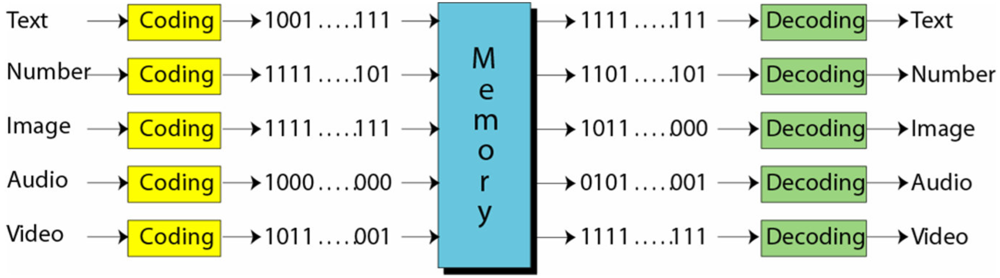

# CT21--走码观花

## 位与字节

**位（bit）**是计算机中最小的数据单位，只能取值 0 或 1，通常用于表示某种状态，例如：1 表示开关接通，0 表示断开。位可以组成序列来表示各种数据，这个由 0 和 1 组成的序列就称为 **位模式**。当位数为 8 时，这个序列被称为 **1 字节（byte）**。

计算机外部的各种数据类型（Text, Number, Image, Audio, Video）在存储前，都会转换为统一的表示形式，再存入计算机；输出时再将其还原。这种通用的表示形式称为 **位模式（bit pattern）**。

不同数据类型的存储方式如下图所示：（注：图片来源为 Behrouz Forouzan，2008年12月）

任何集合，由各种符号组成，而每个符号都可以用一个位模式表示。表示一个符号所需的位数取决于该语言中符号的总数量，如下表所示。

| 符号数量 | 位模式长度 |
| -------- | ------------ |
| 2        | 1            |
| 4        | 2            |
| 8        | 3            |
| 16       | 4            |
| 256      | 8            |
| 65536    | 16           |

为了让符号与位模式一一对应，人们设计了不同的 **代码表**，这种将符号映射为位模式的过程称为**编码**。
