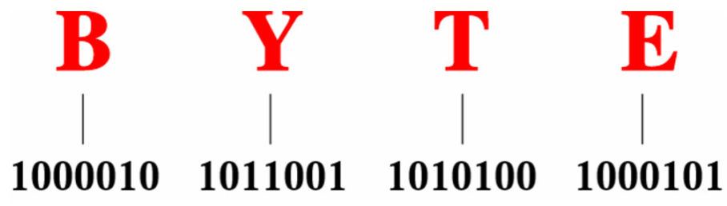

# CT04--字符编码

$$\color{red}{维特根斯坦在《逻辑哲学论》中说:“语言的界限意味着我的世界的界限”，浓缩成五个字就是：语言即世界。}$$

## ASCII编码

美国国家标准协会（ANSI）发布的 **ASCII（American Standard Code for Information Interchange）** 是最早也是最经典的编码表之一。ASCII 使用 7 位二进制数来表示字符，可表示 2^7^ = 128 种符号，包括 26 个大写字母、26 个小写字母、数字、标点符号以及控制字符等。有了ASCII编码表之后，计算机就可以通过查表完成二进制数到字符的转换。



$$\color{blue}{图：大写字母的二进制位模式表示}$$

如果编程语言的注释使用英文，那么 ASCII 中的字符已经足够。
需要注意的是，ASCII 的前 32 个代码（0–31）是**控制字符**，用于设备控制而不是打印内容，例如：

- 10：换行（Line Feed）
- 13：回车（Carriage Return）
- 27：转义（Escape）

此外，48–57 表示数字 0–9，65–90 表示大写字母 A–Z，97–122 表示小写字母 a–z。只要记住==大写字母的编码在小写字母之前==，就能大致推断出字符对应的十进制值。


$$\color{blue}{图：ASCII代码表（注：图片来源为 lookuptables.com。增加了两条横线和三个矩形框，用来突出重点部分）}$$

### 在Python中查看ASCII表

在 Python 中，可以快速查看 ASCII 表：

```python
import string
print(string.printable)
print(repr(string.printable))
print(string.ascii_lowercase)
print(string.ascii_uppercase)
```

输出结果为：

```text
0123456789abcdefghijklmnopqrstuvwxyzABCDEFGHIJKLMNOPQRSTUVWXYZ!"#$%&'()*+,-./:;<=>?@[\]^_`{|}~


'0123456789abcdefghijklmnopqrstuvwxyzABCDEFGHIJKLMNOPQRSTUVWXYZ!"#$%&\'()*+,-./:;<=>?@[\\]^_`{|}~ \t\n\r\x0b\x0c'
abcdefghijklmnopqrstuvwxyz
ABCDEFGHIJKLMNOPQRSTUVWXYZ
```

其中：
- `string.printable` 返回所有可打印字符（数字、字母、标点和空白符）
- repr() 是 内置函数，用于获取对象的 “官方”字符串表示形式（representation），通常这个表示是明确的、无歧义的。主要用途：查看字符串中不可见字符（如换行符、制表符等）
- 这些在 `repr()` 中都以**转义序列**的形式清晰显示出来，不会“隐身”。
  - `\t` 是制表符（Tab）
  - `\n` 是换行
  - `\r` 是回车
  - `\x0b` 是垂直制表符（`\v`）
  - `\x0c` 是换页符（`\f`）

### ASCII 的结构特性

- 数字 0–9 的二进制编码统一以 `0011` 开头。
- 大写字母与小写字母的编码在二进制模式上只相差 **一个位**（`00100000`，即 0x20h），这使得大小写转换可以通过简单的位运算实现。

例如，将 ASCII 大写字母转换为小写字母，可以“打开”这一位（按位 OR 操作）：

```python
'''
        01000001 = 41h = ASCII upper-case letter 'A'
OR      00100000 = 20h <-- this is the bit we want turned on
				--------
EQUALS  01100001 = 61h = ASCII lower-case letter 'a'
'''
# 'A' 转换为 'a'
uppera = ord('A')
lowera = uppera | 0x20      # bitwise OR with 20h 
print(chr(lowera))          # 输出: a

lowera = uppera  |  (1<<5)
print(chr(lowera))          # 输出: a

# 'a' 转换为 'A'
lowera = ord('a')
uppera = lowera  &  ~0x20   # bitwise AND with 10111111
print(chr(uppera))          # 输出: A

uppera = lowera  &  ~(1<<5)
print(chr(uppera))          # 输出: A
```

这种位级操作在大小写搜索、比较等场景中非常高效。	

!!! note EASCII码

    然而，**ASCII 码仅能够表示英文**。随着计算机的全球化，诞生了一种能够表示更多语言的 <u>EASCII</u> 字符集。它在 ASCII 的 7 位基础上扩展到 8 位，能够表示 256 个不同的字符。

    在世界范围内，陆续出现了一批适用于不同地区的 EASCII 字符集。这些字符集的前 128 个字符统一为 ASCII 码，后 128 个字符定义不同，以适应不同语言的需求。

    后来人们发现，**EASCII 码仍然无法满足许多语言的字符数量要求**。比如汉字有近十万个，光日常使用的就有几千个。

## 汉字编码：GB2312/GBK/GB18030

GB2312、GBK、GB18030是中国制定的**汉字编码字符集标准**，用于简体中文及多语言信息处理，三者呈递进扩展关系，核心差异在于字符覆盖范围和编码方式：

1. GB2312（1980年，基础集）​

   - 全称：《信息交换用汉字编码字符集·基本集》（GB2312-80）。
   - 编码方式：双字节编码（区码+位码，范围0xA1A1-0xFEFE），兼容ASCII（单字节）。
   - 收录字符：6763个简体汉字（含一级3755个常用字、二级3008个次常用字）、拉丁字母、希腊字母、日文假名等共7445个字符。
   - 特点：中国首个系统化汉字编码标准，奠定简体中文信息处理基础，但仅覆盖常用字，无繁体、生僻字。

2. GBK（1995年，扩展集）​

   - 全称：《汉字内码扩展规范》（GBK 1.0）。
   - 编码方式：双字节编码，向下兼容GB2312，扩展编码范围（0x8140-0xFEFE）。
   - 收录字符：21003个汉字（含简体、繁体、日韩汉字“传承字”）、符号、图形字符，覆盖99%以上中文使用场景。
   - 特点：非国家标准（但被Windows等系统广泛采用为默认中文编码），解决GB2312字符不足问题，成为20世纪后期中文软件主流编码。

3. GB18030（2000/2005年，国家标准）​

   - 全称：《信息技术 中文编码字符集》（GB18030-2000/2005）。
   - 编码方式：变长编码（单字节兼容ASCII、双字节兼容GBK、四字节扩展），四字节对应Unicode扩展区（U+10000-U+10FFFF）。
   - 收录字符：超7万个字符，包括GB2312/GBK全部字符、少数民族文字（藏、蒙、维等）、日韩汉字、 Unicode 3.0+字符，支持全汉字覆盖（含生僻字、古汉字）。
   - 特点：中国强制性国家标准，全面兼容前两者，支持国际化（通过四字节映射Unicode），现为政务、金融等领域法定编码。

!!! note 演进关系​

    GB2312（基础）→ GBK（扩展双字节）→ GB18030（变长编码+全字符覆盖），逐步从“简体常用字”扩展到“全汉字+多民族文字+国际兼容”，满足中文信息化从基础到全面的需求。

## Unicode编码

随着计算机技术的蓬勃发展，字符集与编码标准百花齐放，而这带来了许多问题。一方面，这些字符集一般只定义了特定语言的字符，无法在多语言环境下正常工作。另一方面，同一种语言存在多种字符集标准，如果两台计算机使用的是不同的编码标准，则在信息传递时就会出现乱码。

那个时代的研究人员就在想：**如果推出一个足够完整的字符集，将世界范围内的所有语言和符号都收录其中，不就可以解决跨语言环境和乱码问题了吗**？在这种想法的驱动下，一个大而全的字符集 Unicode 应运而生。

<u>Unicode</u> 的中文名称为“统一码”，理论上能容纳 100 多万个字符。它致力于将全球范围内的字符纳入统一的字符集之中，提供一种通用的字符集来处理和显示各种语言文字，减少因为编码标准不同而产生的乱码问题。

自 1991 年发布以来，Unicode 不断扩充新的语言与字符。截至 2022 年 9 月，Unicode 已经包含 149186 个字符，包括各种语言的字符、符号甚至表情符号等。在庞大的 Unicode 字符集中，常用的字符占用 2 字节，有些生僻的字符占用 3 字节甚至 4 字节。

Unicode 是一种通用字符集，本质上是给每个字符分配一个编号（称为“码点”），**但它并没有规定在计算机中如何存储这些字符码点**。我们不禁会问：当多种长度的 Unicode 码点同时出现在一个文本中时，系统如何解析字符？例如给定一个长度为 2 字节的编码，系统如何确认它是一个 2 字节的字符还是两个 1 字节的字符？

对于以上问题，**一种直接的解决方案是将所有字符存储为等长的编码**。如下图所示，“Hello”中的每个字符占用 1 字节，“算法”中的每个字符占用 2 字节。我们可以通过高位填 0 将“Hello 算法”中的所有字符都编码为 2 字节长度。这样系统就可以每隔 2 字节解析一个字符，恢复这个短语的内容了。


然而 ASCII 码已经向我们证明，编码英文只需 1 字节。若采用上述方案，英文文本占用空间的大小将会是 ASCII 编码下的两倍，非常浪费内存空间。因此，我们需要一种更加高效的 Unicode 编码方法。


### 希腊字母

希腊字母在科学、数学、工程等领域中广泛使用，Unicode 为它们分配了专门的代码点。

### Emoji编码

彩色表情符号（Emoji）是 Unicode 标准中定义的字符（如 😊、🚀、🌟），大部分现代系统（Windows/macOS/Linux）、编辑器（VS Code/Typora）和平台（GitHub/语雀/Notion）均支持直接显示彩色 Emoji。输入 Emoji 本质是输入对应的 Unicode 字符。

😊 👍 🚀 🌟 🔴 🟢 🟡 ❤️ ✨ 🎉 📚 💻 🌍 🦜 🐧 🦁 🐘 🦉 🍎 🍕 🚗 ✈️ 🏠 🌳 🌊 ☀️ 🌙 ⭐ 💡 ❗ 🔔 📌 🔑 💼 🎯 🏆 🎈

部分 Markdown 平台（如 GitHub、GitLab、Discord）支持用 :别名:​ 格式输入 Emoji（本质是平台内置别名映射，自动转换为 Emoji 字符）。
- `:+1:`👍
- `:smile:`😊
- `:rocket:`🚀
- `:star:`⭐
- `:heart:`❤️
- `:fire:`🔥
- `:warning:`⚠️
- `:bulb:`💡
- `:earth_africa:`🌍
- `:computer:`💻


## UTF-8 编码

目前，UTF-8 已成为国际上使用最广泛的 Unicode 编码方法。**它是一种可变长度的编码**，使用 1 到 4 字节来表示一个字符，根据字符的复杂性而变。ASCII 字符只需 1 字节，拉丁字母和希腊字母需要 2 字节，常用的中文字符需要 3 字节，其他的一些生僻字符需要 4 字节。

UTF-8 的编码规则并不复杂，分为以下两种情况。

- 对于长度为 1 字节的字符，将最高位设置为 $0$ ，其余 7 位设置为 Unicode 码点。值得注意的是，ASCII 字符在 Unicode 字符集中占据了前 128 个码点。也就是说，**UTF-8 编码可以向下兼容 ASCII 码**。这意味着我们可以使用 UTF-8 来解析年代久远的 ASCII 码文本。
- 对于长度为 $n$ 字节的字符（其中 $n > 1$），将首个字节的高 $n$ 位都设置为 $1$ ，第 $n + 1$ 位设置为 $0$ ；从第二个字节开始，将每个字节的高 2 位都设置为 $10$ ；其余所有位用于填充字符的 Unicode 码点。

下图展示了“Hello算法”对应的 UTF-8 编码。观察发现，由于最高 $n$ 位都设置为 $1$ ，因此系统可以通过读取最高位 $1$ 的个数来解析出字符的长度为 $n$ 。

但为什么要将其余所有字节的高 2 位都设置为 $10$ 呢？实际上，这个 $10$ 能够起到校验符的作用。假设系统从一个错误的字节开始解析文本，字节头部的 $10$ 能够帮助系统快速判断出异常。

之所以将 $10$ 当作校验符，是因为在 UTF-8 编码规则下，不可能有字符的最高两位是 $10$ 。这个结论可以用反证法来证明：假设一个字符的最高两位是 $10$ ，说明该字符的长度为 $1$ ，对应 ASCII 码。而 ASCII 码的最高位应该是 $0$ ，与假设矛盾。


除了 UTF-8 之外，常见的编码方式还包括以下两种。

- **UTF-16 编码**：使用 2 或 4 字节来表示一个字符。所有的 ASCII 字符和常用的非英文字符，都用 2 字节表示；少数字符需要用到 4 字节表示。对于 2 字节的字符，UTF-16 编码与 Unicode 码点相等。
- **UTF-32 编码**：每个字符都使用 4 字节。这意味着 UTF-32 比 UTF-8 和 UTF-16 更占用空间，特别是对于 ASCII 字符占比较高的文本。

从存储空间占用的角度看，使用 UTF-8 表示英文字符非常高效，因为它仅需 1 字节；使用 UTF-16 编码某些非英文字符（例如中文）会更加高效，因为它仅需 2 字节，而 UTF-8 可能需要 3 字节。

从兼容性的角度看，UTF-8 的通用性最佳，许多工具和库优先支持 UTF-8 。

!!! note
    UTF-8 是最受欢迎的 Unicode 编码方法，通用性非常好。它是一种变长的编码方法，具有很好的扩展性，有效提升了存储空间的使用效率。UTF-16 和 UTF-32 是等长的编码方法。在编码中文时，UTF-16 占用的空间比 UTF-8 更小。Java 和 C# 等编程语言默认使用 UTF-16 编码。

## 编程语言的字符编码

对于以往的大多数编程语言，程序运行中的字符串都采用 UTF-16 或 UTF-32 这类等长编码。在等长编码下，我们可以将字符串看作数组来处理，这种做法具有以下优点。

- **随机访问**：UTF-16 编码的字符串可以很容易地进行随机访问。UTF-8 是一种变长编码，要想找到第 $i$ 个字符，我们需要从字符串的开始处遍历到第 $i$ 个字符，这需要 $O(n)$ 的时间。
- **字符计数**：与随机访问类似，计算 UTF-16 编码的字符串的长度也是 $O(1)$ 的操作。但是，计算 UTF-8 编码的字符串的长度需要遍历整个字符串。
- **字符串操作**：在 UTF-16 编码的字符串上，很多字符串操作（如分割、连接、插入、删除等）更容易进行。在 UTF-8 编码的字符串上，进行这些操作通常需要额外的计算，以确保不会产生无效的 UTF-8 编码。

实际上，编程语言的字符编码方案设计是一个很有趣的话题，涉及许多因素。

- Java 的 `String` 类型使用 UTF-16 编码，每个字符占用 2 字节。这是因为 Java 语言设计之初，人们认为 16 位足以表示所有可能的字符。然而，这是一个不正确的判断。后来 Unicode 规范扩展到了超过 16 位，所以 Java 中的字符现在可能由一对 16 位的值（称为“代理对”）表示。
- JavaScript 和 TypeScript 的字符串使用 UTF-16 编码的原因与 Java 类似。当 1995 年 Netscape 公司首次推出 JavaScript 语言时，Unicode 还处于发展早期，那时候使用 16 位的编码就足以表示所有的 Unicode 字符了。
- C# 使用 UTF-16 编码，主要是因为 .NET 平台是由 Microsoft 设计的，而 Microsoft 的很多技术（包括 Windows 操作系统）都广泛使用 UTF-16 编码。

由于以上编程语言对字符数量的低估，它们不得不采取“代理对”的方式来表示超过 16 位长度的 Unicode 字符。这是一个不得已为之的无奈之举。一方面，包含代理对的字符串中，一个字符可能占用 2 字节或 4 字节，从而丧失了等长编码的优势。另一方面，处理代理对需要额外增加代码，这提高了编程的复杂性和调试难度。

出于以上原因，部分编程语言提出了一些不同的编码方案。

- Python 中的 `str` 使用 Unicode 编码，并采用一种灵活的字符串表示，存储的字符长度取决于字符串中最大的 Unicode 码点。若字符串中全部是 ASCII 字符，则每个字符占用 1 字节；如果有字符超出了 ASCII 范围，但全部在基本多语言平面（BMP）内，则每个字符占用 2 字节；如果有超出 BMP 的字符，则每个字符占用 4 字节。
- Go 语言的 `string` 类型在内部使用 UTF-8 编码。Go 语言还提供了 `rune` 类型，它用于表示单个 Unicode 码点。
- Rust 语言的 `str` 和 `String` 类型在内部使用 UTF-8 编码。Rust 也提供了 `char` 类型，用于表示单个 Unicode 码点。

需要注意的是，以上讨论的都是字符串在编程语言中的存储方式，**这和字符串如何在文件中存储或在网络中传输是不同的问题**。在文件存储或网络传输中，我们通常会将字符串编码为 UTF-8 格式，以达到最优的兼容性和空间效率。

# 小结

- ASCII 码是最早出现的英文字符集，长度为 1 字节，共收录 127 个字符。GBK 字符集是常用的中文字符集，共收录两万多个汉字。Unicode 致力于提供一个完整的字符集标准，收录世界上各种语言的字符，从而解决由于字符编码方法不一致而导致的乱码问题。
- UTF-8 是最受欢迎的 Unicode 编码方法，通用性非常好。它是一种变长的编码方法，具有很好的扩展性，有效提升了存储空间的使用效率。UTF-16 和 UTF-32 是等长的编码方法。在编码中文时，UTF-16 占用的空间比 UTF-8 更小。Java 和 C# 等编程语言默认使用 UTF-16 编码。

# Q & A

!!! question `char` 类型的长度是 1 字节吗？

    `char` 类型的长度由编程语言采用的编码方法决定。例如，Java、JavaScript、TypeScript、C# 都采用 UTF-16 编码（保存 Unicode 码点），因此 `char` 类型的长度为 2 字节。

