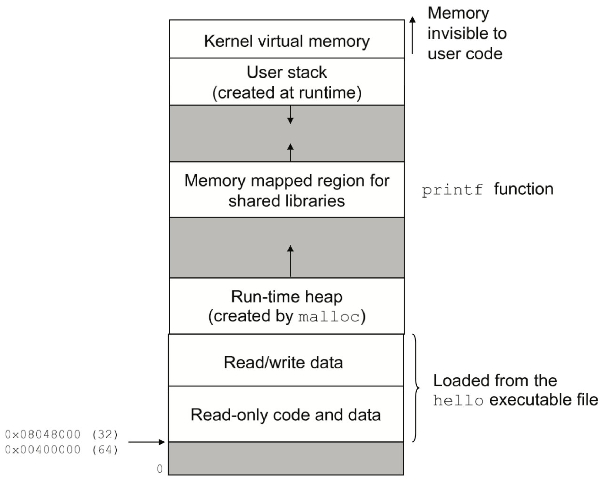

# CT33--存储层次

## 存储层次（Memory Hierarchy）

## 局部性原理

## 虚拟地址空间

自 20 世纪 40 年代以来，计算机的基础架构已逐渐形成标准，包括处理器、用于存储指令和数据的内存、以及输入输出设备。这一架构通常称为**冯·诺依曼架构**（Von Neumann Architecture），以数学家与计算机科学家约翰·冯·诺依曼（John von Neumann，1903 年 12 月 28 日－1957 年 2 月 8 日）的名字命名。他在 1946 年发表的论文中首次系统描述了这种架构。论文开篇用现代术语来解释，就是：**CPU** 负责算法和控制，**RAM** 与磁盘承担数据与指令存储，而键盘、鼠标、显示器等则与操作人员交互。
​
在这一架构中，与存储相关的进程的**虚拟地址空间**是需要重点理解的部分。

**虚拟存储器**（Virtual Memory）是一种抽象机制，它为每个进程提供了一个假象——仿佛自己独占全部主存。实际上，所有进程都看到相同且连续的内存布局，这个抽象的内存视图称为**虚拟地址空间**。

如下图所示，一个典型 Linux 进程的虚拟地址空间（其他 Unix 系统类似）。在 Linux 中，最高四分之一的地址空间保留给内核代码与数据，这对所有进程都一样；其余四分之三则分配给用户进程的代码与数据。需要注意的是，图中的内存地址是**自下而上递增**的。



$$\color{blue}{图：进程的虚拟地址空间（注：图片来源为 Randal Bryant，2015年3月）}$$

每个进程的虚拟地址空间由一系列功能明确的**区域（area）**构成。按照地址从低到高，大致可以分为以下几个部分：

1. **程序代码与数据（Code and Data）**
   程序代码从固定地址开始，紧接其后的数据区存放全局变量等。它们由可执行文件直接初始化，例如示例程序 `hello` 的可执行文件。
2. **堆（Heap）**
   位于代码和数据区之后，是**运行时堆**（Run-time Heap）。与启动时大小固定的代码与数据区不同，堆的大小可在程序运行过程中动态变化，例如通过 C 标准库函数 `malloc` 和 `free` 来分配或释放内存。
3. **共享库（Shared Libraries）**
   位于地址空间中部，用于存放共享库（如标准 C 库、数学库等）的代码与数据。这一机制允许多个进程共享相同的库文件，从而节省内存并便于更新。
4. **栈（Stack）**
   位于用户虚拟地址空间顶部，用于函数调用与局部变量存储。与堆一样，用户栈（User Stack）在程序执行时可动态扩展或收缩——函数调用时栈增长，函数返回时栈缩小。
5. **内核虚拟存储器（Kernel Virtual Memory）**
   占据地址空间最顶端，存放内核常驻代码和数据。用户程序不能直接访问这一区域，也不能调用内核定义的函数。

虚拟存储器的实现依赖于**硬件与操作系统的紧密协作**，包括对处理器生成的每一个地址进行硬件级翻译。核心思想是：将进程的虚拟内存内容保存在磁盘上，并利用主存作为磁盘的高速缓存，从而在保证进程隔离的同时提高访问效率。

### Python程序的虚存布局

virtual_meomory.py

```python
import sys

print("==== 冯·诺依曼架构：Python 进程的虚拟地址空间演示 ====\n")

# 1. —— 代码区（Code Segment） ——————————————————————
def code_function():
    return 1

print("[代码区] 函数对象地址:", hex(id(code_function)))

# 2. —— 数据区（Global / Static Data Segment） ——————————
GLOBAL_VAR = 12345
print("[数据区] 全局变量地址:", hex(id(GLOBAL_VAR)))


# 3. —— 堆（Heap）动态分配 ——————————————————————
a = [1, 2, 3, 4]   # list 对象由 Python 运行时在堆上分配
b = {"name": "von Neumann"}
print("[堆] list 对象地址:", hex(id(a)))
print("[堆] dict 对象地址:", hex(id(b)))


# 4. —— 栈（Stack Frame） ————————————————————————
def stack_demo(depth):
    x = depth * 10
    print(f"[栈] depth={depth} 的局部变量 x 地址:", hex(id(x)))
    if depth > 0:
        stack_demo(depth - 1)

print()
stack_demo(2)


# 5. —— 展示虚拟地址空间是 “连续、统一” 的抽象 ————————
print("\n==== 地址空间连续性展示 ====")
items = [
    ("代码区", id(code_function)),
    ("数据区", id(GLOBAL_VAR)),
    ("堆(list)", id(a)),
    ("堆(dict)", id(b)),
]

for name, addr in items:
    print(f"{name:<10} -> {hex(addr)}")

print("\n注意：虽然这些地址看似很大，但它们都属于同一个 64-bit 进程的虚拟地址空间。")
print("不同区域看上去杂乱，但操作系统和 CPU 通过页表完成了真正的物理内存映射。")

```

mac机器运行显示

```text
==== 冯·诺依曼架构：Python 进程的虚拟地址空间演示 ====

[代码区] 函数对象地址: 0x1003c9da0
[数据区] 全局变量地址: 0x100246150
[堆] list 对象地址: 0x100327600
[堆] dict 对象地址: 0x100361e80

[栈] depth=2 的局部变量 x 地址: 0x100e96260
[栈] depth=1 的局部变量 x 地址: 0x100e96120
[栈] depth=0 的局部变量 x 地址: 0x100e95fe0

==== 地址空间连续性展示 ====
代码区        -> 0x1003c9da0
数据区        -> 0x100246150
堆(list)    -> 0x100327600
堆(dict)    -> 0x100361e80

注意：虽然这些地址看似很大，但它们都属于同一个 64-bit 进程的虚拟地址空间。
不同区域看上去杂乱，但操作系统和 CPU 通过页表完成了真正的物理内存映射。
```

clab 上 RockyLinux 运行显示

```text
==== 冯·诺依曼架构：Python 进程的虚拟地址空间演示 ====

[代码区] 函数对象地址: 0x7fe7f522a1f0
[数据区] 全局变量地址: 0x7fe7f4d90b50
[堆] list 对象地址: 0x7fe7f4d80c40
[堆] dict 对象地址: 0x7fe7f4df5640

[栈] depth=2 的局部变量 x 地址: 0x7fe7f527cb90
[栈] depth=1 的局部变量 x 地址: 0x7fe7f527ca50
[栈] depth=0 的局部变量 x 地址: 0x7fe7f527c910

==== 地址空间连续性展示 ====
代码区        -> 0x7fe7f522a1f0
数据区        -> 0x7fe7f4d90b50
堆(list)    -> 0x7fe7f4d80c40
堆(dict)    -> 0x7fe7f4df5640

注意：虽然这些地址看似很大，但它们都属于同一个 64-bit 进程的虚拟地址空间。
不同区域看上去杂乱，但操作系统和 CPU 通过页表完成了真正的物理内存映射
```

# 能申请到$10^{18}$内存吗？

机器：macOS Sonoma 14.6.1，最大可以申请到 276.00 GB（即接近于$2^{38}$）。计算方法如下所述。

## $10^{18}$有多大

要将 $10^{18}$ 字节转换为更常见的存储单位，如GB（吉字节）或TB（太字节），我们需要了解这些单位之间的换算关系。在二进制表示中，这些单位是基于2的幂来定义的，但在十进制表示中，它们通常基于10的幂来定义。

- 1 GB (Gigabyte, 吉字节) = $10^9$ 字节
- 1 TB (Terabyte, 太字节) = $10^{12}$ 字节

因此，$10^{18}$ 字节可以被直接转换为：

- $10^{18} \div 10^9 = 10^9$ GB
- $10^{18} \div 10^{12} = 10^6$ TB

这表示 $10^{18}$ 字节等于 10亿 GB 或者 1百万 TB。


```python
import math
x = math.log2(10**18)
print(x)  # 输出: 59.79470570797252
```


## 判断使用的Python解释器是否64位

要判断你正在使用的Python解释器是32位还是64位，可以通过几种方法来完成。这里我将展示一种简单的方法，即使用Python内置的`platform`模块或`sys`模块来获取相关信息。

**方法 1: 使用 `platform` 模块**

`platform` 模块提供了很多关于平台的信息，包括体系结构（architecture），可以用来区分32位和64位版本。

```python
import platform

print(platform.architecture())
"""
('64bit', 'Mach-O')
"""
```

这个函数会返回一个元组，其中第一个元素表示Python解释器的位数（例如 '32bit' 或 '64bit'）。

**方法 2: 使用 `sys` 模块**

`sys` 模块中的 `maxsize` 属性也可以用来间接判断Python解释器的位数。对于32位Python，`sys.maxsize` 的值通常为 2^31 - 1 (即 2147483647)，而对于64位Python，这个值通常为 2^63 - 1 (即 9223372036854775807)。

> 因为 maxsize 是有符号整数的最大值，所以 32 位时是 2³¹−1，不是 2³²。

```python
import sys

if sys.maxsize > 2**32:
    print("64-bit Python")
else:
    print("32-bit Python")
```

下面我将执行一段代码来演示如何使用这两种方法之一来确定当前Python环境的位数。

```python
import platform
print(platform.architecture()[0])
```

或者使用 `sys` 模块的方法：

```python
import sys
if sys.maxsize > 2**32:
    print("64-bit Python")
else:
    print("32-bit Python")
```


## 测试Python程序可以申请的最大内存量


**python能够申请到的最大内存**

> Python程序能够申请到的最大内存量主要取决于几个因素，包括操作系统、硬件配置以及Python解释器本身的限制。下面是一些关键点：
>
> 1. **操作系统限制**：
>    - 不同的操作系统对进程可以使用的最大内存有不同的默认限制。例如，在Linux上，可以通过`ulimit -a`命令查看当前用户的资源限制，其中包括了最大虚拟内存大小（`virtual memory`）。
>    - 在Windows上，理论上一个32位进程最多可以访问4GB的地址空间，而64位进程则可以访问更大的地址空间。
>
> 2. **硬件限制**：
>    - 物理内存（RAM）的数量直接限制了程序可用的实际物理内存。即使操作系统允许更大的虚拟内存，实际能使用的内存仍然受限于物理内存加上交换空间（swap space）的总量。
>    - 交换空间可以在一定程度上扩展可用内存，但使用大量交换空间会导致性能显著下降。
>
> 3. **Python解释器限制**：
>    - Python本身并没有设置一个固定的内存上限，但它会受到上述因素的影响。
>    - 在32位Python版本中，由于地址空间的限制，通常最大可分配内存为2-4GB左右。
>    - 64位Python版本理论上可以访问更多内存，但是实际可用量依然受限于操作系统的限制和可用的物理及虚拟内存。
>
> 4. **Python内部机制**：
>    - Python对象的内存管理由Python解释器负责，它使用垃圾回收机制来自动释放不再使用的内存。
>    - 对于非常大的数据集，可能需要考虑使用更高效的数据结构或第三方库（如NumPy, Pandas等），这些库针对大数据处理进行了优化，并且支持在内存之外存储数据（例如，使用磁盘上的文件作为后端）。
>
> 5. **增加内存限制的方法**：
>    - 在Linux上，可以通过修改`/etc/security/limits.conf`文件或使用`ulimit`命令来提高单个进程的内存限制。
>    - 对于需要处理特别大数据集的情况，可以考虑使用分布式计算框架（如Apache Spark）、数据库或者其他专门设计用于处理大规模数据的技术。
>
> 总之，Python程序能够申请到的最大内存量不是一个固定值，而是依赖于运行环境的具体条件。


> % ulimit -a
>
> -t: cpu time (seconds)       unlimited
> -f: file size (blocks)       unlimited
> -d: data seg size (kbytes)     unlimited
> -s: stack size (kbytes)       <mark>8176</mark>
> -c: core file size (blocks)     0
> -v: address space (kbytes)     unlimited
> -l: locked-in-memory size (kbytes) unlimited
> -u: processes            10666
> -n: file descriptors        2560


**虚拟地址空间（计算机原理2/3）**

> 三大计算机原理之一，@Book_my_flight_v0.3.md
>
> ​	计算机的基础架构自从 20 世纪 40 年代起就已经形成规范，包括处理器、存储指令和数据的内存、输入和输出设备。它通常叫作冯·诺依曼架构，以约翰·冯·诺依曼（德語：John Von Neumann，1903 年12 月 28 日－1957 年 2 月 8 日）的名字来命名，他在 1946 年发表的论文里描述了这一架构。论文的开头句，用现在的专门术语来说就是，CPU提供算法和控制，而 RAM 和磁盘则是记忆存储，键盘、鼠标和显示器与操作人员交互。其中需要重点理解的是与存储相关的进程的虚拟地址空间。
>
> 虚拟存储器是一个抽象概念，它为每个进程提供了一个假象，好像每个进程都在独占地使用主存。每个进程看到的存储器都是一致的，称之为虚拟地址空间。如图1-15所示的是 Linux 进程的虚拟地址空间（其他 Unix 系统的设计与此类似）。在 Linux 中，最上面的四分之一的地址空间是预留给操作系统中的代码和数据的，这对所有进程都一样。底部的四分之三的地址空间用来存放用户进程定义的代码和数据。请注意，图中的地址是从下往上增大的。
>
> 
>
> 
>
> 图1-15 进程的虚拟地址空间（Process virtual address space）（注：图片来源为 Randal Bryant[8]，2015年3月）
>
> 
>
> ​	每个进程看到的虚拟地址空间由准确定义的区（area）构成，每个区都有专门的功能。简单看下每一个区，从最低的地址开始，逐步向上研究。
>
> - 程序代码和数据（code and data）。代码是从同一固定地址开始，紧接着的是和全局变量相对应的数据区。代码和数据区是由可执行目标文件直接初始化的，示例中就是可执行文件hello。
>
> - 堆（heap）。紧随代码和数据区之后的是运行时堆（Run-time heap）。代码和数据区是在进程一旦开始运行时就被指定了大小的，与此不同，作为调用像 malloc 和 free 这样的 C 标准库函数的结果，堆可以在运行时动态地扩展和收缩。
>
> - 共享库（shared libraries）。在地址空间的中间附近是一块用来存放像标准库和数学库这样共享库的代码和数据的区域。共享库的概念非常强大。
>
> - 栈（stack）。位于用户虚拟地址空间顶部的是用户栈，编译器用它来实现函数调用。和堆一样，用户栈（User stack）在程序执行期间可以动态地扩展和收缩。特别地，每次我们调用一个函数时，栈就会增长。每次我们从函数返回时，栈就会收缩。
>
> - 内核虚拟存储器（kernal virtal memory）。内核是操作系统总是驻留在存储器中的部分。地址空间顶部是为内核预留的。应用程序不允许读写这个区域的内容或者直接调用内核代码定义的函数。
>
> ​	虚拟存储器的运作需要硬件和操作系统软件间的精密复杂的互相合作，包括对处理器生成的每个地址的硬件翻译。基本思想是把一个进程虚拟存储器的内容存储在磁盘上，然后用主存作为磁盘的高速缓存。


> 全局变量和静态变量通常是在数据段（data segment）中分配的，而常量可能会放置在只读数据段（read-only data segment）。栈内存确实用于存储局部变量，但“动态内存分配”通常是与堆相关联的术语。栈上的分配是静态且自动化的，而堆上的分配是动态的，由程序员控制。


要测试Python程序可以申请的最大内存量，你可以编写一个简单的脚本，该脚本会尝试分配越来越多的内存，直到达到系统限制或Python解释器本身的限制。这个过程通常涉及到创建一个越来越大的列表（或其他数据结构），并填充它，直到内存不足。

请注意，这样的测试可能会导致你的系统变得非常慢，甚至可能崩溃，因为它会消耗大量的RAM。因此，在进行这种测试之前，请确保你了解风险，并且最好在受控环境中执行此操作，例如虚拟机或有足够空闲资源的机器上。

```python
import os
import sys
import gc  # 垃圾回收模块


def allocate_memory(chunk_size=1024 * 1024 * 1024, max_attempts=1000):
    """
    尝试分配内存，每次增加chunk_size字节，直到无法分配更多。

    :param chunk_size: 每次尝试分配的内存大小（以字节为单位）
    :param max_attempts: 最大尝试次数
    """
    data = []
    total_allocated = 0
    for i in range(max_attempts):
        try:
            # 尝试分配额外的内存
            data.append(' ' * chunk_size)
            total_allocated += chunk_size
            print(f"Allocated {total_allocated / (1024 * 1024 * 1024):.2f} GB")
        except MemoryError:
            print("Memory allocation failed.")
            break
        finally:
            # 强制垃圾回收
            gc.collect()

    print(f"Total memory allocated: {total_allocated / (1024 * 1024 * 1024):.2f} GB")


# 运行测试
allocate_memory()
```

> 2025/12/16 运行结果，Mac Studio机器
>
> ...
>
> Allocated 375.00 GB
> Allocated 376.00 GB
> Allocated 377.00 GB
>
> Process finished with exit code 137 (interrupted by signal 9:SIGKILL)


> 2024fall 运行结果，mac机器
>
> Allocated 274.00 GB
> Allocated 275.00 GB
> Allocated 276.00 GB
>
> Process finished with exit code 137 (interrupted by signal 9:SIGKILL)


要找出276GB是2的多少次幂，首先需要将276GB转换为字节，因为通常在计算中使用的是二进制单位。1GB等于2^30字节（在二进制表示中）。因此，276GB可以表示为 276 * 2^30 字节。

接下来，我们需要找到一个指数x，使得 2^x 等于 276 * 2^30。这可以通过对数运算来解决：

$ x = \log_2(276 \times 2^{30}) $

$ \log_2(276 \times 2^{30}) = \log_2(276) + \log_2(2^{30}) $

$ \log_2(276) + 30 \approx 8.1073 + 30 = 38.1073 $

这意味着276GB大约等于 $2^{38.1073}$ 字节。由于幂次通常是一个整数，我们可以认为276GB最接近于 $2^{38}$ 字节，但略大于这个值。如果你需要更精确的结果，可以使用科学计算器来获得更准确的对数值。

