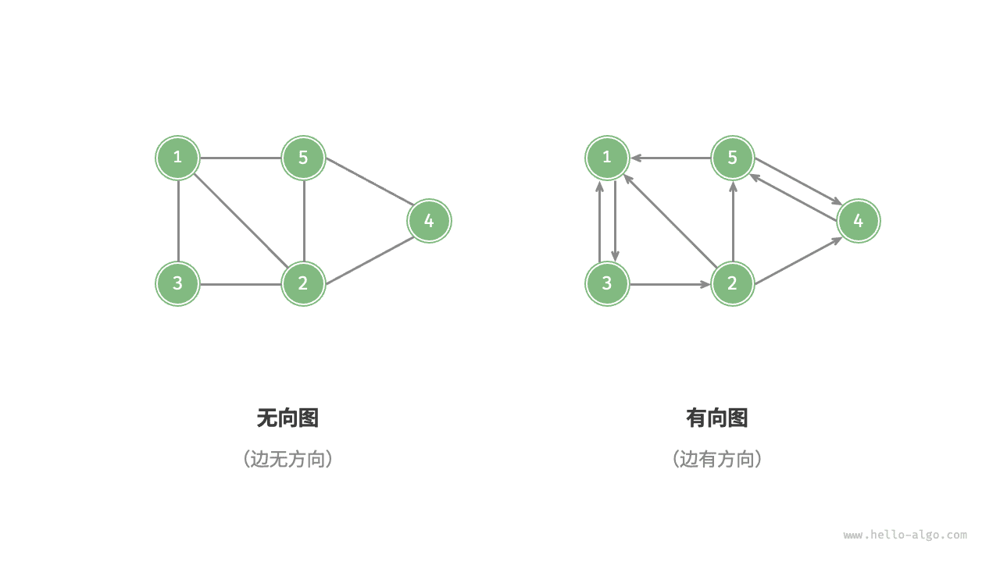
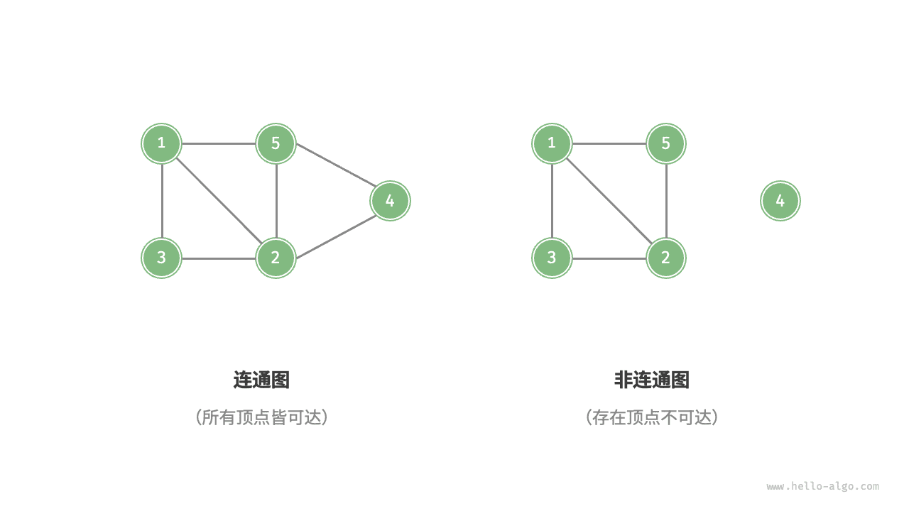
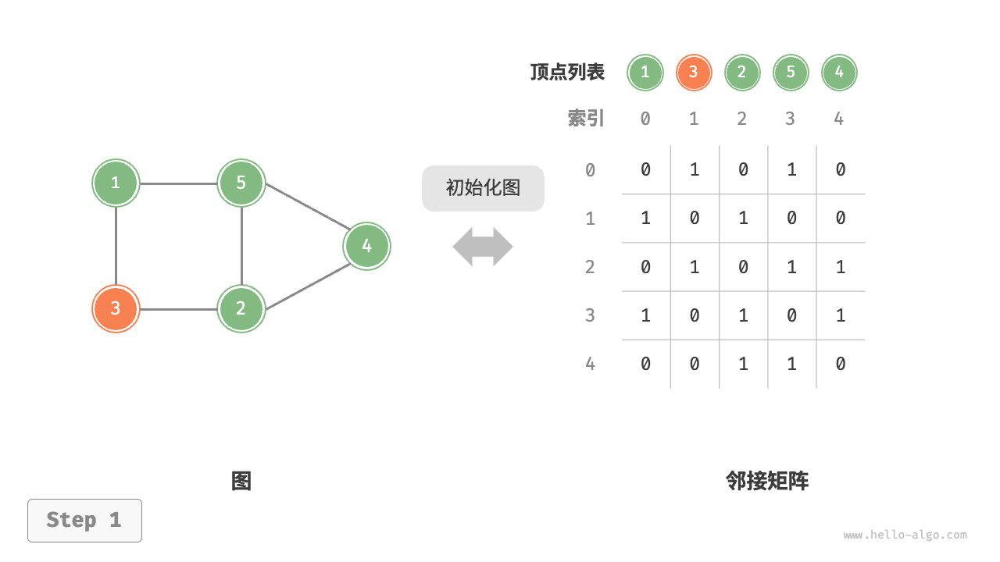
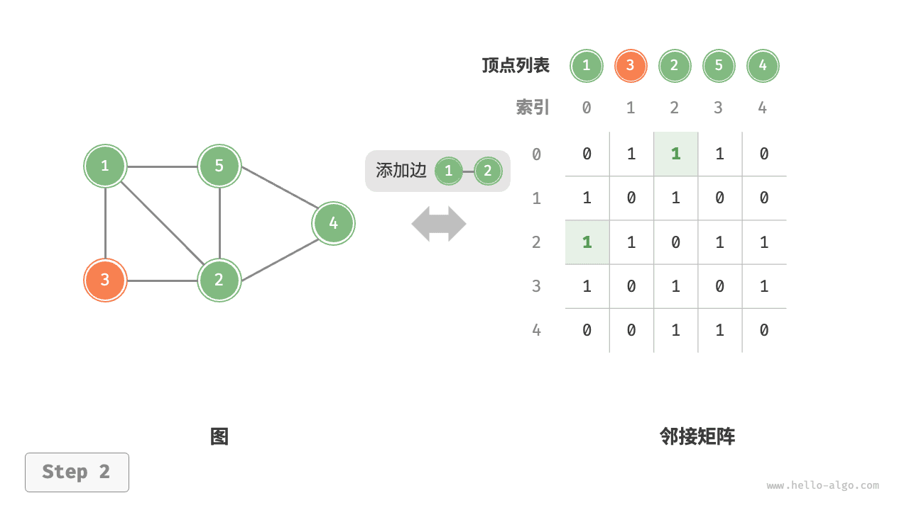
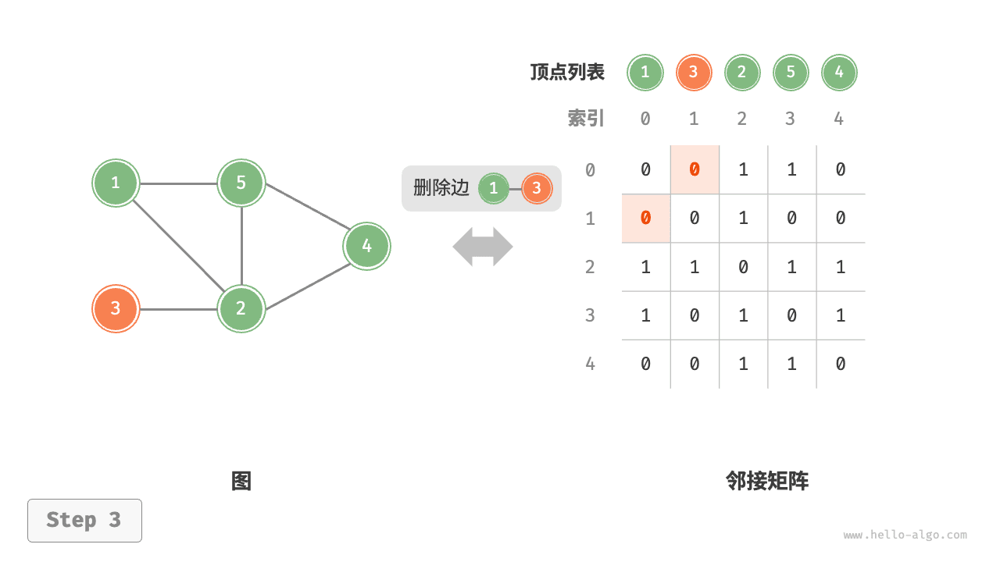
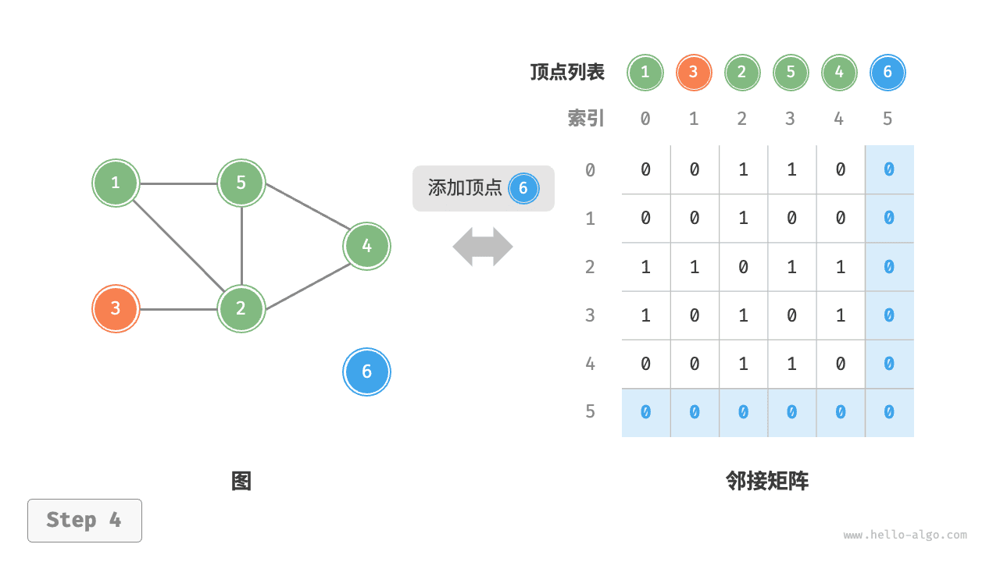
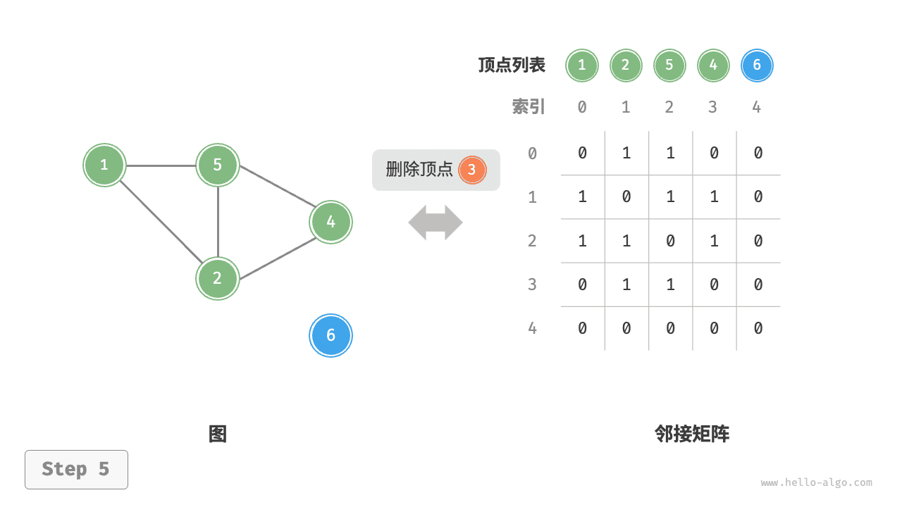
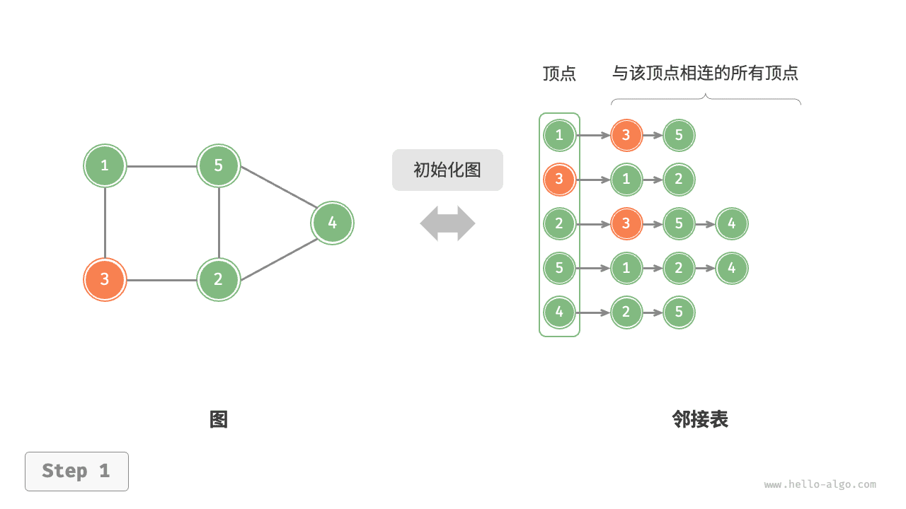
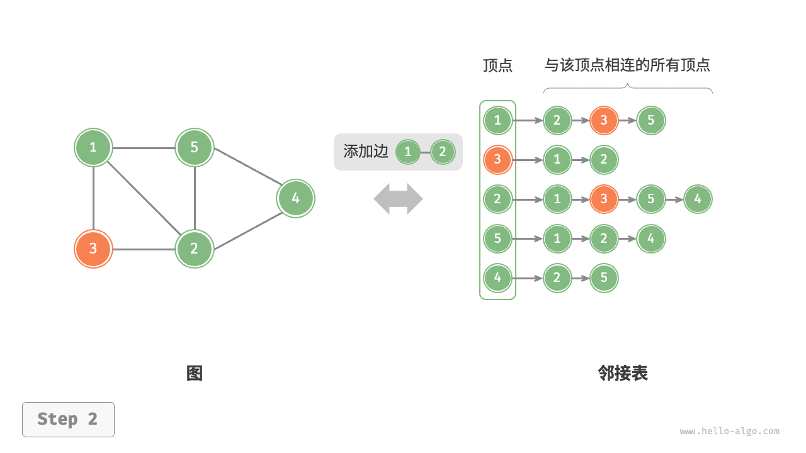
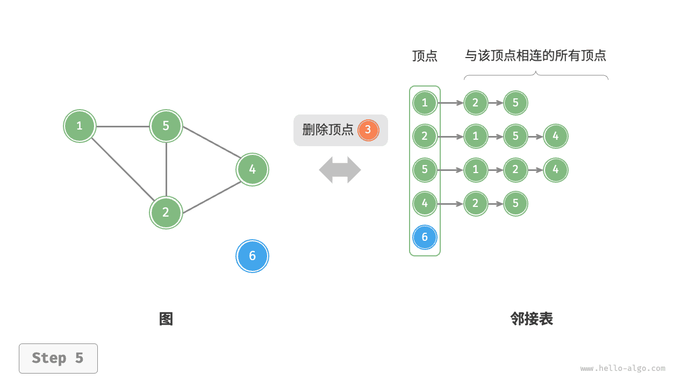

# 星罗棋布

现实世界中的关系无处不在：在微信上，你和朋友互为好友，形成一张人际关系网；在出行时，你从北京坐高铁到上海、再转机到广州，城市之间由交通线路连接；在大学选课时，你需要先学完"数据结构与算法"才能选修"计算机网络"，课程之间存在着依赖关系。这些场景都可以抽象为同一种数学模型——**图（Graph）**。

图论就是研究这些"关系"的数学分支。把关系画成图之后，很多问题就变得直观了：

```
         社交网络              航班网络              课程依赖
      A ─── B              北京 ── 上海            数算 ─→ 计网
      │     │                │       │               │       │
      │     │                │       │               │       │
      C ─── D              广州 ── 深圳            计组 ─→ 操作系统
```

有了图，我们就可以用统一的算法来回答不同领域的问题：我和某人是"几度好友"？从北京到广州最短需要多长时间？我能不能在四个学期内修完所有必修课？这就是图论让计算机"聪明"的原因。

## 1 图的定义与术语

### 1.1 什么是图

**图（Graph）** 由 **顶点（Vertex）** 和 **边（Edge）** 组成，记作 G(V, E)，其中 V 是顶点集，E 是边集。

> 在图论中，顶点通常被称为 **node** 或 **vertex**，边被称为 **edge** 或 **arc**。

```python
# 一个简单的图：三个顶点、三条边
V = {0, 1, 2}                          # 顶点集合
E = {(0, 1), (1, 2), (0, 2)}           # 边集合
```

### 1.2 有向图与无向图

根据边是否有方向，图分为两种：

- **无向图**：边是双向的，(u, v) 和 (v, u) 表示同一条边。例如微信好友关系——如果 Alice 是 Bob 的好友，Bob 也一定是 Alice 的好友。
- **有向图**：边有方向，(u, v) 表示 u → v，与 (v, u) 不同。例如微博关注关系——Alice 关注 Bob 不意味着 Bob 也关注 Alice。



### 1.3 简单图与多重图

根据边是否允许重复，图分为两种：

- **简单图（Simple Graph）**：任意两个顶点之间最多只有一条边，且不允许顶点与自身相连（无自环）。我们这门课讨论的绝大多数图都是简单图。
- **多重图（Multigraph）**：两个顶点之间可以有多条边，即存在"平行边"。例如地图上两个城市之间可能有多条道路（国道、高速、铁路各自算一条边）。

> 如果不特别说明，本课程中的"图"均指简单图。多重图在实际中也有应用，但涉及更复杂的算法。

### 1.4 有权图与无权图

根据边是否带有数值信息，图又进一步区分：

- **无权图（Unweighted Graph）**：边只表示"是否有关系"，不携带额外信息。例如微信好友关系只表示"认识"，没有程度之分。
- **有权图（Weighted Graph）**：每条边附带一个数值，称为**权值（Weight）**。权值可以表示距离、时间、花费、容量等。例如北京到上海的高铁里程是 1318 公里，这个数字就是边的权值。

顶点也可以带有权值，称为**点权**，但默认情况下"权值"指的都是边权。

> 有权图比无权图携带更多信息，解决最短路径等问题时通常需要带权图。

```python
# 无向图：边没有方向
graph_undirected = {
    0: [1, 2],      # 0 和 1、2 相连
    1: [0, 2],      # 1 和 0、2 相连
    2: [0, 1]       # 2 和 0、1 相连
}

# 有向图：边有方向
graph_directed = {
    0: [1, 2],      # 0 → 1, 0 → 2
    1: [2],         # 1 → 2
    2: []           # 2 没有出边
}
```

### 1.5 度、入度、出度

- **度（Degree）**：与一个顶点相连的边的条数
- **入度（In-degree）**：有向图中，指向该顶点的边的条数
- **出度（Out-degree）**：有向图中，从该顶点出发的边的条数

> 对于无向图，所有顶点的度之和等于边数的两倍（每条边贡献两个度）。
> 对于有向图，所有顶点的入度之和等于所有顶点的出度之和，都等于边数。


**例题 sy374：无向图的度** 简单

https://sunnywhy.com/sfbj/10/1/374

现有一个共 n 个顶点、m 条边的无向图（假设顶点编号为从 `0` 到 `n-1`），求每个顶点的度。

**输入**：第一行两个整数 n、m（$1 \le n \le 100, 0 \le m \le \frac{n(n-1)}2$），分别表示顶点数和边数；接下来 m 行，每行两个整数 u、v（$0 \le u \le n-1, 0 \le v \le n-1, u \ne v$），表示一条边的两个端点的编号。数据保证不会有重边。

**输出**：在一行中输出 n 个整数，表示编号为从 `0` 到 `n-1` 的顶点的度。整数之间用空格隔开，行末不允许有多余的空格。

示例输入：
```
3 2
0 1
0 2
```

示例输出：
```
2 1 1
```

```python
# 无向图的度：每条边让两个端点的度各加 1
n, m = map(int, input().split())    # 读取顶点数 n 和边数 m
degrees = [0] * n                    # 初始化度数组，全部为 0

for _ in range(m):                   # 遍历每条边
    u, v = map(int, input().split())
    degrees[u] += 1                   # u 的度加 1
    degrees[v] += 1                   # v 的度加 1

print(' '.join(map(str, degrees)))   # 输出每个顶点的度
```

**例题 sy375：有向图的度** 简单

https://sunnywhy.com/sfbj/10/1/375

现有一个共 n 个顶点、m 条边的有向图（假设顶点编号为从 `0` 到 `n-1`），求每个顶点的入度和出度。

**输入**：第一行两个整数 n、m（$1 \le n \le 100, 0 \le m \le n(n-1)$），分别表示顶点数和边数；接下来 m 行，每行两个整数 u、v（$0 \le u \le n-1, 0 \le v \le n-1, u \ne v$），表示一条边的起点和终点的编号。数据保证不会有重边。

**输出**：输出 n 行，每行为编号从 `0` 到 `n-1` 的一个顶点的入度和出度，中间用空格隔开。

示例输入：
```
3 3
0 1
0 2
2 1
```

示例输出：
```
0 2
2 0
1 1
```

```python
# 有向图的度：起点出度加 1，终点入度加 1
n, m = map(int, input().split())    # 读取顶点数 n 和边数 m
in_deg = [0] * n                     # 入度数组
out_deg = [0] * n                    # 出度数组

for _ in range(m):
    u, v = map(int, input().split())
    out_deg[u] += 1                   # u → v：u 的出度加 1
    in_deg[v] += 1                    # u → v：v 的入度加 1

for i in range(n):
    print(in_deg[i], out_deg[i])     # 按顺序输出入度和出度
```

### 1.6 路径与环

- **路径（Path）**：由一个顶点序列组成，序列中相邻顶点之间有边相连
- **简单路径**：路径中不包含重复顶点
- **环（Cycle）**：起点和终点相同的路径
- **无环图**：没有环的图
- **DAG（Directed Acyclic Graph）**：有向无环图，在任务调度、依赖分析中非常常见

```
    0 → 1 → 2         路径：0 → 1 → 2
    ↑         ↓       环：0 → 1 → 3 → 0
    └── 3 ←──┘
```

路径（Path）：上图中 `0 → 1 → 2` 是一条路径，`0 → 1 → 3 → 0` 是一个环。

### 1.7 连通性

- **连通图**：无向图中，任意两个顶点之间都存在路径
- **连通分量**：无向图的极大连通子图。一个非连通图由若干个连通分量组成，每个分量内部的所有顶点互相可达，但不同分量之间没有边相连

> 可以把连通分量理解为"孤岛"——每一座岛内部道路畅通，但岛与岛之间没有桥。如果一个图只有一个连通分量，那它就是连通图。

- **强连通分量**：有向图中的概念。如果从顶点 u 到 v 有一条路径，且从 v 到 u 也有一条路径，则称 u 和 v 是**强连通**的。极大强连通子图称为**强连通分量（SCC）**。

> 无向图的连通性和有向图的强连通性不是一回事。例如微博上，Alice 关注了 Bob，但 Bob 没有关注 Alice，在无向视角下他们"不连通"，但在有向视角下需要看能否互相到达。这个主题将在后续章节详细展开。



### 1.8 完全图、稠密图与稀疏图

根据边的数量，图可以进一步分类：

- **完全图（Complete Graph）**：任意两个不同的顶点之间都有一条边。$n$ 个顶点的无向完全图有 $\frac{n(n-1)}{2}$ 条边。
- **稠密图（Dense Graph）**：边数接近完全图，即 $|E|$ 接近 $|V|^2$ 量级。
- **稀疏图（Sparse Graph）**：边数远少于完全图，即 $|E|$ 远小于 $|V|^2$，通常 $|E| = O(|V|)$。

> 这两个概念直接决定了选哪种表示方法——稠密图用邻接矩阵，稀疏图用邻接表（将在 2.1 和 2.2 中详细讨论）。绝大多数实际问题中的图都是稀疏的。

### 1.9 子图

子图 $S$ 是由原图 $G$ 的一部分顶点和边构成的图，满足 $V(S) \subseteq V(G)$ 且 $E(S) \subseteq E(G)$。

## 2 图的表示方法

选择合适的表示方法，是高效解决问题的第一步。下面介绍三种常用的图表示方法。

### 2.1 邻接矩阵

邻接矩阵使用一个 $n \times n$ 的二维矩阵来表示图，其中 $n$ 是顶点数。矩阵中第 $i$ 行第 $j$ 列的元素表示顶点 $i$ 到顶点 $j$ 是否有边（或边的权重）。


| 操作 | 时间复杂度 | 说明 |
|---|---|---|
| 判断两顶点是否相邻 | $O(1)$ | 直接访问矩阵元素 |
| 添加/删除边 | $O(1)$ | 修改矩阵元素 |
| 添加顶点 | $O(n)$ | 增加一行一列 |
| 删除顶点 | $O(n^2)$ | 删除一行一列并移动数据 |
| 空间占用 | $O(n^2)$ | 即使边很少，也占用 $n^2$ 空间 |

> 邻接矩阵适合**稠密图**（边数接近 $n^2$）和需要频繁判断边是否存在的场景。

**例题 sy376：无向图的邻接矩阵** 简单

https://sunnywhy.com/sfbj/10/2/376

现有一个共 n 个顶点、m 条边的无向图（假设顶点编号为从 `0` 到 `n-1`），将其按邻接矩阵的方式存储（存在边的位置填充 `1`，不存在边的位置填充 `0`），然后输出整个邻接矩阵。

**输入**：第一行两个整数 n、m（$1 \le n \le 100, 0 \le m \le \frac{n(n-1)}2$），分别表示顶点数和边数；接下来 m 行，每行两个整数 u、v（$0 \le u \le n-1, 0 \le v \le n-1, u \ne v$），表示一条边的两个端点的编号。数据保证不会有重边。

**输出**：输出 n 行 n 列，表示邻接矩阵。整数之间用空格隔开，行末不允许有多余的空格。

示例输入：
```
3 2
0 1
0 2
```

示例输出：
```
0 1 1
1 0 0
1 0 0
```

```python
# 按邻接矩阵方式存储无向图，并输出矩阵
n, m = map(int, input().split())          # n 个顶点，m 条边
matrix = [[0] * n for _ in range(n)]      # 创建 n×n 的零矩阵

for _ in range(m):
    u, v = map(int, input().split())
    matrix[u][v] = 1                       # 无向图：两个方向都要置 1
    matrix[v][u] = 1

for row in matrix:                         # 逐行输出矩阵
    print(' '.join(map(str, row)))
```

**例题 sy377：有向图的邻接矩阵** 简单

https://sunnywhy.com/sfbj/10/2/377

现有一个共 n 个顶点、m 条边的有向图（假设顶点编号为从 `0` 到 `n-1`），将其按邻接矩阵的方式存储（存在边的位置填充 `1`，不存在边的位置填充 `0`），然后输出整个邻接矩阵。

**输入**：第一行两个整数 n、m（$1 \le n \le 100, 0 \le m \le n(n-1)$），分别表示顶点数和边数；接下来 m 行，每行两个整数 u、v（$0 \le u \le n-1, 0 \le v \le n-1, u \ne v$），表示一条边的起点和终点的编号。数据保证不会有重边。

**输出**：输出 n 行 n 列，表示邻接矩阵。整数之间用空格隔开，行末不允许有多余的空格。

示例输入：
```
3 3
0 1
0 2
2 1
```

示例输出：
```
0 1 1
0 0 0
0 1 0
```

```python
# 按邻接矩阵方式存储有向图，并输出矩阵
n, m = map(int, input().split())
matrix = [[0] * n for _ in range(n)]

for _ in range(m):
    u, v = map(int, input().split())
    matrix[u][v] = 1                       # 有向图：只需将起点→终点置 1

for row in matrix:
    print(' '.join(map(str, row)))
```

### 2.2 邻接表

邻接表为每个顶点维护一个列表，记录所有与该顶点相邻的顶点。在 Python 中，通常用列表的列表或字典来实现。


| 操作 | 时间复杂度 | 说明 |
|---|---|---|
| 判断两顶点是否相邻 | $O(degree)$ | 需要遍历邻接表 |
| 添加边 | $O(1)$ | 在对应列表末尾添加 |
| 删除边 | $O(degree)$ | 需要查找并删除 |
| 添加顶点 | $O(1)$ | 新建一个空列表 |
| 删除顶点 | $O(n + m)$ | 遍历所有邻接表删除相关边 |
| 空间占用 | $O(n + m)$ | 仅存储实际存在的边 |

> 邻接表适合**稀疏图**（边数远小于 $n^2$），是实际应用中最常用的表示方法。

**例题 sy378：无向图的邻接表** 简单

https://sunnywhy.com/sfbj/10/2/378

现有一个共 n 个顶点、m 条边的无向图（假设顶点编号为从 `0` 到 `n-1`），将其按邻接表的方式存储，然后输出整个邻接表。

**输入**：第一行两个整数 n、m（$1 \le n \le 100, 0 \le m \le \frac{n(n-1)}2$），分别表示顶点数和边数；接下来 m 行，每行两个整数 u、v（$0 \le u \le n-1, 0 \le v \le n-1, u \ne v$），表示一条边的两个端点的编号。数据保证不会有重边。

**输出**：输出 n 行，按顺序给出编号从 `0` 到 `n-1` 的顶点的所有出边，每行格式为 `id(k) v1 v2 ... vk`，其中 id 表示当前顶点的编号，k 表示该顶点的出边数量，v1、v2、...、vk 表示 k 条出边的终点编号（按边输入的顺序输出）。行末不允许有多余的空格。

示例输入：
```
3 2
0 1
0 2
```

示例输出：
```
0(2) 1 2
1(1) 0
2(1) 0
```

```python
# 按邻接表方式存储无向图，并输出
n, m = map(int, input().split())
adj = [[] for _ in range(n)]              # 创建 n 个空列表

for _ in range(m):
    u, v = map(int, input().split())
    adj[u].append(v)                       # 无向图：两个方向都要添加
    adj[v].append(u)

for i in range(n):                         # 逐顶点输出邻接表
    # 输出格式：id(k) v1 v2 ... vk
    print(f"{i}({len(adj[i])})", end='')
    if adj[i]:
        print('', ' '.join(map(str, adj[i])))
    else:
        print()                            # 没有邻接顶点时只输出 id(0)
```

**例题 sy379：有向图的邻接表** 简单

https://sunnywhy.com/sfbj/10/2/379

现有一个共 n 个顶点、m 条边的有向图（假设顶点编号为从 `0` 到 `n-1`），将其按邻接表的方式存储，然后输出整个邻接表。

**输入**：第一行两个整数 n、m（$1 \le n \le 100, 0 \le m \le n(n-1)$），分别表示顶点数和边数；接下来 m 行，每行两个整数 u、v（$0 \le u \le n-1, 0 \le v \le n-1, u \ne v$），表示一条边的起点和终点的编号。数据保证不会有重边。

**输出**：输出 n 行，按顺序给出编号从 `0` 到 `n-1` 的顶点的所有出边，每行格式为 `id(k) v1 v2 ... vk`，其中 id 表示当前顶点的编号，k 表示该顶点的出边数量，v1、v2、...、vk 表示 k 条出边的终点编号（按边输入的顺序输出）。行末不允许有多余的空格。

示例输入：
```
3 3
0 1
0 2
2 1
```

示例输出：
```
0(2) 1 2
1(0)
2(1) 1
```

```python
# 按邻接表方式存储有向图，并输出
n, m = map(int, input().split())
adj = [[] for _ in range(n)]

for _ in range(m):
    u, v = map(int, input().split())
    adj[u].append(v)                       # 有向图：仅添加 u → v

for i in range(n):
    print(f"{i}({len(adj[i])})", end='')
    if adj[i]:
        print('', ' '.join(map(str, adj[i])))
    else:
        print()
```

### 2.3 引言：dict 套 list / queue / dict

Python 的字典（dict）非常灵活，可以用来构建各种复杂的数据结构。

**Dict 套 List**：每个键对应一个列表，用于存储多个相关值。
```python
# 学生成绩表：键是学生姓名，值是成绩列表
scores = {"张三": [90, 85, 95], "李四": [88, 92, 90]}
```

**Dict 套 Queue**：每个键对应一个队列，用于按顺序处理。
```python
# dict 的 value 如果是 list/set，就是邻接表
graph = {
    'A': ['B', 'C'],
    'B': ['A', 'D'],
    'C': ['A', 'D'],
    'D': ['B', 'C']
}
```

**Dict 套 Dict**：外层 dict 的键是节点，内层 dict 的键是邻居，值是边权。
```python
# 带权图的邻接表
weighted_graph = {
    'A': {'B': 5, 'C': 2},
    'B': {'A': 5, 'D': 3},
    'C': {'A': 2, 'D': 1},
    'D': {'B': 3, 'C': 1}
}
```

> dict 的 value 如果是 list/set，是邻接表。dict 嵌套 dict 是字典树/前缀树/Trie。

**神奇的 dict**：字典在 Python 中被广泛使用——哈希映射、符号表、配置文件、缓存、图的表示……这是 Python 中最常用的数据结构之一。

### 2.4 字典树 / Trie（了解）

Trie（前缀树）是一种树形数据结构，用于高效地存储和检索字符串。用嵌套 dict 可以非常简洁地实现 Trie：

```python
# 用嵌套 dict 实现的 Trie
trie = {
    'a': {
        'p': {
            'p': {
                'l': {
                    'e': {'is_end': True}
                }
            }
        }
    },
    'b': {
        'a': {
            'l': {
                'l': {'is_end': True}
            }
        }
    }
}
```

**例题 27928：遍历树**

http://cs101.openjudge.cn/practice/27928/

给定一棵树，要求按照"先遍历值小的节点，再遍历父节点，再遍历值大的子节点"的顺序输出。

```python
# 用 dict 存储树，键是节点值，值是子节点列表
# 递归天然是深度优先

def traverse(x, tree):
    """遍历规则：节点与子节点一起排序，小的先遍历，父节点在中间"""
    group = [x] + tree[x]                    # 当前节点 + 所有子节点
    for val in sorted(group):                # 从小到大排序
        if val == x:
            print(x)                         # 打印父节点
        else:
            traverse(val, tree)              # 递归遍历子节点

n = int(input())
tree = {}
all_children = set()

for _ in range(n):
    line = list(map(int, input().split()))
    val = line[0]                            # 第一个数是本节点的值
    tree[val] = line[1:]                     # 后续数是子节点
    all_children.update(line[1:])

# 根节点 = 未作为子节点出现的节点
root = (set(tree.keys()) - all_children).pop()

traverse(root, tree)
```

**例题 04089：电话号码**

http://cs101.openjudge.cn/practice/04089/

给定一批电话号码，判断是否一致——即是否存在某个号码是另一个号码的前缀。

```python
# 解法一：排序 + 相邻比较（最优解，不需要 Trie）
# 排序后所有前缀关系只可能出现在相邻元素之间
def consistent_phones(nums):
    nums.sort()
    for i in range(len(nums) - 1):
        if nums[i+1].startswith(nums[i]):
            return False
    return True

# 解法二：Trie 思路
class TrieNode:
    def __init__(self):
        self.child = {}
        self.end = False

def insert(root, s):
    """插入号码 s，如果发现前缀冲突则返回 False"""
    cur = root
    for c in s:
        if cur.end:                          # 路径上有已结束号码 → 冲突
            return False
        if c not in cur.child:
            cur.child[c] = TrieNode()
        cur = cur.child[c]
    if cur.end or cur.child:                 # 自身是前缀或已有更长的号码
        return False
    cur.end = True
    return True
```

### 2.5 关联矩阵（了解）

关联矩阵的行表示顶点，列表示边。如果顶点与边相连，则在对应位置填 1，否则填 0。虽然在实际编程中较少使用，但在某些图论理论分析中仍有其价值。

对于有向图，关联矩阵通常定义为：若顶点是边的起点则填 1，是终点则填 -1，否则填 0。

举例说明：有一个无向图，顶点为 A、B、C，边为 e1(A-B)、e2(B-C)、e3(A-C)，它的关联矩阵为：

```
         e1   e2   e3
顶点 A    1    0    1
顶点 B    1    1    0
顶点 C    0    1    1
```

关联矩阵的每一列恰好有两个 1（无向图）或一个 1 和一个 -1（有向图），这直观反映了每条边连接两个顶点的本质。

```
        边1  边2  边3
顶点 A   1    1    0
顶点 B   1    0    1
顶点 C   0    1    1
```

### 2.6 图的面向对象实现

在笔试和理论分析中，图的 OOP 实现是一个重要考点。下面给出标准的 Vertex 类和 Graph 类实现。

```python
class Vertex:
    """顶点类，存储顶点的键值和邻居信息"""
    def __init__(self, key):
        self.key = key                     # 顶点的键值
        self.neighbors = {}                # 邻居字典：{邻居顶点: 边权}

    def add_neighbor(self, nbr, weight=0):
        """添加邻居顶点，weight 为边的权重，默认为 0"""
        self.neighbors[nbr] = weight

    def get_neighbors(self):
        """返回所有邻居顶点"""
        return self.neighbors.keys()

    def get_weight(self, nbr):
        """返回与邻居 nbr 之间的边权"""
        return self.neighbors.get(nbr, None)

    def __str__(self):
        return f"{self.key} 相连: {[x.key for x in self.neighbors]}"


class Graph:
    """图类，存储所有顶点"""
    def __init__(self):
        self.vertices = {}                 # 顶点字典：{键值: Vertex 对象}

    def add_vertex(self, key):
        """向图中添加一个顶点"""
        self.vertices[key] = Vertex(key)

    def get_vertex(self, key):
        """根据键值获取顶点对象"""
        return self.vertices.get(key, None)

    def add_edge(self, f, t, weight=0):
        """添加一条从 f 到 t 的有向边，默认权值为 0"""
        if f not in self.vertices:         # 若起点不存在则创建
            self.add_vertex(f)
        if t not in self.vertices:         # 若终点不存在则创建
            self.add_vertex(t)
        self.vertices[f].add_neighbor(self.vertices[t], weight)

    def __contains__(self, key):
        """判断顶点是否在图中"""
        return key in self.vertices

    def __iter__(self):
        """遍历图中的所有顶点"""
        return iter(self.vertices.values())

    def get_vertices(self):
        """返回所有顶点的键值列表"""
        return list(self.vertices.keys())
```

**使用示例**：

```python
# 创建一个包含 6 个顶点、9 条边的有向带权图
g = Graph()
for i in range(6):                         # 添加顶点 0 到 5
    g.add_vertex(i)

# 添加有向边 (起点, 终点, 权重)
g.add_edge(0, 1, 5)
g.add_edge(0, 5, 2)
g.add_edge(1, 2, 4)
g.add_edge(2, 3, 9)
g.add_edge(3, 4, 7)
g.add_edge(3, 5, 3)
g.add_edge(4, 0, 1)
g.add_edge(5, 4, 8)
g.add_edge(5, 2, 1)

# 遍历图，输出每条边
for v in g:                                # v 是 Vertex 对象
    for w in v.get_neighbors():            # w 也是 Vertex 对象
        weight = v.get_weight(w)
        print(f"({v.key}, {w.key}, {weight})")

# 输出：
# (0, 1, 5)  (0, 5, 2)  (1, 2, 4)  (2, 3, 9)
# (3, 4, 7)  (3, 5, 3)  (4, 0, 1)  (5, 4, 8)  (5, 2, 1)
```

### 2.7 拉普拉斯矩阵

拉普拉斯矩阵是图论中的重要概念，定义为 $L = D - A$，其中 $D$ 是度数矩阵（对角矩阵，$D_{ii}$ 等于顶点 $i$ 的度数），$A$ 是邻接矩阵。

举例说明：

```
无向图：  0 ── 1    度矩阵 D = [2 0 0]    邻接矩阵 A = [0 1 1]
          │    │               [0 2 0]           [1 0 1]
          2 ── 3               [0 0 2]           [1 1 0]

          L = D - A = [ 2 -1 -1]
                      [-1  2 -1]
                      [-1 -1  2]
```

**例题 19943：图的拉普拉斯矩阵**

OOP, implementation, http://cs101.openjudge.cn/practice/19943/

在图论中，度数矩阵是一个对角矩阵，其中包含的信息为每一个顶点的度数。邻接矩阵是图的一种常用存储方式。将度数矩阵与邻接矩阵逐位相减，可以求得图的拉普拉斯矩阵。

**输入**：第一行 2 个整数，代表该图的顶点数 n 和边数 m。接下 m 行，每行为空格分隔的 2 个整数 a 和 b，代表顶点 a 和顶点 b 之间有一条无向边相连。输入保证每条无向边仅出现一次。

**输出**：共 n 行，每行为以空格分隔的 n 个整数，代表该图的拉普拉斯矩阵。

示例输入：
```
4 5
2 1
1 3
2 3
0 1
0 2
```

示例输出：
```
2 -1 -1 0
-1 3 -1 -1
-1 -1 3 -1
0 -1 -1 2
```

```python
# 利用 OOP 的 Vertex 和 Graph 类构造拉普拉斯矩阵
class Vertex:
    def __init__(self, key):
        self.key = key
        self.neighbors = {}

    def get_neighbors(self):
        return self.neighbors.keys()

    def set_neighbor(self, nbr, weight=0):
        self.neighbors[nbr] = weight


class Graph:
    def __init__(self):
        self.vertices = {}

    def set_vertex(self, key):
        self.vertices[key] = Vertex(key)

    def add_edge(self, f, t):
        # 无向图：两个方向都要添加
        if f not in self.vertices:
            self.set_vertex(f)
        if t not in self.vertices:
            self.set_vertex(t)
        self.vertices[f].set_neighbor(self.vertices[t])
        self.vertices[t].set_neighbor(self.vertices[f])

    def __iter__(self):
        return iter(self.vertices.values())


def build_laplacian(n, edges):
    """构造拉普拉斯矩阵 L = D - A"""
    graph = Graph()
    for i in range(n):                     # 添加所有顶点
        graph.set_vertex(i)
    for u, v in edges:
        graph.add_edge(u, v)               # 添加边

    matrix = []
    for vertex in graph:                   # 遍历每个顶点
        row = [0] * n
        # 对角线 = 该顶点的度数
        row[vertex.key] = len(list(vertex.get_neighbors()))
        # 邻接位置 = -1
        for nbr in vertex.get_neighbors():
            row[nbr.key] = -1
        matrix.append(row)
    return matrix


# 读取输入
n, m = map(int, input().split())
edges = []
for _ in range(m):
    a, b = map(int, input().split())
    edges.append((a, b))

# 构造并输出拉普拉斯矩阵
laplacian = build_laplacian(n, edges)
for row in laplacian:
    print(' '.join(map(str, row)))
```

## 3 基础操作

本节的代码均基于上述 Vertex 和 Graph 类实现。邻接矩阵和邻接表各有优劣，实际应用中应根据图的稀疏程度选择。

### 3.1 基于邻接矩阵的实现

邻接矩阵的初始化、增删边、增删顶点操作如下图所示：







```python
class GraphMatrix:
    """基于邻接矩阵的图实现"""
    def __init__(self, n):
        self.n = n                          # 顶点数
        self.matrix = [[0] * n for _ in range(n)]  # n×n 邻接矩阵

    def add_edge(self, u, v):
        """添加无向边"""
        self.matrix[u][v] = 1
        self.matrix[v][u] = 1

    def remove_edge(self, u, v):
        """删除无向边"""
        self.matrix[u][v] = 0
        self.matrix[v][u] = 0

    def has_edge(self, u, v):
        """判断两个顶点之间是否有边"""
        return self.matrix[u][v] == 1
```

### 3.2 基于邻接表的实现

邻接表的初始化、增删边、增删顶点操作如下图所示：







```python
class GraphList:
    """基于邻接表的图实现"""
    def __init__(self, n):
        self.n = n
        self.adj = [[] for _ in range(n)]   # 邻接表

    def add_edge(self, u, v):
        """添加无向边"""
        self.adj[u].append(v)
        self.adj[v].append(u)

    def remove_edge(self, u, v):
        """删除无向边"""
        self.adj[u].remove(v)
        self.adj[v].remove(u)

    def has_edge(self, u, v):
        """判断两个顶点之间是否有边"""
        return v in self.adj[u]
```

### 3.3 效率对比

| 操作 | 邻接矩阵 | 邻接表 |
|---|---|---|
| 判断是否邻接 | $O(1)$ | $O(degree)$ |
| 添加边 | $O(1)$ | $O(1)$ |
| 删除边 | $O(1)$ | $O(degree)$ |
| 添加顶点 | $O(n)$ | $O(1)$ |
| 删除顶点 | $O(n^2)$ | $O(n + m)$ |
| 空间占用 | $O(n^2)$ | $O(n + m)$ |

> **选择建议**：稠密图（边数接近 $n^2$）用邻接矩阵，稀疏图用邻接表。绝大多数实际问题中，图都是稀疏的，因此邻接表更为常用。

## 本章小结

- 图由**顶点**和**边**组成，是表达"关系"的天然工具
- 根据边是否有方向，分为**有向图**和**无向图**；根据边是否有权重，分为**有权图**和**无权图**
- 简单图不允许重边和自环，多重图则允许
- **度**是与顶点相连的边数，有向图中分为入度和出度
- **路径**是顶点序列，**环**是起点终点相同的路径；无环有向图称为 **DAG**
- 连通图的所有顶点互相可达，连通分量是极大连通子图；强连通分量是有向图中的对应概念
- 完全图的边数为 $\frac{n(n-1)}{2}$，边数接近完全图的称为稠密图，远少于的称为稀疏图
- 两种基本表示法：**邻接矩阵**（空间 $O(n^2)$，查边 $O(1)$）和**邻接表**（空间 $O(n+m)$，查边 $O(degree)$）
- 邻接矩阵适合稠密图，邻接表适合稀疏图
- 图的基础操作包括增删查改顶点和边，两种表示法各有优劣
- 拉普拉斯矩阵 $L = D - A$ 是图论中的重要工具
