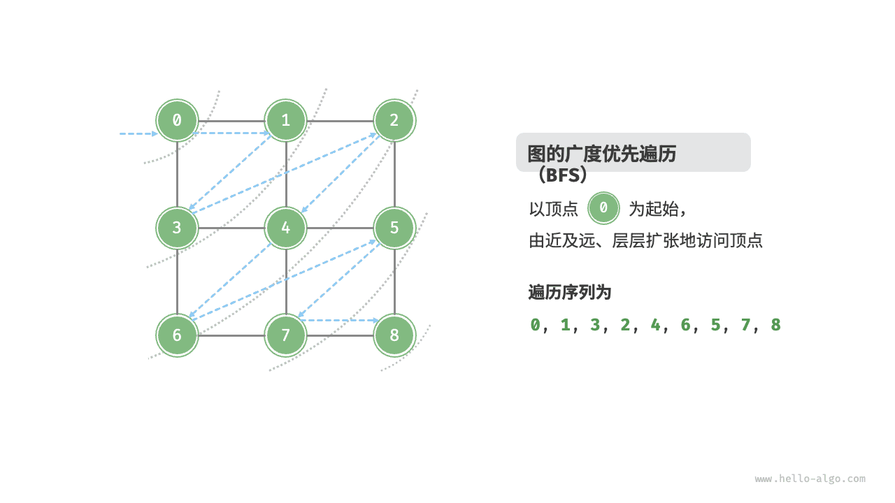
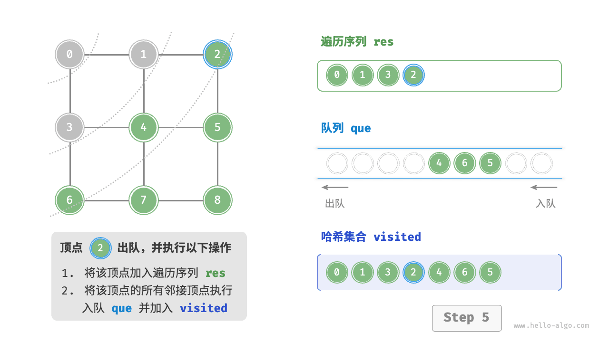
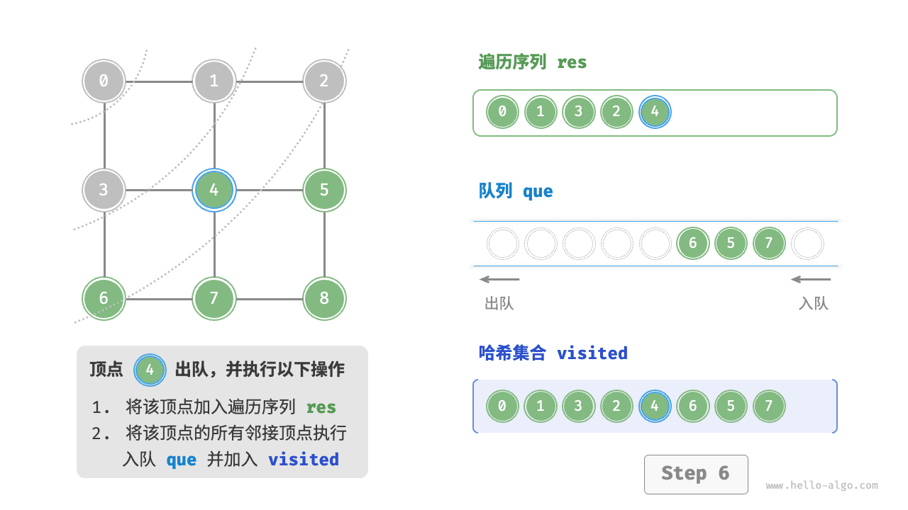
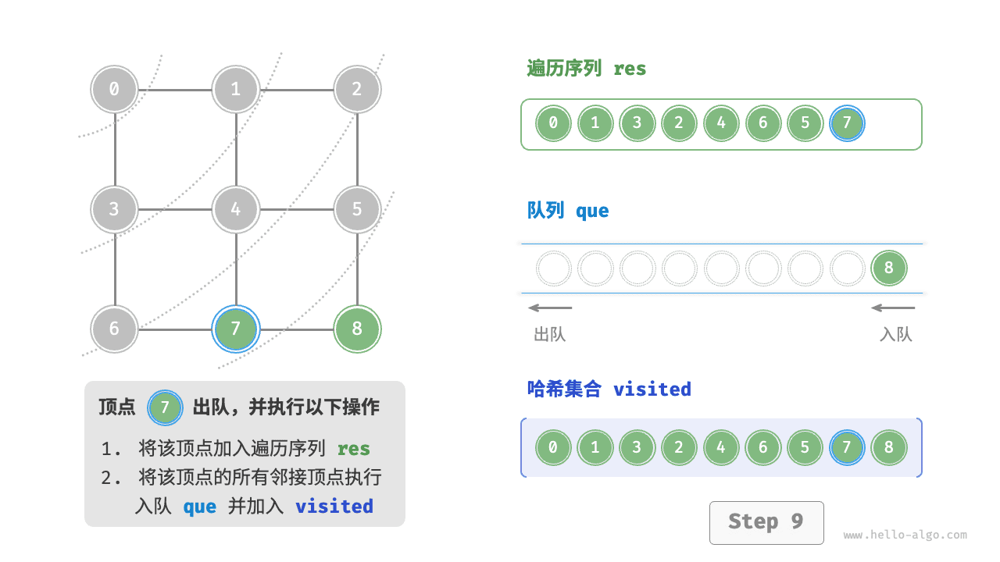
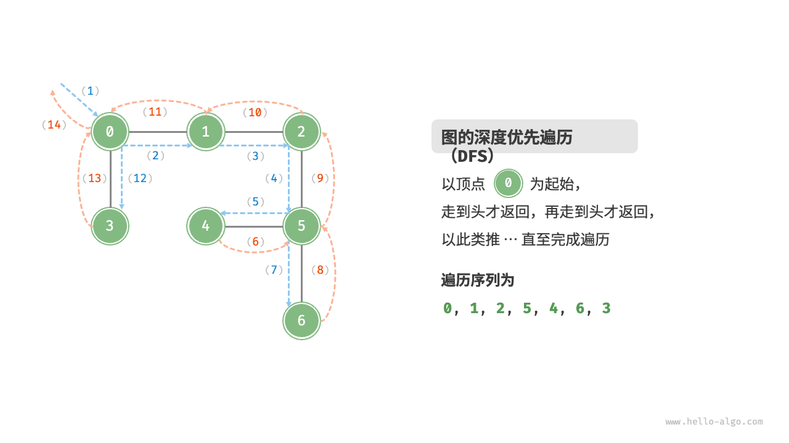
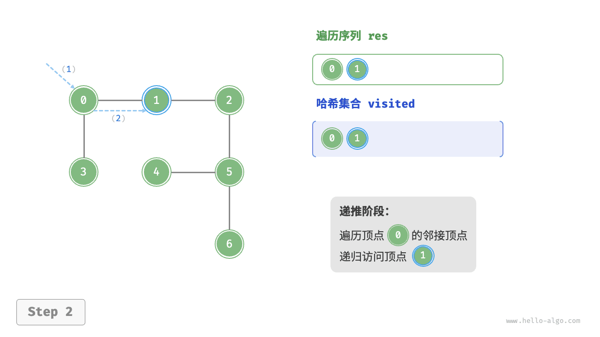
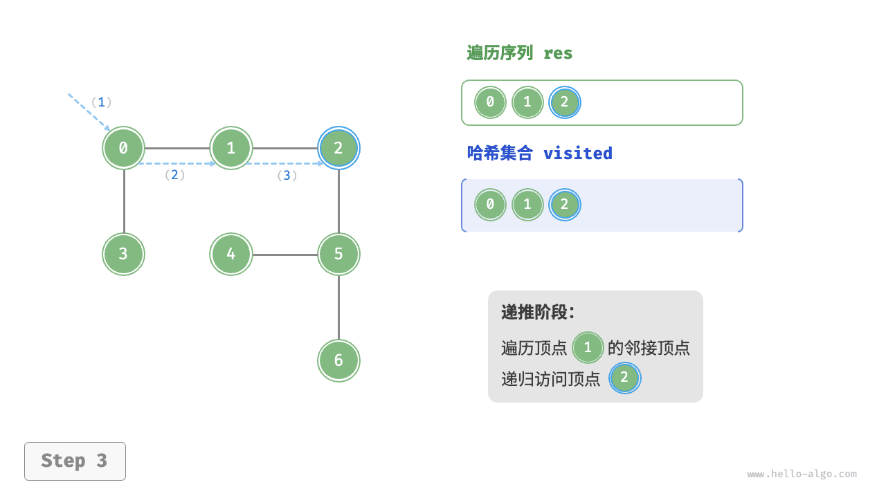
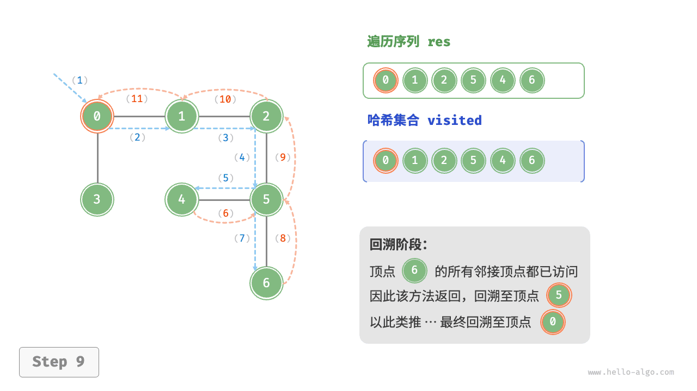
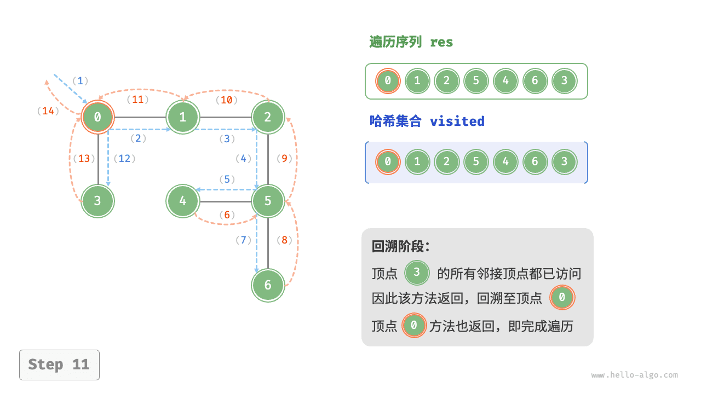

# 按图索骥

有了图的表示方法之后，下一步就是如何在图中进行搜索。图的搜索算法是后续所有图算法的基础——最短路径、拓扑排序、关键路径等，都是在 BFS 或 DFS 的基础上构建的。

计算机无法像人一样"一眼看出"图的全局结构，它必须按照某种策略，一步一步地访问图中的顶点。两种最基本的搜索策略是：

- **广度优先搜索（BFS）**：先访问离起点近的顶点，再逐步向外扩散
- **深度优先搜索（DFS）**：沿着一条路走到黑，走不通再回头

打个比方：BFS 像是在湖中投下一颗石子，水波一圈一圈向外扩散；DFS 像是在迷宫中探索，沿着一条通道走到底，遇到死胡同就退回上一个岔路口换一条路继续走。

## 1 广度优先搜索（BFS）

### 1.1 算法框架

BFS 的核心思想是：从起点出发，先访问所有距离为 1 的顶点，再访问所有距离为 2 的顶点，依此类推。这种"逐层扩散"的特性决定了它天然适合解决**无权图中的最短路径问题**。

BFS 用**队列**来实现：每访问一个顶点，就把它的未访问邻居加入队列尾部，保证先入队的顶点先被处理。

下图展示了一个 BFS 从起点出发逐步扩散到整个图的过程（共 11 步）：



下面是每一步的详细展开，可以对照代码理解队列的变化：

| 步骤 | 队列内容 | 当前访问 | 说明 |
|---|---|---|---|
| 1 | [0] | — | 起点 0 入队，准备开始遍历 |
| 2 | [] | 0 | 访问 0，探索其邻居 1、3，将 1、3 入队 |
| 3 | [1, 3] | 1 | 访问 1，探索其邻居 0、2、4；0 已访问，将 2、4 入队 |
| 4 | [3, 2, 4] | 3 | 访问 3，探索其邻居 0、2、4；0 已访问，2、4 已在队列中 |
| 5 | [2, 4] | 2 | 访问 2，探索其邻居 1、3、4、5；1、3 已访问，4 已在队列，将 5 入队 |
| 6 | [4, 5] | 4 | 访问 4，探索其邻居 1、3、2、5；1、3、2 已访问，5 已在队列 |
| 7 | [5] | 5 | 访问 5，探索其邻居 2、4；均已访问 |
| 8 | [] | — | 队列为空，遍历结束 |









```python
from collections import deque

def bfs(graph, start):
    """
    广度优先搜索（Breadth-First Search）
    
    参数:
        graph: 邻接表表示的图，graph[i] 是顶点 i 的邻居列表
        start: 起始顶点的编号
    
    工作原理:
        1. 将起点标记为已访问并入队
        2. 循环：从队首取出一个顶点访问它
        3. 将该顶点的所有未访问邻居标记为已访问并入队
        4. 重复直到队列为空
    """
    # visited 集合记录已经访问过的顶点，防止重复访问
    # 因为图中可能有环，不记录的话会死循环
    visited = set()
    
    # 初始化：将起点标记为已访问并入队
    queue = deque([start])
    visited.add(start)

    # 只要队列不为空，就继续遍历
    while queue:
        # 从队首取出一个顶点——这是 BFS "先进先出" 的关键
        # 保证先发现的顶点先被处理，从而实现逐层扩散
        v = queue.popleft()
        print(v, end=' ')            # 访问当前顶点（可替换为其他操作）

        # 遍历当前顶点的所有邻居
        for w in graph[v]:
            # 如果邻居还没有被访问过，就标记并入队
            if w not in visited:
                visited.add(w)       # 入队前先标记，避免重复入队
                queue.append(w)      # 将未访问的邻居加入队列尾部

# 时间复杂度: O(V + E)，每个顶点入队出队各一次，每条边被检查一次
# 空间复杂度: O(V)，队列和 visited 集合最多存储 V 个顶点
```

### 1.2 BFS 染色法

BFS 也可以用染色法标记顶点状态（白/灰/黑），与 DFS 类似：

- **白色**：未访问的顶点
- **灰色**：已入队但尚未处理完所有邻居
- **黑色**：所有邻居均已处理完毕

在实际实现中，visited 集合相当于"灰 + 黑"。BFS 染色法在下一章节"二分图判定"中会用到。

### 1.3 词梯问题

词梯问题是 BFS 的经典应用。问题描述如下：给定一个起始单词和一个目标单词，每次操作只能改变一个字母，且中间结果必须是词典中存在的单词。求从起始单词到目标单词所需的最少变换步数。

例如，从 FOOL 变换到 SAGE 的一条最短路径为：

```
FOOL → POOL → POLL → POLE → PALE → SALE → SAGE
```

每次只改一个字母，中间每一步都是真实存在的英语单词。

用图论的思想来解决这个问题，分为两步：

1. **建图**：将每个单词看作一个顶点，如果两个单词只差一个字母，就在它们之间连一条边
2. **BFS**：从起始单词出发做 BFS，到达目标单词时的层数就是最少的变换步数

建图的关键技巧是用"通配符桶"来避免两两比较（$O(n^2)$ 太慢）。例如，将 POPE 和 POPS 都放入 POP_ 这个桶中，同一个桶里的单词天然只差一个字母。

```python
from collections import deque

def build_graph(words):
    """
    构建词梯图
    
    参数:
        words: 单词列表（所有单词长度相同）
    
    返回:
        邻接表表示的图，键为单词，值为该单词的所有邻居单词列表
    
    建图思路:
        1. 为每个单词生成 len(word) 个通配符模式
           例如 "FOOL" → ["_OOL", "F_OL", "FO_L", "FOO_"]
        2. 将同一模式的单词放入同一个桶（buckets）
        3. 同一个桶内的单词之间只差一个字母，用边连接它们
    """
    # buckets 的键是通配符模式，值是匹配该模式的单词列表
    # 例如: buckets["PO_L"] = ["POLL", "POOL", "POLE"]
    buckets = {}
    
    # 第一步：遍历所有单词，将它们放入对应的桶中
    for word in words:
        # 对单词的每个位置，生成一个通配符模式
        for i in range(len(word)):
            # 将第 i 个字母替换为下划线
            # 例如 word="FOOL", i=1 → "F_OL"
            pattern = word[:i] + '_' + word[i+1:]
            
            # setdefault 等价于：如果 pattern 不存在就初始化为空列表
            buckets.setdefault(pattern, []).append(word)

    # 第二步：遍历所有桶，同一个桶内的单词两两连边
    # 因为同一个桶内的单词只在通配符位置不同，所以只差一个字母
    graph = {word: [] for word in words}
    for group in buckets.values():
        # 对桶内每对不同的单词 w1, w2 连一条边
        for w1 in group:
            for w2 in group:
                if w1 != w2:
                    graph[w1].append(w2)   # 无向图，双向连接
    return graph


def word_ladder(start, end, words):
    """
    词梯问题：用 BFS 求最短路径长度（最少变换步数）
    
    参数:
        start: 起始单词
        end: 目标单词
        words: 词典中的单词列表
    
    返回:
        最短路径上的单词总数（包含起点和终点）
        如果无法到达，返回 0
    
    BFS 为什么能找到最短路径？
        因为 BFS 按"层"遍历，第 k 层就是经过 k 次变换能到达的单词
        第一次遇到 end 时，一定经过了最少的变换次数
    """
    graph = build_graph(words)
    
    # BFS 标准模板
    visited = {start}                  # 已访问的单词集合
    queue = deque([(start, 1)])        # 队列元素：(单词, 当前路径长度)
                                       # 初始路径长度为 1（包含起点本身）

    while queue:
        word, step = queue.popleft()   # 取出队首单词

        if word == end:
            # 第一次遇到目标单词，当前步数就是最短路径长度
            # 因为 BFS 保证首次访问时路径最短
            return step

        # 遍历所有相邻的单词（只差一个字母的单词）
        for neighbor in graph.get(word, []):
            if neighbor not in visited:
                visited.add(neighbor)
                # 路径长度加 1 后入队
                queue.append((neighbor, step + 1))
    
    # 队列为空仍未找到 → 无法到达
    return 0
```

示例输入：
```
FOOL
SAGE
FOOL POOL POLL POLE PALE SALE SAGE
```

示例输出：
```
7
```

解释：FOOL → POOL → POLL → POLE → PALE → SALE → SAGE，共 6 次变换，路径上有 7 个单词。

### 1.3 双向 BFS 简介

当起点和终点都已知时，双向 BFS 是一种有效的优化技巧。它同时从起点和终点进行 BFS，当两个搜索相遇时就找到了最短路径。

```
普通 BFS：   起点 → → → → → → → → → → 终点（波面半径 = d）
双向 BFS：   起点 → → → | ← ← ← 终点（波面半径 = d/2）
```

假设分支因子为 k，搜索深度为 d：
- 普通 BFS 需要访问约 $k^d$ 个顶点
- 双向 BFS 每侧深度约为 d/2，各需访问约 $k^{d/2}$ 个顶点，合计约 $2k^{d/2}$ 个顶点

当 k 较大时，双向 BFS 的优势非常明显。词梯问题就是一个典型场景。

## 2 深度优先搜索（DFS）

### 2.1 递归实现

DFS 的核心思想是：从起点出发，沿着一条路径尽可能深地探索，直到无法继续时回溯到上一个分岔口，选择另一条路径继续。这是一种"走到黑再回头"的策略。

```python
def dfs_recursive(graph, v, visited=None):
    """
    深度优先搜索（递归实现）
    
    参数:
        graph: 邻接表表示的图
        v: 当前正在访问的顶点
        visited: 已访问顶点的集合
    
    工作原理:
        1. 标记当前顶点为已访问
        2. 对每个未访问的邻居，递归调用 dfs_recursive
        3. 递归天然实现了"深入→回溯"的过程：
           - 深入：递归调用进入下一层
           - 回溯：递归调用返回，回到上一层继续尝试其他邻居
    """
    if visited is None:
        visited = set()
    
    # 标记当前顶点为已访问
    visited.add(v)
    print(v, end=' ')                # 访问当前顶点（可替换为其他操作）

    # 遍历当前顶点的所有邻居，对未访问的邻居递归探索
    for w in graph[v]:
        if w not in visited:
            # 递归调用：进入更深一层
            # 当 dfs_recursive(w) 返回后，会继续尝试 graph[v] 中的下一个邻居
            # 这就是"回溯"——从深层返回到当前层，尝试另一个分支
            dfs_recursive(graph, w, visited)
    
    # 所有邻居都已探索完毕，函数返回 → 回溯到上一层
```

### 2.2 栈实现

递归本质上是函数调用栈，所以也可以用显式的栈来实现 DFS。两者的区别在于：

- 递归实现更简洁，但 Python 的递归深度有限制（默认约 1000 层）
- 栈实现不依赖递归，适合深度较大的图

```python
def dfs_stack(graph, start):
    """
    深度优先搜索（栈实现）
    
    参数:
        graph: 邻接表表示的图
        start: 起始顶点的编号
    
    工作原理:
        用栈（后进先出）替代了递归调用栈
        每次从栈顶取出一个顶点访问它，然后将未访问的邻居压入栈顶
        栈的特性保证了"后发现的邻居先被探索" → 深度优先
    """
    visited = set()
    stack = [start]                  # 用 Python 列表模拟栈

    while stack:
        # 从栈顶取出一个顶点（后进先出）
        v = stack.pop()
        
        # 注意：顶点 v 可能被多次压入栈，但只在第一次取出时访问
        if v not in visited:
            print(v, end=' ')        # 访问当前顶点
            visited.add(v)
            
            # 将未访问的邻居逆序压入栈
            # 逆序是为了保持与递归版本相同的访问顺序
            # 如果不逆序，原本排在后面的邻居会先被访问
            for w in reversed(graph[v]):
                if w not in visited:
                    stack.append(w)
    
    # 时间复杂度: O(V + E)
    # 空间复杂度: O(V)
```

下图展示了 DFS 从起点出发"深入→回溯→深入"的完整过程：



下面是每一步的详细展开：

| 步骤 | 栈内容 | 当前访问 | 说明 |
|---|---|---|---|
| 1 | [0] | — | 起点 0 入栈 |
| 2 | [] | 0 | 访问 0，将邻居 1、3 入栈（逆序后 1 在栈顶） |
| 3 | [3, 1] | 1 | 访问 1，将邻居 2、4 入栈（逆序后 2 在栈顶） |
| 4 | [3, 4, 2] | 2 | 访问 2，将邻居 5 入栈 |
| 5 | [3, 4, 5] | 5 | 访问 5，无未访问邻居，回溯 |
| 6 | [3, 4] | 4 | 访问 4，无未访问邻居，回溯 |
| 7 | [3] | 3 | 访问 3，无未访问邻居 |
| 8 | [] | — | 栈空，遍历结束 |










### 2.3 染色法（白/灰/黑）

在更复杂的图算法中，仅用"已访问/未访问"两种状态可能不够。定义三种颜色来表示顶点的访问状态：

| 颜色 | 含义 | 说明 |
|---|---|---|
| 白色（white） | 未访问 | 初始状态，还没有被探索过 |
| 灰色（gray） | 正在访问 | 顶点已入栈/入队，但其邻居尚未全部处理完 |
| 黑色（black） | 访问完成 | 顶点及其所有邻居都已处理完毕，不再需要关注 |

染色法在 DFS 中的作用尤为重要。当 DFS 遍历到一个灰色顶点时，说明存在一条从当前顶点到该灰色顶点的路径，而这个灰色顶点还在当前递归路径上——这就意味着图中存在一个**环**（即存在一条回边）。

```python
# 染色法的颜色常量
WHITE = 0    # 未访问
GRAY = 1     # 正在访问（在当前递归路径上）
BLACK = 2    # 访问完成

def dfs_color(graph):
    """
    带染色的 DFS 遍历
    颜色可以记录更丰富的顶点状态信息
    """
    n = len(graph)
    color = [WHITE] * n            # 全部初始化为白色

    def dfs_visit(v):
        color[v] = GRAY             # 顶点 v 开始被访问，标记为灰色
        print(f"发现: {v}")

        for w in graph[v]:
            if color[w] == WHITE:   # 白色邻居 → 递归探索
                dfs_visit(w)
            elif color[w] == GRAY:  # 灰色邻居 → 发现环！
                print(f"检测到环: {v} → {w} 是一条回边")
            # 黑色邻居：已处理完毕，无需操作

        color[v] = BLACK            # 所有邻居处理完毕，标记为黑色
        print(f"完成: {v}")

    for v in range(n):
        if color[v] == WHITE:
            dfs_visit(v)
```

## 3 骑士周游问题

骑士周游问题是 DFS 的经典应用。问题描述如下：在国际象棋棋盘上，骑士（马）按照"马走日"的规则移动，能否找到一条路径走遍棋盘上的每一格，且每格恰好只走一次？

这个问题吸引了许多数学家和计算机科学家。对于 8×8 的棋盘，可能的周游数量上界约为 $1.305 \times 10^{35}$，但绝大部分都是死路。我们需要用计算机来高效地搜索。

### 3.1 构建骑士周游图

解决思路与词梯问题类似：先将问题建模为图，再用图算法求解。

- **顶点**：棋盘上的每一格
- **边**：骑士从一格走到另一格的合法走法

将棋盘坐标 (row, col) 映射为线性编号 `id = row * board_size + col`。

```python
def build_knight_graph(board_size):
    """
    构建骑士周游图
    
    参数:
        board_size: 棋盘的边长（如 8 表示 8×8 棋盘）
    
    返回:
        graph: 邻接表，graph[id] 是该格的所有合法下一步
    
    骑士的走法——"马走日"：
        沿 x 方向移动 2 格、y 方向移动 1 格
        或沿 x 方向移动 1 格、y 方向移动 2 格
        共有 8 种可能的走法
    """
    # 马走日的 8 种偏移量 (行偏移, 列偏移)
    moves = [
        (-2, -1), (-2, 1),     # 向左跳（上/下）
        (-1, -2), (-1, 2),     # 向左偏上/下跳
        (1, -2),  (1, 2),      # 向右偏上/下跳
        (2, -1),  (2, 1)       # 向右跳（上/下）
    ]

    graph = {}
    for row in range(board_size):
        for col in range(board_size):
            # 将二维坐标 (row, col) 映射为一维编号
            node_id = row * board_size + col
            graph[node_id] = []

            # 检查 8 种走法是否在棋盘范围内
            for dr, dc in moves:
                nr, nc = row + dr, col + dc
                # 必须在棋盘内部 (0 ≤ nr, nc < board_size)
                if 0 <= nr < board_size and 0 <= nc < board_size:
                    neighbor = nr * board_size + nc
                    graph[node_id].append(neighbor)
    return graph
```

### 3.2 DFS 搜索

构建好图之后，用 DFS 来搜索一条长度为 $board\_size^2 - 1$ 的路径（即每个格子恰好访问一次）。DFS 擅长这种"深入探索，走不通就回溯"的任务——这正是骑士周游的本质。

```python
def knight_tour(n, path, u, graph):
    """
    骑士周游 DFS 搜索（朴素版）
    
    参数:
        n: 当前路径上已访问的顶点数
        path: 当前路径（列表，按访问顺序存储顶点编号）
        u: 当前正在访问的顶点
        graph: 邻接表
    
    返回:
        True 表示找到了一条完整的骑士周游路径
        False 表示从 u 出发无法走完所有格子
    
    搜索策略：
        1. 将当前顶点 u 加入路径
        2. 如果 n == 总顶点数，说明所有格子都已访问，找到解
        3. 否则，对 u 的每个未访问邻居尝试递归探索
        4. 如果所有邻居都探索失败，回溯：将 u 从路径中移除
    """
    # 将当前顶点加入路径
    path.append(u)

    # 如果路径上的顶点数等于总顶点数，说明找到了一条完整路径
    # path 中存储了从起点到 u 的所有顶点，长度为 board_size^2
    if n < len(graph):
        # 尚未覆盖所有格子，需要继续探索
        for v in graph[u]:
            # 只尝试还没有访问过的格子
            if v not in path:
                # 递归探索下一步
                # 如果递归返回 True，说明找到了可行解，直接向上返回
                if knight_tour(n + 1, path, v, graph):
                    return True
        # 代码执行到这里，说明 u 的所有邻居都尝试过了，都无法走完
        # 这就是"死路"——回溯：将 u 从路径中移除
        path.pop()
        return False
    else:
        # 所有顶点都已访问，找到了一条完整的骑士周游路径
        return True
```

### 3.3 Warnsdorff 启发式优化

不加优化的朴素 DFS 在 5×5 棋盘上约需 1.5 秒，但在 8×8 棋盘上可能需要半小时以上才能找到一个解。这是因为搜索树过于庞大——每个顶点平均有 5.25 种走法，树的总节点数约为 $5.25^{64}$。

Warnsdorff 在 1823 年提出了一条非常简单的启发式规则：

> **优先选择"下一步可选走法最少"的顶点**

听起来有些反直觉——为什么不是选走法最多的呢？原因是：先走那些"出路少"的格子（如棋盘的角落和边缘），把"出路多"的格子（棋盘中央）留到后面。这样可以避免骑士在周游后期被困在无法到达的角落。

```python
def ordered_by_avail(u, path, graph):
    """
    Warnsdorff 启发式：对邻居按"下一步可选走法数"升序排列
    
    参数:
        u: 当前顶点
        path: 当前已走的路径
        graph: 邻接表
    
    返回:
        按 Warnsdorff 规则排序后的邻居列表
    
    为什么选走法最少的？
        棋盘角落只有 2 种走法，中央有 8 种。
        优先走角落可以避免骑士后期被困在无法到达的格子中。
        这相当于"先解决困难的、选择少的问题"的贪心策略。
    """
    candidates = []
    for v in graph[u]:
        if v not in path:
            # 统计顶点 v 还有多少个未访问的邻居
            # 这个数字越小，说明 v 的"出路"越少，应优先访问
            count = sum(1 for w in graph[v] if w not in path)
            candidates.append((count, v))
    
    # 按可选走法数升序排列（count 最小的排在最前面）
    candidates.sort()
    return [v for _, v in candidates]


def knight_tour_warnsdorff(n, path, u, graph):
    """
    骑士周游（Warnsdorff 优化版）
    
    与朴素版的唯一区别：
        循环中不再按原始顺序遍历邻居，
        而是按 Warnsdorff 规则排序后再遍历。
    
    效果：8×8 棋盘上可以在 1 秒内找到解，
         而朴素版可能需要半小时以上。
    """
    path.append(u)

    if n < len(graph):
        # 关键区别：使用 ordered_by_avail 对邻居排序
        for v in ordered_by_avail(u, path, graph):
            if knight_tour_warnsdorff(n + 1, path, v, graph):
                return True
        path.pop()
        return False
    else:
        return True
```

## 4 环检测

### 4.1 无向图环检测（DFS + parent）

在无向图中进行 DFS 时，如果遇到一个已经访问过的顶点，并且这个顶点不是当前顶点的"父顶点"（即在 DFS 树中直接指向当前顶点的那个顶点），就说明图中存在环。

为什么需要排除父顶点？因为在无向图中，边 (u, v) 是双向的。从 u 走到 v 后，DFS 会从 v 再尝试回到 u。如果只是因为这个"回头"就判定有环，那就错了——必须区分"走回头路"和"发现了另一条路径回到已访问顶点"。

```python
def has_cycle_undirected(graph):
    """
    检测无向图中是否存在环（DFS + parent 方法）
    
    参数:
        graph: 邻接表表示的图
    
    返回:
        True 表示图中存在环，False 表示无环
    
    算法思路：
        从每个未访问的顶点开始 DFS，
        在 DFS 过程中记录"父顶点"——即从哪个顶点来到当前顶点。
        如果遇到一个已访问的顶点且不是父顶点，说明找到了环。
    """
    visited = set()

    def dfs(v, parent):
        """
        从顶点 v 开始 DFS
        parent: 在 DFS 树中，v 的父顶点（即从哪个顶点来到 v）
        """
        visited.add(v)

        for w in graph[v]:
            if w not in visited:
                # w 是未访问的白色顶点，递归探索
                # 此时 v 是 w 的父顶点
                if dfs(w, v):          # 如果递归中发现了环，向上传递
                    return True
            elif w != parent:
                # w 已访问（不是白色），且 w 不是 v 的父顶点
                # 说明存在另一条路径可以到达 w，这是环的标志
                # 因为无向图中除了"回头"之外，只有环能产生这种情况
                return True
        return False

    # 遍历所有顶点，处理非连通图的情况
    for v in graph:
        if v not in visited:
            # 起始顶点的父顶点设为 -1（不存在）
            if dfs(v, -1):
                return True
    return False
```

示例输入：
```
3 3
0 1
1 2
2 0
```

示例输出：
```
True
```

解释：顶点 0-1-2-0 构成一个三角形环。从 0 出发 DFS 经过 1 到达 2，2 的邻居 0 已访问且不是 2 的父顶点 1，判定有环。

### 4.2 有向图环检测（DFS + 递归栈）

有向图的情况更复杂。在无向图中，一个顶点被访问过且不是父顶点就足以说明有环；但在有向图中，即使遇到已访问的顶点，也可能只是"从另一条路径来过这里"，并不一定构成环。

关键区别在于**方向**。有向图中的环要求沿着边的方向能走回自己。因此，我们需要额外维护一个**递归栈**——记录当前 DFS 路径上正在访问的顶点。只有遇到一个**在当前递归栈中**的已访问顶点，才说明存在环（即存在一条回边）。

```python
def has_cycle_directed(graph):
    """
    检测有向图中是否存在环（DFS + 递归栈方法）
    
    参数:
        graph: 邻接表表示的有向图
    
    返回:
        True 表示存在环，False 表示无环（即 DAG）
    
    为什么无向图的方法不适用于有向图？
        无向图中边是双向的，遇到已访问节点（非父节点）就是环。
        有向图中边有方向，可能两条路径汇聚到同一个节点，但不构成环。
        例如：0→1, 0→2, 1→2。从 0 出发 DFS，2 会被 1 访问到，
        但 1 到 2 再到不了 1，所以不是环。
    
    解决方法：使用"递归栈"记录当前 DFS 路径上的顶点。
    只有遇到在递归栈中的顶点，才说明存在"回边"（环）。
    """
    visited = set()       # 所有已访问的顶点（无论是哪条路径）
    rec_stack = set()     # 当前 DFS 递归路径上的顶点

    def dfs(v):
        """
        从顶点 v 开始 DFS
        """
        visited.add(v)
        rec_stack.add(v)            # v 进入当前递归路径

        for w in graph[v]:
            if w not in visited:
                # w 是未访问的顶点，递归探索
                if dfs(w):
                    return True
            elif w in rec_stack:
                # w 已访问且仍在当前递归栈中！
                # 说明从 w 出发经过若干顶点又回到了 w
                # 这就是回边（back edge），是环存在的标志
                return True
            # 如果 w 已访问但不在递归栈中（在 visited 但不在 rec_stack），
            # 说明 w 是之前某次 DFS 已经处理完的顶点，不是环

        # v 的所有邻居都已处理完毕，从递归栈中移除
        rec_stack.remove(v)
        return False

    # 遍历所有顶点，处理非连通图的情况
    for v in graph:
        if v not in visited:
            if dfs(v):
                return True
    return False
```

示例输入：
```
4 4
0 1
1 2
2 3
3 1
```

示例输出：
```
True
```

解释：顶点 1 → 2 → 3 → 1 构成一个环。顶点 0 不在环中，但不影响整体判环结果。

### 4.3 无向图环检测（并查集）

并查集也可以用来检测无向图是否有环。遍历每条边，如果两个端点已在同一集合中，说明存在环。

```python
class UnionFind:
    def __init__(self, n):
        self.parent = list(range(n))

    def find(self, x):
        if self.parent[x] != x:
            self.parent[x] = self.find(self.parent[x])
        return self.parent[x]

    def union(self, x, y):
        rx, ry = self.find(x), self.find(y)
        if rx == ry:
            return False                     # 已在同一集合 → 有环
        self.parent[ry] = rx
        return True

def has_cycle_union_find(n, edges):
    """并查集检测无向图是否有环"""
    uf = UnionFind(n)
    for u, v in edges:
        if not uf.union(u, v):
            return True
    return False
```

### 4.4 有向图环检测（Kahn 算法）

拓扑排序的 Kahn 算法天然支持环检测：如果有顶点永远无法入队（入度始终大于 0），说明存在环。详见拓扑排序章节。

| 图类型 | 方法 | 核心思想 | 时间复杂度 |
|---|---|---|---|
| 无向图 | DFS + parent | 遇到已访问且非父节点 | O(V+E) |
| 无向图 | 并查集 | 检查是否连通重复 | O(α(n)) |
| 有向图 | DFS + 递归栈 | 检查回边 | O(V+E) |
| 有向图 | Kahn 拓扑排序 | 检查是否全部入队 | O(V+E) |

## 5 编程题目

### 5.1 走山路（20106）

bfs + heap, Dijkstra, http://cs101.openjudge.cn/routine/20106/

在一个二维网格中，每个格子有高度值。从起点走到终点，每次可以上下左右移动，相邻格子的高度差绝对值即为体力消耗。求最小体力消耗。

这道题虽然是 BFS，但不能用普通队列——因为代价不是均匀的（每一步消耗 = 高度差）。需要使用优先队列（最小堆），每次先扩展当前总代价最小的路径。这其实就是 Dijkstra 算法的思想。

**输入**：第一行四个整数 H、W、P、Q（地图高、地图宽、起点行、起点列）。之后 H 行每行 W 个整数，表示每个格子的高度。最后一行四个整数 X1、Y1、X2、Y2（终点行、终点列）。

**输出**：一个整数，表示最小体力消耗。若无法到达输出 -1。

示例输入：
```
3 3 0 0
5 1 3
2 8 4
6 7 9
2 2
```

示例输入：
```
3 3
0 0 2 2
5 1 3
2 8 4
6 7 9
```

示例输出：
```
6
```

### 5.2 鸣人和佐助（04115）

bfs, http://cs101.openjudge.cn/practice/04115/

鸣人需要找到佐助。路上可能遇到敌人（'#'）。鸣人有查克拉（chakra），每次消耗 1 点查克拉可以跳过一格敌人。普通格子（'*'）可以直接走。求最少步数。

**输入**：第一行三个整数 M、T、K（地图行数、列数、初始查克拉数）。之后 M 行每行 T 个字符，`@` 表示鸣人起始位置，`+` 表示佐助位置，`*` 表示可通行，`#` 表示敌人。

**输出**：一个整数，表示找到佐助的最少步数。若无法找到输出 -1。

示例输入：
```
4 4 1
#*##
---+
#*#*
*#*#
```

示例输出：
```
6
```

示例输入：
```
4 4 1
#*##
---+
#*#*
*#*#
```

示例输出：
```
6
```

### 5.3 拯救行动（04116）

bfs, http://cs101.openjudge.cn/practice/04116/

营救公主。地图上有敌人（'x'，杀死需要 2 个时间单位）和平地（需要 1 个时间单位），障碍（'#'）不可通行。求拯救公主的最小时间。

**输入**：第一行两个整数 m、n（地图行数、列数）。之后 m 行每行 n 个字符，`@` 表示起始位置，`a` 表示公主位置，`x` 表示敌人，`#` 表示障碍，`.` 表示可通行。

**输出**：一个整数，表示救到公主的最小时间。若无法到达输出 -1。

示例输入：
```
7 8
#@#####a
#.....#x
#.#####.
#.....#.
.#.###..
..#...x.
...x....
```

示例输出：
```
13
```

示例输入：
```
7 8
#@#####a
#.....#x
#.#####.
#.....#.
.#.###..
..#...x.
...x....
```

示例输出：
```
13
```

### 5.4 变换的迷宫（04129）

bfs, http://cs101.openjudge.cn/practice/04129

迷宫中的障碍物会周期性消失：每 T 步，障碍物暂时消失一次，此时可以通行。求能否逃出迷宫。

**输入**：第一行三个整数 R、C、T（行数、列数、周期）。接下来 R 行每行 C 个字符，`S` 表示起点，`E` 表示出口，`X` 表示障碍物，`.` 表示空地。

**输出**：一个整数，表示逃出迷宫的最少步数。若无法逃出输出 -1。

示例输入：
```
3 3 2
S..
.X.
..E
```

示例输出：
```
4
```

```python
from collections import deque

def escape_maze(grid, start, end, T):
    """
    变换的迷宫：BFS + 时间维度（周期性障碍）
    
    参数:
        grid: 二维网格，'X' 为障碍物，其他为可走
        start: 起点坐标
        end: 终点坐标
        T: 障碍物消失周期（每 T 步消失一次）
    
    返回:
        到达终点的最少步数，无法到达返回 -1
    
    核心难点——障碍物周期性变化：
        在时间 t 时，如果 t % T == 0，障碍物消失，'X' 也可通行。
        所以同一个格子 (r,c) 在不同时间 t 的可达性不同。
        visited[r][c][t % T] 记录了在时间状态下是否访问过。
    """
    rows, cols = len(grid), len(grid[0])
    
    # visited[r][c][t_mod]：在时间模 T 为 t_mod 时是否访问过 (r,c)
    # 第三维大小为 T，用来记录时间周期内的不同状态
    visited = [[[False] * T for _ in range(cols)] for _ in range(rows)]
    
    sr, sc = start
    visited[sr][sc][0] = True
    
    # 队列元素：(行, 列, 当前时间)
    queue = deque([(sr, sc, 0)])
    directions = [(1, 0), (-1, 0), (0, 1), (0, -1)]

    while queue:
        r, c, t = queue.popleft()

        # 到达终点，返回步数
        if (r, c) == end:
            return t

        for dr, dc in directions:
            nr, nc = r + dr, c + dc
            
            # 检查是否在网格范围内
            if 0 <= nr < rows and 0 <= nc < cols:
                nt = t + 1          # 下一步的时间
                
                # 关键规则：
                # 1. 如果不是障碍物，可以走
                # 2. 如果是障碍物，但 nt % T == 0（障碍物消失时刻），也可以走
                if grid[nr][nc] != 'X' or nt % T == 0:
                    if not visited[nr][nc][nt % T]:
                        visited[nr][nc][nt % T] = True
                        queue.append((nr, nc, nt))
    return -1
```

示例输入：
```
3 3 2
S..
.X.
..E
```

示例输出：
```
4
```

## 本章小结

- **BFS** 用队列实现，按"逐层扩散"的方式遍历，适合求无权图最短路径
  - 词梯问题展示了 BFS 的实际应用：建图 + BFS 求最短路径
  - 双向 BFS 是当起点终点均已知时的重要优化技巧
- **DFS** 用递归或栈实现，按"走到底再回溯"的方式遍历，适合探索所有可能性
  - 骑士周游问题展示了 DFS 的实际应用
  - Warnsdorff 启发式可大幅优化搜索效率（优先选"出路少"的顶点）
- **染色法**（白/灰/黑）在 DFS 中用于记录访问状态，灰色顶点可帮助检测环
- **环检测**：
  - 无向图：DFS + parent 即可判定
  - 有向图：DFS + 递归栈，区分"已访问"和"在当前路径上"
- 本章的编程题目涵盖了 BFS 在不同场景下的变形：
  - 走山路：BFS + 堆（代价不均等时用优先队列）
  - 鸣人和佐助：BFS + 额外状态维度（查克拉）
  - 拯救行动：BFS + 双端队列（0-1 BFS 优化）
  - 变换的迷宫：BFS + 时间维度（周期性障碍）
