# 拓扑排序

拓扑排序（Topological Sorting）是对有向无环图（DAG）进行排序的一种算法。它将图中的顶点按照一种线性顺序排列，使得对于任意有向边 (u, v)，顶点 u 在排序结果中都出现在顶点 v 之前。

听起来有些抽象，但它的应用非常直观：在大学里，你需要先修完"数据结构与算法"才能选修"计算机网络"——这就是一个依赖关系。把每门课程看作顶点，"先修关系"看作有向边，就得到了一张有向无环图。拓扑排序就是找出一种"不违反任何先修要求"的课程修读顺序。

## 1 DAG 与拓扑排序

### 1.1 DAG 的定义与性质

**DAG（Directed Acyclic Graph）**是有向无环图，即不存在任何环的有向图。DAG 具有以下重要性质：

- 至少存在一个入度为 0 的顶点（没有前置依赖）
- 至少存在一个出度为 0 的顶点（不依赖于任何其他顶点）
- DAG 一定存在拓扑排序，反之亦然——如果一个有向图存在拓扑排序，它一定是 DAG

```python
# 判断 DAG 的两种方法：
# 1. Kahn 算法：如果所有顶点都能被排序，说明是 DAG
# 2. DFS + 递归栈：如果不存在回边，说明是 DAG
# 两种方法的时间复杂度都是 O(V + E)
```

### 1.2 拓扑排序的定义

拓扑排序将 DAG 中的所有顶点排成一个线性序列，使得对于每条有向边 (u, v)，u 在序列中都出现在 v 之前。

```
一个 DAG 可能有多个合法的拓扑排序。

例如：  0 → 1 → 2
        ↓
        3

合法的拓扑排序有：[0, 1, 2, 3] 和 [0, 1, 3, 2] 等
但不合法的序列：[1, 0, 2, 3] —— 因为 0 → 1，0 必须在 1 之前
```

拓扑排序的经典应用场景：

- **课程安排**：根据课程的先修关系制定学习计划
- **任务调度**：确定有依赖关系的任务的执行顺序
- **编译顺序**：确定源文件的编译顺序（Makefile 的底层原理）

## 2 Kahn 算法（BFS 版）

Kahn 算法基于一个简单的观察：**入度为 0 的顶点没有任何前置依赖，可以排在最前面**。算法反复"移除入度为 0 的顶点及其出边"，直到所有顶点都被处理。

### 2.1 算法流程

```python
from collections import deque, defaultdict

def topological_sort_kahn(graph):
    """
    Kahn 算法：基于 BFS 的拓扑排序
    
    参数:
        graph: 邻接表，graph[u] = [v1, v2, ...] 表示 u → v1, u → v2
    
    返回:
        拓扑排序后的顶点列表。如果存在环，返回 None
    
    算法步骤：
        1. 计算每个顶点的入度
        2. 将所有入度为 0 的顶点入队
        3. 循环：从队首取出一个顶点，加入结果列表，
           然后将其所有邻居的入度减 1，
           如果邻居入度变为 0，则入队
        4. 如果结果列表长度等于顶点数，排序成功；否则说明有环
    """
    # 第一步：计算每个顶点的入度
    # 遍历每条边 (u, v)，将 v 的入度加 1
    indegree = defaultdict(int)
    for u in graph:
        for v in graph[u]:
            indegree[v] += 1
        # 确保每个顶点都在 indegree 中（即使入度为 0）
        if u not in indegree:
            indegree[u] = 0

    # 第二步：将入度为 0 的顶点加入队列
    # 这些顶点没有前置依赖，可以直接处理
    queue = deque([u for u in graph if indegree[u] == 0])
    result = []

    # 第三步：循环处理队列
    while queue:
        u = queue.popleft()
        result.append(u)

        # 将 u 的所有邻居的入度减 1
        # 相当于"移除" u 及其出边
        for v in graph[u]:
            indegree[v] -= 1
            # 如果入度变为 0，说明 v 的所有前置依赖都已处理
            if indegree[v] == 0:
                queue.append(v)

    # 第四步：判断是否有环
    # 如果存在环，环上的顶点入度永远不会变为 0
    if len(result) == len(graph):
        return result
    else:
        return None  # 图中存在环，无法进行拓扑排序
```

### 2.2 逐步执行示例

以一个具体的 DAG 为例，观察 Kahn 算法每一步的变化：

```
         0 ──→ 1 ──→ 3
         │             ↑
         ↓             │
         2 ────────→ 4

入度：in[0]=0, in[1]=1, in[2]=1, in[3]=1, in[4]=2
```

| 步骤 | 队列 | 出队 | 结果 | 操作 |
|---|---|---|---|---|
| 1 | [0] | — | [] | 入度为 0 → 0 入队 |
| 2 | [] | 0 | [0] | 访问 0，in[1]-1=0, in[2]-1=0 |
| 3 | [1, 2] | 1 | [0, 1] | 访问 1，in[3]-1=0 |
| 4 | [2, 3] | 2 | [0, 1, 2] | 访问 2，in[4]-1=1（不为 0） |
| 5 | [3] | 3 | [0, 1, 2, 3] | 访问 3 |
| 6 | [4] | 4 | [0, 1, 2, 3, 4] | 访问 4 |

拓扑排序结果：`[0, 1, 2, 3, 4]`（不唯一，`[0, 2, 1, 3, 4]` 也是合法的）

### 2.3 环检测机制

Kahn 算法天然具有环检测功能：如果结果列表的长度小于顶点总数，说明有些顶点永远无法入队——这些顶点形成了环。

```
有环的例子： 0 → 1 → 2 → 0

计算入度：in[0]=1, in[1]=1, in[2]=1
初始入队：没有入度为 0 的顶点！
结果：None（存在环）
```

### 2.3 时间复杂度

- 计算入度：O(V + E)
- 每个顶点入队出队一次：O(V)
- 每条边被处理一次（入度减 1）：O(E)
- 总时间复杂度：**O(V + E)**

## 3 DFS 版拓扑排序

DFS 版拓扑排序基于这样一个观察：**在 DFS 中，一个顶点的结束时间（finish time）越晚，它在拓扑排序中的位置越靠前**。

### 3.1 按结束时间逆序输出

```python
def topological_sort_dfs(graph):
    """
    DFS 版拓扑排序
    
    原理：
        DFS 遍历时，拓扑序正好是顶点"结束时间"的逆序。
        当一个顶点的所有邻居都已递归完成，该顶点才"结束"。
        最后结束的顶点排在拓扑序的最前面。
    
    参数:
        graph: 邻接表
    返回:
        拓扑排序后的顶点列表。如果存在环，返回 None
    """
    WHITE, GRAY, BLACK = 0, 1, 2
    color = {u: WHITE for u in graph}
    result = []
    
    # 用递归栈检测环：如果遇到 GRAY 顶点，说明存在回边（环）
    has_cycle = [False]

    def dfs(u):
        """
        从 u 开始 DFS
        当一个顶点的所有邻居都处理完毕后，将 u 加入结果
        """
        color[u] = GRAY          # u 正在被访问

        for v in graph[u]:
            if color[v] == GRAY:
                # 遇到正在访问中的顶点，说明存在回边 → 有环
                has_cycle[0] = True
                return
            if color[v] == WHITE:
                dfs(v)

        # u 的所有邻居都已处理完毕（黑色或不存在）
        color[u] = BLACK
        # 将 u 加入结果——后加入的顶点在拓扑序中更靠前
        result.append(u)

    for u in graph:
        if color[u] == WHITE:
            dfs(u)
            if has_cycle[0]:
                return None     # 存在环，无法拓扑排序

    # result 是结束时间的逆序，反转后即为拓扑序
    result.reverse()
    return result
```

DFS 版拓扑排序与 Kahn 算法的对比：

| 方面 | Kahn 算法 | DFS 版 |
|---|---|---|
| 基础 | BFS（队列） | DFS（递归/栈） |
| 环检测 | 判断结果长度 | 检测 GRAY 顶点（回边） |
| 实现难度 | 更直观 | 需要理解递归和回溯 |
| 时间复杂度 | 都是 O(V + E) | 都是 O(V + E) |

## 4 应用案例：煎松饼问题

制作松饼的过程包含多个有依赖关系的步骤。例如，必须先混合原材料才能倒入锅中，必须先加热平底锅才能倒入面糊。用一个 DAG 来表示这些依赖关系，再用拓扑排序找出合理的操作顺序。

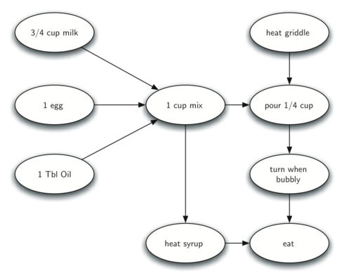

依赖关系如下：
- 倒入面糊 依赖于 混合原材料 和 加热平底锅
- 翻面 依赖于 倒入面糊
- 加热枫糖浆 依赖于 混合原材料
- 享用 依赖于 翻面 和 加热枫糖浆

```python
from collections import deque, defaultdict

# 用邻接表表示松饼制作的依赖关系
# u → v 表示 "必须先做 u，才能做 v"
pancake_graph = {
    'cup_milk': ['mix_ingredients'],        # 3/4 杯牛奶 → 混合材料
    'egg': ['mix_ingredients'],             # 一个鸡蛋 → 混合材料
    'tbl_oil': ['mix_ingredients'],         # 1 勺油 → 混合材料
    'heat_griddle': ['pour_batter'],        # 加热平底锅 → 倒入面糊
    'mix_ingredients': ['pour_batter', 'heat_syrup'],  # 混合材料 → 倒入面糊、加热枫糖浆
    'pour_batter': ['turn_pancake'],        # 倒入面糊 → 翻面
    'turn_pancake': ['eat_pancake'],        # 翻面 → 享用
    'heat_syrup': ['eat_pancake'],          # 加热枫糖浆 → 享用
    'eat_pancake': []                       # 享用（无后续依赖）
}

# 用 Kahn 算法求解
def topological_sort(graph):
    """Kahn 算法"""
    indegree = defaultdict(int)
    for u in graph:
        for v in graph[u]:
            indegree[v] += 1
        if u not in indegree:
            indegree[u] = 0

    queue = deque([u for u in graph if indegree[u] == 0])
    result = []

    while queue:
        u = queue.popleft()
        result.append(u)
        for v in graph[u]:
            indegree[v] -= 1
            if indegree[v] == 0:
                queue.append(v)

    return result if len(result) == len(graph) else None

order = topological_sort(pancake_graph)
print("松饼制作顺序：", ' → '.join(order))
# 可能的输出：
# 松饼制作顺序：cup_milk → egg → tbl_oil → heat_griddle → mix_ingredients → pour_batter → heat_syrup → turn_pancake → eat_pancake
```


**DFS 版煎松饼实现**：

```python
import sys

class Vertex:
    """顶点类，记录颜色、发现时间、结束时间"""
    def __init__(self, key):
        self.key = key
        self.neighbors = {}
        self.color = 'white'       # 白色=未访问, 灰色=访问中, 黑色=完成
        self.discovery = 0         # 发现时间
        self.finish = None         # 结束时间

    def add_neighbor(self, nbr, weight=0):
        self.neighbors[nbr] = weight

    def get_neighbors(self):
        return self.neighbors.keys()


class DFSGraph:
    """带 DFS 拓扑排序的图类"""
    def __init__(self):
        self.vertices = {}
        self.time = 0
        self.topological_list = []

    def add_vertex(self, key):
        self.vertices[key] = Vertex(key)

    def add_edge(self, f, t):
        if f not in self.vertices:
            self.add_vertex(f)
        if t not in self.vertices:
            self.add_vertex(t)
        self.vertices[f].add_neighbor(self.vertices[t])

    def dfs(self):
        """对整个图进行 DFS"""
        for v in self.vertices.values():
            v.color = 'white'
            v.predecessor = -1
        for v in self.vertices.values():
            if v.color == 'white':
                self.dfs_visit(v)

    def dfs_visit(self, start_vertex):
        """从 start_vertex 开始递归 DFS"""
        start_vertex.color = 'gray'
        self.time += 1
        start_vertex.discovery = self.time

        for next_vertex in start_vertex.get_neighbors():
            if next_vertex.color == 'white':
                self.dfs_visit(next_vertex)

        start_vertex.color = 'black'
        self.time += 1
        start_vertex.finish = self.time
        # 按结束时间入栈（结束后加入拓扑序）
        self.topological_list.append(start_vertex.key)

    def topological_sort(self):
        """DFS 版拓扑排序：按结束时间逆序"""
        self.dfs()
        # 按结束时间降序排列
        temp = list(self.vertices.values())
        temp.sort(key=lambda x: x.finish, reverse=True)
        self.topological_list = [x.key for x in temp]
        return self.topological_list


# 构建煎松饼图
g = DFSGraph()
g.add_vertex('cup_milk')
g.add_vertex('egg')
g.add_vertex('tbl_oil')
g.add_vertex('heat_griddle')
g.add_vertex('mix_ingredients')
g.add_vertex('pour_batter')
g.add_vertex('turn_pancake')
g.add_vertex('heat_syrup')
g.add_vertex('eat_pancake')

g.add_edge('cup_milk', 'mix_ingredients')
g.add_edge('egg', 'mix_ingredients')
g.add_edge('tbl_oil', 'mix_ingredients')
g.add_edge('mix_ingredients', 'pour_batter')
g.add_edge('mix_ingredients', 'heat_syrup')
g.add_edge('heat_griddle', 'pour_batter')
g.add_edge('pour_batter', 'turn_pancake')
g.add_edge('turn_pancake', 'eat_pancake')
g.add_edge('heat_syrup', 'eat_pancake')

order = g.topological_sort()
print("DFS 拓扑排序结果:", order)
```

排好序后的结果：

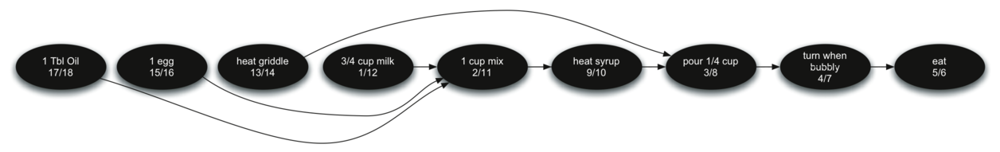

### 4.1 DFS 括号性质

DFS 为每个顶点记录两个时间戳：**发现时间**（`discovery`）和**结束时间**（`finish`）。这两个时间戳有一个重要的性质——**括号性质**：在 DFS 树中，祖先顶点的发现/结束区间完全包含其后代的区间。也就是说，对任意两个顶点 u、v，以下三种情况必居其一：

- 区间 `[discovery[u], finish[u]]` 和 `[discovery[v], finish[v]]` 互不相交——u、v 分属不同子树
- `[discovery[u], finish[u]]` 包含 `[discovery[v], finish[v]]`——u 是 v 的祖先
- `[discovery[v], finish[v]]` 包含 `[discovery[u], finish[u]]`——v 是 u 的祖先

因为区间的嵌套关系形如括号 `( [ ( ) ] )`，故称为"括号性质"。

下图展示了一个 6 顶点图（A–F）的 DFS 逐步构建过程。每个顶点标记为 `key|discovery/finish`：

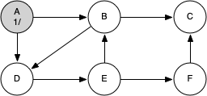
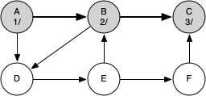
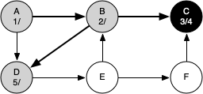
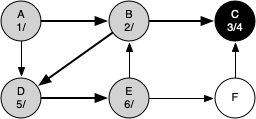
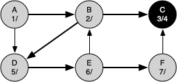
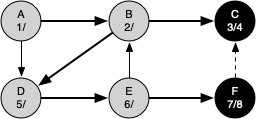
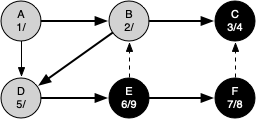
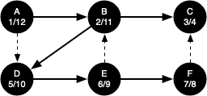

最终的 DFS 树及所有顶点的发现/结束时间：

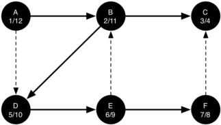

观察 A 的区间 `[1, 12]` 包含 B 的 `[2, 11]`，B 的区间又包含 C 的 `[3, 4]` 和 D 的 `[5, 10]`，形成 `1(2(3(4)5(6(7(8)9)10)11)12)` 的括号嵌套结构。

**括号性质的意义**：
- 判断顶点间的祖先-后代关系只需比较 discovery/finish 区间
- 在拓扑排序中，结束时间越晚的顶点，在拓扑序中越靠前
- 在 Tarjan 算法中，lowlink 的计算依赖发现时间（见第 7 章）

## 5 编程题目

### 5.1 先导课程（sy403）

拓扑排序，https://sunnywhy.com/sfbj/10/6/403

现有 n 门课程（编号从 0 到 n-1），课程之间有依赖关系，即可能存在两门课程，必须学完其中一门才能学另一门。现给出 m 个依赖关系，问能否把所有课程都学完。

**输入**：第一行两个整数 n、m（$1 \le n \le 100, 0 \le m \le n(n-1)$），分别表示顶点数、边数。接下来 m 行，每行两个整数 u、v（$0 \le u \le n-1, 0 \le v \le n-1, u \ne v$），表示一条边的起点和终点的编号。数据保证不会有重边。

**输出**：如果能学完所有课程，第一行输出 `Yes`，第二行输出学习课程编号的顺序（编号之间用空格隔开）。如果不能学完，第一行输出 `No`，第二行输出不能学习的课程门数。

```python
from collections import deque, defaultdict

def solve_schedule(n, edges):
    """
    先导课程问题
    用 Kahn 算法判断能否学完所有课程
    """
    # 建图
    graph = defaultdict(list)
    indegree = [0] * n

    for u, v in edges:
        graph[u].append(v)
        indegree[v] += 1

    # 入度为 0 的顶点入队
    queue = deque()
    for i in range(n):
        if indegree[i] == 0:
            queue.append(i)

    result = []
    while queue:
        u = queue.popleft()
        result.append(u)
        for v in graph[u]:
            indegree[v] -= 1
            if indegree[v] == 0:
                queue.append(v)

    if len(result) == n:
        print("Yes")
        print(' '.join(map(str, result)))
    else:
        print("No")
        print(n - len(result))
```

### 5.2 课程表 II（LC210）

拓扑排序，https://leetcode.cn/problems/course-schedule-ii/description/

你需要修 numCourses 门课程，编号从 0 到 numCourses-1。给你一个数组 prerequisites，其中 prerequisites[i] = [ai, bi] 表示如果要学习课程 ai 则必须先学习课程 bi。返回你为了学完所有课程所安排的学习顺序。如果不可能，返回空数组。

示例输入：
```
4
[[1,0],[2,0],[3,1],[3,2]]
```

示例输出：
```
[0,1,2,3] 或 [0,2,1,3]
```

```python
from collections import deque, defaultdict

def find_order(numCourses, prerequisites):
    """
    课程表 II：Kahn 算法求拓扑排序
    """
    graph = defaultdict(list)
    indegree = [0] * numCourses

    # 建图：prerequisites[i] = [ai, bi] 表示 bi → ai
    for ai, bi in prerequisites:
        graph[bi].append(ai)
        indegree[ai] += 1

    # 入度为 0 的顶点入队
    queue = deque([i for i in range(numCourses) if indegree[i] == 0])
    result = []

    while queue:
        u = queue.popleft()
        result.append(u)
        for v in graph[u]:
            indegree[v] -= 1
            if indegree[v] == 0:
                queue.append(v)

    return result if len(result) == numCourses else []
```

新增测试用例：更多课程
```
6
[[1,0],[2,0],[3,1],[4,1],[5,2],[5,3]]
```

预期输出：
```
[0, 1, 2, 3, 4, 5]
```

### 5.3 有向图判环（sy382）

拓朴排序，https://sunnywhy.com/sfbj/10/3/382

给定一个有向图，判断图中是否存在环。

**输入**：第一行两个整数 n、m（$1 \le n \le 100, 0 \le m \le n(n-1)$），分别表示顶点数和边数。接下来 m 行，每行两个整数 u、v（$0 \le u \le n-1, 0 \le v \le n-1, u \ne v$），表示一条有向边。

**输出**：如果存在环输出 `1`，否则输出 `0`。

示例输入：
```
4 4
0 1
1 2
2 3
3 1
```

示例输出：
```
1
```

```python
from collections import deque, defaultdict

def has_cycle(n, edges):
    """用 Kahn 算法检测有向图是否有环"""
    graph = defaultdict(list)
    indegree = [0] * n

    for u, v in edges:
        graph[u].append(v)
        indegree[v] += 1

    queue = deque([i for i in range(n) if indegree[i] == 0])
    count = 0       # 记录已处理的顶点数

    while queue:
        u = queue.popleft()
        count += 1
        for v in graph[u]:
            indegree[v] -= 1
            if indegree[v] == 0:
                queue.append(v)

    return 1 if count != n else 0
```

新增测试用例：DAG 无环
```
5 4
0 1
1 2
2 3
3 4
```

预期输出：
```
0
```

### 5.4 排队（T25353）

贪心，拓扑排序，http://cs101.openjudge.cn/practice/25353/

有 N 名同学从左到右排成一排，第 i 名同学的身高为 hi。老师可以交换任意两名相邻的同学，前提是他们的身高之差不超过 D。问通过若干次操作，可以得到的最小字典序的身高序列是什么。

**思路**：如果相邻且身高差 > D，则不能交换，相当于它们之间有"约束边"。将"不能交换"建模为有向边，用拓扑排序的思路分层处理：每层将入度为 0 的顶点按升序输出。

示例输入：
```
5 3
7
7
3
6
2
```

示例输出：
```
6 7 7 2 3
```

解释：相邻可交换的范围形成连通分量，每个分量内可以任意重排。用拓扑排序分层，每层升序输出。

```python
from collections import deque
import heapq

def min_sequence(N, D, heights):
    """
    排队问题：拓扑排序 + 最小堆
    
    核心思想：
        如果相邻且 |hi - hj| > D，说明不能交换，
        画一条从 i 到 j 的有向线。
        拓扑排序时，每轮取出入度为 0 的顶点，
        用最小堆保证每次选身高最小的。
    """
    # 建图：只能确定不能交换的相邻对
    graph = [[] for _ in range(N)]
    indegree = [0] * N

    for i in range(N - 1):
        if abs(heights[i] - heights[i + 1]) > D:
            # 不能交换，左边的必须在右边之前
            graph[i].append(i + 1)
            indegree[i + 1] += 1

    # 用最小堆替代普通队列——每次选身高最小的
    heap = [i for i in range(N) if indegree[i] == 0]
    heapq.heapify(heap)
    result = []

    while heap:
        u = heapq.heappop(heap)
        result.append(heights[u])
        for v in graph[u]:
            indegree[v] -= 1
            if indegree[v] == 0:
                heapq.heappush(heap, v)

    return result
```

新增测试用例：更多学生
```
6 2
9
5
8
4
7
3
```

预期输出：
```
3 4 5 7 8 9
```

## 本章小结

- **拓扑排序**将 DAG 顶点排成线性顺序，保证所有边从前指向后
- **Kahn 算法**（BFS 版）：维护入度表，反复取入度为 0 的顶点。实现直观，天然支持环检测
- **DFS 版**：按结束时间逆序输出。通过检测灰色顶点（回边）判断环
- 一个有向图存在拓扑排序当且仅当它是 **DAG**
- 拓扑排序的典型应用：课程安排、任务调度、编译顺序、煎松饼
- Kahn 算法与最小堆结合，可以解决"每次选最小的"这类变体问题
