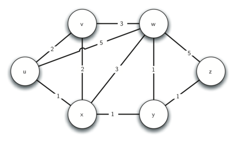
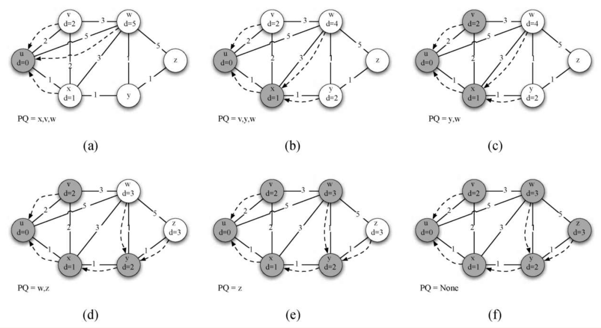
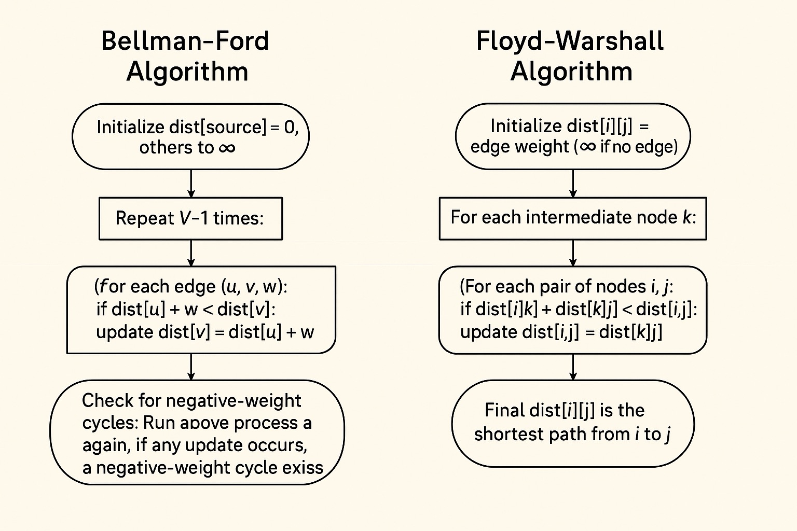

# 最短路径

当我们在导航软件中输入目的地时，计算机会找出从当前位置到目的地的最短路线。在互联网上，信息从一个路由器传送到另一个路由器，也是通过最短路径算法来决定的。下面是一个 traceroute 命令的输出，展示了从本机到百度服务器经过的每一跳路由器：

```
traceroute to www.baidu.com (182.61.200.108)
 1  192.168.1.1          4.713 ms
 2  162.105.253.246      5.211 ms
 3  202.112.41.177       5.174 ms
 4  101.4.116.93         5.564 ms
 5  219.224.103.85       6.163 ms
 6  121.194.11.41       12.837 ms
 7  182.61.250.129      13.299 ms
 8  182.61.255.47       14.749 ms
```

每一行代表一个路由器，时间是从本机到该路由器的往返延迟。互联网上的路由器不断运行着最短路径算法，为数据包选择最快的传输路径。

本章介绍三种经典的最短路径算法，分别适用于不同的场景：

| 算法 | 适用场景 | 时间复杂度 |
|---|---|---|
| **Dijkstra** | 单源、非负权图 | O((V+E)logV) |
| **Bellman-Ford** | 单源、可处理负权、可检测负环 | O(VE) |
| **Floyd-Warshall** | 全源（任意两点之间） | O(V³) |

## 1 无权图与有权图

### 1.1 BFS 适用于无权图

在无权图中，每条边的"代价"都是 1。从起点出发，BFS 逐层扩散的特性天然保证了第一次到达某个顶点时的路径就是最短路径——因为 BFS 先访问距离为 1 的，再访问距离为 2 的，依此类推。

```python
from collections import deque

def bfs_shortest_path(graph, start, end):
    """
    BFS 求无权图最短路径
    第一次遇到 end 时的层数就是最短距离
    """
    visited = {start}
    queue = deque([(start, 0)])         # (顶点, 距离)

    while queue:
        v, dist = queue.popleft()
        if v == end:
            return dist                 # 第一次遇到 → 最短距离
        for w in graph[v]:
            if w not in visited:
                visited.add(w)
                queue.append((w, dist + 1))
    return -1                           # 无法到达
```

### 1.2 Dijkstra 适用于非负权图

对于有权图，BFS 不再适用——因为走一条长边可能比走多条短边更"近"。Dijkstra 算法将 BFS 的队列替换为优先队列，每次选择当前距离最小的顶点进行扩展，从而解决了带权图的最短路径问题。



## 2 Dijkstra 算法

### 2.1 算法思想

Dijkstra 算法的核心思想是**贪心**：维护从起点到每个顶点的当前最短距离，每次从未处理的顶点中选出距离最小的顶点，然后更新其邻居的距离。



以如下有向图为例，从顶点 0 出发：

```
     0 ──5──→ 1 ──4──→ 2
     │                  ↑
     2──→ 5 ──8──→ 4 ──1┘
          │         ↑
          1──→ 3 ──7┘
```

逐步执行过程：

| 步骤 | 当前顶点 | 已确定的距离 | 本轮更新 |
|---|---|---|---|
| 1 | 0 | dist[0]=0 | dist[1]=5, dist[5]=2 |
| 2 | 5（最小） | dist[5]=2 | dist[4]=10 (2+8) |
| 3 | 1（最小） | dist[1]=5 | dist[2]=9 (5+4) |
| 4 | 4（最小） | dist[4]=10 | dist[0]=11（更大，忽略）, dist[2]=9（已有更小）, dist[3]=17 (10+7) |
| 5 | 2（最小） | dist[2]=9 | — |
| 6 | 3（最小） | dist[3]=17 | — |

最终从 0 到各顶点的最短距离：dist = [0, 5, 9, 17, 10, 2]

**面向对象版实现**（笔试常考）：

```python
import sys
import heapq

class Vertex:
    """顶点类，存储距离和前驱"""
    def __init__(self, key):
        self.id = key
        self.connectedTo = {}
        self.distance = sys.maxsize
        self.pred = None

    def addNeighbor(self, nbr, weight=0):
        self.connectedTo[nbr] = weight

    def getConnections(self):
        return self.connectedTo.keys()

    def getWeight(self, nbr):
        return self.connectedTo[nbr]

    def __lt__(self, other):
        return self.distance < other.distance


class Graph:
    def __init__(self):
        self.vertList = {}

    def addVertex(self, key):
        v = Vertex(key)
        self.vertList[key] = v
        return v

    def addEdge(self, f, t, cost=0):
        if f not in self.vertList:
            self.addVertex(f)
        if t not in self.vertList:
            self.addVertex(t)
        self.vertList[f].addNeighbor(self.vertList[t], cost)


def dijkstra_oop(graph, start):
    """Dijkstra OOP 版"""
    pq = []
    start.distance = 0
    heapq.heappush(pq, (0, start))
    visited = set()

    while pq:
        d, u = heapq.heappop(pq)
        if u in visited:
            continue
        visited.add(u)
        for v in u.getConnections():
            nd = d + u.getWeight(v)
            if nd < v.distance:
                v.distance = nd
                v.pred = u
                heapq.heappush(pq, (nd, v))
```

Dijkstra 算法虽然经典，但有一个限制：所有边的权重必须非负。如果图中存在负权边，就需要使用 Bellman-Ford 算法。

**标准版 Dijkstra（heapq）实现**：

```python
import heapq
import sys

def dijkstra(graph, start):
    """
    Dijkstra 算法求单源最短路径
    
    参数:
        graph: 邻接表，graph[u] = [(v, weight), ...]
        start: 起始顶点
    
    返回:
        dist: 从 start 到每个顶点的最短距离数组
        prev: 每个顶点的前驱顶点（用于还原路径）
    """
    n = len(graph)
    INF = float('inf')
    dist = [INF] * n          # 从起点到每个顶点的最短距离
    prev = [-1] * n           # 前驱顶点，用于还原路径
    dist[start] = 0

    # 优先队列：(当前最短距离, 顶点编号)
    # 距离最小的顶点会排在堆顶
    heap = [(0, start)]
    visited = set()

    while heap:
        d, u = heapq.heappop(heap)

        # 如果顶点已处理过，跳过（可能存在过期条目）
        if u in visited:
            continue
        visited.add(u)

        # 遍历 u 的所有邻居
        for v, w in graph[u]:
            # 经过 u 到 v 的新距离 = 起点到 u 的距离 + 边 (u,v) 的权重
            new_dist = dist[u] + w

            if new_dist < dist[v]:
                # 找到了更短的路径，更新
                dist[v] = new_dist
                prev[v] = u
                # 将新的距离加入堆
                # （旧的更大距离的条目仍然在堆中，会被 visited 过滤掉）
                heapq.heappush(heap, (new_dist, v))

    return dist, prev


def reconstruct_path(prev, end):
    """
    还原从起点到 end 的最短路径
    
    参数:
        prev: Dijkstra 返回的前驱数组
        end: 目标顶点
    
    返回:
        从起点到 end 的顶点列表
    """
    path = []
    current = end
    while current != -1:
        path.append(current)
        current = prev[current]
    path.reverse()              # 反转得到从起点到终点的顺序
    return path
```

### 2.2 路径还原

还原路径时，从终点开始，沿着 `prev` 数组不断回溯前驱，直到回到起点。然后将路径反转即得正确顺序。

示例：dist = [0, 3, 2, 5, 8]，prev = [-1, 2, 0, 1, 3]

从顶点 4 回溯：4 → 3 → 1 → 2 → 0
反转：0 → 2 → 1 → 3 → 4

### 2.3 时间复杂度分析

- 每个顶点入堆出堆一次：O(V log V)
- 每条边被检查一次（在邻居遍历中）：O(E log V)
- 总时间复杂度：**O((V + E) log V)**

## 3 Bellman-Ford 算法

### 3.1 松弛操作

Bellman-Ford 算法的核心是**松弛（relaxation）**操作：对于每条边 (u, v, w)，检查 `dist[u] + w < dist[v]`，如果是则更新 `dist[v]`。这个名字源于"放松"约束的比喻——每一次松弛都让最短距离的估计值更接近真实值。

### 3.2 V-1 轮松弛原理

在无负环的图中，从起点到任意顶点的最短路径最多包含 V-1 条边（因为路径不会经过重复顶点）。因此，对所有边执行 V-1 轮松弛，就可以找到所有顶点的最短路径。



**逐步松弛示例**：以下图为例（从顶点 0 出发，V=4 → 需要 3 轮松弛）

```
边列表：
0 → 1 (5)    0 → 2 (4)    1 → 3 (3)
2 → 1 (6)    3 → 2 (-2)
```

| 轮次 | 边 | 松弛前 dist | 松弛后 dist | 说明 |
|---|---|---|---|---|
| 初始 | — | [0, ∞, ∞, ∞] | [0, ∞, ∞, ∞] | 起点 0 距离为 0 |
| 第 1 轮 | 0→1(5) | [0, ∞, ∞, ∞] | [0, 5, ∞, ∞] | dist[1]=0+5=5 |
| 第 1 轮 | 0→2(4) | [0, 5, ∞, ∞] | [0, 5, 4, ∞] | dist[2]=0+4=4 |
| 第 1 轮 | 1→3(3) | dist[1]=5 | [0, 5, 4, 8] | dist[3]=5+3=8 |
| 第 1 轮 | 2→1(6) | dist[2]=4 | [0, 5, 4, 8] | 5<4+6=10，不更新 |
| 第 1 轮 | 3→2(-2) | dist[3]=8 | [0, 5, 2, 8] | dist[2]=8-2=6→更新为2 |
| 第 2 轮 | 0→1(5) | — | [0, 5, 2, 8] | 不变 |
| 第 2 轮 | 1→3(3) | dist[1]=5 | [0, 5, 2, 8] | dist[3]=5+3=8 |
| 第 2 轮 | 2→1(6) | dist[2]=2 | [0, 5, 2, 8] | 5<2+6=8，不更新 |
| 第 2 轮 | 3→2(-2) | dist[3]=8 | [0, 5, 2, 8] | 2=8-2=6，不更新 |
| 第 3 轮 | 全部 | — | 无变化 | 算法结束 |

最终距离：dist = [0, 5, 2, 8]

```python
def bellman_ford(n, edges, start):
    """
    Bellman-Ford 算法求单源最短路径
    
    参数:
        n: 顶点数
        edges: 边列表，每个元素为 (u, v, w) 表示 u → v 权值为 w
        start: 起始顶点
    
    返回:
        dist: 最短距离数组
        has_negative_cycle: 是否存在负环
    
    为什么是 V-1 轮？
        最短路径最多包含 V-1 条边。
        第 1 轮松弛找到 1 条边的最短路径，第 2 轮找到 2 条边的……
        第 V-1 轮找到 V-1 条边的最短路径。
    """
    INF = float('inf')
    dist = [INF] * n
    dist[start] = 0

    # V-1 轮松弛
    for i in range(n - 1):
        updated = False
        for u, v, w in edges:
            if dist[u] != INF and dist[u] + w < dist[v]:
                dist[v] = dist[u] + w
                updated = True
        # 如果某轮没有更新，可以提前结束（优化）
        if not updated:
            break

    # 检测负环：第 V 轮如果还能更新，说明存在负环
    has_negative_cycle = False
    for u, v, w in edges:
        if dist[u] != INF and dist[u] + w < dist[v]:
            has_negative_cycle = True
            break

    return dist, has_negative_cycle
```

### 3.3 负权环检测

如果第 V 轮松弛仍然能更新某个顶点的距离，说明图中存在一个**负权环**——因为可以绕着环无限循环，路径长度不断减小。在有负环的图中，最短路径没有意义。

```
负权环示例： 0 → 1 (权重 2)
             ↑    ↓
             └─ 2 ←┘
              (-3)   ← 这个环的总权重为 -1（负环）
            
绕着 0→1→2→0 走一圈，路径长度减少 1。
可以无限绕圈，最短路径为负无穷。
```

### 3.4 时间复杂度

- V-1 轮 × E 条边 = **O(VE)**
- 适合稀疏图（E 远小于 V² 时效率较高）

## 4 SPFA 算法（选读）

SPFA（Shortest Path Faster Algorithm）是 Bellman-Ford 的队列优化版。核心思想：只有那些距离发生了更新的顶点，才有**可能**导致其邻居的距离更新。用队列来维护"需要处理的顶点"，避免 Bellman-Ford 每轮遍历所有边的无效工作。

```python
from collections import deque

def spfa(n, edges, start):
    """
    SPFA：Bellman-Ford 的队列优化版
    
    优化原理：
        Bellman-Ford 每轮都遍历所有边，
        但实际上只有距离发生了更新的顶点，
        其邻居才有可能被更新。
        SPFA 用队列记录距离被更新的顶点，只处理它们。
    """
    # 将边列表转换为邻接表
    graph = [[] for _ in range(n)]
    for u, v, w in edges:
        graph[u].append((v, w))

    INF = float('inf')
    dist = [INF] * n
    dist[start] = 0

    in_queue = [False] * n         # 标记顶点是否在队列中
    push_count = [0] * n           # 记录入队次数，用于检测负环
    queue = deque([start])
    in_queue[start] = True
    push_count[start] = 1

    while queue:
        u = queue.popleft()
        in_queue[u] = False

        for v, w in graph[u]:
            if dist[u] + w < dist[v]:
                dist[v] = dist[u] + w
                if not in_queue[v]:
                    queue.append(v)
                    in_queue[v] = True
                    push_count[v] += 1
                    # 如果入队次数超过 n-1，说明存在负环
                    if push_count[v] > n - 1:
                        return dist, True

    return dist, False
```

## 5 Floyd-Warshall 算法

### 5.1 动态规划思想

Floyd-Warshall 算法解决的是**全源最短路径**问题——求图中任意两点之间的最短距离。它基于**动态规划**的思想：

> 从 i 到 j 的最短路径，要么直接走 (i, j)，要么经过某个中间顶点 k。

定义 `dp[k][i][j]` 为"允许使用前 k 个顶点作为中间顶点时，从 i 到 j 的最短距离"。状态转移方程：

```
dp[k][i][j] = min(dp[k-1][i][j], dp[k-1][i][k] + dp[k-1][k][j])
```

**逐步示例**：以下图为例，追踪距离矩阵的变化

```
原始图：
    0 ──3──→ 1         邻接矩阵：
    │         │            [0, 3, ∞, 7]
    8↓        ↓1          [∞, 0, 2, ∞]
    │         │            [5, ∞, 0, 1]
    2 ──2──→ 3            [2, ∞, ∞, 0]
```

| k | 执行前 dist | 本轮更新 | 执行后 dist |
|---|---|---|---|
| 初始 | — | — | [[0,3,∞,7],[∞,0,2,∞],[5,∞,0,1],[2,∞,∞,0]] |
| k=0 | 同上 | 2→0→1: 5+3=8<∞, 更新[2][1]=8；2→0→3: 5+7=12>1 | [[0,3,∞,7],[∞,0,2,∞],[5,**8**,0,1],[2,∞,∞,0]] |
| k=1 | 同上 | 0→1→2: 3+2=5<∞, 更新[0][2]=5；3→1→2: ∞+2...不更新 | [[0,3,**5**,7],[∞,0,2,∞],[5,8,0,1],[2,∞,∞,0]] |
| k=2 | 同上 | 1→2→3: 2+1=3<∞, 更新[1][3]=3；3→2→1: ∞+8...不更新 | [[0,3,5,7],[∞,0,2,**3**],[5,8,0,1],[2,∞,∞,0]] |
| k=3 | 同上 | 0→3→1: 7+3=10>3；0→3→2: 7+3=10>5 | 无变化 |

最终任意两点最短距离：
```
    [0, 3, 5, 6]
    [6, 0, 2, 3]
    [3, 6, 0, 1]
    [2, 5, 7, 0]
```

```python
def floyd_warshall(n, graph):
    """
    Floyd-Warshall 全源最短路径
    
    参数:
        n: 顶点数
        graph: 邻接矩阵，graph[i][j] = i 到 j 的边权（无穷大表示无边）
    
    返回:
        dist: n×n 矩阵，dist[i][j] = i 到 j 的最短距离
    
    算法思想：
        对于每个顶点 k，检查以 k 为中间点是否能缩短 i 到 j 的路径。
        三重循环：外层 k，内层 i，最内层 j。
    """
    INF = float('inf')
    # 复制邻接矩阵到距离矩阵
    dist = [row[:] for row in graph]

    for k in range(n):              # 中间顶点
        for i in range(n):          # 起点
            if dist[i][k] == INF:   # 剪枝：i 走不到 k，跳过
                continue
            for j in range(n):      # 终点
                if dist[k][j] == INF:   # 剪枝：k 走不到 j，跳过
                    continue
                # 经过 k 的新路径：i → k → j
                new_dist = dist[i][k] + dist[k][j]
                if new_dist < dist[i][j]:
                    dist[i][j] = new_dist

    return dist
```

### 5.2 传递闭包

Floyd-Warshall 还可以用来计算图的**传递闭包**——判断任意两点之间是否存在路径。将加法替换为逻辑与（AND），取最小值替换为逻辑或（OR）：

```python
def transitive_closure(n, graph):
    """
    计算传递闭包：reachable[i][j] 表示 i 是否能到达 j
    
    输入 graph: 邻接矩阵，1 表示有直接边，0 表示无直接边
    输出 reachable: 1 表示可达，0 表示不可达
    """
    reachable = [row[:] for row in graph]
    # 每个顶点自己可达自己
    for i in range(n):
        reachable[i][i] = 1

    for k in range(n):
        for i in range(n):
            if reachable[i][k]:
                for j in range(n):
                    # i 能到 k 且 k 能到 j → i 能到 j
                    reachable[i][j] = reachable[i][j] or reachable[k][j]
    return reachable
```

## 6 编程题目

### 6.1 最短距离（sy386）

Dijkstra，https://sunnywhy.com/sfbj/10/4/386

现有一个共 n 个顶点、m 条边的无向图，每条边有各自的边权，代表两个城市之间的距离。求从 s 号城市出发到达 t 号城市的最短距离。

**输入**：第一行四个整数 n、m、s、t。接下来 m 行，每行三个整数 u、v、w。

**输出**：一个整数，表示最短距离。如果无法到达，输出 -1。

```python
import heapq

def shortest_distance(n, edges, s, t):
    """Dijkstra 求单源最短路径"""
    graph = [[] for _ in range(n)]
    for u, v, w in edges:
        graph[u].append((v, w))
        graph[v].append((u, w))     # 无向图

    INF = float('inf')
    dist = [INF] * n
    dist[s] = 0
    heap = [(0, s)]

    while heap:
        d, u = heapq.heappop(heap)
        if u == t:
            return d                # 到达终点，返回距离
        if d > dist[u]:
            continue
        for v, w in graph[u]:
            new_d = d + w
            if new_d < dist[v]:
                dist[v] = new_d
                heapq.heappush(heap, (new_d, v))

    return -1
```

示例输入：
```
6 6 0 2
0 1 2
0 2 5
0 3 1
2 3 2
1 2 1
4 5 1
```

示例输出：
```
3
```

### 6.2 Candies（03424）

Dijkstra，差分约束，http://cs101.openjudge.cn/practice/03424/

有 N 个孩子，M 个约束条件。每个约束条件为 A、B、c，表示孩子 B 拿到的糖果数不能比孩子 A 多超过 c 个。求孩子 N 和孩子 1 的最大糖果数差。

**差分约束系统**：给定一系列形如 $x_i - x_j \le b_k$ 的不等式，求两个变量的最大差值。方法是将每个不等式 $x_i - x_j \le b_k$ 转化为从 j 到 i 的一条有向边，边权为 $b_k$，然后求最短路。因为 $x_i - x_j \le b_k$ 等价于 $x_i \le x_j + b_k$，这正是最短路的三角形不等式。

**思路**：不等式 `xB - xA ≤ c` 等价于从 A 到 B 有一条权值为 c 的有向边。求 xN - x1 的最大值就是求从 1 到 N 的最短路。

```python
import heapq

def candies(N, constraints):
    """差分约束 → 最短路"""
    graph = [[] for _ in range(N + 1)]
    for A, B, c in constraints:
        graph[A].append((B, c))

    INF = float('inf')
    dist = [INF] * (N + 1)
    dist[1] = 0
    heap = [(0, 1)]

    while heap:
        d, u = heapq.heappop(heap)
        if d > dist[u]:
            continue
        for v, w in graph[u]:
            if dist[u] + w < dist[v]:
                dist[v] = dist[u] + w
                heapq.heappush(heap, (dist[v], v))

    return dist[N]
```

示例输入：
```
2 2
1 2 5
2 1 4
```

示例输出：
```
5
```

### 6.3 网络延迟时间（LC743）

Dijkstra，https://leetcode.cn/problems/network-delay-time/description/

有 n 个网络节点，信号从节点 k 出发，每经过一条边需要时间。求所有节点都收到信号所需的时间。如果不能全部收到，返回 -1。

```python
import heapq

def network_delay_time(times, n, k):
    """
    求从 k 出发，最远节点的最短路径
    答案 = max(dist[1..n])
    """
    graph = [[] for _ in range(n + 1)]
    for u, v, w in times:
        graph[u].append((v, w))

    INF = float('inf')
    dist = [INF] * (n + 1)
    dist[k] = 0
    heap = [(0, k)]

    while heap:
        d, u = heapq.heappop(heap)
        if d > dist[u]:
            continue
        for v, w in graph[u]:
            if dist[u] + w < dist[v]:
                dist[v] = dist[u] + w
                heapq.heappush(heap, (dist[v], v))

    max_dist = max(dist[1:])
    return max_dist if max_dist != INF else -1
```

示例输入：
```
times = [[2,1,1],[2,3,1],[3,4,1]]
n = 4, k = 2
```
示例输出：
```
2
```

### 6.4 海拔（28972）

Dijkstra 变形，http://cs101.openjudge.cn/practice/28972

在一个网格中，每个格子有海拔高度。从起点走到终点，每一步可以上下左右移动，消耗的体力为海拔差。求最小消耗。

```python
import heapq

def min_elevation_cost(grid, start, end):
    """Dijkstra 变形：网格中的最短路径"""
    rows, cols = len(grid), len(grid[0])
    INF = float('inf')
    dist = [[INF] * cols for _ in range(rows)]
    sr, sc = start
    dist[sr][sc] = 0
    heap = [(0, sr, sc)]
    directions = [(1, 0), (-1, 0), (0, 1), (0, -1)]

    while heap:
        d, r, c = heapq.heappop(heap)
        if (r, c) == end:
            return d
        if d > dist[r][c]:
            continue
        for dr, dc in directions:
            nr, nc = r + dr, c + dc
            if 0 <= nr < rows and 0 <= nc < cols:
                new_d = d + abs(grid[r][c] - grid[nr][nc])
                if new_d < dist[nr][nc]:
                    dist[nr][nc] = new_d
                    heapq.heappush(heap, (new_d, nr, nc))
    return -1
```

示例输入：
```
3 3 0 0
5 1 3
2 8 4
6 7 9
2 2
```
示例输出：
```
6
```

### 6.5 ROADS（01724）

Dijkstra，http://cs101.openjudge.cn/practice/01724/

城市之间有道路，每条道路有长度和过路费。给定总预算，求从城市 1 到城市 N 在预算内的最短路径长度。

**思路**：Dijkstra 的状态增加一维"已花费的费用"。

```python
import heapq

def roads(N, edges, budget):
    """带预算限制的最短路径"""
    graph = [[] for _ in range(N + 1)]
    for s, d, l, t in edges:
        graph[s].append((d, l, t))

    INF = float('inf')
    dist = [[INF] * (budget + 1) for _ in range(N + 1)]
    dist[1][0] = 0
    heap = [(0, 0, 1)]          # (长度, 花费, 城市)

    while heap:
        length, cost, u = heapq.heappop(heap)
        if u == N:
            return length
        if length > dist[u][cost]:
            continue
        for v, l, t in graph[u]:
            new_cost = cost + t
            if new_cost <= budget:
                new_length = length + l
                if new_length < dist[v][new_cost]:
                    dist[v][new_cost] = new_length
                    heapq.heappush(heap, (new_length, new_cost, v))
    return -1
```

示例输入：
```
5 6
1 2 2 1
2 5 5 2
1 3 1 1
3 5 3 2
1 4 1 1
4 5 2 1
10
```
示例输出：
```
4
```

### 6.6 Currency Exchange（M01860）

Bellman-Ford，http://cs101.openjudge.cn/practice/01860/

有 N 种货币，M 个兑换点。每个兑换点可以将货币 A 兑换为 B（或反之），有汇率和手续费。判断是否存在一种兑换方式，让持有的某种货币数量增加。

**思路**：检测是否存在正环。将兑换看作有向边，用 Bellman-Ford 检测正环（将判断条件反向即可）。

```python
def can_profit(N, exchanges, S, V):
    """
    检测是否存在套利机会
    Bellman-Ford 正环检测
    
    exchanges: [(A, B, rate_ab, fee_ab, rate_ba, fee_ba), ...]
    S: 起始货币种类
    V: 初始数量
    """
    # 建图
    edges = []
    for A, B, rab, cab, rba, cba in exchanges:
        # A → B：(amount - fee) * rate
        edges.append((A, B, rab, cab))
        # B → A
        edges.append((B, A, rba, cba))

    # Bellman-Ford 检测正环
    amount = [0.0] * (N + 1)
    amount[S] = V

    for _ in range(N - 1):
        updated = False
        for u, v, rate, fee in edges:
            if amount[u] > fee and (amount[u] - fee) * rate > amount[v]:
                amount[v] = (amount[u] - fee) * rate
                updated = True
        if not updated:
            break

    # 检测正环：第 N 轮还能更新 → 可以无限套利
    for u, v, rate, fee in edges:
        if amount[u] > fee and (amount[u] - fee) * rate > amount[v]:
            return True
    return False
```

示例输入：
```
3 2 1 20.0
1 2 1.00 1.00 1.00 1.00
2 3 1.10 1.00 1.10 1.00
```
示例输出：
```
YES
```

### 6.7 K 站中转内最便宜的航班（LC787）

Bellman-Ford，https://leetcode.cn/problems/cheapest-flights-within-k-stops/

有 n 个城市和航班列表，每个航班有起点、终点和价格。求从 src 到 dst 最多经过 K 站中转的最便宜价格。

**思路**：Bellman-Ford 的变体。执行 K+1 轮松弛（因为最多 K 次中转 = K+1 条边），且每轮基于上一轮的结果，防止在同一轮内"提前"使用了多于 i 条边。

```python
def find_cheapest_price(n, flights, src, dst, K):
    """
    Bellman-Ford 限制中转次数
    
    每轮基于上一轮的 dist 进行更新，
    保证第 i 轮结束时的 dist 最多经过 i 条边。
    """
    INF = float('inf')
    dist = [INF] * n
    dist[src] = 0

    for _ in range(K + 1):
        prev = dist[:]                      # 保存上一轮的结果
        for u, v, w in flights:
            if prev[u] != INF and prev[u] + w < dist[v]:
                dist[v] = prev[u] + w       # 基于 prev 而不是 dist

    return dist[dst] if dist[dst] != INF else -1
```

示例输入：
```
n = 4, flights = [[0,1,100],[1,2,100],[2,0,100],[1,3,600],[2,3,200]]
src = 0, dst = 3, k = 1
```
示例输出：
```
700
```

## 本章小结

- **Dijkstra**：贪心 + 优先队列，O((V+E)logV)，适用于非负权图
- **Bellman-Ford**：V-1 轮松弛，O(VE)，可处理负权、检测负环
- **SPFA**：Bellman-Ford 的队列优化，实际运行效率通常更高
- **Floyd-Warshall**：动态规划，O(V³)，求全源最短路径
- **传递闭包**：Floyd 的变形，判断两点之间是否存在路径
- 三种算法的选择：无负权 → Dijkstra，有负权 → Bellman-Ford，全源 → Floyd
- 差分约束系统可以转化为最短路问题求解
