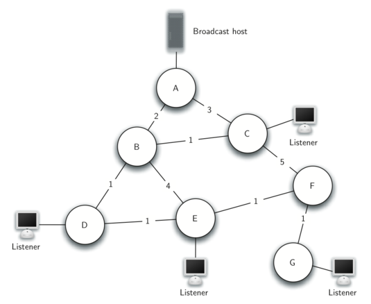

# 亦树亦图

考虑这样一个问题：互联网服务提供商要把网络信号传输给所有用户。每个路由器连接需要成本，如何用最少的成本让所有路由器都连通？这个问题可以建模为**最小生成树（Minimum Spanning Tree, MST）**问题——从一个带权无向图中找出一棵连接所有顶点的树，使得边的总权重最小。

为什么叫"亦树亦图"？因为最小生成树本质上是一棵树（无环、连通），但又出自于图。它是图与树的桥梁。

## 1 生成树与 MST

### 1.1 生成树的定义

**生成树（Spanning Tree）**是连通无向图的一个子图，满足：
- 包含原图的所有顶点
- 是一棵树（无环且连通）
- 恰好有 n-1 条边（n 为顶点数）

一个连通图通常有多棵不同的生成树。

### 1.2 最小生成树的概念

**最小生成树（MST）**是所有生成树中边权之和最小的那棵（可能不唯一）。

### 1.3 广播问题引例

回到开头的广播问题。假设有 7 个路由器，连接它们的成本如下图：



最省钱的方案不是把每对路由器都连起来，而是找到一棵"连接所有路由器且总成本最小"的树：


这棵最小生成树的总权重为 2 + 1 + 1 + 1 + 1 + 1 = 7。

## 2 Prim 算法

### 2.1 算法思想

Prim 算法从一个顶点开始，逐步扩大生成树：每次选择一条连接"树内顶点"和"树外顶点"的最小权重边，将对应的树外顶点加入树中。

**逐步示例**：以下图为例，从 A 开始构造 MST

```
      A ──4──→ B
      │       /│
      2     1  3
      │   /    │
      C ──5──→ D
```

| 步骤 | 树内顶点 | 候选边（权重） | 选择 | 边权累加 |
|---|---|---|---|---|
| 1 | {A} | A-B(4), A-C(2) | A-C(2) | 2 |
| 2 | {A,C} | A-B(4), C-B(1), C-D(5) | C-B(1) | 3 |
| 3 | {A,C,B} | B-D(3), C-D(5) | B-D(3) | 6 |
| 4 | {A,C,B,D} | 所有顶点已在树内 | — | 6 |

MST：A-C(2) + C-B(1) + B-D(3) = 6

**面向对象版实现**（笔试常考）：

```python
import sys
import heapq

class Vertex:
    def __init__(self, key):
        self.id = key
        self.connectedTo = {}
        self.distance = sys.maxsize
        self.pred = None

    def addNeighbor(self, nbr, weight=0):
        self.connectedTo[nbr] = weight

    def getConnections(self):
        return self.connectedTo.keys()

    def getWeight(self, nbr):
        return self.connectedTo[nbr]

    def __lt__(self, other):
        return self.distance < other.distance


class Graph:
    def __init__(self):
        self.vertList = {}

    def addVertex(self, key):
        v = Vertex(key)
        self.vertList[key] = v
        return v

    def addEdge(self, f, t, cost=0):
        if f not in self.vertList:
            self.addVertex(f)
        if t not in self.vertList:
            self.addVertex(t)
        self.vertList[f].addNeighbor(self.vertList[t], cost)
        self.vertList[t].addNeighbor(self.vertList[f], cost)  # 无向图


def prim_oop(graph, start):
    """Prim 算法（面向对象版）"""
    pq = []
    start.distance = 0
    heapq.heappush(pq, (0, start))
    visited = set()

    while pq:
        d, u = heapq.heappop(pq)
        if u in visited:
            continue
        visited.add(u)
        for v in u.getConnections():
            w = u.getWeight(v)
            if v not in visited and w < v.distance:
                v.distance = w
                v.pred = u
                heapq.heappush(pq, (w, v))
```

标准版 Prim（heapq）实现：
import sys

def prim(graph, start=0):
    """
    Prim 算法求最小生成树
    
    参数:
        graph: 邻接表，graph[u] = [(v, weight), ...]（无向图）
        start: 起始顶点
    
    返回:
        mst_edges: 最小生成树的边列表 [(u, v, weight), ...]
        total_weight: 最小生成树的总权重
    
    算法步骤：
        1. 将起始顶点加入树（visited 集合）
        2. 维护一个最小堆，存储"连接树内和树外"的边
        3. 每次从堆中取出最小权重的边：
           a. 如果边的另一端已在树内，跳过
           b. 否则，将该顶点加入树，记录这条边
           c. 将该顶点的所有"连接树外"的边加入堆
        4. 重复直到所有顶点都在树内
    """
    n = len(graph)
    visited = [False] * n
    visited[start] = True
    
    # 将起始顶点的所有边加入堆
    heap = []
    for v, w in graph[start]:
        heapq.heappush(heap, (w, start, v))
    
    mst_edges = []
    total_weight = 0

    while heap and len(mst_edges) < n - 1:
        w, u, v = heapq.heappop(heap)   # 取出权重最小的边
        
        if visited[v]:
            continue                    # v 已在树中，跳过
        
        # 将 v 加入生成树
        visited[v] = True
        mst_edges.append((u, v, w))
        total_weight += w

        # 将 v 的所有"连接树外顶点"的边加入堆
        for to, weight in graph[v]:
            if not visited[to]:
                heapq.heappush(heap, (weight, v, to))

    return mst_edges, total_weight
```

### 2.2 复杂度分析

- 内层循环检查每条边：O(E)
- 堆操作：O(log V)
- 总时间复杂度：**O((V + E) log V)**
- 适合稠密图

## 3 Kruskal 算法

### 3.1 算法思想

Kruskal 算法从另一个角度思考：将所有边按权重从小到大排序，然后依次尝试加入。如果加入一条边不会形成环，就保留它；否则跳过。

**逐步示例**：以下图为例

```
      A ──4──→ B
      │       /│
      2     1  3
      │   /    │
      C ──5──→ D
```

边按权重排序：(C-B,1), (A-C,2), (B-D,3), (A-B,4), (C-D,5)

| 步骤 | 边 | 权重 | 并查集状态 | 是否加入 | 说明 |
|---|---|---|---|---|---|
| 1 | C-B | 1 | {A}, {C,B}, {D} | ✓ | C 和 B 不同集合 |
| 2 | A-C | 2 | {A,C,B}, {D} | ✓ | A 和 C 不同集合 |
| 3 | B-D | 3 | {A,C,B,D} | ✓ | B 和 D 不同集合 |
| 4 | A-B | 4 | — | ✗ | A 和 B 已在同一集合，加入会成环 |
| 5 | C-D | 5 | — | ✗ | C 和 D 已在同一集合，加入会成环 |

MST 边集：{C-B, A-C, B-D}，总权重 = 1 + 2 + 3 = 6

关键在于**环检测**——加入边 (u, v) 时，如果 u 和 v 已经连通（属于同一个连通分量），加入就会形成环。这里使用**并查集**来高效地判断连通性。

```python
class UnionFind:
    """
    并查集（Disjoint Set Union）
    用于 Kruskal 算法中判断两个顶点是否属于同一连通分量
    """
    def __init__(self, n):
        self.parent = list(range(n))
        self.rank = [0] * n

    def find(self, x):
        """查找 x 所属的集合（带路径压缩）"""
        if self.parent[x] != x:
            self.parent[x] = self.find(self.parent[x])
        return self.parent[x]

    def union(self, x, y):
        """合并 x 和 y 所在的集合（按秩合并）"""
        px, py = self.find(x), self.find(y)
        if px == py:
            return False                    # 已在同一集合中 → 加入会形成环
        if self.rank[px] < self.rank[py]:
            self.parent[px] = py
        elif self.rank[px] > self.rank[py]:
            self.parent[py] = px
        else:
            self.parent[py] = px
            self.rank[px] += 1
        return True


def kruskal(n, edges):
    """
    Kruskal 算法求最小生成树
    
    参数:
        n: 顶点数
        edges: 边列表，每个元素为 (u, v, weight)
    
    返回:
        mst_edges: 最小生成树的边列表
        total_weight: 总权重
    
    算法步骤：
        1. 按权重对所有边升序排序
        2. 初始化并查集（每个顶点独立为一个集合）
        3. 依次检查每条边：
           a. 如果边的两个端点属于不同集合 → 加入 mst，合并集合
           b. 否则 → 跳过（加入会形成环）
        4. 当收集到 n-1 条边时停止
    """
    # 按权重排序
    edges.sort(key=lambda x: x[2])

    uf = UnionFind(n)
    mst_edges = []
    total_weight = 0

    for u, v, w in edges:
        if uf.union(u, v):                  # union 返回 True 表示不同集合
            mst_edges.append((u, v, w))
            total_weight += w
            if len(mst_edges) == n - 1:     # 已找到足够多的边
                break

    return mst_edges, total_weight
```

### 3.2 复杂度分析

- 边排序：O(E log E)
- 并查集操作：O(E α(V))，其中 α(V) 是阿克曼函数的反函数，近似常数
- 总时间复杂度：**O(E log E)**
- 适合稀疏图

### 3.3 算法对比与选择

| 方面 | Prim | Kruskal |
|---|---|---|
| 策略 | 从顶点出发，逐步扩展树 | 按权重从小到大选择边 |
| 数据结构 | 优先队列（堆） | 并查集 |
| 时间复杂度 | O((V+E)logV) | O(E log E) |
| 适合场景 | 稠密图（边多） | 稀疏图（边少） |
| 是否需要排序 | 不需要 | 需要 |

## 4 编程题目

### 4.1 最小生成树-Prim（sy396）

Prim，https://sunnywhy.com/sfbj/10/5/396

现有一个共 n 个顶点、m 条边的无向图，使用 Prim 算法求最小生成树的边权之和。

**输入**：第一行两个整数 n、m。接下来 m 行，每行三个整数 u、v、w。

**输出**：一个整数，表示最小边权之和。如果不存在这样的树，输出 -1。

```python
import heapq

def prim_mst(n, edges):
    """Prim 算法求 MST"""
    graph = [[] for _ in range(n)]
    for u, v, w in edges:
        graph[u].append((v, w))
        graph[v].append((u, w))

    visited = [False] * n
    visited[0] = True
    heap = [(w, 0, v) for v, w in graph[0]]
    heapq.heapify(heap)
    
    total = 0
    count = 1

    while heap and count < n:
        w, u, v = heapq.heappop(heap)
        if visited[v]:
            continue
        visited[v] = True
        total += w
        count += 1
        for to, wt in graph[v]:
            if not visited[to]:
                heapq.heappush(heap, (wt, v, to))

    return total if count == n else -1
```

示例输入：
```
4 5
0 1 3
0 2 2
0 3 3
2 3 1
1 2 1
```
示例输出：
```
4
```

### 4.2 最小生成树-Kruskal（sy397）

Kruskal，https://sunnywhy.com/sfbj/10/5/397

使用 Kruskal 算法求最小生成树。

**输入**：第一行两个整数 n、m（$1 \le n \le 10^4, 0 \le m \le 10^5$）。接下来 m 行，每行三个整数 u、v、w。

**输出**：一个整数，表示最小边权之和。如果不存在这样的树，输出 -1。

```python
class UnionFind:
    def __init__(self, n):
        self.parent = list(range(n))
        self.rank = [0] * n

    def find(self, x):
        if self.parent[x] != x:
            self.parent[x] = self.find(self.parent[x])
        return self.parent[x]

    def union(self, x, y):
        px, py = self.find(x), self.find(y)
        if px == py:
            return False
        if self.rank[px] > self.rank[py]:
            self.parent[py] = px
        else:
            self.parent[px] = py
            if self.rank[px] == self.rank[py]:
                self.rank[py] += 1
        return True


def kruskal_mst(n, edges):
    edges.sort(key=lambda x: x[2])
    uf = UnionFind(n)
    total = 0
    count = 0
    for u, v, w in edges:
        if uf.union(u, v):
            total += w
            count += 1
            if count == n - 1:
                return total
    return -1
```

示例输入：
```
4 5
0 1 3
0 2 2
0 3 3
2 3 1
1 2 1
```
示例输出：
```
4
```

### 4.3 Agri-Net（01258）

Prim，http://cs101.openjudge.cn/practice/01258/

Farmer John 需要将他的农场与所有其他农场通过光纤连接起来。给定每对农场之间的光纤铺设成本，求将所有农场连通的最短光纤总长度。

**输入**：多组测试数据。每组第一行为农场数 N（3 ≤ N ≤ 100），接下来给出 N×N 的邻接矩阵。

**输出**：一个整数，表示最短光纤总长度。

```python
import heapq

def agri_net(n, matrix):
    """Prim 求 MST"""
    visited = [False] * n
    visited[0] = True
    heap = [(matrix[0][j], 0, j) for j in range(1, n)]
    heapq.heapify(heap)
    total = 0

    while heap:
        w, u, v = heapq.heappop(heap)
        if visited[v]:
            continue
        visited[v] = True
        total += w
        for j in range(n):
            if not visited[j]:
                heapq.heappush(heap, (matrix[v][j], v, j))

    return total
```

示例输入：
```
4
0 4 9 21
4 0 8 17
9 8 0 16
21 17 16 0
```
示例输出：
```
28
```

### 4.4 连接所有点的最小费用（M1584）

最小生成树，https://leetcode.cn/problems/min-cost-to-connect-all-points/

给定平面上 n 个点的坐标，连接两点 (xi, yi) 和 (xj, yj) 的费用为曼哈顿距离 |xi - xj| + |yi - yj|。求将所有点连通的最小总费用。

```python
import heapq

def min_cost_connect_points(points):
    """Prim 求 MST"""
    n = len(points)
    visited = [False] * n
    visited[0] = True
    # 计算所有点到 0 的曼哈顿距离
    heap = []
    for j in range(1, n):
        d = abs(points[0][0] - points[j][0]) + abs(points[0][1] - points[j][1])
        heapq.heappush(heap, (d, 0, j))

    total = 0
    count = 1

    while heap and count < n:
        d, u, v = heapq.heappop(heap)
        if visited[v]:
            continue
        visited[v] = True
        total += d
        count += 1
        for j in range(n):
            if not visited[j]:
                nd = abs(points[v][0] - points[j][0]) + abs(points[v][1] - points[j][1])
                heapq.heappush(heap, (nd, v, j))

    return total
```

示例输入：
```
points = [[0,0],[2,2],[3,10],[5,2],[7,0]]
```
示例输出：
```
20
```

## 本章小结

- **最小生成树（MST）**是连接所有顶点的树中边权和最小的
- **Prim 算法**：从顶点出发，每次选择连接树内/树外的最小边。适合稠密图
- **Kruskal 算法**：按权重排序边，用并查集判环。适合稀疏图
- 两种算法都是**贪心算法**，都能得到全局最优解
- **并查集**是 Kruskal 的关键——高效判断两个顶点是否连通
- 最小生成树的应用：网络设计、电路布线、聚类分析等
