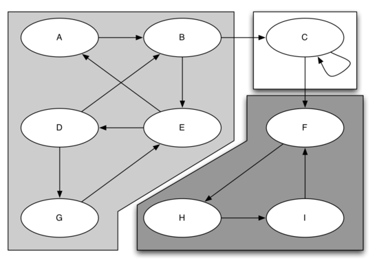
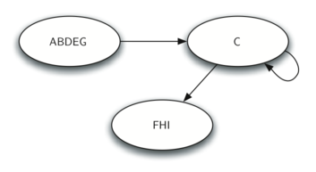

# 方以类聚

在社交网络中，有些人形成了一个小圈子——圈子里的每个人都能直接或间接地联系到其他人，但圈子外的人联系不进来。这种结构在图论中称为**强连通分量（Strongly Connected Component, SCC）**。

俗话说"方以类聚，物以群分"，强连通分量就是图论中"类聚"的数学刻画。识别出 SCC 之后，可以将每个 SCC"压缩"成一个顶点，原图就变成了一个 DAG——这大大简化了后续分析。

## 1 SCC 的定义

### 1.1 强连通分量概念

对于有向图 G，**强连通分量**是这样一个最大的顶点子集 C ⊆ V：对于 C 中任意两个顶点 u 和 v，都存在一条从 u 到 v 的路径，同时也存在一条从 v 到 u 的路径。

通俗理解：SCC 内的所有顶点可以**互相到达**。



在上图中，三个 SCC 用不同颜色标记：
- 绿色：{A, B, C}——三个顶点之间两两可达
- 蓝色：{D}——单独一个顶点也算一个 SCC
- 橙色：{E, F}——两个顶点可以互相到达

### 1.2 图简化（缩点）

将每个 SCC 压缩为一个顶点后，原图变为一个 DAG（有向无环图）。这个简化后的图保留了原图的结构信息，但规模大大减小。



许多图算法可以先用 SCC 缩点，再在 DAG 上运行，从而提高效率。

## 2 Kosaraju 算法

Kosaraju 算法基于一个简单的观察：如果对原图和它的转置图分别做 DFS，两次都从同一个 SCC 出发，得到的 DFS 树正好对应各个 SCC。

### 2.1 算法流程

Kosaraju 算法分为三步：

1. **第一次 DFS**：对原图进行 DFS，记录每个顶点的**结束时间**
2. **构建转置图**：将所有边的方向反转
3. **第二次 DFS**：按结束时间的**逆序**对转置图进行 DFS，每次 DFS 找到的都是一个 SCC

**逐步示例**：以下图为例，展示 Kosaraju 的三步

```
原图：   0 → 1 → 2 → 3
         ↑         ↓
         └──── 4 ←─┘

转置图： 0 ← 1 ← 2 ← 3
         ↓         ↑
         └──── 4 ──┘
```

**第一步：对原图 DFS，记录结束时间**

| DFS 顺序 | 顶点 | 发现时间 | 结束时间 | 说明 |
|---|---|---|---|---|
| 1 | 0 | 1 | — | 从 0 开始 |
| 2 | 1 | 2 | — | 从 0 走到 1 |
| 3 | 2 | 3 | — | 从 1 走到 2 |
| 4 | 3 | 4 | — | 从 2 走到 3 |
| — | 3 无未访问邻居 | — | 5 | 结束时间=5 |
| 5 | 4 | 6 | — | 从 2 的另一邻居 4 |
| — | 4 | — | 7 | 结束 |
| — | 2 | — | 8 | 结束 |
| — | 1 | — | 9 | 结束 |
| — | 0 | — | 10 | 结束 |

结束时间顺序（早→晚）：3(5), 4(7), 2(8), 1(9), 0(10)

**第二步：构建转置图**
所有边的方向反向：0←1, 1←2, 2←3, 2←4, 4←3（已在图中标出）

**第三步：按结束时间逆序对转置图 DFS**
逆序：0(10), 1(9), 2(8), 4(7), 3(5)

| DFS 轮次 | 起点 | 访问到的顶点 | SCC |
|---|---|---|---|
| 1 | 0 | 0（在转置图中 0 没有入边） | {0} |
| 2 | 1 | 1（在转置图中只有 0→1，但 0 已访问） | {1} |
| 3 | 2 | 2, 4, 3（转置图中 2→1,2→4,4→3） | {2, 4, 3} |

SCC 结果：{0}, {1}, {2, 3, 4}（与原图一致！）

```python
def kosaraju(n, graph):
    """
    Kosaraju 算法求强连通分量
    
    参数:
        n: 顶点数
        graph: 邻接表，graph[u] = [v1, v2, ...]
    
    返回:
        sccs: 列表的列表，每个内层列表是一个 SCC 的顶点
    
    算法原理：
        第一步：对原图 DFS，记录每个顶点的结束时间。
                结束时间晚的顶点在拓扑序中更靠前。
        
        第二步：构建转置图（所有边的方向反向）。
                转置图和原图具有相同的 SCC。
        
        第三步：按结束时间从晚到早的顺序，对转置图 DFS。
                每次 DFS 访问到的所有顶点构成一个 SCC。
        
        为什么这样能工作？
            第一次 DFS 的结束时间类似于"拓扑序"。
            在转置图上按这个顺序 DFS，相当于从 DAG 的"源头"开始，
            一次一个地剥离 SCC。
    """
    # ========== 第一步：第一次 DFS，记录结束时间 ==========
    visited = [False] * n
    finish_stack = []               # 按结束时间入栈（晚结束的在上）

    def dfs1(u):
        """第一次 DFS：记录结束时间"""
        visited[u] = True
        for v in graph[u]:
            if not visited[v]:
                dfs1(v)
        # u 的所有邻居都已处理完毕，记录 u 的结束时间
        finish_stack.append(u)

    for i in range(n):
        if not visited[i]:
            dfs1(i)

    # ========== 第二步：构建转置图 ==========
    # 原图中有 u → v，则转置图中有 v → u
    rev_graph = [[] for _ in range(n)]
    for u in range(n):
        for v in graph[u]:
            rev_graph[v].append(u)

    # ========== 第三步：第二次 DFS，按结束时间逆序 ==========
    visited = [False] * n
    sccs = []

    def dfs2(u, component):
        """第二次 DFS：在转置图上收集 SCC"""
        visited[u] = True
        component.append(u)
        for v in rev_graph[u]:
            if not visited[v]:
                dfs2(v, component)

    # 按结束时间从晚到早的顺序（finish_stack 的逆序）处理
    while finish_stack:
        u = finish_stack.pop()      # 结束时间最晚的先处理
        if not visited[u]:
            component = []
            dfs2(u, component)
            sccs.append(component)

    return sccs
```

### 2.2 复杂度分析

- 第一次 DFS：O(V + E)
- 构建转置图：O(V + E)
- 第二次 DFS：O(V + E)
- 总时间复杂度：**O(V + E)**

## 3 Tarjan 算法

Tarjan 算法可以在**一次 DFS** 中找到所有 SCC，不需要构建转置图。它通过维护一个时间戳和一个栈来识别 SCC。

### 3.1 核心概念

Tarjan 算法的关键在于两个数组：

- **`index[u]`**：顶点 u 被发现的时间（DFS 次序）
- **`lowlink[u]`**：从 u 出发经过一条树边或最多一条回边能到达的最早顶点的 index

`lowlink[u]` 的计算方式：
- 初始：`lowlink[u] = index[u]`
- 对于每条树边 u → v：`lowlink[u] = min(lowlink[u], lowlink[v])`
- 对于每条回边 u → v（v 在栈中）：`lowlink[u] = min(lowlink[u], index[v])`

当 `index[u] == lowlink[u]` 时，u 是一个 SCC 的"根"，从栈中弹出直到 u 的所有顶点构成一个 SCC。

**逐步示例**：对下图运行 Tarjan 算法

```
     0 → 1 → 2 → 3
     ↑         ↓
     └──── 4 ←─┘
```

| DFS 步骤 | 当前顶点 | index | lowlink | 栈内容 | 操作说明 |
|---|---|---|---|---|---|
| 1 | 0 | 1 | 1 | [0] | 从 0 开始 |
| 2 | 1 | 2 | 2 | [0,1] | 0→1 |
| 3 | 2 | 3 | 3 | [0,1,2] | 1→2 |
| 4 | 3 | 4 | 4 | [0,1,2,3] | 2→3，3 无未访问邻居，index=lowlink→弹出 {3} |
| 弹出 SCC | — | — | — | [0,1,2] | 3 的 lowlink==index，{3} 是一个 SCC |
| 5 | 4 | 5 | 5 | [0,1,2,4] | 2→4，4 无未访问邻居 |
| 回溯 | 4→2 | — | 更新 lowlink[2]=min(3,5)=3 | [0,1,2] | 4 处理完毕，lowlink[4]=5≠index[4]=5，弹出 {4} |
| 回溯 | 2→1 | — | lowlink[1]=min(2,3)=2 | [0,1] | 只有 3 是回边目标但已在栈？不，3 已被弹出 |
| 回溯 | 1→0 | — | lowlink[0]=min(1,2)=1 | [0] | — |
| 检查 0 | 0 | — | index[0]=1==lowlink[0]=1 | 弹出 {0,1,2,4} | — |

SCC 结果：{3}, {0,1,2,4}

```python
def tarjan(n, graph):
    """
    Tarjan 算法求强连通分量（一次 DFS）
    
    参数:
        n: 顶点数
        graph: 邻接表
    
    返回:
        sccs: 所有强连通分量的列表
    
    核心思想：
        使用一个栈维护当前 DFS 路径上的顶点。
        每个顶点有 index（发现时间）和 lowlink（能回溯到的最早顶点）。
        当 index[u] == lowlink[u] 时，u 是一个 SCC 的根。
    """
    index = [0] * n                 # 发现时间（0 表示未访问）
    lowlink = [0] * n               # 能回溯到的最早顶点的 index
    on_stack = [False] * n          # 是否在当前 DFS 栈中
    stack = []                      # DFS 栈
    current_index = 0
    sccs = []

    def dfs(u):
        nonlocal current_index
        current_index += 1
        index[u] = current_index
        lowlink[u] = current_index
        stack.append(u)
        on_stack[u] = True

        for v in graph[u]:
            if index[v] == 0:
                # v 未访问，递归探索
                dfs(v)
                # 回溯时，用子节点的 lowlink 更新当前节点
                lowlink[u] = min(lowlink[u], lowlink[v])
            elif on_stack[v]:
                # v 已在栈中，说明是一条回边
                # 用 v 的 index 更新当前节点的 lowlink
                lowlink[u] = min(lowlink[u], index[v])

        # 如果 u 是 SCC 的根，从栈中弹出该 SCC 的所有顶点
        if index[u] == lowlink[u]:
            scc = []
            while True:
                top = stack.pop()
                on_stack[top] = False
                scc.append(top)
                if top == u:
                    break
            sccs.append(scc)

    for i in range(n):
        if index[i] == 0:
            dfs(i)

    return sccs
```

### 3.2 Tarjan vs Kosaraju

| 方面 | Kosaraju | Tarjan |
|---|---|---|
| DFS 次数 | 2 次 | 1 次 |
| 是否需要转置图 | 需要 | 不需要 |
| 实现难度 | 直观 | 需要理解 lowlink |
| 时间复杂度 | 都是 O(V+E) | 都是 O(V+E) |

## 4 编程题目

### 4.1 Kosaraju 实现

```python
def kosaraju_scc(n, graph):
    """Kosaraju 算法求 SCC"""
    # 第一次 DFS：记录结束顺序
    visited = [False] * n
    order = []

    def dfs1(u):
        visited[u] = True
        for v in graph[u]:
            if not visited[v]:
                dfs1(v)
        order.append(u)

    for i in range(n):
        if not visited[i]:
            dfs1(i)

    # 构建转置图
    rev = [[] for _ in range(n)]
    for u in range(n):
        for v in graph[u]:
            rev[v].append(u)

    # 第二次 DFS：按逆序处理
    visited = [False] * n
    sccs = []

    def dfs2(u, comp):
        visited[u] = True
        comp.append(u)
        for v in rev[u]:
            if not visited[v]:
                dfs2(v, comp)

    while order:
        u = order.pop()
        if not visited[u]:
            comp = []
            dfs2(u, comp)
            sccs.append(comp)

    return sccs
```

### 4.2 Tarjan 实现

```python
def tarjan_scc(n, graph):
    """Tarjan 算法求 SCC"""
    index = [0] * n
    lowlink = [0] * n
    on_stack = [False] * n
    stack = []
    cur = 0
    sccs = []

    def dfs(u):
        nonlocal cur
        cur += 1
        index[u] = cur
        lowlink[u] = cur
        stack.append(u)
        on_stack[u] = True

        for v in graph[u]:
            if index[v] == 0:
                dfs(v)
                lowlink[u] = min(lowlink[u], lowlink[v])
            elif on_stack[v]:
                lowlink[u] = min(lowlink[u], index[v])

        if index[u] == lowlink[u]:
            scc = []
            while True:
                top = stack.pop()
                on_stack[top] = False
                scc.append(top)
                if top == u:
                    break
            sccs.append(scc)

    for i in range(n):
        if index[i] == 0:
            dfs(i)

    return sccs
```

## 本章小结

- **SCC（强连通分量）**：有向图中，顶点之间互相可达的极大子集
- **缩点**：将每个 SCC 压缩为一个顶点，原图变成 DAG
- **Kosaraju 算法**：两次 DFS（原图 + 转置图），直观易懂
- **Tarjan 算法**：一次 DFS（利用 lowlink），不需要额外空间存转置图
- 两种算法的时间复杂度都是 O(V + E)
- SCC 的应用：社交网络分析、程序依赖分析、图简化等
