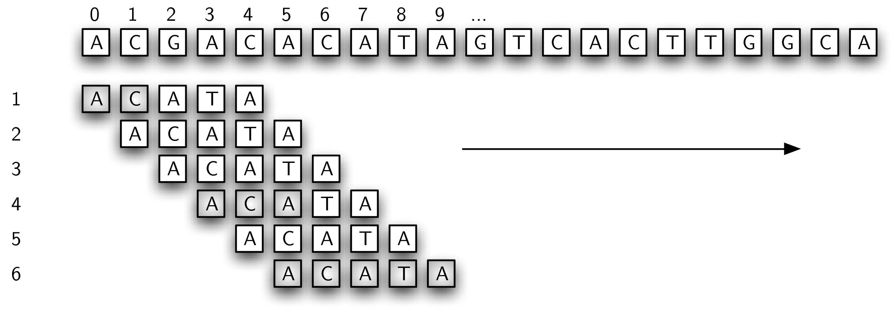
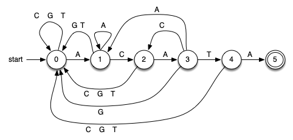
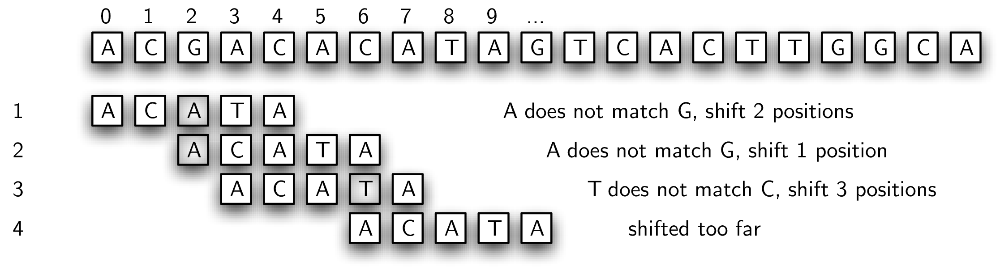
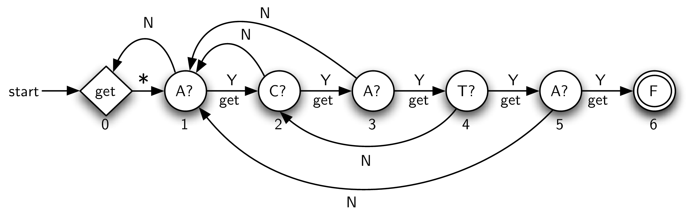
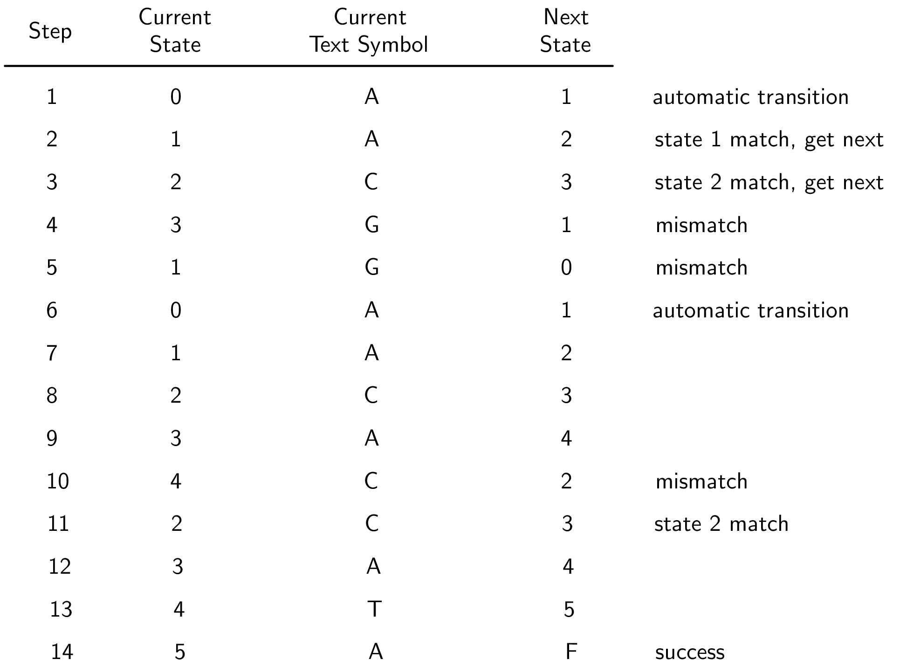

# 总而言图

## 1 时间复杂度汇总表

| 算法 | 时间复杂度 | 空间复杂度 | 适用场景 |
|---|---|---|---|
| BFS | O(V + E) | O(V) | 无权图最短路径、层序遍历 |
| DFS | O(V + E) | O(V) | 探索所有路径、环检测、骑士周游 |
| 拓扑排序（Kahn） | O(V + E) | O(V) | DAG 依赖排序 |
| 拓扑排序（DFS） | O(V + E) | O(V) | DAG 依赖排序 |
| Dijkstra | O((V+E)log V) | O(V) | 非负权单源最短路径 |
| Bellman-Ford | O(VE) | O(V) | 负权检测、负环检测 |
| SPFA | O(VE) 最坏 | O(V) | 负权（队列优化版） |
| Floyd-Warshall | O(V³) | O(V²) | 全源最短路径 |
| Prim | O((V+E)log V) | O(V) | 稠密图最小生成树 |
| Kruskal | O(E log E) | O(V) | 稀疏图最小生成树 |
| Kosaraju | O(V + E) | O(V) | 强连通分量 |
| Tarjan | O(V + E) | O(V) | 强连通分量 |
| 染色法 | O(V + E) | O(V) | 二分图判定 |
| 匈牙利算法 | O(VE) | O(V) | 二分图最大匹配 |
| 关键路径（CPM） | O(V + E) | O(V) | 项目工期计算 |

## 2 算法选择决策树

```
问题类型
├── 需要遍历图？
│   ├── 逐层访问 → BFS
│   └── 深入探索 → DFS
│
├── 有依赖关系需要排序？
│   └── DAG → 拓扑排序（Kahn / DFS）
│
├── 求最短路径？
│   ├── 无权图 → BFS
│   ├── 非负权图 → Dijkstra
│   ├── 有负权 → Bellman-Ford / SPFA
│   └── 全源 → Floyd-Warshall
│
├── 需要连通所有点且总代价最小？
│   ├── 稠密图 → Prim
│   └── 稀疏图 → Kruskal
│
├── 需要找强连通分量？
│   ├── 思路直观 → Kosaraju
│   └── 一次 DFS → Tarjan
│
├── 需要二分图判定或最大匹配？
│   ├── 判定 → 染色法
│   └── 最大匹配 → 匈牙利算法
│
└── 需要计算项目工期？
    └── AOE 网 → 关键路径（CPM）
```

## 3 综合运用要点

### 3.1 识别题目类型的关键线索

| 题目特征 | 可能的算法 |
|---|---|
| 求最少步数/最短路径，代价均匀 | BFS |
| 求最小代价，代价不均匀 | Dijkstra |
| 存在负权边 | Bellman-Ford / SPFA |
| 求所有点对之间的最短路径 | Floyd-Warshall |
| 有依赖关系，求可行顺序 | 拓扑排序 |
| 求最小连接成本 | Prim / Kruskal |
| 需要检测循环依赖 | 拓扑排序（判环） |
| 图中有互相可达的圈子 | SCC（Kosaraju / Tarjan） |
| 将顶点分成两组，组内无边 | 二分图染色 |
| 求最大配对 | 匈牙利算法 |
| 求项目最短工期 | 关键路径 |

### 3.2 代码模板积累建议

- **DFS/BFS 模板**：visited + 队列/栈，图的遍历基础
- **Dijkstra 模板**：heapq + dist 数组，路径还原用 prev
- **Kahn 模板**：indegree + 队列，拓扑排序 + 环检测
- **Kruskal 模板**：边排序 + 并查集
- **Prim 模板**：visited + 最小堆
- **Floyd 模板**：三重循环，注意中间点 k 在最外层

## 4 参考书目与在线资源

| 资源 | URL | 说明 |
|---|---|---|
| Wikipedia：Graph theory | https://en.wikipedia.org/wiki/Graph_theory | 图论综述，概念查证 |
| Hello 算法（krahets/hello-algo） | https://github.com/krahets/hello-algo/tree/main/docs/chapter_graph/ | 图文并茂的图章节，含 Python 代码 |
| 菜鸟教程：数据结构图论系列 | https://www.runoob.com/data-structures/dsa-graph.html | 基础概念快速参考 |
| 2026 春课件（GMyhf/2026spring-cs201） | https://github.com/GMyhf/2026spring-cs201/blob/main/202604_DSA_W09-12_Graph.md | 完整教学笔记（7850 行） |
| Problem Solving with Algorithms and Data Structures using Python (pythonds3) | https://hellowac.github.io/pythonds-zh-cn/c7/ | 教材级参考书，含图论章节 |
| SunnyWhy 晴问题库 | https://sunnywhy.com/sfbj | 图论专题练习 |
| OpenJudge | http://cs101.openjudge.cn | 北大 POJ 图论题目 |
| LeetCode 图论专题 | https://leetcode.cn/tag/graph/ | 算法面试题 |

## 5 补充练习题

以下题目来自原 DA78，补充到各对应章节中：

### 5.1 拓扑排序（04084）

http://cs101.openjudge.cn/practice/04084/

标准拓扑排序练习。

示例输入：
```
4 3
0 1
1 2
2 3
```
示例输出：
```
0 1 2 3
```

### 5.2 小游戏（02802）

bfs，http://cs101.openjudge.cn/practice/02802/

BFS 在网格上的应用。

示例输入：
```
6 5
.....
.#...
.#...
...#.
..#..
```
示例输出：
```
12
```

### 5.3 寻宝（19930）

bfs，http://cs101.openjudge.cn/practice/19930/

BFS 在网格上的最短路径问题。

示例输入：
```
5 5
1 1 5 5
0 0 1 0 0
0 1 0 1 0
0 0 0 1 0
1 0 1 0 0
0 0 0 0 0
```
示例输出：
```
8
```

BFS 在网格上的最短路径问题。
- 图的算法填空与简答

## 6 图的扩展应用：用图做模式匹配

图不仅用于解决传统图论问题，还能表示**有限状态自动机**，用于解决字符串模式匹配等看似无关的问题——这正是"万物皆可为图"的思维体现。

Python 内置了 `find` 方法，返回字符串中第一次出现模式的位置：

```python
>>> "ccabababcab".find("ab")
2
>>> "ccabababcab".find("xyz")
-1
```

能否用图论的思想来实现一个更高效的模式匹配器？

### 6.1 简单比较（暴力法）

最简单的思路是：从左到右比较模式与文本，匹配则前进，失配则将模式向右滑动一个位置重新开始。



```python
def simple_matcher(pattern, text):
    """暴力子串匹配，时间复杂度 O(nm)"""
    i = j = 0
    while True:
        if text[i] == pattern[j]:
            j += 1
        else:
            j = 0
        i += 1
        if i == len(text):
            return -1
        if j == len(pattern):
            return i - j
```

该方法复杂度为 O(nm)。当文本和模式很大时，效率太低。

### 6.2 确定性有限自动机（DFA）

如果对模式进行预处理，可以创建一个 O(n) 的模式匹配器。方法是将模式表示为**确定性有限自动机**——本质上就是一个有向图：

- **顶点** = 状态（state），记录已匹配的模式前缀长度
- **边** = 转移（transition），根据当前字符决定下一个状态

例如，为模式 `ACATA` 构建的 DFA：



DFA 的工作原理：
1. 从状态 0（起始状态）出发
2. 依次读入文本的每个字符
3. 根据当前字符沿对应转移边到达新的状态
4. 若到达最终状态（状态 5，图中双圆圈），说明找到匹配
5. 若文本读完仍未到达最终状态，说明模式不存在

由于每个字符仅处理一次，时间复杂度 O(n)。


但 DFA 的缺点是：每个状态对字母表中每个字符都必须有一条出边，构建 DFA 的预处理较为复杂。

### 6.3 Knuth-Morris-Pratt（KMP）算法

KMP 同样用图表示模式，但每个状态只有**两条出边**：

- **匹配边**（Y）：字符匹配，读下一个字符前进
- **失配边**（N）：字符失配，利用前缀-后缀重叠信息跳转到合适位置

先看一个尝试：失配时将模式直接滑动到失配点——但这会导致错过真正的匹配起始点：



步骤 3 中，文本字符串的最后两个字符（位置 5 和 6）恰好与模式的前两个字符匹配。如果能利用这个信息，将模式滑动两个字符，就能在第 4 步找到正确匹配——这正是 KMP 的核心思想。

KMP 图：



失配边如何计算？通过检查模式自身的前缀-后缀重叠：

```python
def mismatched_links(pattern):
    """
    计算 KMP 失配链接
    
    返回字典 {状态编号: 失配时的回退目标状态}
    """
    aug_pattern = "0" + pattern
    links = {1: 0}
    for k in range(2, len(aug_pattern)):
        s = links[k - 1]
        while s >= 1:
            if aug_pattern[s] == aug_pattern[k - 1]:
                break
            else:
                s = links[s]
        links[k] = s + 1
    return links
```

以模式 `ACATA` 为例：

```python
>>> mismatched_links("ACATA")
{1: 0, 2: 1, 3: 1, 4: 2, 5: 1}
```

每个状态（1-5 对应模式的每个字符）都有一个回退目标。KMP 匹配过程：



注意：只有匹配边会读入新字符，使用失配边时当前字符不变。这正是 KMP 做到 O(n) 的关键——文本指针永不回退。

**对比总结**：

| 方法 | 时间复杂度 | 预处理 | 每个状态的出边数 |
|---|---|---|---|
| 暴力法 | O(nm) | 无 | — |
| DFA | O(n) | 复杂 | 字母表大小条 |
| KMP | O(n) | 简单（前缀-后缀匹配） | 2 条 |

> 完整讲解见 *Problem Solving with Algorithms and Data Structures using Python* 第 8 章 "图再探：模式匹配"
