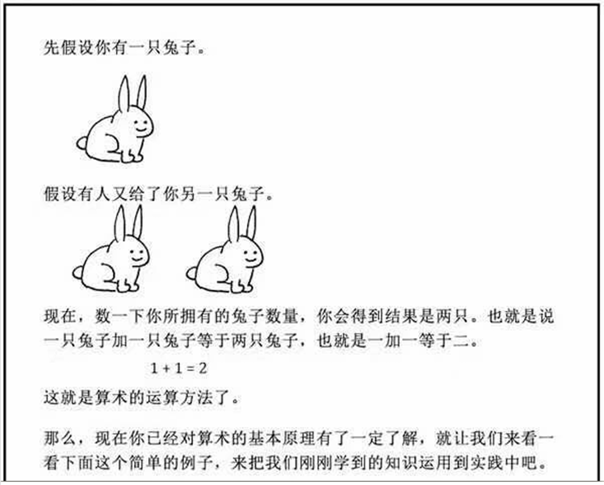
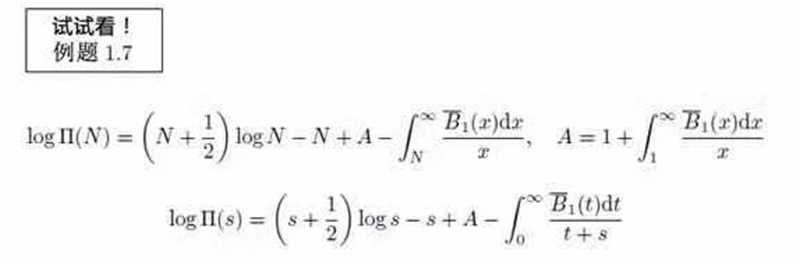

# 算法设计

!!! success 梦想的场景

    

    答：分三步：

    - 第一步：打开冰箱门
    - 第二步：把大象推进冰箱
    - 第三步：关上冰箱门

!!! failure 真实的场景！

    
    

## 算法分类

!!! info https://en.wikipedia.org/wiki/Algorithm#Classification

    三种分类方案：
    
    - By implementation
    - By design paradigm
    - Optimization problems

### 按实现方式分类

**递归** （Recursion）：

- 算法通过调用自身来解决问题，每个递归调用都将问题分解为更小的子问题，直到达到基本情况（可以直接解决的情况）。
- 递归算法是一种常见的函数式编程方法。迭代算法则使用循环等重复结构或栈等数据结构来解决问题。

**串行** / **并行** / **分布式** （Serial, parallel or distributed）

- 算法通常是在假设计算机在串行计算机上一次执行算法的一条指令的前提下讨论的
- 并行算法利用多处理器可同时处理同一问题的计算机架构，分布式算法则使用通过网络连接的多个机器
  - 并行算法和分布式算法会将问题分解为子问题，再汇总子问题的结果
  - 这些算法的资源消耗不仅包括每个处理器的处理器周期，还包括处理器间的通信开销。一些排序算法可高效并行化，但其通信开销较大。
  - 迭代算法通常可并行化，但有些问题没有并行算法，称为固有串行问题

**确定性** / **非确定性** （Deterministic or non-deterministic）

- 确定性算法在每一步都通过精确决策解决问题；
- 而非确定性算法则通过猜测解决问题。这些猜测通常通过使用启发式（heuristics）方法变得更准确。
- 两种算法的核心差异：确定性算法依赖逻辑严谨的逐步推导，非确定性算法依赖试探性猜测。猜测本身可能盲目，需通过启发式方法（如剪枝、评估函数）过滤无效路径，提升效率。

**精确** / **近似** （Exact or approximate）

- 精确算法能够找到问题的确切解，而近似算法则寻求一个接近真实解的近似值。
  - 近似算法对许多困难问题（如NP难问题）具有实用价值，例如背包问题（Knapsack problem）
    - 背包问题：给定一组物品，目标是装包以获得最大总价值。每件物品都有一定重量和价值，可携带的总重量不超过某个固定数值X。因此，解决方案必须同时考虑物品的重量及其价值。
- 当精确求解（如枚举所有物品组合）因计算量过大不可行时，近似算法（如贪心算法、动态规划近似解）能在合理时间内给出接近最优的方案，平衡效率与精度。

**量子算法** （Quantum algorithm）

- 量子算法在量子计算的现实模型上运行。该术语通常用于指那些本质上是量子的，或利用了量子计算某些核心特征（如 **量子叠加态** 或 **量子纠缠** ）的算法。
- 例如，用量子计算机跑经典算法（如排序）不算量子算法，而Shor算法（分解大数质因数）因利用量子傅里叶变换和叠加态并行搜索，是典型的量子算法。

### 按设计范式分类

**暴力法** （Brute-force or exhaustive search）

- 暴力法（Brute force）是一种问题求解方法，通过**系统地尝试每一种可能的选项**，直到找到最优解。
- 这种方法可能非常**耗时**，因为它需要测试变量的**所有可能组合**。
- 当其他方法不可用或过于复杂时，通常会使用暴力法。暴力法可解决多种问题，包括寻找两点之间的最短路径和破解密码。
- 暴力法的本质是“以空间换时间”的反面 —— **以时间换确定性**，确保找到最优解（若存在）。其优缺点鲜明：
  - 优点：逻辑简单、无需复杂算法设计，能保证找到最优解（只要时间和资源足够）
  - 缺点：效率低，仅适用于小规模问题，大规模问题会因“组合爆炸”无法实际应用
    - 例：用暴力法破解4位数字密码（0000-9999），最多尝试10⁴=10000次；但破解8位数字密码则需10⁸=1亿次，耗时剧增。

**分治法** （Divide and conquer）

- 分治算法（divide-and-conquer algorithm）反复将问题**分解为一个或多个自身的更小实例**（通常递归地），直到这些实例小到足以轻松解决。
  - 归并排序（Merge sorting）是分治算法的一个例子：将一个无序列表反复拆分为更小的列表，这些小列表以同样方式排序后再合并。
- 分治算法的三步骤：
  - 分解（Divide）：将原问题拆分为多个独立子问题（如归并排序拆列表）；
  - 解决（Conquer）：递归解决子问题（子问题足够小时直接求解）；
  - 合并（Combine）：将子问题的解整合为原问题的解（如归并排序合并有序子列表）。
- 分治算法的更简单变体，称为剪枝搜索或减治算法，prune and search/decrease-and-conquer algorithm
  - 减治算法仅将问题规模减小为一个子实例（而非多个），且无需合并步骤（子问题的解直接构成原问题的解）
  - 二分查找算法（binary search algorithm）就是减治算法的一个例子：每次排除一半数组，仅处理剩余一半（一个子实例），直接定位目标
- 分治与减治均是算法设计中“化繁为简”的核心策略，适用于不同问题场景（分治适合可并行处理的子问题，减治适合规模线性减小的场景）

**搜索和枚举**（Search and enumeration）

- 许多问题（如下棋）可以建模为图上的问题。图探索算法规定了在图中移动的规则，对这类问题很有用。
- 这一类别还包括搜索算法、分支定界枚举（branch and bound enumeration）和回溯法（backtracking）。
  - 回溯法通过“试错-回退”在图中搜索解空间（如迷宫寻路），分支定界则通过估算边界剪枝低效路径。

**随机化算法**（Randomized algorithm）

- 当寻找精确解不切实际时，这类算法会 **随机地** （或 **伪随机地** ）做出一些选择，找到近似解。
- 随机算法的核心价值在于**用可控的随机性突破确定性算法的局限**：
  - 适用场景：当精确解计算成本过高（如NP难问题），或需平衡效率与精度时（如模拟退火、遗传算法）
- 这类算法有两大类别：
  - 蒙特卡洛算法（Monte Carlo algorithms）： **结果可能对，时间一定** —— 以一定错误概率换取效率（如快速矩阵乘法近似），典型应用：风险评估、统计模拟。
  - 拉斯维加斯算法（Las Vegas algorithms）： **结果一定对，时间可能对** —— 以随机运行时间换取结果可靠性（如随机化快速排序），典型应用：路径规划、博弈树搜索
  - 例：用蒙特卡洛算法估算圆周率π（随机撒点，统计圆内点比例），结果接近π但非精确值；用拉斯维加斯算法求解八皇后问题（随机放置皇后，冲突则重试），最终必得正确解，但重试次数随机。

**降低复杂性**（Reduction of complexity）

- 这种技术将困难问题转化为更易处理的已知问题（这些问题有望用渐近最优算法求解）。
- 其核心目标是找到一个归约算法（reducing algorithm），使其复杂度不被转化后的简化算法（reduced algorithms）的复杂度主导。
  - 例如，一个选择算法（selection algorithm）求无序列表的中位数时，会先将列表排序（耗时部分），再从排序后的列表中取出中间元素（省时部分）。
- 这种技术也被称为 **转化与征服** （transform and conquer），本质是**借力打力**
  - 转化（Transform）：将原问题映射到已有解法的问题（如上例将“求中位数”转化为“排序+取元素”）
  - 征服（Conquer）：用现有算法（如排序算法）解决转化后的问题
- 核心权衡：归约过程的复杂度需可控。若转化本身太复杂，则可能得不偿失
  - 例：求无序数组的最大值（选择算法），若转化为“排序后取最后一个元素”（O(n log n)），不如直接遍历（O(n)）高效；但若转化为“用堆排序取最大值”（已有堆算法），则可能复用成熟代码。

**回溯法** （Back tracking）

- 在这种方法中，逐步增量构建多个可能的解，当确定这些解无法导向有效的完整解时，便将其放弃（回溯），转而尝试其他路径。
- 回溯法的本质是“试探性构造+剪枝无效路径”，通过“增量构建+放弃无效解”实现高效搜索，避免枚举所有可能（对比暴力法的“全覆盖”）
  - 增量构建：从初始状态出发，每次选择一个可能的分支（如八皇后问题中“在当前行放置一个皇后”），逐步扩展解；
  - 有效性检查：每扩展一步，检查当前部分解是否满足约束（如“皇后是否在同一对角线”）；
  - 回溯放弃：若当前部分解已不可能发展为有效完整解（如“剩余行无法放置不冲突的皇后”），则回溯到上一步，撤销最后的选择，尝试其他分支。
- 经典案例：八皇后问题（在8×8棋盘放8个皇后，互不攻击）、数独求解、迷宫寻路。


### 按优化问题分类

**线性规划** （Linear programming）

- 在搜索**受线性等式和不等式约束的线性函数**的最优解时，约束可直接用于生成最优解。
- 存在能解决此类所有问题的算法，例如广为人知的单纯形算法（simplex algorithm）。可用线性规划解决的问题包括有向图的最大流问题（maximum flow problem for directed graphs）。
- 线性规划的核心是“线性目标+线性约束”下的优化，其优势在于：
  - 通用解法：单纯形算法等可解决绝大多数线性规划问题，且理论完备（如“若最优解存在，必在可行域顶点处”）；
  - 应用广泛：除最大流问题外，还用于资源分配（如人力/资金调度）、生产计划（如原料配比）、运输优化（如物流路径成本最小化）等。
- 例：工厂生产A、B两种产品，利润分别为3和5，原料限制为2A+3B≤10，求最大利润。这是线性规划问题，用单纯形算法可得最优解（如A=2,B=2，利润16）

**动态规划** （Dynamic programming）

- 适用条件：
  - 最优子结构（optimal substructures）：确保子问题的最优解可组合为原问题的最优解（如最短路径、最长公共子序列）
  - 重叠子问题（overlapping subproblems）：存在重复出现的子问题（否则记忆化无意义，如分治算法的独立子问题）。
- 动态规划与记忆化（memoization）密不可分。与分治算法不同，动态规划的子问题往往相互重叠。
  - 动态规划与简单递归的区别在于对递归调用的缓存（caching）或记忆化。当子问题独立且不重复时，记忆化并无帮助；因此，动态规划并非适用于所有复杂问题。
  - 通过记忆化，动态规划可将许多问题的复杂度从指数级降至多项式级。
- 动态规划的本质是 **以空间换时间** ，通过存储子问题解消除重复计算，将“重复计算”转化为“查表计算”，核心逻辑可概括为“定义子问题→存储子问题解→组合子问题解”。
- 经典案例：
  - 弗洛伊德-沃舍尔算法：通过三重循环遍历所有顶点对，用dp[i][j]存储顶点i到j的最短路径，逐步更新（利用子问题“i到k再到j”的路径）。
  - 背包问题：用dp[i][w]存储前i件物品在重量w下的最大价值，避免重复计算物品组合。

**贪心法** （The greedy method）

- 贪心算法与动态规划类似，通过考察子结构来工作 —— 但这里考察的不是问题的子结构，而是给定解的（子结构）。
- 贪心算法仅在 **局部最优=全局最优** 的问题中有效（如最小生成树、霍夫曼编码、活动选择问题）；若问题存在“局部最优陷阱”（如旅行商问题TSP），则会停在局部最优。
- 贪心法与动态规划同属优化算法，但核心逻辑截然不同：
  - 动态规划：依赖“最优子结构+重叠子问题”，通过记忆化存储子问题解避免重复计算（如斐波那契数列、最短路径）；
  - 贪心算法：依赖“贪心选择性质”（每一步局部最优能导致全局最优），通过即时选择构建解（不回溯、不存储子问题）。
- 与动态规划的核心区别：
  - 动态规划考虑所有可能的子问题（重叠子问题），贪心算法只考虑当前的局部最优；
  - 动态规划存储子问题解（记忆化），贪心算法即时决策（不回头）。
- 经典案例对比：
  - 最小生成树：克鲁斯卡尔/普里姆算法通过“选当前最小边”的贪心策略，确保最终得到全局最小生成树（证明：贪心选择性质成立）；
  - 霍夫曼编码：每次合并频率最低的两个字符节点，生成的前缀码总长度最小（贪心选择性质成立）；
  - 背包问题：若用贪心算法（选“价值/重量比”最高的物品），无法保证全局最优（如物品不可分割时），需用动态规划。

**启发式方法** （The heuristic method）

- 在优化问题中，当寻找最优解不切实际时，启发式算法（heuristic algorithms）会找到 **接近最优解的解** 
  - 这些算法在执行过程中会**越来越接近最优解**。
  - 原则上，如果运行无限长时间，它们会找到最优解。
  - 理想情况下，它们能在相对较短的时间内找到非常接近最优解的解。
  - 当已知非最优解的误差界限时，该算法会进一步被归类为近似算法（approximation algorithm）。
- 启发式方法是 **效率优先于绝对最优** 的算法策略，核心是通过 **经验性规则** 或 **随机探索** 快速逼近解，尤其适用于 **NP难问题** （如背包问题、旅行商问题） —— 这类问题精确求解（如动态规划、暴力法）的时间复杂度随规模指数增长，实际中不可行。
- 启发式算法是近似算法的“子集”：当启发式算法的误差界限可证明（如“近似解误差≤10%”）时，会被归类为近似算法
- 经典算法特点：
  - 模拟退火（非确定性）：初期高温时允许随机接受劣化解（跳出局部最优），随“温度”降低逐渐收敛到稳定解（如芯片布线优化）；
  - 禁忌搜索（确定性）：用“禁忌表”记录近期移动，禁止重复访问，同时通过“特赦准则”允许突破禁忌（如调度问题）；
  - 遗传算法（非确定性）：模拟生物进化，通过种群迭代优化（如神经网络结构搜索）；
  - 局部搜索（确定性/非确定性）：在解的邻域内改进（如爬山算法，易陷局部最优）。
- 与随机算法的区别
  - 随机算法（如蒙特卡洛、拉斯维加斯）的核心是“随机性”（用于突破确定性局限）
  - 启发式算法的核心是“经验性规则”（如模拟退火的“温度衰减”、遗传算法的“适者生存”），随机性仅作为辅助（如模拟退火的随机跳转）

# 选择无处不在：迭代与递归

在算法中，重复执行某个任务是很常见的，我们先来了解如何在程序中实现重复执行任务，即两种基本的程序控制结构：迭代、递归。

## 迭代

<u>迭代（iteration）</u>是一种重复执行某个任务的控制结构。在迭代中，程序会在满足一定的条件下重复执行某段代码，直到这个条件不再满足。

### for 循环

`for` 循环是最常见的迭代形式之一，**适合在预先知道迭代次数时使用**。

以下函数基于 `for` 循环实现了求和 $1 + 2 + \dots + n$ ，求和结果使用变量 `res` 记录。需要注意的是，Python 中 `range(a, b)` 对应的区间是“左闭右开”的，对应的遍历范围为 $a, a + 1, \dots, b-1$ ：

```python
def for_loop(n: int) -> int:
    """for 循环"""
    res = 0
    # 循环求和 1, 2, ..., n-1, n
    for i in range(1, n + 1):
        res += i
    return res

"""Driver Code"""
if __name__ == "__main__":
    n = 5
    res = for_loop(n)
    print(f"\nfor 循环的求和结果 res = {res}")
```

下图是该求和函数的流程框图。


此求和函数的操作数量与输入数据大小 $n$ 成正比，或者说成“线性关系”。实际上，**时间复杂度描述的就是这个“线性关系”**。相关内容将会在下一节中详细介绍。

### while 循环

与 `for` 循环类似，`while` 循环也是一种实现迭代的方法。在 `while` 循环中，程序每轮都会先检查条件，如果条件为真，则继续执行，否则就结束循环。

下面我们用 `while` 循环来实现求和 $1 + 2 + \dots + n$ ：

```python
def while_loop(n: int) -> int:
    """while 循环"""
    res = 0
    i = 1  # 初始化条件变量
    # 循环求和 1, 2, ..., n-1, n
    while i <= n:
        res += i
        i += 1  # 更新条件变量
    return res

"""Driver Code"""
if __name__ == "__main__":
    n = 5
    res = while_loop(n)
    print(f"\nwhile 循环的求和结果 res = {res}")
```

**`while` 循环比 `for` 循环的自由度更高**。在 `while` 循环中，我们可以自由地设计条件变量的初始化和更新步骤。

例如在以下代码中，条件变量 $i$ 每轮进行两次更新，这种情况就不太方便用 `for` 循环实现：

```python
def while_loop_ii(n: int) -> int:
    """while 循环（两次更新）"""
    res = 0
    i = 1  # 初始化条件变量
    # 循环求和 1, 4, 10, ...
    while i <= n:
        res += i
        # 更新条件变量
        i += 1
        i *= 2
    return res

"""Driver Code"""
if __name__ == "__main__":
    n = 5
    res = while_loop_ii(n)
    print(f"\nwhile 循环（两次更新）求和结果 res = {res}")
```

总的来说，**`for` 循环的代码更加紧凑，`while` 循环更加灵活**，两者都可以实现迭代结构。选择使用哪一个应该根据特定问题的需求来决定。

### 嵌套循环

我们可以在一个循环结构内嵌套另一个循环结构，下面以 `for` 循环为例：

```python
def nested_for_loop(n: int) -> str:
    """双层 for 循环"""
    res = ""
    # 循环 i = 1, 2, ..., n-1, n
    for i in range(1, n + 1):
        # 循环 j = 1, 2, ..., n-1, n
        for j in range(1, n + 1):
            res += f"({i}, {j}), "
    return res

"""Driver Code"""
if __name__ == "__main__":
    n = 5
    res = nested_for_loop(n)
    print(f"\n双层 for 循环的遍历结果 {res}")
```

下图是该嵌套循环的流程框图。


在这种情况下，函数的操作数量与 $n^2$ 成正比，或者说算法运行时间和输入数据大小 $n$ 成“平方关系”。

我们可以继续添加嵌套循环，每一次嵌套都是一次“升维”，将会使时间复杂度提高至“立方关系”“四次方关系”，以此类推。

## 递归

 <u>递归（recursion）</u>是一种算法策略，通过函数调用自身来解决问题。它主要包含两个阶段。

1. **递**：程序不断深入地调用自身，通常传入更小或更简化的参数，直到达到“终止条件”。
2. **归**：触发“终止条件”后，程序从最深层的递归函数开始逐层返回，汇聚每一层的结果。

而从实现的角度看，递归代码主要包含三个要素。

1. **终止条件**：用于决定什么时候由“递”转“归”。
2. **递归调用**：对应“递”，函数调用自身，通常输入更小或更简化的参数。
3. **返回结果**：对应“归”，将当前递归层级的结果返回至上一层。

观察以下代码，我们只需调用函数 `recur(n)`  ，就可以完成 $1 + 2 + \dots + n$ 的计算：

```python
def recur(n: int) -> int:
    """递归"""
    # 终止条件
    if n == 1:
        return 1
    # 递：递归调用
    res = recur(n - 1)
    # 归：返回结果
    return n + res

"""Driver Code"""
if __name__ == "__main__":
    n = 5
    res = recur(n)
    print(f"\n递归函数的求和结果 res = {res}")
```

下图展示了该函数的递归过程。


虽然从计算角度看，迭代与递归可以得到相同的结果，**但它们代表了两种完全不同的思考和解决问题的范式**。

- **迭代**：“自下而上”地解决问题。从最基础的步骤开始，然后不断重复或累加这些步骤，直到任务完成。
- **递归**：“自上而下”地解决问题。将原问题分解为更小的子问题，这些子问题和原问题具有相同的形式。接下来将子问题继续分解为更小的子问题，直到基本情况时停止（基本情况的解是已知的）。

以上述求和函数为例，设问题 $f(n) = 1 + 2 + \dots + n$ 。

- **迭代**：在循环中模拟求和过程，从 $1$ 遍历到 $n$ ，每轮执行求和操作，即可求得 $f(n)$ 。
- **递归**：将问题分解为子问题 $f(n) = n + f(n-1)$ ，不断（递归地）分解下去，直至基本情况 $f(1) = 1$ 时终止。

### 调用栈

递归函数每次调用自身时，系统都会为新开启的函数分配内存，以存储局部变量、调用地址和其他信息等。这将导致两方面的结果。

- 函数的上下文数据都存储在称为“栈帧空间”的内存区域中，直至函数返回后才会被释放。因此，**递归通常比迭代更加耗费内存空间**。
- 递归调用函数会产生额外的开销。**因此递归通常比循环的时间效率更低**。

如下图所示，在触发终止条件前，同时存在 $n$ 个未返回的递归函数，**递归深度为 $n$** 。


在实际中，编程语言允许的递归深度通常是有限的，过深的递归可能导致栈溢出错误。

### 尾递归

有趣的是，**如果函数在返回前的最后一步才进行递归调用**，则该函数可以被编译器或解释器优化，使其在空间效率上与迭代相当。这种情况被称为<u>尾递归（tail recursion）</u>。

- **普通递归**：当函数返回到上一层级的函数后，需要继续执行代码，因此系统需要保存上一层调用的上下文。
- **尾递归**：递归调用是函数返回前的最后一个操作，这意味着函数返回到上一层级后，无须继续执行其他操作，因此系统无须保存上一层函数的上下文。

以计算 $1 + 2 + \dots + n$ 为例，我们可以将结果变量 `res` 设为函数参数，从而实现尾递归：

```python
def tail_recur(n, res):
    """尾递归"""
    # 终止条件
    if n == 0:
        return res
    # 尾递归调用
    return tail_recur(n - 1, res + n)

"""Driver Code"""
if __name__ == "__main__":
    n = 5
    res = tail_recur(n, 0)
    print(f"\n尾递归函数的求和结果 res = {res}")
```

尾递归的执行过程如下图所示。对比普通递归和尾递归，两者的求和操作的执行点是不同的。

- **普通递归**：求和操作是在“归”的过程中执行的，每层返回后都要再执行一次求和操作。
- **尾递归**：求和操作是在“递”的过程中执行的，“归”的过程只需层层返回。


!!! tip

    请注意，许多编译器或解释器并不支持尾递归优化。例如，Python 默认不支持尾递归优化，因此即使函数是尾递归形式，仍然可能会遇到栈溢出问题。

### 递归树

当处理与“分治”相关的算法问题时，递归往往比迭代的思路更加直观、代码更加易读。以“斐波那契数列”为例。

!!! question

    给定一个斐波那契数列 $0, 1, 1, 2, 3, 5, 8, 13, \dots$ ，求该数列的第 $n$ 个数字。

设斐波那契数列的第 $n$ 个数字为 $f(n)$ ，易得两个结论。

- 数列的前两个数字为 $f(1) = 0$ 和 $f(2) = 1$ 。
- 数列中的每个数字是前两个数字的和，即 $f(n) = f(n - 1) + f(n - 2)$ 。

按照递推关系进行递归调用，将前两个数字作为终止条件，便可写出递归代码。调用 `fib(n)` 即可得到斐波那契数列的第 $n$ 个数字：

```python
def fib(n: int) -> int:
    """斐波那契数列：递归"""
    # 终止条件 f(1) = 0, f(2) = 1
    if n == 1 or n == 2:
        return n - 1
    # 递归调用 f(n) = f(n-1) + f(n-2)
    res = fib(n - 1) + fib(n - 2)
    # 返回结果 f(n)
    return res

"""Driver Code"""
if __name__ == "__main__":
    n = 5
    res = fib(n)
    print(f"\n斐波那契数列的第 {n} 项为 {res}")
```

观察以上代码，我们在函数内递归调用了两个函数，**这意味着从一个调用产生了两个调用分支**。如下图所示，这样不断递归调用下去，最终将产生一棵层数为 $n$ 的<u>递归树（recursion tree）</u>。


从本质上看，递归体现了“将问题分解为更小子问题”的思维范式，这种分治策略至关重要。

- 从算法角度看，搜索、排序、回溯、分治、动态规划等许多重要算法策略直接或间接地应用了这种思维方式。
- 从数据结构角度看，递归天然适合处理链表、树和图的相关问题，因为它们非常适合用分治思想进行分析。

!!! danger 试试将 fib 的参数改为10、20、30、40

## 两者对比

总结以上内容，如下表所示，迭代和递归在实现、性能和适用性上有所不同。

<p align="center"> 表 <id> &nbsp; 迭代与递归特点对比 </p>

|          | 迭代                                   | 递归                                                         |
| -------- | -------------------------------------- | ------------------------------------------------------------ |
| 实现方式 | 循环结构                               | 函数调用自身                                                 |
| 时间效率 | 效率通常较高，无函数调用开销           | 每次函数调用都会产生开销                                     |
| 内存使用 | 通常使用固定大小的内存空间             | 累积函数调用可能使用大量的栈帧空间                           |
| 适用问题 | 适用于简单循环任务，代码直观、可读性好 | 适用于子问题分解，如树、图、分治、回溯等，代码结构简洁、清晰 |

!!! tip

    如果感觉以下内容理解困难，可以在读完“栈”章节后再来复习。

那么，迭代和递归具有什么内在联系呢？以上述递归函数为例，求和操作在递归的“归”阶段进行。这意味着最初被调用的函数实际上是最后完成其求和操作的，**这种工作机制与栈的“先入后出”原则异曲同工**。

事实上，“调用栈”和“栈帧空间”这类递归术语已经暗示了递归与栈之间的密切关系。

1. **递**：当函数被调用时，系统会在“调用栈”上为该函数分配新的栈帧，用于存储函数的局部变量、参数、返回地址等数据。
2. **归**：当函数完成执行并返回时，对应的栈帧会被从“调用栈”上移除，恢复之前函数的执行环境。

因此，**我们可以使用一个显式的栈来模拟调用栈的行为**，从而将递归转化为迭代形式：

```python
def for_loop_recur(n: int) -> int:
    """使用迭代模拟递归"""
    # 使用一个显式的栈来模拟系统调用栈
    stack = []
    res = 0
    # 递：递归调用
    for i in range(n, 0, -1):
        # 通过“入栈操作”模拟“递”
        stack.append(i)
    # 归：返回结果
    while stack:
        # 通过“出栈操作”模拟“归”
        res += stack.pop()
    # res = 1+2+3+...+n
    return res

"""Driver Code"""
if __name__ == "__main__":
    n = 5
    res = for_loop_recur(n)
    print(f"\n使用迭代模拟递归求和结果 res = {res}")
```

观察以上代码，当递归转化为迭代后，代码变得更加复杂了。尽管迭代和递归在很多情况下可以互相转化，但不一定值得这样做，有以下两点原因。

- 转化后的代码可能更加难以理解，可读性更差。
- 对于某些复杂问题，模拟系统调用栈的行为可能非常困难。

总之，**选择迭代还是递归取决于特定问题的性质**。在编程实践中，权衡两者的优劣并根据情境选择合适的方法至关重要。

