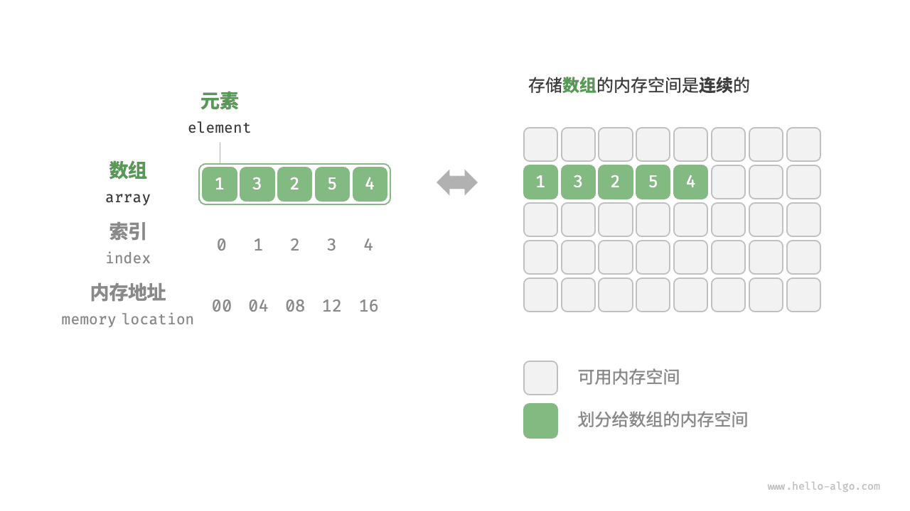
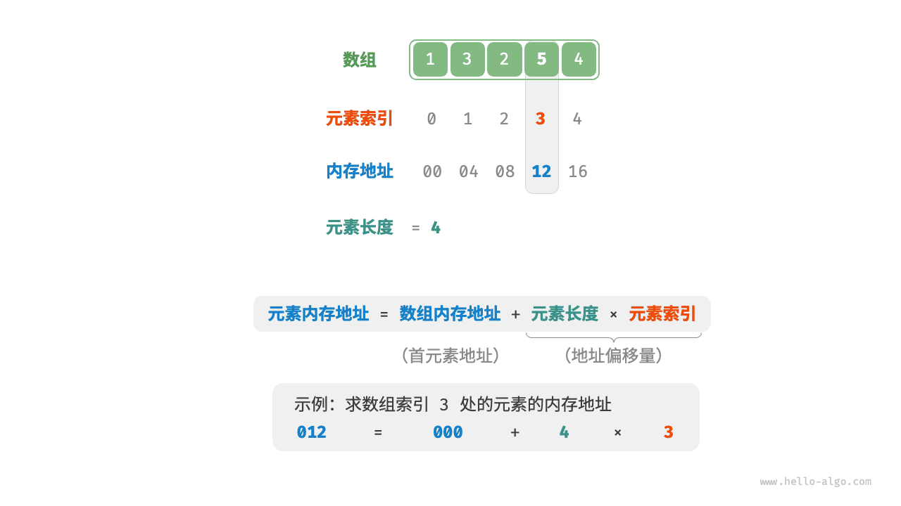
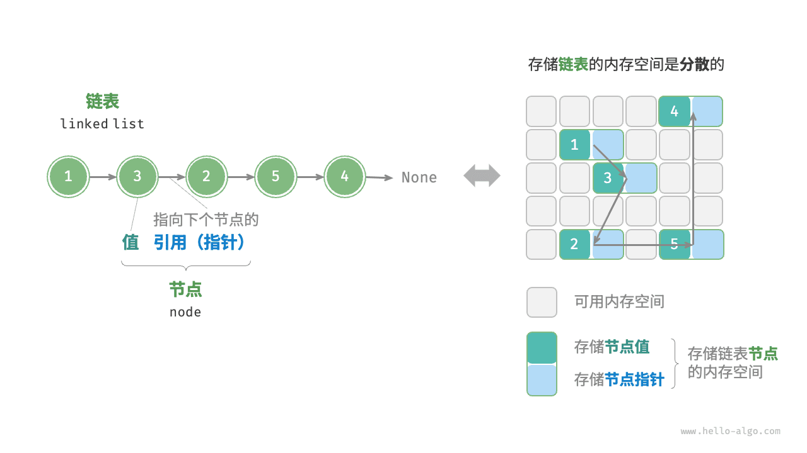
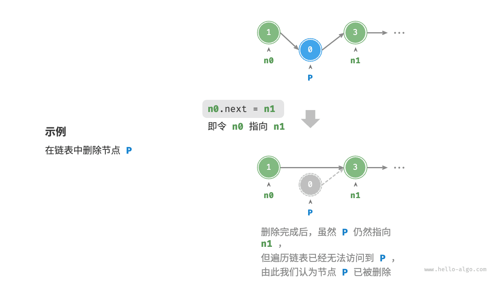
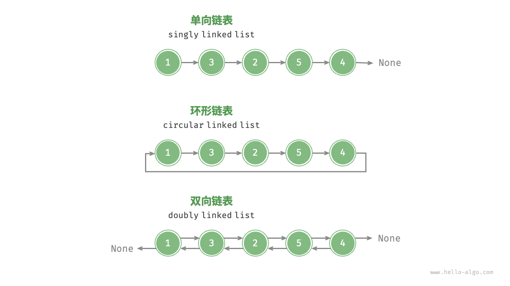

# 线性结构

!!! note **What Are Linear Structures? 线性结构**

    我们将通过考虑四个简单但非常强大的概念开始数据结构的研究。栈、队列、双端队列和列表是数据集合的例子，它们的项目根据添加或移除的方式有序排列。一旦一个项目被添加，它相对于之前和之后添加的其他元素的位置保持不变。像这样的集合通常被称为**线性数据结构**。

> We will begin our study of data structures by considering four simple but very powerful concepts. Stacks, queues, deques, and lists are examples of data collections whose items are ordered depending on how they are added or removed. Once an item is added, it stays in that position relative to the other elements that came before and came after it. Collections such as these are often referred to as **linear data structures**.

!!! note

    线性结构可以被认为有两个端点。有时这些端点被称作“左”和“右”，或者在某些情况下称为“前”和“后”。你也可以称它们为“顶”和“底”。赋予这些端点的名称并不重要。区分一种线性结构与另一种线性结构的是项目如何被添加和移除，尤其是这些添加和移除发生的位置。例如，某种结构可能只允许在一端添加新项目。而有些结构可能允许从两端移除项目。

    这些变化产生了计算机科学中一些最有用的数据结构。它们出现在许多算法中，并且可用于解决各种重要的问题。

> Linear structures can be thought of as having two ends. Sometimes these ends are referred to as the “left” and the “right” or in some cases the “front” and the “rear.” You could also call them the “top” and the “bottom.” The names given to the ends are not significant. What distinguishes one linear structure from another is the way in which items are added and removed, in particular the location where these additions and removals occur. For example, a structure might allow new items to be added at only one end. Some structures might allow items to be removed from either end.
>
> These variations give rise to some of the most useful data structures in computer science. They appear in many algorithms and can be used to solve a variety of important problems.
>


!!! note **What is a Stack? 栈**

    **栈**（有时被称为“压入栈”）是一种有序的项目集合，其中新项目的添加和现有项目的移除总是在同一端进行。这一端通常被称为“顶端”。与顶端相对的另一端被称为“基底”。

    栈的基底是重要的，因为存储在栈中靠近基底的项目代表了在栈中最久的项目。最近添加的项目是准备首先被移除的那个。这种排序原则有时被称为**LIFO（后进先出）**。它提供了一种基于项目在集合中停留时间长短的排序。较新的项目接近顶端，而较旧的项目接近基底。

    日常生活中有许多栈的例子。几乎任何自助餐厅都有一个托盘或盘子的堆栈，你可以从顶部取走一个，为下一位排队的顾客露出一个新的托盘或盘子。

> A **stack** (sometimes called a “push-down stack”) is an ordered collection of items where the addition of new items and the removal of existing items always takes place at the same end. This end is commonly referred to as the “top.” The end opposite the top is known as the “base.”
>
> The base of the stack is significant since items stored in the stack that are closer to the base represent those that have been in the stack the longest. The most recently added item is the one that is in position to be removed first. This ordering principle is sometimes called **LIFO**, **last-in first-out**. It provides an ordering based on length of time in the collection. Newer items are near the top, while older items are near the base.
>
> Many examples of stacks occur in everyday situations. Almost any cafeteria has a stack of trays or plates where you take the one at the top, uncovering a new tray or plate for the next customer in line.
>


!!! note **What Is a Queue? 队列**

    队列是一种有序的项目集合，其中新项目的添加发生在一端，这端被称为“尾部”，而现有项目的移除则发生在另一端，通常称为“前端”。当元素进入队列时，它从尾部开始，向前端移动，直到成为下一个要被移除的元素为止。

    队列中最新增加的项目必须在集合的末尾等待。在集合中最久的项目位于前端。这种排序原则有时被称为**FIFO（先进先出）**，也称为“先来先服务”。

> A queue is an ordered collection of items where the addition of new items happens at one end, called the “rear,” and the removal of existing items occurs at the other end, commonly called the “front.” As an element enters the queue it starts at the rear and makes its way toward the front, waiting until that time when it is the next element to be removed.
>
> The most recently added item in the queue must wait at the end of the collection. The item that has been in the collection the longest is at the front. This ordering principle is sometimes called **FIFO**, **first-in first-out**. It is also known as “first-come first-served.”
>


!!! note **线性表**/线性结构，是一种逻辑结构，描述了元素按线性顺序排列的规则。

    常见的线性表存储方式有**数组**和**链表**，它们在不同场景下具有各自的优势和劣势。

!!! note **数组**是一种连续存储结构，它将线性表的元素按照一定的顺序依次存储在内存中的连续地址空间上。

    数组需要预先分配一定的内存空间，每个元素占用相同大小的内存空间，并可以通过索引来进行快速访问和操作元素。访问元素的时间复杂度为$O(1)$，因为可以直接计算元素的内存地址。然而，插入和删除元素的时间复杂度较高，平均为$O(n)$，因为需要移动其他元素来保持连续存储的特性。


!!! note **链表**是一种存储结构，它是线性表的链式存储方式。

    链表通过节点的相互链接来实现元素的存储。每个节点包含元素本身以及指向下一个节点的指针。链表的插入和删除操作非常高效，时间复杂度为$O(1)$，因为只需要调整节点的指针。然而，访问元素的时间复杂度较高，平均为$O(n)$，因为必须从头节点开始遍历链表直到找到目标元素。

    

!!! note 选择使用数组还是链表作为存储方式取决于具体问题的需求和限制。

    - <mark>如果需要频繁进行随机访问操作，数组是更好的选择</mark>。
    - 如果需要频繁进行插入和删除操作，链表更适合。
    - 通过了解它们的特点和性能，可以根据实际情况做出选择。


!!! note 在Python中，list 更接近于数组的存储结构。

    


# 线性表之顺序表

线性表（$List$）的定义：零个或多个数据元素的**有限**序列。

线性表的数据集合为{$a_{1}$, $a_{2}$ …… $a_{n}$}，该序列有唯一的头元素和尾元素，除了头元素外，每个元素都有唯一的前驱元素，除了尾元素外，每个元素都有唯一的后继元素。

线性表中的元素属于相同的数据类型，即每个元素所占的空间相同。

框架：
$$
线性表\begin{cases}
顺序存储——顺序表\\
链式存储\begin{cases}
单链表\\
双链表\\
循环链表
\end{cases}
\end{cases}
$$

## 数组

<u>数组（array）</u>是一种线性数据结构，其将相同类型的元素存储在连续的内存空间中。我们将元素在数组中的位置称为该元素的<u>索引（index）</u>。下图展示了数组的主要概念和存储方式。



## 数组常用操作

### 初始化数组

我们可以根据需求选用数组的两种初始化方式：无初始值、给定初始值。在未指定初始值的情况下，大多数编程语言会将数组元素初始化为 $0$ ：

```python
# 初始化数组
arr: list[int] = [0] * 5  # [ 0, 0, 0, 0, 0 ]
nums: list[int] = [1, 3, 2, 5, 4]
```

!!! example [pythontutor "可视化运行"](https://pythontutor.com/iframe-embed.html#code=%23%20%E5%88%9D%E5%A7%8B%E5%8C%96%E6%95%B0%E7%BB%84%0Aarr%20%3D%20%5B0%5D%20*%205%20%20%23%20%5B%200,%200,%200,%200,%200%20%5D%0Anums%20%3D%20%5B1,%203,%202,%205,%204%5D&codeDivHeight=800&codeDivWidth=600&cumulative=false&curInstr=0&heapPrimitives=nevernest&origin=opt-frontend.js&py=311&rawInputLstJSON=%5B%5D&textReferences=false)

### 访问元素

数组元素被存储在连续的内存空间中，这意味着计算数组元素的内存地址非常容易。给定数组内存地址（首元素内存地址）和某个元素的索引，我们可以使用下图所示的公式计算得到该元素的内存地址，从而直接访问该元素。



观察上图，我们发现数组首个元素的索引为 $0$ ，这似乎有些反直觉，因为从 $1$ 开始计数会更自然。但从地址计算公式的角度看，**索引本质上是内存地址的偏移量**。首个元素的地址偏移量是 $0$ ，因此它的索引为 $0$ 是合理的。

在数组中访问元素非常高效，我们可以在 $O(1)$ 时间内随机访问数组中的任意一个元素。

```python
def random_access(nums: list[int]) -> int:
    """随机访问元素"""
    # 在区间 [0, len(nums)-1] 中随机抽取一个数字
    random_index = random.randint(0, len(nums) - 1)
    # 获取并返回随机元素
    random_num = nums[random_index]
    return random_num
```

!!! example [pythontutor "可视化运行"](https://pythontutor.com/iframe-embed.html#code=import%20random%0A%0Adef%20random_access%28nums%3A%20list%5Bint%5D%29%20-%3E%20int%3A%0A%20%20%20%20%22%22%22%E9%9A%8F%E6%9C%BA%E8%AE%BF%E9%97%AE%E5%85%83%E7%B4%A0%22%22%22%0A%20%20%20%20%23%20%E5%9C%A8%E5%8C%BA%E9%97%B4%20%5B0,%20len%28nums%29-1%5D%20%E4%B8%AD%E9%9A%8F%E6%9C%BA%E6%8A%BD%E5%8F%96%E4%B8%80%E4%B8%AA%E6%95%B0%E5%AD%97%0A%20%20%20%20random_index%20%3D%20random.randint%280,%20len%28nums%29%20-%201%29%0A%20%20%20%20%23%20%E8%8E%B7%E5%8F%96%E5%B9%B6%E8%BF%94%E5%9B%9E%E9%9A%8F%E6%9C%BA%E5%85%83%E7%B4%A0%0A%20%20%20%20random_num%20%3D%20nums%5Brandom_index%5D%0A%20%20%20%20return%20random_num%0A%0A%22%22%22Driver%20Code%22%22%22%0Aif%20__name__%20%3D%3D%20%22__main__%22%3A%0A%20%20%20%20%23%20%E5%88%9D%E5%A7%8B%E5%8C%96%E6%95%B0%E7%BB%84%0A%20%20%20%20nums%20%3D%20%5B1,%203,%202,%205,%204%5D%0A%20%20%20%20print%28%22%E6%95%B0%E7%BB%84%20nums%20%3D%22,%20nums%29%0A%0A%20%20%20%20%23%20%E9%9A%8F%E6%9C%BA%E8%AE%BF%E9%97%AE%0A%20%20%20%20random_num%3A%20int%20%3D%20random_access%28nums%29%0A%20%20%20%20print%28%22%E5%9C%A8%20nums%20%E4%B8%AD%E8%8E%B7%E5%8F%96%E9%9A%8F%E6%9C%BA%E5%85%83%E7%B4%A0%22,%20random_num%29%0A&codeDivHeight=800&codeDivWidth=600&cumulative=false&curInstr=7&heapPrimitives=nevernest&origin=opt-frontend.js&py=311&rawInputLstJSON=%5B%5D&textReferences=false)

### 插入元素

数组元素在内存中是“紧挨着的”，它们之间没有空间再存放任何数据。如下图所示，如果想在数组中间插入一个元素，则需要将该元素之后的所有元素都向后移动一位，之后再把元素赋值给该索引。


值得注意的是，由于数组的长度是固定的，因此插入一个元素必定会导致数组尾部元素“丢失”。我们将这个问题的解决方案留在“列表”章节中讨论。

```python
def insert(nums: list[int], num: int, index: int):
    """在数组的索引 index 处插入元素 num"""
    # 把索引 index 以及之后的所有元素向后移动一位
    for i in range(len(nums) - 1, index, -1):
        nums[i] = nums[i - 1]
    # 将 num 赋给 index 处的元素
    nums[index] = num
```

!!! example [pythontutor "可视化运行"](https://pythontutor.com/iframe-embed.html#code=def%20insert%28nums%3A%20list%5Bint%5D,%20num%3A%20int,%20index%3A%20int%29%3A%0A%20%20%20%20%22%22%22%E5%9C%A8%E6%95%B0%E7%BB%84%E7%9A%84%E7%B4%A2%E5%BC%95%20index%20%E5%A4%84%E6%8F%92%E5%85%A5%E5%85%83%E7%B4%A0%20num%22%22%22%0A%20%20%20%20%23%20%E6%8A%8A%E7%B4%A2%E5%BC%95%20index%20%E4%BB%A5%E5%8F%8A%E4%B9%8B%E5%90%8E%E7%9A%84%E6%89%80%E6%9C%89%E5%85%83%E7%B4%A0%E5%90%91%E5%90%8E%E7%A7%BB%E5%8A%A8%E4%B8%80%E4%BD%8D%0A%20%20%20%20for%20i%20in%20range%28len%28nums%29%20-%201,%20index,%20-1%29%3A%0A%20%20%20%20%20%20%20%20nums%5Bi%5D%20%3D%20nums%5Bi%20-%201%5D%0A%20%20%20%20%23%20%E5%B0%86%20num%20%E8%B5%8B%E7%BB%99%20index%20%E5%A4%84%E7%9A%84%E5%85%83%E7%B4%A0%0A%20%20%20%20nums%5Bindex%5D%20%3D%20num%0A%0A%22%22%22Driver%20Code%22%22%22%0Aif%20__name__%20%3D%3D%20%22__main__%22%3A%0A%20%20%20%20%23%20%E5%88%9D%E5%A7%8B%E5%8C%96%E6%95%B0%E7%BB%84%0A%20%20%20%20nums%20%3D%20%5B1,%203,%202,%205,%204%5D%0A%20%20%20%20print%28%22%E6%95%B0%E7%BB%84%20nums%20%3D%22,%20nums%29%0A%0A%20%20%20%20%23%20%E6%8F%92%E5%85%A5%E5%85%83%E7%B4%A0%0A%20%20%20%20insert%28nums,%206,%203%29%0A%20%20%20%20print%28%22%E5%9C%A8%E7%B4%A2%E5%BC%95%203%20%E5%A4%84%E6%8F%92%E5%85%A5%E6%95%B0%E5%AD%97%206%20%EF%BC%8C%E5%BE%97%E5%88%B0%20nums%20%3D%22,%20nums%29&codeDivHeight=800&codeDivWidth=600&cumulative=false&curInstr=6&heapPrimitives=nevernest&origin=opt-frontend.js&py=311&rawInputLstJSON=%5B%5D&textReferences=false)

### 删除元素

同理，如下图所示，若想删除索引 $i$ 处的元素，则需要把索引 $i$ 之后的元素都向前移动一位。


请注意，删除元素完成后，原先末尾的元素变得“无意义”了，所以我们无须特意去修改它。

```python
def remove(nums: list[int], index: int):
    """删除索引 index 处的元素"""
    # 把索引 index 之后的所有元素向前移动一位
    for i in range(index, len(nums) - 1):
        nums[i] = nums[i + 1]
```

!!! example [pythontutor "可视化运行"](https://pythontutor.com/iframe-embed.html#code=def%20remove%28nums%3A%20list%5Bint%5D,%20index%3A%20int%29%3A%0A%20%20%20%20%22%22%22%E5%88%A0%E9%99%A4%E7%B4%A2%E5%BC%95%20index%20%E5%A4%84%E7%9A%84%E5%85%83%E7%B4%A0%22%22%22%0A%20%20%20%20%23%20%E6%8A%8A%E7%B4%A2%E5%BC%95%20index%20%E4%B9%8B%E5%90%8E%E7%9A%84%E6%89%80%E6%9C%89%E5%85%83%E7%B4%A0%E5%90%91%E5%89%8D%E7%A7%BB%E5%8A%A8%E4%B8%80%E4%BD%8D%0A%20%20%20%20for%20i%20in%20range%28index,%20len%28nums%29%20-%201%29%3A%0A%20%20%20%20%20%20%20%20nums%5Bi%5D%20%3D%20nums%5Bi%20%2B%201%5D%0A%0A%22%22%22Driver%20Code%22%22%22%0Aif%20__name__%20%3D%3D%20%22__main__%22%3A%0A%20%20%20%20%23%20%E5%88%9D%E5%A7%8B%E5%8C%96%E6%95%B0%E7%BB%84%0A%20%20%20%20nums%20%3D%20%5B1,%203,%202,%205,%204%5D%0A%20%20%20%20print%28%22%E6%95%B0%E7%BB%84%20nums%20%3D%22,%20nums%29%0A%0A%20%20%20%20%23%20%E5%88%A0%E9%99%A4%E5%85%83%E7%B4%A0%0A%20%20%20%20remove%28nums,%202%29%0A%20%20%20%20print%28%22%E5%88%A0%E9%99%A4%E7%B4%A2%E5%BC%95%202%20%E5%A4%84%E7%9A%84%E5%85%83%E7%B4%A0%EF%BC%8C%E5%BE%97%E5%88%B0%20nums%20%3D%22,%20nums%29&codeDivHeight=800&codeDivWidth=600&cumulative=false&curInstr=6&heapPrimitives=nevernest&origin=opt-frontend.js&py=311&rawInputLstJSON=%5B%5D&textReferences=false)

总的来看，数组的插入与删除操作有以下缺点。

- **时间复杂度高**：数组的插入和删除的平均时间复杂度均为 $O(n)$ ，其中 $n$ 为数组长度。
- **丢失元素**：由于数组的长度不可变，因此在插入元素后，超出数组长度范围的元素会丢失。
- **内存浪费**：我们可以初始化一个比较长的数组，只用前面一部分，这样在插入数据时，丢失的末尾元素都是“无意义”的，但这样做会造成部分内存空间浪费。

### 遍历数组

在大多数编程语言中，我们既可以通过索引遍历数组，也可以直接遍历获取数组中的每个元素：

```python
def traverse(nums: list[int]):
    """遍历数组"""
    count = 0
    # 通过索引遍历数组
    for i in range(len(nums)):
        count += nums[i]
    # 直接遍历数组元素
    for num in nums:
        count += num
    # 同时遍历数据索引和元素
    for i, num in enumerate(nums):
        count += nums[i]
        count += num
```

!!! example [pythontutor "可视化运行"](https://pythontutor.com/iframe-embed.html#code=def%20traverse%28nums%3A%20list%5Bint%5D%29%3A%0A%20%20%20%20%22%22%22%E9%81%8D%E5%8E%86%E6%95%B0%E7%BB%84%22%22%22%0A%20%20%20%20count%20%3D%200%0A%20%20%20%20%23%20%E9%80%9A%E8%BF%87%E7%B4%A2%E5%BC%95%E9%81%8D%E5%8E%86%E6%95%B0%E7%BB%84%0A%20%20%20%20for%20i%20in%20range%28len%28nums%29%29%3A%0A%20%20%20%20%20%20%20%20count%20%2B%3D%20nums%5Bi%5D%0A%20%20%20%20%23%20%E7%9B%B4%E6%8E%A5%E9%81%8D%E5%8E%86%E6%95%B0%E7%BB%84%E5%85%83%E7%B4%A0%0A%20%20%20%20for%20num%20in%20nums%3A%0A%20%20%20%20%20%20%20%20count%20%2B%3D%20num%0A%20%20%20%20%23%20%E5%90%8C%E6%97%B6%E9%81%8D%E5%8E%86%E6%95%B0%E6%8D%AE%E7%B4%A2%E5%BC%95%E5%92%8C%E5%85%83%E7%B4%A0%0A%20%20%20%20for%20i,%20num%20in%20enumerate%28nums%29%3A%0A%20%20%20%20%20%20%20%20count%20%2B%3D%20nums%5Bi%5D%0A%20%20%20%20%20%20%20%20count%20%2B%3D%20num%0A%0A%22%22%22Driver%20Code%22%22%22%0Aif%20__name__%20%3D%3D%20%22__main__%22%3A%0A%20%20%20%20%23%20%E5%88%9D%E5%A7%8B%E5%8C%96%E6%95%B0%E7%BB%84%0A%20%20%20%20nums%20%3D%20%5B1,%203,%202,%205,%204%5D%0A%20%20%20%20print%28%22%E6%95%B0%E7%BB%84%20nums%20%3D%22,%20nums%29%0A%0A%20%20%20%20%23%20%E9%81%8D%E5%8E%86%E6%95%B0%E7%BB%84%0A%20%20%20%20traverse%28nums%29&codeDivHeight=800&codeDivWidth=600&cumulative=false&curInstr=6&heapPrimitives=nevernest&origin=opt-frontend.js&py=311&rawInputLstJSON=%5B%5D&textReferences=false)

### 查找元素

在数组中查找指定元素需要遍历数组，每轮判断元素值是否匹配，若匹配则输出对应索引。

因为数组是线性数据结构，所以上述查找操作被称为“线性查找”。

```python
def find(nums: list[int], target: int) -> int:
    """在数组中查找指定元素"""
    for i in range(len(nums)):
        if nums[i] == target:
            return i
    return -1
```

!!! example [pythontutor "可视化运行"](https://pythontutor.com/iframe-embed.html#code=def%20find%28nums%3A%20list%5Bint%5D,%20target%3A%20int%29%20-%3E%20int%3A%0A%20%20%20%20%22%22%22%E5%9C%A8%E6%95%B0%E7%BB%84%E4%B8%AD%E6%9F%A5%E6%89%BE%E6%8C%87%E5%AE%9A%E5%85%83%E7%B4%A0%22%22%22%0A%20%20%20%20for%20i%20in%20range%28len%28nums%29%29%3A%0A%20%20%20%20%20%20%20%20if%20nums%5Bi%5D%20%3D%3D%20target%3A%0A%20%20%20%20%20%20%20%20%20%20%20%20return%20i%0A%20%20%20%20return%20-1%0A%0A%22%22%22Driver%20Code%22%22%22%0Aif%20__name__%20%3D%3D%20%22__main__%22%3A%0A%20%20%20%20%23%20%E5%88%9D%E5%A7%8B%E5%8C%96%E6%95%B0%E7%BB%84%0A%20%20%20%20nums%20%3D%20%5B1,%203,%202,%205,%204%5D%0A%20%20%20%20print%28%22%E6%95%B0%E7%BB%84%20nums%20%3D%22,%20nums%29%0A%0A%20%20%20%20%23%20%E6%9F%A5%E6%89%BE%E5%85%83%E7%B4%A0%0A%20%20%20%20index%3A%20int%20%3D%20find%28nums,%203%29%0A%20%20%20%20print%28%22%E5%9C%A8%20nums%20%E4%B8%AD%E6%9F%A5%E6%89%BE%E5%85%83%E7%B4%A0%203%20%EF%BC%8C%E5%BE%97%E5%88%B0%E7%B4%A2%E5%BC%95%20%3D%22,%20index%29&codeDivHeight=800&codeDivWidth=600&cumulative=false&curInstr=6&heapPrimitives=nevernest&origin=opt-frontend.js&py=311&rawInputLstJSON=%5B%5D&textReferences=false)

### 扩容数组

在复杂的系统环境中，程序难以保证数组之后的内存空间是可用的，从而无法安全地扩展数组容量。因此在大多数编程语言中，**数组的长度是不可变的**。

如果我们希望扩容数组，则需重新建立一个更大的数组，然后把原数组元素依次复制到新数组。这是一个 $O(n)$ 的操作，在数组很大的情况下非常耗时。代码如下所示：

```python
def extend(nums: list[int], enlarge: int) -> list[int]:
    """扩展数组长度"""
    # 初始化一个扩展长度后的数组
    res = [0] * (len(nums) + enlarge)
    # 将原数组中的所有元素复制到新数组
    for i in range(len(nums)):
        res[i] = nums[i]
    # 返回扩展后的新数组
    return res
```

!!! example [pythontutor "可视化运行"](https://pythontutor.com/iframe-embed.html#code=%23%20%E8%AF%B7%E6%B3%A8%E6%84%8F%EF%BC%8CPython%20%E7%9A%84%20list%20%E6%98%AF%E5%8A%A8%E6%80%81%E6%95%B0%E7%BB%84%EF%BC%8C%E5%8F%AF%E4%BB%A5%E7%9B%B4%E6%8E%A5%E6%89%A9%E5%B1%95%0A%23%20%E4%B8%BA%E4%BA%86%E6%96%B9%E4%BE%BF%E5%AD%A6%E4%B9%A0%EF%BC%8C%E6%9C%AC%E5%87%BD%E6%95%B0%E5%B0%86%20list%20%E7%9C%8B%E4%BD%9C%E9%95%BF%E5%BA%A6%E4%B8%8D%E5%8F%AF%E5%8F%98%E7%9A%84%E6%95%B0%E7%BB%84%0Adef%20extend%28nums%3A%20list%5Bint%5D,%20enlarge%3A%20int%29%20-%3E%20list%5Bint%5D%3A%0A%20%20%20%20%22%22%22%E6%89%A9%E5%B1%95%E6%95%B0%E7%BB%84%E9%95%BF%E5%BA%A6%22%22%22%0A%20%20%20%20%23%20%E5%88%9D%E5%A7%8B%E5%8C%96%E4%B8%80%E4%B8%AA%E6%89%A9%E5%B1%95%E9%95%BF%E5%BA%A6%E5%90%8E%E7%9A%84%E6%95%B0%E7%BB%84%0A%20%20%20%20res%20%3D%20%5B0%5D%20*%20%28len%28nums%29%20%2B%20enlarge%29%0A%20%20%20%20%23%20%E5%B0%86%E5%8E%9F%E6%95%B0%E7%BB%84%E4%B8%AD%E7%9A%84%E6%89%80%E6%9C%89%E5%85%83%E7%B4%A0%E5%A4%8D%E5%88%B6%E5%88%B0%E6%96%B0%E6%95%B0%E7%BB%84%0A%20%20%20%20for%20i%20in%20range%28len%28nums%29%29%3A%0A%20%20%20%20%20%20%20%20res%5Bi%5D%20%3D%20nums%5Bi%5D%0A%20%20%20%20%23%20%E8%BF%94%E5%9B%9E%E6%89%A9%E5%B1%95%E5%90%8E%E7%9A%84%E6%96%B0%E6%95%B0%E7%BB%84%0A%20%20%20%20return%20res%0A%0A%22%22%22Driver%20Code%22%22%22%0Aif%20__name__%20%3D%3D%20%22__main__%22%3A%0A%20%20%20%20%23%20%E5%88%9D%E5%A7%8B%E5%8C%96%E6%95%B0%E7%BB%84%0A%20%20%20%20nums%20%3D%20%5B1,%203,%202,%205,%204%5D%0A%20%20%20%20print%28%22%E6%95%B0%E7%BB%84%20nums%20%3D%22,%20nums%29%0A%0A%20%20%20%20%23%20%E9%95%BF%E5%BA%A6%E6%89%A9%E5%B1%95%0A%20%20%20%20nums%20%3D%20extend%28nums,%203%29%0A%20%20%20%20print%28%22%E5%B0%86%E6%95%B0%E7%BB%84%E9%95%BF%E5%BA%A6%E6%89%A9%E5%B1%95%E8%87%B3%208%20%EF%BC%8C%E5%BE%97%E5%88%B0%20nums%20%3D%22,%20nums%29&codeDivHeight=800&codeDivWidth=600&cumulative=false&curInstr=6&heapPrimitives=nevernest&origin=opt-frontend.js&py=311&rawInputLstJSON=%5B%5D&textReferences=false)

## 数组的优点与局限性

数组存储在连续的内存空间内，且元素类型相同。这种做法包含丰富的先验信息，系统可以利用这些信息来优化数据结构的操作效率。

- **空间效率高**：数组为数据分配了连续的内存块，无须额外的结构开销。
- **支持随机访问**：数组允许在 $O(1)$ 时间内访问任何元素。
- **缓存局部性**：当访问数组元素时，计算机不仅会加载它，还会缓存其周围的其他数据，从而借助高速缓存来提升后续操作的执行速度。

连续空间存储是一把双刃剑，其存在以下局限性。

- **插入与删除效率低**：当数组中元素较多时，插入与删除操作需要移动大量的元素。
- **长度不可变**：数组在初始化后长度就固定了，扩容数组需要将所有数据复制到新数组，开销很大。
- **空间浪费**：如果数组分配的大小超过实际所需，那么多余的空间就被浪费了。

## 数组典型应用

数组是一种基础且常见的数据结构，既频繁应用在各类算法之中，也可用于实现各种复杂数据结构。

- **随机访问**：如果我们想随机抽取一些样本，那么可以用数组存储，并生成一个随机序列，根据索引实现随机抽样。
- **排序和搜索**：数组是排序和搜索算法最常用的数据结构。快速排序、归并排序、二分查找等都主要在数组上进行。
- **查找表**：当需要快速查找一个元素或其对应关系时，可以使用数组作为查找表。假如我们想实现字符到 ASCII 码的映射，则可以将字符的 ASCII 码值作为索引，对应的元素存放在数组中的对应位置。
- **机器学习**：神经网络中大量使用了向量、矩阵、张量之间的线性代数运算，这些数据都是以数组的形式构建的。数组是神经网络编程中最常使用的数据结构。
- **数据结构实现**：数组可以用于实现栈、队列、哈希表、堆、图等数据结构。例如，图的邻接矩阵表示实际上是一个二维数组。


## 顺序表

Python中的顺序表就是列表，元素在内存中连续存放，每个元素都有唯一序号（下标），且根据序号访问（包括读取和修改）元素的时间复杂度是$O(1)$的（**随机访问**）。

代码使用Python的内置列表来实现

```python
class SequentialList:
    def __init__(self, n=0):
        """
        初始化顺序表，可以指定初始元素的数量n，默认为0。
        如果n大于0，则初始化一个包含从0到n-1整数的顺序表。
        """
        self.data = list(range(n)) if n > 0 else []

    def is_empty(self):
        """检查顺序表是否为空"""
        return len(self.data) == 0

    def length(self):
        """返回顺序表中元素的数量"""
        return len(self.data)

    def append(self, item):
        """在顺序表末尾添加一个新元素"""
        self.data.append(item)

    def insert(self, index, item):
        """在指定位置插入一个新元素"""
        if not (0 <= index <= len(self.data)):
            raise IndexError('Index out of range')
        self.data.insert(index, item)

    def delete(self, index):
        """删除指定位置的元素"""
        if not (0 <= index < len(self.data)):
            raise IndexError('Index out of range')
        del self.data[index]

    def get(self, index):
        """获取指定位置的元素"""
        if not (0 <= index < len(self.data)):
            raise IndexError('Index out of range')
        return self.data[index]

    def set(self, index, target):
        """设置指定位置的元素值"""
        if not (0 <= index < len(self.data)):
            raise IndexError('Index out of range')
        self.data[index] = target

    def display(self):
        """打印顺序表中的所有元素"""
        print(self.data)

# 示例用法
if __name__ == "__main__":
    # 创建一个空的顺序表
    lst = SequentialList()
    print("Initial empty list:")
    lst.display()  # 应该输出: []

    # 添加一些元素
    lst.append(1)
    lst.append(2)
    lst.append(3)
    print("After appending 1, 2, 3:")
    lst.display()  # 应该输出: [1, 2, 3]

    # 在特定位置插入元素
    lst.insert(1, 5)
    print("After inserting 5 at index 1:")
    lst.display()  # 应该输出: [1, 5, 2, 3]

    # 获取和设置元素
    print(f"Element at index 2: {lst.get(2)}")  # 应该输出: Element at index 2: 2
    lst.set(2, 7)
    print("After setting index 2 to 7:")
    lst.display()  # 应该输出: [1, 5, 7, 3]

    # 删除元素
    lst.delete(1)
    print("After deleting element at index 1:")
    lst.display()  # 应该输出: [1, 7, 3]

    # 检查长度和是否为空
    print(f"Length of the list: {lst.length()}")  # 应该输出: Length of the list: 3
    print(f"Is the list empty? {lst.is_empty()}")  # 应该输出: Is the list empty? False

    # 尝试创建一个带有初始元素的顺序表
    lst_with_initial_elements = SequentialList(5)
    print("List with initial elements (0 to 4):")
    lst_with_initial_elements.display()  # 应该输出: [0, 1, 2, 3, 4]

```


!!! note 关于线性表的时间复杂度：

    生成、求表中元素个数、表尾添加/删除元素、返回/修改对应下标元素，均为$O(1)$；

    而查找、删除、插入元素，均为$O(n)$。


!!! note 线性表的优缺点：

    优点：

    1、<mark>无须为表中元素之间的逻辑关系而增加额外的存储空间；</mark>
    2、可以快速的存取表中任一位置的元素。

    缺点：
    
    1、插入和删除操作需要移动大量元素；
    2、当线性表长度较大时，难以确定存储空间的容量；
    3、造成存储空间的“碎片”。


# 线性表之链表

链表（Linked List）是一种常见的数据结构，用于存储和组织数据。它由一系列节点组成，每个节点包含一个数据元素和一个指向下一个节点（或前一个节点）的指针。


在链表中，每个节点都包含两部分：

1. 数据元素（或数据项）：这是节点存储的实际数据。可以是任何数据类型，例如整数、字符串、对象等。
2. 指针（或引用）：该指针指向链表中的下一个节点（或前一个节点）。它们用于建立节点之间的连接关系，从而形成链表的结构。


根据指针的类型和连接方式，链表可以分为不同类型，包括：

1. 单向链表：每个节点只有一个指针，指向下一个节点。链表的头部指针指向第一个节点，而最后一个节点的指针为空（指向 `None`）。
2. 双向链表：每个节点有两个指针，一个指向前一个节点，一个指向后一个节点。双向链表可以从头部或尾部开始遍历，并且可以在任意位置插入或删除节点。
3. 循环链表：最后一个节点的指针指向链表的头部，形成一个环形结构。循环链表可以从任意节点开始遍历，并且可以无限地循环下去。

   

```python
# Definition for singly-linked list.
class ListNode:
    def __init__(self, x):
        self.val = x
        self.next = None
```


```python
class DLinkedNode:
    """双向链表的节点类"""
    def __init__(self, key=0, value=0):
        self.key = key
        self.value = value
        self.prev = None
        self.next = None
```


链表相对于数组的一个重要特点是，链表的大小可以动态地增长或缩小，而不需要预先定义固定的大小。这使得链表在需要频繁插入和删除元素的场景中更加灵活。

然而，链表的访问和搜索操作相对较慢，因为需要遍历整个链表才能找到目标节点。与数组相比，链表的优势在于插入和删除操作的效率较高，尤其是在操作头部或尾部节点时。因此，链表在需要频繁插入和删除元素而不关心随机访问的情况下，是一种常用的数据结构。


## 单向链表

**基本概念**

单向链表（Singly Linked List）是由一系列节点（Node）构成的线性数据结构，每个节点包含两个部分：

- 数据部分：存储节点的数据。
- 指针部分：存储指向下一个节点的指针（或引用）。

单链表的特点是每个节点只有一个指针，指向下一个节点。因此，它是单向的，只能从头到尾遍历。


**单向链表结构图**

```text
Head -> Node1 -> Node2 -> Node3 -> None
```

- `Head`：指向链表的第一个节点。
- 每个 `Node`：包含数据和指向下一个节点的指针（`next`）。
- `NULL`：表示链表的结束，最后一个节点的 `next` 指向 `NULL`。


**常见操作**

- 插入操作：可以在链表的头部、尾部或中间插入新节点。

- 删除操作：可以删除链表中的某个节点。

- 遍历操作：从头部开始，逐一访问链表中的每个节点。

- 查找操作：根据节点数据查找对应的节点。

  

!!! example 单向链表实现1：<mark>尾插法</mark>

```python
class Node:
    def __init__(self, value):
        self.value = value
        self.next = None

class LinkedList:
    def __init__(self):
        self.head = None

    def insert(self, value):
        new_node = Node(value)
        if self.head is None:
            self.head = new_node
        else:
            current = self.head
            while current.next:
                current = current.next
            current.next = new_node

    def delete(self, value):
        if self.head is None:
            return

        if self.head.value == value:
            self.head = self.head.next
        else:
            current = self.head
            while current.next:
                if current.next.value == value:
                    current.next = current.next.next
                    break
                current = current.next

    def display(self):
        current = self.head
        while current:
            print(current.value, end=" ")
            current = current.next
        print()

# 使用示例
linked_list = LinkedList()
linked_list.insert(1)
linked_list.insert(2)
linked_list.insert(3)
linked_list.display()  # 输出：1 2 3
linked_list.delete(2)
linked_list.display()  # 输出：1 3
```


!!! example 单向链表实现2，<mark>保存了链表的长度</mark>

```python
class LinkList:
    class Node:
        def __init__(self, data, next=None):
            self.data = data  # Store data
            self.next = next  # Point to the next node

    def __init__(self):
        self.head = None  # Initialize head as None
        self.tail = None  # Initialize tail as None
        self.size = 0  # Initialize size to 0

    def print(self):
        ptr = self.head
        while ptr is not None:
            if ptr != self.head:  # Avoid printing a comma before the first element
                print(',', end='')
            print(ptr.data, end='')
            ptr = ptr.next
        print()  # Move to the next line after printing all elements

    def insert_after(self, p, data):  
        nd = LinkList.Node(data)
        if p is None:  # If p is None, insert at the beginning
            self.pushFront(data)
        else:
            nd.next = p.next
            p.next = nd
            if p == self.tail:  # Update tail if necessary
                self.tail = nd
            self.size += 1

    def delete_after(self, p):  
        if p is None or p.next is None:
            return  # Nothing to delete
        if self.tail is p.next:  # Update tail if necessary
            self.tail = p
        p.next = p.next.next
        self.size -= 1

    def popFront(self):
        if self.head is None:
            raise Exception("Popping front from empty link list.")
        else:
            data = self.head.data
            self.head = self.head.next
            self.size -= 1
            if self.size == 0:
                self.tail = None
            return data

    def pushFront(self, data):
        nd = LinkList.Node(data, self.head)
        self.head = nd
        if self.size == 0:
            self.tail = nd
        self.size += 1

    def pushBack(self, data):
        if self.size == 0:
            self.pushFront(data)
        else:
            self.insert_after(self.tail, data)

    def clear(self):
        self.head = None
        self.tail = None
        self.size = 0

    def __iter__(self):
        self.ptr = self.head
        return self

    def __next__(self):
        if self.ptr is None:
            raise StopIteration()
        else:
            data = self.ptr.data
            self.ptr = self.ptr.next
            return data

# 示例用法
if __name__ == "__main__":
    ll = LinkList()
    ll.pushFront(1)
    ll.pushFront(2)
    ll.pushBack(3)
    ll.print()  # 应该输出: 2,1,3
    ll.delete_after(ll.head)  # 删除第二个元素 (1)
    ll.print()  # 应该输出: 2,3
    print(f"Pop Front: {ll.popFront()}")  # 应该输出: Pop Front: 2
    ll.print()  # 应该输出: 3
```


**单链表的应用**

- 动态内存管理：链表可以灵活地分配内存空间，特别适用于内存空间不固定的场景。
- 实现队列和栈：<mark>链表能够有效地支持栈（LIFO）和队列（FIFO）的实现</mark>，因为其在插入和删除操作上有优势。
- 动态集合管理：对于集合操作（如动态插入和删除元素）非常高效。


## 双向链表

**基本概念**

双向链表（Doubly Linked List）是一种数据结构，其中每个节点不仅包含指向下一个节点的指针（`next`），还包含指向前一个节点的指针（`prev`）。这样，双向链表能够在两端进行遍历：从头到尾和从尾到头。

**双链表的结构图**

```text
None <- Node1 <-> Node2 <-> Node3 -> None
```

- 每个节点有两个指针：
  - `next`：指向下一个节点。
  - `prev`：指向前一个节点。

- `None`：表示链表的头和尾，头节点head/Node1的 `prev` 指向 `None`，尾节点tail/Node3的 `next` 指向 `None`。

**常见操作**

- 插入操作：可以在链表的头部、尾部或中间插入新节点，插入操作需要同时调整 `next` 和 `prev`指针。
- 删除操作：可以删除链表中的某个节点，删除操作需要更新前后节点的指针。
- 遍历操作：可以从头到尾或从尾到头进行遍历。


双向链表代码实现

```python
class Node:
    def __init__(self, data):
        self.data = data  # 节点数据
        self.next = None  # 指向下一个节点
        self.prev = None  # 指向前一个节点

class DoublyLinkedList:
    def __init__(self):
        self.head = None  # 链表头部
        self.tail = None  # 链表尾部

    # 在链表尾部添加节点
    def append(self, data):
        new_node = Node(data)
        if not self.head:  # 如果链表为空
            self.head = new_node
            self.tail = new_node
        else:
            self.tail.next = new_node
            new_node.prev = self.tail
            self.tail = new_node

    # 在链表头部添加节点
    def prepend(self, data):
        new_node = Node(data)
        if not self.head:  # 如果链表为空
            self.head = new_node
            self.tail = new_node
        else:
            new_node.next = self.head
            self.head.prev = new_node
            self.head = new_node

    # 删除链表中的指定节点
    def delete(self, node):
        if not self.head:  # 链表为空
            return

        if node == self.head:  # 删除头部节点
            self.head = node.next
            if self.head:  # 如果链表非空
                self.head.prev = None
        elif node == self.tail:  # 删除尾部节点
            self.tail = node.prev
            if self.tail:  # 如果链表非空
                self.tail.next = None
        else:  # 删除中间节点
            node.prev.next = node.next
            node.next.prev = node.prev

        node = None  # 删除节点

    # 打印链表中的所有元素，从头到尾
    def print_list(self):
        current = self.head
        while current:
            print(current.data, end=" <-> ")
            current = current.next
        print("None")

    # 打印链表中的所有元素，从尾到头
    def print_reverse(self):
        current = self.tail
        while current:
            print(current.data, end=" <-> ")
            current = current.prev
        print("None")

# 创建双向链表对象
dll = DoublyLinkedList()

# 添加节点
dll.append(10)
dll.append(20)
dll.append(30)

# 在头部添加节点
dll.prepend(5)

# 打印链表
print("从头到尾打印：")
dll.print_list()    # 5 <-> 10 <-> 20 <-> 30 <-> None

# 打印链表（逆序）
print("从尾到头打印：")
dll.print_reverse() # 30 <-> 20 <-> 10 <-> 5 <-> None

# 删除节点
dll.delete(dll.head.next)  # 删除第二个节点（数据为10）

# 打印链表
print("删除一个节点后，链表为：")   
dll.print_list()    # 5 <-> 20 <-> 30 <-> None

```

> - **append**：将新节点添加到链表的尾部。
> - **prepend**：将新节点添加到链表的头部。
> - **delete**：删除链表中的指定节点（无论是头节点、尾节点还是中间节点）。
> - **print_list**：从头到尾打印链表中的所有节点。
> - **print_reverse**：从尾到头打印链表中的所有节点。
>
> 双向链表相对于单向链表的优势在于它能实现双向遍历，使得在某些操作上（例如反向遍历、删除特定节点等）更加高效。


**双链表的应用**

- 双向遍历：由于双链表可以从头到尾或从尾到头遍历，因此在某些需要双向遍历的数据结构（如<mark>浏览器历史记录</mark>、操作系统任务调度等）中非常有用。
- 实现双端队列（Deque）：双链表非常适合用于<mark>双端队列</mark>的实现，可以在队头和队尾都进行快速的插入和删除。
- 内存管理和垃圾回收：双链表用于管理动态内存块，常见于操作系统的内存管理和垃圾回收机制中


### 示例M1472.设计浏览器历史记录

Doubly-linked list，https://leetcode.cn/problems/design-browser-history/

你有一个只支持单个标签页的 **浏览器** ，最开始你浏览的网页是 `homepage` ，你可以访问其他的网站 `url` ，也可以在浏览历史中后退 `steps` 步或前进 `steps` 步。

请你实现 `BrowserHistory` 类：

- `BrowserHistory(string homepage)` ，用 `homepage` 初始化浏览器类。
- `void visit(string url)` 从当前页跳转访问 `url` 对应的页面 。执行此操作会把浏览历史前进的记录全部删除。
- `string back(int steps)` 在浏览历史中后退 `steps` 步。如果你只能在浏览历史中后退至多 `x` 步且 `steps > x` ，那么你只后退 `x` 步。请返回后退 **至多** `steps` 步以后的 `url` 。
- `string forward(int steps)` 在浏览历史中前进 `steps` 步。如果你只能在浏览历史中前进至多 `x` 步且 `steps > x` ，那么你只前进 `x` 步。请返回前进 **至多** `steps`步以后的 `url` 。


```python
class ListNode:
    def __init__(self, url: str):
        self.url = url
        self.prev = None
        self.next = None

class BrowserHistory:
    def __init__(self, homepage: str):
        self.current = ListNode(homepage)

    def visit(self, url: str) -> None:
        new_node = ListNode(url)
        self.current.next = new_node
        new_node.prev = self.current
        self.current = new_node

    def back(self, steps: int) -> str:
        while steps > 0 and self.current.prev is not None:
            self.current = self.current.prev
            steps -= 1
        return self.current.url

    def forward(self, steps: int) -> str:
        while steps > 0 and self.current.next is not None:
            self.current = self.current.next
            steps -= 1
        return self.current.url

if __name__ == "__main__":
    browserHistory = BrowserHistory("leetcode.com")
    browserHistory.visit("google.com")
    browserHistory.visit("facebook.com")
    browserHistory.visit("youtube.com")
    print(browserHistory.back(1))  # facebook.com
    print(browserHistory.back(1))  # google.com
    print(browserHistory.forward(1))  # facebook.com
    browserHistory.visit("linkedin.com")
    print(browserHistory.forward(2))  # linkedin.com
    print(browserHistory.back(2))  # google.com
    print(browserHistory.back(7))  # leetcode.com

```

 


## 单链表与双链表的对比

| 特性          | 单链表                                 | 双链表                             |
| ------------- | -------------------------------------- | ---------------------------------- |
| 指针数量      | 每个节点一个指针，指向下一个节点       | 每个节点两个指针，分别指向前后节点 |
| 访问方向      | 只能从头到尾访问                       | 可以从头到尾或从尾到头访问         |
| 内存开销      | 较低，仅需存储一个指针                 | 较高，需要存储两个指针             |
| 插入/删除效率 | 在头部插入删除高效，但中间插入删除较慢 | 在任意位置插入删除较高效           |
| 操作复杂度    | 操作简单，适合轻量级应用               | 操作复杂，适用于双向操作场景       |
| 应用场景      | 动态内存管理，队列、栈实现             | 双端队列实现，双向遍历等           |

- 单链表 适用于动态内存管理和需要简单数据操作的场景，其操作效率相对较低，特别是在中间插入和删除时。
- 双链表 通过提供双向指针，增强了操作的灵活性，适用于需要双向遍历和高效插入删除的场景，如双端队列、浏览器历史记录等。
- 两者的选择应根据具体应用场景而定。如果需要简单的线性遍历和动态插入，单链表即可满足需求；而如果涉及到双向操作和复杂的内存管理，双链表则更加合适。

链表结构是基础数据结构之一，理解其操作和算法对于深入学习更复杂的算法和数据结构具有重要意义。


## 循环链表

将单链表中终端节点的指针端由空指针改为指向头结点，就使整个单链表形成一个环，这种头尾相接的单链表称为单循环链表，简称循环链表。

然而这样会导致访问最后一个结点时需要$O(n)$的时间，所以我们可以写出**仅设尾指针的循环链表**。

```python
class CircleLinkList:
    class Node:
        def __init__(self, data, next=None):
            self.data = data
            self.next = next

    def __init__(self):
        self.tail = None  # 尾指针，指向最后一个节点
        self.size = 0  # 链表大小

    def is_empty(self):
        """检查链表是否为空"""
        return self.size == 0

    def pushFront(self, data):
        """在链表头部插入元素"""
        nd = CircleLinkList.Node(data)
        if self.is_empty():
            self.tail = nd
            nd.next = self.tail  # 自己指向自己形成环
        else:
            nd.next = self.tail.next  # 新节点指向当前头节点
            self.tail.next = nd  # 当前尾节点指向新节点
        self.size += 1

    def pushBack(self, data):
        """在链表尾部插入元素"""
        nd = CircleLinkList.Node(data)
        if self.is_empty():
            self.tail = nd
            nd.next = self.tail  # 自己指向自己形成环
        else:
            nd.next = self.tail.next  # 新节点指向当前头节点
            self.tail.next = nd  # 当前尾节点指向新节点
            self.tail = nd  # 更新尾指针
        self.size += 1

    def popFront(self):
        """移除并返回链表头部元素"""
        if self.is_empty():
            return None
        else:
            old_head = self.tail.next
            if self.size == 1:
                self.tail = None  # 如果只有一个元素，更新尾指针为None
            else:
                self.tail.next = old_head.next  # 跳过旧头节点
            self.size -= 1
            return old_head.data

    def popBack(self):
        """移除并返回链表尾部元素"""
        if self.is_empty():
            return None
        elif self.size == 1:
            data = self.tail.data
            self.tail = None
            self.size -= 1
            return data
        else:
            prev = self.tail
            while prev.next != self.tail:  # 找到倒数第二个节点
                prev = prev.next
            data = self.tail.data
            prev.next = self.tail.next  # 跳过尾节点
            self.tail = prev  # 更新尾指针
            self.size -= 1
            return data

    def printList(self):
        """打印链表中的所有元素"""
        if self.is_empty():
            print('Empty!')
        else:
            ptr = self.tail.next
            while True:
                print(ptr.data, end=', ' if ptr != self.tail else '\n')
                if ptr == self.tail:
                    break
                ptr = ptr.next

# 示例用法
if __name__ == "__main__":
    clist = CircleLinkList()

    print("Pushing elements to front:")
    for i in range(3):
        clist.pushFront(i)
        clist.printList()  # 应该依次输出: 0, 1,0, 2,1,0,

    print("Pushing elements to back:")
    for i in range(3, 6):
        clist.pushBack(i)
        clist.printList()  # 应该依次输出: 2,1,0,3, 2,1,0,3,4, 2,1,0,3,4,5,

    print("Popping from front:")
    for _ in range(3):
        print(f"Popped: {clist.popFront()}")
        clist.printList()  # 应该依次输出: 2,1,0,3,4,5, 1,0,3,4,5, 0,3,4,5,

    print("Popping from back:")
    for _ in range(3):
        print(f"Popped: {clist.popBack()}")
        clist.printList()  # 应该依次输出: 5, 3,4, 5, 4, 3, Empty!
```


## 常见链表的操作

### 1 链表反转（Reverse Linked List）

链表反转是一个经典的算法，它将链表中的节点顺序反转，使得原本指向下一个节点的指针指向前一个节点。该操作在处理栈或队列时非常有用。

**单链表反转算法**

```python
# Definition for singly-linked list.
class ListNode:
    def __init__(self, val=0, next=None):
        self.val = val
        self.next = next

def reverse_linked_list(head: ListNode) -> ListNode:
    prev = None
    curr = head
    while curr is not None:
        next_node = curr.next  # 暂存当前节点的下一个节点
        curr.next = prev       # 将当前节点的下一个节点指向前一个节点
        prev = curr            # 前一个节点变为当前节点
        curr = next_node       # 当前节点变更为原先的下一个节点
    return prev

```


#### 示例E206.反转链表

linked list, https://leetcode.cn/problems/reverse-linked-list/

给你单链表的头节点 `head` ，请你反转链表，并返回反转后的链表。

 

**示例 1：**


```
输入：head = [1,2,3,4,5]
输出：[5,4,3,2,1]
```

**示例 2：**


```
输入：head = [1,2]
输出：[2,1]
```

**示例 3：**

```
输入：head = []
输出：[]
```

 

**提示：**

- 链表中节点的数目范围是 `[0, 5000]`
- `-5000 <= Node.val <= 5000`


```python
# Definition for singly-linked list.
# class ListNode:
#     def __init__(self, val=0, next=None):
#         self.val = val
#         self.next = next
class Solution:
    def reverseList(self, head: Optional[ListNode]) -> Optional[ListNode]:
        pre = None
        current = head
        while current:
            next_node = current.next
            current.next = pre
            pre = current
            current = next_node

        return pre
        
```


### 2 **合并两个排序的链表**

合并两个已经排序的链表是一种常见的操作，特别是在归并排序中。

**合并两个排序链表**

```python
def merge_sorted_lists(l1, l2):
    dummy = Node(0)
    tail = dummy
    while l1 and l2:
        if l1.data < l2.data:
            tail.next = l1
            l1 = l1.next
        else:
            tail.next = l2
            l2 = l2.next
        tail = tail.next
    if l1:
        tail.next = l1
    else:
        tail.next = l2
    return dummy.next
```


#### 示例E21.合并两个有序链表

https://leetcode.cn/problems/merge-two-sorted-lists/

将两个升序链表合并为一个新的 **升序** 链表并返回。新链表是通过拼接给定的两个链表的所有节点组成的。 

 

**示例 1：**


```
输入：l1 = [1,2,4], l2 = [1,3,4]
输出：[1,1,2,3,4,4]
```

**示例 2：**

```
输入：l1 = [], l2 = []
输出：[]
```

**示例 3：**

```
输入：l1 = [], l2 = [0]
输出：[0]
```

 

**提示：**

- 两个链表的节点数目范围是 `[0, 50]`
- `-100 <= Node.val <= 100`
- `l1` 和 `l2` 均按 **非递减顺序** 排列


```python
# Definition for singly-linked list.
# class ListNode:
#     def __init__(self, val=0, next=None):
#         self.val = val
#         self.next = next

class Solution:
    def mergeTwoLists(self, list1: Optional[ListNode], list2: Optional[ListNode]) -> Optional[ListNode]:
        # 创建一个哨兵节点（dummy node），简化边界条件处理
        prehead = ListNode(-200)
        prev = prehead

        # 遍历两个链表直到其中一个为空
        while list1 and list2:
            if list1.val <= list2.val:
                prev.next = list1
                list1 = list1.next
            else:
                prev.next = list2
                list2 = list2.next            
            prev = prev.next

        # 连接还未遍历完的那个链表
        prev.next = list1 if list1 is not None else list2

        # 返回合并后的链表，跳过哨兵节点
        return prehead.next
```


### 3 **查找链表的中间节点**

通过<mark>快慢指针</mark>的方法，可以在 O(n) 的时间复杂度内找到链表的中间节点。

**查找中间节点**

```python
def find_middle_node(head):
    slow = fast = head
    while fast and fast.next:
        slow = slow.next
        fast = fast.next.next
    return slow
```


#### 示例E234.回文链表

linked-list, https://leetcode.cn/problems/palindrome-linked-list/

给你一个单链表的头节点 `head` ，请你判断该链表是否为

回文链表（**回文** 序列是向前和向后读都相同的序列。如果是，返回 `true` ；否则，返回 `false` 。


 

**示例 1：**


```
输入：head = [1,2,2,1]
输出：true
```

**示例 2：**


```
输入：head = [1,2]
输出：false
```

 

**提示：**

- 链表中节点数目在范围`[1, 10^5]` 内
- `0 <= Node.val <= 9`

 

**进阶：**你能否用 `O(n)` 时间复杂度和 `O(1)` 空间复杂度解决此题？


快慢指针查找链表的中间节点

```python
# Definition for singly-linked list.
class ListNode:
    def __init__(self, val=0, next=None):
        self.val = val
        self.next = next
class Solution:
    def isPalindrome(self, head: Optional[ListNode]) -> bool:
        if not head or not head.next:
            return True
        
        # 1. 使用快慢指针找到链表的中点
        slow, fast = head, head
        while fast and fast.next:
            slow = slow.next
            fast = fast.next.next
        
        # 2. 反转链表的后半部分
        prev = None
        while slow:
            next_node = slow.next
            slow.next = prev
            prev = slow
            slow = next_node
        
        # 3. 对比前半部分和反转后的后半部分
        left, right = head, prev
        while right:  # right 是反转后的链表的头
            if left.val != right.val:
                return False
            left = left.next
            right = right.next
        
        return True

```


### 4 其他示例

#### 示例20.删除链表元素

http://dsbpython.openjudge.cn/dspythonbook/P0020/

程序填空，删除链表元素

```python
class Node:
	def __init__(self, data, next=None):
		self.data, self.next = data, next
class LinkList:  #循环链表
	def __init__(self):
		self.tail = None
		self.size = 0
	def isEmpty(self):
		return self.size == 0
	def pushFront(self,data):
		nd = Node(data)
		if self.tail == None:
			self.tail = nd
			nd.next = self.tail
		else:
			nd.next = self.tail.next
			self.tail.next = nd
		self.size += 1
	def pushBack(self,data):
		self.pushFront(data)
		self.tail = self.tail.next
	def popFront(self):
		if self.size == 0:
			return None
		else:
			nd = self.tail.next
			self.size -= 1
			if self.size == 0:
				self.tail = None
			else:
				self.tail.next = nd.next
		return nd.data
	def printList(self):
		if self.size > 0:
			ptr = self.tail.next
			while True:
				print(ptr.data,end = " ")
				if ptr == self.tail:
					break
				ptr = ptr.next
			print("")

	def remove(self,data):
// 在此处补充你的代码
t = int(input())
for i in range(t):
	lst = list(map(int,input().split()))
	lkList = LinkList()
	for x in lst:
		lkList.pushBack(x)
	lst = list(map(int,input().split()))
	for a in lst:
		result = lkList.remove(a)
		if result == True:
			lkList.printList()
		elif result == False:
			print("NOT FOUND")
		else:
			print("EMPTY")
	print("----------------")
```

**输入**

第一行为整数t，表示有t组数据。
每组数据2行
第一行是若干个整数，构成了一张链表
第二行是若干整数，是要从链表中删除的数。

**输出**

对每组数据第二行中的每个整数x:

1) 如果链表已经为空，则输出 "EMPTY"
2) 如果x在链表中，则将其删除，并且输出删除后的链表。如果删除后链表为空，则没输出。如果有重复元素，则删前面的。

3）如果链表不为空且x不在链表中，则输出"NOT FOUND"

样例输入

```
2
1 2 3
3 2 2 9 5 1 1 4
1
9 88 1 23
```

样例输出

```
1 2 
1 
NOT FOUND
NOT FOUND
NOT FOUND
EMPTY
EMPTY
----------------
NOT FOUND
NOT FOUND
EMPTY
----------------
```

来源

郭炜


程序填空题目，需要掌握“补充代码”题型，例如写出某个函数的实现代码，如 def remove(self,data):

```python
class Node:
    def __init__(self, data, next=None):
        self.data, self.next = data, next


class LinkList:  # 循环链表
    def __init__(self):
        self.tail = None
        self.size = 0

    def isEmpty(self):
        return self.size == 0

    def pushFront(self, data):
        nd = Node(data)
        if self.tail == None:
            self.tail = nd
            nd.next = self.tail
        else:
            nd.next = self.tail.next
            self.tail.next = nd
        self.size += 1

    def pushBack(self, data):
        self.pushFront(data)
        self.tail = self.tail.next

    def popFront(self):
        if self.size == 0:
            return None
        else:
            nd = self.tail.next
            self.size -= 1
            if self.size == 0:
                self.tail = None
            else:
                self.tail.next = nd.next
        return nd.data

    def printList(self):
        if self.size > 0:
            ptr = self.tail.next
            while True:
                print(ptr.data, end=" ")
                if ptr == self.tail:
                    break
                ptr = ptr.next
            print("")

    def remove(self, data):  # 填空：实现函数
        if self.size == 0:
            return None
        else:
            ptr = self.tail
            while ptr.next.data != data:
                ptr = ptr.next
                if ptr == self.tail:
                    return False
            self.size -= 1
            if ptr.next == self.tail:
                self.tail = ptr
            ptr.next = ptr.next.next
            return True


t = int(input())
for i in range(t):
    lst = list(map(int, input().split()))
    lkList = LinkList()
    for x in lst:
        lkList.pushBack(x)
    lst = list(map(int, input().split()))
    for a in lst:
        result = lkList.remove(a)
        if result == True:
            lkList.printList()
        elif result == False:
            print("NOT FOUND")
        else:
            print("EMPTY")
    print("----------------")

"""
样例输入
2
1 2 3
3 2 2 9 5 1 1 4
1
9 88 1 23

样例输出
1 2 
1 
NOT FOUND
NOT FOUND
NOT FOUND
EMPTY
EMPTY
----------------
NOT FOUND
NOT FOUND
EMPTY
----------------
"""
```


#### 示例4.插入链表元素

http://dsbpython.openjudge.cn/2024allhw/004/

很遗憾，一意孤行的Y君没有理会你告诉他的饮食计划并很快吃完了他的粮食储备。
但好在他捡到了一张校园卡，凭这个他可以偷偷混入领取物资的队伍。
为了不被志愿者察觉自己是只猫，他想要插到队伍的最中央。（插入后若有偶数个元素则选取靠后的位置）
于是他又找到了你，希望你能帮他修改志愿者写好的代码，在发放顺序的中间加上他的学号6。
你虽然不理解志愿者为什么要用链表来写这份代码，但为了不被发现只得在此基础上进行修改：

```python
class Node:
	def __init__(self, data, next=None):
		self.data, self.next = data, next

class LinkList:
	def __init__(self):
		self.head = None

	def initList(self, data):
		self.head = Node(data[0])
		p = self.head
		for i in data[1:]:
			node = Node(i)
			p.next = node
			p = p.next

	def insertCat(self):
// 在此处补充你的代码
########            
	def printLk(self):
		p = self.head
		while p:
			print(p.data, end=" ")
			p = p.next
		print()

lst = list(map(int,input().split()))
lkList = LinkList()
lkList.initList(lst)
lkList.insertCat()
lkList.printLk()
```

**输入**

一行，若干个整数，组成一个链表。

**输出**

一行，在链表中间位置插入数字6后得到的新链表

样例输入

```
### 样例输入1
8 1 0 9 7 5
### 样例输入2
1 2 3
```

样例输出

```
### 样例输出1
8 1 0 6 9 7 5
### 样例输出2
1 2 6 3
```

来源

Lou Yuke


程序填空题目，需要掌握“补充代码”题型，例如写出某个函数的实现代码，如 def insertCat(self):

```python
class Node:
    def __init__(self, data, next=None):
        self.data, self.next = data, next

class LinkList:
    def __init__(self):
        self.head = None

    def initList(self, data):
        self.head = Node(data[0])
        p = self.head
        for i in data[1:]:
            node = Node(i)
            p.next = node
            p = p.next

    def insertCat(self):
        # 计算链表的长度
        length = 0
        p = self.head
        while p:
            length += 1
            p = p.next

        # 找到插入位置
        position = length // 2 if length % 2 == 0 else (length // 2) + 1
        p = self.head
        for _ in range(position - 1):
            p = p.next

        # 在插入位置处插入数字6
        node = Node(6)
        node.next = p.next
        p.next = node

    def printLk(self):
        p = self.head
        while p:
            print(p.data, end=" ")
            p = p.next
        print()

lst = list(map(int, input().split()))
lkList = LinkList()
lkList.initList(lst)
lkList.insertCat()
lkList.printLk()

"""
### 样例输入1
8 1 0 9 7 5
### 样例输入2
1 2 3

### 样例输出1
8 1 0 6 9 7 5
### 样例输出2
1 2 6 3
"""
```

# 链表（HA）

内存空间是所有程序的公共资源，在一个复杂的系统运行环境下，空闲的内存空间可能散落在内存各处。我们知道，存储数组的内存空间必须是连续的，而当数组非常大时，内存可能无法提供如此大的连续空间。此时链表的灵活性优势就体现出来了。

<u>链表（linked list）</u>是一种线性数据结构，其中的每个元素都是一个节点对象，各个节点通过“引用”相连接。引用记录了下一个节点的内存地址，通过它可以从当前节点访问到下一个节点。

链表的设计使得各个节点可以分散存储在内存各处，它们的内存地址无须连续。



观察上图，链表的组成单位是<u>节点（node）</u>对象。每个节点都包含两项数据：节点的“值”和指向下一节点的“引用”。

- 链表的首个节点被称为“头节点”，最后一个节点被称为“尾节点”。
- 尾节点指向的是“空”，它在 Java、C++ 和 Python 中分别被记为 `null`、`nullptr` 和 `None` 。
- 在 C、C++、Go 和 Rust 等支持指针的语言中，上述“引用”应被替换为“指针”。

如以下代码所示，链表节点 `ListNode` 除了包含值，还需额外保存一个引用（指针）。因此在相同数据量下，**链表比数组占用更多的内存空间**。

```python
class ListNode:
    """链表节点类"""
    def __init__(self, val: int):
        self.val: int = val               # 节点值
        self.next: ListNode | None = None # 指向下一节点的引用
```

## 链表常用操作

### 初始化链表

建立链表分为两步，第一步是初始化各个节点对象，第二步是构建节点之间的引用关系。初始化完成后，我们就可以从链表的头节点出发，通过引用指向 `next` 依次访问所有节点。

```python
# 初始化链表 1 -> 3 -> 2 -> 5 -> 4
# 初始化各个节点
n0 = ListNode(1)
n1 = ListNode(3)
n2 = ListNode(2)
n3 = ListNode(5)
n4 = ListNode(4)
# 构建节点之间的引用
n0.next = n1
n1.next = n2
n2.next = n3
n3.next = n4
```

!!! example [pythontutor "可视化运行"](https://pythontutor.com/iframe-embed.html#code=class%20ListNode%3A%0A%20%20%20%20%22%22%22%E9%93%BE%E8%A1%A8%E8%8A%82%E7%82%B9%E7%B1%BB%22%22%22%0A%20%20%20%20def%20__init__%28self,%20val%3A%20int%29%3A%0A%20%20%20%20%20%20%20%20self.val%3A%20int%20%3D%20val%20%20%23%20%E8%8A%82%E7%82%B9%E5%80%BC%0A%20%20%20%20%20%20%20%20self.next%3A%20ListNode%20%7C%20None%20%3D%20None%20%20%23%20%E5%90%8E%E7%BB%A7%E8%8A%82%E7%82%B9%E5%BC%95%E7%94%A8%0A%0A%22%22%22Driver%20Code%22%22%22%0Aif%20__name__%20%3D%3D%20%22__main__%22%3A%0A%20%20%20%20%23%20%E5%88%9D%E5%A7%8B%E5%8C%96%E9%93%BE%E8%A1%A8%201%20-%3E%203%20-%3E%202%20-%3E%205%20-%3E%204%0A%20%20%20%20%23%20%E5%88%9D%E5%A7%8B%E5%8C%96%E5%90%84%E4%B8%AA%E8%8A%82%E7%82%B9%0A%20%20%20%20n0%20%3D%20ListNode%281%29%0A%20%20%20%20n1%20%3D%20ListNode%283%29%0A%20%20%20%20n2%20%3D%20ListNode%282%29%0A%20%20%20%20n3%20%3D%20ListNode%285%29%0A%20%20%20%20n4%20%3D%20ListNode%284%29%0A%20%20%20%20%23%20%E6%9E%84%E5%BB%BA%E8%8A%82%E7%82%B9%E4%B9%8B%E9%97%B4%E7%9A%84%E5%BC%95%E7%94%A8%0A%20%20%20%20n0.next%20%3D%20n1%0A%20%20%20%20n1.next%20%3D%20n2%0A%20%20%20%20n2.next%20%3D%20n3%0A%20%20%20%20n3.next%20%3D%20n4&codeDivHeight=800&codeDivWidth=600&cumulative=false&curInstr=3&heapPrimitives=nevernest&origin=opt-frontend.js&py=311&rawInputLstJSON=%5B%5D&textReferences=false)

数组整体是一个变量，比如数组 `nums` 包含元素 `nums[0]` 和 `nums[1]` 等，而链表是由多个独立的节点对象组成的。**我们通常将头节点当作链表的代称**，比如以上代码中的链表可记作链表 `n0` 。

### 插入节点

在链表中插入节点非常容易。如下图所示，假设我们想在相邻的两个节点 `n0` 和 `n1` 之间插入一个新节点 `P` ，**则只需改变两个节点引用（指针）即可**，时间复杂度为 $O(1)$ 。

相比之下，在数组中插入元素的时间复杂度为 $O(n)$ ，在大数据量下的效率较低。


```python
def insert(n0: ListNode, P: ListNode):
    """在链表的节点 n0 之后插入节点 P"""
    n1 = n0.next
    P.next = n1
    n0.next = P
```

!!! example [pythontutor "可视化运行"](https://pythontutor.com/iframe-embed.html#code=class%20ListNode%3A%0A%20%20%20%20%22%22%22%E9%93%BE%E8%A1%A8%E8%8A%82%E7%82%B9%E7%B1%BB%22%22%22%0A%20%20%20%20def%20__init__%28self,%20val%3A%20int%29%3A%0A%20%20%20%20%20%20%20%20self.val%3A%20int%20%3D%20val%20%20%23%20%E8%8A%82%E7%82%B9%E5%80%BC%0A%20%20%20%20%20%20%20%20self.next%3A%20ListNode%20%7C%20None%20%3D%20None%20%20%23%20%E5%90%8E%E7%BB%A7%E8%8A%82%E7%82%B9%E5%BC%95%E7%94%A8%0A%0Adef%20insert%28n0%3A%20ListNode,%20P%3A%20ListNode%29%3A%0A%20%20%20%20%22%22%22%E5%9C%A8%E9%93%BE%E8%A1%A8%E7%9A%84%E8%8A%82%E7%82%B9%20n0%20%E4%B9%8B%E5%90%8E%E6%8F%92%E5%85%A5%E8%8A%82%E7%82%B9%20P%22%22%22%0A%20%20%20%20n1%20%3D%20n0.next%0A%20%20%20%20P.next%20%3D%20n1%0A%20%20%20%20n0.next%20%3D%20P%0A%0A%22%22%22Driver%20Code%22%22%22%0Aif%20__name__%20%3D%3D%20%22__main__%22%3A%0A%20%20%20%20%23%20%E5%88%9D%E5%A7%8B%E5%8C%96%E9%93%BE%E8%A1%A8%0A%20%20%20%20%23%20%E5%88%9D%E5%A7%8B%E5%8C%96%E5%90%84%E4%B8%AA%E8%8A%82%E7%82%B9%0A%20%20%20%20n0%20%3D%20ListNode%281%29%0A%20%20%20%20n1%20%3D%20ListNode%283%29%0A%20%20%20%20n2%20%3D%20ListNode%282%29%0A%20%20%20%20n3%20%3D%20ListNode%285%29%0A%20%20%20%20n4%20%3D%20ListNode%284%29%0A%20%20%20%20%23%20%E6%9E%84%E5%BB%BA%E8%8A%82%E7%82%B9%E4%B9%8B%E9%97%B4%E7%9A%84%E5%BC%95%E7%94%A8%0A%20%20%20%20n0.next%20%3D%20n1%0A%20%20%20%20n1.next%20%3D%20n2%0A%20%20%20%20n2.next%20%3D%20n3%0A%20%20%20%20n3.next%20%3D%20n4%0A%0A%20%20%20%20%23%20%E6%8F%92%E5%85%A5%E8%8A%82%E7%82%B9%0A%20%20%20%20p%20%3D%20ListNode%280%29%0A%20%20%20%20insert%28n0,%20p%29&codeDivHeight=800&codeDivWidth=600&cumulative=false&curInstr=39&heapPrimitives=nevernest&origin=opt-frontend.js&py=311&rawInputLstJSON=%5B%5D&textReferences=false)

### 删除节点

如下图所示，在链表中删除节点也非常方便，**只需改变一个节点的引用（指针）即可**。

请注意，尽管在删除操作完成后节点 `P` 仍然指向 `n1` ，但实际上遍历此链表已经无法访问到 `P` ，这意味着 `P` 已经不再属于该链表了。



```python
def remove(n0: ListNode):
    """删除链表的节点 n0 之后的首个节点"""
    if not n0.next:
        return
    # n0 -> P -> n1
    P = n0.next
    n1 = P.next
    n0.next = n1
```

!!! example [pythontutor "可视化运行"](https://pythontutor.com/iframe-embed.html#code=class%20ListNode%3A%0A%20%20%20%20%22%22%22%E9%93%BE%E8%A1%A8%E8%8A%82%E7%82%B9%E7%B1%BB%22%22%22%0A%20%20%20%20def%20__init__%28self,%20val%3A%20int%29%3A%0A%20%20%20%20%20%20%20%20self.val%3A%20int%20%3D%20val%20%20%23%20%E8%8A%82%E7%82%B9%E5%80%BC%0A%20%20%20%20%20%20%20%20self.next%3A%20ListNode%20%7C%20None%20%3D%20None%20%20%23%20%E5%90%8E%E7%BB%A7%E8%8A%82%E7%82%B9%E5%BC%95%E7%94%A8%0A%0Adef%20remove%28n0%3A%20ListNode%29%3A%0A%20%20%20%20%22%22%22%E5%88%A0%E9%99%A4%E9%93%BE%E8%A1%A8%E7%9A%84%E8%8A%82%E7%82%B9%20n0%20%E4%B9%8B%E5%90%8E%E7%9A%84%E9%A6%96%E4%B8%AA%E8%8A%82%E7%82%B9%22%22%22%0A%20%20%20%20if%20not%20n0.next%3A%0A%20%20%20%20%20%20%20%20return%0A%20%20%20%20%23%20n0%20-%3E%20P%20-%3E%20n1%0A%20%20%20%20P%20%3D%20n0.next%0A%20%20%20%20n1%20%3D%20P.next%0A%20%20%20%20n0.next%20%3D%20n1%0A%0A%22%22%22Driver%20Code%22%22%22%0Aif%20__name__%20%3D%3D%20%22__main__%22%3A%0A%20%20%20%20%23%20%E5%88%9D%E5%A7%8B%E5%8C%96%E9%93%BE%E8%A1%A8%0A%20%20%20%20%23%20%E5%88%9D%E5%A7%8B%E5%8C%96%E5%90%84%E4%B8%AA%E8%8A%82%E7%82%B9%0A%20%20%20%20n0%20%3D%20ListNode%281%29%0A%20%20%20%20n1%20%3D%20ListNode%283%29%0A%20%20%20%20n2%20%3D%20ListNode%282%29%0A%20%20%20%20n3%20%3D%20ListNode%285%29%0A%20%20%20%20n4%20%3D%20ListNode%284%29%0A%20%20%20%20%23%20%E6%9E%84%E5%BB%BA%E8%8A%82%E7%82%B9%E4%B9%8B%E9%97%B4%E7%9A%84%E5%BC%95%E7%94%A8%0A%20%20%20%20n0.next%20%3D%20n1%0A%20%20%20%20n1.next%20%3D%20n2%0A%20%20%20%20n2.next%20%3D%20n3%0A%20%20%20%20n3.next%20%3D%20n4%0A%0A%20%20%20%20%23%20%E5%88%A0%E9%99%A4%E8%8A%82%E7%82%B9%0A%20%20%20%20remove%28n0%29&codeDivHeight=800&codeDivWidth=600&cumulative=false&curInstr=34&heapPrimitives=nevernest&origin=opt-frontend.js&py=311&rawInputLstJSON=%5B%5D&textReferences=false)

### 访问节点

**在链表中访问节点的效率较低**。如上一节所述，我们可以在 $O(1)$ 时间下访问数组中的任意元素。链表则不然，程序需要从头节点出发，逐个向后遍历，直至找到目标节点。也就是说，访问链表的第 $i$ 个节点需要循环 $i - 1$ 轮，时间复杂度为 $O(n)$ 。

```python
def access(head: ListNode, index: int) -> ListNode | None:
    """访问链表中索引为 index 的节点"""
    for _ in range(index):
        if not head:
            return None
        head = head.next
    return head
```

!!! example [pythontutor "可视化运行"](https://pythontutor.com/iframe-embed.html#code=class%20ListNode%3A%0A%20%20%20%20%22%22%22%E9%93%BE%E8%A1%A8%E8%8A%82%E7%82%B9%E7%B1%BB%22%22%22%0A%20%20%20%20def%20__init__%28self,%20val%3A%20int%29%3A%0A%20%20%20%20%20%20%20%20self.val%3A%20int%20%3D%20val%20%20%23%20%E8%8A%82%E7%82%B9%E5%80%BC%0A%20%20%20%20%20%20%20%20self.next%3A%20ListNode%20%7C%20None%20%3D%20None%20%20%23%20%E5%90%8E%E7%BB%A7%E8%8A%82%E7%82%B9%E5%BC%95%E7%94%A8%0A%0Adef%20access%28head%3A%20ListNode,%20index%3A%20int%29%20-%3E%20ListNode%20%7C%20None%3A%0A%20%20%20%20%22%22%22%E8%AE%BF%E9%97%AE%E9%93%BE%E8%A1%A8%E4%B8%AD%E7%B4%A2%E5%BC%95%E4%B8%BA%20index%20%E7%9A%84%E8%8A%82%E7%82%B9%22%22%22%0A%20%20%20%20for%20_%20in%20range%28index%29%3A%0A%20%20%20%20%20%20%20%20if%20not%20head%3A%0A%20%20%20%20%20%20%20%20%20%20%20%20return%20None%0A%20%20%20%20%20%20%20%20head%20%3D%20head.next%0A%20%20%20%20return%20head%0A%0A%22%22%22Driver%20Code%22%22%22%0Aif%20__name__%20%3D%3D%20%22__main__%22%3A%0A%20%20%20%20%23%20%E5%88%9D%E5%A7%8B%E5%8C%96%E9%93%BE%E8%A1%A8%0A%20%20%20%20%23%20%E5%88%9D%E5%A7%8B%E5%8C%96%E5%90%84%E4%B8%AA%E8%8A%82%E7%82%B9%0A%20%20%20%20n0%20%3D%20ListNode%281%29%0A%20%20%20%20n1%20%3D%20ListNode%283%29%0A%20%20%20%20n2%20%3D%20ListNode%282%29%0A%20%20%20%20n3%20%3D%20ListNode%285%29%0A%20%20%20%20n4%20%3D%20ListNode%284%29%0A%20%20%20%20%23%20%E6%9E%84%E5%BB%BA%E8%8A%82%E7%82%B9%E4%B9%8B%E9%97%B4%E7%9A%84%E5%BC%95%E7%94%A8%0A%20%20%20%20n0.next%20%3D%20n1%0A%20%20%20%20n1.next%20%3D%20n2%0A%20%20%20%20n2.next%20%3D%20n3%0A%20%20%20%20n3.next%20%3D%20n4%0A%0A%20%20%20%20%23%20%E8%AE%BF%E9%97%AE%E8%8A%82%E7%82%B9%0A%20%20%20%20node%20%3D%20access%28n0,%203%29%0A%20%20%20%20print%28%22%E9%93%BE%E8%A1%A8%E4%B8%AD%E7%B4%A2%E5%BC%95%203%20%E5%A4%84%E7%9A%84%E8%8A%82%E7%82%B9%E7%9A%84%E5%80%BC%20%3D%20%7B%7D%22.format%28node.val%29%29&codeDivHeight=800&codeDivWidth=600&cumulative=false&curInstr=34&heapPrimitives=nevernest&origin=opt-frontend.js&py=311&rawInputLstJSON=%5B%5D&textReferences=false)

### 查找节点

遍历链表，查找其中值为 `target` 的节点，输出该节点在链表中的索引。此过程也属于线性查找。代码如下所示：

```python
def find(head: ListNode, target: int) -> int:
    """在链表中查找值为 target 的首个节点"""
    index = 0
    while head:
        if head.val == target:
            return index
        head = head.next
        index += 1
    return -1
```

!!! example [pythontutor "可视化运行"](https://pythontutor.com/iframe-embed.html#code=class%20ListNode%3A%0A%20%20%20%20%22%22%22%E9%93%BE%E8%A1%A8%E8%8A%82%E7%82%B9%E7%B1%BB%22%22%22%0A%20%20%20%20def%20__init__%28self,%20val%3A%20int%29%3A%0A%20%20%20%20%20%20%20%20self.val%3A%20int%20%3D%20val%20%20%23%20%E8%8A%82%E7%82%B9%E5%80%BC%0A%20%20%20%20%20%20%20%20self.next%3A%20ListNode%20%7C%20None%20%3D%20None%20%20%23%20%E5%90%8E%E7%BB%A7%E8%8A%82%E7%82%B9%E5%BC%95%E7%94%A8%0A%0Adef%20find%28head%3A%20ListNode,%20target%3A%20int%29%20-%3E%20int%3A%0A%20%20%20%20%22%22%22%E5%9C%A8%E9%93%BE%E8%A1%A8%E4%B8%AD%E6%9F%A5%E6%89%BE%E5%80%BC%E4%B8%BA%20target%20%E7%9A%84%E9%A6%96%E4%B8%AA%E8%8A%82%E7%82%B9%22%22%22%0A%20%20%20%20index%20%3D%200%0A%20%20%20%20while%20head%3A%0A%20%20%20%20%20%20%20%20if%20head.val%20%3D%3D%20target%3A%0A%20%20%20%20%20%20%20%20%20%20%20%20return%20index%0A%20%20%20%20%20%20%20%20head%20%3D%20head.next%0A%20%20%20%20%20%20%20%20index%20%2B%3D%201%0A%20%20%20%20return%20-1%0A%0A%22%22%22Driver%20Code%22%22%22%0Aif%20__name__%20%3D%3D%20%22__main__%22%3A%0A%20%20%20%20%23%20%E5%88%9D%E5%A7%8B%E5%8C%96%E9%93%BE%E8%A1%A8%0A%20%20%20%20%23%20%E5%88%9D%E5%A7%8B%E5%8C%96%E5%90%84%E4%B8%AA%E8%8A%82%E7%82%B9%0A%20%20%20%20n0%20%3D%20ListNode%281%29%0A%20%20%20%20n1%20%3D%20ListNode%283%29%0A%20%20%20%20n2%20%3D%20ListNode%282%29%0A%20%20%20%20n3%20%3D%20ListNode%285%29%0A%20%20%20%20n4%20%3D%20ListNode%284%29%0A%20%20%20%20%23%20%E6%9E%84%E5%BB%BA%E8%8A%82%E7%82%B9%E4%B9%8B%E9%97%B4%E7%9A%84%E5%BC%95%E7%94%A8%0A%20%20%20%20n0.next%20%3D%20n1%0A%20%20%20%20n1.next%20%3D%20n2%0A%20%20%20%20n2.next%20%3D%20n3%0A%20%20%20%20n3.next%20%3D%20n4%0A%0A%20%20%20%20%23%20%E6%9F%A5%E6%89%BE%E8%8A%82%E7%82%B9%0A%20%20%20%20index%20%3D%20find%28n0,%202%29%0A%20%20%20%20print%28%22%E9%93%BE%E8%A1%A8%E4%B8%AD%E5%80%BC%E4%B8%BA%202%20%E7%9A%84%E8%8A%82%E7%82%B9%E7%9A%84%E7%B4%A2%E5%BC%95%20%3D%20%7B%7D%22.format%28index%29%29&codeDivHeight=800&codeDivWidth=600&cumulative=false&curInstr=34&heapPrimitives=nevernest&origin=opt-frontend.js&py=311&rawInputLstJSON=%5B%5D&textReferences=false)

## 数组 vs. 链表

下表总结了数组和链表的各项特点并对比了操作效率。由于它们采用两种相反的存储策略，因此各种性质和操作效率也呈现对立的特点。

<p align="center"> 表 <id> &nbsp; 数组与链表的效率对比 </p>

|          | 数组                           | 链表           |
| -------- | ------------------------------ | -------------- |
| 存储方式 | 连续内存空间                   | 分散内存空间   |
| 容量扩展 | 长度不可变                     | 可灵活扩展     |
| 内存效率 | 元素占用内存少、但可能浪费空间 | 元素占用内存多 |
| 访问元素 | $O(1)$                         | $O(n)$         |
| 添加元素 | $O(n)$                         | $O(1)$         |
| 删除元素 | $O(n)$                         | $O(1)$         |

## 常见链表类型

如下图所示，常见的链表类型包括三种。

- **单向链表**：即前面介绍的普通链表。单向链表的节点包含值和指向下一节点的引用两项数据。我们将首个节点称为头节点，将最后一个节点称为尾节点，尾节点指向空 `None` 。
- **环形链表**：如果我们令单向链表的尾节点指向头节点（首尾相接），则得到一个环形链表。在环形链表中，任意节点都可以视作头节点。
- **双向链表**：与单向链表相比，双向链表记录了两个方向的引用。双向链表的节点定义同时包含指向后继节点（下一个节点）和前驱节点（上一个节点）的引用（指针）。相较于单向链表，双向链表更具灵活性，可以朝两个方向遍历链表，但相应地也需要占用更多的内存空间。

```python
class ListNode:
    """双向链表节点类"""
    def __init__(self, val: int):
        self.val: int = val                # 节点值
        self.next: ListNode | None = None  # 指向后继节点的引用
        self.prev: ListNode | None = None  # 指向前驱节点的引用
```



## 链表典型应用

单向链表通常用于实现栈、队列、哈希表和图等数据结构。

- **栈与队列**：当插入和删除操作都在链表的一端进行时，它表现的特性为先进后出，对应栈；当插入操作在链表的一端进行，删除操作在链表的另一端进行，它表现的特性为先进先出，对应队列。
- **哈希表**：链式地址是解决哈希冲突的主流方案之一，在该方案中，所有冲突的元素都会被放到一个链表中。
- **图**：邻接表是表示图的一种常用方式，其中图的每个顶点都与一个链表相关联，链表中的每个元素都代表与该顶点相连的其他顶点。

双向链表常用于需要快速查找前一个和后一个元素的场景。

- **高级数据结构**：比如在红黑树、B 树中，我们需要访问节点的父节点，这可以通过在节点中保存一个指向父节点的引用来实现，类似于双向链表。
- **浏览器历史**：在网页浏览器中，当用户点击前进或后退按钮时，浏览器需要知道用户访问过的前一个和后一个网页。双向链表的特性使得这种操作变得简单。
- **LRU 算法**：在缓存淘汰（LRU）算法中，我们需要快速找到最近最少使用的数据，以及支持快速添加和删除节点。这时候使用双向链表就非常合适。

环形链表常用于需要周期性操作的场景，比如操作系统的资源调度。

- **时间片轮转调度算法**：在操作系统中，时间片轮转调度算法是一种常见的 CPU 调度算法，它需要对一组进程进行循环。每个进程被赋予一个时间片，当时间片用完时，CPU 将切换到下一个进程。这种循环操作可以通过环形链表来实现。
- **数据缓冲区**：在某些数据缓冲区的实现中，也可能会使用环形链表。比如在音频、视频播放器中，数据流可能会被分成多个缓冲块并放入一个环形链表，以便实现无缝播放。


# 列表

<u>列表（list）</u>是一个抽象的数据结构概念，它表示元素的有序集合，支持元素访问、修改、添加、删除和遍历等操作，无须使用者考虑容量限制的问题。列表可以基于链表或数组实现。

- 链表天然可以看作一个列表，其支持元素增删查改操作，并且可以灵活动态扩容。
- 数组也支持元素增删查改，但由于其长度不可变，因此只能看作一个具有长度限制的列表。

当使用数组实现列表时，**长度不可变的性质会导致列表的实用性降低**。这是因为我们通常无法事先确定需要存储多少数据，从而难以选择合适的列表长度。若长度过小，则很可能无法满足使用需求；若长度过大，则会造成内存空间浪费。

为解决此问题，我们可以使用<u>动态数组（dynamic array）</u>来实现列表。它继承了数组的各项优点，并且可以在程序运行过程中进行动态扩容。

实际上，**许多编程语言中的标准库提供的列表是基于动态数组实现的**，例如 Python 中的 `list` 、Java 中的 `ArrayList` 、C++ 中的 `vector` 和 C# 中的 `List` 等。在接下来的讨论中，我们将把“列表”和“动态数组”视为等同的概念。

## 列表常用操作

### 初始化列表

我们通常使用“无初始值”和“有初始值”这两种初始化方法：

```python
# 初始化列表
# 无初始值
nums1: list[int] = []
# 有初始值
nums: list[int] = [1, 3, 2, 5, 4]
```

!!! example [pythontutor "可视化运行"](https://pythontutor.com/iframe-embed.html#code=%22%22%22Driver%20Code%22%22%22%0Aif%20__name__%20%3D%3D%20%22__main__%22%3A%0A%20%20%20%20%23%20%E5%88%9D%E5%A7%8B%E5%8C%96%E5%88%97%E8%A1%A8%0A%20%20%20%20%23%20%E6%97%A0%E5%88%9D%E5%A7%8B%E5%80%BC%0A%20%20%20%20nums1%20%3D%20%5B%5D%0A%20%20%20%20%23%20%E6%9C%89%E5%88%9D%E5%A7%8B%E5%80%BC%0A%20%20%20%20nums%20%3D%20%5B1,%203,%202,%205,%204%5D&codeDivHeight=800&codeDivWidth=600&cumulative=false&curInstr=4&heapPrimitives=nevernest&origin=opt-frontend.js&py=311&rawInputLstJSON=%5B%5D&textReferences=false)

### 访问元素

列表本质上是数组，因此可以在 $O(1)$ 时间内访问和更新元素，效率很高。

```python
# 访问元素
num: int = nums[1]  # 访问索引 1 处的元素

# 更新元素
nums[1] = 0    # 将索引 1 处的元素更新为 0
```

!!! example [pythontutor "可视化运行"](https://pythontutor.com/iframe-embed.html#code=%22%22%22Driver%20Code%22%22%22%0Aif%20__name__%20%3D%3D%20%22__main__%22%3A%0A%20%20%20%20%23%20%E5%88%9D%E5%A7%8B%E5%8C%96%E5%88%97%E8%A1%A8%0A%20%20%20%20nums%20%3D%20%5B1,%203,%202,%205,%204%5D%0A%0A%20%20%20%20%23%20%E8%AE%BF%E9%97%AE%E5%85%83%E7%B4%A0%0A%20%20%20%20num%20%3D%20nums%5B1%5D%20%20%23%20%E8%AE%BF%E9%97%AE%E7%B4%A2%E5%BC%95%201%20%E5%A4%84%E7%9A%84%E5%85%83%E7%B4%A0%0A%0A%20%20%20%20%23%20%E6%9B%B4%E6%96%B0%E5%85%83%E7%B4%A0%0A%20%20%20%20nums%5B1%5D%20%3D%200%20%20%20%20%23%20%E5%B0%86%E7%B4%A2%E5%BC%95%201%20%E5%A4%84%E7%9A%84%E5%85%83%E7%B4%A0%E6%9B%B4%E6%96%B0%E4%B8%BA%200&codeDivHeight=800&codeDivWidth=600&cumulative=false&curInstr=3&heapPrimitives=nevernest&origin=opt-frontend.js&py=311&rawInputLstJSON=%5B%5D&textReferences=false)

### 插入与删除元素

相较于数组，列表可以自由地添加与删除元素。在列表尾部添加元素的时间复杂度为 $O(1)$ ，但插入和删除元素的效率仍与数组相同，时间复杂度为 $O(n)$ 。

```python
# 清空列表
nums.clear()

# 在尾部添加元素
nums.append(1)
nums.append(3)
nums.append(2)
nums.append(5)
nums.append(4)

# 在中间插入元素
nums.insert(3, 6)  # 在索引 3 处插入数字 6

# 删除元素
nums.pop(3)        # 删除索引 3 处的元素
```

!!! example [pythontutor "可视化运行"](https://pythontutor.com/iframe-embed.html#code=%22%22%22Driver%20Code%22%22%22%0Aif%20__name__%20%3D%3D%20%22__main__%22%3A%0A%20%20%20%20%23%20%E6%9C%89%E5%88%9D%E5%A7%8B%E5%80%BC%0A%20%20%20%20nums%20%3D%20%5B1,%203,%202,%205,%204%5D%0A%20%20%20%20%0A%20%20%20%20%23%20%E6%B8%85%E7%A9%BA%E5%88%97%E8%A1%A8%0A%20%20%20%20nums.clear%28%29%0A%20%20%20%20%0A%20%20%20%20%23%20%E5%9C%A8%E5%B0%BE%E9%83%A8%E6%B7%BB%E5%8A%A0%E5%85%83%E7%B4%A0%0A%20%20%20%20nums.append%281%29%0A%20%20%20%20nums.append%283%29%0A%20%20%20%20nums.append%282%29%0A%20%20%20%20nums.append%285%29%0A%20%20%20%20nums.append%284%29%0A%20%20%20%20%0A%20%20%20%20%23%20%E5%9C%A8%E4%B8%AD%E9%97%B4%E6%8F%92%E5%85%A5%E5%85%83%E7%B4%A0%0A%20%20%20%20nums.insert%283,%206%29%20%20%23%20%E5%9C%A8%E7%B4%A2%E5%BC%95%203%20%E5%A4%84%E6%8F%92%E5%85%A5%E6%95%B0%E5%AD%97%206%0A%20%20%20%20%0A%20%20%20%20%23%20%E5%88%A0%E9%99%A4%E5%85%83%E7%B4%A0%0A%20%20%20%20nums.pop%283%29%20%20%20%20%20%20%20%20%23%20%E5%88%A0%E9%99%A4%E7%B4%A2%E5%BC%95%203%20%E5%A4%84%E7%9A%84%E5%85%83%E7%B4%A0&codeDivHeight=800&codeDivWidth=600&cumulative=false&curInstr=3&heapPrimitives=nevernest&origin=opt-frontend.js&py=311&rawInputLstJSON=%5B%5D&textReferences=false)

### 遍历列表

与数组一样，列表可以根据索引遍历，也可以直接遍历各元素。

```python
# 通过索引遍历列表
count = 0
for i in range(len(nums)):
    count += nums[i]

# 直接遍历列表元素
for num in nums:
    count += num
```

!!! example [pythontutor "可视化运行"](https://pythontutor.com/iframe-embed.html#code=%22%22%22Driver%20Code%22%22%22%0Aif%20__name__%20%3D%3D%20%22__main__%22%3A%0A%20%20%20%20%23%20%E5%88%9D%E5%A7%8B%E5%8C%96%E5%88%97%E8%A1%A8%0A%20%20%20%20nums%20%3D%20%5B1,%203,%202,%205,%204%5D%0A%20%20%20%20%0A%20%20%20%20%23%20%E9%80%9A%E8%BF%87%E7%B4%A2%E5%BC%95%E9%81%8D%E5%8E%86%E5%88%97%E8%A1%A8%0A%20%20%20%20count%20%3D%200%0A%20%20%20%20for%20i%20in%20range%28len%28nums%29%29%3A%0A%20%20%20%20%20%20%20%20count%20%2B%3D%20nums%5Bi%5D%0A%0A%20%20%20%20%23%20%E7%9B%B4%E6%8E%A5%E9%81%8D%E5%8E%86%E5%88%97%E8%A1%A8%E5%85%83%E7%B4%A0%0A%20%20%20%20for%20num%20in%20nums%3A%0A%20%20%20%20%20%20%20%20count%20%2B%3D%20num&codeDivHeight=800&codeDivWidth=600&cumulative=false&curInstr=3&heapPrimitives=nevernest&origin=opt-frontend.js&py=311&rawInputLstJSON=%5B%5D&textReferences=false)

### 拼接列表

给定一个新列表 `nums1` ，我们可以将其拼接到原列表的尾部。

```python
# 拼接两个列表
nums1: list[int] = [6, 8, 7, 10, 9]
nums += nums1  # 将列表 nums1 拼接到 nums 之后
```

!!! example [pythontutor "可视化运行"](https://pythontutor.com/iframe-embed.html#code=%22%22%22Driver%20Code%22%22%22%0Aif%20__name__%20%3D%3D%20%22__main__%22%3A%0A%20%20%20%20%23%20%E5%88%9D%E5%A7%8B%E5%8C%96%E5%88%97%E8%A1%A8%0A%20%20%20%20nums%20%3D%20%5B1,%203,%202,%205,%204%5D%0A%20%20%20%20%0A%20%20%20%20%23%20%E6%8B%BC%E6%8E%A5%E4%B8%A4%E4%B8%AA%E5%88%97%E8%A1%A8%0A%20%20%20%20nums1%20%3D%20%5B6,%208,%207,%2010,%209%5D%0A%20%20%20%20nums%20%2B%3D%20nums1%20%20%23%20%E5%B0%86%E5%88%97%E8%A1%A8%20nums1%20%E6%8B%BC%E6%8E%A5%E5%88%B0%20nums%20%E4%B9%8B%E5%90%8E&codeDivHeight=800&codeDivWidth=600&cumulative=false&curInstr=3&heapPrimitives=nevernest&origin=opt-frontend.js&py=311&rawInputLstJSON=%5B%5D&textReferences=false)

### 排序列表

完成列表排序后，我们便可以使用在数组类算法题中经常考查的“二分查找”和“双指针”算法。

```python
# 排序列表
nums.sort()  # 排序后，列表元素从小到大排列
```

!!! example [pythontutor "可视化运行"](https://pythontutor.com/iframe-embed.html#code=%22%22%22Driver%20Code%22%22%22%0Aif%20__name__%20%3D%3D%20%22__main__%22%3A%0A%20%20%20%20%23%20%E5%88%9D%E5%A7%8B%E5%8C%96%E5%88%97%E8%A1%A8%0A%20%20%20%20nums%20%3D%20%5B1,%203,%202,%205,%204%5D%0A%20%20%20%20%0A%20%20%20%20%23%20%E6%8E%92%E5%BA%8F%E5%88%97%E8%A1%A8%0A%20%20%20%20nums.sort%28%29%20%20%23%20%E6%8E%92%E5%BA%8F%E5%90%8E%EF%BC%8C%E5%88%97%E8%A1%A8%E5%85%83%E7%B4%A0%E4%BB%8E%E5%B0%8F%E5%88%B0%E5%A4%A7%E6%8E%92%E5%88%97&codeDivHeight=800&codeDivWidth=600&cumulative=false&curInstr=3&heapPrimitives=nevernest&origin=opt-frontend.js&py=311&rawInputLstJSON=%5B%5D&textReferences=false)

## 列表实现

许多编程语言内置了列表，例如 Java、C++、Python 等。它们的实现比较复杂，各个参数的设定也非常考究，例如初始容量、扩容倍数等。感兴趣的读者可以查阅源码进行学习。

为了加深对列表工作原理的理解，我们尝试实现一个简易版列表，包括以下三个重点设计。

- **初始容量**：选取一个合理的数组初始容量。在本示例中，我们选择 10 作为初始容量。
- **数量记录**：声明一个变量 `size` ，用于记录列表当前元素数量，并随着元素插入和删除实时更新。根据此变量，我们可以定位列表尾部，以及判断是否需要扩容。
- **扩容机制**：若插入元素时列表容量已满，则需要进行扩容。先根据扩容倍数创建一个更大的数组，再将当前数组的所有元素依次移动至新数组。在本示例中，我们规定每次将数组扩容至之前的 2 倍。

```python
class MyList:
    """列表类"""

    def __init__(self):
        """构造方法"""
        self._capacity: int = 10  # 列表容量
        self._arr: list[int] = [0] * self._capacity  # 数组（存储列表元素）
        self._size: int = 0  # 列表长度（当前元素数量）
        self._extend_ratio: int = 2  # 每次列表扩容的倍数

    def size(self) -> int:
        """获取列表长度（当前元素数量）"""
        return self._size

    def capacity(self) -> int:
        """获取列表容量"""
        return self._capacity

    def get(self, index: int) -> int:
        """访问元素"""
        # 索引如果越界，则抛出异常，下同
        if index < 0 or index >= self._size:
            raise IndexError("索引越界")
        return self._arr[index]

    def set(self, num: int, index: int):
        """更新元素"""
        if index < 0 or index >= self._size:
            raise IndexError("索引越界")
        self._arr[index] = num

    def add(self, num: int):
        """在尾部添加元素"""
        # 元素数量超出容量时，触发扩容机制
        if self.size() == self.capacity():
            self.extend_capacity()
        self._arr[self._size] = num
        self._size += 1

    def insert(self, num: int, index: int):
        """在中间插入元素"""
        if index < 0 or index >= self._size:
            raise IndexError("索引越界")
        # 元素数量超出容量时，触发扩容机制
        if self._size == self.capacity():
            self.extend_capacity()
        # 将索引 index 以及之后的元素都向后移动一位
        for j in range(self._size - 1, index - 1, -1):
            self._arr[j + 1] = self._arr[j]
        self._arr[index] = num
        # 更新元素数量
        self._size += 1

    def remove(self, index: int) -> int:
        """删除元素"""
        if index < 0 or index >= self._size:
            raise IndexError("索引越界")
        num = self._arr[index]
        # 将索引 index 之后的元素都向前移动一位
        for j in range(index, self._size - 1):
            self._arr[j] = self._arr[j + 1]
        # 更新元素数量
        self._size -= 1
        # 返回被删除的元素
        return num

    def extend_capacity(self):
        """列表扩容"""
        # 新建一个长度为原数组 _extend_ratio 倍的新数组，并将原数组复制到新数组
        self._arr = self._arr + [0] * self.capacity() * (self._extend_ratio - 1)
        # 更新列表容量
        self._capacity = len(self._arr)

    def to_array(self) -> list[int]:
        """返回有效长度的列表"""
        return self._arr[: self._size]
```

!!! example [pythontutor "可视化运行"](https://pythontutor.com/iframe-embed.html#code=class%20MyList%3A%0A%20%20%20%20%22%22%22%E5%88%97%E8%A1%A8%E7%B1%BB%22%22%22%0A%0A%20%20%20%20def%20__init__%28self%29%3A%0A%20%20%20%20%20%20%20%20%22%22%22%E6%9E%84%E9%80%A0%E6%96%B9%E6%B3%95%22%22%22%0A%20%20%20%20%20%20%20%20self._capacity%3A%20int%20%3D%2010%0A%20%20%20%20%20%20%20%20self._arr%3A%20list%5Bint%5D%20%3D%20%5B0%5D%20*%20self._capacity%0A%20%20%20%20%20%20%20%20self._size%3A%20int%20%3D%200%0A%20%20%20%20%20%20%20%20self._extend_ratio%3A%20int%20%3D%202%0A%0A%20%20%20%20def%20size%28self%29%20-%3E%20int%3A%0A%20%20%20%20%20%20%20%20%22%22%22%E8%8E%B7%E5%8F%96%E5%88%97%E8%A1%A8%E9%95%BF%E5%BA%A6%EF%BC%88%E5%BD%93%E5%89%8D%E5%85%83%E7%B4%A0%E6%95%B0%E9%87%8F%EF%BC%89%22%22%22%0A%20%20%20%20%20%20%20%20return%20self._size%0A%0A%20%20%20%20def%20capacity%28self%29%20-%3E%20int%3A%0A%20%20%20%20%20%20%20%20%22%22%22%E8%8E%B7%E5%8F%96%E5%88%97%E8%A1%A8%E5%AE%B9%E9%87%8F%22%22%22%0A%20%20%20%20%20%20%20%20return%20self._capacity%0A%0A%20%20%20%20def%20get%28self,%20index%3A%20int%29%20-%3E%20int%3A%0A%20%20%20%20%20%20%20%20%22%22%22%E8%AE%BF%E9%97%AE%E5%85%83%E7%B4%A0%22%22%22%0A%20%20%20%20%20%20%20%20if%20index%20%3C%200%20or%20index%20%3E%3D%20self._size%3A%0A%20%20%20%20%20%20%20%20%20%20%20%20raise%20IndexError%28%22%E7%B4%A2%E5%BC%95%E8%B6%8A%E7%95%8C%22%29%0A%20%20%20%20%20%20%20%20return%20self._arr%5Bindex%5D%0A%0A%20%20%20%20def%20set%28self,%20num%3A%20int,%20index%3A%20int%29%3A%0A%20%20%20%20%20%20%20%20%22%22%22%E6%9B%B4%E6%96%B0%E5%85%83%E7%B4%A0%22%22%22%0A%20%20%20%20%20%20%20%20if%20index%20%3C%200%20or%20index%20%3E%3D%20self._size%3A%0A%20%20%20%20%20%20%20%20%20%20%20%20raise%20IndexError%28%22%E7%B4%A2%E5%BC%95%E8%B6%8A%E7%95%8C%22%29%0A%20%20%20%20%20%20%20%20self._arr%5Bindex%5D%20%3D%20num%0A%0A%20%20%20%20def%20add%28self,%20num%3A%20int%29%3A%0A%20%20%20%20%20%20%20%20%22%22%22%E5%9C%A8%E5%B0%BE%E9%83%A8%E6%B7%BB%E5%8A%A0%E5%85%83%E7%B4%A0%22%22%22%0A%20%20%20%20%20%20%20%20if%20self.size%28%29%20%3D%3D%20self.capacity%28%29%3A%0A%20%20%20%20%20%20%20%20%20%20%20%20self.extend_capacity%28%29%0A%20%20%20%20%20%20%20%20self._arr%5Bself._size%5D%20%3D%20num%0A%20%20%20%20%20%20%20%20self._size%20%2B%3D%201%0A%0A%20%20%20%20def%20insert%28self,%20num%3A%20int,%20index%3A%20int%29%3A%0A%20%20%20%20%20%20%20%20%22%22%22%E5%9C%A8%E4%B8%AD%E9%97%B4%E6%8F%92%E5%85%A5%E5%85%83%E7%B4%A0%22%22%22%0A%20%20%20%20%20%20%20%20if%20index%20%3C%200%20or%20index%20%3E%3D%20self._size%3A%0A%20%20%20%20%20%20%20%20%20%20%20%20raise%20IndexError%28%22%E7%B4%A2%E5%BC%95%E8%B6%8A%E7%95%8C%22%29%0A%20%20%20%20%20%20%20%20%20%20%20%20self.extend_capacity%28%29%0A%20%20%20%20%20%20%20%20%23%20%E5%B0%86%E7%B4%A2%E5%BC%95%20index%20%E4%BB%A5%E5%8F%8A%E4%B9%8B%E5%90%8E%E7%9A%84%E5%85%83%E7%B4%A0%E9%83%BD%E5%90%91%E5%90%8E%E7%A7%BB%E5%8A%A8%E4%B8%80%E4%BD%8D%0A%20%20%20%20%20%20%20%20for%20j%20in%20range%28self._size%20-%201,%20index%20-%201,%20-1%29%3A%0A%20%20%20%20%20%20%20%20%20%20%20%20self._arr%5Bj%20%2B%201%5D%20%3D%20self._arr%5Bj%5D%0A%20%20%20%20%20%20%20%20self._arr%5Bindex%5D%20%3D%20num%0A%20%20%20%20%20%20%20%20self._size%20%2B%3D%201%0A%0A%20%20%20%20def%20remove%28self,%20index%3A%20int%29%20-%3E%20int%3A%0A%20%20%20%20%20%20%20%20%22%22%22%E5%88%A0%E9%99%A4%E5%85%83%E7%B4%A0%22%22%22%0A%20%20%20%20%20%20%20%20if%20index%20%3C%200%20or%20index%20%3E%3D%20self._size%3A%0A%20%20%20%20%20%20%20%20%20%20%20%20raise%20IndexError%28%22%E7%B4%A2%E5%BC%95%E8%B6%8A%E7%95%8C%22%29%0A%20%20%20%20%20%20%20%20num%20%3D%20self._arr%5Bindex%5D%0A%20%20%20%20%20%20%20%20%23%20%E7%B4%A2%E5%BC%95%20i%20%E4%B9%8B%E5%90%8E%E7%9A%84%E5%85%83%E7%B4%A0%E9%83%BD%E5%90%91%E5%89%8D%E7%A7%BB%E5%8A%A8%E4%B8%80%E4%BD%8D%0A%20%20%20%20%20%20%20%20for%20j%20in%20range%28index,%20self._size%20-%201%29%3A%0A%20%20%20%20%20%20%20%20%20%20%20%20self._arr%5Bj%5D%20%3D%20self._arr%5Bj%20%2B%201%5D%0A%20%20%20%20%20%20%20%20self._size%20-%3D%201%0A%20%20%20%20%20%20%20%20return%20num%0A%0A%20%20%20%20def%20extend_capacity%28self%29%3A%0A%20%20%20%20%20%20%20%20%22%22%22%E5%88%97%E8%A1%A8%E6%89%A9%E5%AE%B9%22%22%22%0A%20%20%20%20%20%20%20%20self._arr%20%3D%20self._arr%20%2B%20%5B0%5D%20*%20self.capacity%28%29%20*%20%28self._extend_ratio%20-%201%29%0A%20%20%20%20%20%20%20%20self._capacity%20%3D%20len%28self._arr%29%0A%0A%0A%22%22%22Driver%20Code%22%22%22%0Aif%20__name__%20%3D%3D%20%22__main__%22%3A%0A%20%20%20%20%23%20%E5%88%9D%E5%A7%8B%E5%8C%96%E5%88%97%E8%A1%A8%0A%20%20%20%20nums%20%3D%20MyList%28%29%0A%20%20%20%20%23%20%E5%9C%A8%E5%B0%BE%E9%83%A8%E6%B7%BB%E5%8A%A0%E5%85%83%E7%B4%A0%0A%20%20%20%20nums.add%281%29%0A%20%20%20%20nums.add%283%29%0A%20%20%20%20nums.add%282%29%0A%20%20%20%20nums.add%285%29%0A%20%20%20%20nums.add%284%29%0A%0A%20%20%20%20%23%20%E5%9C%A8%E4%B8%AD%E9%97%B4%E6%8F%92%E5%85%A5%E5%85%83%E7%B4%A0%0A%20%20%20%20nums.insert%286,%20index%3D3%29%0A%0A%20%20%20%20%23%20%E5%88%A0%E9%99%A4%E5%85%83%E7%B4%A0%0A%20%20%20%20nums.remove%283%29%0A%0A%20%20%20%20%23%20%E8%AE%BF%E9%97%AE%E5%85%83%E7%B4%A0%0A%20%20%20%20num%20%3D%20nums.get%281%29%0A%0A%20%20%20%20%23%20%E6%9B%B4%E6%96%B0%E5%85%83%E7%B4%A0%0A%20%20%20%20nums.set%280,%201%29%0A%0A%20%20%20%20%23%20%E6%B5%8B%E8%AF%95%E6%89%A9%E5%AE%B9%E6%9C%BA%E5%88%B6%0A%20%20%20%20for%20i%20in%20range%2810%29%3A%0A%20%20%20%20%20%20%20%20nums.add%28i%29&codeDivHeight=800&codeDivWidth=600&cumulative=false&curInstr=3&heapPrimitives=nevernest&origin=opt-frontend.js&py=311&rawInputLstJSON=%5B%5D&textReferences=false)


## Python 中的 List

!!! note

    在 Python 中，`list` 是使用动态数组（Dynamic Array）实现的，而不是链表。<mark>动态数组是一种连续的、固定大小的内存块</mark>，可以在需要时自动调整大小。这使得 `list` 支持快速的随机访问和高效的尾部操作，例如附加（append）和弹出（pop）。

    与链表不同，动态数组中的元素在内存中是连续存储的。这允许通过索引在 `list` 中的任何位置进行常数时间O(1)的访问。此外，动态数组还具有较小的内存开销，因为它们不需要为每个元素存储额外的指针。

    当需要在 `list` 的中间进行插入或删除操作时，动态数组需要进行元素的移动，因此这些操作的时间复杂度是线性的O(n)。如果频繁地插入或删除元素，而不仅仅是在尾部进行操作，那么链表可能更适合，因为链表的插入和删除操作在平均情况下具有常数时间复杂度。

    总结起来，Python 中的 `list` 是使用动态数组实现的，具有支持快速随机访问和高效尾部操作的优点。但是，如果需要频繁进行插入和删除操作，可能需要考虑使用链表或其他数据结构。

!!! note 可变类型的变量引用情况
    

Python 中的 list 和 C++ 中的 STL（Standard Template Library）中的 vector 具有相似的实现和用法。vector 也是使用动态数组实现的，提供了类似于 list 的功能，包括随机访问、尾部插入和删除等操作。

# 内存与缓存

数组和链表这两种基础且重要的数据结构，它们分别代表了“连续存储”和“分散存储”两种物理结构。

实际上，**物理结构在很大程度上决定了程序对内存和缓存的使用效率**，进而影响算法程序的整体性能。

## 计算机存储设备

计算机中包括三种类型的存储设备：<u>硬盘（hard disk）</u>、<u>内存（random-access memory, RAM）</u>、<u>缓存（cache memory）</u>。下表展示了它们在计算机系统中的不同角色和性能特点。

<p align="center"> 表 <id> &nbsp; 计算机的存储设备 </p>

|                | 硬盘                                     | 内存                                   | 缓存                                              |
| -------------- | ---------------------------------------- | -------------------------------------- | ------------------------------------------------- |
| 用途           | 长期存储数据，包括操作系统、程序、文件等 | 临时存储当前运行的程序和正在处理的数据 | 存储经常访问的数据和指令，减少 CPU 访问内存的次数 |
| 易失性         | 断电后数据不会丢失                       | 断电后数据会丢失                       | 断电后数据会丢失                                  |
| 容量           | 较大，TB 级别                            | 较小，GB 级别                          | 非常小，MB 级别                                   |
| 速度           | 较慢，几百到几千 MB/s                    | 较快，几十 GB/s                        | 非常快，几十到几百 GB/s                           |
| 价格（人民币） | 较便宜，几毛到几元 / GB                  | 较贵，几十到几百元 / GB                | 非常贵，随 CPU 打包计价                           |

我们可以将计算机存储系统想象为下图所示的金字塔结构。越靠近金字塔顶端的存储设备的速度越快、容量越小、成本越高。这种多层级的设计并非偶然，而是计算机科学家和工程师们经过深思熟虑的结果。

- **硬盘难以被内存取代**。首先，内存中的数据在断电后会丢失，因此它不适合长期存储数据；其次，内存的成本是硬盘的几十倍，这使得它难以在消费者市场普及。
- **缓存的大容量和高速度难以兼得**。随着 L1、L2、L3 缓存的容量逐步增大，其物理尺寸会变大，与 CPU 核心之间的物理距离会变远，从而导致数据传输时间增加，元素访问延迟变高。在当前技术下，多层级的缓存结构是容量、速度和成本之间的最佳平衡点。


!!! tip

    计算机的存储层次结构体现了速度、容量和成本三者之间的精妙平衡。实际上，这种权衡普遍存在于所有工业领域，它要求我们在不同的优势和限制之间找到最佳平衡点。

总的来说，**硬盘用于长期存储大量数据，内存用于临时存储程序运行中正在处理的数据，而缓存则用于存储经常访问的数据和指令**，以提高程序运行效率。三者共同协作，确保计算机系统高效运行。

如下图所示，在程序运行时，数据会从硬盘中被读取到内存中，供 CPU 计算使用。缓存可以看作 CPU 的一部分，**它通过智能地从内存加载数据**，给 CPU 提供高速的数据读取，从而显著提升程序的执行效率，减少对较慢的内存的依赖。


## 数据结构的内存效率

在内存空间利用方面，数组和链表各自具有优势和局限性。

一方面，**内存是有限的，且同一块内存不能被多个程序共享**，因此我们希望数据结构能够尽可能高效地利用空间。数组的元素紧密排列，不需要额外的空间来存储链表节点间的引用（指针），因此空间效率更高。然而，数组需要一次性分配足够的连续内存空间，这可能导致内存浪费，数组扩容也需要额外的时间和空间成本。相比之下，链表以“节点”为单位进行动态内存分配和回收，提供了更大的灵活性。

另一方面，在程序运行时，**随着反复申请与释放内存，空闲内存的碎片化程度会越来越高**，从而导致内存的利用效率降低。数组由于其连续的存储方式，相对不容易导致内存碎片化。相反，链表的元素是分散存储的，在频繁的插入与删除操作中，更容易导致内存碎片化。

## 数据结构的缓存效率

缓存虽然在空间容量上远小于内存，但它比内存快得多，在程序执行速度上起着至关重要的作用。由于缓存的容量有限，只能存储一小部分频繁访问的数据，因此当 CPU 尝试访问的数据不在缓存中时，就会发生<u>缓存未命中（cache miss）</u>，此时 CPU 不得不从速度较慢的内存中加载所需数据。

显然，**“缓存未命中”越少，CPU 读写数据的效率就越高**，程序性能也就越好。我们将 CPU 从缓存中成功获取数据的比例称为<u>缓存命中率（cache hit rate）</u>，这个指标通常用来衡量缓存效率。

为了尽可能达到更高的效率，缓存会采取以下数据加载机制。

- **缓存行**：缓存不是单个字节地存储与加载数据，而是以缓存行为单位。相比于单个字节的传输，缓存行的传输形式更加高效。
- **预取机制**：处理器会尝试预测数据访问模式（例如顺序访问、固定步长跳跃访问等），并根据特定模式将数据加载至缓存之中，从而提升命中率。
- **空间局部性**：如果一个数据被访问，那么它附近的数据可能近期也会被访问。因此，缓存在加载某一数据时，也会加载其附近的数据，以提高命中率。
- **时间局部性**：如果一个数据被访问，那么它在不久的将来很可能再次被访问。缓存利用这一原理，通过保留最近访问过的数据来提高命中率。

实际上，**数组和链表对缓存的利用效率是不同的**，主要体现在以下几个方面。

- **占用空间**：链表元素比数组元素占用空间更多，导致缓存中容纳的有效数据量更少。
- **缓存行**：链表数据分散在内存各处，而缓存是“按行加载”的，因此加载到无效数据的比例更高。
- **预取机制**：数组比链表的数据访问模式更具“可预测性”，即系统更容易猜出即将被加载的数据。
- **空间局部性**：数组被存储在集中的内存空间中，因此被加载数据附近的数据更有可能即将被访问。

总体而言，**数组具有更高的缓存命中率，因此它在操作效率上通常优于链表**。这使得在解决算法问题时，基于数组实现的数据结构往往更受欢迎。

需要注意的是，**高缓存效率并不意味着数组在所有情况下都优于链表**。实际应用中选择哪种数据结构，应根据具体需求来决定。例如，数组和链表都可以实现“栈”数据结构（下一章会详细介绍），但它们适用于不同场景。

- 在做算法题时，我们会倾向于选择基于数组实现的栈，因为它提供了更高的操作效率和随机访问的能力，代价仅是需要预先为数组分配一定的内存空间。
- 如果数据量非常大、动态性很高、栈的预期大小难以估计，那么基于链表实现的栈更加合适。链表能够将大量数据分散存储于内存的不同部分，并且避免了数组扩容产生的额外开销。

# 小结

### 重点回顾

- 数组和链表是两种基本的数据结构，分别代表数据在计算机内存中的两种存储方式：连续空间存储和分散空间存储。两者的特点呈现出互补的特性。
- 数组支持随机访问、占用内存较少；但插入和删除元素效率低，且初始化后长度不可变。
- 链表通过更改引用（指针）实现高效的节点插入与删除，且可以灵活调整长度；但节点访问效率低、占用内存较多。常见的链表类型包括单向链表、环形链表、双向链表。
- 列表是一种支持增删查改的元素有序集合，通常基于动态数组实现。它保留了数组的优势，同时可以灵活调整长度。
- 列表的出现大幅提高了数组的实用性，但可能导致部分内存空间浪费。
- 程序运行时，数据主要存储在内存中。数组可提供更高的内存空间效率，而链表则在内存使用上更加灵活。
- 缓存通过缓存行、预取机制以及空间局部性和时间局部性等数据加载机制，为 CPU 提供快速数据访问，显著提升程序的执行效率。
- 由于数组具有更高的缓存命中率，因此它通常比链表更高效。在选择数据结构时，应根据具体需求和场景做出恰当选择。

### Q & A

**Q**：数组存储在栈上和存储在堆上，对时间效率和空间效率是否有影响？

存储在栈上和堆上的数组都被存储在连续内存空间内，数据操作效率基本一致。然而，栈和堆具有各自的特点，从而导致以下不同点。

1. 分配和释放效率：栈是一块较小的内存，分配由编译器自动完成；而堆内存相对更大，可以在代码中动态分配，更容易碎片化。因此，堆上的分配和释放操作通常比栈上的慢。
2. 大小限制：栈内存相对较小，堆的大小一般受限于可用内存。因此堆更加适合存储大型数组。
3. 灵活性：栈上的数组的大小需要在编译时确定，而堆上的数组的大小可以在运行时动态确定。

**Q**：为什么数组要求相同类型的元素，而在链表中却没有强调相同类型呢？

链表由节点组成，节点之间通过引用（指针）连接，各个节点可以存储不同类型的数据，例如 `int`、`double`、`string`、`object` 等。

相对地，数组元素则必须是相同类型的，这样才能通过计算偏移量来获取对应元素位置。例如，数组同时包含 `int` 和 `long` 两种类型，单个元素分别占用 4 字节和 8 字节 ，此时就不能用以下公式计算偏移量了，因为数组中包含了两种“元素长度”。

```shell
# 元素内存地址 = 数组内存地址（首元素内存地址） + 元素长度 * 元素索引
```

**Q**：删除节点 `P` 后，是否需要把 `P.next` 设为 `None` 呢？

不修改 `P.next` 也可以。从该链表的角度看，从头节点遍历到尾节点已经不会遇到 `P` 了。这意味着节点 `P` 已经从链表中删除了，此时节点 `P` 指向哪里都不会对该链表产生影响。

从数据结构与算法（做题）的角度看，不断开没有关系，只要保证程序的逻辑是正确的就行。从标准库的角度看，断开更加安全、逻辑更加清晰。如果不断开，假设被删除节点未被正常回收，那么它会影响后继节点的内存回收。

**Q**：在链表中插入和删除操作的时间复杂度是 $O(1)$ 。但是增删之前都需要 $O(n)$ 的时间查找元素，那为什么时间复杂度不是 $O(n)$ 呢？

如果是先查找元素、再删除元素，时间复杂度确实是 $O(n)$ 。然而，链表的 $O(1)$ 增删的优势可以在其他应用上得到体现。例如，双向队列适合使用链表实现，我们维护一个指针变量始终指向头节点、尾节点，每次插入与删除操作都是 $O(1)$ 。

**Q**：图“链表定义与存储方式”中，浅蓝色的存储节点指针是占用一块内存地址吗？还是和节点值各占一半呢？

该示意图只是定性表示，定量表示需要根据具体情况进行分析。

- 不同类型的节点值占用的空间是不同的，比如 `int`、`long`、`double` 和实例对象等。
- 指针变量占用的内存空间大小根据所使用的操作系统及编译环境而定，大多为 8 字节或 4 字节。

**Q**：在列表末尾添加元素是否时时刻刻都为 $O(1)$ ？

如果添加元素时超出列表长度，则需要先扩容列表再添加。系统会申请一块新的内存，并将原列表的所有元素搬运过去，这时候时间复杂度就会是 $O(n)$ 。

**Q**：“列表的出现极大地提高了数组的实用性，但可能导致部分内存空间浪费”，这里的空间浪费是指额外增加的变量如容量、长度、扩容倍数所占的内存吗？

这里的空间浪费主要有两方面含义：一方面，列表都会设定一个初始长度，我们不一定需要用这么多；另一方面，为了防止频繁扩容，扩容一般会乘以一个系数，比如 $\times 1.5$ 。这样一来，也会出现很多空位，我们通常不能完全填满它们。

**Q**：在 Python 中初始化 `n = [1, 2, 3]` 后，这 3 个元素的地址是相连的，但是初始化 `m = [2, 1, 3]` 会发现它们每个元素的 id 并不是连续的，而是分别跟 `n` 中的相同。这些元素的地址不连续，那么 `m` 还是数组吗？

假如把列表元素换成链表节点 `n = [n1, n2, n3, n4, n5]` ，通常情况下这 5 个节点对象也分散存储在内存各处。然而，给定一个列表索引，我们仍然可以在 $O(1)$ 时间内获取节点内存地址，从而访问到对应的节点。这是因为数组中存储的是节点的引用，而非节点本身。

与许多语言不同，Python 中的数字也被包装为对象，列表中存储的不是数字本身，而是对数字的引用。因此，我们会发现两个数组中的相同数字拥有同一个 id ，并且这些数字的内存地址无须连续。

**Q**：C++ STL 里面的 `std::list` 已经实现了双向链表，但好像一些算法书上不怎么直接使用它，是不是因为有什么局限性呢？

一方面，我们往往更青睐使用数组实现算法，而只在必要时才使用链表，主要有两个原因。

- 空间开销：由于每个元素需要两个额外的指针（一个用于前一个元素，一个用于后一个元素），所以 `std::list` 通常比 `std::vector` 更占用空间。
- 缓存不友好：由于数据不是连续存放的，因此 `std::list` 对缓存的利用率较低。一般情况下，`std::vector` 的性能会更好。

另一方面，必要使用链表的情况主要是二叉树和图。栈和队列往往会使用编程语言提供的 `stack` 和 `queue` ，而非链表。

**Q**：操作 `res = [[0]] * n` 生成了一个二维列表，其中每一个 `[0]` 都是独立的吗？

不是独立的。此二维列表中，所有的 `[0]` 实际上是同一个对象的引用。如果我们修改其中一个元素，会发现所有的对应元素都会随之改变。

如果希望二维列表中的每个 `[0]` 都是独立的，可以使用 `res = [[0] for _ in range(n)]` 来实现。这种方式的原理是初始化了 $n$ 个独立的 `[0]` 列表对象。

**Q**：操作 `res = [0] * n` 生成了一个列表，其中每一个整数 0 都是独立的吗？

在该列表中，所有整数 0 都是同一个对象的引用。这是因为 Python 对小整数（通常是 -5 到 256）采用了缓存池机制，以便最大化对象复用，从而提升性能。

虽然它们指向同一个对象，但我们仍然可以独立修改列表中的每个元素，这是因为 Python 的整数是“不可变对象”。当我们修改某个元素时，实际上是切换为另一个对象的引用，而不是改变原有对象本身。

然而，当列表元素是“可变对象”时（例如列表、字典或类实例等），修改某个元素会直接改变该对象本身，所有引用该对象的元素都会产生相同变化。


## Q & A

!!! question **Q：数组和链表哪个随机位置插入快？**

> 在**随机位置**插入元素时，**数组（Array）和链表（Linked List）的时间复杂度在理论上都是 $O(n)$，但在实际应用中，数组通常比链表快。**
>
> 这个结论可能违背很多人的直觉（直觉上认为链表插入是 $O(1)$），我们需要从“查找”和“操作”两个步骤来拆解分析：
>
> ---
>
> **1. 过程拆解**
>
> 在一个随机位置（假设是第 $i$ 个位置）插入元素，分为两步：
>
> **第一步：找到位置（查找）**
>
> *   **数组**：支持随机访问，通过下标计算偏移量，耗时 **$O(1)$**。
> *   **链表**：不支持随机访问，必须从头节点开始逐个跳转，耗时 **$O(n)$**。
>
> **第二步：执行插入（操作）**
>
> *   **数组**：为了给新元素腾出空间，必须将插入点之后的所有元素向后移动一位，耗时 **$O(n)$**。
> *   **链表**：只要找到了节点，只需修改 2-3 个指针的指向即可，耗时 **$O(1)$**。
>
> **综合耗时**
>
> *   **数组** = $O(1)$ (找) + $O(n)$ (搬运) = **$O(n)$**
> *   **链表** = $O(n)$ (找) + $O(1)$ (改指针) = **$O(n)$**
>
> ---
>
> **2. 为什么实际开发中数组通常更快？**
>
> 虽然理论复杂度相同，但由于底层物理结构的差异，数组在现代计算机体系下表现更好：
>
> 1.  **CPU 缓存友好性（空间局部性）**：
>     *   **数组**在内存中是**连续存储**的。CPU 预取数据时会将相邻的内存块一起加载进高速缓存（Cache）。在移动元素时，由于数据连续，处理速度极快。
>     *   **链表**的节点在内存中是**离散分布**的。每访问一个节点都可能导致“缓存未命中”（Cache Miss），需要去慢速的内存（RAM）中读取，性能差距可达几十倍。
>
> 2.  **内存分配开销**：
>     *   **数组**通常是预先分配好的一整块空间。
>     *   **链表**每插入一个新元素，通常需要调用系统指令进行一次**动态内存分配**（如 `malloc` 或 `new`），这是一个相对昂贵的操作。
>
> 3.  **批量移动的优化**：
>     *   现代 CPU 指令集（如 SIMD）和编程语言底层（如 C 语言的 `memmove`）对连续内存的拷贝做了极致优化，移动一小段数组的速度非常惊人。
>
> ---
>
> **3. 什么时候链表更快？**
>
> 只有在以下特定场景下，链表才会体现出优势：
>
> 1.  **你已经拿到了插入位置的指针/迭代器**：
>     *   如果你不需要“查找”，而是直接在当前光标处插入（比如实现一个文本编辑器），链表是真正的 $O(1)$，而数组依然要 $O(n)$ 搬运。
> 2.  **元素对象非常庞大且不使用指针存储**：
>     *   如果数组中存的是非常大的结构体（不是指针），移动元素的开销会变得巨大。而链表只需要交换指针。
> 3.  **频繁在头部插入**：
>     *   对于链表，头部插入是 $O(1)$。
>     *   对于数组，头部插入每次都要移动整个数组。
>
> **总结**
>
> *   如果你是通过**索引（第 $i$ 个位置）**插入：**数组通常更快**（得益于缓存和连续内存）。
> *   如果你已经**定位到了节点**：**链表快得多**（只需改指针）。
> *   如果你是在**头部插入**：**链表快**。
> *   如果你是在**尾部插入**：**两者都快**（数组在不触发扩容时是 $O(1)$）。


!!! question Q：给出python代码，实际跑起来看看。

> 为了对比数组（Python 中的 `list`）和链表在**随机位置插入**的实际性能，我们可以编写一个脚本进行测试。
>
> **1. 准备工作**
>
> 在 Python 中：
>
> *   **数组**：直接使用内置的 `list`。它是基于动态数组实现的。
> *   **链表**：Python 没有内置的链表，我们需要手动实现一个简单的单链表。
>
> **2. Python 性能测试代码**
>
> ```python
> import time
> import random
> 
> # --- 1. 定义链表节点 ---
> class Node:
>     def __init__(self, data):
>         self.data = data
>         self.next = None
> 
> class LinkedList:
>     def __init__(self, initial_data):
>         self.head = Node(None)
>         curr = self.head
>         for d in initial_data:
>             curr.next = Node(d)
>             curr = curr.next
>         self.size = len(initial_data)
> 
>     def insert_at(self, index, data):
>         if index < 0 or index > self.size:
>             return
>         
>         curr = self.head
>         # 链表必须从头开始找，耗时 O(n)
>         for _ in range(index):
>             curr = curr.next
>         
>         # 插入操作本身是 O(1)
>         new_node = Node(data)
>         new_node.next = curr.next
>         curr.next = new_node
>         self.size += 1
> 
> # --- 2. 测试函数 ---
> def test_performance():
>     # 数据规模：10万个元素
>     N = 100000
>     # 插入次数：1000次（不宜过多，因为链表太慢）
>     insert_count = 1000
>     
>     initial_data = list(range(N))
>     
>     # --- 测试数组 (Python List) ---
>     arr = list(initial_data)
>     start_time = time.time()
>     for _ in range(insert_count):
>         pos = random.randint(0, len(arr) - 1)
>         arr.insert(pos, 999) # 数组插入：查找O(1) + 搬运O(n)
>     array_time = time.time() - start_time
>     print(f"数组 (List) 插入 {insert_count} 次总耗时: {array_time:.4f} 秒")
> 
>     # --- 测试链表 (LinkedList) ---
>     ll = LinkedList(initial_data)
>     start_time = time.time()
>     for _ in range(insert_count):
>         pos = random.randint(0, ll.size - 1)
>         ll.insert_at(pos, 999) # 链表插入：查找O(n) + 更改指针O(1)
>     ll_time = time.time() - start_time
>     print(f"链表 (LinkedList) 插入 {insert_count} 次总耗时: {ll_time:.4f} 秒")
> 
>     print(f"\n结论：在这个测试中，数组比链表快 {ll_time / array_time:.2f} 倍")
> 
> if __name__ == "__main__":
>     test_performance()
> ```
>
> **3. 运行结果示例**
>
> 在普通笔记本电脑上运行，结果通常如下：
>
> ```text
> 数组 (List) 插入 1000 次总耗时: 0.0450 秒
> 链表 (LinkedList) 插入 1000 次总耗时: 1.2500 秒
> 
> 结论：在这个测试中，数组比链表快 27.78 倍
> ```
>
> **4. 深度分析：为什么数组反而快这么多？**
>
> 虽然理论上两者的复杂度都是 $O(n)$，但数组在实际运行中几乎总是碾压链表，原因有三：
>
> 1.  **C 语言级别的优化**：
>     Python 的 `list.insert` 是用 **C 语言** 编写的。在数组内部移动元素（搬运内存块）时，它使用的是极其高效的 `memmove` 操作。而我们手写的链表是用 **Python 解释器** 运行的，每一步 `for` 循环找节点都要经过 Python 的对象寻址，效率极低。
>
> 2.  **CPU 缓存（Cache）命中率**：
>     *   **数组**：所有元素在内存里挨在一起。当 CPU 读取 `arr[100]` 时，它会顺便把 `arr[101], arr[102]...` 都加载进缓存。
>     *   **链表**：节点是散落在内存各处的。CPU 每找下一个节点，很大率产生 **Cache Miss**（缓存未命中），必须去慢速的内存（RAM）里取数据。
>
> 3.  **内存开销**：
>     *   数组只存数据。
>     *   链表每个节点还要额外存一个 `next` 指针，并且每个节点都是一个独立的 Python 对象，对象头的额外开销（Overhead）非常巨大。
>
> **5. 什么时候链表才会变快？**
>
> 如果你想看到链表比数组快，必须满足以下**极端的条件**：
>
> 1.  **不计算查找时间**：比如你已经手握某个节点的指针，直接在它后面插。
> 2.  **巨大的元素对象**：如果每个元素是一个 100MB 的大对象（且不是指针引用），数组移动起来会非常吃力，而链表只需要改指针。
> 3.  **在头部插入**：你可以试着把代码中的 `random.randint` 改成 `pos = 0`。你会发现数组的速度会大幅下降，而链表（如果维护了头指针）会变快。

