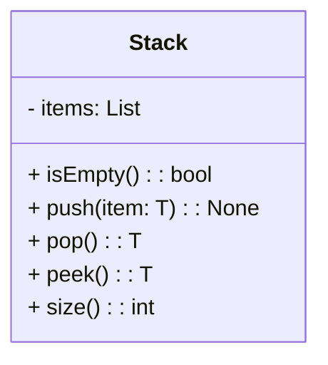
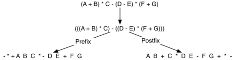
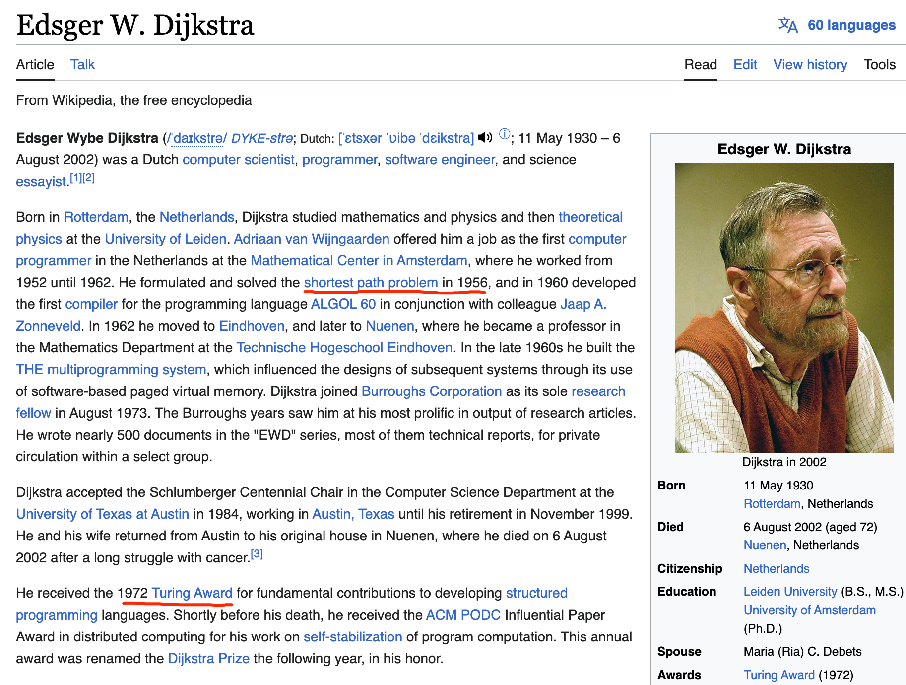

# 后入先出


## 0. The Stack Abstract Data Type

!!! note stack ADT

    栈抽象数据类型通过以下结构和操作来定义。如上所述，栈是一种有序的项集合，其中项被添加到被称为“顶端”的一端，也从这一端移除。栈是按照后进先出（LIFO）的顺序排列的。下面给出了栈的操作。

    > The stack abstract data type is defined by the following structure and operations. A stack is structured, as described above, as an ordered collection of items where items are added to and removed from the end called the “top.” Stacks are ordered LIFO. The stack operations are given below.

    - `Stack()` creates a new stack that is empty. It needs no parameters and returns an empty stack.
    - `push(item)` adds a new item to the top of the stack. It needs the item and returns nothing.
    - `pop()` removes the top item from the stack. It needs no parameters and returns the item. The stack is modified.
    - `peek()` returns the top item from the stack but does not remove it. It needs no parameters. The stack is not modified.
    - `isEmpty()` tests to see whether the stack is empty. It needs no parameters and returns a boolean value.
    - `size()` returns the number of items on the stack. It needs no parameters and returns an integer.

For example, if `s` is a stack that has been created and starts out empty, then Table 1 shows the results of a sequence of stack operations. Under stack contents, the top item is listed at the far right.


!!! note Table 1: Sample Stack Operations

    | **Stack Operation** | **Stack Contents**   | **Return Value** |
    | :------------------ | :------------------- | :--------------- |
    | `s.isEmpty()`       | `[]`                 | `True`           |
    | `s.push(4)`         | `[4]`                |                  |
    | `s.push('dog')`     | `[4,'dog']`          |                  |
    | `s.peek()`          | `[4,'dog']`          | `'dog'`          |
    | `s.push(True)`      | `[4,'dog',True]`     |                  |
    | `s.size()`          | `[4,'dog',True]`     | `3`              |
    | `s.isEmpty()`       | `[4,'dog',True]`     | `False`          |
    | `s.push(8.4)`       | `[4,'dog',True,8.4]` |                  |
    | `s.pop()`           | `[4,'dog',True]`     | `8.4`            |
    | `s.pop()`           | `[4,'dog']`          | `True`           |
    | `s.size()`          | `[4,'dog']`          | `2`              |


## 1. Implementing a Stack in Python

现在已经明确定义了栈作为一种抽象数据类型，接下来我们将注意力转向使用Python来实现栈。回想一下，当我们为抽象数据类型提供物理实现时，称这种实现为数据结构。

在Python中，就像在任何面向对象编程语言中一样，实现诸如栈这样的抽象数据类型的首选方法是创建一个新类。栈操作被实现为方法。此外，为了实现栈（它是一个元素的集合），利用Python提供的简单而强大的基本集合是很合理的。我们将使用列表来实现。

> Now that we have clearly defined the stack as an abstract data type we will turn our attention to using Python to implement the stack. Recall that when we give an abstract data type a physical implementation we refer to the implementation as a data structure.
>
> As we described in Chapter 1, in Python, as in any object-oriented programming language, the implementation of choice for an abstract data type such as a stack is the creation of a new class. The stack operations are implemented as methods. Further, to implement a stack, which is a collection of elements, it makes sense to utilize the power and simplicity of the primitive collections provided by Python. We will use a list.
>




```python
class Stack:
    def __init__(self):
        self.items = []
    
    def is_empty(self):
        return self.items == []
    
    def push(self, item):
        self.items.append(item)
    
    def pop(self):
        return self.items.pop()
    
    def peek(self):
        return self.items[len(self.items)-1]
    
    def size(self):
        return len(self.items)

s = Stack()

print(s.is_empty())
s.push(4)
s.push('dog')

print(s.peek())
s.push(True)
print(s.size())
print(s.is_empty())
s.push(8.4)
print(s.pop())
print(s.pop())
print(s.size())

"""
True
dog
3
False
8.4
True
2
"""
```


要求自己会用类实现Stack，但是实际编程时候，直接使用系统的list更好。

```python
#function rev_string(my_str) that uses a stack to reverse the characters in a string.
def rev_string(my_str):
    s = [] # Stack()
    rev = []
    for c in my_str:
        s.append(c) # push(c)

    #while not s.is_empty():
    while s:
        rev.append(s.pop())
    return "".join(rev)

test_string = "cutie"

print(rev_string(test_string))

# output: eituc
    
```


## 2. 匹配括号

我们现在将注意力转向使用栈来解决真正的计算机科学问题。毫无疑问，你已经写过诸如`(5+6)∗(7+8)/(4+3)`这样的算术表达式，其中使用了括号来安排操作的执行顺序。

括号必须以平衡的方式出现。**平衡的括号**意味着每个开符号都有一个对应的闭符号，并且括号对是正确嵌套的。考虑以下正确平衡的括号字符串：

> We now turn our attention to using stacks to solve real computer science problems. You have no doubt written arithmetic expressions such as
>
> `(5+6)∗(7+8)/(4+3)` where parentheses are used to order the performance of operations. 
>
> Parentheses must appear in a balanced fashion. **Balanced parentheses** means that each opening symbol has a corresponding closing symbol and the pairs of parentheses are properly nested. Consider the following correctly balanced strings of parentheses:
>

```
(()()()())

(((())))

(()((())()))
```

Compare those with the following, which are not balanced:

```
((((((())

()))

(()()(()
```

区分括号是否正确平衡是识别许多编程语言结构的重要部分。

!!! example
    
    接下来的挑战是编写一个算法，该算法能够从左到右读取一串括号，并判断这些符号是否平衡。
    
    为了解决这个问题，我们需要做一个重要的观察。当你从左到右处理符号时，最近的开括号必须与下一个闭括号匹配。同时，第一个被处理的开括号可能需要等到最后一个符号才能找到它的匹配项。<mark>闭括号与开括号的匹配顺序与其出现顺序相反</mark>，它们从内到外进行匹配。这一点提示我们可以使用栈来解决这个问题。

    > The ability to differentiate between parentheses that are correctly balanced and those that are unbalanced is an important part of recognizing many programming language structures.
    >
    > The challenge then is to write an algorithm that will read a string of parentheses from left to right and decide whether the symbols are balanced. To solve this problem we need to make an important observation. As you process symbols from left to right, the most recent opening parenthesis must match the next closing symbol (see Figure 4). Also, the first opening symbol processed may have to wait until the very last symbol for its match. Closing symbols match opening symbols in the reverse order of their appearance; they match from the inside out. This is a clue that stacks can be used to solve the problem.
    >

!!! note Matching Parentheses
    


```python
#returns a boolean result as to whether the string of parentheses is balanced
def par_checker(symbol_string):
    s = [] # Stack()
    balanced = True
    index = 0
    while index < len(symbol_string) and balanced:
        symbol = symbol_string[index]
        if symbol == "(":
            s.append(symbol) # push(symbol)
        else:
            #if s.is_empty():
            if not s:
                balanced = False
            else:
                s.pop()
        index = index + 1
    
    #if balanced and s.is_empty():
    if balanced and not s:
        return True
    else:
        return False

print(par_checker('((()))'))
print(par_checker('(()'))

# True
# False
```


### 示例E20.有效的括号

stack, https://leetcode.cn/problems/valid-parentheses/

给定一个只包括 `'('`，`')'`，`'{'`，`'}'`，`'['`，`']'` 的字符串 `s` ，判断字符串是否有效。

有效字符串需满足：

1. 左括号必须用相同类型的右括号闭合。
2. 左括号必须以正确的顺序闭合。
3. 每个右括号都有一个对应的相同类型的左括号。

 

**示例 1：**

**输入：**s = "()"

**输出：**true

**示例 2：**

**输入：**s = "()[]{}"

**输出：**true

**示例 3：**

**输入：**s = "(]"

**输出：**false

**示例 4：**

**输入：**s = "([])"

**输出：**true

 

**提示：**

- `1 <= s.length <= 10^4`
- `s` 仅由括号 `'()[]{}'` 组成


```python
from typing import List
class Solution:
    def isValid(self, s: str) -> bool:
        stack = []
        for c in s:
            if c == '(' or c == '[' or c == '{':
                stack.append(c)
            else:
                if not stack:
                    return False
                if c == ')' and stack[-1] != '(':
                    return False
                if c == ']' and stack[-1] != '[':
                    return False
                if c == '}' and stack[-1] != '{':
                    return False
                stack.pop()
        return not stack
```


### 1 Balanced Symbols (A General Case)

上述的平衡括号问题是出现在许多编程语言中的一种更普遍情况的具体案例。平衡和嵌套不同类型的开符号和闭符号的一般问题频繁出现。例如，在Python中，方括号`[`和`]`用于列表；花括号`{`和`}`用于字典；圆括号`(`和`)`用于元组和算术表达式。只要每种符号都保持自身的开和关关系，就可以混合使用这些符号。例如，如下所示的符号字符串：

> 看大括号 `{}` 内部是否有冒号 `:`。有冒号的是字典，没有冒号、只有逗号分隔的元素的是集合。而创建空集合时，必须使用 `set()` 函数。

> The balanced parentheses problem shown above is a specific case of a more general situation that arises in many programming languages. The general problem of balancing and nesting different kinds of opening and closing symbols occurs frequently. For example, in Python square brackets, `[` and `]`, are used for lists; curly braces, `{` and `}`, are used for dictionaries; and parentheses, `(` and `)`, are used for tuples and arithmetic expressions. It is possible to mix symbols as long as each maintains its own open and close relationship. Strings of symbols such as

```
{ { ( [ ] [ ] ) } ( ) }

[ [ { { ( ( ) ) } } ] ]

[ ] [ ] [ ] ( ) { }
```

are properly balanced in that not only does each opening symbol have a corresponding closing symbol, but the types of symbols match as well.

Compare those with the following strings that are not balanced:

```
( [ ) ]

( ( ( ) ] ) )

[ { ( ) ]
```

从前一节的简单括号检查器可以很容易地扩展来处理这些新的符号类型。回想一下，每个开符号只是简单地压入栈中，等待匹配的闭符号稍后在序列中出现。当一个闭符号确实出现时，唯一的区别是我们必须检查它是否正确匹配栈顶的开符号类型。如果这两个符号不匹配，那么字符串就不平衡。再次强调，如果整个字符串都被处理且栈中没有剩下任何未匹配的符号，那么该字符串就是正确平衡的。

> The simple parentheses checker from the previous section can easily be extended to handle these new types of symbols. Recall that each opening symbol is simply pushed on the stack to wait for the matching closing symbol to appear later in the sequence. When a closing symbol does appear, the only difference is that we must check to be sure that it correctly matches the type of the opening symbol on top of the stack. If the two symbols do not match, the string is not balanced. Once again, if the entire string is processed and nothing is left on the stack, the string is correctly balanced.


```python
def par_checker(symbol_string):
    s = [] # Stack()
    balanced = True
    index = 0 
    while index < len(symbol_string) and balanced:
        symbol = symbol_string[index] 
        if symbol in "([{":
            s.append(symbol) # push(symbol)
        else:
            top = s.pop()
            if not matches(top, symbol):
                balanced = False
        index += 1
        #if balanced and s.is_empty():
        if balanced and not s:
            return True 
        else:
            return False
        
def matches(open, close):
    opens = "([{"
    closes = ")]}"
    return opens.index(open) == closes.index(close)

print(par_checker('{{}}[]]'))

# output: False
```


#### 示例OJ03704: 括号匹配问题

stack, http://cs101.openjudge.cn/practice/03704

在某个字符串（长度不超过100）中有左括号、右括号和大小写字母；规定（与常见的算数式子一样）任何一个左括号都从内到外与在它右边且距离最近的右括号匹配。写一个程序，找到无法匹配的左括号和右括号，输出原来字符串，并在下一行标出不能匹配的括号。不能匹配的左括号用"$"标注，不能匹配的右括号用"?"标注.

**输入**

输入包括多组数据，每组数据一行，包含一个字符串，只包含左右括号和大小写字母，**字符串长度不超过100**
**注意：cin.getline(str,100)最多只能输入99个字符！**

**输出**

对每组输出数据，输出两行，第一行包含原始输入字符，第二行由"\$","?"和空格组成，"$"和"?"表示与之对应的左括号和右括号不能匹配。

样例输入

```
((ABCD(x)
)(rttyy())sss)(
```

样例输出

```
((ABCD(x)
$$
)(rttyy())sss)(
?            ?$
```


```python
# https://www.cnblogs.com/huashanqingzhu/p/6546598.html

lines = []
while True:
    try:
        lines.append(input())
    except EOFError:
        break
    
ans = []
for s in lines:
    stack = []
    Mark = []
    for i in range(len(s)):
        if s[i] == '(':
            stack.append(i)
            Mark += ' '
        elif s[i] == ')':
            if len(stack) == 0:
                Mark += '?'
            else:
                Mark += ' '
                stack.pop()
        else:
            Mark += ' '
    
    while(len(stack)):
        Mark[stack[-1]] = '$'
        stack.pop()
    
    print(s)
    print(''.join(map(str, Mark)))
```


#### 练习20140:今日化学论文

http://cs101.openjudge.cn/practice/20140/


## 3. 进制转换

### 将十进制数转换成二进制数

在你学习计算机科学的过程中，可能已经以这样或那样的方式接触到二进制数的概念。二进制表示在计算机科学中非常重要，因为计算机中存储的所有值都以一串二进制数字的形式存在，即由0和1组成的字符串。如果没有能力在常见表示法和二进制数之间来回转换，我们将需要以非常笨拙的方式与计算机进行交互。

整数值是常见的数据项，在计算机程序和计算中无时无刻不在使用。我们在数学课上学习它们，并且当然使用十进制数系统或基数为10的方式来表示它们。十进制数$233_{10}$及其对应的二进制等价形式$11101001_2$分别被解释为：

- 十进制数$233_{10}$意味着这是一个基于10的数值，计算方式为$2*10^2 + 3*10^1 + 3*10^0$。
- 二进制数$11101001_2$则是一个基于2的数值，计算方式为$1*2^7 + 1*2^6 + 1*2^5 + 0*2^4 + 1*2^3 + 0*2^2 + 0*2^1 + 1*2^0$。

这种转换对于理解计算机如何处理和存储数值数据至关重要。

> In your study of computer science, you have probably been exposed in one way or another to the idea of a binary number. Binary representation is important in computer science since all values stored within a computer exist as a string of binary digits, a string of 0s and 1s. Without the ability to convert back and forth between common representations and binary numbers, we would need to interact with computers in very awkward ways.
>
> Integer values are common data items. They are used in computer programs and computation all the time. We learn about them in math class and of course represent them using the decimal number system, or base 10. The decimal number $233_{10}$ and its corresponding binary equivalent $11101001_2$ are interpreted respectively as
>

$2×10^2+3×10^1+3×10^0$

and

$1×2^7+1×2^6+1×2^5+0×2^4+1×2^3+0×2^2+0×2^1+1×2^0$

但是，我们如何轻松地将整数值转换为二进制数呢？答案是一种称为“除以2”的算法，它使用栈来跟踪二进制结果的数字。

“除以2”算法假设我们从一个大于0的整数开始。然后通过一个简单的迭代过程不断将十进制数除以2并记录余数。第一次除以2可以告诉我们该值是奇数还是偶数。偶数值的余数为0，意味着在个位上将是数字0。奇数值的余数为1，在个位上将是数字1。我们可以认为构建二进制数是一个数字序列的过程；我们计算的<mark>第一个余数实际上会是这个序列中的最后一个数字</mark>。如图5所示，我们再次看到了这种<mark>反转特性</mark>，这表明栈可能是解决问题的合适数据结构。

> But how can we easily convert integer values into binary numbers? The answer is an algorithm called “Divide by 2” that uses a stack to keep track of the digits for the binary result.
>
> The Divide by 2 algorithm assumes that we start with an integer greater than 0. A simple iteration then continually divides the decimal number by 2 and keeps track of the remainder. The first division by 2 gives information as to whether the value is even or odd. An even value will have a remainder of 0. It will have the digit 0 in the ones place. An odd value will have a remainder of 1 and will have the digit 1 in the ones place. We think about building our binary number as a sequence of digits; the first remainder we compute will actually be the last digit in the sequence. As shown in Figure 5, we again see the reversal property that signals that a stack is likely to be the appropriate data structure for solving the problem.
>

!!! note Figure: Decimal-to-Binary Conversion

    


```python
def divide_by_2(dec_num):
    rem_stack = [] # Stack()
    
    while dec_num > 0:
        rem  = dec_num % 2
        rem_stack.append(rem) # push(rem)
        dec_num = dec_num // 2
    
    bin_string = ""
    #while not rem_stack.is_empty():
    while rem_stack:
        bin_string = bin_string + str(rem_stack.pop())
        
    return bin_string

print(divide_by_2(233))

# output: 11101001
```


```python
def base_converter(dec_num, base):
    digits = "0123456789ABCDEF"
    
    rem_stack = [] # Stack()
    
    while dec_num > 0:
        rem = dec_num % base
        #rem_stack.push(rem)
        rem_stack.append(rem)
        dec_num = dec_num // base
        
    new_string = ""
    #while not rem_stack.is_empty():
    while rem_stack:
        new_string = new_string + digits[rem_stack.pop()]
        
    return new_string

print(base_converter(25, 2))
print(base_converter(2555, 16))

# 11001
# 9FB
```


#### 练习OJ02734: 十进制到八进制

http://cs101.openjudge.cn/practice/02734/

把一个十进制正整数转化成八进制。

**输入**

一行，仅含一个十进制表示的整数a(0 < a < 65536)。

**输出**

一行，a的八进制表示。

样例输入

`9`

样例输出

`11`


使用栈来实现十进制到八进制的转换可以通过不断除以8并将余数压入栈中的方式来实现。然后，将栈中的元素依次出栈，构成八进制数的各个位。

```python
decimal = int(input())  # 读取十进制数

# 创建一个空栈
stack = []

# 特殊情况：如果输入的数为0，直接输出0
if decimal == 0:
    print(0)
else:
    # 不断除以8，并将余数压入栈中
    while decimal > 0:
        remainder = decimal % 8
        stack.append(remainder)
        decimal = decimal // 8

    # 依次出栈，构成八进制数的各个位
    octal = ""
    while stack:
        octal += str(stack.pop())

    print(octal)
```


## 4. 中序、前序和后序表达式

当你写一个算术表达式，如 B * C 时，表达式的形式为你提供了可以正确解释它的信息。在这种情况下，我们知道变量 B 正在乘以变量 C，因为乘法操作符 * 出现在它们之间的表达式中。这种类型的表示法被称为**中缀**表示法，因为操作符位于它所操作的两个操作数*之间*。

考虑另一个中缀的例子，A + B * C。操作符 + 和 * 仍然出现在操作数之间，但现在有一个问题：它们各自作用于哪些操作数？是 + 作用于 A 和 B，还是 * 作用于 B 和 C？这个表达式似乎有歧义。

实际上，你已经阅读和书写这类表达式很长时间了，并且它们并不会给你造成任何问题。原因是你了解关于操作符 + 和 * 的一些事情。每个操作符都有一个**优先级**级别。优先级较高的操作符先于优先级较低的操作符使用。唯一能改变该顺序的是括号的存在。对于算术操作符的优先级顺序将乘除放在加减之上。如果出现相同优先级的操作符，则按照从左到右的顺序或结合性来决定。

让我们使用操作符优先级来解释令人困惑的表达式 A + B * C。首先对 B 和 C 进行乘法运算，然后将 A 加到那个结果上。(A + B) * C 将强制先执行 A 和 B 的加法运算，然后再进行乘法运算。在表达式 A + B + C 中，根据优先级（通过结合性），最左边的 + 会首先被执行。

尽管这一切对你来说可能是显而易见的，请记住计算机需要确切知道要执行什么操作以及它们的顺序。一种确保不会因操作顺序引起混淆的方式是创建所谓的**完全括号化**表达式。这种类型的表达式为每个操作符使用一对括号。括号规定了操作的顺序；没有歧义。也不需要记忆任何优先级规则。

表达式 A + B * C + D 可以重写为 ((A + (B * C)) + D)，以显示首先进行乘法，随后是最左边的加法。A + B + C + D 可以写作 (((A + B) + C) + D)，因为加法操作从左向右结合。

还有两种其他非常重要的表达式格式，一开始可能并不明显。考虑中缀表达式 A + B。如果我们把操作符移到两个操作数之前会发生什么？生成的表达式将是 + A B。同样，我们可以把操作符移到最后。我们得到 A B +。这些看起来有点奇怪。

操作符相对于操作数位置的这些变化创造了两种新的表达式格式，**前缀**和**后缀**。<mark>前缀表达式要求所有操作符都在其工作的两个操作数之前</mark>。而后缀则要求其操作符在其对应的操作数之后。更多的例子应该有助于更清晰地理解这一点。

A + B * C 在前缀中会被写作 + A * B C。乘法操作符直接出现在操作数 B 和 C 之前，表示 * 的优先级高于 +。然后加法操作符出现在 A 和乘法的结果之前。

在后缀中，表达式会是 A B C * +。再次，操作顺序被保留，因为 * 紧接在 B 和 C 之后出现，表明 * 有更高的优先级，随后是 +。虽然操作符移动了，现在要么出现在各自操作数之前，要么出现在之后，但<mark>操作数之间的相对顺序保持不变</mark>。

> When you write an arithmetic expression such as B * C, the form of the expression provides you with information so that you can interpret it correctly. In this case we know that the variable B is being multiplied by the variable C since the multiplication operator * appears between them in the expression. This type of notation is referred to as **infix** since the operator is *in between* the two operands that it is working on.
>
> Consider another infix example, A + B * C. The operators + and * still appear between the operands, but there is a problem. Which operands do they work on? Does the + work on A and B or does the * take B and C? The expression seems ambiguous.
>
> In fact, you have been reading and writing these types of expressions for a long time and they do not cause you any problem. The reason for this is that you know something about the operators + and *. Each operator has a **precedence** level. Operators of higher precedence are used before operators of lower precedence. The only thing that can change that order is the presence of parentheses. The precedence order for arithmetic operators places multiplication and division above addition and subtraction. If two operators of equal precedence appear, then a left-to-right ordering or associativity is used.
>
> Let’s interpret the troublesome expression A + B * C using operator precedence. B and C are multiplied first, and A is then added to that result. (A + B) * C would force the addition of A and B to be done first before the multiplication. In expression A + B + C, by precedence (via associativity), the leftmost + would be done first.
>
> Although all this may be obvious to you, remember that computers need to know exactly what operators to perform and in what order. One way to write an expression that guarantees there will be no confusion with respect to the order of operations is to create what is called a **fully parenthesized** expression. This type of expression uses one pair of parentheses for each operator. The parentheses dictate the order of operations; there is no ambiguity. There is also no need to remember any precedence rules.
>
> The expression A + B * C + D can be rewritten as ((A + (B * C)) + D) to show that the multiplication happens first, followed by the leftmost addition. A + B + C + D can be written as (((A + B) + C) + D) since the addition operations associate from left to right.
>
> There are two other very important expression formats that may not seem obvious to you at first. Consider the infix expression A + B. What would happen if we moved the operator before the two operands? The resulting expression would be + A B. Likewise, we could move the operator to the end. We would get A B +. These look a bit strange.
>
> These changes to the position of the operator with respect to the operands create two new expression formats, **prefix** and **postfix**. Prefix expression notation requires that all operators precede the two operands that they work on. Postfix, on the other hand, requires that its operators come after the corresponding operands. A few more examples should help to make this a bit clearer (see Table 2).
>
> A + B * C would be written as + A * B C in prefix. The multiplication operator comes immediately before the operands B and C, denoting that * has precedence over +. The addition operator then appears before the A and the result of the multiplication.
>
> In postfix, the expression would be A B C * +. Again, the order of operations is preserved since the * appears immediately after the B and the C, denoting that * has precedence, with + coming after. Although the operators moved and now appear either before or after their respective operands, the order of the operands stayed exactly the same relative to one another.
>

Table 2: Exmples of Infix, Prefix, and Postfix

| **Infix Expression** | **Prefix Expression** | **Postfix Expression** |
| :------------------- | :-------------------- | :--------------------- |
| A + B                | + A B                 | A B +                  |
| A + B * C            | + A * B C             | A B C * +              |

现在考虑中缀表达式 (A + B) * C。回想一下，在这种情况下，<mark>中缀</mark>要求使用括号以强制在乘法之前执行加法运算。然而，当我们将 A + B 写成前缀时，只需将加法操作符移到操作数之前，即 + A B。此操作的结果成为乘法的第一个操作数。然后将乘法操作符移到整个表达式的前面，得到 * + A B C。同样，在后缀表达式中，A B + 强制先进行加法运算。然后可以将乘法应用于该结果和剩余的操作数 C。因此，正确的后缀表达式是 A B + C *。

再次考虑这三个表达式（见表3）。这里发生了一件非常重要的事情。括号去哪了？为什么我们在前缀和后缀中不需要它们？答案是，<mark>操作符相对于它们所操作的操作数不再有歧义</mark>。只有中缀表示法需要额外的符号。前缀和后缀表达式中的操作顺序完全由操作符的位置决定，而不受其他因素影响。在很多方面，这使得中缀成为最不理想的表示法。

> Now consider the infix expression (A + B) * C. Recall that in this case, infix requires the parentheses to force the performance of the addition before the multiplication. However, when A + B was written in prefix, the addition operator was simply moved before the operands, + A B. The result of this operation becomes the first operand for the multiplication. The multiplication operator is moved in front of the entire expression, giving us * + A B C. Likewise, in postfix A B + forces the addition to happen first. The multiplication can be done to that result and the remaining operand C. The proper postfix expression is then A B + C *.
>
> Consider these three expressions again (see Table 3). Something very important has happened. Where did the parentheses go? Why don’t we need them in prefix and postfix? The answer is that the operators are no longer ambiguous with respect to the operands that they work on. Only infix notation requires the additional symbols. The order of operations within prefix and postfix expressions is completely determined by the position of the operator and nothing else. In many ways, this makes infix the least desirable notation to use.
>


Table 3: An Expression with Parentheses

| **Infix Expression** | **Prefix Expression** | **Postfix Expression** |
| :------------------- | :-------------------- | :--------------------- |
| (A + B) * C          | * + A B C             | A B + C *              |

Table 4 shows some additional examples of infix expressions and the equivalent prefix and postfix expressions. Be sure that you understand how they are equivalent in terms of the order of the operations being performed.

Table 4: Additional Examples of Infix, Prefix and Postfix

| **Infix Expression** | **Prefix Expression** | **Postfix Expression** |
| :------------------- | :-------------------- | :--------------------- |
| A + B * C + D        | + + A * B C D         | A B C * + D +          |
| (A + B) * (C + D)    | * + A B + C D         | A B + C D + *          |
| A * B + C * D        | + * A B * C D         | A B * C D * +          |
| A + B + C + D        | + + + A B C D         | A B + C + D +          |


### 1 Conversion of Infix Expressions to Prefix and Postfix

到目前为止，我们使用了临时的方法在中缀表达式和等价的前缀及后缀表达式表示法之间进行转换。正如你可能预期的那样，存在算法方法可以执行这种转换，使得任何复杂度的表达式都能被正确地变换。

我们将首先考虑的技术使用了之前讨论过的完全括号化表达式的概念。回想一下，A + B * C 可以写成 (A + (B * C)) 来明确显示乘法优先于加法。然而，仔细观察后你可以看到，<mark>每对括号也标明了一个操作数对的开始和结束</mark>，其中间是相应的操作符。

看看上面子表达式 (B * C) 中的右括号。<mark>如果我们把乘法符号移到该位置并移除匹配的左括号</mark>，得到 B C *，实际上我们就将子表达式转换为了后缀表示法。如果也将加法操作符移动到其对应的右括号位置，并移除匹配的左括号，就会得到完整的后缀表达式（见图6）。 

通过这种方法，我们可以系统地将包含任意复杂度的中缀表达式转换为后缀形式，确保了转换过程的准确性和一致性，而无需依赖记忆操作符优先级规则。同样的原则也可应用于创建前缀表达式，只是操作符的位置相对于操作数有所不同。

> So far, we have used ad hoc methods to convert between infix expressions and the equivalent prefix and postfix expression notations. As you might expect, there are algorithmic ways to perform the conversion that allow any expression of any complexity to be correctly transformed.
>
> The first technique that we will consider uses the notion of a fully parenthesized expression that was discussed earlier. Recall that A + B * C can be written as (A + (B * C)) to show explicitly that the multiplication has precedence over the addition. On closer observation, however, you can see that each parenthesis pair also denotes the beginning and the end of an operand pair with the corresponding operator in the middle.
>
> Look at the right parenthesis in the subexpression (B * C) above. If we were to move the multiplication symbol to that position and remove the matching left parenthesis, giving us B C *, we would in effect have converted the subexpression to postfix notation. If the addition operator were also moved to its corresponding right parenthesis position and the matching left parenthesis were removed, the complete postfix expression would result (see Figure 6).
>

!!! note Figure: Moving Operators to the Right for Postfix Notation
    


If we do the same thing but instead of moving the symbol to the position of the right parenthesis, we move it to the left, we get prefix notation (see Figure 7). The position of the parenthesis pair is actually a clue to the final position of the enclosed operator.

!!! note Figure: Moving Operators to the Left for Prefix Notation
    


因此，为了将一个表达式（无论多么复杂）转换为前缀或后缀表示法，首先使用运算顺序完全加上括号。然后，<mark>根据你想要得到前缀还是后缀表示法，将括号内的操作符移动到左括号或右括号的位置</mark>。

> So in order to convert an expression, no matter how complex, to either prefix or postfix notation, fully parenthesize the expression using the order of operations. Then <mark>move the enclosed operator to the position of either the left or the right parenthesis depending on whether you want prefix or postfix notation</mark>.

Here is a more complex expression: (A + B) * C - (D - E) * (F + G). Figure 8 shows the conversion to postfix and prefix notations.


!!! note <mark>Figure 8: Converting a Complex Expression to Prefix and Postfix Notations</mark>
    


### 2 中缀转后缀算法Shunting Yard

我们需要开发一种算法，将任何中缀表达式转换为后缀表达式。为此，我们将更仔细地观察转换过程。

再次考虑表达式 A + B * C。如上所示，其对应的后缀表达式是 A B C * +。我们已经注意到操作数 A、B 和 C 保持它们的相对位置不变。<mark>只有操作符改变了位置</mark>。让我们再次查看中缀表达式中的操作符。从左到右首先出现的操作符是 +。然而，在后缀表达式中，由于下一个操作符 * 的优先级高于加法，+ 被放在了最后。原始表达式中的操作符顺序在得到的后缀表达式中被反转了。

当我们处理表达式时，由于相应的右操作数还未出现，操作符需要暂时存储在某处。此外，这些<mark>已保存的操作符的顺序可能需要根据它们的优先级进行反转</mark>。在这个例子中的加法和乘法就是这种情况。由于加法操作符出现在乘法操作符之前且优先级较低，它需要在乘法操作符之后出现。由于这种<mark>顺序的反转，使用栈来保存操作符</mark>直到需要它们为止是有意义的。

那么对于 (A + B) * C 怎么办呢？回想一下，其对应的后缀表达式是 A B + C *。同样，从左到右处理这个中缀表达式，我们首先看到的是 +。在这种情况下，当我们看到 * 时，由于括号的作用，+ 已经被放置在结果表达式中，因为它对 * 具有优先权。现在我们可以开始<mark>了解转换算法的工作原理</mark>了。当我们看到一个左括号时，我们会将其保存以指示即将出现一个高优先级的操作符。那个操作符需要等待直到出现相应的右括号来标明它的位置（回忆完全括号化的方法）。当右括号出现时，操作符可以从栈中弹出。

当我们从左到右扫描中缀表达式时，我们将使用一个栈来保存操作符。这提供了我们在第一个例子中提到的反转。栈顶总是最近保存的操作符。每当我们<mark>读取一个新的操作符时，我们需要考虑该操作符与已经在栈上的操作符（如果有的话）相比，其优先级如何</mark>。

假设中缀表达式是由空格分隔的标记字符串。操作符标记包括 *, /, + 和 -，以及左右括号 ( 和 )。操作数标记是单字符标识符 A, B, C 等等。遵循以下步骤可以产生按后缀顺序排列的标记字符串：

1. 创建一个名为 `opstack` 的空栈用于存放操作符，并创建一个空列表用于输出。
2. 使用字符串方法 `split` 将输入的中缀字符串转换成列表。
3. 从左到右扫描标记列表：
   - 如果标记是操作数，则将其附加到输出列表的末尾。
   - 如果标记是左括号，则将其压入 `opstack` 栈中。
   - 如果标记是右括号，则从 `opstack` 中弹出元素直到移除相应的左括号为止，并将每个操作符附加到输出列表的末尾。
   - 如果标记是操作符 *, /, + 或 -，则将其压入 `opstack` 栈中。但是，首先移除已在 `opstack` 上且具有更高或相同优先级的所有操作符，并将它们附加到输出列表的末尾。
4. 当输入表达式被完全处理后，检查 `opstack`。栈上任何剩余的操作符都可以被移除并附加到输出列表的末尾。

> We need to develop an algorithm to convert any infix expression to a postfix expression. To do this we will look closer at the conversion process.
>
> Consider once again the expression A + B * C. As shown above, A B C * + is the postfix equivalent. We have already noted that the operands A, B, and C stay in their relative positions. It is only the operators that change position. Let’s look again at the operators in the infix expression. The first operator that appears from left to right is +. However, in the postfix expression, + is at the end since the next operator, *, has precedence over addition. The order of the operators in the original expression is reversed in the resulting postfix expression.
>
> As we process the expression, the operators have to be saved somewhere since their corresponding right operands are not seen yet. Also, the order of these saved operators may need to be reversed due to their precedence. This is the case with the addition and the multiplication in this example. Since the addition operator comes before the multiplication operator and has lower precedence, it needs to appear after the multiplication operator is used. Because of this reversal of order, it makes sense to consider using a stack to keep the operators until they are needed.
>
> What about (A + B) * C? Recall that A B + C * is the postfix equivalent. Again, processing this infix expression from left to right, we see + first. In this case, when we see *, + has already been placed in the result expression because it has precedence over * by virtue of the parentheses. We can now start to see how the conversion algorithm will work. When we see a left parenthesis, we will save it to denote that another operator of high precedence will be coming. That operator will need to wait until the corresponding right parenthesis appears to denote its position (recall the fully parenthesized technique). When that right parenthesis does appear, the operator can be popped from the stack.
>
> As we scan the infix expression from left to right, we will use a stack to keep the operators. This will provide the reversal that we noted in the first example. The top of the stack will always be the most recently saved operator. Whenever we read a new operator, we will need to consider how that operator compares in precedence with the operators, if any, already on the stack.
>
> Assume the infix expression is a string of tokens delimited by spaces. The operator tokens are *, /, +, and -, along with the left and right parentheses, ( and ). The operand tokens are the single-character identifiers A, B, C, and so on. The following steps will produce a string of tokens in postfix order.
>
> 1. Create an empty stack called `opstack` for keeping operators. Create an empty list for output.
> 2. Convert the input infix string to a list by using the string method `split`.
> 3. Scan the token list from left to right.
>    - If the token is an operand, append it to the end of the output list.
>    - If the token is a left parenthesis, push it on the `opstack`.
>    - If the token is a right parenthesis, pop the `opstack` until the corresponding left parenthesis is removed. Append each operator to the end of the output list.
>    - If the token is an operator, *, /, +, or -, push it on the `opstack`. However, first remove any operators already on the `opstack` that have higher or equal precedence and append them to the output list.
> 4. When the input expression has been completely processed, check the `opstack`. Any operators still on the stack can be removed and appended to the end of the output list.
>


```python
def infixToPostfix(infixexpr):
    prec = {}
    prec["*"] = 3
    prec["/"] = 3
    prec["+"] = 2
    prec["-"] = 2
    prec["("] = 1
    opStack = [] # Stack()
    postfixList = []
    tokenList = infixexpr.split()

    for token in tokenList:
        if token in "ABCDEFGHIJKLMNOPQRSTUVWXYZ" or token in "0123456789":
            postfixList.append(token)
        elif token == '(':
            #opStack.push(token)
            opStack.append(token)
        elif token == ')':
            topToken = opStack.pop()
            while topToken != '(':
                postfixList.append(topToken)
                topToken = opStack.pop()
        else:
            #while (not opStack.is_empty()) and (prec[opStack.peek()] >= prec[token]):
            while opStack and (prec[opStack[-1]] >= prec[token]):
                postfixList.append(opStack.pop())
            #opStack.push(token)
            opStack.append(token)

    #while not opStack.is_empty():
    while opStack:
        postfixList.append(opStack.pop())
    return " ".join(postfixList)

print(infixToPostfix("A * B + C * D"))
print(infixToPostfix("( A + B ) * C - ( D - E ) * ( F + G )"))

print(infixToPostfix("( A + B ) * ( C + D )"))
print(infixToPostfix("( A + B ) * C"))
print(infixToPostfix("A + B * C"))

"""
A B * C D * +
A B + C * D E - F G + * -
A B + C D + *
A B + C *
A B C * +
"""
```

#### <mark>Shunting yard algorightm</mark>

Shunting yard algorightm（调度场算法）是一种用于将中缀表达式转换为后缀表达式的算法。它由荷兰计算机科学家 Edsger Dijkstra 在1960年代提出，用于解析和计算数学表达式。

!!! note Edsger W. Dijkstra
    

<mark>Shunting Yard 算法的主要思想是使用两个栈（运算符栈和输出栈）来处理表达式的符号</mark>。算法按照运算符的优先级和结合性，将符号逐个处理并放置到正确的位置。最终，输出栈中的元素就是转换后的后缀表达式。

以下是 Shunting Yard 算法的基本步骤：

1. 初始化运算符栈和输出栈为空。
2. 从左到右遍历中缀表达式的每个符号。
   - 如果是操作数（数字），则将其添加到输出栈。
   - 如果是左括号，则将其推入运算符栈。
   - 如果是运算符：
     - 如果运算符的优先级大于运算符栈顶的运算符，或者运算符栈顶是左括号，则将当前运算符推入运算符栈。
     - 否则，将运算符栈顶的运算符弹出并添加到输出栈中，直到满足上述条件（或者运算符栈为空）。
     - 将当前运算符推入运算符栈。
   - 如果是右括号，则将运算符栈顶的运算符弹出并添加到输出栈中，直到遇到左括号。将左括号弹出但不添加到输出栈中。
3. 如果还有剩余的运算符在运算符栈中，将它们依次弹出并添加到输出栈中。
4. 输出栈中的元素就是转换后的后缀表达式。


##### 练习OJ24591:中序表达式转后序表达式

http://cs101.openjudge.cn/practice/24591/

中序表达式是运算符放在两个数中间的表达式。乘、除运算优先级高于加减。可以用"()"来提升优先级 --- 就是小学生写的四则算术运算表达式。中序表达式可用如下方式递归定义：

1）一个数是一个中序表达式。该表达式的值就是数的值。

2) 若a是中序表达式，则"(a)"也是中序表达式(引号不算)，值为a的值。
3) 若a,b是中序表达式，c是运算符，则"acb"是中序表达式。"acb"的值是对a和b做c运算的结果，且a是左操作数，b是右操作数。

输入一个中序表达式，要求转换成一个后序表达式输出。

**输入**

第一行是整数n(n<100)。接下来n行，每行一个中序表达式，数和运算符之间没有空格，长度不超过700。

**输出**

对每个中序表达式，输出转成后序表达式后的结果。后序表达式的数之间、数和运算符之间用一个空格分开。

样例输入

```
3
7+8.3 
3+4.5*(7+2)
(3)*((3+4)*(2+3.5)/(4+5)) 
```

样例输出

```
7 8.3 +
3 4.5 7 2 + * +
3 3 4 + 2 3.5 + * 4 5 + / *
```

来源: Guo wei


<mark>接收浮点数，是number buffer技巧。</mark>

```python
def infix_to_postfix(expression):
    precedence = {'+':1, '-':1, '*':2, '/':2}
    stack = []
    postfix = []
    number = ''

    for char in expression:
        if char.isnumeric() or char == '.':
            number += char
        else:
            if number:
                num = float(number)
                postfix.append(int(num) if num.is_integer() else num)
                number = ''
            if char in '+-*/':
                while stack and stack[-1] in '+-*/' and precedence[char] <= precedence[stack[-1]]:
                    postfix.append(stack.pop())
                stack.append(char)
            elif char == '(':
                stack.append(char)
            elif char == ')':
                while stack and stack[-1] != '(':
                    postfix.append(stack.pop())
                stack.pop()

    if number:
        num = float(number)
        postfix.append(int(num) if num.is_integer() else num)

    while stack:
        postfix.append(stack.pop())

    return ' '.join(str(x) for x in postfix)

n = int(input())
for _ in range(n):
    expression = input()
    print(infix_to_postfix(expression))
```


接收数据，还可以用<mark>re处理</mark>。

```python
# 24591:中序表达式转后序表达式
# http://cs101.openjudge.cn/practice/24591/

def inp(s):
    #s=input().strip()
    import re
    s=re.split(r'([\(\)\+\-\*\/])',s)
    s=[item for item in s if item.strip()]
    return s

exp = "(3)*((3+4)*(2+3.5)/(4+5)) "
print(inp(exp))
```


### 3 Postfix Evaluation

作为栈的最后一个示例，我们将考虑已经处于后缀表示法中的表达式的求值。在这种情况下，栈再次成为首选的数据结构。然而，当你<mark>扫描后缀表达式时，需要等待的是操作数，而不是像在上述转换算法中那样等待操作符</mark>。另一种思考解决方案的方式是，<mark>每当在输入中看到一个操作符时，将会使用最近的两个操作数进行求值。</mark>

这意味着，在读取后缀表达式的过程中，每当你遇到一个操作数，就将其压入栈中。一旦遇到操作符，就从栈中弹出适当数量的操作数（对于二元操作符来说是两个），执行相应的计算，并将结果压回到栈中。这个过程会一直持续到表达式的末尾，最终栈顶元素就是整个表达式的计算结果。这种方法简洁而有效地解决了后缀表达式的求值问题，因为它充分利用了栈的后进先出特性来管理操作数和操作符的顺序。

> As a final stack example, we will consider the evaluation of an expression that is already in postfix notation. In this case, a stack is again the data structure of choice. However, as you scan the postfix expression, it is the operands that must wait, not the operators as in the conversion algorithm above. Another way to think about the solution is that whenever an operator is seen on the input, the two most recent operands will be used in the evaluation.

```python
def postfixEval(postfixExpr):
    operandStack = []
    tokenList = postfixExpr.split()

    for token in tokenList:
        if token in "0123456789":
            operandStack.append(int(token))
        else:
            operand2 = operandStack.pop()
            operand1 = operandStack.pop()
            result = doMath(token,operand1,operand2)
            operandStack.append(result)
    return operandStack.pop()

def doMath(op, op1, op2):
    if op == "*":
        return op1 * op2
    elif op == "/":
        return op1 / op2
    elif op == "+":
        return op1 + op2
    else:
        return op1 - op2

print(postfixEval('7 8 + 3 2 + /'))

# output: 3.0
```


#### 示例OJ24588: 后序表达式求值

http://cs101.openjudge.cn/practice/24588/

后序表达式由操作数和运算符构成。操作数是整数或小数，运算符有 + - * / 四种，其中 * / 优先级高于 + -。后序表达式可用如下方式递归定义：

1) 一个操作数是一个后序表达式。该表达式的值就是操作数的值。
2) 若a,b是后序表达式，c是运算符，则"a b c"是后序表达式。“a b c”的值是 (a) c (b),即对a和b做c运算，且a是第一个操作数，b是第二个操作数。下面是一些后序表达式及其值的例子(操作数、运算符之间用空格分隔)：

3.4       值为：3.4
5        值为：5
5 3.4 +     值为：5 + 3.4
5 3.4 + 6 /   值为：(5+3.4)/6
5 3.4 + 6 * 3 + 值为：(5+3.4)*6+3


**输入**

第一行是整数n(n<100)，接下来有n行，每行是一个后序表达式，长度不超过1000个字符

**输出**

对每个后序表达式，输出其值，保留小数点后面2位

样例输入

```
3
5 3.4 +
5 3.4 + 6 /
5 3.4 + 6 * 3 +
```

样例输出

```
8.40
1.40
53.40
```

来源: Guo wei


要解决这个问题，需要理解如何计算后序表达式。后序表达式的计算可以通过使用一个栈来完成，按照以下步骤：

1. 从左到右扫描后序表达式。
2. 遇到数字时，将其压入栈中。
3. 遇到运算符时，从栈中弹出两个数字，先弹出的是右操作数，后弹出的是左操作数。将这两个数字进行相应的运算，然后将结果压入栈中。
4. 当表达式扫描完毕时，栈顶的数字就是表达式的结果。

```python
def evaluate_postfix(expression):
    stack = []
    tokens = expression.split()
    
    for token in tokens:
        if token in '+-*/':
            # 弹出栈顶的两个元素
            right_operand = stack.pop()
            left_operand = stack.pop()
            # 执行运算
            if token == '+':
                stack.append(left_operand + right_operand)
            elif token == '-':
                stack.append(left_operand - right_operand)
            elif token == '*':
                stack.append(left_operand * right_operand)
            elif token == '/':
                stack.append(left_operand / right_operand)
        else:
            # 将操作数转换为浮点数后入栈
            stack.append(float(token))
    
    # 栈顶元素就是表达式的结果
    return stack[0]

# 读取输入行数
n = int(input())

# 对每个后序表达式求值
for _ in range(n):
    expression = input()
    result = evaluate_postfix(expression)
    # 输出结果，保留两位小数
    print(f"{result:.2f}")
```

这个程序将读取输入行数，然后对每行输入的后序表达式求值，并按要求保留两位小数输出结果。


## 5. 经典八皇后用回溯或者栈实现

### 示例OJ02754: 八皇后

dfs and similar, http://cs101.openjudge.cn/practice/02754

会下国际象棋的人都很清楚：皇后可以在横、竖、斜线上不限步数地吃掉其他棋子。如何将8个皇后放在棋盘上（有8 * 8个方格），使它们谁也不能被吃掉！这就是著名的八皇后问题。
对于某个满足要求的8皇后的摆放方法，定义一个皇后串a与之对应，即$a=b_1b_2...b_8~$,其中$b_i$为相应摆法中第i行皇后所处的列数。已经知道8皇后问题一共有92组解（即92个不同的皇后串）。
给出一个数b，要求输出第b个串。串的比较是这样的：皇后串x置于皇后串y之前，当且仅当将x视为整数时比y小。

​八皇后是一个古老的经典问题：**如何在一张国际象棋的棋盘上，摆放8个皇后，使其任意两个皇后互相不受攻击。**该问题由一位德国**国际象棋排局家** **Max Bezzel** 于 1848年提出。严格来说，那个年代，还没有“德国”这个国家，彼时称作“普鲁士”。1850年，**Franz Nauck** 给出了第一个解，并将其扩展成了“ **n皇后** ”问题，即**在一张 n** x **n 的棋盘上，如何摆放 n 个皇后，使其两两互不攻击**。历史上，八皇后问题曾惊动过“数学王子”高斯(Gauss)，而且正是 Franz Nauck 写信找高斯请教的。

**输入**

第1行是测试数据的组数n，后面跟着n行输入。每组测试数据占1行，包括一个正整数b(1 ≤  b ≤  92)

**输出**

输出有n行，每行输出对应一个输入。输出应是一个正整数，是对应于b的皇后串。

样例输入

```
2
1
92
```

样例输出

```
15863724
84136275
```


先给出两个dfs回溯实现的八皇后，接着给出两个stack迭代实现的八皇后。

八皇后思路：回溯算法通过尝试不同的选择，逐步构建解决方案，并在达到某个条件时进行回溯，以找到所有的解决方案。从第一行第一列开始放置皇后，然后在每一行的不同列都放置，如果与前面不冲突就继续，有冲突则回到上一行继续下一个可能性。

```python
def solve_n_queens(n):
    solutions = []  # 存储所有解决方案的列表
    queens = [-1] * n  # 存储每一行皇后所在的列数
    
    def backtrack(row):
        if row == n:  # 找到一个合法解决方案
            solutions.append(queens.copy())
        else:
            for col in range(n):
                if is_valid(row, col):  # 检查当前位置是否合法
                    queens[row] = col  # 在当前行放置皇后
                    backtrack(row + 1)  # 递归处理下一行
                    queens[row] = -1  # 回溯，撤销当前行的选择
    
    def is_valid(row, col):
        for r in range(row):
            if queens[r] == col or abs(row - r) == abs(col - queens[r]):
                return False
        return True
    
    backtrack(0)  # 从第一行开始回溯
    
    return solutions


# 获取第 b 个皇后串
def get_queen_string(b):
    solutions = solve_n_queens(8)
    if b > len(solutions):
        return None
    queen_string = ''.join(str(col + 1) for col in solutions[b - 1])
    return queen_string


test_cases = int(input())  # 输入的测试数据组数
for _ in range(test_cases):
    b = int(input())  # 输入的 b 值
    queen_string = get_queen_string(b)
    print(queen_string)
```


```python
def is_safe(board, row, col):
    # 检查当前位置是否安全
    # 检查同一列是否有皇后
    for i in range(row):
        if board[i] == col:
            return False
    # 检查左上方是否有皇后
    i = row - 1
    j = col - 1
    while i >= 0 and j >= 0:
        if board[i] == j:
            return False
        i -= 1
        j -= 1
    # 检查右上方是否有皇后
    i = row - 1
    j = col + 1
    while i >= 0 and j < 8:
        if board[i] == j:
            return False
        i -= 1
        j += 1
    return True

def queen_dfs(board, row):
    if row == 8:
        # 找到第b个解，将解存储到result列表中
        ans.append(''.join([str(x+1) for x in board]))
        return
    for col in range(8):
        if is_safe(board, row, col):
            # 当前位置安全，放置皇后
            board[row] = col
            # 继续递归放置下一行的皇后
            queen_dfs(board, row + 1)
            # 回溯，撤销当前位置的皇后
            board[row] = 0

ans = []
queen_dfs([None]*8, 0)
#print(ans)
for _ in range(int(input())):
    print(ans[int(input()) - 1])
```


如果要使用栈来实现八皇后问题，可以采用迭代的方式，模拟递归的过程。在每一步迭代中，使用栈来保存状态，并根据规则进行推进和回溯。

```python
def queen_stack(n):
    stack = []  # 用于保存状态的栈
    solutions = [] # 存储所有解决方案的列表

    stack.append((0, []))  # 初始状态为第一行，所有列都未放置皇后,栈中的元素是 (row, queens) 的元组

    while stack:
        row, cols = stack.pop() # 从栈中取出当前处理的行数和已放置的皇后位置
        if row == n:    # 找到一个合法解决方案
            solutions.append(cols)
        else:
            for col in range(n):
                if is_valid(row, col, cols): # 检查当前位置是否合法
                    stack.append((row + 1, cols + [col]))

    return solutions

def is_valid(row, col, queens):
    for r in range(row):
        if queens[r] == col or abs(row - r) == abs(col - queens[r]):
            return False
    return True


# 获取第 b 个皇后串
def get_queen_string(b):
    solutions = queen_stack(8)
    if b > len(solutions):
        return None
    b = len(solutions) + 1 - b

    queen_string = ''.join(str(col + 1) for col in solutions[b - 1])
    return queen_string

test_cases = int(input())  # 输入的测试数据组数
for _ in range(test_cases):
    b = int(input())  # 输入的 b 值
    queen_string = get_queen_string(b)
    print(queen_string)
```


```python
def solve_n_queens(n):
    stack = []  # 用于保存状态的栈
    solutions = []  # 存储所有解决方案的列表

    stack.append((0, [-1] * n))  # 初始状态为第一行，所有列都未放置皇后

    while stack:
        row, queens = stack.pop()

        if row == n:  # 找到一个合法解决方案
            solutions.append(queens.copy())
        else:
            for col in range(n):
                if is_valid(row, col, queens):  # 检查当前位置是否合法
                    new_queens = queens.copy()
                    new_queens[row] = col  # 在当前行放置皇后
                    stack.append((row + 1, new_queens))  # 推进到下一行

    return solutions


def is_valid(row, col, queens):
    for r in range(row):
        if queens[r] == col or abs(row - r) == abs(col - queens[r]):
            return False
    return True


# 获取第 b 个皇后串
def get_queen_string(b):
    solutions = solve_n_queens(8)
    if b > len(solutions):
        return None
    b = len(solutions) + 1 - b

    queen_string = ''.join(str(col + 1) for col in solutions[b - 1])
    return queen_string


test_cases = int(input())  # 输入的测试数据组数
for _ in range(test_cases):
    b = int(input())  # 输入的 b 值
    queen_string = get_queen_string(b)
    print(queen_string)

```
