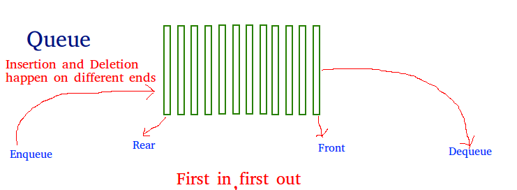
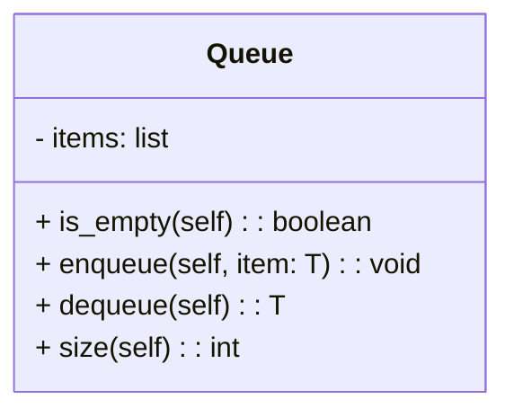
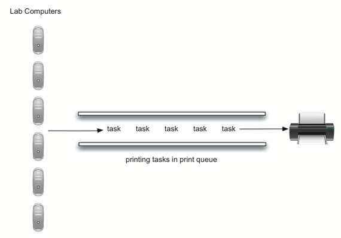
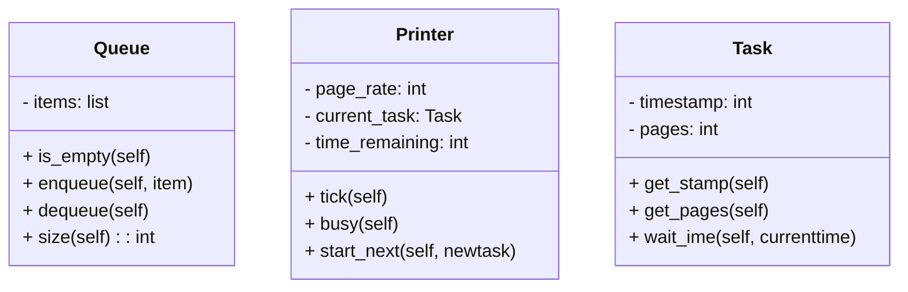

# 先入先出

## 0. The Queue Abstract Data Type

像栈一样，队列也是一种线性数据结构，它以先入先出（FIFO, First In First Out）的方式存储项目。在队列中，最早添加的项会最先被移除。队列的一个很好的<mark>例子是资源的消费者队列</mark>，其中最早来的消费者会被优先服务。这意味着，队列中的元素按照它们进入的顺序进行处理，确保了第一个进入队列的元素也是第一个从队列中出来的，体现了“先到先得”的原则。

> Like a stack, the queue is a linear data structure that stores items in a First In First Out (FIFO) manner. With a queue, the least recently added item is removed first. A good example of a queue is any queue of consumers for a resource where the consumer that came first is served first.





Operations associated with queue are: 

- Enqueue: Adds an item to the queue. If the queue is full, then it is said to be an Overflow condition – Time Complexity : O(1)
- Dequeue: Removes an item from the queue. <mark>The items are popped in the same order in which they are pushed</mark>. If the queue is empty, then it is said to be an Underflow condition – Time Complexity : O(1)
- Front: Get the front item from queue – Time Complexity : O(1)
- Rear: Get the last item from queue – Time Complexity : O(1)


The queue abstract data type is defined by the following structure and operations. A queue is structured, as described above, as <mark>an ordered collection of items which are added at one end, called the “rear,” and removed from the other end, called the “front.” </mark>mQueues maintain a FIFO ordering property. The queue operations are given below.

- `Queue()` creates a new queue that is empty. It needs no parameters and returns an empty queue.
- `enqueue(item)` adds a new item to the rear of the queue. It needs the item and returns nothing.
- `dequeue()` removes the front item from the queue. It needs no parameters and returns the item. The queue is modified.
- `isEmpty()` tests to see whether the queue is empty. It needs no parameters and returns a boolean value.
- `size()` returns the number of items in the queue. It needs no parameters and returns an integer.

As an example, if we assume that `q` is a queue that has been created and is currently empty, then [Table 1](https://runestone.academy/ns/books/published/pythonds/BasicDS/TheQueueAbstractDataType.html#tbl-queueoperations) shows the results of a sequence of queue operations. The queue contents are shown such that the front is on the right. 4 was the first item enqueued so it is the first item returned by dequeue.


| **Queue Operation** | **Queue Contents**   | **Return Value** |
| :------------------ | :------------------- | :--------------- |
| `q.isEmpty()`       | `[]`                 | `True`           |
| `q.enqueue(4)`      | `[4]`                |                  |
| `q.enqueue('dog')`  | `['dog',4]`          |                  |
| `q.enqueue(True)`   | `[True,'dog',4]`     |                  |
| `q.size()`          | `[True,'dog',4]`     | `3`              |
| `q.isEmpty()`       | `[True,'dog',4]`     | `False`          |
| `q.enqueue(8.4)`    | `[8.4,True,'dog',4]` |                  |
| `q.dequeue()`       | `[8.4,True,'dog']`   | `4`              |
| `q.dequeue()`       | `[8.4,True]`         | `'dog'`          |
| `q.size()`          | `[8.4,True]`         | `2`              |


## 1. Implementing a Queue in Python

再次创建一个新类来实现队列这种抽象数据类型是合适的。像之前一样，我们将利用列表集合的强大和简洁性来构建队列的内部表示。

我们需要决定使用列表的哪一端作为队列的尾部（rear），哪一端作为前端（front）。清单1中所示的实现<mark>假设列表的位置0处为队列的尾部</mark>。这允许我们对列表使用`insert`函数在队列尾部添加新元素。可以<mark>使用`pop`操作移除前端的元素（即列表的最后一个元素）</mark>。请记住，这也意味着入队（enqueue）操作的时间复杂度为O(n)，而出队（dequeue）操作的时间复杂度为O(1)。

这种方法下，虽然在队列的尾部添加元素需要移动其他元素以腾出空间，导致了较高的时间复杂度O(n)，但是从队列前端移除元素则非常高效，不需要额外的元素移动（时间复杂度为O(1)）。因此，选择列表的哪一端作为队列的前端或尾部取决于应用的具体需求以及对于入队和出队操作性能的不同考虑。然而，通常更常见的是将列表的末尾视为队列的尾部，这样可以优化入队操作的效率，尽管这与上述示例中的做法相反。

> It is again appropriate to create a new class for the implementation of the abstract data type queue. As before, we will use the power and simplicity of the list collection to build the internal representation of the queue.
>
> We need to decide which end of the list to use as the rear and which to use as the front. The implementation shown in Listing 1 assumes that the rear is at position 0 in the list. This allows us to use the `insert` function on lists to add new elements to the rear of the queue. The `pop` operation can be used to remove the front element (the last element of the list). Recall that this also means that enqueue will be O(n) and dequeue will be O(1).
>




Listing 1

```python
class Queue:
    def __init__(self):
        self.items = []

    def is_empty(self):
        return self.items == []

    def enqueue(self, item):
        self.items.insert(0, item)

    def dequeue(self):
        return self.items.pop()

    def size(self):
        return len(self.items)


q = Queue()

q.enqueue('hello')
q.enqueue('dog')
q.enqueue(3)
print(q.items)

q.dequeue()
print(q.items)
# output:
# [3, 'dog', 'hello']
# [3, 'dog']
```


**Q:** Suppose you have the following series of queue operations.

```
q = Queue()
q.enqueue('hello')
q.enqueue('dog')
q.enqueue(3)
q.dequeue()
```

What items are left on the queue? (B)

A. 'hello', 'dog'
**B. 'dog', 3**
C. 'hello', 3
D. 'hello', 'dog', 3


### 示例OJ02746: 约瑟夫问题

implementation, http://cs101.openjudge.cn/practice/02746

约瑟夫问题：有ｎ只猴子，按顺时针方向围成一圈选大王（编号从１到ｎ），从第１号开始报数，一直数到ｍ，数到ｍ的猴子退出圈外，剩下的猴子再接着从1开始报数。就这样，直到圈内只剩下一只猴子时，这个猴子就是猴王，编程求输入ｎ，ｍ后，输出最后猴王的编号。

**输入**

每行是用空格分开的两个整数，第一个是 n, 第二个是 m ( 0 < m,n <=300)。最后一行是：

0 0

**输出**

对于每行输入数据（最后一行除外)，输出数据也是一行，即最后猴王的编号

样例输入

```
6 2
12 4
8 3
0 0
```

样例输出

```
5
1
7
```


说明：使用 队列queue 这种数据结构会方便。它有三种实现方式，我们最常用的 list 就支持，说明，https://www.geeksforgeeks.org/queue-in-python/


用list实现队列，O(n)

```python
# 先使用pop从列表中取出，如果不符合要求再append回列表，相当于构成了一个圈
def hot_potato(name_list, num):
    queue = []
    for name in name_list:
        queue.append(name)

    while len(queue) > 1:
        for i in range(num):
            queue.append(queue.pop(0))	# O(N)
        queue.pop(0)										# O(N)
    return queue.pop(0)									# O(N)


while True:
    n, m = map(int, input().split())
    if {n,m} == {0}:
        break
    monkey = [i for i in range(1, n+1)]
    print(hot_potato(monkey, m-1))

```


用内置deque，O(1)

```python
from collections import deque

# 先使用pop从列表中取出，如果不符合要求再append回列表，相当于构成了一个圈
def hot_potato(name_list, num):
    queue = deque()
    for name in name_list:
        queue.append(name)

    while len(queue) > 1:
        for i in range(num):
            queue.append(queue.popleft()) # O(1)
        queue.popleft()
    return queue.popleft()


while True:
    n, m = map(int, input().split())
    if {n,m} == {0}:
        break
    monkey = [i for i in range(1, n+1)]
    print(hot_potato(monkey, m-1))
```


## 2. 模拟器打印机

一个更有趣的例子是模拟打印任务队列。学生向共享打印机发送打印请求，这些打印任务被存在一个队列中，并且按照先到先得的顺序执行。这样的设定可能导致很多问题。其中最重要的是，打印机能否处理一定量的工作。如果不能，学生可能会由于等待过长时间而错过
要上的课。

考虑计算机科学实验室里的这样一个场景：在任何给定的一小时内，实验室里都有约 10 个学生。他们在这一小时内最多打印 2 次，并且打印的页数从 1 到 20 不等。实验室的打印机比较老旧，每分钟只能以低质量打印 10 页。可以将打印质量调高，但是这样做会导致打印机每分钟只能打印 5 页。降低打印速度可能导致学生等待过长时间。那么，应该如何设置打印速度呢？

可以通过构建一个实验室模型来解决该问题。我们需要为学生、打印任务和打印机构建对象，如图所示。当学生提交打印任务时，将它们加入等待列表中，该列表是打印机上的<mark>打印任务队列</mark>。当打印机执行完一个任务后，它会检查该队列，看看其中是否还有需要处理的任务。我们感兴趣的是学生<mark>平均需要等待多久</mark>才能拿到打印好的文章。这个时间<mark>等于打印任务在队列中的平均等待时间</mark>。


!!! note Figure: Computer Science Laboratory Printing Queue
    


在模拟时，需要应用一些概率学知识。举例来说，学生打印的文章可能有 1~20 页。如果各页数出现的概率相等，那么打印任务的实际时长可以通过 1~20 的一个随机数来模拟。

如果实验室里有 10 个学生，并且在一小时内每个人都打印两次，那么每小时平均就有 20 个打印任务。在任意一秒，创建一个打印任务的概率是多少？回答这个问题需要考虑任务与时间的比值。每小时 20 个任务相当于每 180 秒 1 个任务。


$\frac {20\ tasks}{1\ hour} \times \frac {1\ hour}  {60\ minutes} \times \frac {1\ minute} {60\ seconds}=\frac {1\ task} {180\ seconds}$


**1.主要模拟步骤**
下面是主要的模拟步骤。
(1) 创建一个打印任务队列。每一个任务到来时都会有一个时间戳。一开始，队列是空的。

(2) 针对每一秒（current_second），执行以下操作。
❏ 是否有新创建的打印任务？如果是，以current_second作为其时间戳并将该任务加入到队列中。
❏ 如果打印机空闲，并且有正在等待执行的任务，执行以下操作：
■ 从队列中取出第一个任务并提交给打印机；
■ 用current_second减去该任务的时间戳，以此计算其等待时间；
■ 将该任务的等待时间存入一个列表，以备后用；
■ 根据该任务的页数，计算执行时间。
❏ 打印机进行一秒的打印，同时从该任务的执行时间中减去一秒。
❏ 如果打印任务执行完毕，或者说任务需要的时间减为0，则说明打印机回到空闲状态。

(3) 当模拟完成之后，根据等待时间列表中的值计算平均等待时间。

**2.Python实现**
我们创建3个类：Printer、Task和PrintQueue。它们分别模拟打印机、打印任务和队列。

Printer类需要检查当前是否有待完成的任务。如果有，那么打印机就处于工作状态（busy方法），并且其工作所需的时间可以通过要打印的页数来计算。其构造方法会初始化打印速度，即每分钟打印多少页。tick方法会减量计时，并且在执行完任务之后将打印机设置成空闲状态None。

Task类代表单个打印任务。当任务被创建时，随机数生成器会随机提供页数，取值范围是1～20。我们使用random模块中的randrange函数来生成随机数。





代码清单3-11 Printer类

```python
import random

class Queue:
    def __init__(self):
        self.items = []

    def is_empty(self):
        return self.items == []

    def enqueue(self, item):
        self.items.insert(0, item)

    def dequeue(self):
        return self.items.pop()

    def size(self):
        return len(self.items)


class Printer:
    def __init__(self, ppm):
        self.page_rate = ppm
        self.current_task = None
        self.time_remaining = 0

    def tick(self):
        if self.current_task != None:
            self.time_remaining = self.time_remaining - 1
            if self.time_remaining <= 0:
                self.current_task = None

    def busy(self):
        if self.current_task != None:
            return True
        else:
            return False

    def start_next(self, new_task):
        self.current_task = new_task
        self.time_remaining = new_task.get_pages() * 60 / self.page_rate


class Task:
    def __init__(self, time):
        self.timestamp = time
        self.pages = random.randrange(1, 21)

    def get_stamp(self):
        return self.timestamp

    def get_pages(self):
        return self.pages

    def wait_time(self, current_time):
        return current_time - self.timestamp


def simulation(num_seconds, pages_per_minute):
    lab_printer = Printer(pages_per_minute)
    print_queue = Queue()
    waiting_times = []

    for current_second in range(num_seconds):

        if new_print_task():
            task = Task(current_second)
            print_queue.enqueue(task)

        if (not lab_printer.busy()) and (not print_queue.is_empty()):
            nexttask = print_queue.dequeue()
            waiting_times.append(nexttask.wait_time(current_second))
            lab_printer.start_next(nexttask)

        lab_printer.tick()

    average_wait = sum(waiting_times) / len(waiting_times)
    print(f"Average Wait {average_wait:6.2f} secs {print_queue.size():3d} tasks remaining.")


def new_print_task():
    num = random.randrange(1, 181)
    if num == 180:
        return True
    else:
        return False


for i in range(10):
    simulation(3600, 10) # 设置总时间和打印机每分钟打印多少页

"""
Average Wait  20.05 secs   0 tasks remaining.
Average Wait  20.12 secs   0 tasks remaining.
Average Wait  28.32 secs   0 tasks remaining.
Average Wait   7.65 secs   0 tasks remaining.
Average Wait  13.17 secs   1 tasks remaining.
Average Wait  45.97 secs   0 tasks remaining.
Average Wait  14.94 secs   0 tasks remaining.
Average Wait   1.81 secs   0 tasks remaining.
Average Wait   0.00 secs   0 tasks remaining.
Average Wait   6.71 secs   0 tasks remaining.
"""
```


每一个任务都需要保存一个时间戳，用于计算等待时间。这个时间戳代表任务被创建并放入打印任务队列的时间。 wait_time 方法可以获得任务在队列中等待的时间。

主模拟程序simulation实现了之前描述的算法。 print_queue 对象是队列抽象数据类型的实例。布尔辅助函数new_print_task判断是否有新创建的打印任务。我们再一次使用random模块中的 randrange 函数来生成随机数，不过这一次的取值范围是 1~180。平均每 180 秒有一个打印任务。通过从随机数中选取 180，可以模拟这个随机事件。

每次模拟的结果不一定相同。对此，我们不需要在意。这是由于随机数的本质导致的。我们感兴趣的是当参数改变时结果出现的趋势。

首先，模拟 60 分钟（ 3600 秒）内打印速度为每分钟 5 页。并且，我们进行 10 次这样的模拟。由于模拟中使用了随机数，因此每次返回的结果都不同。
在模拟 10 次之后，可以看到平均等待时间是 122.092 秒，并且等待时间的差异较大，从最短的 17.27 秒到最长的 376.05 秒。此外，只有 2 次在给定时间内完成了所有任务。
现在把打印速度改成每分钟 10 页，然后再模拟 10 次。由于加快了打印速度，因此我们希望一小时内能完成更多打印任务。


**3.讨论**
在之前的内容中，我们试图解答这样一个问题：如果提高打印质量并降低打印速度，打印机能否及时完成所有任务？我们编写了一个程序来模拟随机提交的打印任务，待打印的页数也是随机的。

上面的输出结果显示，按每分钟5页的打印速度，任务的等待时间在31.50秒和292.40秒之间，相差约6分钟。提高打印速度之后，等待时间在1.29秒和28.96秒之间。此外，在每分钟5页的速度下，10次模拟中有2次没有按时完成所有任务。

```
Average Wait  45.88 secs   0 tasks remaining.
Average Wait  94.42 secs   0 tasks remaining.
Average Wait 292.40 secs   2 tasks remaining.
Average Wait  49.39 secs   0 tasks remaining.
Average Wait 148.27 secs   0 tasks remaining.
Average Wait 162.19 secs   0 tasks remaining.
Average Wait  71.00 secs   1 tasks remaining.
Average Wait  31.50 secs   0 tasks remaining.
Average Wait 116.74 secs   0 tasks remaining.
Average Wait  90.63 secs   0 tasks remaining.
```

可见，降低打印速度以提高打印质量，并不是明智的做法。学生不能等待太长时间，当他们要赶去上课时尤其如此。6分钟的等待时间实在是太长了。

这种模拟分析能帮助我们回答很多“如果”问题。只需改变参数，就可以模拟感兴趣的任意行为。以下是几个例子。
  ❏ 如果实验室里的学生增加到20个，会怎么样？
  ❏ 如果是周六，学生不需要上课，他们是否愿意等待？
  ❏ 如果每个任务的页数变少了，会怎么样？

这些问题都能通过修改本例中的模拟程序来解答。但是，模拟的准确度取决于它所基于的假设和参数。真实的打印任务数量和学生数目是准确构建模拟程序必不可缺的数据。


# 双端队列

与栈和队列不同的是，双端队列的限制很少。双端队列是与队列类似的有序集合。它有一前、一后两端，元素在其中保持自己的位置。与队列不同的是，双端队列对在哪一端添加和移除元素没有任何限制。新元素既可以被添加到前端，也可以被添加到后端。同理，已有的元素也能从任意一端移除。

The deque abstract data type is defined by the following structure and operations. A deque is structured, as described above, as an ordered collection of items where items are added and removed from either end, either front or rear. The deque operations are given below.

- `Deque()` creates a new deque that is empty. It needs no parameters and returns an empty deque.
- `addFront(item)` adds a new item to the front of the deque. It needs the item and returns nothing.
- `addRear(item)` adds a new item to the rear of the deque. It needs the item and returns nothing.
- `removeFront()` removes the front item from the deque. It needs no parameters and returns the item. The deque is modified.
- `removeRear()` removes the rear item from the deque. It needs no parameters and returns the item. The deque is modified.
- `isEmpty()` tests to see whether the deque is empty. It needs no parameters and returns a boolean value.
- `size()` returns the number of items in the deque. It needs no parameters and returns an integer.

As an example, if we assume that `d` is a deque that has been created and is currently empty, then Table {dequeoperations} shows the results of a sequence of deque operations. Note that the contents in front are listed on the right. It is very important to keep track of the front and the rear as you move items in and out of the collection as things can get a bit confusing.


| **Deque Operation** | **Deque Contents**         | **Return Value** |
| :------------------ | :------------------------- | :--------------- |
| `d.isEmpty()`       | `[]`                       | `True`           |
| `d.addRear(4)`      | `[4]`                      |                  |
| `d.addRear('dog')`  | `['dog',4,]`               |                  |
| `d.addFront('cat')` | `['dog',4,'cat']`          |                  |
| `d.addFront(True)`  | `['dog',4,'cat',True]`     |                  |
| `d.size()`          | `['dog',4,'cat',True]`     | `4`              |
| `d.isEmpty()`       | `['dog',4,'cat',True]`     | `False`          |
| `d.addRear(8.4)`    | `[8.4,'dog',4,'cat',True]` |                  |
| `d.removeRear()`    | `['dog',4,'cat',True]`     | `8.4`            |
| `d.removeFront()`   | `['dog',4,'cat']`          | `True`           |


## **双端队列实现**

```python
class Deque:
    def __init__(self):
        self.items = []

    def is_empty(self):
        return self.items == []

    def add_front(self, item):
        self.items.append(item)

    def add_rear(self, item):
        self.items.insert(0, item)

    def remove_front(self):
        return self.items.pop()

    def remove_rear(self):
        return self.items.pop(0)

    def size(self):
        return len(self.items)


d = Deque()
print(d.is_empty())
d.add_rear(4)
d.add_rear('dog')
d.add_front('cat')
d.add_front(True)
print(d.size())
print(d.is_empty())
d.add_rear(8.4)
print(d.remove_rear())
print(d.remove_front())
"""
True
4
False
8.4
True
"""
```

在双端队列的Python实现中，在前端进行的添加操作和移除操作的时间复杂度是O(1)，在后端的则是O( )n。


## 示例05902: 双端队列

http://cs101.openjudge.cn/practice/05902/

定义一个双端队列，进队操作与普通队列一样，从队尾进入。出队操作既可以从队头，也可以从队尾。编程实现这个数据结构。

**输入**
第一行输入一个整数t，代表测试数据的组数。
每组数据的第一行输入一个整数n，表示操作的次数。
接着输入n行，每行对应一个操作，首先输入一个整数type。
当type=1，进队操作，接着输入一个整数x，表示进入队列的元素。
当type=2，出队操作，接着输入一个整数c，c=0代表从队头出队，c=1代表从队尾出队。
n <= 1000

**输出**
对于每组测试数据，输出执行完所有的操作后队列中剩余的元素,元素之间用空格隔开，按队头到队尾的顺序输出，占一行。如果队列中已经没有任何的元素，输出NULL。

样例输入

```
2
5
1 2
1 3
1 4
2 0
2 1
6
1 1
1 2
1 3
2 0
2 1
2 0
```

样例输出

```
3
NULL
```


```python
from collections import deque

for _ in range(int(input())):
    n=int(input())
    q=deque([])
    for i in range(n):
        a,b=map(int,input().split())
        if a==1:
            q.append(b)
        else:
            if b==0:
                q.popleft()
            else:
                q.pop()
    if q:
        print(*q)
    else:
        print('NULL')
```


## 示例04067: 回文数字（Palindrome Number）

http://cs101.openjudge.cn/practice/04067/

给出一系列非负整数，判断是否是一个回文数。回文数指的是正着写和倒着写相等的数。

**输入**

若干行，每行是一个非负整数（不超过99999999）

**输出**

对每行输入，如果其是一个回文数，输出YES。否则输出NO。

样例输入

```
11
123
0
14277241
67945497
```

样例输出

```
YES
NO
YES
YES
NO
```


Use the deque from the collections module. The is_palindrome function checks if a number is a palindrome by converting it to a string, storing it in a deque, and then comparing the first and last elements until the deque is empty or only contains one element.

```python
from collections import deque

def is_palindrome(num):
    num_str = str(num)
    num_deque = deque(num_str)
    while len(num_deque) > 1:
        if num_deque.popleft() != num_deque.pop():
            return "NO"
    return "YES"

while True:
    try:
        num = int(input())
        print(is_palindrome(num))
    except EOFError:
        break
```


## 示例04099: 队列和栈

http://cs101.openjudge.cn/practice/04099/

队列和栈是两种重要的数据结构，它们具有push k和pop操作。push k是将数字k加入到队列或栈中，pop则是从队列和栈取一个数出来。队列和栈的区别在于取数的位置是不同的。

队列是先进先出的：把队列看成横向的一个通道，则push k是将k放到队列的最右边，而pop则是从队列的最左边取出一个数。

栈是后进先出的：把栈也看成横向的一个通道，则push k是将k放到栈的最右边，而pop也是从栈的最右边取出一个数。

假设队列和栈当前从左至右都含有1和2两个数，则执行push 5和pop操作示例图如下：

​     push 5     pop

队列 1 2 -------> 1 2 5 ------> 2 5

​     push 5     pop

栈  1 2 -------> 1 2 5 ------> 1 2

现在，假设队列和栈都是空的。给定一系列push k和pop操作之后，输出队列和栈中存的数字。若队列或栈已经空了，仍然接收到pop操作，则输出error。


**输入**

第一行为m，表示有m组测试输入，m<100。
每组第一行为n，表示下列有n行push k或pop操作。（n<150）
接下来n行，每行是push k或者pop，其中k是一个整数。
（输入保证同时在队列或栈中的数不会超过100个）

**输出**

对每组测试数据输出两行，正常情况下，第一行是队列中从左到右存的数字，第二行是栈中从左到右存的数字。若操作过程中队列或栈已空仍然收到pop，则输出error。输出应该共2*m行。

样例输入

```
2
4
push 1
push 3
pop
push 5
1
pop
```

样例输出

```
3 5
1 5
error
error
```


```python
from collections import deque
for _ in range(int(input())):
    queue = deque()
    stack = deque()
    stop = False
    for _ in range(int(input())):
        s = input()
        if s=='pop':
            try:
                queue.popleft()
                stack.pop()
            except IndexError:
                stop = True
        else:
            a = int(s.split()[1])
            queue.append(a)
            stack.append(a)
    if not stop:
        print(' '.join(list(map(str,queue))))
        print(' '.join(list(map(str,stack))))
    elif stop:
        print('error')
        print('error')
```
