# 贪心策略

贪心算法是用来解决一类最优化问题，并希望由局部最优策略来推得全局最优结果。贪心法适用的问题一定满足最优子结构性质，即一个问题的最优解可以通过其子问题的最优解来构建。

严谨使用贪心法来求解最优问题需要对采取的策略进行证明。证明往往比贪心本身更难，因此一般来说，如果想到某个似乎可行的策略，并且自己无法举出反例，那么就编码实现尝试。

> https://oi-wiki.org/basic/greedy/
>
> 贪心算法有两种证明方法：反证法和归纳法。一般情况下，一道题只会用到其中的一种方法来证明。
>
> 1. 反证法：如果交换方案中任意两个元素/相邻的两个元素后，答案不会变得更好，那么可以推定目前的解已经是最优解了。
> 2. 归纳法：先算得出边界情况（例如 `n=1`）的最优解 $F_1$)，然后再证明：对于每个 n，$F_{n+1}$ 都可以 由 $F_{n}$ 推导出结果。
>
> **常见题型**
>
> 在提高组难度以下的题目中，最常见的贪心有两种。
>
> - 「我们将 XXX 按照某某顺序排序，然后按某种顺序（例如从小到大）选择。」。
> - 「我们每次都取 XXX 中最大/小的东西，并更新 XXX。」（有时「XXX 中最大/小的东西」可以优化，比如用优先队列维护）
>
> 二者的区别在于一种是离线的，先处理后选择；一种是在线的，边处理边选择。
>
> **排序解法**
>
> 用排序法常见的情况是输入一个包含几个（一般一到两个）权值的数组，通过排序然后遍历模拟计算的方法求出最优值。
>
> **后悔解法**
>
> 思路是无论当前的选项是否最优都接受，然后进行比较，如果选择之后不是最优了，则反悔，舍弃掉这个选项；否则，正式接受。如此往复。
>
> 1526C1. Potions (Easy Version)
>
> greedy, dp, data structures, brute force, *1500, https://codeforces.com/problemset/problem/1526/C1
>
> 
>
> **与动态规划的区别**
>
> 贪心算法与动态规划的不同在于它对每个子问题的解决方案都做出选择，不能回退。动态规划则会保存以前的运算结果，并根据以前的结果对当前进行选择，有回退功能。


> 优化问题的算法通常会经历一系列步骤，每一步都有若干选择。对于许多优化问题，使用动态规划来确定最佳选择是过度的；更简单、更高效的贪心算法就足够了。贪心算法在每一步总是做出当前看起来最优的选择。也就是说，它**做出局部最优选择，希望这种选择最终能导致全局最优解**。本章探讨那些贪心算法能够提供最优解的优化问题。在阅读本章之前，你应该先阅读第15章关于动态规划的内容，特别是**第15.3节**。
>
> **贪心算法并不总能得到最优解，但对于许多问题，它们确实可以得到最优解**。我们将在第16.1节首先考察一个简单但非平凡的问题——活动选择问题，该问题可以通过贪心算法高效地计算出最优解。我们将通过首先考虑动态规划方法，然后证明我们总是可以做出贪心选择以达到最优解，从而得出贪心算法。第16.2节回顾贪心方法的基本要素，并给出一种直接证明贪心算法正确性的方法。第16.3节介绍贪心技术的一个重要应用：设计数据压缩（哈夫曼）编码。在第16.4节中，我们将研究一些称为“拟阵”（matroids）的组合结构背后的理论，这些结构**对于贪心算法总是能产生最优解**。最后，第16.5节将拟阵应用于解决带截止时间和惩罚的单位时间任务调度问题。


## 1.1 Sortings

排序可以按照greedy来理解，因为都有不同的优化策略。

Pyton十大排序算法源码，https://github.com/GMyhf/2024spring-cs201/blob/main/code/ten_sort_algorithms.md


> Prim算法和Kruskal算法主要用于解决无向图中的最小生成树（Minimum Spanning Tree, MST）问题。最小生成树是指在一个加权无向图中找到一棵包含所有顶点的树，且这棵树的所有边的权重之和最小。
>
> - **Prim算法**：从任意一个顶点开始构建最小生成树，逐步将距离当前树最近的一个顶点加入到树中，直到所有顶点都被包含进来。该算法适用于边数较多的稠密图。
>
> - **Kruskal算法**：首先将所有的边按照权重从小到大排序，然后依次选取权重最小的边，只要这条边不会与已选择的边构成回路，就将其加入到最小生成树中，直到选择了n-1条边（n为顶点数）。此算法对稀疏图较为适用。
>
> 这两种算法都能有效地找出无向图的最小生成树，但在处理有向图时则需要转换成其他形式的问题或者使用不同的算法来求解。


https://stackoverflow.com/questions/47238823/why-selection-sort-is-not-greedy


## 1.2 双指针和二分查找

双指针和二分查找是贪心算法中常用的技巧。常规贪心题目，例如：

### 1.2.1 two pointers

参考《算法笔记.胡凡》4.6

two pointers 是算法编程中一种非常重要的思想，但是很少会有教材单独拿出来讲，其中一个原因是它更倾向于是一种编程技巧，而长得不太像是一个“算法”的模样。two pointers的思想十分简洁，但却提供了非常高的算法效率。

以一个例子引入：给定一个递增的正整数序列和一个正整数 M，求序列中的两个不同位置的数a和 b，使得它们的和恰好为 M，输出所有满足条件的方案。例如给定序列{1,2,3,4,5.6}和正整数M=8，就存在2+6=8与3+5=8成立。
本题的一个最直观的想法是，使用二重循环枚举序列中的整数a和 b，判断它们的和是否为 M，如果是，输出方案；如果不是，则继续枚举。代码如下:

```python
n = int(input())
a = list(map(int, input().split()))
M = int(input())

for i in range(n):
    for j in range(i + 1, n):
        if a[i] + a[j] == M:
            print(a[i],a[j])
"""
5
1 2 3 4 5
7

2 5
3 4
"""
```

显然，这种做法的时间复杂度为 O(n^2)，对n在 10^5的规模时是不可承受的。

two pointers 将利用有序序列的枚举特性来有效降低复杂度。它针对本题的算法过程是：令下标i的初值为 0，下标j的初值为n-1，即令i、j分别指向序列的第一个元素和最后一个元素，接下来根据 a[i] + a[j]与M 的大小来进行下面三种选择，使i不断向右移动、使j不断向左移动，直到i>j成立。

① 如果满足 a[i] + a[] ==M，说明找到了其中一组方案。由于序列递增，不等式 a[i+1]+a[j]>M 与 a[i] + a[j-1]<M均成立，但是 a[i+1]+a[j-1]与M 的大小未知，因此剩余的方案只可能在[i+1,j-1]区间内产生，令i=i+1、j=j-1（即令i向右移动，j 向左移动）。

② 如果满足 a[i] + a[j]>M,由于序列递增，不等式 a[i+1]+ a[j]>M 成立，但是 a[i]+ a[j-1]与M 的大小未知，因此剩余的方案只可能在[i,j-1]区间内产生，令j=j-1（即令j向左移动）。
③ 如果满足 a[i]+a[j]<M，由于序列递增，不等式 a[i]+ a[j-1]<M 成立，但是 a[i+1]+a[j]与M 的大小未知，因此剩余的方案只可能在[i+1,j]区间内产生，令i=i+1（即令i向右移动）。
反复执行上面三个判断，直到i>i成立。代码如下：

```python
n = int(input())
a = list(map(int, input().split()))
M = int(input())

i = 0
j = n - 1

while i < j:
    if a[i] + a[j] == M:
        print(a[i], a[j])
        i += 1
        j -= 1
    elif a[i] + a[j] < M:
        i += 1
    else:
        j -= 1

"""
5
1 2 3 4 5
7

2 5
3 4
"""
```

分析算法的复杂度，由于i的初值为 0，j的初值为 n-1，而程序中变量i只有递增操作、变量j只有递减操作，且循环当i>i时停止，因此i和i的操作次数最多为n次，时间复杂度为 O(n)。可以发现，two pointers 的思想充分利用了序列递增的性质，以很浅显的思想降低了复杂度。


再来看序列合并问题。假设有两个递增序列A 与B，要求将它们合并为一个递增序列C。同样的，可以设置两个下标i和j，初值均为 0，表示分别指向序列 A 的第一个元素和序列B的第一个元素，然后根据 A[i]与 B[i]的大小来决定哪一个放入序列 C。

① 若 A[i] < B[ì]，说明 A[i]是当前序列 A 与序列 B 的剩余元素中最小的那个，因此把A[i]加入序列 C 中，并让i加1（即让i右移一位）。

② 若 A[ì] > B[j]，说明 B[i]是当前序列 A 与序列B 的剩余元素中最小的那个，因此把B[i]加入序列C 中，并让j加1（即让j右移一位）。

③ 若 Aí] == B[j]，则任意选一个加入到序列 C 中，并让对应的下标加 1。上面的分支操作直到i、j中的一个到达序列末端为止，然后将另一个序列的所有元素依次加入序列C 中，代码如下:

```python
def merge(A, B):
    i, j = 0, 0
    c = []

    # 合并两个有序数组
    while i < len(A) and j < len(B):
        if A[i] <= B[j]:
            c.append(A[i])
            i += 1
        else:
            c.append(B[j])
            j += 1

    # 将 A 的剩余元素加入 c
    c.extend(A[i:])

    # 将 B 的剩余元素加入 c
    c.extend(B[j:])

    return len(c), c

# 示例
A = [1, 3, 5, 7]
B = [2, 4, 6, 8]

length, c = merge(A, B)
print(c)
```

two pointers 到底是怎样的一种思想？事实上，two pointers 最原始的含义就是针对本节第一个问题而言的，而广义上的 two pointers 则是利用问题本身与序列的特性，使用两个下标i、j对序列进行扫描（可以同向扫描，也可以反向扫描），以较低的复杂度（一般是 O(n)的复杂度）解决问题。在实际编程时要能够有使用这种思想的意识。

### 1.2.2 Binary Search

查找操作是编程中的基本技能，根据数据集的大小和结构选择合适的查找方法可以显著提高效率。线性查找适用于较小或无序的数据集，而二分查找适用于较大的有序数据集。

我发现二分查找容易理解，但是细节部分不容易写对（while的条件是<=，还是<；折半后是mid+1，mid-1，还是mid）。

> **常见的查找方法**
>
> 1. 线性查找（Linear Search）：
>    - 适用范围：适用于较小的数据集或无序的数据集。
>    - 原理：逐个检查数据集中的每个元素，直到找到满足条件的元素或遍历完所有元素。
>    - 时间复杂度：O(n)，其中 n 是数据集的大小。
>
> 2. 二分查找（Binary Search）：
>    - 适用范围：适用于有序的数据集。
>    - 原理：通过将数据集分成两半，逐步缩小查找范围，直到找到满足条件的元素或确定不存在。
>    - 时间复杂度：O(log n)，其中 n 是数据集的大小。
>
> **示例代码**
>
> 线性查找
>
> ```python
> def linear_search(arr, target):
>     for i, element in enumerate(arr):
>         if element == target:
>             return i  # 返回目标元素的索引
>     return -1  # 如果未找到目标元素，返回 -1
> 
> # 示例
> arr = [3, 5, 2, 8, 1, 9, 4]
> target = 8
> result = linear_search(arr, target)
> print(f"Target {target} found at index {result}")
> # Target 8 found at index 3
> ```
>
> 二分查找
>
> ```python
> def binary_search(arr, target):
>     left, right = 0, len(arr) - 1
> 
>     while left <= right:
>         mid = (left + right) // 2
>         if arr[mid] == target:
>             return mid  # 返回目标元素的索引
>         elif arr[mid] < target:
>             left = mid + 1
>         else:
>             right = mid - 1
> 
>     return -1  # 如果未找到目标元素，返回 -1
> 
> # 示例
> arr = [1, 2, 3, 4, 5, 6, 7, 8, 9]
> target = 8
> result = binary_search(arr, target)
> print(f"Target {target} found at index {result}")
> # Target 8 found at index 7
> ```
>
> **详细步骤**
>
> **线性查找**
>
> 1. 初始化：
>    - 遍历数据集中的每个元素。
> 2. 查找过程：
>    - 逐个检查每个元素是否等于目标元素。
>    - 如果找到目标元素，返回其索引。
>    - 如果遍历完所有元素仍未找到目标元素，返回 -1。
>
> **二分查找**
>
> 1. 初始化：
>    - 设置左边界 `left` 为 0，右边界 `right` 为数据集的最后一个索引。
> 2. 查找过程：
>    - 计算中间位置 `mid`。
>    - 如果中间位置的元素等于目标元素，返回其索引。
>    - 如果中间位置的元素小于目标元素，调整左边界 `left` 为 `mid + 1`。
>    - 如果中间位置的元素大于目标元素，调整右边界 `right` 为 `mid - 1`。
>    - 重复上述步骤，直到找到目标元素或左边界超过右边界。
> 3. 未找到目标元素：
>    - 如果左边界超过右边界，返回 -1。
>
> 


参考 bisect 源码的二分查找写法，

https://github.com/python/cpython/blob/main/Lib/bisect.py

> 当然可以！下面是一个基于 `bisect_left` 函数的实现，并提供一个详细的二分查找样例。
>
> **二分查找实现**
>
> ```python
> def bisect_left(a, x, lo=0, hi=None, *, key=None):
>  """Return the index where to insert item x in list a, assuming a is sorted.
> 
>  The return value i is such that all e in a[:i] have e < x, and all e in
>  a[i:] have e >= x.  So if x already appears in the list, a.insert(i, x) will
>  insert just before the leftmost x already there.
> 
>  Optional args lo (default 0) and hi (default len(a)) bound the
>  slice of a to be searched.
> 
>  A custom key function can be supplied to customize the sort order.
>  """
> 
>  if lo < 0:
>      raise ValueError('lo must be non-negative')
>  if hi is None:
>      hi = len(a)
>  # Note, the comparison uses "<" to match the
>  # __lt__() logic in list.sort() and in heapq.
>  if key is None:
>      while lo < hi:
>          mid = (lo + hi) // 2
>          if a[mid] < x:
>              lo = mid + 1
>          else:
>              hi = mid
>  else:
>      while lo < hi:
>          mid = (lo + hi) // 2
>          if key(a[mid]) < x:
>              lo = mid + 1
>          else:
>              hi = mid
>  return lo
> 
> # 二分查找函数
> def binary_search(arr, target):
>  index = bisect_left(arr, target)
>  if index != len(arr) and arr[index] == target:
>      return index  # 返回目标值的索引
>  else:
>      return -1  # 如果未找到目标值，返回 -1
> 
> # 示例
> arr = [1, 2, 3, 4, 5, 6, 7, 8, 9]
> target = 8
> result = binary_search(arr, target)
> print(f"Target {target} found at index {result}")
> ```
>
> **详细步骤**
>
> 1. **定义 `bisect_left` 函数**：
>    - **参数**：
>      - `a`：已排序的列表。
>      - `x`：要查找的目标值。
>      - `lo`：搜索范围的起始索引，默认为 0。
>      - `hi`：搜索范围的结束索引，默认为 `len(a)`。
>      - `key`：可选的键函数，用于自定义排序顺序。
>    - **逻辑**：
>      - 检查 `lo` 是否非负。
>      - 如果 `hi` 为 `None`，则设置 `hi` 为 `len(a)`。
>      - 使用二分查找算法找到目标值 `x` 应该插入的位置。
>      - 如果 `key` 为 `None`，直接比较 `a[mid]` 和 `x`。
>      - 如果 `key` 不为 `None`，比较 `key(a[mid])` 和 `x`。
>
> 2. **定义 `binary_search` 函数**：
>    - 使用 `bisect_left` 找到目标值在已排序列表中第一次出现的位置。
>    - 检查目标值是否存在于列表中：
>      - 如果 `index` 不等于列表的长度且 `arr[index]` 等于目标值，返回 `index`。
>      - 否则，返回 -1。
>
> 
>
> **自定义键函数示例**
>
> 假设你有一个包含元组的列表，并且你希望根据元组的第二个元素进行二分查找：
>
> ```python
> def binary_search_with_key(arr, target, key):
>     index = bisect_left(arr, target, key=key)
>     if index != len(arr) and key(arr[index]) == target:
>         return index  # 返回目标值的索引
>     else:
>         return -1  # 如果未找到目标值，返回 -1
> 
> # 示例
> arr = [(1, 'a'), (2, 'b'), (3, 'c'), (4, 'd'), (5, 'e')]
> target = 'c'
> result = binary_search_with_key(arr, target, key=lambda x: x[1])
> print(f"Target {target} found at index {result}")
> ```
>
> - **输入**：
>
>   ```python
>   arr = [(1, 'a'), (2, 'b'), (3, 'c'), (4, 'd'), (5, 'e')]
>   target = 'c'
>   ```
>
> - **输出**：
>
>   ```python
>   Target c found at index 2
>   ```
>
> **总结**
>
> 二分查找是一种高效的查找算法，适用于已排序的数据集。你可以使用 `bisect` 模块中的 `bisect_left` 函数来快速实现二分查找，也可以手动实现以学习算法的细节。


> **进一步优化**
>
> 如果你的 `key` 函数比较复杂，可以考虑使用 `functools.cmp_to_key` 来定义一个比较函数。这样可以更灵活地处理复杂的比较逻辑。
>
> **使用 `functools.cmp_to_key` 的示例**
>
> <mark>Python 的 `bisect.bisect_left` 函数**从 Python 3.10 版本开始**才支持 `key` 参数。</mark>
>
> ```python
> from bisect import bisect_left
> from functools import cmp_to_key
> 
> def compare_items(x, y):
>  return (x[1] > y[1]) - (x[1] < y[1])
> 
> def binary_search_with_key(arr, target, key):
>  # 找到目标值应该插入的位置
>  index = bisect_left(arr, target, key=cmp_to_key(key))
> 
>  # 检查是否找到了目标值
>  if index < len(arr) and key(arr[index], (0, target)) == 0:
>      return index  # 返回目标值的索引
>  else:
>      return -1  # 如果未找到目标值，返回 -1
> 
> # 示例
> arr = [(1, 'a'), (2, 'b'), (3, 'c'), (4, 'd'), (5, 'e')]
> target = 'c'
> result = binary_search_with_key(arr, target, key=compare_items)
> print(f"Target {target} found at index {result}")
> ```
>
> **详细解释**
>
> 1. **`compare_items` 函数**：
>    - 定义一个比较函数 `compare_items`，用于比较两个元组的第二个元素。
>
> 2. **`cmp_to_key` 函数**：
>    - 将 `compare_items` 转换为 `key` 函数，传递给 `bisect_left`。
>
> 3. **`if index < len(arr) and key(arr[index], (0, target)) == 0`**：
>    - 使用 `key` 函数比较 `arr[index]` 和 `(0, target)`，确保它们的第二个元素相等。
>


## 1.3 编程题目

在问题求解时，总是做出在当前看来是最好的选择，不从整体最优上考虑。贪心算法没有固定的算法框架，关键是贪心策略的选择，贪心策略使用的前提是局部最优能导致全局最优。


### 练习CF1221A. 2048 Game

brute force/greedy/math, 1000, http://codeforces.com/problemset/problem/1221/A

You are playing a variation of game 2048. Initially you have a multiset s of n integers. Every integer in this multiset is a power of two.

You may perform any number (possibly, zero) operations with this multiset.

During each operation you choose two **equal** integers from s, remove them from s and insert the number equal to their sum into s.

For example, if *s*={1,2,1,1,4,2,2}and you choose integers 2 and 2, then the multiset becomes {1,1,1,4,4,2}.

You win if the number 2048 belongs to your multiset. For example, if s={1024,512,512,4}you can win as follows: choose 512 and 512, your multiset turns into {1024,1024,4}. Then choose 1024 and 1024, your multiset turns into {2048,4} and you win.

You have to determine if you can win this game.

You have to answer *q* independent queries.

### 练习01017: 装箱问题

greedy, http://cs101.openjudge.cn/practice/01017

一个工厂制造的产品形状都是长方体，它们的高度都是h，长和宽都相等，一共有六个型号，他们的长宽分别为1\*1, 2\*2, 3\*3, 4\*4, 5\*5, 6\*6。这些产品通常使用一个 6\*6*h 的长方体包裹包装然后邮寄给客户。因为邮费很贵，所以工厂要想方设法的减小每个订单运送时的包裹数量。他们很需要有一个好的程序帮他们解决这个问题从而节省费用。现在这个程序由你来设计。

**输入**：输入文件包括几行，每一行代表一个订单。每个订单里的一行包括六个整数，中间用空格隔开，分别为1*1至6*6这六种产品的数量。输入文件将以6个0组成的一行结尾。

**输出**：除了输入的最后一行6个0以外，输入文件里每一行对应着输出文件的一行，每一行输出一个整数代表对应的订单所需的最小包裹数。

解题思路：4\*4, 5\*5, 6\*6这三种的处理方式较简单，就是每一个箱子至多只能有其中1个，根据他们的数量添加箱子，再用2\*2和1\*1填补。1\*1, 2\*2, 3\*3这些就需要额外分情况讨论，若有剩余的3\*3,每4个3\*3可以填满一个箱子，剩下的3\*3用2\*2和1\*1填补装箱。剩余的2\*2，每9个可以填满一个箱子，剩下的与1\*1一起装箱。最后每36个1\*1可以填满一个箱子，剩下的为一箱子。

样例输入

```
0 0 4 0 0 1 
7 5 1 0 0 0 
0 0 0 0 0 0 
```

样例输出

```
2 
1 
```

来源：Central Europe 1996


直接用总数把bcdef占的位置都减掉就可以了，思路就清晰起来了。**运用列表，避免多个 if else。

```python
import math
rest = [0,5,3,1]

while True:
    a,b,c,d,e,f = map(int,input().split())
    if a + b + c + d + e + f == 0:
        break
    boxes = d + e + f           #装4*4, 5*5, 6*6
    boxes += math.ceil(c/4)     #填3*3
    spaceforb = 5*d + rest[c%4] #能和4*4 3*3 一起放的2*2
    if b > spaceforb:
    	boxes += math.ceil((b - spaceforb)/9)
    spacefora = boxes*36 - (36*f + 25*e + 16*d + 9*c + 4*b)     #和其他箱子一起的填的1*1
    
    if a > spacefora:
        boxes += math.ceil((a - spacefora)/36)
    print(boxes)
```


### 练习12559: 最大最小整数 v0.3

greedy, strings, sortings, math http://cs101.openjudge.cn/practice/12559

假设有n个正整数，将它们连成一片，将会组成一个新的大整数。现需要求出，能组成的最大最小整数。

比如，有4个正整数，23，9，182，79，连成的最大整数是97923182，最小的整数是18223799。

**输入**

第一行包含一个整数n，1<=n<=1000。
第二行包含n个正整数，相邻正整数间以空格隔开。

**输出**

输出为一行，为这n个正整数能组成的最大的多位整数和最小的多位整数，中间用空格隔开。

样例输入

```
Sample1 in:
4
23 9 182 79

Sample1 out:
97923182 18223799
```

样例输出

```
Sample2 in:
2
11 113

Sample2 out:
11311 11113
```

提示

位数不同但前几位相同的时候。例如： 898 8987，大整数是898+8987，而不是8987+898。

来源：cs10116 final exam


思路：先拼接出最小值：即字典序最小；要保证每一个小的字符串，左移到合适位置，需要两两比较（刚好是冒泡排序）。这个题目是个不容易的，字符串处理题目。

求minimum时，对相邻两strA[k]与A[k+1]，比较A[k]+A[k+1]与A[k+1]+A[k]的大小，若A[k+1]+A[k]大，颠倒A[k]与A[k+1]；最多交换len(A)-1次。求maximum时，颠倒求minimum时的有序序列即可。使用冒泡排序，循环(n-1)次。

把这些数当成字符串处理，然后采用类似冒泡排序的做法排出大小。


```python
# O(n^2)
n = int(input())
nums = input().split()
for i in range(n - 1):
    for j in range(i+1, n):
        #print(i,j)
        if nums[i] + nums[j] < nums[j] + nums[i]:
            nums[i], nums[j] = nums[j], nums[i]

ans = "".join(nums)
nums.reverse()
print(ans + " " + "".join(nums))
```


2020fall-cs101，黄旭

思路：这道题的关键应该是找到排序的方式，前一个数和后一个数比较，如果位数不足，就要重新从第一位开始比，所以说我就先取这个数列的最大位数，然后把每个数都扩充到相同位数进行比较，就可以了。

```python
# 虽然能AC，但实际上不对。两倍长度是正确的。
from math import ceil
input()
lt = input().split()

max_len = len(max(lt, key = lambda x:len(x)))
lt.sort(key = lambda x: tuple([int(i) for i in x]) * ceil(max_len/len(x)))
lt1 = lt[::-1]
print(''.join(lt1),''.join(lt))
```


```python
# 两倍长度是正确的。O(nlogn)
from math import ceil
input()
lt = input().split()

max_len = len(max(lt, key = lambda x:len(x)))
lt.sort(key = lambda x: x * ceil(2*max_len/len(x)))
lt1 = lt[::-1]
print(''.join(lt1),''.join(lt))
```


### 练习19948: 因材施教

greedy, http://cs101.openjudge.cn/practice/19948

有一所魔法高校招入一批学生，为了贯彻因材施教的理念，学校打算根据他们的魔法等级进行分班教育。在确定班级数目的情况下，班级内学生的差异要尽可能的小，也就是各个班级内学生的魔法等级要尽可能的接近。
例如：现在有(n = 7)位学生，他们的魔法等级分别为(r = [2, 7, 9, 9, 16, 28, 45])，我们要将他们分配到(m = 3)个班级，如果按照([2, 7], [9, 9], [16, 28, 45])的方式分班，则他们的总体差异为(d = (7 - 2) + (9 - 9) + (45 - 16) = 34)。


### 练习1000B. Light It Up

greedy, 1500, https://codeforces.com/problemset/problem/1000/B

Recently, you bought a brand new smart lamp with programming features. At first, you set up a schedule to the lamp. Every day it will turn power on at moment 0 and turn power off at moment M. Moreover, the lamp allows you to set a program of switching its state (states are "lights on" and "lights off"). Unfortunately, some program is already installed into the lamp.

The lamp allows only *good* programs. Good program can be represented as a non-empty array a, where 0<a~1~<a~2~<⋯<a~|a|~<M. All a~i~ must be integers. Of course, preinstalled program is a good program.

The lamp follows program a in next manner: at moment 0 turns power and light on. Then at moment a~i~ the lamp flips its state to opposite (if it was lit, it turns off, and vice versa). The state of the lamp flips instantly: for example, if you turn the light off at moment 1 and then do nothing, the total time when the lamp is lit will be 1. Finally, at moment M the lamp is turning its power off regardless of its state.

Since you are not among those people who read instructions, and you don't understand the language it's written in, you realize (after some testing) the only possible way to alter the preinstalled program. You can **insert at most one** element into the program a, so it still should be a *good* program after alteration. Insertion can be done between any pair of consecutive elements of a, or even at the beginning or at the end of a.

Find such a way to alter the program that the total time when the lamp is lit is maximum possible. Maybe you should leave program untouched. If the lamp is lit from x till moment y, then its lit for y−x units of time. Segments of time when the lamp is lit are summed up.


### 练习18211: 军备竞赛

greedy/two pointers, http://cs101.openjudge.cn/practice/18211

鸣人是木叶村的村长，最近在跟敌国进行军备竞赛，他手边有N份武器设计图，每张设计图有制作成本（大于等于零）且最多使用一次，可以选择花钱制作或是以同样的价钱卖给敌国，同时任意时刻敌国的武器不能比我国更多，鸣人的目标是在不负债的前提下武器种类比敌国越多越好。

**输入**

第一行为起始整数经费p,并且0≤p。且要求任何时刻p不能小于0.
第二行为n个整数，以空格分隔，并且0≤每个整数。代表每张设计图的制作成本，同时也是卖价，最多用一次(无法又制作又卖).

**输出**

一个整数，代表武器种类最多比敌国多多少.


### 练习CF1364A. XXXXX

brute force/data structures/number theory/two pointers, 1200, https://codeforces.com/problemset/problem/1364/A

Ehab loves number theory, but for some reason he hates the number 𝑥. Given an array 𝑎, find the length of its longest subarray such that the sum of its elements **isn't** divisible by 𝑥, or determine that such subarray doesn't exist.

An array 𝑎 is a subarray of an array 𝑏 if 𝑎 can be obtained from 𝑏 by deletion of several (possibly, zero or all) elements from the beginning and several (possibly, zero or all) elements from the end.

**Input**

The first line contains an integer 𝑡 (1≤𝑡≤5) — the number of test cases you need to solve. The description of the test cases follows.

The first line of each test case contains 2 integers 𝑛 and 𝑥 (1≤𝑛≤10^5^, 1≤𝑥≤10^4^) — the number of elements in the array 𝑎 and the number that Ehab hates.

The second line contains 𝑛 space-separated integers $𝑎_1, 𝑎_2, ……, 𝑎_𝑛 (0≤𝑎_𝑖≤10^4)$ — the elements of the array 𝑎.

**Output**

For each testcase, print the length of the longest subarray whose sum isn't divisible by 𝑥. If there's no such subarray, print −1.

Example

input

```
3
3 3
1 2 3
3 4
1 2 3
2 2
0 6
```

output

```
2
3
-1
```

Note

In the first test case, the subarray \[2,3\] has sum of elements 5, which isn't divisible by 3.

In the second test case, the sum of elements of the whole array is 6, which isn't divisible by 4.

In the third test case, all subarrays have an even sum, so the answer is −1.


```python
# 查达闻
def r(i):return int(i)%b
for z in range(int(input())):
  a,b=map(int,input().split());a=list(map(r,input().split()))
  if sum(a)%b:print(len(a))
  else:
    n=1
    for i in range(len(a)):
    	if a[i]or a[~i]:print(len(a)-i-1);n=0;break
    if n:print(-1)
```


```python
def prefix_sum(nums):
    prefix = []
    total = 0
    for num in nums:
        total += num
        prefix.append(total)
    return prefix
 
def suffix_sum(nums):
    suffix = []
    total = 0
    # 首先将列表反转
    reversed_nums = nums[::-1]
    for num in reversed_nums:
        total += num
        suffix.append(total)
    # 将结果反转回来
    suffix.reverse()
    return suffix
 
 
t = int(input())
for _ in range(t):
    N, x = map(int, input().split())
    a = [int(i) for i in input().split()]
    aprefix_sum = prefix_sum(a)
    asuffix_sum = suffix_sum(a)
 
    left = 0
    right = N - 1
    if right == 0:
        if a[0] % x !=0:
            print(1)
        else:
            print(-1)
        continue
 
    leftmax = 0
    rightmax = 0
    while left != right:
        total = asuffix_sum[left]
        if total % x != 0:
            leftmax = right - left + 1
            break
        else:
            left += 1
 
    left = 0
    right = N - 1
    while left != right:
        total = aprefix_sum[right]
        if total % x != 0:
            rightmax = right - left + 1
            break
        else:
            right -= 1
    
    if leftmax == 0 and rightmax == 0:
        print(-1)
    else:
        print(max(leftmax, rightmax))
```


# 贪心算法（HA）

<u>贪心算法（greedy algorithm）</u>是一种常见的解决优化问题的算法，其基本思想是在问题的每个决策阶段，都选择当前看起来最优的选择，即贪心地做出局部最优的决策，以期获得全局最优解。贪心算法简洁且高效，在许多实际问题中有着广泛的应用。

贪心算法和动态规划都常用于解决优化问题。它们之间存在一些相似之处，比如都依赖最优子结构性质，但工作原理不同。

- 动态规划会根据之前阶段的所有决策来考虑当前决策，并使用过去子问题的解来构建当前子问题的解。
- 贪心算法不会考虑过去的决策，而是一路向前地进行贪心选择，不断缩小问题范围，直至问题被解决。

我们先通过例题“零钱兑换”了解贪心算法的工作原理。这道题已经在“完全背包问题”章节中介绍过，相信你对它并不陌生。

!!! question

    给定 $n$ 种硬币，第 $i$ 种硬币的面值为 $coins[i - 1]$ ，目标金额为 $amt$ ，每种硬币可以重复选取，问能够凑出目标金额的最少硬币数量。如果无法凑出目标金额，则返回 $-1$ 。

本题采取的贪心策略如下图所示。给定目标金额，**我们贪心地选择不大于且最接近它的硬币**，不断循环该步骤，直至凑出目标金额为止。


实现代码如下所示：

```python
def coin_change_greedy(coins: list[int], amt: int) -> int:
    """零钱兑换：贪心"""
    # 假设 coins 列表有序
    i = len(coins) - 1
    count = 0
    # 循环进行贪心选择，直到无剩余金额
    while amt > 0:
        # 找到小于且最接近剩余金额的硬币
        while i > 0 and coins[i] > amt:
            i -= 1
        # 选择 coins[i]
        amt -= coins[i]
        count += 1
    # 若未找到可行方案，则返回 -1
    return count if amt == 0 else -1
```

!!! example [pythontutor "可视化运行"](https://pythontutor.com/iframe-embed.html#code=def%20coin_change_greedy%28coins%3A%20list%5Bint%5D,%20amt%3A%20int%29%20-%3E%20int%3A%0A%20%20%20%20%22%22%22%E9%9B%B6%E9%92%B1%E5%85%91%E6%8D%A2%EF%BC%9A%E8%B4%AA%E5%BF%83%22%22%22%0A%20%20%20%20%23%20%E5%81%87%E8%AE%BE%20coins%20%E5%88%97%E8%A1%A8%E6%9C%89%E5%BA%8F%0A%20%20%20%20i%20%3D%20len%28coins%29%20-%201%0A%20%20%20%20count%20%3D%200%0A%20%20%20%20%23%20%E5%BE%AA%E7%8E%AF%E8%BF%9B%E8%A1%8C%E8%B4%AA%E5%BF%83%E9%80%89%E6%8B%A9%EF%BC%8C%E7%9B%B4%E5%88%B0%E6%97%A0%E5%89%A9%E4%BD%99%E9%87%91%E9%A2%9D%0A%20%20%20%20while%20amt%20%3E%200%3A%0A%20%20%20%20%20%20%20%20%23%20%E6%89%BE%E5%88%B0%E5%B0%8F%E4%BA%8E%E4%B8%94%E6%9C%80%E6%8E%A5%E8%BF%91%E5%89%A9%E4%BD%99%E9%87%91%E9%A2%9D%E7%9A%84%E7%A1%AC%E5%B8%81%0A%20%20%20%20%20%20%20%20while%20i%20%3E%200%20and%20coins%5Bi%5D%20%3E%20amt%3A%0A%20%20%20%20%20%20%20%20%20%20%20%20i%20-%3D%201%0A%20%20%20%20%20%20%20%20%23%20%E9%80%89%E6%8B%A9%20coins%5Bi%5D%0A%20%20%20%20%20%20%20%20amt%20-%3D%20coins%5Bi%5D%0A%20%20%20%20%20%20%20%20count%20%2B%3D%201%0A%20%20%20%20%23%20%E8%8B%A5%E6%9C%AA%E6%89%BE%E5%88%B0%E5%8F%AF%E8%A1%8C%E6%96%B9%E6%A1%88%EF%BC%8C%E5%88%99%E8%BF%94%E5%9B%9E%20-1%0A%20%20%20%20return%20count%20if%20amt%20%3D%3D%200%20else%20-1%0A%0A%0A%22%22%22Driver%20Code%22%22%22%0Aif%20__name__%20%3D%3D%20%22__main__%22%3A%0A%20%20%20%20%23%20%E8%B4%AA%E5%BF%83%EF%BC%9A%E8%83%BD%E5%A4%9F%E4%BF%9D%E8%AF%81%E6%89%BE%E5%88%B0%E5%85%A8%E5%B1%80%E6%9C%80%E4%BC%98%E8%A7%A3%0A%20%20%20%20coins%20%3D%20%5B1,%205,%2010,%2020,%2050,%20100%5D%0A%20%20%20%20amt%20%3D%20186%0A%20%20%20%20res%20%3D%20coin_change_greedy%28coins,%20amt%29%0A%20%20%20%20print%28f%22%5Cncoins%20%3D%20%7Bcoins%7D,%20amt%20%3D%20%7Bamt%7D%22%29%0A%20%20%20%20print%28f%22%E5%87%91%E5%88%B0%20%7Bamt%7D%20%E6%89%80%E9%9C%80%E7%9A%84%E6%9C%80%E5%B0%91%E7%A1%AC%E5%B8%81%E6%95%B0%E9%87%8F%E4%B8%BA%20%7Bres%7D%22%29%0A%0A%20%20%20%20%23%20%E8%B4%AA%E5%BF%83%EF%BC%9A%E6%97%A0%E6%B3%95%E4%BF%9D%E8%AF%81%E6%89%BE%E5%88%B0%E5%85%A8%E5%B1%80%E6%9C%80%E4%BC%98%E8%A7%A3%0A%20%20%20%20coins%20%3D%20%5B1,%2020,%2050%5D%0A%20%20%20%20amt%20%3D%2060%0A%20%20%20%20res%20%3D%20coin_change_greedy%28coins,%20amt%29%0A%20%20%20%20print%28f%22%5Cncoins%20%3D%20%7Bcoins%7D,%20amt%20%3D%20%7Bamt%7D%22%29%0A%20%20%20%20print%28f%22%E5%87%91%E5%88%B0%20%7Bamt%7D%20%E6%89%80%E9%9C%80%E7%9A%84%E6%9C%80%E5%B0%91%E7%A1%AC%E5%B8%81%E6%95%B0%E9%87%8F%E4%B8%BA%20%7Bres%7D%22%29%0A%20%20%20%20print%28f%22%E5%AE%9E%E9%99%85%E4%B8%8A%E9%9C%80%E8%A6%81%E7%9A%84%E6%9C%80%E5%B0%91%E6%95%B0%E9%87%8F%E4%B8%BA%203%20%EF%BC%8C%E5%8D%B3%2020%20%2B%2020%20%2B%2020%22%29&codeDivHeight=800&codeDivWidth=600&cumulative=false&curInstr=5&heapPrimitives=nevernest&origin=opt-frontend.js&py=311&rawInputLstJSON=%5B%5D&textReferences=false)

你可能会不由地发出感叹：So clean ！贪心算法仅用约十行代码就解决了零钱兑换问题。

## 贪心算法的优点与局限性

**贪心算法不仅操作直接、实现简单，而且通常效率也很高**。在以上代码中，记硬币最小面值为 $\min(coins)$ ，则贪心选择最多循环 $amt / \min(coins)$ 次，时间复杂度为 $O(amt / \min(coins))$ 。这比动态规划解法的时间复杂度 $O(n \times amt)$ 小了一个数量级。

然而，**对于某些硬币面值组合，贪心算法并不能找到最优解**。下图给出了两个示例。

- **正例 $coins = [1, 5, 10, 20, 50, 100]$**：在该硬币组合下，给定任意 $amt$ ，贪心算法都可以找到最优解。
- **反例 $coins = [1, 20, 50]$**：假设 $amt = 60$ ，贪心算法只能找到 $50 + 1 \times 10$ 的兑换组合，共计 $11$ 枚硬币，但动态规划可以找到最优解 $20 + 20 + 20$ ，仅需 $3$ 枚硬币。
- **反例 $coins = [1, 49, 50]$**：假设 $amt = 98$ ，贪心算法只能找到 $50 + 1 \times 48$ 的兑换组合，共计 $49$ 枚硬币，但动态规划可以找到最优解 $49 + 49$ ，仅需 $2$ 枚硬币。


也就是说，对于零钱兑换问题，贪心算法无法保证找到全局最优解，并且有可能找到非常差的解。它更适合用动态规划解决。

一般情况下，贪心算法的适用情况分以下两种。

1. **可以保证找到最优解**：贪心算法在这种情况下往往是最优选择，因为它往往比回溯、动态规划更高效。
2. **可以找到近似最优解**：贪心算法在这种情况下也是可用的。对于很多复杂问题来说，寻找全局最优解非常困难，能以较高效率找到次优解也是非常不错的。

## 贪心算法特性

那么问题来了，什么样的问题适合用贪心算法求解呢？或者说，贪心算法在什么情况下可以保证找到最优解？

相较于动态规划，贪心算法的使用条件更加苛刻，其主要关注问题的两个性质。

- **贪心选择性质**：只有当局部最优选择始终可以导致全局最优解时，贪心算法才能保证得到最优解。
- **最优子结构**：原问题的最优解包含子问题的最优解。

最优子结构已经在“动态规划”章节中介绍过，这里不再赘述。值得注意的是，一些问题的最优子结构并不明显，但仍然可使用贪心算法解决。

我们主要探究贪心选择性质的判断方法。虽然它的描述看上去比较简单，**但实际上对于许多问题，证明贪心选择性质并非易事**。

例如零钱兑换问题，我们虽然能够容易地举出反例，对贪心选择性质进行证伪，但证实的难度较大。如果问：**满足什么条件的硬币组合可以使用贪心算法求解**？我们往往只能凭借直觉或举例子来给出一个模棱两可的答案，而难以给出严谨的数学证明。

!!! quote

    有一篇论文给出了一个 $O(n^3)$ 时间复杂度的算法，用于判断一个硬币组合能否使用贪心算法找出任意金额的最优解。

    Pearson, D. A polynomial-time algorithm for the change-making problem[J]. Operations Research Letters, 2005, 33(3): 231-234.

## 贪心算法解题步骤

贪心问题的解决流程大体可分为以下三步。

1. **问题分析**：梳理与理解问题特性，包括状态定义、优化目标和约束条件等。这一步在回溯和动态规划中都有涉及。
2. **确定贪心策略**：确定如何在每一步中做出贪心选择。这个策略能够在每一步减小问题的规模，并最终解决整个问题。
3. **正确性证明**：通常需要证明问题具有贪心选择性质和最优子结构。这个步骤可能需要用到数学证明，例如归纳法或反证法等。

确定贪心策略是求解问题的核心步骤，但实施起来可能并不容易，主要有以下原因。

- **不同问题的贪心策略的差异较大**。对于许多问题来说，贪心策略比较浅显，我们通过一些大概的思考与尝试就能得出。而对于一些复杂问题，贪心策略可能非常隐蔽，这种情况就非常考验个人的解题经验与算法能力了。
- **某些贪心策略具有较强的迷惑性**。当我们满怀信心设计好贪心策略，写出解题代码并提交运行，很可能发现部分测试样例无法通过。这是因为设计的贪心策略只是“部分正确”的，上文介绍的零钱兑换就是一个典型案例。

为了保证正确性，我们应该对贪心策略进行严谨的数学证明，**通常需要用到反证法或数学归纳法**。

然而，正确性证明也很可能不是一件易事。如若没有头绪，我们通常会选择面向测试用例进行代码调试，一步步修改与验证贪心策略。

## 贪心算法典型例题

贪心算法常常应用在满足贪心选择性质和最优子结构的优化问题中，以下列举了一些典型的贪心算法问题。

- **硬币找零问题**：在某些硬币组合下，贪心算法总是可以得到最优解。
- **区间调度问题**：假设你有一些任务，每个任务在一段时间内进行，你的目标是完成尽可能多的任务。如果每次都选择结束时间最早的任务，那么贪心算法就可以得到最优解。
- **分数背包问题**：给定一组物品和一个载重量，你的目标是选择一组物品，使得总重量不超过载重量，且总价值最大。如果每次都选择性价比最高（价值 / 重量）的物品，那么贪心算法在一些情况下可以得到最优解。
- **股票买卖问题**：给定一组股票的历史价格，你可以进行多次买卖，但如果你已经持有股票，那么在卖出之前不能再买，目标是获取最大利润。
- **霍夫曼编码**：霍夫曼编码是一种用于无损数据压缩的贪心算法。通过构建霍夫曼树，每次选择出现频率最低的两个节点合并，最后得到的霍夫曼树的带权路径长度（编码长度）最小。
- **Dijkstra 算法**：它是一种解决给定源顶点到其余各顶点的最短路径问题的贪心算法。

# 最大容量问题

!!! question

    输入一个数组 $ht$ ，其中的每个元素代表一个垂直隔板的高度。数组中的任意两个隔板，以及它们之间的空间可以组成一个容器。
    
    容器的容量等于高度和宽度的乘积（面积），其中高度由较短的隔板决定，宽度是两个隔板的数组索引之差。
    
    请在数组中选择两个隔板，使得组成的容器的容量最大，返回最大容量。示例如下图所示。


容器由任意两个隔板围成，**因此本题的状态为两个隔板的索引，记为 $[i, j]$** 。

根据题意，容量等于高度乘以宽度，其中高度由短板决定，宽度是两隔板的数组索引之差。设容量为 $cap[i, j]$ ，则可得计算公式：

$$
cap[i, j] = \min(ht[i], ht[j]) \times (j - i)
$$

设数组长度为 $n$ ，两个隔板的组合数量（状态总数）为 $C_n^2 = \frac{n(n - 1)}{2}$ 个。最直接地，**我们可以穷举所有状态**，从而求得最大容量，时间复杂度为 $O(n^2)$ 。

### 贪心策略确定

这道题还有更高效率的解法。如下图所示，现选取一个状态 $[i, j]$ ，其满足索引 $i < j$ 且高度 $ht[i] < ht[j]$ ，即 $i$ 为短板、$j$ 为长板。


如下图所示，**若此时将长板 $j$ 向短板 $i$ 靠近，则容量一定变小**。

这是因为在移动长板 $j$ 后，宽度 $j-i$ 肯定变小；而高度由短板决定，因此高度只可能不变（ $i$ 仍为短板）或变小（移动后的 $j$ 成为短板）。

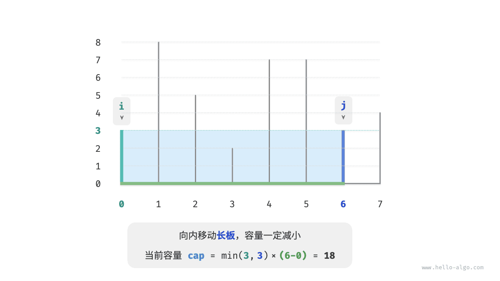

反向思考，**我们只有向内收缩短板 $i$ ，才有可能使容量变大**。因为虽然宽度一定变小，**但高度可能会变大**（移动后的短板 $i$ 可能会变长）。例如在下图中，移动短板后面积变大。

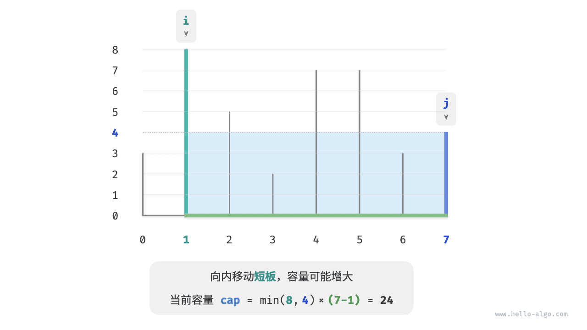

由此便可推出本题的贪心策略：初始化两指针，使其分列容器两端，每轮向内收缩短板对应的指针，直至两指针相遇。

下图展示了贪心策略的执行过程。

1. 初始状态下，指针 $i$ 和 $j$ 分列数组两端。
2. 计算当前状态的容量 $cap[i, j]$ ，并更新最大容量。
3. 比较板 $i$ 和板 $j$ 的高度，并将短板向内移动一格。
4. 循环执行第 `2.` 步和第 `3.` 步，直至 $i$ 和 $j$ 相遇时结束。

=== "<1>"
    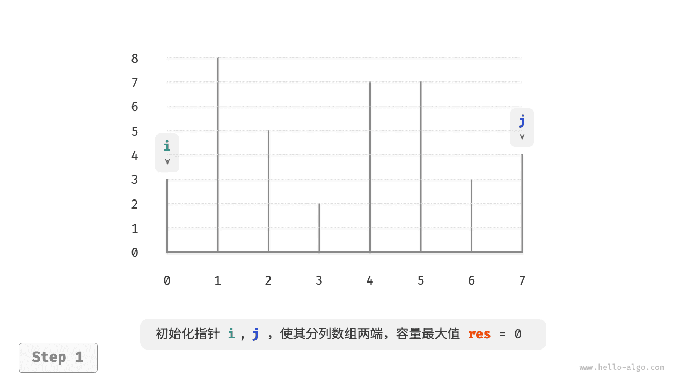

=== "<2>"
    

=== "<3>"
    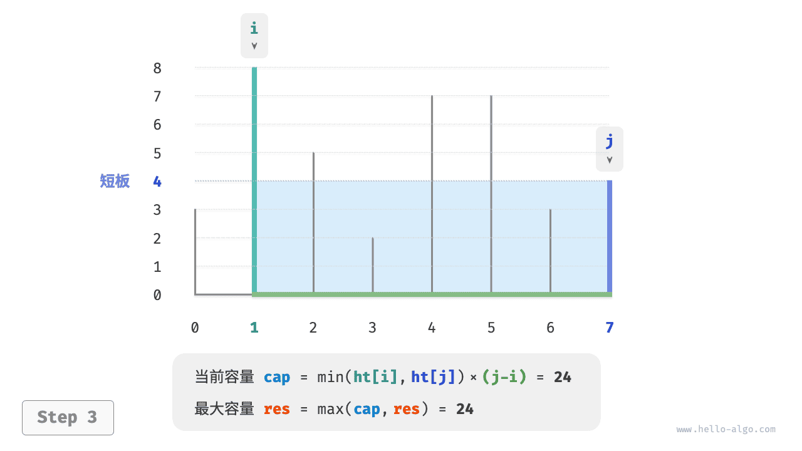

=== "<4>"
    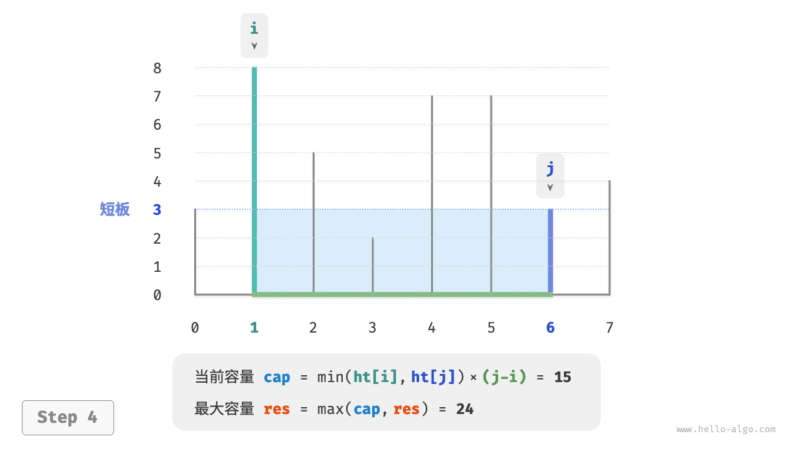

=== "<5>"
    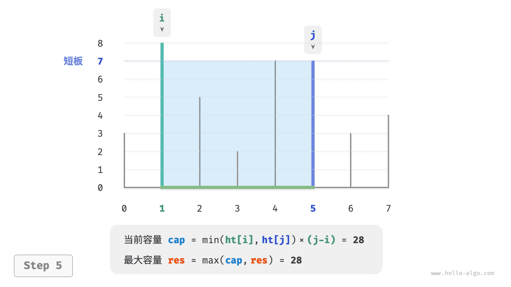

=== "<6>"
    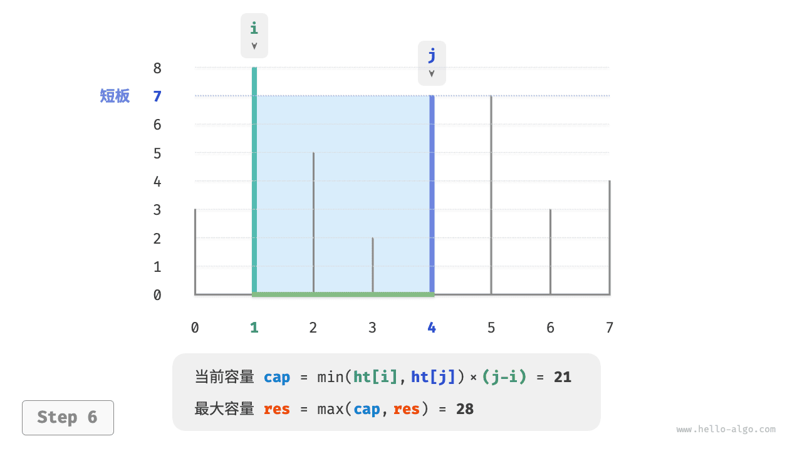

=== "<7>"
    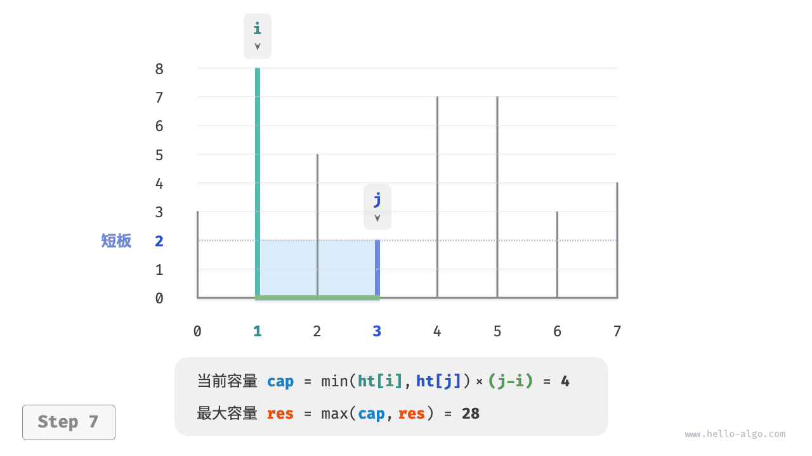

=== "<8>"
    

=== "<9>"
    

### 代码实现

代码循环最多 $n$ 轮，**因此时间复杂度为 $O(n)$** 。

变量 $i$、$j$、$res$ 使用常数大小的额外空间，**因此空间复杂度为 $O(1)$** 。

```python
def max_capacity(ht: list[int]) -> int:
    """最大容量：贪心"""
    # 初始化 i, j，使其分列数组两端
    i, j = 0, len(ht) - 1
    # 初始最大容量为 0
    res = 0
    # 循环贪心选择，直至两板相遇
    while i < j:
        # 更新最大容量
        cap = min(ht[i], ht[j]) * (j - i)
        res = max(res, cap)
        # 向内移动短板
        if ht[i] < ht[j]:
            i += 1
        else:
            j -= 1
    return res
```

!!! example [pythontutor "可视化运行"](https://pythontutor.com/iframe-embed.html#code=def%20max_capacity%28ht%3A%20list%5Bint%5D%29%20-%3E%20int%3A%0A%20%20%20%20%22%22%22%E6%9C%80%E5%A4%A7%E5%AE%B9%E9%87%8F%EF%BC%9A%E8%B4%AA%E5%BF%83%22%22%22%0A%20%20%20%20%23%20%E5%88%9D%E5%A7%8B%E5%8C%96%20i,%20j%EF%BC%8C%E4%BD%BF%E5%85%B6%E5%88%86%E5%88%97%E6%95%B0%E7%BB%84%E4%B8%A4%E7%AB%AF%0A%20%20%20%20i,%20j%20%3D%200,%20len%28ht%29%20-%201%0A%20%20%20%20%23%20%E5%88%9D%E5%A7%8B%E6%9C%80%E5%A4%A7%E5%AE%B9%E9%87%8F%E4%B8%BA%200%0A%20%20%20%20res%20%3D%200%0A%20%20%20%20%23%20%E5%BE%AA%E7%8E%AF%E8%B4%AA%E5%BF%83%E9%80%89%E6%8B%A9%EF%BC%8C%E7%9B%B4%E8%87%B3%E4%B8%A4%E6%9D%BF%E7%9B%B8%E9%81%87%0A%20%20%20%20while%20i%20%3C%20j%3A%0A%20%20%20%20%20%20%20%20%23%20%E6%9B%B4%E6%96%B0%E6%9C%80%E5%A4%A7%E5%AE%B9%E9%87%8F%0A%20%20%20%20%20%20%20%20cap%20%3D%20min%28ht%5Bi%5D,%20ht%5Bj%5D%29%20*%20%28j%20-%20i%29%0A%20%20%20%20%20%20%20%20res%20%3D%20max%28res,%20cap%29%0A%20%20%20%20%20%20%20%20%23%20%E5%90%91%E5%86%85%E7%A7%BB%E5%8A%A8%E7%9F%AD%E6%9D%BF%0A%20%20%20%20%20%20%20%20if%20ht%5Bi%5D%20%3C%20ht%5Bj%5D%3A%0A%20%20%20%20%20%20%20%20%20%20%20%20i%20%2B%3D%201%0A%20%20%20%20%20%20%20%20else%3A%0A%20%20%20%20%20%20%20%20%20%20%20%20j%20-%3D%201%0A%20%20%20%20return%20res%0A%0A%0A%22%22%22Driver%20Code%22%22%22%0Aif%20__name__%20%3D%3D%20%22__main__%22%3A%0A%20%20%20%20ht%20%3D%20%5B3,%208,%205,%202,%207,%207,%203,%204%5D%0A%0A%20%20%20%20%23%20%E8%B4%AA%E5%BF%83%E7%AE%97%E6%B3%95%0A%20%20%20%20res%20%3D%20max_capacity%28ht%29%0A%20%20%20%20print%28f%22%E6%9C%80%E5%A4%A7%E5%AE%B9%E9%87%8F%E4%B8%BA%20%7Bres%7D%22%29&codeDivHeight=800&codeDivWidth=600&cumulative=false&curInstr=4&heapPrimitives=nevernest&origin=opt-frontend.js&py=311&rawInputLstJSON=%5B%5D&textReferences=false)

### 正确性证明

之所以贪心比穷举更快，是因为每轮的贪心选择都会“跳过”一些状态。

比如在状态 $cap[i, j]$ 下，$i$ 为短板、$j$ 为长板。若贪心地将短板 $i$ 向内移动一格，会导致下图所示的状态被“跳过”。**这意味着之后无法验证这些状态的容量大小**。

$$
cap[i, i+1], cap[i, i+2], \dots, cap[i, j-2], cap[i, j-1]
$$

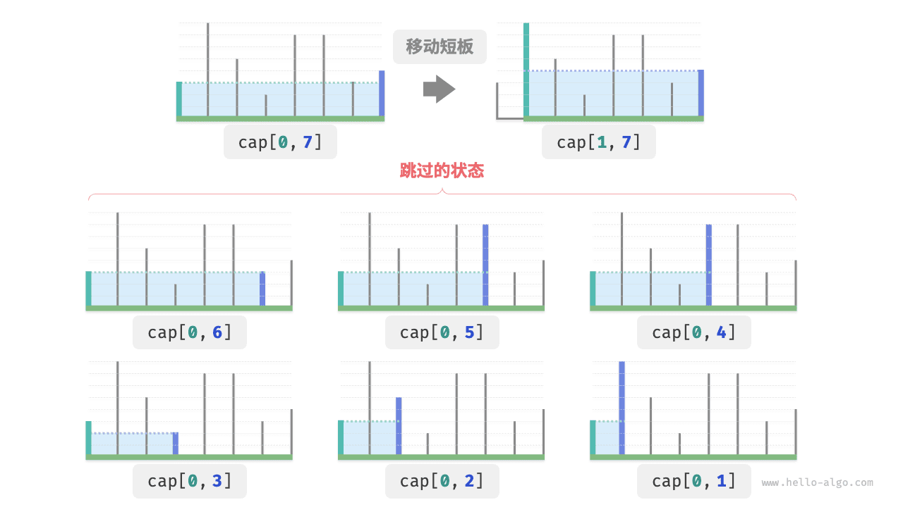

观察发现，**这些被跳过的状态实际上就是将长板 $j$ 向内移动的所有状态**。前面我们已经证明内移长板一定会导致容量变小。也就是说，被跳过的状态都不可能是最优解，**跳过它们不会导致错过最优解**。

以上分析说明，移动短板的操作是“安全”的，贪心策略是有效的。

# 最大切分乘积问题

!!! question

    给定一个正整数 $n$ ，将其切分为至少两个正整数的和，求切分后所有整数的乘积最大是多少，如下图所示。

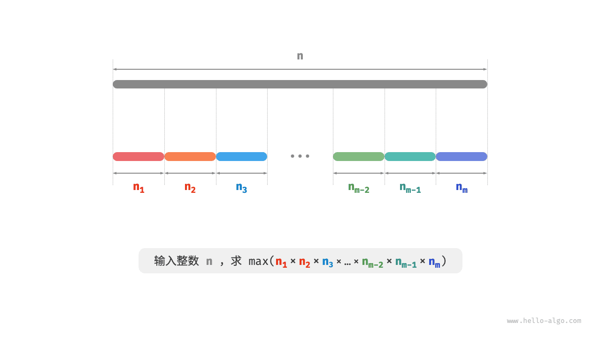

假设我们将 $n$ 切分为 $m$ 个整数因子，其中第 $i$ 个因子记为 $n_i$ ，即

$$
n = \sum_{i=1}^{m}n_i
$$

本题的目标是求得所有整数因子的最大乘积，即

$$
\max(\prod_{i=1}^{m}n_i)
$$

我们需要思考的是：切分数量 $m$ 应该多大，每个 $n_i$ 应该是多少？

### 贪心策略确定

根据经验，两个整数的乘积往往比它们的加和更大。假设从 $n$ 中分出一个因子 $2$ ，则它们的乘积为 $2(n-2)$ 。我们将该乘积与 $n$ 作比较：

$$
\begin{aligned}
2(n-2) & \geq n \newline
2n - n - 4 & \geq 0 \newline
n & \geq 4
\end{aligned}
$$

如下图所示，当 $n \geq 4$ 时，切分出一个 $2$ 后乘积会变大，**这说明大于等于 $4$ 的整数都应该被切分**。

**贪心策略一**：如果切分方案中包含 $\geq 4$ 的因子，那么它就应该被继续切分。最终的切分方案只应出现 $1$、$2$、$3$ 这三种因子。


接下来思考哪个因子是最优的。在 $1$、$2$、$3$ 这三个因子中，显然 $1$ 是最差的，因为 $1 \times (n-1) < n$ 恒成立，即切分出 $1$ 反而会导致乘积减小。

如下图所示，当 $n = 6$ 时，有 $3 \times 3 > 2 \times 2 \times 2$ 。**这意味着切分出 $3$ 比切分出 $2$ 更优**。

**贪心策略二**：在切分方案中，最多只应存在两个 $2$ 。因为三个 $2$ 总是可以替换为两个 $3$ ，从而获得更大的乘积。


综上所述，可推理出以下贪心策略。

1. 输入整数 $n$ ，从其不断地切分出因子 $3$ ，直至余数为 $0$、$1$、$2$ 。
2. 当余数为 $0$ 时，代表 $n$ 是 $3$ 的倍数，因此不做任何处理。
3. 当余数为 $2$ 时，不继续划分，保留。
4. 当余数为 $1$ 时，由于 $2 \times 2 > 1 \times 3$ ，因此应将最后一个 $3$ 替换为 $2$ 。

### 代码实现

如下图所示，我们无须通过循环来切分整数，而可以利用向下整除运算得到 $3$ 的个数 $a$ ，用取模运算得到余数 $b$ ，此时有：

$$
n = 3 a + b
$$

请注意，对于 $n \leq 3$ 的边界情况，必须拆分出一个 $1$ ，乘积为 $1 \times (n - 1)$ 。

```python
def max_product_cutting(n: int) -> int:
    """最大切分乘积：贪心"""
    # 当 n <= 3 时，必须切分出一个 1
    if n <= 3:
        return 1 * (n - 1)
    # 贪心地切分出 3 ，a 为 3 的个数，b 为余数
    a, b = n // 3, n % 3
    if b == 1:
        # 当余数为 1 时，将一对 1 * 3 转化为 2 * 2
        return int(math.pow(3, a - 1)) * 2 * 2
    if b == 2:
        # 当余数为 2 时，不做处理
        return int(math.pow(3, a)) * 2
    # 当余数为 0 时，不做处理
    return int(math.pow(3, a))
```

!!! example [pythontutor "可视化运行"](https://pythontutor.com/iframe-embed.html#code=import%20math%0A%0Adef%20max_product_cutting%28n%3A%20int%29%20-%3E%20int%3A%0A%20%20%20%20%22%22%22%E6%9C%80%E5%A4%A7%E5%88%87%E5%88%86%E4%B9%98%E7%A7%AF%EF%BC%9A%E8%B4%AA%E5%BF%83%22%22%22%0A%20%20%20%20%23%20%E5%BD%93%20n%20%3C%3D%203%20%E6%97%B6%EF%BC%8C%E5%BF%85%E9%A1%BB%E5%88%87%E5%88%86%E5%87%BA%E4%B8%80%E4%B8%AA%201%0A%20%20%20%20if%20n%20%3C%3D%203%3A%0A%20%20%20%20%20%20%20%20return%201%20*%20%28n%20-%201%29%0A%20%20%20%20%23%20%E8%B4%AA%E5%BF%83%E5%9C%B0%E5%88%87%E5%88%86%E5%87%BA%203%20%EF%BC%8Ca%20%E4%B8%BA%203%20%E7%9A%84%E4%B8%AA%E6%95%B0%EF%BC%8Cb%20%E4%B8%BA%E4%BD%99%E6%95%B0%0A%20%20%20%20a,%20b%20%3D%20n%20//%203,%20n%20%25%203%0A%20%20%20%20if%20b%20%3D%3D%201%3A%0A%20%20%20%20%20%20%20%20%23%20%E5%BD%93%E4%BD%99%E6%95%B0%E4%B8%BA%201%20%E6%97%B6%EF%BC%8C%E5%B0%86%E4%B8%80%E5%AF%B9%201%20*%203%20%E8%BD%AC%E5%8C%96%E4%B8%BA%202%20*%202%0A%20%20%20%20%20%20%20%20return%20int%28math.pow%283,%20a%20-%201%29%29%20*%202%20*%202%0A%20%20%20%20if%20b%20%3D%3D%202%3A%0A%20%20%20%20%20%20%20%20%23%20%E5%BD%93%E4%BD%99%E6%95%B0%E4%B8%BA%202%20%E6%97%B6%EF%BC%8C%E4%B8%8D%E5%81%9A%E5%A4%84%E7%90%86%0A%20%20%20%20%20%20%20%20return%20int%28math.pow%283,%20a%29%29%20*%202%0A%20%20%20%20%23%20%E5%BD%93%E4%BD%99%E6%95%B0%E4%B8%BA%200%20%E6%97%B6%EF%BC%8C%E4%B8%8D%E5%81%9A%E5%A4%84%E7%90%86%0A%20%20%20%20return%20int%28math.pow%283,%20a%29%29%0A%0A%22%22%22Driver%20Code%22%22%22%0Aif%20__name__%20%3D%3D%20%22__main__%22%3A%0A%20%20%20%20n%20%3D%2058%0A%0A%20%20%20%20%23%20%E8%B4%AA%E5%BF%83%E7%AE%97%E6%B3%95%0A%20%20%20%20res%20%3D%20max_product_cutting%28n%29%0A%20%20%20%20print%28f%22%E6%9C%80%E5%A4%A7%E5%88%87%E5%88%86%E4%B9%98%E7%A7%AF%E4%B8%BA%20%7Bres%7D%22%29&codeDivHeight=800&codeDivWidth=600&cumulative=false&curInstr=5&heapPrimitives=nevernest&origin=opt-frontend.js&py=311&rawInputLstJSON=%5B%5D&textReferences=false)

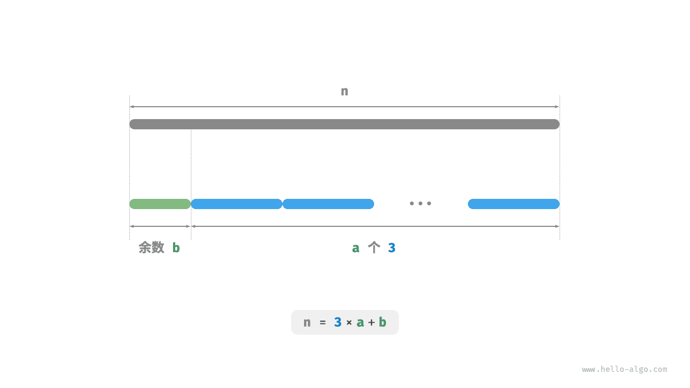

**时间复杂度取决于编程语言的幂运算的实现方法**。以 Python 为例，常用的幂计算函数有三种。

- 运算符 `**` 和函数 `pow()` 的时间复杂度均为 $O(\log⁡ a)$ 。
- 函数 `math.pow()` 内部调用 C 语言库的 `pow()` 函数，其执行浮点取幂，时间复杂度为 $O(1)$ 。

变量 $a$ 和 $b$ 使用常数大小的额外空间，**因此空间复杂度为 $O(1)$** 。

### 正确性证明

使用反证法，只分析 $n \geq 4$ 的情况。

1. **所有因子 $\leq 3$** ：假设最优切分方案中存在 $\geq 4$ 的因子 $x$ ，那么一定可以将其继续划分为 $2(x-2)$ ，从而获得更大（或相等）的乘积。这与假设矛盾。
2. **切分方案不包含 $1$** ：假设最优切分方案中存在一个因子 $1$ ，那么它一定可以合并入另外一个因子中，以获得更大的乘积。这与假设矛盾。
3. **切分方案最多包含两个 $2$** ：假设最优切分方案中包含三个 $2$ ，那么一定可以替换为两个 $3$ ，乘积更大。这与假设矛盾。

# 小结

### 重点回顾

- 贪心算法通常用于解决最优化问题，其原理是在每个决策阶段都做出局部最优的决策，以期获得全局最优解。
- 贪心算法会迭代地做出一个又一个的贪心选择，每轮都将问题转化成一个规模更小的子问题，直到问题被解决。
- 贪心算法不仅实现简单，还具有很高的解题效率。相比于动态规划，贪心算法的时间复杂度通常更低。
- 在零钱兑换问题中，对于某些硬币组合，贪心算法可以保证找到最优解；对于另外一些硬币组合则不然，贪心算法可能找到很差的解。
- 适合用贪心算法求解的问题具有两大性质：贪心选择性质和最优子结构。贪心选择性质代表贪心策略的有效性。
- 对于某些复杂问题，贪心选择性质的证明并不简单。相对来说，证伪更加容易，例如零钱兑换问题。
- 求解贪心问题主要分为三步：问题分析、确定贪心策略、正确性证明。其中，确定贪心策略是核心步骤，正确性证明往往是难点。
- 分数背包问题在 0-1 背包的基础上，允许选择物品的一部分，因此可使用贪心算法求解。贪心策略的正确性可以使用反证法来证明。
- 最大容量问题可使用穷举法求解，时间复杂度为 $O(n^2)$ 。通过设计贪心策略，每轮向内移动短板，可将时间复杂度优化至 $O(n)$ 。
- 在最大切分乘积问题中，我们先后推理出两个贪心策略：$\geq 4$ 的整数都应该继续切分，最优切分因子为 $3$ 。代码中包含幂运算，时间复杂度取决于幂运算实现方法，通常为 $O(1)$ 或 $O(\log n)$ 。
