# 上下求索

<u>搜索算法（searching algorithm）</u>用于在数据结构（例如数组、链表、树或图）中搜索一个或一组满足特定条件的元素。

搜索算法可根据实现思路分为以下两类。

- **通过遍历数据结构来定位目标元素**，例如数组、链表、树和图的遍历等。
- **利用数据组织结构或数据包含的先验信息，实现高效元素查找**，例如二分查找、哈希查找和二叉搜索树查找等。

不难发现，这些知识点都已在前面的章节中介绍过，因此搜索算法对于我们来说并不陌生。在本节中，我们将从更加系统的视角切入，重新审视搜索算法。

## 暴力搜索

暴力搜索通过遍历数据结构的每个元素来定位目标元素。

- “线性搜索”适用于数组和链表等线性数据结构。它从数据结构的一端开始，逐个访问元素，直到找到目标元素或到达另一端仍没有找到目标元素为止。
- “广度优先搜索”和“深度优先搜索”是图和树的两种遍历策略。广度优先搜索从初始节点开始逐层搜索，由近及远地访问各个节点。深度优先搜索从初始节点开始，沿着一条路径走到头，再回溯并尝试其他路径，直到遍历完整个数据结构。

暴力搜索的优点是简单且通用性好，**无须对数据做预处理和借助额外的数据结构**。

然而，**此类算法的时间复杂度为 $O(n)$** ，其中 $n$ 为元素数量，因此在数据量较大的情况下性能较差。

## 自适应搜索

自适应搜索利用数据的特有属性（例如有序性）来优化搜索过程，从而更高效地定位目标元素。

- “二分查找”利用数据的有序性实现高效查找，仅适用于数组。
- “哈希查找”利用哈希表将搜索数据和目标数据建立为键值对映射，从而实现查询操作。
- “树查找”在特定的树结构（例如二叉搜索树）中，基于比较节点值来快速排除节点，从而定位目标元素。

此类算法的优点是效率高，**时间复杂度可达到 $O(\log n)$ 甚至 $O(1)$** 。

然而，**使用这些算法往往需要对数据进行预处理**。例如，二分查找需要预先对数组进行排序，哈希查找和树查找都需要借助额外的数据结构，维护这些数据结构也需要额外的时间和空间开销。

!!! tip

    自适应搜索算法常被称为查找算法，**主要用于在特定数据结构中快速检索目标元素**。

## 搜索方法选取

给定大小为 $n$ 的一组数据，我们可以使用线性搜索、二分查找、树查找、哈希查找等多种方法从中搜索目标元素。各个方法的工作原理如下图所示。

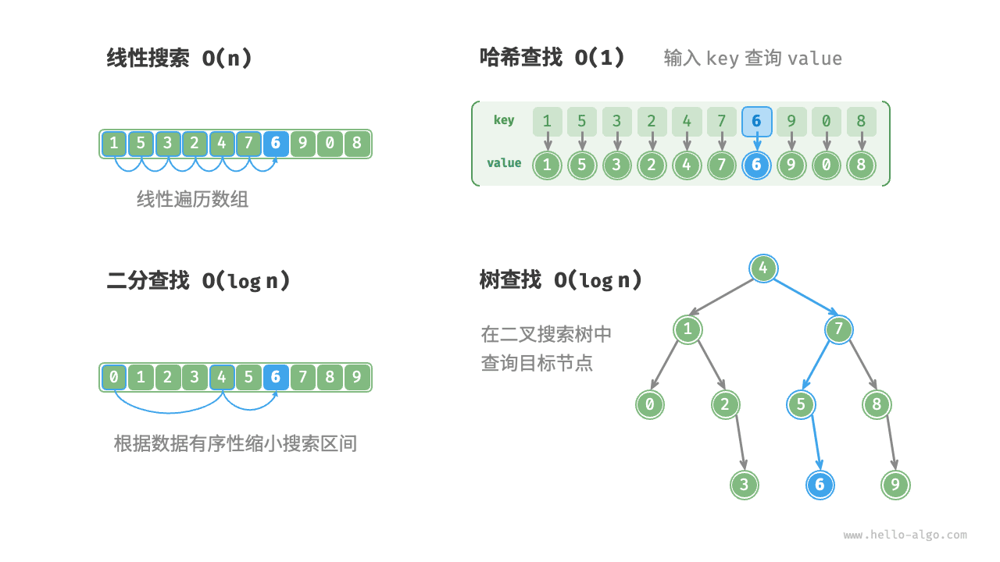

上述几种方法的操作效率与特性如下表所示。

<p align="center"> 表 <id> &nbsp; 查找算法效率对比 </p>

|              | 线性搜索 | 二分查找           | 树查找             | 哈希查找        |
| ------------ | -------- | ------------------ | ------------------ | --------------- |
| 查找元素     | $O(n)$   | $O(\log n)$        | $O(\log n)$        | $O(1)$          |
| 插入元素     | $O(1)$   | $O(n)$             | $O(\log n)$        | $O(1)$          |
| 删除元素     | $O(n)$   | $O(n)$             | $O(\log n)$        | $O(1)$          |
| 额外空间     | $O(1)$   | $O(1)$             | $O(n)$             | $O(n)$          |
| 数据预处理   | /        | 排序 $O(n \log n)$ | 建树 $O(n \log n)$ | 建哈希表 $O(n)$ |
| 数据是否有序 | 无序     | 有序               | 有序               | 无序            |

搜索算法的选择还取决规模、搜索性能要求、数据查询与更新频率等。

**线性搜索**

- 通用性较好，无须任何数据预处理操作。假如我们仅需查询一次数据，那么其他三种方法的数据预处理的时间比线性搜索的时间还要更长。
- 适用于体量较小的数据，此情况下时间复杂度对效率影响较小。
- 适用于数据更新频率较高的场景，因为该方法不需要对数据进行任何额外维护。

**二分查找**

- 适用于大数据量的情况，效率表现稳定，最差时间复杂度为 $O(\log n)$ 。
- 数据量不能过大，因为存储数组需要连续的内存空间。
- 不适用于高频增删数据的场景，因为维护有序数组的开销较大。

**哈希查找**

- 适合对查询性能要求很高的场景，平均时间复杂度为 $O(1)$ 。
- 不适合需要有序数据或范围查找的场景，因为哈希表无法维护数据的有序性。
- 对哈希函数和哈希冲突处理策略的依赖性较高，具有较大的性能劣化风险。
- 不适合数据量过大的情况，因为哈希表需要额外空间来最大程度地减少冲突，从而提供良好的查询性能。

**树查找**

- 适用于海量数据，因为树节点在内存中是分散存储的。
- 适合需要维护有序数据或范围查找的场景。
- 在持续增删节点的过程中，二叉搜索树可能产生倾斜，时间复杂度劣化至 $O(n)$ 。
- 若使用 AVL 树或红黑树，则各项操作可在 $O(\log n)$ 效率下稳定运行，但维护树平衡的操作会增加额外的开销。

# 二分查找

<u>二分查找（binary search）</u>是一种基于分治策略的高效搜索算法。它利用数据的有序性，每轮缩小一半搜索范围，直至找到目标元素或搜索区间为空为止。

!!! question

    给定一个长度为 $n$ 的数组 `nums` ，元素按从小到大的顺序排列且不重复。请查找并返回元素 `target` 在该数组中的索引。若数组不包含该元素，则返回 $-1$ 。示例如下图所示。

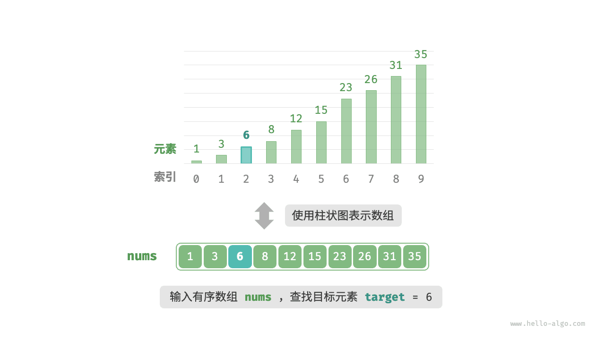

如下图所示，我们先初始化指针 $i = 0$ 和 $j = n - 1$ ，分别指向数组首元素和尾元素，代表搜索区间 $[0, n - 1]$ 。请注意，中括号表示闭区间，其包含边界值本身。

接下来，循环执行以下两步。

1. 计算中点索引 $m = \lfloor {(i + j) / 2} \rfloor$ ，其中 $\lfloor \: \rfloor$ 表示向下取整操作。
2. 判断 `nums[m]` 和 `target` 的大小关系，分为以下三种情况。
    1. 当 `nums[m] < target` 时，说明 `target` 在区间 $[m + 1, j]$ 中，因此执行 $i = m + 1$ 。
    2. 当 `nums[m] > target` 时，说明 `target` 在区间 $[i, m - 1]$ 中，因此执行 $j = m - 1$ 。
    3. 当 `nums[m] = target` 时，说明找到 `target` ，因此返回索引 $m$ 。

若数组不包含目标元素，搜索区间最终会缩小为空。此时返回 $-1$ 。

=== "<1>"
    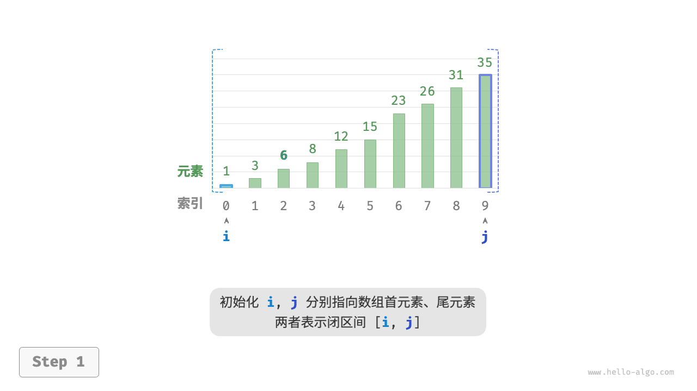

=== "<2>"
    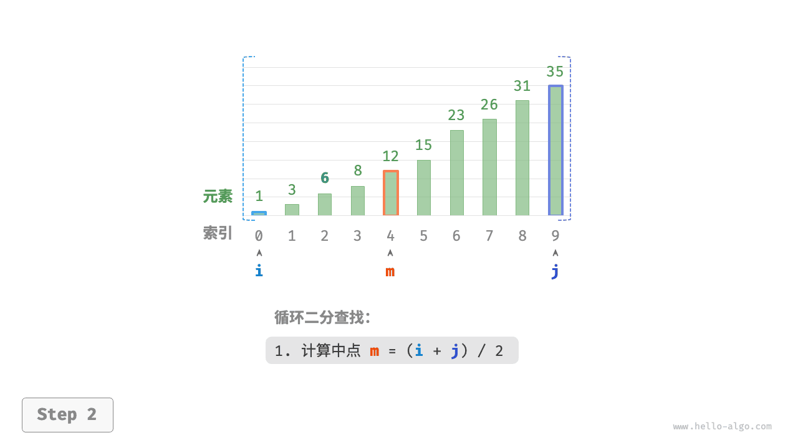

=== "<3>"
    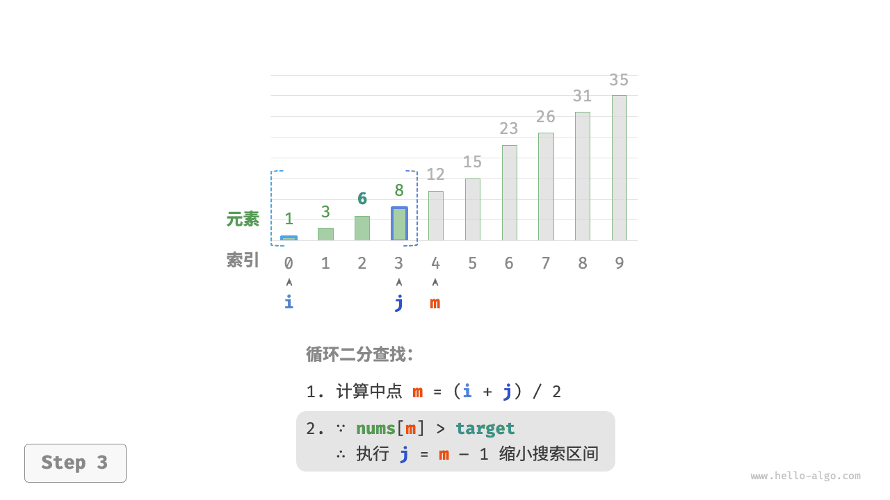

=== "<4>"
    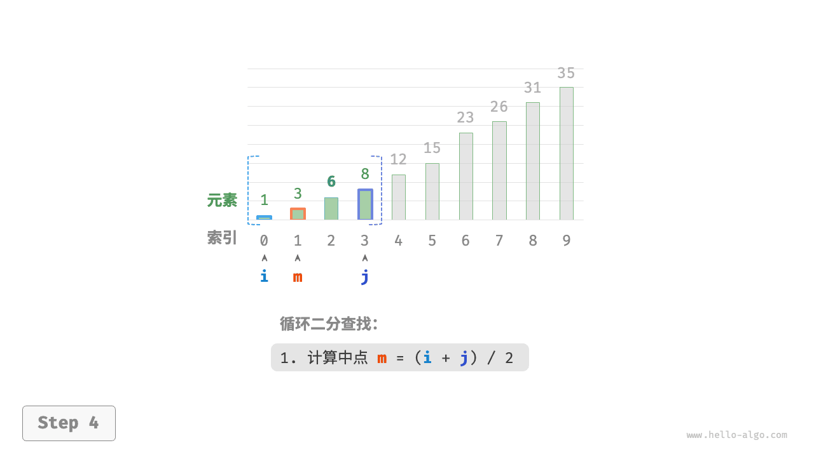

=== "<5>"
    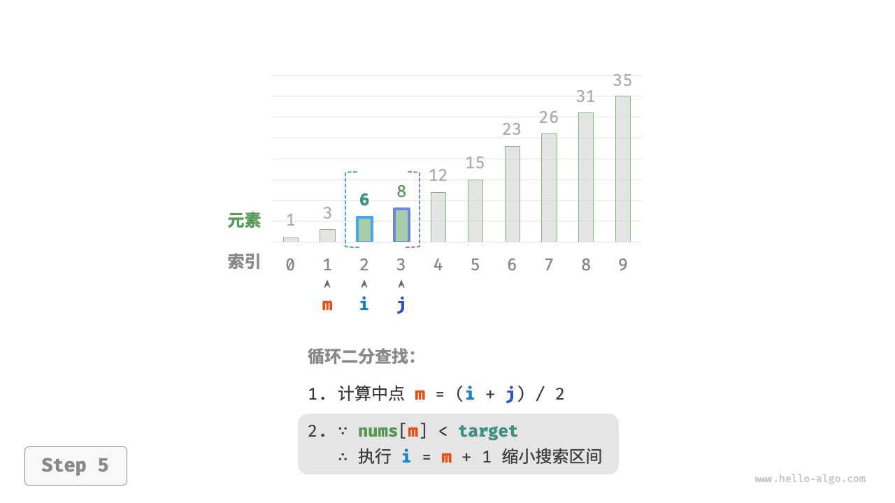

=== "<6>"
    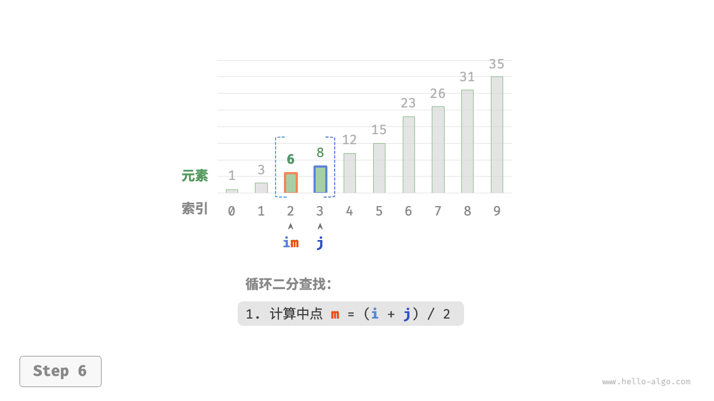

=== "<7>"
    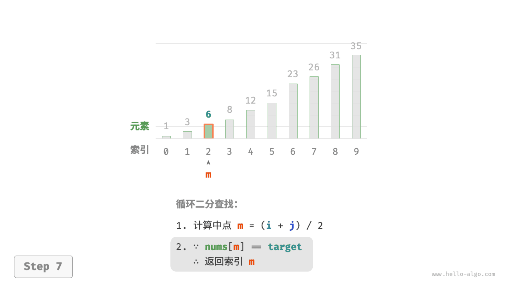

值得注意的是，由于 $i$ 和 $j$ 都是 `int` 类型，**因此 $i + j$ 可能会超出 `int` 类型的取值范围**。为了避免大数越界，我们通常采用公式 $m = \lfloor {i + (j - i) / 2} \rfloor$ 来计算中点。

代码如下所示：

```python
def binary_search(nums: list[int], target: int) -> int:
    """二分查找（双闭区间）"""
    # 初始化双闭区间 [0, n-1] ，即 i, j 分别指向数组首元素、尾元素
    i, j = 0, len(nums) - 1
    # 循环，当搜索区间为空时跳出（当 i > j 时为空）
    while i <= j:
        # 理论上 Python 的数字可以无限大（取决于内存大小），无须考虑大数越界问题
        m = (i + j) // 2  # 计算中点索引 m
        if nums[m] < target:
            i = m + 1  # 此情况说明 target 在区间 [m+1, j] 中
        elif nums[m] > target:
            j = m - 1  # 此情况说明 target 在区间 [i, m-1] 中
        else:
            return m  # 找到目标元素，返回其索引
    return -1  # 未找到目标元素，返回 -1
```

!!! example [pythontutor "可视化运行"](https://pythontutor.com/iframe-embed.html#code=def%20binary_search%28nums%3A%20list%5Bint%5D,%20target%3A%20int%29%20-%3E%20int%3A%0A%20%20%20%20%22%22%22%E4%BA%8C%E5%88%86%E6%9F%A5%E6%89%BE%EF%BC%88%E5%8F%8C%E9%97%AD%E5%8C%BA%E9%97%B4%EF%BC%89%22%22%22%0A%20%20%20%20%23%20%E5%88%9D%E5%A7%8B%E5%8C%96%E5%8F%8C%E9%97%AD%E5%8C%BA%E9%97%B4%20%5B0,%20n-1%5D%20%EF%BC%8C%E5%8D%B3%20i,%20j%20%E5%88%86%E5%88%AB%E6%8C%87%E5%90%91%E6%95%B0%E7%BB%84%E9%A6%96%E5%85%83%E7%B4%A0%E3%80%81%E5%B0%BE%E5%85%83%E7%B4%A0%0A%20%20%20%20i,%20j%20%3D%200,%20len%28nums%29%20-%201%0A%20%20%20%20%23%20%E5%BE%AA%E7%8E%AF%EF%BC%8C%E5%BD%93%E6%90%9C%E7%B4%A2%E5%8C%BA%E9%97%B4%E4%B8%BA%E7%A9%BA%E6%97%B6%E8%B7%B3%E5%87%BA%EF%BC%88%E5%BD%93%20i%20%3E%20j%20%E6%97%B6%E4%B8%BA%E7%A9%BA%EF%BC%89%0A%20%20%20%20while%20i%20%3C%3D%20j%3A%0A%20%20%20%20%20%20%20%20%23%20%E7%90%86%E8%AE%BA%E4%B8%8A%20Python%20%E7%9A%84%E6%95%B0%E5%AD%97%E5%8F%AF%E4%BB%A5%E6%97%A0%E9%99%90%E5%A4%A7%EF%BC%88%E5%8F%96%E5%86%B3%E4%BA%8E%E5%86%85%E5%AD%98%E5%A4%A7%E5%B0%8F%EF%BC%89%EF%BC%8C%E6%97%A0%E9%A1%BB%E8%80%83%E8%99%91%E5%A4%A7%E6%95%B0%E8%B6%8A%E7%95%8C%E9%97%AE%E9%A2%98%0A%20%20%20%20%20%20%20%20m%20%3D%20%28i%20%2B%20j%29%20//%202%20%20%23%20%E8%AE%A1%E7%AE%97%E4%B8%AD%E7%82%B9%E7%B4%A2%E5%BC%95%20m%0A%20%20%20%20%20%20%20%20if%20nums%5Bm%5D%20%3C%20target%3A%0A%20%20%20%20%20%20%20%20%20%20%20%20i%20%3D%20m%20%2B%201%20%20%23%20%E6%AD%A4%E6%83%85%E5%86%B5%E8%AF%B4%E6%98%8E%20target%20%E5%9C%A8%E5%8C%BA%E9%97%B4%20%5Bm%2B1,%20j%5D%20%E4%B8%AD%0A%20%20%20%20%20%20%20%20elif%20nums%5Bm%5D%20%3E%20target%3A%0A%20%20%20%20%20%20%20%20%20%20%20%20j%20%3D%20m%20-%201%20%20%23%20%E6%AD%A4%E6%83%85%E5%86%B5%E8%AF%B4%E6%98%8E%20target%20%E5%9C%A8%E5%8C%BA%E9%97%B4%20%5Bi,%20m-1%5D%20%E4%B8%AD%0A%20%20%20%20%20%20%20%20else%3A%0A%20%20%20%20%20%20%20%20%20%20%20%20return%20m%20%20%23%20%E6%89%BE%E5%88%B0%E7%9B%AE%E6%A0%87%E5%85%83%E7%B4%A0%EF%BC%8C%E8%BF%94%E5%9B%9E%E5%85%B6%E7%B4%A2%E5%BC%95%0A%20%20%20%20return%20-1%20%20%23%20%E6%9C%AA%E6%89%BE%E5%88%B0%E7%9B%AE%E6%A0%87%E5%85%83%E7%B4%A0%EF%BC%8C%E8%BF%94%E5%9B%9E%20-1%0A%0A%0A%22%22%22Driver%20Code%22%22%22%0Aif%20__name__%20%3D%3D%20%22__main__%22%3A%0A%20%20%20%20target%20%3D%206%0A%20%20%20%20nums%20%3D%20%5B1,%203,%206,%208,%2012,%2015,%2023,%2026,%2031,%2035%5D%0A%0A%20%20%20%20%23%20%E4%BA%8C%E5%88%86%E6%9F%A5%E6%89%BE%EF%BC%88%E5%8F%8C%E9%97%AD%E5%8C%BA%E9%97%B4%EF%BC%89%0A%20%20%20%20index%20%3D%20binary_search%28nums,%20target%29%0A%20%20%20%20print%28%22%E7%9B%AE%E6%A0%87%E5%85%83%E7%B4%A0%206%20%E7%9A%84%E7%B4%A2%E5%BC%95%20%3D%20%22,%20index%29&codeDivHeight=800&codeDivWidth=600&cumulative=false&curInstr=5&heapPrimitives=nevernest&origin=opt-frontend.js&py=311&rawInputLstJSON=%5B%5D&textReferences=false)

**时间复杂度为 $O(\log n)$** ：在二分循环中，区间每轮缩小一半，因此循环次数为 $\log_2 n$ 。

**空间复杂度为 $O(1)$** ：指针 $i$ 和 $j$ 使用常数大小空间。

## 区间表示方法

除了上述双闭区间外，常见的区间表示还有“左闭右开”区间，定义为 $[0, n)$ ，即左边界包含自身，右边界不包含自身。在该表示下，区间 $[i, j)$ 在 $i = j$ 时为空。

我们可以基于该表示实现具有相同功能的二分查找算法：

```python
def binary_search_lcro(nums: list[int], target: int) -> int:
    """二分查找（左闭右开区间）"""
    # 初始化左闭右开区间 [0, n) ，即 i, j 分别指向数组首元素、尾元素+1
    i, j = 0, len(nums)
    # 循环，当搜索区间为空时跳出（当 i = j 时为空）
    while i < j:
        m = (i + j) // 2  # 计算中点索引 m
        if nums[m] < target:
            i = m + 1  # 此情况说明 target 在区间 [m+1, j) 中
        elif nums[m] > target:
            j = m  # 此情况说明 target 在区间 [i, m) 中
        else:
            return m  # 找到目标元素，返回其索引
    return -1  # 未找到目标元素，返回 -1
```

!!! example [pythontutor "可视化运行"](https://pythontutor.com/iframe-embed.html#code=def%20binary_search_lcro%28nums%3A%20list%5Bint%5D,%20target%3A%20int%29%20-%3E%20int%3A%0A%20%20%20%20%22%22%22%E4%BA%8C%E5%88%86%E6%9F%A5%E6%89%BE%EF%BC%88%E5%B7%A6%E9%97%AD%E5%8F%B3%E5%BC%80%E5%8C%BA%E9%97%B4%EF%BC%89%22%22%22%0A%20%20%20%20%23%20%E5%88%9D%E5%A7%8B%E5%8C%96%E5%B7%A6%E9%97%AD%E5%8F%B3%E5%BC%80%E5%8C%BA%E9%97%B4%20%5B0,%20n%29%20%EF%BC%8C%E5%8D%B3%20i,%20j%20%E5%88%86%E5%88%AB%E6%8C%87%E5%90%91%E6%95%B0%E7%BB%84%E9%A6%96%E5%85%83%E7%B4%A0%E3%80%81%E5%B0%BE%E5%85%83%E7%B4%A0%2B1%0A%20%20%20%20i,%20j%20%3D%200,%20len%28nums%29%0A%20%20%20%20%23%20%E5%BE%AA%E7%8E%AF%EF%BC%8C%E5%BD%93%E6%90%9C%E7%B4%A2%E5%8C%BA%E9%97%B4%E4%B8%BA%E7%A9%BA%E6%97%B6%E8%B7%B3%E5%87%BA%EF%BC%88%E5%BD%93%20i%20%3D%20j%20%E6%97%B6%E4%B8%BA%E7%A9%BA%EF%BC%89%0A%20%20%20%20while%20i%20%3C%20j%3A%0A%20%20%20%20%20%20%20%20m%20%3D%20%28i%20%2B%20j%29%20//%202%20%20%23%20%E8%AE%A1%E7%AE%97%E4%B8%AD%E7%82%B9%E7%B4%A2%E5%BC%95%20m%0A%20%20%20%20%20%20%20%20if%20nums%5Bm%5D%20%3C%20target%3A%0A%20%20%20%20%20%20%20%20%20%20%20%20i%20%3D%20m%20%2B%201%20%20%23%20%E6%AD%A4%E6%83%85%E5%86%B5%E8%AF%B4%E6%98%8E%20target%20%E5%9C%A8%E5%8C%BA%E9%97%B4%20%5Bm%2B1,%20j%29%20%E4%B8%AD%0A%20%20%20%20%20%20%20%20elif%20nums%5Bm%5D%20%3E%20target%3A%0A%20%20%20%20%20%20%20%20%20%20%20%20j%20%3D%20m%20%20%23%20%E6%AD%A4%E6%83%85%E5%86%B5%E8%AF%B4%E6%98%8E%20target%20%E5%9C%A8%E5%8C%BA%E9%97%B4%20%5Bi,%20m%29%20%E4%B8%AD%0A%20%20%20%20%20%20%20%20else%3A%0A%20%20%20%20%20%20%20%20%20%20%20%20return%20m%20%20%23%20%E6%89%BE%E5%88%B0%E7%9B%AE%E6%A0%87%E5%85%83%E7%B4%A0%EF%BC%8C%E8%BF%94%E5%9B%9E%E5%85%B6%E7%B4%A2%E5%BC%95%0A%20%20%20%20return%20-1%20%20%23%20%E6%9C%AA%E6%89%BE%E5%88%B0%E7%9B%AE%E6%A0%87%E5%85%83%E7%B4%A0%EF%BC%8C%E8%BF%94%E5%9B%9E%20-1%0A%0A%0A%22%22%22Driver%20Code%22%22%22%0Aif%20__name__%20%3D%3D%20%22__main__%22%3A%0A%20%20%20%20target%20%3D%206%0A%20%20%20%20nums%20%3D%20%5B1,%203,%206,%208,%2012,%2015,%2023,%2026,%2031,%2035%5D%0A%0A%20%20%20%20%23%20%E4%BA%8C%E5%88%86%E6%9F%A5%E6%89%BE%EF%BC%88%E5%B7%A6%E9%97%AD%E5%8F%B3%E5%BC%80%E5%8C%BA%E9%97%B4%EF%BC%89%0A%20%20%20%20index%20%3D%20binary_search_lcro%28nums,%20target%29%0A%20%20%20%20print%28%22%E7%9B%AE%E6%A0%87%E5%85%83%E7%B4%A0%206%20%E7%9A%84%E7%B4%A2%E5%BC%95%20%3D%20%22,%20index%29&codeDivHeight=800&codeDivWidth=600&cumulative=false&curInstr=5&heapPrimitives=nevernest&origin=opt-frontend.js&py=311&rawInputLstJSON=%5B%5D&textReferences=false)

如下图所示，在两种区间表示下，二分查找算法的初始化、循环条件和缩小区间操作皆有所不同。

由于“双闭区间”表示中的左右边界都被定义为闭区间，因此通过指针 $i$ 和指针 $j$ 缩小区间的操作也是对称的。这样更不容易出错，**因此一般建议采用“双闭区间”的写法**。


## 优点与局限性

二分查找在时间和空间方面都有较好的性能。

- 二分查找的时间效率高。在大数据量下，对数阶的时间复杂度具有显著优势。例如，当数据大小 $n = 2^{20}$ 时，线性查找需要 $2^{20} = 1048576$ 轮循环，而二分查找仅需 $\log_2 2^{20} = 20$ 轮循环。
- 二分查找无须额外空间。相较于需要借助额外空间的搜索算法（例如哈希查找），二分查找更加节省空间。

然而，二分查找并非适用于所有情况，主要有以下原因。

- 二分查找仅适用于有序数据。若输入数据无序，为了使用二分查找而专门进行排序，得不偿失。因为排序算法的时间复杂度通常为 $O(n \log n)$ ，比线性查找和二分查找都更高。对于频繁插入元素的场景，为保持数组有序性，需要将元素插入到特定位置，时间复杂度为 $O(n)$ ，也是非常昂贵的。
- 二分查找仅适用于数组。二分查找需要跳跃式（非连续地）访问元素，而在链表中执行跳跃式访问的效率较低，因此不适合应用在链表或基于链表实现的数据结构。
- 小数据量下，线性查找性能更佳。在线性查找中，每轮只需 1 次判断操作；而在二分查找中，需要 1 次加法、1 次除法、1 ~ 3 次判断操作、1 次加法（减法），共 4 ~ 6 个单元操作；因此，当数据量 $n$ 较小时，线性查找反而比二分查找更快。

# 二分查找插入点

二分查找不仅可用于搜索目标元素，还可用于解决许多变种问题，比如搜索目标元素的插入位置。

## 无重复元素的情况

!!! question

    给定一个长度为 $n$ 的有序数组 `nums` 和一个元素 `target` ，数组不存在重复元素。现将 `target` 插入数组 `nums` 中，并保持其有序性。若数组中已存在元素 `target` ，则插入到其左方。请返回插入后 `target` 在数组中的索引。示例如下图所示。


如果想复用上一节的二分查找代码，则需要回答以下两个问题。

**问题一**：当数组中包含 `target` 时，插入点的索引是否是该元素的索引？

题目要求将 `target` 插入到相等元素的左边，这意味着新插入的 `target` 替换了原来 `target` 的位置。也就是说，**当数组包含 `target` 时，插入点的索引就是该 `target` 的索引**。

**问题二**：当数组中不存在 `target` 时，插入点是哪个元素的索引？

进一步思考二分查找过程：当 `nums[m] < target` 时 $i$ 移动，这意味着指针 $i$ 在向大于等于 `target` 的元素靠近。同理，指针 $j$ 始终在向小于等于 `target` 的元素靠近。

因此二分结束时一定有：$i$ 指向首个大于 `target` 的元素，$j$ 指向首个小于 `target` 的元素。**易得当数组不包含 `target` 时，插入索引为 $i$** 。代码如下所示：

```python
def binary_search_insertion_simple(nums: list[int], target: int) -> int:
    """二分查找插入点（无重复元素）"""
    i, j = 0, len(nums) - 1  # 初始化双闭区间 [0, n-1]
    while i <= j:
        m = (i + j) // 2  # 计算中点索引 m
        if nums[m] < target:
            i = m + 1  # target 在区间 [m+1, j] 中
        elif nums[m] > target:
            j = m - 1  # target 在区间 [i, m-1] 中
        else:
            return m  # 找到 target ，返回插入点 m
    # 未找到 target ，返回插入点 i
    return i
```

!!! example [pythontutor "可视化运行"](https://pythontutor.com/iframe-embed.html#code=def%20binary_search_insertion_simple%28nums%3A%20list%5Bint%5D,%20target%3A%20int%29%20-%3E%20int%3A%0A%20%20%20%20%22%22%22%E4%BA%8C%E5%88%86%E6%9F%A5%E6%89%BE%E6%8F%92%E5%85%A5%E7%82%B9%EF%BC%88%E6%97%A0%E9%87%8D%E5%A4%8D%E5%85%83%E7%B4%A0%EF%BC%89%22%22%22%0A%20%20%20%20i,%20j%20%3D%200,%20len%28nums%29%20-%201%20%20%23%20%E5%88%9D%E5%A7%8B%E5%8C%96%E5%8F%8C%E9%97%AD%E5%8C%BA%E9%97%B4%20%5B0,%20n-1%5D%0A%20%20%20%20while%20i%20%3C%3D%20j%3A%0A%20%20%20%20%20%20%20%20m%20%3D%20%28i%20%2B%20j%29%20//%202%20%20%23%20%E8%AE%A1%E7%AE%97%E4%B8%AD%E7%82%B9%E7%B4%A2%E5%BC%95%20m%0A%20%20%20%20%20%20%20%20if%20nums%5Bm%5D%20%3C%20target%3A%0A%20%20%20%20%20%20%20%20%20%20%20%20i%20%3D%20m%20%2B%201%20%20%23%20target%20%E5%9C%A8%E5%8C%BA%E9%97%B4%20%5Bm%2B1,%20j%5D%20%E4%B8%AD%0A%20%20%20%20%20%20%20%20elif%20nums%5Bm%5D%20%3E%20target%3A%0A%20%20%20%20%20%20%20%20%20%20%20%20j%20%3D%20m%20-%201%20%20%23%20target%20%E5%9C%A8%E5%8C%BA%E9%97%B4%20%5Bi,%20m-1%5D%20%E4%B8%AD%0A%20%20%20%20%20%20%20%20else%3A%0A%20%20%20%20%20%20%20%20%20%20%20%20return%20m%20%20%23%20%E6%89%BE%E5%88%B0%20target%20%EF%BC%8C%E8%BF%94%E5%9B%9E%E6%8F%92%E5%85%A5%E7%82%B9%20m%0A%20%20%20%20%23%20%E6%9C%AA%E6%89%BE%E5%88%B0%20target%20%EF%BC%8C%E8%BF%94%E5%9B%9E%E6%8F%92%E5%85%A5%E7%82%B9%20i%0A%20%20%20%20return%20i%0A%0A%0A%22%22%22Driver%20Code%22%22%22%0Aif%20__name__%20%3D%3D%20%22__main__%22%3A%0A%20%20%20%20%23%20%E6%97%A0%E9%87%8D%E5%A4%8D%E5%85%83%E7%B4%A0%E7%9A%84%E6%95%B0%E7%BB%84%0A%20%20%20%20nums%20%3D%20%5B1,%203,%206,%208,%2012,%2015,%2023,%2026,%2031,%2035%5D%0A%20%20%20%20%23%20%E4%BA%8C%E5%88%86%E6%9F%A5%E6%89%BE%E6%8F%92%E5%85%A5%E7%82%B9%0A%20%20%20%20target%20%3D%206%0A%20%20%20%20index%20%3D%20binary_search_insertion_simple%28nums,%20target%29%0A%20%20%20%20print%28f%22%E5%85%83%E7%B4%A0%20%7Btarget%7D%20%E7%9A%84%E6%8F%92%E5%85%A5%E7%82%B9%E7%9A%84%E7%B4%A2%E5%BC%95%E4%B8%BA%20%7Bindex%7D%22%29&codeDivHeight=800&codeDivWidth=600&cumulative=false&curInstr=5&heapPrimitives=nevernest&origin=opt-frontend.js&py=311&rawInputLstJSON=%5B%5D&textReferences=false)

## 存在重复元素的情况

!!! question

    在上一题的基础上，规定数组可能包含重复元素，其余不变。

假设数组中存在多个 `target` ，则普通二分查找只能返回其中一个 `target` 的索引，**而无法确定该元素的左边和右边还有多少 `target`**。

题目要求将目标元素插入到最左边，**所以我们需要查找数组中最左一个 `target` 的索引**。初步考虑通过下图所示的步骤实现。

1. 执行二分查找，得到任意一个 `target` 的索引，记为 $k$ 。
2. 从索引 $k$ 开始，向左进行线性遍历，当找到最左边的 `target` 时返回。

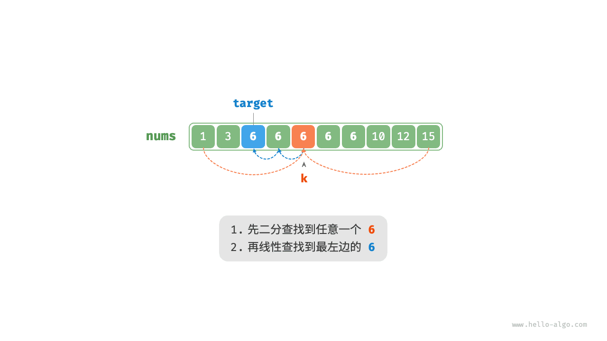

此方法虽然可用，但其包含线性查找，因此时间复杂度为 $O(n)$ 。当数组中存在很多重复的 `target` 时，该方法效率很低。

现考虑拓展二分查找代码。如下图所示，整体流程保持不变，每轮先计算中点索引 $m$ ，再判断 `target` 和 `nums[m]` 的大小关系，分为以下几种情况。

- 当 `nums[m] < target` 或 `nums[m] > target` 时，说明还没有找到 `target` ，因此采用普通二分查找的缩小区间操作，**从而使指针 $i$ 和 $j$ 向 `target` 靠近**。
- 当 `nums[m] == target` 时，说明小于 `target` 的元素在区间 $[i, m - 1]$ 中，因此采用 $j = m - 1$ 来缩小区间，**从而使指针 $j$ 向小于 `target` 的元素靠近**。

循环完成后，$i$ 指向最左边的 `target` ，$j$ 指向首个小于 `target` 的元素，**因此索引 $i$ 就是插入点**。

=== "<1>"
    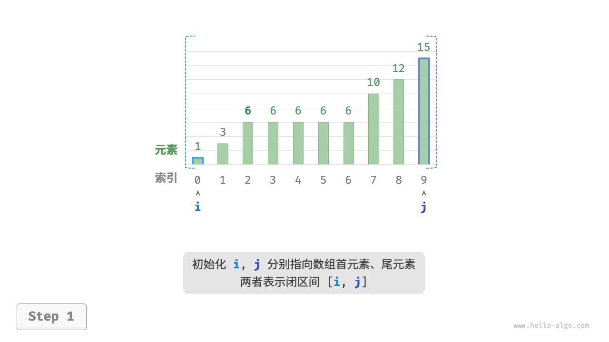

=== "<2>"
    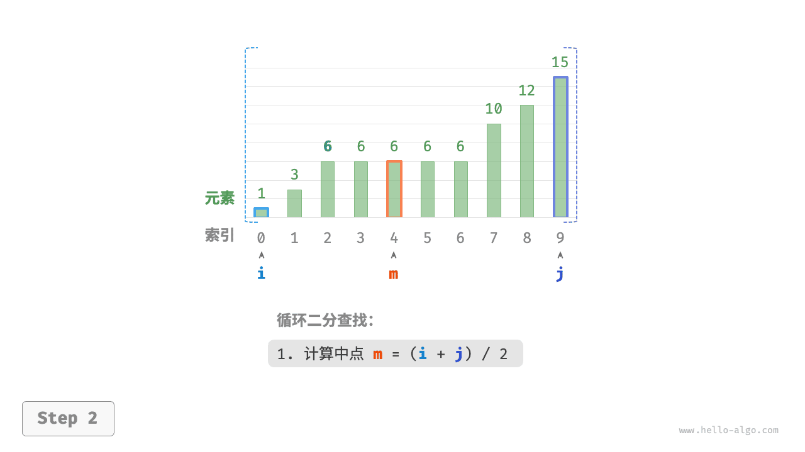

=== "<3>"
    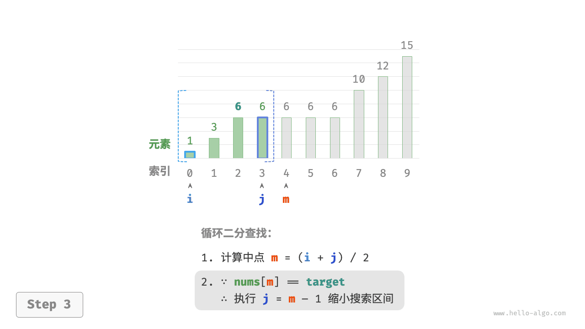

=== "<4>"
    

=== "<5>"
    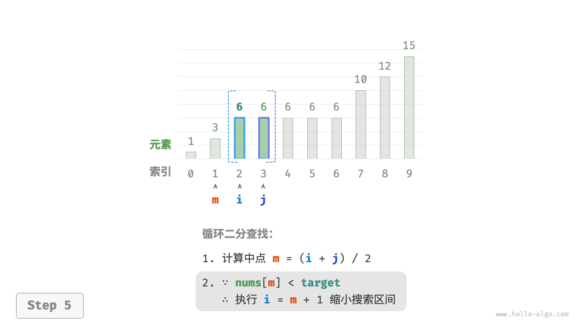

=== "<6>"
    

=== "<7>"
    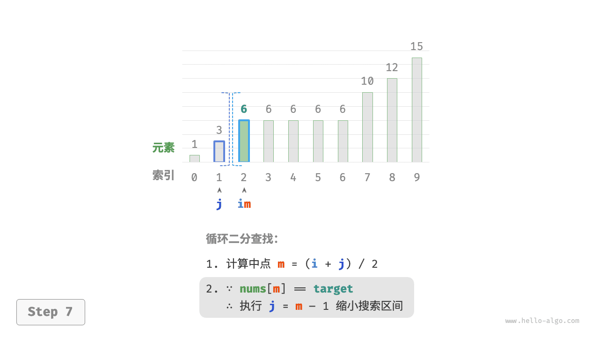

=== "<8>"
    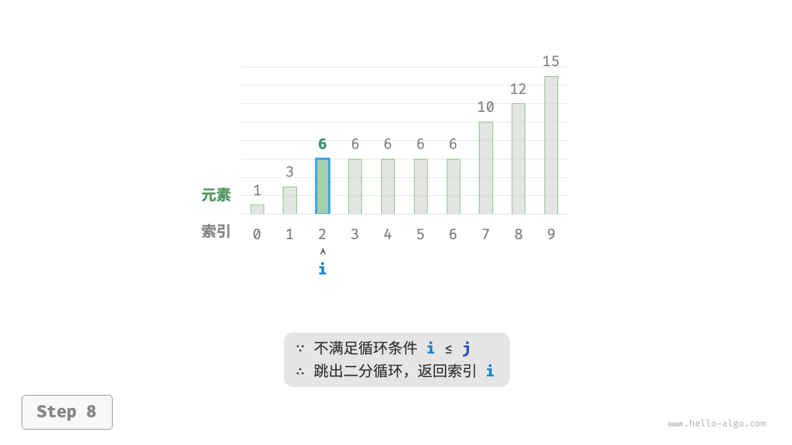

观察以下代码，判断分支 `nums[m] > target` 和 `nums[m] == target` 的操作相同，因此两者可以合并。

即便如此，我们仍然可以将判断条件保持展开，因为其逻辑更加清晰、可读性更好。

```python
def binary_search_insertion(nums: list[int], target: int) -> int:
    """二分查找插入点（存在重复元素）"""
    i, j = 0, len(nums) - 1  # 初始化双闭区间 [0, n-1]
    while i <= j:
        m = (i + j) // 2  # 计算中点索引 m
        if nums[m] < target:
            i = m + 1  # target 在区间 [m+1, j] 中
        elif nums[m] > target:
            j = m - 1  # target 在区间 [i, m-1] 中
        else:
            j = m - 1  # 首个小于 target 的元素在区间 [i, m-1] 中
    # 返回插入点 i
    return i
```

!!! example [pythontutor "可视化运行"](https://pythontutor.com/iframe-embed.html#code=def%20binary_search_insertion%28nums%3A%20list%5Bint%5D,%20target%3A%20int%29%20-%3E%20int%3A%0A%20%20%20%20%22%22%22%E4%BA%8C%E5%88%86%E6%9F%A5%E6%89%BE%E6%8F%92%E5%85%A5%E7%82%B9%EF%BC%88%E5%AD%98%E5%9C%A8%E9%87%8D%E5%A4%8D%E5%85%83%E7%B4%A0%EF%BC%89%22%22%22%0A%20%20%20%20i,%20j%20%3D%200,%20len%28nums%29%20-%201%20%20%23%20%E5%88%9D%E5%A7%8B%E5%8C%96%E5%8F%8C%E9%97%AD%E5%8C%BA%E9%97%B4%20%5B0,%20n-1%5D%0A%20%20%20%20while%20i%20%3C%3D%20j%3A%0A%20%20%20%20%20%20%20%20m%20%3D%20%28i%20%2B%20j%29%20//%202%20%20%23%20%E8%AE%A1%E7%AE%97%E4%B8%AD%E7%82%B9%E7%B4%A2%E5%BC%95%20m%0A%20%20%20%20%20%20%20%20if%20nums%5Bm%5D%20%3C%20target%3A%0A%20%20%20%20%20%20%20%20%20%20%20%20i%20%3D%20m%20%2B%201%20%20%23%20target%20%E5%9C%A8%E5%8C%BA%E9%97%B4%20%5Bm%2B1,%20j%5D%20%E4%B8%AD%0A%20%20%20%20%20%20%20%20elif%20nums%5Bm%5D%20%3E%20target%3A%0A%20%20%20%20%20%20%20%20%20%20%20%20j%20%3D%20m%20-%201%20%20%23%20target%20%E5%9C%A8%E5%8C%BA%E9%97%B4%20%5Bi,%20m-1%5D%20%E4%B8%AD%0A%20%20%20%20%20%20%20%20else%3A%0A%20%20%20%20%20%20%20%20%20%20%20%20j%20%3D%20m%20-%201%20%20%23%20%E9%A6%96%E4%B8%AA%E5%B0%8F%E4%BA%8E%20target%20%E7%9A%84%E5%85%83%E7%B4%A0%E5%9C%A8%E5%8C%BA%E9%97%B4%20%5Bi,%20m-1%5D%20%E4%B8%AD%0A%20%20%20%20%23%20%E8%BF%94%E5%9B%9E%E6%8F%92%E5%85%A5%E7%82%B9%20i%0A%20%20%20%20return%20i%0A%0A%0A%22%22%22Driver%20Code%22%22%22%0Aif%20__name__%20%3D%3D%20%22__main__%22%3A%0A%20%20%20%20%23%20%E5%8C%85%E5%90%AB%E9%87%8D%E5%A4%8D%E5%85%83%E7%B4%A0%E7%9A%84%E6%95%B0%E7%BB%84%0A%20%20%20%20nums%20%3D%20%5B1,%203,%206,%206,%206,%206,%206,%2010,%2012,%2015%5D%0A%20%20%20%20%23%20%E4%BA%8C%E5%88%86%E6%9F%A5%E6%89%BE%E6%8F%92%E5%85%A5%E7%82%B9%0A%20%20%20%20target%20%3D%206%0A%20%20%20%20index%20%3D%20binary_search_insertion%28nums,%20target%29%0A%20%20%20%20print%28f%22%E5%85%83%E7%B4%A0%20%7Btarget%7D%20%E7%9A%84%E6%8F%92%E5%85%A5%E7%82%B9%E7%9A%84%E7%B4%A2%E5%BC%95%E4%B8%BA%20%7Bindex%7D%22%29&codeDivHeight=800&codeDivWidth=600&cumulative=false&curInstr=5&heapPrimitives=nevernest&origin=opt-frontend.js&py=311&rawInputLstJSON=%5B%5D&textReferences=false)

!!! tip

    本节的代码都是“双闭区间”写法。有兴趣的读者可以自行实现“左闭右开”写法。

总的来看，二分查找无非就是给指针 $i$ 和 $j$ 分别设定搜索目标，目标可能是一个具体的元素（例如 `target` ），也可能是一个元素范围（例如小于 `target` 的元素）。

在不断的循环二分中，指针 $i$ 和 $j$ 都逐渐逼近预先设定的目标。最终，它们或是成功找到答案，或是越过边界后停止。

# 二分查找边界

## 查找左边界

!!! question

    给定一个长度为 $n$ 的有序数组 `nums` ，其中可能包含重复元素。请返回数组中最左一个元素 `target` 的索引。若数组中不包含该元素，则返回 $-1$ 。

回忆二分查找插入点的方法，搜索完成后 $i$ 指向最左一个 `target` ，**因此查找插入点本质上是在查找最左一个 `target` 的索引**。

考虑通过查找插入点的函数实现查找左边界。请注意，数组中可能不包含 `target` ，这种情况可能导致以下两种结果。

- 插入点的索引 $i$ 越界。
- 元素 `nums[i]` 与 `target` 不相等。

当遇到以上两种情况时，直接返回 $-1$ 即可。代码如下所示：

```python
def binary_search_left_edge(nums: list[int], target: int) -> int:
    """二分查找最左一个 target"""
    # 等价于查找 target 的插入点
    i = binary_search_insertion(nums, target)
    # 未找到 target ，返回 -1
    if i == len(nums) or nums[i] != target:
        return -1
    # 找到 target ，返回索引 i
    return i
```

!!! example [pythontutor "可视化运行"](https://pythontutor.com/iframe-embed.html#code=def%20binary_search_insertion%28nums%3A%20list%5Bint%5D,%20target%3A%20int%29%20-%3E%20int%3A%0A%20%20%20%20%22%22%22%E4%BA%8C%E5%88%86%E6%9F%A5%E6%89%BE%E6%8F%92%E5%85%A5%E7%82%B9%EF%BC%88%E5%AD%98%E5%9C%A8%E9%87%8D%E5%A4%8D%E5%85%83%E7%B4%A0%EF%BC%89%22%22%22%0A%20%20%20%20i,%20j%20%3D%200,%20len%28nums%29%20-%201%20%20%23%20%E5%88%9D%E5%A7%8B%E5%8C%96%E5%8F%8C%E9%97%AD%E5%8C%BA%E9%97%B4%20%5B0,%20n-1%5D%0A%20%20%20%20while%20i%20%3C%3D%20j%3A%0A%20%20%20%20%20%20%20%20m%20%3D%20%28i%20%2B%20j%29%20//%202%20%20%23%20%E8%AE%A1%E7%AE%97%E4%B8%AD%E7%82%B9%E7%B4%A2%E5%BC%95%20m%0A%20%20%20%20%20%20%20%20if%20nums%5Bm%5D%20%3C%20target%3A%0A%20%20%20%20%20%20%20%20%20%20%20%20i%20%3D%20m%20%2B%201%20%20%23%20target%20%E5%9C%A8%E5%8C%BA%E9%97%B4%20%5Bm%2B1,%20j%5D%20%E4%B8%AD%0A%20%20%20%20%20%20%20%20elif%20nums%5Bm%5D%20%3E%20target%3A%0A%20%20%20%20%20%20%20%20%20%20%20%20j%20%3D%20m%20-%201%20%20%23%20target%20%E5%9C%A8%E5%8C%BA%E9%97%B4%20%5Bi,%20m-1%5D%20%E4%B8%AD%0A%20%20%20%20%20%20%20%20else%3A%0A%20%20%20%20%20%20%20%20%20%20%20%20j%20%3D%20m%20-%201%20%20%23%20%E9%A6%96%E4%B8%AA%E5%B0%8F%E4%BA%8E%20target%20%E7%9A%84%E5%85%83%E7%B4%A0%E5%9C%A8%E5%8C%BA%E9%97%B4%20%5Bi,%20m-1%5D%20%E4%B8%AD%0A%20%20%20%20%23%20%E8%BF%94%E5%9B%9E%E6%8F%92%E5%85%A5%E7%82%B9%20i%0A%20%20%20%20return%20i%0A%0Adef%20binary_search_left_edge%28nums%3A%20list%5Bint%5D,%20target%3A%20int%29%20-%3E%20int%3A%0A%20%20%20%20%22%22%22%E4%BA%8C%E5%88%86%E6%9F%A5%E6%89%BE%E6%9C%80%E5%B7%A6%E4%B8%80%E4%B8%AA%20target%22%22%22%0A%20%20%20%20%23%20%E7%AD%89%E4%BB%B7%E4%BA%8E%E6%9F%A5%E6%89%BE%20target%20%E7%9A%84%E6%8F%92%E5%85%A5%E7%82%B9%0A%20%20%20%20i%20%3D%20binary_search_insertion%28nums,%20target%29%0A%20%20%20%20%23%20%E6%9C%AA%E6%89%BE%E5%88%B0%20target%20%EF%BC%8C%E8%BF%94%E5%9B%9E%20-1%0A%20%20%20%20if%20i%20%3D%3D%20len%28nums%29%20or%20nums%5Bi%5D%20!%3D%20target%3A%0A%20%20%20%20%20%20%20%20return%20-1%0A%20%20%20%20%23%20%E6%89%BE%E5%88%B0%20target%20%EF%BC%8C%E8%BF%94%E5%9B%9E%E7%B4%A2%E5%BC%95%20i%0A%20%20%20%20return%20i%0A%0A%22%22%22Driver%20Code%22%22%22%0Aif%20__name__%20%3D%3D%20%22__main__%22%3A%0A%20%20%20%20%23%20%E5%8C%85%E5%90%AB%E9%87%8D%E5%A4%8D%E5%85%83%E7%B4%A0%E7%9A%84%E6%95%B0%E7%BB%84%0A%20%20%20%20nums%20%3D%20%5B1,%203,%206,%206,%206,%206,%206,%2010,%2012,%2015%5D%0A%20%20%20%20%23%20%E4%BA%8C%E5%88%86%E6%9F%A5%E6%89%BE%E5%B7%A6%E8%BE%B9%E7%95%8C%E5%92%8C%E5%8F%B3%E8%BE%B9%E7%95%8C%0A%20%20%20%20target%20%3D%206%0A%20%20%20%20index%20%3D%20binary_search_left_edge%28nums,%20target%29%0A%20%20%20%20print%28f%22%E6%9C%80%E5%B7%A6%E4%B8%80%E4%B8%AA%E5%85%83%E7%B4%A0%20%7Btarget%7D%20%E7%9A%84%E7%B4%A2%E5%BC%95%E4%B8%BA%20%7Bindex%7D%22%29&codeDivHeight=800&codeDivWidth=600&cumulative=false&curInstr=6&heapPrimitives=nevernest&origin=opt-frontend.js&py=311&rawInputLstJSON=%5B%5D&textReferences=false)

## 查找右边界

那么如何查找最右一个 `target` 呢？最直接的方式是修改代码，替换在 `nums[m] == target` 情况下的指针收缩操作。代码在此省略，有兴趣的读者可以自行实现。

下面我们介绍两种更加取巧的方法。

### 复用查找左边界

实际上，我们可以利用查找最左元素的函数来查找最右元素，具体方法为：**将查找最右一个 `target` 转化为查找最左一个 `target + 1`**。

如下图所示，查找完成后，指针 $i$ 指向最左一个 `target + 1`（如果存在），而 $j$ 指向最右一个 `target` ，**因此返回 $j$ 即可**。

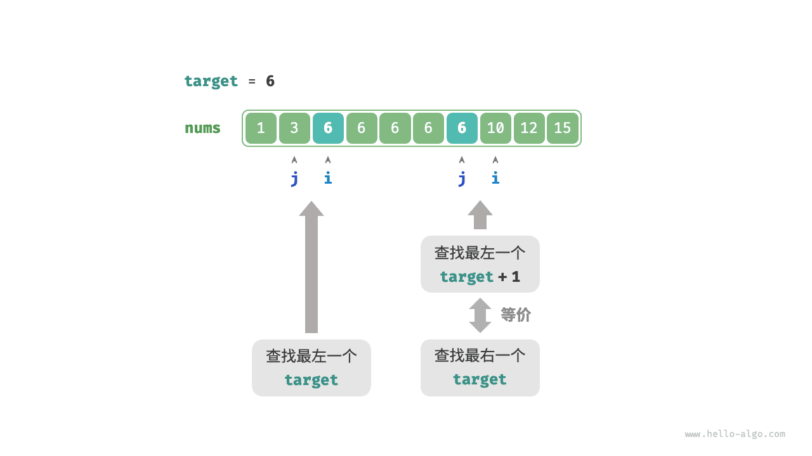

请注意，返回的插入点是 $i$ ，因此需要将其减 $1$ ，从而获得 $j$ ：

```python
def binary_search_right_edge(nums: list[int], target: int) -> int:
    """二分查找最右一个 target"""
    # 转化为查找最左一个 target + 1
    i = binary_search_insertion(nums, target + 1)
    # j 指向最右一个 target ，i 指向首个大于 target 的元素
    j = i - 1
    # 未找到 target ，返回 -1
    if j == -1 or nums[j] != target:
        return -1
    # 找到 target ，返回索引 j
    return j
```

!!! example [pythontutor "可视化运行"](https://pythontutor.com/iframe-embed.html#code=def%20binary_search_insertion%28nums%3A%20list%5Bint%5D,%20target%3A%20int%29%20-%3E%20int%3A%0A%20%20%20%20%22%22%22%E4%BA%8C%E5%88%86%E6%9F%A5%E6%89%BE%E6%8F%92%E5%85%A5%E7%82%B9%EF%BC%88%E5%AD%98%E5%9C%A8%E9%87%8D%E5%A4%8D%E5%85%83%E7%B4%A0%EF%BC%89%22%22%22%0A%20%20%20%20i,%20j%20%3D%200,%20len%28nums%29%20-%201%20%20%23%20%E5%88%9D%E5%A7%8B%E5%8C%96%E5%8F%8C%E9%97%AD%E5%8C%BA%E9%97%B4%20%5B0,%20n-1%5D%0A%20%20%20%20while%20i%20%3C%3D%20j%3A%0A%20%20%20%20%20%20%20%20m%20%3D%20%28i%20%2B%20j%29%20//%202%20%20%23%20%E8%AE%A1%E7%AE%97%E4%B8%AD%E7%82%B9%E7%B4%A2%E5%BC%95%20m%0A%20%20%20%20%20%20%20%20if%20nums%5Bm%5D%20%3C%20target%3A%0A%20%20%20%20%20%20%20%20%20%20%20%20i%20%3D%20m%20%2B%201%20%20%23%20target%20%E5%9C%A8%E5%8C%BA%E9%97%B4%20%5Bm%2B1,%20j%5D%20%E4%B8%AD%0A%20%20%20%20%20%20%20%20elif%20nums%5Bm%5D%20%3E%20target%3A%0A%20%20%20%20%20%20%20%20%20%20%20%20j%20%3D%20m%20-%201%20%20%23%20target%20%E5%9C%A8%E5%8C%BA%E9%97%B4%20%5Bi,%20m-1%5D%20%E4%B8%AD%0A%20%20%20%20%20%20%20%20else%3A%0A%20%20%20%20%20%20%20%20%20%20%20%20j%20%3D%20m%20-%201%20%20%23%20%E9%A6%96%E4%B8%AA%E5%B0%8F%E4%BA%8E%20target%20%E7%9A%84%E5%85%83%E7%B4%A0%E5%9C%A8%E5%8C%BA%E9%97%B4%20%5Bi,%20m-1%5D%20%E4%B8%AD%0A%20%20%20%20%23%20%E8%BF%94%E5%9B%9E%E6%8F%92%E5%85%A5%E7%82%B9%20i%0A%20%20%20%20return%20i%0A%0Adef%20binary_search_right_edge%28nums%3A%20list%5Bint%5D,%20target%3A%20int%29%20-%3E%20int%3A%0A%20%20%20%20%22%22%22%E4%BA%8C%E5%88%86%E6%9F%A5%E6%89%BE%E6%9C%80%E5%8F%B3%E4%B8%80%E4%B8%AA%20target%22%22%22%0A%20%20%20%20%23%20%E8%BD%AC%E5%8C%96%E4%B8%BA%E6%9F%A5%E6%89%BE%E6%9C%80%E5%B7%A6%E4%B8%80%E4%B8%AA%20target%20%2B%201%0A%20%20%20%20i%20%3D%20binary_search_insertion%28nums,%20target%20%2B%201%29%0A%20%20%20%20%23%20j%20%E6%8C%87%E5%90%91%E6%9C%80%E5%8F%B3%E4%B8%80%E4%B8%AA%20target%20%EF%BC%8Ci%20%E6%8C%87%E5%90%91%E9%A6%96%E4%B8%AA%E5%A4%A7%E4%BA%8E%20target%20%E7%9A%84%E5%85%83%E7%B4%A0%0A%20%20%20%20j%20%3D%20i%20-%201%0A%20%20%20%20%23%20%E6%9C%AA%E6%89%BE%E5%88%B0%20target%20%EF%BC%8C%E8%BF%94%E5%9B%9E%20-1%0A%20%20%20%20if%20j%20%3D%3D%20-1%20or%20nums%5Bj%5D%20!%3D%20target%3A%0A%20%20%20%20%20%20%20%20return%20-1%0A%20%20%20%20%23%20%E6%89%BE%E5%88%B0%20target%20%EF%BC%8C%E8%BF%94%E5%9B%9E%E7%B4%A2%E5%BC%95%20j%0A%20%20%20%20return%20j%0A%0A%22%22%22Driver%20Code%22%22%22%0Aif%20__name__%20%3D%3D%20%22__main__%22%3A%0A%20%20%20%20%23%20%E5%8C%85%E5%90%AB%E9%87%8D%E5%A4%8D%E5%85%83%E7%B4%A0%E7%9A%84%E6%95%B0%E7%BB%84%0A%20%20%20%20nums%20%3D%20%5B1,%203,%206,%206,%206,%206,%206,%2010,%2012,%2015%5D%0A%20%20%20%20%23%20%E4%BA%8C%E5%88%86%E6%9F%A5%E6%89%BE%E5%B7%A6%E8%BE%B9%E7%95%8C%E5%92%8C%E5%8F%B3%E8%BE%B9%E7%95%8C%0A%20%20%20%20target%20%3D%206%0A%20%20%20%20index%20%3D%20binary_search_right_edge%28nums,%20target%29%0A%20%20%20%20print%28f%22%E6%9C%80%E5%8F%B3%E4%B8%80%E4%B8%AA%E5%85%83%E7%B4%A0%20%7Btarget%7D%20%E7%9A%84%E7%B4%A2%E5%BC%95%E4%B8%BA%20%7Bindex%7D%22%29&codeDivHeight=800&codeDivWidth=600&cumulative=false&curInstr=6&heapPrimitives=nevernest&origin=opt-frontend.js&py=311&rawInputLstJSON=%5B%5D&textReferences=false)

### 转化为查找元素

我们知道，当数组不包含 `target` 时，最终 $i$ 和 $j$ 会分别指向首个大于、小于 `target` 的元素。

因此，如下图所示，我们可以构造一个数组中不存在的元素，用于查找左右边界。

- 查找最左一个 `target` ：可以转化为查找 `target - 0.5` ，并返回指针 $i$ 。
- 查找最右一个 `target` ：可以转化为查找 `target + 0.5` ，并返回指针 $j$ 。


代码在此省略，以下两点值得注意。

- 给定数组不包含小数，这意味着我们无须关心如何处理相等的情况。
- 因为该方法引入了小数，所以需要将函数中的变量 `target` 改为浮点数类型（Python 无须改动）。

# 哈希优化策略

在算法题中，**我们常通过将线性查找替换为哈希查找来降低算法的时间复杂度**。我们借助一个算法题来加深理解。

!!! question

    给定一个整数数组 `nums` 和一个目标元素 `target` ，请在数组中搜索“和”为 `target` 的两个元素，并返回它们的数组索引。返回任意一个解即可。

## 线性查找：以时间换空间

考虑直接遍历所有可能的组合。如下图所示，我们开启一个两层循环，在每轮中判断两个整数的和是否为 `target` ，若是，则返回它们的索引。

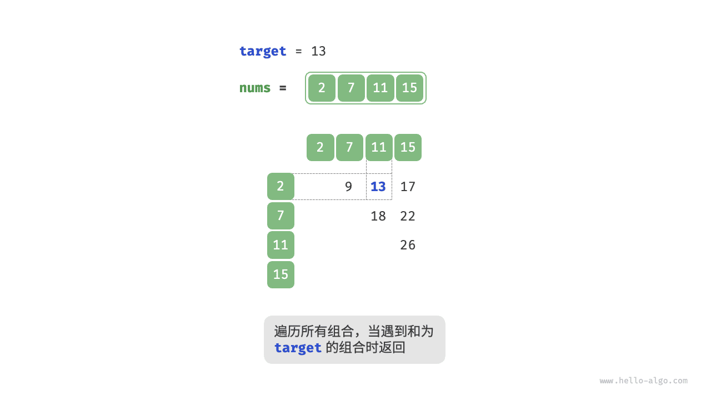

代码如下所示：

```python
def two_sum_brute_force(nums: list[int], target: int) -> list[int]:
    """方法一：暴力枚举"""
    # 两层循环，时间复杂度为 O(n^2)
    for i in range(len(nums) - 1):
        for j in range(i + 1, len(nums)):
            if nums[i] + nums[j] == target:
                return [i, j]
    return []
```

!!! example [pythontutor "可视化运行"](https://pythontutor.com/iframe-embed.html#code=def%20two_sum_brute_force%28nums%3A%20list%5Bint%5D,%20target%3A%20int%29%20-%3E%20list%5Bint%5D%3A%0A%20%20%20%20%22%22%22%E6%96%B9%E6%B3%95%E4%B8%80%EF%BC%9A%E6%9A%B4%E5%8A%9B%E6%9E%9A%E4%B8%BE%22%22%22%0A%20%20%20%20%23%20%E4%B8%A4%E5%B1%82%E5%BE%AA%E7%8E%AF%EF%BC%8C%E6%97%B6%E9%97%B4%E5%A4%8D%E6%9D%82%E5%BA%A6%E4%B8%BA%20O%28n%5E2%29%0A%20%20%20%20for%20i%20in%20range%28len%28nums%29%20-%201%29%3A%0A%20%20%20%20%20%20%20%20for%20j%20in%20range%28i%20%2B%201,%20len%28nums%29%29%3A%0A%20%20%20%20%20%20%20%20%20%20%20%20if%20nums%5Bi%5D%20%2B%20nums%5Bj%5D%20%3D%3D%20target%3A%0A%20%20%20%20%20%20%20%20%20%20%20%20%20%20%20%20return%20%5Bi,%20j%5D%0A%20%20%20%20return%20%5B%5D%0A%0A%22%22%22Driver%20Code%22%22%22%0Aif%20__name__%20%3D%3D%20%22__main__%22%3A%0A%20%20%20%20nums%20%3D%20%5B2,%207,%2011,%2015%5D%0A%20%20%20%20target%20%3D%2013%0A%20%20%20%20res%20%3D%20two_sum_brute_force%28nums,%20target%29&codeDivHeight=800&codeDivWidth=600&cumulative=false&curInstr=5&heapPrimitives=nevernest&origin=opt-frontend.js&py=311&rawInputLstJSON=%5B%5D&textReferences=false)

此方法的时间复杂度为 $O(n^2)$ ，空间复杂度为 $O(1)$ ，在大数据量下非常耗时。

## 哈希查找：以空间换时间

考虑借助一个哈希表，键值对分别为数组元素和元素索引。循环遍历数组，每轮执行下图所示的步骤。

1. 判断数字 `target - nums[i]` 是否在哈希表中，若是，则直接返回这两个元素的索引。
2. 将键值对 `nums[i]` 和索引 `i` 添加进哈希表。

=== "<1>"
    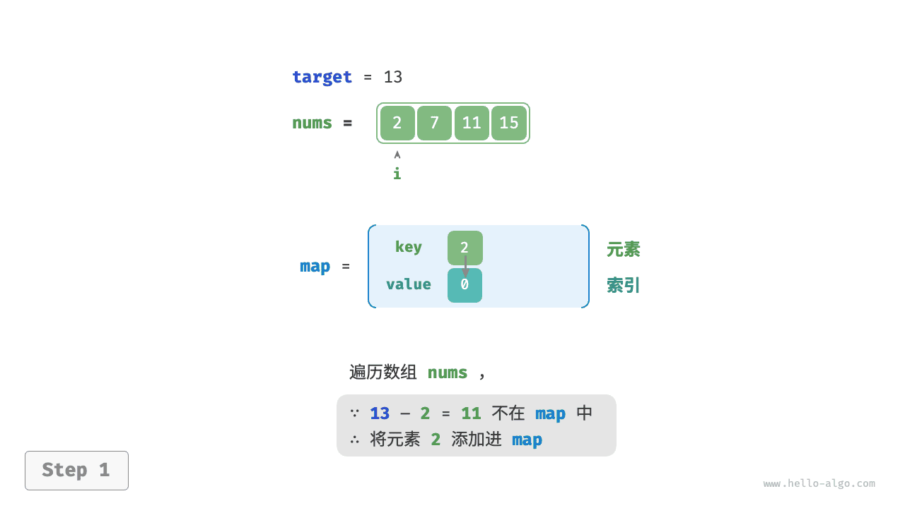

=== "<2>"
    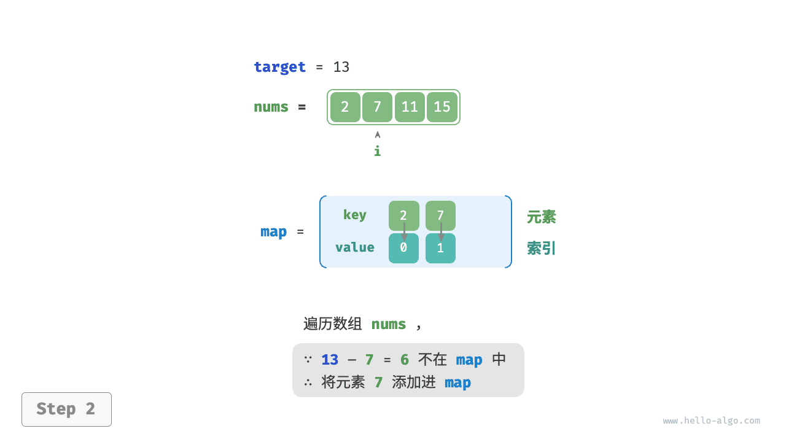

=== "<3>"
    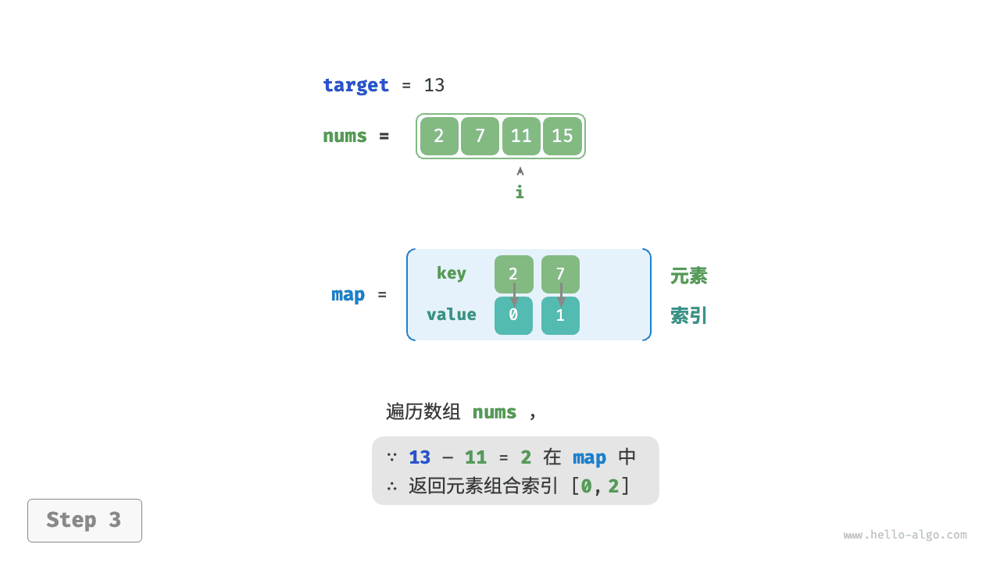

实现代码如下所示，仅需单层循环即可：

```python
def two_sum_hash_table(nums: list[int], target: int) -> list[int]:
    """方法二：辅助哈希表"""
    # 辅助哈希表，空间复杂度为 O(n)
    dic = {}
    # 单层循环，时间复杂度为 O(n)
    for i in range(len(nums)):
        if target - nums[i] in dic:
            return [dic[target - nums[i]], i]
        dic[nums[i]] = i
    return []
```

!!! example [pythontutor "可视化运行"](https://pythontutor.com/iframe-embed.html#code=def%20two_sum_hash_table%28nums%3A%20list%5Bint%5D,%20target%3A%20int%29%20-%3E%20list%5Bint%5D%3A%0A%20%20%20%20%22%22%22%E6%96%B9%E6%B3%95%E4%BA%8C%EF%BC%9A%E8%BE%85%E5%8A%A9%E5%93%88%E5%B8%8C%E8%A1%A8%22%22%22%0A%20%20%20%20%23%20%E8%BE%85%E5%8A%A9%E5%93%88%E5%B8%8C%E8%A1%A8%EF%BC%8C%E7%A9%BA%E9%97%B4%E5%A4%8D%E6%9D%82%E5%BA%A6%E4%B8%BA%20O%28n%29%0A%20%20%20%20dic%20%3D%20%7B%7D%0A%20%20%20%20%23%20%E5%8D%95%E5%B1%82%E5%BE%AA%E7%8E%AF%EF%BC%8C%E6%97%B6%E9%97%B4%E5%A4%8D%E6%9D%82%E5%BA%A6%E4%B8%BA%20O%28n%29%0A%20%20%20%20for%20i%20in%20range%28len%28nums%29%29%3A%0A%20%20%20%20%20%20%20%20if%20target%20-%20nums%5Bi%5D%20in%20dic%3A%0A%20%20%20%20%20%20%20%20%20%20%20%20return%20%5Bdic%5Btarget%20-%20nums%5Bi%5D%5D,%20i%5D%0A%20%20%20%20%20%20%20%20dic%5Bnums%5Bi%5D%5D%20%3D%20i%0A%20%20%20%20return%20%5B%5D%0A%0A%22%22%22Driver%20Code%22%22%22%0Aif%20__name__%20%3D%3D%20%22__main__%22%3A%0A%20%20%20%20nums%20%3D%20%5B2,%207,%2011,%2015%5D%0A%20%20%20%20target%20%3D%2013%0A%20%20%20%20res%20%3D%20two_sum_hash_table%28nums,%20target%29&codeDivHeight=800&codeDivWidth=600&cumulative=false&curInstr=5&heapPrimitives=nevernest&origin=opt-frontend.js&py=311&rawInputLstJSON=%5B%5D&textReferences=false)

此方法通过哈希查找将时间复杂度从 $O(n^2)$ 降至 $O(n)$ ，大幅提升运行效率。

由于需要维护一个额外的哈希表，因此空间复杂度为 $O(n)$ 。**尽管如此，该方法的整体时空效率更为均衡，因此它是本题的最优解法**。


# 小结

### 重点回顾

- 二分查找依赖数据的有序性，通过循环逐步缩减一半搜索区间来进行查找。它要求输入数据有序，且仅适用于数组或基于数组实现的数据结构。
- 暴力搜索通过遍历数据结构来定位数据。线性搜索适用于数组和链表，广度优先搜索和深度优先搜索适用于图和树。此类算法通用性好，无须对数据进行预处理，但时间复杂度 $O(n)$ 较高。
- 哈希查找、树查找和二分查找属于高效搜索方法，可在特定数据结构中快速定位目标元素。此类算法效率高，时间复杂度可达 $O(\log n)$ 甚至 $O(1)$ ，但通常需要借助额外数据结构。
- 实际中，我们需要对数据规模、搜索性能要求、数据查询和更新频率等因素进行具体分析，从而选择合适的搜索方法。
- 线性搜索适用于小型或频繁更新的数据；二分查找适用于大型、排序的数据；哈希查找适用于对查询效率要求较高且无须范围查询的数据；树查找适用于需要维护顺序和支持范围查询的大型动态数据。
- 用哈希查找替换线性查找是一种常用的优化运行时间的策略，可将时间复杂度从 $O(n)$ 降至 $O(1)$ 。
