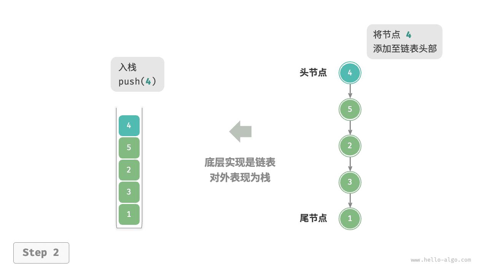
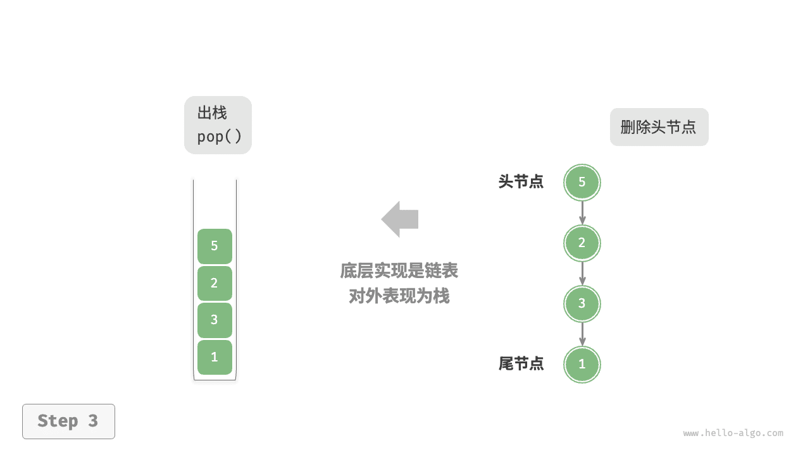
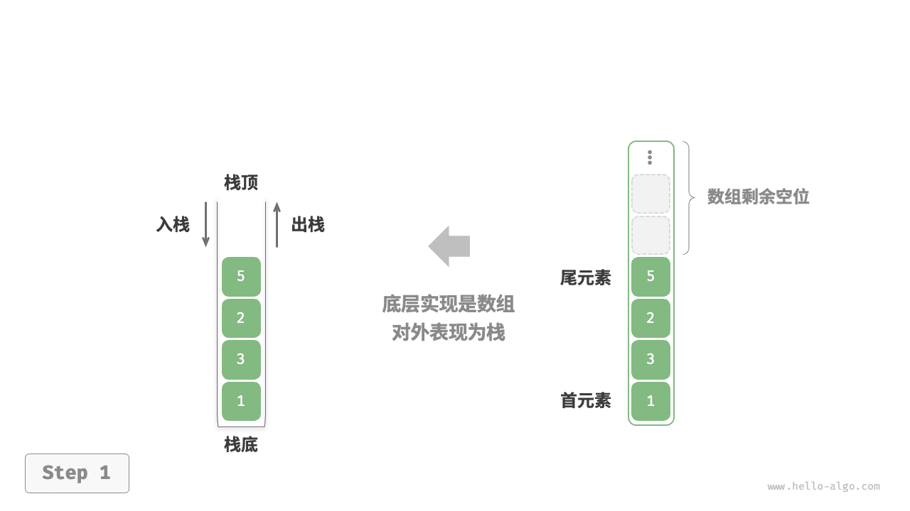
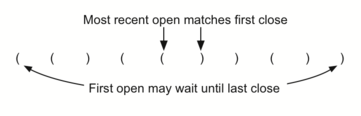
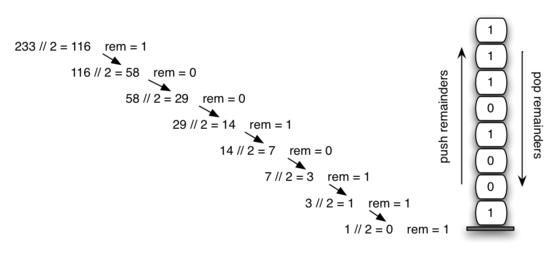
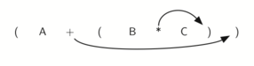
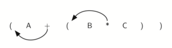

# 后入先出

<u>栈（stack）</u>是一种遵循后入先出逻辑的线性数据结构。

我们可以将栈类比为桌面上的一摞盘子，规定每次只能移动一个盘子，那么想取出底部的盘子，则需要先将上面的盘子依次移走。我们将盘子替换为各种类型的元素（如整数、字符、对象等），就得到了栈这种数据结构。

如下图所示，我们把堆叠元素的顶部称为“栈顶”，底部称为“栈底”。将把元素添加到栈顶的操作叫作“入栈”，删除栈顶元素的操作叫作“出栈”。


!!! note The Stack Abstract Data Type

    栈抽象数据类型通过以下结构和操作来定义。如上所述，栈是一种有序的项集合，其中项被添加到被称为“顶端”的一端，也从这一端移除。栈是按照后进先出（LIFO）的顺序排列的。下面给出了栈的操作。

    > The stack abstract data type is defined by the following structure and operations. A stack is structured, as described above, as an ordered collection of items where items are added to and removed from the end called the “top.” Stacks are ordered LIFO. The stack operations are given below.

    - `Stack()` creates a new stack that is empty. It needs no parameters and returns an empty stack.
    - `push(item)` adds a new item to the top of the stack. It needs the item and returns nothing.
    - `pop()` removes the top item from the stack. It needs no parameters and returns the item. The stack is modified.
    - `peek()` returns the top item from the stack but does not remove it. It needs no parameters. The stack is not modified.
    - `isEmpty()` tests to see whether the stack is empty. It needs no parameters and returns a boolean value.
    - `size()` returns the number of items on the stack. It needs no parameters and returns an integer.

    For example, if `s` is a stack that has been created and starts out empty, then Table 1 shows the results of a sequence of stack operations. Under stack contents, the top item is listed at the far right.


!!! note Table 1: Sample Stack Operations

    | **Stack Operation** | **Stack Contents**   | **Return Value** |
    | :------------------ | :------------------- | :--------------- |
    | `s.isEmpty()`       | `[]`                 | `True`           |
    | `s.push(4)`         | `[4]`                |                  |
    | `s.push('dog')`     | `[4,'dog']`          |                  |
    | `s.peek()`          | `[4,'dog']`          | `'dog'`          |
    | `s.push(True)`      | `[4,'dog',True]`     |                  |
    | `s.size()`          | `[4,'dog',True]`     | `3`              |
    | `s.isEmpty()`       | `[4,'dog',True]`     | `False`          |
    | `s.push(8.4)`       | `[4,'dog',True,8.4]` |                  |
    | `s.pop()`           | `[4,'dog',True]`     | `8.4`            |
    | `s.pop()`           | `[4,'dog']`          | `True`           |
    | `s.size()`          | `[4,'dog']`          | `2`              |


## 1. 栈的常用操作

栈的常用操作如下表所示，具体的方法名需要根据所使用的编程语言来确定。在此，我们以常见的 `push()`、`pop()`、`peek()` 命名为例。

<p align="center"> 表 1 &nbsp; 栈的操作效率 </p>

| 方法     | 描述                   | 时间复杂度 |
| -------- | ---------------------- | ---------- |
| `push()` | 元素入栈（添加至栈顶） | $O(1)$     |
| `pop()`  | 栈顶元素出栈           | $O(1)$     |
| `peek()` | 访问栈顶元素           | $O(1)$     |

通常情况下，我们可以直接使用编程语言内置的栈类。然而，某些语言可能没有专门提供栈类，这时我们可以将该语言的“数组”或“链表”当作栈来使用，并在程序逻辑上忽略与栈无关的操作。

```python title="stack.py"
# 初始化栈
# Python 没有内置的栈类，可以把 list 当作栈来使用
stack: list[int] = []

# 元素入栈 - 在列表末尾添加元素，对应栈的push操作
stack.append(1)
stack.append(3)
stack.append(2)
stack.append(5)
stack.append(4)

# 访问栈顶元素 - 访问列表最后一个元素，对应栈的peek操作
peek: int = stack[-1]

# 元素出栈 - 移除并返回列表最后一个元素，对应栈的pop操作
pop: int = stack.pop()

# 获取栈的长度 - 获取列表长度，对应栈的size操作
size: int = len(stack)

# 判断是否为空 - 检查列表长度是否为0，对应栈的isEmpty操作
is_empty: bool = len(stack) == 0

# 测试代码
if __name__ == "__main__":
    # 初始化栈
    # Python 没有内置的栈类，可以把 list 当作栈来使用
    stack = []

    # 元素入栈
    stack.append(1)
    stack.append(3)
    stack.append(2)
    stack.append(5)
    stack.append(4)
    print("栈 stack =", stack)

    # 访问栈顶元素
    peek = stack[-1]
    print("栈顶元素 peek =", peek)

    # 元素出栈
    pop = stack.pop()
    print("出栈元素 pop =", pop)
    print("出栈后 stack =", stack)

    # 获取栈的长度
    size = len(stack)
    print("栈的长度 size =", size)

    # 判断是否为空
    is_empty = len(stack) == 0
    print("栈是否为空 =", is_empty)
```

## 2. 栈的实现

为了深入了解栈的运行机制，我们来尝试自己实现一个栈类。

栈遵循后入先出的原则，因此我们只能在栈顶添加或删除元素。然而，数组和链表都可以在任意位置添加和删除元素，**因此栈可以视为一种受限制的数组或链表**。换句话说，我们可以“屏蔽”数组或链表的部分无关操作，使其对外表现的逻辑符合栈的特性。

### 2.1 基于链表的实现

使用链表实现栈时，我们可以将链表的头节点视为栈顶，尾节点视为栈底。

如下图所示，对于入栈操作，我们只需将元素插入链表头部，这种节点插入方法被称为“头插法”。而对于出栈操作，只需将头节点从链表中删除即可。

=== "LinkedListStack"
    

=== "push()"
    

=== "pop()"
    

以下是基于链表实现栈的示例代码：

```python
class ListNode:
    """链表节点类"""
    def __init__(self, val: int):
        self.val: int = val  # 节点值
        self.next: ListNode | None = None  # 后继节点引用


class LinkedListStack:
    """基于链表实现的栈"""

    def __init__(self):
        """构造方法"""
        self._peek: ListNode | None = None  # 栈顶指针
        self._size: int = 0  # 栈的大小

    def size(self) -> int:
        """获取栈的长度"""
        return self._size

    def is_empty(self) -> bool:
        """判断栈是否为空"""
        return self._size == 0

    def push(self, val: int):
        """入栈操作"""
        # 创建新节点
        node = ListNode(val)
        # 将新节点的next指向当前栈顶
        node.next = self._peek
        # 更新栈顶指针为新节点
        self._peek = node
        # 栈大小加1
        self._size += 1

    def pop(self) -> int:
        """出栈操作"""
        # 先获取栈顶元素（会检查栈是否为空）
        num = self.peek()
        # 更新栈顶指针为下一个节点
        self._peek = self._peek.next
        # 栈大小减1
        self._size -= 1
        # 返回栈顶元素
        return num

    def peek(self) -> int:
        """访问栈顶元素"""
        if self.is_empty():
            raise IndexError("栈为空")
        return self._peek.val

    def to_list(self) -> list[int]:
        """转化为列表用于打印"""
        arr = []
        node = self._peek
        # 从栈顶遍历到栈底
        while node:
            arr.append(node.val)
            node = node.next
        # 反转列表，使栈底元素在前
        arr.reverse()
        return arr


# 测试代码
if __name__ == "__main__":
    # 创建链表栈
    stack = LinkedListStack()
    
    # 入栈操作
    stack.push(1)
    stack.push(3)
    stack.push(2)
    stack.push(5)
    stack.push(4)
    print("栈 stack =", stack.to_list())
    
    # 访问栈顶元素
    print("栈顶元素 peek =", stack.peek())
    
    # 出栈操作
    print("出栈元素 pop =", stack.pop())
    print("出栈后 stack =", stack.to_list())
    
    # 获取栈的长度
    print("栈的长度 size =", stack.size())
    
    # 判断是否为空
    print("栈是否为空 =", stack.is_empty())
```

### 2.2 基于数组的实现

使用数组实现栈时，我们可以将数组的尾部作为栈顶。如下图所示，入栈与出栈操作分别对应在数组尾部添加元素与删除元素，时间复杂度都为 $O(1)$ 。

=== "ArrayStack"
    

=== "push()"
    

=== "pop()"
    

由于入栈的元素可能会源源不断地增加，因此我们可以使用动态数组，这样就无须自行处理数组扩容问题。以下为示例代码：

```python
class ArrayStack:
    """基于数组实现的栈"""

    def __init__(self):
        """构造方法"""
        self._stack: list[int] = []  # 使用列表作为底层存储

    def size(self) -> int:
        """获取栈的长度"""
        return len(self._stack)

    def is_empty(self) -> bool:
        """判断栈是否为空"""
        return self.size() == 0

    def push(self, item: int):
        """入栈操作"""
        # 在数组尾部添加元素
        self._stack.append(item)

    def pop(self) -> int:
        """出栈操作"""
        if self.is_empty():
            raise IndexError("栈为空")
        # 移除并返回数组尾部元素
        return self._stack.pop()

    def peek(self) -> int:
        """访问栈顶元素"""
        if self.is_empty():
            raise IndexError("栈为空")
        # 返回数组最后一个元素
        return self._stack[-1]

    def to_list(self) -> list[int]:
        """返回列表用于打印"""
        return self._stack


# 测试代码
if __name__ == "__main__":
    # 创建数组栈
    stack = ArrayStack()
    
    # 入栈操作
    stack.push(1)
    stack.push(3)
    stack.push(2)
    stack.push(5)
    stack.push(4)
    print("栈 stack =", stack.to_list())
    
    # 访问栈顶元素
    print("栈顶元素 peek =", stack.peek())
    
    # 出栈操作
    print("出栈元素 pop =", stack.pop())
    print("出栈后 stack =", stack.to_list())
    
    # 获取栈的长度
    print("栈的长度 size =", stack.size())
    
    # 判断是否为空
    print("栈是否为空 =", stack.is_empty())
```

## 3. 两种实现对比

**支持操作**

两种实现都支持栈定义中的各项操作。数组实现额外支持随机访问，但这已超出了栈的定义范畴，因此一般不会用到。

**时间效率**

在基于数组的实现中，入栈和出栈操作都在预先分配好的连续内存中进行，具有很好的缓存本地性，因此效率较高。然而，如果入栈时超出数组容量，会触发扩容机制，导致该次入栈操作的时间复杂度变为 $O(n)$ 。

在基于链表的实现中，链表的扩容非常灵活，不存在上述数组扩容时效率降低的问题。但是，入栈操作需要初始化节点对象并修改指针，因此效率相对较低。不过，如果入栈元素本身就是节点对象，那么可以省去初始化步骤，从而提高效率。

综上所述，当入栈与出栈操作的元素是基本数据类型时，例如 `int` 或 `double` ，我们可以得出以下结论。

- 基于数组实现的栈在触发扩容时效率会降低，但由于扩容是低频操作，因此平均效率更高。
- 基于链表实现的栈可以提供更加稳定的效率表现。

**空间效率**

在初始化列表时，系统会为列表分配“初始容量”，该容量可能超出实际需求；并且，扩容机制通常是按照特定倍率（例如 2 倍）进行扩容的，扩容后的容量也可能超出实际需求。因此，**基于数组实现的栈可能造成一定的空间浪费**。

然而，由于链表节点需要额外存储指针，**因此链表节点占用的空间相对较大**。

综上，我们不能简单地确定哪种实现更加节省内存，需要针对具体情况进行分析。

!!! note 栈的典型应用

    - **浏览器中的后退与前进、软件中的撤销与反撤销**。每当我们打开新的网页，浏览器就会对上一个网页执行入栈，这样我们就可以通过后退操作回到上一个网页。后退操作实际上是在执行出栈。如果要同时支持后退和前进，那么需要两个栈来配合实现。
    - **程序内存管理**。每次调用函数时，系统都会在栈顶添加一个栈帧，用于记录函数的上下文信息。在递归函数中，向下递推阶段会不断执行入栈操作，而向上回溯阶段则会不断执行出栈操作。


## 4. 栈的应用

### 4.1 匹配括号

我们现在将注意力转向使用栈来解决真正的计算机科学问题。毫无疑问，你已经写过诸如`(5+6)∗(7+8)/(4+3)`这样的算术表达式，其中使用了括号来安排操作的执行顺序。

括号必须以平衡的方式出现。**平衡的括号**意味着每个开符号都有一个对应的闭符号，并且括号对是正确嵌套的。考虑以下正确平衡的括号字符串：

```
(()()()())

((((())))

(()((())()))
```

Compare those with the following, which are not balanced:

```
((((((())

()))

(()()(()
```

区分括号是否正确平衡是识别许多编程语言结构的重要部分。

!!! example
    
    接下来的挑战是编写一个算法，该算法能够从左到右读取一串括号，并判断这些符号是否平衡。
    
    为了解决这个问题，我们需要做一个重要的观察。当你从左到右处理符号时，最近的开括号必须与下一个闭括号匹配。同时，第一个被处理的开括号可能需要等到最后一个符号才能找到它的匹配项。<mark>闭括号与开括号的匹配顺序与其出现顺序相反</mark>，它们从内到外进行匹配。这一点提示我们可以使用栈来解决这个问题。

!!! note Matching Parentheses
    


```python
# 判断括号字符串是否平衡
def par_checker(symbol_string):
    s = []  # 使用列表作为栈
    balanced = True
    index = 0
    while index < len(symbol_string) and balanced:
        symbol = symbol_string[index]
        if symbol == "(":
            s.append(symbol)  # 左括号入栈
        else:
            # 如果栈为空，说明没有对应的左括号
            if not s:
                balanced = False
            else:
                s.pop()  # 弹出栈顶的左括号
        index = index + 1
    
    # 最终栈为空且balanced为True，说明括号平衡
    if balanced and not s:
        return True
    else:
        return False

# 测试
print(par_checker('((()))'))  # True
print(par_checker('(()'))    # False

# 测试代码
if __name__ == "__main__":
    test_cases = [
        '((()))',  # 平衡
        '(()',     # 不平衡
        '())',     # 不平衡
        '()()()',  # 平衡
        '((())',   # 不平衡
        '(()())'   # 平衡
    ]
    for test in test_cases:
        print(f"'{test}' 是否平衡: {par_checker(test)}")
```


### 4.1.1 示例E20.有效的括号

stack, https://leetcode.cn/problems/valid-parentheses/

给定一个只包括 `'('`，`')'`，`'{'`，`'}'`，`'['`，`']'` 的字符串 `s` ，判断字符串是否有效。

有效字符串需满足：

1. 左括号必须用相同类型的右括号闭合。
2. 左括号必须以正确的顺序闭合。
3. 每个右括号都有一个对应的相同类型的左括号。


**示例 1：**

**输入：**s = "()"

**输出：**true

**示例 2：**

**输入：**s = "()[]{}"

**输出：**true

**示例 3：**

**输入：**s = "(]"

**输出：**false

**示例 4：**

**输入：**s = "([])"

**输出：**true


**提示：**

- `1 <= s.length <= 10^4`
- `s` 仅由括号 `'()[]{}'` 组成


```python
from typing import List
class Solution:
    def isValid(self, s: str) -> bool:
        stack = []  # 用于存储左括号的栈
        for c in s:
            # 如果是左括号，入栈
            if c == '(' or c == '[' or c == '{':
                stack.append(c)
            else:
                # 如果栈为空，说明没有对应的左括号
                if not stack:
                    return False
                # 检查括号是否匹配
                if c == ')' and stack[-1] != '(':
                    return False
                if c == ']' and stack[-1] != '[':
                    return False
                if c == '}' and stack[-1] != '{':
                    return False
                # 匹配成功，弹出左括号
                stack.pop()
        # 最终栈为空，说明所有括号都匹配
        return not stack

# 测试
if __name__ == "__main__":
    solution = Solution()
    print(solution.isValid("()"))       # true
    print(solution.isValid("()[]{}"))   # true
    print(solution.isValid("(]"))       # false
    print(solution.isValid("([])"))     # true
```


### 4.1.2 Balanced Symbols (A General Case)

上述的平衡括号问题是出现在许多编程语言中的一种更普遍情况的具体案例。平衡和嵌套不同类型的开符号和闭符号的一般问题频繁出现。例如，在Python中，方括号`[`和`]`用于列表；花括号`{`和`}`用于字典；圆括号`(`和`)`用于元组和算术表达式。只要每种符号都保持自身的开和关关系，就可以混合使用这些符号。例如，如下所示的符号字符串：

```
{ { ( [ ] [ ] ) } ( ) }

[ [ { { ( ( ) ) } } ] ]

[ ] [ ] [ ] ( ) { }
```

are properly balanced in that not only does each opening symbol have a corresponding closing symbol, but the types of symbols match as well.

Compare those with the following strings that are not balanced:

```
( [ ) ]

( ( ( ) ] ) )

[ { ( ) ]
```

从前一节的简单括号检查器可以很容易地扩展来处理这些新的符号类型。回想一下，每个开符号只是简单地压入栈中，等待匹配的闭符号稍后在序列中出现。当一个闭符号确实出现时，唯一的区别是我们必须检查它是否正确匹配栈顶的开符号类型。如果这两个符号不匹配，那么字符串就不平衡。再次强调，如果整个字符串都被处理且栈中没有剩下任何未匹配的符号，那么该字符串就是正确平衡的。


```python
# 判断多种括号是否平衡
def par_checker(symbol_string):
    s = []  # 使用列表作为栈
    balanced = True
    index = 0 
    while index < len(symbol_string) and balanced:
        symbol = symbol_string[index] 
        if symbol in "([{":
            s.append(symbol)  # 左括号入栈
        else:
            # 如果栈为空，说明没有对应的左括号
            if not s:
                balanced = False
            else:
                top = s.pop()  # 弹出栈顶的左括号
                if not matches(top, symbol):  # 检查是否匹配
                    balanced = False
        index += 1
    
    # 最终栈为空且balanced为True，说明括号平衡
    if balanced and not s:
        return True 
    else:
        return False
        
def matches(open, close):
    """检查括号是否匹配"""
    opens = "([{"
    closes = ")]}"
    return opens.index(open) == closes.index(close)

# 测试
print(par_checker('{{}}[]]'))  # False

# 测试代码
if __name__ == "__main__":
    test_cases = [
        '{ { ( [ ] [ ] ) } ( ) }',  # 平衡
        '[ [ { { ( ( ) ) } } ] ]',  # 平衡
        '[ ] [ ] [ ] ( ) { }',       # 平衡
        '( [ ) ]',                   # 不平衡
        '( ( ( ) ] ) )',             # 不平衡
        '[ { ( ) ]',                 # 不平衡
        '{{}}[]]'                    # 不平衡
    ]
    for test in test_cases:
        print(f"'{test}' 是否平衡: {par_checker(test)}")
```


#### 4.1.3 示例OJ03704: 括号匹配问题

stack, http://cs101.openjudge.cn/practice/03704

在某个字符串（长度不超过100）中有左括号、右括号和大小写字母；规定（与常见的算数式子一样）任何一个左括号都从内到外与在它右边且距离最近的右括号匹配。写一个程序，找到无法匹配的左括号和右括号，输出原来字符串，并在下一行标出不能匹配的括号。不能匹配的左括号用"$"标注，不能匹配的右括号用"?"标注.

**输入**

输入包括多组数据，每组数据一行，包含一个字符串，只包含左右括号和大小写字母，**字符串长度不超过100**
**注意：cin.getline(str,100)最多只能输入99个字符！**

**输出**

对每组输出数据，输出两行，第一行包含原始输入字符，第二行由"\$"，"?"和空格组成，"$"和"?"表示与之对应的左括号和右括号不能匹配。

样例输入

```
((ABCD(x)
)(rttyy())sss)(
```

样例输出

```
((ABCD(x)
$$
)(rttyy())sss)(
?            ?$
```


```python
# 括号匹配问题
lines = []
while True:
    try:
        lines.append(input())
    except EOFError:
        break
    
ans = []
for s in lines:
    stack = []  # 用于存储左括号的位置
    Mark = []   # 用于标记无法匹配的括号
    for i in range(len(s)):
        if s[i] == '(':
            stack.append(i)  # 记录左括号的位置
            Mark += ' '  # 初始标记为空格
        elif s[i] == ')':
            if len(stack) == 0:
                Mark += '?'  # 无法匹配的右括号
            else:
                Mark += ' '  # 匹配成功，标记为空格
                stack.pop()  # 弹出对应的左括号位置
        else:
            Mark += ' '  # 非括号字符，标记为空格
    
    # 处理无法匹配的左括号
    while len(stack):
        Mark[stack[-1]] = '$'  # 标记为$
        stack.pop()
    
    # 输出结果
    print(s)
    print(''.join(map(str, Mark)))

# 测试
if __name__ == "__main__":
    # 测试样例1
    test1 = "((ABCD(x)"
    test2 = ")(rttyy())sss)("
    
    # 手动处理测试样例
    s = test1
    stack = []
    Mark = []
    for i in range(len(s)):
        if s[i] == '(':
            stack.append(i)
            Mark += ' '
        elif s[i] == ')':
            if len(stack) == 0:
                Mark += '?'
            else:
                Mark += ' '
                stack.pop()
        else:
            Mark += ' '
    while len(stack):
        Mark[stack[-1]] = '$'
        stack.pop()
    print(s)
    print(''.join(map(str, Mark)))
    
    s = test2
    stack = []
    Mark = []
    for i in range(len(s)):
        if s[i] == '(':
            stack.append(i)
            Mark += ' '
        elif s[i] == ')':
            if len(stack) == 0:
                Mark += '?'
            else:
                Mark += ' '
                stack.pop()
        else:
            Mark += ' '
    while len(stack):
        Mark[stack[-1]] = '$'
        stack.pop()
    print(s)
    print(''.join(map(str, Mark)))
```


#### 4.1.4 练习20140:今日化学论文

http://cs101.openjudge.cn/practice/20140/


## 4.2 进制转换

### 4.2.1 将十进制数转换成二进制数

在你学习计算机科学的过程中，可能已经以这样或那样的方式接触到二进制数的概念。二进制表示在计算机科学中非常重要，因为计算机中存储的所有值都以一串二进制数字的形式存在，即由0和1组成的字符串。如果没有能力在常见表示法和二进制数之间来回转换，我们将需要以非常笨拙的方式与计算机进行交互。

整数值是常见的数据项，在计算机程序和计算中无时无刻不在使用。我们在数学课上学习它们，并且当然使用十进制数系统或基数为10的方式来表示它们。十进制数$233_{10}$及其对应的二进制等价形式$11101001_2$分别被解释为：

- 十进制数$233_{10}$意味着这是一个基于10的数值，计算方式为$2*10^2 + 3*10^1 + 3*10^0$。
- 二进制数$11101001_2$则是一个基于2的数值，计算方式为$1*2^7 + 1*2^6 + 1*2^5 + 0*2^4 + 1*2^3 + 0*2^2 + 0*2^1 + 1*2^0$。

这种转换对于理解计算机如何处理和存储数值数据至关重要。

但是，我们如何轻松地将整数值转换为二进制数呢？答案是一种称为“除以2”的算法，它使用栈来跟踪二进制结果的数字。

“除以2”算法假设我们从一个大于0的整数开始。然后通过一个简单的迭代过程不断将十进制数除以2并记录余数。第一次除以2可以告诉我们该值是奇数还是偶数。偶数值的余数为0，意味着在个位上将是数字0。奇数值的余数为1，在个位上将是数字1。我们可以认为构建二进制数是一个数字序列的过程；我们计算的<mark>第一个余数实际上会是这个序列中的最后一个数字</mark>。如图5所示，我们再次看到了这种<mark>反转特性</mark>，这表明栈可能是解决问题的合适数据结构。

!!! note Figure: Decimal-to-Binary Conversion

    


```python
# 十进制转二进制
def divide_by_2(dec_num):
    rem_stack = []  # 使用列表作为栈存储余数
    
    while dec_num > 0:
        rem = dec_num % 2  # 计算余数
        rem_stack.append(rem)  # 余数入栈
        dec_num = dec_num // 2  # 整数除法
    
    bin_string = ""
    # 栈非空时，依次弹出余数并拼接
    while rem_stack:
        bin_string = bin_string + str(rem_stack.pop())
        
    return bin_string

# 测试
print(divide_by_2(233))  # 11101001

# 测试代码
if __name__ == "__main__":
    test_numbers = [233, 42, 100, 0]
    for num in test_numbers:
        if num == 0:
            print(f"0 的二进制表示: 0")
        else:
            print(f"{num} 的二进制表示: {divide_by_2(num)}")
```


```python
# 通用进制转换
def base_converter(dec_num, base):
    digits = "0123456789ABCDEF"  # 不同进制的数字符号
    
    rem_stack = []  # 使用列表作为栈存储余数
    
    while dec_num > 0:
        rem = dec_num % base  # 计算余数
        rem_stack.append(rem)  # 余数入栈
        dec_num = dec_num // base  # 整数除法
        
    new_string = ""
    # 栈非空时，依次弹出余数并转换为对应符号
    while rem_stack:
        new_string = new_string + digits[rem_stack.pop()]
        
    return new_string

# 测试
print(base_converter(25, 2))    # 11001
print(base_converter(2555, 16))  # 9FB

# 测试代码
if __name__ == "__main__":
    test_cases = [
        (25, 2),    # 十进制转二进制
        (2555, 16), # 十进制转十六进制
        (100, 8),   # 十进制转八进制
        (1234, 16)  # 十进制转十六进制
    ]
    for num, base in test_cases:
        print(f"{num} 转换为 {base} 进制: {base_converter(num, base)}")
```


#### 4.2.2 练习OJ02734: 十进制到八进制

http://cs101.openjudge.cn/practice/02734/

把一个十进制正整数转化成八进制。

**输入**

一行，仅含一个十进制表示的整数a(0 < a < 65536)。

**输出**

一行，a的八进制表示。

样例输入

`9`

样例输出

`11`


使用栈来实现十进制到八进制的转换可以通过不断除以8并将余数压入栈中的方式来实现。然后，将栈中的元素依次出栈，构成八进制数的各个位。

```python
# 十进制转八进制
decimal = int(input())  # 读取十进制数

# 创建一个空栈
stack = []

# 特殊情况：如果输入的数为0，直接输出0
if decimal == 0:
    print(0)
else:
    # 不断除以8，并将余数压入栈中
    while decimal > 0:
        remainder = decimal % 8
        stack.append(remainder)
        decimal = decimal // 8

    # 依次出栈，构成八进制数的各个位
    octal = ""
    while stack:
        octal += str(stack.pop())

    print(octal)

# 测试代码
if __name__ == "__main__":
    test_numbers = [9, 25, 100, 0]
    for num in test_numbers:
        if num == 0:
            print(f"0 的八进制表示: 0")
        else:
            stack = []
            temp = num
            while temp > 0:
                stack.append(temp % 8)
                temp = temp // 8
            octal = ""
            while stack:
                octal += str(stack.pop())
            print(f"{num} 的八进制表示: {octal}")
```


## 4.3 中序、前序和后序表达式

当你写一个算术表达式，如 B * C 时，表达式的形式为你提供了可以正确解释它的信息。在这种情况下，我们知道变量 B 正在乘以变量 C，因为乘法操作符 * 出现在它们之间的表达式中。这种类型的表示法被称为**中缀**表示法，因为操作符位于它所操作的两个操作数*之间*。

考虑另一个中缀的例子，A + B * C。操作符 + 和 * 仍然出现在操作数之间，但现在有一个问题：它们各自作用于哪些操作数？是 + 作用于 A 和 B，还是 * 作用于 B 和 C？这个表达式似乎有歧义。

实际上，你已经阅读和书写这类表达式很长时间了，并且它们并不会给你造成任何问题。原因是你了解关于操作符 + 和 * 的一些事情。每个操作符都有一个**优先级**级别。优先级较高的操作符先于优先级较低的操作符使用。唯一能改变该顺序的是括号的存在。对于算术操作符的优先级顺序将乘除放在加减之上。如果出现相同优先级的操作符，则按照从左到右的顺序或结合性来决定。

让我们使用操作符优先级来解释令人困惑的表达式 A + B * C。首先对 B 和 C 进行乘法运算，然后将 A 加到那个结果上。(A + B) * C 将强制先执行 A 和 B 的加法运算，然后再进行乘法运算。在表达式 A + B + C 中，根据优先级（通过结合性），最左边的 + 会首先被执行。

尽管这一切对你来说可能是显而易见的，请记住计算机需要确切知道要执行什么操作以及它们的顺序。一种确保不会因操作顺序引起混淆的方式是创建所谓的**完全括号化**表达式。这种类型的表达式为每个操作符使用一对括号。括号规定了操作的顺序；没有歧义。也不需要记忆任何优先级规则。

表达式 A + B * C + D 可以重写为 ((A + (B * C)) + D)，以显示首先进行乘法，随后是最左边的加法。A + B + C + D 可以写作 (((A + B) + C) + D)，因为加法操作从左向右结合。

还有两种其他非常重要的表达式格式，一开始可能并不明显。考虑中缀表达式 A + B。如果我们把操作符移到两个操作数之前会发生什么？生成的表达式将是 + A B。同样，我们可以把操作符移到最后。我们得到 A B +。这些看起来有点奇怪。

操作符相对于操作数位置的这些变化创造了两种新的表达式格式，**前缀**和**后缀**。<mark>前缀表达式要求所有操作符都在其工作的两个操作数之前</mark>。而后缀则要求其操作符在其对应的操作数之后。更多的例子应该有助于更清晰地理解这一点。

A + B * C 在前缀中会被写作 + A * B C。乘法操作符直接出现在操作数 B 和 C 之前，表示 * 的优先级高于 +。然后加法操作符出现在 A 和乘法的结果之前。

在后缀中，表达式会是 A B C * +。再次，操作顺序被保留，因为 * 紧接在 B 和 C 之后出现，表明 * 有更高的优先级，随后是 +。虽然操作符移动了，现在要么出现在各自操作数之前，要么出现在之后，但<mark>操作数之间的相对顺序保持不变</mark>。

Table 2: Exmples of Infix, Prefix, and Postfix

| **Infix Expression** | **Prefix Expression** | **Postfix Expression** |
| :------------------- | :-------------------- | :--------------------- |
| A + B                | + A B                 | A B +                  |
| A + B * C            | + A * B C             | A B C * +              |

现在考虑中缀表达式 (A + B) * C。回想一下，在这种情况下，<mark>中缀</mark>要求使用括号以强制在乘法之前执行加法运算。然而，当我们将 A + B 写成前缀时，只需将加法操作符移到操作数之前，即 + A B。此操作的结果成为乘法的第一个操作数。然后将乘法操作符移到整个表达式的前面，得到 * + A B C。同样，在后缀表达式中，A B + 强制先进行加法运算。然后可以将乘法应用于该结果和剩余的操作数 C。因此，正确的后缀表达式是 A B + C *。

再次考虑这三个表达式（见表3）。这里发生了一件非常重要的事情。括号去哪了？为什么我们在前缀和后缀中不需要它们？答案是，<mark>操作符相对于它们所操作的操作数不再有歧义</mark>。只有中缀表示法需要额外的符号。前缀和后缀表达式中的操作顺序完全由操作符的位置决定，而不受其他因素影响。在很多方面，这使得中缀成为最不理想的表示法。

Table 3: An Expression with Parentheses

| **Infix Expression** | **Prefix Expression** | **Postfix Expression** |
| :------------------- | :-------------------- | :--------------------- |
| (A + B) * C          | * + A B C             | A B + C *              |

Table 4 shows some additional examples of infix expressions and the equivalent prefix and postfix expressions. Be sure that you understand how they are equivalent in terms of the order of the operations being performed.

Table 4: Additional Examples of Infix, Prefix and Postfix

| **Infix Expression** | **Prefix Expression** | **Postfix Expression** |
| :------------------- | :-------------------- | :--------------------- |
| A + B * C + D        | + + A * B C D         | A B C * + D +          |
| (A + B) * (C + D)    | * + A B + C D         | A B + C D + *          |
| A * B + C * D        | + * A B * C D         | A B * C D * +          |
| A + B + C + D        | + + + A B C D         | A B + C + D +          |


### 4.3.1 中缀表达式转前缀和后缀

到目前为止，我们使用了临时的方法在中缀表达式和等价的前缀及后缀表达式表示法之间进行转换。正如你可能预期的那样，存在算法方法可以执行这种转换，使得任何复杂度的表达式都能被正确地变换。

我们将首先考虑的技术使用了之前讨论过的完全括号化表达式的概念。回想一下，A + B * C 可以写成 (A + (B * C)) 来明确显示乘法优先于加法。然而，仔细观察后你可以看到，<mark>每对括号也标明了一个操作数对的开始和结束</mark>，其中间是相应的操作符。

看看上面子表达式 (B * C) 中的右括号。<mark>如果我们把乘法符号移到该位置并移除匹配的左括号</mark>，得到 B C *，实际上我们就将子表达式转换为了后缀表示法。如果也将加法操作符移动到其对应的右括号位置，并移除匹配的左括号，就会得到完整的后缀表达式（见图6）。 

通过这种方法，我们可以系统地将包含任意复杂度的中缀表达式转换为后缀形式，确保了转换过程的准确性和一致性，而无需依赖记忆操作符优先级规则。同样的原则也可应用于创建前缀表达式，只是操作符的位置相对于操作数有所不同。

!!! note Figure: Moving Operators to the Right for Postfix Notation
    


If we do the same thing but instead of moving the symbol to the position of the right parenthesis, we move it to the left, we get prefix notation (see Figure 7). The position of the parenthesis pair is actually a clue to the final position of the enclosed operator.

!!! note Figure: Moving Operators to the Left for Prefix Notation
    


因此，为了将一个表达式（无论多么复杂）转换为前缀或后缀表示法，首先使用运算顺序完全加上括号。然后，<mark>根据你想要得到前缀还是后缀表示法，将括号内的操作符移动到左括号或右括号的位置</mark>。

Here is a more complex expression: (A + B) * C - (D - E) * (F + G). Figure 8 shows the conversion to postfix and prefix notations.


!!! note <mark>Figure 8: Converting a Complex Expression to Prefix and Postfix Notations</mark>
    


### 4.3.2 中缀转后缀算法Shunting Yard

我们需要开发一种算法，将任何中缀表达式转换为后缀表达式。为此，我们将更仔细地观察转换过程。

再次考虑表达式 A + B * C。如上所示，其对应的后缀表达式是 A B C * +。我们已经注意到操作数 A、B 和 C 保持它们的相对位置不变。<mark>只有操作符改变了位置</mark>。让我们再次查看中缀表达式中的操作符。从左到右首先出现的操作符是 +。然而，在后缀表达式中，由于下一个操作符 * 的优先级高于加法，+ 被放在了最后。原始表达式中的操作符顺序在得到的后缀表达式中被反转了。

当我们处理表达式时，由于相应的右操作数还未出现，操作符需要暂时存储在某处。此外，这些<mark>已保存的操作符的顺序可能需要根据它们的优先级进行反转</mark>。在这个例子中的加法和乘法就是这种情况。由于加法操作符出现在乘法操作符之前且优先级较低，它需要在乘法操作符之后出现。由于这种<mark>顺序的反转，使用栈来保存操作符</mark>直到需要它们为止是有意义的。

那么对于 (A + B) * C 怎么办呢？回想一下，其对应的后缀表达式是 A B + C *。同样，从左到右处理这个中缀表达式，我们首先看到的是 +。在这种情况下，当我们看到 * 时，由于括号的作用，+ 已经被放置在结果表达式中，因为它对 * 具有优先权。现在我们可以开始<mark>了解转换算法的工作原理</mark>了。当我们看到一个左括号时，我们会将其保存以指示即将出现一个高优先级的操作符。那个操作符需要等待直到出现相应的右括号来标明它的位置（回忆完全括号化的方法）。当右括号出现时，操作符可以从栈中弹出。

当我们从左到右扫描中缀表达式时，我们将使用一个栈来保存操作符。这提供了我们在第一个例子中提到的反转。栈顶总是最近保存的操作符。每当我们<mark>读取一个新的操作符时，我们需要考虑该操作符与已经在栈上的操作符（如果有的话）相比，其优先级如何</mark>。

假设中缀表达式是由空格分隔的标记字符串。操作符标记包括 *, /, + 和 -，以及左右括号 ( 和 )。操作数标记是单字符标识符 A, B, C 等等。遵循以下步骤可以产生按后缀顺序排列的标记字符串：

1. 创建一个名为 `opstack` 的空栈用于存放操作符，并创建一个空列表用于输出。
2. 使用字符串方法 `split` 将输入的中缀字符串转换成列表。
3. 从左到右扫描标记列表：
   - 如果标记是操作数，则将其附加到输出列表的末尾。
   - 如果标记是左括号，则将其压入 `opstack` 栈中。
   - 如果标记是右括号，则从 `opstack` 中弹出元素直到移除相应的左括号为止，并将每个操作符附加到输出列表的末尾。
   - 如果标记是操作符 *, /, + 或 -，则将其压入 `opstack` 栈中。但是，首先移除已在 `opstack` 上且具有更高或相同优先级的所有操作符，并将它们附加到输出列表的末尾。
4. 当输入表达式被完全处理后，检查 `opstack`。栈上任何剩余的操作符都可以被移除并附加到输出列表的末尾。


```python
# 中缀表达式转后缀表达式
def infixToPostfix(infixexpr):
    # 定义操作符优先级
    prec = {}
    prec["*"] = 3
    prec["/"] = 3
    prec["+"] = 2
    prec["-"] = 2
    prec["("] = 1
    
    opStack = []  # 用于存储操作符的栈
    postfixList = []  # 用于存储输出的后缀表达式
    tokenList = infixexpr.split()  # 将输入字符串分割成标记列表

    for token in tokenList:
        # 如果是操作数，直接添加到输出列表
        if token in "ABCDEFGHIJKLMNOPQRSTUVWXYZ" or token in "0123456789":
            postfixList.append(token)
        # 如果是左括号，入栈
        elif token == '(':
            opStack.append(token)
        # 如果是右括号，弹出操作符直到遇到左括号
        elif token == ')':
            topToken = opStack.pop()
            while topToken != '(':
                postfixList.append(topToken)
                topToken = opStack.pop()
        # 如果是操作符
        else:
            # 弹出优先级高于或等于当前操作符的操作符
            while opStack and (prec[opStack[-1]] >= prec[token]):
                postfixList.append(opStack.pop())
            # 当前操作符入栈
            opStack.append(token)

    # 弹出栈中剩余的操作符
    while opStack:
        postfixList.append(opStack.pop())
    
    # 将列表转换为字符串并返回
    return " ".join(postfixList)

# 测试
print(infixToPostfix("A * B + C * D"))
print(infixToPostfix("( A + B ) * C - ( D - E ) * ( F + G )"))
print(infixToPostfix("( A + B ) * ( C + D )"))
print(infixToPostfix("( A + B ) * C"))
print(infixToPostfix("A + B * C"))

"""
输出：
A B * C D * +
A B + C * D E - F G + * -
A B + C D + *
A B + C *
A B C * +
"""

# 测试代码
if __name__ == "__main__":
    test_expressions = [
        "A * B + C * D",
        "( A + B ) * C - ( D - E ) * ( F + G )",
        "( A + B ) * ( C + D )",
        "( A + B ) * C",
        "A + B * C"
    ]
    for expr in test_expressions:
        print(f"中缀表达式: {expr}")
        print(f"后缀表达式: {infixToPostfix(expr)}")
        print()
```


#### <mark>Shunting yard algorightm</mark>

Shunting yard algorightm（调度场算法）是一种用于将中缀表达式转换为后缀表达式的算法。它由荷兰计算机科学家 Edsger Dijkstra 在1960年代提出，用于解析和计算数学表达式。

!!! note Edsger W. Dijkstra
    

<mark>Shunting Yard 算法的主要思想是使用两个栈（运算符栈和输出栈）来处理表达式的符号</mark>。算法按照运算符的优先级和结合性，将符号逐个处理并放置到正确的位置。最终，输出栈中的元素就是转换后的后缀表达式。

以下是 Shunting Yard 算法的基本步骤：

1. 初始化运算符栈和输出栈为空。
2. 从左到右遍历中缀表达式的每个符号。
   - 如果是操作数（数字），则将其添加到输出栈。
   - 如果是左括号，则将其推入运算符栈。
   - 如果是运算符：
     - 如果运算符的优先级大于运算符栈顶的运算符，或者运算符栈顶是左括号，则将当前运算符推入运算符栈。
     - 否则，将运算符栈顶的运算符弹出并添加到输出栈中，直到满足上述条件（或者运算符栈为空）。
     - 将当前运算符推入运算符栈。
   - 如果是右括号，则将运算符栈顶的运算符弹出并添加到输出栈中，直到遇到左括号。将左括号弹出但不添加到输出栈中。
3. 如果还有剩余的运算符在运算符栈中，将它们依次弹出并添加到输出栈中。
4. 输出栈中的元素就是转换后的后缀表达式。


##### 4.3.3 练习OJ24591:中序表达式转后序表达式

http://cs101.openjudge.cn/practice/24591/

中序表达式是运算符放在两个数中间的表达式。乘、除运算优先级高于加减。可以用"()"来提升优先级 --- 就是小学生写的四则算术运算表达式。中序表达式可用如下方式递归定义：

1）一个数是一个中序表达式。该表达式的值就是数的值。

2) 若a是中序表达式，则"(a)"也是中序表达式(引号不算)，值为a的值。
3) 若a,b是中序表达式，c是运算符，则"acb"是中序表达式。"acb"的值是对a和b做c运算的结果，且a是左操作数，b是右操作数。

输入一个中序表达式，要求转换成一个后序表达式输出。

**输入**

第一行是整数n(n<100)。接下来n行，每行一个中序表达式，数和运算符之间没有空格，长度不超过700。

**输出**

对每个中序表达式，输出转成后序表达式后的结果。后序表达式的数之间、数和运算符之间用一个空格分开。

样例输入

```
3
7+8.3 
3+4.5*(7+2)
(3)*((3+4)*(2+3.5)/(4+5)) 
```

样例输出

```
7 8.3 +
3 4.5 7 2 + * +
3 3 4 + 2 3.5 + * 4 5 + / *
```

来源: Guo wei


<mark>接收浮点数，是number buffer技巧。</mark>

```python
# 中序表达式转后序表达式（支持浮点数）
def infix_to_postfix(expression):
    # 定义操作符优先级
    precedence = {'+':1, '-':1, '*':2, '/':2}
    stack = []  # 用于存储操作符的栈
    postfix = []  # 用于存储输出的后缀表达式
    number = ''  # 用于构建数字（处理多位数和浮点数）

    for char in expression:
        # 如果是数字或小数点，构建数字
        if char.isnumeric() or char == '.':
            number += char
        else:
            # 如果已经构建了数字，添加到输出列表
            if number:
                num = float(number)
                # 如果是整数，转换为整数形式
                postfix.append(int(num) if num.is_integer() else num)
                number = ''
            
            # 处理操作符
            if char in '+-*/':
                # 弹出优先级高于或等于当前操作符的操作符
                while stack and stack[-1] in '+-*/' and precedence[char] <= precedence[stack[-1]]:
                    postfix.append(stack.pop())
                # 当前操作符入栈
                stack.append(char)
            # 处理左括号
            elif char == '(':
                stack.append(char)
            # 处理右括号
            elif char == ')':
                # 弹出操作符直到遇到左括号
                while stack and stack[-1] != '(':
                    postfix.append(stack.pop())
                # 弹出左括号
                stack.pop()

    # 处理最后一个数字
    if number:
        num = float(number)
        postfix.append(int(num) if num.is_integer() else num)

    # 弹出栈中剩余的操作符
    while stack:
        postfix.append(stack.pop())

    # 将列表转换为字符串并返回
    return ' '.join(str(x) for x in postfix)

# 测试
n = int(input())
for _ in range(n):
    expression = input()
    print(infix_to_postfix(expression))

# 测试代码
if __name__ == "__main__":
    test_expressions = [
        "7+8.3",
        "3+4.5*(7+2)",
        "(3)*((3+4)*(2+3.5)/(4+5))"
    ]
    for expr in test_expressions:
        print(f"中序表达式: {expr}")
        print(f"后序表达式: {infix_to_postfix(expr)}")
        print()
```


接收数据，还可以用<mark>re处理</mark>。

```python
# 24591:中序表达式转后序表达式
# http://cs101.openjudge.cn/practice/24591/

def inp(s):
    # 使用正则表达式分割表达式
    import re
    s = re.split(r'([\(\)\+\-\*\/])', s)
    # 过滤空字符串
    s = [item for item in s if item.strip()]
    return s

exp = "(3)*((3+4)*(2+3.5)/(4+5)) "
print(inp(exp))

# 测试代码
if __name__ == "__main__":
    test_exp = "(3)*((3+4)*(2+3.5)/(4+5))"
    print(f"原始表达式: {test_exp}")
    print(f"分割结果: {inp(test_exp)}")
```


### 4.3.4 Postfix Evaluation

作为栈的最后一个示例，我们将考虑已经处于后缀表示法中的表达式的求值。在这种情况下，栈再次成为首选的数据结构。然而，当你<mark>扫描后缀表达式时，需要等待的是操作数，而不是像在上述转换算法中那样等待操作符</mark>。另一种思考解决方案的方式是，<mark>每当在输入中看到一个操作符时，将会使用最近的两个操作数进行求值。</mark>

这意味着，在读取后缀表达式的过程中，每当你遇到一个操作数，就将其压入栈中。一旦遇到操作符，就从栈中弹出适当数量的操作数（对于二元操作符来说是两个），执行相应的计算，并将结果压回到栈中。这个过程会一直持续到表达式的末尾，最终栈顶元素就是整个表达式的计算结果。这种方法简洁而有效地解决了后缀表达式的求值问题，因为它充分利用了栈的后进先出特性来管理操作数和操作符的顺序。

```python
# 后缀表达式求值
def postfixEval(postfixExpr):
    operandStack = []  # 用于存储操作数的栈
    tokenList = postfixExpr.split()  # 将输入字符串分割成标记列表

    for token in tokenList:
        # 如果是数字，入栈
        if token in "0123456789":
            operandStack.append(int(token))
        # 如果是操作符，弹出两个操作数进行计算
        else:
            operand2 = operandStack.pop()  # 第二个操作数（栈顶）
            operand1 = operandStack.pop()  # 第一个操作数
            result = doMath(token, operand1, operand2)  # 执行运算
            operandStack.append(result)  # 结果入栈
    
    # 栈顶元素就是表达式的结果
    return operandStack.pop()

def doMath(op, op1, op2):
    """执行算术运算"""
    if op == "*":
        return op1 * op2
    elif op == "/":
        return op1 / op2
    elif op == "+":
        return op1 + op2
    else:
        return op1 - op2

# 测试
print(postfixEval('7 8 + 3 2 + /'))  # 3.0

# 测试代码
if __name__ == "__main__":
    test_expressions = [
        '7 8 + 3 2 + /',  # (7+8)/(3+2) = 3.0
        '4 5 6 * +',      # 4 + (5*6) = 34
        '3 4 + 5 *',      # (3+4)*5 = 35
        '10 2 8 * - 3 /'  # (10 - (2*8))/3 = -2.0
    ]
    for expr in test_expressions:
        print(f"后缀表达式: {expr}")
        print(f"计算结果: {postfixEval(expr)}")
        print()
```


#### 4.3.5 示例OJ24588: 后序表达式求值

http://cs101.openjudge.cn/practice/24588/

后序表达式由操作数和运算符构成。操作数是整数或小数，运算符有 + - * / 四种，其中 * / 优先级高于 + -。后序表达式可用如下方式递归定义：

1) 一个操作数是一个后序表达式。该表达式的值就是操作数的值。
2) 若a,b是后序表达式，c是运算符，则"a b c"是后序表达式。"a b c"的值是 (a) c (b),即对a和b做c运算，且a是第一个操作数，b是第二个操作数。下面是一些后序表达式及其值的例子(操作数、运算符之间用空格分隔)：

3.4       值为：3.4
5        值为：5
5 3.4 +     值为：5 + 3.4
5 3.4 + 6 /   值为：(5+3.4)/6
5 3.4 + 6 * 3 + 值为：(5+3.4)*6+3


**输入**

第一行是整数n(n<100)，接下来有n行，每行是一个后序表达式，长度不超过1000个字符

**输出**

对每个后序表达式，输出其值，保留小数点后面2位

样例输入

```
3
5 3.4 +
5 3.4 + 6 /
5 3.4 + 6 * 3 +
```

样例输出

```
8.40
1.40
53.40
```

来源: Guo wei


要解决这个问题，需要理解如何计算后序表达式。后序表达式的计算可以通过使用一个栈来完成，按照以下步骤：

1. 从左到右扫描后序表达式。
2. 遇到数字时，将其压入栈中。
3. 遇到运算符时，从栈中弹出两个数字，先弹出的是右操作数，后弹出的是左操作数。将这两个数字进行相应的运算，然后将结果压入栈中。
4. 当表达式扫描完毕时，栈顶的数字就是表达式的结果。

```python
# 后序表达式求值（支持浮点数）
def evaluate_postfix(expression):
    stack = []  # 用于存储操作数的栈
    tokens = expression.split()  # 将输入字符串分割成标记列表
    
    for token in tokens:
        # 如果是运算符
        if token in '+-*/':
            # 弹出栈顶的两个元素（注意顺序：先弹出右操作数）
            right_operand = stack.pop()
            left_operand = stack.pop()
            # 执行运算
            if token == '+':
                stack.append(left_operand + right_operand)
            elif token == '-':
                stack.append(left_operand - right_operand)
            elif token == '*':
                stack.append(left_operand * right_operand)
            elif token == '/':
                stack.append(left_operand / right_operand)
        # 如果是操作数，转换为浮点数后入栈
        else:
            stack.append(float(token))
    
    # 栈顶元素就是表达式的结果
    return stack[0]

# 读取输入行数
n = int(input())

# 对每个后序表达式求值
for _ in range(n):
    expression = input()
    result = evaluate_postfix(expression)
    # 输出结果，保留两位小数
    print(f"{result:.2f}")

# 测试代码
if __name__ == "__main__":
    test_expressions = [
        "5 3.4 +",
        "5 3.4 + 6 /",
        "5 3.4 + 6 * 3 +"
    ]
    for expr in test_expressions:
        print(f"后序表达式: {expr}")
        print(f"计算结果: {evaluate_postfix(expr):.2f}")
        print()
```


## 4.4 经典八皇后用回溯或者栈实现

### 4.4.1 示例OJ02754: 八皇后

dfs and similar, http://cs101.openjudge.cn/practice/02754

会下国际象棋的人都很清楚：皇后可以在横、竖、斜线上不限步数地吃掉其他棋子。如何将8个皇后放在棋盘上（有8 * 8个方格），使它们谁也不能被吃掉！这就是著名的八皇后问题。
对于某个满足要求的8皇后的摆放方法，定义一个皇后串a与之对应，即$a=b_1b_2...b_8~$,其中$b_i$为相应摆法中第i行皇后所处的列数。已经知道8皇后问题一共有92组解（即92个不同的皇后串）。
给出一个数b，要求输出第b个串。串的比较是这样的：皇后串x置于皇后串y之前，当且仅当将x视为整数时比y小。

八皇后是一个古老的经典问题：**如何在一张国际象棋的棋盘上，摆放8个皇后，使其任意两个皇后互相不受攻击。**该问题由一位德国**国际象棋排局家** **Max Bezzel** 于 1848年提出。严格来说，那个年代，还没有“德国”这个国家，彼时称作“普鲁士”。1850年，**Franz Nauck** 给出了第一个解，并将其扩展成了“ **n皇后** ”问题，即**在一张 n** x **n 的棋盘上，如何摆放 n 个皇后，使其两两互不攻击**。历史上，八皇后问题曾惊动过“数学王子”高斯(Gauss)，而且正是 Franz Nauck 写信找高斯请教的。

**输入**

第1行是测试数据的组数n，后面跟着n行输入。每组测试数据占1行，包括一个正整数b(1 ≤  b ≤  92)

**输出**

输出有n行，每行输出对应一个输入。输出应是一个正整数，是对应于b的皇后串。

样例输入

```
2
1
92
```

样例输出

```
15863724
84136275
```

**解题思路**

我们可以使用回溯法来解决八皇后问题，并使用栈来辅助实现。回溯法是一种通过尝试不同的选择并在发现当前选择不可行时回溯到之前的状态的算法。

对于八皇后问题，我们可以按行放置皇后，每一行只放置一个皇后。对于每一行，我们尝试在每一列放置皇后，检查是否与之前放置的皇后冲突。如果冲突，则尝试下一列；如果不冲突，则继续处理下一行。当我们成功放置了8个皇后时，我们记录这个解。

**代码实现**

```python
# 八皇后问题
# 生成所有可能的解，并按字典序排序

def solve_n_queens(n):
    """生成所有n皇后问题的解"""
    def is_valid(board, row, col):
        """检查在board[row][col]放置皇后是否合法"""
        # 检查列
        for i in range(row):
            if board[i] == col:
                return False
        # 检查左上到右下的对角线
        for i, j in zip(range(row-1, -1, -1), range(col-1, -1, -1)):
            if board[i] == j:
                return False
        # 检查右上到左下的对角线
        for i, j in zip(range(row-1, -1, -1), range(col+1, n)):
            if board[i] == j:
                return False
        return True
    
    def backtrack(row, current_solution):
        """回溯法求解"""
        if row == n:
            # 找到一个解，转换为字符串形式（列号+1）
            solution = ''.join(str(col + 1) for col in current_solution)
            solutions.append(solution)
            return
        
        for col in range(n):
            if is_valid(current_solution, row, col):
                current_solution.append(col)
                backtrack(row + 1, current_solution)
                current_solution.pop()  # 回溯
    
    solutions = []
    backtrack(0, [])
    return solutions

# 预计算所有8皇后的解，并按字典序排序
eight_queens_solutions = sorted(solve_n_queens(8))

# 读取输入并输出结果
n = int(input())
for _ in range(n):
    b = int(input())
    print(eight_queens_solutions[b-1])

# 测试代码
if __name__ == "__main__":
    # 测试前几个解
    print("前5个八皇后解：")
    for i, solution in enumerate(eight_queens_solutions[:5], 1):
        print(f"第{i}个解: {solution}")
    
    # 测试第92个解
    print(f"\n第92个解: {eight_queens_solutions[91]}")
```

**代码解释**

1. `solve_n_queens(n)` 函数用于生成所有n皇后问题的解：
   - `is_valid(board, row, col)` 函数检查在指定位置放置皇后是否合法，检查是否与之前放置的皇后在同一列或同一对角线上。
   - `backtrack(row, current_solution)` 函数使用回溯法尝试在每一行放置皇后，当找到一个完整的解时，将其添加到解决方案列表中。

2. 预计算所有8皇后的解，并按字典序排序，这样可以直接根据输入的b值快速获取对应的解。

3. 读取输入并输出结果，根据输入的b值，输出第b个解（注意索引从0开始，所以需要b-1）。

**使用栈的迭代实现**

除了递归的回溯法，我们也可以使用栈来实现迭代的回溯法：

```python
# 使用栈的迭代实现八皇后问题
def solve_n_queens_iterative(n):
    """使用栈迭代生成所有n皇后问题的解"""
    solutions = []
    # 栈中的元素为元组(row, current_solution)
    stack = [(0, [])]
    
    while stack:
        row, current_solution = stack.pop()
        
        if row == n:
            # 找到一个解，转换为字符串形式（列号+1）
            solution = ''.join(str(col + 1) for col in current_solution)
            solutions.append(solution)
            continue
        
        # 尝试在当前行的每一列放置皇后
        for col in range(n):
            # 检查是否合法
            valid = True
            for i in range(row):
                if current_solution[i] == col or \
                   current_solution[i] - i == col - row or \
                   current_solution[i] + i == col + row:
                    valid = False
                    break
            
            if valid:
                # 如果合法，将当前状态压入栈
                new_solution = current_solution.copy()
                new_solution.append(col)
                stack.append((row + 1, new_solution))
    
    return solutions

# 测试迭代实现
eight_queens_solutions_iterative = sorted(solve_n_queens_iterative(8))

# 测试代码
if __name__ == "__main__":
    print("使用迭代方法的前5个八皇后解：")
    for i, solution in enumerate(eight_queens_solutions_iterative[:5], 1):
        print(f"第{i}个解: {solution}")
```

**栈的应用**

在八皇后问题的迭代实现中，栈的作用是存储当前的搜索状态。每当我们尝试在某一行的某一列放置皇后时，我们将当前的状态（行数和当前的皇后位置）压入栈中。当我们发现当前的选择不可行时，我们从栈中弹出上一个状态，尝试其他的选择。这种方法充分利用了栈的后进先出特性，模拟了递归回溯的过程。

通过使用栈，我们可以将递归的回溯法转换为迭代的方法，避免了递归可能带来的栈溢出问题，同时保持了算法的清晰性。

## 小结

- 栈是一种遵循后入先出原则的数据结构，可通过数组或链表来实现。
- 在时间效率方面，栈的数组实现具有较高的平均效率，但在扩容过程中，单次入栈操作的时间复杂度会劣化至 $O(n)$ 。相比之下，栈的链表实现具有更为稳定的效率表现。
- 在空间效率方面，栈的数组实现可能导致一定程度的空间浪费。但需要注意的是，链表节点所占用的内存空间比数组元素更大。
- 栈在计算机科学中有广泛的应用，包括括号匹配、进制转换、表达式求值、回溯算法等。
- 栈的后进先出特性使其成为解决具有反转特性问题的理想数据结构。