# 递归回溯


# 一、递归优化和可视化

## 1 递归程序优化两板斧

递归程序在处理大规模问题时经常会遇到两个主要问题：**递归深度限制** 和 **重复计算子问题**。这两个问题可以通过以下两种方法来解决：

**增加递归深度限制**：使用 `sys.setrecursionlimit` 来增加 Python 的递归深度限制。

**缓存中间结果**：使用 `functools.lru_cache` 或其他形式的 memoization（记忆化）来避免重复计算。


Python 默认的递归深度限制是 1000，对于某些问题来说可能不够。你可以通过 `sys.setrecursionlimit` 来增加这个限制。

```python
import sys
sys.setrecursionlimit(1 << 30)  # 将递归深度限制设置为 2^30
```


使用 `functools.lru_cache` 可以缓存函数的返回值，从而避免重复计算相同的子问题。这对于递归算法尤其有用，可以显著提高性能。

```python
from functools import lru_cache

@lru_cache(maxsize=None)
def recursive_function(n):
    if n == 0:
        return 1
    elif n == 1:
        return 1
    else:
        return recursive_function(n - 1) + recursive_function(n - 2)
```

### 示例：斐波那契数列

下面是一个具体的示例，展示了如何使用这两板斧来解决斐波那契数列的问题。

**没有优化的递归实现**

```python
def fibonacci(n):
    if n == 0:
        return 0
    elif n == 1:
        return 1
    else:
        return fibonacci(n - 1) + fibonacci(n - 2)

# 测试
print(fibonacci(35))  # 这将非常慢，甚至可能导致栈溢出
```

**使用 `sys.setrecursionlimit` 和 `lru_cache` 优化后的递归实现**

```python
import sys
from functools import lru_cache

# 设置递归深度限制
sys.setrecursionlimit(1 << 30)

# 使用 lru_cache 缓存中间结果
@lru_cache(maxsize=None)
def fibonacci(n):
    if n == 0:
        return 0
    elif n == 1:
        return 1
    else:
        return fibonacci(n - 1) + fibonacci(n - 2)

# 测试
print(fibonacci(35))  # 现在会非常快
```

> **详细解释**
>
> 1. **增加递归深度限制**：
>
>    ```python
>    import sys
>    sys.setrecursionlimit(1 << 30)
>    ```
>
>    这行代码将递归深度限制设置为 $2^{30}$，足够应对大多数递归问题。
>
> 2. **使用 `lru_cache` 缓存中间结果**：
>
>    ```python
>    from functools import lru_cache
>                                                       
>    @lru_cache(maxsize=None)
>    def fibonacci(n):
>        if n == 0:
>            return 0
>        elif n == 1:
>            return 1
>        else:
>            return fibonacci(n - 1) + fibonacci(n - 2)
>    ```
>
>    `@lru_cache(maxsize=None)` 装饰器会自动缓存 `fibonacci` 函数的结果，避免重复计算相同的子问题。`maxsize=None` 表示没有缓存大小限制。
>
> **注意事项**
>
> - **内存使用**：虽然 `lru_cache` 可以显著提高性能，但需要注意它会占用额外的内存来存储缓存结果。对于非常大的输入，可能会导致内存不足。
> - **递归深度**：即使增加了递归深度限制，递归调用仍然有可能导致栈溢出。如果递归层数非常深，考虑使用迭代方法或其他非递归算法。


### 示例21760: 递归复习法

http://wjjc.openjudge.cn/2024jgc5/002/

据说，学渣复习期末考试，要用递归复习法，即当他复习知识点 A 的时候，他发现理解知识点 A 必须先理解知识点 B 和知识点 C，于是他先去学习知识点 B 和知识点 C，当他复习知识点B的时候，又发现理解知识点 B 必须先理解知识点 D 与知识点 E，又得先去复习知识点 D 和知识点 E。

现在学渣小明正在通过递归复习法复习知识点 n。对任意知识点1 <= k <= n，他复习这个知识点本身需要 k 小时的时间。但是，小明对这些知识点非常不熟悉，以至于他对任意知识点 k， 3 <= k <= n，都必须先复习知识点 k - 1和 k - 2 才能复习知识点 k；在复习知识点 k - 1的时候，又得先复习知识点 k - 2 和 k - 3 才能复习知识点 k - 1；以此类推……。注意，即使在复习知识点 k - 1 的时候他已经复习过了知识点 k - 2，在复习知识点k之前他已经忘掉了知识点 k - 2，因此他还是会再复习一遍知识点k - 2，并重复上述的递归过程完成新的一轮 k - 2的复习后，才会复习知识点k。

现在请问他一共需要多少个小时才能完成知识点 n 的复习？

**输入**

第一行是一个整数m，代表数据组数，1 <= m <= 25
之后m行，每行是一组数据，即一个整数n，1 <= n <= 25

**输出**

对每组数据，输出小明复习知识点n所需要的时间

样例输入

```
9
1
2
3
5
7
9
15
20
25
```

样例输出

```
1
2
6
23
71
200
3786
42164
467833
```

提示

第一个输入n=1，需要复习一个小时。

第二个输入n=3，此时他需要先复习知识点1和知识点2，再复习知识点3，需要复习1+2+3=6个小时。

第三个输入n=5，此时他为了复习知识点5，必须先复习知识点3与知识点4。之前已知复习知识点3需要6个小时。复习知识点4前需要再复习知识点3与知识点2，加上复习知识点4本身的时间，共需要2+6+4=12个小时。因此，复习知识点5共需要6+12+5=23小时。

来源

何昊高洁


```python
def study_time(n, memo):
    if n == 1 or n == 2:
        return n
    if n in memo:
        return memo[n]
    memo[n] = n + study_time(n - 1, memo) + study_time(n - 2, memo)
    return memo[n]

if __name__ == "__main__":
    import sys
    input = sys.stdin.read
    data = input().split()

    m = int(data[0])
    results = []
    memo = {}

    for i in range(1, m + 1):
        n = int(data[i])
        results.append(study_time(n, memo))

    for result in results:
        print(result)
```


利用 Python 的 functools.lru_cache 装饰器来自动处理缓存。这样可以简化代码，并且避免手动管理 memo 字典。

```python
from functools import lru_cache
import sys

@lru_cache(maxsize=None)
def study_time(n):
    if n == 1 or n == 2:
        return n
    return n + study_time(n - 1) + study_time(n - 2)

if __name__ == "__main__":
    # 读取所有输入数据
    input_data = sys.stdin.read().strip()
    data = input_data.split()

    m = int(data[0])
    results = []

    for i in range(1, m + 1):
        n = int(data[i])
        results.append(study_time(n))

    for result in results:
        print(result)
```


## 2 递归可视化

方法1：程序在 http://pythontutor.com 中运行，直接可视化。

### 示例：归并排序

递归程序运行过程，不容易理解。https://pythontutor.com，完美展示 归并排序 的递归过程。


方法2：在输出的调试信息前先输出一些和递归深度相关的数量的空格，可以看出递归的层级。

### 示例sy127: 递归调试 

https://sunnywhy.com/sfbj/4/3/127

斐波那契数列的定义：

```text
令F(n)表示斐波那契数列的第n项，则：
当n=1时，F(n)=1；
当n=2时，F(n)=1；
当n>2时，F(n)=F(n-1)+F(n-2)。
```

下面是斐波那契数列问题的递归实现方式的伪代码：

```text
F(n) {
    输出调试信息;
    if (n <= 2) {
        return 1;
    } else {
        return F(n - 1) + F(n - 2);
    }
}
```

递归代码的调试往往会很头疼，一个很重要的原因是在递归代码中输出的信息会因为多层而混在一起。但如果我们能<mark>在输出的调试信息前先输出一些和递归深度相关的数量的空格，就可以看出递归的层级</mark>，方便我们调试。例如当递归深度为1时先输出0个空格，递归深度为2时先输出4个空格，递归深度为3时先输出8个空格，以此类推，递归深度每多1，空格的个数就多4个）。

**输入描述**

一个正整数n（$2 \le n \le 12$）。

**输出描述**

按题目描述的方式，每行输出调试信息，格式如下：

```text
[与递归深度相关的一堆空格]n=具体值
```

样例1

输入

```
1
```

输出

```
n=1
```

样例2

输入

```
2
```

输出

```
n=2
```

样例3

输入

```
3
```

输出

```
n=3
    n=2
    n=1
```

样例4

输入

```
4
```

输出

```
n=4
    n=3
        n=2
        n=1
    n=2
```

样例5

输入

```
5
```

输出

```
n=5
    n=4
        n=3
            n=2
            n=1
        n=2
    n=3
        n=2
        n=1
```


```python
def F(n, depth=0):
    depth += 1
    blank = ' ' * 4 * (depth-1)
    print(f"{blank}n={n}")
    if n <= 2:
        return 1
    else:
        return F(n-1, depth) + F(n-2, depth)

n = int(input())
if n == 1 or n == 2:
    print(f'n={n}')
else:
    F(n)
```


方法3：用recviz包

`recviz` 是一个用于 Python 的可视化递归调用的库。它可以帮助初学者更好的理解递归，实际开发中不会用这个库。

`recviz` 需要另外安装。


### 示例：dfs生成排列

```python
from recviz import recviz


maxn = 11
hashTable = [False]*maxn  # 当整数i已经在数组 P中时为 true

@recviz
def increasing_permutaions(n, prefix=[]):
    if len(prefix) == n:  # 递归边界，已经处理完排列的1~位
        return [prefix]
    
    result = []
    for i in range(1, n+1):
        if hashTable[i]:
            continue
        
        hashTable[i] = True  #记i已在prefix中
        # 把i加入当前排列，处理排列的后续号位
        result += increasing_permutaions(n, prefix+[i]) 
        hashTable[i] = False #处理完为i的子问题，还原状态
        
    return result


n = int(input())
result = increasing_permutaions(n)
for r in result:
    print(r)
```


### LC46.全排列

backtracking, https://leetcode.cn/problems/permutations/

```python
class Solution:
    def permute(self, nums: List[int]) -> List[List[int]]:
        n=len(nums)
        res=[]
        def backtrack(first=0):
            if first==n:
                res.append(nums[:])
            for i in range(first,n):
                nums[i],nums[first]=nums[first],nums[i]
                backtrack(first+1)
                nums[i],nums[first]=nums[first],nums[i]
        backtrack()
        return res
```


## 3 yield生成器

### 示例sy132: 全排列

https://sunnywhy.com/sfbj/4/3/132

给定一个正整数 n，假设序列 S = [1,2,3,...,n]，求 S 的全排列。


```python
n = int(input())
l = []
for i in range(1,n+1):
    l.append(f'{i}')

def arrange(l):
    if len(l) == 1:
        """
        当列表中只有一个元素时，使用yield关键字返回这个元素。这里使用了生成器，而不是直接返回（return）值，
        这意味着函数可以暂停执行并在需要时恢复，这对于处理大量数据或递归调用非常有用。
        """
        yield l[0]
    else:
        for i in range(len(l)):
            new_l = l[:i] + l[i+1:]
            for rest in arrange(new_l):
                yield l[i] + ' ' + rest

for ans in arrange(l):
    print(ans)

```

> `yield` 是 Python 中用于定义生成器函数的关键字。<mark>生成器是一种特殊的迭代器，它允许你在函数内部逐步生成值，而不是一次性生成所有值并将它们存储在内存中</mark>。当你在函数中使用 `yield` 语句时，这个函数就变成了一个生成器。当调用生成器函数时，它不会立即执行函数体内的代码，而是返回一个生成器对象。只有当这个生成器对象被迭代时，才会执行函数体内的代码，直到遇到 `yield` 语句，此时函数会暂停执行，并返回 `yield` 后面的表达式的值。当再次迭代生成器时，函数会从上次暂停的地方继续执行，直到遇到下一个 `yield` 语句，依此类推，直到函数执行完毕。
>
> **`yield` 与 `return` 的区别**
>
> - **执行时机**：当函数中使用 `return` 时，函数会立即终止执行，并返回一个值；而使用 `yield` 时，函数会生成一个生成器对象，该对象可以在需要时逐步产生值。
> - **内存占用**：`return` 需要一次性计算并返回所有的值，如果这些值的数量很大，可能会消耗大量的内存。相比之下，`yield` 可以按需生成值，因此更加节省内存。
> - **可迭代性**：使用 `return` 的函数只能返回一次值，而使用 `yield` 的生成器可以多次产生值，使得生成器可以用于迭代。
> - **状态保持**：`yield` 使函数能够记住其上一次的状态，包括局部变量和执行的位置，因此当生成器再次被调用时，它可以从中断的地方继续执行。而 `return` 则不会保存任何状态信息，每次调用都是全新的开始。
>
> **使用 `yield` 的好处**
>
> - **节省资源**：由于生成器是惰性求值的，只有在需要的时候才计算下一个值，所以它可以有效地处理大数据集，避免一次性加载所有数据到内存中。
> - **简化代码**：生成器提供了一种简单的方式来实现复杂的迭代模式，而不需要显式地管理迭代状态。
> - **提高效率**：对于需要连续处理大量数据的应用场景，生成器可以避免不必要的内存分配和垃圾回收，从而提高程序的运行效率。
> - **易于使用**：生成器可以像普通迭代器一样使用，可以很容易地集成到现有的代码中，如 for 循环等。
>
> 综上所述，`yield` 提供了一种强大的机制，用于处理那些需要逐步生成或处理大量数据的情况，同时保持代码的简洁性和高效性。


# 二、回溯算法

<u>回溯算法（backtracking algorithm）</u>是一种通过穷举来解决问题的方法，它的核心思想是从一个初始状态出发，暴力搜索所有可能的解决方案，当遇到正确的解则将其记录，直到找到解或者尝试了所有可能的选择都无法找到解为止。

回溯算法通常采用“深度优先搜索”来遍历解空间。在“二叉树”章节中，我们提到前序、中序和后序遍历都属于深度优先搜索。接下来，我们利用前序遍历构造一个回溯问题，逐步了解回溯算法的工作原理。

!!! question "例题一"

    给定一棵二叉树，搜索并记录所有值为 $7$ 的节点，请返回节点列表。

对于此题，我们前序遍历这棵树，并判断当前节点的值是否为 $7$ ，若是，则将该节点的值加入结果列表 `res` 之中。相关过程实现如下图和以下代码所示：

```python
def pre_order(root: TreeNode):
    """前序遍历：例题一"""
    if root is None:
        return
    if root.val == 7:
        # 记录解
        res.append(root)
    pre_order(root.left)
    pre_order(root.right)
```

!!! example [pythontutor "可视化运行"](https://pythontutor.com/iframe-embed.html#code=class%20TreeNode%3A%0A%20%20%20%20%22%22%22%E4%BA%8C%E5%8F%89%E6%A0%91%E8%8A%82%E7%82%B9%E7%B1%BB%22%22%22%0A%0A%20%20%20%20def%20__init__%28self,%20val%3A%20int%20%3D%200%29%3A%0A%20%20%20%20%20%20%20%20self.val%3A%20int%20%3D%20val%20%20%23%20%E8%8A%82%E7%82%B9%E5%80%BC%0A%20%20%20%20%20%20%20%20self.left%3A%20TreeNode%20%7C%20None%20%3D%20None%20%20%23%20%E5%B7%A6%E5%AD%90%E8%8A%82%E7%82%B9%E5%BC%95%E7%94%A8%0A%20%20%20%20%20%20%20%20self.right%3A%20TreeNode%20%7C%20None%20%3D%20None%20%20%23%20%E5%8F%B3%E5%AD%90%E8%8A%82%E7%82%B9%E5%BC%95%E7%94%A8%0A%0Adef%20list_to_tree_dfs%28arr%3A%20list%5Bint%5D,%20i%3A%20int%29%20-%3E%20TreeNode%20%7C%20None%3A%0A%20%20%20%20%22%22%22%E5%B0%86%E5%88%97%E8%A1%A8%E5%8F%8D%E5%BA%8F%E5%88%97%E5%8C%96%E4%B8%BA%E4%BA%8C%E5%8F%89%E6%A0%91%EF%BC%9A%E9%80%92%E5%BD%92%22%22%22%0A%20%20%20%20%23%20%E5%A6%82%E6%9E%9C%E7%B4%A2%E5%BC%95%E8%B6%85%E5%87%BA%E6%95%B0%E7%BB%84%E9%95%BF%E5%BA%A6%EF%BC%8C%E6%88%96%E8%80%85%E5%AF%B9%E5%BA%94%E7%9A%84%E5%85%83%E7%B4%A0%E4%B8%BA%20None%20%EF%BC%8C%E5%88%99%E8%BF%94%E5%9B%9E%20None%0A%20%20%20%20if%20i%20%3C%200%20or%20i%20%3E%3D%20len%28arr%29%20or%20arr%5Bi%5D%20is%20None%3A%0A%20%20%20%20%20%20%20%20return%20None%0A%20%20%20%20%23%20%E6%9E%84%E5%BB%BA%E5%BD%93%E5%89%8D%E8%8A%82%E7%82%B9%0A%20%20%20%20root%20%3D%20TreeNode%28arr%5Bi%5D%29%0A%20%20%20%20%23%20%E9%80%92%E5%BD%92%E6%9E%84%E5%BB%BA%E5%B7%A6%E5%8F%B3%E5%AD%90%E6%A0%91%0A%20%20%20%20root.left%20%3D%20list_to_tree_dfs%28arr,%202%20*%20i%20%2B%201%29%0A%20%20%20%20root.right%20%3D%20list_to_tree_dfs%28arr,%202%20*%20i%20%2B%202%29%0A%20%20%20%20return%20root%0A%0Adef%20list_to_tree%28arr%3A%20list%5Bint%5D%29%20-%3E%20TreeNode%20%7C%20None%3A%0A%20%20%20%20%22%22%22%E5%B0%86%E5%88%97%E8%A1%A8%E5%8F%8D%E5%BA%8F%E5%88%97%E5%8C%96%E4%B8%BA%E4%BA%8C%E5%8F%89%E6%A0%91%22%22%22%0A%20%20%20%20return%20list_to_tree_dfs%28arr,%200%29%0A%0A%0Adef%20pre_order%28root%3A%20TreeNode%29%3A%0A%20%20%20%20%22%22%22%E5%89%8D%E5%BA%8F%E9%81%8D%E5%8E%86%EF%BC%9A%E4%BE%8B%E9%A2%98%E4%B8%80%22%22%22%0A%20%20%20%20if%20root%20is%20None%3A%0A%20%20%20%20%20%20%20%20return%0A%20%20%20%20if%20root.val%20%3D%3D%207%3A%0A%20%20%20%20%20%20%20%20%23%20%E8%AE%B0%E5%BD%95%E8%A7%A3%0A%20%20%20%20%20%20%20%20res.append%28root%29%0A%20%20%20%20pre_order%28root.left%29%0A%20%20%20%20pre_order%28root.right%29%0A%0A%0A%22%22%22Driver%20Code%22%22%22%0Aif%20__name__%20%3D%3D%20%22__main__%22%3A%0A%20%20%20%20root%20%3D%20list_to_tree%28%5B1,%207,%203,%204,%205,%206,%207%5D%29%0A%0A%20%20%20%20%23%20%E5%89%8D%E5%BA%8F%E9%81%8D%E5%8E%86%0A%20%20%20%20res%20%3D%20list%5BTreeNode%5D%28%29%0A%20%20%20%20pre_order%28root%29%0A%0A%20%20%20%20print%28%22%5Cn%E8%BE%93%E5%87%BA%E6%89%80%E6%9C%89%E5%80%BC%E4%B8%BA%207%20%E7%9A%84%E8%8A%82%E7%82%B9%22%29%0A%20%20%20%20print%28%5Bnode.val%20for%20node%20in%20res%5D%29&codeDivHeight=800&codeDivWidth=600&cumulative=false&curInstr=126&heapPrimitives=nevernest&origin=opt-frontend.js&py=311&rawInputLstJSON=%5B%5D&textReferences=false)

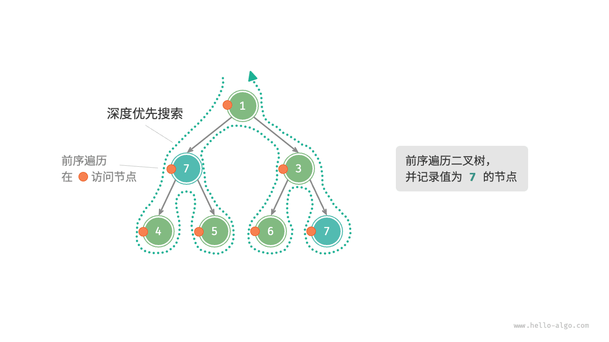

## 尝试与回退

**之所以称之为回溯算法，是因为该算法在搜索解空间时会采用“尝试”与“回退”的策略**。当算法在搜索过程中遇到某个状态无法继续前进或无法得到满足条件的解时，它会撤销上一步的选择，退回到之前的状态，并尝试其他可能的选择。

对于例题一，访问每个节点都代表一次“尝试”，而越过叶节点或返回父节点的 `return` 则表示“回退”。

值得说明的是，**回退并不仅仅包括函数返回**。为解释这一点，我们对例题一稍作拓展。

!!! question "例题二"

    在二叉树中搜索所有值为 $7$ 的节点，**请返回根节点到这些节点的路径**。

在例题一代码的基础上，我们需要借助一个列表 `path` 记录访问过的节点路径。当访问到值为 $7$ 的节点时，则复制 `path` 并添加进结果列表 `res` 。遍历完成后，`res` 中保存的就是所有的解。代码如下所示：

```python
def pre_order(root: TreeNode):
    """前序遍历：例题二"""
    if root is None:
        return
    # 尝试
    path.append(root)
    if root.val == 7:
        # 记录解
        res.append(list(path))
    pre_order(root.left)
    pre_order(root.right)
    # 回退
    path.pop()
```

!!! example [pythontutor "可视化运行"](https://pythontutor.com/iframe-embed.html#code=class%20TreeNode%3A%0A%20%20%20%20%22%22%22%E4%BA%8C%E5%8F%89%E6%A0%91%E8%8A%82%E7%82%B9%E7%B1%BB%22%22%22%0A%0A%20%20%20%20def%20__init__%28self,%20val%3A%20int%20%3D%200%29%3A%0A%20%20%20%20%20%20%20%20self.val%3A%20int%20%3D%20val%20%20%23%20%E8%8A%82%E7%82%B9%E5%80%BC%0A%20%20%20%20%20%20%20%20self.left%3A%20TreeNode%20%7C%20None%20%3D%20None%20%20%23%20%E5%B7%A6%E5%AD%90%E8%8A%82%E7%82%B9%E5%BC%95%E7%94%A8%0A%20%20%20%20%20%20%20%20self.right%3A%20TreeNode%20%7C%20None%20%3D%20None%20%20%23%20%E5%8F%B3%E5%AD%90%E8%8A%82%E7%82%B9%E5%BC%95%E7%94%A8%0A%0Adef%20list_to_tree_dfs%28arr%3A%20list%5Bint%5D,%20i%3A%20int%29%20-%3E%20TreeNode%20%7C%20None%3A%0A%20%20%20%20%22%22%22%E5%B0%86%E5%88%97%E8%A1%A8%E5%8F%8D%E5%BA%8F%E5%88%97%E5%8C%96%E4%B8%BA%E4%BA%8C%E5%8F%89%E6%A0%91%EF%BC%9A%E9%80%92%E5%BD%92%22%22%22%0A%20%20%20%20%23%20%E5%A6%82%E6%9E%9C%E7%B4%A2%E5%BC%95%E8%B6%85%E5%87%BA%E6%95%B0%E7%BB%84%E9%95%BF%E5%BA%A6%EF%BC%8C%E6%88%96%E8%80%85%E5%AF%B9%E5%BA%94%E7%9A%84%E5%85%83%E7%B4%A0%E4%B8%BA%20None%20%EF%BC%8C%E5%88%99%E8%BF%94%E5%9B%9E%20None%0A%20%20%20%20if%20i%20%3C%200%20or%20i%20%3E%3D%20len%28arr%29%20or%20arr%5Bi%5D%20is%20None%3A%0A%20%20%20%20%20%20%20%20return%20None%0A%20%20%20%20%23%20%E6%9E%84%E5%BB%BA%E5%BD%93%E5%89%8D%E8%8A%82%E7%82%B9%0A%20%20%20%20root%20%3D%20TreeNode%28arr%5Bi%5D%29%0A%20%20%20%20%23%20%E9%80%92%E5%BD%92%E6%9E%84%E5%BB%BA%E5%B7%A6%E5%8F%B3%E5%AD%90%E6%A0%91%0A%20%20%20%20root.left%20%3D%20list_to_tree_dfs%28arr,%202%20*%20i%20%2B%201%29%0A%20%20%20%20root.right%20%3D%20list_to_tree_dfs%28arr,%202%20*%20i%20%2B%202%29%0A%20%20%20%20return%20root%0A%0Adef%20list_to_tree%28arr%3A%20list%5Bint%5D%29%20-%3E%20TreeNode%20%7C%20None%3A%0A%20%20%20%20%22%22%22%E5%B0%86%E5%88%97%E8%A1%A8%E5%8F%8D%E5%BA%8F%E5%88%97%E5%8C%96%E4%B8%BA%E4%BA%8C%E5%8F%89%E6%A0%91%22%22%22%0A%20%20%20%20return%20list_to_tree_dfs%28arr,%200%29%0A%0A%0Adef%20pre_order%28root%3A%20TreeNode%29%3A%0A%20%20%20%20%22%22%22%E5%89%8D%E5%BA%8F%E9%81%8D%E5%8E%86%EF%BC%9A%E4%BE%8B%E9%A2%98%E4%BA%8C%22%22%22%0A%20%20%20%20if%20root%20is%20None%3A%0A%20%20%20%20%20%20%20%20return%0A%20%20%20%20%23%20%E5%B0%9D%E8%AF%95%0A%20%20%20%20path.append%28root%29%0A%20%20%20%20if%20root.val%20%3D%3D%207%3A%0A%20%20%20%20%20%20%20%20%23%20%E8%AE%B0%E5%BD%95%E8%A7%A3%0A%20%20%20%20%20%20%20%20res.append%28list%28path%29%29%0A%20%20%20%20pre_order%28root.left%29%0A%20%20%20%20pre_order%28root.right%29%0A%20%20%20%20%23%20%E5%9B%9E%E9%80%80%0A%20%20%20%20path.pop%28%29%0A%0A%0A%22%22%22Driver%20Code%22%22%22%0Aif%20__name__%20%3D%3D%20%22__main__%22%3A%0A%20%20%20%20root%20%3D%20list_to_tree%28%5B1,%207,%203,%204,%205,%206,%207%5D%29%0A%0A%20%20%20%20%23%20%E5%89%8D%E5%BA%8F%E9%81%8D%E5%8E%86%0A%20%20%20%20path%20%3D%20list%5BTreeNode%5D%28%29%0A%20%20%20%20res%20%3D%20list%5Blist%5BTreeNode%5D%5D%28%29%0A%20%20%20%20pre_order%28root%29%0A%0A%20%20%20%20print%28%22%5Cn%E8%BE%93%E5%87%BA%E6%89%80%E6%9C%89%E6%A0%B9%E8%8A%82%E7%82%B9%E5%88%B0%E8%8A%82%E7%82%B9%207%20%E7%9A%84%E8%B7%AF%E5%BE%84%22%29%0A%20%20%20%20for%20path%20in%20res%3A%0A%20%20%20%20%20%20%20%20print%28%5Bnode.val%20for%20node%20in%20path%5D%29&codeDivHeight=800&codeDivWidth=600&cumulative=false&curInstr=126&heapPrimitives=nevernest&origin=opt-frontend.js&py=311&rawInputLstJSON=%5B%5D&textReferences=false)

在每次“尝试”中，我们通过将当前节点添加进 `path` 来记录路径；而在“回退”前，我们需要将该节点从 `path` 中弹出，**以恢复本次尝试之前的状态**。

观察下图所示的过程，**我们可以将尝试和回退理解为“前进”与“撤销”**，两个操作互为逆向。

=== "<1>"
    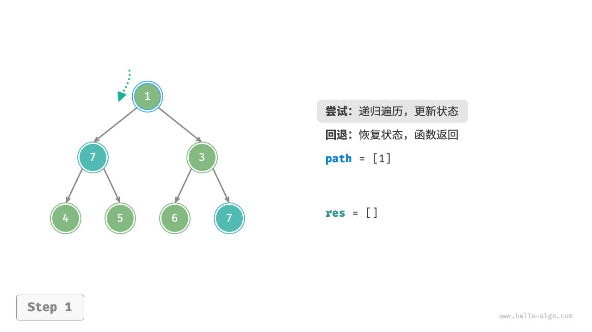

=== "<2>"
    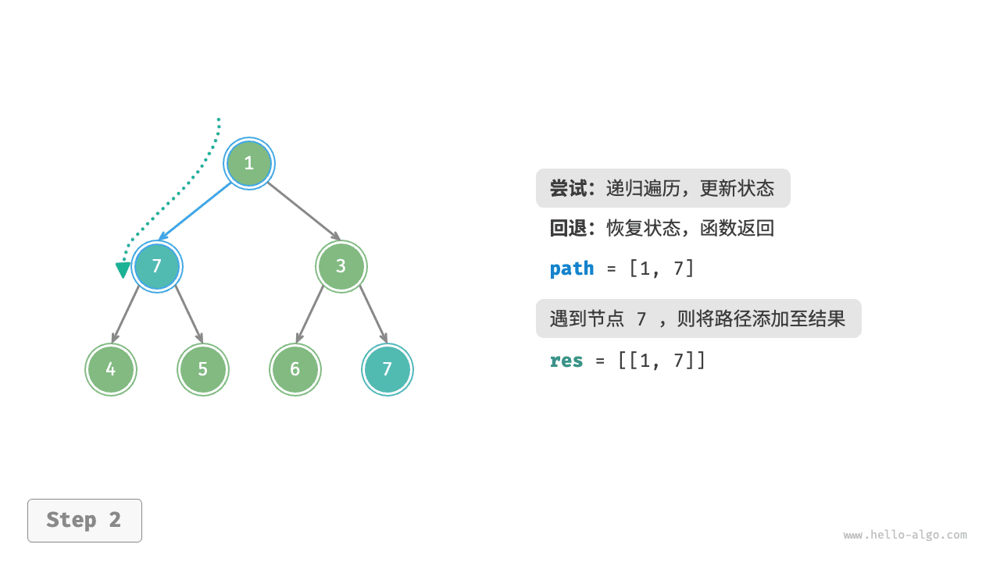

=== "<3>"
    

=== "<4>"
    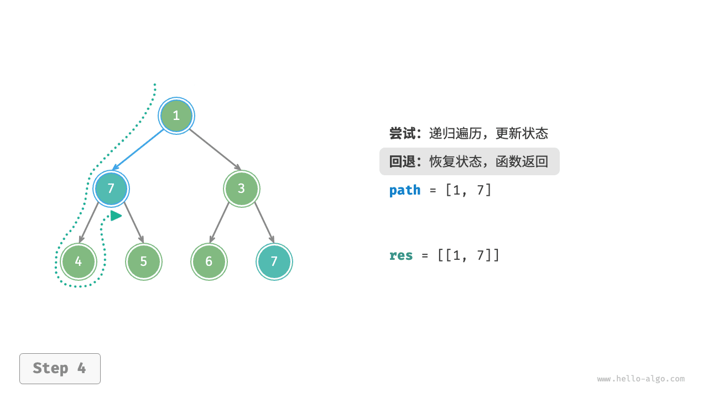

=== "<5>"
    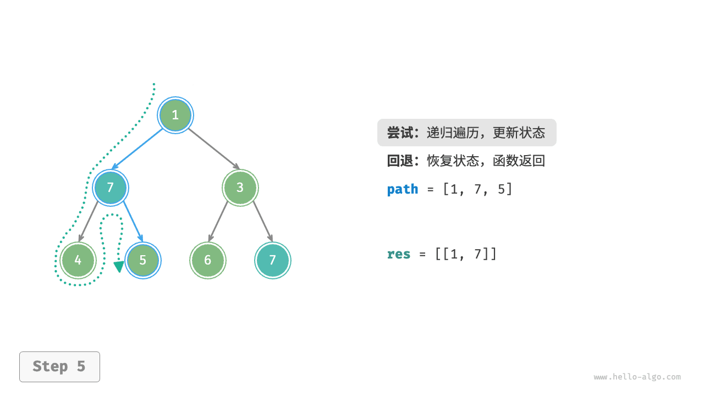

=== "<6>"
    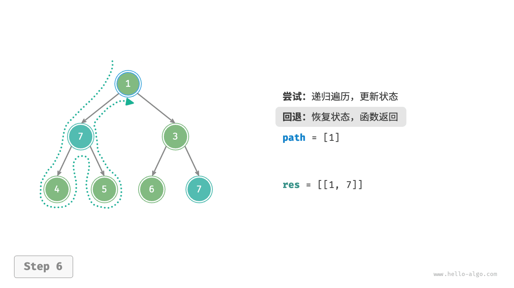

=== "<7>"
    

=== "<8>"
    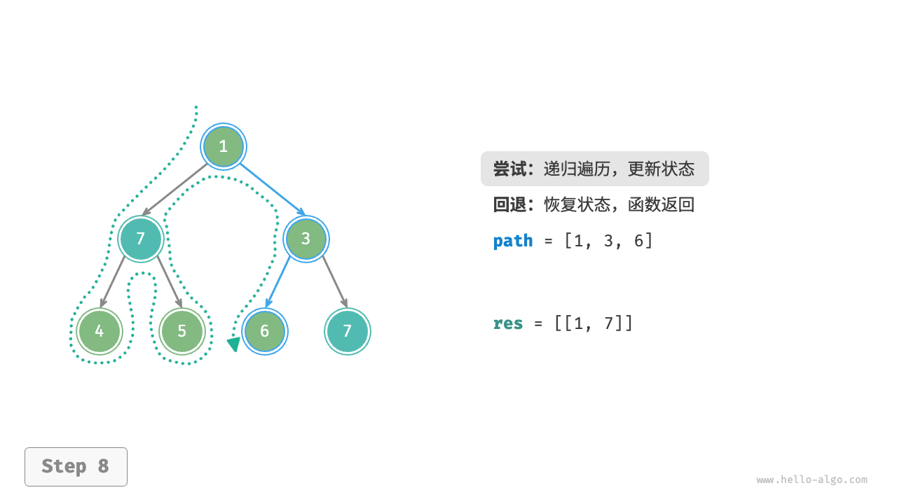

=== "<9>"
    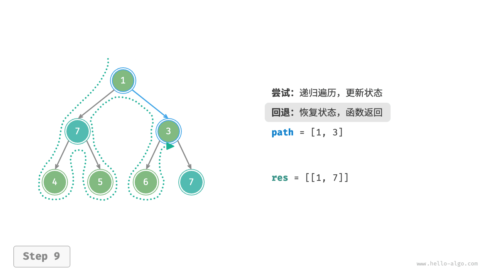

=== "<10>"
    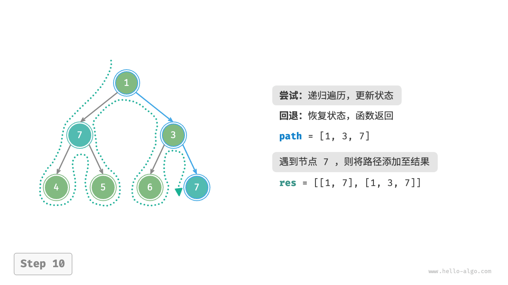

=== "<11>"
    

## 剪枝

复杂的回溯问题通常包含一个或多个约束条件，**约束条件通常可用于“剪枝”**。

!!! question "例题三"

    在二叉树中搜索所有值为 $7$ 的节点，请返回根节点到这些节点的路径，**并要求路径中不包含值为 $3$ 的节点**。

为了满足以上约束条件，**我们需要添加剪枝操作**：在搜索过程中，若遇到值为 $3$ 的节点，则提前返回，不再继续搜索。代码如下所示：

```python
def pre_order(root: TreeNode):
    """前序遍历：例题三"""
    # 剪枝
    if root is None or root.val == 3:
        return
    # 尝试
    path.append(root)
    if root.val == 7:
        # 记录解
        res.append(list(path))
    pre_order(root.left)
    pre_order(root.right)
    # 回退
    path.pop()
```

!!! example [pythontutor "可视化运行"](https://pythontutor.com/iframe-embed.html#code=class%20TreeNode%3A%0A%20%20%20%20%22%22%22%E4%BA%8C%E5%8F%89%E6%A0%91%E8%8A%82%E7%82%B9%E7%B1%BB%22%22%22%0A%0A%20%20%20%20def%20__init__%28self,%20val%3A%20int%20%3D%200%29%3A%0A%20%20%20%20%20%20%20%20self.val%3A%20int%20%3D%20val%20%20%23%20%E8%8A%82%E7%82%B9%E5%80%BC%0A%20%20%20%20%20%20%20%20self.left%3A%20TreeNode%20%7C%20None%20%3D%20None%20%20%23%20%E5%B7%A6%E5%AD%90%E8%8A%82%E7%82%B9%E5%BC%95%E7%94%A8%0A%20%20%20%20%20%20%20%20self.right%3A%20TreeNode%20%7C%20None%20%3D%20None%20%20%23%20%E5%8F%B3%E5%AD%90%E8%8A%82%E7%82%B9%E5%BC%95%E7%94%A8%0A%0Adef%20list_to_tree_dfs%28arr%3A%20list%5Bint%5D,%20i%3A%20int%29%20-%3E%20TreeNode%20%7C%20None%3A%0A%20%20%20%20%22%22%22%E5%B0%86%E5%88%97%E8%A1%A8%E5%8F%8D%E5%BA%8F%E5%88%97%E5%8C%96%E4%B8%BA%E4%BA%8C%E5%8F%89%E6%A0%91%EF%BC%9A%E9%80%92%E5%BD%92%22%22%22%0A%20%20%20%20%23%20%E5%A6%82%E6%9E%9C%E7%B4%A2%E5%BC%95%E8%B6%85%E5%87%BA%E6%95%B0%E7%BB%84%E9%95%BF%E5%BA%A6%EF%BC%8C%E6%88%96%E8%80%85%E5%AF%B9%E5%BA%94%E7%9A%84%E5%85%83%E7%B4%A0%E4%B8%BA%20None%20%EF%BC%8C%E5%88%99%E8%BF%94%E5%9B%9E%20None%0A%20%20%20%20if%20i%20%3C%200%20or%20i%20%3E%3D%20len%28arr%29%20or%20arr%5Bi%5D%20is%20None%3A%0A%20%20%20%20%20%20%20%20return%20None%0A%20%20%20%20%23%20%E6%9E%84%E5%BB%BA%E5%BD%93%E5%89%8D%E8%8A%82%E7%82%B9%0A%20%20%20%20root%20%3D%20TreeNode%28arr%5Bi%5D%29%0A%20%20%20%20%23%20%E9%80%92%E5%BD%92%E6%9E%84%E5%BB%BA%E5%B7%A6%E5%8F%B3%E5%AD%90%E6%A0%91%0A%20%20%20%20root.left%20%3D%20list_to_tree_dfs%28arr,%202%20*%20i%20%2B%201%29%0A%20%20%20%20root.right%20%3D%20list_to_tree_dfs%28arr,%202%20*%20i%20%2B%202%29%0A%20%20%20%20return%20root%0A%0Adef%20list_to_tree%28arr%3A%20list%5Bint%5D%29%20-%3E%20TreeNode%20%7C%20None%3A%0A%20%20%20%20%22%22%22%E5%B0%86%E5%88%97%E8%A1%A8%E5%8F%8D%E5%BA%8F%E5%88%97%E5%8C%96%E4%B8%BA%E4%BA%8C%E5%8F%89%E6%A0%91%22%22%22%0A%20%20%20%20return%20list_to_tree_dfs%28arr,%200%29%0A%0A%0Adef%20pre_order%28root%3A%20TreeNode%29%3A%0A%20%20%20%20%22%22%22%E5%89%8D%E5%BA%8F%E9%81%8D%E5%8E%86%EF%BC%9A%E4%BE%8B%E9%A2%98%E4%B8%89%22%22%22%0A%20%20%20%20%23%20%E5%89%AA%E6%9E%9D%0A%20%20%20%20if%20root%20is%20None%20or%20root.val%20%3D%3D%203%3A%0A%20%20%20%20%20%20%20%20return%0A%20%20%20%20%23%20%E5%B0%9D%E8%AF%95%0A%20%20%20%20path.append%28root%29%0A%20%20%20%20if%20root.val%20%3D%3D%207%3A%0A%20%20%20%20%20%20%20%20%23%20%E8%AE%B0%E5%BD%95%E8%A7%A3%0A%20%20%20%20%20%20%20%20res.append%28list%28path%29%29%0A%20%20%20%20pre_order%28root.left%29%0A%20%20%20%20pre_order%28root.right%29%0A%20%20%20%20%23%20%E5%9B%9E%E9%80%80%0A%20%20%20%20path.pop%28%29%0A%0A%0A%22%22%22Driver%20Code%22%22%22%0Aif%20__name__%20%3D%3D%20%22__main__%22%3A%0A%20%20%20%20root%20%3D%20list_to_tree%28%5B1,%207,%203,%204,%205,%206,%207%5D%29%0A%0A%20%20%20%20%23%20%E5%89%8D%E5%BA%8F%E9%81%8D%E5%8E%86%0A%20%20%20%20path%20%3D%20list%5BTreeNode%5D%28%29%0A%20%20%20%20res%20%3D%20list%5Blist%5BTreeNode%5D%5D%28%29%0A%20%20%20%20pre_order%28root%29%0A%0A%20%20%20%20print%28%22%5Cn%E8%BE%93%E5%87%BA%E6%89%80%E6%9C%89%E6%A0%B9%E8%8A%82%E7%82%B9%E5%88%B0%E8%8A%82%E7%82%B9%207%20%E7%9A%84%E8%B7%AF%E5%BE%84%EF%BC%8C%E8%B7%AF%E5%BE%84%E4%B8%AD%E4%B8%8D%E5%8C%85%E5%90%AB%E5%80%BC%E4%B8%BA%203%20%E7%9A%84%E8%8A%82%E7%82%B9%22%29%0A%20%20%20%20for%20path%20in%20res%3A%0A%20%20%20%20%20%20%20%20print%28%5Bnode.val%20for%20node%20in%20path%5D%29&codeDivHeight=800&codeDivWidth=600&cumulative=false&curInstr=126&heapPrimitives=nevernest&origin=opt-frontend.js&py=311&rawInputLstJSON=%5B%5D&textReferences=false)

“剪枝”是一个非常形象的名词。如下图所示，在搜索过程中，**我们“剪掉”了不满足约束条件的搜索分支**，避免许多无意义的尝试，从而提高了搜索效率。

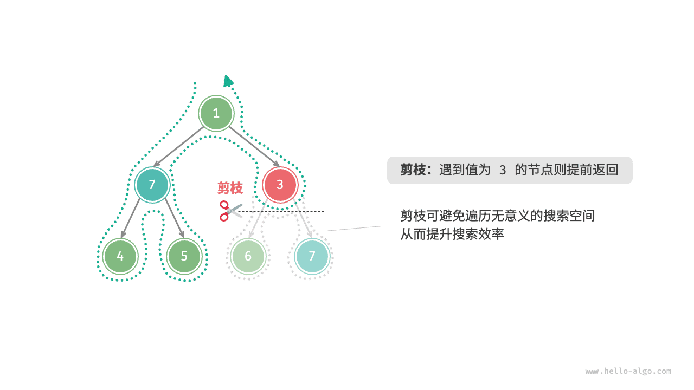

## 框架代码

接下来，我们尝试将回溯的“尝试、回退、剪枝”的主体框架提炼出来，提升代码的通用性。

在以下框架代码中，`state` 表示问题的当前状态，`choices` 表示当前状态下可以做出的选择：

```python
def backtrack(state: State, choices: list[choice], res: list[state]):
    """回溯算法框架"""
    # 判断是否为解
    if is_solution(state):
        # 记录解
        record_solution(state, res)
        # 不再继续搜索
        return
    # 遍历所有选择
    for choice in choices:
        # 剪枝：判断选择是否合法
        if is_valid(state, choice):
            # 尝试：做出选择，更新状态
            make_choice(state, choice)
            backtrack(state, choices, res)
            # 回退：撤销选择，恢复到之前的状态
            undo_choice(state, choice)
```

接下来，我们基于框架代码来解决例题三。状态 `state` 为节点遍历路径，选择 `choices` 为当前节点的左子节点和右子节点，结果 `res` 是路径列表：

```python
def is_solution(state: list[TreeNode]) -> bool:
    """判断当前状态是否为解"""
    return state and state[-1].val == 7

def record_solution(state: list[TreeNode], res: list[list[TreeNode]]):
    """记录解"""
    res.append(list(state))

def is_valid(state: list[TreeNode], choice: TreeNode) -> bool:
    """判断在当前状态下，该选择是否合法"""
    return choice is not None and choice.val != 3

def make_choice(state: list[TreeNode], choice: TreeNode):
    """更新状态"""
    state.append(choice)

def undo_choice(state: list[TreeNode], choice: TreeNode):
    """恢复状态"""
    state.pop()

def backtrack(
    state: list[TreeNode], choices: list[TreeNode], res: list[list[TreeNode]]
):
    """回溯算法：例题三"""
    # 检查是否为解
    if is_solution(state):
        # 记录解
        record_solution(state, res)
    # 遍历所有选择
    for choice in choices:
        # 剪枝：检查选择是否合法
        if is_valid(state, choice):
            # 尝试：做出选择，更新状态
            make_choice(state, choice)
            # 进行下一轮选择
            backtrack(state, [choice.left, choice.right], res)
            # 回退：撤销选择，恢复到之前的状态
            undo_choice(state, choice)
```

!!! example [pythontutor "可视化运行"](https://pythontutor.com/iframe-embed.html#code=class%20TreeNode%3A%0A%20%20%20%20%22%22%22%E4%BA%8C%E5%8F%89%E6%A0%91%E8%8A%82%E7%82%B9%E7%B1%BB%22%22%22%0A%0A%20%20%20%20def%20__init__%28self,%20val%3A%20int%20%3D%200%29%3A%0A%20%20%20%20%20%20%20%20self.val%3A%20int%20%3D%20val%20%20%23%20%E8%8A%82%E7%82%B9%E5%80%BC%0A%20%20%20%20%20%20%20%20self.left%3A%20TreeNode%20%7C%20None%20%3D%20None%20%20%23%20%E5%B7%A6%E5%AD%90%E8%8A%82%E7%82%B9%E5%BC%95%E7%94%A8%0A%20%20%20%20%20%20%20%20self.right%3A%20TreeNode%20%7C%20None%20%3D%20None%20%20%23%20%E5%8F%B3%E5%AD%90%E8%8A%82%E7%82%B9%E5%BC%95%E7%94%A8%0A%0Adef%20list_to_tree_dfs%28arr%3A%20list%5Bint%5D,%20i%3A%20int%29%20-%3E%20TreeNode%20%7C%20None%3A%0A%20%20%20%20%22%22%22%E5%B0%86%E5%88%97%E8%A1%A8%E5%8F%8D%E5%BA%8F%E5%88%97%E5%8C%96%E4%B8%BA%E4%BA%8C%E5%8F%89%E6%A0%91%EF%BC%9A%E9%80%92%E5%BD%92%22%22%22%0A%20%20%20%20%23%20%E5%A6%82%E6%9E%9C%E7%B4%A2%E5%BC%95%E8%B6%85%E5%87%BA%E6%95%B0%E7%BB%84%E9%95%BF%E5%BA%A6%EF%BC%8C%E6%88%96%E8%80%85%E5%AF%B9%E5%BA%94%E7%9A%84%E5%85%83%E7%B4%A0%E4%B8%BA%20None%20%EF%BC%8C%E5%88%99%E8%BF%94%E5%9B%9E%20None%0A%20%20%20%20if%20i%20%3C%200%20or%20i%20%3E%3D%20len%28arr%29%20or%20arr%5Bi%5D%20is%20None%3A%0A%20%20%20%20%20%20%20%20return%20None%0A%20%20%20%20%23%20%E6%9E%84%E5%BB%BA%E5%BD%93%E5%89%8D%E8%8A%82%E7%82%B9%0A%20%20%20%20root%20%3D%20TreeNode%28arr%5Bi%5D%29%0A%20%20%20%20%23%20%E9%80%92%E5%BD%92%E6%9E%84%E5%BB%BA%E5%B7%A6%E5%8F%B3%E5%AD%90%E6%A0%91%0A%20%20%20%20root.left%20%3D%20list_to_tree_dfs%28arr,%202%20*%20i%20%2B%201%29%0A%20%20%20%20root.right%20%3D%20list_to_tree_dfs%28arr,%202%20*%20i%20%2B%202%29%0A%20%20%20%20return%20root%0A%0Adef%20list_to_tree%28arr%3A%20list%5Bint%5D%29%20-%3E%20TreeNode%20%7C%20None%3A%0A%20%20%20%20%22%22%22%E5%B0%86%E5%88%97%E8%A1%A8%E5%8F%8D%E5%BA%8F%E5%88%97%E5%8C%96%E4%B8%BA%E4%BA%8C%E5%8F%89%E6%A0%91%22%22%22%0A%20%20%20%20return%20list_to_tree_dfs%28arr,%200%29%0A%0A%0Adef%20is_solution%28state%3A%20list%5BTreeNode%5D%29%20-%3E%20bool%3A%0A%20%20%20%20%22%22%22%E5%88%A4%E6%96%AD%E5%BD%93%E5%89%8D%E7%8A%B6%E6%80%81%E6%98%AF%E5%90%A6%E4%B8%BA%E8%A7%A3%22%22%22%0A%20%20%20%20return%20state%20and%20state%5B-1%5D.val%20%3D%3D%207%0A%0Adef%20record_solution%28state%3A%20list%5BTreeNode%5D,%20res%3A%20list%5Blist%5BTreeNode%5D%5D%29%3A%0A%20%20%20%20%22%22%22%E8%AE%B0%E5%BD%95%E8%A7%A3%22%22%22%0A%20%20%20%20res.append%28list%28state%29%29%0A%0Adef%20is_valid%28state%3A%20list%5BTreeNode%5D,%20choice%3A%20TreeNode%29%20-%3E%20bool%3A%0A%20%20%20%20%22%22%22%E5%88%A4%E6%96%AD%E5%9C%A8%E5%BD%93%E5%89%8D%E7%8A%B6%E6%80%81%E4%B8%8B%EF%BC%8C%E8%AF%A5%E9%80%89%E6%8B%A9%E6%98%AF%E5%90%A6%E5%90%88%E6%B3%95%22%22%22%0A%20%20%20%20return%20choice%20is%20not%20None%20and%20choice.val%20!%3D%203%0A%0Adef%20make_choice%28state%3A%20list%5BTreeNode%5D,%20choice%3A%20TreeNode%29%3A%0A%20%20%20%20%22%22%22%E6%9B%B4%E6%96%B0%E7%8A%B6%E6%80%81%22%22%22%0A%20%20%20%20state.append%28choice%29%0A%0Adef%20undo_choice%28state%3A%20list%5BTreeNode%5D,%20choice%3A%20TreeNode%29%3A%0A%20%20%20%20%22%22%22%E6%81%A2%E5%A4%8D%E7%8A%B6%E6%80%81%22%22%22%0A%20%20%20%20state.pop%28%29%0A%0Adef%20backtrack%28%0A%20%20%20%20state%3A%20list%5BTreeNode%5D,%20choices%3A%20list%5BTreeNode%5D,%20res%3A%20list%5Blist%5BTreeNode%5D%5D%0A%29%3A%0A%20%20%20%20%22%22%22%E5%9B%9E%E6%BA%AF%E7%AE%97%E6%B3%95%EF%BC%9A%E4%BE%8B%E9%A2%98%E4%B8%89%22%22%22%0A%20%20%20%20%23%20%E6%A3%80%E6%9F%A5%E6%98%AF%E5%90%A6%E4%B8%BA%E8%A7%A3%0A%20%20%20%20if%20is_solution%28state%29%3A%0A%20%20%20%20%20%20%20%20%23%20%E8%AE%B0%E5%BD%95%E8%A7%A3%0A%20%20%20%20%20%20%20%20record_solution%28state,%20res%29%0A%20%20%20%20%23%20%E9%81%8D%E5%8E%86%E6%89%80%E6%9C%89%E9%80%89%E6%8B%A9%0A%20%20%20%20for%20choice%20in%20choices%3A%0A%20%20%20%20%20%20%20%20%23%20%E5%89%AA%E6%9E%9D%EF%BC%9A%E6%A3%80%E6%9F%A5%E9%80%89%E6%8B%A9%E6%98%AF%E5%90%A6%E5%90%88%E6%B3%95%0A%20%20%20%20%20%20%20%20if%20is_valid%28state,%20choice%29%3A%0A%20%20%20%20%20%20%20%20%20%20%20%20%23%20%E5%B0%9D%E8%AF%95%EF%BC%9A%E5%81%9A%E5%87%BA%E9%80%89%E6%8B%A9%EF%BC%8C%E6%9B%B4%E6%96%B0%E7%8A%B6%E6%80%81%0A%20%20%20%20%20%20%20%20%20%20%20%20make_choice%28state,%20choice%29%0A%20%20%20%20%20%20%20%20%20%20%20%20%23%20%E8%BF%9B%E8%A1%8C%E4%B8%8B%E4%B8%80%E8%BD%AE%E9%80%89%E6%8B%A9%0A%20%20%20%20%20%20%20%20%20%20%20%20backtrack%28state,%20%5Bchoice.left,%20choice.right%5D,%20res%29%0A%20%20%20%20%20%20%20%20%20%20%20%20%23%20%E5%9B%9E%E9%80%80%EF%BC%9A%E6%92%A4%E9%94%80%E9%80%89%E6%8B%A9%EF%BC%8C%E6%81%A2%E5%A4%8D%E5%88%B0%E4%B9%8B%E5%89%8D%E7%9A%84%E7%8A%B6%E6%80%81%0A%20%20%20%20%20%20%20%20%20%20%20%20undo_choice%28state,%20choice%29%0A%0A%22%22%22Driver%20Code%22%22%22%0Aif%20__name__%20%3D%3D%20%22__main__%22%3A%0A%20%20%20%20root%20%3D%20list_to_tree%28%5B1,%207,%203,%204,%205,%206,%207%5D%29%0A%0A%20%20%20%20%23%20%E5%9B%9E%E6%BA%AF%E7%AE%97%E6%B3%95%0A%20%20%20%20res%20%3D%20%5B%5D%0A%20%20%20%20backtrack%28state%3D%5B%5D,%20choices%3D%5Broot%5D,%20res%3Dres%29%0A%20%20%20%20print%28%22%5Cn%E8%BE%93%E5%87%BA%E6%89%80%E6%9C%89%E8%B7%AF%E5%BE%84%22%29%0A%20%20%20%20for%20path%20in%20res%3A%0A%20%20%20%20%20%20%20%20print%28%5Bnode.val%20for%20node%20in%20path%5D%29&codeDivHeight=800&codeDivWidth=600&cumulative=false&curInstr=138&heapPrimitives=nevernest&origin=opt-frontend.js&py=311&rawInputLstJSON=%5B%5D&textReferences=false)

根据题意，我们在找到值为 $7$ 的节点后应该继续搜索，**因此需要将记录解之后的 `return` 语句删除**。下图对比了保留或删除 `return` 语句的搜索过程。


相比基于前序遍历的代码实现，基于回溯算法框架的代码实现虽然显得啰唆，但通用性更好。实际上，**许多回溯问题可以在该框架下解决**。我们只需根据具体问题来定义 `state` 和 `choices` ，并实现框架中的各个方法即可。

## 常用术语

为了更清晰地分析算法问题，我们总结一下回溯算法中常用术语的含义，并对照例题三给出对应示例，如下表所示。

<p align="center"> 表 <id> &nbsp; 常见的回溯算法术语 </p>

| 名词                   | 定义                                                                       | 例题三                                                               |
| ---------------------- | -------------------------------------------------------------------------- | -------------------------------------------------------------------- |
| 解（solution）         | 解是满足问题特定条件的答案，可能有一个或多个                               | 根节点到节点 $7$ 的满足约束条件的所有路径                            |
| 约束条件（constraint） | 约束条件是问题中限制解的可行性的条件，通常用于剪枝                         | 路径中不包含节点 $3$                                                 |
| 状态（state）          | 状态表示问题在某一时刻的情况，包括已经做出的选择                           | 当前已访问的节点路径，即 `path` 节点列表                             |
| 尝试（attempt）        | 尝试是根据可用选择来探索解空间的过程，包括做出选择，更新状态，检查是否为解 | 递归访问左（右）子节点，将节点添加进 `path` ，判断节点的值是否为 $7$ |
| 回退（backtracking）   | 回退指遇到不满足约束条件的状态时，撤销前面做出的选择，回到上一个状态       | 当越过叶节点、结束节点访问、遇到值为 $3$ 的节点时终止搜索，函数返回  |
| 剪枝（pruning）        | 剪枝是根据问题特性和约束条件避免无意义的搜索路径的方法，可提高搜索效率     | 当遇到值为 $3$ 的节点时，则不再继续搜索                              |

!!! tip

    问题、解、状态等概念是通用的，在分治、回溯、动态规划、贪心等算法中都有涉及。

## 优点与局限性

回溯算法本质上是一种深度优先搜索算法，它尝试所有可能的解决方案直到找到满足条件的解。这种方法的优点在于能够找到所有可能的解决方案，而且在合理的剪枝操作下，具有很高的效率。

然而，在处理大规模或者复杂问题时，**回溯算法的运行效率可能难以接受**。

- **时间**：回溯算法通常需要遍历状态空间的所有可能，时间复杂度可以达到指数阶或阶乘阶。
- **空间**：在递归调用中需要保存当前的状态（例如路径、用于剪枝的辅助变量等），当深度很大时，空间需求可能会变得很大。

即便如此，**回溯算法仍然是某些搜索问题和约束满足问题的最佳解决方案**。对于这些问题，由于无法预测哪些选择可生成有效的解，因此我们必须对所有可能的选择进行遍历。在这种情况下，**关键是如何优化效率**，常见的效率优化方法有两种。

- **剪枝**：避免搜索那些肯定不会产生解的路径，从而节省时间和空间。
- **启发式搜索**：在搜索过程中引入一些策略或者估计值，从而优先搜索最有可能产生有效解的路径。

## 回溯典型例题

回溯算法可用于解决许多搜索问题、约束满足问题和组合优化问题。

**搜索问题**：这类问题的目标是找到满足特定条件的解决方案。

- 全排列问题：给定一个集合，求出其所有可能的排列组合。
- 子集和问题：给定一个集合和一个目标和，找到集合中所有和为目标和的子集。
- 汉诺塔问题：给定三根柱子和一系列大小不同的圆盘，要求将所有圆盘从一根柱子移动到另一根柱子，每次只能移动一个圆盘，且不能将大圆盘放在小圆盘上。

**约束满足问题**：这类问题的目标是找到满足所有约束条件的解。

- $n$ 皇后：在 $n \times n$ 的棋盘上放置 $n$ 个皇后，使得它们互不攻击。
- 数独：在 $9 \times 9$ 的网格中填入数字 $1$ ~ $9$ ，使得每行、每列和每个 $3 \times 3$ 子网格中的数字不重复。
- 图着色问题：给定一个无向图，用最少的颜色给图的每个顶点着色，使得相邻顶点颜色不同。

**组合优化问题**：这类问题的目标是在一个组合空间中找到满足某些条件的最优解。

- 0-1 背包问题：给定一组物品和一个背包，每个物品有一定的价值和重量，要求在背包容量限制内，选择物品使得总价值最大。
- 旅行商问题：在一个图中，从一个点出发，访问所有其他点恰好一次后返回起点，求最短路径。
- 最大团问题：给定一个无向图，找到最大的完全子图，即子图中的任意两个顶点之间都有边相连。

请注意，对于许多组合优化问题，回溯不是最优解决方案。

- 0-1 背包问题通常使用动态规划解决，以达到更高的时间效率。
- 旅行商是一个著名的 NP-Hard 问题，常用解法有遗传算法和蚁群算法等。
- 最大团问题是图论中的一个经典问题，可用贪心算法等启发式算法来解决。

# 全排列问题

全排列问题是回溯算法的一个典型应用。它的定义是在给定一个集合（如一个数组或字符串）的情况下，找出其中元素的所有可能的排列。

下表列举了几个示例数据，包括输入数组和对应的所有排列。

<p align="center"> 表 <id> &nbsp; 全排列示例 </p>

| 输入数组    | 所有排列                                                           |
| :---------- | :----------------------------------------------------------------- |
| $[1]$       | $[1]$                                                              |
| $[1, 2]$    | $[1, 2], [2, 1]$                                                   |
| $[1, 2, 3]$ | $[1, 2, 3], [1, 3, 2], [2, 1, 3], [2, 3, 1], [3, 1, 2], [3, 2, 1]$ |

## 无相等元素的情况

!!! question

    输入一个整数数组，其中不包含重复元素，返回所有可能的排列。

从回溯算法的角度看，**我们可以把生成排列的过程想象成一系列选择的结果**。假设输入数组为 $[1, 2, 3]$ ，如果我们先选择 $1$ ，再选择 $3$ ，最后选择 $2$ ，则获得排列 $[1, 3, 2]$ 。回退表示撤销一个选择，之后继续尝试其他选择。

从回溯代码的角度看，候选集合 `choices` 是输入数组中的所有元素，状态 `state` 是直至目前已被选择的元素。请注意，每个元素只允许被选择一次，**因此 `state` 中的所有元素都应该是唯一的**。

如下图所示，我们可以将搜索过程展开成一棵递归树，树中的每个节点代表当前状态 `state` 。从根节点开始，经过三轮选择后到达叶节点，每个叶节点都对应一个排列。

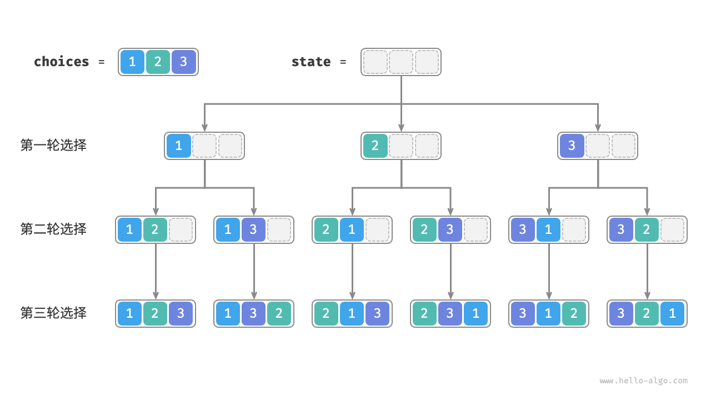

### 重复选择剪枝

为了实现每个元素只被选择一次，我们考虑引入一个布尔型数组 `selected` ，其中 `selected[i]` 表示 `choices[i]` 是否已被选择，并基于它实现以下剪枝操作。

- 在做出选择 `choice[i]` 后，我们就将 `selected[i]` 赋值为 $\text{True}$ ，代表它已被选择。
- 遍历选择列表 `choices` 时，跳过所有已被选择的节点，即剪枝。

如下图所示，假设我们第一轮选择 1 ，第二轮选择 3 ，第三轮选择 2 ，则需要在第二轮剪掉元素 1 的分支，在第三轮剪掉元素 1 和元素 3 的分支。


观察上图发现，该剪枝操作将搜索空间大小从 $O(n^n)$ 减小至 $O(n!)$ 。

### 代码实现

想清楚以上信息之后，我们就可以在框架代码中做“完形填空”了。为了缩短整体代码，我们不单独实现框架代码中的各个函数，而是将它们展开在 `backtrack()` 函数中：

```python
def backtrack(
    state: list[int], choices: list[int], selected: list[bool], res: list[list[int]]
):
    """回溯算法：全排列 I"""
    # 当状态长度等于元素数量时，记录解
    if len(state) == len(choices):
        res.append(list(state))
        return
    # 遍历所有选择
    for i, choice in enumerate(choices):
        # 剪枝：不允许重复选择元素
        if not selected[i]:
            # 尝试：做出选择，更新状态
            selected[i] = True
            state.append(choice)
            # 进行下一轮选择
            backtrack(state, choices, selected, res)
            # 回退：撤销选择，恢复到之前的状态
            selected[i] = False
            state.pop()

def permutations_i(nums: list[int]) -> list[list[int]]:
    """全排列 I"""
    res = []
    backtrack(state=[], choices=nums, selected=[False] * len(nums), res=res)
    return res
```

!!! example [pythontutor "可视化运行"](https://pythontutor.com/iframe-embed.html#code=def%20backtrack%28%0A%20%20%20%20state%3A%20list%5Bint%5D,%20choices%3A%20list%5Bint%5D,%20selected%3A%20list%5Bbool%5D,%20res%3A%20list%5Blist%5Bint%5D%5D%0A%29%3A%0A%20%20%20%20%22%22%22%E5%9B%9E%E6%BA%AF%E7%AE%97%E6%B3%95%EF%BC%9A%E5%85%A8%E6%8E%92%E5%88%97%20I%22%22%22%0A%20%20%20%20%23%20%E5%BD%93%E7%8A%B6%E6%80%81%E9%95%BF%E5%BA%A6%E7%AD%89%E4%BA%8E%E5%85%83%E7%B4%A0%E6%95%B0%E9%87%8F%E6%97%B6%EF%BC%8C%E8%AE%B0%E5%BD%95%E8%A7%A3%0A%20%20%20%20if%20len%28state%29%20%3D%3D%20len%28choices%29%3A%0A%20%20%20%20%20%20%20%20res.append%28list%28state%29%29%0A%20%20%20%20%20%20%20%20return%0A%20%20%20%20%23%20%E9%81%8D%E5%8E%86%E6%89%80%E6%9C%89%E9%80%89%E6%8B%A9%0A%20%20%20%20for%20i,%20choice%20in%20enumerate%28choices%29%3A%0A%20%20%20%20%20%20%20%20%23%20%E5%89%AA%E6%9E%9D%EF%BC%9A%E4%B8%8D%E5%85%81%E8%AE%B8%E9%87%8D%E5%A4%8D%E9%80%89%E6%8B%A9%E5%85%83%E7%B4%A0%0A%20%20%20%20%20%20%20%20if%20not%20selected%5Bi%5D%3A%0A%20%20%20%20%20%20%20%20%20%20%20%20%23%20%E5%B0%9D%E8%AF%95%EF%BC%9A%E5%81%9A%E5%87%BA%E9%80%89%E6%8B%A9%EF%BC%8C%E6%9B%B4%E6%96%B0%E7%8A%B6%E6%80%81%0A%20%20%20%20%20%20%20%20%20%20%20%20selected%5Bi%5D%20%3D%20True%0A%20%20%20%20%20%20%20%20%20%20%20%20state.append%28choice%29%0A%20%20%20%20%20%20%20%20%20%20%20%20%23%20%E8%BF%9B%E8%A1%8C%E4%B8%8B%E4%B8%80%E8%BD%AE%E9%80%89%E6%8B%A9%0A%20%20%20%20%20%20%20%20%20%20%20%20backtrack%28state,%20choices,%20selected,%20res%29%0A%20%20%20%20%20%20%20%20%20%20%20%20%23%20%E5%9B%9E%E9%80%80%EF%BC%9A%E6%92%A4%E9%94%80%E9%80%89%E6%8B%A9%EF%BC%8C%E6%81%A2%E5%A4%8D%E5%88%B0%E4%B9%8B%E5%89%8D%E7%9A%84%E7%8A%B6%E6%80%81%0A%20%20%20%20%20%20%20%20%20%20%20%20selected%5Bi%5D%20%3D%20False%0A%20%20%20%20%20%20%20%20%20%20%20%20state.pop%28%29%0A%0A%0Adef%20permutations_i%28nums%3A%20list%5Bint%5D%29%20-%3E%20list%5Blist%5Bint%5D%5D%3A%0A%20%20%20%20%22%22%22%E5%85%A8%E6%8E%92%E5%88%97%20I%22%22%22%0A%20%20%20%20res%20%3D%20%5B%5D%0A%20%20%20%20backtrack%28state%3D%5B%5D,%20choices%3Dnums,%20selected%3D%5BFalse%5D%20*%20len%28nums%29,%20res%3Dres%29%0A%20%20%20%20return%20res%0A%0A%0A%22%22%22Driver%20Code%22%22%22%0Aif%20__name__%20%3D%3D%20%22__main__%22%3A%0A%20%20%20%20nums%20%3D%20%5B1,%202,%203%5D%0A%0A%20%20%20%20res%20%3D%20permutations_i%28nums%29%0A%0A%20%20%20%20print%28f%22%E8%BE%93%E5%85%A5%E6%95%B0%E7%BB%84%20nums%20%3D%20%7Bnums%7D%22%29%0A%20%20%20%20print%28f%22%E6%89%80%E6%9C%89%E6%8E%92%E5%88%97%20res%20%3D%20%7Bres%7D%22%29&codeDivHeight=800&codeDivWidth=600&cumulative=false&curInstr=13&heapPrimitives=nevernest&origin=opt-frontend.js&py=311&rawInputLstJSON=%5B%5D&textReferences=false)

## 考虑相等元素的情况

!!! question

    输入一个整数数组，**数组中可能包含重复元素**，返回所有不重复的排列。

假设输入数组为 $[1, 1, 2]$ 。为了方便区分两个重复元素 $1$ ，我们将第二个 $1$ 记为 $\hat{1}$ 。

如下图所示，上述方法生成的排列有一半是重复的。

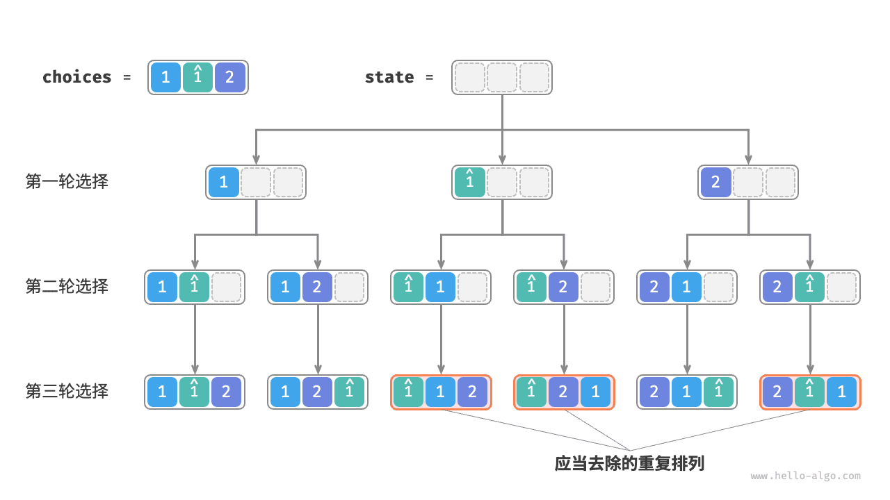

那么如何去除重复的排列呢？最直接地，考虑借助一个哈希集合，直接对排列结果进行去重。然而这样做不够优雅，**因为生成重复排列的搜索分支没有必要，应当提前识别并剪枝**，这样可以进一步提升算法效率。

### 相等元素剪枝

观察下图，在第一轮中，选择 $1$ 或选择 $\hat{1}$ 是等价的，在这两个选择之下生成的所有排列都是重复的。因此应该把 $\hat{1}$ 剪枝。

同理，在第一轮选择 $2$ 之后，第二轮选择中的 $1$ 和 $\hat{1}$ 也会产生重复分支，因此也应将第二轮的 $\hat{1}$ 剪枝。

从本质上看，**我们的目标是在某一轮选择中，保证多个相等的元素仅被选择一次**。

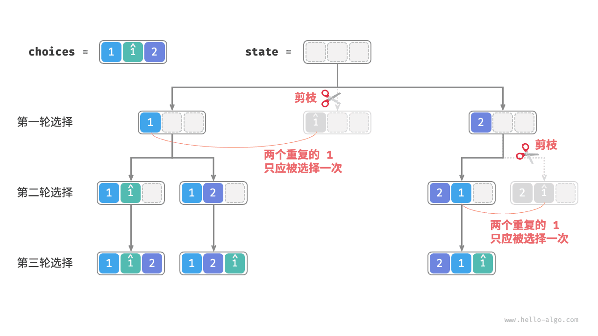

### 代码实现

在上一题的代码的基础上，我们考虑在每一轮选择中开启一个哈希集合 `duplicated` ，用于记录该轮中已经尝试过的元素，并将重复元素剪枝：

```python
def backtrack(
    state: list[int], choices: list[int], selected: list[bool], res: list[list[int]]
):
    """回溯算法：全排列 II"""
    # 当状态长度等于元素数量时，记录解
    if len(state) == len(choices):
        res.append(list(state))
        return
    # 遍历所有选择
    duplicated = set[int]()
    for i, choice in enumerate(choices):
        # 剪枝：不允许重复选择元素 且 不允许重复选择相等元素
        if not selected[i] and choice not in duplicated:
            # 尝试：做出选择，更新状态
            duplicated.add(choice)  # 记录选择过的元素值
            selected[i] = True
            state.append(choice)
            # 进行下一轮选择
            backtrack(state, choices, selected, res)
            # 回退：撤销选择，恢复到之前的状态
            selected[i] = False
            state.pop()

def permutations_ii(nums: list[int]) -> list[list[int]]:
    """全排列 II"""
    res = []
    backtrack(state=[], choices=nums, selected=[False] * len(nums), res=res)
    return res
```

!!! example [pythontutor "可视化运行"](https://pythontutor.com/iframe-embed.html#code=def%20backtrack%28%0A%20%20%20%20state%3A%20list%5Bint%5D,%20choices%3A%20list%5Bint%5D,%20selected%3A%20list%5Bbool%5D,%20res%3A%20list%5Blist%5Bint%5D%5D%0A%29%3A%0A%20%20%20%20%22%22%22%E5%9B%9E%E6%BA%AF%E7%AE%97%E6%B3%95%EF%BC%9A%E5%85%A8%E6%8E%92%E5%88%97%20II%22%22%22%0A%20%20%20%20%23%20%E5%BD%93%E7%8A%B6%E6%80%81%E9%95%BF%E5%BA%A6%E7%AD%89%E4%BA%8E%E5%85%83%E7%B4%A0%E6%95%B0%E9%87%8F%E6%97%B6%EF%BC%8C%E8%AE%B0%E5%BD%95%E8%A7%A3%0A%20%20%20%20if%20len%28state%29%20%3D%3D%20len%28choices%29%3A%0A%20%20%20%20%20%20%20%20res.append%28list%28state%29%29%0A%20%20%20%20%20%20%20%20return%0A%20%20%20%20%23%20%E9%81%8D%E5%8E%86%E6%89%80%E6%9C%89%E9%80%89%E6%8B%A9%0A%20%20%20%20duplicated%20%3D%20set%5Bint%5D%28%29%0A%20%20%20%20for%20i,%20choice%20in%20enumerate%28choices%29%3A%0A%20%20%20%20%20%20%20%20%23%20%E5%89%AA%E6%9E%9D%EF%BC%9A%E4%B8%8D%E5%85%81%E8%AE%B8%E9%87%8D%E5%A4%8D%E9%80%89%E6%8B%A9%E5%85%83%E7%B4%A0%20%E4%B8%94%20%E4%B8%8D%E5%85%81%E8%AE%B8%E9%87%8D%E5%A4%8D%E9%80%89%E6%8B%A9%E7%9B%B8%E7%AD%89%E5%85%83%E7%B4%A0%0A%20%20%20%20%20%20%20%20if%20not%20selected%5Bi%5D%20and%20choice%20not%20in%20duplicated%3A%0A%20%20%20%20%20%20%20%20%20%20%20%20%23%20%E5%B0%9D%E8%AF%95%EF%BC%9A%E5%81%9A%E5%87%BA%E9%80%89%E6%8B%A9%EF%BC%8C%E6%9B%B4%E6%96%B0%E7%8A%B6%E6%80%81%0A%20%20%20%20%20%20%20%20%20%20%20%20duplicated.add%28choice%29%20%20%23%20%E8%AE%B0%E5%BD%95%E9%80%89%E6%8B%A9%E8%BF%87%E7%9A%84%E5%85%83%E7%B4%A0%E5%80%BC%0A%20%20%20%20%20%20%20%20%20%20%20%20selected%5Bi%5D%20%3D%20True%0A%20%20%20%20%20%20%20%20%20%20%20%20state.append%28choice%29%0A%20%20%20%20%20%20%20%20%20%20%20%20%23%20%E8%BF%9B%E8%A1%8C%E4%B8%8B%E4%B8%80%E8%BD%AE%E9%80%89%E6%8B%A9%0A%20%20%20%20%20%20%20%20%20%20%20%20backtrack%28state,%20choices,%20selected,%20res%29%0A%20%20%20%20%20%20%20%20%20%20%20%20%23%20%E5%9B%9E%E9%80%80%EF%BC%9A%E6%92%A4%E9%94%80%E9%80%89%E6%8B%A9%EF%BC%8C%E6%81%A2%E5%A4%8D%E5%88%B0%E4%B9%8B%E5%89%8D%E7%9A%84%E7%8A%B6%E6%80%81%0A%20%20%20%20%20%20%20%20%20%20%20%20selected%5Bi%5D%20%3D%20False%0A%20%20%20%20%20%20%20%20%20%20%20%20state.pop%28%29%0A%0A%0Adef%20permutations_ii%28nums%3A%20list%5Bint%5D%29%20-%3E%20list%5Blist%5Bint%5D%5D%3A%0A%20%20%20%20%22%22%22%E5%85%A8%E6%8E%92%E5%88%97%20II%22%22%22%0A%20%20%20%20res%20%3D%20%5B%5D%0A%20%20%20%20backtrack%28state%3D%5B%5D,%20choices%3Dnums,%20selected%3D%5BFalse%5D%20*%20len%28nums%29,%20res%3Dres%29%0A%20%20%20%20return%20res%0A%0A%0A%22%22%22Driver%20Code%22%22%22%0Aif%20__name__%20%3D%3D%20%22__main__%22%3A%0A%20%20%20%20nums%20%3D%20%5B1,%202,%202%5D%0A%0A%20%20%20%20res%20%3D%20permutations_ii%28nums%29%0A%0A%20%20%20%20print%28f%22%E8%BE%93%E5%85%A5%E6%95%B0%E7%BB%84%20nums%20%3D%20%7Bnums%7D%22%29%0A%20%20%20%20print%28f%22%E6%89%80%E6%9C%89%E6%8E%92%E5%88%97%20res%20%3D%20%7Bres%7D%22%29&codeDivHeight=800&codeDivWidth=600&cumulative=false&curInstr=13&heapPrimitives=nevernest&origin=opt-frontend.js&py=311&rawInputLstJSON=%5B%5D&textReferences=false)

假设元素两两之间互不相同，则 $n$ 个元素共有 $n!$  种排列（阶乘）；在记录结果时，需要复制长度为 $n$ 的列表，使用 $O(n)$ 时间。**因此时间复杂度为 $O(n!n)$** 。

最大递归深度为 $n$ ，使用 $O(n)$ 栈帧空间。`selected` 使用 $O(n)$ 空间。同一时刻最多共有 $n$ 个 `duplicated` ，使用 $O(n^2)$ 空间。**因此空间复杂度为 $O(n^2)$** 。

### 两种剪枝对比

请注意，虽然 `selected` 和 `duplicated` 都用于剪枝，但两者的目标不同。

- **重复选择剪枝**：整个搜索过程中只有一个 `selected` 。它记录的是当前状态中包含哪些元素，其作用是避免某个元素在 `state` 中重复出现。
- **相等元素剪枝**：每轮选择（每个调用的 `backtrack` 函数）都包含一个 `duplicated` 。它记录的是在本轮遍历（`for` 循环）中哪些元素已被选择过，其作用是保证相等元素只被选择一次。

下图展示了两个剪枝条件的生效范围。注意，树中的每个节点代表一个选择，从根节点到叶节点的路径上的各个节点构成一个排列。

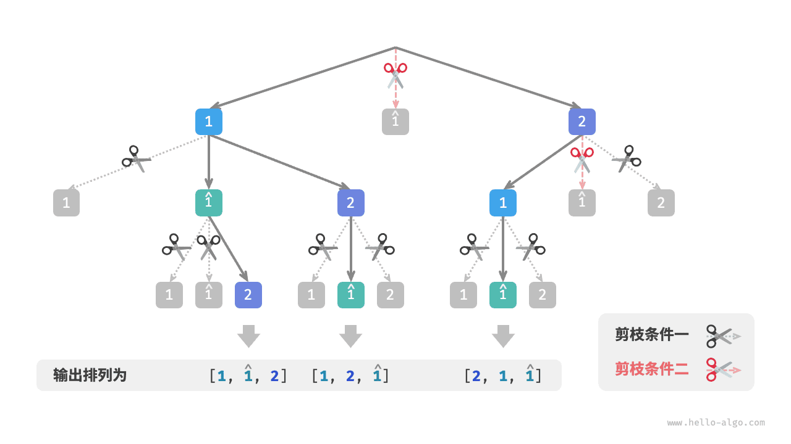

# 子集和问题

## 无重复元素的情况

!!! question

    给定一个正整数数组 `nums` 和一个目标正整数 `target` ，请找出所有可能的组合，使得组合中的元素和等于 `target` 。给定数组无重复元素，每个元素可以被选取多次。请以列表形式返回这些组合，列表中不应包含重复组合。

例如，输入集合 $\{3, 4, 5\}$ 和目标整数 $9$ ，解为 $\{3, 3, 3\}, \{4, 5\}$ 。需要注意以下两点。

- 输入集合中的元素可以被无限次重复选取。
- 子集不区分元素顺序，比如 $\{4, 5\}$ 和 $\{5, 4\}$ 是同一个子集。

### 参考全排列解法

类似于全排列问题，我们可以把子集的生成过程想象成一系列选择的结果，并在选择过程中实时更新“元素和”，当元素和等于 `target` 时，就将子集记录至结果列表。

而与全排列问题不同的是，**本题集合中的元素可以被无限次选取**，因此无须借助 `selected` 布尔列表来记录元素是否已被选择。我们可以对全排列代码进行小幅修改，初步得到解题代码：

```python
def backtrack(
    state: list[int],
    target: int,
    total: int,
    choices: list[int],
    res: list[list[int]],
):
    """回溯算法：子集和 I"""
    # 子集和等于 target 时，记录解
    if total == target:
        res.append(list(state))
        return
    # 遍历所有选择
    for i in range(len(choices)):
        # 剪枝：若子集和超过 target ，则跳过该选择
        if total + choices[i] > target:
            continue
        # 尝试：做出选择，更新元素和 total
        state.append(choices[i])
        # 进行下一轮选择
        backtrack(state, target, total + choices[i], choices, res)
        # 回退：撤销选择，恢复到之前的状态
        state.pop()

def subset_sum_i_naive(nums: list[int], target: int) -> list[list[int]]:
    """求解子集和 I（包含重复子集）"""
    state = []  # 状态（子集）
    total = 0  # 子集和
    res = []  # 结果列表（子集列表）
    backtrack(state, target, total, nums, res)
    return res
```

!!! example [pythontutor "可视化运行"](https://pythontutor.com/iframe-embed.html#code=def%20backtrack%28%0A%20%20%20%20state%3A%20list%5Bint%5D,%0A%20%20%20%20target%3A%20int,%0A%20%20%20%20total%3A%20int,%0A%20%20%20%20choices%3A%20list%5Bint%5D,%0A%20%20%20%20res%3A%20list%5Blist%5Bint%5D%5D,%0A%29%3A%0A%20%20%20%20%22%22%22%E5%9B%9E%E6%BA%AF%E7%AE%97%E6%B3%95%EF%BC%9A%E5%AD%90%E9%9B%86%E5%92%8C%20I%22%22%22%0A%20%20%20%20%23%20%E5%AD%90%E9%9B%86%E5%92%8C%E7%AD%89%E4%BA%8E%20target%20%E6%97%B6%EF%BC%8C%E8%AE%B0%E5%BD%95%E8%A7%A3%0A%20%20%20%20if%20total%20%3D%3D%20target%3A%0A%20%20%20%20%20%20%20%20res.append%28list%28state%29%29%0A%20%20%20%20%20%20%20%20return%0A%20%20%20%20%23%20%E9%81%8D%E5%8E%86%E6%89%80%E6%9C%89%E9%80%89%E6%8B%A9%0A%20%20%20%20for%20i%20in%20range%28len%28choices%29%29%3A%0A%20%20%20%20%20%20%20%20%23%20%E5%89%AA%E6%9E%9D%EF%BC%9A%E8%8B%A5%E5%AD%90%E9%9B%86%E5%92%8C%E8%B6%85%E8%BF%87%20target%20%EF%BC%8C%E5%88%99%E8%B7%B3%E8%BF%87%E8%AF%A5%E9%80%89%E6%8B%A9%0A%20%20%20%20%20%20%20%20if%20total%20%2B%20choices%5Bi%5D%20%3E%20target%3A%0A%20%20%20%20%20%20%20%20%20%20%20%20continue%0A%20%20%20%20%20%20%20%20%23%20%E5%B0%9D%E8%AF%95%EF%BC%9A%E5%81%9A%E5%87%BA%E9%80%89%E6%8B%A9%EF%BC%8C%E6%9B%B4%E6%96%B0%E5%85%83%E7%B4%A0%E5%92%8C%20total%0A%20%20%20%20%20%20%20%20state.append%28choices%5Bi%5D%29%0A%20%20%20%20%20%20%20%20%23%20%E8%BF%9B%E8%A1%8C%E4%B8%8B%E4%B8%80%E8%BD%AE%E9%80%89%E6%8B%A9%0A%20%20%20%20%20%20%20%20backtrack%28state,%20target,%20total%20%2B%20choices%5Bi%5D,%20choices,%20res%29%0A%20%20%20%20%20%20%20%20%23%20%E5%9B%9E%E9%80%80%EF%BC%9A%E6%92%A4%E9%94%80%E9%80%89%E6%8B%A9%EF%BC%8C%E6%81%A2%E5%A4%8D%E5%88%B0%E4%B9%8B%E5%89%8D%E7%9A%84%E7%8A%B6%E6%80%81%0A%20%20%20%20%20%20%20%20state.pop%28%29%0A%0A%0Adef%20subset_sum_i_naive%28nums%3A%20list%5Bint%5D,%20target%3A%20int%29%20-%3E%20list%5Blist%5Bint%5D%5D%3A%0A%20%20%20%20%22%22%22%E6%B1%82%E8%A7%A3%E5%AD%90%E9%9B%86%E5%92%8C%20I%EF%BC%88%E5%8C%85%E5%90%AB%E9%87%8D%E5%A4%8D%E5%AD%90%E9%9B%86%EF%BC%89%22%22%22%0A%20%20%20%20state%20%3D%20%5B%5D%20%20%23%20%E7%8A%B6%E6%80%81%EF%BC%88%E5%AD%90%E9%9B%86%EF%BC%89%0A%20%20%20%20total%20%3D%200%20%20%23%20%E5%AD%90%E9%9B%86%E5%92%8C%0A%20%20%20%20res%20%3D%20%5B%5D%20%20%23%20%E7%BB%93%E6%9E%9C%E5%88%97%E8%A1%A8%EF%BC%88%E5%AD%90%E9%9B%86%E5%88%97%E8%A1%A8%EF%BC%89%0A%20%20%20%20backtrack%28state,%20target,%20total,%20nums,%20res%29%0A%20%20%20%20return%20res%0A%0A%0A%22%22%22Driver%20Code%22%22%22%0Aif%20__name__%20%3D%3D%20%22__main__%22%3A%0A%20%20%20%20nums%20%3D%20%5B3,%204,%205%5D%0A%20%20%20%20target%20%3D%209%0A%20%20%20%20res%20%3D%20subset_sum_i_naive%28nums,%20target%29%0A%0A%20%20%20%20print%28f%22%E8%BE%93%E5%85%A5%E6%95%B0%E7%BB%84%20nums%20%3D%20%7Bnums%7D,%20target%20%3D%20%7Btarget%7D%22%29%0A%20%20%20%20print%28f%22%E6%89%80%E6%9C%89%E5%92%8C%E7%AD%89%E4%BA%8E%20%7Btarget%7D%20%E7%9A%84%E5%AD%90%E9%9B%86%20res%20%3D%20%7Bres%7D%22%29%0A%20%20%20%20print%28f%22%E8%AF%B7%E6%B3%A8%E6%84%8F%EF%BC%8C%E8%AF%A5%E6%96%B9%E6%B3%95%E8%BE%93%E5%87%BA%E7%9A%84%E7%BB%93%E6%9E%9C%E5%8C%85%E5%90%AB%E9%87%8D%E5%A4%8D%E9%9B%86%E5%90%88%22%29&codeDivHeight=800&codeDivWidth=600&cumulative=false&curInstr=16&heapPrimitives=nevernest&origin=opt-frontend.js&py=311&rawInputLstJSON=%5B%5D&textReferences=false)

向以上代码输入数组 $[3, 4, 5]$ 和目标元素 $9$ ，输出结果为 $[3, 3, 3], [4, 5], [5, 4]$ 。**虽然成功找出了所有和为 $9$ 的子集，但其中存在重复的子集 $[4, 5]$ 和 $[5, 4]$** 。

这是因为搜索过程是区分选择顺序的，然而子集不区分选择顺序。如下图所示，先选 $4$ 后选 $5$ 与先选 $5$ 后选 $4$ 是不同的分支，但对应同一个子集。

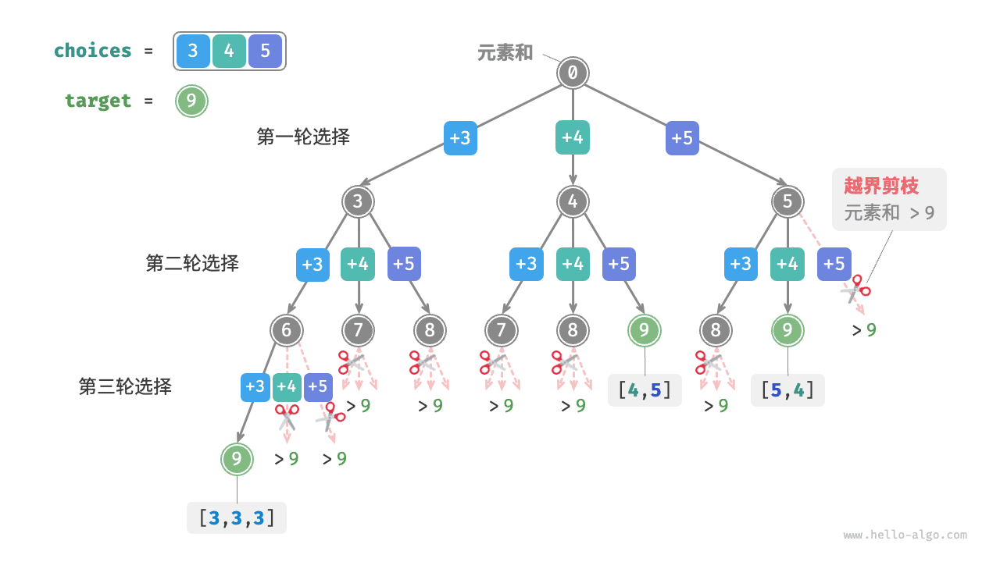

为了去除重复子集，**一种直接的思路是对结果列表进行去重**。但这个方法效率很低，有两方面原因。

- 当数组元素较多，尤其是当 `target` 较大时，搜索过程会产生大量的重复子集。
- 比较子集（数组）的异同非常耗时，需要先排序数组，再比较数组中每个元素的异同。

### 重复子集剪枝

**我们考虑在搜索过程中通过剪枝进行去重**。观察下图，重复子集是在以不同顺序选择数组元素时产生的，例如以下情况。

1. 当第一轮和第二轮分别选择 $3$ 和 $4$ 时，会生成包含这两个元素的所有子集，记为 $[3, 4, \dots]$ 。
2. 之后，当第一轮选择 $4$ 时，**则第二轮应该跳过 $3$** ，因为该选择产生的子集 $[4, 3, \dots]$ 和第 `1.` 步中生成的子集完全重复。

在搜索过程中，每一层的选择都是从左到右被逐个尝试的，因此越靠右的分支被剪掉的越多。

1. 前两轮选择 $3$ 和 $5$ ，生成子集 $[3, 5, \dots]$ 。
2. 前两轮选择 $4$ 和 $5$ ，生成子集 $[4, 5, \dots]$ 。
3. 若第一轮选择 $5$ ，**则第二轮应该跳过 $3$ 和 $4$** ，因为子集 $[5, 3, \dots]$ 和 $[5, 4, \dots]$ 与第 `1.` 步和第 `2.` 步中描述的子集完全重复。

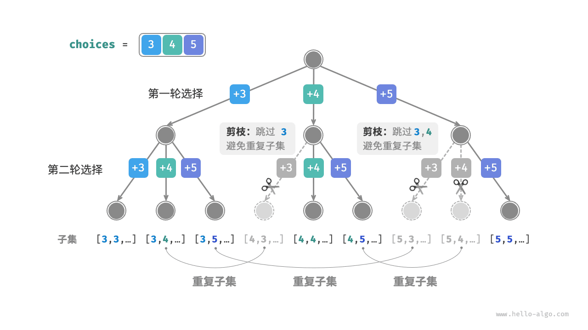

总结来看，给定输入数组 $[x_1, x_2, \dots, x_n]$ ，设搜索过程中的选择序列为 $[x_{i_1}, x_{i_2}, \dots, x_{i_m}]$ ，则该选择序列需要满足 $i_1 \leq i_2 \leq \dots \leq i_m$ ，**不满足该条件的选择序列都会造成重复，应当剪枝**。

### 代码实现

为实现该剪枝，我们初始化变量 `start` ，用于指示遍历起始点。**当做出选择 $x_{i}$ 后，设定下一轮从索引 $i$ 开始遍历**。这样做就可以让选择序列满足 $i_1 \leq i_2 \leq \dots \leq i_m$ ，从而保证子集唯一。

除此之外，我们还对代码进行了以下两项优化。

- 在开启搜索前，先将数组 `nums` 排序。在遍历所有选择时，**当子集和超过 `target` 时直接结束循环**，因为后边的元素更大，其子集和一定超过 `target` 。
- 省去元素和变量 `total` ，**通过在 `target` 上执行减法来统计元素和**，当 `target` 等于 $0$ 时记录解。

```python
def backtrack(
    state: list[int], target: int, choices: list[int], start: int, res: list[list[int]]
):
    """回溯算法：子集和 I"""
    # 子集和等于 target 时，记录解
    if target == 0:
        res.append(list(state))
        return
    # 遍历所有选择
    # 剪枝二：从 start 开始遍历，避免生成重复子集
    for i in range(start, len(choices)):
        # 剪枝一：若子集和超过 target ，则直接结束循环
        # 这是因为数组已排序，后边元素更大，子集和一定超过 target
        if target - choices[i] < 0:
            break
        # 尝试：做出选择，更新 target, start
        state.append(choices[i])
        # 进行下一轮选择
        backtrack(state, target - choices[i], choices, i, res)
        # 回退：撤销选择，恢复到之前的状态
        state.pop()

def subset_sum_i(nums: list[int], target: int) -> list[list[int]]:
    """求解子集和 I"""
    state = []  # 状态（子集）
    nums.sort()  # 对 nums 进行排序
    start = 0  # 遍历起始点
    res = []  # 结果列表（子集列表）
    backtrack(state, target, nums, start, res)
    return res
```

!!! example [pythontutor "可视化运行"](https://pythontutor.com/iframe-embed.html#code=def%20backtrack%28%0A%20%20%20%20state%3A%20list%5Bint%5D,%20target%3A%20int,%20choices%3A%20list%5Bint%5D,%20start%3A%20int,%20res%3A%20list%5Blist%5Bint%5D%5D%0A%29%3A%0A%20%20%20%20%22%22%22%E5%9B%9E%E6%BA%AF%E7%AE%97%E6%B3%95%EF%BC%9A%E5%AD%90%E9%9B%86%E5%92%8C%20I%22%22%22%0A%20%20%20%20%23%20%E5%AD%90%E9%9B%86%E5%92%8C%E7%AD%89%E4%BA%8E%20target%20%E6%97%B6%EF%BC%8C%E8%AE%B0%E5%BD%95%E8%A7%A3%0A%20%20%20%20if%20target%20%3D%3D%200%3A%0A%20%20%20%20%20%20%20%20res.append%28list%28state%29%29%0A%20%20%20%20%20%20%20%20return%0A%20%20%20%20%23%20%E9%81%8D%E5%8E%86%E6%89%80%E6%9C%89%E9%80%89%E6%8B%A9%0A%20%20%20%20%23%20%E5%89%AA%E6%9E%9D%E4%BA%8C%EF%BC%9A%E4%BB%8E%20start%20%E5%BC%80%E5%A7%8B%E9%81%8D%E5%8E%86%EF%BC%8C%E9%81%BF%E5%85%8D%E7%94%9F%E6%88%90%E9%87%8D%E5%A4%8D%E5%AD%90%E9%9B%86%0A%20%20%20%20for%20i%20in%20range%28start,%20len%28choices%29%29%3A%0A%20%20%20%20%20%20%20%20%23%20%E5%89%AA%E6%9E%9D%E4%B8%80%EF%BC%9A%E8%8B%A5%E5%AD%90%E9%9B%86%E5%92%8C%E8%B6%85%E8%BF%87%20target%20%EF%BC%8C%E5%88%99%E7%9B%B4%E6%8E%A5%E7%BB%93%E6%9D%9F%E5%BE%AA%E7%8E%AF%0A%20%20%20%20%20%20%20%20%23%20%E8%BF%99%E6%98%AF%E5%9B%A0%E4%B8%BA%E6%95%B0%E7%BB%84%E5%B7%B2%E6%8E%92%E5%BA%8F%EF%BC%8C%E5%90%8E%E8%BE%B9%E5%85%83%E7%B4%A0%E6%9B%B4%E5%A4%A7%EF%BC%8C%E5%AD%90%E9%9B%86%E5%92%8C%E4%B8%80%E5%AE%9A%E8%B6%85%E8%BF%87%20target%0A%20%20%20%20%20%20%20%20if%20target%20-%20choices%5Bi%5D%20%3C%200%3A%0A%20%20%20%20%20%20%20%20%20%20%20%20break%0A%20%20%20%20%20%20%20%20%23%20%E5%B0%9D%E8%AF%95%EF%BC%9A%E5%81%9A%E5%87%BA%E9%80%89%E6%8B%A9%EF%BC%8C%E6%9B%B4%E6%96%B0%20target,%20start%0A%20%20%20%20%20%20%20%20state.append%28choices%5Bi%5D%29%0A%20%20%20%20%20%20%20%20%23%20%E8%BF%9B%E8%A1%8C%E4%B8%8B%E4%B8%80%E8%BD%AE%E9%80%89%E6%8B%A9%0A%20%20%20%20%20%20%20%20backtrack%28state,%20target%20-%20choices%5Bi%5D,%20choices,%20i,%20res%29%0A%20%20%20%20%20%20%20%20%23%20%E5%9B%9E%E9%80%80%EF%BC%9A%E6%92%A4%E9%94%80%E9%80%89%E6%8B%A9%EF%BC%8C%E6%81%A2%E5%A4%8D%E5%88%B0%E4%B9%8B%E5%89%8D%E7%9A%84%E7%8A%B6%E6%80%81%0A%20%20%20%20%20%20%20%20state.pop%28%29%0A%0A%0Adef%20subset_sum_i%28nums%3A%20list%5Bint%5D,%20target%3A%20int%29%20-%3E%20list%5Blist%5Bint%5D%5D%3A%0A%20%20%20%20%22%22%22%E6%B1%82%E8%A7%A3%E5%AD%90%E9%9B%86%E5%92%8C%20I%22%22%22%0A%20%20%20%20state%20%3D%20%5B%5D%20%20%23%20%E7%8A%B6%E6%80%81%EF%BC%88%E5%AD%90%E9%9B%86%EF%BC%89%0A%20%20%20%20nums.sort%28%29%20%20%23%20%E5%AF%B9%20nums%20%E8%BF%9B%E8%A1%8C%E6%8E%92%E5%BA%8F%0A%20%20%20%20start%20%3D%200%20%20%23%20%E9%81%8D%E5%8E%86%E8%B5%B7%E5%A7%8B%E7%82%B9%0A%20%20%20%20res%20%3D%20%5B%5D%20%20%23%20%E7%BB%93%E6%9E%9C%E5%88%97%E8%A1%A8%EF%BC%88%E5%AD%90%E9%9B%86%E5%88%97%E8%A1%A8%EF%BC%89%0A%20%20%20%20backtrack%28state,%20target,%20nums,%20start,%20res%29%0A%20%20%20%20return%20res%0A%0A%0A%22%22%22Driver%20Code%22%22%22%0Aif%20__name__%20%3D%3D%20%22__main__%22%3A%0A%20%20%20%20nums%20%3D%20%5B3,%204,%205%5D%0A%20%20%20%20target%20%3D%209%0A%20%20%20%20res%20%3D%20subset_sum_i%28nums,%20target%29%0A%0A%20%20%20%20print%28f%22%E8%BE%93%E5%85%A5%E6%95%B0%E7%BB%84%20nums%20%3D%20%7Bnums%7D,%20target%20%3D%20%7Btarget%7D%22%29%0A%20%20%20%20print%28f%22%E6%89%80%E6%9C%89%E5%92%8C%E7%AD%89%E4%BA%8E%20%7Btarget%7D%20%E7%9A%84%E5%AD%90%E9%9B%86%20res%20%3D%20%7Bres%7D%22%29&codeDivHeight=800&codeDivWidth=600&cumulative=false&curInstr=16&heapPrimitives=nevernest&origin=opt-frontend.js&py=311&rawInputLstJSON=%5B%5D&textReferences=false)

下图所示为将数组 $[3, 4, 5]$ 和目标元素 $9$ 输入以上代码后的整体回溯过程。


## 考虑重复元素的情况

!!! question

    给定一个正整数数组 `nums` 和一个目标正整数 `target` ，请找出所有可能的组合，使得组合中的元素和等于 `target` 。**给定数组可能包含重复元素，每个元素只可被选择一次**。请以列表形式返回这些组合，列表中不应包含重复组合。

相比于上题，**本题的输入数组可能包含重复元素**，这引入了新的问题。例如，给定数组 $[4, \hat{4}, 5]$ 和目标元素 $9$ ，则现有代码的输出结果为 $[4, 5], [\hat{4}, 5]$ ，出现了重复子集。

**造成这种重复的原因是相等元素在某轮中被多次选择**。在下图中，第一轮共有三个选择，其中两个都为 $4$ ，会产生两个重复的搜索分支，从而输出重复子集；同理，第二轮的两个 $4$ 也会产生重复子集。

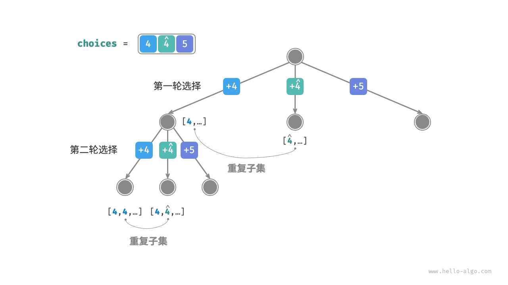

### 相等元素剪枝

为解决此问题，**我们需要限制相等元素在每一轮中只能被选择一次**。实现方式比较巧妙：由于数组是已排序的，因此相等元素都是相邻的。这意味着在某轮选择中，若当前元素与其左边元素相等，则说明它已经被选择过，因此直接跳过当前元素。

与此同时，**本题规定每个数组元素只能被选择一次**。幸运的是，我们也可以利用变量 `start` 来满足该约束：当做出选择 $x_{i}$ 后，设定下一轮从索引 $i + 1$ 开始向后遍历。这样既能去除重复子集，也能避免重复选择元素。

### 代码实现

```python
def backtrack(
    state: list[int], target: int, choices: list[int], start: int, res: list[list[int]]
):
    """回溯算法：子集和 II"""
    # 子集和等于 target 时，记录解
    if target == 0:
        res.append(list(state))
        return
    # 遍历所有选择
    # 剪枝二：从 start 开始遍历，避免生成重复子集
    # 剪枝三：从 start 开始遍历，避免重复选择同一元素
    for i in range(start, len(choices)):
        # 剪枝一：若子集和超过 target ，则直接结束循环
        # 这是因为数组已排序，后边元素更大，子集和一定超过 target
        if target - choices[i] < 0:
            break
        # 剪枝四：如果该元素与左边元素相等，说明该搜索分支重复，直接跳过
        if i > start and choices[i] == choices[i - 1]:
            continue
        # 尝试：做出选择，更新 target, start
        state.append(choices[i])
        # 进行下一轮选择
        backtrack(state, target - choices[i], choices, i + 1, res)
        # 回退：撤销选择，恢复到之前的状态
        state.pop()

def subset_sum_ii(nums: list[int], target: int) -> list[list[int]]:
    """求解子集和 II"""
    state = []  # 状态（子集）
    nums.sort()  # 对 nums 进行排序
    start = 0  # 遍历起始点
    res = []  # 结果列表（子集列表）
    backtrack(state, target, nums, start, res)
    return res
```

!!! example [pythontutor "可视化运行"](https://pythontutor.com/iframe-embed.html#code=def%20backtrack%28%0A%20%20%20%20state%3A%20list%5Bint%5D,%20target%3A%20int,%20choices%3A%20list%5Bint%5D,%20start%3A%20int,%20res%3A%20list%5Blist%5Bint%5D%5D%0A%29%3A%0A%20%20%20%20%22%22%22%E5%9B%9E%E6%BA%AF%E7%AE%97%E6%B3%95%EF%BC%9A%E5%AD%90%E9%9B%86%E5%92%8C%20II%22%22%22%0A%20%20%20%20%23%20%E5%AD%90%E9%9B%86%E5%92%8C%E7%AD%89%E4%BA%8E%20target%20%E6%97%B6%EF%BC%8C%E8%AE%B0%E5%BD%95%E8%A7%A3%0A%20%20%20%20if%20target%20%3D%3D%200%3A%0A%20%20%20%20%20%20%20%20res.append%28list%28state%29%29%0A%20%20%20%20%20%20%20%20return%0A%20%20%20%20%23%20%E9%81%8D%E5%8E%86%E6%89%80%E6%9C%89%E9%80%89%E6%8B%A9%0A%20%20%20%20%23%20%E5%89%AA%E6%9E%9D%E4%BA%8C%EF%BC%9A%E4%BB%8E%20start%20%E5%BC%80%E5%A7%8B%E9%81%8D%E5%8E%86%EF%BC%8C%E9%81%BF%E5%85%8D%E7%94%9F%E6%88%90%E9%87%8D%E5%A4%8D%E5%AD%90%E9%9B%86%0A%20%20%20%20%23%20%E5%89%AA%E6%9E%9D%E4%B8%89%EF%BC%9A%E4%BB%8E%20start%20%E5%BC%80%E5%A7%8B%E9%81%8D%E5%8E%86%EF%BC%8C%E9%81%BF%E5%85%8D%E9%87%8D%E5%A4%8D%E9%80%89%E6%8B%A9%E5%90%8C%E4%B8%80%E5%85%83%E7%B4%A0%0A%20%20%20%20for%20i%20in%20range%28start,%20len%28choices%29%29%3A%0A%20%20%20%20%20%20%20%20%23%20%E5%89%AA%E6%9E%9D%E4%B8%80%EF%BC%9A%E8%8B%A5%E5%AD%90%E9%9B%86%E5%92%8C%E8%B6%85%E8%BF%87%20target%20%EF%BC%8C%E5%88%99%E7%9B%B4%E6%8E%A5%E7%BB%93%E6%9D%9F%E5%BE%AA%E7%8E%AF%0A%20%20%20%20%20%20%20%20%23%20%E8%BF%99%E6%98%AF%E5%9B%A0%E4%B8%BA%E6%95%B0%E7%BB%84%E5%B7%B2%E6%8E%92%E5%BA%8F%EF%BC%8C%E5%90%8E%E8%BE%B9%E5%85%83%E7%B4%A0%E6%9B%B4%E5%A4%A7%EF%BC%8C%E5%AD%90%E9%9B%86%E5%92%8C%E4%B8%80%E5%AE%9A%E8%B6%85%E8%BF%87%20target%0A%20%20%20%20%20%20%20%20if%20target%20-%20choices%5Bi%5D%20%3C%200%3A%0A%20%20%20%20%20%20%20%20%20%20%20%20break%0A%20%20%20%20%20%20%20%20%23%20%E5%89%AA%E6%9E%9D%E5%9B%9B%EF%BC%9A%E5%A6%82%E6%9E%9C%E8%AF%A5%E5%85%83%E7%B4%A0%E4%B8%8E%E5%B7%A6%E8%BE%B9%E5%85%83%E7%B4%A0%E7%9B%B8%E7%AD%89%EF%BC%8C%E8%AF%B4%E6%98%8E%E8%AF%A5%E6%90%9C%E7%B4%A2%E5%88%86%E6%94%AF%E9%87%8D%E5%A4%8D%EF%BC%8C%E7%9B%B4%E6%8E%A5%E8%B7%B3%E8%BF%87%0A%20%20%20%20%20%20%20%20if%20i%20%3E%20start%20and%20choices%5Bi%5D%20%3D%3D%20choices%5Bi%20-%201%5D%3A%0A%20%20%20%20%20%20%20%20%20%20%20%20continue%0A%20%20%20%20%20%20%20%20%23%20%E5%B0%9D%E8%AF%95%EF%BC%9A%E5%81%9A%E5%87%BA%E9%80%89%E6%8B%A9%EF%BC%8C%E6%9B%B4%E6%96%B0%20target,%20start%0A%20%20%20%20%20%20%20%20state.append%28choices%5Bi%5D%29%0A%20%20%20%20%20%20%20%20%23%20%E8%BF%9B%E8%A1%8C%E4%B8%8B%E4%B8%80%E8%BD%AE%E9%80%89%E6%8B%A9%0A%20%20%20%20%20%20%20%20backtrack%28state,%20target%20-%20choices%5Bi%5D,%20choices,%20i%20%2B%201,%20res%29%0A%20%20%20%20%20%20%20%20%23%20%E5%9B%9E%E9%80%80%EF%BC%9A%E6%92%A4%E9%94%80%E9%80%89%E6%8B%A9%EF%BC%8C%E6%81%A2%E5%A4%8D%E5%88%B0%E4%B9%8B%E5%89%8D%E7%9A%84%E7%8A%B6%E6%80%81%0A%20%20%20%20%20%20%20%20state.pop%28%29%0A%0A%0Adef%20subset_sum_ii%28nums%3A%20list%5Bint%5D,%20target%3A%20int%29%20-%3E%20list%5Blist%5Bint%5D%5D%3A%0A%20%20%20%20%22%22%22%E6%B1%82%E8%A7%A3%E5%AD%90%E9%9B%86%E5%92%8C%20II%22%22%22%0A%20%20%20%20state%20%3D%20%5B%5D%20%20%23%20%E7%8A%B6%E6%80%81%EF%BC%88%E5%AD%90%E9%9B%86%EF%BC%89%0A%20%20%20%20nums.sort%28%29%20%20%23%20%E5%AF%B9%20nums%20%E8%BF%9B%E8%A1%8C%E6%8E%92%E5%BA%8F%0A%20%20%20%20start%20%3D%200%20%20%23%20%E9%81%8D%E5%8E%86%E8%B5%B7%E5%A7%8B%E7%82%B9%0A%20%20%20%20res%20%3D%20%5B%5D%20%20%23%20%E7%BB%93%E6%9E%9C%E5%88%97%E8%A1%A8%EF%BC%88%E5%AD%90%E9%9B%86%E5%88%97%E8%A1%A8%EF%BC%89%0A%20%20%20%20backtrack%28state,%20target,%20nums,%20start,%20res%29%0A%20%20%20%20return%20res%0A%0A%0A%22%22%22Driver%20Code%22%22%22%0Aif%20__name__%20%3D%3D%20%22__main__%22%3A%0A%20%20%20%20nums%20%3D%20%5B4,%204,%205%5D%0A%20%20%20%20target%20%3D%209%0A%20%20%20%20res%20%3D%20subset_sum_ii%28nums,%20target%29%0A%0A%20%20%20%20print%28f%22%E8%BE%93%E5%85%A5%E6%95%B0%E7%BB%84%20nums%20%3D%20%7Bnums%7D,%20target%20%3D%20%7Btarget%7D%22%29%0A%20%20%20%20print%28f%22%E6%89%80%E6%9C%89%E5%92%8C%E7%AD%89%E4%BA%8E%20%7Btarget%7D%20%E7%9A%84%E5%AD%90%E9%9B%86%20res%20%3D%20%7Bres%7D%22%29&codeDivHeight=800&codeDivWidth=600&cumulative=false&curInstr=16&heapPrimitives=nevernest&origin=opt-frontend.js&py=311&rawInputLstJSON=%5B%5D&textReferences=false)

下图展示了数组 $[4, 4, 5]$ 和目标元素 $9$ 的回溯过程，共包含四种剪枝操作。请你将图示与代码注释相结合，理解整个搜索过程，以及每种剪枝操作是如何工作的。

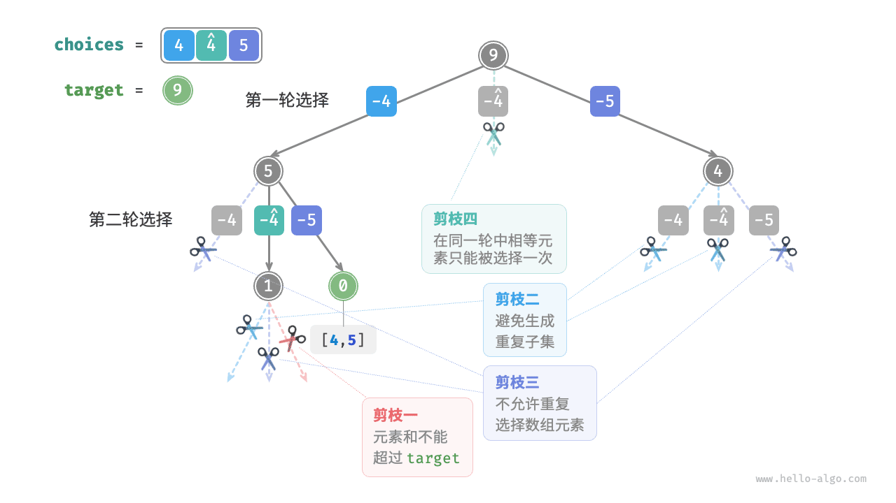

# n 皇后问题

!!! question

    根据国际象棋的规则，皇后可以攻击与同处一行、一列或一条斜线上的棋子。给定 $n$ 个皇后和一个 $n \times n$ 大小的棋盘，寻找使得所有皇后之间无法相互攻击的摆放方案。

如下图所示，当 $n = 4$ 时，共可以找到两个解。从回溯算法的角度看，$n \times n$ 大小的棋盘共有 $n^2$ 个格子，给出了所有的选择 `choices` 。在逐个放置皇后的过程中，棋盘状态在不断地变化，每个时刻的棋盘就是状态 `state` 。


下图展示了本题的三个约束条件：**多个皇后不能在同一行、同一列、同一条对角线上**。值得注意的是，对角线分为主对角线 `\` 和次对角线 `/` 两种。


### 逐行放置策略

皇后的数量和棋盘的行数都为 $n$ ，因此我们容易得到一个推论：**棋盘每行都允许且只允许放置一个皇后**。

也就是说，我们可以采取逐行放置策略：从第一行开始，在每行放置一个皇后，直至最后一行结束。

下图所示为 4 皇后问题的逐行放置过程。受画幅限制，下图仅展开了第一行的其中一个搜索分支，并且将不满足列约束和对角线约束的方案都进行了剪枝。

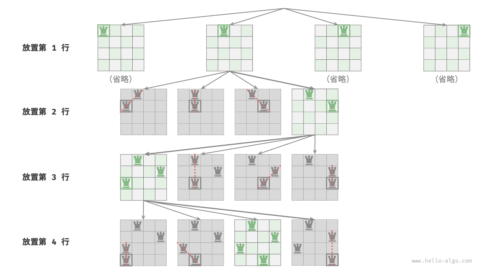

从本质上看，**逐行放置策略起到了剪枝的作用**，它避免了同一行出现多个皇后的所有搜索分支。

### 列与对角线剪枝

为了满足列约束，我们可以利用一个长度为 $n$ 的布尔型数组 `cols` 记录每一列是否有皇后。在每次决定放置前，我们通过 `cols` 将已有皇后的列进行剪枝，并在回溯中动态更新 `cols` 的状态。

!!! tip

    请注意，矩阵的起点位于左上角，其中行索引从上到下增加，列索引从左到右增加。

那么，如何处理对角线约束呢？设棋盘中某个格子的行列索引为 $(row, col)$ ，选定矩阵中的某条主对角线，我们发现该对角线上所有格子的行索引减列索引都相等，**即主对角线上所有格子的 $row - col$ 为恒定值**。

也就是说，如果两个格子满足 $row_1 - col_1 = row_2 - col_2$ ，则它们一定处在同一条主对角线上。利用该规律，我们可以借助下图所示的数组 `diags1` 记录每条主对角线上是否有皇后。

同理，**次对角线上的所有格子的 $row + col$ 是恒定值**。我们同样也可以借助数组 `diags2` 来处理次对角线约束。

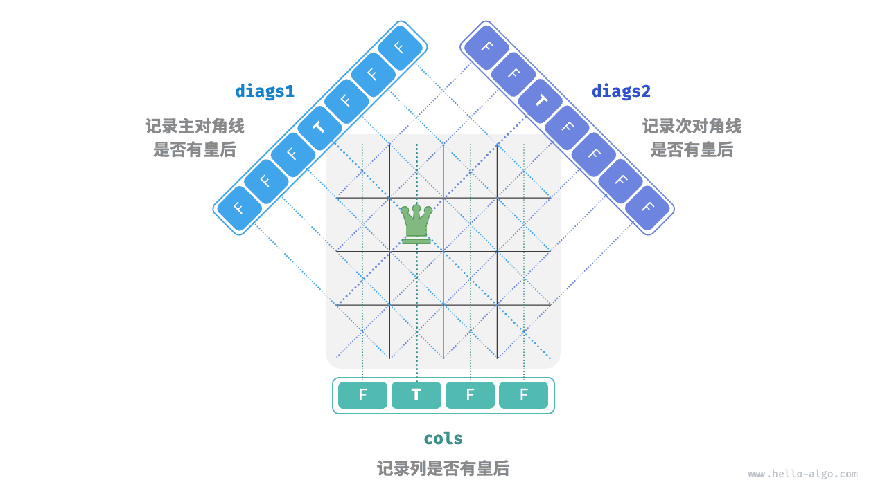

### 代码实现

请注意，$n$ 维方阵中 $row - col$ 的范围是 $[-n + 1, n - 1]$ ，$row + col$ 的范围是 $[0, 2n - 2]$ ，所以主对角线和次对角线的数量都为 $2n - 1$ ，即数组 `diags1` 和 `diags2` 的长度都为 $2n - 1$ 。

```python
def backtrack(
    row: int,
    n: int,
    state: list[list[str]],
    res: list[list[list[str]]],
    cols: list[bool],
    diags1: list[bool],
    diags2: list[bool],
):
    """回溯算法：n 皇后"""
    # 当放置完所有行时，记录解
    if row == n:
        res.append([list(row) for row in state])
        return
    # 遍历所有列
    for col in range(n):
        # 计算该格子对应的主对角线和次对角线
        diag1 = row - col + n - 1
        diag2 = row + col
        # 剪枝：不允许该格子所在列、主对角线、次对角线上存在皇后
        if not cols[col] and not diags1[diag1] and not diags2[diag2]:
            # 尝试：将皇后放置在该格子
            state[row][col] = "Q"
            cols[col] = diags1[diag1] = diags2[diag2] = True
            # 放置下一行
            backtrack(row + 1, n, state, res, cols, diags1, diags2)
            # 回退：将该格子恢复为空位
            state[row][col] = "#"
            cols[col] = diags1[diag1] = diags2[diag2] = False

def n_queens(n: int) -> list[list[list[str]]]:
    """求解 n 皇后"""
    # 初始化 n*n 大小的棋盘，其中 'Q' 代表皇后，'#' 代表空位
    state = [["#" for _ in range(n)] for _ in range(n)]
    cols = [False] * n  # 记录列是否有皇后
    diags1 = [False] * (2 * n - 1)  # 记录主对角线上是否有皇后
    diags2 = [False] * (2 * n - 1)  # 记录次对角线上是否有皇后
    res = []
    backtrack(0, n, state, res, cols, diags1, diags2)

    return res
```

!!! example [pythontutor "可视化运行"](https://pythontutor.com/iframe-embed.html#code=def%20backtrack%28%0A%20%20%20%20row%3A%20int,%0A%20%20%20%20n%3A%20int,%0A%20%20%20%20state%3A%20list%5Blist%5Bstr%5D%5D,%0A%20%20%20%20res%3A%20list%5Blist%5Blist%5Bstr%5D%5D%5D,%0A%20%20%20%20cols%3A%20list%5Bbool%5D,%0A%20%20%20%20diags1%3A%20list%5Bbool%5D,%0A%20%20%20%20diags2%3A%20list%5Bbool%5D,%0A%29%3A%0A%20%20%20%20%22%22%22%E5%9B%9E%E6%BA%AF%E7%AE%97%E6%B3%95%EF%BC%9AN%20%E7%9A%87%E5%90%8E%22%22%22%0A%20%20%20%20%23%20%E5%BD%93%E6%94%BE%E7%BD%AE%E5%AE%8C%E6%89%80%E6%9C%89%E8%A1%8C%E6%97%B6%EF%BC%8C%E8%AE%B0%E5%BD%95%E8%A7%A3%0A%20%20%20%20if%20row%20%3D%3D%20n%3A%0A%20%20%20%20%20%20%20%20res.append%28%5Blist%28row%29%20for%20row%20in%20state%5D%29%0A%20%20%20%20%20%20%20%20return%0A%20%20%20%20%23%20%E9%81%8D%E5%8E%86%E6%89%80%E6%9C%89%E5%88%97%0A%20%20%20%20for%20col%20in%20range%28n%29%3A%0A%20%20%20%20%20%20%20%20%23%20%E8%AE%A1%E7%AE%97%E8%AF%A5%E6%A0%BC%E5%AD%90%E5%AF%B9%E5%BA%94%E7%9A%84%E4%B8%BB%E5%AF%B9%E8%A7%92%E7%BA%BF%E5%92%8C%E6%AC%A1%E5%AF%B9%E8%A7%92%E7%BA%BF%0A%20%20%20%20%20%20%20%20diag1%20%3D%20row%20-%20col%20%2B%20n%20-%201%0A%20%20%20%20%20%20%20%20diag2%20%3D%20row%20%2B%20col%0A%20%20%20%20%20%20%20%20%23%20%E5%89%AA%E6%9E%9D%EF%BC%9A%E4%B8%8D%E5%85%81%E8%AE%B8%E8%AF%A5%E6%A0%BC%E5%AD%90%E6%89%80%E5%9C%A8%E5%88%97%E3%80%81%E4%B8%BB%E5%AF%B9%E8%A7%92%E7%BA%BF%E3%80%81%E6%AC%A1%E5%AF%B9%E8%A7%92%E7%BA%BF%E4%B8%8A%E5%AD%98%E5%9C%A8%E7%9A%87%E5%90%8E%0A%20%20%20%20%20%20%20%20if%20not%20cols%5Bcol%5D%20and%20not%20diags1%5Bdiag1%5D%20and%20not%20diags2%5Bdiag2%5D%3A%0A%20%20%20%20%20%20%20%20%20%20%20%20%23%20%E5%B0%9D%E8%AF%95%EF%BC%9A%E5%B0%86%E7%9A%87%E5%90%8E%E6%94%BE%E7%BD%AE%E5%9C%A8%E8%AF%A5%E6%A0%BC%E5%AD%90%0A%20%20%20%20%20%20%20%20%20%20%20%20state%5Brow%5D%5Bcol%5D%20%3D%20%22Q%22%0A%20%20%20%20%20%20%20%20%20%20%20%20cols%5Bcol%5D%20%3D%20diags1%5Bdiag1%5D%20%3D%20diags2%5Bdiag2%5D%20%3D%20True%0A%20%20%20%20%20%20%20%20%20%20%20%20%23%20%E6%94%BE%E7%BD%AE%E4%B8%8B%E4%B8%80%E8%A1%8C%0A%20%20%20%20%20%20%20%20%20%20%20%20backtrack%28row%20%2B%201,%20n,%20state,%20res,%20cols,%20diags1,%20diags2%29%0A%20%20%20%20%20%20%20%20%20%20%20%20%23%20%E5%9B%9E%E9%80%80%EF%BC%9A%E5%B0%86%E8%AF%A5%E6%A0%BC%E5%AD%90%E6%81%A2%E5%A4%8D%E4%B8%BA%E7%A9%BA%E4%BD%8D%0A%20%20%20%20%20%20%20%20%20%20%20%20state%5Brow%5D%5Bcol%5D%20%3D%20%22%23%22%0A%20%20%20%20%20%20%20%20%20%20%20%20cols%5Bcol%5D%20%3D%20diags1%5Bdiag1%5D%20%3D%20diags2%5Bdiag2%5D%20%3D%20False%0A%0A%0Adef%20n_queens%28n%3A%20int%29%20-%3E%20list%5Blist%5Blist%5Bstr%5D%5D%5D%3A%0A%20%20%20%20%22%22%22%E6%B1%82%E8%A7%A3%20N%20%E7%9A%87%E5%90%8E%22%22%22%0A%20%20%20%20%23%20%E5%88%9D%E5%A7%8B%E5%8C%96%20n*n%20%E5%A4%A7%E5%B0%8F%E7%9A%84%E6%A3%8B%E7%9B%98%EF%BC%8C%E5%85%B6%E4%B8%AD%20'Q'%20%E4%BB%A3%E8%A1%A8%E7%9A%87%E5%90%8E%EF%BC%8C'%23'%20%E4%BB%A3%E8%A1%A8%E7%A9%BA%E4%BD%8D%0A%20%20%20%20state%20%3D%20%5B%5B%22%23%22%20for%20_%20in%20range%28n%29%5D%20for%20_%20in%20range%28n%29%5D%0A%20%20%20%20cols%20%3D%20%5BFalse%5D%20*%20n%20%20%23%20%E8%AE%B0%E5%BD%95%E5%88%97%E6%98%AF%E5%90%A6%E6%9C%89%E7%9A%87%E5%90%8E%0A%20%20%20%20diags1%20%3D%20%5BFalse%5D%20*%20%282%20*%20n%20-%201%29%20%20%23%20%E8%AE%B0%E5%BD%95%E4%B8%BB%E5%AF%B9%E8%A7%92%E7%BA%BF%E4%B8%8A%E6%98%AF%E5%90%A6%E6%9C%89%E7%9A%87%E5%90%8E%0A%20%20%20%20diags2%20%3D%20%5BFalse%5D%20*%20%282%20*%20n%20-%201%29%20%20%23%20%E8%AE%B0%E5%BD%95%E6%AC%A1%E5%AF%B9%E8%A7%92%E7%BA%BF%E4%B8%8A%E6%98%AF%E5%90%A6%E6%9C%89%E7%9A%87%E5%90%8E%0A%20%20%20%20res%20%3D%20%5B%5D%0A%20%20%20%20backtrack%280,%20n,%20state,%20res,%20cols,%20diags1,%20diags2%29%0A%0A%20%20%20%20return%20res%0A%0A%0A%22%22%22Driver%20Code%22%22%22%0Aif%20__name__%20%3D%3D%20%22__main__%22%3A%0A%20%20%20%20n%20%3D%204%0A%20%20%20%20res%20%3D%20n_queens%28n%29%0A%0A%20%20%20%20print%28f%22%E8%BE%93%E5%85%A5%E6%A3%8B%E7%9B%98%E9%95%BF%E5%AE%BD%E4%B8%BA%20%7Bn%7D%22%29%0A%20%20%20%20print%28f%22%E7%9A%87%E5%90%8E%E6%94%BE%E7%BD%AE%E6%96%B9%E6%A1%88%E5%85%B1%E6%9C%89%20%7Blen%28res%29%7D%20%E7%A7%8D%22%29%0A%20%20%20%20for%20state%20in%20res%3A%0A%20%20%20%20%20%20%20%20print%28%22--------------------%22%29%0A%20%20%20%20%20%20%20%20for%20row%20in%20state%3A%0A%20%20%20%20%20%20%20%20%20%20%20%20print%28row%29&codeDivHeight=800&codeDivWidth=600&cumulative=false&curInstr=61&heapPrimitives=nevernest&origin=opt-frontend.js&py=311&rawInputLstJSON=%5B%5D&textReferences=false)

逐行放置 $n$ 次，考虑列约束，则从第一行到最后一行分别有 $n$、$n-1$、$\dots$、$2$、$1$ 个选择，使用 $O(n!)$ 时间。当记录解时，需要复制矩阵 `state` 并添加进 `res` ，复制操作使用 $O(n^2)$ 时间。因此，**总体时间复杂度为 $O(n! \cdot n^2)$** 。实际上，根据对角线约束的剪枝也能够大幅缩小搜索空间，因而搜索效率往往优于以上时间复杂度。

数组 `state` 使用 $O(n^2)$ 空间，数组 `cols`、`diags1` 和 `diags2` 皆使用 $O(n)$ 空间。最大递归深度为 $n$ ，使用 $O(n)$ 栈帧空间。因此，**空间复杂度为 $O(n^2)$** 。


# 三、递归回溯练习

全排列、子集、分割回文串、N皇后 四个题目，给出了状态树（树形图示）帮助理解。全排列、子集、N皇后还有视频讲解。

**必须掌握**：递归与回溯是算法中的核心思想之一，尤其在解决组合、排列、子集等问题时至关重要。如果你目前尚未完全理解其原理，建议先**熟记经典模板**，通过反复运行代码、调试过程、结合视频讲解来逐步深入理解。

> “递归是思想，回溯是技巧；先走到底，再退回来。”

掌握经典问题，你就迈出了通向回溯算法的第一步！


## 示例且练习M46.全排列

backtracking, https://leetcode.cn/problems/permutations/

给定一个不含重复数字的数组 `nums` ，返回其 *所有可能的全排列* 。你可以 **按任意顺序** 返回答案。

 

**示例 1：**

```
输入：nums = [1,2,3]
输出：[[1,2,3],[1,3,2],[2,1,3],[2,3,1],[3,1,2],[3,2,1]]
```

**示例 2：**

```
输入：nums = [0,1]
输出：[[0,1],[1,0]]
```

**示例 3：**

```
输入：nums = [1]
输出：[[1]]
```

 

**提示：**

- `1 <= nums.length <= 6`
- `-10 <= nums[i] <= 10`
- `nums` 中的所有整数 **互不相同**


思路：递归 + 回溯

使用一个临时路径 `sol` 记录当前排列，通过遍历原数组并跳过已选元素的方式进行搜索。当路径长度等于数组长度时，将当前排列加入结果集。


```python
class Solution:
    def permute(self, nums: List[int]) -> List[List[int]]:
        n = len(nums)
        ans, sol = [], []
        
        def backtrack():
            # 终止条件：当前排列已满
            if len(sol) == n:
                ans.append(sol[:])  # 深拷贝
                return
            
            # 尝试每个未被使用的数
            for x in nums:
                if x not in sol:        # 剪枝：避免重复使用
                    sol.append(x)       # 选择
                    backtrack()         # 递归
                    sol.pop()           # 回溯
        
        backtrack()
        return ans
```

全排列视频讲解：https://pku.instructuremedia.com/embed/c76751c9-bc0e-49f1-8a99-624b955de668


## 练习sy134: 全排列III 中等

https://sunnywhy.com/sfbj/4/3/134

给定一个长度为n的序列，其中有n个可能重复的正整数，求该序列的所有全排列。

**输入描述**

第一行一个正整数n（$1 \le n \le 8$），表示序列中的元素个数。

第二行按升序给出n个可能重复的正整数（每个正整数均不超过100）。

**输出描述**

每个全排列一行，输出所有全排列。

输出顺序为：两个全排列A和B，若满足前k-1项对应相同，但有$A_k < B_k$，那么将全排列A优先输出（例如[1,2,3]比[1,3,2]优先输出）。

在输出时，全排列中的每个数之间用一个空格隔开，行末不允许有多余的空格。不允许出现相同的全排列。

样例1

输入

```
3
1 1 3
```

输出

```
1 1 3
1 3 1
3 1 1
```


有2处剪枝。必须按 **位置（索引）** 来判断是否使用过，而不是按 **值**。

```python
from typing import List

class Solution:
    #def permute(self, nums: List[int]) -> List[List[int]]:
    def permute(self, nums: List[int]) -> set[tuple]:
        n = len(nums)
        # ans, sol = [], []
        ans, sol = set(), []
        used = [False] * n  # ← 新增：记录每个位置是否用过

        def backtrack():
            # 终止条件：当前排列已满
            if len(sol) == n:
                # ans.append(sol[:])  # 深拷贝
                ans.add(tuple(sol))
                return

            # 尝试每个未被使用的数
            #for x in nums:
            for i in range(n):
                if used[i]:
                    continue
                # 去重剪枝：相同值且前一个未使用，则跳过（保证字典序+去重）
                if i>0 and nums[i-1]==nums[i] and used[i-1]:
                    continue
                used[i] = True
                sol.append(nums[i])  # 选择
                backtrack()  # 递归
                sol.pop()  # 回溯
                used[i] = False

        nums.sort()
        backtrack()
        return ans

if __name__ == '__main__':
    sol = Solution()
    n = int(input())
    a = list(map(int, input().split()))
    result = sol.permute(a)
    for perm in sorted(result):
        print(*perm)
```


## 示例且练习M78.子集

backtracking, https://leetcode.cn/problems/subsets/

给你一个整数数组 `nums` ，数组中的元素 **互不相同** 。返回该数组所有可能的子集（幂集）。

解集 **不能** 包含重复的子集。你可以按 **任意顺序** 返回解集。

 

**示例 1：**

```
输入：nums = [1,2,3]
输出：[[],[1],[2],[1,2],[3],[1,3],[2,3],[1,2,3]]
```

**示例 2：**

```
输入：nums = [0]
输出：[[],[0]]
```

 

**提示：**

- `1 <= nums.length <= 10`
- `-10 <= nums[i] <= 10`
- `nums` 中的所有元素 **互不相同**


思路：递归回溯（选或不选）

对每个元素有两种选择：**选入子集** 或 **不选入子集**。递归遍历所有位置，到达末尾时将当前路径加入结果。


```python
class Solution:
    def subsets(self, nums: List[int]) -> List[List[int]]:
        n = len(nums)
        ans, sol = [], []
        
        def backtrack(i):
            # 终止条件：处理完所有元素
            if i == n:
                ans.append(sol[:])
                return
            
            # 分支1：不选择 nums[i]
            backtrack(i + 1)
            
            # 分支2：选择 nums[i]
            sol.append(nums[i])
            backtrack(i + 1)
            sol.pop()  # 回溯
        
        backtrack(0)
        return ans
```

子集视频讲解：https://pku.instructuremedia.com/embed/d8ccd717-3664-41bc-85d2-7170f348327b


**总结对比**

| 问题   | 决策方式         | 终止条件         | 是否需要去重       | 时间复杂度        |
| ------ | ---------------- | ---------------- | ------------------ | ----------------- |
| 全排列 | 从剩余元素中选择 | 路径长度 = n     | 是（避免重复使用） | $O(n \times n!)$  |
| 子集   | 每个元素选/不选  | 索引到达数组末尾 | 否（天然无重）     | $O(2^n \times n)$ |

> ⚠️ 注意：由于每次添加路径都需要复制 `sol[:]`，因此总时间复杂度中乘以 `n`。


## 示例且练习M131.分割回文串

dp, backtracking, https://leetcode.cn/problems/palindrome-partitioning/

给你一个字符串 `s`，请你将 `s` 分割成一些子串，使每个子串都是 **回文串**。返回 `s` 所有可能的分割方案。回文串是指向前和向后读都相同的字符串。


**示例 1：**

```
输入：s = "aab"
输出：[["a","a","b"],["aa","b"]]
```

**示例 2：**

```
输入：s = "a"
输出：[["a"]]
```

 

**提示：**

- `1 <= s.length <= 16`
- `s` 仅由小写英文字母组成


【陈林鑫 物理学院】思路：


如图所示，对于一个字符串s，依次判断从i=1到i=len(s)+1，s[0:i]是否为回文串，如果是，则在i处分割，前半部分为回文串，将它计入这条递归的列表resi中，剩下的部分s[i:]则继续分割。如果剩下的字符串s[i:]长度为0，则说明分割完毕，返回resi。for循环可以遍历所有情形。

如果字符串较长，可以使用 **LRU 缓存递归判断**（不建 DP 表）

```python
from functools import lru_cache

class Solution:
    def partition(self, s: str) -> List[List[str]]:
        n = len(s)
        ans = []
        @lru_cache(None)
        def is_pal(i, j):
            return i >= j or (s[i] == s[j] and is_pal(i + 1, j - 1))

        def dfs(start, path):
            if start == n:
                ans.append(path[:])
                return
            for end in range(start, n):
                if is_pal(start, end):
                    path.append(s[start:end + 1])
                    dfs(end + 1, path)
                    path.pop()
        dfs(0, [])
        return ans

```


## 示例且练习T51.N皇后

backtracking, https://leetcode.cn/problems/n-queens/

按照国际象棋的规则，皇后可以攻击与之处在同一行或同一列或同一斜线上的棋子。

**n 皇后问题** 研究的是如何将 `n` 个皇后放置在 `n×n` 的棋盘上，并且使皇后彼此之间不能相互攻击。

给你一个整数 `n` ，返回所有不同的 **n 皇后问题** 的解决方案。

每一种解法包含一个不同的 **n 皇后问题** 的棋子放置方案，该方案中 `'Q'` 和 `'.'` 分别代表了皇后和空位。

 

**示例 1：**


```
输入：n = 4
输出：[[".Q..","...Q","Q...","..Q."],["..Q.","Q...","...Q",".Q.."]]
解释：如上图所示，4 皇后问题存在两个不同的解法。
```

**示例 2：**

```
输入：n = 1
输出：[["Q"]]
```

 

**提示：**

- `1 <= n <= 9`


**思路：递归 + 回溯**

逐行放置皇后，每行只能放一个。
对每一行，我们尝试在每一列放皇后，要求：

- 该列没有皇后；
- 主对角线（row - col）没有皇后；
- 副对角线（row + col）没有皇后。

若当前行放置成功，则递归到下一行。
若到达最后一行，则将当前棋盘状态加入答案。


```python
class Solution:
    def solveNQueens(self, n: int) -> List[List[str]]:
        ans = []              # 存放所有解
        sol = []              # 当前棋盘布局（每行的列索引）
        cols = set()          # 已占用的列
        diag1 = set()         # 已占用的主对角线（r - c）
        diag2 = set()         # 已占用的副对角线（r + c）
        
        def backtrack(row):
            # 终止条件：所有行均已放置完毕
            if row == n:
                board = []
                for c in sol:
                    board.append('.' * c + 'Q' + '.' * (n - c - 1))
                ans.append(board[:])
                return
            
            # 尝试每一列
            for col in range(n):
                if col in cols or (row - col) in diag1 or (row + col) in diag2:
                    continue  # 剪枝：冲突
                
                # 选择
                sol.append(col)
                cols.add(col)
                diag1.add(row - col)
                diag2.add(row + col)
                
                # 递归
                backtrack(row + 1)
                
                # 回溯
                sol.pop()
                cols.remove(col)
                diag1.remove(row - col)
                diag2.remove(row + col)
        
        backtrack(0)
        return ans
```


八皇后视频讲解（oj02754八皇后_TA胡扬-哔哩哔哩） https://b23.tv/s933Y5c

```python
class Solution:
    def solveNQueens(self, n: int) -> List[List[str]]:
        solutions = []
        def queens(row: int, cols: List[int], ldiags: Set[int], rdiags: Set[int]) -> None:
            if row == n:
                solutions.append(["".join("Q" if j == cols[i] else "." for j in range(n)) for i in range(n)])
                return
            for j in range(n):
                if j not in cols and row + j not in ldiags and row - j not in rdiags:
                    queens(row + 1, cols + [j], ldiags | {row + j}, rdiags | {row - j})

        queens(0, [], set(), set())
        return solutions
```


**复杂度分析**

| 项目       | 含义    | 复杂度               |
| ---------- | ------- | -------------------- |
| 状态树深度 | 行数 n  | —                    |
| 分支数     | 最多 n  | —                    |
| 时间复杂度 | $O(n!)$ | 尝试所有排列并剪枝   |
| 空间复杂度 | $O(n)$  | 递归栈深度与辅助集合 |

------

✅ **模板对比总结**

| 问题       | 状态含义 | 决策方式        | 剪枝              | 终止条件        |
| ---------- | -------- | --------------- | ----------------- | --------------- |
| 全排列     | 当前路径 | 选未使用数      | `if x not in sol` | 路径长度 = n    |
| 子集       | 当前索引 | 选/不选当前元素 | 无                | i == n          |
| 分割回文串 | 当前起点 | 枚举每个回文段  | is_pal 判断       | start == len(s) |
| 八皇后     | 当前行号 | 尝试每列放皇后  | 列与对角线冲突    | row == n        |


> **“主对角线”为什么叫主**。我们来一步步讲清楚它的**定义、命名来源与几何直观意义**。
>
> ------
>
> 🧮 一、数学定义（源自线性代数）
>
> 在一个 $ n \times n $ 矩阵中：
>
> > **主对角线（main diagonal）** 是所有满足 **行号 = 列号** 的元素连成的那条线。
>
> 也就是：
> $
> a_{00}, a_{11}, a_{22}, \ldots, a_{n-1,n-1}
> $
>
> **例如：**
>
> 主对角线就是：
>
>
> $$
> \left[
> \matrix{
> 	a_{00} & a_{01} & a_{02} \\
> 	a_{10} & a_{11} & a_{12} \\
> 	a_{20} & a_{21} & a_{22}
> }
> 
> \right]
> $$
>
> 
>
>
> ------
>
> 🟦 二、几何解释
>
> 把矩阵画在坐标平面上（左上角是原点）：
>
> | 坐标  | 行号 | 列号 | 是否在主对角线上 |
> | ----- | ---- | ---- | ---------------- |
> | (0,0) | 0    | 0    | ✅                |
> | (1,1) | 1    | 1    | ✅                |
> | (2,2) | 2    | 2    | ✅                |
>
> 可以看到这些点在一条**从左上到右下的斜线上**。
> 它满足 `row == col`，也就是：
>
> > ✅ 主对角线 ↘ ：从左上角 (0,0) 贯穿到右下角 (n-1,n-1)。
>
> ------
>
> 🟥 三、副对角线（secondary diagonal）
>
> 副对角线又称“反对角线”、“次对角线”，它与主对角线方向相反：
>
> > **副对角线** 是所有满足 **行号 + 列号 = n - 1** 的元素连成的那条线。
>
> 例如：
> [
> a_{02}, a_{11}, a_{20}
> ]
> （对 (3\times3) 矩阵）
>
> 它对应的是：
>
> > ✅ 副对角线 ↙ ：从右上角 (0, n-1) 贯穿到左下角 (n-1, 0)。
>
> ------
>
> 🧭 四、命名由来
>
> 主对角线（main diagonal）的“主”有两个历史原因：
>
> 1. **矩阵主元素都在这条线上**
>    在线性代数中，一个矩阵的“迹”（trace）是主对角线元素之和：
>    [
>    \text{tr}(A) = a_{00} + a_{11} + \cdots + a_{n-1,n-1}
>    ]
>    所以它是矩阵最重要的一条线。
> 2. **几何直观中方向一致**
>    主对角线方向与坐标轴增长方向一致：
>    行号和列号都“同时增大”。
>    因此称为 **“主”**（main 或 principal）。
>
> 相反，副对角线方向与坐标轴增减相反（一个增一个减），所以是“副”。
>
> ------
>
> 🎯 五、在八皇后问题中如何利用
>
> | 对角线     | 方向      | 代数规律         | 检查条件             | 示例              |
> | ---------- | --------- | ---------------- | -------------------- | ----------------- |
> | 主对角线 ↘ | 左上→右下 | `row - col` 相同 | `(r - c)` 是否已出现 | (0,0),(1,1),(2,2) |
> | 副对角线 ↙ | 右上→左下 | `row + col` 相同 | `(r + c)` 是否已出现 | (0,2),(1,1),(2,0) |
>
> ------
>
> 记忆口诀
>
> > **主对角线 ↘ ：行号 = 列号，同增同减；**
> > **副对角线 ↙ ：行号 + 列号 = 常数，一增一减。**
>
> ------
>
> 如果你希望我帮你**画一个 n=4 棋盘图**，标出主对角线、副对角线及它们的 `(row,col)` 与公式（比如带箭头标注 ↘ ↙），我可以生成一张直观示意图，帮你彻底搞懂这一节。
> 是否要我生成这张图？


# 小结

### 重点回顾

- 回溯算法本质是穷举法，通过对解空间进行深度优先遍历来寻找符合条件的解。在搜索过程中，遇到满足条件的解则记录，直至找到所有解或遍历完成后结束。
- 回溯算法的搜索过程包括尝试与回退两个部分。它通过深度优先搜索来尝试各种选择，当遇到不满足约束条件的情况时，则撤销上一步的选择，退回到之前的状态，并继续尝试其他选择。尝试与回退是两个方向相反的操作。
- 回溯问题通常包含多个约束条件，它们可用于实现剪枝操作。剪枝可以提前结束不必要的搜索分支，大幅提升搜索效率。
- 回溯算法主要可用于解决搜索问题和约束满足问题。组合优化问题虽然可以用回溯算法解决，但往往存在效率更高或效果更好的解法。
- 全排列问题旨在搜索给定集合元素的所有可能的排列。我们借助一个数组来记录每个元素是否被选择，剪掉重复选择同一元素的搜索分支，确保每个元素只被选择一次。
- 在全排列问题中，如果集合中存在重复元素，则最终结果会出现重复排列。我们需要约束相等元素在每轮中只能被选择一次，这通常借助一个哈希集合来实现。
- 子集和问题的目标是在给定集合中找到和为目标值的所有子集。集合不区分元素顺序，而搜索过程会输出所有顺序的结果，产生重复子集。我们在回溯前将数据进行排序，并设置一个变量来指示每一轮的遍历起始点，从而将生成重复子集的搜索分支进行剪枝。
- 对于子集和问题，数组中的相等元素会产生重复集合。我们利用数组已排序的前置条件，通过判断相邻元素是否相等实现剪枝，从而确保相等元素在每轮中只能被选中一次。
- $n$ 皇后问题旨在寻找将 $n$ 个皇后放置到 $n \times n$ 尺寸棋盘上的方案，要求所有皇后两两之间无法攻击对方。该问题的约束条件有行约束、列约束、主对角线和次对角线约束。为满足行约束，我们采用按行放置的策略，保证每一行放置一个皇后。
- 列约束和对角线约束的处理方式类似。对于列约束，我们利用一个数组来记录每一列是否有皇后，从而指示选中的格子是否合法。对于对角线约束，我们借助两个数组来分别记录该主、次对角线上是否存在皇后；难点在于找出处在同一主（副）对角线上的格子所满足的行列索引规律。

### Q & A

!!! question 怎么理解回溯和递归的关系？

    总的来看，回溯是一种“算法策略”，而递归更像是一个“工具”。

    - 回溯算法通常基于递归实现。然而，回溯是递归的应用场景之一，是递归在搜索问题中的应用。
    - 递归的结构体现了“子问题分解”的解题范式，常用于解决分治、回溯、动态规划（记忆化递归）等问题。
