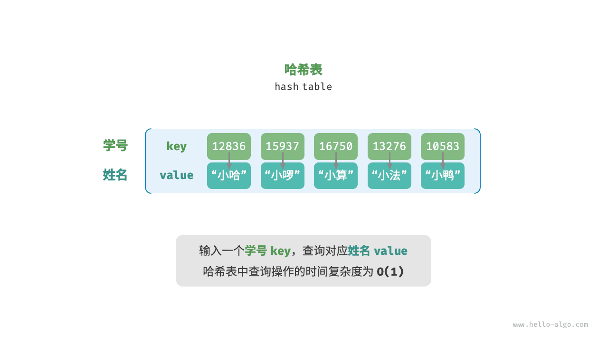
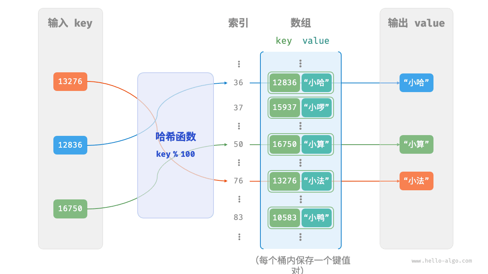
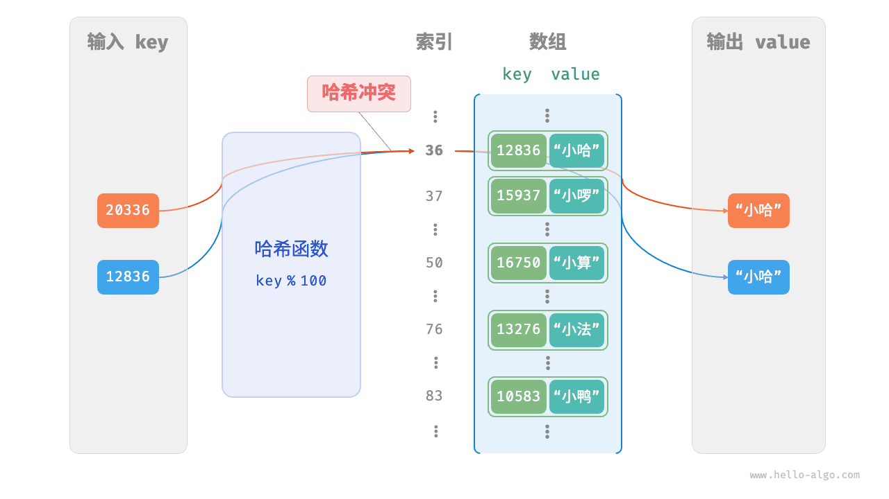
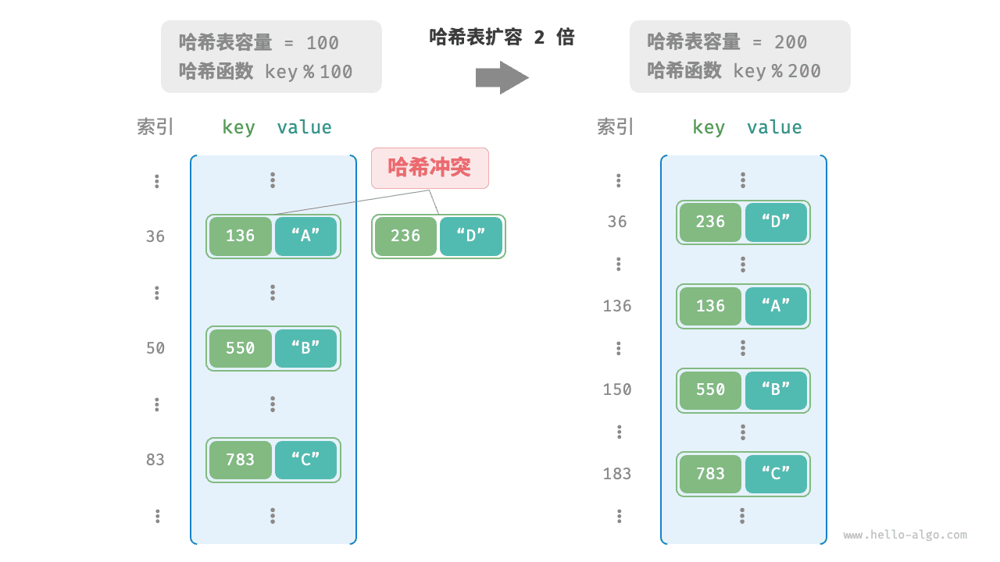

# 杂凑有章


# 哈希表

<u>哈希表（hash table）</u>，又称<u>散列表</u>，它通过建立键 `key` 与值 `value` 之间的映射，实现高效的元素查询。具体而言，我们向哈希表中输入一个键 `key` ，则可以在 $O(1)$ 时间内获取对应的值 `value` 。

如下图所示，给定 $n$ 个学生，每个学生都有“姓名”和“学号”两项数据。假如我们希望实现“输入一个学号，返回对应的姓名”的查询功能，则可以采用下图所示的哈希表来实现。



除哈希表外，数组和链表也可以实现查询功能，它们的效率对比如下表所示。

- **添加元素**：仅需将元素添加至数组（链表）的尾部即可，使用 $O(1)$ 时间。
- **查询元素**：由于数组（链表）是乱序的，因此需要遍历其中的所有元素，使用 $O(n)$ 时间。
- **删除元素**：需要先查询到元素，再从数组（链表）中删除，使用 $O(n)$ 时间。

<p align="center"> 表 <id> &nbsp; 元素查询效率对比 </p>

|          | 数组   | 链表   | 哈希表 |
| -------- | ------ | ------ | ------ |
| 查找元素 | $O(n)$ | $O(n)$ | $O(1)$ |
| 添加元素 | $O(1)$ | $O(1)$ | $O(1)$ |
| 删除元素 | $O(n)$ | $O(n)$ | $O(1)$ |

观察发现，**在哈希表中进行增删查改的时间复杂度都是 $O(1)$** ，非常高效。

## 哈希表常用操作

哈希表的常见操作包括：初始化、查询操作、添加键值对和删除键值对等，示例代码如下：

```python
# 初始化哈希表
hmap: dict = {}

# 添加操作
# 在哈希表中添加键值对 (key, value)
hmap[12836] = "小哈"
hmap[15937] = "小啰"
hmap[16750] = "小算"
hmap[13276] = "小法"
hmap[10583] = "小鸭"

# 查询操作
# 向哈希表中输入键 key ，得到值 value
name: str = hmap[15937]

# 删除操作
# 在哈希表中删除键值对 (key, value)
hmap.pop(10583)
```

!!! example [pythontutor "可视化运行"](https://pythontutor.com/iframe-embed.html#code=%22%22%22Driver%20Code%22%22%22%0Aif%20__name__%20%3D%3D%20%22__main__%22%3A%0A%20%20%20%20%23%20%E5%88%9D%E5%A7%8B%E5%8C%96%E5%93%88%E5%B8%8C%E8%A1%A8%0A%20%20%20%20hmap%20%3D%20%7B%7D%0A%20%20%20%20%0A%20%20%20%20%23%20%E6%B7%BB%E5%8A%A0%E6%93%8D%E4%BD%9C%0A%20%20%20%20%23%20%E5%9C%A8%E5%93%88%E5%B8%8C%E8%A1%A8%E4%B8%AD%E6%B7%BB%E5%8A%A0%E9%94%AE%E5%80%BC%E5%AF%B9%20%28key,%20value%29%0A%20%20%20%20hmap%5B12836%5D%20%3D%20%22%E5%B0%8F%E5%93%88%22%0A%20%20%20%20hmap%5B15937%5D%20%3D%20%22%E5%B0%8F%E5%95%B0%22%0A%20%20%20%20hmap%5B16750%5D%20%3D%20%22%E5%B0%8F%E7%AE%97%22%0A%20%20%20%20hmap%5B13276%5D%20%3D%20%22%E5%B0%8F%E6%B3%95%22%0A%20%20%20%20hmap%5B10583%5D%20%3D%20%22%E5%B0%8F%E9%B8%AD%22%0A%20%20%20%20%0A%20%20%20%20%23%20%E6%9F%A5%E8%AF%A2%E6%93%8D%E4%BD%9C%0A%20%20%20%20%23%20%E5%90%91%E5%93%88%E5%B8%8C%E8%A1%A8%E4%B8%AD%E8%BE%93%E5%85%A5%E9%94%AE%20key%20%EF%BC%8C%E5%BE%97%E5%88%B0%E5%80%BC%20value%0A%20%20%20%20name%20%3D%20hmap%5B15937%5D%0A%20%20%20%20%0A%20%20%20%20%23%20%E5%88%A0%E9%99%A4%E6%93%8D%E4%BD%9C%0A%20%20%20%20%23%20%E5%9C%A8%E5%93%88%E5%B8%8C%E8%A1%A8%E4%B8%AD%E5%88%A0%E9%99%A4%E9%94%AE%E5%80%BC%E5%AF%B9%20%28key,%20value%29%0A%20%20%20%20hmap.pop%2810583%29&codeDivHeight=800&codeDivWidth=600&cumulative=false&curInstr=2&heapPrimitives=nevernest&origin=opt-frontend.js&py=311&rawInputLstJSON=%5B%5D&textReferences=false)

哈希表有三种常用的遍历方式：遍历键值对、遍历键和遍历值。示例代码如下：

```python
# 遍历哈希表
# 遍历键值对 key->value
for key, value in hmap.items():
    print(key, "->", value)
# 单独遍历键 key
for key in hmap.keys():
    print(key)
# 单独遍历值 value
for value in hmap.values():
    print(value)
```

!!! example [pythontutor "可视化运行"](https://pythontutor.com/iframe-embed.html#code=%22%22%22Driver%20Code%22%22%22%0Aif%20__name__%20%3D%3D%20%22__main__%22%3A%0A%20%20%20%20%23%20%E5%88%9D%E5%A7%8B%E5%8C%96%E5%93%88%E5%B8%8C%E8%A1%A8%0A%20%20%20%20hmap%20%3D%20%7B%7D%0A%20%20%20%20%0A%20%20%20%20%23%20%E6%B7%BB%E5%8A%A0%E6%93%8D%E4%BD%9C%0A%20%20%20%20%23%20%E5%9C%A8%E5%93%88%E5%B8%8C%E8%A1%A8%E4%B8%AD%E6%B7%BB%E5%8A%A0%E9%94%AE%E5%80%BC%E5%AF%B9%20%28key,%20value%29%0A%20%20%20%20hmap%5B12836%5D%20%3D%20%22%E5%B0%8F%E5%93%88%22%0A%20%20%20%20hmap%5B15937%5D%20%3D%20%22%E5%B0%8F%E5%95%B0%22%0A%20%20%20%20hmap%5B16750%5D%20%3D%20%22%E5%B0%8F%E7%AE%97%22%0A%20%20%20%20hmap%5B13276%5D%20%3D%20%22%E5%B0%8F%E6%B3%95%22%0A%20%20%20%20hmap%5B10583%5D%20%3D%20%22%E5%B0%8F%E9%B8%AD%22%0A%20%20%20%20%0A%20%20%20%20%23%20%E9%81%8D%E5%8E%86%E5%93%88%E5%B8%8C%E8%A1%A8%0A%20%20%20%20%23%20%E9%81%8D%E5%8E%86%E9%94%AE%E5%80%BC%E5%AF%B9%20key-%3Evalue%0A%20%20%20%20for%20key,%20value%20in%20hmap.items%28%29%3A%0A%20%20%20%20%20%20%20%20print%28key,%20%22-%3E%22,%20value%29%0A%20%20%20%20%23%20%E5%8D%95%E7%8B%AC%E9%81%8D%E5%8E%86%E9%94%AE%20key%0A%20%20%20%20for%20key%20in%20hmap.keys%28%29%3A%0A%20%20%20%20%20%20%20%20print%28key%29%0A%20%20%20%20%23%20%E5%8D%95%E7%8B%AC%E9%81%8D%E5%8E%86%E5%80%BC%20value%0A%20%20%20%20for%20value%20in%20hmap.values%28%29%3A%0A%20%20%20%20%20%20%20%20print%28value%29&codeDivHeight=800&codeDivWidth=600&cumulative=false&curInstr=8&heapPrimitives=nevernest&origin=opt-frontend.js&py=311&rawInputLstJSON=%5B%5D&textReferences=false)

## 哈希表简单实现

我们先考虑最简单的情况，**仅用一个数组来实现哈希表**。在哈希表中，我们将数组中的每个空位称为<u>桶（bucket）</u>，每个桶可存储一个键值对。因此，查询操作就是找到 `key` 对应的桶，并在桶中获取 `value` 。

那么，如何基于 `key` 定位对应的桶呢？这是通过<u>哈希函数（hash function）</u>实现的。哈希函数的作用是将一个较大的输入空间映射到一个较小的输出空间。在哈希表中，输入空间是所有 `key` ，输出空间是所有桶（数组索引）。换句话说，输入一个 `key` ，**我们可以通过哈希函数得到该 `key` 对应的键值对在数组中的存储位置**。

输入一个 `key` ，哈希函数的计算过程分为以下两步。

1. 通过某种哈希算法 `hash()` 计算得到哈希值。
2. 将哈希值对桶数量（数组长度）`capacity` 取模，从而获取该 `key` 对应的桶（数组索引）`index` 。

```shell
index = hash(key) % capacity
```

随后，我们就可以利用 `index` 在哈希表中访问对应的桶，从而获取 `value` 。

设数组长度 `capacity = 100`、哈希算法 `hash(key) = key` ，易得哈希函数为 `key % 100` 。下图以 `key` 学号和 `value` 姓名为例，展示了哈希函数的工作原理。



以下代码实现了一个简单哈希表。其中，我们将 `key` 和 `value` 封装成一个类 `Pair` ，以表示键值对。

```python
class Pair:
    """键值对"""

    def __init__(self, key: int, val: str):
        self.key = key
        self.val = val

class ArrayHashMap:
    """基于数组实现的哈希表"""

    def __init__(self):
        """构造方法"""
        # 初始化数组，包含 100 个桶
        self.buckets: list[Pair | None] = [None] * 100

    def hash_func(self, key: int) -> int:
        """哈希函数"""
        index = key % 100
        return index

    def get(self, key: int) -> str | None:
        """查询操作"""
        index: int = self.hash_func(key)
        pair: Pair = self.buckets[index]
        if pair is None:
            return None
        return pair.val

    def put(self, key: int, val: str):
        """添加和更新操作"""
        pair = Pair(key, val)
        index: int = self.hash_func(key)
        self.buckets[index] = pair

    def remove(self, key: int):
        """删除操作"""
        index: int = self.hash_func(key)
        # 置为 None ，代表删除
        self.buckets[index] = None

    def entry_set(self) -> list[Pair]:
        """获取所有键值对"""
        result: list[Pair] = []
        for pair in self.buckets:
            if pair is not None:
                result.append(pair)
        return result

    def key_set(self) -> list[int]:
        """获取所有键"""
        result = []
        for pair in self.buckets:
            if pair is not None:
                result.append(pair.key)
        return result

    def value_set(self) -> list[str]:
        """获取所有值"""
        result = []
        for pair in self.buckets:
            if pair is not None:
                result.append(pair.val)
        return result

    def print(self):
        """打印哈希表"""
        for pair in self.buckets:
            if pair is not None:
                print(pair.key, "->", pair.val)
```

!!! example [pythontutor "可视化运行"](https://pythontutor.com/iframe-embed.html#code=class%20Pair%3A%0A%20%20%20%20%22%22%22%E9%94%AE%E5%80%BC%E5%AF%B9%22%22%22%0A%20%20%20%20def%20__init__%28self,%20key%3A%20int,%20val%3A%20str%29%3A%0A%20%20%20%20%20%20%20%20self.key%20%3D%20key%0A%20%20%20%20%20%20%20%20self.val%20%3D%20val%0A%0A%0Aclass%20ArrayHashMap%3A%0A%20%20%20%20%22%22%22%E5%9F%BA%E4%BA%8E%E6%95%B0%E7%BB%84%E5%AE%9E%E7%8E%B0%E7%9A%84%E5%93%88%E5%B8%8C%E8%A1%A8%22%22%22%0A%0A%20%20%20%20def%20__init__%28self%29%3A%0A%20%20%20%20%20%20%20%20%22%22%22%E6%9E%84%E9%80%A0%E6%96%B9%E6%B3%95%22%22%22%0A%20%20%20%20%20%20%20%20%23%20%E5%88%9D%E5%A7%8B%E5%8C%96%E6%95%B0%E7%BB%84%EF%BC%8C%E5%8C%85%E5%90%AB%2020%20%E4%B8%AA%E6%A1%B6%0A%20%20%20%20%20%20%20%20self.buckets%3A%20list%5BPair%20%7C%20None%5D%20%3D%20%5BNone%5D%20*%2020%0A%0A%20%20%20%20def%20hash_func%28self,%20key%3A%20int%29%20-%3E%20int%3A%0A%20%20%20%20%20%20%20%20%22%22%22%E5%93%88%E5%B8%8C%E5%87%BD%E6%95%B0%22%22%22%0A%20%20%20%20%20%20%20%20index%20%3D%20key%20%25%2020%0A%20%20%20%20%20%20%20%20return%20index%0A%0A%20%20%20%20def%20get%28self,%20key%3A%20int%29%20-%3E%20str%3A%0A%20%20%20%20%20%20%20%20%22%22%22%E6%9F%A5%E8%AF%A2%E6%93%8D%E4%BD%9C%22%22%22%0A%20%20%20%20%20%20%20%20index%3A%20int%20%3D%20self.hash_func%28key%29%0A%20%20%20%20%20%20%20%20pair%3A%20Pair%20%3D%20self.buckets%5Bindex%5D%0A%20%20%20%20%20%20%20%20if%20pair%20is%20None%3A%0A%20%20%20%20%20%20%20%20%20%20%20%20return%20None%0A%20%20%20%20%20%20%20%20return%20pair.val%0A%0A%20%20%20%20def%20put%28self,%20key%3A%20int,%20val%3A%20str%29%3A%0A%20%20%20%20%20%20%20%20%22%22%22%E6%B7%BB%E5%8A%A0%E6%93%8D%E4%BD%9C%22%22%22%0A%20%20%20%20%20%20%20%20pair%20%3D%20Pair%28key,%20val%29%0A%20%20%20%20%20%20%20%20index%3A%20int%20%3D%20self.hash_func%28key%29%0A%20%20%20%20%20%20%20%20self.buckets%5Bindex%5D%20%3D%20pair%0A%0A%20%20%20%20def%20remove%28self,%20key%3A%20int%29%3A%0A%20%20%20%20%20%20%20%20%22%22%22%E5%88%A0%E9%99%A4%E6%93%8D%E4%BD%9C%22%22%22%0A%20%20%20%20%20%20%20%20index%3A%20int%20%3D%20self.hash_func%28key%29%0A%20%20%20%20%20%20%20%20%23%20%E7%BD%AE%E4%B8%BA%20None%20%EF%BC%8C%E4%BB%A3%E8%A1%A8%E5%88%A0%E9%99%A4%0A%20%20%20%20%20%20%20%20self.buckets%5Bindex%5D%20%3D%20None%0A%0A%20%20%20%20def%20entry_set%28self%29%20-%3E%20list%5BPair%5D%3A%0A%20%20%20%20%20%20%20%20%22%22%22%E8%8E%B7%E5%8F%96%E6%89%80%E6%9C%89%E9%94%AE%E5%80%BC%E5%AF%B9%22%22%22%0A%20%20%20%20%20%20%20%20result%3A%20list%5BPair%5D%20%3D%20%5B%5D%0A%20%20%20%20%20%20%20%20for%20pair%20in%20self.buckets%3A%0A%20%20%20%20%20%20%20%20%20%20%20%20if%20pair%20is%20not%20None%3A%0A%20%20%20%20%20%20%20%20%20%20%20%20%20%20%20%20result.append%28pair%29%0A%20%20%20%20%20%20%20%20return%20result%0A%0A%20%20%20%20def%20key_set%28self%29%20-%3E%20list%5Bint%5D%3A%0A%20%20%20%20%20%20%20%20%22%22%22%E8%8E%B7%E5%8F%96%E6%89%80%E6%9C%89%E9%94%AE%22%22%22%0A%20%20%20%20%20%20%20%20result%20%3D%20%5B%5D%0A%20%20%20%20%20%20%20%20for%20pair%20in%20self.buckets%3A%0A%20%20%20%20%20%20%20%20%20%20%20%20if%20pair%20is%20not%20None%3A%0A%20%20%20%20%20%20%20%20%20%20%20%20%20%20%20%20result.append%28pair.key%29%0A%20%20%20%20%20%20%20%20return%20result%0A%0A%20%20%20%20def%20value_set%28self%29%20-%3E%20list%5Bstr%5D%3A%0A%20%20%20%20%20%20%20%20%22%22%22%E8%8E%B7%E5%8F%96%E6%89%80%E6%9C%89%E5%80%BC%22%22%22%0A%20%20%20%20%20%20%20%20result%20%3D%20%5B%5D%0A%20%20%20%20%20%20%20%20for%20pair%20in%20self.buckets%3A%0A%20%20%20%20%20%20%20%20%20%20%20%20if%20pair%20is%20not%20None%3A%0A%20%20%20%20%20%20%20%20%20%20%20%20%20%20%20%20result.append%28pair.val%29%0A%20%20%20%20%20%20%20%20return%20result%0A%0A%20%20%20%20def%20print%28self%29%3A%0A%20%20%20%20%20%20%20%20%22%22%22%E6%89%93%E5%8D%B0%E5%93%88%E5%B8%8C%E8%A1%A8%22%22%22%0A%20%20%20%20%20%20%20%20for%20pair%20in%20self.buckets%3A%0A%20%20%20%20%20%20%20%20%20%20%20%20if%20pair%20is%20not%20None%3A%0A%20%20%20%20%20%20%20%20%20%20%20%20%20%20%20%20print%28pair.key,%20%22-%3E%22,%20pair.val%29%0A%0A%0A%22%22%22Driver%20Code%22%22%22%0Aif%20__name__%20%3D%3D%20%22__main__%22%3A%0A%20%20%20%20%23%20%E5%88%9D%E5%A7%8B%E5%8C%96%E5%93%88%E5%B8%8C%E8%A1%A8%0A%20%20%20%20hmap%20%3D%20ArrayHashMap%28%29%0A%0A%20%20%20%20%23%20%E6%B7%BB%E5%8A%A0%E6%93%8D%E4%BD%9C%0A%20%20%20%20hmap.put%2812836,%20%22%E5%B0%8F%E5%93%88%22%29%0A%20%20%20%20hmap.put%2815937,%20%22%E5%B0%8F%E5%95%B0%22%29%0A%20%20%20%20hmap.put%2816750,%20%22%E5%B0%8F%E7%AE%97%22%29%0A%20%20%20%20hmap.put%2813276,%20%22%E5%B0%8F%E6%B3%95%22%29%0A%20%20%20%20hmap.put%2810583,%20%22%E5%B0%8F%E9%B8%AD%22%29%0A%0A%20%20%20%20%23%20%E6%9F%A5%E8%AF%A2%E6%93%8D%E4%BD%9C%0A%20%20%20%20name%20%3D%20hmap.get%2815937%29%0A%0A%20%20%20%20%23%20%E5%88%A0%E9%99%A4%E6%93%8D%E4%BD%9C%0A%20%20%20%20hmap.remove%2810583%29%0A%0A%20%20%20%20%23%20%E9%81%8D%E5%8E%86%E5%93%88%E5%B8%8C%E8%A1%A8%0A%20%20%20%20print%28%22%5Cn%E9%81%8D%E5%8E%86%E9%94%AE%E5%80%BC%E5%AF%B9%20Key-%3EValue%22%29%0A%20%20%20%20for%20pair%20in%20hmap.entry_set%28%29%3A%0A%20%20%20%20%20%20%20%20print%28pair.key,%20%22-%3E%22,%20pair.val%29&codeDivHeight=800&codeDivWidth=600&cumulative=false&curInstr=4&heapPrimitives=nevernest&origin=opt-frontend.js&py=311&rawInputLstJSON=%5B%5D&textReferences=false)

## 哈希冲突与扩容

从本质上看，哈希函数的作用是将所有 `key` 构成的输入空间映射到数组所有索引构成的输出空间，而输入空间往往远大于输出空间。因此，**理论上一定存在“多个输入对应相同输出”的情况**。

对于上述示例中的哈希函数，当输入的 `key` 后两位相同时，哈希函数的输出结果也相同。例如，查询学号为 12836 和 20336 的两个学生时，我们得到：

```shell
12836 % 100 = 36
20336 % 100 = 36
```

如下图所示，两个学号指向了同一个姓名，这显然是不对的。我们将这种多个输入对应同一输出的情况称为<u>哈希冲突（hash collision）</u>。



容易想到，哈希表容量 $n$ 越大，多个 `key` 被分配到同一个桶中的概率就越低，冲突就越少。因此，**我们可以通过扩容哈希表来减少哈希冲突**。

如下图所示，扩容前键值对 `(136, A)` 和 `(236, D)` 发生冲突，扩容后冲突消失。



类似于数组扩容，哈希表扩容需将所有键值对从原哈希表迁移至新哈希表，非常耗时；并且由于哈希表容量 `capacity` 改变，我们需要通过哈希函数来重新计算所有键值对的存储位置，这进一步增加了扩容过程的计算开销。为此，编程语言通常会预留足够大的哈希表容量，防止频繁扩容。

<u>负载因子（load factor）</u>是哈希表的一个重要概念，其定义为哈希表的元素数量除以桶数量，用于衡量哈希冲突的严重程度，**也常作为哈希表扩容的触发条件**。例如在 Java 中，当负载因子超过 $0.75$ 时，系统会将哈希表扩容至原先的 $2$ 倍。


## 1. 散列表的基本概念

> 参考：数据结构（C语言版 第2版） (严蔚敏) ，第7章 查找

基于线性结构、树表结构的查找方法都是以关键字的比较为基础的。

> 线性表是一种具有相同数据类型的有限序列，其特点是每个元素都有唯一的直接前驱和直接后继。换句话说，线性表中的元素之间存在明确的线性关系，每个元素都与其前后相邻的元素相关联。
>
> 线性结构是数据结构中的一种基本结构，它的特点是数据元素之间存在一对一的关系，即除了第一个元素和最后一个元素以外，其他每个元素都有且仅有一个直接前驱和一个直接后继。线性结构包括线性表、栈、队列和串等。
>
> 因此，线性表是线性结构的一种具体实现，它是一种最简单和最常见的线性结构。

在查找过程中只考虑各元素关键字之间的相对大小，记录在存储结构中的位置和其关键字无直接关系，其查找时间与表的长度有关，特别是当结点个数很多时，查找时要大量地与无效结点的关键字进行比较，致使查找速度很慢。如果能在<mark>元素的存储位置和其关键字之间建立某种直接关系</mark>，那么在进行查找时，就无需做比较或做很少次的比较，按照这种关系直接由关键字找到相应的记录。这就是<mark>散列查找法（Hash Search）</mark>的思想，它通过对元素的关键字值进行某种运算，直接求出元素的地址，即使用关键字到地址的直接转换方法，而不需要反复比较。因此，散列查找法又叫杂凑法或散列法。

下面给出散列法中常用的几个术语。

(1) **散列函数和散列地址**：在记录的存储位置p和其关键字 key 之间建立一个确定的对应关系 H，使 `p = H(key)`，称这个对应关系H为散列函数，p为散列地址。

(2) **散列表**：一个有限连续的地址空间，用以存储按散列函数计算得到相应散列地址的数据记录。通常散列表的存储空间是一个一维数组，散列地址是数组的下标。

(3) **冲突和同义词**：对不同的关键字可能得到同一散列地址,即 `key1≠key2`,而 `H(key1) = H(key2)` 这种现象称为<mark>冲突</mark>。具有相同函数值的关键字对该散列函数来说称作同义词，key1与 key2 互称为<mark>同义词</mark>。


例如，在Python语言中，可以针对给定的关键字集合建立一个散列表。假设有一个关键字集合为`S1`，其中包括关键字`main`, `int`, `float`, `while`, `return`, `break`, `switch`, `case`, `do`。为了构建散列表，可以定义一个长度为26的散列表`HT`，其中每个元素是一个长度为8的字符数组。假设我们采用散列函数`H(key)`，该函数将关键字`key`中的第一个字母转换为字母表`{a,b,…,z}`中的序号（序号范围为0~25），即`H(key) = ord(key[0]) - ord('a')`。根据此散列函数构造的散列表`HT`如下所示：

```python
HT = [['' for _ in range(8)] for _ in range(26)]
```

其中，假设关键字`key`的类型为长度为8的字符数组。根据给定的关键字集合和散列函数，可以将关键字插入到相应的散列表位置。


表1

| 0    | 1     | 2    | 3    | 4    | 5     | ...  | 8    | ...  | 12   | ...  | 17     | 18     | ...  | 22    | ...  | 25   |
| ---- | ----- | ---- | ---- | ---- | ----- | ---- | ---- | ---- | ---- | ---- | ------ | ------ | ---- | ----- | ---- | ---- |
|      | break | case | do   |      | float |      | int  |      | main |      | return | switch |      | while |      |      |


假设关键字集合扩充为:

S2 = S1 + {short, default, double, static, for, struct}

如果散列函数不变，新加人的七个关键字经过计算得到：`H(short)=H(static)=H(struct)=18`，`H(default)=H(double)=3`，`H(for)=5`，而 18、3 和5这几个位置均已存放相应的关键字，这就发生了冲突现象，其中 switch、short、static 和 struct 称为同义词；float 和 for 称为同义词；do、default 和 double 称为同义词。

集合S2中的关键字仅有 15 个，仔细分析这 15个关键字的特性，应该不难构造一个散列函数避免冲突。但在实际应用中，理想化的、不产生冲突的散列函数极少存在，这是因为<mark>通常散列表中关键字的取值集合远远大于表空间的地址集</mark>。例如，高级语言的编译程序要对源程序中的标识符建立一张符号表进行管理，多数都采取散列表。在设定散列函数时，考虑的查找关键字集合应包含所有可能产生的关键字，不同的源程序中使用的标识符一般也不相同，如果此语言规定标识符为长度不超过8的、字母开头的字母数字串，字母区分大小写，则标识符取值集合的大小为:
$C_{52}^1 \times C_{62}^7 \times 7! = 1.09 \times 10^{12}$

而一个源程序中出现的标识符是有限的，所以编译程序将散列表的长度设为 1000 足矣。于是要将多达 $10^{12}$个可能的标识符映射到有限的地址上，难免产生冲突。通常，<mark>散列函数是一个多对一的映射，所以冲突是不可避免的</mark>，只能通过选择一个“好”的散列函数使得在一定程度上减少冲突。而一旦发生冲突，就必须采取相应措施及时予以解决。
综上所述，散列查找法主要研究以下两方面的问题:

(1) 如何构造散列函数；
(2) 如何处理冲突。


**Q：为什么在openjudge.cn上提交代码，套在函数中的程序，运行更快？**4135ms vs 6252ms 的差距

> **30201:旅行售货商问题**
>
> 状压dp, http://cs101.openjudge.cn/practice/30201/  
>
> 运行时间：4135ms 
>
> ```python
> def solve():
>     n = int(input().strip())
>     cost = []
>     for _ in range(n):
>         row = list(map(int, input().split()))
>         cost.append(row)
> 
>     # 如果只有1个城市？但题目保证 n>=3
>     INF = float('inf')
>     # dp[mask][i]: mask 是已访问的城市集合，i 是当前所在城市（0 <= i < n）
>     # mask 是一个整数，bit j 为1 表示城市 j 已访问
>     total_masks = 1 << n
>     dp = [[INF] * n for _ in range(total_masks)]
> 
>     # 起点设为城市0
>     dp[1][0] = 0  # 只访问了城市0，当前在0，花费0
> 
>     # 遍历所有状态
>     for mask in range(1, total_masks, 2):
>         for u in range(n):
>             if dp[mask][u] == INF:
>                 continue
>             # 尝试从 u 到未访问的城市 v
>             for v in range(n):
>                 if mask & (1 << v):
>                     continue  # v 已访问，跳过
>                 new_mask = mask | (1 << v)
>                 new_cost = dp[mask][u] + cost[u][v]
>                 if new_cost < dp[new_mask][v]:
>                     dp[new_mask][v] = new_cost
> 
>     # 所有城市都访问完的状态是 (1 << n) - 1
>     full_mask = total_masks - 1
>     ans = INF
>     for i in range(1, n):  # 从其他城市回到起点0
>         if dp[full_mask][i] != INF:
>             ans = min(ans, dp[full_mask][i] + cost[i][0])
> 
>     print(ans)
> 
> if __name__ == '__main__':
>     solve()
> ```
>
> 运行时间：6152ms 
>
> ```python
> n = int(input().strip())
> cost = []
> for _ in range(n):
>     row = list(map(int, input().split()))
>     cost.append(row)
> 
> # 如果只有1个城市？但题目保证 n>=3
> INF = float('inf')
> # dp[mask][i]: mask 是已访问的城市集合，i 是当前所在城市（0 <= i < n）
> # mask 是一个整数，bit j 为1 表示城市 j 已访问
> total_masks = 1 << n
> dp = [[INF] * n for _ in range(total_masks)]
> 
> # 起点设为城市0
> dp[1][0] = 0  # 只访问了城市0，当前在0，花费0
> 
> # 遍历所有状态
> for mask in range(1, total_masks, 2):
>     for u in range(n):
>         if dp[mask][u] == INF:
>             continue
>         # 尝试从 u 到未访问的城市 v
>         for v in range(n):
>             if mask & (1 << v):
>                 continue  # v 已访问，跳过
>             new_mask = mask | (1 << v)
>             new_cost = dp[mask][u] + cost[u][v]
>             if new_cost < dp[new_mask][v]:
>                 dp[new_mask][v] = new_cost
> 
> # 所有城市都访问完的状态是 (1 << n) - 1
> full_mask = total_masks - 1
> ans = INF
> for i in range(1, n):  # 从其他城市回到起点0
>     if dp[full_mask][i] != INF:
>         ans = min(ans, dp[full_mask][i] + cost[i][0])
> 
> print(ans)
> ```
>
> 
>
> 这是一个非常经典且有趣的现象：**将主逻辑封装在函数中后，Python 程序运行得更快**。这并不是偶然，而是由 **Python 的局部变量访问机制** 和 **字节码执行效率** 决定的。
>
> ------
>
> ✅ 核心原因：**局部变量比全局变量访问更快**
>
> 在 CPython（标准 Python 解释器）中：
>
> - **局部变量**（函数内部定义的变量）存储在 **局部命名空间（local namespace）** 中，通过 **索引直接访问**（LOAD_FAST 指令），速度非常快。
> - **全局变量**（模块级别定义的变量）存储在 **全局字典（globals dict）** 中，每次访问都需要 **哈希查找**（LOAD_GLOBAL 指令），开销更大。
>
> 你的两段代码逻辑完全相同，但：
>
> | 版本     | 变量作用域                                               | 访问方式               |
> | -------- | -------------------------------------------------------- | ---------------------- |
> | 无函数版 | 所有变量（`n`, `cost`, `dp`, `INF` 等）都是 **全局变量** | 使用 `LOAD_GLOBAL`，慢 |
> | 函数版   | 所有变量都在 `solve()` 函数内 → **局部变量**             | 使用 `LOAD_FAST`，快   |
>
> ------
>
> 🔍 举个例子说明性能差异
>
> 考虑这个简单循环：
>
> ```python
> # 全局版本（慢）
> x = 0
> for i in range(1000000):
>     x += 1
> ```
>
> vs
>
> ```python
> # 局部版本（快）
> def f():
>     x = 0
>     for i in range(1000000):
>         x += 1
> f()
> ```
>
> 后者通常快 **20%~50%**，尤其在频繁访问变量时（如你的 DP 循环中大量读写 `dp[mask][u]`、`cost[u][v]` 等）。
>
> ------
>
> 📊 在你的代码中，哪些操作受益？
>
> 你的核心三重循环：
>
> ```python
> for mask in range(...):
>     for u in range(n):
>         if dp[mask][u] == INF: ...
>         for v in range(n):
>             ... cost[u][v] ...
>             ... dp[new_mask][v] = new_cost
> ```
>
> 这里频繁访问：
>
> - `n`（控制循环）
> - `dp`（二维列表）
> - `cost`（二维列表）
> - `INF`（常量比较）
>
> 在函数版本中，这些都变成了**局部变量**，访问速度显著提升。
>
> 而在全局版本中，每次用到 `n`、`dp`、`cost`、`INF`，都要去全局字典里查一次！
>
> ------
>
> 💡 额外优化建议（虽然你没问，但值得提）
>
> 1. **把 `INF = 10**9` 或一个大整数代替 `float('inf')`**
>    `float('inf')` 比较和赋值略慢于整数（虽然差距不大，但在 tight loop 中可感知）。
>
> 2. **预计算 `1 << v`**（不过现代 Python 会优化小整数位运算，收益有限）
>
> 3. **使用 `sys.stdin` 加速输入**（对大数据量更有效）：
>
>    ```python
>    import sys
>    input = sys.stdin.readline
>    ```
>
> ------
>
> ✅ 总结
>
> > **将主逻辑放入函数中能加速 Python 程序，是因为局部变量访问（LOAD_FAST）比全局变量访问（LOAD_GLOBAL）更快。**
> > 这在包含大量变量读写的算法（如动态规划、图遍历）中尤为明显。
>
> 所以你在 OpenJudge 上看到 **4135ms vs 6252ms** 的差距（快了约 33%），完全是符合预期的正常现象！
>
> 这也是为什么很多 Python 竞赛选手**习惯性地把代码写在 `main()` 或 `solve()` 函数里** —— 不仅结构清晰，还**天然提速**！


## 2. 散列函数的构造方法

构造散列函数的方法很多，一般来说，应根据具体问题选用不同的散列函数，通常要考虑以下因素:

(1) 散列表的长度；
(2) 关键字的长度；
(3) 关键字的分布情况；
(4) 计算散列函数所需的时间；
(5) 记录的查找频率。

构造一个“好”的散列函数应遵循以下两条原则：(1) 函数计算要简单，每一关键字只能有一个散列地址与之对应；(2) 函数的值域需在表长的范围内，计算出的散列地址的分布应均匀，尽可能减少冲突。下面介绍构造散列函数的几种常用方法。

### 2.1 数字分析法

如果事先知道关键字集合，且每个关键字的位数比散列表的地址码位数多，每个关键字由n位数组成，如`k1,k2,…kn`，则可以从关键字中提取数字分布比较均匀的若干位作为散列地址。

例如，有 80个记录，其关键字为8位十进制数。假设散列表的表长为100，则可取两位十进制数组成散列地址，选取的原则是分析这80个关键字，<mark>使得到的散列地址尽量避免产生冲突</mark>。假设这 80个关键字中的一部分如下所列:


对关键字全体的分析中可以发现：第①、②位都是“81”，第③位只可能取3或 4，第⑧位可能取 2、5或7，因此这4位都不可取。由于中间的4位可看成是近乎随机的，因此可取其中任意两位，或取其中两位与另外两位的叠加求和后舍去进位作为散列地址。

数字分析法的适用情况：事先必须明确知道所有的关键字每一位上各种数字的分布情况。

在实际应用中，例如，同一出版社出版的所有图书，其ISBN号的前几位都是相同的，因此，若数据表只包含同一出版社的图书，构造散列函数时可以利用这种数字分析排除ISBN 号的前几位数字。


### 2.2 平方取中法

通常在选定散列函数时不一定能知道关键字的全部情况，取其中哪几位也不一定合适，而一个数平方后的中间几位数和数的每一位都相关，如果取关键字平方后的中间几位或其组合作为散列地址，则使随机分布的关键字得到的散列地址也是随机的，具体所取的位数由表长决定。<mark>平方取中法是一种较常用的构造散列函数的方法</mark>。

例如，为源程序中的标识符建立一个散列表，假设标识符为字母开头的字母数字串。假设人为约定每个标识的内部编码规则如下：把字母在字母表中的位置序号作为该字母的内部编码，如 I 的内部编码为 09，D 的内部编码为 04，A 的内部编码为 01。数字直接用其自身作为内部编码，如 1的内部编码为 01，2 的内部编码为 02。根据以上编码规则，可知“IDA1”的内部编码为09040101，同理可以得到“IDB2”、“XID3”和“YID4”的内部编码。之后分别对内部编码进行平方运算，再取出第7位到第9位作为其相应标识符的散列地址，如表 2所示。

表2 标识符及其散列地址


### 2.3 折叠法

关键字分割成位数相同的几部分（最后一部分的位数可以不同），然后取这几部分的叠加和（舍去进位）作为散列地址，这种方法称为<mark>折叠法</mark>。根据数位叠加的方式，可以把折叠法分为移位叠加和边界叠加两种。移位叠加是将分割后每一部分的最低位对齐，然后相加；边界叠加是将两个相邻的部分沿边界来回折叠，然后对齐相加。

例如，当散列表长为 1000 时，关键字`key=45387765213`，从左到右按3 位数一段分割，可以得到 4个部分:453、877、652、13。分别采用移位叠加和边界叠加，求得散列地址为 995 和914，如图 1 所示。


<center>图 1由折叠法求得散列地址</center>


<mark>折叠法的适用情况</mark>：适合于散列地址的位数较少，而关键字的位数较多，且难于直接从关键字中找到取值较分散的几位。


### 2.4 除留余数法

假设散列表表长为 m，选择一个不大于m 的数p，用p去除关键字，除后所得余数为散列地址，即
H(key) = key%p

这个方法的关键是选取适当的p，一般情况下，可以<mark>选p为小于表长的最大质数</mark>。例如，表长m=100，可取p=97。

除留余数法计算简单，适用范围非常广，是最常用的构造散列函数的方法。它不仅可以对关键字直接取模，也可在折叠、平方取中等运算之后取模，这样能够保证散列地址一定落在散列表的地址空间中。


### 2.5 总结哈希函数的选取

取自 刘汝家、黄亮《算法艺术与信息学竞赛》2004年，P96。

对于数值来说：

1）直接取余数（Division Method）（一般选取的除数，最好是个质数，这样冲突少些）。如果关键字分布本身不均匀（比如集中在某些同余类中），即使除数是质数，<mark>容易产生分布不均匀的情况</mark>。

2）平方取中法（Mid-Square Method）：即计算关键值平方，再取中间r位（如果是取二进制中间 *r* 位）形成一个大小为2^r的表。好很多，因为几乎所有位都对结果产生了影响。但是计算关键值平方在大整数时开销较大，<mark>一般也较少使用</mark>。


对于字符串，常用方法有：

1）折叠法：即把所有字符的ASCII码加起来。仅用于教学示例，实际不可用。

2）采用ELFhash（Executable and Linkable Format Hash）函数，源自 UNIX 系统中 ELF（可执行与可链接格式）文件的符号表哈希机制。这是一个有用的HASH函数，它对长短字符串都很有效。推荐把它作为字符串的HASH函数。

下面是基于ELFhash算法的字符串哈希函数的Python代码示例：

```python
def ELFhash(string):
    hash_value = 0
    x = 0

    for char in string:
        hash_value = (hash_value << 4) + ord(char)
        x = hash_value & 0xF0000000

        if x != 0:
            hash_value ^= (x >> 24)
        
        hash_value &= ~x
    
    return hash_value

# 测试
string = "Hello World"
print(f"Hash value of '{string}' is: {ELFhash(string)}")

# output: Hash value of 'Hello World' is: 18131988
```

在这个代码中，`ELFhash` 函数接受一个字符串作为参数，并计算其哈希值。它使用了ELFhash算法，通过遍历字符串的每个字符，将其ASCII码值加入到哈希值中，并进行一系列位运算来得到最终的哈希值。

> 展示了 **ELFhash 算法** 的实现和使用。下面我将从**原理、代码逻辑、优缺点及注意事项**几个方面进行详细解读。
>
> ------
>
> **一、两种字符串哈希方法简析**
>
> **1. 折叠法（简单加法）**
>
> - **做法**：将字符串中每个字符的 ASCII 值相加，例如 `"abc"` → `97 + 98 + 99 = 294`。
>
> - **优点**：实现极其简单。
>
> - **严重缺点**：
>
>   - **顺序无关**：`"ab"` 和 `"ba"` 哈希值相同；
>
>   - **冲突极高**：不同字符串很容易得到相同和（如 `"ad"` = `97+100=197`，`"bc"` = `98+99=197`）；
>
>   - **分布极差**：无法有效打散数据。
>
>     > ✅ 因此，**折叠法仅用于教学示例，实际不可用**。
>
> ------
>
> **2. ELFhash（Executable and Linkable Format Hash）**
>
> - **起源**：源自 UNIX 系统中 ELF（可执行与可链接格式）文件的符号表哈希机制。
> - **特点**：
>   - 对**短字符串和长字符串都表现良好**；
>   - 利用**位移、掩码、异或**等操作增强雪崩效应；
>   - 在早期 Unix 工具链中被广泛使用（如 `ld`, `nm` 等）；
>   - 虽非密码学安全，但在**哈希表、编译器符号管理**等场景足够高效可靠。
>
> ------
>
> **二、ELFhash 关键步骤解释**
>
> | 步骤                            | 作用                                                         |
> | ------------------------------- | ------------------------------------------------------------ |
> | `(hash_value << 4) + ord(char)` | 类似于多项式哈希（base=16），但更轻量；每次左移4位引入新字符，使**位置敏感**（"ab" ≠ "ba"）。 |
> | `x = hash_value & 0xF0000000`   | 检测当前 `hash_value` 的**最高4位**（在32位整数中）。若这4位非零，说明可能发生“高位堆积”。 |
> | `hash_value ^= (x >> 24)`       | 将高位信息**反馈到低位**（通过异或），增强混合性，减少冲突。这是 ELFhash 的核心技巧。 |
> | `hash_value &= ~x`              | 清除刚检测到的高4位，确保 `hash_value` 始终在 28 位以内（避免整数过大，也维持32位兼容性）。 |
>
> > 🔍 **为什么是 0xF0000000？**
> > 这是一个 32 位掩码，二进制为 `1111 0000 0000 ... 0000`（高4位为1）。
> > 右移 24 位后，`x >> 24` 得到的是那4位组成的数值（0~15），正好可以作为低位扰动因子。
>
> ------
>
> **三、算法特性总结**
>
> | 特性           | 说明                                                         |
> | -------------- | ------------------------------------------------------------ |
> | **时间复杂度** | O(n)，n 为字符串长度                                         |
> | **空间复杂度** | O(1)                                                         |
> | **输出范围**   | 通常为 32 位无符号整数（0 ~ 2^{32}-1），但 Python 中自动处理大整数 |
> | **雪崩效应**   | 中等偏上——单个字符变化通常导致哈希值显著不同                 |
> | **适用场景**   | 哈希表、符号表、竞赛编程中的字符串判重等                     |
>
> ------
>
> **四、注意事项与局限性**
>
> 1. **非加密安全**：
>    ELFhash 不适用于需要抗碰撞性的场景（如数字签名、区块链），仅用于**快速索引**。
>
> 2. **Python 整数无溢出**：
>    在 C/C++ 中，整数会自然溢出（模 2^{32}），但 Python 不会。上述代码通过 `& ~x` 手动清除高位，**模拟了 32 位行为**，但严格来说，若要完全兼容，应在最后 `return hash_value & 0xFFFFFFFF`。
>
>    ✅ **建议改进**：
>
>    ```python
>    return hash_value & 0xFFFFFFFF  # 确保返回32位无符号整数
>    ```
>
> 3. **现代替代方案**：
>    如今更推荐使用：
>
>    - **MurmurHash**
>    - **FNV-1a**
>    - **CityHash**
>    - Python 内置 `hash()`（但注意其随机化种子，跨进程不一致）
>
>    但在**算法竞赛**或**教学**中，ELFhash 因简洁、有效、历史悠久，仍常被引用。
>
> ------
>
> **总结**
>
> - **折叠法**：简单但**无效**，仅作对比；
> - **ELFhash**：经典、高效、位置敏感、适合通用哈希；
> - 其核心思想是：**左移引入新字符 + 高位反馈到低位 + 清除溢出位**；
> - 虽然已有更优现代哈希函数，但理解 ELFhash 有助于掌握**位运算哈希设计**的基本范式。
>
> 

