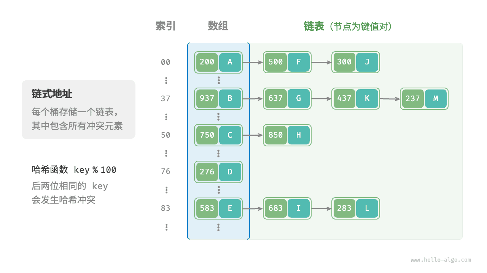
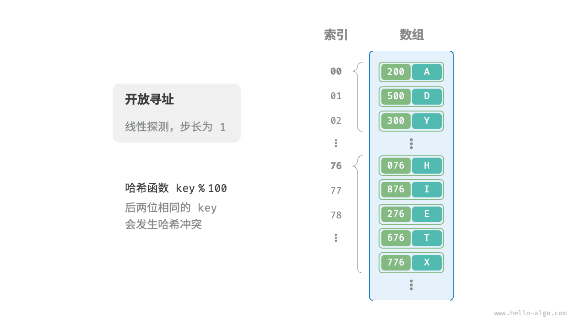
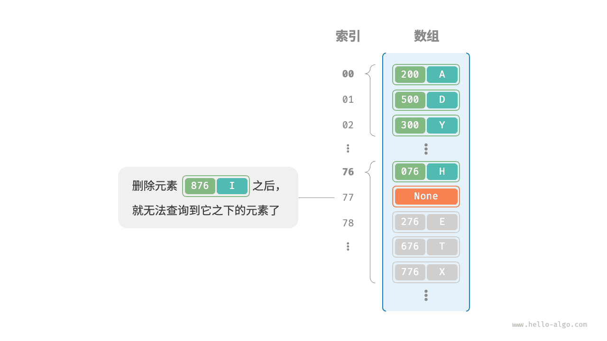
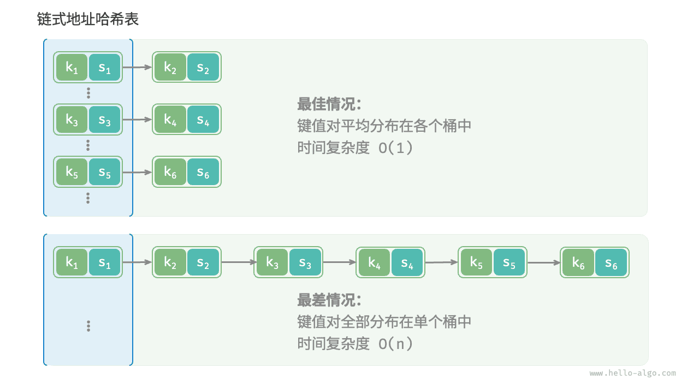

# 不期而遇

# 哈希冲突

上一节提到，**通常情况下哈希函数的输入空间远大于输出空间**，因此理论上哈希冲突是不可避免的。比如，输入空间为全体整数，输出空间为数组容量大小，则必然有多个整数映射至同一桶索引。

哈希冲突会导致查询结果错误，严重影响哈希表的可用性。为了解决该问题，每当遇到哈希冲突时，我们就进行哈希表扩容，直至冲突消失为止。此方法简单粗暴且有效，但效率太低，因为哈希表扩容需要进行大量的数据搬运与哈希值计算。为了提升效率，我们可以采用以下策略。

1. 改良哈希表数据结构，**使得哈希表可以在出现哈希冲突时正常工作**。
2. 仅在必要时，即当哈希冲突比较严重时，才执行扩容操作。

哈希表的结构改良方法主要包括“链式地址”和“开放寻址”。

## 链式地址

在原始哈希表中，每个桶仅能存储一个键值对。<u>链式地址（separate chaining）</u>将单个元素转换为链表，将键值对作为链表节点，将所有发生冲突的键值对都存储在同一链表中。下图展示了一个链式地址哈希表的例子。



基于链式地址实现的哈希表的操作方法发生了以下变化。

- **查询元素**：输入 `key` ，经过哈希函数得到桶索引，即可访问链表头节点，然后遍历链表并对比 `key` 以查找目标键值对。
- **添加元素**：首先通过哈希函数访问链表头节点，然后将节点（键值对）添加到链表中。
- **删除元素**：根据哈希函数的结果访问链表头部，接着遍历链表以查找目标节点并将其删除。

链式地址存在以下局限性。

- **占用空间增大**：链表包含节点指针，它相比数组更加耗费内存空间。
- **查询效率降低**：因为需要线性遍历链表来查找对应元素。

以下代码给出了链式地址哈希表的简单实现，需要注意两点。

- 使用列表（动态数组）代替链表，从而简化代码。在这种设定下，哈希表（数组）包含多个桶，每个桶都是一个列表。
- 以下实现包含哈希表扩容方法。当负载因子超过 $\frac{2}{3}$ 时，我们将哈希表扩容至原先的 $2$ 倍。

```python
class HashMapChaining:
    """链式地址哈希表"""

    def __init__(self):
        """构造方法"""
        self.size = 0  # 键值对数量
        self.capacity = 4  # 哈希表容量
        self.load_thres = 2.0 / 3.0  # 触发扩容的负载因子阈值
        self.extend_ratio = 2  # 扩容倍数
        self.buckets = [[] for _ in range(self.capacity)]  # 桶数组

    def hash_func(self, key: int) -> int:
        """哈希函数"""
        return key % self.capacity

    def load_factor(self) -> float:
        """负载因子"""
        return self.size / self.capacity

    def get(self, key: int) -> str | None:
        """查询操作"""
        index = self.hash_func(key)
        bucket = self.buckets[index]
        # 遍历桶，若找到 key ，则返回对应 val
        for pair in bucket:
            if pair.key == key:
                return pair.val
        # 若未找到 key ，则返回 None
        return None

    def put(self, key: int, val: str):
        """添加操作"""
        # 当负载因子超过阈值时，执行扩容
        if self.load_factor() > self.load_thres:
            self.extend()
        index = self.hash_func(key)
        bucket = self.buckets[index]
        # 遍历桶，若遇到指定 key ，则更新对应 val 并返回
        for pair in bucket:
            if pair.key == key:
                pair.val = val
                return
        # 若无该 key ，则将键值对添加至尾部
        pair = Pair(key, val)
        bucket.append(pair)
        self.size += 1

    def remove(self, key: int):
        """删除操作"""
        index = self.hash_func(key)
        bucket = self.buckets[index]
        # 遍历桶，从中删除键值对
        for pair in bucket:
            if pair.key == key:
                bucket.remove(pair)
                self.size -= 1
                break

    def extend(self):
        """扩容哈希表"""
        # 暂存原哈希表
        buckets = self.buckets
        # 初始化扩容后的新哈希表
        self.capacity *= self.extend_ratio
        self.buckets = [[] for _ in range(self.capacity)]
        self.size = 0
        # 将键值对从原哈希表搬运至新哈希表
        for bucket in buckets:
            for pair in bucket:
                self.put(pair.key, pair.val)

    def print(self):
        """打印哈希表"""
        for bucket in self.buckets:
            res = []
            for pair in bucket:
                res.append(str(pair.key) + " -> " + pair.val)
            print(res)
```

!!! example [pythontutor "可视化运行"](https://pythontutor.com/iframe-embed.html#code=class%20Pair%3A%0A%20%20%20%20%22%22%22%E9%94%AE%E5%80%BC%E5%AF%B9%22%22%22%0A%20%20%20%20def%20__init__%28self,%20key%3A%20int,%20val%3A%20str%29%3A%0A%20%20%20%20%20%20%20%20self.key%20%3D%20key%0A%20%20%20%20%20%20%20%20self.val%20%3D%20val%0A%0Aclass%20HashMapChaining%3A%0A%20%20%20%20%22%22%22%E9%93%BE%E5%BC%8F%E5%9C%B0%E5%9D%80%E5%93%88%E5%B8%8C%E8%A1%A8%22%22%22%0A%0A%20%20%20%20def%20__init__%28self%29%3A%0A%20%20%20%20%20%20%20%20%22%22%22%E6%9E%84%E9%80%A0%E6%96%B9%E6%B3%95%22%22%22%0A%20%20%20%20%20%20%20%20self.size%20%3D%200%0A%20%20%20%20%20%20%20%20self.capacity%20%3D%204%0A%20%20%20%20%20%20%20%20self.load_thres%20%3D%202.0%20/%203.0%0A%20%20%20%20%20%20%20%20self.extend_ratio%20%3D%202%0A%20%20%20%20%20%20%20%20self.buckets%20%3D%20%5B%5B%5D%20for%20_%20in%20range%28self.capacity%29%5D%0A%0A%20%20%20%20def%20hash_func%28self,%20key%3A%20int%29%20-%3E%20int%3A%0A%20%20%20%20%20%20%20%20%22%22%22%E5%93%88%E5%B8%8C%E5%87%BD%E6%95%B0%22%22%22%0A%20%20%20%20%20%20%20%20return%20key%20%25%20self.capacity%0A%0A%20%20%20%20def%20load_factor%28self%29%20-%3E%20float%3A%0A%20%20%20%20%20%20%20%20%22%22%22%E8%B4%9F%E8%BD%BD%E5%9B%A0%E5%AD%90%22%22%22%0A%20%20%20%20%20%20%20%20return%20self.size%20/%20self.capacity%0A%0A%20%20%20%20def%20get%28self,%20key%3A%20int%29%20-%3E%20str%20%7C%20None%3A%0A%20%20%20%20%20%20%20%20%22%22%22%E6%9F%A5%E8%AF%A2%E6%93%8D%E4%BD%9C%22%22%22%0A%20%20%20%20%20%20%20%20index%20%3D%20self.hash_func%28key%29%0A%20%20%20%20%20%20%20%20bucket%20%3D%20self.buckets%5Bindex%5D%0A%20%20%20%20%20%20%20%20for%20pair%20in%20bucket%3A%0A%20%20%20%20%20%20%20%20%20%20%20%20if%20pair.key%20%3D%3D%20key%3A%0A%20%20%20%20%20%20%20%20%20%20%20%20%20%20%20%20return%20pair.val%0A%20%20%20%20%20%20%20%20return%20None%0A%0A%20%20%20%20def%20put%28self,%20key%3A%20int,%20val%3A%20str%29%3A%0A%20%20%20%20%20%20%20%20%22%22%22%E6%B7%BB%E5%8A%A0%E6%93%8D%E4%BD%9C%22%22%22%0A%20%20%20%20%20%20%20%20if%20self.load_factor%28%29%20%3E%20self.load_thres%3A%0A%20%20%20%20%20%20%20%20%20%20%20%20self.extend%28%29%0A%20%20%20%20%20%20%20%20index%20%3D%20self.hash_func%28key%29%0A%20%20%20%20%20%20%20%20bucket%20%3D%20self.buckets%5Bindex%5D%0A%20%20%20%20%20%20%20%20for%20pair%20in%20bucket%3A%0A%20%20%20%20%20%20%20%20%20%20%20%20if%20pair.key%20%3D%3D%20key%3A%0A%20%20%20%20%20%20%20%20%20%20%20%20%20%20%20%20pair.val%20%3D%20val%0A%20%20%20%20%20%20%20%20%20%20%20%20%20%20%20%20return%0A%20%20%20%20%20%20%20%20pair%20%3D%20Pair%28key,%20val%29%0A%20%20%20%20%20%20%20%20bucket.append%28pair%29%0A%20%20%20%20%20%20%20%20self.size%20%2B%3D%201%0A%0A%20%20%20%20def%20remove%28self,%20key%3A%20int%29%3A%0A%20%20%20%20%20%20%20%20%22%22%22%E5%88%A0%E9%99%A4%E6%93%8D%E4%BD%9C%22%22%22%0A%20%20%20%20%20%20%20%20index%20%3D%20self.hash_func%28key%29%0A%20%20%20%20%20%20%20%20bucket%20%3D%20self.buckets%5Bindex%5D%0A%20%20%20%20%20%20%20%20for%20pair%20in%20bucket%3A%0A%20%20%20%20%20%20%20%20%20%20%20%20if%20pair.key%20%3D%3D%20key%3A%0A%20%20%20%20%20%20%20%20%20%20%20%20%20%20%20%20bucket.remove%28pair%29%0A%20%20%20%20%20%20%20%20%20%20%20%20%20%20%20%20self.size%20-%3D%201%0A%20%20%20%20%20%20%20%20%20%20%20%20%20%20%20%20break%0A%0A%20%20%20%20def%20extend%28self%29%3A%0A%20%20%20%20%20%20%20%20%22%22%22%E6%89%A9%E5%AE%B9%E5%93%88%E5%B8%8C%E8%A1%A8%22%22%22%0A%20%20%20%20%20%20%20%20buckets%20%3D%20self.buckets%0A%20%20%20%20%20%20%20%20self.capacity%20*%3D%20self.extend_ratio%0A%20%20%20%20%20%20%20%20self.buckets%20%3D%20%5B%5B%5D%20for%20_%20in%20range%28self.capacity%29%5D%0A%20%20%20%20%20%20%20%20self.size%20%3D%200%0A%20%20%20%20%20%20%20%20for%20bucket%20in%20buckets%3A%0A%20%20%20%20%20%20%20%20%20%20%20%20for%20pair%20in%20bucket%3A%0A%20%20%20%20%20%20%20%20%20%20%20%20%20%20%20%20self.put%28pair.key,%20pair.val%29%0A%0A%20%20%20%20def%20print%28self%29%3A%0A%20%20%20%20%20%20%20%20%22%22%22%E6%89%93%E5%8D%B0%E5%93%88%E5%B8%8C%E8%A1%A8%22%22%22%0A%20%20%20%20%20%20%20%20for%20bucket%20in%20self.buckets%3A%0A%20%20%20%20%20%20%20%20%20%20%20%20res%20%3D%20%5B%5D%0A%20%20%20%20%20%20%20%20%20%20%20%20for%20pair%20in%20bucket%3A%0A%20%20%20%20%20%20%20%20%20%20%20%20%20%20%20%20res.append%28str%28pair.key%29%20%2B%20%22%20-%3E%20%22%20%2B%20pair.val%29%0A%20%20%20%20%20%20%20%20%20%20%20%20print%28res%29%0A%0A%0A%22%22%22Driver%20Code%22%22%22%0Aif%20__name__%20%3D%3D%20%22__main__%22%3A%0A%20%20%20%20%23%20%E5%88%9D%E5%A7%8B%E5%8C%96%E5%93%88%E5%B8%8C%E8%A1%A8%0A%20%20%20%20hashmap%20%3D%20HashMapChaining%28%29%0A%0A%20%20%20%20%23%20%E6%B7%BB%E5%8A%A0%E6%93%8D%E4%BD%9C%0A%20%20%20%20hashmap.put%2812836,%20%22%E5%B0%8F%E5%93%88%22%29%0A%20%20%20%20hashmap.put%2815937,%20%22%E5%B0%8F%E5%95%B0%22%29%0A%20%20%20%20hashmap.put%2816750,%20%22%E5%B0%8F%E7%AE%97%22%29%0A%20%20%20%20hashmap.put%2813276,%20%22%E5%B0%8F%E6%B3%95%22%29%0A%20%20%20%20hashmap.put%2810583,%20%22%E5%B0%8F%E9%B8%AD%22%29%0A%0A%20%20%20%20%23%20%E6%9F%A5%E8%AF%A2%E6%93%8D%E4%BD%9C%0A%20%20%20%20name%20%3D%20hashmap.get%2813276%29%0A%0A%20%20%20%20%23%20%E5%88%A0%E9%99%A4%E6%93%8D%E4%BD%9C%0A%20%20%20%20hashmap.remove%2812836%29&codeDivHeight=800&codeDivWidth=600&cumulative=false&curInstr=4&heapPrimitives=nevernest&origin=opt-frontend.js&py=311&rawInputLstJSON=%5B%5D&textReferences=false)

值得注意的是，当链表很长时，查询效率 $O(n)$ 很差。**此时可以将链表转换为“AVL 树”或“红黑树”**，从而将查询操作的时间复杂度优化至 $O(\log n)$ 。

## 开放寻址

<u>开放寻址（open addressing）</u>不引入额外的数据结构，而是通过“多次探测”来处理哈希冲突，探测方式主要包括线性探测、平方探测和多次哈希等。

下面以线性探测为例，介绍开放寻址哈希表的工作机制。

### 线性探测

线性探测采用固定步长的线性搜索来进行探测，其操作方法与普通哈希表有所不同。

- **插入元素**：通过哈希函数计算桶索引，若发现桶内已有元素，则从冲突位置向后线性遍历（步长通常为 $1$ ），直至找到空桶，将元素插入其中。
- **查找元素**：若发现哈希冲突，则使用相同步长向后进行线性遍历，直到找到对应元素，返回 `value` 即可；如果遇到空桶，说明目标元素不在哈希表中，返回 `None` 。

下图展示了开放寻址（线性探测）哈希表的键值对分布。根据此哈希函数，最后两位相同的 `key` 都会被映射到相同的桶。而通过线性探测，它们被依次存储在该桶以及之下的桶中。



然而，**线性探测容易产生“聚集现象”**。具体来说，数组中连续被占用的位置越长，这些连续位置发生哈希冲突的可能性越大，从而进一步促使该位置的聚堆生长，形成恶性循环，最终导致增删查改操作效率劣化。

值得注意的是，**我们不能在开放寻址哈希表中直接删除元素**。这是因为删除元素会在数组内产生一个空桶 `None` ，而当查询元素时，线性探测到该空桶就会返回，因此在该空桶之下的元素都无法再被访问到，程序可能误判这些元素不存在，如下图所示。



为了解决该问题，我们可以采用<u>懒删除（lazy deletion）</u>机制：它不直接从哈希表中移除元素，**而是利用一个常量 `TOMBSTONE` 来标记这个桶**。在该机制下，`None` 和 `TOMBSTONE` 都代表空桶，都可以放置键值对。但不同的是，线性探测到 `TOMBSTONE` 时应该继续遍历，因为其之下可能还存在键值对。

然而，**懒删除可能会加速哈希表的性能退化**。这是因为每次删除操作都会产生一个删除标记，随着 `TOMBSTONE` 的增加，搜索时间也会增加，因为线性探测可能需要跳过多个 `TOMBSTONE` 才能找到目标元素。

为此，考虑在线性探测中记录遇到的首个 `TOMBSTONE` 的索引，并将搜索到的目标元素与该 `TOMBSTONE` 交换位置。这样做的好处是当每次查询或添加元素时，元素会被移动至距离理想位置（探测起始点）更近的桶，从而优化查询效率。

以下代码实现了一个包含懒删除的开放寻址（线性探测）哈希表。为了更加充分地使用哈希表的空间，我们将哈希表看作一个“环形数组”，当越过数组尾部时，回到头部继续遍历。

```python
class HashMapOpenAddressing:
    """开放寻址哈希表"""

    def __init__(self):
        """构造方法"""
        self.size = 0  # 键值对数量
        self.capacity = 4  # 哈希表容量
        self.load_thres = 2.0 / 3.0  # 触发扩容的负载因子阈值
        self.extend_ratio = 2  # 扩容倍数
        self.buckets: list[Pair | None] = [None] * self.capacity  # 桶数组
        self.TOMBSTONE = Pair(-1, "-1")  # 删除标记

    def hash_func(self, key: int) -> int:
        """哈希函数"""
        return key % self.capacity

    def load_factor(self) -> float:
        """负载因子"""
        return self.size / self.capacity

    def find_bucket(self, key: int) -> int:
        """搜索 key 对应的桶索引"""
        index = self.hash_func(key)
        first_tombstone = -1
        # 线性探测，当遇到空桶时跳出
        while self.buckets[index] is not None:
            # 若遇到 key ，返回对应的桶索引
            if self.buckets[index].key == key:
                # 若之前遇到了删除标记，则将键值对移动至该索引处
                if first_tombstone != -1:
                    self.buckets[first_tombstone] = self.buckets[index]
                    self.buckets[index] = self.TOMBSTONE
                    return first_tombstone  # 返回移动后的桶索引
                return index  # 返回桶索引
            # 记录遇到的首个删除标记
            if first_tombstone == -1 and self.buckets[index] is self.TOMBSTONE:
                first_tombstone = index
            # 计算桶索引，越过尾部则返回头部
            index = (index + 1) % self.capacity
        # 若 key 不存在，则返回添加点的索引
        return index if first_tombstone == -1 else first_tombstone

    def get(self, key: int) -> str:
        """查询操作"""
        # 搜索 key 对应的桶索引
        index = self.find_bucket(key)
        # 若找到键值对，则返回对应 val
        if self.buckets[index] not in [None, self.TOMBSTONE]:
            return self.buckets[index].val
        # 若键值对不存在，则返回 None
        return None

    def put(self, key: int, val: str):
        """添加操作"""
        # 当负载因子超过阈值时，执行扩容
        if self.load_factor() > self.load_thres:
            self.extend()
        # 搜索 key 对应的桶索引
        index = self.find_bucket(key)
        # 若找到键值对，则覆盖 val 并返回
        if self.buckets[index] not in [None, self.TOMBSTONE]:
            self.buckets[index].val = val
            return
        # 若键值对不存在，则添加该键值对
        self.buckets[index] = Pair(key, val)
        self.size += 1

    def remove(self, key: int):
        """删除操作"""
        # 搜索 key 对应的桶索引
        index = self.find_bucket(key)
        # 若找到键值对，则用删除标记覆盖它
        if self.buckets[index] not in [None, self.TOMBSTONE]:
            self.buckets[index] = self.TOMBSTONE
            self.size -= 1

    def extend(self):
        """扩容哈希表"""
        # 暂存原哈希表
        buckets_tmp = self.buckets
        # 初始化扩容后的新哈希表
        self.capacity *= self.extend_ratio
        self.buckets = [None] * self.capacity
        self.size = 0
        # 将键值对从原哈希表搬运至新哈希表
        for pair in buckets_tmp:
            if pair not in [None, self.TOMBSTONE]:
                self.put(pair.key, pair.val)

    def print(self):
        """打印哈希表"""
        for pair in self.buckets:
            if pair is None:
                print("None")
            elif pair is self.TOMBSTONE:
                print("TOMBSTONE")
            else:
                print(pair.key, "->", pair.val)
```

### 平方探测

平方探测与线性探测类似，都是开放寻址的常见策略之一。当发生冲突时，平方探测不是简单地跳过一个固定的步数，而是跳过“探测次数的平方”的步数，即 $1, 4, 9, \dots$ 步。

平方探测主要具有以下优势。

- 平方探测通过跳过探测次数平方的距离，试图缓解线性探测的聚集效应。
- 平方探测会跳过更大的距离来寻找空位置，有助于数据分布得更加均匀。

然而，平方探测并不是完美的。

- 仍然存在聚集现象，即某些位置比其他位置更容易被占用。
- 由于平方的增长，平方探测可能不会探测整个哈希表，这意味着即使哈希表中有空桶，平方探测也可能无法访问到它。

### 多次哈希

顾名思义，多次哈希方法使用多个哈希函数 $f_1(x)$、$f_2(x)$、$f_3(x)$、$\dots$ 进行探测。

- **插入元素**：若哈希函数 $f_1(x)$ 出现冲突，则尝试 $f_2(x)$ ，以此类推，直到找到空位后插入元素。
- **查找元素**：在相同的哈希函数顺序下进行查找，直到找到目标元素时返回；若遇到空位或已尝试所有哈希函数，说明哈希表中不存在该元素，则返回 `None` 。

与线性探测相比，多次哈希方法不易产生聚集，但多个哈希函数会带来额外的计算量。

!!! tip

    请注意，开放寻址（线性探测、平方探测和多次哈希）哈希表都存在“不能直接删除元素”的问题。

## 编程语言的选择

各种编程语言采取了不同的哈希表实现策略，下面举几个例子。

- Python 采用开放寻址。字典 `dict` 使用伪随机数进行探测。
- Java 采用链式地址。自 JDK 1.8 以来，当 `HashMap` 内数组长度达到 64 且链表长度达到 8 时，链表会转换为红黑树以提升查找性能。
- Go 采用链式地址。Go 规定每个桶最多存储 8 个键值对，超出容量则连接一个溢出桶；当溢出桶过多时，会执行一次特殊的等量扩容操作，以确保性能。


## 3. 处理冲突的方法

选择一个“好”的散列函数可以在一定程度上减少冲突，但在实际应用中，很难完全避免发生冲突，所以选择一个有效的处理冲突的方法是散列法的另一个关键问题。创建散列表和查找散列表都会遇到冲突，两种情况下处理冲突的方法应该一致。下面以创建散列表为例，来说明处理冲突的方法。

处理冲突的方法与散列表本身的组织形式有关。按组织形式的不同，通常分两大类：<mark>开放地址法和链地址法</mark>。


### 3.1 开放地址法（闭散列法）

开放地址法的基本思想是：把记录都存储在散列表数组中，当某一记录关键字 key 的初始散列地址 H0 = H(key)发生冲突时，以 H0 为基础，采取合适方法计算得到另一个地址 H1，如果 H1 仍然发生冲突，以 H1 为基础再求下一个地址 H2，若 H2 仍然冲突，再求得 H3。依次类推，直至 Hk 不发生冲突为止，则 Hk 为该记录在表中的散列地址。

这种方法在寻找 ”下一个” 空的散列地址时，<mark>原来的数组空间对所有的元素都是开放的所以称为开放地址法</mark>。通常把寻找 “下一个” 空位的过程称为**探测**，上述方法可用如下公式表示：

$Hi=(H(key) +di)%m	i=1,2,…,k(k≤m-l)$

其中，`H(key)`为散列函数，`m` 为散列表表长，`d`为增量序列。根据 `d` 取值的不同，可以分为以下3种探测方法。


(1) 线性探测法
di = 1, 2, 3, …, m-1

这种探测方法可以将散列表假想成一个循环表，发生冲突时，从冲突地址的下一单元顺序寻找空单元，如果到最后一个位置也没找到空单元，则回到表头开始继续查找，直到找到一个空位，就把此元素放入此空位中。如果找不到空位，则说明散列表已满，需要进行溢出处理。


(2) 二次探测法
$d_i =1^2, -1^2, 2^2,-2^2,3^2,.…, +k^2,-k^2 \space (k \le m/2)$​


(3) 伪随机探测法

di = 伪随机数序列
例如，散列表的长度为 11，散列函数 H(key)=key%11，假设表中已填有关键字分别为 17、60、29 的记录，如图2(a)所示。现有第四个记录，其关键字为38，由散列函数得到散列地址为 5，产生冲突。

若用线性探测法处理时，得到下一个地址6，仍冲突；再求下一个地址7，仍冲突；直到散列地址为8的位置为“空”时为止，处理冲突的过程结束，38填入散列表中序号为8的位置，如图2(b)所示。

若用二次探测法，散列地址5冲突后，得到下一个地址6，仍冲突；再求得下一个地址 4，无冲突，38填入序号为4的位置，如图 2(c)所示。

若用伪随机探测法，假设产生的伪随机数为9，则计算下一个散列地址为(5+9)%11=3，所以38 填入序号为3 的位置，如图 2(d)所示。


<center>图 2 用开放地址法处理冲突时，关键字为38的记录插入前后的散列表</center>

从上述线性探测法处理的过程中可以看到一个现象：当表中i, i+1, i+2位置上已填有记录时，下一个散列地址为i、i+1、i+2和i+3的记录都将填入i+3的位置，这种在处理冲突过程中发生的两个第一个散列地址不同的记录争夺同一个后继散列地址的现象称作“**二次聚集**”(或称作“**堆积**”)，即在处理同义词的冲突过程中又添加了非同义词的冲突。

可以看出，上述三种处理方法各有优缺点。<mark>线性探测法的优点</mark>是：只要散列表未填满，总能找到一个不发生冲突的地址。<mark>缺点</mark>是：会产生“二次聚集”现象。而<mark>二次探测法和伪随机探测法的优点</mark>是：可以避免“二次聚集”现象。<mark>缺点</mark>也很显然：不能保证一定找到不发生冲突的地址。


### 3.2 链地址法（开散列法）

链地址法的基本思想是：把具有相同散列地址的记录放在同一个单链表中，称为同义词链表。有 m个散列地址就有m 个单链表，同时用数组 HT[0…m-1]存放各个链表的头指针，凡是散列地址为 `i` 的记录都以结点方式插入到以 `HT[i]`为头结点的单链表中。

【例】 已知一组关键字为 (19,14, 23, 1, 68, 20, 84, 27, 55, 11, 10, 79)，设散列函数 `H(key)=key%13`，用链地址法处理冲突，试构造这组关键字的散列表。

由散列函数 H(key)=key %13 得知散列地址的值域为 0~12，故整个散列表有 13 个单链表组成，用数组 HT[0..12]存放各个链表的头指针。如散列地址均为1的同义词 14、1、27、79 构成一个单链表，链表的头指针保存在 HT[1]中，同理，可以构造其他几个单链表，整个散列表的结构如图 3 所示。


<center>图 3 用链地址法处理冲突时的散列表</center>

这种构造方法在具体实现时，依次计算各个关键字的散列地址，然后根据散列地址将关键字插入到相应的链表中。


> 处理散列表冲突的常见方法包括以下几种：
>
> 1. 链地址法（Chaining）：使用链表来处理冲突。每个散列桶（哈希桶）中存储一个链表，具有相同散列值的元素会链接在同一个链表上。
>
> 2. 开放地址法（Open Addressing）：
>    - 线性探测（Linear Probing）：如果发生冲突，就线性地探测下一个可用的槽位，直到找到一个空槽位或者达到散列表的末尾。
>    - 二次探测（Quadratic Probing）：如果发生冲突，就使用二次探测来查找下一个可用的槽位，避免线性探测中的聚集效应。
>    - 双重散列（Double Hashing）：如果发生冲突，就使用第二个散列函数来计算下一个槽位的位置，直到找到一个空槽位或者达到散列表的末尾。
>
> 3. 再散列（Rehashing）：当散列表的**装载因子（load factor）**超过一定阈值时，进行扩容操作，重新调整散列函数和散列桶的数量，以减少冲突的概率。
>
> 4. 建立公共溢出区（Public Overflow Area）：将冲突的元素存储在一个公共的溢出区域，而不是在散列桶中。在进行查找时，需要遍历溢出区域。
>
> 这些方法各有优缺点，适用于不同的应用场景。选择合适的处理冲突方法取决于数据集的特点、散列表的大小以及性能需求。


**双重散列（Double Hashing）**是一种处理散列表冲突的方法，它使用两个散列函数来计算冲突时下一个可用的槽位位置。下面是双重散列的一个示例：

假设有一个散列表，大小为10，使用双重散列来处理冲突。我们定义两个散列函数：

1. 第一个散列函数 `hash1(key)`：将关键字 `key` 转换为散列值，使用一种合适的散列算法，比如取模运算。
2. 第二个散列函数 `hash2(key)`：将关键字 `key` 转换为一个正整数，在本例中，我们使用简单的散列函数 `hash2(key) = 7 - (key % 7)`。

现在，通过以下步骤来插入一个关键字 `key` 到散列表中：

1. 使用第一个散列函数 `hash1(key)` 计算关键字 `key` 的初始散列值 `hash_value = hash1(key)`。
2. 如果散列表中的槽位 `hash_value` 是空的，则将关键字 `key` 插入到该槽位中。
3. 如果槽位 `hash_value` 不为空，表示发生了冲突。在这种情况下，我们**使用第二个散列函数 `hash2(key)` 来计算关键字 `key` 的步长（step）**。
4. 通过计算 `step = hash2(key)`，我们将跳过 `step` 个槽位，继续在散列表中查找下一个槽位。
5. 重复步骤 3 和步骤 4，直到找到一个空槽位，将关键字 `key` 插入到该槽位中。

如果散列表已满而且仍然无法找到空槽位，那么插入操作将失败。

双重散列使用两个散列函数来计算步长，这样可以<mark>避免线性探测中的聚集效应</mark>，提高散列表的性能。每个关键字都有唯一的步长序列，因此它可以在散列表中的不同位置进行探测，减少冲突的可能性。


**笔试例题：**

有一个散列表如下图所示，其散列函数为 `h(key)=key mod 13`，该散列表使用再散列函数`H2(key)=key mod 3` 解决碰撞，问从表中检索出关键码 38 需进行几次比较（ B ）。

| 0    | 1    | 2    | 3    | 4    | 5    | 6    | 7    | 8    | 9    | 10   | 11   | 12   |
| ---- | ---- | ---- | ---- | ---- | ---- | ---- | ---- | ---- | ---- | ---- | ---- | ---- |
| 26   | 38   |      |      | 17   |      |      | 33   |      | 48   |      |      | 25   |

A: 1  B: 2  C: 3  D: 4

> **第一步：计算关键码 38 的初始散列地址**
>
> 使用 `h(38) = 38 mod 13 = 12`
>
> 所以要去下标为 **12** 的位置找它。
>
> 查看表中下标 12 的值是 **25**，不是 38。说明发生了碰撞，继续查找。
>
> ---
>
> **第二步：使用再散列函数解决冲突**
>
> 当前哈希地址为 `pos = 12`
>
> 再散列步长为：
>
> ```
> step = H2(38) = 38 mod 3 = 2
> ```
>
> 所以每次探测的公式为：
>
> ```
> pos = (pos + step) % size_of_table
> ```
>
> 散列表长度是 13。
>
> 我们开始探测：
>
> ---
>
> 🔍 探测过程（线性再散列）
>
> 1. 初始 pos = 12  
>    - 表中值为 25 ≠ 38 → 比较 1 次  
>    - 更新 pos = (12 + 2) % 13 = 1
>
> 2. 新 pos = 1  
>    - 表中值为 38 == 38 → 找到！比较 2 次  
>
> ---
>
> ✅ 最终结论：
>
> - 在检索过程中进行了 **2 次比较**。
> - 正确答案是：**B: 2**

# 哈希算法

前两节介绍了哈希表的工作原理和哈希冲突的处理方法。然而无论是开放寻址还是链式地址，**它们只能保证哈希表可以在发生冲突时正常工作，而无法减少哈希冲突的发生**。

如果哈希冲突过于频繁，哈希表的性能则会急剧劣化。如下图所示，对于链式地址哈希表，理想情况下键值对均匀分布在各个桶中，达到最佳查询效率；最差情况下所有键值对都存储到同一个桶中，时间复杂度退化至 $O(n)$ 。



**键值对的分布情况由哈希函数决定**。回忆哈希函数的计算步骤，先计算哈希值，再对数组长度取模：

```shell
index = hash(key) % capacity
```

观察以上公式，当哈希表容量 `capacity` 固定时，**哈希算法 `hash()` 决定了输出值**，进而决定了键值对在哈希表中的分布情况。

这意味着，为了降低哈希冲突的发生概率，我们应当将注意力集中在哈希算法 `hash()` 的设计上。

## 哈希算法的目标

为了实现“既快又稳”的哈希表数据结构，哈希算法应具备以下特点。

- **确定性**：对于相同的输入，哈希算法应始终产生相同的输出。这样才能确保哈希表是可靠的。
- **效率高**：计算哈希值的过程应该足够快。计算开销越小，哈希表的实用性越高。
- **均匀分布**：哈希算法应使得键值对均匀分布在哈希表中。分布越均匀，哈希冲突的概率就越低。

实际上，哈希算法除了可以用于实现哈希表，还广泛应用于其他领域中。

- **密码存储**：为了保护用户密码的安全，系统通常不会直接存储用户的明文密码，而是存储密码的哈希值。当用户输入密码时，系统会对输入的密码计算哈希值，然后与存储的哈希值进行比较。如果两者匹配，那么密码就被视为正确。
- **数据完整性检查**：数据发送方可以计算数据的哈希值并将其一同发送；接收方可以重新计算接收到的数据的哈希值，并与接收到的哈希值进行比较。如果两者匹配，那么数据就被视为完整。

对于密码学的相关应用，为了防止从哈希值推导出原始密码等逆向工程，哈希算法需要具备更高等级的安全特性。

- **单向性**：无法通过哈希值反推出关于输入数据的任何信息。
- **抗碰撞性**：应当极难找到两个不同的输入，使得它们的哈希值相同。
- **雪崩效应**：输入的微小变化应当导致输出的显著且不可预测的变化。

请注意，**“均匀分布”与“抗碰撞性”是两个独立的概念**，满足均匀分布不一定满足抗碰撞性。例如，在随机输入 `key` 下，哈希函数 `key % 100` 可以产生均匀分布的输出。然而该哈希算法过于简单，所有后两位相等的 `key` 的输出都相同，因此我们可以很容易地从哈希值反推出可用的 `key` ，从而破解密码。

## 哈希算法的设计

哈希算法的设计是一个需要考虑许多因素的复杂问题。然而对于某些要求不高的场景，我们也能设计一些简单的哈希算法。

- **加法哈希**：对输入的每个字符的 ASCII 码进行相加，将得到的总和作为哈希值。
- **乘法哈希**：利用乘法的不相关性，每轮乘以一个常数，将各个字符的 ASCII 码累积到哈希值中。
- **异或哈希**：将输入数据的每个元素通过异或操作累积到一个哈希值中。
- **旋转哈希**：将每个字符的 ASCII 码累积到一个哈希值中，每次累积之前都会对哈希值进行旋转操作。

```python
def add_hash(key: str) -> int:
    """加法哈希"""
    hash = 0
    modulus = 1000000007
    for c in key:
        hash += ord(c)
    return hash % modulus

def mul_hash(key: str) -> int:
    """乘法哈希"""
    hash = 0
    modulus = 1000000007
    for c in key:
        hash = 31 * hash + ord(c)
    return hash % modulus

def xor_hash(key: str) -> int:
    """异或哈希"""
    hash = 0
    modulus = 1000000007
    for c in key:
        hash ^= ord(c)
    return hash % modulus

def rot_hash(key: str) -> int:
    """旋转哈希"""
    hash = 0
    modulus = 1000000007
    for c in key:
        hash = (hash << 4) ^ (hash >> 28) ^ ord(c)
    return hash % modulus
```

!!! example [pythontutor "可视化运行"](https://pythontutor.com/iframe-embed.html#code=def%20add_hash%28key%3A%20str%29%20-%3E%20int%3A%0A%20%20%20%20%22%22%22%E5%8A%A0%E6%B3%95%E5%93%88%E5%B8%8C%22%22%22%0A%20%20%20%20hash%20%3D%200%0A%20%20%20%20modulus%20%3D%201000000007%0A%20%20%20%20for%20c%20in%20key%3A%0A%20%20%20%20%20%20%20%20hash%20%2B%3D%20ord%28c%29%0A%20%20%20%20return%20hash%20%25%20modulus%0A%0A%0Adef%20mul_hash%28key%3A%20str%29%20-%3E%20int%3A%0A%20%20%20%20%22%22%22%E4%B9%98%E6%B3%95%E5%93%88%E5%B8%8C%22%22%22%0A%20%20%20%20hash%20%3D%200%0A%20%20%20%20modulus%20%3D%201000000007%0A%20%20%20%20for%20c%20in%20key%3A%0A%20%20%20%20%20%20%20%20hash%20%3D%2031%20*%20hash%20%2B%20ord%28c%29%0A%20%20%20%20return%20hash%20%25%20modulus%0A%0A%0Adef%20xor_hash%28key%3A%20str%29%20-%3E%20int%3A%0A%20%20%20%20%22%22%22%E5%BC%82%E6%88%96%E5%93%88%E5%B8%8C%22%22%22%0A%20%20%20%20hash%20%3D%200%0A%20%20%20%20modulus%20%3D%201000000007%0A%20%20%20%20for%20c%20in%20key%3A%0A%20%20%20%20%20%20%20%20hash%20%5E%3D%20ord%28c%29%0A%20%20%20%20return%20hash%20%25%20modulus%0A%0A%0Adef%20rot_hash%28key%3A%20str%29%20-%3E%20int%3A%0A%20%20%20%20%22%22%22%E6%97%8B%E8%BD%AC%E5%93%88%E5%B8%8C%22%22%22%0A%20%20%20%20hash%20%3D%200%0A%20%20%20%20modulus%20%3D%201000000007%0A%20%20%20%20for%20c%20in%20key%3A%0A%20%20%20%20%20%20%20%20hash%20%3D%20%28hash%20%3C%3C%204%29%20%5E%20%28hash%20%3E%3E%2028%29%20%5E%20ord%28c%29%0A%20%20%20%20return%20hash%20%25%20modulus%0A%0A%0A%22%22%22Driver%20Code%22%22%22%0Aif%20__name__%20%3D%3D%20%22__main__%22%3A%0A%20%20%20%20key%20%3D%20%22Hello%20%E7%AE%97%E6%B3%95%22%0A%0A%20%20%20%20hash%20%3D%20add_hash%28key%29%0A%20%20%20%20print%28f%22%E5%8A%A0%E6%B3%95%E5%93%88%E5%B8%8C%E5%80%BC%E4%B8%BA%20%7Bhash%7D%22%29%0A%0A%20%20%20%20hash%20%3D%20mul_hash%28key%29%0A%20%20%20%20print%28f%22%E4%B9%98%E6%B3%95%E5%93%88%E5%B8%8C%E5%80%BC%E4%B8%BA%20%7Bhash%7D%22%29%0A%0A%20%20%20%20hash%20%3D%20xor_hash%28key%29%0A%20%20%20%20print%28f%22%E5%BC%82%E6%88%96%E5%93%88%E5%B8%8C%E5%80%BC%E4%B8%BA%20%7Bhash%7D%22%29%0A%0A%20%20%20%20hash%20%3D%20rot_hash%28key%29%0A%20%20%20%20print%28f%22%E6%97%8B%E8%BD%AC%E5%93%88%E5%B8%8C%E5%80%BC%E4%B8%BA%20%7Bhash%7D%22%29%0A&codeDivHeight=800&codeDivWidth=600&cumulative=false&curInstr=6&heapPrimitives=nevernest&origin=opt-frontend.js&py=311&rawInputLstJSON=%5B%5D&textReferences=false)

观察发现，每种哈希算法的最后一步都是对大质数 $1000000007$ 取模，以确保哈希值在合适的范围内。值得思考的是，为什么要强调对质数取模，或者说对合数取模的弊端是什么？这是一个有趣的问题。

先给出结论：**使用大质数作为模数，可以最大化地保证哈希值的均匀分布**。因为质数不与其他数字存在公约数，可以减少因取模操作而产生的周期性模式，从而避免哈希冲突。

举个例子，假设我们选择合数 $9$ 作为模数，它可以被 $3$ 整除，那么所有可以被 $3$ 整除的 `key` 都会被映射到 $0$、$3$、$6$ 这三个哈希值。

$$
\begin{aligned}
\text{modulus} & = 9 \newline
\text{key} & = \{ 0, 3, 6, 9, 12, 15, 18, 21, 24, 27, 30, 33, \dots \} \newline
\text{hash} & = \{ 0, 3, 6, 0, 3, 6, 0, 3, 6, 0, 3, 6,\dots \}
\end{aligned}
$$

如果输入 `key` 恰好满足这种等差数列的数据分布，那么哈希值就会出现聚堆，从而加重哈希冲突。现在，假设将 `modulus` 替换为质数 $13$ ，由于 `key` 和 `modulus` 之间不存在公约数，因此输出的哈希值的均匀性会明显提升。

$$
\begin{aligned}
\text{modulus} & = 13 \newline
\text{key} & = \{ 0, 3, 6, 9, 12, 15, 18, 21, 24, 27, 30, 33, \dots \} \newline
\text{hash} & = \{ 0, 3, 6, 9, 12, 2, 5, 8, 11, 1, 4, 7, \dots \}
\end{aligned}
$$

值得说明的是，如果能够保证 `key` 是随机均匀分布的，那么选择质数或者合数作为模数都可以，它们都能输出均匀分布的哈希值。而当 `key` 的分布存在某种周期性时，对合数取模更容易出现聚集现象。

总而言之，我们通常选取质数作为模数，并且这个质数最好足够大，以尽可能消除周期性模式，提升哈希算法的稳健性。

## 常见哈希算法

不难发现，以上介绍的简单哈希算法都比较“脆弱”，远远没有达到哈希算法的设计目标。例如，由于加法和异或满足交换律，因此加法哈希和异或哈希无法区分内容相同但顺序不同的字符串，这可能会加剧哈希冲突，并引起一些安全问题。

在实际中，我们通常会用一些标准哈希算法，例如 MD5、SHA-1、SHA-2 和 SHA-3 等。它们可以将任意长度的输入数据映射到恒定长度的哈希值。

近一个世纪以来，哈希算法处在不断升级与优化的过程中。一部分研究人员努力提升哈希算法的性能，另一部分研究人员和黑客则致力于寻找哈希算法的安全性问题。下表展示了在实际应用中常见的哈希算法。

- MD5 和 SHA-1 已多次被成功攻击，因此它们被各类安全应用弃用。
- SHA-2 系列中的 SHA-256 是最安全的哈希算法之一，仍未出现成功的攻击案例，因此常用在各类安全应用与协议中。
- SHA-3 相较 SHA-2 的实现开销更低、计算效率更高，但目前使用覆盖度不如 SHA-2 系列。

<p align="center"> 表 <id> &nbsp; 常见的哈希算法 </p>

|          | MD5                            | SHA-1            | SHA-2                        | SHA-3               |
| -------- | ------------------------------ | ---------------- | ---------------------------- | ------------------- |
| 推出时间 | 1992                           | 1995             | 2002                         | 2008                |
| 输出长度 | 128 bit                        | 160 bit          | 256/512 bit                  | 224/256/384/512 bit |
| 哈希冲突 | 较多                           | 较多             | 很少                         | 很少                |
| 安全等级 | 低，已被成功攻击               | 低，已被成功攻击 | 高                           | 高                  |
| 应用     | 已被弃用，仍用于数据完整性检查 | 已被弃用         | 加密货币交易验证、数字签名等 | 可用于替代 SHA-2    |

## 数据结构的哈希值

我们知道，哈希表的 `key` 可以是整数、小数或字符串等数据类型。编程语言通常会为这些数据类型提供内置的哈希算法，用于计算哈希表中的桶索引。以 Python 为例，我们可以调用 `hash()` 函数来计算各种数据类型的哈希值。

- 整数和布尔量的哈希值就是其本身。
- 浮点数和字符串的哈希值计算较为复杂，有兴趣的读者请自行学习。
- 元组的哈希值是对其中每一个元素进行哈希，然后将这些哈希值组合起来，得到单一的哈希值。
- 对象的哈希值基于其内存地址生成。通过重写对象的哈希方法，可实现基于内容生成哈希值。

!!! tip

    请注意，不同编程语言的内置哈希值计算函数的定义和方法不同。

```python
num = 3
hash_num = hash(num)
# 整数 3 的哈希值为 3

bol = True
hash_bol = hash(bol)
# 布尔量 True 的哈希值为 1

dec = 3.14159
hash_dec = hash(dec)
# 小数 3.14159 的哈希值为 326484311674566659

str = "Hello 算法"
hash_str = hash(str)
# 字符串“Hello 算法”的哈希值为 4617003410720528961

tup = (12836, "小哈")
hash_tup = hash(tup)
# 元组 (12836, '小哈') 的哈希值为 1029005403108185979

obj = ListNode(0)
hash_obj = hash(obj)
# 节点对象 <ListNode object at 0x1058fd810> 的哈希值为 274267521
```

!!! example [pythontutor "可视化运行"](https://pythontutor.com/iframe-embed.html#code=class%20ListNode%3A%0A%20%20%20%20%22%22%22%E9%93%BE%E8%A1%A8%E8%8A%82%E7%82%B9%E7%B1%BB%22%22%22%0A%20%20%20%20def%20__init__%28self,%20val%3A%20int%29%3A%0A%20%20%20%20%20%20%20%20self.val%3A%20int%20%3D%20val%20%20%23%20%E8%8A%82%E7%82%B9%E5%80%BC%0A%20%20%20%20%20%20%20%20self.next%3A%20ListNode%20%7C%20None%20%3D%20None%20%20%23%20%E5%90%8E%E7%BB%A7%E8%8A%82%E7%82%B9%E5%BC%95%E7%94%A8%0A%0A%22%22%22Driver%20Code%22%22%22%0Aif%20__name__%20%3D%3D%20%22__main__%22%3A%0A%20%20%20%20num%20%3D%203%0A%20%20%20%20hash_num%20%3D%20hash%28num%29%0A%20%20%20%20%23%20%E6%95%B4%E6%95%B0%203%20%E7%9A%84%E5%93%88%E5%B8%8C%E5%80%BC%E4%B8%BA%203%0A%0A%20%20%20%20bol%20%3D%20True%0A%20%20%20%20hash_bol%20%3D%20hash%28bol%29%0A%20%20%20%20%23%20%E5%B8%83%E5%B0%94%E9%87%8F%20True%20%E7%9A%84%E5%93%88%E5%B8%8C%E5%80%BC%E4%B8%BA%201%0A%0A%20%20%20%20dec%20%3D%203.14159%0A%20%20%20%20hash_dec%20%3D%20hash%28dec%29%0A%20%20%20%20%23%20%E5%B0%8F%E6%95%B0%203.14159%20%E7%9A%84%E5%93%88%E5%B8%8C%E5%80%BC%E4%B8%BA%20326484311674566659%0A%0A%20%20%20%20str%20%3D%20%22Hello%20%E7%AE%97%E6%B3%95%22%0A%20%20%20%20hash_str%20%3D%20hash%28str%29%0A%20%20%20%20%23%20%E5%AD%97%E7%AC%A6%E4%B8%B2%E2%80%9CHello%20%E7%AE%97%E6%B3%95%E2%80%9D%E7%9A%84%E5%93%88%E5%B8%8C%E5%80%BC%E4%B8%BA%204617003410720528961%0A%0A%20%20%20%20tup%20%3D%20%2812836,%20%22%E5%B0%8F%E5%93%88%22%29%0A%20%20%20%20hash_tup%20%3D%20hash%28tup%29%0A%20%20%20%20%23%20%E5%85%83%E7%BB%84%20%2812836,%20'%E5%B0%8F%E5%93%88'%29%20%E7%9A%84%E5%93%88%E5%B8%8C%E5%80%BC%E4%B8%BA%201029005403108185979%0A%0A%20%20%20%20obj%20%3D%20ListNode%280%29%0A%20%20%20%20hash_obj%20%3D%20hash%28obj%29%0A%20%20%20%20%23%20%E8%8A%82%E7%82%B9%E5%AF%B9%E8%B1%A1%20%3CListNode%20object%20at%200x1058fd810%3E%20%E7%9A%84%E5%93%88%E5%B8%8C%E5%80%BC%E4%B8%BA%20274267521&codeDivHeight=800&codeDivWidth=600&cumulative=false&curInstr=19&heapPrimitives=nevernest&origin=opt-frontend.js&py=311&rawInputLstJSON=%5B%5D&textReferences=false)

在许多编程语言中，**只有不可变对象才可作为哈希表的 `key`** 。假如我们将列表（动态数组）作为 `key` ，当列表的内容发生变化时，它的哈希值也随之改变，我们就无法在哈希表中查询到原先的 `value` 了。

虽然自定义对象（比如链表节点）的成员变量是可变的，但它是可哈希的。**这是因为对象的哈希值通常是基于内存地址生成的**，即使对象的内容发生了变化，但它的内存地址不变，哈希值仍然是不变的。

细心的你可能发现在不同控制台中运行程序时，输出的哈希值是不同的。**这是因为 Python 解释器在每次启动时，都会为字符串哈希函数加入一个随机的盐（salt）值**。这种做法可以有效防止 HashDoS 攻击，提升哈希算法的安全性。


## 5. 程序实现

字符串构建简单的散列函数。针对异序词，这个散列函数总是得到相同的散列值。要弥补这一点，可以用字符位置作为权重因子，

```python
def hash(a_string, table_size):
    sum = 0
    for pos in range(len(a_string)):
        sum = sum + (pos+1) * ord(a_string[pos])

    return sum%table_size

print(hash('abba', 11))
```


使用两个列表创建HashTable类，以此实现映射抽象数据类型。其中，名为slots的列表用于存储键，名为data的列表用于存储值。两个列表中的键与值一一对应。在例子中，散列表的初始大小是11。尽管初始大小可以任意指定，但选用一个<mark>素数</mark>很重要，这样做可以尽可能地提高冲突处理算法的效率。

hashfunction实现了简单的取余函数。处理冲突时，采用“加1”再散列函数的线性探测法。put函数假设，除非键已经在self.slots中，否则总是可以分配一个空槽。该函数计算初始的散列值，如果对应的槽中已有元素，就循环运行rehash函数，直到遇见一个空槽。如果槽中已有这个键，就用新值替换旧值。

同理，get函数也先计算初始散列值。如果值不在初始散列值对应的槽中，就使用rehash确定下一个位置。注意，第46行确保搜索最终一定能结束，因为不会回到初始槽。如果遇到初始槽，就说明已经检查完所有可能的槽，并且元素必定不存在。

HashTable类的最后两个方法提供了额外的字典功能。<mark>重载`__getitem__`和`__setitem__`，以通过[]进行访问。这意味着创建HashTable类之后，就可以使用熟悉的索引运算符了</mark>。


```python
class HashTable:
    def __init__(self):
        self.size = 11
        self.slots = [None] * self.size
        self.data = [None] * self.size

    def put(self,key,data):
        hashvalue = self.hashfunction(key,len(self.slots))

        if self.slots[hashvalue] == None:
            self.slots[hashvalue] = key
            self.data[hashvalue] = data
        else:
            if self.slots[hashvalue] == key:
                self.data[hashvalue] = data #replace
            else:
                nextslot = self.rehash(hashvalue,len(self.slots))
                while self.slots[nextslot] != None and self.slots[nextslot] != key:
                    nextslot = self.rehash(nextslot,len(self.slots))

                if self.slots[nextslot] == None:
                    self.slots[nextslot] = key
                    self.data[nextslot] = data
                else:
                    self.data[nextslot] = data #replace

    def hashfunction(self,key,size):
        return key%size

    def rehash(self,oldhash,size):
        return (oldhash+1)%size

    def get(self,key):
        startslot = self.hashfunction(key,len(self.slots))

        data = None
        stop = False
        found = False
        position = startslot
        while self.slots[position] != None and not found and not stop:
                if self.slots[position] == key:
                    found = True
                    data = self.data[position]
                else:
                    position=self.rehash(position,len(self.slots))
                    if position == startslot:
                        stop = True
        return data

    def __getitem__(self,key):
        return self.get(key)

    def __setitem__(self,key,data):
        self.put(key,data)


H=HashTable()
H[54]="cat"
H[26]="dog"
H[93]="lion"
H[17]="tiger"
H[77]="bird"
H[31]="cow"
H[44]="goat"
H[55]="pig"
H[20]="chicken"
print(H.slots)
print(H.data)


print(H[20])
print(H[17])

H[20] = 'duck'
print(H[20])

print(H.data)

print(H[99])

"""
[77, 44, 55, 20, 26, 93, 17, None, None, 31, 54]
['bird', 'goat', 'pig', 'chicken', 'dog', 'lion', 'tiger', None, None, 'cow', 'cat']
chicken
tiger
duck
['bird', 'goat', 'pig', 'duck', 'dog', 'lion', 'tiger', None, None, 'cow', 'cat']
None
"""
```


注意，在11个槽中，有9个被占用了。占用率被称作<mark>载荷因子（ load factor）</mark>，记作 λ，定义如下。

 $\lambda = \frac {元素个数}{散列表大小}$ 

在本例中, $\lambda = \frac {9}{11}$.


## 7. 编程题目

### 练习17968: 整型关键字的散列映射

http://cs101.openjudge.cn/practice/17968/

给定一系列整型关键字和素数P，用除留余数法定义的散列函数H（key)=key%M，将关键字映射到长度为M的散列表中，用线性探查法解决冲突

**输入**

输入第一行首先给出两个正整数N（N<=1000）和M（>=N的最小素数），分别为待插入的关键字总数以及散列表的长度。
第二行给出N个整型的关键字。数字之间以空格分隔。

**输出**

在一行内输出每个整型关键字的在散列表中的位置。数字间以空格分隔。

样例输入

```
4 5
24 13 66 77
```

样例输出

```
4 3 1 2
```


这个题目的<mark>输入数据可能不是标准形式，特殊处理，整体读入 sys.stdin.read</mark>

```python
def insert_hash_table(keys, M):
    table = [0.5] * M  # 用 0.5 表示空位
    result = []

    for key in keys:
        index = key % M
        i = index

        while True:
            if table[i] == 0.5 or table[i] == key:
                result.append(i)
                table[i] = key
                break
            i = (i + 1) % M

    return result

# 使用标准输入读取数据
import sys
input = sys.stdin.read
data = input().split()

N = int(data[0])
M = int(data[1])
keys = list(map(int, data[2:2 + N]))

positions = insert_hash_table(keys, M)
print(*positions)

```


### 练习17975: 用二次探查法建立散列表

http://cs101.openjudge.cn/practice/17975/

给定一系列整型关键字和素数P，用除留余数法定义的散列函数H（key)=key%M，将关键字映射到长度为M的散列表中，用二次探查法解决冲突.

本题不涉及删除，且保证表长不小于关键字总数的2倍，即没有插入失败的可能。

**输入**

输入第一行首先给出两个正整数N（N<=1000）和M（一般为>=2N的最小素数），分别为待插入的关键字总数以及散列表的长度。
第二行给出N个整型的关键字。数字之间以空格分隔。

**输出**

在一行内输出每个整型关键字的在散列表中的位置。数字间以空格分隔。

样例输入

```
5 11
24 13 35 15 14
```

样例输出

```
2 3 1 4 7 
```

提示

探查增量序列依次为：$1^2，-1^2，2^2 ，-2^2，....,^2$表示平方


<mark>需要用这样接收数据。因为输入数据可能分行了，不是题面描述的形式。OJ上面有的题目是给C++设计的，细节考虑不周全。</mark>

```python
import sys
input = sys.stdin.read
data = input().split()
index = 0
n = int(data[index])
index += 1
m = int(data[index])
index += 1
num_list = [int(i) for i in data[index:index+n]]
```


```python
# 2200015507 王一粟
# n, m = map(int, input().split())
# num_list = [int(i) for i in input().split()]
import sys
input = sys.stdin.read
data = input().split()
index = 0
n = int(data[index])
index += 1
m = int(data[index])
index += 1
num_list = [int(i) for i in data[index:index+n]]

mylist = [0.5] * m

def generate_result():
    for num in num_list:
        pos = num % m
        current = mylist[pos]
        if current == 0.5 or current == num:
            mylist[pos] = num
            yield pos
        else:
            sign = 1
            cnt = 1
            while True:
                now = pos + sign * (cnt ** 2)
                current = mylist[now % m]
                if current == 0.5 or current == num:
                    mylist[now % m] = num
                    yield now % m
                    break
                sign *= -1
                if sign == 1:
                    cnt += 1

result = generate_result()
print(*result)
```

# 小结

### 重点回顾

- 输入 `key` ，哈希表能够在 $O(1)$ 时间内查询到 `value` ，效率非常高。
- 常见的哈希表操作包括查询、添加键值对、删除键值对和遍历哈希表等。
- 哈希函数将 `key` 映射为数组索引，从而访问对应桶并获取 `value` 。
- 两个不同的 `key` 可能在经过哈希函数后得到相同的数组索引，导致查询结果出错，这种现象被称为哈希冲突。
- 哈希表容量越大，哈希冲突的概率就越低。因此可以通过扩容哈希表来缓解哈希冲突。与数组扩容类似，哈希表扩容操作的开销很大。
- 负载因子定义为哈希表中元素数量除以桶数量，反映了哈希冲突的严重程度，常用作触发哈希表扩容的条件。
- 链式地址通过将单个元素转化为链表，将所有冲突元素存储在同一个链表中。然而，链表过长会降低查询效率，可以通过进一步将链表转换为红黑树来提高效率。
- 开放寻址通过多次探测来处理哈希冲突。线性探测使用固定步长，缺点是不能删除元素，且容易产生聚集。多次哈希使用多个哈希函数进行探测，相较线性探测更不易产生聚集，但多个哈希函数增加了计算量。
- 不同编程语言采取了不同的哈希表实现。例如，Java 的 `HashMap` 使用链式地址，而 Python 的 `Dict` 采用开放寻址。
- 在哈希表中，我们希望哈希算法具有确定性、高效率和均匀分布的特点。在密码学中，哈希算法还应该具备抗碰撞性和雪崩效应。
- 哈希算法通常采用大质数作为模数，以最大化地保证哈希值均匀分布，减少哈希冲突。
- 常见的哈希算法包括 MD5、SHA-1、SHA-2 和 SHA-3 等。MD5 常用于校验文件完整性，SHA-2 常用于安全应用与协议。
- 编程语言通常会为数据类型提供内置哈希算法，用于计算哈希表中的桶索引。通常情况下，只有不可变对象是可哈希的。

### Q & A

**Q**：哈希表的时间复杂度在什么情况下是 $O(n)$ ？

当哈希冲突比较严重时，哈希表的时间复杂度会退化至 $O(n)$ 。当哈希函数设计得比较好、容量设置比较合理、冲突比较平均时，时间复杂度是 $O(1)$ 。我们使用编程语言内置的哈希表时，通常认为时间复杂度是 $O(1)$ 。

**Q**：为什么不使用哈希函数 $f(x) = x$ 呢？这样就不会有冲突了。

在 $f(x) = x$ 哈希函数下，每个元素对应唯一的桶索引，这与数组等价。然而，输入空间通常远大于输出空间（数组长度），因此哈希函数的最后一步往往是对数组长度取模。换句话说，哈希表的目标是将一个较大的状态空间映射到一个较小的空间，并提供 $O(1)$ 的查询效率。

**Q**：哈希表底层实现是数组、链表、二叉树，但为什么效率可以比它们更高呢？

首先，哈希表的时间效率变高，但空间效率变低了。哈希表有相当一部分内存未使用。

其次，只是在特定使用场景下时间效率变高了。如果一个功能能够在相同的时间复杂度下使用数组或链表实现，那么通常比哈希表更快。这是因为哈希函数计算需要开销，时间复杂度的常数项更大。

最后，哈希表的时间复杂度可能发生劣化。例如在链式地址中，我们采取在链表或红黑树中执行查找操作，仍然有退化至 $O(n)$ 时间的风险。

**Q**：多次哈希有不能直接删除元素的缺陷吗？标记为已删除的空间还能再次使用吗？

多次哈希是开放寻址的一种，开放寻址法都有不能直接删除元素的缺陷，需要通过标记删除。标记为已删除的空间可以再次使用。当将新元素插入哈希表，并且通过哈希函数找到标记为已删除的位置时，该位置可以被新元素使用。这样做既能保持哈希表的探测序列不变，又能保证哈希表的空间使用率。

**Q**：为什么在线性探测中，查找元素的时候会出现哈希冲突呢？

查找的时候通过哈希函数找到对应的桶和键值对，发现 `key` 不匹配，这就代表有哈希冲突。因此，线性探测法会根据预先设定的步长依次向下查找，直至找到正确的键值对或无法找到跳出为止。

**Q**：为什么哈希表扩容能够缓解哈希冲突？

哈希函数的最后一步往往是对数组长度 $n$ 取模（取余），让输出值落在数组索引范围内；在扩容后，数组长度 $n$ 发生变化，而 `key` 对应的索引也可能发生变化。原先落在同一个桶的多个 `key` ，在扩容后可能会被分配到多个桶中，从而实现哈希冲突的缓解。

**Q**：如果为了高效的存取，那么直接使用数组不就好了吗？

当数据的 `key` 是连续的小范围整数时，直接用数组即可，简单高效。但当 `key` 是其他类型（例如字符串）时，就需要借助哈希函数将 `key` 映射为数组索引，再通过桶数组存储元素，这样的结构就是哈希表。

