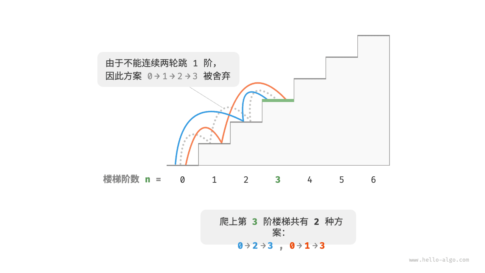
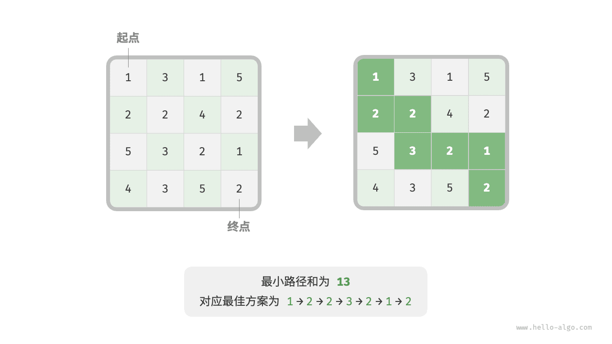
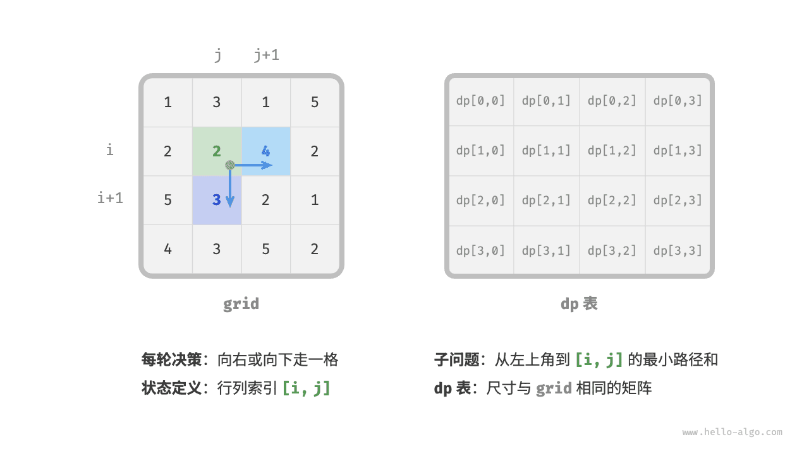
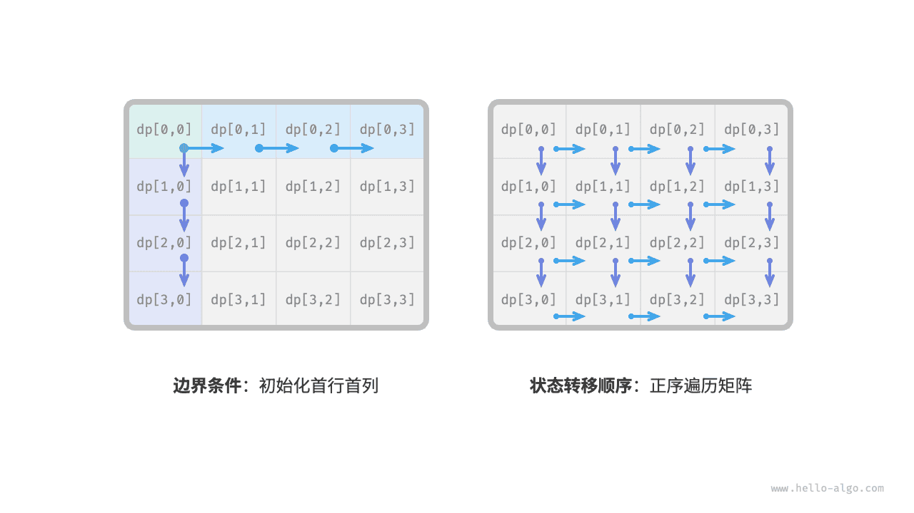
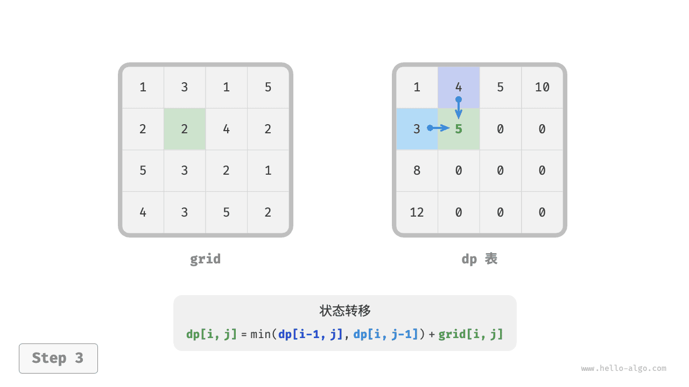
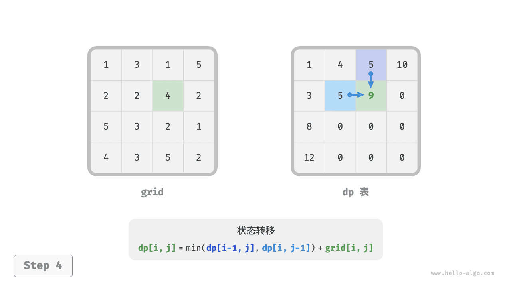
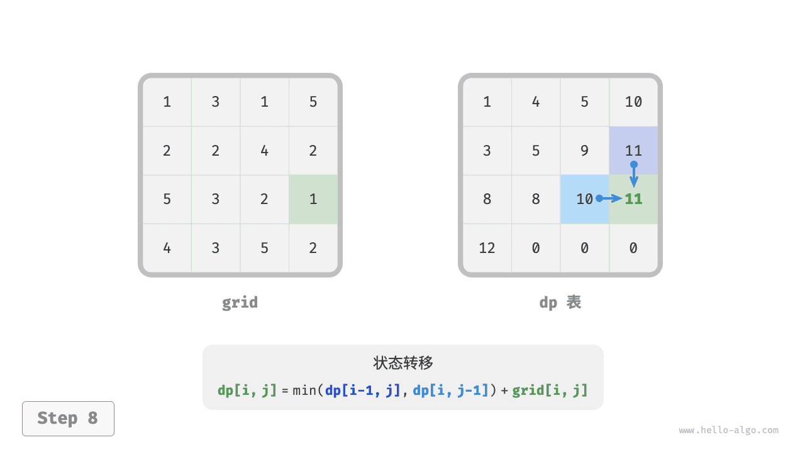
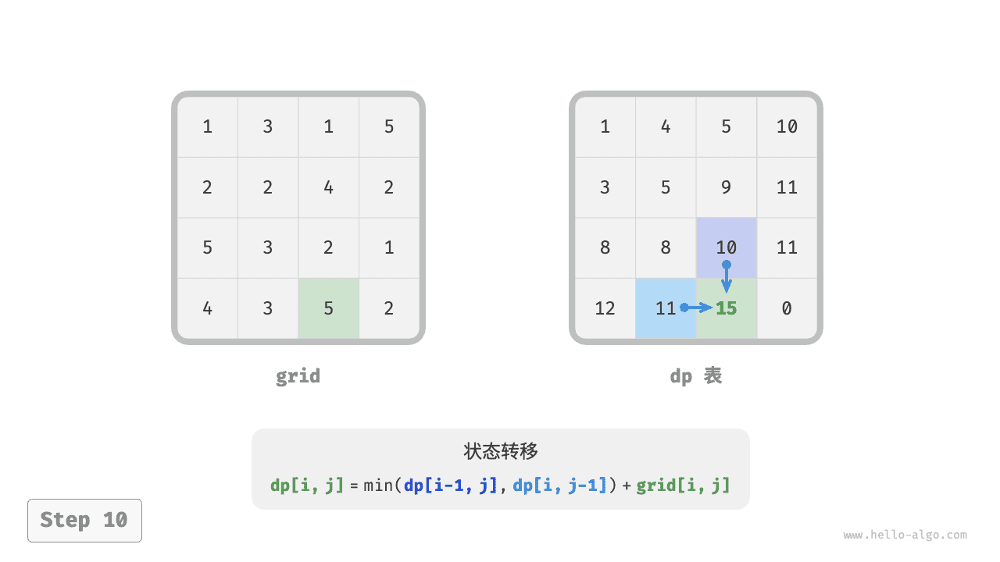

# 动态规划

说明：

以下DP讲解部分主要主要取自三本书：《Problem Solving with Algorithms and Data Structures using Python》，《算法笔记》，和《算法图解》。有5+个典型题目，对于零基础同学来说，很烧脑。dp与递归，经常同时出现。排除最难的贪心题目，本课程最难的部分是DP。因为没有定式，只有框架。从经典模型讲起，结合例题。

零基础同学，最好提前预习。预习内容可以是《算法图解》第9章，里面的两个题目，在我们的题库中是：OJ23421: 小偷背包，OJ02806:公共子序列。

`OJ23421: 小偷背包`是 0-1背包，`CF189A.Cut Ribbon` 是完全背包最优化。 本节`找出最少零钱组合`是完全背包最优化。

`02945: 拦截导弹`带出了`狄尔沃斯定理`，https://github.com/GMyhf/2024fall-cs101/blob/main/other/Dilworth_theorem.md

有100+个逐行讲解的题目视频，顺着这个链接都能找到，【oj02754八皇后_TA胡扬-哔哩哔哩】 https://b23.tv/s933Y5c      如果有缺少并且需要，可以在群里反馈，TA还可以录制的。

## DP的影子

优化问题除了使用时间复杂度更低的算法（如：线性筛/欧拉筛），还可以用DP。

from functools import lru_cache; lru_cache(maxsize = None) 


> 动态规划与分治方法类似，通过**组合子问题的解**来解决问题。（此处的“编程”指的是**表格化的方法**，而不是编写计算机代码。）分治算法将问题划分为互不重叠的子问题，递归地解决这些子问题，然后合并它们的解以解决原问题。相比之下，当**子问题重叠**——即子问题共享更小的子问题时——才适用动态规划。在这种情况下，分治算法会做不必要的重复工作，反复求解相同的子子问题。而动态规划算法则**只对每个子子问题求解一次，并将其答案保存在表格中**，从而避免每次求解该子子问题时重新计算答案。
>
> 我们通常将动态规划应用于**最优化问题**。这类问题可能有多种可能的解。每个解都有一个值，我们希望找到一个具有最优（最小或最大）值的解。我们将这种解称为该问题的一个**最优解**，而不是“the optimal solution”，因为可能有多个解能达到最优值。
>
> 在设计动态规划算法时，我们遵循以下四个步骤：
>
> 1. 描述最优解的结构。
>2. 递推地定义最优解的值。
> 3. 按照自底向上的方式计算最优解的值。
>4. 根据已计算的信息构造一个最优解。
> 
>**步骤1至3构成了动态规划解法的基础**。如果我们只需要最优解的值，而不需要解本身，就可以省略第4步。当我们执行第4步时，有时会在第3步中维护额外信息，以便能够轻松地构造出一个最优解。
> 
>


> 15.3 动态规划的要素
>
> 尽管我们刚刚通过两个动态规划方法的例子进行了讲解，你可能仍然在思考这种方法适用的条件。从工程的角度来看，什么时候我们应该寻找一个问题的动态规划解法呢？在本节中，我们将探讨最优问题必须具备的两个关键要素，以便应用动态规划：**最优子结构**和**重叠子问题**。我们还将重新审视并更深入地讨论记忆化（memoization）如何帮助我们在自顶向下的递归方法中利用重叠子问题的特性。
>
> **最优子结构**
>
> 使用动态规划求解优化问题的第一步是刻画最优解的结构。回忆一下，如果一个问题的最优解包含其子问题的最优解，则称该问题具有**最优子结构**。每当一个问题表现出最优子结构时，我们就有了一个很好的线索，表明动态规划可能适用。（如第16章所述，这也可能意味着贪心策略适用，但情况并非总是如此。）在动态规划中，我们通过子问题的最优解来构建原问题的最优解。因此，必须小心确保我们考虑的子问题范围包括了最优解中所使用的那些子问题。


> **重叠子问题**
>
> 动态规划适用于优化问题的第二个必要条件是：子问题的空间必须“较小”，也就是说，该问题的递归算法会反复求解相同的子问题，而不是总是生成新的子问题。通常情况下，**不同子问题的总数是输入规模的多项式**。当一个递归算法反复访问同一个问题时，我们就说这个优化问题具有**重叠子问题**。相比之下，适合使用分治法的问题通常在递归的每一步都会生成全新的问题。动态规划算法通常通过**每次只解决每个子问题一次，然后将解存储在一个表中，以便在需要时以常数时间进行查找**，从而利用重叠子问题的特性。


### 230B. T-primes

binary search, implementation, math, number theory, 1300, http://codeforces.com/problemset/problem/230/B

求解素数的三种方法，包括：试除法（trial division）、埃氏筛（Sieve of Eratosthenes）、欧拉筛（Sieve of Euler，线性法），https://blog.dotcpp.com/a/69737

@lru_cache(maxsize = None) 


除余法，pypy3可以AC 230B。lru_cache 如果屏蔽了，超时。


```python
import math
from functools import lru_cache 

@lru_cache(maxsize = None) 
def prime(x):
    for i in range(2, int(math.sqrt(x))+1):
        if x % i == 0:
            return False
    return True

input()

*a, = map(int, input().split())
ans = []
for i in a:
    if i == 1:
        ans.append('NO')
        continue
    tmp = int(math.sqrt(i))
    if tmp**2 != i:
        ans.append('NO')
        continue
    
    if prime(tmp):
        ans.append('YES')
    else:
        ans.append('NO')

print('\n'.join(ans))
```


### 02810: 完美立方

1）lru_cache 有作用，时间接近先算好的方法。完美立方，http://cs101.openjudge.cn/practice/02810/  2）它对函数的参数起缓存作用，所以作用的函数一定要有参数。


## 动态规划Dynamic Programming

https://runestone.academy/ns/books/published/pythonds3/Recursion/DynamicProgramming.html?mode=browsing

许多计算机科学程序都是为了优化某个值而编写的；例如，找到两点之间的最短路径，找到最能拟合一组点的直线，或者找到满足某些条件的最小对象集。计算机科学家们使用了许多策略来解决这些问题。本节的一个目标是让你接触到几种不同的问题解决策略。**动态规划**是解决这类优化问题的一种策略。

> Many programs in computer science are written to optimize some value; for example, find the shortest path between two points, find the line that best fits a set of points, or find the smallest set of objects that satisfies some criteria. There are many strategies that computer scientists use to solve these problems. One of the goals of this book is to expose you to several different problem-solving strategies. **Dynamic programming** is one strategy for these types of optimization problems.

一个经典的优化问题涉及使用最少的硬币找零。假设你是一名自动售货机制造商的程序员。你的公司希望通过在每次交易中给出最少的硬币来找零来简化工作。假设一位顾客投入了一美元并购买了一件价值37美分的商品。你能用最少的硬币找零吗？答案是六枚硬币：两枚25美分硬币，一枚10美分硬币和三枚1美分硬币。我们是如何得出六枚硬币的答案的呢？我们从最大的硬币（25美分硬币）开始，尽可能多地使用它们，然后转向下一个面值较小的硬币，并尽可能多地使用它们。这种方法称为**贪婪方法**，因为我们试图立即解决尽可能大的问题部分。

> A classic example of an optimization problem involves making change using the fewest coins. Suppose you are a programmer for a vending machine manufacturer. Your company wants to streamline effort by giving out the fewest possible coins in change for each transaction. Suppose a customer puts in a dollar bill and purchases an item for 37 cents. What is the smallest number of coins you can use to make change? The answer is six coins: two quarters, one dime, and three pennies. How did we arrive at the answer of six coins? We start with the largest coin in our arsenal (a quarter) and use as many of those as possible, then we go to the next lowest coin value and use as many of those as possible. This first approach is called a **greedy method** because we try to solve as big a piece of the problem as possible right away.

### Greedy找不准

贪婪方法在美国硬币系统中效果很好，但假设你的公司决定在下埃博尼亚部署其自动售货机，除了常用的1美分、5美分、10美分和25美分硬币外，他们还有一种21美分的硬币。在这种情况下，贪婪方法无法找到63美分找零的最佳解决方案。增加21美分硬币后，贪婪方法仍然会找到六枚硬币的解决方案。然而，最佳答案是三枚21美分的硬币。

> The greedy method works fine when we are using U.S. coins, but suppose that your company decides to deploy its vending machines in Lower Elbonia where, in addition to the usual 1, 5, 10, and 25 cent coins they also have a 21 cent coin. In this instance our greedy method fails to find the optimal solution for 63 cents in change. With the addition of the 21 cent coin the greedy method would still find the solution to be six coins. However, the optimal answer is three 21 cent pieces.


```python
# Recursive example of trying to get the least amount of coins 

def recMC_greedy(coinValueList: list, change: int) -> int:
    if change == 0:  # base case 
        return 0

    # use the maximum in the list
    cur_max = max(coinValueList)

    # find how many of the max is needed to make the change 
    count = change // cur_max
    index = coinValueList.index(cur_max)
    del coinValueList[index]  # erasing the current max s

    # returns the counts of the coins using recursion
    return count + recMC_greedy(coinValueList, change - cur_max * count)


# using the greedy algorithm 
# but greedy algorithm gives 6 coins which is not the most optimum solution
print(recMC_greedy([1, 5, 10, 21, 25], 63))

```


https://stackoverflow.com/questions/43233535/explicitly-define-datatype-in-python-function


### Recursion找的慢

让我们看看一种可以确保找到问题最优解的方法。让我们从确定基准情况开始。如果我们试图找零的金额正好等于我们某一种硬币的价值，那么答案很简单，只需要一枚硬币。

> Let’s look at a method where we could be sure that we would find the optimal answer to the problem. Let’s start with identifying the base case. If we are trying to make change for the same amount as the value of one of our coins, the answer is easy, one coin.

如果金额不匹配，有多个选项。想要的是：一枚1美分硬币加上找零所需硬币数量（原始金额减去1美分），或一枚5美分硬币加上找零所需硬币数量（原始金额减去5美分），或一枚10美分硬币加上找零所需硬币数量（原始金额减去10美分），依此类推。所以，找零所需硬币数量可以根据以下公式计算：

> If the amount does not match we have several options. What we want is the minimum of a penny plus the number of coins needed to make change for the original amount minus a penny, or a nickel plus the number of coins needed to make change for the original amount minus five cents, or a dime plus the number of coins needed to make change for the original amount minus ten cents, and so on. So the number of coins needed to make change for the original amount can be computed according to the following:

$
num\_coins = \min 
\begin{cases} 
1 + num\_coins(\text{original amount} - 1) \\ 
1 + num\_coins(\text{original amount} - 5) \\ 
1 + num\_coins(\text{original amount} - 10) \\ 
1 + num\_coins(\text{original amount} - 25) 
\end{cases} 
$


该算法如列表17所示。在第3行，检查基准情况，即试图找零的金额正好等于某一种硬币的价值。如果金额不匹配，对每种小于找零金额的硬币值进行递归调用。第6行显示了如何使用<mark>列表推导式</mark>过滤出小于当前找零金额的硬币。递归调用也在第7行进行。注意，在同一行中，我们加1来表示我们使用了一枚硬币。加1的效果就像立即满足了基准情况条件一样。

> The algorithm for doing what we have just described is shown in Listing 17. In line 3 we are checking our base case; that is, we are trying to make change in the exact amount of one of our coins. If we do not have a coin equal to the amount of change, we make recursive calls for each different coin value less than the amount of change we are trying to make. Line 6 shows how we filter the list of coins to those less than the current value of change using a list comprehension. The recursive call also reduces the total amount of change we need to make by the value of the coin selected. The recursive call is made in line 7. Notice that on that same line we add 1 to our number of coins to account for the fact that we are using a coin. Just adding 1 is the same as if we had made a recursive call asking where we satisfy the base case condition immediately.


**Listing 17:** Recursive Version of Coin Optimization Problem

```python
 
def make_change_1(coin_denoms, change):
    if change in coin_denoms:
        return 1
    min_coins = float("inf")
    for i in [c for c in coin_denoms if c <= change]:
        num_coins = 1 + make_change_1(coin_denoms, change - i)
        min_coins = min(num_coins, min_coins)
    return min_coins


print(make_change_1([1, 5, 10, 25], 63))
```


列表17中的算法极其低效。事实上，它需要67,716,925次递归调用才能找到四枚硬币63美分问题的最优解！要理解该方法中的致命缺陷，可以看图14，它展示了找到26美分最优硬币组合所需的377次函数调用的一小部分。

> The trouble with the algorithm in Listing 17 is that it is extremely inefficient. In fact, it takes 67,716,925 recursive calls to find the optimal solution to the 4 coins, 63 cents problem! To understand the fatal flaw in our approach look at Figure 14, which illustrates a small fraction of the 377 function calls needed to find the optimal set of coins to make change for 26 cents.

图中的每个节点对应一次`make_change_1`调用。节点上的标签表示正在计算找零所需硬币数量的金额。箭头上的标签表示我们刚刚使用的硬币。通过跟随图中的路径，可以看到组合哪些硬币使我们到达图中的任何一点。主要问题是我们在重做太多计算。例如，图显示算法会至少三次重新计算15美分找零的最优硬币数量。每次计算15美分找零的最优硬币数量本身就需要52次函数调用。显然，浪费了很多时间和精力重新计算旧结果。

> Each node in the graph corresponds to a call to `make_change_1`. The label on the node indicates the amount of change for which we are computing the number of coins. The label on the arrow indicates the coin that we just used. By following the graph we can see the combination of coins that got us to any point in the graph. The main problem is that we are redoing too many calculations. For example, the graph shows that the algorithm would recalculate the optimal number of coins to make change for 15 cents at least three times. Each of these computations to find the optimal number of coins for 15 cents itself takes 52 function calls. Clearly we are wasting a lot of time and effort recalculating old results.

[](https://runestone.academy/ns/books/published/pythonds3/_images/callTree.png?mode=browsing)

<center>Figure 14: Call Tree for Listing 17</center>


### Recursion with memoization记忆化搜索

减少工作量的关键是记住一些过去的结果，以避免重新计算已知的结果。一个简单的解决方案是在找到最小硬币数量时将其存储在表格中。然后在计算新最小值之前，首先检查表格中是否有已知结果。如果表格中有结果，使用表格中的值而不是重新计算。活动代码4.12.1显示了修改后的算法，以包含我们的表格查找方案。

> The key to cutting down on the amount of work we do is to remember some of the past results so we can avoid recomputing results we already know. A simple solution is to store the results for the minimum number of coins in a table when we find them. Then before we compute a new minimum, we first check the table to see if a result is already known. If there is already a result in the table, we use the value from the table rather than recomputing. ActiveCode 1 shows a modified algorithm to incorporate our table lookup scheme.


```python
def make_change_2(coin_value_list, change, known_results):
    min_coins = change
    if change in coin_value_list:
        known_results[change] = 1
        return 1
    elif known_results[change] > 0:
        return known_results[change]
    else:
        for i in [c for c in coin_value_list if c <= change]:
            num_coins = 1 + make_change_2(coin_value_list, change - i, known_results)
            if num_coins < min_coins:
                min_coins = num_coins
            known_results[change] = min_coins
    return min_coins

print(make_change_2([1, 5, 10, 25], 63, [0] * 64))
```

Activity: 4.12.1 Recursively Counting Coins with Table Lookup


注意，在第6行，添加了一个测试，以查看我们的表格是否包含特定找零金额的最小硬币数量。如果没有，递归计算最小值并将计算出的最小值存储在表格中。使用这种修改后的算法将四枚硬币63美分问题所需的递归调用次数减少到221次！

> Notice that in line 6 we have added a test to see if our table contains the minimum number of coins for a certain amount of change. If it does not, we compute the minimum recursively and store the computed minimum in the table. Using this modified algorithm reduces the number of recursive calls we need to make for the four coin, 63 cent problem to 221 calls!


尽管上面代码中的算法是正确的，但它看起来像是一种修补。此外，如果查看`known_results`列表，可以看到表格中有一些空白。事实上，所做的技术被称为<mark>记忆化（memoization）</mark>，更常见的是*缓存*（caching），而不是动态规划。

> Although the algorithm in AcitveCode 1 is correct, it looks and feels like a bit of a hack. Also, if we look at the `known_results` lists we can see that there are some holes in the table. In fact the term for what we have done is not dynamic programming but rather we have improved the performance of our program by using a technique known as *memoization*, or more commonly called *caching*.


### Truly dynamic programming递推写法

一个真正的动态规划算法将对问题采取更系统的方法。动态规划解决方案将从找零1美分开始，系统地向上推进到所需的找零金额。这保证了在算法的每一步，已经知道任何较小金额的最小硬币数量。

> A truly dynamic programming algorithm will take a more systematic approach to the problem. Our dynamic programming solution is going to start with making change for one cent and systematically work its way up to the amount of change we require. This guarantees that at each step of the algorithm we already know the minimum number of coins needed to make change for any smaller amount.

让我们看看如何填充一个最小硬币数量表，以用于11美分的找零。图15展示了这个过程。从1美分开始。唯一的解决方案是一枚硬币（1美分）。下一行显示了1美分和2美分的最小值。同样，唯一的解决方案是两枚1美分硬币。第五行是有趣的地方。现在有两个选择：五枚1美分硬币或一枚5美分硬币。如何决定哪个更好？查阅表格，看到找零4美分所需的硬币数量是四枚，再加上一枚1美分硬币，总共五枚硬币。或者可以看0美分加上一枚5美分硬币，总共一枚硬币。由于1和5的最小值是1，我们在表格中存储1。跳到表格的末尾，考虑11美分。

> Let’s look at how we would fill in a table of minimum coins to use in making change for 11 cents. Figure 15illustrates the process. We start with one cent. The only solution possible is one coin (a penny). The next row shows the minimum for one cent and two cents. Again, the only solution is two pennies. The fifth row is where things get interesting. Now we have two options to consider, five pennies or one nickel. How do we decide which is best? We consult the table and see that the number of coins needed to make change for four cents is four, plus one more penny to make five, equals five coins. Or we can look at zero cents plus one more nickel to make five cents equals one coin. Since the minimum of one and five is one we store 1 in the table. Fast forward again to the end of the table and consider 11 cents. Figure 16shows the three options that we have to consider:


<center>Figure 15: Minimum Number of Coins Needed to Make Change</center>


图16显示了我们需要考虑的三个选项：

1. A penny plus the minimum number of coins to make change for 11 - 1 = 10 cents (1)
2. A nickel plus the minimum number of coins to make change for 11 - 5 = 6 cents (2)
3. A dime plus the minimum number of coins to make change for 11 - 10 = 1 cent (1)

选项1或3都会给我们总共两枚硬币，这是11美分的最小硬币数量。

> Either option 1 or 3 will give us a total of two coins which is the minimum number of coins for 11 cents.


<center>Figure 16: Three Options to Consider for the Minimum Number of Coins for Eleven Cents</center>


列表19是一个动态规划算法，用于解决我们的找零问题。`make_change_3`接受三个参数：有效的硬币值列表、我们要找零的金额，以及一个列表，用于存储制作每个值所需的最小硬币数量。当函数完成时，`min_coins`将包含从0到`change`值的所有值的解决方案。

> Listing 19 is a dynamic programming algorithm to solve our change-making problem. `make_change_3`takes three parameters: a list of valid coin values, the amount of change we want to make, and a list of the minimum number of coins needed to make each value. When the function is done, `min_coins` will contain the solution for all values from 0 to the value of `change`.


**Listing 19:** Dynamic Programming Solution

```python
def make_change_3(coin_value_list, change, min_coins):
   for cents in range(change + 1):
      coin_count = cents
      for j in [c for c in coin_value_list if c <= cents]:
            if min_coins[cents - j] + 1 < coin_count:
               coin_count = min_coins[cents - j] + 1
      min_coins[cents] = coin_count
   return min_coins[change]

print(make_change_3([1, 5, 10, 21, 25], 63, [0]*64))
```


请注意，`make_change_3`不是一个递归函数，即使我们是从递归解决方案开始的。重要的是要意识到，递归解决方案不一定是解决问题的最有效方法。该函数的<mark>主要工作是由从第4行开始的循环完成的</mark>。在这个循环中，考虑使用所有可能的硬币来制作指定金额的找零。就像上面11美分的例子一样，记住最小值并将其存储在`min_coins`列表中。

> Note that `make_change_3` is not a recursive function, even though we started with a recursive solution to this problem. It is important to realize that a recursive solution to a problem will not necessarily be the most efficient solution. The bulk of the work in this function is done by the loop that starts on line 4. In this loop we consider using all possible coins to make change for the amount specified by `cents`. Like we did for the 11 cent example above, we remember the minimum value and store it in our `min_coins`list.


尽管我们的找零算法在计算最小硬币数量方面做得很好，但它并没有帮助我们实际找零，因为没有跟踪所使用的硬币。可以通过简单地记住`min_coins`表中每个条目的最后一枚硬币来轻松扩展`make_change_3`。如果知道最后一枚添加的硬币，只需减去该硬币的价值即可找到表中的前一个条目，该条目告诉我们添加最后一枚硬币以制作该金额所需的硬币。可以一直回溯到表的开头。

> Although our making change algorithm does a good job of figuring out the minimum number of coins, it does not help us make change since we do not keep track of the coins we use. We can easily extend `make_change_3` to keep track of the coins used by simply remembering the last coin we add for each entry in the `min_coins` table. If we know the last coin added, we can simply subtract the value of the coin to find a previous entry in the table that tells us the last coin we added to make that amount. We can keep tracing back through the table until we get to the beginning.


下面是基于`make_change_3`算法但修改为跟踪所使用硬币的`make_change_4`，以及一个函数`print_coins`，该函数向后遍历表以打印出每个使用的硬币的值。这展示了算法如何实际解决问题。`main`函数的前两行设置了要转换的金额并创建了使用的硬币列表。接下来的两行创建了存储结果所需的列表。`coins_used`是用于找零的硬币列表，而`coin_count`是用于找零对应金额的最小硬币数量。

> ActiveCode 2 shows `make_change_4`, based on the `make_change_3` algorithm but modified to keep track of the coins used, along with a function `print_coins` that walks backward through the table to print out the value of each coin used. This shows the algorithm in action solving the problem for our friends in Lower Elbonia. The first two lines of `main` set the amount to be converted and create the list of coins used. The next two lines create the lists we need to store the results. `coins_used` is a list of the coins used to make change, and `coin_count` is the minimum number of coins used to make change for the amount corresponding to the position in the list.


注意，打印出的硬币直接来自`coins_used`数组。对于第一次调用，从数组位置63开始，打印出21。然后我们查看列表中的第42个元素，再次找到存储的21。最后，数组的第21个元素也包含21，这给了我们三枚21美分的硬币。

> Notice that the coins we print out come directly from the `coins_used` array. For the first call we start at array position 63 and print 21. Then we take and look at the 42nd element of the list. Once again we find a 21 stored there. Finally, element 21 of the array also contains 21, giving us the three 21 cent pieces.


```python
def make_change_4(coin_value_list, change, min_coins, coins_used):
    for cents in range(change + 1):
        coin_count = cents
        new_coin = 1
        for j in [c for c in coin_value_list if c <= cents]:
            if min_coins[cents - j] + 1 < coin_count:
                coin_count = min_coins[cents - j] + 1
                new_coin = j
        min_coins[cents] = coin_count
        coins_used[cents] = new_coin
    return min_coins[change]


def print_coins(coins_used, change):
    coin = change
    while coin > 0:
        this_coin = coins_used[coin]
        print(this_coin, end=" ")
        coin = coin - this_coin
    print()


def main():
    amnt = 63
    clist = [1, 5, 10, 21, 25]
    coins_used = [0] * (amnt + 1)
    coin_count = [0] * (amnt + 1)

    print(
       "Making change for {} requires the following {} coins: ".format(
             amnt, make_change_4(clist, amnt, coin_count, coins_used)
       ),
       end="",
    )
    print_coins(coins_used, amnt)
    print("The used list is as follows:")
    print(coins_used)


main()
```


### 总结

找出最少零钱组合问题可以被视为一个<mark>完全背包</mark>问题的变种，具体来说，它是一个“完全背包”问题的最优解问题。下面我将详细解释这个问题的背景和解决方法。

**问题描述**

给定一组不同面额的硬币和一个总金额，找出组成该总金额所需的最少硬币数。如果不能组成该总金额，返回 -1。

**完全背包问题**

完全背包问题是一种背包问题，其中<mark>每种物品可以无限次选择</mark>。在最少零钱组合问题中，每种面额的硬币可以无限次使用，因此它可以被视为一个完全背包问题。

**动态规划解决方法**

我们可以使用动态规划来解决这个问题。具体步骤如下：

1. **定义状态**：

   - `dp[i]` 表示组成金额 `i` 所需的最少硬币数。

2. **初始化**：

   - `dp[0] = 0`，因为组成金额 0 所需的硬币数为 0。
   - 其他 `dp[i]` 初始化为一个较大的值（如 `float('inf')`），表示初始状态下无法组成这些金额。

3. <mark>**状态转移方程**</mark>：

   - 对于每个金额 `i`，遍历所有可用的硬币面额 `coin`，更新 `dp[i]`：
     $$
     dp[i] = \min(dp[i], dp[i - coin] + 1)
     $$

   - 这个方程的含义是：<mark>如果当前金额 `i` 可以通过选择一个面额为 `coin` 的硬币来减少到 `i - coin`，那么 `dp[i]` 就是 `dp[i - coin] + 1` 和当前 `dp[i]` 的最小值</mark>。

4. **返回结果**：

   - 如果 `dp[amount]` 仍然是初始的大值，说明无法组成该金额，返回 -1。
   - 否则，返回 `dp[amount]`。

**代码实现**

```python
def min_coins_for_change(amount, coins):
    # 初始化 dp 数组，dp[i] 表示组成金额 i 所需的最少硬币数
    dp = [float('inf')] * (amount + 1)
    dp[0] = 0  # 组成金额 0 所需的硬币数为 0

    # 遍历每个金额 i
    for i in range(1, amount + 1):
        # 遍历每个硬币面额 coin
        for coin in coins:
            if i >= coin:
                dp[i] = min(dp[i], dp[i - coin] + 1)

    # 返回结果
    return dp[amount] if dp[amount] != float('inf') else -1

# 示例
amount = 11
coins = [1, 2, 5]
print(min_coins_for_change(amount, coins))  # 输出 3 (5 + 5 + 1)
```

**时间复杂度**

- 时间复杂度为 O(n * m)，其中 n 是金额 `amount`，m 是硬币面额的数量。
- 空间复杂度为 O(n)，因为我们使用了一个长度为 `amount + 1` 的 `dp` 数组。


## 动态规划的递归写法和递推写法

《算法笔记》第11.1节

动态规划是一种非常精妙的算法思想，它没有固定的写法、极其灵活，常常需要具体问题具体分析。学习方式是先接触一些经典模型，这样会有更好的效果。在介绍一些动态规划经典模型中，穿插动态规划的概念，慢慢接触动态规划。同时多练习、多思考、多总结是学习动态规划的重点。

**什么是动态规划**

动态规划 (Dynamic Programming，DP) 是一种用来解决一类最优化问题的算法思想。简单来说，动态规划将一个复杂的问题分解成若干个子问题，通过综合子问题的最优解来得到原问题的最优解。需要注意的是，动态规划会将每个求解过的子问题的解记录下来，这样当下一次碰到同样的子问题时，就可以直接使用之前记录的结果，而不是重复计算。⚠️：虽然动态规划采用这种方式来提高计算效率，但不能说这种做法就是动态规划的核心。

一般可以使用递归或者递推的写法来实现动态规划，其中==递归写法在此处又称作记忆化搜索==。

### 动态规划的递归写法

先来讲解递归写法。通过这部分内容的学习，理解动态规划是如何记录子问题的解，来避免下次遇到相同的子问题时的重复计算的。

以斐波那契（Fibonacci）数列为例。


#### 示例02753: 菲波那契数列

math,recursion, dp, http://cs101.openjudge.cn/pctbook/E02753

菲波那契数列是指这样的数列: 数列的第一个和第二个数都为1，接下来每个数都等于前面2个数之和。
给出一个正整数a，要求菲波那契数列中第a个数是多少。

菲波那契（Fibonacci）数列的定义为 $F_0=0,F_1=1,F_n=F_{n-1} + F_{n-2} \ (n\ge 2)$

```python
def f(n):
    if n <= 2:
        return 1
    else:
        return f(n-1)+f(n-2)


n = int(input())
ans = []
for _ in range(n):
    num = int(input())
    ans.append(f(num))

print('\n'.join(map(str, ans)))
```


事实上，这个递归会涉及很多重复的计算。如图A所示，当n=5 时，可以得到 F(5)= F(4) + F(3)，接下来在计算 F(4)时又会有 F(4)= F(3) + F(2)。这时候如果不采取措施，F(3)将会被计算两次。可以推知，如果 n 很大，重复计算的次数将难以想象。事实上，由于没有及时保存中间计算的结果，实际复杂度会高达 $O(2^n)$，即每次都会计算 F(n-1)和 F(n-2)这两个分支，基本不能承受 n 较大的情况。

为了避免重复计算，可以开一个一维数组 dp，用以保存已经计算过的结果，其中 dp[n]记录 F(n)的结果，并用 dp[n]=-1 表示 F(n)当前还没有被计算过。然后就可以在递归当中判断dp[n]是否是-1：如果不是-1，说明已经计算过F(n),直接返回 dp[n]就是结果，否则，按照递归式进行递归。


​					图A 斐波那契数列递归图						图B 斐波那契数列记忆化搜索示意图

这样就把已经计算过的内容记录了下来，于是当下次再碰到需要计算相同的内容时，就能直接使用上次计算的结果，这可以省去大半无效计算，而这也是==记忆化搜索这个名字的由来==。如图B所示，通过记忆化搜索，把复杂度从 $O(2^n)$降到了 $O(n)$，也就是说，用一个 $O(n)$空间的力量就让复杂度从指数级别降低到了线性级别。

```python
def f(n):
    if n <= 2:
        return 1
    
    if dp[n] != -1:
        return dp[n]
    else:
        dp[n] = f(n-1)+f(n-2)
        return dp[n]


dp = [-1]*21
n = int(input())
ans = []
for _ in range(n):
    num = int(input())
    ans.append(f(num))

print('\n'.join(map(str, ans)))
```

通过上面的例子可以引申出一个概念：如果一个问题可以被分解为若干个子问题，且这些子问题会重复出现，那么就称这个问题拥有**重叠子问题（Overlapping Subproblems）**。动态规划通过记录重叠子问题的解，来使下次碰到相同的子问题时直接使用之前记录的结果以此避免大量重复计算。因此，==一个问题必须拥有重叠子问题，才能使用动态规划去解决==。


```python
'''
Python Functools – lru_cache(), 
https://www.geeksforgeeks.org/python-functools-lru_cache/

The LRU caching scheme is to remove the least recently used frame when the 
cache is full and a new page is referenced which is not there in the cache.  
https://www.geeksforgeeks.org/python-lru-cache/
'''
from functools import lru_cache 

@lru_cache(maxsize = 128) 
def f(n):
    if n <= 2:
        return 1
    else:
        return f(n-1)+f(n-2)


n = int(input())
list_1 = []
for i in range(n):
    num = int(input())
    list_1.append(f(num))
for i in list_1:
    print(i)
```


### 动态规划的递推写法

以经典的数塔问题为例，如图 11-3 所示，将一些数字排成数塔的形状，其中第一层有一个数字，第二层有两个数字......第n层有n 个数字。现在要从第一层走到第n 层，每次只能走向下一层连接的两个数字中的一个，问：最后将路径上所有数字相加后得到的和最大是多少?


按照题目的描述，如果开一个二维数组 f，其中 f\[i][j]存放第i层的第j个数字，那么就有f\[1][1]= 5，f\[2]\[1]= 8，f\[2][2]= 3，f\[3][1] = 12，...， f\[5][4]=9，f\[5][5]= 4。

此时，如果尝试穷举所有路径，然后记录路径上数字和的最大值，那么由于每层中的每个数字都会有两条分支路径，因此可以得到时间复杂度为 $O(2^n)$，这在 n 很大的情况下是不可接受的。那么，产生这么大复杂度的原因是什么？下面来分析一下。一开始，从第一层的 5 出发，按 5->8->7 的路线来到 7，并枚举从 7 出发的到达最底层的所有路径。但是，之后当按 5->3->7 的路线再次来到 7 时，又会去枚举从 7 出发的到达最底层的所有路径，这就导致了从 7 出发的到达最底层的所有路径都被<mark>反复地访问</mark>，做了许多多余的计算。事实上，可以在第一次枚举从 7 出发的到达最底层的所有路径时就把路径上能产生的最大和记录下来，这样当再次访问到 7 这个数字时就可以直接获取这个最大值，避免重复计算。

由上面的考虑，不妨令 ==dp\[i][j]表示从第i行第j个数字出发的到达最底层的所有路径中能得到的最大和==，例如 dp\[3][2] 就是图中的7 到最底层的路径最大和。在定义这个数组之后dp\[1][1]就是最终想要的答案，现在想办法求出它。

注意到一个细节：如果要求出“从位置(1,1)到达最底层的最大和”dp\[1][1]，那么一定要先求出它的两个子问题“从位置(2,1)到达最底层的最大和 dp\[2][1]”和“从位置(2,2)到达最底层的最大和 dp\[2][2]”，即进行了一次决策：走数字 5 的左下还是右下。于是 dp\[1][1]就是dp\[2][1]和 dp\[2][2]的较大值加上 5。写成式子就是:

$dp[1][1] = max(dp[2][1],dp[2][2])+ f[1][1]$

由此可以归纳得到这么一个信息：如果要求`dp[i][j]`，那么一定要先求出它的两个子问题`从位置 (i +1,j) 到达最底层的最大和 dp[i+1][j]`和`从位置(i+1,j+ 1)到达最底层的最大和 dp[i+1][j+1]`，即进行了一次决策：走位置(i,j)的左下还是右下。于是 dp\[i][j]就是 dp\[i+1][j]和 dp\[i+ 1][j+ 1]的较大值加上 f\[i][j]。写成式子就是:


$dp[i][j] = max(dp[i+1][j],dp[i +1][j+ 1])+f[i][j]$


把 dp\[i][j]称为问题的<mark>状态</mark>，而把上面的式子称作**状态转移方程**，它把状态 dp\[i][j]转移为dp\[i+1][j]和 dp\[i+1][j+1]。可以发现，状态 dp\[i][j]只与第i + 1层的状态有关，而与其他层的状态无关，这样层号为 i的状态就总是可以由层号为i+1的两个子状态得到。那么，如果总是将层号增大，什么时候会到头呢？可以发现，数塔的最后一层的 dp 值总是等于元素本身即 $dp[n][j]=f[n][j]\ (1\le j \le n)$，把这种可以直接确定其结果的部分称为**边界**，而==动态规划的递推写法总是从这些边界出发，通过状态转移方程扩散到整个dp数组==。

这样就可以从最底层位置的dp值开始，不断往上求出每一层各位置的dp值，最后就会得到dp\[1][1]，即为想要的答案。

#### 示例02760: 数字三角形

我们结合 02760: 数字三角形，先给出超时的递归写法，然后给出递归写法实现的动态规划，再给出递推写法实现的动态规划。


dp, dfs similar, http://cs101.openjudge.cn/pctbook/M02760

```
       7
     3   8
    8   1   0
  2   7   4   4
4   5   2   6   5

      (图1)
```

图1给出了一个数字三角形。从三角形的顶部到底部有很多条不同的路径。对于每条路径，把路径上面的数加起来可以得到一个和，你的任务就是找到最大的和。

注意：路径上的每一步只能从一个数走到下一层上和它最近的左边的那个数或者右边的那个数。


只递归，不用dp，立马超时。

```python
def f(i, j):									# Time Limit Exceeded, 9953ms
    if i == N-1:
        return tri[i][j]

    return max(f(i+1, j), f(i+1, j+1)) + tri[i][j]


N = int(input())
tri = []
for _ in range(N):
    tri.append([int(i) for i in input().split()])
print(f(0, 0))
```


使用递归写法来实现动态规划，又称作记忆化搜索。没错，即使用lru_cache，也是纯正的dp。零基础同学应该容易理解。至少希望是。

```python
from functools import lru_cache 

@lru_cache(maxsize = 128) 
def f(i, j):
    if i == N-1:
        return tri[i][j]

    return max(f(i+1, j), f(i+1, j+1)) + tri[i][j]


N = int(input())
tri = []
for _ in range(N):
    tri.append([int(i) for i in input().split()])
print(f(0, 0))
```


递推写法实现的动态规划。

```python
N = int(input())
tri = []
for _ in range(N):
    tri.append([int(i) for i in input().split()])

dp = [[0]*N for _ in range(N)]
for j in range(N):
    dp[N-1][j] = tri[N-1][j]

for i in range(N-2, -1, -1):
    for j in range(i+1):
        dp[i][j] = max(dp[i+1][j], dp[i+1][j+1]) + tri[i][j]

print(dp[0][0])
```


显然，使用递归也可以实现上面的例子(即从 dp\[0][0]开始递归，直至到达边界时返回结果)。两者的区别在于：使用**递推写法**的计算方式是**自底向上(Bottom-up Approach)**，即从边界开始，不断向上解决问题，直到解决了目标问题：而使用**递归写法**的计算方式是**自顶向下(Top-down Approach)**，即从目标问题开始，将它分解成子问题的组合，直到分解至边界为止。

通过上面的例子再复习一个概念：如果一个问题的最优解可以由其子问题的最优解有效地构造出来，那么称这个问题拥有**最优子结构(Optimal Substructure)**。最优子结构保证了动态规划中原问题的最优解可以由子问题的最优解推导而来。因此，一个问题必须拥有最优子结构，才能使用动态规划去解决。例如数塔问题中，每一个位置的 dp 值都可以由它的两个子问题推导得到。

至此，重叠子问题和最优子结构的内容已介绍完毕。需要指出，**一个问题必须拥有重叠子问题和最优子结构，才能使用动态规划去解决**。下面指出这两个概念的区别: 

① 分治与动态规划。分治和动态规划都是将问题分解为子问题，然后合并子问题的解得到原问题的解。但是不同的是，<mark>分治法分解出的子问题是不重叠的</mark>，因此分治法解决的问题不拥有重叠子问题，而动态规划解决的问题拥有重叠子问题。例如，归并排序和快速排序都是分别处理左序列和右序列，然后将左右序列的结果合并，过程中不出现重叠子问题，因此它们使用的都是分治法。另外，<mark>分治法解决的问题不一定是最优化问题</mark>，而动态规划解决的问题一定是最优化问题。
② 贪心与动态规划。贪心和动态规划都要求原问题必须拥有最优子结构。二者的区别在于，贪心法采用的计算方式类似于上面介绍的“自顶向下”，但是并不等待子问题求解完毕后再选择使用哪一个，而是通过一种策略直接选择一个子问题去求解，没被选择的子问题就不去求解了，直接抛弃。也就是说，它总是只在上一步选择的基础上继续选择，因此整个过程以一种单链的流水方式进行，显然这种所谓“最优选择”的正确性需要用归纳法证明。例如对数塔问题而言，贪心法从最上层开始，每次选择左下和右下两个数字中较大的一个，一直到最底层得到最后结果，显然这不一定可以得到最优解。而动态规划不管是采用自底向上还是自顶向下的计算方式，都是从边界开始向上得到目标问题的解。也就是说，它<mark>总是会考虑所有子问题，并选择继承能得到最优结果的那个，对暂时没被继承的子问题，由于重叠子问题的存在，后期可能会再次考虑它们，因此还有机会成为全局最优的一部分，不需要放弃</mark>。所以贪心是一种壮士断腕的决策，只要进行了选择，就不后悔；动态规划则要看哪个选择笑到了最后，暂时的领先说明不了什么。

随着动态规划的学习，会对上面的内容不断深化理解，因此可以暂时不必太过拘泥于部分细节，之后再回过头来看，可能会有更深的理解。

# 初探动态规划（HA）

<u>动态规划（dynamic programming）</u>是一个重要的算法范式，它将一个问题分解为一系列更小的子问题，并通过存储子问题的解来避免重复计算，从而大幅提升时间效率。

在本节中，我们从一个经典例题入手，先给出它的暴力回溯解法，观察其中包含的重叠子问题，再逐步导出更高效的动态规划解法。

!!! question "爬楼梯"

    给定一个共有 $n$ 阶的楼梯，你每步可以上 $1$ 阶或者 $2$ 阶，请问有多少种方案可以爬到楼顶？

如下图所示，对于一个 $3$ 阶楼梯，共有 $3$ 种方案可以爬到楼顶。


本题的目标是求解方案数量，**我们可以考虑通过回溯来穷举所有可能性**。具体来说，将爬楼梯想象为一个多轮选择的过程：从地面出发，每轮选择上 $1$ 阶或 $2$ 阶，每当到达楼梯顶部时就将方案数量加 $1$ ，当越过楼梯顶部时就将其剪枝。代码如下所示：

```python
def backtrack(choices: list[int], state: int, n: int, res: list[int]) -> int:
    """回溯"""
    # 当爬到第 n 阶时，方案数量加 1
    if state == n:
        res[0] += 1
    # 遍历所有选择
    for choice in choices:
        # 剪枝：不允许越过第 n 阶
        if state + choice > n:
            continue
        # 尝试：做出选择，更新状态
        backtrack(choices, state + choice, n, res)
        # 回退

def climbing_stairs_backtrack(n: int) -> int:
    """爬楼梯：回溯"""
    choices = [1, 2]  # 可选择向上爬 1 阶或 2 阶
    state = 0  # 从第 0 阶开始爬
    res = [0]  # 使用 res[0] 记录方案数量
    backtrack(choices, state, n, res)
    return res[0]
```

!!! example [pythontutor "可视化运行"](https://pythontutor.com/iframe-embed.html#code=def%20backtrack%28choices%3A%20list%5Bint%5D,%20state%3A%20int,%20n%3A%20int,%20res%3A%20list%5Bint%5D%29%20-%3E%20int%3A%0A%20%20%20%20%22%22%22%E5%9B%9E%E6%BA%AF%22%22%22%0A%20%20%20%20%23%20%E5%BD%93%E7%88%AC%E5%88%B0%E7%AC%AC%20n%20%E9%98%B6%E6%97%B6%EF%BC%8C%E6%96%B9%E6%A1%88%E6%95%B0%E9%87%8F%E5%8A%A0%201%0A%20%20%20%20if%20state%20%3D%3D%20n%3A%0A%20%20%20%20%20%20%20%20res%5B0%5D%20%2B%3D%201%0A%20%20%20%20%23%20%E9%81%8D%E5%8E%86%E6%89%80%E6%9C%89%E9%80%89%E6%8B%A9%0A%20%20%20%20for%20choice%20in%20choices%3A%0A%20%20%20%20%20%20%20%20%23%20%E5%89%AA%E6%9E%9D%EF%BC%9A%E4%B8%8D%E5%85%81%E8%AE%B8%E8%B6%8A%E8%BF%87%E7%AC%AC%20n%20%E9%98%B6%0A%20%20%20%20%20%20%20%20if%20state%20%2B%20choice%20%3E%20n%3A%0A%20%20%20%20%20%20%20%20%20%20%20%20continue%0A%20%20%20%20%20%20%20%20%23%20%E5%B0%9D%E8%AF%95%EF%BC%9A%E5%81%9A%E5%87%BA%E9%80%89%E6%8B%A9%EF%BC%8C%E6%9B%B4%E6%96%B0%E7%8A%B6%E6%80%81%0A%20%20%20%20%20%20%20%20backtrack%28choices,%20state%20%2B%20choice,%20n,%20res%29%0A%20%20%20%20%20%20%20%20%23%20%E5%9B%9E%E9%80%80%0A%0A%0Adef%20climbing_stairs_backtrack%28n%3A%20int%29%20-%3E%20int%3A%0A%20%20%20%20%22%22%22%E7%88%AC%E6%A5%BC%E6%A2%AF%EF%BC%9A%E5%9B%9E%E6%BA%AF%22%22%22%0A%20%20%20%20choices%20%3D%20%5B1,%202%5D%20%20%23%20%E5%8F%AF%E9%80%89%E6%8B%A9%E5%90%91%E4%B8%8A%E7%88%AC%201%20%E9%98%B6%E6%88%96%202%20%E9%98%B6%0A%20%20%20%20state%20%3D%200%20%20%23%20%E4%BB%8E%E7%AC%AC%200%20%E9%98%B6%E5%BC%80%E5%A7%8B%E7%88%AC%0A%20%20%20%20res%20%3D%20%5B0%5D%20%20%23%20%E4%BD%BF%E7%94%A8%20res%5B0%5D%20%E8%AE%B0%E5%BD%95%E6%96%B9%E6%A1%88%E6%95%B0%E9%87%8F%0A%20%20%20%20backtrack%28choices,%20state,%20n,%20res%29%0A%20%20%20%20return%20res%5B0%5D%0A%0A%0A%22%22%22Driver%20Code%22%22%22%0Aif%20__name__%20%3D%3D%20%22__main__%22%3A%0A%20%20%20%20n%20%3D%204%0A%0A%20%20%20%20res%20%3D%20climbing_stairs_backtrack%28n%29%0A%20%20%20%20print%28f%22%E7%88%AC%20%7Bn%7D%20%E9%98%B6%E6%A5%BC%E6%A2%AF%E5%85%B1%E6%9C%89%20%7Bres%7D%20%E7%A7%8D%E6%96%B9%E6%A1%88%22%29&codeDivHeight=800&codeDivWidth=600&cumulative=false&curInstr=5&heapPrimitives=nevernest&origin=opt-frontend.js&py=311&rawInputLstJSON=%5B%5D&textReferences=false)

## 方法一：暴力搜索

回溯算法通常并不显式地对问题进行拆解，而是将求解问题看作一系列决策步骤，通过试探和剪枝，搜索所有可能的解。

我们可以尝试从问题分解的角度分析这道题。设爬到第 $i$ 阶共有 $dp[i]$ 种方案，那么 $dp[i]$ 就是原问题，其子问题包括：

$$
dp[i-1], dp[i-2], \dots, dp[2], dp[1]
$$

由于每轮只能上 $1$ 阶或 $2$ 阶，因此当我们站在第 $i$ 阶楼梯上时，上一轮只可能站在第 $i - 1$ 阶或第 $i - 2$ 阶上。换句话说，我们只能从第 $i -1$ 阶或第 $i - 2$ 阶迈向第 $i$ 阶。

由此便可得出一个重要推论：**爬到第 $i - 1$ 阶的方案数加上爬到第 $i - 2$ 阶的方案数就等于爬到第 $i$ 阶的方案数**。公式如下：

$$
dp[i] = dp[i-1] + dp[i-2]
$$

这意味着在爬楼梯问题中，各个子问题之间存在递推关系，**原问题的解可以由子问题的解构建得来**。下图展示了该递推关系。


我们可以根据递推公式得到暴力搜索解法。以 $dp[n]$ 为起始点，**递归地将一个较大问题拆解为两个较小问题的和**，直至到达最小子问题 $dp[1]$ 和 $dp[2]$ 时返回。其中，最小子问题的解是已知的，即 $dp[1] = 1$、$dp[2] = 2$ ，表示爬到第 $1$、$2$ 阶分别有 $1$、$2$ 种方案。

观察以下代码，它和标准回溯代码都属于深度优先搜索，但更加简洁：

```python
def dfs(i: int) -> int:
    """搜索"""
    # 已知 dp[1] 和 dp[2] ，返回之
    if i == 1 or i == 2:
        return i
    # dp[i] = dp[i-1] + dp[i-2]
    count = dfs(i - 1) + dfs(i - 2)
    return count

def climbing_stairs_dfs(n: int) -> int:
    """爬楼梯：搜索"""
    return dfs(n)
```

!!! example [pythontutor "可视化运行"](https://pythontutor.com/iframe-embed.html#code=def%20dfs%28i%3A%20int%29%20-%3E%20int%3A%0A%20%20%20%20%22%22%22%E6%90%9C%E7%B4%A2%22%22%22%0A%20%20%20%20%23%20%E5%B7%B2%E7%9F%A5%20dp%5B1%5D%20%E5%92%8C%20dp%5B2%5D%20%EF%BC%8C%E8%BF%94%E5%9B%9E%E4%B9%8B%0A%20%20%20%20if%20i%20%3D%3D%201%20or%20i%20%3D%3D%202%3A%0A%20%20%20%20%20%20%20%20return%20i%0A%20%20%20%20%23%20dp%5Bi%5D%20%3D%20dp%5Bi-1%5D%20%2B%20dp%5Bi-2%5D%0A%20%20%20%20count%20%3D%20dfs%28i%20-%201%29%20%2B%20dfs%28i%20-%202%29%0A%20%20%20%20return%20count%0A%0A%0Adef%20climbing_stairs_dfs%28n%3A%20int%29%20-%3E%20int%3A%0A%20%20%20%20%22%22%22%E7%88%AC%E6%A5%BC%E6%A2%AF%EF%BC%9A%E6%90%9C%E7%B4%A2%22%22%22%0A%20%20%20%20return%20dfs%28n%29%0A%0A%0A%22%22%22Driver%20Code%22%22%22%0Aif%20__name__%20%3D%3D%20%22__main__%22%3A%0A%20%20%20%20n%20%3D%209%0A%0A%20%20%20%20res%20%3D%20climbing_stairs_dfs%28n%29%0A%20%20%20%20print%28f%22%E7%88%AC%20%7Bn%7D%20%E9%98%B6%E6%A5%BC%E6%A2%AF%E5%85%B1%E6%9C%89%20%7Bres%7D%20%E7%A7%8D%E6%96%B9%E6%A1%88%22%29&codeDivHeight=800&codeDivWidth=600&cumulative=false&curInstr=5&heapPrimitives=nevernest&origin=opt-frontend.js&py=311&rawInputLstJSON=%5B%5D&textReferences=false)

下图展示了暴力搜索形成的递归树。对于问题 $dp[n]$ ，其递归树的深度为 $n$ ，时间复杂度为 $O(2^n)$ 。指数阶属于爆炸式增长，如果我们输入一个比较大的 $n$ ，则会陷入漫长的等待之中。


观察上图，**指数阶的时间复杂度是“重叠子问题”导致的**。例如 $dp[9]$ 被分解为 $dp[8]$ 和 $dp[7]$ ，$dp[8]$ 被分解为 $dp[7]$ 和 $dp[6]$ ，两者都包含子问题 $dp[7]$ 。

以此类推，子问题中包含更小的重叠子问题，子子孙孙无穷尽也。绝大部分计算资源都浪费在这些重叠的子问题上。

## 方法二：记忆化搜索

为了提升算法效率，**我们希望所有的重叠子问题都只被计算一次**。为此，我们声明一个数组 `mem` 来记录每个子问题的解，并在搜索过程中将重叠子问题剪枝。

1. 当首次计算 $dp[i]$ 时，我们将其记录至 `mem[i]` ，以便之后使用。
2. 当再次需要计算 $dp[i]$ 时，我们便可直接从 `mem[i]` 中获取结果，从而避免重复计算该子问题。

代码如下所示：

```python
def dfs(i: int, mem: list[int]) -> int:
    """记忆化搜索"""
    # 已知 dp[1] 和 dp[2] ，返回之
    if i == 1 or i == 2:
        return i
    # 若存在记录 dp[i] ，则直接返回之
    if mem[i] != -1:
        return mem[i]
    # dp[i] = dp[i-1] + dp[i-2]
    count = dfs(i - 1, mem) + dfs(i - 2, mem)
    # 记录 dp[i]
    mem[i] = count
    return count

def climbing_stairs_dfs_mem(n: int) -> int:
    """爬楼梯：记忆化搜索"""
    # mem[i] 记录爬到第 i 阶的方案总数，-1 代表无记录
    mem = [-1] * (n + 1)
    return dfs(n, mem)
```

!!! example [pythontutor "可视化运行"](https://pythontutor.com/iframe-embed.html#code=def%20dfs%28i%3A%20int,%20mem%3A%20list%5Bint%5D%29%20-%3E%20int%3A%0A%20%20%20%20%22%22%22%E8%AE%B0%E5%BF%86%E5%8C%96%E6%90%9C%E7%B4%A2%22%22%22%0A%20%20%20%20%23%20%E5%B7%B2%E7%9F%A5%20dp%5B1%5D%20%E5%92%8C%20dp%5B2%5D%20%EF%BC%8C%E8%BF%94%E5%9B%9E%E4%B9%8B%0A%20%20%20%20if%20i%20%3D%3D%201%20or%20i%20%3D%3D%202%3A%0A%20%20%20%20%20%20%20%20return%20i%0A%20%20%20%20%23%20%E8%8B%A5%E5%AD%98%E5%9C%A8%E8%AE%B0%E5%BD%95%20dp%5Bi%5D%20%EF%BC%8C%E5%88%99%E7%9B%B4%E6%8E%A5%E8%BF%94%E5%9B%9E%E4%B9%8B%0A%20%20%20%20if%20mem%5Bi%5D%20!%3D%20-1%3A%0A%20%20%20%20%20%20%20%20return%20mem%5Bi%5D%0A%20%20%20%20%23%20dp%5Bi%5D%20%3D%20dp%5Bi-1%5D%20%2B%20dp%5Bi-2%5D%0A%20%20%20%20count%20%3D%20dfs%28i%20-%201,%20mem%29%20%2B%20dfs%28i%20-%202,%20mem%29%0A%20%20%20%20%23%20%E8%AE%B0%E5%BD%95%20dp%5Bi%5D%0A%20%20%20%20mem%5Bi%5D%20%3D%20count%0A%20%20%20%20return%20count%0A%0A%0Adef%20climbing_stairs_dfs_mem%28n%3A%20int%29%20-%3E%20int%3A%0A%20%20%20%20%22%22%22%E7%88%AC%E6%A5%BC%E6%A2%AF%EF%BC%9A%E8%AE%B0%E5%BF%86%E5%8C%96%E6%90%9C%E7%B4%A2%22%22%22%0A%20%20%20%20%23%20mem%5Bi%5D%20%E8%AE%B0%E5%BD%95%E7%88%AC%E5%88%B0%E7%AC%AC%20i%20%E9%98%B6%E7%9A%84%E6%96%B9%E6%A1%88%E6%80%BB%E6%95%B0%EF%BC%8C-1%20%E4%BB%A3%E8%A1%A8%E6%97%A0%E8%AE%B0%E5%BD%95%0A%20%20%20%20mem%20%3D%20%5B-1%5D%20*%20%28n%20%2B%201%29%0A%20%20%20%20return%20dfs%28n,%20mem%29%0A%0A%0A%22%22%22Driver%20Code%22%22%22%0Aif%20__name__%20%3D%3D%20%22__main__%22%3A%0A%20%20%20%20n%20%3D%209%0A%0A%20%20%20%20res%20%3D%20climbing_stairs_dfs_mem%28n%29%0A%20%20%20%20print%28f%22%E7%88%AC%20%7Bn%7D%20%E9%98%B6%E6%A5%BC%E6%A2%AF%E5%85%B1%E6%9C%89%20%7Bres%7D%20%E7%A7%8D%E6%96%B9%E6%A1%88%22%29&codeDivHeight=800&codeDivWidth=600&cumulative=false&curInstr=5&heapPrimitives=nevernest&origin=opt-frontend.js&py=311&rawInputLstJSON=%5B%5D&textReferences=false)

观察下图，**经过记忆化处理后，所有重叠子问题都只需计算一次，时间复杂度优化至 $O(n)$** ，这是一个巨大的飞跃。


## 方法三：动态规划

**记忆化搜索是一种“从顶至底”的方法**：我们从原问题（根节点）开始，递归地将较大子问题分解为较小子问题，直至解已知的最小子问题（叶节点）。之后，通过回溯逐层收集子问题的解，构建出原问题的解。

与之相反，**动态规划是一种“从底至顶”的方法**：从最小子问题的解开始，迭代地构建更大子问题的解，直至得到原问题的解。

由于动态规划不包含回溯过程，因此只需使用循环迭代实现，无须使用递归。在以下代码中，我们初始化一个数组 `dp` 来存储子问题的解，它起到了与记忆化搜索中数组 `mem` 相同的记录作用：

```python
def climbing_stairs_dp(n: int) -> int:
    """爬楼梯：动态规划"""
    if n == 1 or n == 2:
        return n
    # 初始化 dp 表，用于存储子问题的解
    dp = [0] * (n + 1)
    # 初始状态：预设最小子问题的解
    dp[1], dp[2] = 1, 2
    # 状态转移：从较小子问题逐步求解较大子问题
    for i in range(3, n + 1):
        dp[i] = dp[i - 1] + dp[i - 2]
    return dp[n]
```

!!! example [pythontutor "可视化运行"](https://pythontutor.com/iframe-embed.html#code=def%20climbing_stairs_dp%28n%3A%20int%29%20-%3E%20int%3A%0A%20%20%20%20%22%22%22%E7%88%AC%E6%A5%BC%E6%A2%AF%EF%BC%9A%E5%8A%A8%E6%80%81%E8%A7%84%E5%88%92%22%22%22%0A%20%20%20%20if%20n%20%3D%3D%201%20or%20n%20%3D%3D%202%3A%0A%20%20%20%20%20%20%20%20return%20n%0A%20%20%20%20%23%20%E5%88%9D%E5%A7%8B%E5%8C%96%20dp%20%E8%A1%A8%EF%BC%8C%E7%94%A8%E4%BA%8E%E5%AD%98%E5%82%A8%E5%AD%90%E9%97%AE%E9%A2%98%E7%9A%84%E8%A7%A3%0A%20%20%20%20dp%20%3D%20%5B0%5D%20*%20%28n%20%2B%201%29%0A%20%20%20%20%23%20%E5%88%9D%E5%A7%8B%E7%8A%B6%E6%80%81%EF%BC%9A%E9%A2%84%E8%AE%BE%E6%9C%80%E5%B0%8F%E5%AD%90%E9%97%AE%E9%A2%98%E7%9A%84%E8%A7%A3%0A%20%20%20%20dp%5B1%5D,%20dp%5B2%5D%20%3D%201,%202%0A%20%20%20%20%23%20%E7%8A%B6%E6%80%81%E8%BD%AC%E7%A7%BB%EF%BC%9A%E4%BB%8E%E8%BE%83%E5%B0%8F%E5%AD%90%E9%97%AE%E9%A2%98%E9%80%90%E6%AD%A5%E6%B1%82%E8%A7%A3%E8%BE%83%E5%A4%A7%E5%AD%90%E9%97%AE%E9%A2%98%0A%20%20%20%20for%20i%20in%20range%283,%20n%20%2B%201%29%3A%0A%20%20%20%20%20%20%20%20dp%5Bi%5D%20%3D%20dp%5Bi%20-%201%5D%20%2B%20dp%5Bi%20-%202%5D%0A%20%20%20%20return%20dp%5Bn%5D%0A%0A%0A%22%22%22Driver%20Code%22%22%22%0Aif%20__name__%20%3D%3D%20%22__main__%22%3A%0A%20%20%20%20n%20%3D%209%0A%0A%20%20%20%20res%20%3D%20climbing_stairs_dp%28n%29%0A%20%20%20%20print%28f%22%E7%88%AC%20%7Bn%7D%20%E9%98%B6%E6%A5%BC%E6%A2%AF%E5%85%B1%E6%9C%89%20%7Bres%7D%20%E7%A7%8D%E6%96%B9%E6%A1%88%22%29&codeDivHeight=800&codeDivWidth=600&cumulative=false&curInstr=4&heapPrimitives=nevernest&origin=opt-frontend.js&py=311&rawInputLstJSON=%5B%5D&textReferences=false)

下图模拟了以上代码的执行过程。


与回溯算法一样，动态规划也使用“状态”概念来表示问题求解的特定阶段，每个状态都对应一个子问题以及相应的局部最优解。例如，爬楼梯问题的状态定义为当前所在楼梯阶数 $i$ 。

根据以上内容，我们可以总结出动态规划的常用术语。

- 将数组 `dp` 称为 <u>dp 表</u>，$dp[i]$ 表示状态 $i$ 对应子问题的解。
- 将最小子问题对应的状态（第 $1$ 阶和第 $2$ 阶楼梯）称为<u>初始状态</u>。
- 将递推公式 $dp[i] = dp[i-1] + dp[i-2]$ 称为<u>状态转移方程</u>。

## 空间优化

细心的读者可能发现了，**由于 $dp[i]$ 只与 $dp[i-1]$ 和 $dp[i-2]$ 有关，因此我们无须使用一个数组 `dp` 来存储所有子问题的解**，而只需两个变量滚动前进即可。代码如下所示：

```python
def climbing_stairs_dp_comp(n: int) -> int:
    """爬楼梯：空间优化后的动态规划"""
    if n == 1 or n == 2:
        return n
    a, b = 1, 2
    for _ in range(3, n + 1):
        a, b = b, a + b
    return b
```

!!! example [pythontutor "可视化运行"](https://pythontutor.com/iframe-embed.html#code=def%20climbing_stairs_dp_comp%28n%3A%20int%29%20-%3E%20int%3A%0A%20%20%20%20%22%22%22%E7%88%AC%E6%A5%BC%E6%A2%AF%EF%BC%9A%E7%A9%BA%E9%97%B4%E4%BC%98%E5%8C%96%E5%90%8E%E7%9A%84%E5%8A%A8%E6%80%81%E8%A7%84%E5%88%92%22%22%22%0A%20%20%20%20if%20n%20%3D%3D%201%20or%20n%20%3D%3D%202%3A%0A%20%20%20%20%20%20%20%20return%20n%0A%20%20%20%20a,%20b%20%3D%201,%202%0A%20%20%20%20for%20_%20in%20range%283,%20n%20%2B%201%29%3A%0A%20%20%20%20%20%20%20%20a,%20b%20%3D%20b,%20a%20%2B%20b%0A%20%20%20%20return%20b%0A%0A%0A%22%22%22Driver%20Code%22%22%22%0Aif%20__name__%20%3D%3D%20%22__main__%22%3A%0A%20%20%20%20n%20%3D%209%0A%0A%20%20%20%20res%20%3D%20climbing_stairs_dp_comp%28n%29%0A%20%20%20%20print%28f%22%E7%88%AC%20%7Bn%7D%20%E9%98%B6%E6%A5%BC%E6%A2%AF%E5%85%B1%E6%9C%89%20%7Bres%7D%20%E7%A7%8D%E6%96%B9%E6%A1%88%22%29&codeDivHeight=800&codeDivWidth=600&cumulative=false&curInstr=4&heapPrimitives=nevernest&origin=opt-frontend.js&py=311&rawInputLstJSON=%5B%5D&textReferences=false)

观察以上代码，由于省去了数组 `dp` 占用的空间，因此空间复杂度从 $O(n)$ 降至 $O(1)$ 。

在动态规划问题中，当前状态往往仅与前面有限个状态有关，这时我们可以只保留必要的状态，通过“降维”来节省内存空间。**这种空间优化技巧被称为“滚动变量”或“滚动数组”**。

# 动态规划问题特性（HA）

在上一节中，我们学习了动态规划是如何通过子问题分解来求解原问题的。实际上，子问题分解是一种通用的算法思路，在分治、动态规划、回溯中的侧重点不同。

- 分治算法递归地将原问题划分为多个相互独立的子问题，直至最小子问题，并在回溯中合并子问题的解，最终得到原问题的解。
- 动态规划也对问题进行递归分解，但与分治算法的主要区别是，动态规划中的子问题是相互依赖的，在分解过程中会出现许多重叠子问题。
- 回溯算法在尝试和回退中穷举所有可能的解，并通过剪枝避免不必要的搜索分支。原问题的解由一系列决策步骤构成，我们可以将每个决策步骤之前的子序列看作一个子问题。

实际上，动态规划常用来求解最优化问题，它们不仅包含重叠子问题，还具有另外两大特性：最优子结构、无后效性。

## 最优子结构

我们对爬楼梯问题稍作改动，使之更加适合展示最优子结构概念。

!!! question "爬楼梯最小代价"

    给定一个楼梯，你每步可以上 $1$ 阶或者 $2$ 阶，每一阶楼梯上都贴有一个非负整数，表示你在该台阶所需要付出的代价。给定一个非负整数数组 $cost$ ，其中 $cost[i]$ 表示在第 $i$ 个台阶需要付出的代价，$cost[0]$ 为地面（起始点）。请计算最少需要付出多少代价才能到达顶部？

如下图所示，若第 $1$、$2$、$3$ 阶的代价分别为 $1$、$10$、$1$ ，则从地面爬到第 $3$ 阶的最小代价为 $2$ 。


设 $dp[i]$ 为爬到第 $i$ 阶累计付出的代价，由于第 $i$ 阶只可能从 $i - 1$ 阶或 $i - 2$ 阶走来，因此 $dp[i]$ 只可能等于 $dp[i - 1] + cost[i]$ 或 $dp[i - 2] + cost[i]$ 。为了尽可能减少代价，我们应该选择两者中较小的那一个：

$$
dp[i] = \min(dp[i-1], dp[i-2]) + cost[i]
$$

这便可以引出最优子结构的含义：**原问题的最优解是从子问题的最优解构建得来的**。

本题显然具有最优子结构：我们从两个子问题最优解 $dp[i-1]$ 和 $dp[i-2]$ 中挑选出较优的那一个，并用它构建出原问题 $dp[i]$ 的最优解。

那么，上一节的爬楼梯题目有没有最优子结构呢？它的目标是求解方案数量，看似是一个计数问题，但如果换一种问法：“求解最大方案数量”。我们意外地发现，**虽然题目修改前后是等价的，但最优子结构浮现出来了**：第 $n$ 阶最大方案数量等于第 $n-1$ 阶和第 $n-2$ 阶最大方案数量之和。所以说，最优子结构的解释方式比较灵活，在不同问题中会有不同的含义。

根据状态转移方程，以及初始状态 $dp[1] = cost[1]$ 和 $dp[2] = cost[2]$ ，我们就可以得到动态规划代码：

```python
def min_cost_climbing_stairs_dp(cost: list[int]) -> int:
    """爬楼梯最小代价：动态规划"""
    n = len(cost) - 1
    if n == 1 or n == 2:
        return cost[n]
    # 初始化 dp 表，用于存储子问题的解
    dp = [0] * (n + 1)
    # 初始状态：预设最小子问题的解
    dp[1], dp[2] = cost[1], cost[2]
    # 状态转移：从较小子问题逐步求解较大子问题
    for i in range(3, n + 1):
        dp[i] = min(dp[i - 1], dp[i - 2]) + cost[i]
    return dp[n]
```

!!! example [pythontutor "可视化运行"](https://pythontutor.com/iframe-embed.html#code=def%20min_cost_climbing_stairs_dp%28cost%3A%20list%5Bint%5D%29%20-%3E%20int%3A%0A%20%20%20%20%22%22%22%E7%88%AC%E6%A5%BC%E6%A2%AF%E6%9C%80%E5%B0%8F%E4%BB%A3%E4%BB%B7%EF%BC%9A%E5%8A%A8%E6%80%81%E8%A7%84%E5%88%92%22%22%22%0A%20%20%20%20n%20%3D%20len%28cost%29%20-%201%0A%20%20%20%20if%20n%20%3D%3D%201%20or%20n%20%3D%3D%202%3A%0A%20%20%20%20%20%20%20%20return%20cost%5Bn%5D%0A%20%20%20%20%23%20%E5%88%9D%E5%A7%8B%E5%8C%96%20dp%20%E8%A1%A8%EF%BC%8C%E7%94%A8%E4%BA%8E%E5%AD%98%E5%82%A8%E5%AD%90%E9%97%AE%E9%A2%98%E7%9A%84%E8%A7%A3%0A%20%20%20%20dp%20%3D%20%5B0%5D%20*%20%28n%20%2B%201%29%0A%20%20%20%20%23%20%E5%88%9D%E5%A7%8B%E7%8A%B6%E6%80%81%EF%BC%9A%E9%A2%84%E8%AE%BE%E6%9C%80%E5%B0%8F%E5%AD%90%E9%97%AE%E9%A2%98%E7%9A%84%E8%A7%A3%0A%20%20%20%20dp%5B1%5D,%20dp%5B2%5D%20%3D%20cost%5B1%5D,%20cost%5B2%5D%0A%20%20%20%20%23%20%E7%8A%B6%E6%80%81%E8%BD%AC%E7%A7%BB%EF%BC%9A%E4%BB%8E%E8%BE%83%E5%B0%8F%E5%AD%90%E9%97%AE%E9%A2%98%E9%80%90%E6%AD%A5%E6%B1%82%E8%A7%A3%E8%BE%83%E5%A4%A7%E5%AD%90%E9%97%AE%E9%A2%98%0A%20%20%20%20for%20i%20in%20range%283,%20n%20%2B%201%29%3A%0A%20%20%20%20%20%20%20%20dp%5Bi%5D%20%3D%20min%28dp%5Bi%20-%201%5D,%20dp%5Bi%20-%202%5D%29%20%2B%20cost%5Bi%5D%0A%20%20%20%20return%20dp%5Bn%5D%0A%0A%0A%22%22%22Driver%20Code%22%22%22%0Aif%20__name__%20%3D%3D%20%22__main__%22%3A%0A%20%20%20%20cost%20%3D%20%5B0,%201,%2010,%201,%201,%201,%2010,%201,%201,%2010,%201%5D%0A%20%20%20%20print%28f%22%E8%BE%93%E5%85%A5%E6%A5%BC%E6%A2%AF%E7%9A%84%E4%BB%A3%E4%BB%B7%E5%88%97%E8%A1%A8%E4%B8%BA%20%7Bcost%7D%22%29%0A%0A%20%20%20%20res%20%3D%20min_cost_climbing_stairs_dp%28cost%29%0A%20%20%20%20print%28f%22%E7%88%AC%E5%AE%8C%E6%A5%BC%E6%A2%AF%E7%9A%84%E6%9C%80%E4%BD%8E%E4%BB%A3%E4%BB%B7%E4%B8%BA%20%7Bres%7D%22%29&codeDivHeight=800&codeDivWidth=600&cumulative=false&curInstr=4&heapPrimitives=nevernest&origin=opt-frontend.js&py=311&rawInputLstJSON=%5B%5D&textReferences=false)

下图展示了以上代码的动态规划过程。


本题也可以进行空间优化，将一维压缩至零维，使得空间复杂度从 $O(n)$ 降至 $O(1)$ ：

```python
def min_cost_climbing_stairs_dp_comp(cost: list[int]) -> int:
    """爬楼梯最小代价：空间优化后的动态规划"""
    n = len(cost) - 1
    if n == 1 or n == 2:
        return cost[n]
    a, b = cost[1], cost[2]
    for i in range(3, n + 1):
        a, b = b, min(a, b) + cost[i]
    return b
```

!!! example [pythontutor "可视化运行"](https://pythontutor.com/iframe-embed.html#code=def%20min_cost_climbing_stairs_dp_comp%28cost%3A%20list%5Bint%5D%29%20-%3E%20int%3A%0A%20%20%20%20%22%22%22%E7%88%AC%E6%A5%BC%E6%A2%AF%E6%9C%80%E5%B0%8F%E4%BB%A3%E4%BB%B7%EF%BC%9A%E7%A9%BA%E9%97%B4%E4%BC%98%E5%8C%96%E5%90%8E%E7%9A%84%E5%8A%A8%E6%80%81%E8%A7%84%E5%88%92%22%22%22%0A%20%20%20%20n%20%3D%20len%28cost%29%20-%201%0A%20%20%20%20if%20n%20%3D%3D%201%20or%20n%20%3D%3D%202%3A%0A%20%20%20%20%20%20%20%20return%20cost%5Bn%5D%0A%20%20%20%20a,%20b%20%3D%20cost%5B1%5D,%20cost%5B2%5D%0A%20%20%20%20for%20i%20in%20range%283,%20n%20%2B%201%29%3A%0A%20%20%20%20%20%20%20%20a,%20b%20%3D%20b,%20min%28a,%20b%29%20%2B%20cost%5Bi%5D%0A%20%20%20%20return%20b%0A%0A%0A%22%22%22Driver%20Code%22%22%22%0Aif%20__name__%20%3D%3D%20%22__main__%22%3A%0A%20%20%20%20cost%20%3D%20%5B0,%201,%2010,%201,%201,%201,%2010,%201,%201,%2010,%201%5D%0A%20%20%20%20print%28f%22%E8%BE%93%E5%85%A5%E6%A5%BC%E6%A2%AF%E7%9A%84%E4%BB%A3%E4%BB%B7%E5%88%97%E8%A1%A8%E4%B8%BA%20%7Bcost%7D%22%29%0A%0A%20%20%20%20res%20%3D%20min_cost_climbing_stairs_dp_comp%28cost%29%0A%20%20%20%20print%28f%22%E7%88%AC%E5%AE%8C%E6%A5%BC%E6%A2%AF%E7%9A%84%E6%9C%80%E4%BD%8E%E4%BB%A3%E4%BB%B7%E4%B8%BA%20%7Bres%7D%22%29&codeDivHeight=800&codeDivWidth=600&cumulative=false&curInstr=5&heapPrimitives=nevernest&origin=opt-frontend.js&py=311&rawInputLstJSON=%5B%5D&textReferences=false)

## 无后效性

无后效性是动态规划能够有效解决问题的重要特性之一，其定义为：**给定一个确定的状态，它的未来发展只与当前状态有关，而与过去经历的所有状态无关**。

以爬楼梯问题为例，给定状态 $i$ ，它会发展出状态 $i+1$ 和状态 $i+2$ ，分别对应跳 $1$ 步和跳 $2$ 步。在做出这两种选择时，我们无须考虑状态 $i$ 之前的状态，它们对状态 $i$ 的未来没有影响。

然而，如果我们给爬楼梯问题添加一个约束，情况就不一样了。

!!! question "带约束爬楼梯"

    给定一个共有 $n$ 阶的楼梯，你每步可以上 $1$ 阶或者 $2$ 阶，**但不能连续两轮跳 $1$ 阶**，请问有多少种方案可以爬到楼顶？

如下图所示，爬上第 $3$ 阶仅剩 $2$ 种可行方案，其中连续三次跳 $1$ 阶的方案不满足约束条件，因此被舍弃。



在该问题中，如果上一轮是跳 $1$ 阶上来的，那么下一轮就必须跳 $2$ 阶。这意味着，**下一步选择不能由当前状态（当前所在楼梯阶数）独立决定，还和前一个状态（上一轮所在楼梯阶数）有关**。

不难发现，此问题已不满足无后效性，状态转移方程 $dp[i] = dp[i-1] + dp[i-2]$ 也失效了，因为 $dp[i-1]$ 代表本轮跳 $1$ 阶，但其中包含了许多“上一轮是跳 $1$ 阶上来的”方案，而为了满足约束，我们就不能将 $dp[i-1]$ 直接计入 $dp[i]$ 中。

为此，我们需要扩展状态定义：**状态 $[i, j]$ 表示处在第 $i$ 阶并且上一轮跳了 $j$ 阶**，其中 $j \in \{1, 2\}$ 。此状态定义有效地区分了上一轮跳了 $1$ 阶还是 $2$ 阶，我们可以据此判断当前状态是从何而来的。

- 当上一轮跳了 $1$ 阶时，上上一轮只能选择跳 $2$ 阶，即 $dp[i, 1]$ 只能从 $dp[i-1, 2]$ 转移过来。
- 当上一轮跳了 $2$ 阶时，上上一轮可选择跳 $1$ 阶或跳 $2$ 阶，即 $dp[i, 2]$ 可以从 $dp[i-2, 1]$ 或 $dp[i-2, 2]$ 转移过来。

如下图所示，在该定义下，$dp[i, j]$ 表示状态 $[i, j]$ 对应的方案数。此时状态转移方程为：

$$
\begin{cases}
dp[i, 1] = dp[i-1, 2] \\
dp[i, 2] = dp[i-2, 1] + dp[i-2, 2]
\end{cases}
$$


最终，返回 $dp[n, 1] + dp[n, 2]$ 即可，两者之和代表爬到第 $n$ 阶的方案总数：

```python
def climbing_stairs_constraint_dp(n: int) -> int:
    """带约束爬楼梯：动态规划"""
    if n == 1 or n == 2:
        return 1
    # 初始化 dp 表，用于存储子问题的解
    dp = [[0] * 3 for _ in range(n + 1)]
    # 初始状态：预设最小子问题的解
    dp[1][1], dp[1][2] = 1, 0
    dp[2][1], dp[2][2] = 0, 1
    # 状态转移：从较小子问题逐步求解较大子问题
    for i in range(3, n + 1):
        dp[i][1] = dp[i - 1][2]
        dp[i][2] = dp[i - 2][1] + dp[i - 2][2]
    return dp[n][1] + dp[n][2]
```

!!! example [pythontutor "可视化运行"](https://pythontutor.com/iframe-embed.html#code=def%20climbing_stairs_constraint_dp%28n%3A%20int%29%20-%3E%20int%3A%0A%20%20%20%20%22%22%22%E5%B8%A6%E7%BA%A6%E6%9D%9F%E7%88%AC%E6%A5%BC%E6%A2%AF%EF%BC%9A%E5%8A%A8%E6%80%81%E8%A7%84%E5%88%92%22%22%22%0A%20%20%20%20if%20n%20%3D%3D%201%20or%20n%20%3D%3D%202%3A%0A%20%20%20%20%20%20%20%20return%201%0A%20%20%20%20%23%20%E5%88%9D%E5%A7%8B%E5%8C%96%20dp%20%E8%A1%A8%EF%BC%8C%E7%94%A8%E4%BA%8E%E5%AD%98%E5%82%A8%E5%AD%90%E9%97%AE%E9%A2%98%E7%9A%84%E8%A7%A3%0A%20%20%20%20dp%20%3D%20%5B%5B0%5D%20*%203%20for%20_%20in%20range%28n%20%2B%201%29%5D%0A%20%20%20%20%23%20%E5%88%9D%E5%A7%8B%E7%8A%B6%E6%80%81%EF%BC%9A%E9%A2%84%E8%AE%BE%E6%9C%80%E5%B0%8F%E5%AD%90%E9%97%AE%E9%A2%98%E7%9A%84%E8%A7%A3%0A%20%20%20%20dp%5B1%5D%5B1%5D,%20dp%5B1%5D%5B2%5D%20%3D%201,%200%0A%20%20%20%20dp%5B2%5D%5B1%5D,%20dp%5B2%5D%5B2%5D%20%3D%200,%201%0A%20%20%20%20%23%20%E7%8A%B6%E6%80%81%E8%BD%AC%E7%A7%BB%EF%BC%9A%E4%BB%8E%E8%BE%83%E5%B0%8F%E5%AD%90%E9%97%AE%E9%A2%98%E9%80%90%E6%AD%A5%E6%B1%82%E8%A7%A3%E8%BE%83%E5%A4%A7%E5%AD%90%E9%97%AE%E9%A2%98%0A%20%20%20%20for%20i%20in%20range%283,%20n%20%2B%201%29%3A%0A%20%20%20%20%20%20%20%20dp%5Bi%5D%5B1%5D%20%3D%20dp%5Bi%20-%201%5D%5B2%5D%0A%20%20%20%20%20%20%20%20dp%5Bi%5D%5B2%5D%20%3D%20dp%5Bi%20-%202%5D%5B1%5D%20%2B%20dp%5Bi%20-%202%5D%5B2%5D%0A%20%20%20%20return%20dp%5Bn%5D%5B1%5D%20%2B%20dp%5Bn%5D%5B2%5D%0A%0A%0A%22%22%22Driver%20Code%22%22%22%0Aif%20__name__%20%3D%3D%20%22__main__%22%3A%0A%20%20%20%20n%20%3D%209%0A%0A%20%20%20%20res%20%3D%20climbing_stairs_constraint_dp%28n%29%0A%20%20%20%20print%28f%22%E7%88%AC%20%7Bn%7D%20%E9%98%B6%E6%A5%BC%E6%A2%AF%E5%85%B1%E6%9C%89%20%7Bres%7D%20%E7%A7%8D%E6%96%B9%E6%A1%88%22%29&codeDivHeight=800&codeDivWidth=600&cumulative=false&curInstr=4&heapPrimitives=nevernest&origin=opt-frontend.js&py=311&rawInputLstJSON=%5B%5D&textReferences=false)

在上面的案例中，由于仅需多考虑前面一个状态，因此我们仍然可以通过扩展状态定义，使得问题重新满足无后效性。然而，某些问题具有非常严重的“有后效性”。

!!! question "爬楼梯与障碍生成"

    给定一个共有 $n$ 阶的楼梯，你每步可以上 $1$ 阶或者 $2$ 阶。**规定当爬到第 $i$ 阶时，系统自动会在第 $2i$ 阶上放上障碍物，之后所有轮都不允许跳到第 $2i$ 阶上**。例如，前两轮分别跳到了第 $2$、$3$ 阶上，则之后就不能跳到第 $4$、$6$ 阶上。请问有多少种方案可以爬到楼顶？

在这个问题中，下次跳跃依赖过去所有的状态，因为每一次跳跃都会在更高的阶梯上设置障碍，并影响未来的跳跃。对于这类问题，动态规划往往难以解决。

实际上，许多复杂的组合优化问题（例如旅行商问题）不满足无后效性。对于这类问题，我们通常会选择使用其他方法，例如启发式搜索、遗传算法、强化学习等，从而在有限时间内得到可用的局部最优解。

# 动态规划解题思路（HA）

上两节介绍了动态规划问题的主要特征，接下来我们一起探究两个更加实用的问题。

1. 如何判断一个问题是不是动态规划问题？
2. 求解动态规划问题该从何处入手，完整步骤是什么？

## 问题判断

总的来说，如果一个问题包含重叠子问题、最优子结构，并满足无后效性，那么它通常适合用动态规划求解。然而，我们很难从问题描述中直接提取出这些特性。因此我们通常会放宽条件，**先观察问题是否适合使用回溯（穷举）解决**。

**适合用回溯解决的问题通常满足“决策树模型”**，这种问题可以使用树形结构来描述，其中每一个节点代表一个决策，每一条路径代表一个决策序列。

换句话说，如果问题包含明确的决策概念，并且解是通过一系列决策产生的，那么它就满足决策树模型，通常可以使用回溯来解决。

在此基础上，动态规划问题还有一些判断的“加分项”。

- 问题包含最大（小）或最多（少）等最优化描述。
- 问题的状态能够使用一个列表、多维矩阵或树来表示，并且一个状态与其周围的状态存在递推关系。

相应地，也存在一些“减分项”。

- 问题的目标是找出所有可能的解决方案，而不是找出最优解。
- 问题描述中有明显的排列组合的特征，需要返回具体的多个方案。

如果一个问题满足决策树模型，并具有较为明显的“加分项”，我们就可以假设它是一个动态规划问题，并在求解过程中验证它。

## 问题求解步骤

动态规划的解题流程会因问题的性质和难度而有所不同，但通常遵循以下步骤：描述决策，定义状态，建立 $dp$ 表，推导状态转移方程，确定边界条件等。

为了更形象地展示解题步骤，我们使用一个经典问题“最小路径和”来举例。

!!! question

    给定一个 $n \times m$ 的二维网格 `grid` ，网格中的每个单元格包含一个非负整数，表示该单元格的代价。机器人以左上角单元格为起始点，每次只能向下或者向右移动一步，直至到达右下角单元格。请返回从左上角到右下角的最小路径和。

下图展示了一个例子，给定网格的最小路径和为 $13$ 。



**第一步：思考每轮的决策，定义状态，从而得到 $dp$ 表**

本题的每一轮的决策就是从当前格子向下或向右走一步。设当前格子的行列索引为 $[i, j]$ ，则向下或向右走一步后，索引变为 $[i+1, j]$ 或 $[i, j+1]$ 。因此，状态应包含行索引和列索引两个变量，记为 $[i, j]$ 。

状态 $[i, j]$ 对应的子问题为：从起始点 $[0, 0]$ 走到 $[i, j]$ 的最小路径和，解记为 $dp[i, j]$ 。

至此，我们就得到了下图所示的二维 $dp$ 矩阵，其尺寸与输入网格 $grid$ 相同。



!!! note

    动态规划和回溯过程可以描述为一个决策序列，而状态由所有决策变量构成。它应当包含描述解题进度的所有变量，其包含了足够的信息，能够用来推导出下一个状态。
    
    每个状态都对应一个子问题，我们会定义一个 $dp$ 表来存储所有子问题的解，状态的每个独立变量都是 $dp$ 表的一个维度。从本质上看，$dp$ 表是状态和子问题的解之间的映射。

**第二步：找出最优子结构，进而推导出状态转移方程**

对于状态 $[i, j]$ ，它只能从上边格子 $[i-1, j]$ 和左边格子 $[i, j-1]$ 转移而来。因此最优子结构为：到达 $[i, j]$ 的最小路径和由 $[i, j-1]$ 的最小路径和与 $[i-1, j]$ 的最小路径和中较小的那一个决定。

根据以上分析，可推出下图所示的状态转移方程：

$$
dp[i, j] = \min(dp[i-1, j], dp[i, j-1]) + grid[i, j]
$$


!!! note

    根据定义好的 $dp$ 表，思考原问题和子问题的关系，找出通过子问题的最优解来构造原问题的最优解的方法，即最优子结构。

    一旦我们找到了最优子结构，就可以使用它来构建出状态转移方程。

**第三步：确定边界条件和状态转移顺序**

在本题中，处在首行的状态只能从其左边的状态得来，处在首列的状态只能从其上边的状态得来，因此首行 $i = 0$ 和首列 $j = 0$ 是边界条件。

如下图所示，由于每个格子是由其左方格子和上方格子转移而来，因此我们使用循环来遍历矩阵，外循环遍历各行，内循环遍历各列。



!!! note

    边界条件在动态规划中用于初始化 $dp$ 表，在搜索中用于剪枝。
    
    状态转移顺序的核心是要保证在计算当前问题的解时，所有它依赖的更小子问题的解都已经被正确地计算出来。

根据以上分析，我们已经可以直接写出动态规划代码。然而子问题分解是一种从顶至底的思想，因此按照“暴力搜索 $\rightarrow$ 记忆化搜索 $\rightarrow$ 动态规划”的顺序实现更加符合思维习惯。

### 方法一：暴力搜索

从状态 $[i, j]$ 开始搜索，不断分解为更小的状态 $[i-1, j]$ 和 $[i, j-1]$ ，递归函数包括以下要素。

- **递归参数**：状态 $[i, j]$ 。
- **返回值**：从 $[0, 0]$ 到 $[i, j]$ 的最小路径和 $dp[i, j]$ 。
- **终止条件**：当 $i = 0$ 且 $j = 0$ 时，返回代价 $grid[0, 0]$ 。
- **剪枝**：当 $i < 0$ 时或 $j < 0$ 时索引越界，此时返回代价 $+\infty$ ，代表不可行。

实现代码如下：

```python
def min_path_sum_dfs(grid: list[list[int]], i: int, j: int) -> int:
    """最小路径和：暴力搜索"""
    # 若为左上角单元格，则终止搜索
    if i == 0 and j == 0:
        return grid[0][0]
    # 若行列索引越界，则返回 +∞ 代价
    if i < 0 or j < 0:
        return inf
    # 计算从左上角到 (i-1, j) 和 (i, j-1) 的最小路径代价
    up = min_path_sum_dfs(grid, i - 1, j)
    left = min_path_sum_dfs(grid, i, j - 1)
    # 返回从左上角到 (i, j) 的最小路径代价
    return min(left, up) + grid[i][j]
```

!!! example [pythontutor "可视化运行"](https://pythontutor.com/iframe-embed.html#code=from%20math%20import%20inf%0A%0Adef%20min_path_sum_dfs%28grid%3A%20list%5Blist%5Bint%5D%5D,%20i%3A%20int,%20j%3A%20int%29%20-%3E%20int%3A%0A%20%20%20%20%22%22%22%E6%9C%80%E5%B0%8F%E8%B7%AF%E5%BE%84%E5%92%8C%EF%BC%9A%E6%9A%B4%E5%8A%9B%E6%90%9C%E7%B4%A2%22%22%22%0A%20%20%20%20%23%20%E8%8B%A5%E4%B8%BA%E5%B7%A6%E4%B8%8A%E8%A7%92%E5%8D%95%E5%85%83%E6%A0%BC%EF%BC%8C%E5%88%99%E7%BB%88%E6%AD%A2%E6%90%9C%E7%B4%A2%0A%20%20%20%20if%20i%20%3D%3D%200%20and%20j%20%3D%3D%200%3A%0A%20%20%20%20%20%20%20%20return%20grid%5B0%5D%5B0%5D%0A%20%20%20%20%23%20%E8%8B%A5%E8%A1%8C%E5%88%97%E7%B4%A2%E5%BC%95%E8%B6%8A%E7%95%8C%EF%BC%8C%E5%88%99%E8%BF%94%E5%9B%9E%20%2B%E2%88%9E%20%E4%BB%A3%E4%BB%B7%0A%20%20%20%20if%20i%20%3C%200%20or%20j%20%3C%200%3A%0A%20%20%20%20%20%20%20%20return%20inf%0A%20%20%20%20%23%20%E8%AE%A1%E7%AE%97%E4%BB%8E%E5%B7%A6%E4%B8%8A%E8%A7%92%E5%88%B0%20%28i-1,%20j%29%20%E5%92%8C%20%28i,%20j-1%29%20%E7%9A%84%E6%9C%80%E5%B0%8F%E8%B7%AF%E5%BE%84%E4%BB%A3%E4%BB%B7%0A%20%20%20%20up%20%3D%20min_path_sum_dfs%28grid,%20i%20-%201,%20j%29%0A%20%20%20%20left%20%3D%20min_path_sum_dfs%28grid,%20i,%20j%20-%201%29%0A%20%20%20%20%23%20%E8%BF%94%E5%9B%9E%E4%BB%8E%E5%B7%A6%E4%B8%8A%E8%A7%92%E5%88%B0%20%28i,%20j%29%20%E7%9A%84%E6%9C%80%E5%B0%8F%E8%B7%AF%E5%BE%84%E4%BB%A3%E4%BB%B7%0A%20%20%20%20return%20min%28left,%20up%29%20%2B%20grid%5Bi%5D%5Bj%5D%0A%0A%0A%22%22%22Driver%20Code%22%22%22%0Aif%20__name__%20%3D%3D%20%22__main__%22%3A%0A%20%20%20%20grid%20%3D%20%5B%5B1,%203,%201,%205%5D,%20%5B2,%202,%204,%202%5D,%20%5B5,%203,%202,%201%5D,%20%5B4,%203,%205,%202%5D%5D%0A%20%20%20%20n,%20m%20%3D%20len%28grid%29,%20len%28grid%5B0%5D%29%0A%0A%20%20%20%20%23%20%E6%9A%B4%E5%8A%9B%E6%90%9C%E7%B4%A2%0A%20%20%20%20res%20%3D%20min_path_sum_dfs%28grid,%20n%20-%201,%20m%20-%201%29%0A%20%20%20%20print%28f%22%E4%BB%8E%E5%B7%A6%E4%B8%8A%E8%A7%92%E5%88%B0%E5%8F%B3%E4%B8%8B%E8%A7%92%E7%9A%84%E5%81%9A%E5%B0%8F%E8%B7%AF%E5%BE%84%E5%92%8C%E4%B8%BA%20%7Bres%7D%22%29&codeDivHeight=800&codeDivWidth=600&cumulative=false&curInstr=6&heapPrimitives=nevernest&origin=opt-frontend.js&py=311&rawInputLstJSON=%5B%5D&textReferences=false)

下图给出了以 $dp[2, 1]$ 为根节点的递归树，其中包含一些重叠子问题，其数量会随着网格 `grid` 的尺寸变大而急剧增多。

从本质上看，造成重叠子问题的原因为：**存在多条路径可以从左上角到达某一单元格**。


每个状态都有向下和向右两种选择，从左上角走到右下角总共需要 $m + n - 2$ 步，所以最差时间复杂度为 $O(2^{m + n})$ ，其中 $n$ 和 $m$ 分别为网格的行数和列数。请注意，这种计算方式未考虑临近网格边界的情况，当到达网格边界时只剩下一种选择，因此实际的路径数量会少一些。

### 方法二：记忆化搜索

我们引入一个和网格 `grid` 相同尺寸的记忆列表 `mem` ，用于记录各个子问题的解，并将重叠子问题进行剪枝：

```python
def min_path_sum_dfs_mem(
    grid: list[list[int]], mem: list[list[int]], i: int, j: int
) -> int:
    """最小路径和：记忆化搜索"""
    # 若为左上角单元格，则终止搜索
    if i == 0 and j == 0:
        return grid[0][0]
    # 若行列索引越界，则返回 +∞ 代价
    if i < 0 or j < 0:
        return inf
    # 若已有记录，则直接返回
    if mem[i][j] != -1:
        return mem[i][j]
    # 左边和上边单元格的最小路径代价
    up = min_path_sum_dfs_mem(grid, mem, i - 1, j)
    left = min_path_sum_dfs_mem(grid, mem, i, j - 1)
    # 记录并返回左上角到 (i, j) 的最小路径代价
    mem[i][j] = min(left, up) + grid[i][j]
    return mem[i][j]
```

!!! example [pythontutor "可视化运行"](https://pythontutor.com/iframe-embed.html#code=from%20math%20import%20inf%0A%0Adef%20min_path_sum_dfs_mem%28%0A%20%20%20%20grid%3A%20list%5Blist%5Bint%5D%5D,%20mem%3A%20list%5Blist%5Bint%5D%5D,%20i%3A%20int,%20j%3A%20int%0A%29%20-%3E%20int%3A%0A%20%20%20%20%22%22%22%E6%9C%80%E5%B0%8F%E8%B7%AF%E5%BE%84%E5%92%8C%EF%BC%9A%E8%AE%B0%E5%BF%86%E5%8C%96%E6%90%9C%E7%B4%A2%22%22%22%0A%20%20%20%20%23%20%E8%8B%A5%E4%B8%BA%E5%B7%A6%E4%B8%8A%E8%A7%92%E5%8D%95%E5%85%83%E6%A0%BC%EF%BC%8C%E5%88%99%E7%BB%88%E6%AD%A2%E6%90%9C%E7%B4%A2%0A%20%20%20%20if%20i%20%3D%3D%200%20and%20j%20%3D%3D%200%3A%0A%20%20%20%20%20%20%20%20return%20grid%5B0%5D%5B0%5D%0A%20%20%20%20%23%20%E8%8B%A5%E8%A1%8C%E5%88%97%E7%B4%A2%E5%BC%95%E8%B6%8A%E7%95%8C%EF%BC%8C%E5%88%99%E8%BF%94%E5%9B%9E%20%2B%E2%88%9E%20%E4%BB%A3%E4%BB%B7%0A%20%20%20%20if%20i%20%3C%200%20or%20j%20%3C%200%3A%0A%20%20%20%20%20%20%20%20return%20inf%0A%20%20%20%20%23%20%E8%8B%A5%E5%B7%B2%E6%9C%89%E8%AE%B0%E5%BD%95%EF%BC%8C%E5%88%99%E7%9B%B4%E6%8E%A5%E8%BF%94%E5%9B%9E%0A%20%20%20%20if%20mem%5Bi%5D%5Bj%5D%20!%3D%20-1%3A%0A%20%20%20%20%20%20%20%20return%20mem%5Bi%5D%5Bj%5D%0A%20%20%20%20%23%20%E5%B7%A6%E8%BE%B9%E5%92%8C%E4%B8%8A%E8%BE%B9%E5%8D%95%E5%85%83%E6%A0%BC%E7%9A%84%E6%9C%80%E5%B0%8F%E8%B7%AF%E5%BE%84%E4%BB%A3%E4%BB%B7%0A%20%20%20%20up%20%3D%20min_path_sum_dfs_mem%28grid,%20mem,%20i%20-%201,%20j%29%0A%20%20%20%20left%20%3D%20min_path_sum_dfs_mem%28grid,%20mem,%20i,%20j%20-%201%29%0A%20%20%20%20%23%20%E8%AE%B0%E5%BD%95%E5%B9%B6%E8%BF%94%E5%9B%9E%E5%B7%A6%E4%B8%8A%E8%A7%92%E5%88%B0%20%28i,%20j%29%20%E7%9A%84%E6%9C%80%E5%B0%8F%E8%B7%AF%E5%BE%84%E4%BB%A3%E4%BB%B7%0A%20%20%20%20mem%5Bi%5D%5Bj%5D%20%3D%20min%28left,%20up%29%20%2B%20grid%5Bi%5D%5Bj%5D%0A%20%20%20%20return%20mem%5Bi%5D%5Bj%5D%0A%0A%0A%22%22%22Driver%20Code%22%22%22%0Aif%20__name__%20%3D%3D%20%22__main__%22%3A%0A%20%20%20%20grid%20%3D%20%5B%5B1,%203,%201,%205%5D,%20%5B2,%202,%204,%202%5D,%20%5B5,%203,%202,%201%5D,%20%5B4,%203,%205,%202%5D%5D%0A%20%20%20%20n,%20m%20%3D%20len%28grid%29,%20len%28grid%5B0%5D%29%0A%0A%20%20%20%23%20%E8%AE%B0%E5%BF%86%E5%8C%96%E6%90%9C%E7%B4%A2%0A%20%20%20%20mem%20%3D%20%5B%5B-1%5D%20*%20m%20for%20_%20in%20range%28n%29%5D%0A%20%20%20%20res%20%3D%20min_path_sum_dfs_mem%28grid,%20mem,%20n%20-%201,%20m%20-%201%29%0A%20%20%20%20print%28f%22%E4%BB%8E%E5%B7%A6%E4%B8%8A%E8%A7%92%E5%88%B0%E5%8F%B3%E4%B8%8B%E8%A7%92%E7%9A%84%E5%81%9A%E5%B0%8F%E8%B7%AF%E5%BE%84%E5%92%8C%E4%B8%BA%20%7Bres%7D%22%29&codeDivHeight=800&codeDivWidth=600&cumulative=false&curInstr=16&heapPrimitives=nevernest&origin=opt-frontend.js&py=311&rawInputLstJSON=%5B%5D&textReferences=false)

如下图所示，在引入记忆化后，所有子问题的解只需计算一次，因此时间复杂度取决于状态总数，即网格尺寸 $O(nm)$ 。


### 方法三：动态规划

基于迭代实现动态规划解法，代码如下所示：

```python
def min_path_sum_dp(grid: list[list[int]]) -> int:
    """最小路径和：动态规划"""
    n, m = len(grid), len(grid[0])
    # 初始化 dp 表
    dp = [[0] * m for _ in range(n)]
    dp[0][0] = grid[0][0]
    # 状态转移：首行
    for j in range(1, m):
        dp[0][j] = dp[0][j - 1] + grid[0][j]
    # 状态转移：首列
    for i in range(1, n):
        dp[i][0] = dp[i - 1][0] + grid[i][0]
    # 状态转移：其余行和列
    for i in range(1, n):
        for j in range(1, m):
            dp[i][j] = min(dp[i][j - 1], dp[i - 1][j]) + grid[i][j]
    return dp[n - 1][m - 1]
```

!!! example [pythontutor "可视化运行"](https://pythontutor.com/iframe-embed.html#code=from%20math%20import%20inf%0A%0Adef%20min_path_sum_dp%28grid%3A%20list%5Blist%5Bint%5D%5D%29%20-%3E%20int%3A%0A%20%20%20%20%22%22%22%E6%9C%80%E5%B0%8F%E8%B7%AF%E5%BE%84%E5%92%8C%EF%BC%9A%E5%8A%A8%E6%80%81%E8%A7%84%E5%88%92%22%22%22%0A%20%20%20%20n,%20m%20%3D%20len%28grid%29,%20len%28grid%5B0%5D%29%0A%20%20%20%20%23%20%E5%88%9D%E5%A7%8B%E5%8C%96%20dp%20%E8%A1%A8%0A%20%20%20%20dp%20%3D%20%5B%5B0%5D%20*%20m%20for%20_%20in%20range%28n%29%5D%0A%20%20%20%20dp%5B0%5D%5B0%5D%20%3D%20grid%5B0%5D%5B0%5D%0A%20%20%20%20%23%20%E7%8A%B6%E6%80%81%E8%BD%AC%E7%A7%BB%EF%BC%9A%E9%A6%96%E8%A1%8C%0A%20%20%20%20for%20j%20in%20range%281,%20m%29%3A%0A%20%20%20%20%20%20%20%20dp%5B0%5D%5Bj%5D%20%3D%20dp%5B0%5D%5Bj%20-%201%5D%20%2B%20grid%5B0%5D%5Bj%5D%0A%20%20%20%20%23%20%E7%8A%B6%E6%80%81%E8%BD%AC%E7%A7%BB%EF%BC%9A%E9%A6%96%E5%88%97%0A%20%20%20%20for%20i%20in%20range%281,%20n%29%3A%0A%20%20%20%20%20%20%20%20dp%5Bi%5D%5B0%5D%20%3D%20dp%5Bi%20-%201%5D%5B0%5D%20%2B%20grid%5Bi%5D%5B0%5D%0A%20%20%20%20%23%20%E7%8A%B6%E6%80%81%E8%BD%AC%E7%A7%BB%EF%BC%9A%E5%85%B6%E4%BD%99%E8%A1%8C%E5%92%8C%E5%88%97%0A%20%20%20%20for%20i%20in%20range%281,%20n%29%3A%0A%20%20%20%20%20%20%20%20for%20j%20in%20range%281,%20m%29%3A%0A%20%20%20%20%20%20%20%20%20%20%20%20dp%5Bi%5D%5Bj%5D%20%3D%20min%28dp%5Bi%5D%5Bj%20-%201%5D,%20dp%5Bi%20-%201%5D%5Bj%5D%29%20%2B%20grid%5Bi%5D%5Bj%5D%0A%20%20%20%20return%20dp%5Bn%20-%201%5D%5Bm%20-%201%5D%0A%0A%0A%22%22%22Driver%20Code%22%22%22%0Aif%20__name__%20%3D%3D%20%22__main__%22%3A%0A%20%20%20%20grid%20%3D%20%5B%5B1,%203,%201,%205%5D,%20%5B2,%202,%204,%202%5D,%20%5B5,%203,%202,%201%5D,%20%5B4,%203,%205,%202%5D%5D%0A%20%20%20%20n,%20m%20%3D%20len%28grid%29,%20len%28grid%5B0%5D%29%0A%0A%20%20%20%20%23%20%E5%8A%A8%E6%80%81%E8%A7%84%E5%88%92%0A%20%20%20%20res%20%3D%20min_path_sum_dp%28grid%29%0A%20%20%20%20print%28f%22%E4%BB%8E%E5%B7%A6%E4%B8%8A%E8%A7%92%E5%88%B0%E5%8F%B3%E4%B8%8B%E8%A7%92%E7%9A%84%E5%81%9A%E5%B0%8F%E8%B7%AF%E5%BE%84%E5%92%8C%E4%B8%BA%20%7Bres%7D%22%29&codeDivHeight=800&codeDivWidth=600&cumulative=false&curInstr=6&heapPrimitives=nevernest&origin=opt-frontend.js&py=311&rawInputLstJSON=%5B%5D&textReferences=false)

下图展示了最小路径和的状态转移过程，其遍历了整个网格，**因此时间复杂度为 $O(nm)$** 。

数组 `dp` 大小为 $n \times m$ ，**因此空间复杂度为 $O(nm)$** 。

=== "<1>"
    

=== "<2>"
    

=== "<3>"
    

=== "<4>"
    

=== "<5>"
    

=== "<6>"
    

=== "<7>"
    

=== "<8>"
    

=== "<9>"
    

=== "<10>"
    

=== "<11>"
    

=== "<12>"
    

### 空间优化

由于每个格子只与其左边和上边的格子有关，因此我们可以只用一个单行数组来实现 $dp$ 表。

请注意，因为数组 `dp` 只能表示一行的状态，所以我们无法提前初始化首列状态，而是在遍历每行时更新它：

```python
def min_path_sum_dp_comp(grid: list[list[int]]) -> int:
    """最小路径和：空间优化后的动态规划"""
    n, m = len(grid), len(grid[0])
    # 初始化 dp 表
    dp = [0] * m
    # 状态转移：首行
    dp[0] = grid[0][0]
    for j in range(1, m):
        dp[j] = dp[j - 1] + grid[0][j]
    # 状态转移：其余行
    for i in range(1, n):
        # 状态转移：首列
        dp[0] = dp[0] + grid[i][0]
        # 状态转移：其余列
        for j in range(1, m):
            dp[j] = min(dp[j - 1], dp[j]) + grid[i][j]
    return dp[m - 1]
```

!!! example [pythontutor "可视化运行"](https://pythontutor.com/iframe-embed.html#code=from%20math%20import%20inf%0A%0Adef%20min_path_sum_dp_comp%28grid%3A%20list%5Blist%5Bint%5D%5D%29%20-%3E%20int%3A%0A%20%20%20%20%22%22%22%E6%9C%80%E5%B0%8F%E8%B7%AF%E5%BE%84%E5%92%8C%EF%BC%9A%E7%A9%BA%E9%97%B4%E4%BC%98%E5%8C%96%E5%90%8E%E7%9A%84%E5%8A%A8%E6%80%81%E8%A7%84%E5%88%92%22%22%22%0A%20%20%20%20n,%20m%20%3D%20len%28grid%29,%20len%28grid%5B0%5D%29%0A%20%20%20%20%23%20%E5%88%9D%E5%A7%8B%E5%8C%96%20dp%20%E8%A1%A8%0A%20%20%20%20dp%20%3D%20%5B0%5D%20*%20m%0A%20%20%20%20%23%20%E7%8A%B6%E6%80%81%E8%BD%AC%E7%A7%BB%EF%BC%9A%E9%A6%96%E8%A1%8C%0A%20%20%20%20dp%5B0%5D%20%3D%20grid%5B0%5D%5B0%5D%0A%20%20%20%20for%20j%20in%20range%281,%20m%29%3A%0A%20%20%20%20%20%20%20%20dp%5Bj%5D%20%3D%20dp%5Bj%20-%201%5D%20%2B%20grid%5B0%5D%5Bj%5D%0A%20%20%20%20%23%20%E7%8A%B6%E6%80%81%E8%BD%AC%E7%A7%BB%EF%BC%9A%E5%85%B6%E4%BD%99%E8%A1%8C%0A%20%20%20%20for%20i%20in%20range%281,%20n%29%3A%0A%20%20%20%20%20%20%20%20%23%20%E7%8A%B6%E6%80%81%E8%BD%AC%E7%A7%BB%EF%BC%9A%E9%A6%96%E5%88%97%0A%20%20%20%20%20%20%20%20dp%5B0%5D%20%3D%20dp%5B0%5D%20%2B%20grid%5Bi%5D%5B0%5D%0A%20%20%20%20%20%20%20%20%23%20%E7%8A%B6%E6%80%81%E8%BD%AC%E7%A7%BB%EF%BC%9A%E5%85%B6%E4%BD%99%E5%88%97%0A%20%20%20%20%20%20%20%20for%20j%20in%20range%281,%20m%29%3A%0A%20%20%20%20%20%20%20%20%20%20%20%20dp%5Bj%5D%20%3D%20min%28dp%5Bj%20-%201%5D,%20dp%5Bj%5D%29%20%2B%20grid%5Bi%5D%5Bj%5D%0A%20%20%20%20return%20dp%5Bm%20-%201%5D%0A%0A%0A%22%22%22Driver%20Code%22%22%22%0Aif%20__name__%20%3D%3D%20%22__main__%22%3A%0A%20%20%20%20grid%20%3D%20%5B%5B1,%203,%201,%205%5D,%20%5B2,%202,%204,%202%5D,%20%5B5,%203,%202,%201%5D,%20%5B4,%203,%205,%202%5D%5D%0A%20%20%20%20n,%20m%20%3D%20len%28grid%29,%20len%28grid%5B0%5D%29%0A%0A%20%20%20%20%23%20%E7%A9%BA%E9%97%B4%E4%BC%98%E5%8C%96%E5%90%8E%E7%9A%84%E5%8A%A8%E6%80%81%E8%A7%84%E5%88%92%0A%20%20%20%20res%20%3D%20min_path_sum_dp_comp%28grid%29%0A%20%20%20%20print%28f%22%E4%BB%8E%E5%B7%A6%E4%B8%8A%E8%A7%92%E5%88%B0%E5%8F%B3%E4%B8%8B%E8%A7%92%E7%9A%84%E5%81%9A%E5%B0%8F%E8%B7%AF%E5%BE%84%E5%92%8C%E4%B8%BA%20%7Bres%7D%22%29&codeDivHeight=800&codeDivWidth=600&cumulative=false&curInstr=6&heapPrimitives=nevernest&origin=opt-frontend.js&py=311&rawInputLstJSON=%5B%5D&textReferences=false)


# 小结

### 重点回顾

- 动态规划对问题进行分解，并通过存储子问题的解来规避重复计算，提高计算效率。
- 不考虑时间的前提下，所有动态规划问题都可以用回溯（暴力搜索）进行求解，但递归树中存在大量的重叠子问题，效率极低。通过引入记忆化列表，可以存储所有计算过的子问题的解，从而保证重叠子问题只被计算一次。
- 记忆化搜索是一种从顶至底的递归式解法，而与之对应的动态规划是一种从底至顶的递推式解法，其如同“填写表格”一样。由于当前状态仅依赖某些局部状态，因此我们可以消除 $dp$ 表的一个维度，从而降低空间复杂度。
- 子问题分解是一种通用的算法思路，在分治、动态规划、回溯中具有不同的性质。
- 动态规划问题有三大特性：重叠子问题、最优子结构、无后效性。
- 如果原问题的最优解可以从子问题的最优解构建得来，则它就具有最优子结构。
- 无后效性指对于一个状态，其未来发展只与该状态有关，而与过去经历的所有状态无关。许多组合优化问题不具有无后效性，无法使用动态规划快速求解。
