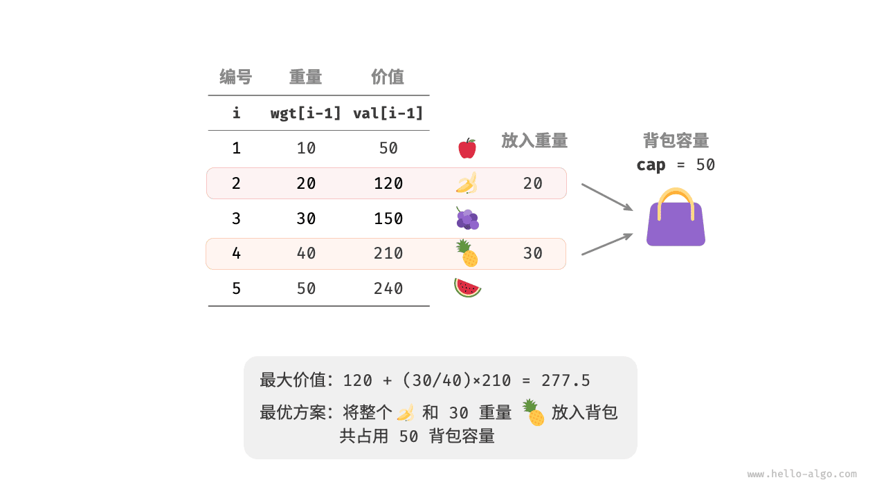
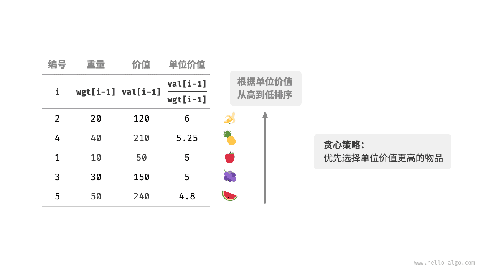
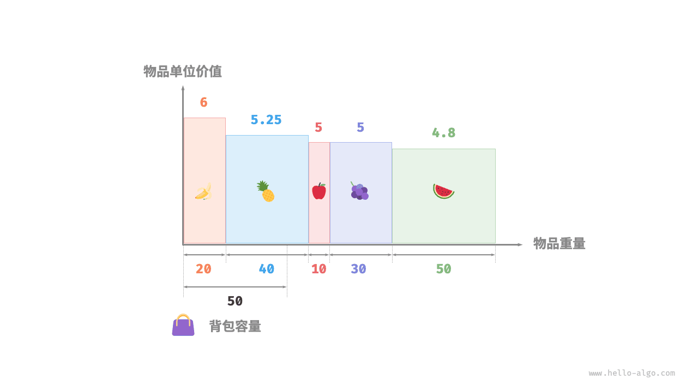

# 背包问题

这是最经典的DP问题，会衍生出各种不同的变式。我们可以掌握0-1背包，完全背包，和“恰好型”。

详见https://oi-wiki.org/dp/knapsack/，其中没有“恰好型”。


## 0-1背包（每个物品选或者不选）

### 示例23421:《算法图解》小偷背包问题

dp, http://cs101.openjudge.cn/practice/23421

这是《算法图解》[1]书中第9章动态规划的例子：一个小贼正在一家店里偷商品。

假设一种情况如下：

一个小偷背着一个可装 4 磅东西的背包。商场有三件物品分别为：
价值 3000 美元重 4 磅的音响，价值 2000 美元重 3 磅的笔记本，价值1500 美元重 1 磅的吉他。


问小偷应该怎样选择商品，才能使得偷取的价值最高？


[1]Grokking Algorithms by Aditya Bhargava, published by Manning Publications.   Copyright © 2016 by Manning Publications.
Simplified Chinese-language edition copyright © 2017 by Posts & Telecom Press.

**输入**

第一行是两个整数N和B，空格分隔。N表示物品件数，B表示背包最大承重。
第二行是N个整数，空格分隔。表示各个物品价格。
第三行是N个整数，空格分隔。表示各个物品重量（是与第二行物品对齐的）。

**输出**

输出一个整数。保证在满足背包容量的情况下，偷的价值最高。

样例输入

```
3 4
3000 2000 1500
4 3 1
```

样例输出

```
3500
```


#### 基本思路

最简单的算法如下： 尝试各种可能的商品组合， 并找出价值最高的组合。这样可行， 但速度非常慢。 在有3件商品的情况下， 你需要计算8个不同的集合； 有4件商品时， 你需要计算16个集合。 每增加一件商品， 需要计算的集合数都将翻倍！ 这种算法的运行时间为$O(2^n)$， 真的是慢如蜗牛。

答案是使用动态规划！ 下面来看看动态规划算法的工作原理。 动态规划先解决子问题， 再逐步解决大问题。对于背包问题， 你先解决小背包（子背包） 问题， 再逐步解决原来的问题。

这是最基础的背包问题，特点是：每种物品仅有一件，可以选择放或不放。

<mark>每个动态规划算法都从一个网格开始， 背包问题的网格如下。</mark>

> Every dynamic-programming algorithm starts with a grid. Here’s a gridfor the knapsack problem.


网格的各行为商品， 各列为不同容量（1～4磅） 的背包。 所有这些列你都需要， 因为它们将帮助你计算子背包的价值。

> The  rows  of  the  grid  are  the  items,  and  the  columns  are  knapsack  weights  from  1  lb  to  4  lb.  You  need  all  of  those  columns because they will help you calculate the values of the sub-knapsacks.
>

网格最初是空的。 你将填充其中的每个单元格， 网格填满后， 就找到了问题的答案！ 你一定要跟着做。 请你创建网格， 我们一起来填满它。

> The grid starts out empty. You’re going to fill in each cell of the  grid.  Once  the  grid  is  filled  in,  you’ll  have  your  answer  to  this  problem!  Please  follow  along.  Make  your  own  grid,  and we’ll fill it out together. 
>


**THE GUITAR ROW**

后面将列出计算这个网格中单元格值的公式。 我们先来一步一步做。 首先来看第一行。

> I’ll show you the exact formula for calculating this grid later. Let’s do a walkthrough first. Start with the first row.
>


这是吉他行， 意味着你将尝试将吉他装入背包。 在每个单元格， 都需要做一个简单的决定： 偷不偷吉他？ 别忘了， 你要找出一个价值最高的商品集合。

> This  is  the  guitar  row,  which  means  you’re  trying  to  fit  the  guitar  into  the  knapsack.  At  each  cell,  there’s  a  simple  decision: do you steal the guitar or not? Remember, you’re trying to find the set of items to steal that will give you the most value. 
>


该不该偷音响呢？
背包的容量为1磅， 能装下音响吗？ 音响太重了， 装不下！ 由于容量1磅的背包装不下音响， 因此最大价值依然是1500美元。


接下来的两个单元格的情况与此相同。 在这些单元格中， 背包的容量分别为2磅和3磅， 而以前的最大价值为1500美元。

> Same  thing  for  the  next  two  cells.  These  knapsacks  have  a  capacity  of  2  lb  and  3  lb.  The  old  max  value  for  both  was  $1,500. 
>


由于这些背包装不下音响， 因此最大价值保持不变。背包容量为4磅呢？ 终于能够装下音响了！ 原来的最大价值为1500美元， 但如果在背包中装入音响而不是吉他， 价值将为3000美元！ 因此还是偷音响吧。

> The   stereo   still   doesn’t   fit,   so   your   guesses   remain   unchanged.What  if  you  have  a  knapsack  of  capacity  4  lb?  Aha:  the  stereo finally fits! The old max value was \$1,500, but if you put  the  stereo  in  there  instead,  the  value  is  \$3,000!  Let’s  take the stereo.


你更新了最大价值！ 如果背包的容量为4磅， 就能装入价值至少3000美元的商品。 在这个网格中， 你逐步地更新最大价值。

> You   just   updated   your   estimate!   If   you   have   a   4   lb
>


At 3 lb, the old estimate was \$1,500. But you can choose the laptop instead, and that’s worth \$2,000. So the new max estimate is $2,000!

对于容量为4磅的背包， 情况很有趣。 这是非常重要的部分。 当前的最大价值为3000美元， 你可不偷音响， 而偷笔记本电脑， 但它只值2000美元。价值没有原来高。 但等一等， 笔记本电脑的重量只有3磅， 背包还有1磅的容量没用！

根据之前计算的最大价值可知， 在1磅的容量中可装入吉他， 价值1500美元。 因此， 你需要做如下比较。


你可能始终心存疑惑： 为何计算小背包可装入的商品的最大价值呢？ 但愿你现在明白了其中的原因！ 余下了空间时， 你可根据这些子问题的答案来确定余下的空间可装入哪些商品。 笔记本电脑和吉他的总价值为3500美元， 因此偷它们是更好的选择。最终的网格类似于下面这样。


答案如下： 将吉他和笔记本电脑装入背包时价值最高， 为3500美元。你可能认为， 计算最后一个单元格的价值时， 我使用了不同的公式。 那是因为填充之前的单元格时， 我故意避开了一些复杂的因素。 其实， 计算每个单元格的价值时， 使用的公式都相同。 这个公式如下。

> There’s  the  answer:  the  maximum  value  that  will  fit  in  the  knapsack is $3,500, made up of a guitar and a laptop!Maybe you think that I used a different formula to calculate the  value  of  that  last  cell.  That’s  because  I  skipped  some  unnecessary  complexity  when  filling  in  the  values  of  the  earlier cells. Each cell’s value gets calculated with the same formula. Here it is.
>


用子问题定义状态：即 CELL\[i][j] 表示前 i 件物品恰放入一个容量为 j 的背包可以获得的最大价值。则其<mark>状态转移方程</mark>便是：


$CELL[i][j] = max(CELL[i−1][j]; CELL[i−1][j− W_i] + V_i)$


<mark>这个方程非常重要，基本上所有跟背包相关的问题的方程都是由它衍生出来的</mark>。所以有必要将它详细解释一下：“将前 `i` 件物品放入容量为 `j` 的背包中”这个子问题，若只考虑第 `i` 件物品的策略（放或不放），那么就可以转化为一个只和前 `i − 1` 件物品相关的问题。如果不放第 `i` 件物品，那么问题就转化为“前 `i − 1` 件物品放入容量为 j 的背包中”，价值为 $CELL[i − 1][j]$；如果放第 `i` 件物品，那么问题就转化为“前 `i − 1` 件物品放入剩下的容量为 $j − W_i$ 的背包中”，此时能获得的最大价值就是 $CELL[i − 1][j − Wi]$ 再加上通过放入第 `i` 件物品获得的价值 `Vi`。

你可以使用这个公式来计算每个单元格的价值， 最终的网格将与前一个网格相同。 现在你明白了为何要求解子问题吧？ 你可以合并两个子问题的解来得到更大问题的解。

> You  can  use  this  formula  with  every  cell  in  this  grid,  and  you  should  end  up  with  the  same  grid  I  did.  Remember  how  I  talked  about  solving  subproblems?  You  combined  the  solutions  to  two  subproblems  to  solve  the  bigger  problem.
>


```python
# 动态规划之背包问题（算法图解书中例子实现）

#第一步建立网格(横坐标表示[0,c]整数背包承重):(n+1)*(c+1)
def knapsack(n, c, w, p):
    cell = [[0 for j in range(c+1)]for i in range(n+1)]
    for j in range(c+1):
        #第0行全部赋值为0，物品编号从1开始.为了下面赋值方便
        cell[0][j] = 0
    for i in range(1, n+1):
        for j in range(1, c+1):
            #生成了n*c有效矩阵，以下公式w[i-1],p[i-1]代表从第一个元素w[0],p[0]开始取。
            if j >= w[i-1]:
                cell[i][j] = max(cell[i-1][j], p[i-1] + cell[i-1][j - w[i-1]])
            else:
                cell[i][j] = cell[i-1][j]
    return cell


goodsnum, bagsize = map(int, input().split())
#goodsnum, bagsize = 3, 4
*value, = map(int, input().split())
*weight, = map(int, input().split())
#value, weight = [1500, 3000, 2000], [1, 4, 3]  # guitar, stereo, laptop

cell = knapsack(goodsnum, bagsize, weight, value)
print(cell[goodsnum][bagsize])
```


价格、重量的第一个元素从1开始。不写函数。

```python
n,b=map(int, input().split())
price=[0]+[int(i) for i in input().split()]
weight=[0]+[int(i) for i in input().split()]
bag=[[0]*(b+1) for _ in range(n+1)]
for i in range(1,n+1):
    for j in range(1,b+1):
        if weight[i]<=j:
            bag[i][j]=max(price[i]+bag[i-1][j-weight[i]], bag[i-1][j])
        else:
            bag[i][j]=bag[i-1][j]
print(bag[-1][-1])
```


### 滚动数组优化空间复杂度

> 背包九讲.pdf，及https://oi-wiki.org/dp/knapsack/

例题中已知条件有第 `i` 个物品的重量 `wi`，价值 `vi`，以及背包的总容量 W。

设 DP 状态 $f_{i,j}$ 为在只能放前 `i`个物品的情况下，容量为 `j` 的背包所能达到的最大总价值。

考虑转移。假设当前已经处理好了前 `i-1` 个物品的所有状态，那么对于第 `i` 个物品，当其不放入背包时，背包的剩余容量不变，背包中物品的总价值也不变，故这种情况的最大价值为 $f_{i-1,j}$；当其放入背包时，背包的剩余容量会减小 $w_{i}$，背包中物品的总价值会增大 $v_{i}$，故这种情况的最大价值为 $f_{i-1,j-w_{i}}+v_{i}$。

由此可以得出状态转移方程：

$ f_{i,j}=\max(f_{i-1,j},f_{i-1,j-w_{i}}+v_{i}) $

这里如果直接采用二维数组对状态进行记录，会出现 MLE。可以考虑改用滚动数组的形式来优化。

由于对 $f_i$ 有影响的只有 $f_{i-1}$，可以去掉第一维，直接用 $f_i$来表示处理到当前物品时背包容量为i 的最大价值，得出以下方程：

$f_j=\max \left(f_j,f_{j-w_i}+v_i\right) $

**务必牢记并理解这个转移方程，因为大部分背包问题的转移方程都是在此基础上推导出来的。**

**实现**

还有一点需要注意的是，很容易写出这样的 **错误核心代码**：

```python
for i in range(1, n + 1):
    for l in range(0, W - w[i] + 1):
        f[l + w[i]] = max(f[l] + v[i], f[l + w[i]])
# 由 f[i][l + w[i]] = max(max(f[i - 1][l + w[i]], f[i - 1][l] + w[i]),
# f[i][l + w[i]]) 简化而来
```

这段代码哪里错了呢？枚举顺序错了。

仔细观察代码可以发现：对于当前处理的物品 `i` 和当前状态 `f_{i,j}`，在 $j\geqslant w_{i}$ 时， 是会被 $f_{i,j-w_{i}}$ 所影响的。这就相当于物品 `i` 可以多次被放入背包，与题意不符。（事实上，这正是完全背包问题的解法)

为了避免这种情况发生，我们可以改变枚举的顺序，从 W 枚举到 $w_{i}$，这样就不会出现上述的错误，因为 $f_{i,j}$ 总是在 $f_{i,j-w_{i}}$ 前被更新。

因此实际核心代码为

```python
for i in range(1, n + 1):
    for l in range(W, w[i] - 1, -1):
        f[l] = max(f[l], f[l - w[i]] + v[i])
```


滚动数组优化的时候只可以去掉**第一维**的空间，在背包问题中也就是枚举物品的那一层循环可以去掉。


> 想了解滚动数组，来详细拆解一下这段代码的错误原因，以及为什么修改枚举顺序就能修正它。
>
> **核心问题：正向枚举会导致物品被重复使用**
>
> 错误代码的问题在于：**在处理第 `i` 个物品时，背包容量 `j` 从小到大遍历，会导致同一个物品被多次放入背包**。
>
> 用一个具体的例子来模拟一下这个过程，直观地理解为什么会出错。
>
> 假设：
>
> - 有一个背包，总容量 `W = 4`。
> - 现在处理第 `i` 个物品，它的重量 `w[i] = 2`，价值 `v[i] = 3`。
> - 在处理这个物品之前，背包的状态 `f` 如下（这是处理完前 `i-1` 个物品后的状态）：
>
> | 背包容量 `j`    | 0    | 1    | 2    | 3    | 4    |
> | --------------- | ---- | ---- | ---- | ---- | ---- |
> | 最大价值 `f[j]` | 0    | 0    | 0    | 0    | 0    |
>
> 现在，执行错误的代码逻辑：`for l in range(0, W - w[i] + 1):`，也就是 `l` 从 `0` 到 `4 - 2` 即 `2`。
>
> 1. **当 `l = 0` 时：**
>    - 代码计算 `l + w[i] = 0 + 2 = 2`。
>    - 然后执行 `f[2] = max(f[2], f[0] + v[i])`，也就是 `f[2] = max(0, 0 + 3)`。
>    - 此时，`f[2]` 的值被更新为 `3`。这代表我们将第 `i` 个物品放入了容量为 `2` 的背包。
>    - **当前状态 `f`：** `[0, 0, 3, 0, 0]`
> 2. **当 `l = 1` 时：**
>    - 代码计算 `l + w[i] = 1 + 2 = 3`。
>    - 执行 `f[3] = max(f[3], f[1] + v[i])`，即 `f[3] = max(0, 0 + 3)`。
>    - `f[3]` 的值被更新为 `3`。
>    - **当前状态 `f`：** `[0, 0, 3, 3, 0]`
> 3. **当 `l = 2` 时：**
>    - 代码计算 `l + w[i] = 2 + 2 = 4`。
>    - **关键错误点来了！** 代码执行 `f[4] = max(f[4], f[2] + v[i])`。
>    - 此时，`f[2]` 的值是多少？是 **`3`**。这个 `3` 是**在本次循环中（处理第 `i` 个物品时）刚刚计算出来的**。
>    - 所以，`f[4] = max(0, 3 + 3)`，结果 `f[4]` 被更新为 `6`。
>    - **最终状态 `f`：** `[0, 0, 3, 3, 6]`
>
> **结论：** 最终，容量为 `4` 的背包价值为 `6`，这相当于把重量为 `2`、价值为 `3` 的物品放了**两次**。这显然违背了**0-1 背包**（每个物品只能放一次）的问题设定。
>
> 错误的根源在于，当我们**从小到大**遍历容量时，在计算 `f[j]` 时，所用到的 `f[j - w[i]]` 可能已经是**被当前物品更新过**的状态了。这就导致了同一个物品被重复放入。
>
> ------
>
> **正确的做法：反向枚举**
>
> 为了避免同一个物品被多次使用，需要保证在处理第 `i` 个物品时，计算 `f[j]` 所用到的 `f[j - w[i]]` 是**处理前 `i-1` 个物品后的状态**，而不是已经被当前物品更新过的状态。
>
> 如何保证这一点呢？答案是：**从大到小**遍历背包容量。
>
> 用同样的例子来模拟正确的代码逻辑：`for l in range(W, w[i] - 1, -1):`，也就是 `l` 从 `4` 到 `2`。
>
> 初始状态 `f` 仍然是：`[0, 0, 0, 0, 0]`
>
> 1. **当 `l = 4` 时：**
>    - 代码计算 `l - w[i] = 4 - 2 = 2`。
>    - 执行 `f[4] = max(f[4], f[2] + v[i])`，也就是 `f[4] = max(0, 0 + 3)`。
>    - `f[4]` 的值被更新为 `3`。
>    - **当前状态 `f`：** `[0, 0, 0, 0, 3]`
> 2. **当 `l = 3` 时：**
>    - 代码计算 `l - w[i] = 3 - 2 = 1`。
>    - 执行 `f[3] = max(f[3], f[1] + v[i])`，即 `f[3] = max(0, 0 + 3)`。
>    - `f[3]` 的值被更新为 `3`。
>    - **当前状态 `f`：** `[0, 0, 0, 3, 3]`
> 3. **当 `l = 2` 时：**
>    - 代码计算 `l - w[i] = 2 - 2 = 0`。
>    - 执行 `f[2] = max(f[2], f[0] + v[i])`，即 `f[2] = max(0, 0 + 3)`。
>    - `f[2]` 的值被更新为 `3`。
>    - **最终状态 `f`：** `[0, 0, 3, 3, 3]`
>
> **结论：** 最终，容量为 `4` 的背包价值为 `3`。这个结果是正确的，因为我们只在容量为 `2`、`3`、`4` 的背包中选择了一个放入了第 `i` 个物品，没有重复放入。
>
> **为什么这样能行？**当**从大到小**遍历容量时，总是用一个**还未被当前物品更新过的、更小区间的 `f` 值**（即 `f[j - w[i]]`）来更新当前的 `f[j]`。因为 `j - w[i]` 总是小于 `j`，而是从大到小遍历的，所以 `f[j - w[i]]` 保存的还是上一轮（处理前 `i-1` 个物品）的状态。
>
> **总结**
>
> | 遍历顺序     | 现象               | 本质                               | 适用问题     |
> | ------------ | ------------------ | ---------------------------------- | ------------ |
> | **从小到大** | 物品可以被放入多次 | `f[j - w[i]]` 可能已被当前物品更新 | **完全背包** |
> | **从大到小** | 物品只能被放入一次 | `f[j - w[i]]` 是上一轮迭代的旧值   | **0-1 背包** |
>
> 因此，在使用滚动数组优化 0-1 背包问题时，**必须从大到小遍历背包容量**，以确保每个物品只被考虑一次。


#### 优化23421:《算法图解》小偷背包问题

从 **大到小更新**，总是基于“之前未包含当前物品的最优解”来更新新的状态，因此能保证每个物品在每次主循环中只会被计算一次。

```python
# 压缩矩阵/滚动数组 方法
N,B = map(int, input().split())
*p, = map(int, input().split())
*w, = map(int, input().split())

dp=[0]*(B+1)
for i in range(N):
    for j in range(B, w[i] - 1, -1):
        dp[j] = max(dp[j], dp[j-w[i]]+p[i])
            
print(dp[-1])
```


### 回文串打表，适合教学

像 `23421:《算法图解》小偷背包问题` 一样标准且更难一些。

力扣5.最长回文字串，其中一个解法是 <mark>定义状态、转移方程、右上三角DP，按列填充</mark>。`23421:《算法图解》小偷背包问题`是填充整个矩阵，按行填充


#### 练习M5.最长回文子串

dp, two pointers, string, https://leetcode.cn/problems/longest-palindromic-substring/

给你一个字符串 `s`，找到 `s` 中最长的 

回文子串。

**示例 1：**

```
输入：s = "babad"
输出："bab"
解释："aba" 同样是符合题意的答案。
```

**示例 2：**

```
输入：s = "cbbd"
输出："bb"
```

 

**提示：**

- `1 <= s.length <= 1000`
- `s` 仅由数字和英文字母组成


思路：对于一个子串而言，如果它是回文串，并且长度大于 2，那么将它首尾的两个字母去除之后，它仍然是个回文串。使用右上三角 DP，只有 left ≤ right（右上三角）才有效。

状态：`dp[i][j]`表示子串`s[i:j+1]`是否为回文子串

状态转移方程：`dp[i][j] = dp[i+1][j-1] ∧ (S[i] == s[j])`

动态规划中的边界条件，即子串的长度为 1 或 2。对于长度为 1 的子串，它显然是个回文串；对于长度为 2 的子串，只要它的两个字母相同，它就是一个回文串。

步骤：

- 构造 `is_palindrome[left][right]`
- “按 right 列生成”二维表
- 最长回文子串直接在 DP 表里查即可。用双指针遍历所有区间，在布尔表上查即可。

```python
class Solution:
    def longestPalindrome(self, s: str) -> str:
        n = len(s)
        if n <= 1:
            return s

        # ---------- 第一部分：预处理所有回文子串（DP） ----------
        is_palindrome = [[False] * n for _ in range(n)]

        for right in range(n):
            for left in range(right + 1):
                if s[left] == s[right] and (right - left <= 1 or is_palindrome[left + 1][right - 1]):
                    is_palindrome[left][right] = True

        # ---------- 第二部分：扫描所有 (left, right) 求最长 ----------
        max_len = 1
        start = 0

        for left in range(n):
            for right in range(left, n):
                if is_palindrome[left][right] and (right - left + 1) > max_len:
                    max_len = right - left + 1
                    start = left

        return s[start:start + max_len]
```

------

🔍 形象化理解

- `is_palindrome[left][right]` 表示 `s[left:right+1]` 是否为回文
- “右上三角”按列填充
- 依赖关系在左下 `(left+1, right-1)`
- 这样保证依赖已计算

```
     right →
   0 1 2 3 4 ...
l 0 ■ ■ ■ ■ ■
e 1   ■ ■ ■ ■
f 2     ■ ■ ■
t 3       ■ ■
↓ 4         ■
```

------

📝 **时间复杂度**

- DP 构造：O(n²)
- 扫描最长：O(n²)
- 总复杂度：O(n²)，满足 n ≤ 1000 要求

------

如果你愿意，我还可以给你：

- **中心扩展**版本（更快更常用）
- **Manacher** 线性算法版本（O(n)）


> 逐列展示（按 right 列填充）的示例，帮助完全理解“右上三角 DP 按列生成”。
>
> 示例字符串：
>
> ```
> s = "babad"
>       0 1 2 3 4
>       b a b a d
> ```
>
> DP 表：`is_palindrome[left][right]`
> 其中只有 **left ≤ right**（右上三角）才有效。
>
> ------
>
> ✅ 按列填充（固定 right，从上到下填 left）
>
> 下面逐列展示 “right = 0, 1, 2, ...” 时每一列是怎么被填出来的。
>
> ------
>
> 📌 第 0 列：right = 0
>
> 检查所有 `left = 0..0`
>
> | left | right | substring | s[left]==s[right]? | 长度<=2? | 结果 |
> | ---- | ----- | --------- | ------------------ | -------- | ---- |
> | 0    | 0     | "b"       | ✔                  | ✔        | True |
>
> DP 表（T = True, . = False）：
>
> ```
>     r→ 0 1 2 3 4
> l↓
> 0     T . . . .
> 1     . . . . .
> 2     . . . . .
> 3     . . . . .
> 4     . . . . .
> ```
>
> ------
>
> 📌 第 1 列：right = 1（检查 left = 0..1）
>
> 1) left = 0, right = 1 → "ba"
>
> - s[0] != s[1] → False
>
> 2) left = 1, right = 1 → "a"
>
> - 单字符 → True
>
> DP 表：
>
> ```
>     r→ 0 1 2 3 4
> l↓
> 0     T . . . .
> 1     . T . . .
> 2     . . . . .
> 3     . . . . .
> 4     . . . . .
> ```
>
> ------
>
> 📌 第 2 列：right = 2（检查 left = 0..2）
>
> 1) left = 0, right = 2 → "bab"
>
> - s[0] == s[2]
> - (right - left > 1) → 看 `is_palindrome[1][1]`
> - `is_palindrome[1][1] = True`
>   → 整段为 True
>
> 2) left = 1, right = 2 → "ab"
>
> - s[1] != s[2] → False
>
> 3) left = 2, right = 2 → "b"
>
> - 单字符 → True
>
> DP 表：
>
> ```
>     r→ 0 1 2 3 4
> l↓
> 0     T . T . .
> 1     . T . . .
> 2     . . T . .
> 3     . . . . .
> 4     . . . . .
> ```
>
> ------
>
> 📌 第 3 列：right = 3（检查 left = 0..3）
>
> 1) left = 0 → "baba"
>
> - s[0] != s[3] → False
>
> 2) left = 1 → "aba"
>
> - s[1] == s[3]
> - 需要 `is_palindrome[2][2] = True`
>   → True
>
> 3) left = 2 → "ba"
>
> - s[2] != s[3] → False
>
> 4) left = 3 → "a"
>
> - True
>
> DP 表：
>
> ```
>     r→ 0 1 2 3 4
> l↓
> 0     T . T . .
> 1     . T . T .
> 2     . . T . .
> 3     . . . T .
> 4     . . . . .
> ```
>
> 
>
> ------
>
> 📌 第 4 列：right = 4（检查 left = 0..4）
>
> 1) left = 0 → "babad"
>
> - s[0] != s[4] → False
>
> 2) left = 1 → "abad"
>
> - s[1] != s[4] → False
>
> 3) left = 2 → "bad"
>
> - s[2] != s[4] → False
>
> 4) left = 3 → "ad"
>
> - s[3] != s[4] → False
>
> 5) left = 4 → "d"
>
> - True
>
> 最终 DP 表：
>
> ```
>     r→ 0 1 2 3 4
> l↓
> 0     T . T . .
> 1     . T . T .
> 2     . . T . .
> 3     . . . T .
> 4     . . . . T
> ```
>
> ------
>
> **🔍 如何看出最长回文？**
>
> 从表中找 True 中最长区间：
>
> - (0,2) → "bab" 长度 3
> - (1,3) → "aba" 长度 3
>
> 最长回文 = "bab" 或 "aba"
>
> ------
>
> 🎯 **总结：为什么要按列填？**
>
> 因为：
>
> `is_palindrome[left][right]` 依赖
> `is_palindrome[left+1][right-1]`
>
> 


## 完全背包（每种物品可以选0个-无限个）

将0-1背包中内层循环改为正着遍历即可（这里其实就利用了**先前已经得到的信息**来简化转移：在先前的转移中物品i可能已经用过若干次了）


### 示例189A. Cut Ribbon

brute force/dp, 1300, https://codeforces.com/problemset/problem/189/A

Polycarpus has a ribbon, its length is *n*. He wants to cut the ribbon in a way that fulfils the following two conditions:

- After the cutting each ribbon piece should have length *a*, *b* or *c*.
- After the cutting the number of ribbon pieces should be maximum.

Help Polycarpus and find the number of ribbon pieces after the required cutting.

**Input**

The first line contains four space-separated integers *n*, *a*, *b* and *c* (1 ≤ *n*, *a*, *b*, *c* ≤ 4000) — the length of the original ribbon and the acceptable lengths of the ribbon pieces after the cutting, correspondingly. The numbers *a*, *b* and *c* can coincide.

**Output**

Print a single number — the maximum possible number of ribbon pieces. It is guaranteed that at least one correct ribbon cutting exists.


思路：就是一个需要刚好装满的完全背包问题，只有三种商品a, b, c，能取无限件物品，每件物品价值是1，求最大价值。

```python
n, a, b, c = map(int, input().split())
dp = [0]+[float('-inf')]*n

for i in range(1, n+1):
    for j in (a, b, c):
        if i >= j:
            dp[i] = max(dp[i-j] + 1, dp[i])

print(dp[n])
```


### 练习01384: Piggy-Bank

http://cs101.openjudge.cn/practice/01384/

Before ACM can do anything, a budget must be prepared and the necessary financial support obtained. The main income for this action comes from Irreversibly Bound Money (IBM). The idea behind is simple. Whenever some ACM member has any small money, he takes all the coins and throws them into a piggy-bank. You know that this process is irreversible, the coins cannot be removed without breaking the pig. After a sufficiently long time, there should be enough cash in the piggy-bank to pay everything that needs to be paid.

But there is a big problem with piggy-banks. It is not possible to determine how much money is inside. So we might break the pig into pieces only to find out that there is not enough money. Clearly, we want to avoid this unpleasant situation. The only possibility is to weigh the piggy-bank and try to guess how many coins are inside. Assume that we are able to determine the weight of the pig exactly and that we know the weights of all coins of a given currency. Then there is some minimum amount of money in the piggy-bank that we can guarantee. Your task is to find out this worst case and determine the minimum amount of cash inside the piggy-bank. We need your help. No more prematurely broken pigs!


## 多重背包（每个物品数量有上限）

最简单的思路是将多个同样的物品看成多个不同的物品，从而化为0-1背包。稍作优化：可以改善拆分方式，譬如将m个1拆成x_1,x_2,……,x_t个1，只需要这些x_i中取若干个的和能组合出1至m即可。最高效的拆分方式是尽可能拆成2的幂，也就是所谓“二进制优化”


### 练习01742: Coins

dp, http://cs101.openjudge.cn/practice/01742/

People in Silverland use coins.They have coins of value A1,A2,A3...An Silverland dollar.One day Tony opened his money-box and found there were some coins.He decided to buy a very nice watch in a nearby shop. He wanted to pay the exact price(without change) and he known the price would not more than m.But he didn't know the exact price of the watch.
You are to write a program which reads n,m,A1,A2,A3...An and C1,C2,C3...Cn corresponding to the number of Tony's coins of value A1,A2,A3...An then calculate how many prices(form 1 to m) Tony can pay use these coins.


## “恰好”型暨最优解


### 练习21458: 健身房 (dp)

dp，http://cs101.openjudge.cn/practice/21458/

小嘤是大不列颠及北爱尔兰联合王国大力士，为了完成增肌计划，他需要选择一些训练组进行训练：有n个训练组，每天做第i个训练需要耗费ti分钟，每天坚持做第i个训练一个月后预计可增肌wi千克。因为会导致效果变差，小嘤一天不会做相同的训练组多次。由于小嘤是强迫症，他希望每天用于健身的时间**恰好**为**T** 分钟，他希望在一个月后获得最多的增肌量，请帮助小嘤计算：他训练一个月后最大增肌量是多少呢？

**输入**

第一行两个整数 T,n。

第 2 行到第 n+1 行，每行两个整数 ti,wi。

保证 0 < ti ≤ T ≤ 10^3, 0 < n ≤ 10^3, 0 < wi < 20。

**输出**

如果不存在满足条件的训练计划，输出-1。

如果存在满足条件的训练计划，输出一个整数，表示训练一个月后的最大增肌量。

样例输入

```
sample1 in
6 4
2 1
4 7
3 5
3 5

sample1 out
10
```

样例输出

```
sample2 in
700 4
450 5
340 1
690 10
9 2

sample2 out
-1
样例2解释：无法找出一种方案满足训练时间恰好等于T.
```

来源：cs101 2020 Final Exam


“恰好”型dp。类似方法：最开始的设为0，其余的都为设为负无穷。。。 https://zhuanlan.zhihu.com/p/560690993?utm_id=0

```python
# 23n2300011031,黄源森
t,n=map(int,input().split())
dp=[0]+[-1]*(t+1)
for i in range(n):
    k,w=map(int,input().split())
    for j in range(t,k-1,-1):
        if dp[j-k]!=-1:
            dp[j]=max(dp[j-k]+w,dp[j])
print(dp[t])
```


01恰好背包

```python
def max_muscle_gain(T, n, trainings):
    # 定义一个很大的负数作为无效值
    INF = -10 ** 9

    # 初始化 dp 数组
    dp = [[INF] * (T + 1) for _ in range(n + 1)]

    # 设置初始条件
    for i in range(n + 1):
        dp[i][0] = 0  # 时间为 0 时，增肌量为 0

    # 动态规划转移
    for i in range(1, n + 1):
        ti, wi = trainings[i - 1]
        for j in range(T + 1):
            dp[i][j] = dp[i - 1][j]  # 不选择第 i 个训练组
            if j >= ti:
                dp[i][j] = max(dp[i][j], dp[i - 1][j - ti] + wi)  # 选择第 i 个训练组

    # 输出结果
    if dp[n][T] < 0:
        return -1
    else:
        return dp[n][T]


# 读取输入
T, n = map(int, input().split())
trainings = [tuple(map(int, input().split())) for _ in range(n)]

# 计算并输出结果
result = max_muscle_gain(T, n, trainings)
print(result)
```

> 明确状态定义是动态规划（DP）问题的关键步骤之一。状态定义直接影响到初始化和状态转移方程的设计。下面详细解释一下如何通过状态定义来指导初始化和状态转移。
>
> **状态定义**
>
> 首先，我们需要明确 `dp` 数组的含义。在这个问题中，我们可以定义 `dp[i][j]` 为从前 `i` 个训练组中选择若干个训练组，并且总时间为 `j` 时的最大增肌量。
>
> **初始化**
>
> 根据状态定义，我们需要初始化 `dp` 数组的边界条件：
>
> - `dp[0][j] = -INF`，当没有训练组可以选择时，任何非零时间的增肌量都应该是无效的（用 `-INF` 表示）。
> - `dp[i][0] = 0`，当时间为 0 时，无论有多少训练组，增肌量都是 0。
>
> **状态转移方程**
>
> 状态转移方程描述了如何从已知状态推导出新状态。在这个问题中，对于每个训练组 `i` 和时间 `j`，有两种选择：
>
> - 不选择第 `i` 个训练组，此时 `dp[i][j] = dp[i-1][j]`。
> - 选择第 `i` 个训练组，此时 `dp[i][j] = dp[i-1][j-t[i]] + w[i]`，前提是 `j >= t[i]`。
>
> 


### 练习20089: NBA门票

dp, http://cs101.openjudge.cn/practice/20089/

六月，巨佬甲正在加州进行暑研工作。恰逢湖人和某东部球队进NBA总决赛的对决。而同为球迷的老板大发慈悲给了甲若干美元的经费，让甲同学用于购买球票。然而由于球市火爆，球票数量也有限。共有七种档次的球票（对应价格分别为50 100 250 500 1000 2500 5000美元）而同学甲购票时这七种票也还分别剩余（n1，n2，n3，n4，n5，n6，n7张）。现由于甲同学与同伴关系恶劣。而老板又要求甲同学必须将所有经费恰好花完，请给出同学甲可买的最少的球票数X。

**输入**

第一行老板所发的经费N,其中50≤N≤1000000。

第二行输入n1-n7，分别为七种票的剩余量，用空格隔开

**输出**

假若余票不足或者有余额，则输出’Fail’

而假定能刚好花完，则输出同学甲所购买的最少的票数X。

样例输入

```
Sample1 Input：
5500
3 3 3 3 3 3 3 

Sample1 Output：
2
```

样例输出

```
Sample2 Input：
125050
1 2 3 1 2 5 20

Smaple2 Output：
Fail
```

来源: cs101-2019 龚世棋


```python
# 2200015481, 陈涛
n=int(input())
tickets=list(map(int,input().split()))
price=[50,100,250,500,1000,2500,5000]
dp={0:0}
path={0:[0,0,0,0,0,0,0]}
for i in range(n):
    if i in dp:
        for k in range(7):
            if path[i][k]<tickets[k]:
                if i+price[k] in dp:
                    if dp[i]+1<dp[i+price[k]]:
                        dp[i+price[k]]=dp[i]+1
                        path[i+price[k]]=path[i][:]
                        path[i+price[k]][k]+=1
                else:
                    dp[i+price[k]]=dp[i]+1
                    path[i+price[k]]=path[i][:]
                    path[i+price[k]][k]+=1
if n in dp:
    print(dp[n])
else:
    print('Fail')
```

# 分数背包问题（贪心法）

!!! question

    给定 $n$ 个物品，第 $i$ 个物品的重量为 $wgt[i-1]$、价值为 $val[i-1]$ ，和一个容量为 $cap$ 的背包。每个物品只能选择一次，**但可以选择物品的一部分，价值根据选择的重量比例计算**，问在限定背包容量下背包中物品的最大价值。示例如下图所示。



分数背包问题和 0-1 背包问题整体上非常相似，状态包含当前物品 $i$ 和容量 $c$ ，目标是求限定背包容量下的最大价值。

不同点在于，本题允许只选择物品的一部分。如下图所示，**我们可以对物品任意地进行切分，并按照重量比例来计算相应价值**。

1. 对于物品 $i$ ，它在单位重量下的价值为 $val[i-1] / wgt[i-1]$ ，简称单位价值。
2. 假设放入一部分物品 $i$ ，重量为 $w$ ，则背包增加的价值为 $w \times val[i-1] / wgt[i-1]$ 。


### 贪心策略确定

最大化背包内物品总价值，**本质上是最大化单位重量下的物品价值**。由此便可推理出下图所示的贪心策略。

1. 将物品按照单位价值从高到低进行排序。
2. 遍历所有物品，**每轮贪心地选择单位价值最高的物品**。
3. 若剩余背包容量不足，则使用当前物品的一部分填满背包。



### 代码实现

我们建立了一个物品类 `Item` ，以便将物品按照单位价值进行排序。循环进行贪心选择，当背包已满时跳出并返回解：

```python
class Item:
    """物品"""

    def __init__(self, w: int, v: int):
        self.w = w  # 物品重量
        self.v = v  # 物品价值

def fractional_knapsack(wgt: list[int], val: list[int], cap: int) -> int:
    """分数背包：贪心"""
    # 创建物品列表，包含两个属性：重量、价值
    items = [Item(w, v) for w, v in zip(wgt, val)]
    # 按照单位价值 item.v / item.w 从高到低进行排序
    items.sort(key=lambda item: item.v / item.w, reverse=True)
    # 循环贪心选择
    res = 0
    for item in items:
        if item.w <= cap:
            # 若剩余容量充足，则将当前物品整个装进背包
            res += item.v
            cap -= item.w
        else:
            # 若剩余容量不足，则将当前物品的一部分装进背包
            res += (item.v / item.w) * cap
            # 已无剩余容量，因此跳出循环
            break
    return res
```

!!! example [pythontutor "可视化运行"](https://pythontutor.com/iframe-embed.html#code=class%20Item%3A%0A%20%20%20%20%22%22%22%E7%89%A9%E5%93%81%22%22%22%0A%20%20%20%20def%20__init__%28self,%20w%3A%20int,%20v%3A%20int%29%3A%0A%20%20%20%20%20%20%20%20self.w%20%3D%20w%20%20%23%20%E7%89%A9%E5%93%81%E9%87%8D%E9%87%8F%0A%20%20%20%20%20%20%20%20self.v%20%3D%20v%20%20%23%20%E7%89%A9%E5%93%81%E4%BB%B7%E5%80%BC%0A%0Adef%20fractional_knapsack%28wgt%3A%20list%5Bint%5D,%20val%3A%20list%5Bint%5D,%20cap%3A%20int%29%20-%3E%20int%3A%0A%20%20%20%20%22%22%22%E5%88%86%E6%95%B0%E8%83%8C%E5%8C%85%EF%BC%9A%E8%B4%AA%E5%BF%83%22%22%22%0A%20%20%20%20%23%20%E5%88%9B%E5%BB%BA%E7%89%A9%E5%93%81%E5%88%97%E8%A1%A8%EF%BC%8C%E5%8C%85%E5%90%AB%E4%B8%A4%E4%B8%AA%E5%B1%9E%E6%80%A7%EF%BC%9A%E9%87%8D%E9%87%8F%E3%80%81%E4%BB%B7%E5%80%BC%0A%20%20%20%20items%20%3D%20%5BItem%28w,%20v%29%20for%20w,%20v%20in%20zip%28wgt,%20val%29%5D%0A%20%20%20%20%23%20%E6%8C%89%E7%85%A7%E5%8D%95%E4%BD%8D%E4%BB%B7%E5%80%BC%20item.v%20/%20item.w%20%E4%BB%8E%E9%AB%98%E5%88%B0%E4%BD%8E%E8%BF%9B%E8%A1%8C%E6%8E%92%E5%BA%8F%0A%20%20%20%20items.sort%28key%3Dlambda%20item%3A%20item.v%20/%20item.w,%20reverse%3DTrue%29%0A%20%20%20%20%23%20%E5%BE%AA%E7%8E%AF%E8%B4%AA%E5%BF%83%E9%80%89%E6%8B%A9%0A%20%20%20%20res%20%3D%200%0A%20%20%20%20for%20item%20in%20items%3A%0A%20%20%20%20%20%20%20%20if%20item.w%20%3C%3D%20cap%3A%0A%20%20%20%20%20%20%20%20%20%20%20%20%23%20%E8%8B%A5%E5%89%A9%E4%BD%99%E5%AE%B9%E9%87%8F%E5%85%85%E8%B6%B3%EF%BC%8C%E5%88%99%E5%B0%86%E5%BD%93%E5%89%8D%E7%89%A9%E5%93%81%E6%95%B4%E4%B8%AA%E8%A3%85%E8%BF%9B%E8%83%8C%E5%8C%85%0A%20%20%20%20%20%20%20%20%20%20%20%20res%20%2B%3D%20item.v%0A%20%20%20%20%20%20%20%20%20%20%20%20cap%20-%3D%20item.w%0A%20%20%20%20%20%20%20%20else%3A%0A%20%20%20%20%20%20%20%20%20%20%20%20%23%20%E8%8B%A5%E5%89%A9%E4%BD%99%E5%AE%B9%E9%87%8F%E4%B8%8D%E8%B6%B3%EF%BC%8C%E5%88%99%E5%B0%86%E5%BD%93%E5%89%8D%E7%89%A9%E5%93%81%E7%9A%84%E4%B8%80%E9%83%A8%E5%88%86%E8%A3%85%E8%BF%9B%E8%83%8C%E5%8C%85%0A%20%20%20%20%20%20%20%20%20%20%20%20res%20%2B%3D%20%28item.v%20/%20item.w%29%20*%20cap%0A%20%20%20%20%20%20%20%20%20%20%20%20%23%20%E5%B7%B2%E6%97%A0%E5%89%A9%E4%BD%99%E5%AE%B9%E9%87%8F%EF%BC%8C%E5%9B%A0%E6%AD%A4%E8%B7%B3%E5%87%BA%E5%BE%AA%E7%8E%AF%0A%20%20%20%20%20%20%20%20%20%20%20%20break%0A%20%20%20%20return%20res%0A%0A%22%22%22Driver%20Code%22%22%22%0Aif%20__name__%20%3D%3D%20%22__main__%22%3A%0A%20%20%20%20wgt%20%3D%20%5B10,%2020,%2030,%2040,%2050%5D%0A%20%20%20%20val%20%3D%20%5B50,%20120,%20150,%20210,%20240%5D%0A%20%20%20%20cap%20%3D%2050%0A%20%20%20%20n%20%3D%20len%28wgt%29%0A%0A%20%20%20%20%23%20%E8%B4%AA%E5%BF%83%E7%AE%97%E6%B3%95%0A%20%20%20%20res%20%3D%20fractional_knapsack%28wgt,%20val,%20cap%29%0A%20%20%20%20print%28f%22%E4%B8%8D%E8%B6%85%E8%BF%87%E8%83%8C%E5%8C%85%E5%AE%B9%E9%87%8F%E7%9A%84%E6%9C%80%E5%A4%A7%E7%89%A9%E5%93%81%E4%BB%B7%E5%80%BC%E4%B8%BA%20%7Bres%7D%22%29&codeDivHeight=800&codeDivWidth=600&cumulative=false&curInstr=8&heapPrimitives=nevernest&origin=opt-frontend.js&py=311&rawInputLstJSON=%5B%5D&textReferences=false)

内置排序算法的时间复杂度通常为 $O(\log n)$ ，空间复杂度通常为 $O(\log n)$ 或 $O(n)$ ，取决于编程语言的具体实现。

除排序之外，在最差情况下，需要遍历整个物品列表，**因此时间复杂度为 $O(n)$** ，其中 $n$ 为物品数量。

由于初始化了一个 `Item` 对象列表，**因此空间复杂度为 $O(n)$** 。

### 正确性证明

采用反证法。假设物品 $x$ 是单位价值最高的物品，使用某算法求得最大价值为 `res` ，但该解中不包含物品 $x$ 。

现在从背包中拿出单位重量的任意物品，并替换为单位重量的物品 $x$ 。由于物品 $x$ 的单位价值最高，因此替换后的总价值一定大于 `res` 。**这与 `res` 是最优解矛盾，说明最优解中必须包含物品 $x$** 。

对于该解中的其他物品，我们也可以构建出上述矛盾。总而言之，**单位价值更大的物品总是更优选择**，这说明贪心策略是有效的。

如下图所示，如果将物品重量和物品单位价值分别看作一张二维图表的横轴和纵轴，则分数背包问题可转化为“求在有限横轴区间下围成的最大面积”。这个类比可以帮助我们从几何角度理解贪心策略的有效性。



