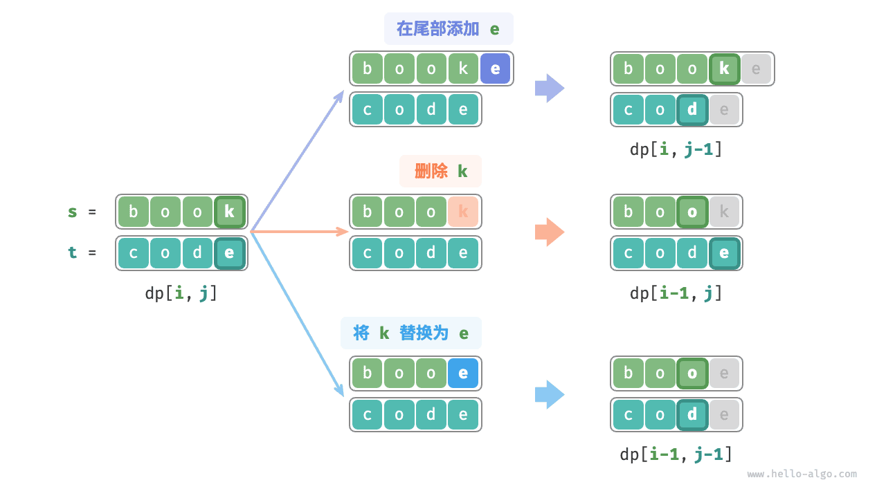
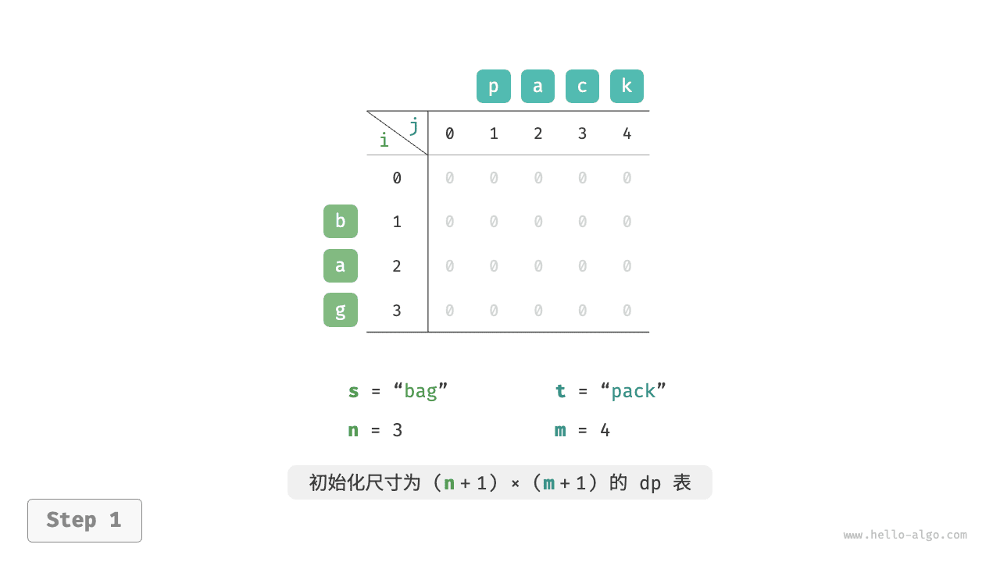
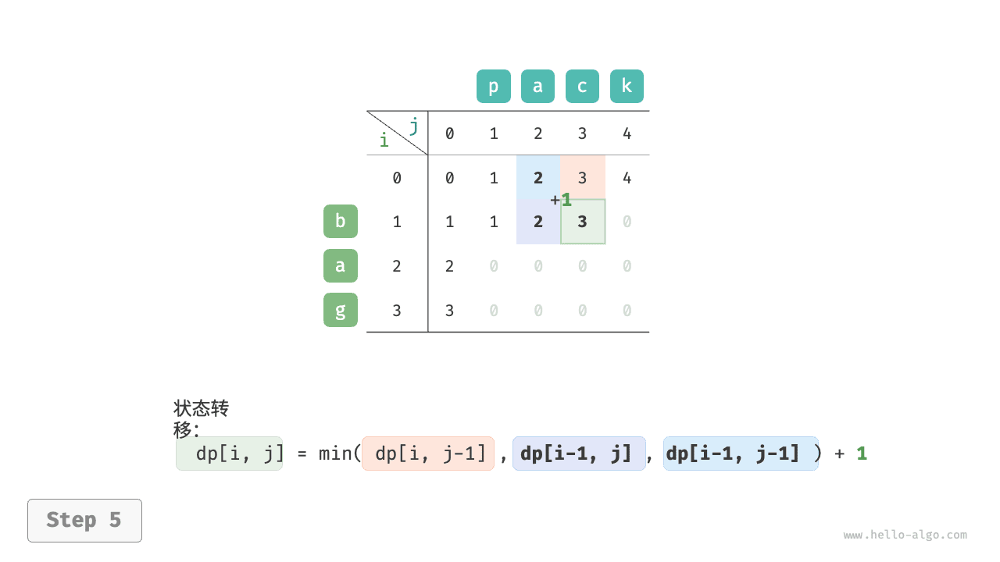
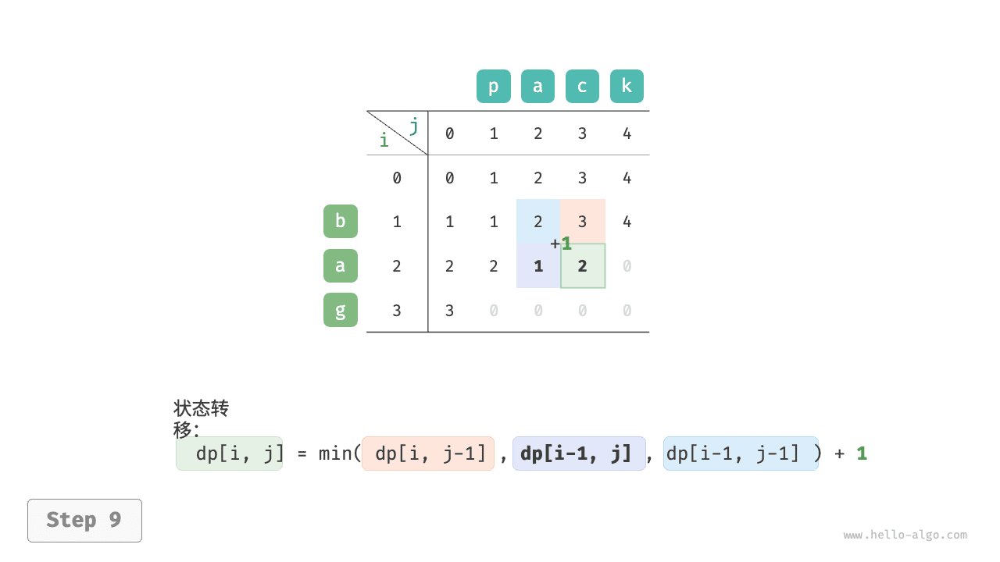
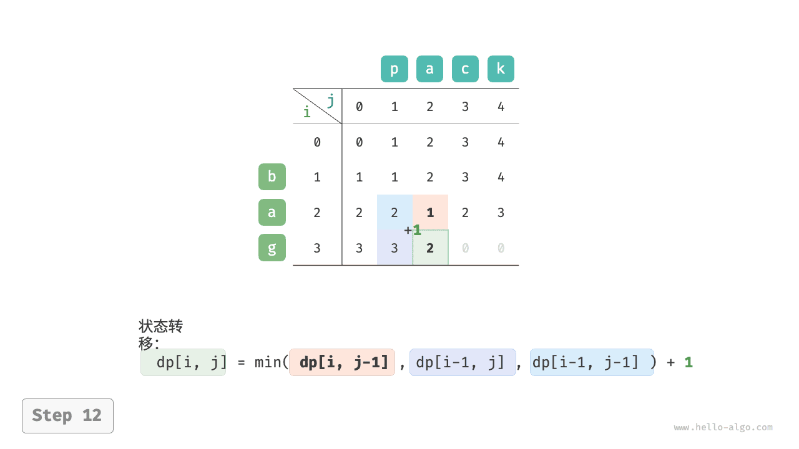
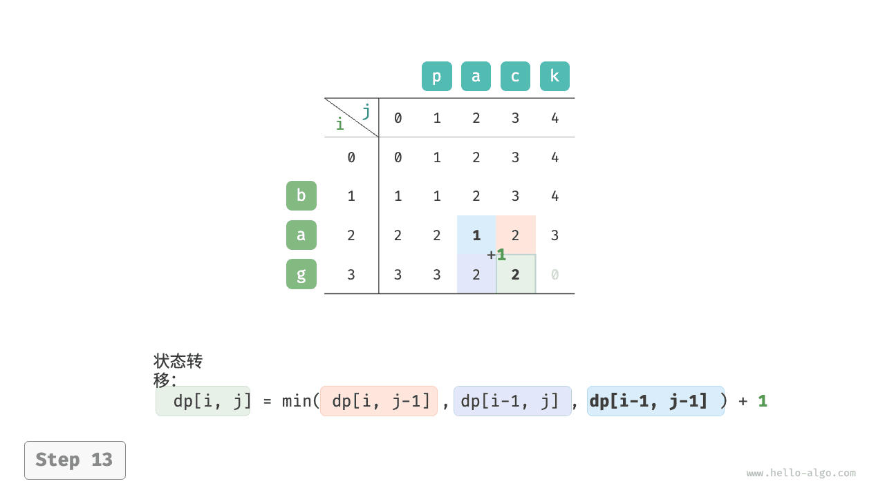

# 法无定法

## 编辑距离问题（HA）

编辑距离，也称 Levenshtein 距离，指两个字符串之间互相转换的最少修改次数，通常用于在信息检索和自然语言处理中度量两个序列的相似度。

!!! question

    输入两个字符串 $s$ 和 $t$ ，返回将 $s$ 转换为 $t$ 所需的最少编辑步数。
    
    你可以在一个字符串中进行三种编辑操作：插入一个字符、删除一个字符、将字符替换为任意一个字符。

如下图所示，将 `kitten` 转换为 `sitting` 需要编辑 3 步，包括 2 次替换操作与 1 次添加操作；将 `hello` 转换为 `algo` 需要 3 步，包括 2 次替换操作和 1 次删除操作。


**编辑距离问题可以很自然地用决策树模型来解释**。字符串对应树节点，一轮决策（一次编辑操作）对应树的一条边。

如下图所示，在不限制操作的情况下，每个节点都可以派生出许多条边，每条边对应一种操作，这意味着从 `hello` 转换到 `algo` 有许多种可能的路径。

从决策树的角度看，本题的目标是求解节点 `hello` 和节点 `algo` 之间的最短路径。


### 动态规划思路

**第一步：思考每轮的决策，定义状态，从而得到 $dp$ 表**

每一轮的决策是对字符串 $s$ 进行一次编辑操作。

我们希望在编辑操作的过程中，问题的规模逐渐缩小，这样才能构建子问题。设字符串 $s$ 和 $t$ 的长度分别为 $n$ 和 $m$ ，我们先考虑两字符串尾部的字符 $s[n-1]$ 和 $t[m-1]$ 。

- 若 $s[n-1]$ 和 $t[m-1]$ 相同，我们可以跳过它们，直接考虑 $s[n-2]$ 和 $t[m-2]$ 。
- 若 $s[n-1]$ 和 $t[m-1]$ 不同，我们需要对 $s$ 进行一次编辑（插入、删除、替换），使得两字符串尾部的字符相同，从而可以跳过它们，考虑规模更小的问题。

也就是说，我们在字符串 $s$ 中进行的每一轮决策（编辑操作），都会使得 $s$ 和 $t$ 中剩余的待匹配字符发生变化。因此，状态为当前在 $s$ 和 $t$ 中考虑的第 $i$ 和第 $j$ 个字符，记为 $[i, j]$ 。

状态 $[i, j]$ 对应的子问题：**将 $s$ 的前 $i$ 个字符更改为 $t$ 的前 $j$ 个字符所需的最少编辑步数**。

至此，得到一个尺寸为 $(i+1) \times (j+1)$ 的二维 $dp$ 表。

**第二步：找出最优子结构，进而推导出状态转移方程**

考虑子问题 $dp[i, j]$ ，其对应的两个字符串的尾部字符为 $s[i-1]$ 和 $t[j-1]$ ，可根据不同编辑操作分为下图所示的三种情况。

1. 在 $s[i-1]$ 之后添加 $t[j-1]$ ，则剩余子问题 $dp[i, j-1]$ 。
2. 删除 $s[i-1]$ ，则剩余子问题 $dp[i-1, j]$ 。
3. 将 $s[i-1]$ 替换为 $t[j-1]$ ，则剩余子问题 $dp[i-1, j-1]$ 。



根据以上分析，可得最优子结构：$dp[i, j]$ 的最少编辑步数等于 $dp[i, j-1]$、$dp[i-1, j]$、$dp[i-1, j-1]$ 三者中的最少编辑步数，再加上本次的编辑步数 $1$ 。对应的状态转移方程为：

$$
dp[i, j] = \min(dp[i, j-1], dp[i-1, j], dp[i-1, j-1]) + 1
$$

请注意，**当 $s[i-1]$ 和 $t[j-1]$ 相同时，无须编辑当前字符**，这种情况下的状态转移方程为：

$$
dp[i, j] = dp[i-1, j-1]
$$

**第三步：确定边界条件和状态转移顺序**

当两字符串都为空时，编辑步数为 $0$ ，即 $dp[0, 0] = 0$ 。当 $s$ 为空但 $t$ 不为空时，最少编辑步数等于 $t$ 的长度，即首行 $dp[0, j] = j$ 。当 $s$ 不为空但 $t$ 为空时，最少编辑步数等于 $s$ 的长度，即首列 $dp[i, 0] = i$ 。

观察状态转移方程，解 $dp[i, j]$ 依赖左方、上方、左上方的解，因此通过两层循环正序遍历整个 $dp$ 表即可。

### 代码实现

```python
def edit_distance_dp(s: str, t: str) -> int:
    """编辑距离：动态规划"""
    n, m = len(s), len(t)
    dp = [[0] * (m + 1) for _ in range(n + 1)]
    # 状态转移：首行首列
    for i in range(1, n + 1):
        dp[i][0] = i
    for j in range(1, m + 1):
        dp[0][j] = j
    # 状态转移：其余行和列
    for i in range(1, n + 1):
        for j in range(1, m + 1):
            if s[i - 1] == t[j - 1]:
                # 若两字符相等，则直接跳过此两字符
                dp[i][j] = dp[i - 1][j - 1]
            else:
                # 最少编辑步数 = 插入、删除、替换这三种操作的最少编辑步数 + 1
                dp[i][j] = min(dp[i][j - 1], dp[i - 1][j], dp[i - 1][j - 1]) + 1
    return dp[n][m]
```

!!! example [pythontutor "可视化运行"](https://pythontutor.com/iframe-embed.html#code=def%20edit_distance_dp%28s%3A%20str,%20t%3A%20str%29%20-%3E%20int%3A%0A%20%20%20%20%22%22%22%E7%BC%96%E8%BE%91%E8%B7%9D%E7%A6%BB%EF%BC%9A%E5%8A%A8%E6%80%81%E8%A7%84%E5%88%92%22%22%22%0A%20%20%20%20n,%20m%20%3D%20len%28s%29,%20len%28t%29%0A%20%20%20%20dp%20%3D%20%5B%5B0%5D%20*%20%28m%20%2B%201%29%20for%20_%20in%20range%28n%20%2B%201%29%5D%0A%20%20%20%20%23%20%E7%8A%B6%E6%80%81%E8%BD%AC%E7%A7%BB%EF%BC%9A%E9%A6%96%E8%A1%8C%E9%A6%96%E5%88%97%0A%20%20%20%20for%20i%20in%20range%281,%20n%20%2B%201%29%3A%0A%20%20%20%20%20%20%20%20dp%5Bi%5D%5B0%5D%20%3D%20i%0A%20%20%20%20for%20j%20in%20range%281,%20m%20%2B%201%29%3A%0A%20%20%20%20%20%20%20%20dp%5B0%5D%5Bj%5D%20%3D%20j%0A%20%20%20%20%23%20%E7%8A%B6%E6%80%81%E8%BD%AC%E7%A7%BB%EF%BC%9A%E5%85%B6%E4%BD%99%E8%A1%8C%E5%92%8C%E5%88%97%0A%20%20%20%20for%20i%20in%20range%281,%20n%20%2B%201%29%3A%0A%20%20%20%20%20%20%20%20for%20j%20in%20range%281,%20m%20%2B%201%29%3A%0A%20%20%20%20%20%20%20%20%20%20%20%20if%20s%5Bi%20-%201%5D%20%3D%3D%20t%5Bj%20-%201%5D%3A%0A%20%20%20%20%20%20%20%20%20%20%20%20%20%20%20%20%23%20%E8%8B%A5%E4%B8%A4%E5%AD%97%E7%AC%A6%E7%9B%B8%E7%AD%89%EF%BC%8C%E5%88%99%E7%9B%B4%E6%8E%A5%E8%B7%B3%E8%BF%87%E6%AD%A4%E4%B8%A4%E5%AD%97%E7%AC%A6%0A%20%20%20%20%20%20%20%20%20%20%20%20%20%20%20%20dp%5Bi%5D%5Bj%5D%20%3D%20dp%5Bi%20-%201%5D%5Bj%20-%201%5D%0A%20%20%20%20%20%20%20%20%20%20%20%20else%3A%0A%20%20%20%20%20%20%20%20%20%20%20%20%20%20%20%20%23%20%E6%9C%80%E5%B0%91%E7%BC%96%E8%BE%91%E6%AD%A5%E6%95%B0%20%3D%20%E6%8F%92%E5%85%A5%E3%80%81%E5%88%A0%E9%99%A4%E3%80%81%E6%9B%BF%E6%8D%A2%E8%BF%99%E4%B8%89%E7%A7%8D%E6%93%8D%E4%BD%9C%E7%9A%84%E6%9C%80%E5%B0%91%E7%BC%96%E8%BE%91%E6%AD%A5%E6%95%B0%20%2B%201%0A%20%20%20%20%20%20%20%20%20%20%20%20%20%20%20%20dp%5Bi%5D%5Bj%5D%20%3D%20min%28dp%5Bi%5D%5Bj%20-%201%5D,%20dp%5Bi%20-%201%5D%5Bj%5D,%20dp%5Bi%20-%201%5D%5Bj%20-%201%5D%29%20%2B%201%0A%20%20%20%20return%20dp%5Bn%5D%5Bm%5D%0A%0A%0A%22%22%22Driver%20Code%22%22%22%0Aif%20__name__%20%3D%3D%20%22__main__%22%3A%0A%20%20%20%20s%20%3D%20%22bag%22%0A%20%20%20%20t%20%3D%20%22pack%22%0A%20%20%20%20n,%20m%20%3D%20len%28s%29,%20len%28t%29%0A%0A%20%20%20%20%23%20%E5%8A%A8%E6%80%81%E8%A7%84%E5%88%92%0A%20%20%20%20res%20%3D%20edit_distance_dp%28s,%20t%29%0A%20%20%20%20print%28f%22%E5%B0%86%20%7Bs%7D%20%E6%9B%B4%E6%94%B9%E4%B8%BA%20%7Bt%7D%20%E6%9C%80%E5%B0%91%E9%9C%80%E8%A6%81%E7%BC%96%E8%BE%91%20%7Bres%7D%20%E6%AD%A5%22%29&codeDivHeight=800&codeDivWidth=600&cumulative=false&curInstr=6&heapPrimitives=nevernest&origin=opt-frontend.js&py=311&rawInputLstJSON=%5B%5D&textReferences=false)

如下图所示，编辑距离问题的状态转移过程与背包问题非常类似，都可以看作填写一个二维网格的过程。

=== "<1>"
    

=== "<2>"
    

=== "<3>"
    

=== "<4>"
    

=== "<5>"
    

=== "<6>"
    

=== "<7>"
    

=== "<8>"
    

=== "<9>"
    

=== "<10>"
    

=== "<11>"
    

=== "<12>"
    

=== "<13>"
    

=== "<14>"
    

=== "<15>"
    

### 空间优化

由于 $dp[i,j]$ 是由上方 $dp[i-1, j]$、左方 $dp[i, j-1]$、左上方 $dp[i-1, j-1]$ 转移而来的，而正序遍历会丢失左上方 $dp[i-1, j-1]$ ，倒序遍历无法提前构建 $dp[i, j-1]$ ，因此两种遍历顺序都不可取。

为此，我们可以使用一个变量 `leftup` 来暂存左上方的解 $dp[i-1, j-1]$ ，从而只需考虑左方和上方的解。此时的情况与完全背包问题相同，可使用正序遍历。代码如下所示：

```python
def edit_distance_dp_comp(s: str, t: str) -> int:
    """编辑距离：空间优化后的动态规划"""
    n, m = len(s), len(t)
    dp = [0] * (m + 1)
    # 状态转移：首行
    for j in range(1, m + 1):
        dp[j] = j
    # 状态转移：其余行
    for i in range(1, n + 1):
        # 状态转移：首列
        leftup = dp[0]  # 暂存 dp[i-1, j-1]
        dp[0] += 1
        # 状态转移：其余列
        for j in range(1, m + 1):
            temp = dp[j]
            if s[i - 1] == t[j - 1]:
                # 若两字符相等，则直接跳过此两字符
                dp[j] = leftup
            else:
                # 最少编辑步数 = 插入、删除、替换这三种操作的最少编辑步数 + 1
                dp[j] = min(dp[j - 1], dp[j], leftup) + 1
            leftup = temp  # 更新为下一轮的 dp[i-1, j-1]
    return dp[m]
```

!!! example [pythontutor "可视化运行"](https://pythontutor.com/iframe-embed.html#code=def%20edit_distance_dp_comp%28s%3A%20str,%20t%3A%20str%29%20-%3E%20int%3A%0A%20%20%20%20%22%22%22%E7%BC%96%E8%BE%91%E8%B7%9D%E7%A6%BB%EF%BC%9A%E7%A9%BA%E9%97%B4%E4%BC%98%E5%8C%96%E5%90%8E%E7%9A%84%E5%8A%A8%E6%80%81%E8%A7%84%E5%88%92%22%22%22%0A%20%20%20%20n,%20m%20%3D%20len%28s%29,%20len%28t%29%0A%20%20%20%20dp%20%3D%20%5B0%5D%20*%20%28m%20%2B%201%29%0A%20%20%20%20%23%20%E7%8A%B6%E6%80%81%E8%BD%AC%E7%A7%BB%EF%BC%9A%E9%A6%96%E8%A1%8C%0A%20%20%20%20for%20j%20in%20range%281,%20m%20%2B%201%29%3A%0A%20%20%20%20%20%20%20%20dp%5Bj%5D%20%3D%20j%0A%20%20%20%20%23%20%E7%8A%B6%E6%80%81%E8%BD%AC%E7%A7%BB%EF%BC%9A%E5%85%B6%E4%BD%99%E8%A1%8C%0A%20%20%20%20for%20i%20in%20range%281,%20n%20%2B%201%29%3A%0A%20%20%20%20%20%20%20%20%23%20%E7%8A%B6%E6%80%81%E8%BD%AC%E7%A7%BB%EF%BC%9A%E9%A6%96%E5%88%97%0A%20%20%20%20%20%20%20%20leftup%20%3D%20dp%5B0%5D%20%20%23%20%E6%9A%82%E5%AD%98%20dp%5Bi-1,%20j-1%5D%0A%20%20%20%20%20%20%20%20dp%5B0%5D%20%2B%3D%201%0A%20%20%20%20%20%20%20%20%23%20%E7%8A%B6%E6%80%81%E8%BD%AC%E7%A7%BB%EF%BC%9A%E5%85%B6%E4%BD%99%E5%88%97%0A%20%20%20%20%20%20%20%20for%20j%20in%20range%281,%20m%20%2B%201%29%3A%0A%20%20%20%20%20%20%20%20%20%20%20%20temp%20%3D%20dp%5Bj%5D%0A%20%20%20%20%20%20%20%20%20%20%20%20if%20s%5Bi%20-%201%5D%20%3D%3D%20t%5Bj%20-%201%5D%3A%0A%20%20%20%20%20%20%20%20%20%20%20%20%20%20%20%20%23%20%E8%8B%A5%E4%B8%A4%E5%AD%97%E7%AC%A6%E7%9B%B8%E7%AD%89%EF%BC%8C%E5%88%99%E7%9B%B4%E6%8E%A5%E8%B7%B3%E8%BF%87%E6%AD%A4%E4%B8%A4%E5%AD%97%E7%AC%A6%0A%20%20%20%20%20%20%20%20%20%20%20%20%20%20%20%20dp%5Bj%5D%20%3D%20leftup%0A%20%20%20%20%20%20%20%20%20%20%20%20else%3A%0A%20%20%20%20%20%20%20%20%20%20%20%20%20%20%20%20%23%20%E6%9C%80%E5%B0%91%E7%BC%96%E8%BE%91%E6%AD%A5%E6%95%B0%20%3D%20%E6%8F%92%E5%85%A5%E3%80%81%E5%88%A0%E9%99%A4%E3%80%81%E6%9B%BF%E6%8D%A2%E8%BF%99%E4%B8%89%E7%A7%8D%E6%93%8D%E4%BD%9C%E7%9A%84%E6%9C%80%E5%B0%91%E7%BC%96%E8%BE%91%E6%AD%A5%E6%95%B0%20%2B%201%0A%20%20%20%20%20%20%20%20%20%20%20%20%20%20%20%20dp%5Bj%5D%20%3D%20min%28dp%5Bj%20-%201%5D,%20dp%5Bj%5D,%20leftup%29%20%2B%201%0A%20%20%20%20%20%20%20%20%20%20%20%20leftup%20%3D%20temp%20%20%23%20%E6%9B%B4%E6%96%B0%E4%B8%BA%E4%B8%8B%E4%B8%80%E8%BD%AE%E7%9A%84%20dp%5Bi-1,%20j-1%5D%0A%20%20%20%20return%20dp%5Bm%5D%0A%0A%0A%22%22%22Driver%20Code%22%22%22%0Aif%20__name__%20%3D%3D%20%22__main__%22%3A%0A%20%20%20%20s%20%3D%20%22bag%22%0A%20%20%20%20t%20%3D%20%22pack%22%0A%20%20%20%20n,%20m%20%3D%20len%28s%29,%20len%28t%29%0A%0A%20%20%20%20%23%20%E7%A9%BA%E9%97%B4%E4%BC%98%E5%8C%96%E5%90%8E%E7%9A%84%E5%8A%A8%E6%80%81%E8%A7%84%E5%88%92%0A%20%20%20%20res%20%3D%20edit_distance_dp_comp%28s,%20t%29%0A%20%20%20%20print%28f%22%E5%B0%86%20%7Bs%7D%20%E6%9B%B4%E6%94%B9%E4%B8%BA%20%7Bt%7D%20%E6%9C%80%E5%B0%91%E9%9C%80%E8%A6%81%E7%BC%96%E8%BE%91%20%7Bres%7D%20%E6%AD%A5%22%29&codeDivHeight=800&codeDivWidth=600&cumulative=false&curInstr=6&heapPrimitives=nevernest&origin=opt-frontend.js&py=311&rawInputLstJSON=%5B%5D&textReferences=false)


# 1 最大连续子序列和Kadane

Longest Continuous Subsequence Sum/ Kadane’s Algorithm

## 示例：最大连续子序列和（LCSS）

https://sunnywhy.com/sfbj/11/2

现有一个整数序列$a_1,a_2,...,a_n$，求连续子序列$a_i+...+a_j$的最大值。

**输入**

第一行一个正整数$n(1≤n≤10^4)$，表示序列长度；

第二行为用空格隔开的n个整数$a_i(−10^5≤a_i≤10^5)$，表示序列元素。

**输出**

输出一个整数，表示最大连续子序列和。

样例1

输入

```
6
-2 11 -4 13 -5 -2
```

输出

```
20
```

解释: 连续子序列和的最大值为：11 + (-4) + 13 = 20


这个问题如果暴力来做，枚举左端点和右端点（即枚举 i,j）需要 $O(n^2)$的复杂度，而计算 A[i]+...+A[j]需要 O(n)的复杂度，因此总复杂度为 $O(n^3)$。就算采用记录前缀和的方法（预处理 S[i]=A[0]+A[1]+...+Ali]，这样 A[i]+...+A[j]=S[j]-S[i-1]）使计算的时间变为 O(1)，总复杂度仍然有 $O(n^2)$，这对n 为 $10^5$大小的题目来说是无法承受的。
下面介绍动态规划的做法，复杂度为 O(n)。

通过设置这么一个 dp 数组，要求的最大和其实就是 dp[0],dp[1],··，dp[n-1]中的最大值，想办法求解 dp 数组。因为 <mark>dp[i]要求是必须以 A[i]结尾的连续序列</mark>，那么只有两种情况: 

①这个最大和的连续序列只有一个元素，即以 A[i]开始，以 A[i]结尾。

②这个最大和的连续序列有多个元素，即从前面某处 A[p] 开始 (p<i)，一直到 A[i]结尾。

对第一种情况，最大和就是 A[i]本身。

对第二种情况，最大和是 dp[i-1]+A[i]，即 A[p]+...+A[i-1]+A[i]=dp[i-1]+A[i]。

由于只有这两种情况，于是得到**状态转移方程**:


$dp[i] = max(A[i],dp[i-1]+ A[i])$


这个式子只和`i`与`i之前`的元素有关，且边界为 `dp[0]=A[0]`，由此从小到大枚举i，即可得到整个 dp 数组。接着输出 dp[0],dp[1]....,dp[n-1]中的最大值即为最大连续子序列的和。

只用 O(n)的时间复杂度就解决了原先需要 $O(n^2)$复杂度问题，这就是动态规划的魅力。

```python
n = int(input())
*a, = map(int, input().split())

dp = [0]*n
dp[0] = a[0]

for i in range(1, n):
    dp[i] = max(dp[i-1]+a[i], a[i])

print(max(dp))
```

此处顺便介绍无后效性的概念。**状态的无后效性**是指：当前状态记录了历史信息，一旦当前状态确定，就不会再改变，且未来的决策只能在已有的一个或若干个状态的基础上进行，历史信息只能通过已有的状态去影响未来的决策。而针对上面的问题来说，<mark>每次计算状态 dp[i]，都只会涉及dp[i-1]</mark>，而不直接用到 dp[i-1]蕴含的历史信息。
对动态规划可解的问题来说，总会有很多设计状态的方式，但并不是所有状态都具有无后效性，因此必须设计一个拥有无后效性的状态以及相应的状态转移方程，否则动态规划就没有办法得到正确结果。事实上，==**如何设计状态和状态转移方程，才是动态规划的核心，而它们也是动态规划最难的地方**==。


> 题面如果问，最大连续子序列和的最优方案。
>
> ```python
> n = int(input())
> *a, = map(int, input().split())
> 
> dp = [0]*n
> start =[0]*n
> dp[0] = a[0]
> 
> for i in range(1, n):
>     if (dp[i-1] >= 0):
>         dp[i] = dp[i-1] + a[i]
>         start[i] = start[i-1]
>     else:
>         dp[i] = a[i]
>         start[i] = i
> 
> max_val = max(dp)
> pos = dp.index(max_val)
> 
> print(max_val, start[pos]+1, pos+1)
> ```
>


## Kadane算法

**Q：kadane算法是dp吗？**

是的，**Kadane 算法本质上是一种动态规划（Dynamic Programming, DP）算法**。

------

**为什么说 Kadane 算法是 DP？**

Kadane 算法用于解决 **最大子数组和问题（Maximum Subarray Problem）**：给定一个整数数组，找出其中<mark>连续子数组的元素和的最大值</mark>。

它的核心思想符合动态规划的两个关键特征：

1. **最优子结构（Optimal Substructure）**
   全局最优解可以通过局部最优解构造出来。 
   - 定义 `dp[i]` 表示以第 `i` 个元素结尾的最大子数组和。
   - 那么状态转移方程为： $$ dp[i] = \max(dp[i-1] + a[i],\ a[i]) $$ 即：要么把当前元素加入前面的子数组，要么从当前元素重新开始。
2. **重叠子问题（Overlapping Subproblems）**
   计算 `dp[i]` 时会重复用到 `dp[i-1]` 的结果，因此可以用递推方式高效求解。

------

**Kadane 算法的简化实现（空间优化）**

由于每次只依赖前一个状态，我们可以不用数组存储所有 `dp[i]`，而只用一个变量：

```python
def kadane(arr):
    max_current = max_global = arr[0]
    for i in range(1, len(arr)):
        max_current = max(arr[i], max_current + arr[i])
        max_global = max(max_global, max_current)
    return max_global
```

这其实是对 DP 进行**空间优化**（利用<mark>滚动数组</mark>思想）后的写法，但底层逻辑仍然是动态规划。

------

**总结**

- ✅ Kadane 算法是动态规划的一种典型应用。
- ✅ 它利用了最优子结构和状态转移的思想。
- ✅ 虽然代码简洁，但其本质仍是 DP，只是做了空间优化。

如果你在面试或算法学习中遇到这个问题，可以明确回答：“**是的，Kadane 算法是基于动态规划思想设计的。**”


## 练习02766: 最大子矩阵

dp, kadane http://cs101.openjudge.cn/pctbook/M02766

已知矩阵的大小定义为矩阵中所有元素的和。给定一个矩阵，你的任务是找到最大的非空(大小至少是1 * 1)子矩阵。

比如，如下4 * 4的矩阵

0 -2 -7 0
9 2 -6 2
-4 1 -4 1
-1 8 0 -2

的最大子矩阵是

9 2
-4 1
-1 8

这个子矩阵的大小是15。

**输入**

输入是一个N * N的矩阵。输入的第一行给出N (0 < N <= 100)。再后面的若干行中，依次（首先从左到右给出第一行的N个整数，再从左到右给出第二行的N个整数……）给出矩阵中的N^2个整数，整数之间由空白字符分隔（空格或者空行）。已知矩阵中整数的范围都在[-127, 127]。

**输出**

输出最大子矩阵的大小。

样例输入

```
4
0 -2 -7 0 9 2 -6 2
-4 1 -4  1 -1

8  0 -2
```

样例输出

```
15
```

来源：翻译自 Greater New York 2001 的试题


Kadane's Algorithm 是一种高效的算法，用于在一维数组中找到具有最大和的连续子数组。它的核心思想是通过一次遍历来实现，时间复杂度为 O(n)，空间复杂度为 O(1)。

```python
'''
为了找到最大的非空子矩阵，可以使用动态规划中的Kadane算法进行扩展来处理二维矩阵。
基本思路是将二维问题转化为一维问题：可以计算出从第i行到第j行的列的累计和，
这样就得到了一个一维数组。然后对这个一维数组应用Kadane算法，找到最大的子数组和。
通过遍历所有可能的行组合，我们可以找到最大的子矩阵。
'''
def max_submatrix(matrix):
    def kadane(arr):
        max_end_here = max_so_far = arr[0]
        for x in arr[1:]:
            max_end_here = max(x, max_end_here + x)
            max_so_far = max(max_so_far, max_end_here)
        return max_so_far

    rows = len(matrix)
    cols = len(matrix[0])
    max_sum = float('-inf')

    for left in range(cols):
        temp = [0] * rows
        for right in range(left, cols):
            for row in range(rows):
                temp[row] += matrix[row][right]
            max_sum = max(max_sum, kadane(temp))
    return max_sum

n = int(input())
nums = []

while len(nums) < n * n:
    nums.extend(input().split())
matrix = [list(map(int, nums[i * n:(i + 1) * n])) for i in range(n)]

max_sum = max_submatrix(matrix)
print(max_sum)
```

> 一、算法原理
>
> 二维最大子矩阵问题，可以通过「行压缩 + 一维 Kadane」解决。
>
> **思想：**
>
> - 固定子矩阵的上边界 `top`
> - 固定子矩阵的下边界 `bottom`
> - 对每一列求“从 top 到 bottom 行的列和”
>   - 得到一个**一维数组 `col_sum`**
> - 对 `col_sum` 使用 **Kadane** 算法，求最大子数组和（相当于固定上下边界后，在列方向找到左右边界）
>
> **举例：**
>
> ```
> 0 -2 -7 0
> 9  2 -6 2
> -4 1 -4 1
> -1 8  0 -2
> ```
>
> 比如 top=1, bottom=3，则
> col_sum = [9-4-1, 2+1+8, -6-4+0, 2+1-2] = [4, 11, -10, 1]
> → Kadane(col_sum) = 15，对应矩阵正是样例输出。


# 2 最大上升子序列（LIS）

Longest Increasing Subsequence

## 示例02533: Longest Ordered Subsequence

dp, http://cs101.openjudge.cn/practice/02533

与这个题目相同：

OJ2757: 最⻓上升⼦序列

dp, http://cs101.openjudge.cn/practice/02757


A numeric sequence of *ai* is ordered if a~1~ < a~2~ < ... < a~N~. Let the subsequence of the given numeric sequence (a~1~, a~2~, ..., a~N~) be any sequence$ (a_{i_1}, a_{i_2}, ..., a_{i_K})$, where 1 <= i~1~ < i~2~ < ... < i~K~ <= *N*. For example, sequence (1, 7, 3, 5, 9, 4, 8) has ordered subsequences, e. g., (1, 7), (3, 4, 8) and many others. All longest ordered subsequences are of length 4, e. g., (1, 3, 5, 8).

Your program, when given the numeric sequence, must find the length of its longest ordered subsequence.

**输入**

The first line of input file contains the length of sequence N. The second line contains the elements of sequence - N integers in the range from 0 to 10000 each, separated by spaces. 1 <= N <= 1000

**输出**

Output file must contain a single integer - the length of the longest ordered subsequence of the given sequence.

样例输入

```
7
1 7 3 5 9 4 8
```

样例输出

```
4
```

来源

Northeastern Europe 2002, Far-Eastern Subregion


对于这个问题，可以用最原始的办法来枚举每种情况，即对于每个元素有取和不取两种选择，然后判断序列是否为上升序列。如果是上升序列，则更新最大长度，直到枚举完所有情况并得到最大长度。但是很严峻的一个问题是，由于需要对每个元素都选择取或者不取，那么如果元素有 n 个，时间复杂度将高达 $O(2^n)$，这显然是不能承受的。

事实上这个枚举过程包含了大量重复计算。那么这些重复计算源自哪里呢？不妨先来看动态规划的解法，之后就会容易理解为什么会有重复计算产生了 （下文中出现的 LIS 均指最大上升子序列）。

令 <mark>dp[i]表示以 A[i]结尾的最长上升子序列长度</mark>（和最大连续子序列和问题一样,以 A[i]结尾是强制的要求）。这样对 A[i]来说就会有两种可能:
① 如果存在 A[i]之前的元素 $A[j] (j<i)$，使得 $A[j]<A[i]\ 且\ dp[j]+1> dp[i]$  (即把 A[i]跟在以 A[j]结尾的 LIS 后面时能比当前以 A[i]结尾的 LIS 长度更长)，那么就把 A[i]跟在以 A[j]结尾的LIS 后面，形成一条更长的上升子序列 (令 $dp[i]= dp[j]+1$)。 

② 如果 A[i]之前的元素都比 A[i]大，那么 A[i]就只好自己形成一条 LIS，但是长度为1，即这个子序列里面只有一个 A[i]。
最后以 A[i]结尾的 LIS 长度就是①②中能形成的最大长度。

由此可以写出<mark>状态转移方程</mark>:

$dp[i]= max(1,dp[j]+1), (j=1,2,...,i-1 \ \&\& \ A[j] < A[i])$

上面的状态转移方程中隐含了边界: $dp[i]=1 \ (1≤i≤n)$。显然 dp[i]只与小于i的j有关,因此只要让i从小到大遍历即可求出整个 dp 数组。由于 dp[i]表示的是以 A[i]结尾的LIS 长度，因此从整个 dp 数组中找出最大的那个才是要寻求的整个序列的 LIS 长度，整体复杂度为$O(n^2)$.

到此就可以想象究竟重复计算出现在哪里了：每次碰到子问题“以 A[i]结尾的最大上升子序列”时，都去重新遍历所有子序列，而不是直接记录这个子问题的结果。


```python
n = int(input())
*b, = map(int, input().split())
dp = [1]*n

for i in range(1, n):
    for j in range(i):
        if b[j] < b[i]:
            dp[i] = max(dp[i], dp[j]+1)

print(max(dp))
```


bisect用法，Maintain lists in sorted order, https://pymotw.com/2/bisect/

```python
import bisect
n = int(input())
*lis, = map(int, input().split())
dp = [1e9]*n
for i in lis:
    dp[bisect.bisect_left(dp, i)] = i
print(bisect.bisect_left(dp, 1e8))
```


Bisect_left返回的位置，如果不是升序，值会被覆盖


> 这段代码的功能是**求输入序列的最长严格递增子序列（LIS）的长度**。下面我们逐行解读其逻辑和原理。
>
> - 这个 `dp` 数组将用于维护**长度为 i+1 的递增子序列的最小末尾元素**（经典 LIS 优化算法中的辅助数组）。
>
> ```python
> for i in lis:
>     dp[bisect.bisect_left(dp, i)] = i
> ```
>
> - 遍历输入序列中的每个元素 `i`：
>   - 使用 `bisect.bisect_left(dp, i)` 找到 `dp` 中第一个 **大于等于 `i`** 的位置 `pos`。
>   - 将 `dp[pos] = i`。
> - 这一步的<mark>核心思想</mark>是：**用当前元素 `i` 去更新能构成的最短末尾值**，从而保持 `dp` 数组单调递增，并且 `dp[k]` 表示长度为 `k+1` 的递增子序列的最小结尾。
>
> > 注意：这里实现的是**严格递增子序列**（因为使用 `bisect_left`，<mark>遇到相等元素会替换</mark>，不会延长序列）。如果要非严格递增（允许相等），应使用 `bisect_right`。
>
> ```python
> print(bisect.bisect_left(dp, 1e8))
> ```
>
> - 最后，查找 `dp` 中第一个 **大于等于 1e8** 的位置。
> - 因为 `dp` 初始全为 `1e9`，而所有实际存入的元素都远小于 `1e8`（除非输入本身包含 ≥1e8 的数，但通常题目数据范围不会这么大），所以这个位置就等于**实际被更新过的元素个数**，也就是 LIS 的长度。
> - 更稳健的写法通常是 `bisect.bisect_left(dp, 1e9)` 或直接找第一个 `1e9` 的位置，但这里用了 `1e8`，只要保证它大于所有可能的输入值即可。
>
> ------
>
> **举个例子：**
>
> 输入：
>
> ```
> 5
> 3 1 2 1 4
> ```
>
> - `lis = [3, 1, 2, 1, 4]`
> - `dp` 初始为 `[1e9, 1e9, 1e9, 1e9, 1e9]`
>
> 逐步处理：
>
> 1. `i=3` → `bisect_left(dp, 3) = 0` → `dp = [3, 1e9, ...]`
> 2. `i=1` → `bisect_left(dp, 1) = 0` → `dp = [1, 1e9, ...]`
> 3. `i=2` → `bisect_left(dp, 2) = 1` → `dp = [1, 2, 1e9, ...]`
> 4. `i=1` → `bisect_left(dp, 1) = 0` → `dp = [1, 2, 1e9, ...]`（不变）
> 5. `i=4` → `bisect_left(dp, 4) = 2` → `dp = [1, 2, 4, 1e9, 1e9]`
>
> 最后 `dp = [1, 2, 4, 1e9, 1e9]`
> `bisect_left(dp, 1e8)` 返回 `3`，即 LIS 长度为 3（例如 `[1,2,4]`）。
>
> ------
>
> 总结：这段代码高效地计算了**最长严格递增子序列（LIS）的长度**，时间复杂度为 **O(n log n)**。
>
> 


## 示例M02945: 拦截导弹

dp, greedy http://cs101.openjudge.cn/pctbook/M02945

某国为了防御敌国的导弹袭击，开发出一种导弹拦截系统。但是这种导弹拦截系统有一个缺陷：虽然它的第一发炮弹能够到达任意的高度，但是以后每一发炮弹都不能高于前一发的高度。某天，雷达捕捉到敌国的导弹来袭，并观测到导弹依次飞来的高度，请计算这套系统最多能拦截多少导弹。拦截来袭导弹时，必须按来袭导弹袭击的时间顺序，不允许先拦截后面的导弹，再拦截前面的导弹。

**输入**

输入有两行，
第一行，输入雷达捕捉到的敌国导弹的数量k（k<=25），
第二行，输入k个正整数，表示k枚导弹的高度，按来袭导弹的袭击时间顺序给出，以空格分隔。

**输出**

输出只有一行，包含一个整数，表示最多能拦截多少枚导弹。

样例输入

```
8
300 207 155 300 299 170 158 65
```

样例输出

```
6
```

来源

医学部计算概论2006期末考试题


 使用动态规划（Dynamic Programming）来计算最长非递增子序列的长度。核心思路：

- **状态定义**：`dp[i]` 表示以第 `i` 个导弹为结尾的最长非递增子序列长度。
- **状态转移**：对于每个 `i`，遍历 `j < i`，如果 `heights[i] <= heights[j]`，则 `dp[i] = max(dp[i], dp[j] + 1)`。
- **初始状态**：每个导弹自身构成一个长度为 1 的子序列，故 `dp = [1] * n`。
- **结果**：`max(dp)` 即为全局最长非递增子序列的长度。

```python
def max_intercepted_missiles(k, heights):
    # Initialize the dp array
    dp = [1] * k

    # Fill the dp array
    for i in range(1, k):
        for j in range(i):
            if heights[i] <= heights[j]:
                dp[i] = max(dp[i], dp[j] + 1)

    # The result is the maximum value in dp array
    return max(dp)


if __name__ == "__main__":

    k = int(input())
    heights = list(map(int, input().split()))

    result = max_intercepted_missiles(k, heights)
    print(result)
```


这个题目最优解是greedy, O(nlogn)。

```python
"""
与这个题目思路相同：
28389: 跳高，http://cs101.openjudge.cn/practice/28389

拦截导弹 求最长不升LNIS，可以相等所以用 bisect right。如果求最长上升LIS，用 bisect_left
"""

from bisect import bisect_right

def min_testers_needed(scores):
    scores.reverse()  # 反转序列以找到最长下降子序列的长度
    lis = []  # 用于存储最长上升子序列

    for score in scores:
        pos = bisect_right(lis, score)
        if pos < len(lis):
            lis[pos] = score
        else:
            lis.append(score)

    return len(lis)


N = int(input())
scores = list(map(int, input().split()))

result = min_testers_needed(scores)
print(result)
```

写法特别高明，bisect需要排序，但是代码中看不到sort。

使用bisect时候，有时候不需要显示排序。类似的，在递归中，在某些情况下，终止条件可以通过外部条件来控制，而不是在递归函数内部显式地定义基准情况。

> 在递归中，确实可以通过外部条件来控制递归的终止，而不是在递归函数内部显式地定义基准情况。这种做法在某些情况下可以使代码更加简洁和灵活。下面是一些示例，展示如何通过外部条件来控制递归的终止。
>
> **示例 1：深度优先搜索（DFS）**
>
> 在深度优先搜索中，<mark>递归的终止条件可以通过一个外部的访问集合来控制</mark>。
>
> ```python
> def dfs(graph, node, visited):
>  visited.add(node)
>  print(node, end=' ')
>  for neighbor in graph[node]:
>      if neighbor not in visited:
>          dfs(graph, neighbor, visited)
> 
> # 定义图的邻接表
> graph = {
>  'A': ['B', 'C'],
>  'B': ['A', 'D', 'E'],
>  'C': ['A', 'F'],
>  'D': ['B'],
>  'E': ['B', 'F'],
>  'F': ['C', 'E']
> }
> 
> # 调用深度优先搜索
> visited = set()
> dfs(graph, 'A', visited)
> ```
>
> 在这个例子中，递归的终止条件是由`visited` 集合控制的。当一个节点已经被访问过时，递归自然终止，不会继续深入。
>
> **示例 2：生成所有子集**
>
> 在生成所有子集的问题中，<mark>递归的终止条件可以通过当前子集的长度来控制</mark>。
>
> ```python
> def generate_subsets(nums, index, current_subset, all_subsets):
>  all_subsets.append(current_subset.copy())
>  for i in range(index, len(nums)):
>      current_subset.append(nums[i])
>      generate_subsets(nums, i + 1, current_subset, all_subsets)
>      current_subset.pop()
> 
> # 测试生成所有子集
> nums = [1, 2, 3]
> all_subsets = []
> generate_subsets(nums, 0, [], all_subsets)
> print(all_subsets)
> ```
>
> 在这个例子中，递归的终止条件是由 `index` 控制的。当 `index` 达到 `nums` 的长度时，递归自然终止。`current_subset` 的状态通过外部参数传递，而不是在递归函数内部显式地定义基准情况。
>
> **总结**
>
> 通过外部条件来控制递归的终止，可以使代码更加简洁和灵活。这些外部条件可以是访问集合、索引等，具体取决于问题的性质。


## 示例03532: 最大上升子序列和

dp, http://cs101.openjudge.cn/pctbook/M03532

一个数的序列$b_i$，当$b_1~ < b_2 < ... < b_s$的时候，我们称这个序列是上升的。对于给定的一个序列 $(a_1, a_2, ...,a_N)$，我们可以得到一些上升的子序列 (a~i1~, a~i2~, ..., a~iK~)，这里1 <= i1 < i2 < ... < iK <= N。比如，对于序列(1, 7, 3, 5, 9, 4, 8)，有它的一些上升子序列，如(1, 7), (3, 4, 8)等等。这些子序列中序列和最大为18，为子序列(1, 3, 5, 9)的和。

你的任务，就是对于给定的序列，求出最大上升子序列和。==注意，最长的上升子序列的和不一定是最大的，比如序列(100, 1, 2, 3)的最大上升子序列和为100，而最长上升子序列为(1, 2, 3)==。

**输入**

输入的第一行是序列的长度N (1 <= N <= 1000)。第二行给出序列中的N个整数，这些整数的取值范围都在0到10000（可能重复）。

**输出**

最大上升子序列和

样例输入

```
7
1 7 3 5 9 4 8
```

样例输出

```
18
```


思路：从第一个数开始逐次递推，考虑第 i个数的情况时，再从第一个数开始逐个检验，如果第 i个数大于前 i个数中的第 j个数，那么将前 j个数的最大上升子序列和再加上第 i个数，即构成前 i个数上升子序列和的一种情况，再取这些情况中的最大值，即得到前 i个数的最大上升子序列和。最后依次递推，即可得到整个序列的最大上升子序列和。

主要思路就是记录把每个数作为序列最后一位时的序列和，取 max。即，以每一项为末项的最大上升子序列和。

2020fall-cs101，邹思清。感觉跟我之前做的dp不太一样。之前的dp大多是计算n位之前满足的答案，而这道题使用的递推公式也不仅仅是相邻几项，而且还使用了max，做的时候没有想到，又学到新方法了。

```python
input()
a = [int(x) for x in input().split()]

n = len(a)
dp = [0]*n

for i in range(n):
    dp[i] = a[i]
    for j in range(i):
        if a[j] < a[i]:
            dp[i] = max(dp[j]+a[i], dp[i])

print(max(dp))
```


# 3 最长公共子串Longest common substring

《算法图解》9.3 最长公共子串

通过前面的动态规划问题， 你得到了哪些启示呢？

- 动态规划可帮助你在给定约束条件下找到最优解。 在背包问题中，你必须在背包容量给定的情况下， 偷到价值最高的商品。
- 在问题可分解为彼此独立且离散的子问题时， 就可使用动态规划来解决。

要设计出动态规划解决方案可能很难， 这正是本节要介绍的。 下面是一些通用的小贴士。

- 每种动态规划解决方案都涉及网格。
- 单元格中的值通常就是你要优化的值。 在前面的背包问题中， 单元格的值为商品的价值。
- 每个单元格都是一个子问题， 因此你应考虑如何将问题分成子问题， 这有助于你找出网格的坐标轴。

下面再来看一个例子。 假设你管理着网站dictionary.com。 用户在该网站输入单词时， 你需要给出其定义。

但如果用户拼错了， 你必须猜测他原本要输入的是什么单词。 例如，Alex想查单词fish， 但不小心输入了hish。 在你的字典中， 根本就没有这样的单词， 但有几个类似的单词。

在这个例子中， 只有两个类似的单词， 真是太小儿科了。 实际上， 类似的单词很可能有数千个。
Alex输入了hish， 那他原本要输入的是fish还是vista呢？

## 3.1 基本思路

### 1 绘制网格

用于解决这个问题的网格是什么样的呢？ 要确定这一点， 你得回答如下问题。
单元格中的值是什么？
如何将这个问题划分为子问题？
网格的坐标轴是什么？
在动态规划中， 你要将某个指标最大化。 在这个例子中， 你要找出两个单词的最长公共子串。 hish和fish都包含的最长子串是什么呢？ hish和vista呢？ 这就是你要计算的值。
别忘了， 单元格中的值通常就是你要优化的值。 在这个例子中， 这很可能是一个数字： 两个字符串都包含的最长子串的长度。
如何将这个问题划分为子问题呢？ 你可能需要比较子串： 不是比较hish和fish， 而是先比较his和fis。 每个单元格都将包含这两个子串的最长公共子串的长度。 这也给你提供了线索， 让你觉得坐标轴很可能是这两个单词。 因此， 网格可能类似于下面这样。


### 2 填充网格

现在， 你很清楚网格应是什么样的。 填充该网格的每个单元格时， 该使用什么样的公式呢？ 由于你已经知道答案——hish和fish的最长公共子串为ish， 因此可以作点弊。
即便如此， 你还是不能确定该使用什么样的公式。 计算机科学家有时会开玩笑说， 那就使用费曼算法 （Feynman algorithm） 。 这个算法是以著名物理学家理查德·费曼命名的， 其步骤如下。
(1) 将问题写下来。
(2) 好好思考。
(3) 将答案写下来。


计算机科学家真是一群不按常理出牌的人啊！实际上， 根本没有找出计算公式的简单办法， 你必须通过尝试才能找出管用的公式。 有些算法并非精确的解决步骤， 而只是帮助你理清思路的框架。
请尝试为这个问题找到计算单元格值的公式。 给你一点提示吧： 下面是这个单元格的一部分。


其他单元格的值呢？ 别忘了， 每个单元格都是一个子问题 的值。 为何单元格(3, 3)的值为2呢？ 又为何单元格(3, 4)的值为0呢？
请找出计算公式， 再接着往下读。 这样即便你没能找出正确的公式， 后面的解释也将容易理解得多。

### 3 揭晓答案

最终的网格如下。


我使用下面的公式来计算每个单元格的值。


## 3.2 最长公共子序列Longest common subsequence

假设Alex不小心输入了fosh， 他原本想输入的是fish还是fort呢？
我们使用最长公共子串公式来比较它们。


这里比较的是最长公共子串 ， 但其实应比较最长公共子序列 ： 两个单词中都有的序列包含的字母数。 如何计算最长公共子序列呢？
下面是用于计算fish和fosh的最长公共子序列的网格的一部分。

<mark>最长公共子串必须连续，最长公共子序列不必连续</mark>。


你能找出填充这个网格时使用的公式吗？ 最长公共子序列与最长公共子串很像， 计算公式也很像。 请试着找出这个公式——答案稍后揭晓。

### 最长公共子序列之解决方案

最终的网格如下。


下面是填写各个单元格时使用的公式。


动态规划绝对是本书最难理解的一章。 动态规划都有哪些实际应用呢？

- 生物学家根据最长公共序列来确定DNA链的相似性， 进而判断度两种动物或疾病有多相似。 最长公共序列还被用来寻找多发性硬化症治疗方案。
- 你使用过诸如git diff 等命令吗？ 它们指出两个文件的差异， 也是使用动态规划实现的。
- 前面讨论了字符串的相似程度。 编辑距离 （levenshtein distance）指出了两个字符串的相似程度， 也是使用动态规划计算得到的。 编辑距离算法的用途很多， 从拼写检查到判断用户上传的资料是否是盗版， 都在其中。
- 你使用过诸如Microsoft Word等具有断字功能的应用程序吗？ 它们如何确定在什么地方断字以确保行长一致呢？ 使用动态规划！


### 示例OJ02806:公共子序列

http://cs101.openjudge.cn/practice/02806/

我们称序列Z = < z1, z2, ..., zk >是序列X = < x1, x2, ..., xm >的子序列当且仅当存在 **严格上升** 的序列< i1, i2, ..., ik >，使得对j = 1, 2, ... ,k, 有xij = zj。比如Z = < a, b, f, c > 是X = < a, b, c, f, b, c >的子序列。

现在给出两个序列X和Y，你的任务是找到X和Y的最大公共子序列，也就是说要找到一个最长的序列Z，使得Z既是X的子序列也是Y的子序列。

**输入**

输入包括多组测试数据。每组数据包括一行，给出两个长度不超过200的字符串，表示两个序列。两个字符串之间由若干个空格隔开。

**输出**

对每组输入数据，输出一行，给出两个序列的最大公共子序列的长度。

样例输入

```
abcfbc         abfcab
programming    contest 
abcd           mnp
```

样例输出

```
4
2
0
```

来源：翻译自Southeastern Europe 2003的试题


这题目输入没有明确结束，需要套在try ...  except里面。测试时候，需要模拟输入结束，看你是window还是mac。If the user hits EOF (*nix: Ctrl-D, Windows: Ctrl-Z+Return), raise EOFError.

```python
while True:
    try:
        a, b = input().split()
    except EOFError:
        break
    
    alen = len(a)
    blen = len(b)
    
    dp = [[0]*(blen+1) for i in range(alen+1)]

    for i in range(1, alen+1):
        for j in range(1, blen+1):
            if a[i-1]==b[j-1]:
                dp[i][j] = dp[i-1][j-1] + 1
            else:
                dp[i][j] = max(dp[i-1][j], dp[i][j-1])


    print(dp[alen][blen])
```


# 4 定义多个dp数组

## 示例1195C. Basketball Exercise

dp, 1400, https://codeforces.com/problemset/problem/1195/C

Finally, a basketball court has been opened in SIS, so Demid has decided to hold a basketball exercise session. 2⋅𝑛 students have come to Demid's exercise session, and he lined up them into two rows of the same size (there are exactly 𝑛 people in each row). Students are numbered from 1 to 𝑛 in each row in order from left to right.


Now Demid wants to choose a team to play basketball. He will choose players from left to right, and the index of each chosen player (excluding the first one **taken**) will be strictly greater than the index of the previously chosen player. To avoid giving preference to one of the rows, Demid chooses students in such a way that no consecutive chosen students belong to the same row. The first student can be chosen among all 2𝑛 students (there are no additional constraints), and a team can consist of any number of students.

Demid thinks, that in order to compose a perfect team, he should choose students in such a way, that the total height of all chosen students is maximum possible. Help Demid to find the maximum possible total height of players in a team he can choose.

**Input**

The first line of the input contains a single integer 𝑛 (1≤𝑛≤10^5^) — the number of students in each row.

The second line of the input contains 𝑛 integers $ℎ_{1,1},ℎ_{1,2},…,ℎ_{1,𝑛} (1≤ℎ_{1,𝑖}≤10^9)$, where $ℎ_{1,𝑖}$is the height of the 𝑖-th student in the first row.

The third line of the input contains 𝑛 integers $ℎ_{2,1},ℎ_{2,2},…,ℎ_{2,𝑛} (1≤ℎ_{2,𝑖}≤10^9)$, where $ℎ_{2,𝑖}$ is the height of the 𝑖-th student in the second row.

**Output**

Print a single integer — the maximum possible total height of players in a team Demid can choose.

Examples

input

```
5
9 3 5 7 3
5 8 1 4 5
```

output

```
29
```

input

```
3
1 2 9
10 1 1
```

output

```
19
```

input

```
1
7
4
```

output

```
7
```

Note

In the first example Demid can choose the following team as follows:


In the second example Demid can choose the following team as follows:


```python
n = int(input())
h1 = list(map(int, input().split()))
h2 = list(map(int, input().split()))

dp1 = [0] * n
dp2 = [0] * n

dp1[0] = h1[0]
dp2[0] = h2[0]

for i in range(1, n):
    dp1[i] = max(dp2[i - 1] + h1[i], dp1[i - 1])
    dp2[i] = max(dp1[i - 1] + h2[i], dp2[i - 1])

print(max(dp1[-1], dp2[-1]))
```


## 练习M26976: 摆动序列

greedy, dp, http://cs101.openjudge.cn/pctbook/M26976/

如果连续数字之间的差严格地在正数和负数之间交替，则数字序列称为 **摆动序列 。**第一个差（如果存在的话）可能是正数或负数。仅有一个元素或者含两个不等元素的序列也视作摆动序列。

- 例如，[1, 7, 4, 9, 2, 5] 是一个 **摆动序列** ，因为差值 (6, -3, 5, -7, 3) 是正负交替出现的。

- 相反，[1, 4, 7, 2, 5]，[1, 7, 4, 5, 5]，不是摆动序列，第一个序列是因为它的前两个差值都是正数，第二个序列是因为它的最后一个差值为零。

**子序列** 可以通过从原始序列中删除一些（也可以不删除）元素来获得，剩下的元素保持其原始顺序。

给你一个整数数组 nums ，返回 nums 中作为 **摆动序列** 的 **最长子序列的长度** 。

**输入**

第一行包含一个整数n。1 <= n <= 1000

第二行包含n个整数，相邻整数间以空格隔开。0 <= nums[i] <= 1000

**输出**

一个整数

样例输入

```
sample1 input:
6
1 7 4 9 2 5
sample1 output:
6

sample2 input:
10
1 17 5 10 13 15 10 5 16 8
sample2 output:
7
```

样例输出

```
sample3 input:
9
1 2 3 4 5 6 7 8 9
sample3 output:
2
```

提示

tags: greedy

来源: LeetCode 376. 摆动序列: https://leetcode.cn/problems/wiggle-subsequence/


```python
n = int(input())
li = list(map(int, input().split()))
dpup = [1] * n
dpdo = [1] * n
for i in range(1, n):
    if li[i] > li[i-1]:
        dpup[i] = max(dpdo[i-1] + 1, dpup[i-1])
        dpdo[i] = dpdo[i-1]
    elif li[i] < li[i-1]:
        dpdo[i] = max(dpup[i-1] + 1, dpdo[i-1])
        dpup[i] = dpup[i-1]
    else:
        dpup[i] = dpup[i-1]
        dpdo[i] = dpdo[i-1]

print(max(dpup[-1], dpdo[-1]))
```


对原始的 **动态规划（DP）解法** 进行**空间优化**，将空间复杂度从 `O(n)` 降到 `O(1)`。

------

✅ 原始问题回顾

我们要找一个序列的最长摆动子序列长度（元素交替上升和下降）。

原始方法用了两个数组：

- `dpup[i]`：以第 i 个元素结尾、最后是“上升”的最长摆动序列长度
- `dpdo[i]`：以第 i 个元素结尾、最后是“下降”的最长摆动序列长度

但实际上，我们只关心**前一个状态**，所以可以用两个变量代替整个数组。

------

🚀 优化版本（空间 O(1)）

```python
n = int(input())
li = list(map(int, input().split()))

# 初始化：单个元素，长度为1，上升和下降都算1
dpup = 1   # 当前结尾为“上升”的最长摆动序列长度
dpdo = 1   # 当前结尾为“下降”的最长摆动序列长度

for i in range(1, n):
    if li[i] > li[i-1]:
        dpup = max(dpdo + 1, dpup)   # 上升：接在下降后面
        # dpdo 不变
    elif li[i] < li[i-1]:
        dpdo = max(dpup + 1, dpdo)   # 下降：接在上升后面
        # dpup 不变
    # 如果相等，两者都不变

print(max(dpup, dpdo))
```


## 练习25573: 红蓝玫瑰

dp, greedy, http://cs101.openjudge.cn/practice/25573/

“玫瑰的红，容易受伤的梦，握在手中却流失于指缝，又落空”


有n (n<500000)支玫瑰从左到右排成一排，它们的颜色是红色或蓝色，红色玫瑰用R表示，蓝色玫瑰用B表示

作为魔法女巫的你，掌握两种魔法：

魔法1：对一支玫瑰施加颜色反转咒语

魔法2：对从左数前k支玫瑰同时施加颜色反转咒语（每次施法时的k值可以不同）

颜色反转咒语将使红玫瑰变成蓝玫瑰，蓝玫瑰变成红玫瑰


请你求出，最少使用多少次魔法，能使得这一排玫瑰全都变为红玫瑰

输入

一个字符串，由R和B组成

输出

一个整数，最少使用多少次魔法

样例输入

```
Sample Input1:
RRRRRBR

Sample Output1:
1
```

样例输出

```
Sample Input2:
RRRBBBRRRBBB

Sample Output2:
4

解释：先使用魔法2令k=12，得到BBBRRRBBBRRR，然后使用魔法2令k=9，得到RRRBBBRRRRRR，
然后使用魔法2令k=6，得到BBBRRRRRRRRR，然后使用魔法2令k=3，得到RRRRRRRRRRRR。
共使用了4次魔法
```

提示

tags: dp, greedy

来源：2022fall-cs101, gdr


25573: 红蓝玫瑰，有点像 蒋子轩23工学院 推荐的CF那两个dp题目：698A-vacations，1195C-Basketball Exercise。

2022fall-cs101，姜鑫。

思路的关键是建了两个一维dp，一个是前n朵玫瑰全变红，记为Rn，一个是前n朵玫瑰全变蓝，记为Bn。
如果n+1朵玫瑰是红色，R(n+1)=Rn,B(n+1)可以通过魔法一由前n朵全是蓝色的玫瑰变来，也可以通过魔法二由前n朵全是红色的玫瑰变来。所以B(n+1)=min(Rn,Bn)+1。
如果n+1朵玫瑰是蓝色就反过来。最后对R1，B1赋个值就可以快乐dp了。

```python
r=list(input())
n=len(r)
R=[0]*n
B=[0]*n
if r[0]=="R":R[0]=0;B[0]=1
else:R[0]=1;B[0]=0
for i in range(n-1):
    if r[i+1]=="R":
        R[i+1]=R[i]
        B[i+1]=min(R[i],B[i])+1
    else:
        R[i+1]=min(R[i],B[i])+1
        B[i+1]=B[i]
print(R[-1])
```


## 练习455A. Boredom

dp, 1500, https://codeforces.com/contest/455/problem/A

Alex doesn't like boredom. That's why whenever he gets bored, he comes up with games. One long winter evening he came up with a game and decided to play it.

Given a sequence *a* consisting of *n* integers. The player can make several steps. In a single step he can choose an element of the sequence (let's denote it *a~k~*) and delete it, at that all elements equal to *a~k~* + 1 and *a~k~* - 1 also must be deleted from the sequence. That step brings *a~k~* points to the player.

Alex is a perfectionist, so he decided to get as many points as possible. Help him.

**Input**

The first line contains integer *n* (1 ≤ *n* ≤ 10^5^) that shows how many numbers are in Alex's sequence.

The second line contains *n* integers *a*~1~, *a*~2~, ..., *a~n~* (1 ≤ *a~i~* ≤ 10^5^).

**Output**

Print a single integer — the maximum number of points that Alex can earn.


## 练习198.打家劫舍

dp, https://leetcode.cn/problems/house-robber/

你是一个专业的小偷，计划偷窃沿街的房屋。每间房内都藏有一定的现金，影响你偷窃的唯一制约因素就是相邻的房屋装有相互连通的防盗系统，**如果两间相邻的房屋在同一晚上被小偷闯入，系统会自动报警**。

给定一个代表每个房屋存放金额的非负整数数组，计算你 **不触动警报装置的情况下** ，一夜之内能够偷窃到的最高金额。

 

**示例 1：**

```
输入：[1,2,3,1]
输出：4
解释：偷窃 1 号房屋 (金额 = 1) ，然后偷窃 3 号房屋 (金额 = 3)。
     偷窃到的最高金额 = 1 + 3 = 4 。
```

**示例 2：**

```
输入：[2,7,9,3,1]
输出：12
解释：偷窃 1 号房屋 (金额 = 2), 偷窃 3 号房屋 (金额 = 9)，接着偷窃 5 号房屋 (金额 = 1)。
     偷窃到的最高金额 = 2 + 9 + 1 = 12 。
```

 

**提示：**

- `1 <= nums.length <= 100`
- `0 <= nums[i] <= 400`


```python
from typing import List
class Solution:
    def rob(self, nums: List[int]) -> int:
        dp = [[0, 0] for _ in range (len(nums) + 1)]
        for i in range(1, len(nums) + 1):
            dp[i][0] = max(dp[i-1][0], dp[i - 1][1])
            dp[i][1] = dp[i - 1][0] + nums[i - 1]

        return (max(dp[-1][0], dp[-1][1]))

if __name__ == "__main__":
    sol = Solution()
    print(sol.rob([2, 1, 1, 2])) # 3
```


# 小结

- 需要在给定约束条件下优化某种指标时， 动态规划很有用。
- 问题可分解为离散子问题时， 可使用动态规划来解决。
- 每种动态规划解决方案都涉及网格。
- 单元格中的值通常就是你要优化的值。
- 每个单元格都是一个子问题， 因此你需要考虑如何将问题分解为子问题。
- 没有放之四海皆准的计算动态规划解决方案的公式。

**编辑距离问题**

- 编辑距离（Levenshtein 距离）用于衡量两个字符串之间的相似度，其定义为从一个字符串到另一个字符串的最少编辑步数，编辑操作包括添加、删除、替换。
- 编辑距离问题的状态定义为将 $s$ 的前 $i$ 个字符更改为 $t$ 的前 $j$ 个字符所需的最少编辑步数。当 $s[i] \ne t[j]$ 时，具有三种决策：添加、删除、替换，它们都有相应的剩余子问题。据此便可以找出最优子结构与构建状态转移方程。而当 $s[i] = t[j]$ 时，无须编辑当前字符。
- 在编辑距离中，状态依赖其正上方、正左方、左上方的状态，因此空间优化后正序或倒序遍历都无法正确地进行状态转移。为此，我们利用一个变量暂存左上方状态，从而转化到与完全背包问题等价的情况，可以在空间优化后进行正序遍历。

# More Problems

### Top 20 Dynamic Programming Interview Questions

https://www.geeksforgeeks.org/top-20-dynamic-programming-interview-questions/

**Following are the most important Dynamic Programming problems.**

1. [Longest Common Subsequence](https://www.geeksforgeeks.org/dynamic-programming-set-4-longest-common-subsequence/)
2. [Longest Increasing Subsequence](https://www.geeksforgeeks.org/dynamic-programming-set-3-longest-increasing-subsequence/)
3. [Edit Distance](https://www.geeksforgeeks.org/dynamic-programming-set-5-edit-distance/)
4. [Minimum Partition](https://www.geeksforgeeks.org/partition-a-set-into-two-subsets-such-that-the-difference-of-subset-sums-is-minimum/)
5. [Ways to Cover a Distance](https://www.geeksforgeeks.org/count-number-of-ways-to-cover-a-distance/)
6. [Longest Path In Matrix](https://www.geeksforgeeks.org/find-the-longest-path-in-a-matrix-with-given-constraints/)
7. [Subset Sum Problem](https://www.geeksforgeeks.org/dynamic-programming-subset-sum-problem/)
8. [Optimal Strategy for a Game](https://www.geeksforgeeks.org/dynamic-programming-set-31-optimal-strategy-for-a-game/)
9. [0-1 Knapsack Problem](https://www.geeksforgeeks.org/dynamic-programming-set-10-0-1-knapsack-problem/)
10. [Boolean Parenthesization Problem](https://www.geeksforgeeks.org/dynamic-programming-set-37-boolean-parenthesization-problem/)
11. [Shortest Common Supersequence](https://www.geeksforgeeks.org/shortest-common-supersequence/)
12. [Matrix Chain Multiplication](https://www.geeksforgeeks.org/dynamic-programming-set-8-matrix-chain-multiplication/)
13. [Partition problem](https://www.geeksforgeeks.org/dynamic-programming-set-18-partition-problem/)
14. [Rod Cutting](https://www.geeksforgeeks.org/dynamic-programming-set-13-cutting-a-rod/)
15. [Coin change problem](https://www.geeksforgeeks.org/dynamic-programming-set-7-coin-change/)
16. [Word Break Problem](https://www.geeksforgeeks.org/dynamic-programming-set-32-word-break-problem/)
17. [Maximal Product when Cutting Rope](https://www.geeksforgeeks.org/dynamic-programming-set-36-cut-a-rope-to-maximize-product/)
18. [Dice Throw Problem](https://www.geeksforgeeks.org/dice-throw-problem/)
19. [Box Stacking](https://www.geeksforgeeks.org/dynamic-programming-set-21-box-stacking-problem/)
20. [Egg Dropping Puzzle](https://www.geeksforgeeks.org/dynamic-programming-set-11-egg-dropping-puzzle/)

Last Updated : 22 Jun, 2022


## Other Problems:


### OJ02773: 采药

dp, http://cs101.openjudge.cn/practice/02773

### OJ02711: 合唱队形

http://cs101.openjudge.cn/practice/02711/

### OJ02995: 登山

dp , http://cs101.openjudge.cn/practice/02995

### OJ9267: 核电站

http://cs101.openjudge.cn/practice/09267

选自《挑战程序设计竞赛》第2版 Page 135

### OJ2229: Sumsets				

http://cs101.openjudge.cn/practice/02229/

### OJ2385: Apple Catching			

http://cs101.openjudge.cn/practice/02385/


# References:

《算法笔记》，胡凡，曾磊。机械工业出版社，2016年7月。

《算法图解》，[美]Aditya Bhargava。2017年。

《Python数据结构与算法分析》，[美]布拉德利·米勒（BradleyN.Miller）,戴维·拉努。人民邮电出版社，2019年9月。

https://runestone.academy/ns/books/published/pythonds3/Recursion/DynamicProgramming.html?mode=browsing#lst-change2

https://www.geeksforgeeks.org/top-20-dynamic-programming-interview-questions/

https://www.geeksforgeeks.org/top-50-dynamic-programming-coding-problems-for-interviews/

Introduction to Knapsack Problem, its Types and How to solve them

https://www.geeksforgeeks.org/introduction-to-knapsack-problem-its-types-and-how-to-solve-them/

Complexity of Python Operations

https://www.ics.uci.edu/~pattis/ICS-33/lectures/complexitypython.txt

