# 根深叶茂

## 1 术语Notations

**Q. 请讲解数据结构中的树**

> **数据结构中的树**
>
> **树（Tree）** 是一种重要的<mark>非线性数据结构</mark>，它由**节点（Node）** 组成，节点之间具有**层级关系**。树结构广泛应用于计算机科学领域，如文件系统、数据库索引、搜索算法等。
>
> ---
>
> **1. 树的基本概念**
>
> **(1) 节点的组成**
>
> 每个节点通常包含：
> - **值（Value）**：存储的数据。
> - **子节点（Children）**：指向其他节点的指针。
> - **父节点（Parent）**：指向其上级节点的指针（根节点除外）。
> - **度（Degree）**：节点的子节点数量。
> - **深度（Depth）**：从根节点到当前节点的路径长度。
> - **高度（Height）**：从当前节点到叶子节点的最长路径长度。
>
> **(2) 树的术语**
>
> - **根节点（Root）**：树的起始节点，没有父节点。
> - **叶子节点（Leaf）**：没有子节点的节点。
> - **子树（Subtree）**：以某个节点为根的部分树。
> - **层级（Level）**：从根节点开始，根为第 0 层，根的子节点为第 1 层，以此类推。
> - **节点间关系**：父节点、子节点、兄弟节点、祖先节点、后代节点等。
>
> ---
>
> **2. 树的分类**
>
> **(1) 普通树**
>
> 普通树的每个节点可以有任意多个子节点。
>
> **(2) 二叉树（Binary Tree）**
>
> 二叉树是树的一种特殊形式，每个节点最多有**两个子节点**：
> - **满二叉树（Full Binary Tree）**：所有非叶子节点都有两个子节点。
> - **完全二叉树（Complete Binary Tree）**：只有最后一层可以不满，并且节点从左到右排列。
> - **平衡二叉树（Balanced Binary Tree）**：左右子树的高度差不超过 1，如 AVL 树。
> - **二叉搜索树（Binary Search Tree，BST）**：对于任意节点，左子树的所有节点值小于该节点值，右子树的所有节点值大于该节点值。
>
> **(3) 特殊树**
>
> - **平衡搜索树（Balanced Search Tree）**：如 AVL 树、红黑树（Red-Black Tree）。
> - **B 树（B-Tree）** 和 **B+ 树（B+ Tree）**：用于数据库索引。
> - **Trie 树（前缀树）**：用于字符串存储和搜索。例如：<mark>OJ的按照标题搜索功能</mark>
> - **堆（Heap）**：如最大堆（Max Heap）、最小堆（Min Heap），用于优先队列。
>
> ---
>
> **3. 树的基本操作**
>
> 树的常见操作包括：
> 1. **插入（Insertion）**
> 2. **删除（Deletion）**
> 3. **查找（Search）**
> 4. **遍历（Traversal）**：
>    - **深度优先遍历（DFS）**：
>      - **前序遍历（Preorder）**：根 → 左 → 右
>      - **中序遍历（Inorder）**：左 → 根 → 右（BST 中序遍历结果为有序数组）
>      - **后序遍历（Postorder）**：左 → 右 → 根
>    - **广度优先遍历（BFS）**（层序遍历）：按层从左到右依次遍历。
>
> ---
>
> **4. 树的应用**
>
> - **文件系统**（目录结构）
> - **数据库索引**（B 树、B+ 树）
> - **编译器**（语法树、抽象语法树 AST）
> - **网络路由**（Trie 树）
> - **人工智能**（搜索树、决策树）
> - **数据压缩**（Huffman 树）
>
> ---
>
> **5. 树的 Python 实现**
>
> **(1) 二叉树的基本实现**
>
> ```python
> class TreeNode:
>     def __init__(self, value):
>         self.value = value
>         self.left = None
>         self.right = None
> 
> # 创建二叉树
> root = TreeNode(1)
> root.left = TreeNode(2)
> root.right = TreeNode(3)
> root.left.left = TreeNode(4)
> root.left.right = TreeNode(5)
> ```
>
> **(2) 二叉树的遍历**
>
> ```python
> # 前序遍历
> def preorder_traversal(node):
>     if node:
>         print(node.value, end=" ")
>         preorder_traversal(node.left)
>         preorder_traversal(node.right)
> 
> # 中序遍历
> def inorder_traversal(node):
>     if node:
>         inorder_traversal(node.left)
>         print(node.value, end=" ")
>         inorder_traversal(node.right)
> 
> # 后序遍历
> def postorder_traversal(node):
>     if node:
>         postorder_traversal(node.left)
>         postorder_traversal(node.right)
>         print(node.value, end=" ")
> 
> print("前序遍历:")
> preorder_traversal(root)
> print("\n中序遍历:")
> inorder_traversal(root)
> print("\n后序遍历:")
> postorder_traversal(root)
> ```
>
> ---
>
> **总结**
>
> - **树是一种层级结构的数据结构，适用于多种应用场景。**
> - **二叉树是最常见的树类型，具有多种变体（如 BST、AVL 树、红黑树）。**
> - **树的遍历方式主要包括 DFS（前序、中序、后序）和 BFS（层序遍历）。**
> - **树在数据库、编译器、搜索算法等领域有广泛应用。**
>


**🌲的示例**，树适合表示层级结构


在看了树的例子之后，现在来正式地定义树及其构成。

**节点 Node**：节点是树的基础部分。
每个节点具有名称，或“键值”。节点还可以保存额外数据项，数据项根据不同的应用而变。

**边 Edge**：边是组成树的另一个基础部分。
每条边恰好连接两个节点，表示节点之间具有关联，边具有出入方向；
每个节点（除根节点）恰有一条来自另一节点的入边；
每个节点可以有零条/一条/多条连到其它节点的出边。<u>如果加限制不能有 “多条边”，这里树结构就特殊化为线性表</u>

**根节 Root**: 树中唯一没有入边的节点。

**路径 Path**：由边依次连接在一起的有序节点列表。比如，哺乳纲→食肉目→猫科→猫属→家猫就是一条路径。

**子节点 Children**：入边均来自于同一个节点的若干节点，称为这个节点的子节点。

**父节点 Parent**：一个节点是其所有出边连接节点的父节点。

**兄弟节点 Sibling**：具有同一父节点的节点之间为兄弟节点。

**子树 Subtree**：一个节点和其所有子孙节点，以及相关边的集合。

**叶节点 Leaf Node**：没有子节点的节点称为叶节点。

**层级 Level**：
从根节点开始到达一个节点的路径，<mark>所包含的边的数量</mark>，称为这个节点的层级。
下图中 D 的层级为 2，根节点的层级为 0。


<center>图 树的层级显示</center> 


**高度 Height**：树中所有节点的最大层级称为树的高度，如图1所示树的高度为 2。

对于只有一个节点的树来说，高度为0，深度为0。如果是空树，高度、深度都是 -1.

这是合理的定义方式，但需要⚠️：

高度：通常定义为从根节点到最远叶子节点的边数。对于空树，高度为 -1 是一种常见的约定（<mark>但也有人定义为空树的高度为 0</mark>）。
深度：通常是指从根节点到某个节点的边数。对于空树，深度没有意义，也可以定义为 -1。

> **1 教材《Python数据结构与算法分析（第2版）》第六章**
>
> 层级 Level：从根节点开始到达一个节点的路径，所包含的边的数量，称为这个节点的层级。根节点的层级为 0。
>
> 高度 Height：树中所有节点的最大层级称为树的高度。因此空树的高度是-1。
> 
>
> 
>**2 Tree (graph theory)**
> 
>https://en.wikipedia.org/wiki/Tree_(graph_theory)#:~:text=The%20height%20of%20a%20vertex,its%20root%20(root%20path).
> 
><mark>The *height* of a vertex in a rooted tree is the length of the longest downward path to a leaf</mark> from that vertex. The *height* of the tree is the height of the root. <mark>The *depth* of a vertex is the length of the path to its root (*root path*)</mark>. This is commonly needed in the manipulation of the various self-balancing trees, AVL trees in particular. The root has depth zero, leaves have height zero, and a tree with only a single vertex (hence both a root and leaf) has depth and height zero. 
> 
>Conventionally, an empty tree (a tree with no vertices, if such are allowed) has depth and height −1.
> 
>
> 
>**3 2013-book-DataStructuresAndAlgorithmsInPython, page 308, Chapter 8. Trees**
> 
>Let p be the position of a node of a tree T . The depth of p is the number of ancestors of p, excluding p itself. Note that this definition implies that the depth of the root of T is 0. The depth of p can also be recursively defined as follows:
> • If p is the root, then the depth of p is 0.
>• Otherwise, the depth of p is one plus the depth of the parent of p
> 
>```python
> def depth(self, p):
># Return the number of levels separating Position p from the root.
> if self.is_root(p):
>  	return 0
> else:
>   	return 1 + self.depth(self.parent(p))
> 
>```
> 
> 
>  
>  Height and Depth of a node in a Binary Tree,  https://www.geeksforgeeks.org/height-and-depth-of-a-node-in-a-binary-tree/   The depth of a node is the number of edges present in path from the root node of a tree to that node.
>    The height of a node is the number of edges present in the longest path connecting that node to a leaf node.


根据前四个参考出处，高度、深度，都是数边的个数。

**4 ⚠️有的题目中定义**：与上面常见的深度定义不一致。例如：

> 06646:二叉树的深度，http://cs101.openjudge.cn/practice/06646/
>
> 二叉树深度：从根结点到叶结点依次经过的结点（含根、叶结点）形成树的一条路径，最长路径的节点个数为树的深度。
>
> 
> 
>M104.二叉树的最大深度，https://leetcode.cn/problems/maximum-depth-of-binary-tree/
> 
>给定一个二叉树 `root` ，返回其最大深度。
> 
>二叉树的 **最大深度** 是指从根节点到最远叶子节点的最长路径上的节点数。


**树 Tree**:

定义基本术语后，就可以进一步给出树的正式定义。将提供两种定义，其中一种涉及节点和边，另一种涉及递归。在后面会看到，<mark>递归定义很有用。</mark>

**定义一：**树由节点及连接节点的边构成。树有以下属性：
❏ 有一个根节点；
❏ 除根节点外，其他每个节点都与其唯一的父节点相连；
❏ 从根节点到其他每个节点都有且仅有一条路径；
❏ 如果每个节点最多有两个子节点，我们就称这样的树为二叉树。
图2展示了一棵符合定义一的树。边的箭头表示连接方向。


<center>图2 由节点和边构成的树</center>


**定义二**：一棵树要么为空，要么由一个根节点和零棵或多棵子树构成，子树本身也是一棵树。每棵子树的根节点通过一条边连到父树的根节点。图3展示了树的递归定义。从树的递归定义可知，图中的树至少有4个节点，因为三角形代表的子树必定有一个根节点。这棵树或许有更多的节点，但必须更深入地查看子树后才能确定。


<center>图3 树的递归定义</center>


> Q: 树用递归实现才简洁易懂吧？
>
> A: 是的，递归实现通常更简洁易懂，特别是在处理树这种递归结构时。<mark>递归的思想与树的结构自然契合</mark>，因为树的定义本身就是递归的：树由根节点和若干子树组成，每个子树也可以看作是一棵树。
>
> 递归实现的优点包括：
>
> 1. 自然而直观：递归实现能够直接模拟树的结构，更符合我们对树的直觉认知，使代码更易理解和编写。
>
> 2. 代码简洁：递归实现通常比迭代实现代码更为简洁，因为递归能够利用函数的自身调用来处理子树。
>
> 3. 逻辑清晰：递归实现能够清晰地表达树的遍历和处理逻辑，使代码更易读。
>
> 然而，递归实现也有一些潜在的缺点，例如在处理大规模的树时可能导致栈溢出（Stack Overflow）的问题。此外，递归实现有时可能会导致性能较差，因为在递归过程中可能会进行重复的计算。
>
> 
>
> Q: 树的规模较小，较大，具体大概指多少个节点呢？
>
> A: 一般来说，树的规模较小和较大是相对的概念，具体的节点数量取决于问题的上下文和实际需求。以下是一些常见的节点数量范围，尽管这只是一种常见的划分，并不是严格的界定：
>
> 1. 小型树：通常指节点数量在几十到几百个之间的树。在这种情况下，递归实现往往是简洁易懂的选择，并且性能方面的差异可能并不明显。
>
> 2. 中型树：通常指节点数量在几百到几千个之间的树。对于中型树，递归实现仍然可以考虑使用，但在性能方面可能需要更加谨慎，以避免潜在的栈溢出问题。在这种情况下，迭代实现可能是更好的选择。
>
> 3. 大型树：通常指节点数量在几千到几百万（甚至更多）之间的树。对于大型树，递归实现可能会面临栈溢出的风险，并且性能方面的差异可能会更加明显。在这种情况下，迭代实现通常是更可靠和高效的选择。


**Application of Tree Data Structure**

**树数据结构的应用**

- **文件系统**：这使得文件的导航和组织更加高效。
- **数据压缩**：<mark>**霍夫曼编码（Huffman coding）**</mark> 是一种流行的数据压缩技术，它通过构建一棵二叉树来实现，其中叶子节点表示字符及其出现频率。生成的树用于以最小化存储需求的方式对数据进行编码。
- **编译器设计**：在编译器设计中，<mark>**抽象语法树（Abstract Syntax Tree）** </mark>用于表示程序的结构。
- **数据库索引**：B 树和其他树结构被用于数据库索引，以便高效地搜索和检索数据。

---

**树数据结构的优点**

- 树提供**高效的搜索**，具体效率取决于树的类型。例如，像 AVL 树这样的平衡树，其平均搜索时间为 O(log n)。
- 树以分层方式表示数据，使大量信息的**组织和导航变得简单**。
- <mark>树的递归特性使其能够通过递归算法**轻松遍历和操作**。</mark>

---

**树数据结构的缺点**

- 不平衡的树会导致树的高度偏向一侧，从而可能引发**低效的搜索时间**。
- 树需要**更多的内存空间**，相比数组和链表等其他数据结构，尤其是在树非常大的情况下。


> - **File System**: This allows for efficient navigation and organization of files.
> - **Data Compression**: <mark>**Huffman coding**</mark> is a popular technique for data compression that involves constructing a binary tree where the leaves represent characters and their frequency of occurrence. The resulting tree is used to encode the data in a way that minimizes the amount of storage required.
> - **Compiler Design:** In compiler design, a **syntax tree** is used to represent the structure of a program. 
> - **Database Indexing**: B-trees and other tree structures are used in database indexing to efficiently search for and retrieve data. 
>
> 
>
> **Advantages of Tree Data Structure**
>
> - Tree offer **Efficient Searching** depending on the type of tree, with average search times of O(log n) for balanced trees like AVL. 
> - Trees provide a hierarchical representation of data, making it **easy to organize and navigate** large amounts of information.
> - <mark>The recursive nature of trees makes them **easy to traverse and manipulate** using recursive algorithms.</mark>
>
> 
>
> **Disadvantages of Tree Data Structure**
>
> - Unbalanced Trees, meaning that the height of the tree is skewed towards one side, which can lead to **inefficient search times.**
> - Trees demand **more memory space requirements** than some other data structures like arrays and linked lists, especially if the tree is very large.
>


### 1.1 n阶多叉树 (N-ary Trees)

普通树（Generic trees）是由若干节点组成的集合，其中每个节点是一个数据结构，包含记录和一个指向其子节点的引用列表（不允许重复引用）。与链表不同，每个节点存储了多个节点的地址。<mark>每个节点存储其子节点的地址</mark>，而第一个节点的地址则存储在一个名为<mark>根（root）</mark>的独立指针中。

普通树是 N 叉树的一种，具有以下特性：

1. 每个节点可以有多个子节点。
2. 每个节点的子节点数量事先未知。

> https://www.geeksforgeeks.org/generic-treesn-array-trees/?ref=outind
>
> Last Updated : 27 Jul, 2024
>
> Generic trees are a collection of nodes where each node is a data structure that consists of records and a list of references to its children (duplicate references are not allowed). Unlike the linked list, each node stores the address of multiple nodes. <mark>Every node stores address of its children</mark> and the very first node’s address will be stored in a separate pointer called <mark>root</mark>.
>
> The Generic trees are the N-ary trees which have the following properties: 
>
> ​      1. Many children at every node.
>
> ​      2. The number of nodes for each node is not known in advance.
>

**Example:** 


 


Generic Tree

为了表示上述树结构，我们必须考虑最坏的情况，即拥有最多子节点的节点（在上面的例子中，有 6 个子节点），并为每个节点分配相应数量的指针。  
基于此方法的节点表示可以写为：

> To represent the above tree, we have to consider the worst case, that is the node with maximum children (in above example, 6 children) and allocate that many pointers for each node.
> The node representation based on this method can be written as:

```python
class Node: 
	def __init__(self, data): 
		self.data = data 
		self.firstchild = None
		self.secondchild = None
		self.thirdchild = None
		self.fourthchild = None
		self.fifthchild = None
		self.sixthchild = None

```


上述表示方法的缺点是：

1. **内存浪费** – 并非所有情况下都需要用到所有的指针，因此会造成大量的内存浪费。
2. **子节点数量未知** – 每个节点的子节点数量事先无法确定。


**简单方法：**

<mark>为了存储节点中子节点的地址，我们可以使用数组或链表</mark>。但两种方法都会带来一些问题。

1. 在**链表**中，我们无法随机访问任意子节点的地址，因此效率较低，成本较高。
2. 在**数组**中，我们可以随机访问任意子节点的地址，但只能存储固定数量的子节点地址。


**更好的方法：**

我们可以使用**动态数组**来存储子节点的地址。它既可以随机访问任意子节点的地址，其大小（容量）也没有固定的限制。

> Disadvantages of the above representation are: 
>
> 1. Memory Wastage – All the pointers are not required in all the cases. Hence, there is lot of memory wastage.
> 2. Unknown number of children – The number of children for each node is not known in advance.
>
> 
>
> Simple Approach: 
>
> <mark>For storing the address of children in a node we can use an array or linked list</mark>. But we will face some issues with both of them.
>
> 1. In **Linked list**, we can not randomly access any child’s address. So it will be expensive.
> 2. In **array**, we can randomly access the address of any child, but we can store only fixed number of children’s addresses in it.
>
> 
>
> **Better Approach:**
>
> We can use **Dynamic Arrays** for storing the address of children. We can randomly access any child’s address and the size of the vector is also not fixed.
>

```python
class Node: 
	
	def __init__(self,data): 
		self.data=data 
		self.children=[]

```


#### 高效方法：长子-兄弟表示法

在“长子 / 下一个兄弟”表示法中，采取的步骤如下：

1. 将同一父节点的所有子节点（即兄弟节点）从左到右链接起来。
2. 移除父节点到所有子节点的链接，只保留到第一个孩子的链接。

由于子节点之间已经建立了链接，因此不需要从父节点到所有子节点的额外链接。这种表示法允许我们通过从父节点的第一个孩子开始，遍历所有的元素。


> #### Efficient Approach
>
> <mark>First child / Next sibling representation</mark>
>
>  In the first child/next sibling representation, the steps taken are: 
>
> At each node-link the children of the same parent(siblings) from left to right.
>
> - Remove the links from parent to all children except the first child.
>
> Since we have a link between children, we do not need extra links from parents to all the children. This representation allows us to traverse all the elements by starting at the first child of the parent.
>


 


FIRST CHILD/NEXT SIBLING REPRESENTATION


The node declaration for first child / next sibling representation can be written as: 

```python
class Node: 
	def __init__(self, data): 
		self.data = data 
		self.firstChild = None
		self.nextSibling = None

		# This code is contributed by aadityamaharshi

```

**优点：**

- **内存高效** – 不需要额外的链接，因此节省了大量内存。
- **可视为二叉树** – 由于我们能够将任何通用树转换为二叉树表示形式，因此可以<mark>将所有使用“第一个孩子/下一个兄弟”表示法的通用树视为二叉树</mark>。我们只需使用 `firstChild`（第一个孩子）和 `nextSibling`（下一个兄弟），而不用传统的左指针和右指针。
- **算法更易表达** – 因为它本质上是一棵二叉树，许多算法可以更轻松地实现。
- **节点大小固定** – 每个节点的大小是固定的，因此不需要辅助数组或向量来存储子节点信息。

> **Advantages:** 
>
> - Memory efficient – No extra links are required, hence a lot of memory is saved.
> - Treated as binary trees – Since we are able to convert any generic tree to binary representation, we can <mark>treat all generic trees with a first child/next sibling representation as binary trees</mark>. Instead of left and right pointers, we just use firstChild and nextSibling.
> - Many algorithms can be expressed more easily because it is just a binary tree.
> - Each node is of fixed size, so no auxiliary array or vector is required.
>


> 下面是**“长子-兄弟表示法（First Child / Next Sibling Representation）”**的一个完整 Python 示例，包括建树、遍历、插入等操作，帮助你理解这种多叉树的表示方式。
>
> ------
>
> 🧩 基本结构
>
> ```python
> class Node:
>     def __init__(self, data):
>         self.data = data
>         self.firstChild = None   # 指向第一个孩子
>         self.nextSibling = None  # 指向下一个兄弟
> ```
>
> ------
>
> 🌳 构造示例树
>
> 假设我们要建立如下通用树：
>
> ```
>          A
>        / | \
>       B  C  D
>      / \    |
>     E   F   G
> ```
>
> ------
>
> 构建树
>
> ```python
> # 创建节点
> A = Node('A')
> B = Node('B')
> C = Node('C')
> D = Node('D')
> E = Node('E')
> F = Node('F')
> G = Node('G')
> 
> # 构建长子-兄弟关系
> A.firstChild = B        # A 的第一个孩子是 B
> B.nextSibling = C       # B 的下一个兄弟是 C
> C.nextSibling = D       # C 的下一个兄弟是 D
> 
> B.firstChild = E        # B 的第一个孩子是 E
> E.nextSibling = F       # E 的下一个兄弟是 F
> 
> D.firstChild = G        # D 的第一个孩子是 G
> ```
>
> ------
>
> 🌿 遍历（前序遍历）
>
> ```python
> def preorder(node):
>     if node is None:
>         return
>     print(node.data, end=' ')
>     preorder(node.firstChild)
>     preorder(node.nextSibling)
> 
> # 输出: A B E F C D G
> preorder(A)
> ```
>
> ------
>
> 🌾 层序遍历（使用队列）
>
> ```python
> from collections import deque
> 
> def level_order(root):
>     if not root:
>         return
>     q = deque([root])
>     while q:
>         node = q.popleft()
>         print(node.data, end=' ')
>         child = node.firstChild
>         while child:
>             q.append(child)
>             child = child.nextSibling
> 
> # 输出: A B C D E F G
> level_order(A)
> ```
>
> ------
>
> 🌱 插入函数（在某节点下添加孩子）
>
> ```python
> def add_child(parent, data):
>     new_node = Node(data)
>     if not parent.firstChild:
>         parent.firstChild = new_node
>     else:
>         child = parent.firstChild
>         while child.nextSibling:
>             child = child.nextSibling
>         child.nextSibling = new_node
>     return new_node
> 
> # 示例：在 C 下添加孩子 H
> H = add_child(C, 'H')
> preorder(A)  # 输出: A B E F C H D G
> ```
>
> ------
>
> ✅ **总结：**
>
> - `firstChild` → 进入下一层（孩子）
> - `nextSibling` → 同层横向移动（兄弟）
> - 空间上节省了多叉树需要的孩子数组指针，结构类似二叉树
> - 所有多叉树都可等价地用这种二叉树结构表示
>
> 


##### 笔试填空@20240618

Q. 设森林F中有4棵树，第1、2、3、4棵树的结点个数分别为10、9、11、7，当把森林F转换成一棵二叉树后，其根结点的右子树中有多少个结点？

> **森林转换为二叉树**
>
> 在树的转换过程中，我们使用 **“长子-兄弟表示法”**，即：
> 1. **每棵树的根节点不变**，它的**第一个子节点**作为它的**左孩子**。
> 2. **每个节点的兄弟节点**作为它的**右孩子**。
>
> **分析题目**
>
> 森林 \( F \) 由 4 棵树组成：
> - **第 1 棵树**：10 个节点
> - **第 2 棵树**：9 个节点
> - **第 3 棵树**：11 个节点
> - **第 4 棵树**：7 个节点
>
> 森林转换为二叉树后：
> - **二叉树的根节点** 是 **森林的第一棵树的根节点**。
> - **根节点的右孩子** 是 **第二棵树的根节点**，它的右孩子是 **第三棵树的根节点**，依次类推。
> - **根节点的右子树** 包含 **所有其他树的节点**，即**第 2、3、4 棵树的所有节点**。
>
> **计算根节点右子树的节点数**
>
> 根节点的右子树包括：
> - 第 2 棵树的 9 个节点
> - 第 3 棵树的 11 个节点
> - 第 4 棵树的 7 个节点
>
> 9 + 11 + 7 = 27

### 二叉树（HA）

<u>二叉树（binary tree）</u>是一种非线性数据结构，代表“祖先”与“后代”之间的派生关系，体现了“一分为二”的分治逻辑。与链表类似，二叉树的基本单元是节点，每个节点包含值、左子节点引用和右子节点引用。

```python
class TreeNode:
    """二叉树节点类"""
    def __init__(self, val: int):
        self.val: int = val                # 节点值
        self.left: TreeNode | None = None  # 左子节点引用
        self.right: TreeNode | None = None # 右子节点引用
```

每个节点都有两个引用（指针），分别指向<u>左子节点（left-child node）</u>和<u>右子节点（right-child node）</u>，该节点被称为这两个子节点的<u>父节点（parent node）</u>。当给定一个二叉树的节点时，我们将该节点的左子节点及其以下节点形成的树称为该节点的<u>左子树（left subtree）</u>，同理可得<u>右子树（right subtree）</u>。

**在二叉树中，除叶节点外，其他所有节点都包含子节点和非空子树**。如下图所示，如果将“节点 2”视为父节点，则其左子节点和右子节点分别是“节点 4”和“节点 5”，左子树是“节点 4 及其以下节点形成的树”，右子树是“节点 5 及其以下节点形成的树”。

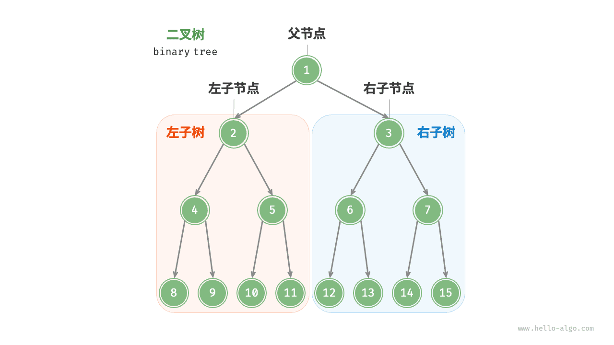

#### 二叉树常见术语

二叉树的常用术语如下图所示。

- <u>根节点（root node）</u>：位于二叉树顶层的节点，没有父节点。
- <u>叶节点（leaf node）</u>：没有子节点的节点，其两个指针均指向 `None` 。
- <u>边（edge）</u>：连接两个节点的线段，即节点引用（指针）。
- 节点所在的<u>层（level）</u>：从顶至底递增，根节点所在层为 1 。
- 节点的<u>度（degree）</u>：节点的子节点的数量。在二叉树中，度的取值范围是 0、1、2 。
- 二叉树的<u>高度（height）</u>：从根节点到最远叶节点所经过的边的数量。
- 节点的<u>深度（depth）</u>：从根节点到该节点所经过的边的数量。
- 节点的<u>高度（height）</u>：从距离该节点最远的叶节点到该节点所经过的边的数量。


!!! tip

    请注意，我们通常将“高度”和“深度”定义为“经过的边的数量”，但有些题目或教材可能会将其定义为“经过的节点的数量”。在这种情况下，高度和深度都需要加 1 。

#### 二叉树基本操作

##### 初始化二叉树

与链表类似，首先初始化节点，然后构建引用（指针）。

```python
# 初始化二叉树
# 初始化节点
n1 = TreeNode(val=1)
n2 = TreeNode(val=2)
n3 = TreeNode(val=3)
n4 = TreeNode(val=4)
n5 = TreeNode(val=5)
# 构建节点之间的引用（指针）
n1.left = n2
n1.right = n3
n2.left = n4
n2.right = n5
```

!!! example [pythontutor "可视化运行"](https://pythontutor.com/iframe-embed.html#code=class%20TreeNode%3A%0A%20%20%20%20%22%22%22%E4%BA%8C%E5%8F%89%E6%A0%91%E8%8A%82%E7%82%B9%E7%B1%BB%22%22%22%0A%20%20%20%20def%20__init__%28self,%20val%3A%20int%29%3A%0A%20%20%20%20%20%20%20%20self.val%3A%20int%20%3D%20val%20%20%20%20%20%20%20%20%20%20%20%20%20%20%20%20%23%20%E8%8A%82%E7%82%B9%E5%80%BC%0A%20%20%20%20%20%20%20%20self.left%3A%20TreeNode%20%7C%20None%20%3D%20None%20%20%23%20%E5%B7%A6%E5%AD%90%E8%8A%82%E7%82%B9%E5%BC%95%E7%94%A8%0A%20%20%20%20%20%20%20%20self.right%3A%20TreeNode%20%7C%20None%20%3D%20None%20%23%20%E5%8F%B3%E5%AD%90%E8%8A%82%E7%82%B9%E5%BC%95%E7%94%A8%0A%0A%22%22%22Driver%20Code%22%22%22%0Aif%20__name__%20%3D%3D%20%22__main__%22%3A%0A%20%20%20%20%23%20%E5%88%9D%E5%A7%8B%E5%8C%96%E4%BA%8C%E5%8F%89%E6%A0%91%0A%20%20%20%20%23%20%E5%88%9D%E5%A7%8B%E5%8C%96%E8%8A%82%E7%82%B9%0A%20%20%20%20n1%20%3D%20TreeNode%28val%3D1%29%0A%20%20%20%20n2%20%3D%20TreeNode%28val%3D2%29%0A%20%20%20%20n3%20%3D%20TreeNode%28val%3D3%29%0A%20%20%20%20n4%20%3D%20TreeNode%28val%3D4%29%0A%20%20%20%20n5%20%3D%20TreeNode%28val%3D5%29%0A%20%20%20%20%23%20%E6%9E%84%E5%BB%BA%E8%8A%82%E7%82%B9%E4%B9%8B%E9%97%B4%E7%9A%84%E5%BC%95%E7%94%A8%EF%BC%88%E6%8C%87%E9%92%88%EF%BC%89%0A%20%20%20%20n1.left%20%3D%20n2%0A%20%20%20%20n1.right%20%3D%20n3%0A%20%20%20%20n2.left%20%3D%20n4%0A%20%20%20%20n2.right%20%3D%20n5&codeDivHeight=800&codeDivWidth=600&cumulative=false&curInstr=3&heapPrimitives=nevernest&origin=opt-frontend.js&py=311&rawInputLstJSON=%5B%5D&textReferences=false)

##### 插入与删除节点

与链表类似，在二叉树中插入与删除节点可以通过修改指针来实现。下图给出了一个示例。


```python
# 插入与删除节点
p = TreeNode(0)
# 在 n1 -> n2 中间插入节点 P
n1.left = p
p.left = n2
# 删除节点 P
n1.left = n2
```

!!! example [pythontutor "可视化运行"](https://pythontutor.com/iframe-embed.html#code=class%20TreeNode%3A%0A%20%20%20%20%22%22%22%E4%BA%8C%E5%8F%89%E6%A0%91%E8%8A%82%E7%82%B9%E7%B1%BB%22%22%22%0A%20%20%20%20def%20__init__%28self,%20val%3A%20int%29%3A%0A%20%20%20%20%20%20%20%20self.val%3A%20int%20%3D%20val%20%20%20%20%20%20%20%20%20%20%20%20%20%20%20%20%23%20%E8%8A%82%E7%82%B9%E5%80%BC%0A%20%20%20%20%20%20%20%20self.left%3A%20TreeNode%20%7C%20None%20%3D%20None%20%20%23%20%E5%B7%A6%E5%AD%90%E8%8A%82%E7%82%B9%E5%BC%95%E7%94%A8%0A%20%20%20%20%20%20%20%20self.right%3A%20TreeNode%20%7C%20None%20%3D%20None%20%23%20%E5%8F%B3%E5%AD%90%E8%8A%82%E7%82%B9%E5%BC%95%E7%94%A8%0A%0A%22%22%22Driver%20Code%22%22%22%0Aif%20__name__%20%3D%3D%20%22__main__%22%3A%0A%20%20%20%20%23%20%E5%88%9D%E5%A7%8B%E5%8C%96%E4%BA%8C%E5%8F%89%E6%A0%91%0A%20%20%20%20%23%20%E5%88%9D%E5%A7%8B%E5%8C%96%E8%8A%82%E7%82%B9%0A%20%20%20%20n1%20%3D%20TreeNode%28val%3D1%29%0A%20%20%20%20n2%20%3D%20TreeNode%28val%3D2%29%0A%20%20%20%20n3%20%3D%20TreeNode%28val%3D3%29%0A%20%20%20%20n4%20%3D%20TreeNode%28val%3D4%29%0A%20%20%20%20n5%20%3D%20TreeNode%28val%3D5%29%0A%20%20%20%20%23%20%E6%9E%84%E5%BB%BA%E8%8A%82%E7%82%B9%E4%B9%8B%E9%97%B4%E7%9A%84%E5%BC%95%E7%94%A8%EF%BC%88%E6%8C%87%E9%92%88%EF%BC%89%0A%20%20%20%20n1.left%20%3D%20n2%0A%20%20%20%20n1.right%20%3D%20n3%0A%20%20%20%20n2.left%20%3D%20n4%0A%20%20%20%20n2.right%20%3D%20n5%0A%0A%20%20%20%20%23%20%E6%8F%92%E5%85%A5%E4%B8%8E%E5%88%A0%E9%99%A4%E8%8A%82%E7%82%B9%0A%20%20%20%20p%20%3D%20TreeNode%280%29%0A%20%20%20%20%23%20%E5%9C%A8%20n1%20-%3E%20n2%20%E4%B8%AD%E9%97%B4%E6%8F%92%E5%85%A5%E8%8A%82%E7%82%B9%20P%0A%20%20%20%20n1.left%20%3D%20p%0A%20%20%20%20p.left%20%3D%20n2%0A%20%20%20%20%23%20%E5%88%A0%E9%99%A4%E8%8A%82%E7%82%B9%20P%0A%20%20%20%20n1.left%20%3D%20n2&codeDivHeight=800&codeDivWidth=600&cumulative=false&curInstr=37&heapPrimitives=nevernest&origin=opt-frontend.js&py=311&rawInputLstJSON=%5B%5D&textReferences=false)

!!! tip

    需要注意的是，插入节点可能会改变二叉树的原有逻辑结构，而删除节点通常意味着删除该节点及其所有子树。因此，在二叉树中，插入与删除通常是由一套操作配合完成的，以实现有实际意义的操作。

#### 常见二叉树类型

##### 完美二叉树

如下图所示，<u>完美二叉树（perfect binary tree）</u>所有层的节点都被完全填满。在完美二叉树中，叶节点的度为 $0$ ，其余所有节点的度都为 $2$ ；若树的高度为 $h$ ，则节点总数为 $2^{h+1} - 1$ ，呈现标准的指数级关系，反映了自然界中常见的细胞分裂现象。

!!! tip

    请注意，在中文社区中，完美二叉树常被称为<u>满二叉树</u>。

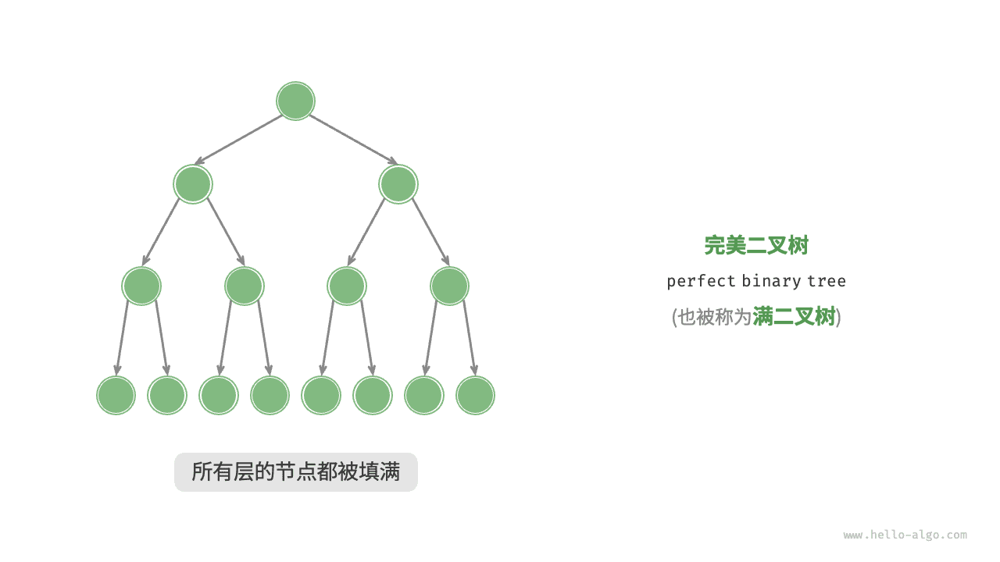

##### 完全二叉树

如下图所示，<u>完全二叉树（complete binary tree）</u>仅允许最底层的节点不完全填满，且最底层的节点必须从左至右依次连续填充。请注意，完美二叉树也是一棵完全二叉树。

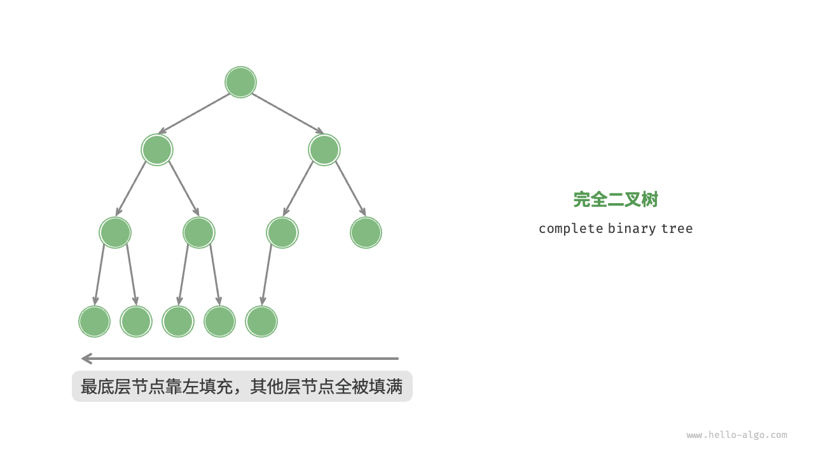

##### 完满二叉树

如下图所示，<u>完满二叉树（full binary tree）</u>除了叶节点之外，其余所有节点都有两个子节点。


##### 平衡二叉树

如下图所示，<u>平衡二叉树（balanced binary tree）</u>中任意节点的左子树和右子树的高度之差的绝对值不超过 1 。

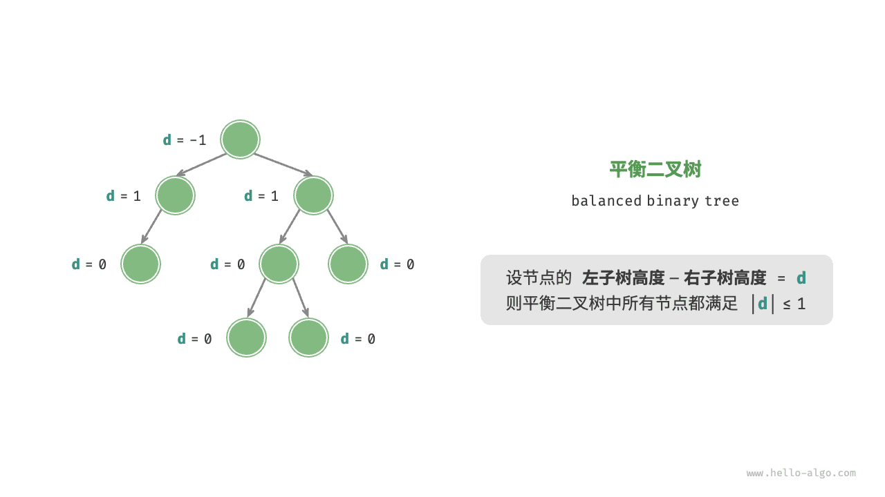

#### 二叉树的退化

下图展示了二叉树的理想结构与退化结构。当二叉树的每层节点都被填满时，达到“完美二叉树”；而当所有节点都偏向一侧时，二叉树退化为“链表”。

- 完美二叉树是理想情况，可以充分发挥二叉树“分治”的优势。
- 链表则是另一个极端，各项操作都变为线性操作，时间复杂度退化至 $O(n)$ 。

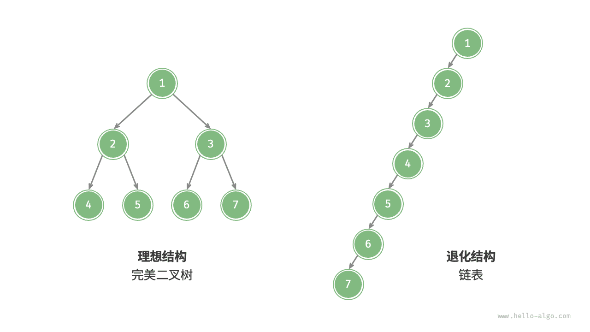

如下表所示，在最佳结构和最差结构下，二叉树的叶节点数量、节点总数、高度等达到极大值或极小值。

<p align="center"> 表 <id> &nbsp; 二叉树的最佳结构与最差结构 </p>

|                             | 完美二叉树         | 链表    |
| --------------------------- | ------------------ | ------- |
| 第 $i$ 层的节点数量         | $2^{i-1}$          | $1$     |
| 高度为 $h$ 的树的叶节点数量 | $2^h$              | $1$     |
| 高度为 $h$ 的树的节点总数   | $2^{h+1} - 1$      | $h + 1$ |
| 节点总数为 $n$ 的树的高度   | $\log_2 (n+1) - 1$ | $n - 1$ |


### 1.2 树的题目递归写法通常是首选

树结构的题目非常适合用递归来解决，因为树本身就是一个递归定义的数据结构——每个节点都可以看作是一个包含子节点的小树。使用递归方法来解决问题可以使代码更简洁、易读，并且通常更容易理解。以下是一些常见的树操作示例，以及如何使用递归<mark>优雅</mark>地实现它们。

使用类（class）来定义树的节点。每个节点包含三个属性：节点的值 (`val`)、指向左子节点的引用 (`left`) 和指向右子节点的引用 (`right`)。

```python
# Definition for a binary tree node.
class TreeNode:
    def __init__(self, val=0, left=None, right=None):
        self.val = val
        self.left = left
        self.right = right
```


#### 1. 遍历（Traversal）

##### 前序遍历（Pre-order Traversal）

先访问根节点，然后递归地前序遍历左子树，最后递归地前序遍历右子树。

```python
def preorder_traversal(root):
    if root:
        print(root.val)  # 访问根节点
        preorder_traversal(root.left)  # 递归遍历左子树
        preorder_traversal(root.right)  # 递归遍历右子树
```


##### 中序遍历（In-order Traversal）

先递归地中序遍历左子树，然后访问根节点，最后递归地中序遍历右子树。

```python
def inorder_traversal(root):
    if root:
        inorder_traversal(root.left)  # 递归遍历左子树
        print(root.val)  # 访问根节点
        inorder_traversal(root.right)  # 递归遍历右子树
```


###### 示例LC94.二叉树的中序遍历

https://leetcode.cn/problems/binary-tree-inorder-traversal/

给定一个二叉树的根节点 `root` ，返回 *它的 **中序** 遍历* 。

 

**示例 1：**


```
输入：root = [1,null,2,3]
输出：[1,3,2]
```

**示例 2：**

```
输入：root = []
输出：[]
```

**示例 3：**

```
输入：root = [1]
输出：[1]
```

 

**提示：**

- 树中节点数目在范围 `[0, 100]` 内
- `-100 <= Node.val <= 100`


```python
from typing import Optional, List

# Definition for a binary tree node.
class TreeNode:
    def __init__(self, val=0, left=None, right=None):
        self.val = val
        self.left = left
        self.right = right

class Solution:
    def inorderTraversal(self, root: Optional[TreeNode]) -> List[int]:
        result = []
        
        def dfs(node: Optional[TreeNode]):
            if not node:
                return
            dfs(node.left)
            result.append(node.val)
            dfs(node.right)
        
        dfs(root)
        return result
```


> 用stack模拟的“<mark>颜色填充法</mark>”，和递归的思路其实很相似。
>
> 核心思想如下：
>
> - 使用颜色标记节点的状态，新节点为白色，已访问的节点为灰色。
>- 如果遇到的节点为白色，则将其标记为灰色，然后将其右子节点、自身、左子节点依次入栈。
> - 如果遇到的节点为灰色，则将节点的值输出。
>
> ```python
> # Definition for a binary tree node.
> # class TreeNode:
>#     def __init__(self, val=0, left=None, right=None):
> #         self.val = val
> #         self.left = left
> #         self.right = right
> class Solution:
>     def inorderTraversal(self, root: Optional[TreeNode]) -> List[int]:
>         white, gray = 0, 1
>         res = []
>         stack = [(white, root)]
>         while stack:
>             color, node = stack.pop()
>             if node is None: continue
>             if color == white:
>                 stack.append((white, node.right))
>                 stack.append((gray, node))
>                 stack.append((white, node.left))
>             else:
>                 res.append(node.val)
>         return res
> ```
> 


##### 后序遍历（Post-order Traversal）

先递归地后序遍历左子树，然后递归地后序遍历右子树，最后访问根节点。

```python
def postorder_traversal(root):
    if root:
        postorder_traversal(root.left)  # 递归遍历左子树
        postorder_traversal(root.right)  # 递归遍历右子树
        print(root.val)  # 访问根节点
```


##### 层序遍历：按层从左到右依次遍历

###### 练习LC102.二叉树的层序遍历

bfs, https://leetcode.cn/problems/binary-tree-level-order-traversal/

给你二叉树的根节点 `root` ，返回其节点值的 **层序遍历** 。 （即逐层地，从左到右访问所有节点）。

**示例 1：**


```
输入：root = [3,9,20,null,null,15,7]
输出：[[3],[9,20],[15,7]]
```

**示例 2：**

```
输入：root = [1]
输出：[[1]]
```

**示例 3：**

```
输入：root = []
输出：[]
```

 

**提示：**

- 树中节点数目在范围 `[0, 2000]` 内
- `-1000 <= Node.val <= 1000`


```python
# Definition for a binary tree node.
# class TreeNode:
#     def __init__(self, val=0, left=None, right=None):
#         self.val = val
#         self.left = left
#         self.right = right
class Solution:
    def levelOrder(self, root: Optional[TreeNode]) -> List[List[int]]:
        if not root:
            return []

        result = []
        queue = deque([root])

        while queue:
            level_size = len(queue)
            level = []

            for _ in range(level_size):
                node = queue.popleft()
                level.append(node.val)
                if node.left:
                    queue.append(node.left)
                if node.right:
                    queue.append(node.right)

            result.append(level)

        return result
        
```


#### 2. 求树的高度/深度

```python
def tree_height(root):
    if not root:  # 空树的高度为 0
        return 0
    
    left_height = tree_height(root.left)  # 左子树的高度
    right_height = tree_height(root.right)  # 右子树的高度
    
    return max(left_height, right_height) + 1  # 树的高度是左右子树最大高度加 1
```


###### 示例LC104.二叉树的最大深度

tree, dfs, https://leetcode.cn/problems/maximum-depth-of-binary-tree/

给定一个二叉树 `root` ，返回其最大深度。

二叉树的 **最大深度** 是指从根节点到最远叶子节点的最长路径上的节点数。

 

**示例 1：**


 

```
输入：root = [3,9,20,null,null,15,7]
输出：3
```

**示例 2：**

```
输入：root = [1,null,2]
输出：2
```

 

**提示：**

- 树中节点的数量在 `[0, 10^4]` 区间内。
- `-100 <= Node.val <= 100`


已知树根root

```python
# Definition for a binary tree node.
# class TreeNode:
#     def __init__(self, val=0, left=None, right=None):
#         self.val = val
#         self.left = left
#         self.right = right
class Solution:
    def maxDepth(self, root: Optional[TreeNode]) -> int:
        def tree_depth(node):
            if node is None:
                return 0
            left_depth = tree_depth(node.left)
            right_depth = tree_depth(node.right)
            return max(left_depth, right_depth) + 1
        
        return tree_depth(root)
```


###### 练习M06646: 二叉树的深度

http://cs101.openjudge.cn/practice/06646/

给定一棵二叉树，求该二叉树的深度

二叉树**深度**定义：从根结点到叶结点依次经过的结点（含根、叶结点）形成树的一条路径，最长路径的节点个数为树的深度

**输入**

第一行是一个整数n，表示二叉树的结点个数。二叉树结点编号从1到n，根结点为1，n <= 10
接下来有n行，依次对应二叉树的n个节点。
每行有两个整数，分别表示该节点的左儿子和右儿子的节点编号。如果第一个（第二个）数为-1则表示没有左（右）儿子

**输出**

输出一个整型数，表示树的深度

样例输入

```
3
2 3
-1 -1
-1 -1
```

样例输出

```
2
```


 推荐这种类的写法，在笔试中也常见。<mark>根据输入建树，知道树根位置</mark>。

```python
class TreeNode:
    def __init__(self, val=0, left=None, right=None):
        self.val = val
        self.left = left
        self.right = right


def build_tree(nodes):
    if not nodes:
        return None

    tree_nodes = [None] * (len(nodes) + 1)
    for i in range(1, len(nodes) + 1):
        tree_nodes[i] = TreeNode(i)

    for i, (left, right) in enumerate(nodes, start=1):
        if left != -1:
            tree_nodes[i].left = tree_nodes[left]
        if right != -1:
            tree_nodes[i].right = tree_nodes[right]

    return tree_nodes[1]


def tree_depth(root):
    if not root:
        return 0
    left_depth = tree_depth(root.left)
    right_depth = tree_depth(root.right)
    return max(left_depth, right_depth) + 1


def main():
    n = int(input())
    nodes = []
    index = 1
    for _ in range(n):
        left, right = map(int, input().split())
        nodes.append((left, right))

    root = build_tree(nodes)
    depth = tree_depth(root)
    print(depth)


if __name__ == "__main__":
    main()

```


###### 练习M27638: 求二叉树的高度和叶子数目

http://cs101.openjudge.cn/practice/27638/

给定一棵二叉树，求该二叉树的高度和叶子数目二叉树**高度**定义：从根结点到叶结点依次经过的结点（含根、叶结点）形成树的一条路径，最长路径的结点数减1为树的高度。只有一个结点的二叉树，高度是0。

**输入**

第一行是一个整数n，表示二叉树的结点个数。二叉树结点编号从0到n-1，根结点n <= 100 接下来有n行，依次对应二叉树的编号为0,1,2....n-1的节点。 每行有两个整数，分别表示该节点的左儿子和右儿子的编号。如果第一个（第二个）数为-1则表示没有左（右）儿子

**输出**

在一行中输出2个整数，分别表示二叉树的高度和叶子结点个数

样例输入

```
3
-1 -1
0 2
-1 -1
```

样例输出

```
1 2
```


根据输入建树，<mark>找到树根</mark>。

```python
class TreeNode:
    def __init__(self):
        self.left = None
        self.right = None

def tree_height(node):
    if node is None:
        return -1  # 根据定义，空树高度为-1
    return max(tree_height(node.left), tree_height(node.right)) + 1

def count_leaves(node):
    if node is None:
        return 0
    if node.left is None and node.right is None:
        return 1
    return count_leaves(node.left) + count_leaves(node.right)

n = int(input())  # 读取节点数量
nodes = [TreeNode() for _ in range(n)]
has_parent = [False] * n  # 用来标记节点是否有父节点

for i in range(n):
    left_index, right_index = map(int, input().split())
    if left_index != -1:
        nodes[i].left = nodes[left_index]
        has_parent[left_index] = True
    if right_index != -1:
        #print(right_index)
        nodes[i].right = nodes[right_index]
        has_parent[right_index] = True

# 寻找根节点，也就是没有父节点的节点
root_index = has_parent.index(False)
root = nodes[root_index]

# 计算高度和叶子节点数
height = tree_height(root)
leaves = count_leaves(root)

print(f"{height} {leaves}")
```


#### 3. 判断两棵树是否相同

```python
def is_same_tree(p, q):
    if not p and not q:
        return True
    if not p or not q:
        return False
    return (p.val == q.val and
            is_same_tree(p.left, q.left) and
            is_same_tree(p.right, q.right))
```


###### 示例LC101.对称二叉树

https://leetcode.cn/problems/symmetric-tree/

给你一个二叉树的根节点 `root` ， 检查它是否轴对称。

 

**示例 1：**


```
输入：root = [1,2,2,3,4,4,3]
输出：true
```

**示例 2：**


```
输入：root = [1,2,2,null,3,null,3]
输出：false
```

 

**提示：**

- 树中节点数目在范围 `[1, 1000]` 内
- `-100 <= Node.val <= 100`


```python
# Definition for a binary tree node.
# class TreeNode:
#     def __init__(self, val=0, left=None, right=None):
#         self.val = val
#         self.left = left
#         self.right = right
class Solution:
    def isSymmetric(self, root: Optional[TreeNode]) -> bool:
        if not root:
            return True

        def isMirror(left: TreeNode, right: TreeNode) -> bool:
            if not left and not right:
                return True
            if not left or not right:
                return False
            return (left.val == right.val) and isMirror(left.left, right.right) and isMirror(left.right, right.left)

        return isMirror(root.left, root.right)
```


#### 4. 翻转二叉树

```python
def invert_tree(root):
    if root:
        root.left, root.right = invert_tree(root.right), invert_tree(root.left)
    return root
```


###### 示例LC226.翻转二叉树

https://leetcode.cn/problems/invert-binary-tree/

给你一棵二叉树的根节点 `root` ，翻转这棵二叉树，并返回其根节点。

 

**示例 1：**


```
输入：root = [4,2,7,1,3,6,9]
输出：[4,7,2,9,6,3,1]
```

**示例 2：**


```
输入：root = [2,1,3]
输出：[2,3,1]
```

**示例 3：**

```
输入：root = []
输出：[]
```

 

**提示：**

- 树中节点数目范围在 `[0, 100]` 内
- `-100 <= Node.val <= 100`


```python
# Definition for a binary tree node.
# class TreeNode:
#     def __init__(self, val=0, left=None, right=None):
#         self.val = val
#         self.left = left
#         self.right = right
class Solution:
    def invertTree(self, root: Optional[TreeNode]) -> Optional[TreeNode]:
        if not root:
            return root
        
        left = self.invertTree(root.left)
        right = self.invertTree(root.right)
        root.left, root.right = right, left
        return root
```


#### 5. 寻找二叉搜索树中的最小值/最大值

对于二叉搜索树（BST），最小值在最左边，最大值在最右边。<mark>BST各种翻译的名字都需要认识</mark>。

| 中文翻译   | 英文原名           | 使用场景                 |
| ---------- | ------------------ | ------------------------ |
| 二叉搜索树 | Binary Search Tree | 最常见翻译，通用性强     |
| 二叉查找树 | Binary Search Tree | 强调查找功能             |
| 二叉排序树 | Binary Search Tree | 强调排序特性             |
| 二叉检索树 | Binary Search Tree | 强调检索功能             |
| 有序二叉树 | Binary Search Tree | 强调有序性               |
| BST        | Binary Search Tree | 技术文档、代码注释中常用 |

```python
def find_min(root):
    if not root.left:
        return root.val
    return find_min(root.left)

def find_max(root):
    if not root.right:
        return root.val
    return find_max(root.right)
```


###### 练习M230.二叉搜索树中第K小的元素

https://leetcode.cn/problems/kth-smallest-element-in-a-bst/

给定一个二叉搜索树的根节点 `root` ，和一个整数 `k` ，请你设计一个算法查找其中第 `k` 小的元素（从 1 开始计数）。

 

**示例 1：**


```
输入：root = [3,1,4,null,2], k = 1
输出：1
```

**示例 2：**


```
输入：root = [5,3,6,2,4,null,null,1], k = 3
输出：3
```

 

 

**提示：**

- 树中的节点数为 `n` 。
- `1 <= k <= n <= 10^4`
- `0 <= Node.val <= 10^4`

 

**进阶：**如果二叉搜索树经常被修改（插入/删除操作）并且你需要频繁地查找第 `k` 小的值，你将如何优化算法？


BST的中序遍历是升序的。只需要对BST进行 **中序遍历**，遍历到第 `k` 个节点时返回它即可。

```python
# Definition for a binary tree node.
# class TreeNode:
#     def __init__(self, val=0, left=None, right=None):
#         self.val = val
#         self.left = left
#         self.right = right
class Solution:
    def kthSmallest(self, root, k):
        self.k = k
        self.result = None

        def inorder(node):
            if not node or self.result is not None:
                return
            inorder(node.left)
            self.k -= 1
            if self.k == 0:
                self.result = node.val
                return
            inorder(node.right)

        inorder(root)
        return self.result

        
```


#### 6. 判断是否为平衡二叉树

一个二叉树是平衡的，如果它的左右两个子树的高度差不超过1。

```python
class TreeNode:
    def __init__(self, val=0, left=None, right=None):
        self.val = val
        self.left = left
        self.right = right

def is_balanced(root):
    def check_height(node):
        if not node:
            return 0
        
        left_height = check_height(node.left)
        if left_height == -1:
            return -1  # Left subtree is unbalanced
        
        right_height = check_height(node.right)
        if right_height == -1:
            return -1  # Right subtree is unbalanced
        
        if abs(left_height - right_height) > 1:
            return -1  # Current node is unbalanced
        
        return max(left_height, right_height) + 1 # 返回当前节点所在子树的高度（较大子树高度 + 1）
    
    return check_height(root) != -1


# 构建如下所示的平衡二叉树：
#         3
#        / \
#       9  20
#         /  \
#        15   7

root_balanced = TreeNode(3)
root_balanced.left = TreeNode(9)
root_balanced.right = TreeNode(20, TreeNode(15), TreeNode(7))

print("Balanced Tree:", "Yes" if is_balanced(root_balanced) else "No")
# Balanced Tree: Yes

# 构建如下所示的不平衡二叉树：
#         1
#          \
#           2
#            \
#             3
#              \
#               4

root_unbalanced = TreeNode(1)
root_unbalanced.right = TreeNode(2)
root_unbalanced.right.right = TreeNode(3)
root_unbalanced.right.right.right = TreeNode(4)

print("Unbalanced Tree:", "Yes" if is_balanced(root_unbalanced) else "No")
# Unbalanced Tree: No
```

以上这些例子展示了如何通过递归优雅地解决一些常见的树问题。递归解法通常能够清晰地表达算法逻辑，使得代码更加容易理解和维护。不过，值得注意的是，在某些情况下，递归可能会导致栈溢出的问题，尤其是在处理非常深的树时。然而，<mark>通常树的题目不卡时间，因此递归写法通常是首选</mark>。

### 二叉树遍历（HA）

从物理结构的角度来看，树是一种基于链表的数据结构，因此其遍历方式是通过指针逐个访问节点。然而，树是一种非线性数据结构，这使得遍历树比遍历链表更加复杂，需要借助搜索算法来实现。

二叉树常见的遍历方式包括层序遍历、前序遍历、中序遍历和后序遍历等。

#### 层序遍历

如下图所示，<u>层序遍历（level-order traversal）</u>从顶部到底部逐层遍历二叉树，并在每一层按照从左到右的顺序访问节点。

层序遍历本质上属于<u>广度优先遍历（breadth-first traversal）</u>，也称<u>广度优先搜索（breadth-first search, BFS）</u>，它体现了一种“一圈一圈向外扩展”的逐层遍历方式。

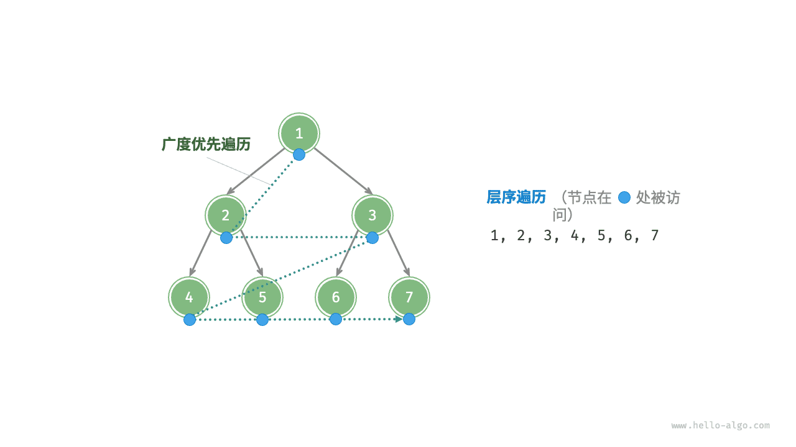

##### 代码实现

广度优先遍历通常借助“队列”来实现。队列遵循“先进先出”的规则，而广度优先遍历则遵循“逐层推进”的规则，两者背后的思想是一致的。实现代码如下：

```python
def level_order(root: TreeNode | None) -> list[int]:
    """层序遍历"""
    # 初始化队列，加入根节点
    queue: deque[TreeNode] = deque()
    queue.append(root)
    # 初始化一个列表，用于保存遍历序列
    res = []
    while queue:
        node: TreeNode = queue.popleft()  # 队列出队
        res.append(node.val)  # 保存节点值
        if node.left is not None:
            queue.append(node.left)  # 左子节点入队
        if node.right is not None:
            queue.append(node.right)  # 右子节点入队
    return res
```

!!! example [pythontutor "可视化运行"](https://pythontutor.com/iframe-embed.html#code=from%20collections%20import%20deque%0A%0Aclass%20TreeNode%3A%0A%20%20%20%20%22%22%22%E4%BA%8C%E5%8F%89%E6%A0%91%E8%8A%82%E7%82%B9%E7%B1%BB%22%22%22%0A%20%20%20%20def%20__init__%28self,%20val%3A%20int%29%3A%0A%20%20%20%20%20%20%20%20self.val%3A%20int%20%3D%20val%20%20%20%20%20%20%20%20%20%20%20%20%20%20%20%20%23%20%E8%8A%82%E7%82%B9%E5%80%BC%0A%20%20%20%20%20%20%20%20self.left%3A%20TreeNode%20%7C%20None%20%3D%20None%20%20%23%20%E5%B7%A6%E5%AD%90%E8%8A%82%E7%82%B9%E5%BC%95%E7%94%A8%0A%20%20%20%20%20%20%20%20self.right%3A%20TreeNode%20%7C%20None%20%3D%20None%20%23%20%E5%8F%B3%E5%AD%90%E8%8A%82%E7%82%B9%E5%BC%95%E7%94%A8%0A%0Adef%20list_to_tree_dfs%28arr%3A%20list%5Bint%5D,%20i%3A%20int%29%20-%3E%20TreeNode%20%7C%20None%3A%0A%20%20%20%20%22%22%22%E5%B0%86%E5%88%97%E8%A1%A8%E5%8F%8D%E5%BA%8F%E5%88%97%E5%8C%96%E4%B8%BA%E4%BA%8C%E5%8F%89%E6%A0%91%EF%BC%9A%E9%80%92%E5%BD%92%22%22%22%0A%20%20%20%20%23%20%E5%A6%82%E6%9E%9C%E7%B4%A2%E5%BC%95%E8%B6%85%E5%87%BA%E6%95%B0%E7%BB%84%E9%95%BF%E5%BA%A6%EF%BC%8C%E6%88%96%E8%80%85%E5%AF%B9%E5%BA%94%E7%9A%84%E5%85%83%E7%B4%A0%E4%B8%BA%20None%20%EF%BC%8C%E5%88%99%E8%BF%94%E5%9B%9E%20None%0A%20%20%20%20if%20i%20%3C%200%20or%20i%20%3E%3D%20len%28arr%29%20or%20arr%5Bi%5D%20is%20None%3A%0A%20%20%20%20%20%20%20%20return%20None%0A%20%20%20%20%23%20%E6%9E%84%E5%BB%BA%E5%BD%93%E5%89%8D%E8%8A%82%E7%82%B9%0A%20%20%20%20root%20%3D%20TreeNode%28arr%5Bi%5D%29%0A%20%20%20%20%23%20%E9%80%92%E5%BD%92%E6%9E%84%E5%BB%BA%E5%B7%A6%E5%8F%B3%E5%AD%90%E6%A0%91%0A%20%20%20%20root.left%20%3D%20list_to_tree_dfs%28arr,%202%20*%20i%20%2B%201%29%0A%20%20%20%20root.right%20%3D%20list_to_tree_dfs%28arr,%202%20*%20i%20%2B%202%29%0A%20%20%20%20return%20root%0A%0Adef%20list_to_tree%28arr%3A%20list%5Bint%5D%29%20-%3E%20TreeNode%20%7C%20None%3A%0A%20%20%20%20%22%22%22%E5%B0%86%E5%88%97%E8%A1%A8%E5%8F%8D%E5%BA%8F%E5%88%97%E5%8C%96%E4%B8%BA%E4%BA%8C%E5%8F%89%E6%A0%91%22%22%22%0A%20%20%20%20return%20list_to_tree_dfs%28arr,%200%29%0A%0A%0Adef%20level_order%28root%3A%20TreeNode%20%7C%20None%29%20-%3E%20list%5Bint%5D%3A%0A%20%20%20%20%22%22%22%E5%B1%82%E5%BA%8F%E9%81%8D%E5%8E%86%22%22%22%0A%20%20%20%20%23%20%E5%88%9D%E5%A7%8B%E5%8C%96%E9%98%9F%E5%88%97%EF%BC%8C%E5%8A%A0%E5%85%A5%E6%A0%B9%E8%8A%82%E7%82%B9%0A%20%20%20%20queue%3A%20deque%5BTreeNode%5D%20%3D%20deque%28%29%0A%20%20%20%20queue.append%28root%29%0A%20%20%20%20%23%20%E5%88%9D%E5%A7%8B%E5%8C%96%E4%B8%80%E4%B8%AA%E5%88%97%E8%A1%A8%EF%BC%8C%E7%94%A8%E4%BA%8E%E4%BF%9D%E5%AD%98%E9%81%8D%E5%8E%86%E5%BA%8F%E5%88%97%0A%20%20%20%20res%20%3D%20%5B%5D%0A%20%20%20%20while%20queue%3A%0A%20%20%20%20%20%20%20%20node%3A%20TreeNode%20%3D%20queue.popleft%28%29%20%20%23%20%E9%98%9F%E5%88%97%E5%87%BA%E9%98%9F%0A%20%20%20%20%20%20%20%20res.append%28node.val%29%20%20%23%20%E4%BF%9D%E5%AD%98%E8%8A%82%E7%82%B9%E5%80%BC%0A%20%20%20%20%20%20%20%20if%20node.left%20is%20not%20None%3A%0A%20%20%20%20%20%20%20%20%20%20%20%20queue.append%28node.left%29%20%20%23%20%E5%B7%A6%E5%AD%90%E8%8A%82%E7%82%B9%E5%85%A5%E9%98%9F%0A%20%20%20%20%20%20%20%20if%20node.right%20is%20not%20None%3A%0A%20%20%20%20%20%20%20%20%20%20%20%20queue.append%28node.right%29%20%20%23%20%E5%8F%B3%E5%AD%90%E8%8A%82%E7%82%B9%E5%85%A5%E9%98%9F%0A%20%20%20%20return%20res%0A%0A%22%22%22Driver%20Code%22%22%22%0Aif%20__name__%20%3D%3D%20%22__main__%22%3A%0A%20%20%20%20%23%20%E5%88%9D%E5%A7%8B%E5%8C%96%E4%BA%8C%E5%8F%89%E6%A0%91%0A%20%20%20%20%23%20%E8%BF%99%E9%87%8C%E5%80%9F%E5%8A%A9%E4%BA%86%E4%B8%80%E4%B8%AA%E4%BB%8E%E6%95%B0%E7%BB%84%E7%9B%B4%E6%8E%A5%E7%94%9F%E6%88%90%E4%BA%8C%E5%8F%89%E6%A0%91%E7%9A%84%E5%87%BD%E6%95%B0%0A%20%20%20%20root%20%3D%20list_to_tree%28arr%3D%5B1,%202,%203,%204,%205,%206,%207%5D%29%0A%0A%20%20%20%20%23%20%E5%B1%82%E5%BA%8F%E9%81%8D%E5%8E%86%0A%20%20%20%20res%20%3D%20level_order%28root%29%0A%20%20%20%20print%28%22%5Cn%E5%B1%82%E5%BA%8F%E9%81%8D%E5%8E%86%E7%9A%84%E8%8A%82%E7%82%B9%E6%89%93%E5%8D%B0%E5%BA%8F%E5%88%97%20%3D%20%22,%20res%29&codeDivHeight=800&codeDivWidth=600&cumulative=false&curInstr=127&heapPrimitives=nevernest&origin=opt-frontend.js&py=311&rawInputLstJSON=%5B%5D&textReferences=false)

##### 复杂度分析

- **时间复杂度为 $O(n)$** ：所有节点被访问一次，使用 $O(n)$ 时间，其中 $n$ 为节点数量。
- **空间复杂度为 $O(n)$** ：在最差情况下，即满二叉树时，遍历到最底层之前，队列中最多同时存在 $(n + 1) / 2$ 个节点，占用 $O(n)$ 空间。

#### 前序、中序、后序遍历

相应地，前序、中序和后序遍历都属于<u>深度优先遍历（depth-first traversal）</u>，也称<u>深度优先搜索（depth-first search, DFS）</u>，它体现了一种“先走到尽头，再回溯继续”的遍历方式。

下图展示了对二叉树进行深度优先遍历的工作原理。**深度优先遍历就像是绕着整棵二叉树的外围“走”一圈**，在每个节点都会遇到三个位置，分别对应前序遍历、中序遍历和后序遍历。


##### 代码实现

深度优先搜索通常基于递归实现：

```python
def pre_order(root: TreeNode | None):
    """前序遍历"""
    if root is None:
        return
    # 访问优先级：根节点 -> 左子树 -> 右子树
    res.append(root.val)
    pre_order(root=root.left)
    pre_order(root=root.right)

def in_order(root: TreeNode | None):
    """中序遍历"""
    if root is None:
        return
    # 访问优先级：左子树 -> 根节点 -> 右子树
    in_order(root=root.left)
    res.append(root.val)
    in_order(root=root.right)

def post_order(root: TreeNode | None):
    """后序遍历"""
    if root is None:
        return
    # 访问优先级：左子树 -> 右子树 -> 根节点
    post_order(root=root.left)
    post_order(root=root.right)
    res.append(root.val)
```

!!! example [pythontutor "可视化运行"](https://pythontutor.com/iframe-embed.html#code=class%20TreeNode%3A%0A%20%20%20%20%22%22%22%E4%BA%8C%E5%8F%89%E6%A0%91%E8%8A%82%E7%82%B9%E7%B1%BB%22%22%22%0A%20%20%20%20def%20__init__%28self,%20val%3A%20int%29%3A%0A%20%20%20%20%20%20%20%20self.val%3A%20int%20%3D%20val%20%20%20%20%20%20%20%20%20%20%20%20%20%20%20%20%23%20%E8%8A%82%E7%82%B9%E5%80%BC%0A%20%20%20%20%20%20%20%20self.left%3A%20TreeNode%20%7C%20None%20%3D%20None%20%20%23%20%E5%B7%A6%E5%AD%90%E8%8A%82%E7%82%B9%E5%BC%95%E7%94%A8%0A%20%20%20%20%20%20%20%20self.right%3A%20TreeNode%20%7C%20None%20%3D%20None%20%23%20%E5%8F%B3%E5%AD%90%E8%8A%82%E7%82%B9%E5%BC%95%E7%94%A8%0A%0Adef%20list_to_tree_dfs%28arr%3A%20list%5Bint%5D,%20i%3A%20int%29%20-%3E%20TreeNode%20%7C%20None%3A%0A%20%20%20%20%22%22%22%E5%B0%86%E5%88%97%E8%A1%A8%E5%8F%8D%E5%BA%8F%E5%88%97%E5%8C%96%E4%B8%BA%E4%BA%8C%E5%8F%89%E6%A0%91%EF%BC%9A%E9%80%92%E5%BD%92%22%22%22%0A%20%20%20%20%23%20%E5%A6%82%E6%9E%9C%E7%B4%A2%E5%BC%95%E8%B6%85%E5%87%BA%E6%95%B0%E7%BB%84%E9%95%BF%E5%BA%A6%EF%BC%8C%E6%88%96%E8%80%85%E5%AF%B9%E5%BA%94%E7%9A%84%E5%85%83%E7%B4%A0%E4%B8%BA%20None%20%EF%BC%8C%E5%88%99%E8%BF%94%E5%9B%9E%20None%0A%20%20%20%20if%20i%20%3C%200%20or%20i%20%3E%3D%20len%28arr%29%20or%20arr%5Bi%5D%20is%20None%3A%0A%20%20%20%20%20%20%20%20return%20None%0A%20%20%20%20%23%20%E6%9E%84%E5%BB%BA%E5%BD%93%E5%89%8D%E8%8A%82%E7%82%B9%0A%20%20%20%20root%20%3D%20TreeNode%28arr%5Bi%5D%29%0A%20%20%20%20%23%20%E9%80%92%E5%BD%92%E6%9E%84%E5%BB%BA%E5%B7%A6%E5%8F%B3%E5%AD%90%E6%A0%91%0A%20%20%20%20root.left%20%3D%20list_to_tree_dfs%28arr,%202%20*%20i%20%2B%201%29%0A%20%20%20%20root.right%20%3D%20list_to_tree_dfs%28arr,%202%20*%20i%20%2B%202%29%0A%20%20%20%20return%20root%0A%0Adef%20list_to_tree%28arr%3A%20list%5Bint%5D%29%20-%3E%20TreeNode%20%7C%20None%3A%0A%20%20%20%20%22%22%22%E5%B0%86%E5%88%97%E8%A1%A8%E5%8F%8D%E5%BA%8F%E5%88%97%E5%8C%96%E4%B8%BA%E4%BA%8C%E5%8F%89%E6%A0%91%22%22%22%0A%20%20%20%20return%20list_to_tree_dfs%28arr,%200%29%0A%0A%0Adef%20pre_order%28root%3A%20TreeNode%20%7C%20None%29%3A%0A%20%20%20%20%22%22%22%E5%89%8D%E5%BA%8F%E9%81%8D%E5%8E%86%22%22%22%0A%20%20%20%20if%20root%20is%20None%3A%0A%20%20%20%20%20%20%20%20return%0A%20%20%20%20%23%20%E8%AE%BF%E9%97%AE%E4%BC%98%E5%85%88%E7%BA%A7%EF%BC%9A%E6%A0%B9%E8%8A%82%E7%82%B9%20-%3E%20%E5%B7%A6%E5%AD%90%E6%A0%91%20-%3E%20%E5%8F%B3%E5%AD%90%E6%A0%91%0A%20%20%20%20res.append%28root.val%29%0A%20%20%20%20pre_order%28root%3Droot.left%29%0A%20%20%20%20pre_order%28root%3Droot.right%29%0A%0Adef%20in_order%28root%3A%20TreeNode%20%7C%20None%29%3A%0A%20%20%20%20%22%22%22%E4%B8%AD%E5%BA%8F%E9%81%8D%E5%8E%86%22%22%22%0A%20%20%20%20if%20root%20is%20None%3A%0A%20%20%20%20%20%20%20%20return%0A%20%20%20%20%23%20%E8%AE%BF%E9%97%AE%E4%BC%98%E5%85%88%E7%BA%A7%EF%BC%9A%E5%B7%A6%E5%AD%90%E6%A0%91%20-%3E%20%E6%A0%B9%E8%8A%82%E7%82%B9%20-%3E%20%E5%8F%B3%E5%AD%90%E6%A0%91%0A%20%20%20%20in_order%28root%3Droot.left%29%0A%20%20%20%20res.append%28root.val%29%0A%20%20%20%20in_order%28root%3Droot.right%29%0A%0Adef%20post_order%28root%3A%20TreeNode%20%7C%20None%29%3A%0A%20%20%20%20%22%22%22%E5%90%8E%E5%BA%8F%E9%81%8D%E5%8E%86%22%22%22%0A%20%20%20%20if%20root%20is%20None%3A%0A%20%20%20%20%20%20%20%20return%0A%20%20%20%20%23%20%E8%AE%BF%E9%97%AE%E4%BC%98%E5%85%88%E7%BA%A7%EF%BC%9A%E5%B7%A6%E5%AD%90%E6%A0%91%20-%3E%20%E5%8F%B3%E5%AD%90%E6%A0%91%20-%3E%20%E6%A0%B9%E8%8A%82%E7%82%B9%0A%20%20%20%20post_order%28root%3Droot.left%29%0A%20%20%20%20post_order%28root%3Droot.right%29%0A%20%20%20%20res.append%28root.val%29%0A%0A%22%22%22Driver%20Code%22%22%22%0Aif%20__name__%20%3D%3D%20%22__main__%22%3A%0A%20%20%20%20%23%20%E5%88%9D%E5%A7%8B%E5%8C%96%E4%BA%8C%E5%8F%89%E6%A0%91%0A%20%20%20%20%23%20%E8%BF%99%E9%87%8C%E5%80%9F%E5%8A%A9%E4%BA%86%E4%B8%80%E4%B8%AA%E4%BB%8E%E6%95%B0%E7%BB%84%E7%9B%B4%E6%8E%A5%E7%94%9F%E6%88%90%E4%BA%8C%E5%8F%89%E6%A0%91%E7%9A%84%E5%87%BD%E6%95%B0%0A%20%20%20%20root%20%3D%20list_to_tree%28arr%3D%5B1,%202,%203,%204,%205,%206,%207%5D%29%0A%0A%20%20%20%20%23%20%E5%89%8D%E5%BA%8F%E9%81%8D%E5%8E%86%0A%20%20%20%20res%20%3D%20%5B%5D%0A%20%20%20%20pre_order%28root%29%0A%20%20%20%20print%28%22%5Cn%E5%89%8D%E5%BA%8F%E9%81%8D%E5%8E%86%E7%9A%84%E8%8A%82%E7%82%B9%E6%89%93%E5%8D%B0%E5%BA%8F%E5%88%97%20%3D%20%22,%20res%29%0A%0A%20%20%20%20%23%20%E4%B8%AD%E5%BA%8F%E9%81%8D%E5%8E%86%0A%20%20%20%20res.clear%28%29%0A%20%20%20%20in_order%28root%29%0A%20%20%20%20print%28%22%5Cn%E4%B8%AD%E5%BA%8F%E9%81%8D%E5%8E%86%E7%9A%84%E8%8A%82%E7%82%B9%E6%89%93%E5%8D%B0%E5%BA%8F%E5%88%97%20%3D%20%22,%20res%29%0A%0A%20%20%20%20%23%20%E5%90%8E%E5%BA%8F%E9%81%8D%E5%8E%86%0A%20%20%20%20res.clear%28%29%0A%20%20%20%20post_order%28root%29%0A%20%20%20%20print%28%22%5Cn%E5%90%8E%E5%BA%8F%E9%81%8D%E5%8E%86%E7%9A%84%E8%8A%82%E7%82%B9%E6%89%93%E5%8D%B0%E5%BA%8F%E5%88%97%20%3D%20%22,%20res%29&codeDivHeight=800&codeDivWidth=600&cumulative=false&curInstr=129&heapPrimitives=nevernest&origin=opt-frontend.js&py=311&rawInputLstJSON=%5B%5D&textReferences=false)

!!! tip

    深度优先搜索也可以基于迭代实现，有兴趣的读者可以自行研究。

下图展示了前序遍历二叉树的递归过程，其可分为“递”和“归”两个逆向的部分。

1. “递”表示开启新方法，程序在此过程中访问下一个节点。
2. “归”表示函数返回，代表当前节点已经访问完毕。

=== "<1>"
    

=== "<2>"
    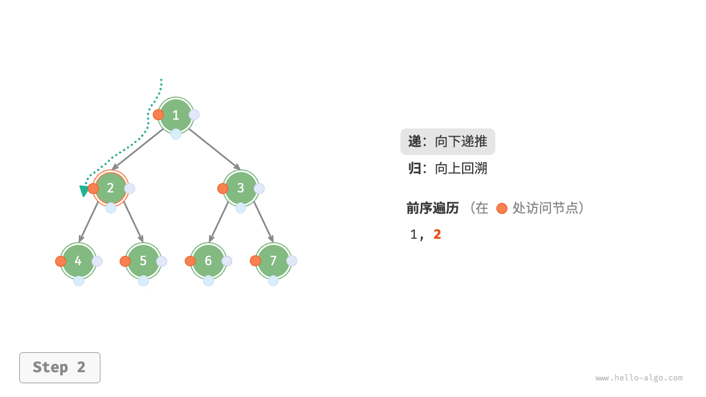

=== "<3>"
    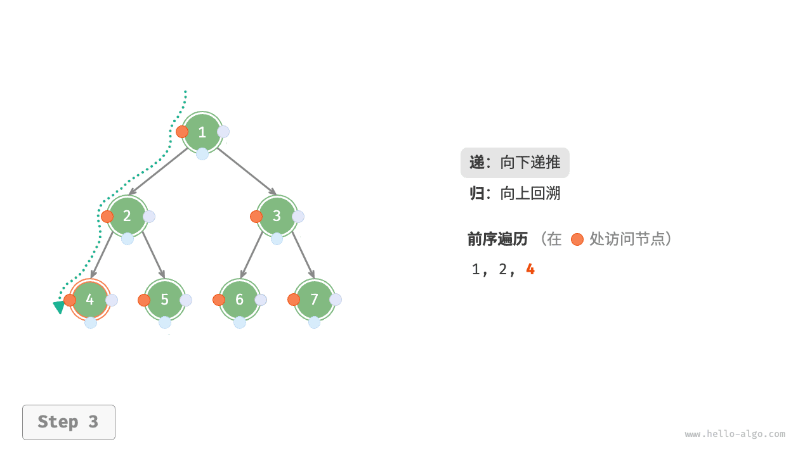

=== "<4>"
    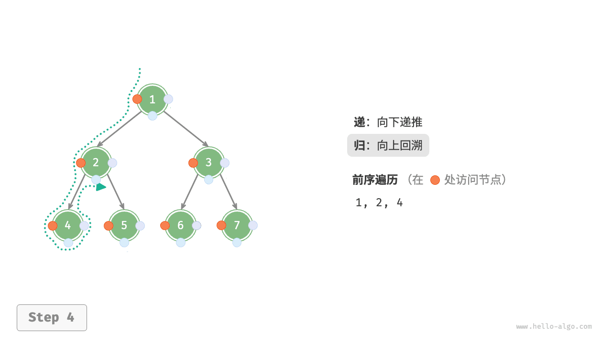

=== "<5>"
    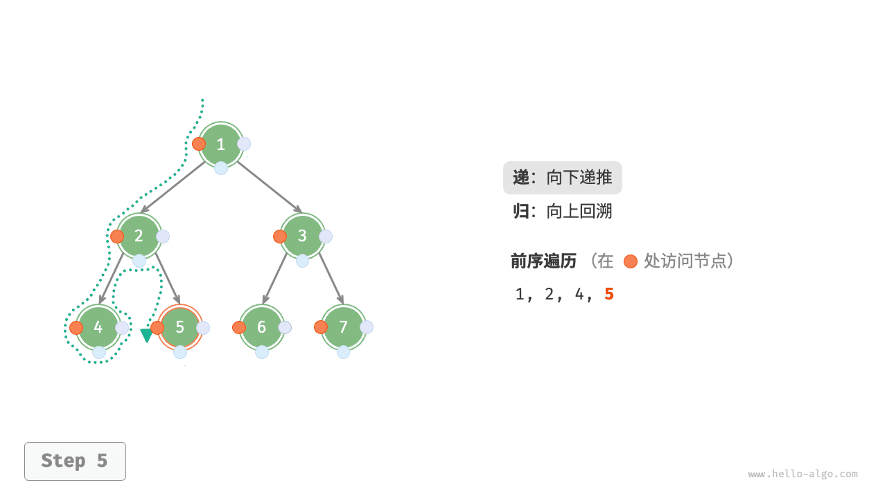

=== "<6>"
    

=== "<7>"
    

=== "<8>"
    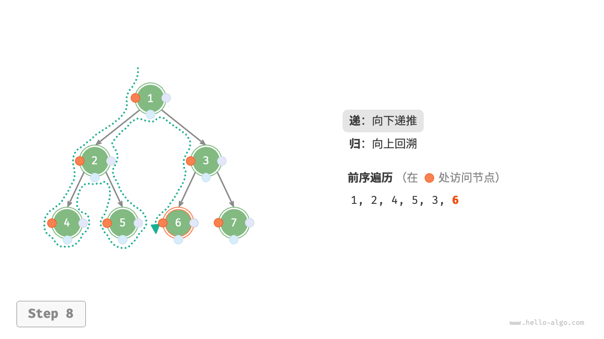

=== "<9>"
    

=== "<10>"
    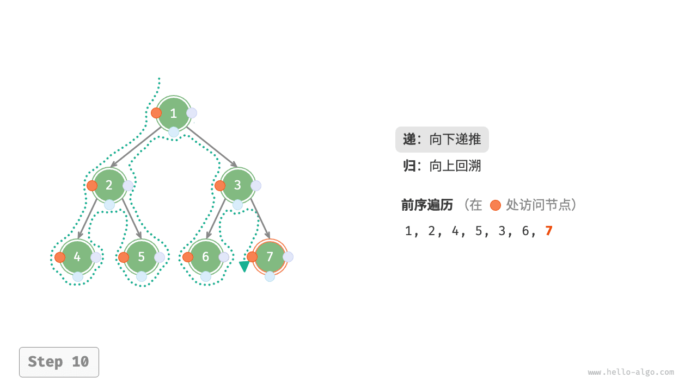

=== "<11>"
    

##### 复杂度分析

- **时间复杂度为 $O(n)$** ：所有节点被访问一次，使用 $O(n)$ 时间。
- **空间复杂度为 $O(n)$** ：在最差情况下，即树退化为链表时，递归深度达到 $n$ ，系统占用 $O(n)$ 栈帧空间。


### 1.3 编程题目more

力扣热题100中，有15个题目是二叉树相关，是比重最大的一类题目。


《算法笔记》配套晴问网站中，有46个题目是树相关，是比重最大的一类题目。


## 2 树的基本性质

### 2.1 $m$-叉树的性质

1. **<mark>总结点数</mark>**：设树中总的结点数为 $N$，则：
   $$
   N = N_0 + N_1 + N_2 + \dots + N_m
   $$
   其中 $N_0$ 表示度数为 0 的结点数（即叶结点），$N_1, N_2, \dots, N_m$ 分别表示度数为 1, 2, ..., $m$ 的结点数。

2. **<mark>总分支数</mark>**：在树中，每个度数为 $k$ 的结点贡献了 $ k $ 条分支。因此，树中的总分支数可以表示为：
   $$
   \text{总分支数} = 1 \cdot N_1 + 2 \cdot N_2 + \dots + m \cdot N_m
   $$

3. **树的总分支数与总结点数的关系**：对于一棵树，总分支数等于总结点数减去 1（因为除了根结点外，每个结点都由一条分支连接到其父结点）。因此：
   $$
   \text{总分支数} = N - 1
   $$

> 将以上关系结合起来，可以得到关于 $N_0$ 的方程。


<mark>对任何一棵非空二叉树，如果叶节点数 $n_0$，度为2的非叶节点数 $n_2$，则：</mark>

<mark>$n_0 = n_2 + 1$</mark>

> 在一棵二叉树中，除了度为0的叶子节点，就是度为1的节点和为2的节点，则树的总节点数为：
>
> $N = n_0 + n_1 + n_2$
>
> 在二叉树中节点总数为 $N$ 和边数之间的关系是：<mark>边数 = $N - 1$</mark>，所以有：
>
> $n_0 + n_1 + n_2 - 1 = 2n_2 + n_1$ 
>
> 最后得到：$n_0 = n_2 + 1$


#### 笔试填空@20240618

设一棵m叉树中有$N_1$个度数为1的结点（度数表示子结点个数），$N_2$个度数为2的结点，……，$N_m$个度数为m的结点，则该m叉树中共有$\underline{\hspace{4cm}}$个终端结点（即叶结点）。<mark>$ 1 + \sum_{i=2}^{m} (i-1) N_i $</mark>

> 从树的总结点数和总分支数两条性质出发：
>
> 1. 总分支数的两种表达式相等：
>    $$
>    1 \cdot N_1 + 2 \cdot N_2 + \dots + m \cdot N_m = N - 1
>    $$
>
> 2. 将 $N = N_0 + N_1 + N_2 + \dots + N_m$ 代入上式：
>    $$
>    1 \cdot N_1 + 2 \cdot N_2 + \dots + m \cdot N_m = (N_0 + N_1 + N_2 + \dots + N_m) - 1
>    $$
>
> 3. 化简后得到：
>    $$
>    N_0 = 1 + (0 \cdot N_0) + (1 \cdot N_1) + (2 \cdot N_2) + \dots + (m \cdot N_m) - (N_1 + N_2 + \dots + N_m)
>    $$
>
> 4. 合并同类项：
>    $$
>    N_0 = 1 + \sum_{k=1}^m (k - 1) N_k
>    $$
>
> ---
>
> **最终公式**
>
> 一棵 $m$-叉树中，叶结点的数量 $N_0$ 可以表示为：
> $$
> N_0 = 1 + \sum_{k=1}^m (k - 1) N_k
> $$
>
> 其中：
>
> - $N_k$ 是度数为 $k$ 的结点数；
> - $k - 1$ 表示每个度数为 $k$ 的结点对叶结点数量的贡献。


#### 笔试填空@20240618

设森林F中有4棵树，第1、2、3、4棵树的结点个数分别为10、9、11、7，当把森林F转换成一棵二叉树后，其根结点的右子树中有$\underline{\hspace{4cm}}$个结点。<mark>27</mark>

> 
>
> **森林转换为二叉树的规则**
>
> 1. **第一棵树的根结点**：森林中第一棵树的根结点成为二叉树的根结点。
> 2. **左子树**：每棵树的根结点的左子树是其在原树中的第一个子树。
> 3. **右子树**：每棵树的根结点的右子树是森林中下一棵树的根结点。
>
> 换句话说：
>
> - 第一棵树的根结点成为二叉树的根结点。
> - 第一棵树的子树构成二叉树根结点的左子树。
> - 第二棵树的根结点成为第一棵树根结点的右子树。
> - 第三棵树的根结点成为第二棵树根结点的右子树，依此类推。
>
> ---
>
> **分析题目**
>
> 森林 $ F $ 中有 4 棵树，分别包含 10、9、11、7 个结点。按照上述规则：
>
> - 第一棵树的根结点成为二叉树的根结点。
> - 第二棵树的根结点成为第一棵树根结点的右子树。
> - 第三棵树的根结点成为第二棵树根结点的右子树。
> - 第四棵树的根结点成为第三棵树根结点的右子树。
>
> 因此，二叉树根结点的右子树包含的是**第二、第三和第四棵树的所有结点**。


### 2.2 二叉树的性质


1. **每个节点最多有两个子节点**：

二叉树中每个节点最多有两个子节点，分别是“左子节点”和“右子节点”。

2. **二叉树的高度与深度**：

- **树的高度**：从根节点到叶子节点的最长路径的长度（即经过的边的数量）。空树的高度为-1，只有一个节点时树的高度为0。
- **节点的深度**：从根节点到该节点的路径长度（即经过的边的数量）。根节点的深度为0，其他节点的深度是其父节点的深度加1。

3. **二叉树的节点数**：

- 对于一般二叉树，节点数目是有限的，可以通过遍历计算。

4. **满二叉树**：

- 满二叉树是一种特殊的二叉树，其中每一层的节点数都达到最大值（即每个非叶子节点都有两个子节点）。假设树的高度为h，则满二叉树的节点数为 `2^(h+1) - 1`。

5. **完全二叉树**：

- 完全二叉树是一种特殊的二叉树，其中每一层的节点都被完全填满，且最底层的节点集中在左边。如果一个完全二叉树有n个节点，那么它的高度为 `log2(n)`（向下取整）。

6. **叶子节点和非叶子节点**：

- **叶子节点**：没有子节点的节点。
- **非叶子节点**：有一个或两个子节点的节点。

7. **二叉树的遍历方式**：

- **前序遍历**（Pre-order）：根节点 -> 左子树 -> 右子树
- **中序遍历**（In-order）：左子树 -> 根节点 -> 右子树
- **后序遍历**（Post-order）：左子树 -> 右子树 -> 根节点
- **层序遍历**（Level-order）：从上到下、从左到右逐层访问节点。

8. **二叉树的平衡性**：

- 如果一个二叉树的左右子树的高度差的绝对值大于1，那么这个二叉树就是**不平衡的**。如果一个二叉树在任何时刻都满足左右子树高度差不超过1，那么它就是**平衡二叉树**。

这些性质是理解二叉树结构的基础，有助于设计和优化基于二叉树的算法，比如二叉查找树、平衡树等。


#### 笔试选择@20240618

Q. 定义一棵没有1度结点的二叉树为满二叉树。对于一棵包含k个结点的满二叉树，其叶子结点的个数为（ <mark>C</mark>  ）。
A.   ⌊k/2⌋   B. ⌊k/2⌋-1  C.⌊k/2⌋+1   D.以上三个都有可能


#### 笔试填空@20230620

Q. 定义二叉树中一个结点的度数为其子结点的个数。现有一棵结点总数为 101 的二叉树，其中度数为 1 的结点数有 30 个，则度数为 0 结点有 _ _ _ _ 个。

> 推导过程
>
> 1. 根据总结点数公式：
>    $N = N_0 + N_1 + N_2$
>    将已知值代入：
>    $101 = N_0 + 30 + N_2$
>    化简得：
>    $$
>    N_0 + N_2 = 71 \tag{1}
>    $$
>
> 2. 根据总分支数公式：
>    $N_1 + 2N_2 = N - 1$
>    将已知值代入：
>    $30 + 2N_2 = 101 - 1$
>    化简得：
>    $$
>    2N_2 = 70 \quad \Rightarrow \quad N_2 = 35 \tag{2}
>    $$
>
> 3. 将 $ N_2 = 35 $ 代入 (1) 式：
>    $N_0 + 35 = 71$
>    化简得：
>    $N_0 = 36$
>
> <mark>36</mark>


#### 笔试填空@20230620

Q. 定义完全二叉树的根结点所在层为第一层。如果一个完全二叉树的第六层有 23 个叶结点，则它的总结点数可能为 _ _ _ _ （请填写所有 3 个可能的结点数，写对 1 个得 1 分，2 个得 1.5 分，写 错 1 个不得分）。

> 54，是 1+2+4+8+16+23= 54
>
> 在完全二叉树中，除了最底层，其他每一层的节点都是满的。在最底层，从左往右填充节点。
>
> 可以是第六层是满的。但是叶节点只有23个，还有9个结点是非叶结点。这样第七层要么是17个节点要么是18个。(1+2+4+8+16+32) + 17 或 18 = 80，或 81
>
> <mark>54,80,81</mark>


