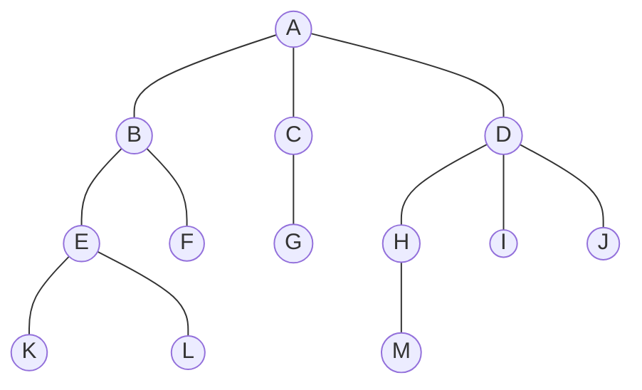

# 一叶障目

## 2 树的表示方法Representation

https://blog.csdn.net/qq_41891805/article/details/104473065

2020-02-24

树是n (n>=0) 个结点的有限集。在任意一棵非空树中：
（1）有且仅有一个根结点；（2）除根结点外，其余的结点可分为m (m>=0) 个互不相交的子树。


**树的表示方法包括**

### 2.1 嵌套括号表示法 

Nested parentheses representation 是一种表示树结构的方法，通过括号的嵌套来表示树的层次关系。

先将根结点放入一对圆括号中，然后把它的子树按由左而右的顺序放入括号中，而对子树也采用同样方法处理：同层子树与它的根结点用圆括号括起来，同层子树之间用逗号隔开，最后用闭括号括起来。例如下图可写成如下形式
$(a(b,c,d,e))$
    a
/ | | \
b c d e


#### 练习T27637:括号嵌套二叉树

dfs, stack, http://cs101.openjudge.cn/practice/27637

可以用括号嵌套的方式来表示一棵二叉树。

方法如下：

`*`表示空的二叉树。如果一棵二叉树只有一个结点，则该树就用一个非`*`字符表示，代表其根结点。

如果一棵二叉左右子树都非空，则用“树根(左子树,右子树)”的形式表示。树根是一个非'*'字符，左右子树之间用逗号隔开，没有空格。左右子树都用括号嵌套法表示。

如果左子树非空而右子树为空，则用`树根(左子树,*)`形式表示；如果左子树为空而右子树非空，则用<mark>`树根(*,右子树)`</mark>形式表示。

给出一棵树的括号嵌套表示形式，请输出其前序遍历序列、中序遍历序列、后序遍历序列。例如，`A(B(*,C),D(E))`表示的二叉树如图所示


输入

第一行是整数n表示有n棵二叉树(n<100) 接下来有n行，每行是1棵二叉树的括号嵌套表示形式

输出

对每棵二叉树，输出其前序遍历序列和中序遍历序列

样例输入

```
2
A
A(B(*,C),D(E,*))
```

样例输出

```
A
A
ABCDE
BCAED
```

来源：改编自 http://dsbpython.openjudge.cn/dspythonbook/P0680/


将输入的括号嵌套形式转换成二叉树，然后实现了前序和中序遍历。

```python
class TreeNode:
    def __init__(self, value):
        self.value = value
        self.left = None
        self.right = None


def parse_tree(s):
    """ 解析括号嵌套格式的二叉树 """
    if s == '*':  # 处理空树
        return None
    if '(' not in s:  # 只有单个根节点
        return TreeNode(s)

    root_value = s[0]  # 根节点值
    subtrees = s[2:-1]  # 去掉根节点和外层括号

    # 使用栈找到逗号位置
    stack = []
    comma_index = None
    for i, char in enumerate(subtrees):
        if char == '(':
            stack.append(char)
        elif char == ')':
            stack.pop()
        elif char == ',' and not stack:
            comma_index = i
            break

    left_subtree = subtrees[:comma_index] if comma_index is not None else subtrees
    right_subtree = subtrees[comma_index + 1:] if comma_index is not None else None

    root = TreeNode(root_value)
    root.left = parse_tree(left_subtree)  # 解析左子树
    root.right = parse_tree(right_subtree) if right_subtree else None  # 解析右子树
    return root


def preorder_traversal(root):
    """前序遍历：根 -> 左 -> 右"""
    return root.value + preorder_traversal(root.left) + preorder_traversal(root.right) if root else ""


def inorder_traversal(root):
    """中序遍历：左 -> 根 -> 右"""
    return inorder_traversal(root.left) + root.value + inorder_traversal(root.right) if root else ""


# 读取输入
n = int(input().strip())  
results = []

for _ in range(n):
    tree_string = input().strip().replace(" ", "")  # 去掉可能的空格
    tree = parse_tree(tree_string)
    results.append(preorder_traversal(tree))
    results.append(inorder_traversal(tree))

print("\n".join(results))  # 按格式输出

```


优化后的版本（支持无括号单节点、自动跳过空树、递归清晰且无多余判断）。
**优化思路**

1. **字符流式解析**  
    不再多次切片字符串，而是用一个**指针（索引）**在字符串中递归推进。  
    这样可以避免反复创建子串（`O(n²)` → `O(n)`），在长输入下效率明显提升。
    
2. **结构清晰化**  
    将解析逻辑封装成 `parse()` 内嵌函数（带索引控制），更直观。
    
3. **遍历统一处理**  
    避免递归时频繁拼接字符串，用 `list` 收集结果后 `''.join()` 输出，更快。
    
4. **容错改进**  
    自动忽略右子树缺省、星号、空括号等特殊情况。
    

**优化版代码**（精简高效 + O(n) 解析）

```python
class TreeNode:
    __slots__ = ("val", "left", "right")
    def __init__(self, val):
        self.val = val
        self.left = None
        self.right = None


def parse_tree(s):
    """将括号嵌套形式解析为二叉树，使用流式指针解析避免重复切片"""
    i = 0
    n = len(s)

    def parse():
        nonlocal i
        if i >= n or s[i] == '*':
            i += 1  # 跳过空树符号
            return None

        node = TreeNode(s[i])
        i += 1

        if i < n and s[i] == '(':
            i += 1  # 跳过 '('
            node.left = parse()  # 左子树
            if i < n and s[i] == ',':
                i += 1  # 跳过 ','
                node.right = parse()  # 右子树
            if i < n and s[i] == ')':
                i += 1  # 跳过 ')'
        return node

    return parse()


def preorder(root):
    res = []
    def dfs(node):
        if not node: return
        res.append(node.val)
        dfs(node.left)
        dfs(node.right)
    dfs(root)
    return ''.join(res)


def inorder(root):
    res = []
    def dfs(node):
        if not node: return
        dfs(node.left)
        res.append(node.val)
        dfs(node.right)
    dfs(root)
    return ''.join(res)


# 主程序
if __name__ == "__main__":
    n = int(input().strip())
    for _ in range(n):
        s = input().strip().replace(" ", "")
        tree = parse_tree(s)
        print(preorder(tree))
        print(inorder(tree))
```
**优点总结**

| 优化项   | 原实现         | 优化后                       |
| ----- | ----------- | ------------------------- |
| 解析复杂度 | O(n²)（切片多次） | O(n)（指针推进）                |
| 递归逻辑  | 需要查找逗号、维护栈  | 自动语法驱动，简洁直观               |
| 拼接性能  | 字符串相加       | `list.append + ''.join()` |
| 可读性   | 多层嵌套逻辑      | 层次清晰、容易扩展                 |


### 2.2 树形表示

<mark>Node-Based</mark> or Node-Link structure
In computer science, a general tree is typically represented using this data structure. Each node in the tree contains information and references (links) to its child nodes.



> 它的嵌套括号表示为：
>
> $(A(B(E(K,L),F),C(G),D(H(M),I,J))$​
>


#### 练习M08581: 扩展二叉树

http://cs101.openjudge.cn/practice/08581/

由于先序、中序和后序序列中的任一个都不能唯一确定一棵二叉树，所以对二叉树做如下处理，将二叉树的空结点用·补齐，如图所示。我们把这样处理后的二叉树称为原二叉树的扩展二叉树，扩展二叉树的先序和后序序列能唯一确定其二叉树。 现给出扩展二叉树的先序序列，要求输出其中序和后序序列。


**输入**

扩展二叉树的先序序列（全部都由大写字母或者.组成）

**输出**

第一行：中序序列
第二行：后序序列

样例输入

```
ABD..EF..G..C..
```

样例输出

```
DBFEGAC
DFGEBCA
```


通过递归方法解析扩展二叉树的先序序列，并输出其中序和后序序列：

```python
class Node:
    def __init__(self, val):
        self.val = val
        self.left = None
        self.right = None

def build_tree(s, index):
    # 如果当前字符为'.'，表示空结点，返回None，并将索引后移一位
    if s[index] == '.':
        return None, index + 1
    # 否则创建一个结点
    node = Node(s[index])
    index += 1
    # 递归构造左子树
    node.left, index = build_tree(s, index)
    # 递归构造右子树
    node.right, index = build_tree(s, index)
    return node, index

def inorder(node, res):
    if node is None:
        return
    inorder(node.left, res)
    res.append(node.val)
    inorder(node.right, res)

def postorder(node, res):
    if node is None:
        return
    postorder(node.left, res)
    postorder(node.right, res)
    res.append(node.val)

def main():
    s = input().strip()
    root, _ = build_tree(s, 0)
    
    in_res = []
    inorder(root, in_res)
    
    post_res = []
    postorder(root, post_res)
    
    print("".join(in_res))
    print("".join(post_res))

if __name__ == '__main__':
    main()
```

代码说明

- **build_tree 函数**  
  递归地根据扩展二叉树的先序序列构造二叉树：  
  - 当遇到 `'.'` 时表示空结点，直接返回 `None`。  
  - 否则以当前字符创建一个结点，然后递归构造其左子树和右子树。

- **inorder 和 postorder 函数**  
  分别实现中序遍历（左-根-右）和后序遍历（左-右-根）。

- **main 函数**  
  读取输入字符串，构造树后计算中序和后序遍历结果，并输出。  


### 2.3 文氏图

Venn diagram

Venn图是在所谓的集合论（或者类的理论）数学分支中，在不太严格的意义下用以表示集合（或类）的一种草图。


### 2.4 凹入表

Indented Tree Representation


#### 练习T02775: 文件结构“图”

http://cs101.openjudge.cn/practice/02775/

在计算机上看到文件系统的结构通常很有用。Microsoft Windows上面的"explorer"程序就是这样的一个例子。但是在有图形界面之前，没有图形化的表示方法的，那时候最好的方式是把目录和文件的结构显示成一个"图"的样子，而且使用缩排的形式来表示目录的结构。比如：


```
ROOT
|     dir1
|     file1
|     file2
|     file3
|     dir2
|     dir3
|     file1
file1
file2
```

这个图说明：ROOT目录包括三个子目录和两个文件。第一个子目录包含3个文件，第二个子目录是空的，第三个子目录包含一个文件。

**输入**

你的任务是写一个程序读取一些测试数据。每组测试数据表示一个计算机的文件结构。每组测试数据以`*`结尾，而所有合理的输入数据以`#`结尾。一组测试数据包括一些文件和目录的名字（虽然在输入中我们没有给出，但是我们总假设ROOT目录是最外层的目录）。在输入中,以`]`表示一个目录的内容的结束。目录名字的第一个字母是'd'，文件名字的第一个字母是`f`。文件名可能有扩展名也可能没有（比如`fmyfile.dat`和`fmyfile`）。文件和目录的名字中都不包括空格,长度都不超过30。一个目录下的子目录个数和文件个数之和不超过30。

**输出**

在显示一个目录中内容的时候，先显示其中的子目录（如果有的话），然后再显示文件（如果有的话）。<u>文件要求按照名字的字母表的顺序显示</u>（目录不用按照名字的字母表顺序显示，只需要按照目录出现的先后显示）。对每一组测试数据，我们要先输出`DATA SET x:`，这里`x`是测试数据的编号（从1开始）。在两组测试数据之间要输出一个空行来隔开。

你需要注意的是，我们使用一个`|`和5个空格来表示出缩排的层次。

样例输入

```
file1
file2
dir3
dir2
file1
file2
]
]
file4
dir1
]
file3
*
file2
file1
*
#
```

样例输出

```
DATA SET 1:
ROOT
|     dir3
|     |     dir2
|     |     file1
|     |     file2
|     dir1
file1
file2
file3
file4

DATA SET 2:
ROOT
file1
file2
```

提示

一个目录和它的子目录处于不同的层次
一个目录和它的里面的文件处于同一层次

来源

翻译自 Pacific Northwest 1998 的试题


比较复杂的一道题目，首先是输入数据的处理就比较困难，需要先全部存储到tests中再逐行处理。构建文件树的过程中，需要一个stack存储待处理的目录，遇到 “ ] ” 就弹出栈顶取出下一 个待处理目录，file直接存入当前目录，<mark>dir则存入当前目录的同时压入栈中</mark>。<mark>输出时，则需要 记录当前层数</mark>，按照层数输出前缀，并且目录理论上比文件要更深一层。

标准的 DFS 树结构构建 + 递归打印的写法。

```python
class Node:
    __slots__ = ('name', 'dirs', 'files')
    def __init__(self, name):
        self.name = name
        self.dirs = []
        self.files = []

def print_tree(node, depth=0):
    prefix = '|     ' * depth
    print(prefix + node.name)
    for d in node.dirs:               # 子目录按出现顺序
        print_tree(d, depth + 1)
    for f in sorted(node.files):      # 文件按字母序
        print(prefix + f)

def parse_dataset(lines):
    root = Node('ROOT')
    stack = [root]
    for s in lines:
        if s[0] == 'd':               # 目录
            new_dir = Node(s)
            stack[-1].dirs.append(new_dir)
            stack.append(new_dir)
        elif s[0] == 'f':             # 文件
            stack[-1].files.append(s)
        elif s == ']':                # 目录结束
            stack.pop()
    return root

def main():
    datasets, current = [], []
    while True:
        try:
            s = input().strip()
        except EOFError:
            break
        if s == '#':
            if current:
                datasets.append(current)
            break
        elif s == '*':
            datasets.append(current)
            current = []
        else:
            current.append(s)

    for i, data in enumerate(datasets, 1):
        print(f'DATA SET {i}:')
        print_tree(parse_dataset(data))
        print()

if __name__ == "__main__":
    main()
```

**更轻量的类定义**
    
    - 使用 `__slots__` 节省内存，避免动态属性创建。


### 2.5 邻接表表示法

邻接表表示法（Adjacency List Representation）是一种常见的树的表示方法，特别<mark>适用于表示稀疏树</mark>（树中节点的度数相对较小）。<mark>适用于多叉树</mark>。

在邻接表表示法中，<mark>使用一个数组来存储树的节点，数组中的每个元素对应一个节点。对于每个节点，使用链表或数组等数据结构来存储它的子节点。</mark>

下面是一个示例，展示了如何使用邻接表表示法表示一个树：

假设我们有以下树的结构：

```
       A
     / | \
    B  C  D
   / \    \
  E   F    G
       \
        H
```

使用邻接表表示法，我们可以得到如下的表示：

```
A: ['B', 'C', 'D']
B: ['E', 'F']
E: []
F: ['H']
H: []
C: []
D: ['G']
G: []
```

在这个示例中，每个节点用一个数组来表示，数组的索引对应节点的标识。数组中的每个元素是一个链表，存储了该节点的子节点。

这种表示方法可以有效地存储树的结构，并且可以快速地查找和访问节点的子节点。

```python
class TreeNode:
    def __init__(self, value):
        self.value = value
        self.children = []

def build_tree():
    # 创建树节点
    root = TreeNode('A')
    node_b = TreeNode('B')
    node_c = TreeNode('C')
    node_d = TreeNode('D')
    node_e = TreeNode('E')
    node_f = TreeNode('F')
    node_g = TreeNode('G')
    node_h = TreeNode('H')

    # 构建树的结构
    root.children.extend([node_b, node_c, node_d])
    node_b.children.extend([node_e, node_f])
    node_d.children.append(node_g)
    node_f.children.append(node_h)

    return root

def print_tree_adjacency_list(root):
    adjacency_list = {}

    # 递归构建邻接表
    def build_adjacency_list(node):
        adjacency_list[node.value] = [child.value for child in node.children]
        for child in node.children:
            build_adjacency_list(child)

    # 构建并打印邻接表
    build_adjacency_list(root)
    for node, children in adjacency_list.items():
        print(f"{node}: {children}")

# 构建树
root_node = build_tree()

# 打印邻接表表示的树
print_tree_adjacency_list(root_node)

"""
A: ['B', 'C', 'D']
B: ['E', 'F']
E: []
F: ['H']
H: []
C: []
D: ['G']
G: []
"""
```


邻接表，不陌生。

**18182: 打怪兽**，data structures, http://cs101.openjudge.cn/practice/18182/

用字典模拟邻接表，存储相同时刻的技能。

**E23555: 节省存储的矩阵乘法**

matrices, https://cs101.openjudge.cn/pctbook/E23555/


#### 练习M07161: 森林的带度数层次序列存储

dfs + bfs, http://cs101.openjudge.cn/practice/07161/

对于树和森林等非线性结构，我们往往需要将其序列化以便存储。有一种树的存储方式称为带度数的层次序列。我们可以通过层次遍历的方式将森林序列转化为多个带度数的层次序列。

例如对于以下森林：


两棵树的层次遍历序列分别为：C E F G K H J / D X I

每个结点对应的度数为：3 3 0 0 0 0 0 / 2 0 0

我们将以上序列存储起来，就可以在以后的应用中恢复这个森林。在存储中，我们可以将第一棵树表示为C 3 E 3 F 0 G 0 K 0 H 0 J 0，第二棵树表示为D 2 X 0 I 0。


现在有一些通过带度数的层次遍历序列存储的森林数据，为了能够对这些数据进行进一步处理，首先需要恢复他们。


**输入**

输入数据的第一行包括一个正整数n，表示森林中非空的树的数目。
随后的 n 行，每行给出一棵树的带度数的层次序列。
树的节点名称为A-Z的单个大写字母。

**输出**

输出包括一行，输出对应森林的后根遍历序列。

样例输入

```
2
C 3 E 3 F 0 G 0 K 0 H 0 J 0
D 2 X 0 I 0
```

样例输出

```
K H J E F G C X I D
```


07161: 森林的带度数层次序列存储 是 DFS + BFS 结合的题目。
利用队列根据“带度数的层次序列”构造树，然后进行后根遍历。代码如下：

```python
from collections import deque
import sys

# 定义树的结点
class Node:
    def __init__(self, value, degree):
        self.value = value
        self.degree = degree
        self.children = []

# 根据带度数的层次序列构造树
def build_tree(tokens):
    # tokens 的格式：[字母, 度数, 字母, 度数, ...]
    # 第一个结点为根
    root = Node(tokens[0], int(tokens[1]))
    queue = deque([root])
    index = 2  # 下一个待处理的token索引
    while queue and index < len(tokens):
        current = queue.popleft()
        # current.degree 个孩子依次出现在 tokens 中
        for _ in range(current.degree):
            # 每个孩子由两个元素构成：字母和度数
            child = Node(tokens[index], int(tokens[index+1]))
            current.children.append(child)
            queue.append(child)
            index += 2
    return root

# 后根遍历（后序遍历）：先遍历所有子树，再访问根节点
def postorder(node, output):
    for child in node.children:
        postorder(child, output)
    output.append(node.value)

def main():
    input_lines = sys.stdin.read().splitlines()
    if not input_lines:
        return
    n = int(input_lines[0].strip())
    result = []
    # 对于每一棵树进行构造并后序遍历
    for i in range(1, n+1):
        # 将一行的内容按空格分割
        tokens = input_lines[i].split()
        if not tokens:
            continue
        root = build_tree(tokens)
        temp = []
        postorder(root, temp)
        result.extend(temp)
    # 输出时以空格分隔各个结点
    print(" ".join(result))

if __name__ == "__main__":
    main()
```


#### 练习M24729: 括号嵌套树

http://cs101.openjudge.cn/practice/24729/

可以用括号嵌套的方式来表示一棵树。表示方法如下：

1) 如果一棵树只有一个结点，则该树就用一个大写字母表示，代表其根结点。
2) 如果一棵树有子树，则用“树根(子树1,子树2,...,子树n)”的形式表示。树根是一个大写字母，子树之间用逗号隔开，没有空格。子树都是用括号嵌套法表示的树。

给出一棵不超过26个结点的树的括号嵌套表示形式，请输出其前序遍历序列和后序遍历序列。

输入样例代表的树如下图：


**输入**

一行，一棵树的括号嵌套表示形式

**输出**

两行。第一行是树的前序遍历序列，第二行是树的后序遍历序列


样例输入

```
A(B(E),C(F,G),D(H(I)))
```

样例输出

```
ABECFGDHI
EBFGCIHDA
```

来源：Guo Wei


主要步骤：

1. **解析括号嵌套表示**：用栈来构建树结构，每次遇到字母创建节点，遇到 `)` 弹出栈顶节点表示子树结束。
2. **前序遍历**：根节点 -> 依次遍历子节点。
3. **后序遍历**：依次遍历子节点 -> 根节点。

下面两个代码。先给出用类表示node

```python
class TreeNode:
    def __init__(self, value): #类似字典
        self.value = value
        self.children = []

def parse_tree(s):
    stack = []
    node = None
    for char in s:
        if char.isalpha():  # 如果是字母，创建新节点
            node = TreeNode(char)
            if stack:  # 如果栈不为空，把节点作为子节点加入到栈顶节点的子节点列表中
                stack[-1].children.append(node)
        elif char == '(':  # 遇到左括号，当前节点可能会有子节点
            if node:
                stack.append(node)  # 把当前节点推入栈中
                node = None
        elif char == ')':  # 遇到右括号，子节点列表结束
            if stack:
                node = stack.pop()  # 弹出当前节点
    return node  # 根节点


def preorder(node):
    output = [node.value]
    for child in node.children:
        output.extend(preorder(child))
    return ''.join(output)

def postorder(node):
    output = []
    for child in node.children:
        output.extend(postorder(child))
    output.append(node.value)
    return ''.join(output)

# 主程序
def main():
    s = input().strip()
    s = ''.join(s.split())  # 去掉所有空白字符
    root = parse_tree(s)  # 解析整棵树
    if root:
        print(preorder(root))  # 输出前序遍历序列
        print(postorder(root))  # 输出后序遍历序列
    else:
        print("input tree string error!")

if __name__ == "__main__":
    main()
```


用字典表示node

```python
def parse_tree(s):
    stack = []
    node = None
    for char in s:
        if char.isalpha():  # 如果是字母，创建新节点
            node = {'value': char, 'children': []}
            if stack:  # 如果栈不为空，把节点作为子节点加入到栈顶节点的子节点列表中
                stack[-1]['children'].append(node)
        elif char == '(':  # 遇到左括号，当前节点可能会有子节点
            if node:
                stack.append(node)  # 把当前节点推入栈中
                node = None
        elif char == ')':  # 遇到右括号，子节点列表结束
            if stack:
                node = stack.pop()  # 弹出当前节点
    return node  # 根节点


def preorder(node):
    output = [node['value']]
    for child in node['children']:
        output.extend(preorder(child))
    return ''.join(output)

def postorder(node):
    output = []
    for child in node['children']:
        output.extend(postorder(child))
    output.append(node['value'])
    return ''.join(output)

# 主程序
def main():
    s = input().strip()
    s = ''.join(s.split())  # 去掉所有空白字符
    root = parse_tree(s)  # 解析整棵树
    if root:
        print(preorder(root))  # 输出前序遍历序列
        print(postorder(root))  # 输出后序遍历序列
    else:
        print("input tree string error!")

if __name__ == "__main__":
    main()
```


#### 练习M27928:遍历树

dfs + sortings, http://cs101.openjudge.cn/practice/27928/

请你对输入的树做遍历。遍历的规则是：遍历到每个节点时，按照该节点和所有子节点的值从小到大进行遍历，例如：

```
        7
    /   |   \
  10    3     6
```

对于这个树，你应该先遍历值为3的子节点，然后是值为6的子节点，然后是父节点7，最后是值为10的子节点。

本题中每个节点的值为互不相同的正整数，最大不超过9999999。

输入

第一行：节点个数n (n<500)

接下来的n行：第一个数是此节点的值，之后的数分别表示它的所有子节点的值。每个数之间用空格隔开。如果没有子节点，该行便只有一个数。

输出

输出遍历结果，一行一个节点的值。

样例输入

```
sample1 input:
4
7 10 3 6
10
6
3

sample1 output:
3
6
7
10
```

样例输出

```
sample2 input:
6
10 3 1
7
9 2 
2 10
3 7
1

sample2 output:
2
1
3
7
10
9
```

来源：2024spring zht


总体思路分为三步：1.通过字典建立输入数据的父子关系；2.找到树的根（这里我将父节点和子节点分别用两个列表记录，最后使用集合减法）；3.通过递归实现要求的从小到大遍历。


```python
from collections import defaultdict
import sys
sys.setrecursionlimit(10000)

def main():
    n = int(sys.stdin.readline())
    tree = defaultdict(list)
    all_nodes = set()
    child_nodes = set()
    
    for _ in range(n):
        parts = list(map(int, sys.stdin.readline().split()))
        parent, *children = parts
        tree[parent].extend(children)
        all_nodes.add(parent)
        all_nodes.update(children)
        child_nodes.update(children)
    
    # 根节点 = 出现在 all_nodes 但没出现在 child_nodes 的那个
    root = (all_nodes - child_nodes).pop()
    
    def traverse(u):
        # 把 u 自己和它的所有直接孩子放一起排序
        group = tree[u] + [u]
        group.sort()
        for x in group:
            if x == u:
                print(u)
            else:
                traverse(x)
    
    traverse(root)

if __name__ == "__main__":
    main()

```


#### Height of a generic tree from parent array

https://www.geeksforgeeks.org/height-generic-tree-parent-array/

Last Updated : 01 Nov, 2024

给定一棵**大小为 n**的树，以数组 `parent[0..n-1]` 的形式表示，其中 `parent[]` 中的每个索引 `i` 代表一个节点，而 `i` 处的值表示该节点的**直接父节点**。对于根节点，其值为 **-1**。 <mark>根据给定的父节点链接，求这棵通用树的**高度**。</mark>

> Given a tree of **size n** as array `parent[0..n-1]` where every index `i` in the `parent[]` represents a node and the value at `i` represents the **immediate parent** of that node. For root, the node value will be **-1**. <mark>Find the **height** of the generic tree given the parent links.</mark>
>

**Examples:** 

> ```
> Input : parent[] = [-1, 0, 0, 0, 3, 1, 1, 2]
> Output : 2
> ```
>
> 
>
> ```
> Input  : parent[] = [-1, 0, 1, 2, 3]
> Output : 4
> ```
>
> 
>
> 
>
> 
>
> Here, a **generic tree** is sometimes also called an N-ary tree or N-way tree where N denotes the maximum number of child a node can have. In this problem, the array represents n number of nodes in the tree.


朴素的方法是从**节点**向上**遍历**树，直到到达值为 **-1** 的**根节点**。在遍历每个节点时，记录**最大路径长度**。该解决方案的时间复杂度为 $O(n^2)$。

> The naive approach is to **traverse** up the tree from the **node** till the **root node** is reached with node **value -1**. While Traversing for each node stores **maximum path length**. The Time Complexity of this solution is $O(n^2)$.
>


**[Expected Approach – 1] Using BFS – O(n) Time and O(n) Space**

> Build **graph** for **N-ary Tree in O(n)** time and apply **BFS** on the stored graph in **O(n)** time and while doing BFS store **maximum reached level.** This solution does **two iterations** to find the **height** of N-ary tree.

**Implementation:**

```python
# find height of N-ary tree in O(n)
from collections import deque

MAX = 1001
adj = [[] for i in range(MAX)] # Adjacency list to store N-ary tree

def build_tree(arr, n): # Build tree in tree in O(n)
    root_index = 0

    for i in range(n):
        if (arr[i] == -1): # if root node, store index
            root_index = i
        else:
            adj[i].append(arr[i])	# 子 -> 父
            adj[arr[i]].append(i)	# 父 -> 子

    return root_index


def BFS(start):
    vis = {} # map is used as visited array

    q = deque()
    max_level_reached = 0

    q.append([start, 0]) # height of root node is zero

    # p[0] denotes node in adjacency list
    # p[1] denotes level of p[0]
    p = []

    while (len(q) > 0):
        p = q.popleft()
        vis[p[0]] = 1

        max_level_reached = max(max_level_reached, p[1])

        for i in range(len(adj[p[0]])):
            if (adj[p[0]][i] not in vis):
                q.append([adj[p[0]][i], p[1] + 1]) # adding 1 to pre_level

    return max_level_reached


# Driver code
if __name__ == '__main__':
    parent = [-1, 0, 1, 2, 3] # node 0 to node n-1
    n = len(parent) # Number of nodes in tree

    root_index = build_tree(parent, n)
    ma = BFS(root_index)
    print("Height of N-ary Tree =", ma)

# output: Height of N-ary Tree = 4

```

> **建无向边是为了“懒”——省去显式找子节点的步骤，靠 BFS 的 `vis` 来控制方向。**

**Time Complexity:** O(n) which converges to O(n) for very large n.
**Auxiliary Space:** O(n), we are using an <mark>adjacency list</mark> to store the tree in memory. The size of the adjacency list is proportional to the number of nodes in the tree, so the space complexity of the algorithm is O(n).


**[Expected Approach – 2\] Without using map – O(n) Time and O(n) Space**

我们可以在**一次迭代**中找到**N叉树**的**高度**。我们以迭代方式访问从**0 到 n-1**的所有节点，并递归地标记那些尚未被访问过的**祖先节点**，直到到达一个已被访问过的节点，或者到达**根节点**。<mark>如果在通过父节点链接向上遍历树时遇到一个已访问过的节点，那么我们会使用它的**高度**，并停止进一步的递归。</mark>

> We can find the **height** of the **N-ary Tree** in only one **iteration**. We visit nodes from **0 to n-1** iteratively and mark the unvisited **ancestors** recursively if they are not visited before till we reach a node which is visited, or we reach the **root** node. If we reach the visited node while traversing up the tree using parent links, then we use its **height** and will not go further in recursion.

```python
# find height of N-ary tree in O(n) (Efficient Approach)

# Recur For Ancestors of node and store height of node at last
def fillHeight(p, node, visited, height):
    if (p[node] == -1):  # If root node
        visited[node] = 1  # mark root node as visited
        return 0

    if (visited[node]):
        return height[node]

    visited[node] = 1

    # recur for the parent node
    height[node] = 1 + fillHeight(p, p[node], visited, height)

    # return calculated height for node
    return height[node]


def findHeight(parent):
    n = len(parent)
    maxHeight = 0
    visited = [0] * n
    height = [0] * n

    for i in range(n):
        if (not visited[i]):
            height[i] = fillHeight(parent, i, visited, height)

        maxHeight = max(maxHeight, height[i])

    return maxHeight


if __name__ == '__main__':
    parent = [-1, 0, 0, 0, 3, 1, 1, 2]
    n = len(parent)

    print(findHeight(parent))

# 2

```

**Time Complexity:** O(n)
**Auxiliary Space**: O(n), this is because we need to store the visited and height arrays which are of size n.


#### General Tree Level Order Traversal层序遍历

https://www.geeksforgeeks.org/generic-tree-level-order-traversal/

Last Updated : 14 Mar, 2023

<mark>树的遍历，除了前序、中序、后序，还有一个是层序遍历，就是使用队列的bfs方式。</mark>

Given a generic tree, perform a Level order traversal and print all of its nodes

**Examples:** 

```
Input :            10
             /   /    \   \
            2  34    56   100
           / \        |   / | \
          77  88      1   7  8  9

Output : 10
         2 34 56 100
         77 88 1 7 8 9

Input :             1
             /   /    \   \
            2  3      4    5
           / \        |  /  | \
          6   7       8 9  10  11
Output : 1
         2 3 4 5
         6 7 8 9 10 11
```

The approach to this problem is similar to [Level Order traversal in a binary tree](https://www.geeksforgeeks.org/level-order-tree-traversal/). We Start with pushing root node in a queue and for each node we pop it, print it and push all its child in the queue.

In case of a generic tree we store child nodes in a vector. Thus we put all elements of the vector in the queue. 

> 实现代码，我做了部分调整，主要是用deque

```python
# do level order traversal of a generic tree
from collections import deque

# Represents a node of an n-ary tree
class Node:
    def __init__(self, key):
        self.key = key
        self.children = []  


def create_node(key):
    """Helper function to create a new node."""
    return Node(key)


def level_order_traversal(root):
    """
    Perform level order traversal (BFS) of a generic n-ary tree.
    Prints nodes level by level.
    """
    if root is None:
        return

    queue = deque([root])  # Initialize the queue with the root node

    while queue:
        level_size = len(queue)  # Number of nodes at the current level

        # Process all nodes in the current level
        for _ in range(level_size):
            current_node = queue.popleft()  # Dequeue the front node
            print(current_node.key, end=' ')  # Print the node's key

            # Enqueue all children of the current node
            for child in current_node.children:
                queue.append(child)

        print()  # Separate levels with a newline


# Driver program
if __name__ == '__main__':
    '''
    Create the following n-ary tree:
               10
            / / \ \
           2 34 56 100
         / \      | / | \
        77 88     1 7 8 9
    '''
    root = create_node(10)
    root.children.append(create_node(2))
    root.children.append(create_node(34))
    root.children.append(create_node(56))
    root.children.append(create_node(100))
    
    root.children[0].children.append(create_node(77))
    root.children[0].children.append(create_node(88))
    
    root.children[2].children.append(create_node(1))
    
    root.children[3].children.append(create_node(7))
    root.children[3].children.append(create_node(8))
    root.children[3].children.append(create_node(9))

    print("Level order traversal of the tree:")
    level_order_traversal(root)

"""
Level order traversal Before Mirroring
10 
2 34 56 100 
77 88 1 7 8 9 
"""

```

Time Complexity: O(n) where n is the number of nodes in the n-ary tree.
Auxiliary Space: O(n)
