# 二叉搜索

如下图所示，<u>二叉搜索树（binary search tree）</u>满足以下条件。

1. 对于根节点，左子树中所有节点的值 $<$ 根节点的值 $<$ 右子树中所有节点的值。
2. 任意节点的左、右子树也是二叉搜索树，即同样满足条件 `1.` 。


## 二叉搜索树的操作

我们将二叉搜索树封装为一个类 `BinarySearchTree` ，并声明一个成员变量 `root` ，指向树的根节点。

### 查找节点

给定目标节点值 `num` ，可以根据二叉搜索树的性质来查找。如下图所示，我们声明一个节点 `cur` ，从二叉树的根节点 `root` 出发，循环比较节点值 `cur.val` 和 `num` 之间的大小关系。

- 若 `cur.val < num` ，说明目标节点在 `cur` 的右子树中，因此执行 `cur = cur.right` 。
- 若 `cur.val > num` ，说明目标节点在 `cur` 的左子树中，因此执行 `cur = cur.left` 。
- 若 `cur.val = num` ，说明找到目标节点，跳出循环并返回该节点。

=== "<1>"
    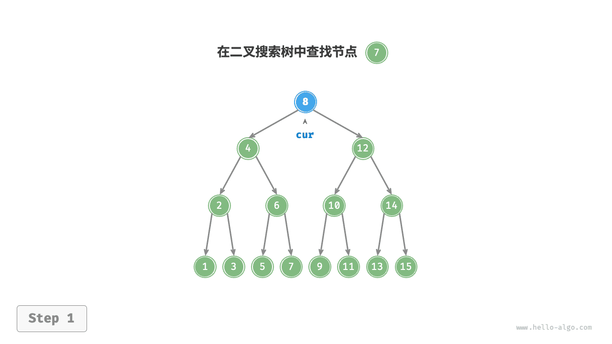

=== "<2>"
    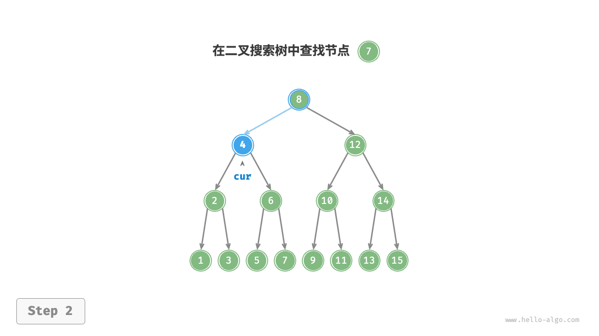

=== "<3>"
    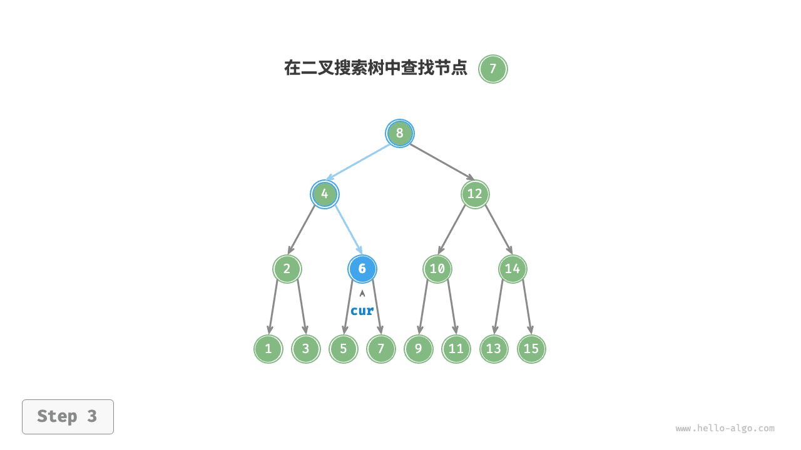

=== "<4>"
    

二叉搜索树的查找操作与二分查找算法的工作原理一致，都是每轮排除一半情况。循环次数最多为二叉树的高度，当二叉树平衡时，使用 $O(\log n)$ 时间。示例代码如下：

```python
def search(self, num: int) -> TreeNode | None:
    """查找节点"""
    cur = self._root
    # 循环查找，越过叶节点后跳出
    while cur is not None:
        # 目标节点在 cur 的右子树中
        if cur.val < num:
            cur = cur.right
        # 目标节点在 cur 的左子树中
        elif cur.val > num:
            cur = cur.left
        # 找到目标节点，跳出循环
        else:
            break
    return cur
```

!!! example [pythontutor "可视化运行"](https://pythontutor.com/iframe-embed.html#code=class%20TreeNode%3A%0A%20%20%20%20%22%22%22%E4%BA%8C%E5%8F%89%E6%A0%91%E8%8A%82%E7%82%B9%E7%B1%BB%22%22%22%0A%20%20%20%20def%20__init__%28self,%20val%29%3A%0A%20%20%20%20%20%20%20%20self.val%20%3D%20val%0A%20%20%20%20%20%20%20%20self.left%20%3D%20None%0A%20%20%20%20%20%20%20%20self.right%20%3D%20None%0A%0A%0Aclass%20BinarySearchTree%3A%0A%20%20%20%20%22%22%22%E4%BA%8C%E5%8F%89%E6%90%9C%E7%B4%A2%E6%A0%91%22%22%22%0A%0A%20%20%20%20def%20__init__%28self%29%3A%0A%20%20%20%20%20%20%20%20%22%22%22%E6%9E%84%E9%80%A0%E6%96%B9%E6%B3%95%22%22%22%0A%20%20%20%20%20%20%20%20%23%20%E5%88%9D%E5%A7%8B%E5%8C%96%E7%A9%BA%E6%A0%91%0A%20%20%20%20%20%20%20%20self._root%20%3D%20None%0A%0A%20%20%20%20def%20search%28self,%20num%3A%20int%29%20-%3E%20TreeNode%20%7C%20None%3A%0A%20%20%20%20%20%20%20%20%22%22%22%E6%9F%A5%E6%89%BE%E8%8A%82%E7%82%B9%22%22%22%0A%20%20%20%20%20%20%20%20cur%20%3D%20self._root%0A%20%20%20%20%20%20%20%20%23%20%E5%BE%AA%E7%8E%AF%E6%9F%A5%E6%89%BE%EF%BC%8C%E8%B6%8A%E8%BF%87%E5%8F%B6%E8%8A%82%E7%82%B9%E5%90%8E%E8%B7%B3%E5%87%BA%0A%20%20%20%20%20%20%20%20while%20cur%20is%20not%20None%3A%0A%20%20%20%20%20%20%20%20%20%20%20%20%23%20%E7%9B%AE%E6%A0%87%E8%8A%82%E7%82%B9%E5%9C%A8%20cur%20%E7%9A%84%E5%8F%B3%E5%AD%90%E6%A0%91%E4%B8%AD%0A%20%20%20%20%20%20%20%20%20%20%20%20if%20cur.val%20%3C%20num%3A%0A%20%20%20%20%20%20%20%20%20%20%20%20%20%20%20%20cur%20%3D%20cur.right%0A%20%20%20%20%20%20%20%20%20%20%20%20%23%20%E7%9B%AE%E6%A0%87%E8%8A%82%E7%82%B9%E5%9C%A8%20cur%20%E7%9A%84%E5%B7%A6%E5%AD%90%E6%A0%91%E4%B8%AD%0A%20%20%20%20%20%20%20%20%20%20%20%20elif%20cur.val%20%3E%20num%3A%0A%20%20%20%20%20%20%20%20%20%20%20%20%20%20%20%20cur%20%3D%20cur.left%0A%20%20%20%20%20%20%20%20%20%20%20%20%23%20%E6%89%BE%E5%88%B0%E7%9B%AE%E6%A0%87%E8%8A%82%E7%82%B9%EF%BC%8C%E8%B7%B3%E5%87%BA%E5%BE%AA%E7%8E%AF%0A%20%20%20%20%20%20%20%20%20%20%20%20else%3A%0A%20%20%20%20%20%20%20%20%20%20%20%20%20%20%20%20break%0A%20%20%20%20%20%20%20%20return%20cur%0A%0A%20%20%20%20def%20insert%28self,%20num%3A%20int%29%3A%0A%20%20%20%20%20%20%20%20%22%22%22%E6%8F%92%E5%85%A5%E8%8A%82%E7%82%B9%22%22%22%0A%20%20%20%20%20%20%20%20%23%20%E8%8B%A5%E6%A0%91%E4%B8%BA%E7%A9%BA%EF%BC%8C%E5%88%99%E5%88%9D%E5%A7%8B%E5%8C%96%E6%A0%B9%E8%8A%82%E7%82%B9%0A%20%20%20%20%20%20%20%20if%20self._root%20is%20None%3A%0A%20%20%20%20%20%20%20%20%20%20%20%20self._root%20%3D%20TreeNode%28num%29%0A%20%20%20%20%20%20%20%20%20%20%20%20return%0A%20%20%20%20%20%20%20%20%23%20%E5%BE%AA%E7%8E%AF%E6%9F%A5%E6%89%BE%EF%BC%8C%E8%B6%8A%E8%BF%87%E5%8F%B6%E8%8A%82%E7%82%B9%E5%90%8E%E8%B7%B3%E5%87%BA%0A%20%20%20%20%20%20%20%20cur,%20pre%20%3D%20self._root,%20None%0A%20%20%20%20%20%20%20%20while%20cur%20is%20not%20None%3A%0A%20%20%20%20%20%20%20%20%20%20%20%20%23%20%E6%89%BE%E5%88%B0%E9%87%8D%E5%A4%8D%E8%8A%82%E7%82%B9%EF%BC%8C%E7%9B%B4%E6%8E%A5%E8%BF%94%E5%9B%9E%0A%20%20%20%20%20%20%20%20%20%20%20%20if%20cur.val%20%3D%3D%20num%3A%0A%20%20%20%20%20%20%20%20%20%20%20%20%20%20%20%20return%0A%20%20%20%20%20%20%20%20%20%20%20%20pre%20%3D%20cur%0A%20%20%20%20%20%20%20%20%20%20%20%20%23%20%E6%8F%92%E5%85%A5%E4%BD%8D%E7%BD%AE%E5%9C%A8%20cur%20%E7%9A%84%E5%8F%B3%E5%AD%90%E6%A0%91%E4%B8%AD%0A%20%20%20%20%20%20%20%20%20%20%20%20if%20cur.val%20%3C%20num%3A%0A%20%20%20%20%20%20%20%20%20%20%20%20%20%20%20%20cur%20%3D%20cur.right%0A%20%20%20%20%20%20%20%20%20%20%20%20%23%20%E6%8F%92%E5%85%A5%E4%BD%8D%E7%BD%AE%E5%9C%A8%20cur%20%E7%9A%84%E5%B7%A6%E5%AD%90%E6%A0%91%E4%B8%AD%0A%20%20%20%20%20%20%20%20%20%20%20%20else%3A%0A%20%20%20%20%20%20%20%20%20%20%20%20%20%20%20%20cur%20%3D%20cur.left%0A%20%20%20%20%20%20%20%20%23%20%E6%8F%92%E5%85%A5%E8%8A%82%E7%82%B9%0A%20%20%20%20%20%20%20%20node%20%3D%20TreeNode%28num%29%0A%20%20%20%20%20%20%20%20if%20pre.val%20%3C%20num%3A%0A%20%20%20%20%20%20%20%20%20%20%20%20pre.right%20%3D%20node%0A%20%20%20%20%20%20%20%20else%3A%0A%20%20%20%20%20%20%20%20%20%20%20%20pre.left%20%3D%20node%0A%0A%0A%22%22%22Driver%20Code%22%22%22%0Aif%20__name__%20%3D%3D%20%22__main__%22%3A%0A%20%20%20%20%23%20%E5%88%9D%E5%A7%8B%E5%8C%96%E4%BA%8C%E5%8F%89%E6%90%9C%E7%B4%A2%E6%A0%91%0A%20%20%20%20bst%20%3D%20BinarySearchTree%28%29%0A%20%20%20%20nums%20%3D%20%5B4,%202,%206,%201,%203,%205,%207%5D%0A%20%20%20%20for%20num%20in%20nums%3A%0A%20%20%20%20%20%20%20%20bst.insert%28num%29%0A%0A%20%20%20%20%23%20%E6%9F%A5%E6%89%BE%E8%8A%82%E7%82%B9%0A%20%20%20%20node%20%3D%20bst.search%287%29%0A%20%20%20%20print%28%22%5Cn%E6%9F%A5%E6%89%BE%E5%88%B0%E7%9A%84%E8%8A%82%E7%82%B9%E5%AF%B9%E8%B1%A1%E4%B8%BA%3A%20%7B%7D%EF%BC%8C%E8%8A%82%E7%82%B9%E5%80%BC%20%3D%20%7B%7D%22.format%28node,%20node.val%29%29&codeDivHeight=800&codeDivWidth=600&cumulative=false&curInstr=162&heapPrimitives=nevernest&origin=opt-frontend.js&py=311&rawInputLstJSON=%5B%5D&textReferences=false)

### 插入节点

给定一个待插入元素 `num` ，为了保持二叉搜索树“左子树 < 根节点 < 右子树”的性质，插入操作流程如下图所示。

1. **查找插入位置**：与查找操作相似，从根节点出发，根据当前节点值和 `num` 的大小关系循环向下搜索，直到越过叶节点（遍历至 `None` ）时跳出循环。
2. **在该位置插入节点**：初始化节点 `num` ，将该节点置于 `None` 的位置。

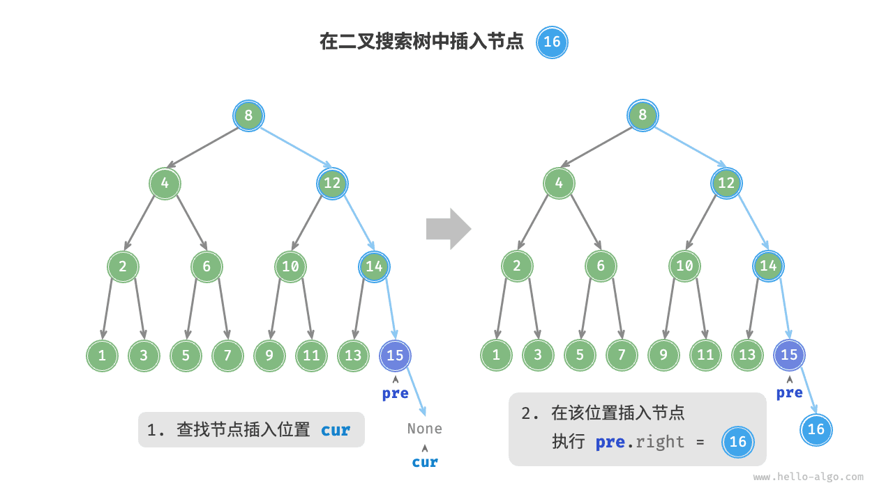

在代码实现中，需要注意以下两点。

- 二叉搜索树不允许存在重复节点，否则将违反其定义。因此，若待插入节点在树中已存在，则不执行插入，直接返回。
- 为了实现插入节点，我们需要借助节点 `pre` 保存上一轮循环的节点。这样在遍历至 `None` 时，我们可以获取到其父节点，从而完成节点插入操作。

```python
def insert(self, num: int):
    """插入节点"""
    # 若树为空，则初始化根节点
    if self._root is None:
        self._root = TreeNode(num)
        return
    # 循环查找，越过叶节点后跳出
    cur, pre = self._root, None
    while cur is not None:
        # 找到重复节点，直接返回
        if cur.val == num:
            return
        pre = cur
        # 插入位置在 cur 的右子树中
        if cur.val < num:
            cur = cur.right
        # 插入位置在 cur 的左子树中
        else:
            cur = cur.left
    # 插入节点
    node = TreeNode(num)
    if pre.val < num:
        pre.right = node
    else:
        pre.left = node
```

!!! example [pythontutor "可视化运行"](https://pythontutor.com/iframe-embed.html#code=class%20TreeNode%3A%0A%20%20%20%20%22%22%22%E4%BA%8C%E5%8F%89%E6%A0%91%E8%8A%82%E7%82%B9%E7%B1%BB%22%22%22%0A%20%20%20%20def%20__init__%28self,%20val%29%3A%0A%20%20%20%20%20%20%20%20self.val%20%3D%20val%0A%20%20%20%20%20%20%20%20self.left%20%3D%20None%0A%20%20%20%20%20%20%20%20self.right%20%3D%20None%0A%0A%0Aclass%20BinarySearchTree%3A%0A%20%20%20%20%22%22%22%E4%BA%8C%E5%8F%89%E6%90%9C%E7%B4%A2%E6%A0%91%22%22%22%0A%0A%20%20%20%20def%20__init__%28self%29%3A%0A%20%20%20%20%20%20%20%20%22%22%22%E6%9E%84%E9%80%A0%E6%96%B9%E6%B3%95%22%22%22%0A%20%20%20%20%20%20%20%20%23%20%E5%88%9D%E5%A7%8B%E5%8C%96%E7%A9%BA%E6%A0%91%0A%20%20%20%20%20%20%20%20self._root%20%3D%20None%0A%0A%20%20%20%20def%20insert%28self,%20num%3A%20int%29%3A%0A%20%20%20%20%20%20%20%20%22%22%22%E6%8F%92%E5%85%A5%E8%8A%82%E7%82%B9%22%22%22%0A%20%20%20%20%20%20%20%20%23%20%E8%8B%A5%E6%A0%91%E4%B8%BA%E7%A9%BA%EF%BC%8C%E5%88%99%E5%88%9D%E5%A7%8B%E5%8C%96%E6%A0%B9%E8%8A%82%E7%82%B9%0A%20%20%20%20%20%20%20%20if%20self._root%20is%20None%3A%0A%20%20%20%20%20%20%20%20%20%20%20%20self._root%20%3D%20TreeNode%28num%29%0A%20%20%20%20%20%20%20%20%20%20%20%20return%0A%20%20%20%20%20%20%20%20%23%20%E5%BE%AA%E7%8E%AF%E6%9F%A5%E6%89%BE%EF%BC%8C%E8%B6%8A%E8%BF%87%E5%8F%B6%E8%8A%82%E7%82%B9%E5%90%8E%E8%B7%B3%E5%87%BA%0A%20%20%20%20%20%20%20%20cur,%20pre%20%3D%20self._root,%20None%0A%20%20%20%20%20%20%20%20while%20cur%20is%20not%20None%3A%0A%20%20%20%20%20%20%20%20%20%20%20%20%23%20%E6%89%BE%E5%88%B0%E9%87%8D%E5%A4%8D%E8%8A%82%E7%82%B9%EF%BC%8C%E7%9B%B4%E6%8E%A5%E8%BF%94%E5%9B%9E%0A%20%20%20%20%20%20%20%20%20%20%20%20if%20cur.val%20%3D%3D%20num%3A%0A%20%20%20%20%20%20%20%20%20%20%20%20%20%20%20%20return%0A%20%20%20%20%20%20%20%20%20%20%20%20pre%20%3D%20cur%0A%20%20%20%20%20%20%20%20%20%20%20%20%23%20%E6%8F%92%E5%85%A5%E4%BD%8D%E7%BD%AE%E5%9C%A8%20cur%20%E7%9A%84%E5%8F%B3%E5%AD%90%E6%A0%91%E4%B8%AD%0A%20%20%20%20%20%20%20%20%20%20%20%20if%20cur.val%20%3C%20num%3A%0A%20%20%20%20%20%20%20%20%20%20%20%20%20%20%20%20cur%20%3D%20cur.right%0A%20%20%20%20%20%20%20%20%20%20%20%20%23%20%E6%8F%92%E5%85%A5%E4%BD%8D%E7%BD%AE%E5%9C%A8%20cur%20%E7%9A%84%E5%B7%A6%E5%AD%90%E6%A0%91%E4%B8%AD%0A%20%20%20%20%20%20%20%20%20%20%20%20else%3A%0A%20%20%20%20%20%20%20%20%20%20%20%20%20%20%20%20cur%20%3D%20cur.left%0A%20%20%20%20%20%20%20%20%23%20%E6%8F%92%E5%85%A5%E8%8A%82%E7%82%B9%0A%20%20%20%20%20%20%20%20node%20%3D%20TreeNode%28num%29%0A%20%20%20%20%20%20%20%20if%20pre.val%20%3C%20num%3A%0A%20%20%20%20%20%20%20%20%20%20%20%20pre.right%20%3D%20node%0A%20%20%20%20%20%20%20%20else%3A%0A%20%20%20%20%20%20%20%20%20%20%20%20pre.left%20%3D%20node%0A%0A%0A%22%22%22Driver%20Code%22%22%22%0Aif%20__name__%20%3D%3D%20%22__main__%22%3A%0A%20%20%20%20%23%20%E5%88%9D%E5%A7%8B%E5%8C%96%E4%BA%8C%E5%8F%89%E6%90%9C%E7%B4%A2%E6%A0%91%0A%20%20%20%20bst%20%3D%20BinarySearchTree%28%29%0A%20%20%20%20nums%20%3D%20%5B4,%202,%206,%201,%203,%205,%207%5D%0A%20%20%20%20for%20num%20in%20nums%3A%0A%20%20%20%20%20%20%20%20bst.insert%28num%29%0A%0A%20%20%20%20%23%20%E6%8F%92%E5%85%A5%E8%8A%82%E7%82%B9%0A%20%20%20%20bst.insert%2816%29&codeDivHeight=800&codeDivWidth=600&cumulative=false&curInstr=162&heapPrimitives=nevernest&origin=opt-frontend.js&py=311&rawInputLstJSON=%5B%5D&textReferences=false)

与查找节点相同，插入节点使用 $O(\log n)$ 时间。

### 删除节点

先在二叉树中查找到目标节点，再将其删除。与插入节点类似，我们需要保证在删除操作完成后，二叉搜索树的“左子树 < 根节点 < 右子树”的性质仍然满足。因此，我们根据目标节点的子节点数量，分 0、1 和 2 三种情况，执行对应的删除节点操作。

如下图所示，当待删除节点的度为 $0$ 时，表示该节点是叶节点，可以直接删除。


如下图所示，当待删除节点的度为 $1$ 时，将待删除节点替换为其子节点即可。

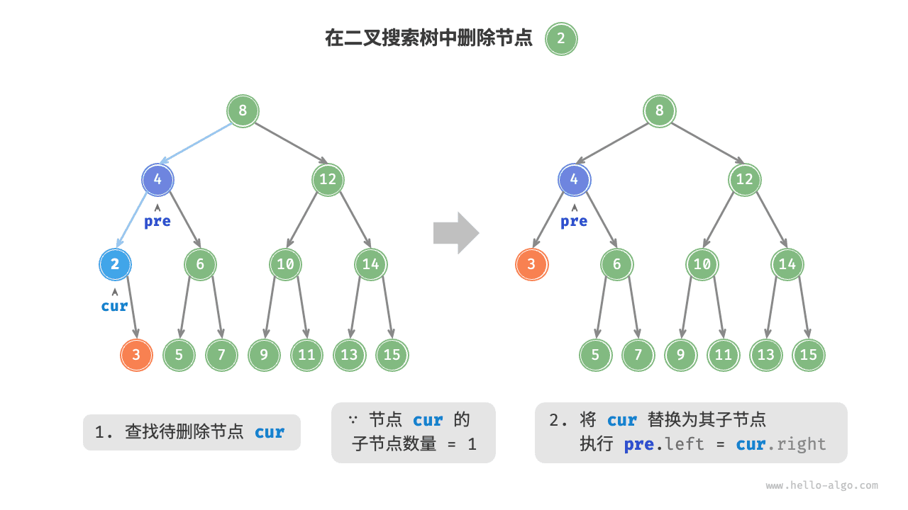

当待删除节点的度为 $2$ 时，我们无法直接删除它，而需要使用一个节点替换该节点。由于要保持二叉搜索树“左子树 $<$ 根节点 $<$ 右子树”的性质，**因此这个节点可以是右子树的最小节点或左子树的最大节点**。

假设我们选择右子树的最小节点（中序遍历的下一个节点），则删除操作流程如下图所示。

1. 找到待删除节点在“中序遍历序列”中的下一个节点，记为 `tmp` 。
2. 用 `tmp` 的值覆盖待删除节点的值，并在树中递归删除节点 `tmp` 。

=== "<1>"
    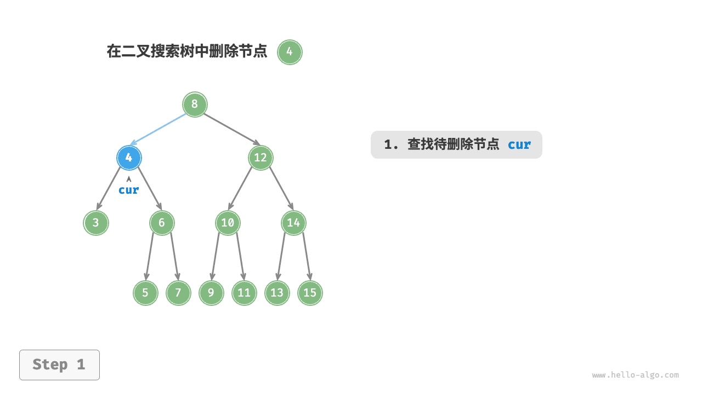

=== "<2>"
    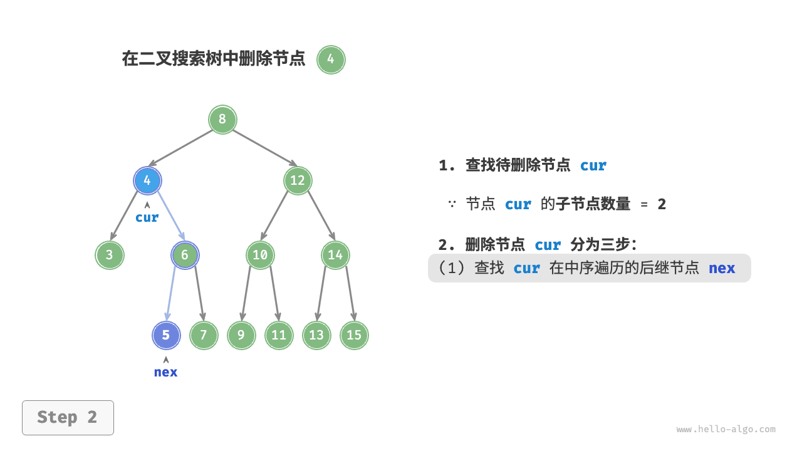

=== "<3>"
    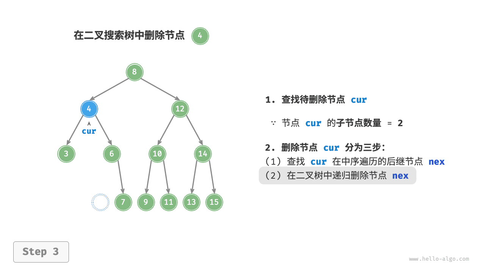

=== "<4>"
    

删除节点操作同样使用 $O(\log n)$ 时间，其中查找待删除节点需要 $O(\log n)$ 时间，获取中序遍历后继节点需要 $O(\log n)$ 时间。示例代码如下：

```python
def remove(self, num: int):
    """删除节点"""
    # 若树为空，直接提前返回
    if self._root is None:
        return
    # 循环查找，越过叶节点后跳出
    cur, pre = self._root, None
    while cur is not None:
        # 找到待删除节点，跳出循环
        if cur.val == num:
            break
        pre = cur
        # 待删除节点在 cur 的右子树中
        if cur.val < num:
            cur = cur.right
        # 待删除节点在 cur 的左子树中
        else:
            cur = cur.left
    # 若无待删除节点，则直接返回
    if cur is None:
        return

    # 子节点数量 = 0 or 1
    if cur.left is None or cur.right is None:
        # 当子节点数量 = 0 / 1 时， child = null / 该子节点
        child = cur.left or cur.right
        # 删除节点 cur
        if cur != self._root:
            if pre.left == cur:
                pre.left = child
            else:
                pre.right = child
        else:
            # 若删除节点为根节点，则重新指定根节点
            self._root = child
    # 子节点数量 = 2
    else:
        # 获取中序遍历中 cur 的下一个节点
        tmp: TreeNode = cur.right
        while tmp.left is not None:
            tmp = tmp.left
        # 递归删除节点 tmp
        self.remove(tmp.val)
        # 用 tmp 覆盖 cur
        cur.val = tmp.val
```

!!! example [pythontutor "可视化运行"](https://pythontutor.com/iframe-embed.html#code=class%20TreeNode%3A%0A%20%20%20%20%22%22%22%E4%BA%8C%E5%8F%89%E6%A0%91%E8%8A%82%E7%82%B9%E7%B1%BB%22%22%22%0A%20%20%20%20def%20__init__%28self,%20val%29%3A%0A%20%20%20%20%20%20%20%20self.val%20%3D%20val%0A%20%20%20%20%20%20%20%20self.left%20%3D%20None%0A%20%20%20%20%20%20%20%20self.right%20%3D%20None%0A%0Aclass%20BinarySearchTree%3A%0A%20%20%20%20%22%22%22%E4%BA%8C%E5%8F%89%E6%90%9C%E7%B4%A2%E6%A0%91%22%22%22%0A%0A%20%20%20%20def%20__init__%28self%29%3A%0A%20%20%20%20%20%20%20%20%22%22%22%E6%9E%84%E9%80%A0%E6%96%B9%E6%B3%95%22%22%22%0A%20%20%20%20%20%20%20%20self._root%20%3D%20None%0A%0A%20%20%20%20def%20insert%28self,%20num%3A%20int%29%3A%0A%20%20%20%20%20%20%20%20%22%22%22%E6%8F%92%E5%85%A5%E8%8A%82%E7%82%B9%22%22%22%0A%20%20%20%20%20%20%20%20if%20self._root%20is%20None%3A%0A%20%20%20%20%20%20%20%20%20%20%20%20self._root%20%3D%20TreeNode%28num%29%0A%20%20%20%20%20%20%20%20%20%20%20%20return%0A%20%20%20%20%20%20%20%20cur,%20pre%20%3D%20self._root,%20None%0A%20%20%20%20%20%20%20%20while%20cur%20is%20not%20None%3A%0A%20%20%20%20%20%20%20%20%20%20%20%20if%20cur.val%20%3D%3D%20num%3A%0A%20%20%20%20%20%20%20%20%20%20%20%20%20%20%20%20return%0A%20%20%20%20%20%20%20%20%20%20%20%20pre%20%3D%20cur%0A%20%20%20%20%20%20%20%20%20%20%20%20if%20cur.val%20%3C%20num%3A%0A%20%20%20%20%20%20%20%20%20%20%20%20%20%20%20%20cur%20%3D%20cur.right%0A%20%20%20%20%20%20%20%20%20%20%20%20else%3A%0A%20%20%20%20%20%20%20%20%20%20%20%20%20%20%20%20cur%20%3D%20cur.left%0A%20%20%20%20%20%20%20%20node%20%3D%20TreeNode%28num%29%0A%20%20%20%20%20%20%20%20if%20pre.val%20%3C%20num%3A%0A%20%20%20%20%20%20%20%20%20%20%20%20pre.right%20%3D%20node%0A%20%20%20%20%20%20%20%20else%3A%0A%20%20%20%20%20%20%20%20%20%20%20%20pre.left%20%3D%20node%0A%0A%20%20%20%20def%20remove%28self,%20num%3A%20int%29%3A%0A%20%20%20%20%20%20%20%20%22%22%22%E5%88%A0%E9%99%A4%E8%8A%82%E7%82%B9%22%22%22%0A%20%20%20%20%20%20%20%20if%20self._root%20is%20None%3A%0A%20%20%20%20%20%20%20%20%20%20%20%20return%0A%20%20%20%20%20%20%20%20%23%20%E6%9F%A5%E6%89%BE%E8%8A%82%E7%82%B9%0A%20%20%20%20%20%20%20%20cur,%20pre%20%3D%20self._root,%20None%0A%20%20%20%20%20%20%20%20while%20cur%20is%20not%20None%3A%0A%20%20%20%20%20%20%20%20%20%20%20%20if%20cur.val%20%3D%3D%20num%3A%0A%20%20%20%20%20%20%20%20%20%20%20%20%20%20%20%20break%0A%20%20%20%20%20%20%20%20%20%20%20%20pre%20%3D%20cur%0A%20%20%20%20%20%20%20%20%20%20%20%20if%20cur.val%20%3C%20num%3A%0A%20%20%20%20%20%20%20%20%20%20%20%20%20%20%20%20cur%20%3D%20cur.right%0A%20%20%20%20%20%20%20%20%20%20%20%20else%3A%0A%20%20%20%20%20%20%20%20%20%20%20%20%20%20%20%20cur%20%3D%20cur.left%0A%20%20%20%20%20%20%20%20if%20cur%20is%20None%3A%0A%20%20%20%20%20%20%20%20%20%20%20%20return%0A%0A%20%20%20%20%20%20%20%20%23%20%E5%AD%90%E8%8A%82%E7%82%B9%E6%95%B0%E9%87%8F%20%3D%200%20or%201%0A%20%20%20%20%20%20%20%20if%20cur.left%20is%20None%20or%20cur.right%20is%20None%3A%0A%20%20%20%20%20%20%20%20%20%20%20%20%23%20%E5%BD%93%E5%AD%90%E8%8A%82%E7%82%B9%E6%95%B0%E9%87%8F%20%3D%200%20/%201%20%E6%97%B6%EF%BC%8C%20child%20%3D%20null%20/%20%E8%AF%A5%E5%AD%90%E8%8A%82%E7%82%B9%0A%20%20%20%20%20%20%20%20%20%20%20%20child%20%3D%20cur.left%20or%20cur.right%0A%20%20%20%20%20%20%20%20%20%20%20%20%23%20%E5%88%A0%E9%99%A4%E8%8A%82%E7%82%B9%20cur%0A%20%20%20%20%20%20%20%20%20%20%20%20if%20cur%20!%3D%20self._root%3A%0A%20%20%20%20%20%20%20%20%20%20%20%20%20%20%20%20if%20pre.left%20%3D%3D%20cur%3A%0A%20%20%20%20%20%20%20%20%20%20%20%20%20%20%20%20%20%20%20%20pre.left%20%3D%20child%0A%20%20%20%20%20%20%20%20%20%20%20%20%20%20%20%20else%3A%0A%20%20%20%20%20%20%20%20%20%20%20%20%20%20%20%20%20%20%20%20pre.right%20%3D%20child%0A%20%20%20%20%20%20%20%20%20%20%20%20else%3A%0A%20%20%20%20%20%20%20%20%20%20%20%20%20%20%20%20self._root%20%3D%20child%0A%20%20%20%20%20%20%20%20%23%20%E5%AD%90%E8%8A%82%E7%82%B9%E6%95%B0%E9%87%8F%20%3D%202%0A%20%20%20%20%20%20%20%20else%3A%0A%20%20%20%20%20%20%20%20%20%20%20%20%23%20%E8%8E%B7%E5%8F%96%E4%B8%AD%E5%BA%8F%E9%81%8D%E5%8E%86%E4%B8%AD%20cur%20%E7%9A%84%E4%B8%8B%E4%B8%80%E4%B8%AA%E8%8A%82%E7%82%B9%0A%20%20%20%20%20%20%20%20%20%20%20%20tmp%3A%20TreeNode%20%3D%20cur.right%0A%20%20%20%20%20%20%20%20%20%20%20%20while%20tmp.left%20is%20not%20None%3A%0A%20%20%20%20%20%20%20%20%20%20%20%20%20%20%20%20tmp%20%3D%20tmp.left%0A%20%20%20%20%20%20%20%20%20%20%20%20%23%20%E9%80%92%E5%BD%92%E5%88%A0%E9%99%A4%E8%8A%82%E7%82%B9%20tmp%0A%20%20%20%20%20%20%20%20%20%20%20%20self.remove%28tmp.val%29%0A%20%20%20%20%20%20%20%20%20%20%20%20%23%20%E7%94%A8%20tmp%20%E8%A6%86%E7%9B%96%20cur%0A%20%20%20%20%20%20%20%20%20%20%20%20cur.val%20%3D%20tmp.val%0A%0A%22%22%22Driver%20Code%22%22%22%0Aif%20__name__%20%3D%3D%20%22__main__%22%3A%0A%20%20%20%20%23%20%E5%88%9D%E5%A7%8B%E5%8C%96%E4%BA%8C%E5%8F%89%E6%90%9C%E7%B4%A2%E6%A0%91%0A%20%20%20%20bst%20%3D%20BinarySearchTree%28%29%0A%20%20%20%20nums%20%3D%20%5B4,%202,%206,%201,%203,%205,%207%5D%0A%20%20%20%20for%20num%20in%20nums%3A%0A%20%20%20%20%20%20%20%20bst.insert%28num%29%0A%0A%20%20%20%20%23%20%E5%88%A0%E9%99%A4%E8%8A%82%E7%82%B9%0A%20%20%20%20bst.remove%281%29%20%23%20%E5%BA%A6%E4%B8%BA%200%0A%20%20%20%20bst.remove%282%29%20%23%20%E5%BA%A6%E4%B8%BA%201%0A%20%20%20%20bst.remove%284%29%20%23%20%E5%BA%A6%E4%B8%BA%202&codeDivHeight=800&codeDivWidth=600&cumulative=false&curInstr=162&heapPrimitives=nevernest&origin=opt-frontend.js&py=311&rawInputLstJSON=%5B%5D&textReferences=false)

### 中序遍历有序

如下图所示，二叉树的中序遍历遵循“左 $\rightarrow$ 根 $\rightarrow$ 右”的遍历顺序，而二叉搜索树满足“左子节点 $<$ 根节点 $<$ 右子节点”的大小关系。

这意味着在二叉搜索树中进行中序遍历时，总是会优先遍历下一个最小节点，从而得出一个重要性质：**二叉搜索树的中序遍历序列是升序的**。

利用中序遍历升序的性质，我们在二叉搜索树中获取有序数据仅需 $O(n)$ 时间，无须进行额外的排序操作，非常高效。


## 二叉搜索树的效率

给定一组数据，我们考虑使用数组或二叉搜索树存储。观察下表，二叉搜索树的各项操作的时间复杂度都是对数阶，具有稳定且高效的性能。只有在高频添加、低频查找删除数据的场景下，数组比二叉搜索树的效率更高。

<p align="center"> 表 <id> &nbsp; 数组与搜索树的效率对比 </p>

|          | 无序数组 | 二叉搜索树  |
| -------- | -------- | ----------- |
| 查找元素 | $O(n)$   | $O(\log n)$ |
| 插入元素 | $O(1)$   | $O(\log n)$ |
| 删除元素 | $O(n)$   | $O(\log n)$ |

在理想情况下，二叉搜索树是“平衡”的，这样就可以在 $\log n$ 轮循环内查找任意节点。

然而，如果我们在二叉搜索树中不断地插入和删除节点，可能导致二叉树退化为下图所示的链表，这时各种操作的时间复杂度也会退化为 $O(n)$ 。

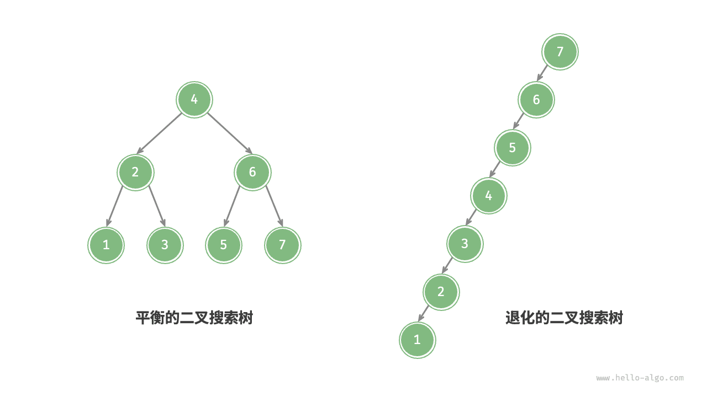

## 二叉搜索树常见应用

- 用作系统中的多级索引，实现高效的查找、插入、删除操作。
- 作为某些搜索算法的底层数据结构。
- 用于存储数据流，以保持其有序状态。


## 1 二叉搜索树

二叉搜索树（Binary Search Tree，BST），它是映射的另一种实现。我们感兴趣的不是元素在树中的确切位置，而是<mark>如何利用二叉树结构提供高效的搜索。</mark>

二叉搜索树依赖于这样一个性质：<mark>小于父节点的键都在左子树中，大于父节点的键则都在右子树中。我们称这个性质为二叉搜索性。</mark>


### 1.1 编程题目

##### 练习M22275: 二叉搜索树的遍历

http://cs101.openjudge.cn/practice/22275/

给出一棵二叉搜索树的前序遍历，求它的后序遍历

**输入**

第一行一个正整数n（n<=2000）表示这棵二叉搜索树的结点个数
第二行n个正整数，表示这棵二叉搜索树的前序遍历
保证第二行的n个正整数中，1~n的每个值刚好出现一次

**输出**

一行n个正整数，表示这棵二叉搜索树的后序遍历

样例输入

```
5
4 2 1 3 5
```

样例输出

```
1 3 2 5 4
```

提示

树的形状为
   4  
  / \ 
  2  5 
 / \  
 1  3  


```python
# 管骏杰 生命科学学院
# 中序遍历就是顺序排列，进而通过上次作业的思路根据前序中序推出后序
class Node:
    def __init__(self, val):
        self.val = val
        self.left = None
        self.right = None


def build(preorder, inorder):
    if not preorder or not inorder:
        return None
    root_val = preorder[0]
    root = Node(root_val)
    root_index = inorder.index(root_val)
    root.left = build(preorder[1:root_index + 1], inorder[:root_index])
    root.right = build(preorder[root_index + 1:], inorder[root_index + 1:])
    return root


def postorder(root):
    if not root:
        return []
    if root.left is None and root.right is None:
        return [root.val]
    result = []
    result += postorder(root.left)
    result += postorder(root.right)
    result += [root.val]
    return result


input()
preorder = list(map(int, input().split()))
inorder = sorted(preorder)
root = build(preorder, inorder)
result = postorder(root)
print(' '.join(map(str, result)))
```


```python
"""
王昊 光华管理学院。思路：
建树思路：数组第一个元素是根节点，紧跟着是小于根节点值的节点，在根节点左侧，直至遇到大于根节点值的节点，
后续节点都在根节点右侧，按照这个思路递归即可
"""
class Node():
    def __init__(self, val):
        self.val = val
        self.left = None
        self.right = None


def buildTree(preorder):
    if len(preorder) == 0:
        return None

    node = Node(preorder[0])

    idx = len(preorder)
    for i in range(1, len(preorder)):
        if preorder[i] > preorder[0]:
            idx = i
            break
    node.left = buildTree(preorder[1:idx])
    node.right = buildTree(preorder[idx:])

    return node


def postorder(node):
    if node is None:
        return []
    output = []
    output.extend(postorder(node.left))
    output.extend(postorder(node.right))
    output.append(str(node.val))

    return output


n = int(input())
preorder = list(map(int, input().split()))
print(' '.join(postorder(buildTree(preorder))))
```


```python
def post_order(pre_order):
    if not pre_order:
        return []
    root = pre_order[0]
    left_subtree = [x for x in pre_order if x < root]
    right_subtree = [x for x in pre_order if x > root]
    return post_order(left_subtree) + post_order(right_subtree) + [root]

n = int(input())
pre_order = list(map(int, input().split()))
print(' '.join(map(str, post_order(pre_order))))
```


##### 练习M05455: 二叉搜索树的层次遍历

http://cs101.openjudge.cn/practice/05455/

二叉搜索树在动态查表中有特别的用处，一个无序序列可以通过构造一棵二叉搜索树变成一个有序序列，

构造树的过程即为对无序序列进行排序的过程。每次插入的新的结点都是二叉搜索树上新的叶子结点，在进行

插入操作时，不必移动其它结点，只需改动某个结点的指针，由空变为非空即可。

这里，我们想探究二叉树的建立和层次输出。

**输入**

只有一行，包含若干个数字，中间用空格隔开。（数字可能会有重复，对于重复的数字，只计入一个）

**输出**

输出一行，对输入数字建立二叉搜索树后进行按层次周游的结果。

样例输入

```
51 45 59 86 45 4 15 76 60 20 61 77 62 30 2 37 13 82 19 74 2 79 79 97 33 90 11 7 29 14 50 1 96 59 91 39 34 6 72 7
```

样例输出

```
51 45 59 4 50 86 2 15 76 97 1 13 20 60 77 90 11 14 19 30 61 82 96 7 29 37 62 79 91 6 33 39 74 34 72
```

提示

输入输出的最后都不带空格和回车换行


按输入顺序遍历数字，用一个 `seen` 集合来跳过重复值，对于每个新值，插入 BST。

```python
from collections import deque
import sys

# 定义二叉树结点
class TreeNode:
    def __init__(self, val):
        self.val = val
        self.left = None
        self.right = None

# 插入结点到 BST 中
def insert(root, val):
    if not root:
        return TreeNode(val)
    if val < root.val:
        root.left = insert(root.left, val)
    elif val > root.val:
        root.right = insert(root.right, val)
    return root

# 层次遍历
def level_order(root):
    if not root:
        return []
    result = []
    queue = deque([root])
    while queue:
        node = queue.popleft()
        result.append(str(node.val))
        if node.left:
            queue.append(node.left)
        if node.right:
            queue.append(node.right)
    return result

def main():
    data = sys.stdin.read().strip().split()
    seen = set()
    root = None
    for tok in data:
        num = int(tok)
        if num in seen:
            continue
        seen.add(num)
        root = insert(root, num)
    # 输出层次遍历，最后不带多余空格或换行
    out = ' '.join(level_order(root))
    sys.stdout.write(out)

if __name__ == "__main__":
    main()

```


问题是要求根据一串数字构建一棵二叉搜索树（BST），然后对这棵二叉搜索树进行层序遍历（也称为广度优先搜索）。

以下是分步计划：

1. 创建一个 `TreeNode` 类来表示树中的每个节点。
2. 创建一个 `insert` 函数，该函数接收一个节点和一个值作为输入，并将该值插入到以该节点为根的二叉搜索树中。
3. 创建一个 `level_order_traversal` 函数，该函数接收树的根节点作为输入，并返回树的层序遍历结果。
   - 使用一个队列来存储待访问的节点。
   - 当队列不为空时，从队列中取出一个节点，访问它，并将其子节点加入队列。
4. 读取输入的数字序列，构建二叉搜索树，执行层序遍历，并输出结果。

以下是实现此计划的 Python 代码：

```python
class TreeNode:
    def __init__(self, value):
        self.value = value
        self.left = None
        self.right = None

def insert(node, value):
    if node is None:
        return TreeNode(value)
    if value < node.value:
        node.left = insert(node.left, value)
    elif value > node.value:
        node.right = insert(node.right, value)
    return node

def level_order_traversal(root):
    queue = [root]
    traversal = []
    while queue:
        node = queue.pop(0)
        traversal.append(node.value)
        if node.left:
            queue.append(node.left)
        if node.right:
            queue.append(node.right)
    return traversal

numbers = list(map(int, input().strip().split()))
numbers = list(dict.fromkeys(numbers))  # remove duplicates
root = None
for number in numbers:
    root = insert(root, number)
traversal = level_order_traversal(root)
print(' '.join(map(str, traversal)))
```

This code reads the sequence of numbers from the input, removes duplicates, constructs the BST, performs the level order traversal, and prints the result.


### 1.2 二叉搜索树实现快排

快速排序是一种基于分治法的排序算法，它通过选择一个元素作为基准（pivot），将数组分割为两个子数组，其中一个子数组的元素都小于基准，另一个子数组的元素都大于基准。然后，对两个子数组递归地应用相同的排序过程，直到排序完成。

二叉搜索树是一种有序的二叉树，它满足以下性质：

- 左子树中的所有节点的值都小于根节点的值。
- 右子树中的所有节点的值都大于根节点的值。
- 左子树和右子树也分别是二叉搜索树。

可以使用二叉搜索树来实现快速排序的过程。具体步骤如下：

1. 选择数组中的一个元素作为基准。
2. 创建一个空的二叉搜索树。
3. 将数组中的其他元素逐个插入二叉搜索树中。
4. 按照二叉搜索树的中序遍历（左子树、根节点、右子树）得到排序后的结果。

这种方法的时间复杂度为 O(n log n)，其中 n 是数组的长度。每次插入操作都需要 O(log n) 的时间复杂度，总共进行 n-1 次插入操作。

需要注意的是，<mark>二叉搜索树的性能取决于树的平衡性</mark>。如果二叉搜索树变得不平衡，性能可能会下降到 $O(n^2)$的时间复杂度。因此，在实际应用中，为了确保性能，通常会使用平衡二叉搜索树（如红黑树、AVL树）来实现快速排序。

```python
class TreeNode:
    def __init__(self, val):
        self.val = val
        self.left = None
        self.right = None

def insert(root, val):
    if root is None:
        return TreeNode(val)
    if val < root.val:
        root.left = insert(root.left, val)
    else:
        root.right = insert(root.right, val)
    return root

def inorder_traversal(root, result):
    if root:
        inorder_traversal(root.left, result)
        result.append(root.val)
        inorder_traversal(root.right, result)

def quicksort(nums):
    if not nums:
        return []
    root = TreeNode(nums[0])
    for num in nums[1:]:
        insert(root, num)
    result = []
    inorder_traversal(root, result)
    return result

# 示例输入
nums = [5, 2, 7, 1, 8, 3]

# 使用二叉搜索树实现快速排序
sorted_nums = quicksort(nums)

# 打印排序结果
print(sorted_nums)
```

# AVL 树 *

在“二叉搜索树”章节中我们提到，在多次插入和删除操作后，二叉搜索树可能退化为链表。在这种情况下，所有操作的时间复杂度将从 $O(\log n)$ 劣化为 $O(n)$ 。

如下图所示，经过两次删除节点操作，这棵二叉搜索树便会退化为链表。


再例如，在下图所示的完美二叉树中插入两个节点后，树将严重向左倾斜，查找操作的时间复杂度也随之劣化。


1962 年 G. M. Adelson-Velsky 和 E. M. Landis 在论文“An algorithm for the organization of information”中提出了 <u>AVL 树</u>。论文中详细描述了一系列操作，确保在持续添加和删除节点后，AVL 树不会退化，从而使得各种操作的时间复杂度保持在 $O(\log n)$ 级别。换句话说，在需要频繁进行增删查改操作的场景中，AVL 树能始终保持高效的数据操作性能，具有很好的应用价值。

## AVL 树常见术语

AVL 树既是二叉搜索树，也是平衡二叉树，同时满足这两类二叉树的所有性质，因此是一种<u>平衡二叉搜索树（balanced binary search tree）</u>。

### 节点高度

由于 AVL 树的相关操作需要获取节点高度，因此我们需要为节点类添加 `height` 变量：

```python
class TreeNode:
    """AVL 树节点类"""
    def __init__(self, val: int):
        self.val: int = val                 # 节点值
        self.height: int = 0                # 节点高度
        self.left: TreeNode | None = None   # 左子节点引用
        self.right: TreeNode | None = None  # 右子节点引用
```

“节点高度”是指从该节点到它的最远叶节点的距离，即所经过的“边”的数量。需要特别注意的是，叶节点的高度为 $0$ ，而空节点的高度为 $-1$ 。我们将创建两个工具函数，分别用于获取和更新节点的高度：

```python
def height(self, node: TreeNode | None) -> int:
    """获取节点高度"""
    # 空节点高度为 -1 ，叶节点高度为 0
    if node is not None:
        return node.height
    return -1

def update_height(self, node: TreeNode | None):
    """更新节点高度"""
    # 节点高度等于最高子树高度 + 1
    node.height = max([self.height(node.left), self.height(node.right)]) + 1
```

### 节点平衡因子

节点的<u>平衡因子（balance factor）</u>定义为节点左子树的高度减去右子树的高度，同时规定空节点的平衡因子为 $0$ 。我们同样将获取节点平衡因子的功能封装成函数，方便后续使用：

```python
def balance_factor(self, node: TreeNode | None) -> int:
    """获取平衡因子"""
    # 空节点平衡因子为 0
    if node is None:
        return 0
    # 节点平衡因子 = 左子树高度 - 右子树高度
    return self.height(node.left) - self.height(node.right)
```

!!! tip

    设平衡因子为 $f$ ，则一棵 AVL 树的任意节点的平衡因子皆满足 $-1 \le f \le 1$ 。

## AVL 树旋转

AVL 树的特点在于“旋转”操作，它能够在不影响二叉树的中序遍历序列的前提下，使失衡节点重新恢复平衡。换句话说，**旋转操作既能保持“二叉搜索树”的性质，也能使树重新变为“平衡二叉树”**。

我们将平衡因子绝对值 $> 1$ 的节点称为“失衡节点”。根据节点失衡情况的不同，旋转操作分为四种：右旋、左旋、先右旋后左旋、先左旋后右旋。下面详细介绍这些旋转操作。

### 右旋

如下图所示，节点下方为平衡因子。从底至顶看，二叉树中首个失衡节点是“节点 3”。我们关注以该失衡节点为根节点的子树，将该节点记为 `node` ，其左子节点记为 `child` ，执行“右旋”操作。完成右旋后，子树恢复平衡，并且仍然保持二叉搜索树的性质。

=== "<1>"
    

=== "<2>"
    

=== "<3>"
    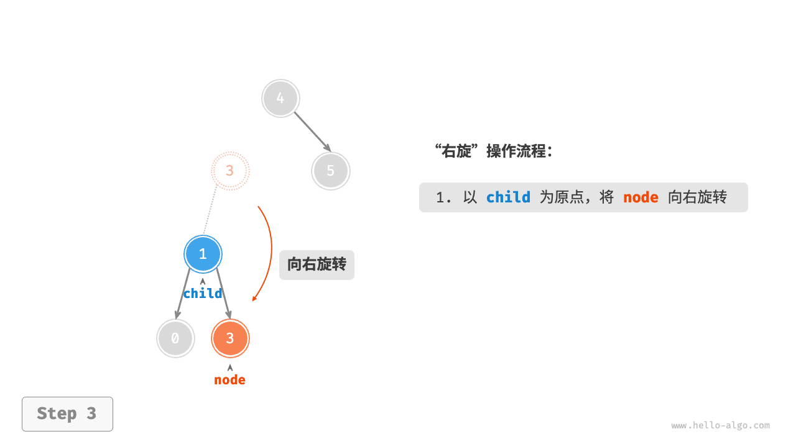

=== "<4>"
    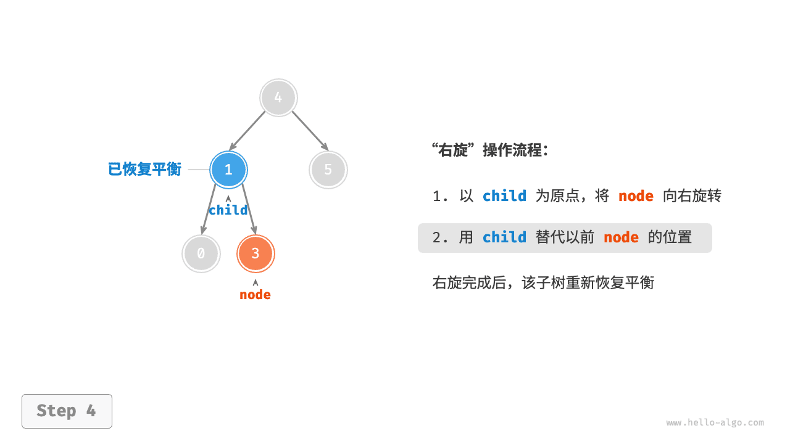

如下图所示，当节点 `child` 有右子节点（记为 `grand_child` ）时，需要在右旋中添加一步：将 `grand_child` 作为 `node` 的左子节点。


“向右旋转”是一种形象化的说法，实际上需要通过修改节点指针来实现，代码如下所示：

```python
def right_rotate(self, node: TreeNode | None) -> TreeNode | None:
    """右旋操作"""
    child = node.left
    grand_child = child.right
    # 以 child 为原点，将 node 向右旋转
    child.right = node
    node.left = grand_child
    # 更新节点高度
    self.update_height(node)
    self.update_height(child)
    # 返回旋转后子树的根节点
    return child
```

### 左旋

相应地，如果考虑上述失衡二叉树的“镜像”，则需要执行下图所示的“左旋”操作。


同理，如下图所示，当节点 `child` 有左子节点（记为 `grand_child` ）时，需要在左旋中添加一步：将 `grand_child` 作为 `node` 的右子节点。

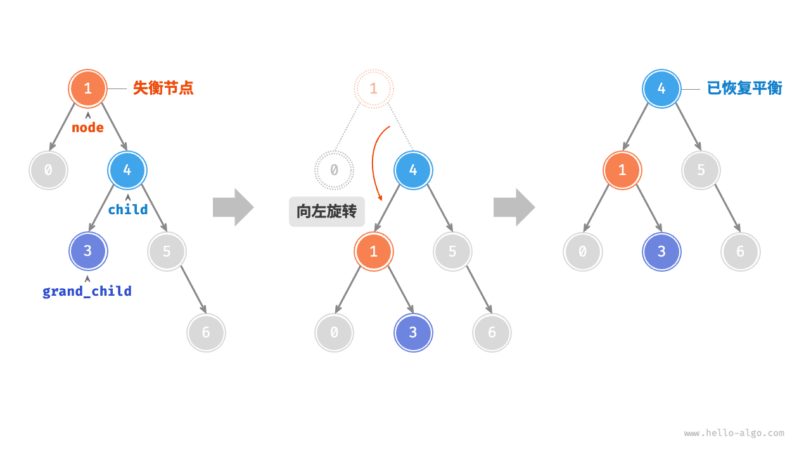

可以观察到，**右旋和左旋操作在逻辑上是镜像对称的，它们分别解决的两种失衡情况也是对称的**。基于对称性，我们只需将右旋的实现代码中的所有的 `left` 替换为 `right` ，将所有的 `right` 替换为 `left` ，即可得到左旋的实现代码：

```python
def left_rotate(self, node: TreeNode | None) -> TreeNode | None:
    """左旋操作"""
    child = node.right
    grand_child = child.left
    # 以 child 为原点，将 node 向左旋转
    child.left = node
    node.right = grand_child
    # 更新节点高度
    self.update_height(node)
    self.update_height(child)
    # 返回旋转后子树的根节点
    return child
```

### 先左旋后右旋

对于下图中的失衡节点 3 ，仅使用左旋或右旋都无法使子树恢复平衡。此时需要先对 `child` 执行“左旋”，再对 `node` 执行“右旋”。

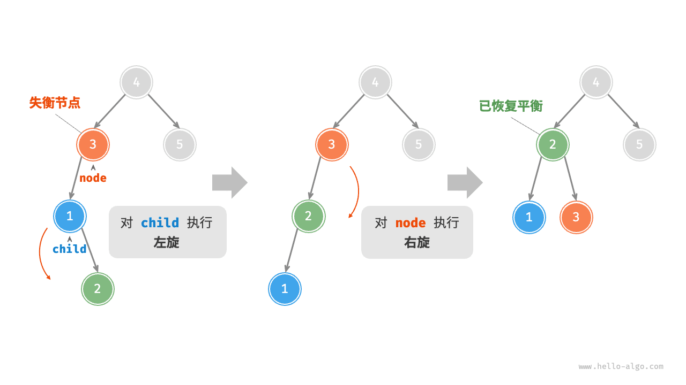

### 先右旋后左旋

如下图所示，对于上述失衡二叉树的镜像情况，需要先对 `child` 执行“右旋”，再对 `node` 执行“左旋”。

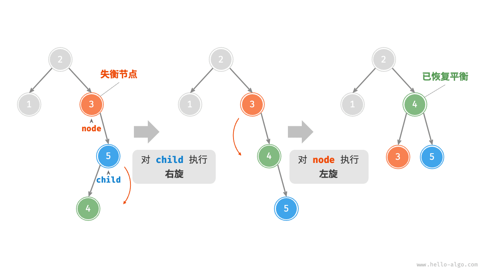

### 旋转的选择

下图展示的四种失衡情况与上述案例逐个对应，分别需要采用右旋、先左旋后右旋、先右旋后左旋、左旋的操作。

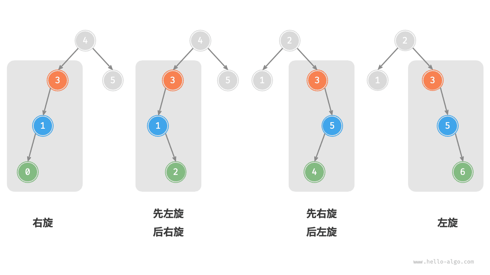

如下表所示，我们通过判断失衡节点的平衡因子以及较高一侧子节点的平衡因子的正负号，来确定失衡节点属于上图中的哪种情况。

<p align="center"> 表 <id> &nbsp; 四种旋转情况的选择条件 </p>

| 失衡节点的平衡因子 | 子节点的平衡因子 | 应采用的旋转方法 |
| ------------------ | ---------------- | ---------------- |
| $> 1$ （左偏树）   | $\geq 0$         | 右旋             |
| $> 1$ （左偏树）   | $<0$             | 先左旋后右旋     |
| $< -1$ （右偏树）  | $\leq 0$         | 左旋             |
| $< -1$ （右偏树）  | $>0$             | 先右旋后左旋     |

为了便于使用，我们将旋转操作封装成一个函数。**有了这个函数，我们就能对各种失衡情况进行旋转，使失衡节点重新恢复平衡**。代码如下所示：

```python
def rotate(self, node: TreeNode | None) -> TreeNode | None:
    """执行旋转操作，使该子树重新恢复平衡"""
    # 获取节点 node 的平衡因子
    balance_factor = self.balance_factor(node)
    # 左偏树
    if balance_factor > 1:
        if self.balance_factor(node.left) >= 0:
            # 右旋
            return self.right_rotate(node)
        else:
            # 先左旋后右旋
            node.left = self.left_rotate(node.left)
            return self.right_rotate(node)
    # 右偏树
    elif balance_factor < -1:
        if self.balance_factor(node.right) <= 0:
            # 左旋
            return self.left_rotate(node)
        else:
            # 先右旋后左旋
            node.right = self.right_rotate(node.right)
            return self.left_rotate(node)
    # 平衡树，无须旋转，直接返回
    return node
```

## AVL 树常用操作

### 插入节点

AVL 树的节点插入操作与二叉搜索树在主体上类似。唯一的区别在于，在 AVL 树中插入节点后，从该节点到根节点的路径上可能会出现一系列失衡节点。因此，**我们需要从这个节点开始，自底向上执行旋转操作，使所有失衡节点恢复平衡**。代码如下所示：

```python
def insert(self, val):
    """插入节点"""
    self._root = self.insert_helper(self._root, val)

def insert_helper(self, node: TreeNode | None, val: int) -> TreeNode:
    """递归插入节点（辅助方法）"""
    if node is None:
        return TreeNode(val)
    # 1. 查找插入位置并插入节点
    if val < node.val:
        node.left = self.insert_helper(node.left, val)
    elif val > node.val:
        node.right = self.insert_helper(node.right, val)
    else:
        # 重复节点不插入，直接返回
        return node
    # 更新节点高度
    self.update_height(node)
    # 2. 执行旋转操作，使该子树重新恢复平衡
    return self.rotate(node)
```

### 删除节点

类似地，在二叉搜索树的删除节点方法的基础上，需要从底至顶执行旋转操作，使所有失衡节点恢复平衡。代码如下所示：

```python
def remove(self, val: int):
    """删除节点"""
    self._root = self.remove_helper(self._root, val)

def remove_helper(self, node: TreeNode | None, val: int) -> TreeNode | None:
    """递归删除节点（辅助方法）"""
    if node is None:
        return None
    # 1. 查找节点并删除
    if val < node.val:
        node.left = self.remove_helper(node.left, val)
    elif val > node.val:
        node.right = self.remove_helper(node.right, val)
    else:
        if node.left is None or node.right is None:
            child = node.left or node.right
            # 子节点数量 = 0 ，直接删除 node 并返回
            if child is None:
                return None
            # 子节点数量 = 1 ，直接删除 node
            else:
                node = child
        else:
            # 子节点数量 = 2 ，则将中序遍历的下个节点删除，并用该节点替换当前节点
            temp = node.right
            while temp.left is not None:
                temp = temp.left
            node.right = self.remove_helper(node.right, temp.val)
            node.val = temp.val
    # 更新节点高度
    self.update_height(node)
    # 2. 执行旋转操作，使该子树重新恢复平衡
    return self.rotate(node)
```

### 查找节点

AVL 树的节点查找操作与二叉搜索树一致，在此不再赘述。

## AVL 树典型应用

- 组织和存储大型数据，适用于高频查找、低频增删的场景。
- 用于构建数据库中的索引系统。
- 红黑树也是一种常见的平衡二叉搜索树。相较于 AVL 树，红黑树的平衡条件更宽松，插入与删除节点所需的旋转操作更少，节点增删操作的平均效率更高。


## 2 平衡二叉搜索树

当二叉搜索树不平衡时，get和put等操作的性能可能降到O(n)。本节将介绍一种特殊的二叉搜索树，它能自动维持平衡。这种树叫作 AVL树，以其发明者G. M. Adelson-Velskii和E. M. Landis的姓氏命名。

> AVL 平衡树的全称是 Adelson-Velsky and Landis 平衡树。它是由两位前苏联的计算机科学家，即Георгий Максимович Адельсон-Вельский（Georgy Maximovich Adelson-Velsky）和Евгений Михайлович Ландис（Evgenii Mikhailovich Landis）于1962年提出的一种自平衡二叉搜索树。
>
> 这种树的名称取自这两位科学家的姓氏的首字母缩写。AVL 平衡树通过在每个节点上维护一个平衡因子（balance factor）来实现平衡。<mark>平衡因子是指节点的左子树高度与右子树高度之差的绝对值。</mark>通过不断调整树的结构，AVL 树能够保持树的平衡，使得在最坏情况下的查找、插入和删除操作的时间复杂度保持在 O(log n)。
>
> AVL 平衡树的特点是在每次插入或删除节点时，会通过旋转操作来调整树的结构，使得平衡因子在特定的范围内，通常是 -1、0、1。这样的平衡状态能够保证树的高度始终保持在较小的范围内，提供了较快的查找和更新操作。
>
> 总结起来，AVL 平衡树是一种自平衡二叉搜索树，通过调整树的结构来保持树的平衡性，以提供高效的查找和更新操作。

AVL树实现映射抽象数据类型的方式与普通的二叉搜索树一样，唯一的差别就是性能。实现AVL树时，要记录每个节点的平衡因子。我们通过查看每个节点左右子树的高度来实现这一点。更正式地说，将平衡因子定义为左右子树的高度之差。

$balance Factor = height (left SubTree) - height(right SubTree)$

根据上述定义，如果平衡因子大于零，称之为左倾；如果平衡因子小于零，就是右倾；如果平衡因子等于零，那么树就是完全平衡的。为了实现AVL树并利用平衡树的优势，将平衡因子为-1、0和1的树都定义为**平衡树**。一旦某个节点的平衡因子超出这个范围，就需要通过一个过程让树恢复平衡。图1展示了一棵右倾树及其中每个节点的平衡因子。


<center>图1 带平衡因子的右倾树</center>


> [!NOTE] 
> 108.将有序数组转换为二叉搜索树
> https://leetcode.cn/problems/convert-sorted-array-to-binary-search-tree/
> 给你一个整数数组 `nums` ，其中元素已经按 **升序** 排列，请你将其转换为一棵 平衡二叉搜索树。
> 平衡二叉树是指该树所有节点的左右子树的高度相差不超过1.


### 2.1 AVL树的性能

先看看限定平衡因子带来的结果。保证树的平衡因子为-1、0或1，可以使关键操作获得更好的大 O 性能。首先考虑平衡因子如何改善最坏情况。有左倾与右倾这两种可能性。如果考虑高度为0、1、2和3的树，图2展示了应用新规则后最不平衡的左倾树。


<center>图2 左倾AVL树的最坏情况</center>


查看树中的节点数之后可知，高度为0时有1个节点，高度为1时有2个节点（1 + 1 = 2），高度为2时有4个节点（1 + 1 + 2 = 4），高度为3时有7个节点（1 + 2 + 4 = 7）。也就是说，当高度为h时，节点数$N_h$是：

$N_h = 1 + N_{h-1} + N_{h-2}$​

你或许觉得这个公式很眼熟，因为它与<mark>斐波那契数列</mark>很相似。


#### 2.1.1 编程题目

##### M27625: AVL树至少有几个结点

> http://cs101.openjudge.cn/practice/27625/
>
> 输入n (0<n<50), 输出一个n层的AVL树至少有多少个结点。
>
> **输入**
>
> n
>
> **输出**
>
> 答案
>
> 样例输入
>
> ```
> 4
> ```
>
> 样例输出
>
> ```
> 7
> ```
>
> 来源：Guo Wei
>
> 
>
> ```python
> from functools import lru_cache
> 
> @lru_cache(maxsize=None)
> def avl_min_nodes(n):
>     if n == 0:
>           return 0
>     elif n == 1:
>           return 1
>     else:
>           return avl_min_nodes(n-1) + avl_min_nodes(n-2) + 1
> 
> n = int(input())
> min_nodes = avl_min_nodes(n)
> print(min_nodes)
> ```
>
> 
>
> ```python
> def avl_min_nodes(n, memo):
>     if n == 0:
>           return 0
>     elif n == 1:
>           return 1
>     elif memo[n] != 0:  # 如果已经计算过，直接返回保存的结果
>           return memo[n]
>     else:
>           memo[n] = avl_min_nodes(n-1, memo) + avl_min_nodes(n-2, memo) + 1
>           return memo[n]
> 
> n = int(input())
> memo = [0] * (n+1)  # 创建一个数组来保存已计算的结果
> min_nodes = avl_min_nodes(n, memo)
> print(min_nodes)
> ```


##### M27626: AVL树最多有几层

> http://cs101.openjudge.cn/practice/27626/
>
> n个结点的AVL树最多有多少层？
>
> **输入**
>
> 整数n 。 0< n < 50,000,000
>
> **输出**
>
> AVL树最多有多少层
>
> 样例输入
>
> ```
> 20
> ```
>
> 样例输出
>
> ```
> 6
> ```
>
> 来源：Guo Wei
>
> 
>
> AVL树是一种自平衡的二叉搜索树，其中每个节点的左右子树的高度最多相差1。为了确定具有`n`个节点的AVL树的最大高度，我们可以使用一个递归关系，该关系描述了给定高度的AVL树所能包含的最少节点数。
>
> 设`N(h)`表示高度为`h`的AVL树的最少节点数，那么有如下递归关系：
>
> ```
> N(h) = N(h-1) + N(h-2) + 1
> ```
>
> 这里，`N(h-1)`是较高子树的最少节点数，`N(h-2)`是较矮子树的最少节点数，`+1`是根节点自身。
>
> 基本情况是：
>
> ```
> N(1) = 1  （单个节点的树）
> N(0) = 0  （空树）
> ```
>
> 可以使用这个递归关系来计算任何高度的AVL树的最少节点数。然后，我们可以通过递增高度，直到计算出的节点数超过输入的`n`，来找出具有`n`个节点的AVL树的最大高度。
>
> 用于计算具有`n`个节点的AVL树的最大高度：
>
> ```python
> from functools import lru_cache
> 
> @lru_cache(maxsize=None)
> def min_nodes(h):
>     if h == 0: return 0
>     if h == 1: return 1
>     return min_nodes(h-1) + min_nodes(h-2) + 1
> 
> def max_height(n):
>      h = 0
>      while min_nodes(h) <= n:
>           h += 1
>     return h - 1
> 
> n = int(input())
> print(max_height(n))
> ```


因为与斐波那契数列很相似，可以根据它推导出由 AVL 树的节点数计算高度的公式。在斐波那契数列中，第i个数是：

$\begin{split}F_0 = 0 \\
F_1 = 1 \\
F_i = F_{i-1} + F_{i-2}  \text{ for all } i \ge 2\end{split}$​


一个重要的事实是，随着斐波那契数列的增长，$F_i/F_{i-1}$逐渐逼近黄金分割比例$\Phi$，$\Phi = \frac{1 + \sqrt{5}}{2}$。如果你好奇这个等式的推导过程，可以找一本数学书看看。我们在此直接使用这个等式，将$F_i$近似为$F_i =
\Phi^i/\sqrt{5}$。

> ```python
> def fibonacci_recursive(n):
>  if n <= 1:
>      return n
>  else:
>      return fibonacci_recursive(n-1) + fibonacci_recursive(n-2)
> 
> 
> def fibonacci_iterative(n):
>  if n <= 1:
>      return n
>  else:
>      a, b = 0, 1
>      for _ in range(2, n+1):
>          a, b = b, a + b
>      return b
> 
> 
> phi = (1+5**0.5)/2
> 
> dp = [0]
> print("The ith Fibonacci number, \t With golden ratio approximation")
> for i in range(10):
>  result_recursive = fibonacci_recursive(i)
>  print(f"F{i}: {result_recursive}, ", end='')
>  print(f'{phi**i/(5**0.5)}')
> 
> """
> The ith Fibonacci number, 	 With golden ratio approximation
> F0: 0, 0.4472135954999579
> F1: 1, 0.7236067977499789
> F2: 1, 1.1708203932499368
> F3: 2, 1.8944271909999157
> F4: 3, 3.065247584249853
> F5: 5, 4.959674775249769
> F6: 8, 8.024922359499623
> F7: 13, 12.984597134749393
> F8: 21, 21.009519494249016
> F9: 34, 33.99411662899841
> """
> ```
>
> 

$$\begin{aligned} N_0 = 1 \\
N_1 = 2 \quad F_3 = 3 \\
N_2 = 4 \quad F_4 = 5 \\
N_3 = 7 \quad F_5 = 8 
\end{aligned}$$


由此，可以将$N_h$的等式重写为：

$N_h = F_{h+2} - 1, h \ge 1$

用黄金分割近似替换，得到：

$N_h = \frac{\Phi^{h+2}}{\sqrt{5}} - 1$

移项，两边以2为底取对数，求h，得到：

$$ \begin{aligned} \log{(N_h+1)} &= (h+2)\log{\Phi} - \frac{1}{2} \log{5} \\ h &= \frac{\log{(N_h+1)} - 2 \log{\Phi} + \frac{1}{2} \log{5}}{\log{\Phi}} \\ h &\approx 1.44 \log{N_h} \end{aligned} $$

在任何时间，<mark>AVL树的高度都等于节点数取对数再乘以一个常数（1.44）</mark>。对于搜索AVL树来说，这是一件好事，因为时间复杂度被限制为$O(\log{N})$​。


### 2.2 AVL树的实现

已经证明，保持 AVL 树的平衡会带来很大的性能优势，现在看看如何往树中插入一个键。所有新键都是以叶子节点插入的，因为新叶子节点的平衡因子是零，所以新插节点没有什么限制条件。<mark>但插入新节点后，必须更新父节点的平衡因子</mark>。新的叶子节点对其父节点平衡因子的影响取决于它是左子节点还是右子节点。如果是右子节点，父节点的平衡因子减一。如果是左子节点，则父节点的平衡因子加一。

假设现在已有一棵平衡二叉树，那么可以预见到，在往其中插入一个结点时，一定会有结点的平衡因子发生变化，此时可能会有结点的平衡因子的绝对值大于 1（这些平衡因子只可能是 2 或者 -2)，这样以该结点为根结点的子树就是失衡的，需要进行调整。显然，只有在从根结点到该插入结点的路径上的结点才可能发生平衡因子变化，因此只需对这条路径上失衡的结点进行调整。可以证明，<mark>只要把最靠近插入结点的失衡结点调整到正常，路径上的所有结点就都会平衡</mark>。

当平衡的二叉排序树因插入结点而<mark>失去平衡时，仅需对最小不平衡子树进行平衡旋转处理</mark>即可。因为经过旋转处理之后的子树深度和插入之前相同，因而不影响插入路径上所有祖先结点的平衡度。


> 如果需要进行再平衡，该怎么做呢？高效的再平衡是让AVL树发挥作用同时不损性能的关键。为了让AVL树恢复平衡，需要在树上进行一次或多次旋转。
>
> 要理解什么是旋转，来看一个简单的例子。考虑图3中左边的树。这棵树失衡了，平衡因子是-2。要让它恢复平衡，我们围绕以节点A为根节点的子树做一次左旋。
>
> 
>
> <center>图3 通过左旋让失衡的树恢复平衡</center>
>
> 本质上，左旋包括以下步骤。
>
> ❏ 将右子节点（节点B）提升为子树的根节点。
> ❏ 将旧根节点（节点A）作为新根节点的左子节点。
> ❏ 如果新根节点（节点B）已经有一个左子节点，将其作为新左子节点（节点A）的右子节点。注意，<mark>因为节点B之前是节点A的右子节点，所以此时节点A必然没有右子节点。</mark>因此，可以为它添加新的右子节点，而无须过多考虑。
>
> 来看一棵稍微复杂一点的树，并理解右旋过程。图4左边的是一棵左倾的树，根节点的平衡因子是2。右旋步骤如下。
>
> 
>
> <center>图4 通过右旋让失衡的树恢复平衡</center>
>
> ❏ 将左子节点（节点C）提升为子树的根节点。
> ❏ 将旧根节点（节点E）作为新根节点的右子节点。
> ❏ 如果新根节点（节点C）已经有一个右子节点（节点D），将其作为新右子节点（节点E）的左子节点。注意，<mark>因为节点C之前是节点E的左子节点，所以此时节点E必然没有左子节点。</mark>因此，可以为它添加新的左子节点，而无须过多考虑。


假设最靠近插入结点的失衡结点是 A，显然它的平衡因子只可能是 2 或者 -2。很容易发现这两种情况完全对称，因此主要讨论结点 A 的平衡因子是 2 的情形。

由于结点 A 的平衡因子是 2，因此左子树的高度比右子树大 2，于是以结点 A 为根结点的子树一定是图4的两种形态 LL 型与 LR 型之一（**注意：LL 和 LR 只表示树型，不是左右旋的意思**），其中☆、★、◇、◆是图中相应结点的 AVL 子树，结点 A、B、C 的权值满足 A > B > C。可以发现，**当结点 A 的左孩子的平衡因子是 1 时为 LL 型，是 -1 时为 LR 型**。那么，为什么结点 A 的左孩子的平衡因子只可能是 1 或者 -1 ，而不可能是 0 呢？这是因为这种情况无法由平衡二叉树插入一个结点得到。(不信举个反例？)


<center>图4 树型之 LL 型与 LR 型（数字代表平衡因子）</center>


补充说明，除了☆、★、◇、◆均为空树的情况以外，其他任何情况均满足在插入前底层两棵子树的高度比另外两棵子树的高度小 1，且插入操作一定发生在底层两棵子树上。例如对LL型来说，插入前子树的高度满足☆ = ★ = ◆-1 = ◇-1，而在☆或★中插入一个结点后导致☆或★的高度加 1，使得结点A不平衡。（辅助理解，不需要记住）现在考虑怎样调整这两种树型，才能使树平衡。

先考虑 LL 型，可以把以 C 为根结点的子树看作一个整体，然后以结点 A 作为 root 进行右旋，便可以达到平衡，如图5 所示。


<center>图5 LL 型调整示意图（数字代表平衡因子）</center>


然后考虑 LR 型，可以先忽略结点 A，以结点 C 为root 进行左旋，就可以把情况转化为 LL 型，然后按上面 LL 型的做法进行一次右旋即可，如图6 所示。


<center>图6 LR型调整示意图（数字代表平衡因子）</center>


至此,结点 A 的平衡因子是 2 的情况已经讨论清楚,下面简要说明平衡因子是 -2 的情况，显然两种情况是完全对称的。
由于结点 A 的平衡因子为 -2，因此右子树的高度比左子树大 2，于是以结点A为根结点的子树一定是图7 的两种形态 RR 型与 RL 型之一。注意，由于和上面讨论的 LL 型和 LR 型对称，此处结点 A、B、C 的权值满足A < B < C。可以发现，**当结点 A 的右孩子的平衡因子是 -1 时为 RR 型，是1时为 RL 型**。


<center>图7 树型之 RR型与RL型（数字代表平衡因子）</center>


对 RR 型来说，可以把以 C 为根结点的子树看作一个整体，然后以结点 A 作为 root 进行左旋，便可以达到平衡，如图8 所示。


<center>图8 RR 型调整示意图（数字代表平衡因子）</center>


对 RL 型来说，可以先忽略结点 A，以结点 C 为 root 进行右旋，就可以把情况转化为 RR 然后按上面 RR 型的做法进行一次左旋即可，如图9 所示。


<center>图9 RL型调整示意图（数字代表平衡因子）</center>


至此，对LL 型、LR 型、RR 型、RL型的调整方法都已经讨论清楚。

通过维持树的平衡，可以保证get方法的时间复杂度为$O(\log_2(n))$。但这会给put操作的性能带来多大影响呢？我们来看看put操作。因为新节点作为叶子节点插入，所以更新所有父节点的平衡因子最多需要$\log_2(n)$次操作——每一层一次。如果树失衡了，恢复平衡最多需要旋转两次。每次旋转的时间复杂度是O(1)，所以put操作的时间复杂度仍然是$O(log_2(n))$​。

至此，我们已经实现了一棵可用的AVL树。了解旋转的基本原理之后，来看编程题目。


#### 2.2.1 编程题目

##### M晴问9.5: 平衡二叉树的建立

https://sunnywhy.com/sfbj/9/5/359

将 n 个互不相同的正整数先后插入到一棵空的AVL树中，求最后生成的AVL树的先序序列。

**输入**

第一行一个整数 $n (1 \le n \le 50)$，表示AVL树的结点个数；

第二行 n 个整数$a_i (1 \le a_i \le 100)$，表示表示插入序列。

**输出**

输出 n 个整数，表示先序遍历序列，中间用空格隔开，行末不允许有多余的空格。

样例1

输入

```
5
5 2 3 6 8
```

输出

```
3 2 6 5 8
```

解释

插入的过程如下图所示。


To solve this problem, you can follow these steps:

1. Read the input sequence.
2. Insert the values into an AVL tree. <mark>An AVL tree is a self-balancing binary search tree, and the heights of the two child subtrees of any node differ by at most one</mark>.
3. Perform a preorder traversal of the AVL tree and print the result.

Here is the Python code that implements this plan:

```python
class Node:
    def __init__(self, value):
        self.value = value
        self.left = None
        self.right = None
        self.height = 1

class AVL:
    def __init__(self):
        self.root = None

    def insert(self, value):
        if not self.root:
            self.root = Node(value)
        else:
            self.root = self._insert(value, self.root)

    def _insert(self, value, node):
        if not node:
            return Node(value)
        elif value < node.value:
            node.left = self._insert(value, node.left)
        else:
            node.right = self._insert(value, node.right)

        node.height = 1 + max(self._get_height(node.left), self._get_height(node.right))

        balance = self._get_balance(node)

        if balance > 1:
            if value < node.left.value:	# 树形是 LL
                return self._rotate_right(node)
            else:	# 树形是 LR
                node.left = self._rotate_left(node.left)
                return self._rotate_right(node)

        if balance < -1:
            if value > node.right.value:	# 树形是 RR
                return self._rotate_left(node)
            else:	# 树形是 RL
                node.right = self._rotate_right(node.right)
                return self._rotate_left(node)

        return node

    def _get_height(self, node):
        if not node:
            return 0
        return node.height

    def _get_balance(self, node):
        if not node:
            return 0
        return self._get_height(node.left) - self._get_height(node.right)

    def _rotate_left(self, z):
        y = z.right
        T2 = y.left
        y.left = z
        z.right = T2
        z.height = 1 + max(self._get_height(z.left), self._get_height(z.right))
        y.height = 1 + max(self._get_height(y.left), self._get_height(y.right))
        return y

    def _rotate_right(self, y):
        x = y.left
        T2 = x.right
        x.right = y
        y.left = T2
        y.height = 1 + max(self._get_height(y.left), self._get_height(y.right))
        x.height = 1 + max(self._get_height(x.left), self._get_height(x.right))
        return x

    def preorder(self):
        return self._preorder(self.root)

    def _preorder(self, node):
        if not node:
            return []
        return [node.value] + self._preorder(node.left) + self._preorder(node.right)

n = int(input().strip())
sequence = list(map(int, input().strip().split()))

avl = AVL()
for value in sequence:
    avl.insert(value)

print(' '.join(map(str, avl.preorder())))
```

This code reads the sequence from the input, inserts its values into an AVL tree, performs a preorder traversal of the AVL tree, and then prints the result.


#### 2.2.2 AVL树中删除节点

要实现从AVL树中删除节点，需要添加一个删除方法，并确保在删除节点后重新平衡树。

下面是AVL的删除方法 `_delete`：

```python
class AVL:
    # Existing code...
    
    def delete(self, value):
        self.root = self._delete(value, self.root)

    def _delete(self, value, node):
        if not node:
            return node

        if value < node.value:
            node.left = self._delete(value, node.left)
        elif value > node.value:
            node.right = self._delete(value, node.right)
        else:
            if not node.left:
                temp = node.right
                node = None
                return temp
            elif not node.right:
                temp = node.left
                node = None
                return temp

            temp = self._min_value_node(node.right)
            node.value = temp.value
            node.right = self._delete(temp.value, node.right)

        # if not node:
        #    return node

        node.height = 1 + max(self._get_height(node.left), self._get_height(node.right))

        balance = self._get_balance(node)

        # Rebalance the tree
        if balance > 1:
            if self._get_balance(node.left) >= 0:
                return self._rotate_right(node)
            else:
                node.left = self._rotate_left(node.left)
                return self._rotate_right(node)

        if balance < -1:
            if self._get_balance(node.right) <= 0:
                return self._rotate_left(node)
            else:
                node.right = self._rotate_right(node.right)
                return self._rotate_left(node)

        return node

    def _min_value_node(self, node):
        current = node
        while current.left:
            current = current.left
        return current

    # Existing code...
```

这段代码中的 `_delete` 方法用于删除节点。它首先检查树中是否存在要删除的节点，然后根据节点的左右子树情况执行相应的操作，以保持AVL树的平衡。

在 AVL 树中，删除节点时，当被删除的节点有两个子节点时，需要一些额外的步骤来保持树的平衡性。让我们详细讲解 `else` 分支中的情况：

```python
else:
    if not node.left:
        temp = node.right
        node = None
        return temp
    elif not node.right:
        temp = node.left
        node = None
        return temp

    temp = self._min_value_node(node.right)
    node.value = temp.value
    node.right = self._delete(temp.value, node.right)
```

1. 如果要删除的节点 `node` 没有左子节点，那么我们只需返回其右子节点。这是因为右子节点（如果存在）将占据 `node` 的位置，而不会影响树的平衡性。所以我们将 `node` 设置为 `None`，然后返回其右子节点即可。

2. 如果要删除的节点 `node` 没有右子节点，那么我们只需返回其左子节点。这与上述情况类似。

3. 如果要删除的节点 `node` 既有左子节点又有右子节点，那么我们需要找到 `node` 的右子树中的最小值节点，并将其值替换到 `node` 中，然后在右子树中删除这个最小值节点。这是因为<mark>右子树中的最小值节点是大于左子树中所有节点值且小于右子树中所有节点值的节点</mark>，它在替代被删除节点后能够保持树的平衡性。

函数 `_min_value_node` 用于找到树中的最小值节点，其实现如下：

```python
def _min_value_node(self, node):
    current = node
    while current.left:
        current = current.left
    return current
```

这样，当我们删除带有两个子节点的节点时，我们选择将右子树中的最小值节点的值替换到要删除的节点中，然后递归地在右子树中删除这个最小值节点。


### 2.3 映射实现总结

用来实现映射这一抽象数据类型的多种数据结构，包括有序列表、散列表、二叉搜索树以及 AVL 树。表6-1总结了每个数据结构的性能。

表6-1 映射的不同实现间的性能对比

| operation | Sorted List    | Hash Table | Binary Search Tree | AVL Tree       |
| :-------- | :------------- | :--------- | :----------------- | :------------- |
| put       | $O(n)$         | $O(1)$     | $O(n)$             | $O(\log_2{n})$ |
| get       | $O(\log_2{n})$ | $O(1)$     | $O(n)$             | $O(\log_2{n})$ |
| in        | $O(\log_2{n})$ | $O(1)$     | $O(n)$             | $O(\log_2{n})$ |
| del       | $O(n)$         | $O(1)$     | $O(n)$             | $O(\log_2{n})$ |

# 小结

### 重点回顾

- 二叉搜索树是一种高效的元素查找数据结构，其查找、插入和删除操作的时间复杂度均为 $O(\log n)$ 。当二叉搜索树退化为链表时，各项时间复杂度会劣化至 $O(n)$ 。
- AVL 树，也称平衡二叉搜索树，它通过旋转操作确保在不断插入和删除节点后树仍然保持平衡。
- AVL 树的旋转操作包括右旋、左旋、先右旋再左旋、先左旋再右旋。在插入或删除节点后，AVL 树会从底向顶执行旋转操作，使树重新恢复平衡。

### Q & A

**Q**：右旋操作是处理失衡节点 `node`、`child`、`grand_child` 之间的关系，那 `node` 的父节点和 `node` 原来的连接不需要维护吗？右旋操作后岂不是断掉了？

我们需要从递归的视角来看这个问题。右旋操作 `right_rotate(root)` 传入的是子树的根节点，最终 `return child` 返回旋转之后的子树的根节点。子树的根节点和其父节点的连接是在该函数返回后完成的，不属于右旋操作的维护范围。

**Q**：如何从一组输入数据构建一棵二叉搜索树？根节点的选择是不是很重要？

是的，构建树的方法已在二叉搜索树代码中的 `build_tree()` 方法中给出。至于根节点的选择，我们通常会将输入数据排序，然后将中点元素作为根节点，再递归地构建左右子树。这样做可以最大程度保证树的平衡性。
