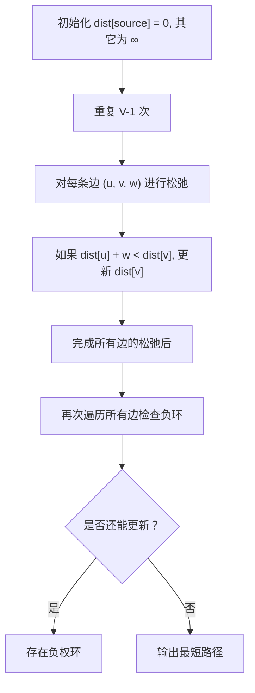
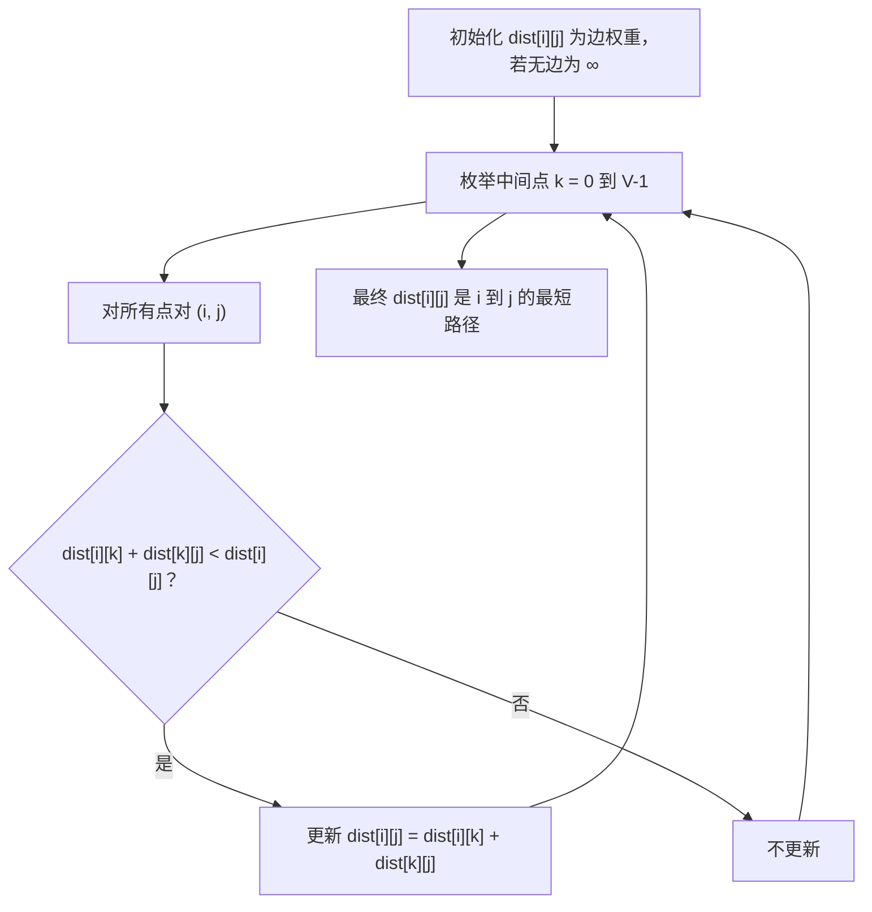

# 最短路径（Shortest Paths）

当我们浏览网页、发送电子邮件，或者从校园的另一处登录实验室里的计算机时，在后台发生了很多事，信息从一台计算机传送到另一台计算机。深入地研究信息在多台计算机之间的传送过程，是计算机网络课程的主要内容。本节将适当地讨论互联网的运作机制，并以此介绍另一个非常重要的图算法。

图1从整体上展示了互联网的通信机制。当使用浏览器访问某一台服务器上的网页时，访问请求必须通过路由器从本地局域网传送到互联网上，并最终到达该服务器所在局域网对应的路由器。然后，被请求的网页通过相同的路径被传送回浏览器。在图1中，标有“互联网”的云图标中有众多额外的路由器，它们的工作就是协同将信息从一处传送到另一处。如果你的计算机支持traceroute命令，可以利用它亲眼看到许多路由器。List 1展示了traceroute命令的执行结果：在路德学院的Web服务器和明尼苏达大学的邮件服务器之间有13个路由器。


<center>图1 互联网通信概览</center>


List1 服务器之间的路由器

```
1  192.203.196.1
2  hilda.luther.edu (216.159.75.1)
3  ICN-Luther-Ether.icn.state.ia.us (207.165.237.137)
4  ICN-ISP-1.icn.state.ia.us (209.56.255.1)
5  p3-0.hsa1.chi1.bbnplanet.net (4.24.202.13)
6  ae-1-54.bbr2.Chicago1.Level3.net (4.68.101.97)
7  so-3-0-0.mpls2.Minneapolis1.Level3.net (64.159.4.214)
8  ge-3-0.hsa2.Minneapolis1.Level3.net (4.68.112.18)
9  p1-0.minnesota.bbnplanet.net (4.24.226.74)
10  TelecomB-BR-01-V4002.ggnet.umn.edu (192.42.152.37)
11  TelecomB-BN-01-Vlan-3000.ggnet.umn.edu (128.101.58.1)
12  TelecomB-CN-01-Vlan-710.ggnet.umn.edu (128.101.80.158)
13  baldrick.cs.umn.edu (128.101.80.129)(N!)  88.631 ms (N!)


Routers from One Host to the Next over the Internet
```


> 从我的 Mac 到百度服务器之间的每一跳（hop）信息，包括：
>
> - 跳数（1、2、3...）
> - 中间路由器的 IP 地址或主机名
> - 三次探测的往返时间（RTT，单位为毫秒）
>
> 示例输出：
>
> ```
> % traceroute www.baidu.com
> traceroute: Warning: www.baidu.com has multiple addresses; using 182.61.200.108
> traceroute to www.a.shifen.com (182.61.200.108), 64 hops max, 40 byte packets
>  1  192.168.1.1 (192.168.1.1)  4.713 ms  1.685 ms  1.686 ms
>  2  162.105.253.246 (162.105.253.246)  5.211 ms * *
>  3  * * *
>  4  * * 162.105.251.10 (162.105.251.10)  4.092 ms
>  5  202.112.41.177 (202.112.41.177)  5.174 ms  5.313 ms  4.890 ms
>  6  100.64.111.1 (100.64.111.1)  5.377 ms  4.894 ms  7.656 ms
>  7  101.4.116.93 (101.4.116.93)  5.564 ms  5.319 ms  5.712 ms
>  8  219.224.103.85 (219.224.103.85)  6.163 ms  4.375 ms  4.225 ms
>  9  121.194.11.41 (121.194.11.41)  12.837 ms  5.486 ms  6.376 ms
> 10  101.4.129.142 (101.4.129.142)  6.843 ms  7.768 ms
>     101.4.129.138 (101.4.129.138)  5.964 ms
> 11  182.61.250.129 (182.61.250.129)  13.299 ms
>     182.61.255.38 (182.61.255.38)  7.410 ms *
> 12  182.61.255.47 (182.61.255.47)  14.749 ms
>     182.61.254.181 (182.61.254.181)  7.764 ms
>     182.61.254.171 (182.61.254.171)  15.665 ms
> 13  * * *
> 14  * * *
> 15  * * *
> 
> ```
>
> ⚠️ 注意：某些中间节点可能返回 `* * *`，表示该设备屏蔽了 traceroute 请求（常见于防火墙或运营商策略），这不一定是故障。
>
> 


互联网上的每一个路由器都与一个或多个其他的路由器相连。如果在不同的时间执行traceroute命令，极有可能看到信息在不同的路由器间流动。这是由于<mark>一对路由器之间的连接存在着一定的成本，成本大小取决于流量、时间段以及众多其他因素</mark>。至此，你应该能够理解为何可以用带权重的图来表示路由器网络。

图2展示了一个小型路由器网络对应的带权图。我们要解决的<mark>问题是为给定信息找到权重最小的路径</mark>。这个问题并不陌生，因为它和我们之前用宽度优先搜索解决过的问题十分相似，只不过现在考虑的是路径的总权重，而不是路径的长度。需要注意的是，如果所有的权重都相等，那么两个问题就没有区别。


<center>图2 小型路由器网络对应的带权图</center>


## 1 有权图Dijkstra, 无权图BFS

> Dijkstra算法与BFS（广度优先搜索）有相似之处，但它们有一些关键的区别。
>
> 1. **相似性**：
>    - Dijkstra算法和BFS都是用于图的遍历。
>    - 它们都从一个起始顶点开始，逐步扩展到邻居顶点，并以某种方式记录已经访问过的顶点。
>
> 2. **不同之处**：
>    - BFS是一种无权图的最短路径算法，它以层次遍历的方式遍历图，并找到从起始顶点到所有其他顶点的最短路径。
>    - Dijkstra算法是一种有权图的最短路径算法，它通过贪心策略逐步确定从起始顶点到所有其他顶点的最短路径。
>    - BFS使用队列来保存待访问的顶点，并按照顺序进行遍历。它不考虑权重，只关注路径的长度。
>    - Dijkstra算法使用优先队列（通常是最小堆）来保存待访问的顶点，并按照顶点到起始顶点的距离进行排序。它根据路径长度来决定下一个要访问的顶点，从而保证每次都是选择最短路径的顶点进行访问。
>
> 虽然Dijkstra算法的实现方式和BFS有些相似，但是它们解决的问题和具体实现细节有很大的不同。BFS适用于无权图的最短路径问题，而Dijkstra算法适用于有权图的最短路径问题。


> **Breadth First Search** explores equally in all directions. This is an incredibly useful algorithm, not only for regular path finding, but also for <mark>procedural map generation</mark>, flow field pathfinding, distance maps, and other types of map analysis.
> **Dijkstra’s Algorithm** (also called Uniform Cost Search) lets us prioritize which paths to explore. Instead of exploring all possible paths equally, it favors lower cost paths. We can assign lower costs to encourage moving on roads, <mark>higher costs to avoid enemies</mark>, and more. When movement costs vary, we use this instead of Breadth First Search.


Dijkstra算法可用于确定最短路径，它是一种循环算法，可以提供<mark>从一个顶点到其他所有顶点的最短路径</mark>。这与宽度优先搜索非常像。

为了记录从起点到各个终点的总开销，要利用Vertex类中的实例变量distance。该实例变量记录从起点到当前顶点的最小权重路径的总权重。<mark>Dijkstra算法针对图中的每个顶点都循环一次</mark>，但循环顺序是由一个优先级队列控制的。用来决定顺序的正是dist。在创建顶点时，将distance设为一个非常大的值。理论上可以将distance设为无穷大，但是实际一般将其设为一个大于所有可能出现的实际距离的值。

Dijkstra算法的实现如下。当程序运行结束时，distance和previous都会被设置成正确的值。

> 2024/4/14 说明：教材目前已经有第3版了。我尽量按照第3版做课件，例程与老版相比有稍微改动。

List1 Dijkstra算法的Python实现

```python
# https://github.com/psads/pythonds3
from pythonds3.graphs import PriorityQueue
def dijkstra(graph,start):
    pq = PriorityQueue()
    start.setDistance(0)
    pq.buildHeap([(v.getDistance(),v) for v in graph])
    while pq:
        distance, current_v = pq.delete()
        for next_v in current_v.getneighbors():
            new_distance = current_v.distance + current_v.get_neighbor(next_v) # + get_weight
            if new_distance < next_v.distance:
                next_v.distance = new_distance
                next_v.previous = current_v
                pq.change_priority(next_v,new_distance)
```

Dijkstra算法使用了优先级队列。在"树"那一章讲过如何用堆实现优先级队列。不过，当时的简单实现和用于Dijkstra算法的实现有几个不同点。首先，PriorityQueue类存储了键-值对的二元组。这对于Dijkstra算法来说非常重要，因为优先级队列中的键必须与图中顶点的键相匹配。其次，二元组中的值被用来确定优先级，对应键在优先级队列中的位置。在Dijkstra算法的实现中，我们使用了顶点的距离作为优先级，这是因为我们总希望访问距离最小的顶点。另一个不同点是增加了`change_priority`方法（第14行）。当到一个顶点的距离减少并且该顶点已在优先级队列中时，就调用这个方法，从而将该顶点移向优先级队列的头部。

```python
from pythonds3.trees.binary_heap import BinaryHeap
class PriorityQueue(BinaryHeap):
    def change_priority(self, search_key: Any, new_priority: Any) -> None:
        key_to_move = -1
        for i, (_, key) in enumerate(self._heap):
            if key == search_key:
                key_to_move = i
                break
        if key_to_move > -1:
            self._heap[key_to_move] = (new_priority, search_key)
            self._perc_up(key_to_move)

    def __contains__(self, search_key: Any) -> bool:
        for _, key in self._heap:
            if key == search_key:
                return True
        return False
```

对照图3 来理解如何针对每一个顶点应用Dijkstra算法。从顶点u开始，与u相邻的3个顶点分别是v、w和x。由于到v、w和x的初始距离都是`sys.maxint`，因此从起点到它们的新开销就是直接开销。更新这3个顶点的开销，同时将它们的前驱顶点设置成 u，并将它们添加到优先级队列中。使用距离作为优先级队列的键。此时，算法运行的状态如图3a所示。


<center>图3 Dijkstra算法的应用过程</center>

下一次while循环检查与x相邻的顶点。之所以x是第2个被访问的顶点，是因为它到起点的开销最小，因此排在了优先级队列的头部。与x相邻的有u、v、w和y。对于每一个相邻顶点，检查经由x到它的距离是否比已知的距离更短。显然，对于y来说确实如此，因为它的初始距离是`sys.maxsize`；对于u和v来说则不然，因为它们的距离分别为0和2。但是，我们发现经过x到w的距离比直接从u到w的距离要短。因此，<mark>将到达w的距离更新为更短的值，并且将w的前驱顶点从u改为x</mark>。图3b展示了此时的状态。

下一步检查与v相邻的顶点。这一步没有对图做任何改动，因此继续检查顶点y。此时，发现经由y到达w和z的距离都更短，因此相应地调整它们的距离及前驱顶点。最后检查w和z，发现不需要做任何改动。由于优先级队列为空，因此退出。

非常重要的一点是，<mark>Dijkstra算法只适用于边的权重均为正的情况</mark>。如果图2中有一条边的权重为负，那么Dijkstra算法永远不会退出。

除了Dijkstra算法，还有其他一些算法被用于寻找最短路径。Dijkstra算法的问题是需要有完整的图，这意味着每一个路由器都要知道整个互联网的路由器连接情况，而事实并非如此。<mark>Dijkstra算法的一些变体</mark>允许每个路由器在运行时才发现图，例如“距离向量”路由算法。


**练习28972: 海拔**

优化解法是 Dijkstra变形。http://cs101.openjudge.cn/practice/28972


### 分析Dijkstra算法

最后，我们来分析Dijkstra算法的时间复杂度。开始时，要将图中的每一个顶点都添加到优先级队列中，这个操作的时间复杂度是$O(V)$。优先级队列构建完成之后，`while`循环针对每一个顶点都执行一次，这是由于一开始所有顶点都被添加到优先级队列中，并且只在循环时才被移除。在循环内部，每次对`pq.delete`的调用都是$O(V \log V)$。综合起来考虑，循环和delMin调用的总时间复杂度是$O(V \log V)$。for循环对图中的每一条边都执行一次，并且循环内部的`change_priority`调用为$O(E \log V)$。因此，总的时间复杂度为$O((V+E) \log V)$。

### 通常的Dijkstra实现

使用 `heapq` 来实现 Dijkstra 算法的完整 Python 代码。这个实现包括了图的类表示，顶点类，以及 Dijkstra 算法的具体逻辑。

通过维护一个 `visited` 集合，可以确保每个顶点只被处理一次。

这个实现也包括了输出每个顶点的最短距离和从起始点到每个顶点的具体路径。

使用 `heapq` 模块确实是一个好选择，因为它通常比 `PriorityQueue` 更为高效。

> `PriorityQueue，即 Python 标准库中 `queue.PriorityQueue`，其底层实际上是基于 `heapq`实现的。就像`heapq`，`PriorityQueue` 也没有直接支持修改队列中元素优先级的内置方法。`PriorityQueue`提供线程安全的队列操作，适用于多线程程序，但它并不支持如`decrease-key` 操作，这种操作在很多图算法中非常有用。
>
> 要实现修改优先级的功能，可以采用与 `heapq` 类似的策略：将新的优先级作为一个新的条目加入到队列中，并通过一种机制（比如标记或记录）忽略或移除旧的条目。这种方法在 `PriorityQueue` 中同样适用，但要注意它的线程安全性和性能影响。

**Dijkstra算法**：Dijkstra算法用于解决单源最短路径问题，即从给定源节点到图中所有其他节点的最短路径。算法的基本思想是通过不断扩展离源节点最近的节点来逐步确定最短路径。具体步骤如下：

- 初始化一个距离数组，用于记录源节点到所有其他节点的最短距离。初始时，源节点的距离为0，其他节点的距离为无穷大。
- 选择一个未访问的节点中距离最小的节点作为当前节点。
- 更新当前节点的邻居节点的距离，如果通过当前节点到达邻居节点的路径比已知最短路径更短，则更新最短路径。
- 标记当前节点为已访问。
- 重复上述步骤，直到所有节点都被访问或者所有节点的最短路径都被确定。

Dijkstra算法的时间复杂度为$O(V^2)$，其中V是图中的节点数。当使用优先队列（如最小堆）来选择距离最小的节点时，可以将时间复杂度优化到$O((V+E)\log V)$，其中E是图中的边数。

Dijkstra_OOP.py 程序在 https://github.com/GMyhf/2024spring-cs201/tree/main/code

```python
import heapq
import sys

class Vertex:
    def __init__(self, key):
        self.id = key
        self.connectedTo = {}
        self.distance = sys.maxsize
        self.pred = None

    def addNeighbor(self, nbr, weight=0):
        self.connectedTo[nbr] = weight

    def getConnections(self):
        return self.connectedTo.keys()

    def getWeight(self, nbr):
        return self.connectedTo[nbr]

    def __lt__(self, other):
        return self.distance < other.distance

class Graph:
    def __init__(self):
        self.vertList = {}
        self.numVertices = 0

    def addVertex(self, key):
        newVertex = Vertex(key)
        self.vertList[key] = newVertex
        self.numVertices += 1
        return newVertex

    def getVertex(self, n):
        return self.vertList.get(n)

    def addEdge(self, f, t, cost=0):
        if f not in self.vertList:
            self.addVertex(f)
        if t not in self.vertList:
            self.addVertex(t)
        self.vertList[f].addNeighbor(self.vertList[t], cost)

def dijkstra(graph, start):
    pq = []
    start.distance = 0
    heapq.heappush(pq, (0, start))
    visited = set()

    while pq:
        currentDist, currentVert = heapq.heappop(pq)    # 当一个顶点的最短路径确定后（也就是这个顶点
                                                        # 从优先队列中被弹出时），它的最短路径不会再改变。
        if currentVert in visited:
            continue
        visited.add(currentVert)

        for nextVert in currentVert.getConnections():
            newDist = currentDist + currentVert.getWeight(nextVert)
            if newDist < nextVert.distance:
                nextVert.distance = newDist
                nextVert.pred = currentVert
                heapq.heappush(pq, (newDist, nextVert))

# 创建图和边
g = Graph()
g.addEdge('A', 'B', 4)
g.addEdge('A', 'C', 2)
g.addEdge('C', 'B', 1)
g.addEdge('B', 'D', 2)
g.addEdge('C', 'D', 5)
g.addEdge('D', 'E', 3)
g.addEdge('E', 'F', 1)
g.addEdge('D', 'F', 6)

# 执行 Dijkstra 算法
print("Shortest Path Tree:")
dijkstra(g, g.getVertex('A'))

# 输出最短路径树的顶点及其距离
for vertex in g.vertList.values():
    print(f"Vertex: {vertex.id}, Distance: {vertex.distance}")

# 输出最短路径到每个顶点
def printPath(vert):
    if vert.pred:
        printPath(vert.pred)
        print(" -> ", end="")
    print(vert.id, end="")

print("\nPaths from Start Vertex 'A':")
for vertex in g.vertList.values():
    print(f"Path to {vertex.id}: ", end="")
    printPath(vertex)
    print(", Distance: ", vertex.distance)

"""
Shortest Path Tree:
Vertex: A, Distance: 0
Vertex: B, Distance: 3
Vertex: C, Distance: 2
Vertex: D, Distance: 5
Vertex: E, Distance: 8
Vertex: F, Distance: 9

Paths from Start Vertex 'A':
Path to A: A, Distance:  0
Path to B: A -> C -> B, Distance:  3
Path to C: A -> C, Distance:  2
Path to D: A -> C -> B -> D, Distance:  5
Path to E: A -> C -> B -> D -> E, Distance:  8
Path to F: A -> C -> B -> D -> E -> F, Distance:  9
"""
```


### 练习03424: Candies

dijkstra, http://cs101.openjudge.cn/practice/03424/

在幼儿园的日子里，flymouse 是他们班的班长。有一次班主任给 flymouse 所在班级的孩子们带来了一大袋糖果，让 flymouse 分发给大家。所有的孩子都非常喜欢吃糖，经常互相比较各自拿到的糖果数量。一个孩子 A 可能会有这样的想法：虽然另一个孩子 B 在某些方面比自己优秀，因此可能应该拿到更多的糖果，但无论如何，自己拿到的糖果数量绝不能比 B 少超过某个特定的数量，否则他就会感到不满意，并去找班主任投诉说 flymouse 分配不公。

当时 snoopy 和 flymouse 是同班同学。flymouse 总是喜欢把自己和 snoopy 拿到的糖果数量做比较。他想在保证所有孩子都满意的前提下，使两人之间拿到的糖果数量差尽可能地大。现在他已经从老师那里拿到了另一袋糖果，那么他最多能让这个差距有多大呢？

**输入**

输入包含一个单独的测试用例。测试用例 以一行两个整数 N 和 M 开始，分别表示班里的孩子数量（不超过 30,000）和约束条件数量（不超过 150,000）。孩子们编号为 1 到 N，其中 snoopy 和 flymouse 的编号始终是 1 和 N。接下来有 M 行，每行给出三个整数 A、B 和 c，表示孩子 A 认为孩子 B 拿到的糖果数永远不能比他多出超过 c 个。


**输出**

输出一行，仅包含一个整数，表示 flymouse 和 snoopy 能够产生的最大糖果数量差（即 snoopy 拿到的数量减去 flymouse 拿到的数量的最大值）。

题目保证这个最大差值是有限的。

**样例输入**

```
2 2
1 2 5
2 1 4
```

**样例输出**

```
5
```


参考：https://blog.csdn.net/Maxwei_wzj/article/details/60464314

题目大意：幼儿园一个班里有N个小朋友（标号为1~N），一个小朋友flymouse（为N号）被校长指定去发糖，有M个条件，每个条件三个参数A,B,c，表示小朋友A不希望小朋友B有比他多超过c个的糖，班里还有另一个小朋友snoopy（为1号），flymouse希望自己得到的糖果比snoopy的尽量多，求最大的差值。

做法：这里引入一个叫<mark>差分约束系统</mark>的东西，大概就是给定一系列这样形式的不等式：`xi-xj<=bk`，然后求某两个xa和xb的差的最大值，即`max(xa-xb)`。正确的方法是，如果存在一个`xi-xj<=bk`这样的不等式，就从j引一条指向i的边权为bk的有向边，这样就可以构成一个有向图，然后求`max(xa-xb)`就是求从b到a的最短路径。为什么呢？因为我们看任意一条简单路径：b,s1,s2,...,sn,a，其中相邻两点间边权依次为b0,b1,...,bn，所以`xs1-xb<=b0,xs2-xs1<=b1,...,xa-xsn<=bn`,所以`xa-xb=(xa-xsn)+...+(xs2-xs1)+(xs1-xb)<=b0+b1+...+bn`，所以我们可以得到`xa-xb`必定不超过任意从b到a的简单路径上边权的和，也就是说任何一条路径都是一个上界，所以要求最大值也就是求最小的上界，也就是求最短路了。

> 差分约束系统是一个整体系统，我们需要找到所有约束都满足的前提下，目标变量差值的最大值。

而这一题模型比较简单，构图很容易，对于每个条件直接连A->B，边权为c即可，然后求从1到N的最短路。


直接使用邻接表表示图，代码更简短

Dijkstra.py 程序在 https://github.com/GMyhf/2024spring-cs201/tree/main/code

```python
# 03424: Candies
# http://cs101.openjudge.cn/practice/03424/
import heapq

def dijkstra(N, G, start):
    INF = float('inf')
    dist = [INF] * (N + 1)  # 存储源点到各个节点的最短距离
    dist[start] = 0  # 源点到自身的距离为0
    pq = [(0, start)]  # 使用优先队列，存储节点的最短距离
    while pq:
        d, node = heapq.heappop(pq)  # 弹出当前最短距离的节点
        if d > dist[node]:  # 如果该节点已经被更新过了，则跳过
            continue
        for neighbor, weight in G[node]:  # 遍历当前节点的所有邻居节点
            new_dist = dist[node] + weight  # 计算经当前节点到达邻居节点的距离
            if new_dist < dist[neighbor]:  # 如果新距离小于已知最短距离，则更新最短距离
                dist[neighbor] = new_dist
                heapq.heappush(pq, (new_dist, neighbor))  # 将邻居节点加入优先队列
    return dist


N, M = map(int, input().split())
G = [[] for _ in range(N + 1)]  # 图的邻接表表示
for _ in range(M):
    s, e, w = map(int, input().split())
    G[s].append((e, w))


start_node = 1  # 源点
shortest_distances = dijkstra(N, G, start_node)  # 计算源点到各个节点的最短距离
print(shortest_distances[-1])  # 输出结果
```


### 练习LC743.网络延迟时间

Dijkstra, https://leetcode.cn/problems/network-delay-time/description/


## 2 Bellman-Ford算法

在图论中，有两种常见的方法用于求解最短路径问题：**Dijkstra算法**和**Bellman-Ford算法**。这两种算法各有优劣，选择哪种算法取决于图的特性和问题要求。如果图中没有负权边，并且只需要求解<Mark>单源</mark>最短路径，Dijkstra算法通常是一个较好的选择。如果图中存在负权边或需要检测负权回路，可以使用Bellman-Ford算法。

### 🔹 Bellman-Ford 算法原理

- **思想**：<mark>动态规划 + 松弛思想</mark>
- 每次迭代尝试通过已知的最短路径更新其他路径（松弛）
- 最多只需进行 V-1 次迭代，因为最短路径最多经过 V-1 个顶点
- 第 V 次检测是否还能更新，用于发现负权环

> ✅ 关键：松弛操作（Relaxation）


> **Bellman-Ford算法**：Bellman-Ford算法用于解决单源最短路径问题，与Dijkstra算法不同，它可以处理带有负权边的图。算法的基本思想是通过松弛操作逐步更新节点的最短路径估计值，直到收敛到最终结果。具体步骤如下：
>
> - 初始化一个距离数组，用于记录源节点到所有其他节点的最短距离。初始时，源节点的距离为0，其他节点的距离为无穷大。
> - 进行V-1次循环（V是图中的节点数），每次循环对所有边进行松弛操作。如果从节点u到节点v的路径经过节点u的距离加上边(u, v)的权重比当前已知的从源节点到节点v的最短路径更短，则更新最短路径。
> - 检查是否存在负权回路。<mark>如果在V-1次循环后，仍然可以通过松弛操作更新最短路径，则说明存在负权回路，因此无法确定最短路径</mark>。

Bellman-Ford算法的时间复杂度为$O(VE)$，其中V是图中的节点数，E是图中的边数，适合<mark>边稀疏图</mark>（边数远小于$V^2$ ）。

> 在图论中，<mark>稠密图（Dense Graph）</mark>和<mark>稀疏图（Sparse Graph）</mark>是根据图中边的数量相对于顶点数量的多少来区分的：
>
> 1. 稠密图（Dense Graph）：
>    • 定义：稠密图是指边数接近或达到完全图（即任意两个不同的顶点之间都有一条边相连）的图。对于一个具有 V 个顶点的图，完全图的边数为 $\frac {V(V−1)}2$，大约为 $O(V^2)$。
>
>    • 特点：稠密图中边的数量较多，通常 E（边数）接近 $V^2$ 或者 $E=Θ(V^2)$。
>
>    • 适用算法：由于稠密图中边数较多，适合使用时间复杂度为 $O(V^3)$ 的算法，如 Floyd-Warshall 算法。这是因为 Floyd-Warshall 算法在处理所有顶点对之间的最短路径时，其时间复杂度与 $V^3$ 成正比，对于稠密图来说效率相对较高。
>
> 2. 稀疏图（Sparse Graph）：
>    • 定义：稀疏图是指边数远少于完全图的图，通常 E 远小于 $V^2$，比如 $E=O(V)$ 或 $E=O(V \log V)$。
>
>    • 特点：稀疏图中边的数量较少，结构较为松散。
>
>    • 适用算法：对于稀疏图，使用时间复杂度为 $O(VE)$ 的算法（如 Bellman-Ford 算法）通常更为高效，因为 VE 在稀疏图中远小于 $V^3$。
>
> 总结：
> • 稠密图：边数接近 $V^2$，适合使用 Floyd-Warshall 等 $O(V^3)$ 的算法。
>
> • 稀疏图：边数远小于 $V^2$，适合使用 Bellman-Ford 等 $O(VE)$ 的算法。
>
> 选择合适的算法取决于图的密度，以优化计算效率和资源消耗。


#### ✅ Bellman-Ford 为什么“松弛 V-1 次”是对的？

最短路径最多 V-1 条边；每次松弛尝试传递更短的路径。

📌 **本质是“路径最多有 V-1 条边”**

- 在没有负环的图中，从起点出发到任意一个点，最多走 **V-1 条边**（因为图中有 V 个点，路径不能重复经过点，否则就成环了）。
- 每次“松弛”一条边，相当于尝试把路径从 u → v 变短（如果可以）。
- 所以我们执行 V-1 轮，每轮遍历所有边，把所有可能的路径更新出来。

> 🌱 **直觉类比**：
> 假设你传递消息，起点知道自己是 0 步，第一轮传给邻居，第二轮邻居的邻居知道……传 V-1 轮就把消息传满了。
> 这就像广播传播，最远需要 V-1 步。

------

✅ **正确性的归纳证明（略简化）：**

- **初始状态**：起点到自己距离是 0，其他是 ∞。
- **归纳假设**：第 k 轮后，所有最短路径至多包含 k 条边的点都被正确更新。
- **第 k+1 轮**：再通过所有边松弛，更新包含 k+1 条边的路径。
- 所以 V-1 次可以更新最多包含 V-1 条边的最短路径。
- 第 V 次如果还能更新，那一定存在环（负权环）。


### 🔄 Bellman-Ford流程图



<center>Bellman-Ford流程图</center>

> SPFA是"Shortest Path Faster Algorithm"的缩写，中文名称为最短路径快速算法。它是一种用于解决带有负权边的图中单源最短路径问题的算法。
>
> SPFA算法是对Bellman-Ford算法的一种优化，旨在减少算法的时间复杂度。Bellman-Ford算法的时间复杂度为O(V*E)，其中V是顶点数，E是边数。而<mark>SPFA算法通过引入一个队列来避免对所有边进行松弛操作，从而减少了不必要的松弛操作</mark>，提高了算法的效率。
>
> SPFA算法的基本思想如下：
> 1. 初始化源节点的最短距离为0，其他节点的最短距离为正无穷大。
> 2. 将源节点加入队列中，并标记为已访问。
> 3. 循环执行以下步骤直到队列为空：
>    - 从队列中取出一个节点作为当前节点。
>    - 遍历当前节点的所有邻接节点：
>      - 如果经过当前节点到达该邻接节点的路径比当前记录的最短路径更短，则更新最短路径，并将该邻接节点加入队列中。
> 4. 当队列为空时，算法结束，所有节点的最短路径已计算出来。
>
> SPFA算法在实际应用中通常表现出良好的性能，尤其适用于稀疏图（边数相对较少）和存在负权边的情况。然而，需要注意的是，<mark>如果图中存在负权环路，SPFA算法将无法给出正确的结果</mark>。
>


### ✅示例Bellman-Ford 算法

```python
def bellman_ford(graph, V, source):
    # 初始化距离
    dist = [float('inf')] * V
    dist[source] = 0

    # 松弛 V-1 次
    for _ in range(V - 1):
        for u, v, w in graph:
            if dist[u] != float('inf') and dist[u] + w < dist[v]:
                dist[v] = dist[u] + w

    # 检测负权环
    for u, v, w in graph:
        if dist[u] != float('inf') and dist[u] + w < dist[v]:
            print("图中存在负权环")
            return None

    return dist

# 图是边列表，每条边是 (起点, 终点, 权重)
edges = [
    (0, 1, 5),
    (0, 2, 4),
    (1, 3, 3),
    (2, 1, 6),
    (3, 2, -2)
]
V = 4
source = 0

print(bellman_ford(edges, V, source))
```


**示例 SPFA算法**

> 将 Bellman-Ford 算法程序改写为 **SPFA (Shortest Path Faster Algorithm)** 算法。
>
> SPFA 的核心思想是使用一个**队列**来维护那些距离被更新、可能还需要去松弛其邻接点的顶点，从而避免像 Bellman-Ford 那样每轮都遍历所有边。
>
> ```python
> from collections import deque
> 
> def spfa(graph, V, source):
>     """
>     使用 SPFA 算法求解单源最短路径。
>     
>     参数:
>     graph: 邻接表表示的图，graph[u] = [(v, w), ...] 表示从 u 到 v 的边权重为 w
>     V: 顶点数量
>     source: 源点
>     
>     返回:
>     dist: 从源点到各顶点的最短距离列表，如果存在负权环则返回 None
>     """
>     # 初始化距离数组
>     dist = [float('inf')] * V
>     dist[source] = 0
> 
>     # 队列，存储需要处理的顶点
>     queue = deque()
>     queue.append(source)
> 
>     # 入队次数数组，用于检测负权环
>     in_queue_count = [0] * V
>     in_queue_count[source] = 1
> 
>     # 标记顶点是否在队列中，避免重复入队
>     in_queue = [False] * V
>     in_queue[source] = True
> 
>     # SPFA 主循环
>     while queue:
>         # 取出队首顶点 u
>         u = queue.popleft()
>         in_queue[u] = False  # 标记为不在队列中
> 
>         # 遍历 u 的所有邻接顶点 v
>         for v, w in graph[u]:
>             # 尝试松弛边 (u, v)
>             if dist[u] != float('inf') and dist[u] + w < dist[v]:
>                 dist[v] = dist[u] + w  # 更新最短距离
> 
>                 # 如果 v 不在队列中，则将其加入队列
>                 if not in_queue[v]:
>                     queue.append(v)
>                     in_queue[v] = True
>                     in_queue_count[v] += 1
> 
>                     # 如果某个顶点入队次数超过 V-1 次，则存在负权环
>                     if in_queue_count[v] > V - 1:
>                         print("图中存在负权环")
>                         return None
> 
>     return dist
> 
> 
> # ================ 使用示例 ================
> 
> # 原始的边列表
> edges = [
>     (0, 1, 5),
>     (0, 2, 4),
>     (1, 3, 3),
>     (2, 1, 6),
>     (3, 2, -2)
> ]
> 
> V = 4
> source = 0
> 
> # 将边列表转换为邻接表
> graph = [[] for _ in range(V)]
> for u, v, w in edges:
>     graph[u].append((v, w))
> 
> # 调用 SPFA 算法
> result = spfa(graph, V, source)
> 
> if result is not None:
>     print("各顶点的最短距离:", result)
> else:
>     print("无法计算最短路径（存在负权环）")
> 
> ```
>
> 主要改动说明：
>
> 1.  **数据结构变更**：
>     *   输入的 `graph` 从**边列表** `(u, v, w)` 改为**邻接表** `graph[u] = [(v, w), ...]`。这是 SPFA 的标准输入形式，便于快速访问一个顶点的所有出边。
>     *   引入了 `deque` 作为队列。
>     *   引入了 `in_queue` 列表来标记顶点是否在队列中，避免重复入队（优化性能）。
>     *   引入了 `in_queue_count` 列表来记录每个顶点的入队次数，用于检测负权环。
>
> 2.  **算法逻辑变更**：
>     *   移除了 `V-1` 轮的外层循环。
>     *   使用 `while queue:` 循环，持续处理队列中的顶点。
>     *   每次从队列中取出一个顶点 `u`，然后遍历其所有邻接点 `v`，进行松弛操作。
>     *   如果 `v` 的距离被更新且 `v` 不在队列中，则将 `v` 入队，并增加其入队计数。
>     *   如果任何顶点的入队次数超过 `V-1`，则判定存在负权环。
>
> 3.  **负权环检测**：
>     *   不再通过额外遍历所有边来检测，而是通过监控顶点的入队次数。这是 SPFA 检测负权环的常用方法。
>
> 运行结果
>
> 对于你提供的图，运行结果应该是：
> ```
> 各顶点的最短距离: [0, 5, 4, 8]
> ```
>
> 这个结果与 Bellman-Ford 算法一致，但 SPFA 在稀疏图上通常会更快，因为它避免了对无效边的重复检查。


### ✅Dijkstra算法和Bellman-Ford算法对比

Dijkstra算法和Bellman-Ford算法都可以用于计算从一个源点到图中其他所有顶点的最短路径，但它们在处理问题的方式、适用场景以及算法效率上有所区别。

- **Dijkstra算法**：主要用于没有负权边的加权图。它能够有效地找到从单个源点到图中所有其他顶点的最短路径。该算法采用贪心策略，每次选择当前距离最小的未访问节点进行扩展。由于其高效的实现（比如使用优先队列），对于大规模稀疏图来说，Dijkstra算法的时间复杂度通常为O((V+E) log V)，其中V是顶点数，E是边数。

- **Bellman-Ford算法**：适用于可能包含负权边的加权图，并且可以检测出负权环（即总权重为负的环）。如果存在负权环并且它是可达的，那么最短路径不再有意义，因为可以通过绕环多次任意减少路径长度。Bellman-Ford算法通过迭代每条边最多V-1次来松弛（更新）到达每个顶点的最短路径估计值，因此其时间复杂度为O(VE)。此外，Bellman-Ford还可以报告是否发现可以从源节点到达的负权环。

简而言之，虽然两个算法都可用于寻找从一个源点到图中其他所有顶点的最短路径，但在面对可能存在负权边的情况时，Bellman-Ford算法更为适用；而在仅处理非负权边的情况下，Dijkstra算法因其更高的效率通常是首选。


### Bellman-Ford特定应用需求

货币兑换套利检测：<mark>在金融领域</mark>，用于检测是否存在通过一系列货币兑换操作获得利润的<mark>套利</mark>机会，这涉及到带负权边的图模型。

> 套利是指利用不同市场之间价格不一致的情况进行交易以获取无风险利润的行为。

网络路由优化：在网络路由中，边的权重可能表示延迟或成本，可能存在负值。Bellman-Ford算法可用于寻找最短路径并避免负权回路导致的路由循环。

> **为什么网络路由中可能出现负权边？**
>
> 虽然在实际物理网络中，延迟或成本通常是非负的，但在某些抽象模型或策略性路由（如基于经济激励、服务质量补偿、虚拟网络切片等）中，可能会人为引入**负权重**来表示“收益”、“奖励”或“优先路径”。例如：
>
> - 某条链路提供补贴，使用它反而“降低成本”；
> - 某路径因负载均衡策略被赋予负的调整因子。


### 练习M01860: Currency Exchange

Bellman-Ford, http://cs101.openjudge.cn/practice/01860/

我们城市中有多个货币兑换点。假设每个兑换点专门处理两种特定的货币，并且仅在这两种货币之间进行兑换操作。相同的货币对可能会有多个兑换点同时处理。每个兑换点都有自己的汇率，其中 A 到 B 的汇率表示的是用 1 单位 A 可以兑换到多少单位 B。此外，每个兑换点都收取一定的手续费，该费用是你在进行兑换时需要支付的金额，且手续费总是以原始货币（即兑换前的货币）来计算。

例如，如果你想在某个兑换点将 100 美元兑换成俄罗斯卢布，该兑换点的汇率为 29.75，手续费为 0.39，那么你最终会得到 (100 - 0.39) * 29.75 = 2963.3975 卢布。

当然你知道，在我们城市中你可以使用的货币共有 N 种。让我们将每种货币编号为从 1 到 N 的唯一整数。那么每一个兑换点可以用以下六个数字来描述：整数 A 和 B 表示它兑换的两种货币；实数 RAB、CAB、RBA 和 CBA 分别表示从 A 兑换到 B 以及从 B 兑换到 A 的汇率和手续费。

Nick 手中目前拥有某种货币 S 的一定数量的资金。他想知道是否可以通过一系列兑换操作使得自己的资金增加。当然，最后他希望手中仍然持有货币 S。请帮助他回答这个难题。在整个兑换过程中，Nick 必须始终保持其账户中的资金为非负值。

> Several currency exchange points are working in our city. Let us suppose that each point specializes in two particular currencies and performs exchange operations only with these currencies. There can be several points specializing in the same pair of currencies. Each point has its own exchange rates, exchange rate of A to B is the quantity of B you get for 1A. Also each exchange point has some commission, the sum you have to pay for your exchange operation. Commission is always collected in source currency.
> For example, if you want to exchange 100 US Dollars into Russian Rubles at the exchange point, where the exchange rate is 29.75, and the commission is 0.39 you will get (100 - 0.39) * 29.75 = 2963.3975RUR. 
> You surely know that there are N different currencies you can deal with in our city. Let us assign unique integer number from 1 to N to each currency. Then each exchange point can be described with 6 numbers: integer A and B - numbers of currencies it exchanges, and real RAB, CAB, RBA and CBA - exchange rates and commissions when exchanging A to B and B to A respectively.
> Nick has some money in currency S and wonders if he can somehow, after some exchange operations, increase his capital. Of course, he wants to have his money in currency S in the end. Help him to answer this difficult question. Nick must always have non-negative sum of money while making his operations.

**输入**

输入的第一行包含四个数字：N — 货币种类的数量，M — 兑换点的数量，S — Nick 当前拥有的货币种类编号，V — 他拥有的该货币的数量。接下来的 M 行，每行给出一个兑换点的信息，格式如上所述。数据之间由一个或多个空格分隔。1 ≤ S ≤ N ≤ 100，1 ≤ M ≤ 100，V 是一个实数，范围是 0 ≤ V ≤ 10³。每个兑换点的汇率和手续费都是实数，保留两位小数，其中汇率范围为 10⁻² ≤ 汇率 ≤ 10²，手续费范围为 0 ≤ 手续费 ≤ 10²。

我们将一组兑换操作称为“简单”的，如果这组操作中没有一个兑换点被使用超过一次。你可以假设对于任何一组“简单”的兑换操作，其最终金额与初始金额之比小于 10⁴。

> The first line of the input contains four numbers: N - the number of currencies, M - the number of exchange points, S - the number of currency Nick has and V - the quantity of currency units he has. The following M lines contain 6 numbers each - the description of the corresponding exchange point - in specified above order. Numbers are separated by one or more spaces. 1<=S<=N<=100, 1<=M<=100, V is real number, 0<=V<=10^3.
> For each point exchange rates and commissions are real, given with at most two digits after the decimal point, 10-2<=rate<=10^2, 0<=commission<=10^2.
> Let us call some sequence of the exchange operations simple if no exchange point is used more than once in this sequence. You may assume that ratio of the numeric values of the sums at the end and at the beginning of any simple sequence of the exchange operations will be less than 10^4.

**输出**

如果 Nick 能通过某些兑换操作增加他的财富，请输出 YES，否则输出 NO。

> If Nick can increase his wealth, output YES, in other case output NO to the output file.


样例输入

```
3 2 1 20.0
1 2 1.00 1.00 1.00 1.00
2 3 1.10 1.00 1.10 1.00
```

样例输出

```
YES
```

来源

Northeastern Europe 2001, Northern Subregion


要判断 Nick 是否能通过一系列兑换操作把初始货币 S 的数量从 V 增加到更大，可以把每种货币看作图中的一个节点，把每个兑换点的两个方向兑换看作两条有向边，然后在这张图上做「最大可达金额」的松弛（relax），等价于在带「非线性」边权下做一次 Bellman–Ford 检测正环。

------

**算法思路**

1. **节点**：货币种类编号 1…N。

2. **边**：每个兑换点 i（描述为 A,B,RAB,CAB,RBA,CBA）对应两条有向边：

   - 从 A 到 B，如果当前在 A 手上有 x 单位，可以兑换到

     $x′=(x−CAB)×RAB$

     但仅当 x>CAB 时才可能兑换，不然兑换后金额为负。

   - 从 B 到 A，同理：

     $x′=(x−CBA)×RBA$

3. **状态**：用数组 best[1..N] 记录在每个货币上能够达到的“最大金额”。初始化：

   $best[S]=V,best[i≠S]=0$.

4. **松弛操作**：对每条有向边 (u→v) 重复下面操作：

   ```text
   if best[u] > fee(u→v)  then
       best[v] = max(best[v], (best[u] - fee(u→v)) * rate(u→v))
   ```

5. **检测“增益回路”**：

   - 纯粹为了把“最终回到 S 的金额 > V”这一目标化为「检测可达正权环」：
     - 在做了 N−1 次松弛之后，若还能在第 N 次松弛中让任意节点的 best 值发生增大，就说明图中存在能够无限增大的“套利回路”；
     - 或者在任何一次松弛中，best[S] 超过了初始值 V，就可以立即判定为 “YES”。

6. **复杂度**：节点数 N≤100，边数 2M≤200。Bellman–Ford 最坏 $O(N ⁣× ⁣M)=10^4$ 级别，完全可以接受。

```python
import sys

def main():
    # 读取第一行：N, M, S, V
    data = sys.stdin.read().strip().split()
    N, M = map(int, data[:2])
    S = int(data[2])       # 起始货币编号
    V = float(data[3])     # 起始金额

    # 解析后续每个兑换点的信息
    edges = []
    idx = 4
    for _ in range(M):
        A = int(data[idx]);     B = int(data[idx+1])
        R_ab = float(data[idx+2]);  C_ab = float(data[idx+3])
        R_ba = float(data[idx+4]);  C_ba = float(data[idx+5])
        idx += 6

        # 从 A->B 的边
        edges.append((A, B, R_ab, C_ab))
        # 从 B->A 的边
        edges.append((B, A, R_ba, C_ba))

    # best[i] 表示最终能在货币 i 上得到的最大金额
    best = [0.0] * (N + 1)
    best[S] = V

    # Bellman–Ford 核心：最多做 N 轮松弛
    for iteration in range(1, N + 1):
        updated = False
        for u, v, rate, fee in edges:
            if best[u] > fee:
                x = (best[u] - fee) * rate
                if x > best[v] + 1e-12:  # 加一点 eps 防止浮点误差
                    best[v] = x
                    updated = True

                    # 如果再次更新回了起始货币 S，且金额大于初始值，立刻输出 YES
                    if v == S and best[S] > V:
                        print("YES")
                        return

        # 如果第 N 轮仍有更新，说明存在正增益回路
        if iteration == N and updated:
            print("YES")
            return

        # 没有任何更新，可提前结束
        if not updated:
            break

    # 没发现任何增益方案
    print("NO")


if __name__ == "__main__":
    main()

```

------

用这段代码，可以在 $O(NM)$ 时间内判断是否存在一个“简单序列”（至多用每个兑换点一次）能让 Nick 最终的 S 货币金额超过他最初的 V。


```python
"""
https://blog.csdn.net/weixin_44226181/article/details/127239846
This problem can be solved using the Bellman-Ford algorithm. The Bellman-Ford algorithm
is used to find the shortest path from a single source vertex to all other vertices
in a weighted graph. In this case, the graph is the currency exchange graph, where
each vertex represents a currency and each edge represents an exchange rate between
two currencies.  The Bellman-Ford algorithm works by iteratively relaxing the edges
of the graph. In each iteration, it checks all edges and updates the shortest path
if a shorter path is found. This process is repeated for N-1 times, where N is the
number of vertices in the graph.
However, in this problem, we are not looking for the shortest path, but rather a
cycle that increases the value. This can be detected by running the Bellman-Ford
algorithm one more time after the N-1 iterations. If the value continues to increase,
then there is a positive cycle.
"""
class Node:
    def __init__(self, a, b, r, c):
        self.a = a
        self.b = b
        self.r = r
        self.c = c

def add(a, b, r, c, e):
    e.append(Node(a, b, r, c))

def bellman_ford(e, dis, n, s, v):
    dis[s] = v
    for _ in range(n-1):
        flag = False
        for edge in e:
            if dis[edge.b] < (dis[edge.a] - edge.c) * edge.r:
                dis[edge.b] = (dis[edge.a] - edge.c) * edge.r
                flag = True
        if not flag:
            return False
    for edge in e:
        if dis[edge.b] < (dis[edge.a] - edge.c) * edge.r:
            return True
    return False

def main():
    n, m, s, v = map(float, input().split())
    n = int(n)
    s = int(s)
    e = []
    dis = [0] * (n + 1)
    for _ in range(int(m)):
        a, b, rab, cab, rba, cba = map(float, input().split())
        add(int(a), int(b), rab, cab, e)
        add(int(b), int(a), rba, cba, e)
    if bellman_ford(e, dis, n, s, v):
        print("YES")
    else:
        print("NO")

if __name__ == "__main__":
    main()
```


### 练习M787.K站中转内最便宜的航班

Bellman Ford, https://leetcode.cn/problems/cheapest-flights-within-k-stops/

有 `n` 个城市通过一些航班连接。给你一个数组 `flights` ，其中 `flights[i] = [fromi, toi, pricei]` ，表示该航班都从城市 `fromi` 开始，以价格 `pricei` 抵达 `toi`。

现在给定所有的城市和航班，以及出发城市 `src` 和目的地 `dst`，你的任务是找到出一条最多经过 `k` 站中转的路线，使得从 `src` 到 `dst` 的 **价格最便宜** ，并返回该价格。 如果不存在这样的路线，则输出 `-1`。

 

**示例 1：**


```
输入: 
n = 4, flights = [[0,1,100],[1,2,100],[2,0,100],[1,3,600],[2,3,200]], src = 0, dst = 3, k = 1
输出: 700 
解释: 城市航班图如上
从城市 0 到城市 3 经过最多 1 站的最佳路径用红色标记，费用为 100 + 600 = 700。
请注意，通过城市 [0, 1, 2, 3] 的路径更便宜，但无效，因为它经过了 2 站。
```

**示例 2：**


```
输入: 
n = 3, edges = [[0,1,100],[1,2,100],[0,2,500]], src = 0, dst = 2, k = 1
输出: 200
解释: 
城市航班图如上
从城市 0 到城市 2 经过最多 1 站的最佳路径标记为红色，费用为 100 + 100 = 200。
```

**示例 3：**


```
输入：n = 3, flights = [[0,1,100],[1,2,100],[0,2,500]], src = 0, dst = 2, k = 0
输出：500
解释：
城市航班图如上
从城市 0 到城市 2 不经过站点的最佳路径标记为红色，费用为 500。
```

**提示：**

- `1 <= n <= 100`
- `0 <= flights.length <= (n * (n - 1) / 2)`
- `flights[i].length == 3`
- `0 <= fromi, toi < n`
- `fromi != toi`
- `1 <= pricei <= 10^4`
- 航班没有重复，且不存在自环
- `0 <= src, dst, k < n`
- `src != dst`


下面给出基于 Bellman–Ford 思想的做法，它在「最多经过 K 次中转」的约束下，求出从 src 到 dst 的最小费用。

------

**思路**

1. **初始化：**
   我们用一个长度为 n 的数组 `dist` 表示当前已知到各城市的最便宜费用，初始时所有城市费用设为 ∞，只有 `dist[src] = 0`。

2. **松弛操作：**
   Bellman–Ford 的经典算法是对所有边做 n–1 轮松弛，最终可求出任意路径的最短路。但本题对中转次数有限制：**至多 K 次中转**，也就是路径上最多 K+1 条边。

   因此，我们只需要做 **K+1** 轮松弛即可。在第 i 轮松弛后，`dist[j]` 就代表「恰好使用最多 i 条边能到达 j 的最小费用」。

   <mark>为了避免本轮松弛互相影响，需要每轮都基于上一轮的 `prev_dist` 来更新新的 `cur_dist`，更新完成后再复制回 `dist`</mark>。

3. **返回答案：**
   做完 K+1 轮后，`dist[dst]` 即为所求最小费用；若仍为 ∞，则说明无法在 K 次中转以内到达，返回 -1。


代码实现（Python）

```python
from typing import List

class Solution:
    def findCheapestPrice(self, 
                          n: int, 
                          flights: List[List[int]], 
                          src: int, 
                          dst: int, 
                          K: int) -> int:
        # 初始化：到各城最便宜费用
        INF = float('inf')
        dist = [INF] * n
        dist[src] = 0
        
        # 最多允许 K 次中转 -> 最多使用 K+1 条边
        for _ in range(K + 1):
            # 基于上一轮的结果创建新一轮的 dist
            prev = dist[:]  
            
            # 对每条航班边做松弛
            for u, v, w in flights:
                # 若 u 可达，则尝试用 u -> v 这条边更新 v
                if prev[u] + w < dist[v]:
                    dist[v] = prev[u] + w
            
            # 下一轮松弛时，依然要基于本轮更新后的 dist，
            # 因此不需要再额外复制
        
        return dist[dst] if dist[dst] != INF else -1
```

**复杂度分析**

- 时间复杂度：
  每轮要遍历所有边，边数最多为 O(n²)，共做 K+1 轮松弛，总体为 O((K+1)·E)；在最坏情况下 E≈n²，则为 O(K·n²)。
- 空间复杂度：
  仅使用了大小为 n 的数组，故为 O(n)。


## 3 多源最短路径Floyd-Warshall算法

求解所有顶点之间的最短路径可以使用**Floyd-Warshall算法**，它是一种多源最短路径算法。Floyd-Warshall算法可以在有向图或无向图中找到任意两个顶点之间的最短路径。

算法的基本思想是通过一个二维数组来存储任意两个顶点之间的最短距离。初始时，这个数组包含图中各个顶点之间的直接边的权重，对于不直接相连的顶点，权重为无穷大。然后，通过迭代更新这个数组，逐步求得所有顶点之间的最短路径。

### 🔹 Floyd-Warshall 算法原理（多源）

- **思想**：动态规划 + 三重循环

- 状态定义：`dist[i][j]` 表示 i 到 j 的最短路径长度

- 转移方程：

  `dist[i][j]=min⁡(dist[i][j], dist[i][k]+dist[k][j])`

  表示是否通过中间点 k 能让路径更短

- 最终得出任意两点之间的最短路径

> ✅ 关键：中间点枚举（引入“桥梁”路径）


具体步骤如下：

1. 初始化一个二维数组`dist`，用于存储任意两个顶点之间的最短距离。初始时，`dist[i][j]`表示顶点i到顶点j的直接边的权重，如果i和j不直接相连，则权重为无穷大。

2. 对于每个顶点k，在更新`dist`数组时，考虑顶点k作为中间节点的情况。遍历所有的顶点对(i, j)，如果通过顶点k可以使得从顶点i到顶点j的路径变短，则更新`dist[i][j]`为更小的值。

   `dist[i][j] = min(dist[i][j], dist[i][k] + dist[k][j])`

3. 重复进行上述步骤，对于每个顶点作为中间节点，进行迭代更新`dist`数组。最终，`dist`数组中存储的就是所有顶点之间的最短路径。

Floyd-Warshall算法的时间复杂度为$O(V^3)$，其中V是图中的顶点数。它适用于解决稠密图（边数较多）的最短路径问题，并且可以处理负权边和负权回路。


> #### ✅ Floyd-Warshall 为什么“通过中间点 k 更新路径”是对的？
>
> 用动态规划，不断扩展允许的中间点集合，从而更新最短路径。
>
> 📌 **本质是“动态规划：逐步引入中间节点”**
>
> 设 `dist[i][j][k]` 表示：**只允许中间点是 0~k 的情况下**，从 i 到 j 的最短路径长度。
>
> 递推公式如下：
>
> ```text
> dist[i][j][k] = min(dist[i][j][k-1], dist[i][k][k-1] + dist[k][j][k-1])
> ```
>
> 这句话的意思是：
>
> - 如果不通过点 k，最短路径就是之前的 `dist[i][j][k-1]`
> - 如果通过点 k，路径长度是 `dist[i][k][k-1] + dist[k][j][k-1]`
>
> > 🌱 类比直觉：
> > 假设你规划航线，要从 i 到 j，问你愿不愿意经停某个机场 k。如果通过 k 更近，那就选它。
>
> ✅ **正确性来源于全局递推：**
>
> - 初始化是直接的边权重
> - 每引入一个中间点，就尝试用它改进所有点对路径
> - 最终 `dist[i][j]` 就是任意路径上中间点为 0~V-1 的最短路径
>


### 🔄 Floyd-Warshall 流程图




### ✅ 示例Floyd-Warshall 算法

```python
def floyd_warshall(graph):
    V = len(graph)
    dist = [row[:] for row in graph]  # 深拷贝初始图矩阵

    for k in range(V):        # 中间点
        for i in range(V):    # 起点
            for j in range(V):  # 终点
                if dist[i][k] + dist[k][j] < dist[i][j]:
                    dist[i][j] = dist[i][k] + dist[k][j]

    return dist

INF = float('inf')
graph = [
    [0,   5,   INF, 10],
    [INF, 0,   3,   INF],
    [INF, INF, 0,   1],
    [INF, INF, INF, 0]
]

result = floyd_warshall(graph)
for row in result:
    print(row)
```


> 以下是一个使用Floyd-Warshall算法求解所有顶点之间最短路径的示例代码：
>
> ```python
> def floyd_warshall(graph):
>     n = len(graph)
>     dist = [[float('inf')] * n for _ in range(n)]
> 
>     for i in range(n):
>         for j in range(n):
>             if i == j:
>                 dist[i][j] = 0
>             elif j in graph[i]:
>                 dist[i][j] = graph[i][j]
> 
>     for k in range(n):
>         for i in range(n):
>             for j in range(n):
>                 dist[i][j] = min(dist[i][j], dist[i][k] + dist[k][j])
> 
>     return dist
> ```
>
> 在上述代码中，`graph`是一个字典，用于表示图的邻接关系。它的键表示起始顶点，值表示一个字典，其中键表示终点顶点，值表示对应边的权重。
>
> 你可以将你的图表示为一个邻接矩阵或邻接表，并将其作为参数传递给`floyd_warshall`函数。函数将返回一个二维数组，其中`dist[i][j]`表示从顶点i到顶点j的最短路径长度。
>


### ✅Bellman-Ford算法和Floyd算法对比

Bellman-Ford算法和Floyd算法都是**解决图中最短路径**问题的经典算法，但它们的应用场景、算法思想和复杂度不同。以下是它们的主要**异同点**：

------

🌟 **一、相同点**

| 特性         | 描述                                       |
| ------------ | ------------------------------------------ |
| 目标         | 都可以用于求**最短路径**问题               |
| 负权边       | 都可以处理带有**负权边**的图               |
| 图类型       | 通常适用于**有向图**，但也可以扩展到无向图 |
| 动态规划思想 | 都使用**动态规划思想**来逐步更新最短路径   |

------

🔍 **二、不同点**

| 特性             | Bellman-Ford                           | Floyd-Warshall                       |
| ---------------- | -------------------------------------- | ------------------------------------ |
| 解决问题         | 单源最短路径（从一个源点到其他所有点） | 多源最短路径（任意两点间最短路径）   |
| 时间复杂度       | $O(VE)$，适合**边稀疏图**              | $O(V^3)$，适合**点不太多的图**       |
| 空间复杂度       | $O(V)$ 或 $O(V^2)$（存储距离表）       | $O(V^2)$（需存储所有点对的路径）     |
| 是否能检测负权环 | ✅ 可以检测                             | ❌ 无法直接检测负权环（只能间接看出） |
| 实现思路         | 不断“松弛”边 V−1 次                    | 三重循环尝试通过中间点更新路径       |

------

✅ **三、适用场景总结**

- **Bellman-Ford**：
  - 需要找**单源**最短路径
  - 图中可能存在**负权边**
  - 图的边数不是很多（稀疏图）
  - 需要**检测负权环**
- **Floyd-Warshall**：
  - 需要找**任意两点**之间的最短路径
  - 点的数量不太多（否则 $O(V^3)$ 太慢）
  - 图的边稠密程度无所谓

------

分别给出这两个算法的可视化流程图。


### 练习M05443:兔子与樱花

Dijkstra, Floyd-Warshall, http://cs101.openjudge.cn/practice/05443/

【Usercyk】思路：Floyd-Warshall

```python
from itertools import product
from typing import List

class Solution:
    INF = 1 << 30

    def solve(self) -> None:
        n = int(input())
        locations = [input().strip() for _ in range(n)]

        distances = [[self.INF] * n for _ in range(n)]
        next_node = [[-1] * n for _ in range(n)]

        # 初始化自身到自身的距离为 0
        for i in range(n):
            distances[i][i] = 0

        # 读取边信息并初始化邻接矩阵和路径表
        for _ in range(int(input())):
            a, b, d = input().split()
            u, v, dist = locations.index(a), locations.index(b), int(d)
            if dist < distances[u][v]:
                distances[u][v] = distances[v][u] = dist
                next_node[u][v] = v
                next_node[v][u] = u

        # Floyd-Warshall 算法计算所有点对最短路径
        for k, i, j in product(range(n), repeat=3): # 产生所有可能的i, j, k组合
            if distances[i][j] > distances[i][k] + distances[k][j]:
                distances[i][j] = distances[i][k] + distances[k][j]
                next_node[i][j] = next_node[i][k]

        # 查询路径
        for _ in range(int(input())):
            a, b = input().split()
            u, v = locations.index(a), locations.index(b)
            if distances[u][v] == self.INF:
                print("No path")
            else:
                print(self.reconstruct_path(next_node, u, v, locations, distances))

    def reconstruct_path(self, next_node: List[List[int]],
                         u: int, v: int, locations: List[str], distances: List[List[int]]) -> str:
        path_indices = [u]
        while u != v:
            u = next_node[u][v]
            path_indices.append(u)

        # 构造格式化路径字符串
        result = locations[path_indices[0]]
        for i in range(1, len(path_indices)):
            from_idx, to_idx = path_indices[i - 1], path_indices[i]
            result += f"->({distances[from_idx][to_idx]})->{locations[to_idx]}"
        return result

if __name__ == "__main__":
    Solution().solve()

```
