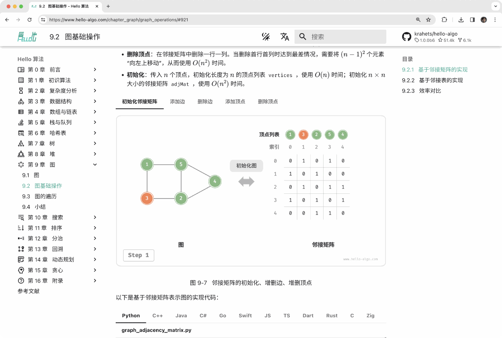
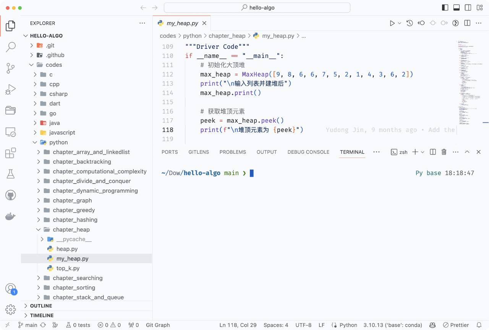
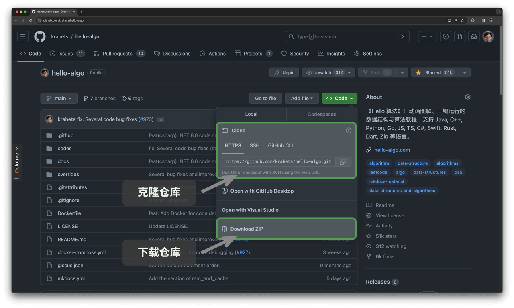
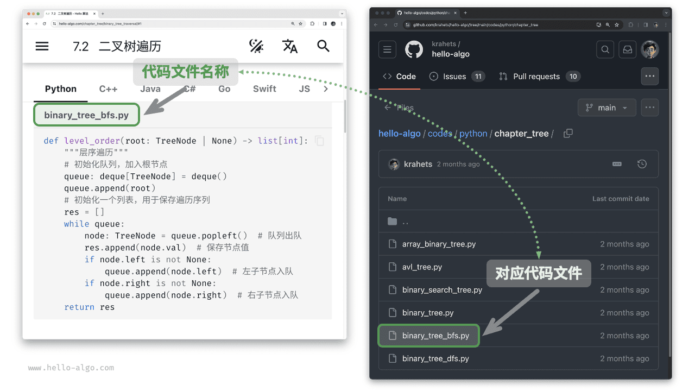
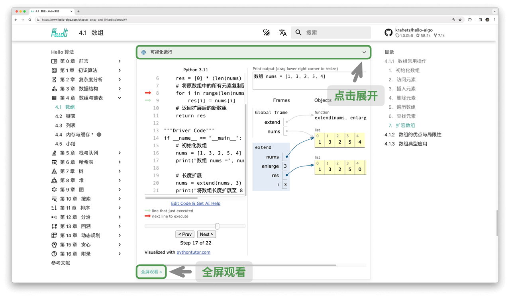
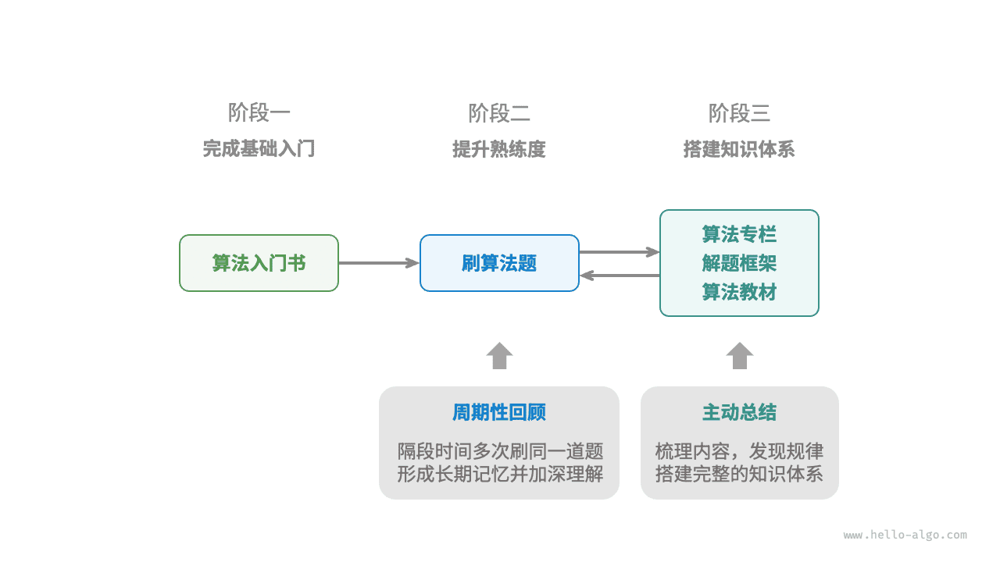

# 序

!!! tip

    Knowledge isn't free. You have to pay attention.
    （Richard P. Feynman，这里的pay双关：知识并不免费，必须费时费力才能获取）

!!! tip

    书山有路勤为径，学海无涯苦作舟
    （唐代文学家、唐宋八大家之首韩愈的治学名联）

本书会引导你探索数据结构与算法的“知识地图”，带你了解不同“地雷”的形状、大小和分布位置，让你掌握各种“排雷方法”。有了这些本领，相信你可以更加自如地刷题和阅读文献，逐步构建起完整的知识体系。

计算机的出现给世界带来了巨大变革，它凭借高速的计算能力和出色的可编程性，成为了执行算法与处理数据的理想媒介。无论是电子游戏的逼真画面、自动驾驶的智能决策，还是 AlphaGo 的精彩棋局、ChatGPT 的自然交互，这些应用都是算法在计算机上的精妙演绎。

事实上，在计算机问世之前，算法和数据结构就已经存在于世界的各个角落。

- 早期的算法相对简单，例如古代的计数方法和工具制作步骤等。
- 随着文明的进步，算法逐渐变得更加精细和复杂。
- 从巧夺天工的匠人技艺、到解放生产力的工业产品、再到宇宙运行的科学规律，几乎每一件平凡或令人惊叹的事物背后，都隐藏着精妙的算法思想。

同样，数据结构无处不在：
- 大到社会网络，小到地铁线路，许多系统都可以建模为“图”；
- 大到一个国家，小到一个家庭，社会的主要组织形式呈现出“树”的特征；
- 冬天的衣服就像“栈”，最先穿上的最后才能脱下；
- 羽毛球筒则如同“队列”，一端放入、另一端取出；
- 字典就像一个“哈希表”，能够快速查找目标词条。

本书旨在通过清晰易懂的动画图解和可运行的代码示例，使读者理解算法和数据结构的核心概念，并能够通过编程来实现它们。在此基础上，本书致力于揭示算法在复杂世界中的生动体现，展现算法之美。希望本书能够帮助到你！

# 前言

!!! abstract

    算法犹如美妙的交响乐，每一行代码都像韵律般流淌。
    
    愿这本书在你的脑海中轻轻响起，留下独特而深刻的旋律。

## 关于本书

本项目旨在创建一本开源、免费、对新手友好的数据结构与算法入门教程。

- 全书采用动画图解，内容清晰易懂、学习曲线平滑，引导初学者探索数据结构与算法的知识地图。
- 源代码可一键运行，帮助读者在练习中提升编程技能，了解算法工作原理和数据结构底层实现。
- 提倡读者互助学习，欢迎大家在评论区提出问题与分享见解，在交流讨论中共同进步。

### 读者对象

若你是算法初学者，从未接触过算法，或者已经有一些刷题经验，对数据结构与算法有模糊的认识，在会与不会之间反复横跳，那么本书正是为你量身定制的！

如果你已经积累一定的刷题量，熟悉大部分题型，那么本书可助你回顾与梳理算法知识体系，仓库源代码可以当作“刷题工具库”或“算法字典”来使用。

若你是算法“大神”，我们期待收到你的宝贵建议，或者[一起参与创作](https://www.hello-algo.com/chapter_appendix/contribution/)。

!!! success "前置条件"

    你需要至少具备任一语言的编程基础，能够阅读和编写简单代码。

### 内容结构

本书的主要内容如下图所示。

- **复杂度分析**：数据结构和算法的评价维度与方法。时间复杂度和空间复杂度的推算方法、常见类型、示例等。
- **数据结构**：基本数据类型和数据结构的分类方法。数组、链表、栈、队列、哈希表、树、堆、图等数据结构的定义、优缺点、常用操作、常见类型、典型应用、实现方法等。
- **算法**：搜索、排序、分治、回溯、动态规划、贪心等算法的定义、优缺点、效率、应用场景、解题步骤和示例问题等。


## 如何使用本书

!!! tip

    为了获得最佳的阅读体验，建议你通读本节内容。

### 行文风格约定

- 标题后标注 `*` 的是选读章节，内容相对困难。如果你的时间有限，可以先跳过。
- 专业术语会使用黑体（纸质版和 PDF 版）或添加下划线（网页版），例如<u>数组（array）</u>。建议记住它们，以便阅读文献。
- 重点内容和总结性语句会 **加粗**，这类文字值得特别关注。
- 有特指含义的词句会使用“引号”标注，以避免歧义。
- 当涉及编程语言之间不一致的名词时，本书均以 Python 为准，例如使用 `None` 来表示“空”。
- 本书部分放弃了编程语言的注释规范，以换取更加紧凑的内容排版。注释主要分为三种类型：标题注释、内容注释、多行注释。

```python
"""标题注释，用于标注函数、类、测试样例等"""

# 内容注释，用于详解代码

"""
多行
注释
"""
```

### 在动画图解中高效学习

相较于文字，视频和图片具有更高的信息密度和结构化程度，更易于理解。在本书中，**重点和难点知识将主要通过动画以图解形式展示**，而文字则作为解释与补充。

如果你在阅读本书时，发现某段内容提供了如下图所示的动画图解，**请以图为主、以文字为辅**，综合两者来理解内容。



### 在代码实践中加深理解

本书的配套代码托管在 [GitHub 仓库](https://github.com/krahets/hello-algo)。如下图所示，**源代码附有测试样例，可一键运行**。

如果时间允许，**建议你参照代码自行敲一遍**。如果学习时间有限，请至少通读并运行所有代码。

与阅读代码相比，编写代码的过程往往能带来更多收获。**动手学，才是真的学**。



运行代码的前置工作主要分为三步。

**第一步：安装本地编程环境**。请参照附录所示的[教程](https://www.hello-algo.com/chapter_appendix/installation/)进行安装，如果已安装，则可跳过此步骤。

**第二步：克隆或下载代码仓库**。前往 [GitHub 仓库](https://github.com/krahets/hello-algo)。如果已经安装 [Git](https://git-scm.com/downloads) ，可以通过以下命令克隆本仓库：

```shell
git clone https://github.com/krahets/hello-algo.git
```

当然，你也可以在下图所示的位置，点击“Download ZIP”按钮直接下载代码压缩包，然后在本地解压即可。



**第三步：运行源代码**。如下图所示，对于顶部标有文件名称的代码块，我们可以在仓库的 `codes` 文件夹内找到对应的源代码文件。源代码文件可一键运行，将帮助你节省不必要的调试时间，让你能够专注于学习内容。



除了本地运行代码，**网页版还支持 Python 代码的可视化运行**（基于 [pythontutor](https://pythontutor.com/) 实现）。如下图所示，你可以点击代码块下方的“可视化运行”来展开视图，观察算法代码的执行过程；也可以点击“全屏观看”，以获得更好的阅览体验。



### 在提问讨论中共同成长

在阅读本书时，请不要轻易跳过那些没学明白的知识点。**欢迎在评论区提出你的问题**，本书作者和小伙伴们将竭诚为你解答，一般情况下可在两天内回复。

如下图所示，网页版每个章节的底部都配有评论区。希望你能多关注评论区的内容。一方面，你可以了解大家遇到的问题，从而查漏补缺，激发更深入的思考。另一方面，期待你能慷慨地回答其他小伙伴的问题，分享你的见解，帮助他人进步。


### 算法学习路线

从总体上看，我们可以将学习数据结构与算法的过程划分为三个阶段。

1. **阶段一：算法入门**。我们需要熟悉各种数据结构的特点和用法，学习不同算法的原理、流程、用途和效率等方面的内容。
2. **阶段二：刷算法题**。建议从热门题目开刷，先积累至少 100 道题目，熟悉主流的算法问题。初次刷题时，“知识遗忘”可能是一个挑战，但请放心，这是很正常的。我们可以按照“艾宾浩斯遗忘曲线”来复习题目，通常在进行 3～5 轮的重复后，就能将其牢记在心。推荐的题单和刷题计划请见此 [GitHub 仓库](https://github.com/krahets/LeetCode-Book)。
3. **阶段三：搭建知识体系**。在学习方面，我们可以阅读算法专栏文章、解题框架和算法教材，以不断丰富知识体系。在刷题方面，可以尝试采用进阶刷题策略，如按专题分类、一题多解、一解多题等，相关的刷题心得可以在各个社区找到。

如下图所示，本书内容主要涵盖“阶段一”，旨在帮助你更高效地展开阶段二和阶段三的学习。



!!! note 遗忘曲线 from AI（扩展阅读：https://en.wikipedia.org/wiki/Forgetting_curve）

    艾宾浩斯遗忘曲线（Ebbinghaus Forgetting Curve）是19世纪德国心理学家赫尔曼·艾宾浩斯（Hermann Ebbinghaus）​ 通过实验提出的人类记忆遗忘规律的经典模型，描述了新学信息随时间推移而遗忘的进程。

    核心结论：遗忘“先快后慢、先多后少”——学习后立即开始遗忘，初期（1小时内）速度最快，24小时遗忘量超60%，31天后趋于稳定（剩余约20%）。

    实验方法：以无意义音节（如“ZOT”）为材料，用“节省法”（再学习时间差）测遗忘量，排除经验干扰。

    核心应用：及时复习+间隔重复。按遗忘临界点安排复习：短期（20分钟、1小时、8小时）、中期（1天、2天、6天）、长期（31天、3个月），如背单词“当天→睡前→次日→第3/7/15天”循环。

    意义：揭示记忆需主动维护，反对“临时抱佛脚”，提倡分散学习、意义编码（关联旧知）、多感官参与。

    误区：非所有材料遗忘速度相同（有意义内容更慢），遗忘也非单纯“丢失”而是提取失败。

    价值：为高效学习提供科学框架，证明“对抗遗忘”是记忆关键。

## 小结

### 重点回顾

- 本书的主要受众是算法初学者。如果你已有一定基础，本书能帮助你系统回顾算法知识，书中源代码也可作为“刷题工具库”使用。
- 书中内容主要包括复杂度分析、数据结构和算法三部分，涵盖了该领域的大部分主题。
- 对于算法新手，在初学阶段阅读一本入门书至关重要，可以少走许多弯路。
- 书中的动画图解通常用于介绍重点和难点知识。阅读本书时，应给予这些内容更多关注。
- 实践乃学习编程之最佳途径。强烈建议运行源代码并亲自敲代码。
- 本书网页版的每个章节都设有评论区，欢迎随时分享你的疑惑与见解。
