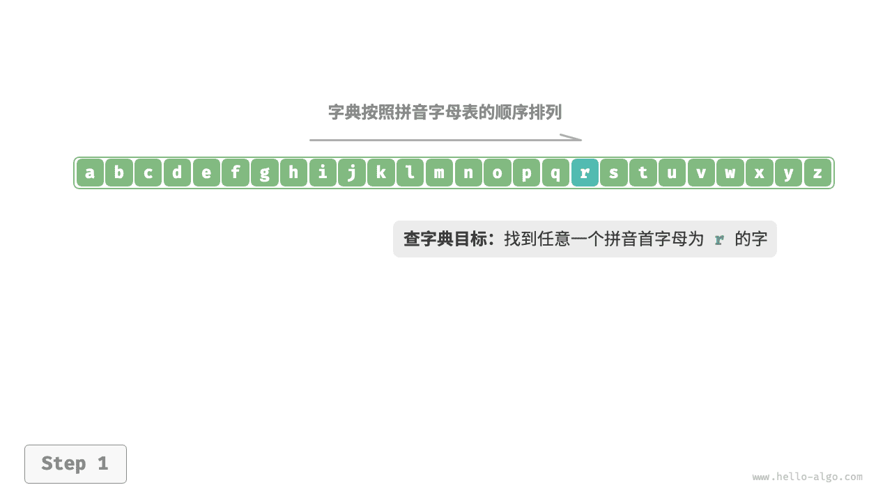
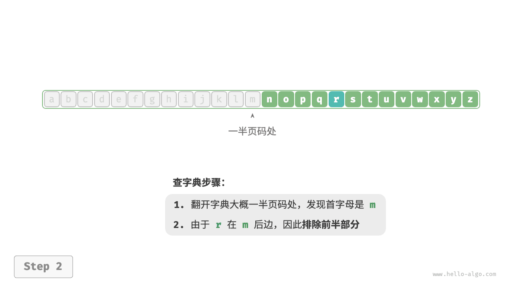
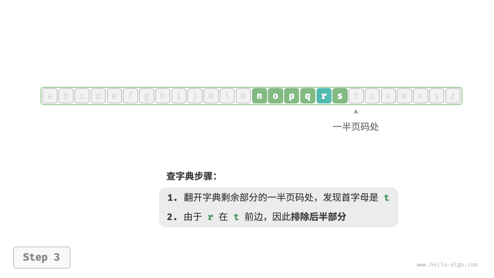
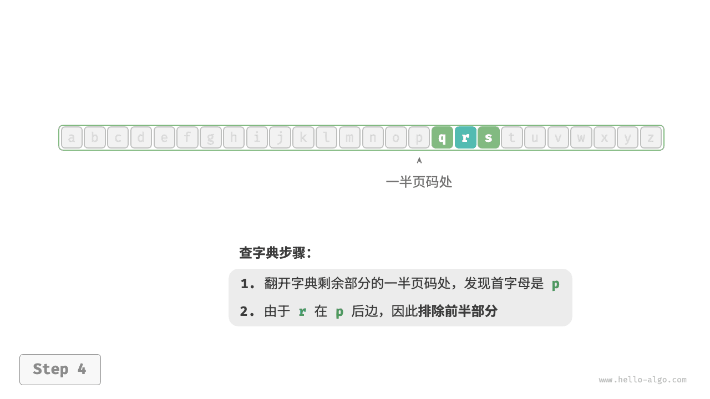
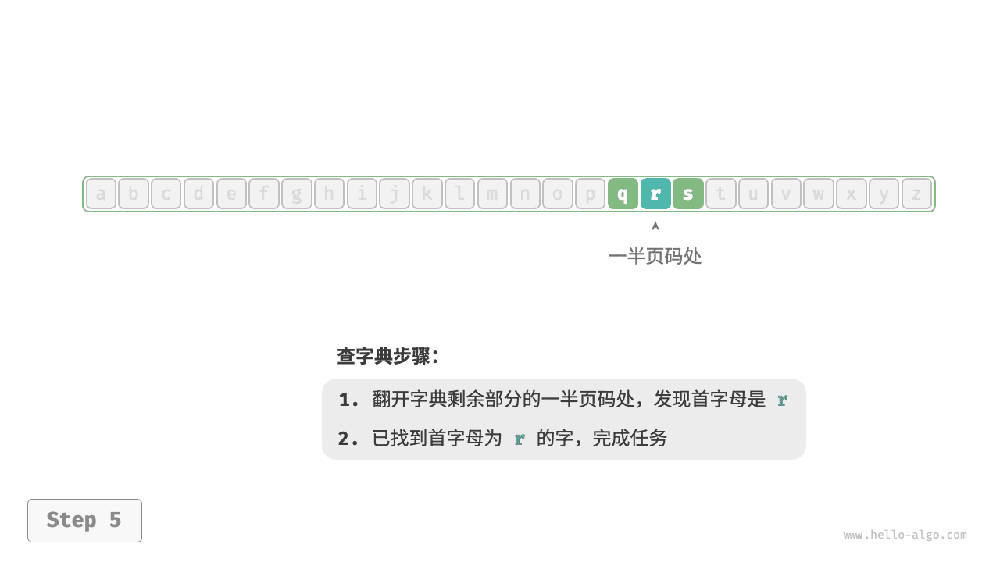
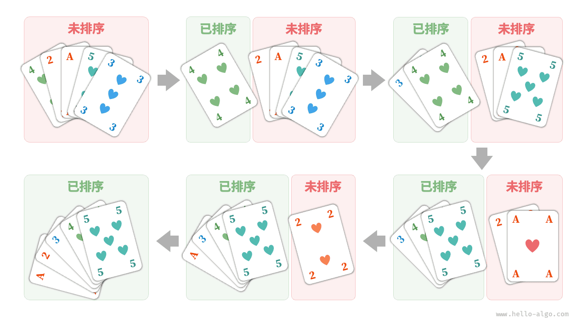
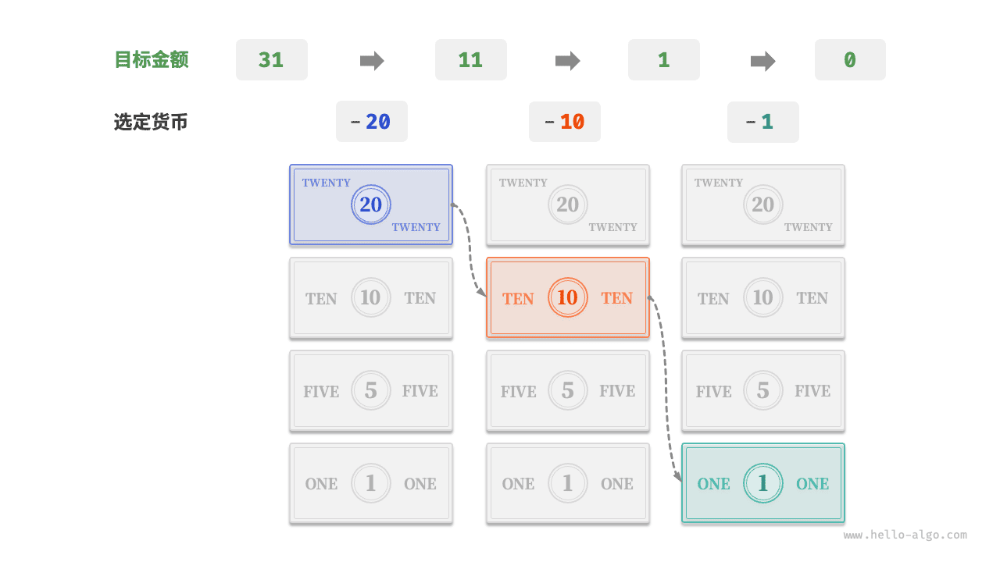
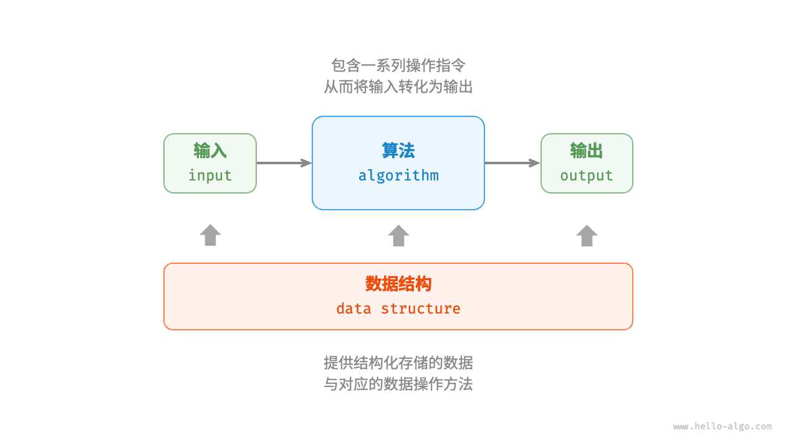

# 初识算法

## 算法无处不在

当我们听到“算法”这个词时，很自然地会想到数学。然而实际上，许多算法并不涉及复杂数学，而是更多地依赖基本逻辑，这些逻辑在我们的日常生活中处处可见。

在正式探讨算法之前，有一个有趣的事实值得分享：**你已经在不知不觉中学会了许多算法，并习惯将它们应用到日常生活中了**。下面我将举几个具体的例子来证实这一点。

**例一：查字典**。在字典里，每个汉字都对应一个拼音，而字典是按照拼音字母顺序排列的。假设我们需要查找一个拼音首字母为 $r$ 的字，通常会按照下图所示的方式实现。

1. 翻开字典约一半的页数，查看该页的首字母是什么，假设首字母为 $m$ 。
2. 由于在拼音字母表中 $r$ 位于 $m$ 之后，所以排除字典前半部分，查找范围缩小到后半部分。
3. 不断重复步骤 `1.` 和步骤 `2.` ，直至找到拼音首字母为 $r$ 的页码为止。

=== "<1>"
    

=== "<2>"
    

=== "<3>"
    

=== "<4>"
    

=== "<5>"
    

查字典这个小学生必备技能，实际上就是著名的“二分查找”算法。从数据结构的角度，我们可以把字典视为一个已排序的“数组”；从算法的角度，我们可以将上述查字典的一系列操作看作“二分查找”。

**例二：整理扑克**。我们在打牌时，每局都需要整理手中的扑克牌，使其从小到大排列，实现流程如下图所示。

1. 将扑克牌划分为“有序”和“无序”两部分，并假设初始状态下最左 1 张扑克牌已经有序。
2. 在无序部分抽出一张扑克牌，插入至有序部分的正确位置；完成后最左 2 张扑克已经有序。
3. 不断循环步骤 `2.` ，每一轮将一张扑克牌从无序部分插入至有序部分，直至所有扑克牌都有序。

上述整理扑克牌的方法本质上是“插入排序”算法，它在处理小型数据集时非常高效。许多编程语言的排序库函数中都有插入排序的身影。

**例三：货币找零**。假设我们在超市购买了 $69$ 元的商品，给了收银员 $100$ 元，则收银员需要找我们 $31$ 元。他会很自然地完成如下图所示的思考。

1. 可选项是比 $31$ 元面值更小的货币，包括 $1$ 元、$5$ 元、$10$ 元、$20$ 元。
2. 从可选项中拿出最大的 $20$ 元，剩余 $31 - 20 = 11$ 元。
3. 从剩余可选项中拿出最大的 $10$ 元，剩余 $11 - 10 = 1$ 元。
4. 从剩余可选项中拿出最大的 $1$ 元，剩余 $1 - 1 = 0$ 元。
5. 完成找零，方案为 $20 + 10 + 1 = 31$ 元。

在以上步骤中，我们每一步都采取当前看来最好的选择（尽可能用大面额的货币），最终得到了可行的找零方案。从数据结构与算法的角度看，这种方法本质上是“贪心”算法。

小到烹饪一道菜，大到星际航行，几乎所有问题的解决都离不开算法。计算机的出现使得我们能够通过编程将数据结构存储在内存中，同时编写代码调用 CPU 和 GPU 执行算法。这样一来，我们就能把生活中的问题转移到计算机上，以更高效的方式解决各种复杂问题。

!!! tip

    如果你对数据结构、算法、数组和二分查找等概念仍感到一知半解，请继续往下阅读，本书将引导你迈入数据结构与算法的知识殿堂。

## 算法是什么

### 算法定义

<u>算法（algorithm）</u>是在有限时间内解决特定问题的一组指令或操作步骤，它具有以下特性。

- 问题是明确的，包含清晰的输入和输出定义。
- 具有可行性，能够在有限步骤、时间和内存空间下完成。
- 各步骤都有确定的含义，在相同的输入和运行条件下，输出始终相同。

### 数据结构定义

<u>数据结构（data structure）</u>是组织和存储数据的方式，涵盖数据内容、数据之间关系和数据操作方法，它具有以下设计目标。

- 空间占用尽量少，以节省计算机内存。
- 数据操作尽可能快速，涵盖数据访问、添加、删除、更新等。
- 提供简洁的数据表示和逻辑信息，以便算法高效运行。

**数据结构设计是一个充满权衡的过程**。如果想在某方面取得提升，往往需要在另一方面作出妥协。下面举两个例子。

- 链表相较于数组，在数据添加和删除操作上更加便捷，但牺牲了数据访问速度。
- 图相较于链表，提供了更丰富的逻辑信息，但需要占用更大的内存空间。

### 数据结构与算法的关系

如下图所示，数据结构与算法高度相关、紧密结合，具体表现在以下三个方面。

- 数据结构是算法的基石。数据结构为算法提供了结构化存储的数据，以及操作数据的方法。
- 算法为数据结构注入生命力。数据结构本身仅存储数据信息，结合算法才能解决特定问题。
- 算法通常可以基于不同的数据结构实现，但执行效率可能相差很大，选择合适的数据结构是关键。

数据结构与算法犹如下图所示的拼装积木。一套积木，除了包含许多零件之外，还附有详细的组装说明书。我们按照说明书一步步操作，就能组装出精美的积木模型。

两者的详细对应关系如下表所示。

 表 <id> &nbsp; 将数据结构与算法类比为拼装积木 

| 数据结构与算法 | 拼装积木                                 |
| -------------- | ---------------------------------------- |
| 输入数据       | 未拼装的积木                             |
| 数据结构       | 积木组织形式，包括形状、大小、连接方式等 |
| 算法           | 把积木拼成目标形态的一系列操作步骤       |
| 输出数据       | 积木模型                                 |

值得说明的是，数据结构与算法是独立于编程语言的。正因如此，本书得以提供基于多种编程语言的实现。

!!! tip "约定俗成的简称"

    在实际讨论时，我们通常会将“数据结构与算法”简称为“算法”。比如众所周知的 LeetCode 算法题目，实际上同时考查数据结构和算法两方面的知识。

## 小结

### 重点回顾

- 算法在日常生活中无处不在，并不是遥不可及的高深知识。实际上，我们已经在不知不觉中学会了许多算法，用以解决生活中的大小问题。
- 查字典的原理与二分查找算法相一致。二分查找算法体现了分而治之的重要算法思想。
- 整理扑克的过程与插入排序算法非常类似。插入排序算法适合排序小型数据集。
- 货币找零的步骤本质上是贪心算法，每一步都采取当前看来最好的选择。
- 算法是在有限时间内解决特定问题的一组指令或操作步骤，而数据结构是计算机中组织和存储数据的方式。
- 数据结构与算法紧密相连。数据结构是算法的基石，而算法为数据结构注入生命力。
- 我们可以将数据结构与算法类比为拼装积木，积木代表数据，积木的形状和连接方式等代表数据结构，拼装积木的步骤则对应算法。

### Q & A

**Q**：作为一名程序员，我在日常工作中从未用算法解决过问题，常用算法都被编程语言封装好了，直接用就可以了；这是否意味着我们工作中的问题还没有到达需要算法的程度？

如果把具体的工作技能比作是武功的“招式”的话，那么基础科目应该更像是“内功”。

我认为学算法（以及其他基础科目）的意义不是在于在工作中从零实现它，而是基于学到的知识，在解决问题时能够作出专业的反应和判断，从而提升工作的整体质量。举一个简单例子，每种编程语言都内置了排序函数：

- 如果我们没有学过数据结构与算法，那么给定任何数据，我们可能都塞给这个排序函数去做了。运行顺畅、性能不错，看上去并没有什么问题。
- 但如果学过算法，我们就会知道内置排序函数的时间复杂度是 $O(n \log n)$ ；而如果给定的数据是固定位数的整数（例如学号），那么我们就可以用效率更高的“基数排序”来做，将时间复杂度降为 $O(nk)$ ，其中 $k$ 为位数。当数据体量很大时，节省出来的运行时间就能创造较大价值（成本降低、体验变好等）。

在工程领域中，大量问题是难以达到最优解的，许多问题只是被“差不多”地解决了。问题的难易程度一方面取决于问题本身的性质，另一方面也取决于观测问题的人的知识储备。人的知识越完备、经验越多，分析问题就会越深入，问题就能被解决得更优雅。
