# 复杂度分析

!!! abstract

    复杂度分析犹如浩瀚的算法宇宙中的时空向导。
    
    它带领我们在时间与空间这两个维度上深入探索，寻找更优雅的解决方案。

# 算法效率评估

在算法设计中，我们先后追求以下两个层面的目标。

1. **找到问题解法**：算法需要在规定的输入范围内可靠地求得问题的正确解。
2. **寻求最优解法**：同一个问题可能存在多种解法，我们希望找到尽可能高效的算法。

也就是说，在能够解决问题的前提下，算法效率已成为衡量算法优劣的主要评价指标，它包括以下两个维度。

- **时间效率**：算法运行时间的长短。
- **空间效率**：算法占用内存空间的大小。

简而言之，**我们的目标是设计“既快又省”的数据结构与算法**。而有效地评估算法效率至关重要，因为只有这样，我们才能将各种算法进行对比，进而指导算法设计与优化过程。

效率评估方法主要分为两种：实际测试、理论估算。

## 实际测试

假设我们现在有算法 `A` 和算法 `B` ，它们都能解决同一问题，现在需要对比这两个算法的效率。最直接的方法是找一台计算机，运行这两个算法，并监控记录它们的运行时间和内存占用情况。这种评估方式能够反映真实情况，但也存在较大的局限性。

一方面，**难以排除测试环境的干扰因素**。硬件配置会影响算法的性能表现。比如一个算法的并行度较高，那么它就更适合在多核 CPU 上运行，一个算法的内存操作密集，那么它在高性能内存上的表现就会更好。也就是说，算法在不同的机器上的测试结果可能是不一致的。这意味着我们需要在各种机器上进行测试，统计平均效率，而这是不现实的。

另一方面，**展开完整测试非常耗费资源**。随着输入数据量的变化，算法会表现出不同的效率。例如，在输入数据量较小时，算法 `A` 的运行时间比算法 `B` 短；而在输入数据量较大时，测试结果可能恰恰相反。因此，为了得到有说服力的结论，我们需要测试各种规模的输入数据，而这需要耗费大量的计算资源。

## 理论估算

由于实际测试具有较大的局限性，我们可以考虑仅通过一些计算来评估算法的效率。这种估算方法被称为<u>渐近复杂度分析（asymptotic complexity analysis）</u>，简称<u>复杂度分析</u>。

复杂度分析能够体现算法运行所需的时间和空间资源与输入数据规模之间的关系。**它描述了随着输入数据规模的增加，算法执行所需时间和空间的增长趋势**。这个定义有些拗口，我们可以将其分为三个重点来理解。

- “时间和空间资源”分别对应<u>时间复杂度（time complexity）</u>和<u>空间复杂度（space complexity）</u>。
- “随着输入数据规模的增加”意味着复杂度反映了算法运行效率与输入数据规模之间的关系。
- “时间和空间的增长趋势”表示复杂度分析关注的不是运行时间或占用空间的具体值，而是时间或空间增长的“快慢”。

**复杂度分析克服了实际测试方法的弊端**，体现在以下几个方面。

- 它无需实际运行代码，更加绿色节能。
- 它独立于测试环境，分析结果适用于所有运行平台。
- 它可以体现不同数据量下的算法效率，尤其是在大数据量下的算法性能。

!!! tip

    如果你仍对复杂度的概念感到困惑，无须担心，我们会在后续章节中详细介绍。

复杂度分析为我们提供了一把评估算法效率的“标尺”，使我们可以衡量执行某个算法所需的时间和空间资源，对比不同算法之间的效率。

复杂度是个数学概念，对于初学者可能比较抽象，学习难度相对较高。从这个角度看，复杂度分析可能不太适合作为最先介绍的内容。然而，当我们讨论某个数据结构或算法的特点时，难以避免要分析其运行速度和空间使用情况。

综上所述，建议你在深入学习数据结构与算法之前，**先对复杂度分析建立初步的了解，以便能够完成简单算法的复杂度分析**。

# 迭代与递归

在算法中，重复执行某个任务是很常见的，它与复杂度分析息息相关。因此，在介绍时间复杂度和空间复杂度之前，我们先来了解如何在程序中实现重复执行任务，即两种基本的程序控制结构：迭代、递归。

## 迭代

<u>迭代（iteration）</u>是一种重复执行某个任务的控制结构。在迭代中，程序会在满足一定的条件下重复执行某段代码，直到这个条件不再满足。

### for 循环

`for` 循环是最常见的迭代形式之一，**适合在预先知道迭代次数时使用**。

以下函数基于 `for` 循环实现了求和 $1 + 2 + \dots + n$ ，求和结果使用变量 `res` 记录。需要注意的是，Python 中 `range(a, b)` 对应的区间是“左闭右开”的，对应的遍历范围为 $a, a + 1, \dots, b-1$ ：

```python
def for_loop(n: int) -> int:
    """for 循环"""
    res = 0
    # 循环求和 1, 2, ..., n-1, n
    for i in range(1, n + 1):
        res += i
    return res
```

!!! example [pythontutor "可视化运行"](https://pythontutor.com/iframe-embed.html#code=def%20for_loop%28n%3A%20int%29%20-%3E%20int%3A%0A%20%20%20%20%22%22%22for%20%E5%BE%AA%E7%8E%AF%22%22%22%0A%20%20%20%20res%20%3D%200%0A%20%20%20%20%23%20%E5%BE%AA%E7%8E%AF%E6%B1%82%E5%92%8C%201,%202,%20...,%20n-1,%20n%0A%20%20%20%20for%20i%20in%20range%281,%20n%20%2B%201%29%3A%0A%20%20%20%20%20%20%20%20res%20%2B%3D%20i%0A%20%20%20%20return%20res%0A%0A%22%22%22Driver%20Code%22%22%22%0Aif%20__name__%20%3D%3D%20%22__main__%22%3A%0A%20%20%20%20n%20%3D%205%0A%20%20%20%20res%20%3D%20for_loop%28n%29%0A%20%20%20%20print%28f%22%5Cnfor%20%E5%BE%AA%E7%8E%AF%E7%9A%84%E6%B1%82%E5%92%8C%E7%BB%93%E6%9E%9C%20res%20%3D%20%7Bres%7D%22%29&codeDivHeight=800&codeDivWidth=600&cumulative=false&curInstr=3&heapPrimitives=nevernest&origin=opt-frontend.js&py=311&rawInputLstJSON=%5B%5D&)

下图是该求和函数的流程框图。

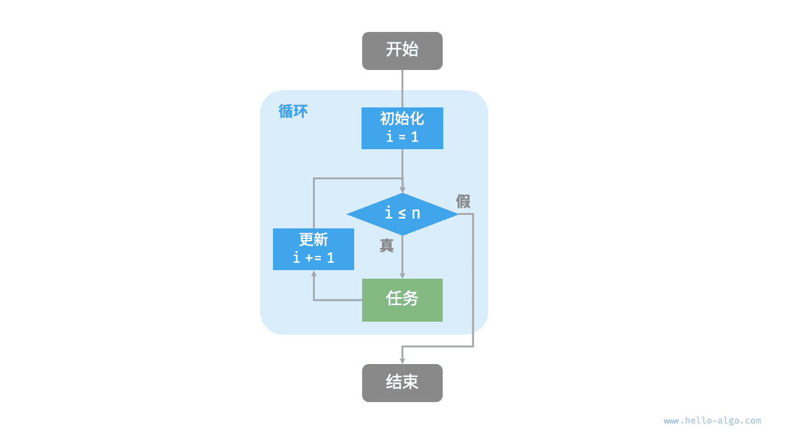

此求和函数的操作数量与输入数据大小 $n$ 成正比，或者说成“线性关系”。实际上，**时间复杂度描述的就是这个“线性关系”**。相关内容将会在下一节中详细介绍。

### while 循环

与 `for` 循环类似，`while` 循环也是一种实现迭代的方法。在 `while` 循环中，程序每轮都会先检查条件，如果条件为真，则继续执行，否则就结束循环。

下面我们用 `while` 循环来实现求和 $1 + 2 + \dots + n$ ：

```python
def while_loop(n: int) -> int:
    """while 循环"""
    res = 0
    i = 1  # 初始化条件变量
    # 循环求和 1, 2, ..., n-1, n
    while i <= n:
        res += i
        i += 1  # 更新条件变量
    return res
```

!!! example [pythontutor "可视化运行"](https://pythontutor.com/iframe-embed.html#code=def%20while_loop%28n%3A%20int%29%20-%3E%20int%3A%0A%20%20%20%20%22%22%22while%20%E5%BE%AA%E7%8E%AF%22%22%22%0A%20%20%20%20res%20%3D%200%0A%20%20%20%20i%20%3D%201%20%20%23%20%E5%88%9D%E5%A7%8B%E5%8C%96%E6%9D%A1%E4%BB%B6%E5%8F%98%E9%87%8F%0A%20%20%20%20%23%20%E5%BE%AA%E7%8E%AF%E6%B1%82%E5%92%8C%201,%202,%20...,%20n-1,%20n%0A%20%20%20%20while%20i%20%3C%3D%20n%3A%0A%20%20%20%20%20%20%20%20res%20%2B%3D%20i%0A%20%20%20%20%20%20%20%20i%20%2B%3D%201%20%20%23%20%E6%9B%B4%E6%96%B0%E6%9D%A1%E4%BB%B6%E5%8F%98%E9%87%8F%0A%20%20%20%20return%20res%0A%0A%22%22%22Driver%20Code%22%22%22%0Aif%20__name__%20%3D%3D%20%22__main__%22%3A%0A%20%20%20%20n%20%3D%205%0A%20%20%20%20res%20%3D%20while_loop%28n%29%0A%20%20%20%20print%28f%22%5Cnwhile%20%E5%BE%AA%E7%8E%AF%E7%9A%84%E6%B1%82%E5%92%8C%E7%BB%93%E6%9E%9C%20res%20%3D%20%7Bres%7D%22%29&codeDivHeight=800&codeDivWidth=600&cumulative=false&curInstr=3&heapPrimitives=nevernest&origin=opt-frontend.js&py=311&rawInputLstJSON=%5B%5D&textReferences=false)

**`while` 循环比 `for` 循环的自由度更高**。在 `while` 循环中，我们可以自由地设计条件变量的初始化和更新步骤。

例如在以下代码中，条件变量 $i$ 每轮进行两次更新，这种情况就不太方便用 `for` 循环实现：

```python
def while_loop_ii(n: int) -> int:
    """while 循环（两次更新）"""
    res = 0
    i = 1  # 初始化条件变量
    # 循环求和 1, 4, 10, ...
    while i <= n:
        res += i
        # 更新条件变量
        i += 1
        i *= 2
    return res
```

!!! example [pythontutor "可视化运行"](https://pythontutor.com/iframe-embed.html#code=def%20while_loop_ii%28n%3A%20int%29%20-%3E%20int%3A%0A%20%20%20%20%22%22%22while%20%E5%BE%AA%E7%8E%AF%EF%BC%88%E4%B8%A4%E6%AC%A1%E6%9B%B4%E6%96%B0%EF%BC%89%22%22%22%0A%20%20%20%20res%20%3D%200%0A%20%20%20%20i%20%3D%201%20%20%23%20%E5%88%9D%E5%A7%8B%E5%8C%96%E6%9D%A1%E4%BB%B6%E5%8F%98%E9%87%8F%0A%20%20%20%20%23%20%E5%BE%AA%E7%8E%AF%E6%B1%82%E5%92%8C%201,%204,%2010,%20...%0A%20%20%20%20while%20i%20%3C%3D%20n%3A%0A%20%20%20%20%20%20%20%20res%20%2B%3D%20i%0A%20%20%20%20%20%20%20%20%23%20%E6%9B%B4%E6%96%B0%E6%9D%A1%E4%BB%B6%E5%8F%98%E9%87%8F%0A%20%20%20%20%20%20%20%20i%20%2B%3D%201%0A%20%20%20%20%20%20%20%20i%20*%3D%202%0A%20%20%20%20return%20res%0A%0A%22%22%22Driver%20Code%22%22%22%0Aif%20__name__%20%3D%3D%20%22__main__%22%3A%0A%20%20%20%20n%20%3D%205%0A%20%20%20%20res%20%3D%20while_loop_ii%28n%29%0A%20%20%20%20print%28f%22%5Cnwhile%20%E5%BE%AA%E7%8E%AF%EF%BC%88%E4%B8%A4%E6%AC%A1%E6%9B%B4%E6%96%B0%EF%BC%89%E6%B1%82%E5%92%8C%E7%BB%93%E6%9E%9C%20res%20%3D%20%7Bres%7D%22%29&codeDivHeight=800&codeDivWidth=600&cumulative=false&curInstr=3&heapPrimitives=nevernest&origin=opt-frontend.js&py=311&rawInputLstJSON=%5B%5D&textReferences=false)

总的来说，**`for` 循环的代码更加紧凑，`while` 循环更加灵活**，两者都可以实现迭代结构。选择使用哪一个应该根据特定问题的需求来决定。

### 嵌套循环

我们可以在一个循环结构内嵌套另一个循环结构，下面以 `for` 循环为例：

```python
def nested_for_loop(n: int) -> str:
    """双层 for 循环"""
    res = ""
    # 循环 i = 1, 2, ..., n-1, n
    for i in range(1, n + 1):
        # 循环 j = 1, 2, ..., n-1, n
        for j in range(1, n + 1):
            res += f"({i}, {j}), "
    return res
```

!!! example [pythontutor "可视化运行"](https://pythontutor.com/iframe-embed.html#code=def%20nested_for_loop%28n%3A%20int%29%20-%3E%20str%3A%0A%20%20%20%20%22%22%22%E5%8F%8C%E5%B1%82%20for%20%E5%BE%AA%E7%8E%AF%22%22%22%0A%20%20%20%20res%20%3D%20%22%22%0A%20%20%20%20%23%20%E5%BE%AA%E7%8E%AF%20i%20%3D%201,%202,%20...,%20n-1,%20n%0A%20%20%20%20for%20i%20in%20range%281,%20n%20%2B%201%29%3A%0A%20%20%20%20%20%20%20%20%23%20%E5%BE%AA%E7%8E%AF%20j%20%3D%201,%202,%20...,%20n-1,%20n%0A%20%20%20%20%20%20%20%20for%20j%20in%20range%281,%20n%20%2B%201%29%3A%0A%20%20%20%20%20%20%20%20%20%20%20%20res%20%2B%3D%20f%22%28%7Bi%7D,%20%7Bj%7D%29,%20%22%0A%20%20%20%20return%20res%0A%0A%22%22%22Driver%20Code%22%22%22%0Aif%20__name__%20%3D%3D%20%22__main__%22%3A%0A%20%20%20%20n%20%3D%205%0A%20%20%20%20res%20%3D%20nested_for_loop%28n%29%0A%20%20%20%20print%28f%22%5Cn%E5%8F%8C%E5%B1%82%20for%20%E5%BE%AA%E7%8E%AF%E7%9A%84%E9%81%8D%E5%8E%86%E7%BB%93%E6%9E%9C%20%7Bres%7D%22%29&codeDivHeight=800&codeDivWidth=600&cumulative=false&curInstr=3&heapPrimitives=nevernest&origin=opt-frontend.js&py=311&rawInputLstJSON=%5B%5D&textReferences=false)

下图是该嵌套循环的流程框图。

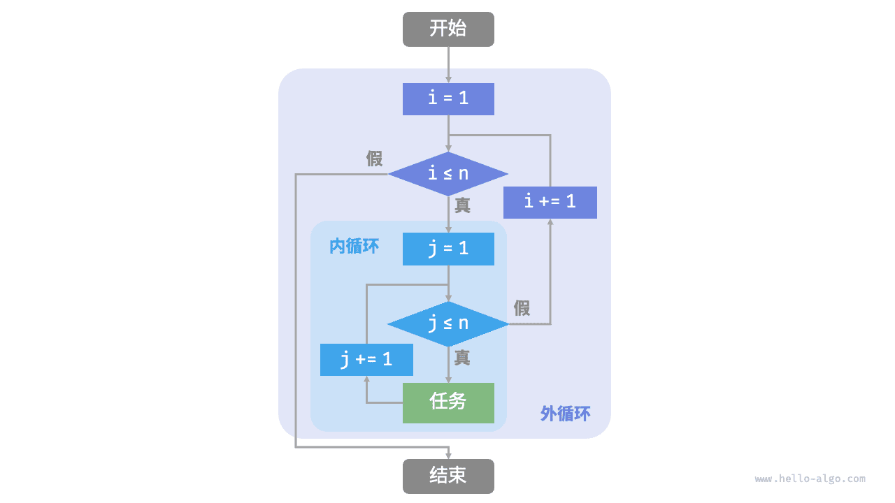

在这种情况下，函数的操作数量与 $n^2$ 成正比，或者说算法运行时间和输入数据大小 $n$ 成“平方关系”。

我们可以继续添加嵌套循环，每一次嵌套都是一次“升维”，将会使时间复杂度提高至“立方关系”“四次方关系”，以此类推。

## 递归

 <u>递归（recursion）</u>是一种算法策略，通过函数调用自身来解决问题。它主要包含两个阶段。

1. **递**：程序不断深入地调用自身，通常传入更小或更简化的参数，直到达到“终止条件”。
2. **归**：触发“终止条件”后，程序从最深层的递归函数开始逐层返回，汇聚每一层的结果。

而从实现的角度看，递归代码主要包含三个要素。

1. **终止条件**：用于决定什么时候由“递”转“归”。
2. **递归调用**：对应“递”，函数调用自身，通常输入更小或更简化的参数。
3. **返回结果**：对应“归”，将当前递归层级的结果返回至上一层。

观察以下代码，我们只需调用函数 `recur(n)`  ，就可以完成 $1 + 2 + \dots + n$ 的计算：

```python
def recur(n: int) -> int:
    """递归"""
    # 终止条件
    if n == 1:
        return 1
    # 递：递归调用
    res = recur(n - 1)
    # 归：返回结果
    return n + res
```

!!! example [pythontutor "可视化运行"](https://pythontutor.com/iframe-embed.html#code=def%20recur%28n%3A%20int%29%20-%3E%20int%3A%0A%20%20%20%20%22%22%22%E9%80%92%E5%BD%92%22%22%22%0A%20%20%20%20%23%20%E7%BB%88%E6%AD%A2%E6%9D%A1%E4%BB%B6%0A%20%20%20%20if%20n%20%3D%3D%201%3A%0A%20%20%20%20%20%20%20%20return%201%0A%20%20%20%20%23%20%E9%80%92%EF%BC%9A%E9%80%92%E5%BD%92%E8%B0%83%E7%94%A8%0A%20%20%20%20res%20%3D%20recur%28n%20-%201%29%0A%20%20%20%20%23%20%E5%BD%92%EF%BC%9A%E8%BF%94%E5%9B%9E%E7%BB%93%E6%9E%9C%0A%20%20%20%20return%20n%20%2B%20res%0A%0A%22%22%22Driver%20Code%22%22%22%0Aif%20__name__%20%3D%3D%20%22__main__%22%3A%0A%20%20%20%20n%20%3D%205%0A%20%20%20%20res%20%3D%20recur%28n%29%0A%20%20%20%20print%28f%22%5Cn%E9%80%92%E5%BD%92%E5%87%BD%E6%95%B0%E7%9A%84%E6%B1%82%E5%92%8C%E7%BB%93%E6%9E%9C%20res%20%3D%20%7Bres%7D%22%29&codeDivHeight=800&codeDivWidth=600&cumulative=false&curInstr=3&heapPrimitives=nevernest&origin=opt-frontend.js&py=311&rawInputLstJSON=%5B%5D&textReferences=false)

下图展示了该函数的递归过程。

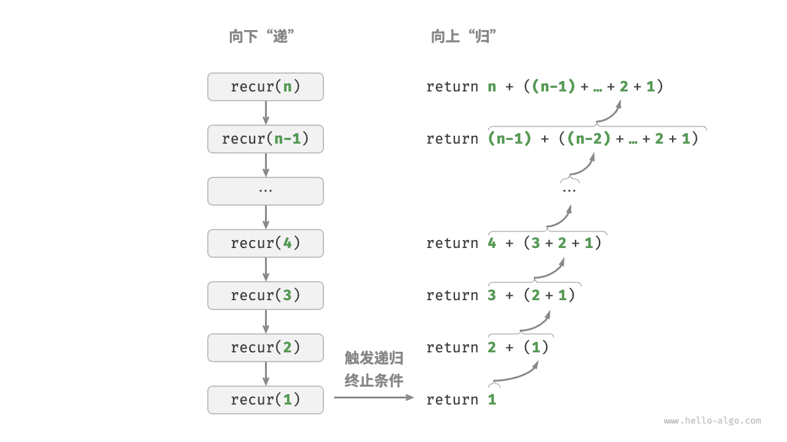

虽然从计算角度看，迭代与递归可以得到相同的结果，**但它们代表了两种完全不同的思考和解决问题的范式**。

- **迭代**：“自下而上”地解决问题。从最基础的步骤开始，然后不断重复或累加这些步骤，直到任务完成。
- **递归**：“自上而下”地解决问题。将原问题分解为更小的子问题，这些子问题和原问题具有相同的形式。接下来将子问题继续分解为更小的子问题，直到基本情况时停止（基本情况的解是已知的）。

以上述求和函数为例，设问题 $f(n) = 1 + 2 + \dots + n$ 。

- **迭代**：在循环中模拟求和过程，从 $1$ 遍历到 $n$ ，每轮执行求和操作，即可求得 $f(n)$ 。
- **递归**：将问题分解为子问题 $f(n) = n + f(n-1)$ ，不断（递归地）分解下去，直至基本情况 $f(1) = 1$ 时终止。

### 调用栈

递归函数每次调用自身时，系统都会为新开启的函数分配内存，以存储局部变量、调用地址和其他信息等。这将导致两方面的结果。

- 函数的上下文数据都存储在称为“栈帧空间”的内存区域中，直至函数返回后才会被释放。因此，**递归通常比迭代更加耗费内存空间**。
- 递归调用函数会产生额外的开销。**因此递归通常比循环的时间效率更低**。

如下图所示，在触发终止条件前，同时存在 $n$ 个未返回的递归函数，**递归深度为 $n$** 。

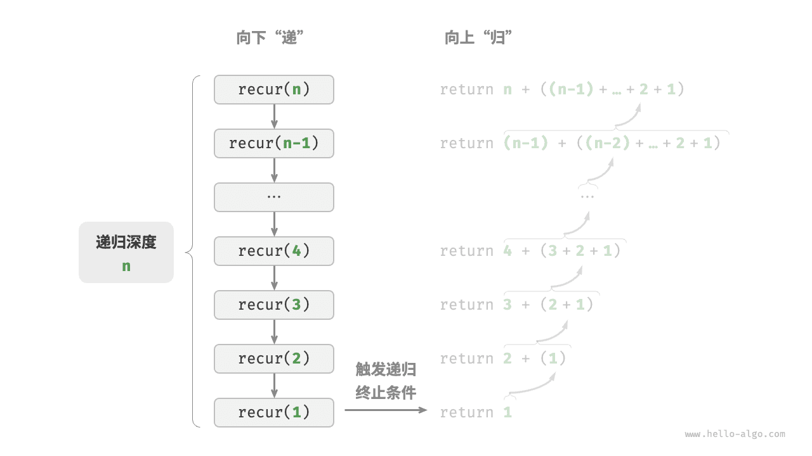

在实际中，编程语言允许的递归深度通常是有限的，过深的递归可能导致栈溢出错误。

### 尾递归

有趣的是，**如果函数在返回前的最后一步才进行递归调用**，则该函数可以被编译器或解释器优化，使其在空间效率上与迭代相当。这种情况被称为<u>尾递归（tail recursion）</u>。

- **普通递归**：当函数返回到上一层级的函数后，需要继续执行代码，因此系统需要保存上一层调用的上下文。
- **尾递归**：递归调用是函数返回前的最后一个操作，这意味着函数返回到上一层级后，无须继续执行其他操作，因此系统无须保存上一层函数的上下文。

以计算 $1 + 2 + \dots + n$ 为例，我们可以将结果变量 `res` 设为函数参数，从而实现尾递归：

```python
def tail_recur(n, res):
    """尾递归"""
    # 终止条件
    if n == 0:
        return res
    # 尾递归调用
    return tail_recur(n - 1, res + n)
```

!!! example [pythontutor "可视化运行"](https://pythontutor.com/iframe-embed.html#code=def%20tail_recur%28n,%20res%29%3A%0A%20%20%20%20%22%22%22%E5%B0%BE%E9%80%92%E5%BD%92%22%22%22%0A%20%20%20%20%23%20%E7%BB%88%E6%AD%A2%E6%9D%A1%E4%BB%B6%0A%20%20%20%20if%20n%20%3D%3D%200%3A%0A%20%20%20%20%20%20%20%20return%20res%0A%20%20%20%20%23%20%E5%B0%BE%E9%80%92%E5%BD%92%E8%B0%83%E7%94%A8%0A%20%20%20%20return%20tail_recur%28n%20-%201,%20res%20%2B%20n%29%0A%0A%22%22%22Driver%20Code%22%22%22%0Aif%20__name__%20%3D%3D%20%22__main__%22%3A%0A%20%20%20%20n%20%3D%205%0A%20%20%20%20res%20%3D%20tail_recur%28n,%200%29%0A%20%20%20%20print%28f%22%5Cn%E5%B0%BE%E9%80%92%E5%BD%92%E5%87%BD%E6%95%B0%E7%9A%84%E6%B1%82%E5%92%8C%E7%BB%93%E6%9E%9C%20res%20%3D%20%7Bres%7D%22%29&codeDivHeight=800&codeDivWidth=600&cumulative=false&curInstr=3&heapPrimitives=nevernest&origin=opt-frontend.js&py=311&rawInputLstJSON=%5B%5D&textReferences=false)

尾递归的执行过程如下图所示。对比普通递归和尾递归，两者的求和操作的执行点是不同的。

- **普通递归**：求和操作是在“归”的过程中执行的，每层返回后都要再执行一次求和操作。
- **尾递归**：求和操作是在“递”的过程中执行的，“归”的过程只需层层返回。

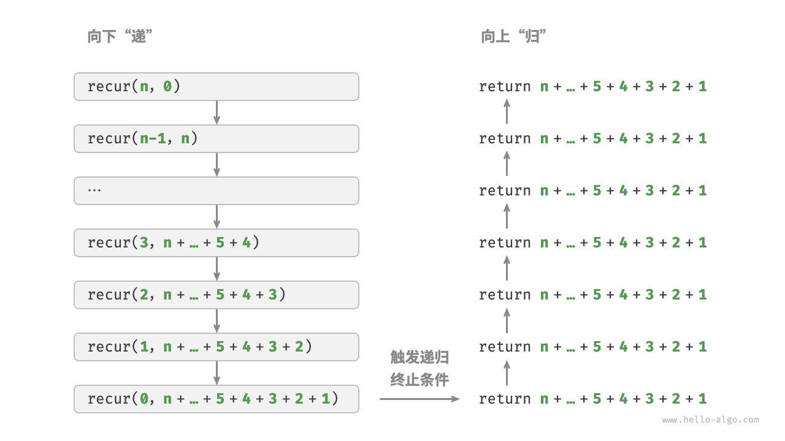

!!! tip

    请注意，许多编译器或解释器并不支持尾递归优化。例如，Python 默认不支持尾递归优化，因此即使函数是尾递归形式，仍然可能会遇到栈溢出问题。

### 递归树

当处理与“分治”相关的算法问题时，递归往往比迭代的思路更加直观、代码更加易读。以“斐波那契数列”为例。

!!! question

    给定一个斐波那契数列 $0, 1, 1, 2, 3, 5, 8, 13, \dots$ ，求该数列的第 $n$ 个数字。

设斐波那契数列的第 $n$ 个数字为 $f(n)$ ，易得两个结论。

- 数列的前两个数字为 $f(1) = 0$ 和 $f(2) = 1$ 。
- 数列中的每个数字是前两个数字的和，即 $f(n) = f(n - 1) + f(n - 2)$ 。

按照递推关系进行递归调用，将前两个数字作为终止条件，便可写出递归代码。调用 `fib(n)` 即可得到斐波那契数列的第 $n$ 个数字：

```python
def fib(n: int) -> int:
    """斐波那契数列：递归"""
    # 终止条件 f(1) = 0, f(2) = 1
    if n == 1 or n == 2:
        return n - 1
    # 递归调用 f(n) = f(n-1) + f(n-2)
    res = fib(n - 1) + fib(n - 2)
    # 返回结果 f(n)
    return res
```

!!! example [pythontutor "可视化运行"](https://pythontutor.com/iframe-embed.html#code=def%20fib%28n%3A%20int%29%20-%3E%20int%3A%0A%20%20%20%20%22%22%22%E6%96%90%E6%B3%A2%E9%82%A3%E5%A5%91%E6%95%B0%E5%88%97%EF%BC%9A%E9%80%92%E5%BD%92%22%22%22%0A%20%20%20%20%23%20%E7%BB%88%E6%AD%A2%E6%9D%A1%E4%BB%B6%20f%281%29%20%3D%200,%20f%282%29%20%3D%201%0A%20%20%20%20if%20n%20%3D%3D%201%20or%20n%20%3D%3D%202%3A%0A%20%20%20%20%20%20%20%20return%20n%20-%201%0A%20%20%20%20%23%20%E9%80%92%E5%BD%92%E8%B0%83%E7%94%A8%20f%28n%29%20%3D%20f%28n-1%29%20%2B%20f%28n-2%29%0A%20%20%20%20res%20%3D%20fib%28n%20-%201%29%20%2B%20fib%28n%20-%202%29%0A%20%20%20%20%23%20%E8%BF%94%E5%9B%9E%E7%BB%93%E6%9E%9C%20f%28n%29%0A%20%20%20%20return%20res%0A%0A%22%22%22Driver%20Code%22%22%22%0Aif%20__name__%20%3D%3D%20%22__main__%22%3A%0A%20%20%20%20n%20%3D%205%0A%20%20%20%20res%20%3D%20fib%28n%29%0A%20%20%20%20print%28f%22%5Cn%E6%96%90%E6%B3%A2%E9%82%A3%E5%A5%91%E6%95%B0%E5%88%97%E7%9A%84%E7%AC%AC%20%7Bn%7D%20%E9%A1%B9%E4%B8%BA%20%7Bres%7D%22%29&codeDivHeight=800&codeDivWidth=600&cumulative=false&curInstr=3&heapPrimitives=nevernest&origin=opt-frontend.js&py=311&rawInputLstJSON=%5B%5D&textReferences=false)

观察以上代码，我们在函数内递归调用了两个函数，**这意味着从一个调用产生了两个调用分支**。如下图所示，这样不断递归调用下去，最终将产生一棵层数为 $n$ 的<u>递归树（recursion tree）</u>。

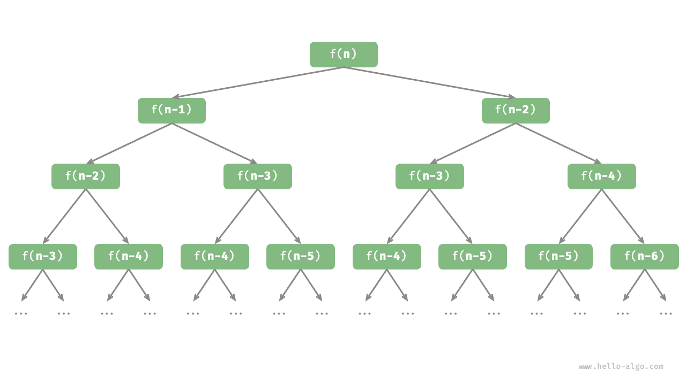

从本质上看，递归体现了“将问题分解为更小子问题”的思维范式，这种分治策略至关重要。

- 从算法角度看，搜索、排序、回溯、分治、动态规划等许多重要算法策略直接或间接地应用了这种思维方式。
- 从数据结构角度看，递归天然适合处理链表、树和图的相关问题，因为它们非常适合用分治思想进行分析。

## 两者对比

总结以上内容，如下表所示，迭代和递归在实现、性能和适用性上有所不同。

<p align="center"> 表 <id> &nbsp; 迭代与递归特点对比 </p>

|          | 迭代                                   | 递归                                                         |
| -------- | -------------------------------------- | ------------------------------------------------------------ |
| 实现方式 | 循环结构                               | 函数调用自身                                                 |
| 时间效率 | 效率通常较高，无函数调用开销           | 每次函数调用都会产生开销                                     |
| 内存使用 | 通常使用固定大小的内存空间             | 累积函数调用可能使用大量的栈帧空间                           |
| 适用问题 | 适用于简单循环任务，代码直观、可读性好 | 适用于子问题分解，如树、图、分治、回溯等，代码结构简洁、清晰 |

!!! tip

    如果感觉以下内容理解困难，可以在读完“栈”章节后再来复习。

那么，迭代和递归具有什么内在联系呢？以上述递归函数为例，求和操作在递归的“归”阶段进行。这意味着最初被调用的函数实际上是最后完成其求和操作的，**这种工作机制与栈的“先入后出”原则异曲同工**。

事实上，“调用栈”和“栈帧空间”这类递归术语已经暗示了递归与栈之间的密切关系。

1. **递**：当函数被调用时，系统会在“调用栈”上为该函数分配新的栈帧，用于存储函数的局部变量、参数、返回地址等数据。
2. **归**：当函数完成执行并返回时，对应的栈帧会被从“调用栈”上移除，恢复之前函数的执行环境。

因此，**我们可以使用一个显式的栈来模拟调用栈的行为**，从而将递归转化为迭代形式：

```python
def for_loop_recur(n: int) -> int:
    """使用迭代模拟递归"""
    # 使用一个显式的栈来模拟系统调用栈
    stack = []
    res = 0
    # 递：递归调用
    for i in range(n, 0, -1):
        # 通过“入栈操作”模拟“递”
        stack.append(i)
    # 归：返回结果
    while stack:
        # 通过“出栈操作”模拟“归”
        res += stack.pop()
    # res = 1+2+3+...+n
    return res
```

!!! example [pythontutor "可视化运行"](https://pythontutor.com/iframe-embed.html#code=def%20for_loop_recur%28n%3A%20int%29%20-%3E%20int%3A%0A%20%20%20%20%22%22%22%E4%BD%BF%E7%94%A8%E8%BF%AD%E4%BB%A3%E6%A8%A1%E6%8B%9F%E9%80%92%E5%BD%92%22%22%22%0A%20%20%20%20%23%20%E4%BD%BF%E7%94%A8%E4%B8%80%E4%B8%AA%E6%98%BE%E5%BC%8F%E7%9A%84%E6%A0%88%E6%9D%A5%E6%A8%A1%E6%8B%9F%E7%B3%BB%E7%BB%9F%E8%B0%83%E7%94%A8%E6%A0%88%0A%20%20%20%20stack%20%3D%20%5B%5D%0A%20%20%20%20res%20%3D%200%0A%20%20%20%20%23%20%E9%80%92%EF%BC%9A%E9%80%92%E5%BD%92%E8%B0%83%E7%94%A8%0A%20%20%20%20for%20i%20in%20range%28n,%200,%20-1%29%3A%0A%20%20%20%20%20%20%20%20%23%20%E9%80%9A%E8%BF%87%E2%80%9C%E5%85%A5%E6%A0%88%E6%93%8D%E4%BD%9C%E2%80%9D%E6%A8%A1%E6%8B%9F%E2%80%9C%E9%80%92%E2%80%9D%0A%20%20%20%20%20%20%20%20stack.append%28i%29%0A%20%20%20%20%23%20%E5%BD%92%EF%BC%9A%E8%BF%94%E5%9B%9E%E7%BB%93%E6%9E%9C%0A%20%20%20%20while%20stack%3A%0A%20%20%20%20%20%20%20%20%23%20%E9%80%9A%E8%BF%87%E2%80%9C%E5%87%BA%E6%A0%88%E6%93%8D%E4%BD%9C%E2%80%9D%E6%A8%A1%E6%8B%9F%E2%80%9C%E5%BD%92%E2%80%9D%0A%20%20%20%20%20%20%20%20res%20%2B%3D%20stack.pop%28%29%0A%20%20%20%20%23%20res%20%3D%201%2B2%2B3%2B...%2Bn%0A%20%20%20%20return%20res%0A%0A%22%22%22Driver%20Code%22%22%22%0Aif%20__name__%20%3D%3D%20%22__main__%22%3A%0A%20%20%20%20n%20%3D%205%0A%20%20%20%20res%20%3D%20for_loop_recur%28n%29%0A%20%20%20%20print%28f%22%5Cn%E4%BD%BF%E7%94%A8%E8%BF%AD%E4%BB%A3%E6%A8%A1%E6%8B%9F%E9%80%92%E5%BD%92%E6%B1%82%E5%92%8C%E7%BB%93%E6%9E%9C%20res%20%3D%20%7Bres%7D%22%29&codeDivHeight=800&codeDivWidth=600&cumulative=false&curInstr=3&heapPrimitives=nevernest&origin=opt-frontend.js&py=311&rawInputLstJSON=%5B%5D&textReferences=false)

观察以上代码，当递归转化为迭代后，代码变得更加复杂了。尽管迭代和递归在很多情况下可以互相转化，但不一定值得这样做，有以下两点原因。

- 转化后的代码可能更加难以理解，可读性更差。
- 对于某些复杂问题，模拟系统调用栈的行为可能非常困难。

总之，**选择迭代还是递归取决于特定问题的性质**。在编程实践中，权衡两者的优劣并根据情境选择合适的方法至关重要。

# 时间复杂度

运行时间可以直观且准确地反映算法的效率。如果我们想准确预估一段代码的运行时间，应该如何操作呢？

1. **确定运行平台**，包括硬件配置、编程语言、系统环境等，这些因素都会影响代码的运行效率。
2. **评估各种计算操作所需的运行时间**，例如加法操作 `+` 需要 1 ns ，乘法操作 `*` 需要 10 ns ，打印操作 `print()` 需要 5 ns 等。
3. **统计代码中所有的计算操作**，并将所有操作的执行时间求和，从而得到运行时间。

!!! danger 运行时间评估不合理，但并不影响复杂度分析

    示例中的时间（加法1ns、乘法10ns、打印5ns）远小于实际值，尤其是I/O操作（如打印）的延迟被严重低估。
    
    以下是符合现代计算机架构的合理时间预估：
    - 加法操作：寄存器间的整数加法通常在 0.3-1 ns （约 1-3 个时钟周期）
    - 乘法操作：寄存器间的整数乘法通常在 1-5 ns （约 3-15 个时钟周期）
    - 打印操作：打印操作的延迟取决于输出设备和操作系统，`print("hello")` 通常在 1-100 ms（约 $10^6$ - $10^8$ ns）
    
    此外，存储和IO设备不容忽视：
    - 加法/乘法的时间仅考虑CPU指令执行（寄存器间操作），但实际中若操作数在内存中，需先加载到寄存器，总时间会翻倍（缓存命中），甚至百倍（缓存未命中）
    - 打印操作的I/O延迟被完全忽略：打印需将数据从内存发送到输出设备（屏幕/打印机），涉及系统调用（约 1-10 μs）、设备响应（约 1-100 ms）

例如在以下代码中，输入数据大小为 $n$ ：

```python
# 在某运行平台下
def algorithm(n: int):
    a = 2                   # 1 ns
    a = a + 1               # 1 ns
    a = a * 2               # 10 ns
    
    # 循环 n 次
    for _ in range(n):      # 1 ns
        print(0)            # 5 ns  
```

根据以上方法，可以得到算法的运行时间为 $(6n + 12)$ ns ：

$$
1 + 1 + 10 + (1 + 5) \times n = 6n + 12
$$

但实际上，**统计算法的运行时间既不合理也不现实**。首先，我们不希望将预估时间和运行平台绑定，因为算法需要在各种不同的平台上运行。其次，我们很难获知每种操作的运行时间，这给预估过程带来了极大的难度。

## 统计时间增长趋势

时间复杂度分析统计的不是算法运行时间，**而是算法运行时间随着数据量变大时的增长趋势**。

“时间增长趋势”这个概念比较抽象，我们通过一个例子来加以理解。假设输入数据大小为 $n$ ，给定三个算法 `A`、`B` 和 `C` ：

```python
# 算法 A 的时间复杂度：常数阶
def algorithm_A(n: int):
    print(0)

# 算法 B 的时间复杂度：线性阶
def algorithm_B(n: int):
    for _ in range(n):
        print(0)

# 算法 C 的时间复杂度：常数阶
def algorithm_C(n: int):
    for _ in range(1000000):
        print(0)
```

下图展示了以上三个算法函数的时间复杂度。

- 算法 `A` 只有 $1$ 个打印操作，算法运行时间不随着 $n$ 增大而增长。我们称此算法的时间复杂度为“常数阶”。
- 算法 `B` 中的打印操作需要循环 $n$ 次，算法运行时间随着 $n$ 增大呈线性增长。此算法的时间复杂度被称为“线性阶”。
- 算法 `C` 中的打印操作需要循环 $1000000$ 次，虽然运行时间很长，但它与输入数据大小 $n$ 无关。因此 `C` 的时间复杂度和 `A` 相同，仍为“常数阶”。

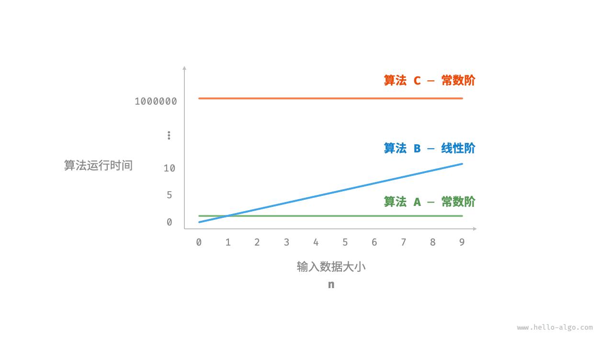

相较于直接统计算法的运行时间，时间复杂度分析有哪些特点呢？

- **时间复杂度能够有效评估算法效率**。例如，算法 `B` 的运行时间呈线性增长，在 $n > 1$ 时比算法 `A` 更慢，在 $n > 1000000$ 时比算法 `C` 更慢。事实上，只要输入数据大小 $n$ 足够大，复杂度为“常数阶”的算法一定优于“线性阶”的算法，这正是时间增长趋势的含义。
- **时间复杂度的推算方法更简便**。显然，运行平台和计算操作类型都与算法运行时间的增长趋势无关。因此在时间复杂度分析中，我们可以简单地将所有计算操作的执行时间视为相同的“单位时间”，从而将“计算操作运行时间统计”简化为“计算操作数量统计”，这样一来估算难度就大大降低了。
- **时间复杂度也存在一定的局限性**。例如，尽管算法 `A` 和 `C` 的时间复杂度相同，但实际运行时间差别很大。同样，尽管算法 `B` 的时间复杂度比 `C` 高，但在输入数据大小 $n$ 较小时，算法 `B` 明显优于算法 `C` 。对于此类情况，我们时常难以仅凭时间复杂度判断算法效率的高低。当然，尽管存在上述问题，复杂度分析仍然是评判算法效率最有效且常用的方法。

## 函数渐近上界

给定一个输入大小为 $n$ 的函数：

```python
def algorithm(n: int):
    a = 1               # +1
    a = a + 1           # +1
    a = a * 2           # +1
    
    # 循环 n 次
    for i in range(n):  # +1
        print(0)        # +1
```

设算法的操作数量是一个关于输入数据大小 $n$ 的函数，记为 $T(n)$ ，则以上函数的操作数量为：

$$
T(n) = 3 + 2n
$$

$T(n)$ 是一次函数，说明其运行时间的增长趋势是线性的，因此它的时间复杂度是线性阶。

我们将线性阶的时间复杂度记为 $O(n)$ ，这个数学符号称为<u>大 $O$ 记号（big-$O$ notation）</u>，表示函数 $T(n)$ 的<u>渐近上界（asymptotic upper bound）</u>。

时间复杂度分析本质上是计算“操作数量 $T(n)$”的渐近上界，它具有明确的数学定义。

!!! note "函数渐近上界"

    若存在正实数 $c$ 和实数 $n_0$ ，使得对于所有的 $n > n_0$ ，均有 $T(n) \leq c \cdot f(n)$ ，则可认为 $f(n)$ 给出了 $T(n)$ 的一个渐近上界，记为 $T(n) = O(f(n))$ 。

如下图所示，计算渐近上界就是寻找一个函数 $f(n)$ ，使得当 $n$ 趋向于无穷大时，$T(n)$ 和 $f(n)$ 处于相同的增长级别，仅相差一个常数系数 $c$。

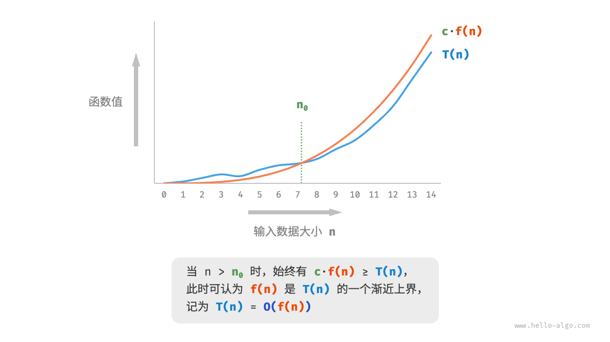

## 推算方法

渐近上界的数学味儿有点重，如果你感觉没有完全理解，也无须担心。我们可以先掌握推算方法，在不断的实践中，就可以逐渐领悟其数学意义。

根据定义，确定 $f(n)$ 之后，我们便可得到时间复杂度 $O(f(n))$ 。那么如何确定渐近上界 $f(n)$ 呢？总体分为两步：首先统计操作数量，然后判断渐近上界。

### 第一步：统计操作数量

针对代码，逐行从上到下计算即可。然而，由于上述 $c \cdot f(n)$ 中的常数系数 $c$ 可以取任意大小，**因此操作数量 $T(n)$ 中的各种系数、常数项都可以忽略**。根据此原则，可以总结出以下计数简化技巧。

1. **忽略 $T(n)$ 中的常数**。因为它们都与 $n$ 无关，所以对时间复杂度不产生影响。
2. **省略所有系数**。例如，循环 $2n$ 次、$5n + 1$ 次等，都可以简化记为 $n$ 次，因为 $n$ 前面的系数对时间复杂度没有影响。
3. **循环嵌套时使用乘法**。总操作数量等于外层循环和内层循环操作数量之积，每一层循环依然可以分别套用第 `1.` 点和第 `2.` 点的技巧。

给定一个函数，我们可以用上述技巧来统计操作数量：

```python
def algorithm(n: int):
    a = 1      # +0（技巧 1）
    a = a + n  # +0（技巧 1）
    
    # +n（技巧 2）
    for i in range(5 * n + 1):
        print(0)
    
    # +n*n（技巧 3）
    for i in range(2 * n):
        for j in range(n + 1):
            print(0)
```


以下公式展示了使用上述技巧前后的统计结果，两者推算出的时间复杂度都为 $O(n^2)$ 。

$$
\begin{aligned}
T(n) & = 2n(n + 1) + (5n + 1) + 2 & \text{完整统计 (-.-|||)} \newline
& = 2n^2 + 7n + 3 \newline
T(n) & = n^2 + n & \text{偷懒统计 (o.O)}
\end{aligned}
$$

### 第二步：判断渐近上界

**时间复杂度由 $T(n)$ 中最高阶的项来决定**。这是因为在 $n$ 趋于无穷大时，最高阶的项将发挥主导作用，其他项的影响都可以忽略。

下表展示了一些例子，其中一些夸张的值是为了强调“系数无法撼动阶数”这一结论。当 $n$ 趋于无穷大时，这些常数变得无足轻重。

<p align="center"> 表 <id> &nbsp; 不同操作数量对应的时间复杂度 </p>

| 操作数量 $T(n)$        | 时间复杂度 $O(f(n))$ |
| ---------------------- | -------------------- |
| $100000$               | $O(1)$               |
| $3n + 2$               | $O(n)$               |
| $2n^2 + 3n + 2$        | $O(n^2)$             |
| $n^3 + 10000n^2$       | $O(n^3)$             |
| $2^n + 10000n^{10000}$ | $O(2^n)$             |

## 常见类型

设输入数据大小为 $n$ ，常见的时间复杂度类型如下图所示（按照从低到高的顺序排列）。

$$
\begin{aligned}
O(1) < O(\log n) < O(n) < O(n \log n) < O(n^2) < O(2^n) < O(n!) \newline
\text{常数阶} < \text{对数阶} < \text{线性阶} < \text{线性对数阶} < \text{平方阶} < \text{指数阶} < \text{阶乘阶}
\end{aligned}
$$

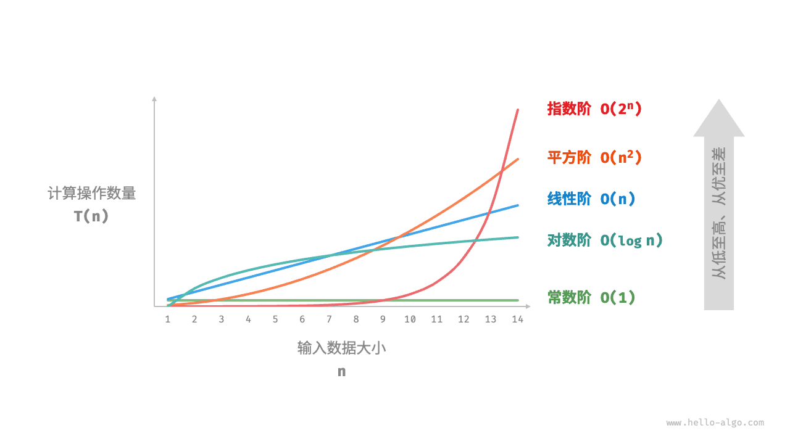

### 常数阶 $O(1)$

常数阶的操作数量与输入数据大小 $n$ 无关，即不随着 $n$ 的变化而变化。

在以下函数中，尽管操作数量 `size` 可能很大，但由于其与输入数据大小 $n$ 无关，因此时间复杂度仍为 $O(1)$ ：

```python
def constant(n: int) -> int:
    """常数阶"""
    count = 0
    size = 100000
    for _ in range(size):
        count += 1
    return count
```

!!! example [pythontutor "可视化运行"](https://pythontutor.com/iframe-embed.html#code=def%20constant%28n%3A%20int%29%20-%3E%20int%3A%0A%20%20%20%20%22%22%22%E5%B8%B8%E6%95%B0%E9%98%B6%22%22%22%0A%20%20%20%20count%20%3D%200%0A%20%20%20%20size%20%3D%2010%0A%20%20%20%20for%20_%20in%20range%28size%29%3A%0A%20%20%20%20%20%20%20%20count%20%2B%3D%201%0A%20%20%20%20return%20count%0A%0A%22%22%22Driver%20Code%22%22%22%0Aif%20__name__%20%3D%3D%20%22__main__%22%3A%0A%20%20%20%20n%20%3D%208%0A%20%20%20%20print%28%22%E8%BE%93%E5%85%A5%E6%95%B0%E6%8D%AE%E5%A4%A7%E5%B0%8F%20n%20%3D%22,%20n%29%0A%0A%20%20%20%20count%20%3D%20constant%28n%29%0A%20%20%20%20print%28%22%E5%B8%B8%E6%95%B0%E9%98%B6%E7%9A%84%E6%93%8D%E4%BD%9C%E6%95%B0%E9%87%8F%20%3D%22,%20count%29&codeDivHeight=800&codeDivWidth=600&cumulative=false&curInstr=3&heapPrimitives=nevernest&origin=opt-frontend.js&py=311&rawInputLstJSON=%5B%5D&textReferences=false)

### 线性阶 $O(n)$

线性阶的操作数量相对于输入数据大小 $n$ 以线性级别增长。线性阶通常出现在单层循环中：

```python
def linear(n: int) -> int:
    """线性阶"""
    count = 0
    for _ in range(n):
        count += 1
    return count
```

!!! example [pythontutor "可视化运行"](https://pythontutor.com/iframe-embed.html#code=def%20linear%28n%29%20-%3E%20int%3A%0A%20%20%20%20%22%22%22%E7%BA%BF%E6%80%A7%E9%98%B6%22%22%22%0A%20%20%20%20count%20%3D%200%0A%20%20%20%20for%20_%20in%20range%28n%29%3A%0A%20%20%20%20%20%20%20%20count%20%2B%3D%201%0A%20%20%20%20return%20count%0A%0A%22%22%22Driver%20Code%22%22%22%0Aif%20__name__%20%3D%3D%20%22__main__%22%3A%0A%20%20%20%20n%20%3D%208%0A%20%20%20%20print%28%22%E8%BE%93%E5%85%A5%E6%95%B0%E6%8D%AE%E5%A4%A7%E5%B0%8F%20n%20%3D%22,%20n%29%0A%0A%20%20%20%20count%20%3D%20linear%28n%29%0A%20%20%20%20print%28%22%E7%BA%BF%E6%80%A7%E9%98%B6%E7%9A%84%E6%93%8D%E4%BD%9C%E6%95%B0%E9%87%8F%20%3D%22,%20count%29&codeDivHeight=800&codeDivWidth=600&cumulative=false&curInstr=3&heapPrimitives=nevernest&origin=opt-frontend.js&py=311&rawInputLstJSON=%5B%5D&textReferences=false)

遍历数组和遍历链表等操作的时间复杂度均为 $O(n)$ ，其中 $n$ 为数组或链表的长度：

```python
def array_traversal(nums: list[int]) -> int:
    """线性阶（遍历数组）"""
    count = 0
    # 循环次数与数组长度成正比
    for num in nums:
        count += 1
    return count
```

!!! example [pythontutor "可视化运行"](https://pythontutor.com/iframe-embed.html#code=def%20array_traversal%28nums%3A%20list%5Bint%5D%29%20-%3E%20int%3A%0A%20%20%20%20%22%22%22%E7%BA%BF%E6%80%A7%E9%98%B6%EF%BC%88%E9%81%8D%E5%8E%86%E6%95%B0%E7%BB%84%EF%BC%89%22%22%22%0A%20%20%20%20count%20%3D%200%0A%20%20%20%20%23%20%E5%BE%AA%E7%8E%AF%E6%AC%A1%E6%95%B0%E4%B8%8E%E6%95%B0%E7%BB%84%E9%95%BF%E5%BA%A6%E6%88%90%E6%AD%A3%E6%AF%94%0A%20%20%20%20for%20num%20in%20nums%3A%0A%20%20%20%20%20%20%20%20count%20%2B%3D%201%0A%20%20%20%20return%20count%0A%0A%22%22%22Driver%20Code%22%22%22%0Aif%20__name__%20%3D%3D%20%22__main__%22%3A%0A%20%20%20%20n%20%3D%208%0A%20%20%20%20print%28%22%E8%BE%93%E5%85%A5%E6%95%B0%E6%8D%AE%E5%A4%A7%E5%B0%8F%20n%20%3D%22,%20n%29%0A%0A%20%20%20%20count%20%3D%20array_traversal%28%5B0%5D%20*%20n%29%0A%20%20%20%20print%28%22%E7%BA%BF%E6%80%A7%E9%98%B6%EF%BC%88%E9%81%8D%E5%8E%86%E6%95%B0%E7%BB%84%EF%BC%89%E7%9A%84%E6%93%8D%E4%BD%9C%E6%95%B0%E9%87%8F%20%3D%22,%20count%29&codeDivHeight=800&codeDivWidth=600&cumulative=false&curInstr=3&heapPrimitives=nevernest&origin=opt-frontend.js&py=311&rawInputLstJSON=%5B%5D&textReferences=false)

值得注意的是，**输入数据大小 $n$ 需根据输入数据的类型来具体确定**。比如在第一个示例中，变量 $n$ 为输入数据大小；在第二个示例中，数组长度 $n$ 为数据大小。

### 平方阶 $O(n^2)$

平方阶的操作数量相对于输入数据大小 $n$ 以平方级别增长。平方阶通常出现在嵌套循环中，外层循环和内层循环的时间复杂度都为 $O(n)$ ，因此总体的时间复杂度为 $O(n^2)$ ：

```python
def quadratic(n: int) -> int:
    """平方阶"""
    count = 0
    # 循环次数与数据大小 n 成平方关系
    for i in range(n):
        for j in range(n):
            count += 1
    return count
```

!!! example [pythontutor "可视化运行"](https://pythontutor.com/iframe-embed.html#code=def%20quadratic%28n%29%20-%3E%20int%3A%0A%20%20%20%20%22%22%22%E5%B9%B3%E6%96%B9%E9%98%B6%22%22%22%0A%20%20%20%20count%20%3D%200%0A%20%20%20%20%23%20%E5%BE%AA%E7%8E%AF%E6%AC%A1%E6%95%B0%E4%B8%8E%E6%95%B0%E6%8D%AE%E5%A4%A7%E5%B0%8F%20n%20%E6%88%90%E5%B9%B3%E6%96%B9%E5%85%B3%E7%B3%BB%0A%20%20%20%20for%20i%20in%20range%28n%29%3A%0A%20%20%20%20%20%20%20%20for%20j%20in%20range%28n%29%3A%0A%20%20%20%20%20%20%20%20%20%20%20%20count%20%2B%3D%201%0A%20%20%20%20return%20count%0A%0A%22%22%22Driver%20Code%22%22%22%0Aif%20__name__%20%3D%3D%20%22__main__%22%3A%0A%20%20%20%20n%20%3D%208%0A%20%20%20%20print%28%22%E8%BE%93%E5%85%A5%E6%95%B0%E6%8D%AE%E5%A4%A7%E5%B0%8F%20n%20%3D%22,%20n%29%0A%0A%20%20%20%20count%20%3D%20quadratic%28n%29%0A%20%20%20%20print%28%22%E5%B9%B3%E6%96%B9%E9%98%B6%E7%9A%84%E6%93%8D%E4%BD%9C%E6%95%B0%E9%87%8F%20%3D%22,%20count%29&codeDivHeight=800&codeDivWidth=600&cumulative=false&curInstr=3&heapPrimitives=nevernest&origin=opt-frontend.js&py=311&rawInputLstJSON=%5B%5D&textReferences=false)

下图对比了常数阶、线性阶和平方阶三种时间复杂度。

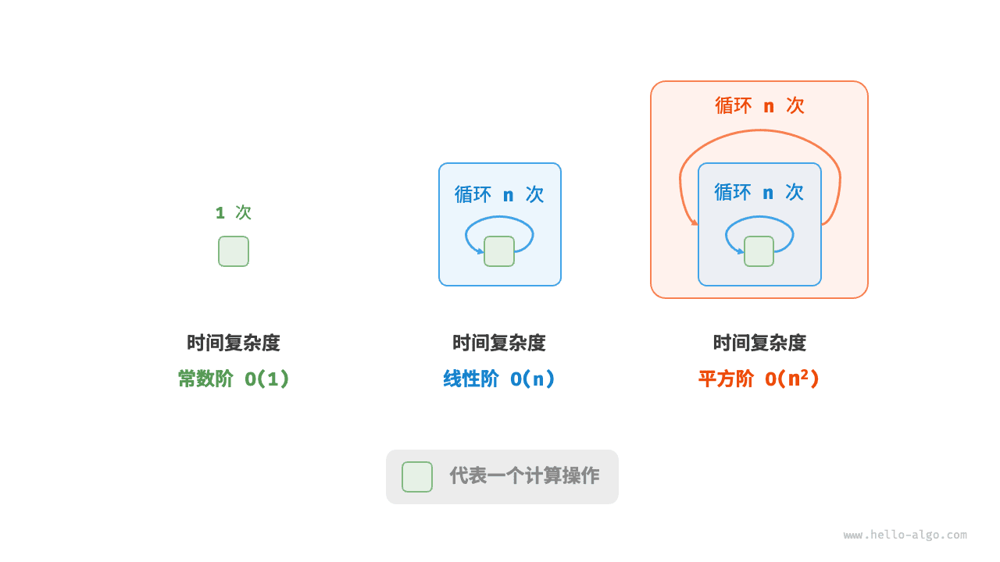

以冒泡排序为例，外层循环执行 $n - 1$ 次，内层循环执行 $n-1$、$n-2$、$\dots$、$2$、$1$ 次，平均为 $n / 2$ 次，因此时间复杂度为 $O((n - 1) n / 2) = O(n^2)$ ：

```python
def bubble_sort(nums: list[int]) -> int:
    """平方阶（冒泡排序）"""
    count = 0  # 计数器
    # 外循环：未排序区间为 [0, i]
    for i in range(len(nums) - 1, 0, -1):
        # 内循环：将未排序区间 [0, i] 中的最大元素交换至该区间的最右端
        for j in range(i):
            if nums[j] > nums[j + 1]:
                # 交换 nums[j] 与 nums[j + 1]
                tmp: int = nums[j]
                nums[j] = nums[j + 1]
                nums[j + 1] = tmp
                count += 3  # 元素交换包含 3 个单元操作
    return count
```

!!! example [pythontutor "可视化运行"](https://pythontutor.com/iframe-embed.html#code=def%20bubble_sort%28nums%3A%20list%5Bint%5D%29%20-%3E%20int%3A%0A%20%20%20%20%22%22%22%E5%B9%B3%E6%96%B9%E9%98%B6%EF%BC%88%E5%86%92%E6%B3%A1%E6%8E%92%E5%BA%8F%EF%BC%89%22%22%22%0A%20%20%20%20count%20%3D%200%20%20%23%20%E8%AE%A1%E6%95%B0%E5%99%A8%0A%20%20%20%20%23%20%E5%A4%96%E5%BE%AA%E7%8E%AF%EF%BC%9A%E6%9C%AA%E6%8E%92%E5%BA%8F%E5%8C%BA%E9%97%B4%E4%B8%BA%20%5B0,%20i%5D%0A%20%20%20%20for%20i%20in%20range%28len%28nums%29%20-%201,%200,%20-1%29%3A%0A%20%20%20%20%20%20%20%20%23%20%E5%86%85%E5%BE%AA%E7%8E%AF%EF%BC%9A%E5%B0%86%E6%9C%AA%E6%8E%92%E5%BA%8F%E5%8C%BA%E9%97%B4%20%5B0,%20i%5D%20%E4%B8%AD%E7%9A%84%E6%9C%80%E5%A4%A7%E5%85%83%E7%B4%A0%E4%BA%A4%E6%8D%A2%E8%87%B3%E8%AF%A5%E5%8C%BA%E9%97%B4%E7%9A%84%E6%9C%80%E5%8F%B3%E7%AB%AF%0A%20%20%20%20%20%20%20%20for%20j%20in%20range%28i%29%3A%0A%20%20%20%20%20%20%20%20%20%20%20%20if%20nums%5Bj%5D%20%3E%20nums%5Bj%20%2B%201%5D%3A%0A%20%20%20%20%20%20%20%20%20%20%20%20%20%20%20%20%23%20%E4%BA%A4%E6%8D%A2%20nums%5Bj%5D%20%E4%B8%8E%20nums%5Bj%20%2B%201%5D%0A%20%20%20%20%20%20%20%20%20%20%20%20%20%20%20%20tmp%20%3D%20nums%5Bj%5D%0A%20%20%20%20%20%20%20%20%20%20%20%20%20%20%20%20nums%5Bj%5D%20%3D%20nums%5Bj%20%2B%201%5D%0A%20%20%20%20%20%20%20%20%20%20%20%20%20%20%20%20nums%5Bj%20%2B%201%5D%20%3D%20tmp%0A%20%20%20%20%20%20%20%20%20%20%20%20%20%20%20%20count%20%2B%3D%203%20%20%23%20%E5%85%83%E7%B4%A0%E4%BA%A4%E6%8D%A2%E5%8C%85%E5%90%AB%203%20%E4%B8%AA%E5%8D%95%E5%85%83%E6%93%8D%E4%BD%9C%0A%20%20%20%20return%20count%0A%0A%22%22%22Driver%20Code%22%22%22%0Aif%20__name__%20%3D%3D%20%22__main__%22%3A%0A%20%20%20%20n%20%3D%208%0A%20%20%20%20print%28%22%E8%BE%93%E5%85%A5%E6%95%B0%E6%8D%AE%E5%A4%A7%E5%B0%8F%20n%20%3D%22,%20n%29%0A%0A%20%20%20%20nums%20%3D%20%5Bi%20for%20i%20in%20range%28n,%200,%20-1%29%5D%20%20%23%20%5Bn,%20n-1,%20...,%202,%201%5D%0A%20%20%20%20count%20%3D%20bubble_sort%28nums%29%0A%20%20%20%20print%28%22%E5%B9%B3%E6%96%B9%E9%98%B6%EF%BC%88%E5%86%92%E6%B3%A1%E6%8E%92%E5%BA%8F%EF%BC%89%E7%9A%84%E6%93%8D%E4%BD%9C%E6%95%B0%E9%87%8F%20%3D%22,%20count%29&codeDivHeight=800&codeDivWidth=600&cumulative=false&curInstr=3&heapPrimitives=nevernest&origin=opt-frontend.js&py=311&rawInputLstJSON=%5B%5D&textReferences=false)

### 指数阶 $O(2^n)$

生物学的“细胞分裂”是指数阶增长的典型例子：初始状态为 $1$ 个细胞，分裂一轮后变为 $2$ 个，分裂两轮后变为 $4$ 个，以此类推，分裂 $n$ 轮后有 $2^n$ 个细胞。

下图和以下代码模拟了细胞分裂的过程，时间复杂度为 $O(2^n)$ 。请注意，输入 $n$ 表示分裂轮数，返回值 `count` 表示总分裂次数。

```python
def exponential(n: int) -> int:
    """指数阶（循环实现）"""
    count = 0
    base = 1
    # 细胞每轮一分为二，形成数列 1, 2, 4, 8, ..., 2^(n-1)
    for _ in range(n):
        for _ in range(base):
            count += 1
        base *= 2
    # count = 1 + 2 + 4 + 8 + .. + 2^(n-1) = 2^n - 1
    return count
```

!!! example [pythontutor "可视化运行"](https://pythontutor.com/iframe-embed.html#code=def%20exponential%28n%29%20-%3E%20int%3A%0A%20%20%20%20%22%22%22%E6%8C%87%E6%95%B0%E9%98%B6%EF%BC%88%E5%BE%AA%E7%8E%AF%E5%AE%9E%E7%8E%B0%EF%BC%89%22%22%22%0A%20%20%20%20count%20%3D%200%0A%20%20%20%20base%20%3D%201%0A%20%20%20%20%23%20%E7%BB%86%E8%83%9E%E6%AF%8F%E8%BD%AE%E4%B8%80%E5%88%86%E4%B8%BA%E4%BA%8C%EF%BC%8C%E5%BD%A2%E6%88%90%E6%95%B0%E5%88%97%201,%202,%204,%208,%20...,%202%5E%28n-1%29%0A%20%20%20%20for%20_%20in%20range%28n%29%3A%0A%20%20%20%20%20%20%20%20for%20_%20in%20range%28base%29%3A%0A%20%20%20%20%20%20%20%20%20%20%20%20count%20%2B%3D%201%0A%20%20%20%20%20%20%20%20base%20*%3D%202%0A%20%20%20%20%23%20count%20%3D%201%20%2B%202%20%2B%204%20%2B%208%20%2B%20..%20%2B%202%5E%28n-1%29%20%3D%202%5En%20-%201%0A%20%20%20%20return%20count%0A%0A%22%22%22Driver%20Code%22%22%22%0Aif%20__name__%20%3D%3D%20%22__main__%22%3A%0A%20%20%20%20n%20%3D%208%0A%20%20%20%20print%28%22%E8%BE%93%E5%85%A5%E6%95%B0%E6%8D%AE%E5%A4%A7%E5%B0%8F%20n%20%3D%22,%20n%29%0A%0A%20%20%20%20count%20%3D%20exponential%28n%29%0A%20%20%20%20print%28%22%E6%8C%87%E6%95%B0%E9%98%B6%EF%BC%88%E5%BE%AA%E7%8E%AF%E5%AE%9E%E7%8E%B0%EF%BC%89%E7%9A%84%E6%93%8D%E4%BD%9C%E6%95%B0%E9%87%8F%20%3D%22,%20count%29&codeDivHeight=800&codeDivWidth=600&cumulative=false&curInstr=3&heapPrimitives=nevernest&origin=opt-frontend.js&py=311&rawInputLstJSON=%5B%5D&textReferences=false)

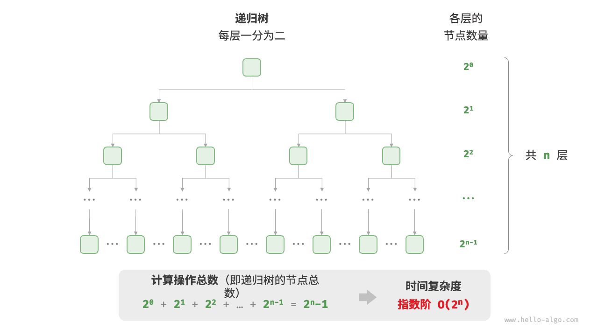

在实际算法中，指数阶常出现于递归函数中。例如在以下代码中，其递归地一分为二，经过 $n$ 次分裂后停止：

```python
def exp_recur(n: int) -> int:
    """指数阶（递归实现）"""
    if n == 1:
        return 1
    return exp_recur(n - 1) + exp_recur(n - 1) + 1
```

!!! example [pythontutor "可视化运行"](https://pythontutor.com/iframe-embed.html#code=def%20exp_recur%28n%29%20-%3E%20int%3A%0A%20%20%20%20%22%22%22%E6%8C%87%E6%95%B0%E9%98%B6%EF%BC%88%E9%80%92%E5%BD%92%E5%AE%9E%E7%8E%B0%EF%BC%89%22%22%22%0A%20%20%20%20if%20n%20%3D%3D%201%3A%0A%20%20%20%20%20%20%20%20return%201%0A%20%20%20%20return%20exp_recur%28n%20-%201%29%20%2B%20exp_recur%28n%20-%201%29%20%2B%201%0A%0A%22%22%22Driver%20Code%22%22%22%0Aif%20__name__%20%3D%3D%20%22__main__%22%3A%0A%20%20%20%20n%20%3D%207%0A%20%20%20%20print%28%22%E8%BE%93%E5%85%A5%E6%95%B0%E6%8D%AE%E5%A4%A7%E5%B0%8F%20n%20%3D%22,%20n%29%0A%0A%20%20%20%20count%20%3D%20exp_recur%28n%29%0A%20%20%20%20print%28%22%E6%8C%87%E6%95%B0%E9%98%B6%EF%BC%88%E9%80%92%E5%BD%92%E5%AE%9E%E7%8E%B0%EF%BC%89%E7%9A%84%E6%93%8D%E4%BD%9C%E6%95%B0%E9%87%8F%20%3D%22,%20count%29&codeDivHeight=800&codeDivWidth=600&cumulative=false&curInstr=3&heapPrimitives=nevernest&origin=opt-frontend.js&py=311&rawInputLstJSON=%5B%5D&textReferences=false)

指数阶增长非常迅速，在穷举法（暴力搜索、回溯等）中比较常见。对于数据规模较大的问题，指数阶是不可接受的，通常需要使用动态规划或贪心算法等来解决。

### 对数阶 $O(\log n)$

与指数阶相反，对数阶反映了“每轮缩减到一半”的情况。设输入数据大小为 $n$ ，由于每轮缩减到一半，因此循环次数是 $\log_2 n$ ，即 $2^n$ 的反函数。

下图和以下代码模拟了“每轮缩减到一半”的过程，时间复杂度为 $O(\log_2 n)$ ，简记为 $O(\log n)$ ：

```python
def logarithmic(n: int) -> int:
    """对数阶（循环实现）"""
    count = 0
    while n > 1:
        n = n / 2
        count += 1
    return count
```

!!! example [pythontutor "可视化运行"](https://pythontutor.com/iframe-embed.html#code=def%20logarithmic%28n%3A%20int%29%20-%3E%20int%3A%0A%20%20%20%20%22%22%22%E5%AF%B9%E6%95%B0%E9%98%B6%EF%BC%88%E5%BE%AA%E7%8E%AF%E5%AE%9E%E7%8E%B0%EF%BC%89%22%22%22%0A%20%20%20%20count%20%3D%200%0A%20%20%20%20while%20n%20%3E%201%3A%0A%20%20%20%20%20%20%20%20n%20%3D%20n%20/%202%0A%20%20%20%20%20%20%20%20count%20%2B%3D%201%0A%20%20%20%20return%20count%0A%0A%22%22%22Driver%20Code%22%22%22%0Aif%20__name__%20%3D%3D%20%22__main__%22%3A%0A%20%20%20%20n%20%3D%208%0A%20%20%20%20print%28%22%E8%BE%93%E5%85%A5%E6%95%B0%E6%8D%AE%E5%A4%A7%E5%B0%8F%20n%20%3D%22,%20n%29%0A%0A%20%20%20%20count%20%3D%20logarithmic%28n%29%0A%20%20%20%20print%28%22%E5%AF%B9%E6%95%B0%E9%98%B6%EF%BC%88%E5%BE%AA%E7%8E%AF%E5%AE%9E%E7%8E%B0%EF%BC%89%E7%9A%84%E6%93%8D%E4%BD%9C%E6%95%B0%E9%87%8F%20%3D%22,%20count%29&codeDivHeight=800&codeDivWidth=600&cumulative=false&curInstr=3&heapPrimitives=nevernest&origin=opt-frontend.js&py=311&rawInputLstJSON=%5B%5D&textReferences=false)

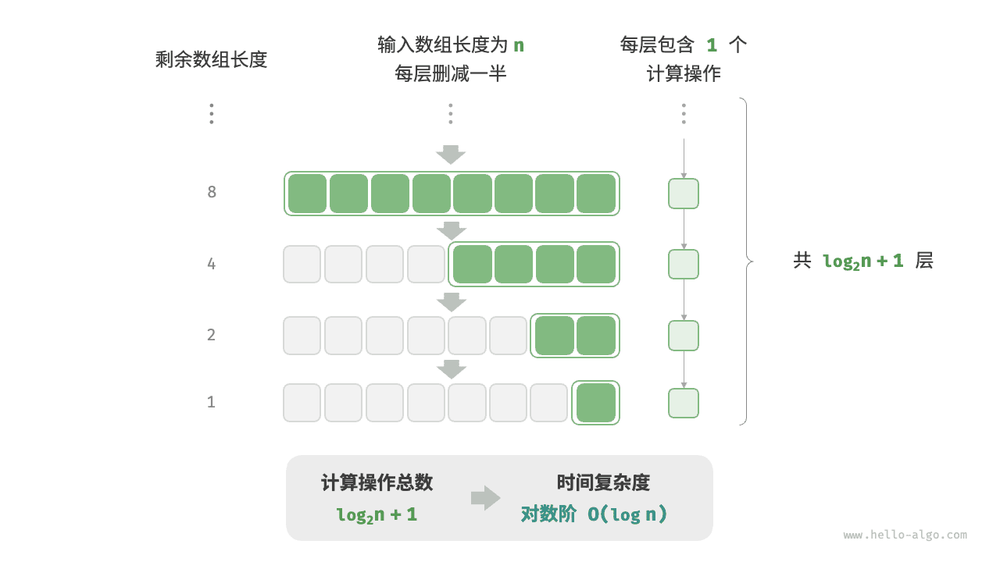

与指数阶类似，对数阶也常出现于递归函数中。以下代码形成了一棵高度为 $\log_2 n$ 的递归树：

```python
def log_recur(n: int) -> int:
    """对数阶（递归实现）"""
    if n <= 1:
        return 0
    return log_recur(n / 2) + 1
```

!!! example [pythontutor "可视化运行"](https://pythontutor.com/iframe-embed.html#code=def%20log_recur%28n%3A%20int%29%20-%3E%20int%3A%0A%20%20%20%20%22%22%22%E5%AF%B9%E6%95%B0%E9%98%B6%EF%BC%88%E9%80%92%E5%BD%92%E5%AE%9E%E7%8E%B0%EF%BC%89%22%22%22%0A%20%20%20%20if%20n%20%3C%3D%201%3A%0A%20%20%20%20%20%20%20%20return%200%0A%20%20%20%20return%20log_recur%28n%20/%202%29%20%2B%201%0A%0A%22%22%22Driver%20Code%22%22%22%0Aif%20__name__%20%3D%3D%20%22__main__%22%3A%0A%20%20%20%20n%20%3D%208%0A%20%20%20%20print%28%22%E8%BE%93%E5%85%A5%E6%95%B0%E6%8D%AE%E5%A4%A7%E5%B0%8F%20n%20%3D%22,%20n%29%0A%0A%20%20%20%20count%20%3D%20log_recur%28n%29%0A%20%20%20%20print%28%22%E5%AF%B9%E6%95%B0%E9%98%B6%EF%BC%88%E9%80%92%E5%BD%92%E5%AE%9E%E7%8E%B0%EF%BC%89%E7%9A%84%E6%93%8D%E4%BD%9C%E6%95%B0%E9%87%8F%20%3D%22,%20count%29&codeDivHeight=800&codeDivWidth=600&cumulative=false&curInstr=4&heapPrimitives=nevernest&origin=opt-frontend.js&py=311&rawInputLstJSON=%5B%5D&textReferences=false)

对数阶常出现于基于分治策略的算法中，体现了“一分为多”和“化繁为简”的算法思想。它增长缓慢，是仅次于常数阶的理想的时间复杂度。

!!! tip "$O(\log n)$ 的底数是多少？"

    准确来说，“一分为 $m$”对应的时间复杂度是 $O(\log_m n)$ 。而通过对数换底公式，我们可以得到具有不同底数、相等的时间复杂度：

    $$
    O(\log_m n) = O(\log_k n / \log_k m) = O(\log_k n)
    $$

    也就是说，底数 $m$ 可以在不影响复杂度的前提下转换。因此我们通常会省略底数 $m$ ，将对数阶直接记为 $O(\log n)$ 。

### 线性对数阶 $O(n \log n)$

线性对数阶常出现于嵌套循环中，两层循环的时间复杂度分别为 $O(\log n)$ 和 $O(n)$ 。相关代码如下：

```python
def linear_log_recur(n: int) -> int:
    """线性对数阶"""
    if n <= 1:
        return 1
    # 一分为二，子问题的规模减小一半
    count = linear_log_recur(n // 2) + linear_log_recur(n // 2)
    # 当前子问题包含 n 个操作
    for _ in range(n):
        count += 1
    return count
```

!!! example [pythontutor "可视化运行"](https://pythontutor.com/iframe-embed.html#code=def%20linear_log_recur%28n%3A%20int%29%20-%3E%20int%3A%0A%20%20%20%20%22%22%22%E7%BA%BF%E6%80%A7%E5%AF%B9%E6%95%B0%E9%98%B6%22%22%22%0A%20%20%20%20if%20n%20%3C%3D%201%3A%0A%20%20%20%20%20%20%20%20return%201%0A%20%20%20%20count%20%3D%20linear_log_recur%28n%20//%202%29%20%2B%20linear_log_recur%28n%20//%202%29%0A%20%20%20%20for%20_%20in%20range%28n%29%3A%0A%20%20%20%20%20%20%20%20count%20%2B%3D%201%0A%20%20%20%20return%20count%0A%0A%22%22%22Driver%20Code%22%22%22%0Aif%20__name__%20%3D%3D%20%22__main__%22%3A%0A%20%20%20%20n%20%3D%208%0A%20%20%20%20print%28%22%E8%BE%93%E5%85%A5%E6%95%B0%E6%8D%AE%E5%A4%A7%E5%B0%8F%20n%20%3D%22,%20n%29%0A%0A%20%20%20%20count%20%3D%20linear_log_recur%28n%29%0A%20%20%20%20print%28%22%E7%BA%BF%E6%80%A7%E5%AF%B9%E6%95%B0%E9%98%B6%EF%BC%88%E9%80%92%E5%BD%92%E5%AE%9E%E7%8E%B0%EF%BC%89%E7%9A%84%E6%93%8D%E4%BD%9C%E6%95%B0%E9%87%8F%20%3D%22,%20count%29&codeDivHeight=800&codeDivWidth=600&cumulative=false&curInstr=4&heapPrimitives=nevernest&origin=opt-frontend.js&py=311&rawInputLstJSON=%5B%5D&textReferences=false)

下图展示了线性对数阶的生成方式。二叉树的每一层的操作总数都为 $n$ ，树共有 $\log_2 n + 1$ 层，因此时间复杂度为 $O(n \log n)$ 。

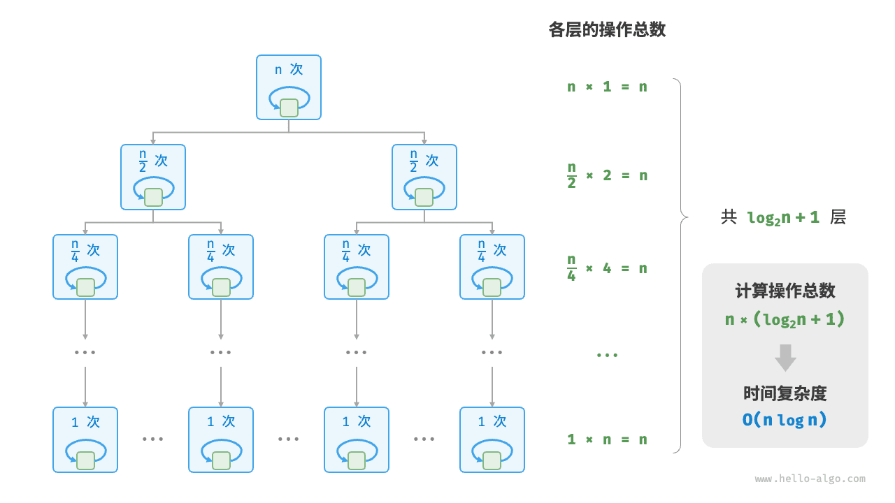

主流排序算法的时间复杂度通常为 $O(n \log n)$ ，例如快速排序、归并排序、堆排序等。

### 阶乘阶 $O(n!)$

阶乘阶对应数学上的“全排列”问题。给定 $n$ 个互不重复的元素，求其所有可能的排列方案，方案数量为：

$$
n! = n \times (n - 1) \times (n - 2) \times \dots \times 2 \times 1
$$

阶乘通常使用递归实现。如下图和以下代码所示，第一层分裂出 $n$ 个，第二层分裂出 $n - 1$ 个，以此类推，直至第 $n$ 层时停止分裂：

```python
def factorial_recur(n: int) -> int:
    """阶乘阶（递归实现）"""
    if n == 0:
        return 1
    count = 0
    # 从 1 个分裂出 n 个
    for _ in range(n):
        count += factorial_recur(n - 1)
    return count
```

!!! example [pythontutor "可视化运行"](https://pythontutor.com/iframe-embed.html#code=def%20factorial_recur%28n%29%20-%3E%20int%3A%0A%20%20%20%20%22%22%22%E9%98%B6%E4%B9%98%E9%98%B6%EF%BC%88%E9%80%92%E5%BD%92%E5%AE%9E%E7%8E%B0%EF%BC%89%22%22%22%0A%20%20%20%20if%20n%20%3D%3D%200%3A%0A%20%20%20%20%20%20%20%20return%201%0A%20%20%20%20count%20%3D%200%0A%20%20%20%20%23%20%E4%BB%8E%201%20%E4%B8%AA%E5%88%86%E8%A3%82%E5%87%BA%20n%20%E4%B8%AA%0A%20%20%20%20for%20_%20in%20range%28n%29%3A%0A%20%20%20%20%20%20%20%20count%20%2B%3D%20factorial_recur%28n%20-%201%29%0A%20%20%20%20return%20count%0A%0A%22%22%22Driver%20Code%22%22%22%0Aif%20__name__%20%3D%3D%20%22__main__%22%3A%0A%20%20%20%20n%20%3D%204%0A%20%20%20%20print%28%22%E8%BE%93%E5%85%A5%E6%95%B0%E6%8D%AE%E5%A4%A7%E5%B0%8F%20n%20%3D%22,%20n%29%0A%0A%20%20%20%20count%20%3D%20factorial_recur%28n%29%0A%20%20%20%20print%28%22%E9%98%B6%E4%B9%98%E9%98%B6%EF%BC%88%E9%80%92%E5%BD%92%E5%AE%9E%E7%8E%B0%EF%BC%89%E7%9A%84%E6%93%8D%E4%BD%9C%E6%95%B0%E9%87%8F%20%3D%22,%20count%29&codeDivHeight=800&codeDivWidth=600&cumulative=false&curInstr=3&heapPrimitives=nevernest&origin=opt-frontend.js&py=311&rawInputLstJSON=%5B%5D&textReferences=false)

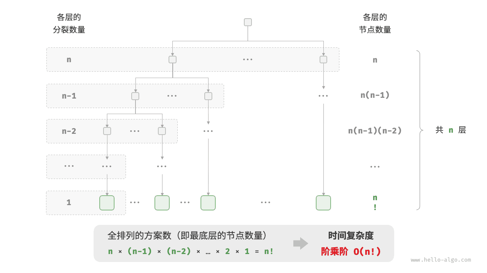

请注意，因为当 $n \geq 4$ 时恒有 $n! > 2^n$ ，所以阶乘阶比指数阶增长得更快，在 $n$ 较大时也是不可接受的。

### time_complexity.py 运行结果对比

!!! example 输入数据大小为8

    输入数据大小 n = 8
    常数阶的操作数量 = 100000
    线性阶的操作数量 = 8
    线性阶（遍历数组）的操作数量 = 8
    平方阶的操作数量 = 64
    平方阶（冒泡排序）的操作数量 = 84
    指数阶（循环实现）的操作数量 = 255
    指数阶（递归实现）的操作数量 = 255
    对数阶（循环实现）的操作数量 = 3
    对数阶（递归实现）的操作数量 = 3
    线性对数阶（递归实现）的操作数量 = 32
    阶乘阶（递归实现）的操作数量 = 40320

!!! example 输入数据大小为10

    输入数据大小 n = 10
    常数阶的操作数量 = 100000
    线性阶的操作数量 = 10
    线性阶（遍历数组）的操作数量 = 10
    平方阶的操作数量 = 100
    平方阶（冒泡排序）的操作数量 = 135
    指数阶（循环实现）的操作数量 = 1023
    指数阶（递归实现）的操作数量 = 1023
    对数阶（循环实现）的操作数量 = 4
    对数阶（递归实现）的操作数量 = 4
    线性对数阶（递归实现）的操作数量 = 36
    阶乘阶（递归实现）的操作数量 = 3628800

!!! example 输入数据大小为12，注意：最后一行的运行时间数十秒

    输入数据大小 n = 12
    常数阶的操作数量 = 100000
    线性阶的操作数量 = 12
    线性阶（遍历数组）的操作数量 = 12
    平方阶的操作数量 = 144
    平方阶（冒泡排序）的操作数量 = 198
    指数阶（循环实现）的操作数量 = 4095
    指数阶（递归实现）的操作数量 = 4095
    对数阶（循环实现）的操作数量 = 4
    对数阶（递归实现）的操作数量 = 4
    线性对数阶（递归实现）的操作数量 = 44
    阶乘阶（递归实现）的操作数量 = 479001600

!!! danger 输入数据大小为14或者16，阶乘阶的运行时间是多长？

## 最差、最佳、平均时间复杂度

**算法的时间效率往往不是固定的，而是与输入数据的分布有关**。假设输入一个长度为 $n$ 的数组 `nums` ，其中 `nums` 由从 $1$ 至 $n$ 的数字组成，每个数字只出现一次；但元素顺序是随机打乱的，任务目标是返回元素 $1$ 的索引。我们可以得出以下结论。

- 当 `nums = [?, ?, ..., 1]` ，即当末尾元素是 $1$ 时，需要完整遍历数组，**达到最差时间复杂度 $O(n)$** 。
- 当 `nums = [1, ?, ?, ...]` ，即当首个元素为 $1$ 时，无论数组多长都不需要继续遍历，**达到最佳时间复杂度 $\Omega(1)$** 。

“最差时间复杂度”对应函数渐近上界，使用大 $O$ 记号表示。相应地，“最佳时间复杂度”对应函数渐近下界，用 $\Omega$ 记号表示：

```python
import random

def random_numbers(n: int) -> list[int]:
    """生成一个数组，元素为: 1, 2, ..., n ，顺序被打乱"""
    # 生成数组 nums =: 1, 2, 3, ..., n
    nums = [i for i in range(1, n + 1)]
    # 随机打乱数组元素
    random.shuffle(nums)
    return nums

def find_one(nums: list[int]) -> int:
    """查找数组 nums 中数字 1 所在索引"""
    for i in range(len(nums)):
        # 当元素 1 在数组头部时，达到最佳时间复杂度 O(1)
        # 当元素 1 在数组尾部时，达到最差时间复杂度 O(n)
        if nums[i] == 1:
            return i
    return -1

"""Driver Code"""
if __name__ == "__main__":
    for i in range(10):
        n = 100
        nums: list[int] = random_numbers(n)
        index: int = find_one(nums)
        print("\n数组 [ 1, 2, ..., n ] 被打乱后 =", nums)
        print("数字 1 的索引为", index)
```

!!! example [pythontutor "可视化运行"](https://pythontutor.com/iframe-embed.html#code=import%20random%0A%0Adef%20random_numbers%28n%3A%20int%29%20-%3E%20list%5Bint%5D%3A%0A%20%20%20%20%22%22%22%E7%94%9F%E6%88%90%E4%B8%80%E4%B8%AA%E6%95%B0%E7%BB%84%EF%BC%8C%E5%85%83%E7%B4%A0%E4%B8%BA%3A%201,%202,%20...,%20n%20%EF%BC%8C%E9%A1%BA%E5%BA%8F%E8%A2%AB%E6%89%93%E4%B9%B1%22%22%22%0A%20%20%20%20%23%20%E7%94%9F%E6%88%90%E6%95%B0%E7%BB%84%20nums%20%3D%3A%201,%202,%203,%20...,%20n%0A%20%20%20%20nums%20%3D%20%5Bi%20for%20i%20in%20range%281,%20n%20%2B%201%29%5D%0A%20%20%20%20%23%20%E9%9A%8F%E6%9C%BA%E6%89%93%E4%B9%B1%E6%95%B0%E7%BB%84%E5%85%83%E7%B4%A0%0A%20%20%20%20random.shuffle%28nums%29%0A%20%20%20%20return%20nums%0A%0Adef%20find_one%28nums%3A%20list%5Bint%5D%29%20-%3E%20int%3A%0A%20%20%20%20%22%22%22%E6%9F%A5%E6%89%BE%E6%95%B0%E7%BB%84%20nums%20%E4%B8%AD%E6%95%B0%E5%AD%97%201%20%E6%89%80%E5%9C%A8%E7%B4%A2%E5%BC%95%22%22%22%0A%20%20%20%20for%20i%20in%20range%28len%28nums%29%29%3A%0A%20%20%20%20%20%20%20%20%23%20%E5%BD%93%E5%85%83%E7%B4%A0%201%20%E5%9C%A8%E6%95%B0%E7%BB%84%E5%A4%B4%E9%83%A8%E6%97%B6%EF%BC%8C%E8%BE%BE%E5%88%B0%E6%9C%80%E4%BD%B3%E6%97%B6%E9%97%B4%E5%A4%8D%E6%9D%82%E5%BA%A6%20O%281%29%0A%20%20%20%20%20%20%20%20%23%20%E5%BD%93%E5%85%83%E7%B4%A0%201%20%E5%9C%A8%E6%95%B0%E7%BB%84%E5%B0%BE%E9%83%A8%E6%97%B6%EF%BC%8C%E8%BE%BE%E5%88%B0%E6%9C%80%E5%B7%AE%E6%97%B6%E9%97%B4%E5%A4%8D%E6%9D%82%E5%BA%A6%20O%28n%29%0A%20%20%20%20%20%20%20%20if%20nums%5Bi%5D%20%3D%3D%201%3A%0A%20%20%20%20%20%20%20%20%20%20%20%20return%20i%0A%20%20%20%20return%20-1%0A%0A%22%22%22Driver%20Code%22%22%22%0Aif%20__name__%20%3D%3D%20%22__main__%22%3A%0A%20%20%20%20n%20%3D%2010%0A%20%20%20%20nums%20%3D%20random_numbers%28n%29%0A%20%20%20%20index%20%3D%20find_one%28nums%29%0A%20%20%20%20print%28%22%5Cn%E6%95%B0%E7%BB%84%20%5B%201,%202,%20...,%20n%20%5D%20%E8%A2%AB%E6%89%93%E4%B9%B1%E5%90%8E%20%3D%22,%20nums%29%0A%20%20%20%20print%28%22%E6%95%B0%E5%AD%97%201%20%E7%9A%84%E7%B4%A2%E5%BC%95%E4%B8%BA%22,%20index%29&codeDivHeight=800&codeDivWidth=600&cumulative=false&curInstr=25&heapPrimitives=nevernest&origin=opt-frontend.js&py=311&rawInputLstJSON=%5B%5D&textReferences=false)

值得说明的是，我们在实际中很少使用最佳时间复杂度，因为通常只有在很小概率下才能达到，可能会带来一定的误导性。**而最差时间复杂度更为实用，因为它给出了一个效率安全值**，让我们可以放心地使用算法。

从上述示例可以看出，最差时间复杂度和最佳时间复杂度只出现于“特殊的数据分布”，这些情况的出现概率可能很小，并不能真实地反映算法运行效率。相比之下，**平均时间复杂度可以体现算法在随机输入数据下的运行效率**，用 $\Theta$ 记号来表示。

对于部分算法，我们可以简单地推算出随机数据分布下的平均情况。比如上述示例，由于输入数组是被打乱的，因此元素 $1$ 出现在任意索引的概率都是相等的，那么算法的平均循环次数就是数组长度的一半 $n / 2$ ，平均时间复杂度为 $\Theta(n / 2) = \Theta(n)$ 。

但对于较为复杂的算法，计算平均时间复杂度往往比较困难，因为很难分析出在数据分布下的整体数学期望。在这种情况下，我们通常使用最差时间复杂度作为算法效率的评判标准。

!!! question "为什么很少看到 $\Theta$ 符号？"

    可能由于 $O$ 符号过于朗朗上口，因此我们常常使用它来表示平均时间复杂度。但从严格意义上讲，这种做法并不规范。在本书和其他资料中，若遇到类似“平均时间复杂度 $O(n)$”的表述，请将其直接理解为 $\Theta(n)$ 。

# 空间复杂度

<u>空间复杂度（space complexity）</u>用于衡量算法占用内存空间随着数据量变大时的增长趋势。这个概念与时间复杂度非常类似，只需将“运行时间”替换为“占用内存空间”。

## 算法相关空间

算法在运行过程中使用的内存空间主要包括以下几种。

- **输入空间**：用于存储算法的输入数据。
- **暂存空间**：用于存储算法在运行过程中的变量、对象、函数上下文等数据。
- **输出空间**：用于存储算法的输出数据。

一般情况下，空间复杂度的统计范围是“暂存空间”加上“输出空间”。

暂存空间可以进一步划分为三个部分。

- **暂存数据**：用于保存算法运行过程中的各种常量、变量、对象等。
- **栈帧空间**：用于保存调用函数的上下文数据。系统在每次调用函数时都会在栈顶部创建一个栈帧，函数返回后，栈帧空间会被释放。
- **指令空间**：用于保存编译后的程序指令，在实际统计中通常忽略不计。

在分析一段程序的空间复杂度时，**我们通常统计暂存数据、栈帧空间和输出数据三部分**，如下图所示。

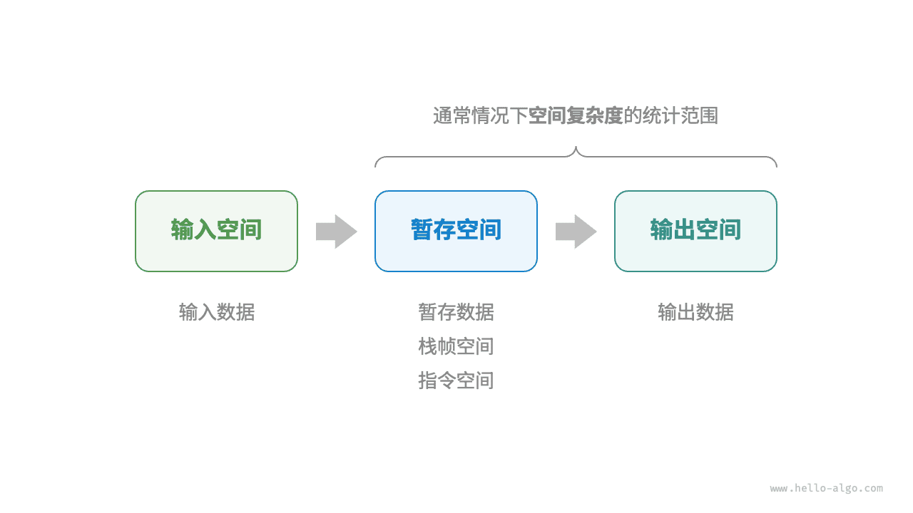

相关代码如下：

```python
class Node:
    """类"""
    def __init__(self, x: int):
        self.val: int = x              # 节点值
        self.next: Node | None = None  # 指向下一节点的引用

def function() -> int:
    """函数"""
    # 执行某些操作...
    return 0

def algorithm(n) -> int:  # 输入数据
    A = 0                 # 暂存数据（常量，一般用大写字母表示）
    b = 0                 # 暂存数据（变量）
    node = Node(0)        # 暂存数据（对象）
    c = function()        # 栈帧空间（调用函数）
    return A + b + c      # 输出数据
```

## 推算方法

空间复杂度的推算方法与时间复杂度大致相同，只需将统计对象从“操作数量”转为“使用空间大小”。

而与时间复杂度不同的是，**我们通常只关注最差空间复杂度**。这是因为内存空间是一项硬性要求，我们必须确保在所有输入数据下都有足够的内存空间预留。

观察以下代码，最差空间复杂度中的“最差”有两层含义。

1. **以最差输入数据为准**：当 $n < 10$ 时，空间复杂度为 $O(1)$ ；但当 $n > 10$ 时，初始化的数组 `nums` 占用 $O(n)$ 空间，因此最差空间复杂度为 $O(n)$ 。
2. **以算法运行中的峰值内存为准**：例如，程序在执行最后一行之前，占用 $O(1)$ 空间；当初始化数组 `nums` 时，程序占用 $O(n)$ 空间，因此最差空间复杂度为 $O(n)$ 。

```python
def algorithm(n: int):
    a = 0               # O(1)
    b = [0] * 10000     # O(1)
    if n > 10:
        nums = [0] * n  # O(n)
```


**在递归函数中，需要注意统计栈帧空间**。观察以下代码：

```python
def function() -> int:
    # 执行某些操作
    return 0

def loop(n: int):
    """循环的空间复杂度为 O(1)"""
    for _ in range(n):
        function()

def recur(n: int):
    """递归的空间复杂度为 O(n)"""
    if n == 1:
        return
    return recur(n - 1)
```

函数 `loop()` 和 `recur()` 的时间复杂度都为 $O(n)$ ，但空间复杂度不同。

- 函数 `loop()` 在循环中调用了 $n$ 次 `function()` ，每轮中的 `function()` 都返回并释放了栈帧空间，因此空间复杂度仍为 $O(1)$ 。
- 递归函数 `recur()` 在运行过程中会同时存在 $n$ 个未返回的 `recur()` ，从而占用 $O(n)$ 的栈帧空间。

## 常见类型

设输入数据大小为 $n$ ，下图展示了常见的空间复杂度类型（从低到高排列）。

$$
\begin{aligned}
O(1) < O(\log n) < O(n) < O(n^2) < O(2^n) \newline
\text{常数阶} < \text{对数阶} < \text{线性阶} < \text{平方阶} < \text{指数阶}
\end{aligned}
$$

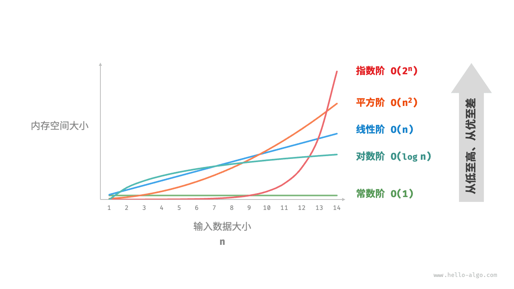

### 常数阶 $O(1)$

常数阶常见于数量与输入数据大小 $n$ 无关的常量、变量、对象。

需要注意的是，在循环中初始化变量或调用函数而占用的内存，在进入下一循环后就会被释放，因此不会累积占用空间，空间复杂度仍为 $O(1)$ ：

```python
def function() -> int:
    """函数"""
    # 执行某些操作
    return 0

def constant(n: int):
    """常数阶"""
    # 常量、变量、对象占用 O(1) 空间
    a = 0
    nums = [0] * 10000
    node = ListNode(0)
    # 循环中的变量占用 O(1) 空间
    for _ in range(n):
        c = 0
    # 循环中的函数占用 O(1) 空间
    for _ in range(n):
        function()
```

!!! example [pythontutor "可视化运行"](https://pythontutor.com/iframe-embed.html#code=class%20ListNode%3A%0A%20%20%20%20%22%22%22%E9%93%BE%E8%A1%A8%E8%8A%82%E7%82%B9%E7%B1%BB%22%22%22%0A%20%20%20%20def%20__init__%28self,%20val%3A%20int%29%3A%0A%20%20%20%20%20%20%20%20self.val%3A%20int%20%3D%20val%20%20%23%20%E8%8A%82%E7%82%B9%E5%80%BC%0A%20%20%20%20%20%20%20%20self.next%3A%20ListNode%20%7C%20None%20%3D%20None%20%20%23%20%E5%90%8E%E7%BB%A7%E8%8A%82%E7%82%B9%E5%BC%95%E7%94%A8%0A%0Adef%20function%28%29%20-%3E%20int%3A%0A%20%20%20%20%22%22%22%E5%87%BD%E6%95%B0%22%22%22%0A%20%20%20%20%23%20%E6%89%A7%E8%A1%8C%E6%9F%90%E4%BA%9B%E6%93%8D%E4%BD%9C%0A%20%20%20%20return%200%0A%0Adef%20constant%28n%3A%20int%29%3A%0A%20%20%20%20%22%22%22%E5%B8%B8%E6%95%B0%E9%98%B6%22%22%22%0A%20%20%20%20%23%20%E5%B8%B8%E9%87%8F%E3%80%81%E5%8F%98%E9%87%8F%E3%80%81%E5%AF%B9%E8%B1%A1%E5%8D%A0%E7%94%A8%20O%281%29%20%E7%A9%BA%E9%97%B4%0A%20%20%20%20a%20%3D%200%0A%20%20%20%20nums%20%3D%20%5B0%5D%20*%2010%0A%20%20%20%20node%20%3D%20ListNode%280%29%0A%20%20%20%20%23%20%E5%BE%AA%E7%8E%AF%E4%B8%AD%E7%9A%84%E5%8F%98%E9%87%8F%E5%8D%A0%E7%94%A8%20O%281%29%20%E7%A9%BA%E9%97%B4%0A%20%20%20%20for%20_%20in%20range%28n%29%3A%0A%20%20%20%20%20%20%20%20c%20%3D%200%0A%20%20%20%20%23%20%E5%BE%AA%E7%8E%AF%E4%B8%AD%E7%9A%84%E5%87%BD%E6%95%B0%E5%8D%A0%E7%94%A8%20O%281%29%20%E7%A9%BA%E9%97%B4%0A%20%20%20%20for%20_%20in%20range%28n%29%3A%0A%20%20%20%20%20%20%20%20function%28%29%0A%0A%22%22%22Driver%20Code%22%22%22%0Aif%20__name__%20%3D%3D%20%22__main__%22%3A%0A%20%20%20%20n%20%3D%205%0A%20%20%20%20print%28%22%E8%BE%93%E5%85%A5%E6%95%B0%E6%8D%AE%E5%A4%A7%E5%B0%8F%20n%20%3D%22,%20n%29%0A%0A%20%20%20%20%23%20%E5%B8%B8%E6%95%B0%E9%98%B6%0A%20%20%20%20constant%28n%29&codeDivHeight=800&codeDivWidth=600&cumulative=false&curInstr=6&heapPrimitives=nevernest&origin=opt-frontend.js&py=311&rawInputLstJSON=%5B%5D&textReferences=false)

### 线性阶 $O(n)$

线性阶常见于元素数量与 $n$ 成正比的数组、链表、栈、队列等：

```python
def linear(n: int):
    """线性阶"""
    # 长度为 n 的列表占用 O(n) 空间
    nums = [0] * n
    # 长度为 n 的哈希表占用 O(n) 空间
    hmap = dict[int, str]()
    for i in range(n):
        hmap[i] = str(i)
```

!!! example [pythontutor "可视化运行"](https://pythontutor.com/iframe-embed.html#code=def%20linear%28n%3A%20int%29%3A%0A%20%20%20%20%22%22%22%E7%BA%BF%E6%80%A7%E9%98%B6%22%22%22%0A%20%20%20%20%23%20%E9%95%BF%E5%BA%A6%E4%B8%BA%20n%20%E7%9A%84%E5%88%97%E8%A1%A8%E5%8D%A0%E7%94%A8%20O%28n%29%20%E7%A9%BA%E9%97%B4%0A%20%20%20%20nums%20%3D%20%5B0%5D%20*%20n%0A%20%20%20%20%23%20%E9%95%BF%E5%BA%A6%E4%B8%BA%20n%20%E7%9A%84%E5%93%88%E5%B8%8C%E8%A1%A8%E5%8D%A0%E7%94%A8%20O%28n%29%20%E7%A9%BA%E9%97%B4%0A%20%20%20%20hmap%20%3D%20dict%5Bint,%20str%5D%28%29%0A%20%20%20%20for%20i%20in%20range%28n%29%3A%0A%20%20%20%20%20%20%20%20hmap%5Bi%5D%20%3D%20str%28i%29%0A%0A%22%22%22Driver%20Code%22%22%22%0Aif%20__name__%20%3D%3D%20%22__main__%22%3A%0A%20%20%20%20n%20%3D%205%0A%20%20%20%20print%28%22%E8%BE%93%E5%85%A5%E6%95%B0%E6%8D%AE%E5%A4%A7%E5%B0%8F%20n%20%3D%22,%20n%29%0A%0A%20%20%20%20%23%20%E7%BA%BF%E6%80%A7%E9%98%B6%0A%20%20%20%20linear%28n%29&codeDivHeight=800&codeDivWidth=600&cumulative=false&curInstr=20&heapPrimitives=nevernest&origin=opt-frontend.js&py=311&rawInputLstJSON=%5B%5D&textReferences=false)

如下图所示，此函数的递归深度为 $n$ ，即同时存在 $n$ 个未返回的 `linear_recur()` 函数，使用 $O(n)$ 大小的栈帧空间：

```python
def linear_recur(n: int):
    """线性阶（递归实现）"""
    print("递归 n =", n)
    if n == 1:
        return
    linear_recur(n - 1)
```

!!! example [pythontutor "可视化运行"](https://pythontutor.com/iframe-embed.html#code=def%20linear_recur%28n%3A%20int%29%3A%0A%20%20%20%20%22%22%22%E7%BA%BF%E6%80%A7%E9%98%B6%EF%BC%88%E9%80%92%E5%BD%92%E5%AE%9E%E7%8E%B0%EF%BC%89%22%22%22%0A%20%20%20%20print%28%22%E9%80%92%E5%BD%92%20n%20%3D%22,%20n%29%0A%20%20%20%20if%20n%20%3D%3D%201%3A%0A%20%20%20%20%20%20%20%20return%0A%20%20%20%20linear_recur%28n%20-%201%29%0A%0A%22%22%22Driver%20Code%22%22%22%0Aif%20__name__%20%3D%3D%20%22__main__%22%3A%0A%20%20%20%20n%20%3D%205%0A%20%20%20%20print%28%22%E8%BE%93%E5%85%A5%E6%95%B0%E6%8D%AE%E5%A4%A7%E5%B0%8F%20n%20%3D%22,%20n%29%0A%0A%20%20%20%20%23%20%E7%BA%BF%E6%80%A7%E9%98%B6%0A%20%20%20%20linear_recur%28n%29&codeDivHeight=800&codeDivWidth=600&cumulative=false&curInstr=25&heapPrimitives=nevernest&origin=opt-frontend.js&py=311&rawInputLstJSON=%5B%5D&textReferences=false)

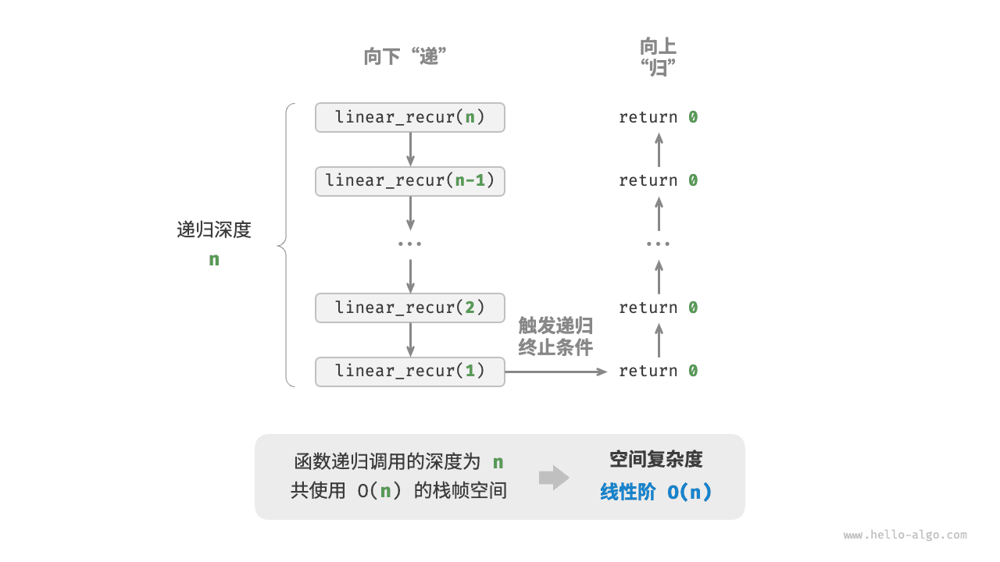

### 平方阶 $O(n^2)$

平方阶常见于矩阵和图，元素数量与 $n$ 成平方关系：

```python
def quadratic(n: int):
    """平方阶"""
    # 二维列表占用 O(n^2) 空间
    num_matrix = [[0] * n for _ in range(n)]
```

!!! example [pythontutor "可视化运行"](https://pythontutor.com/iframe-embed.html#code=def%20quadratic%28n%3A%20int%29%3A%0A%20%20%20%20%22%22%22%E5%B9%B3%E6%96%B9%E9%98%B6%22%22%22%0A%20%20%20%20%23%20%E4%BA%8C%E7%BB%B4%E5%88%97%E8%A1%A8%E5%8D%A0%E7%94%A8%20O%28n%5E2%29%20%E7%A9%BA%E9%97%B4%0A%20%20%20%20num_matrix%20%3D%20%5B%5B0%5D%20*%20n%20for%20_%20in%20range%28n%29%5D%0A%0A%22%22%22Driver%20Code%22%22%22%0Aif%20__name__%20%3D%3D%20%22__main__%22%3A%0A%20%20%20%20n%20%3D%205%0A%20%20%20%20print%28%22%E8%BE%93%E5%85%A5%E6%95%B0%E6%8D%AE%E5%A4%A7%E5%B0%8F%20n%20%3D%22,%20n%29%0A%0A%20%20%20%20%23%20%E5%B9%B3%E6%96%B9%E9%98%B6%0A%20%20%20%20quadratic%28n%29&codeDivHeight=800&codeDivWidth=600&cumulative=false&curInstr=16&heapPrimitives=nevernest&origin=opt-frontend.js&py=311&rawInputLstJSON=%5B%5D&textReferences=false)

如下图所示，该函数的递归深度为 $n$ ，在每个递归函数中都初始化了一个数组，长度分别为 $n$、$n-1$、$\dots$、$2$、$1$ ，平均长度为 $n / 2$ ，因此总体占用 $O(n^2)$ 空间：

```python
def quadratic_recur(n: int) -> int:
    """平方阶（递归实现）"""
    if n <= 0:
        return 0
    # 数组 nums 长度为 n, n-1, ..., 2, 1
    nums = [0] * n
    return quadratic_recur(n - 1)
```

!!! example [pythontutor "可视化运行"](https://pythontutor.com/iframe-embed.html#code=def%20quadratic_recur%28n%3A%20int%29%20-%3E%20int%3A%0A%20%20%20%20%22%22%22%E5%B9%B3%E6%96%B9%E9%98%B6%EF%BC%88%E9%80%92%E5%BD%92%E5%AE%9E%E7%8E%B0%EF%BC%89%22%22%22%0A%20%20%20%20if%20n%20%3C%3D%200%3A%0A%20%20%20%20%20%20%20%20return%200%0A%20%20%20%20%23%20%E6%95%B0%E7%BB%84%20nums%20%E9%95%BF%E5%BA%A6%E4%B8%BA%20n,%20n-1,%20...,%202,%201%0A%20%20%20%20nums%20%3D%20%5B0%5D%20*%20n%0A%20%20%20%20return%20quadratic_recur%28n%20-%201%29%0A%0A%22%22%22Driver%20Code%22%22%22%0Aif%20__name__%20%3D%3D%20%22__main__%22%3A%0A%20%20%20%20n%20%3D%205%0A%20%20%20%20print%28%22%E8%BE%93%E5%85%A5%E6%95%B0%E6%8D%AE%E5%A4%A7%E5%B0%8F%20n%20%3D%22,%20n%29%0A%0A%20%20%20%20%23%20%E5%B9%B3%E6%96%B9%E9%98%B6%0A%20%20%20%20quadratic_recur%28n%29&codeDivHeight=800&codeDivWidth=600&cumulative=false&curInstr=28&heapPrimitives=nevernest&origin=opt-frontend.js&py=311&rawInputLstJSON=%5B%5D&textReferences=false)

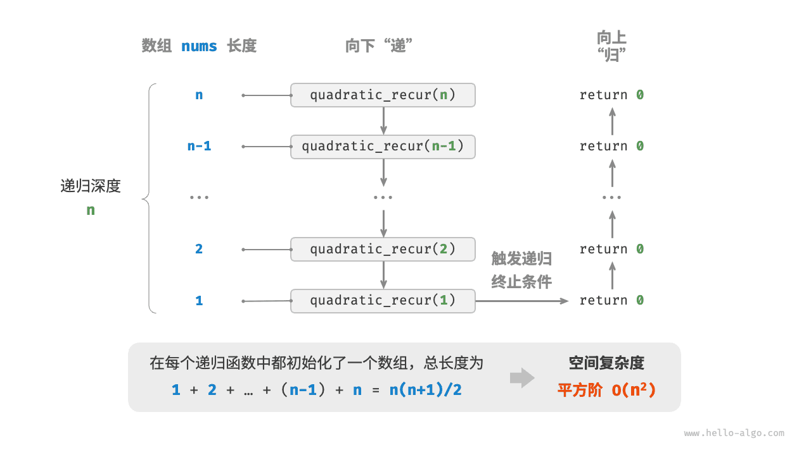

### 指数阶 $O(2^n)$

指数阶常见于二叉树。观察下图，层数为 $n$ 的“满二叉树”的节点数量为 $2^n - 1$ ，占用 $O(2^n)$ 空间：

```python
def build_tree(n: int) -> TreeNode | None:
    """指数阶（建立满二叉树）"""
    if n == 0:
        return None
    root = TreeNode(0)
    root.left = build_tree(n - 1)
    root.right = build_tree(n - 1)
    return root
```

!!! example [pythontutor "可视化运行"](https://pythontutor.com/iframe-embed.html#code=class%20TreeNode%3A%0A%20%20%20%20%22%22%22%E4%BA%8C%E5%8F%89%E6%A0%91%E8%8A%82%E7%82%B9%E7%B1%BB%22%22%22%0A%20%20%20%20def%20__init__%28self,%20val%3A%20int%20%3D%200%29%3A%0A%20%20%20%20%20%20%20%20self.val%3A%20int%20%3D%20val%20%20%23%20%E8%8A%82%E7%82%B9%E5%80%BC%0A%20%20%20%20%20%20%20%20self.left%3A%20TreeNode%20%7C%20None%20%3D%20None%20%20%23%20%E5%B7%A6%E5%AD%90%E8%8A%82%E7%82%B9%E5%BC%95%E7%94%A8%0A%20%20%20%20%20%20%20%20self.right%3A%20TreeNode%20%7C%20None%20%3D%20None%20%20%23%20%E5%8F%B3%E5%AD%90%E8%8A%82%E7%82%B9%E5%BC%95%E7%94%A8%0A%0Adef%20build_tree%28n%3A%20int%29%20-%3E%20TreeNode%20%7C%20None%3A%0A%20%20%20%20%22%22%22%E6%8C%87%E6%95%B0%E9%98%B6%EF%BC%88%E5%BB%BA%E7%AB%8B%E6%BB%A1%E4%BA%8C%E5%8F%89%E6%A0%91%EF%BC%89%22%22%22%0A%20%20%20%20if%20n%20%3D%3D%200%3A%0A%20%20%20%20%20%20%20%20return%20None%0A%20%20%20%20root%20%3D%20TreeNode%280%29%0A%20%20%20%20root.left%20%3D%20build_tree%28n%20-%201%29%0A%20%20%20%20root.right%20%3D%20build_tree%28n%20-%201%29%0A%20%20%20%20return%20root%0A%0A%22%22%22Driver%20Code%22%22%22%0Aif%20__name__%20%3D%3D%20%22__main__%22%3A%0A%20%20%20%20n%20%3D%205%0A%20%20%20%20print%28%22%E8%BE%93%E5%85%A5%E6%95%B0%E6%8D%AE%E5%A4%A7%E5%B0%8F%20n%20%3D%22,%20n%29%0A%0A%20%20%20%20%23%20%E6%8C%87%E6%95%B0%E9%98%B6%0A%20%20%20%20root%20%3D%20build_tree%28n%29&codeDivHeight=800&codeDivWidth=600&cumulative=false&curInstr=507&heapPrimitives=nevernest&origin=opt-frontend.js&py=311&rawInputLstJSON=%5B%5D&textReferences=false)

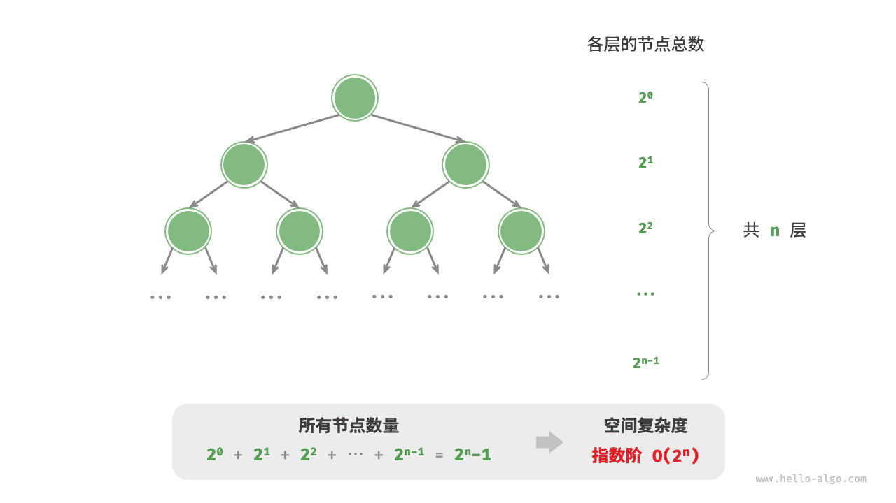

### 对数阶 $O(\log n)$

对数阶常见于分治算法。例如归并排序，输入长度为 $n$ 的数组，每轮递归将数组从中点处划分为两半，形成高度为 $\log n$ 的递归树，使用 $O(\log n)$ 栈帧空间。

再例如将数字转化为字符串，输入一个正整数 $n$ ，它的位数为 $\lfloor \log_{10} n \rfloor + 1$ ，即对应字符串长度为 $\lfloor \log_{10} n \rfloor + 1$ ，因此空间复杂度为 $O(\log_{10} n + 1) = O(\log n)$ 。

## 权衡时间与空间

理想情况下，我们希望算法的时间复杂度和空间复杂度都能达到最优。然而在实际情况中，同时优化时间复杂度和空间复杂度通常非常困难。

**降低时间复杂度通常需要以提升空间复杂度为代价，反之亦然**。我们将牺牲内存空间来提升算法运行速度的思路称为“以空间换时间”；反之，则称为“以时间换空间”。

选择哪种思路取决于我们更看重哪个方面。在大多数情况下，时间比空间更宝贵，因此“以空间换时间”通常是更常用的策略。当然，在数据量很大的情况下，控制空间复杂度也非常重要。

# 小结

### 重点回顾

**算法效率评估**

- 时间效率和空间效率是衡量算法优劣的两个主要评价指标。
- 我们可以通过实际测试来评估算法效率，但难以消除测试环境的影响，且会耗费大量计算资源。
- 复杂度分析可以消除实际测试的弊端，分析结果适用于所有运行平台，并且能够揭示算法在不同数据规模下的效率。

**时间复杂度**

- 时间复杂度用于衡量算法运行时间随数据量增长的趋势，可以有效评估算法效率，但在某些情况下可能失效，如在输入的数据量较小或时间复杂度相同时，无法精确对比算法效率的优劣。
- 最差时间复杂度使用大 $O$ 符号表示，对应函数渐近上界，反映当 $n$ 趋向正无穷时，操作数量 $T(n)$ 的增长级别。
- 推算时间复杂度分为两步，首先统计操作数量，然后判断渐近上界。
- 常见时间复杂度从低到高排列有 $O(1)$、$O(\log n)$、$O(n)$、$O(n \log n)$、$O(n^2)$、$O(2^n)$ 和 $O(n!)$ 等。
- 某些算法的时间复杂度非固定，而是与输入数据的分布有关。时间复杂度分为最差、最佳、平均时间复杂度，最佳时间复杂度几乎不用，因为输入数据一般需要满足严格条件才能达到最佳情况。
- 平均时间复杂度反映算法在随机数据输入下的运行效率，最接近实际应用中的算法性能。计算平均时间复杂度需要统计输入数据分布以及综合后的数学期望。

**空间复杂度**

- 空间复杂度的作用类似于时间复杂度，用于衡量算法占用内存空间随数据量增长的趋势。
- 算法运行过程中的相关内存空间可分为输入空间、暂存空间、输出空间。通常情况下，输入空间不纳入空间复杂度计算。暂存空间可分为暂存数据、栈帧空间和指令空间，其中栈帧空间通常仅在递归函数中影响空间复杂度。
- 我们通常只关注最差空间复杂度，即统计算法在最差输入数据和最差运行时刻下的空间复杂度。
- 常见空间复杂度从低到高排列有 $O(1)$、$O(\log n)$、$O(n)$、$O(n^2)$ 和 $O(2^n)$ 等。

### Q & A

**Q**：尾递归的空间复杂度是 $O(1)$ 吗？

理论上，尾递归函数的空间复杂度可以优化至 $O(1)$ 。不过绝大多数编程语言（例如 Java、Python、C++、Go、C# 等）不支持自动优化尾递归，因此通常认为空间复杂度是 $O(n)$ 。

**Q**：函数和方法这两个术语的区别是什么？

<u>函数（function）</u>可以被独立执行，所有参数都以显式传递。<u>方法（method）</u>与一个对象关联，被隐式传递给调用它的对象，能够对类的实例中包含的数据进行操作。

下面以几种常见的编程语言为例来说明。

- C 语言是过程式编程语言，没有面向对象的概念，所以只有函数。但我们可以通过创建结构体（struct）来模拟面向对象编程，与结构体相关联的函数就相当于其他编程语言中的方法。
- Java 和 C# 是面向对象的编程语言，代码块（方法）通常作为某个类的一部分。静态方法的行为类似于函数，因为它被绑定在类上，不能访问特定的实例变量。
- C++ 和 Python 既支持过程式编程（函数），也支持面向对象编程（方法）。

**Q**：图解“常见的空间复杂度类型”反映的是否是占用空间的绝对大小？

不是，该图展示的是空间复杂度，其反映的是增长趋势，而不是占用空间的绝对大小。

假设取 $n = 8$ ，你可能会发现每条曲线的值与函数对应不上。这是因为每条曲线都包含一个常数项，用于将取值范围压缩到一个视觉舒适的范围内。

在实际中，因为我们通常不知道每个方法的“常数项”复杂度是多少，所以一般无法仅凭复杂度来选择 $n = 8$ 之下的最优解法。但对于 $n = 8^5$ 就很好选了，这时增长趋势已经占主导了。

**Q**：是否存在根据实际使用场景，选择牺牲时间（或空间）来设计算法的情况？

在实际应用中，大部分情况会选择牺牲空间换时间。例如数据库索引，我们通常选择建立 B+ 树或哈希索引，占用大量内存空间，以换取 $O(\log n)$ 甚至 $O(1)$ 的高效查询。

在空间资源宝贵的场景，也会选择牺牲时间换空间。例如在嵌入式开发中，设备内存很宝贵，工程师可能会放弃使用哈希表，选择使用数组顺序查找，以节省内存占用，代价是查找变慢。
