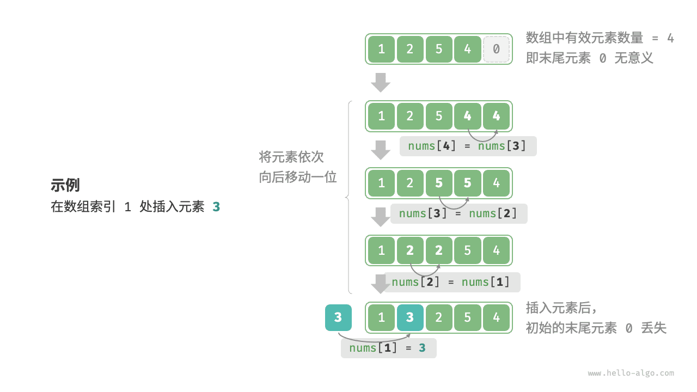
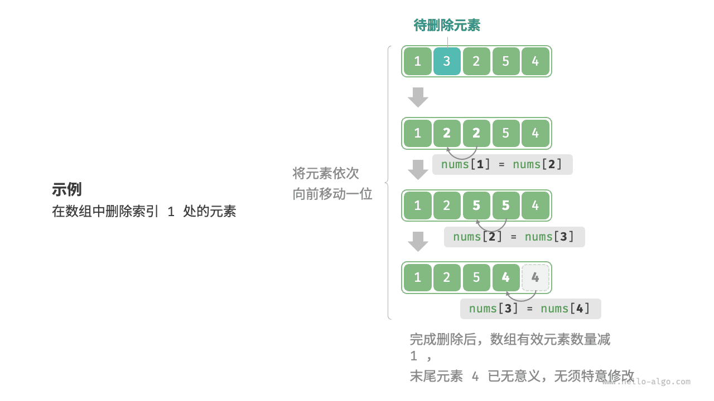
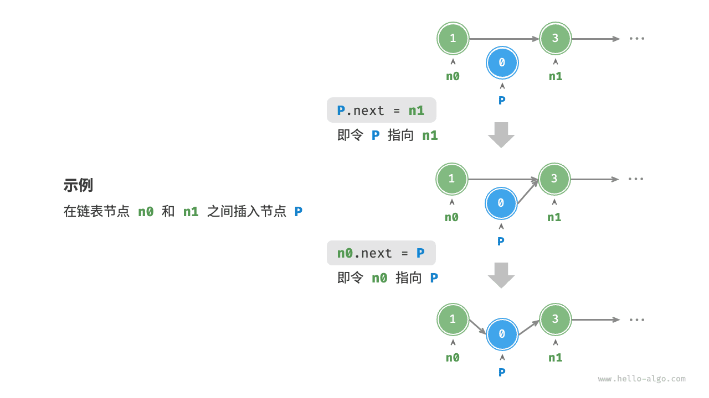
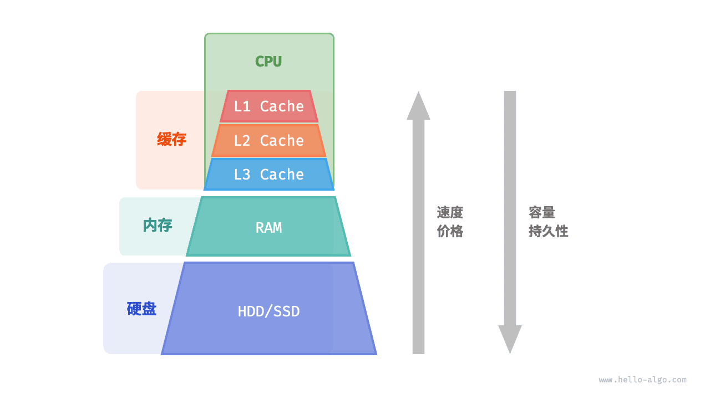
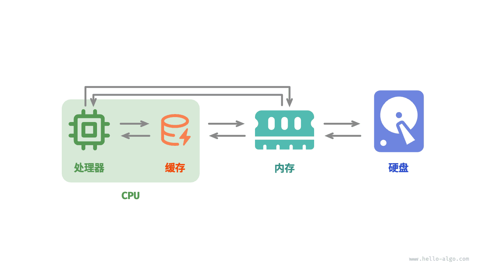

# 数组与链表

!!! abstract

    数据结构的世界如同一堵厚实的砖墙。

    数组的砖块整齐排列，逐个紧贴。链表的砖块分散各处，连接的藤蔓自由地穿梭于砖缝之间。

# 数组

<u>数组（array）</u>是一种线性数据结构，其将相同类型的元素存储在连续的内存空间中。我们将元素在数组中的位置称为该元素的<u>索引（index）</u>。下图展示了数组的主要概念和存储方式。


## 数组常用操作

### 初始化数组

我们可以根据需求选用数组的两种初始化方式：无初始值、给定初始值。在未指定初始值的情况下，大多数编程语言会将数组元素初始化为 $0$ ：

```python
# 初始化数组
arr: list[int] = [0] * 5  # [ 0, 0, 0, 0, 0 ]
nums: list[int] = [1, 3, 2, 5, 4]
```

!!! example [pythontutor "可视化运行"](https://pythontutor.com/iframe-embed.html#code=%23%20%E5%88%9D%E5%A7%8B%E5%8C%96%E6%95%B0%E7%BB%84%0Aarr%20%3D%20%5B0%5D%20*%205%20%20%23%20%5B%200,%200,%200,%200,%200%20%5D%0Anums%20%3D%20%5B1,%203,%202,%205,%204%5D&codeDivHeight=800&codeDivWidth=600&cumulative=false&curInstr=0&heapPrimitives=nevernest&origin=opt-frontend.js&py=311&rawInputLstJSON=%5B%5D&textReferences=false)

### 访问元素

数组元素被存储在连续的内存空间中，这意味着计算数组元素的内存地址非常容易。给定数组内存地址（首元素内存地址）和某个元素的索引，我们可以使用下图所示的公式计算得到该元素的内存地址，从而直接访问该元素。


观察上图，我们发现数组首个元素的索引为 $0$ ，这似乎有些反直觉，因为从 $1$ 开始计数会更自然。但从地址计算公式的角度看，**索引本质上是内存地址的偏移量**。首个元素的地址偏移量是 $0$ ，因此它的索引为 $0$ 是合理的。

在数组中访问元素非常高效，我们可以在 $O(1)$ 时间内随机访问数组中的任意一个元素。

```python
def random_access(nums: list[int]) -> int:
    """随机访问元素"""
    # 在区间 [0, len(nums)-1] 中随机抽取一个数字
    random_index = random.randint(0, len(nums) - 1)
    # 获取并返回随机元素
    random_num = nums[random_index]
    return random_num
```

!!! example [pythontutor "可视化运行"](https://pythontutor.com/iframe-embed.html#code=import%20random%0A%0Adef%20random_access%28nums%3A%20list%5Bint%5D%29%20-%3E%20int%3A%0A%20%20%20%20%22%22%22%E9%9A%8F%E6%9C%BA%E8%AE%BF%E9%97%AE%E5%85%83%E7%B4%A0%22%22%22%0A%20%20%20%20%23%20%E5%9C%A8%E5%8C%BA%E9%97%B4%20%5B0,%20len%28nums%29-1%5D%20%E4%B8%AD%E9%9A%8F%E6%9C%BA%E6%8A%BD%E5%8F%96%E4%B8%80%E4%B8%AA%E6%95%B0%E5%AD%97%0A%20%20%20%20random_index%20%3D%20random.randint%280,%20len%28nums%29%20-%201%29%0A%20%20%20%20%23%20%E8%8E%B7%E5%8F%96%E5%B9%B6%E8%BF%94%E5%9B%9E%E9%9A%8F%E6%9C%BA%E5%85%83%E7%B4%A0%0A%20%20%20%20random_num%20%3D%20nums%5Brandom_index%5D%0A%20%20%20%20return%20random_num%0A%0A%22%22%22Driver%20Code%22%22%22%0Aif%20__name__%20%3D%3D%20%22__main__%22%3A%0A%20%20%20%20%23%20%E5%88%9D%E5%A7%8B%E5%8C%96%E6%95%B0%E7%BB%84%0A%20%20%20%20nums%20%3D%20%5B1,%203,%202,%205,%204%5D%0A%20%20%20%20print%28%22%E6%95%B0%E7%BB%84%20nums%20%3D%22,%20nums%29%0A%0A%20%20%20%20%23%20%E9%9A%8F%E6%9C%BA%E8%AE%BF%E9%97%AE%0A%20%20%20%20random_num%3A%20int%20%3D%20random_access%28nums%29%0A%20%20%20%20print%28%22%E5%9C%A8%20nums%20%E4%B8%AD%E8%8E%B7%E5%8F%96%E9%9A%8F%E6%9C%BA%E5%85%83%E7%B4%A0%22,%20random_num%29%0A&codeDivHeight=800&codeDivWidth=600&cumulative=false&curInstr=7&heapPrimitives=nevernest&origin=opt-frontend.js&py=311&rawInputLstJSON=%5B%5D&textReferences=false)

### 插入元素

数组元素在内存中是“紧挨着的”，它们之间没有空间再存放任何数据。如下图所示，如果想在数组中间插入一个元素，则需要将该元素之后的所有元素都向后移动一位，之后再把元素赋值给该索引。



值得注意的是，由于数组的长度是固定的，因此插入一个元素必定会导致数组尾部元素“丢失”。我们将这个问题的解决方案留在“列表”章节中讨论。

```python
def insert(nums: list[int], num: int, index: int):
    """在数组的索引 index 处插入元素 num"""
    # 把索引 index 以及之后的所有元素向后移动一位
    for i in range(len(nums) - 1, index, -1):
        nums[i] = nums[i - 1]
    # 将 num 赋给 index 处的元素
    nums[index] = num
```

!!! example [pythontutor "可视化运行"](https://pythontutor.com/iframe-embed.html#code=def%20insert%28nums%3A%20list%5Bint%5D,%20num%3A%20int,%20index%3A%20int%29%3A%0A%20%20%20%20%22%22%22%E5%9C%A8%E6%95%B0%E7%BB%84%E7%9A%84%E7%B4%A2%E5%BC%95%20index%20%E5%A4%84%E6%8F%92%E5%85%A5%E5%85%83%E7%B4%A0%20num%22%22%22%0A%20%20%20%20%23%20%E6%8A%8A%E7%B4%A2%E5%BC%95%20index%20%E4%BB%A5%E5%8F%8A%E4%B9%8B%E5%90%8E%E7%9A%84%E6%89%80%E6%9C%89%E5%85%83%E7%B4%A0%E5%90%91%E5%90%8E%E7%A7%BB%E5%8A%A8%E4%B8%80%E4%BD%8D%0A%20%20%20%20for%20i%20in%20range%28len%28nums%29%20-%201,%20index,%20-1%29%3A%0A%20%20%20%20%20%20%20%20nums%5Bi%5D%20%3D%20nums%5Bi%20-%201%5D%0A%20%20%20%20%23%20%E5%B0%86%20num%20%E8%B5%8B%E7%BB%99%20index%20%E5%A4%84%E7%9A%84%E5%85%83%E7%B4%A0%0A%20%20%20%20nums%5Bindex%5D%20%3D%20num%0A%0A%22%22%22Driver%20Code%22%22%22%0Aif%20__name__%20%3D%3D%20%22__main__%22%3A%0A%20%20%20%20%23%20%E5%88%9D%E5%A7%8B%E5%8C%96%E6%95%B0%E7%BB%84%0A%20%20%20%20nums%20%3D%20%5B1,%203,%202,%205,%204%5D%0A%20%20%20%20print%28%22%E6%95%B0%E7%BB%84%20nums%20%3D%22,%20nums%29%0A%0A%20%20%20%20%23%20%E6%8F%92%E5%85%A5%E5%85%83%E7%B4%A0%0A%20%20%20%20insert%28nums,%206,%203%29%0A%20%20%20%20print%28%22%E5%9C%A8%E7%B4%A2%E5%BC%95%203%20%E5%A4%84%E6%8F%92%E5%85%A5%E6%95%B0%E5%AD%97%206%20%EF%BC%8C%E5%BE%97%E5%88%B0%20nums%20%3D%22,%20nums%29&codeDivHeight=800&codeDivWidth=600&cumulative=false&curInstr=6&heapPrimitives=nevernest&origin=opt-frontend.js&py=311&rawInputLstJSON=%5B%5D&textReferences=false)

### 删除元素

同理，如下图所示，若想删除索引 $i$ 处的元素，则需要把索引 $i$ 之后的元素都向前移动一位。



请注意，删除元素完成后，原先末尾的元素变得“无意义”了，所以我们无须特意去修改它。

```python
def remove(nums: list[int], index: int):
    """删除索引 index 处的元素"""
    # 把索引 index 之后的所有元素向前移动一位
    for i in range(index, len(nums) - 1):
        nums[i] = nums[i + 1]
```

!!! example [pythontutor "可视化运行"](https://pythontutor.com/iframe-embed.html#code=def%20remove%28nums%3A%20list%5Bint%5D,%20index%3A%20int%29%3A%0A%20%20%20%20%22%22%22%E5%88%A0%E9%99%A4%E7%B4%A2%E5%BC%95%20index%20%E5%A4%84%E7%9A%84%E5%85%83%E7%B4%A0%22%22%22%0A%20%20%20%20%23%20%E6%8A%8A%E7%B4%A2%E5%BC%95%20index%20%E4%B9%8B%E5%90%8E%E7%9A%84%E6%89%80%E6%9C%89%E5%85%83%E7%B4%A0%E5%90%91%E5%89%8D%E7%A7%BB%E5%8A%A8%E4%B8%80%E4%BD%8D%0A%20%20%20%20for%20i%20in%20range%28index,%20len%28nums%29%20-%201%29%3A%0A%20%20%20%20%20%20%20%20nums%5Bi%5D%20%3D%20nums%5Bi%20%2B%201%5D%0A%0A%22%22%22Driver%20Code%22%22%22%0Aif%20__name__%20%3D%3D%20%22__main__%22%3A%0A%20%20%20%20%23%20%E5%88%9D%E5%A7%8B%E5%8C%96%E6%95%B0%E7%BB%84%0A%20%20%20%20nums%20%3D%20%5B1,%203,%202,%205,%204%5D%0A%20%20%20%20print%28%22%E6%95%B0%E7%BB%84%20nums%20%3D%22,%20nums%29%0A%0A%20%20%20%20%23%20%E5%88%A0%E9%99%A4%E5%85%83%E7%B4%A0%0A%20%20%20%20remove%28nums,%202%29%0A%20%20%20%20print%28%22%E5%88%A0%E9%99%A4%E7%B4%A2%E5%BC%95%202%20%E5%A4%84%E7%9A%84%E5%85%83%E7%B4%A0%EF%BC%8C%E5%BE%97%E5%88%B0%20nums%20%3D%22,%20nums%29&codeDivHeight=800&codeDivWidth=600&cumulative=false&curInstr=6&heapPrimitives=nevernest&origin=opt-frontend.js&py=311&rawInputLstJSON=%5B%5D&textReferences=false)

总的来看，数组的插入与删除操作有以下缺点。

- **时间复杂度高**：数组的插入和删除的平均时间复杂度均为 $O(n)$ ，其中 $n$ 为数组长度。
- **丢失元素**：由于数组的长度不可变，因此在插入元素后，超出数组长度范围的元素会丢失。
- **内存浪费**：我们可以初始化一个比较长的数组，只用前面一部分，这样在插入数据时，丢失的末尾元素都是“无意义”的，但这样做会造成部分内存空间浪费。

### 遍历数组

在大多数编程语言中，我们既可以通过索引遍历数组，也可以直接遍历获取数组中的每个元素：

```python
def traverse(nums: list[int]):
    """遍历数组"""
    count = 0
    # 通过索引遍历数组
    for i in range(len(nums)):
        count += nums[i]
    # 直接遍历数组元素
    for num in nums:
        count += num
    # 同时遍历数据索引和元素
    for i, num in enumerate(nums):
        count += nums[i]
        count += num
```

!!! example [pythontutor "可视化运行"](https://pythontutor.com/iframe-embed.html#code=def%20traverse%28nums%3A%20list%5Bint%5D%29%3A%0A%20%20%20%20%22%22%22%E9%81%8D%E5%8E%86%E6%95%B0%E7%BB%84%22%22%22%0A%20%20%20%20count%20%3D%200%0A%20%20%20%20%23%20%E9%80%9A%E8%BF%87%E7%B4%A2%E5%BC%95%E9%81%8D%E5%8E%86%E6%95%B0%E7%BB%84%0A%20%20%20%20for%20i%20in%20range%28len%28nums%29%29%3A%0A%20%20%20%20%20%20%20%20count%20%2B%3D%20nums%5Bi%5D%0A%20%20%20%20%23%20%E7%9B%B4%E6%8E%A5%E9%81%8D%E5%8E%86%E6%95%B0%E7%BB%84%E5%85%83%E7%B4%A0%0A%20%20%20%20for%20num%20in%20nums%3A%0A%20%20%20%20%20%20%20%20count%20%2B%3D%20num%0A%20%20%20%20%23%20%E5%90%8C%E6%97%B6%E9%81%8D%E5%8E%86%E6%95%B0%E6%8D%AE%E7%B4%A2%E5%BC%95%E5%92%8C%E5%85%83%E7%B4%A0%0A%20%20%20%20for%20i,%20num%20in%20enumerate%28nums%29%3A%0A%20%20%20%20%20%20%20%20count%20%2B%3D%20nums%5Bi%5D%0A%20%20%20%20%20%20%20%20count%20%2B%3D%20num%0A%0A%22%22%22Driver%20Code%22%22%22%0Aif%20__name__%20%3D%3D%20%22__main__%22%3A%0A%20%20%20%20%23%20%E5%88%9D%E5%A7%8B%E5%8C%96%E6%95%B0%E7%BB%84%0A%20%20%20%20nums%20%3D%20%5B1,%203,%202,%205,%204%5D%0A%20%20%20%20print%28%22%E6%95%B0%E7%BB%84%20nums%20%3D%22,%20nums%29%0A%0A%20%20%20%20%23%20%E9%81%8D%E5%8E%86%E6%95%B0%E7%BB%84%0A%20%20%20%20traverse%28nums%29&codeDivHeight=800&codeDivWidth=600&cumulative=false&curInstr=6&heapPrimitives=nevernest&origin=opt-frontend.js&py=311&rawInputLstJSON=%5B%5D&textReferences=false)

### 查找元素

在数组中查找指定元素需要遍历数组，每轮判断元素值是否匹配，若匹配则输出对应索引。

因为数组是线性数据结构，所以上述查找操作被称为“线性查找”。

```python
def find(nums: list[int], target: int) -> int:
    """在数组中查找指定元素"""
    for i in range(len(nums)):
        if nums[i] == target:
            return i
    return -1
```

!!! example [pythontutor "可视化运行"](https://pythontutor.com/iframe-embed.html#code=def%20find%28nums%3A%20list%5Bint%5D,%20target%3A%20int%29%20-%3E%20int%3A%0A%20%20%20%20%22%22%22%E5%9C%A8%E6%95%B0%E7%BB%84%E4%B8%AD%E6%9F%A5%E6%89%BE%E6%8C%87%E5%AE%9A%E5%85%83%E7%B4%A0%22%22%22%0A%20%20%20%20for%20i%20in%20range%28len%28nums%29%29%3A%0A%20%20%20%20%20%20%20%20if%20nums%5Bi%5D%20%3D%3D%20target%3A%0A%20%20%20%20%20%20%20%20%20%20%20%20return%20i%0A%20%20%20%20return%20-1%0A%0A%22%22%22Driver%20Code%22%22%22%0Aif%20__name__%20%3D%3D%20%22__main__%22%3A%0A%20%20%20%20%23%20%E5%88%9D%E5%A7%8B%E5%8C%96%E6%95%B0%E7%BB%84%0A%20%20%20%20nums%20%3D%20%5B1,%203,%202,%205,%204%5D%0A%20%20%20%20print%28%22%E6%95%B0%E7%BB%84%20nums%20%3D%22,%20nums%29%0A%0A%20%20%20%20%23%20%E6%9F%A5%E6%89%BE%E5%85%83%E7%B4%A0%0A%20%20%20%20index%3A%20int%20%3D%20find%28nums,%203%29%0A%20%20%20%20print%28%22%E5%9C%A8%20nums%20%E4%B8%AD%E6%9F%A5%E6%89%BE%E5%85%83%E7%B4%A0%203%20%EF%BC%8C%E5%BE%97%E5%88%B0%E7%B4%A2%E5%BC%95%20%3D%22,%20index%29&codeDivHeight=800&codeDivWidth=600&cumulative=false&curInstr=6&heapPrimitives=nevernest&origin=opt-frontend.js&py=311&rawInputLstJSON=%5B%5D&textReferences=false)

### 扩容数组

在复杂的系统环境中，程序难以保证数组之后的内存空间是可用的，从而无法安全地扩展数组容量。因此在大多数编程语言中，**数组的长度是不可变的**。

如果我们希望扩容数组，则需重新建立一个更大的数组，然后把原数组元素依次复制到新数组。这是一个 $O(n)$ 的操作，在数组很大的情况下非常耗时。代码如下所示：

```python
def extend(nums: list[int], enlarge: int) -> list[int]:
    """扩展数组长度"""
    # 初始化一个扩展长度后的数组
    res = [0] * (len(nums) + enlarge)
    # 将原数组中的所有元素复制到新数组
    for i in range(len(nums)):
        res[i] = nums[i]
    # 返回扩展后的新数组
    return res
```

!!! example [pythontutor "可视化运行"](https://pythontutor.com/iframe-embed.html#code=%23%20%E8%AF%B7%E6%B3%A8%E6%84%8F%EF%BC%8CPython%20%E7%9A%84%20list%20%E6%98%AF%E5%8A%A8%E6%80%81%E6%95%B0%E7%BB%84%EF%BC%8C%E5%8F%AF%E4%BB%A5%E7%9B%B4%E6%8E%A5%E6%89%A9%E5%B1%95%0A%23%20%E4%B8%BA%E4%BA%86%E6%96%B9%E4%BE%BF%E5%AD%A6%E4%B9%A0%EF%BC%8C%E6%9C%AC%E5%87%BD%E6%95%B0%E5%B0%86%20list%20%E7%9C%8B%E4%BD%9C%E9%95%BF%E5%BA%A6%E4%B8%8D%E5%8F%AF%E5%8F%98%E7%9A%84%E6%95%B0%E7%BB%84%0Adef%20extend%28nums%3A%20list%5Bint%5D,%20enlarge%3A%20int%29%20-%3E%20list%5Bint%5D%3A%0A%20%20%20%20%22%22%22%E6%89%A9%E5%B1%95%E6%95%B0%E7%BB%84%E9%95%BF%E5%BA%A6%22%22%22%0A%20%20%20%20%23%20%E5%88%9D%E5%A7%8B%E5%8C%96%E4%B8%80%E4%B8%AA%E6%89%A9%E5%B1%95%E9%95%BF%E5%BA%A6%E5%90%8E%E7%9A%84%E6%95%B0%E7%BB%84%0A%20%20%20%20res%20%3D%20%5B0%5D%20*%20%28len%28nums%29%20%2B%20enlarge%29%0A%20%20%20%20%23%20%E5%B0%86%E5%8E%9F%E6%95%B0%E7%BB%84%E4%B8%AD%E7%9A%84%E6%89%80%E6%9C%89%E5%85%83%E7%B4%A0%E5%A4%8D%E5%88%B6%E5%88%B0%E6%96%B0%E6%95%B0%E7%BB%84%0A%20%20%20%20for%20i%20in%20range%28len%28nums%29%29%3A%0A%20%20%20%20%20%20%20%20res%5Bi%5D%20%3D%20nums%5Bi%5D%0A%20%20%20%20%23%20%E8%BF%94%E5%9B%9E%E6%89%A9%E5%B1%95%E5%90%8E%E7%9A%84%E6%96%B0%E6%95%B0%E7%BB%84%0A%20%20%20%20return%20res%0A%0A%22%22%22Driver%20Code%22%22%22%0Aif%20__name__%20%3D%3D%20%22__main__%22%3A%0A%20%20%20%20%23%20%E5%88%9D%E5%A7%8B%E5%8C%96%E6%95%B0%E7%BB%84%0A%20%20%20%20nums%20%3D%20%5B1,%203,%202,%205,%204%5D%0A%20%20%20%20print%28%22%E6%95%B0%E7%BB%84%20nums%20%3D%22,%20nums%29%0A%0A%20%20%20%20%23%20%E9%95%BF%E5%BA%A6%E6%89%A9%E5%B1%95%0A%20%20%20%20nums%20%3D%20extend%28nums,%203%29%0A%20%20%20%20print%28%22%E5%B0%86%E6%95%B0%E7%BB%84%E9%95%BF%E5%BA%A6%E6%89%A9%E5%B1%95%E8%87%B3%208%20%EF%BC%8C%E5%BE%97%E5%88%B0%20nums%20%3D%22,%20nums%29&codeDivHeight=800&codeDivWidth=600&cumulative=false&curInstr=6&heapPrimitives=nevernest&origin=opt-frontend.js&py=311&rawInputLstJSON=%5B%5D&textReferences=false)

## 数组的优点与局限性

数组存储在连续的内存空间内，且元素类型相同。这种做法包含丰富的先验信息，系统可以利用这些信息来优化数据结构的操作效率。

- **空间效率高**：数组为数据分配了连续的内存块，无须额外的结构开销。
- **支持随机访问**：数组允许在 $O(1)$ 时间内访问任何元素。
- **缓存局部性**：当访问数组元素时，计算机不仅会加载它，还会缓存其周围的其他数据，从而借助高速缓存来提升后续操作的执行速度。

连续空间存储是一把双刃剑，其存在以下局限性。

- **插入与删除效率低**：当数组中元素较多时，插入与删除操作需要移动大量的元素。
- **长度不可变**：数组在初始化后长度就固定了，扩容数组需要将所有数据复制到新数组，开销很大。
- **空间浪费**：如果数组分配的大小超过实际所需，那么多余的空间就被浪费了。

## 数组典型应用

数组是一种基础且常见的数据结构，既频繁应用在各类算法之中，也可用于实现各种复杂数据结构。

- **随机访问**：如果我们想随机抽取一些样本，那么可以用数组存储，并生成一个随机序列，根据索引实现随机抽样。
- **排序和搜索**：数组是排序和搜索算法最常用的数据结构。快速排序、归并排序、二分查找等都主要在数组上进行。
- **查找表**：当需要快速查找一个元素或其对应关系时，可以使用数组作为查找表。假如我们想实现字符到 ASCII 码的映射，则可以将字符的 ASCII 码值作为索引，对应的元素存放在数组中的对应位置。
- **机器学习**：神经网络中大量使用了向量、矩阵、张量之间的线性代数运算，这些数据都是以数组的形式构建的。数组是神经网络编程中最常使用的数据结构。
- **数据结构实现**：数组可以用于实现栈、队列、哈希表、堆、图等数据结构。例如，图的邻接矩阵表示实际上是一个二维数组。

# 链表

内存空间是所有程序的公共资源，在一个复杂的系统运行环境下，空闲的内存空间可能散落在内存各处。我们知道，存储数组的内存空间必须是连续的，而当数组非常大时，内存可能无法提供如此大的连续空间。此时链表的灵活性优势就体现出来了。

<u>链表（linked list）</u>是一种线性数据结构，其中的每个元素都是一个节点对象，各个节点通过“引用”相连接。引用记录了下一个节点的内存地址，通过它可以从当前节点访问到下一个节点。

链表的设计使得各个节点可以分散存储在内存各处，它们的内存地址无须连续。


观察上图，链表的组成单位是<u>节点（node）</u>对象。每个节点都包含两项数据：节点的“值”和指向下一节点的“引用”。

- 链表的首个节点被称为“头节点”，最后一个节点被称为“尾节点”。
- 尾节点指向的是“空”，它在 Java、C++ 和 Python 中分别被记为 `null`、`nullptr` 和 `None` 。
- 在 C、C++、Go 和 Rust 等支持指针的语言中，上述“引用”应被替换为“指针”。

如以下代码所示，链表节点 `ListNode` 除了包含值，还需额外保存一个引用（指针）。因此在相同数据量下，**链表比数组占用更多的内存空间**。

```python
class ListNode:
    """链表节点类"""
    def __init__(self, val: int):
        self.val: int = val               # 节点值
        self.next: ListNode | None = None # 指向下一节点的引用
```

## 链表常用操作

### 初始化链表

建立链表分为两步，第一步是初始化各个节点对象，第二步是构建节点之间的引用关系。初始化完成后，我们就可以从链表的头节点出发，通过引用指向 `next` 依次访问所有节点。

```python
# 初始化链表 1 -> 3 -> 2 -> 5 -> 4
# 初始化各个节点
n0 = ListNode(1)
n1 = ListNode(3)
n2 = ListNode(2)
n3 = ListNode(5)
n4 = ListNode(4)
# 构建节点之间的引用
n0.next = n1
n1.next = n2
n2.next = n3
n3.next = n4
```

!!! example [pythontutor "可视化运行"](https://pythontutor.com/iframe-embed.html#code=class%20ListNode%3A%0A%20%20%20%20%22%22%22%E9%93%BE%E8%A1%A8%E8%8A%82%E7%82%B9%E7%B1%BB%22%22%22%0A%20%20%20%20def%20__init__%28self,%20val%3A%20int%29%3A%0A%20%20%20%20%20%20%20%20self.val%3A%20int%20%3D%20val%20%20%23%20%E8%8A%82%E7%82%B9%E5%80%BC%0A%20%20%20%20%20%20%20%20self.next%3A%20ListNode%20%7C%20None%20%3D%20None%20%20%23%20%E5%90%8E%E7%BB%A7%E8%8A%82%E7%82%B9%E5%BC%95%E7%94%A8%0A%0A%22%22%22Driver%20Code%22%22%22%0Aif%20__name__%20%3D%3D%20%22__main__%22%3A%0A%20%20%20%20%23%20%E5%88%9D%E5%A7%8B%E5%8C%96%E9%93%BE%E8%A1%A8%201%20-%3E%203%20-%3E%202%20-%3E%205%20-%3E%204%0A%20%20%20%20%23%20%E5%88%9D%E5%A7%8B%E5%8C%96%E5%90%84%E4%B8%AA%E8%8A%82%E7%82%B9%0A%20%20%20%20n0%20%3D%20ListNode%281%29%0A%20%20%20%20n1%20%3D%20ListNode%283%29%0A%20%20%20%20n2%20%3D%20ListNode%282%29%0A%20%20%20%20n3%20%3D%20ListNode%285%29%0A%20%20%20%20n4%20%3D%20ListNode%284%29%0A%20%20%20%20%23%20%E6%9E%84%E5%BB%BA%E8%8A%82%E7%82%B9%E4%B9%8B%E9%97%B4%E7%9A%84%E5%BC%95%E7%94%A8%0A%20%20%20%20n0.next%20%3D%20n1%0A%20%20%20%20n1.next%20%3D%20n2%0A%20%20%20%20n2.next%20%3D%20n3%0A%20%20%20%20n3.next%20%3D%20n4&codeDivHeight=800&codeDivWidth=600&cumulative=false&curInstr=3&heapPrimitives=nevernest&origin=opt-frontend.js&py=311&rawInputLstJSON=%5B%5D&textReferences=false)

数组整体是一个变量，比如数组 `nums` 包含元素 `nums[0]` 和 `nums[1]` 等，而链表是由多个独立的节点对象组成的。**我们通常将头节点当作链表的代称**，比如以上代码中的链表可记作链表 `n0` 。

### 插入节点

在链表中插入节点非常容易。如下图所示，假设我们想在相邻的两个节点 `n0` 和 `n1` 之间插入一个新节点 `P` ，**则只需改变两个节点引用（指针）即可**，时间复杂度为 $O(1)$ 。

相比之下，在数组中插入元素的时间复杂度为 $O(n)$ ，在大数据量下的效率较低。



```python
def insert(n0: ListNode, P: ListNode):
    """在链表的节点 n0 之后插入节点 P"""
    n1 = n0.next
    P.next = n1
    n0.next = P
```

!!! example [pythontutor "可视化运行"](https://pythontutor.com/iframe-embed.html#code=class%20ListNode%3A%0A%20%20%20%20%22%22%22%E9%93%BE%E8%A1%A8%E8%8A%82%E7%82%B9%E7%B1%BB%22%22%22%0A%20%20%20%20def%20__init__%28self,%20val%3A%20int%29%3A%0A%20%20%20%20%20%20%20%20self.val%3A%20int%20%3D%20val%20%20%23%20%E8%8A%82%E7%82%B9%E5%80%BC%0A%20%20%20%20%20%20%20%20self.next%3A%20ListNode%20%7C%20None%20%3D%20None%20%20%23%20%E5%90%8E%E7%BB%A7%E8%8A%82%E7%82%B9%E5%BC%95%E7%94%A8%0A%0Adef%20insert%28n0%3A%20ListNode,%20P%3A%20ListNode%29%3A%0A%20%20%20%20%22%22%22%E5%9C%A8%E9%93%BE%E8%A1%A8%E7%9A%84%E8%8A%82%E7%82%B9%20n0%20%E4%B9%8B%E5%90%8E%E6%8F%92%E5%85%A5%E8%8A%82%E7%82%B9%20P%22%22%22%0A%20%20%20%20n1%20%3D%20n0.next%0A%20%20%20%20P.next%20%3D%20n1%0A%20%20%20%20n0.next%20%3D%20P%0A%0A%22%22%22Driver%20Code%22%22%22%0Aif%20__name__%20%3D%3D%20%22__main__%22%3A%0A%20%20%20%20%23%20%E5%88%9D%E5%A7%8B%E5%8C%96%E9%93%BE%E8%A1%A8%0A%20%20%20%20%23%20%E5%88%9D%E5%A7%8B%E5%8C%96%E5%90%84%E4%B8%AA%E8%8A%82%E7%82%B9%0A%20%20%20%20n0%20%3D%20ListNode%281%29%0A%20%20%20%20n1%20%3D%20ListNode%283%29%0A%20%20%20%20n2%20%3D%20ListNode%282%29%0A%20%20%20%20n3%20%3D%20ListNode%285%29%0A%20%20%20%20n4%20%3D%20ListNode%284%29%0A%20%20%20%20%23%20%E6%9E%84%E5%BB%BA%E8%8A%82%E7%82%B9%E4%B9%8B%E9%97%B4%E7%9A%84%E5%BC%95%E7%94%A8%0A%20%20%20%20n0.next%20%3D%20n1%0A%20%20%20%20n1.next%20%3D%20n2%0A%20%20%20%20n2.next%20%3D%20n3%0A%20%20%20%20n3.next%20%3D%20n4%0A%0A%20%20%20%20%23%20%E6%8F%92%E5%85%A5%E8%8A%82%E7%82%B9%0A%20%20%20%20p%20%3D%20ListNode%280%29%0A%20%20%20%20insert%28n0,%20p%29&codeDivHeight=800&codeDivWidth=600&cumulative=false&curInstr=39&heapPrimitives=nevernest&origin=opt-frontend.js&py=311&rawInputLstJSON=%5B%5D&textReferences=false)

### 删除节点

如下图所示，在链表中删除节点也非常方便，**只需改变一个节点的引用（指针）即可**。

请注意，尽管在删除操作完成后节点 `P` 仍然指向 `n1` ，但实际上遍历此链表已经无法访问到 `P` ，这意味着 `P` 已经不再属于该链表了。


```python
def remove(n0: ListNode):
    """删除链表的节点 n0 之后的首个节点"""
    if not n0.next:
        return
    # n0 -> P -> n1
    P = n0.next
    n1 = P.next
    n0.next = n1
```

!!! example [pythontutor "可视化运行"](https://pythontutor.com/iframe-embed.html#code=class%20ListNode%3A%0A%20%20%20%20%22%22%22%E9%93%BE%E8%A1%A8%E8%8A%82%E7%82%B9%E7%B1%BB%22%22%22%0A%20%20%20%20def%20__init__%28self,%20val%3A%20int%29%3A%0A%20%20%20%20%20%20%20%20self.val%3A%20int%20%3D%20val%20%20%23%20%E8%8A%82%E7%82%B9%E5%80%BC%0A%20%20%20%20%20%20%20%20self.next%3A%20ListNode%20%7C%20None%20%3D%20None%20%20%23%20%E5%90%8E%E7%BB%A7%E8%8A%82%E7%82%B9%E5%BC%95%E7%94%A8%0A%0Adef%20remove%28n0%3A%20ListNode%29%3A%0A%20%20%20%20%22%22%22%E5%88%A0%E9%99%A4%E9%93%BE%E8%A1%A8%E7%9A%84%E8%8A%82%E7%82%B9%20n0%20%E4%B9%8B%E5%90%8E%E7%9A%84%E9%A6%96%E4%B8%AA%E8%8A%82%E7%82%B9%22%22%22%0A%20%20%20%20if%20not%20n0.next%3A%0A%20%20%20%20%20%20%20%20return%0A%20%20%20%20%23%20n0%20-%3E%20P%20-%3E%20n1%0A%20%20%20%20P%20%3D%20n0.next%0A%20%20%20%20n1%20%3D%20P.next%0A%20%20%20%20n0.next%20%3D%20n1%0A%0A%22%22%22Driver%20Code%22%22%22%0Aif%20__name__%20%3D%3D%20%22__main__%22%3A%0A%20%20%20%20%23%20%E5%88%9D%E5%A7%8B%E5%8C%96%E9%93%BE%E8%A1%A8%0A%20%20%20%20%23%20%E5%88%9D%E5%A7%8B%E5%8C%96%E5%90%84%E4%B8%AA%E8%8A%82%E7%82%B9%0A%20%20%20%20n0%20%3D%20ListNode%281%29%0A%20%20%20%20n1%20%3D%20ListNode%283%29%0A%20%20%20%20n2%20%3D%20ListNode%282%29%0A%20%20%20%20n3%20%3D%20ListNode%285%29%0A%20%20%20%20n4%20%3D%20ListNode%284%29%0A%20%20%20%20%23%20%E6%9E%84%E5%BB%BA%E8%8A%82%E7%82%B9%E4%B9%8B%E9%97%B4%E7%9A%84%E5%BC%95%E7%94%A8%0A%20%20%20%20n0.next%20%3D%20n1%0A%20%20%20%20n1.next%20%3D%20n2%0A%20%20%20%20n2.next%20%3D%20n3%0A%20%20%20%20n3.next%20%3D%20n4%0A%0A%20%20%20%20%23%20%E5%88%A0%E9%99%A4%E8%8A%82%E7%82%B9%0A%20%20%20%20remove%28n0%29&codeDivHeight=800&codeDivWidth=600&cumulative=false&curInstr=34&heapPrimitives=nevernest&origin=opt-frontend.js&py=311&rawInputLstJSON=%5B%5D&textReferences=false)

### 访问节点

**在链表中访问节点的效率较低**。如上一节所述，我们可以在 $O(1)$ 时间下访问数组中的任意元素。链表则不然，程序需要从头节点出发，逐个向后遍历，直至找到目标节点。也就是说，访问链表的第 $i$ 个节点需要循环 $i - 1$ 轮，时间复杂度为 $O(n)$ 。

```python
def access(head: ListNode, index: int) -> ListNode | None:
    """访问链表中索引为 index 的节点"""
    for _ in range(index):
        if not head:
            return None
        head = head.next
    return head
```

!!! example [pythontutor "可视化运行"](https://pythontutor.com/iframe-embed.html#code=class%20ListNode%3A%0A%20%20%20%20%22%22%22%E9%93%BE%E8%A1%A8%E8%8A%82%E7%82%B9%E7%B1%BB%22%22%22%0A%20%20%20%20def%20__init__%28self,%20val%3A%20int%29%3A%0A%20%20%20%20%20%20%20%20self.val%3A%20int%20%3D%20val%20%20%23%20%E8%8A%82%E7%82%B9%E5%80%BC%0A%20%20%20%20%20%20%20%20self.next%3A%20ListNode%20%7C%20None%20%3D%20None%20%20%23%20%E5%90%8E%E7%BB%A7%E8%8A%82%E7%82%B9%E5%BC%95%E7%94%A8%0A%0Adef%20access%28head%3A%20ListNode,%20index%3A%20int%29%20-%3E%20ListNode%20%7C%20None%3A%0A%20%20%20%20%22%22%22%E8%AE%BF%E9%97%AE%E9%93%BE%E8%A1%A8%E4%B8%AD%E7%B4%A2%E5%BC%95%E4%B8%BA%20index%20%E7%9A%84%E8%8A%82%E7%82%B9%22%22%22%0A%20%20%20%20for%20_%20in%20range%28index%29%3A%0A%20%20%20%20%20%20%20%20if%20not%20head%3A%0A%20%20%20%20%20%20%20%20%20%20%20%20return%20None%0A%20%20%20%20%20%20%20%20head%20%3D%20head.next%0A%20%20%20%20return%20head%0A%0A%22%22%22Driver%20Code%22%22%22%0Aif%20__name__%20%3D%3D%20%22__main__%22%3A%0A%20%20%20%20%23%20%E5%88%9D%E5%A7%8B%E5%8C%96%E9%93%BE%E8%A1%A8%0A%20%20%20%20%23%20%E5%88%9D%E5%A7%8B%E5%8C%96%E5%90%84%E4%B8%AA%E8%8A%82%E7%82%B9%0A%20%20%20%20n0%20%3D%20ListNode%281%29%0A%20%20%20%20n1%20%3D%20ListNode%283%29%0A%20%20%20%20n2%20%3D%20ListNode%282%29%0A%20%20%20%20n3%20%3D%20ListNode%285%29%0A%20%20%20%20n4%20%3D%20ListNode%284%29%0A%20%20%20%20%23%20%E6%9E%84%E5%BB%BA%E8%8A%82%E7%82%B9%E4%B9%8B%E9%97%B4%E7%9A%84%E5%BC%95%E7%94%A8%0A%20%20%20%20n0.next%20%3D%20n1%0A%20%20%20%20n1.next%20%3D%20n2%0A%20%20%20%20n2.next%20%3D%20n3%0A%20%20%20%20n3.next%20%3D%20n4%0A%0A%20%20%20%20%23%20%E8%AE%BF%E9%97%AE%E8%8A%82%E7%82%B9%0A%20%20%20%20node%20%3D%20access%28n0,%203%29%0A%20%20%20%20print%28%22%E9%93%BE%E8%A1%A8%E4%B8%AD%E7%B4%A2%E5%BC%95%203%20%E5%A4%84%E7%9A%84%E8%8A%82%E7%82%B9%E7%9A%84%E5%80%BC%20%3D%20%7B%7D%22.format%28node.val%29%29&codeDivHeight=800&codeDivWidth=600&cumulative=false&curInstr=34&heapPrimitives=nevernest&origin=opt-frontend.js&py=311&rawInputLstJSON=%5B%5D&textReferences=false)

### 查找节点

遍历链表，查找其中值为 `target` 的节点，输出该节点在链表中的索引。此过程也属于线性查找。代码如下所示：

```python
def find(head: ListNode, target: int) -> int:
    """在链表中查找值为 target 的首个节点"""
    index = 0
    while head:
        if head.val == target:
            return index
        head = head.next
        index += 1
    return -1
```

!!! example [pythontutor "可视化运行"](https://pythontutor.com/iframe-embed.html#code=class%20ListNode%3A%0A%20%20%20%20%22%22%22%E9%93%BE%E8%A1%A8%E8%8A%82%E7%82%B9%E7%B1%BB%22%22%22%0A%20%20%20%20def%20__init__%28self,%20val%3A%20int%29%3A%0A%20%20%20%20%20%20%20%20self.val%3A%20int%20%3D%20val%20%20%23%20%E8%8A%82%E7%82%B9%E5%80%BC%0A%20%20%20%20%20%20%20%20self.next%3A%20ListNode%20%7C%20None%20%3D%20None%20%20%23%20%E5%90%8E%E7%BB%A7%E8%8A%82%E7%82%B9%E5%BC%95%E7%94%A8%0A%0Adef%20find%28head%3A%20ListNode,%20target%3A%20int%29%20-%3E%20int%3A%0A%20%20%20%20%22%22%22%E5%9C%A8%E9%93%BE%E8%A1%A8%E4%B8%AD%E6%9F%A5%E6%89%BE%E5%80%BC%E4%B8%BA%20target%20%E7%9A%84%E9%A6%96%E4%B8%AA%E8%8A%82%E7%82%B9%22%22%22%0A%20%20%20%20index%20%3D%200%0A%20%20%20%20while%20head%3A%0A%20%20%20%20%20%20%20%20if%20head.val%20%3D%3D%20target%3A%0A%20%20%20%20%20%20%20%20%20%20%20%20return%20index%0A%20%20%20%20%20%20%20%20head%20%3D%20head.next%0A%20%20%20%20%20%20%20%20index%20%2B%3D%201%0A%20%20%20%20return%20-1%0A%0A%22%22%22Driver%20Code%22%22%22%0Aif%20__name__%20%3D%3D%20%22__main__%22%3A%0A%20%20%20%20%23%20%E5%88%9D%E5%A7%8B%E5%8C%96%E9%93%BE%E8%A1%A8%0A%20%20%20%20%23%20%E5%88%9D%E5%A7%8B%E5%8C%96%E5%90%84%E4%B8%AA%E8%8A%82%E7%82%B9%0A%20%20%20%20n0%20%3D%20ListNode%281%29%0A%20%20%20%20n1%20%3D%20ListNode%283%29%0A%20%20%20%20n2%20%3D%20ListNode%282%29%0A%20%20%20%20n3%20%3D%20ListNode%285%29%0A%20%20%20%20n4%20%3D%20ListNode%284%29%0A%20%20%20%20%23%20%E6%9E%84%E5%BB%BA%E8%8A%82%E7%82%B9%E4%B9%8B%E9%97%B4%E7%9A%84%E5%BC%95%E7%94%A8%0A%20%20%20%20n0.next%20%3D%20n1%0A%20%20%20%20n1.next%20%3D%20n2%0A%20%20%20%20n2.next%20%3D%20n3%0A%20%20%20%20n3.next%20%3D%20n4%0A%0A%20%20%20%20%23%20%E6%9F%A5%E6%89%BE%E8%8A%82%E7%82%B9%0A%20%20%20%20index%20%3D%20find%28n0,%202%29%0A%20%20%20%20print%28%22%E9%93%BE%E8%A1%A8%E4%B8%AD%E5%80%BC%E4%B8%BA%202%20%E7%9A%84%E8%8A%82%E7%82%B9%E7%9A%84%E7%B4%A2%E5%BC%95%20%3D%20%7B%7D%22.format%28index%29%29&codeDivHeight=800&codeDivWidth=600&cumulative=false&curInstr=34&heapPrimitives=nevernest&origin=opt-frontend.js&py=311&rawInputLstJSON=%5B%5D&textReferences=false)

## 数组 vs. 链表

下表总结了数组和链表的各项特点并对比了操作效率。由于它们采用两种相反的存储策略，因此各种性质和操作效率也呈现对立的特点。

<p align="center"> 表 <id> &nbsp; 数组与链表的效率对比 </p>

|          | 数组                           | 链表           |
| -------- | ------------------------------ | -------------- |
| 存储方式 | 连续内存空间                   | 分散内存空间   |
| 容量扩展 | 长度不可变                     | 可灵活扩展     |
| 内存效率 | 元素占用内存少、但可能浪费空间 | 元素占用内存多 |
| 访问元素 | $O(1)$                         | $O(n)$         |
| 添加元素 | $O(n)$                         | $O(1)$         |
| 删除元素 | $O(n)$                         | $O(1)$         |

## 常见链表类型

如下图所示，常见的链表类型包括三种。

- **单向链表**：即前面介绍的普通链表。单向链表的节点包含值和指向下一节点的引用两项数据。我们将首个节点称为头节点，将最后一个节点称为尾节点，尾节点指向空 `None` 。
- **环形链表**：如果我们令单向链表的尾节点指向头节点（首尾相接），则得到一个环形链表。在环形链表中，任意节点都可以视作头节点。
- **双向链表**：与单向链表相比，双向链表记录了两个方向的引用。双向链表的节点定义同时包含指向后继节点（下一个节点）和前驱节点（上一个节点）的引用（指针）。相较于单向链表，双向链表更具灵活性，可以朝两个方向遍历链表，但相应地也需要占用更多的内存空间。

```python
class ListNode:
    """双向链表节点类"""
    def __init__(self, val: int):
        self.val: int = val                # 节点值
        self.next: ListNode | None = None  # 指向后继节点的引用
        self.prev: ListNode | None = None  # 指向前驱节点的引用
```


## 链表典型应用

单向链表通常用于实现栈、队列、哈希表和图等数据结构。

- **栈与队列**：当插入和删除操作都在链表的一端进行时，它表现的特性为先进后出，对应栈；当插入操作在链表的一端进行，删除操作在链表的另一端进行，它表现的特性为先进先出，对应队列。
- **哈希表**：链式地址是解决哈希冲突的主流方案之一，在该方案中，所有冲突的元素都会被放到一个链表中。
- **图**：邻接表是表示图的一种常用方式，其中图的每个顶点都与一个链表相关联，链表中的每个元素都代表与该顶点相连的其他顶点。

双向链表常用于需要快速查找前一个和后一个元素的场景。

- **高级数据结构**：比如在红黑树、B 树中，我们需要访问节点的父节点，这可以通过在节点中保存一个指向父节点的引用来实现，类似于双向链表。
- **浏览器历史**：在网页浏览器中，当用户点击前进或后退按钮时，浏览器需要知道用户访问过的前一个和后一个网页。双向链表的特性使得这种操作变得简单。
- **LRU 算法**：在缓存淘汰（LRU）算法中，我们需要快速找到最近最少使用的数据，以及支持快速添加和删除节点。这时候使用双向链表就非常合适。

环形链表常用于需要周期性操作的场景，比如操作系统的资源调度。

- **时间片轮转调度算法**：在操作系统中，时间片轮转调度算法是一种常见的 CPU 调度算法，它需要对一组进程进行循环。每个进程被赋予一个时间片，当时间片用完时，CPU 将切换到下一个进程。这种循环操作可以通过环形链表来实现。
- **数据缓冲区**：在某些数据缓冲区的实现中，也可能会使用环形链表。比如在音频、视频播放器中，数据流可能会被分成多个缓冲块并放入一个环形链表，以便实现无缝播放。

# 列表

<u>列表（list）</u>是一个抽象的数据结构概念，它表示元素的有序集合，支持元素访问、修改、添加、删除和遍历等操作，无须使用者考虑容量限制的问题。列表可以基于链表或数组实现。

- 链表天然可以看作一个列表，其支持元素增删查改操作，并且可以灵活动态扩容。
- 数组也支持元素增删查改，但由于其长度不可变，因此只能看作一个具有长度限制的列表。

当使用数组实现列表时，**长度不可变的性质会导致列表的实用性降低**。这是因为我们通常无法事先确定需要存储多少数据，从而难以选择合适的列表长度。若长度过小，则很可能无法满足使用需求；若长度过大，则会造成内存空间浪费。

为解决此问题，我们可以使用<u>动态数组（dynamic array）</u>来实现列表。它继承了数组的各项优点，并且可以在程序运行过程中进行动态扩容。

实际上，**许多编程语言中的标准库提供的列表是基于动态数组实现的**，例如 Python 中的 `list` 、Java 中的 `ArrayList` 、C++ 中的 `vector` 和 C# 中的 `List` 等。在接下来的讨论中，我们将把“列表”和“动态数组”视为等同的概念。

## 列表常用操作

### 初始化列表

我们通常使用“无初始值”和“有初始值”这两种初始化方法：

```python
# 初始化列表
# 无初始值
nums1: list[int] = []
# 有初始值
nums: list[int] = [1, 3, 2, 5, 4]
```

!!! example [pythontutor "可视化运行"](https://pythontutor.com/iframe-embed.html#code=%22%22%22Driver%20Code%22%22%22%0Aif%20__name__%20%3D%3D%20%22__main__%22%3A%0A%20%20%20%20%23%20%E5%88%9D%E5%A7%8B%E5%8C%96%E5%88%97%E8%A1%A8%0A%20%20%20%20%23%20%E6%97%A0%E5%88%9D%E5%A7%8B%E5%80%BC%0A%20%20%20%20nums1%20%3D%20%5B%5D%0A%20%20%20%20%23%20%E6%9C%89%E5%88%9D%E5%A7%8B%E5%80%BC%0A%20%20%20%20nums%20%3D%20%5B1,%203,%202,%205,%204%5D&codeDivHeight=800&codeDivWidth=600&cumulative=false&curInstr=4&heapPrimitives=nevernest&origin=opt-frontend.js&py=311&rawInputLstJSON=%5B%5D&textReferences=false)

### 访问元素

列表本质上是数组，因此可以在 $O(1)$ 时间内访问和更新元素，效率很高。

```python
# 访问元素
num: int = nums[1]  # 访问索引 1 处的元素

# 更新元素
nums[1] = 0    # 将索引 1 处的元素更新为 0
```

!!! example [pythontutor "可视化运行"](https://pythontutor.com/iframe-embed.html#code=%22%22%22Driver%20Code%22%22%22%0Aif%20__name__%20%3D%3D%20%22__main__%22%3A%0A%20%20%20%20%23%20%E5%88%9D%E5%A7%8B%E5%8C%96%E5%88%97%E8%A1%A8%0A%20%20%20%20nums%20%3D%20%5B1,%203,%202,%205,%204%5D%0A%0A%20%20%20%20%23%20%E8%AE%BF%E9%97%AE%E5%85%83%E7%B4%A0%0A%20%20%20%20num%20%3D%20nums%5B1%5D%20%20%23%20%E8%AE%BF%E9%97%AE%E7%B4%A2%E5%BC%95%201%20%E5%A4%84%E7%9A%84%E5%85%83%E7%B4%A0%0A%0A%20%20%20%20%23%20%E6%9B%B4%E6%96%B0%E5%85%83%E7%B4%A0%0A%20%20%20%20nums%5B1%5D%20%3D%200%20%20%20%20%23%20%E5%B0%86%E7%B4%A2%E5%BC%95%201%20%E5%A4%84%E7%9A%84%E5%85%83%E7%B4%A0%E6%9B%B4%E6%96%B0%E4%B8%BA%200&codeDivHeight=800&codeDivWidth=600&cumulative=false&curInstr=3&heapPrimitives=nevernest&origin=opt-frontend.js&py=311&rawInputLstJSON=%5B%5D&textReferences=false)

### 插入与删除元素

相较于数组，列表可以自由地添加与删除元素。在列表尾部添加元素的时间复杂度为 $O(1)$ ，但插入和删除元素的效率仍与数组相同，时间复杂度为 $O(n)$ 。

```python
# 清空列表
nums.clear()

# 在尾部添加元素
nums.append(1)
nums.append(3)
nums.append(2)
nums.append(5)
nums.append(4)

# 在中间插入元素
nums.insert(3, 6)  # 在索引 3 处插入数字 6

# 删除元素
nums.pop(3)        # 删除索引 3 处的元素
```

!!! example [pythontutor "可视化运行"](https://pythontutor.com/iframe-embed.html#code=%22%22%22Driver%20Code%22%22%22%0Aif%20__name__%20%3D%3D%20%22__main__%22%3A%0A%20%20%20%20%23%20%E6%9C%89%E5%88%9D%E5%A7%8B%E5%80%BC%0A%20%20%20%20nums%20%3D%20%5B1,%203,%202,%205,%204%5D%0A%20%20%20%20%0A%20%20%20%20%23%20%E6%B8%85%E7%A9%BA%E5%88%97%E8%A1%A8%0A%20%20%20%20nums.clear%28%29%0A%20%20%20%20%0A%20%20%20%20%23%20%E5%9C%A8%E5%B0%BE%E9%83%A8%E6%B7%BB%E5%8A%A0%E5%85%83%E7%B4%A0%0A%20%20%20%20nums.append%281%29%0A%20%20%20%20nums.append%283%29%0A%20%20%20%20nums.append%282%29%0A%20%20%20%20nums.append%285%29%0A%20%20%20%20nums.append%284%29%0A%20%20%20%20%0A%20%20%20%20%23%20%E5%9C%A8%E4%B8%AD%E9%97%B4%E6%8F%92%E5%85%A5%E5%85%83%E7%B4%A0%0A%20%20%20%20nums.insert%283,%206%29%20%20%23%20%E5%9C%A8%E7%B4%A2%E5%BC%95%203%20%E5%A4%84%E6%8F%92%E5%85%A5%E6%95%B0%E5%AD%97%206%0A%20%20%20%20%0A%20%20%20%20%23%20%E5%88%A0%E9%99%A4%E5%85%83%E7%B4%A0%0A%20%20%20%20nums.pop%283%29%20%20%20%20%20%20%20%20%23%20%E5%88%A0%E9%99%A4%E7%B4%A2%E5%BC%95%203%20%E5%A4%84%E7%9A%84%E5%85%83%E7%B4%A0&codeDivHeight=800&codeDivWidth=600&cumulative=false&curInstr=3&heapPrimitives=nevernest&origin=opt-frontend.js&py=311&rawInputLstJSON=%5B%5D&textReferences=false)

### 遍历列表

与数组一样，列表可以根据索引遍历，也可以直接遍历各元素。

```python
# 通过索引遍历列表
count = 0
for i in range(len(nums)):
    count += nums[i]

# 直接遍历列表元素
for num in nums:
    count += num
```

!!! example [pythontutor "可视化运行"](https://pythontutor.com/iframe-embed.html#code=%22%22%22Driver%20Code%22%22%22%0Aif%20__name__%20%3D%3D%20%22__main__%22%3A%0A%20%20%20%20%23%20%E5%88%9D%E5%A7%8B%E5%8C%96%E5%88%97%E8%A1%A8%0A%20%20%20%20nums%20%3D%20%5B1,%203,%202,%205,%204%5D%0A%20%20%20%20%0A%20%20%20%20%23%20%E9%80%9A%E8%BF%87%E7%B4%A2%E5%BC%95%E9%81%8D%E5%8E%86%E5%88%97%E8%A1%A8%0A%20%20%20%20count%20%3D%200%0A%20%20%20%20for%20i%20in%20range%28len%28nums%29%29%3A%0A%20%20%20%20%20%20%20%20count%20%2B%3D%20nums%5Bi%5D%0A%0A%20%20%20%20%23%20%E7%9B%B4%E6%8E%A5%E9%81%8D%E5%8E%86%E5%88%97%E8%A1%A8%E5%85%83%E7%B4%A0%0A%20%20%20%20for%20num%20in%20nums%3A%0A%20%20%20%20%20%20%20%20count%20%2B%3D%20num&codeDivHeight=800&codeDivWidth=600&cumulative=false&curInstr=3&heapPrimitives=nevernest&origin=opt-frontend.js&py=311&rawInputLstJSON=%5B%5D&textReferences=false)

### 拼接列表

给定一个新列表 `nums1` ，我们可以将其拼接到原列表的尾部。

```python
# 拼接两个列表
nums1: list[int] = [6, 8, 7, 10, 9]
nums += nums1  # 将列表 nums1 拼接到 nums 之后
```

!!! example [pythontutor "可视化运行"](https://pythontutor.com/iframe-embed.html#code=%22%22%22Driver%20Code%22%22%22%0Aif%20__name__%20%3D%3D%20%22__main__%22%3A%0A%20%20%20%20%23%20%E5%88%9D%E5%A7%8B%E5%8C%96%E5%88%97%E8%A1%A8%0A%20%20%20%20nums%20%3D%20%5B1,%203,%202,%205,%204%5D%0A%20%20%20%20%0A%20%20%20%20%23%20%E6%8B%BC%E6%8E%A5%E4%B8%A4%E4%B8%AA%E5%88%97%E8%A1%A8%0A%20%20%20%20nums1%20%3D%20%5B6,%208,%207,%2010,%209%5D%0A%20%20%20%20nums%20%2B%3D%20nums1%20%20%23%20%E5%B0%86%E5%88%97%E8%A1%A8%20nums1%20%E6%8B%BC%E6%8E%A5%E5%88%B0%20nums%20%E4%B9%8B%E5%90%8E&codeDivHeight=800&codeDivWidth=600&cumulative=false&curInstr=3&heapPrimitives=nevernest&origin=opt-frontend.js&py=311&rawInputLstJSON=%5B%5D&textReferences=false)

### 排序列表

完成列表排序后，我们便可以使用在数组类算法题中经常考查的“二分查找”和“双指针”算法。

```python
# 排序列表
nums.sort()  # 排序后，列表元素从小到大排列
```

!!! example [pythontutor "可视化运行"](https://pythontutor.com/iframe-embed.html#code=%22%22%22Driver%20Code%22%22%22%0Aif%20__name__%20%3D%3D%20%22__main__%22%3A%0A%20%20%20%20%23%20%E5%88%9D%E5%A7%8B%E5%8C%96%E5%88%97%E8%A1%A8%0A%20%20%20%20nums%20%3D%20%5B1,%203,%202,%205,%204%5D%0A%20%20%20%20%0A%20%20%20%20%23%20%E6%8E%92%E5%BA%8F%E5%88%97%E8%A1%A8%0A%20%20%20%20nums.sort%28%29%20%20%23%20%E6%8E%92%E5%BA%8F%E5%90%8E%EF%BC%8C%E5%88%97%E8%A1%A8%E5%85%83%E7%B4%A0%E4%BB%8E%E5%B0%8F%E5%88%B0%E5%A4%A7%E6%8E%92%E5%88%97&codeDivHeight=800&codeDivWidth=600&cumulative=false&curInstr=3&heapPrimitives=nevernest&origin=opt-frontend.js&py=311&rawInputLstJSON=%5B%5D&textReferences=false)

## 列表实现

许多编程语言内置了列表，例如 Java、C++、Python 等。它们的实现比较复杂，各个参数的设定也非常考究，例如初始容量、扩容倍数等。感兴趣的读者可以查阅源码进行学习。

为了加深对列表工作原理的理解，我们尝试实现一个简易版列表，包括以下三个重点设计。

- **初始容量**：选取一个合理的数组初始容量。在本示例中，我们选择 10 作为初始容量。
- **数量记录**：声明一个变量 `size` ，用于记录列表当前元素数量，并随着元素插入和删除实时更新。根据此变量，我们可以定位列表尾部，以及判断是否需要扩容。
- **扩容机制**：若插入元素时列表容量已满，则需要进行扩容。先根据扩容倍数创建一个更大的数组，再将当前数组的所有元素依次移动至新数组。在本示例中，我们规定每次将数组扩容至之前的 2 倍。

```python
class MyList:
    """列表类"""

    def __init__(self):
        """构造方法"""
        self._capacity: int = 10  # 列表容量
        self._arr: list[int] = [0] * self._capacity  # 数组（存储列表元素）
        self._size: int = 0  # 列表长度（当前元素数量）
        self._extend_ratio: int = 2  # 每次列表扩容的倍数

    def size(self) -> int:
        """获取列表长度（当前元素数量）"""
        return self._size

    def capacity(self) -> int:
        """获取列表容量"""
        return self._capacity

    def get(self, index: int) -> int:
        """访问元素"""
        # 索引如果越界，则抛出异常，下同
        if index < 0 or index >= self._size:
            raise IndexError("索引越界")
        return self._arr[index]

    def set(self, num: int, index: int):
        """更新元素"""
        if index < 0 or index >= self._size:
            raise IndexError("索引越界")
        self._arr[index] = num

    def add(self, num: int):
        """在尾部添加元素"""
        # 元素数量超出容量时，触发扩容机制
        if self.size() == self.capacity():
            self.extend_capacity()
        self._arr[self._size] = num
        self._size += 1

    def insert(self, num: int, index: int):
        """在中间插入元素"""
        if index < 0 or index >= self._size:
            raise IndexError("索引越界")
        # 元素数量超出容量时，触发扩容机制
        if self._size == self.capacity():
            self.extend_capacity()
        # 将索引 index 以及之后的元素都向后移动一位
        for j in range(self._size - 1, index - 1, -1):
            self._arr[j + 1] = self._arr[j]
        self._arr[index] = num
        # 更新元素数量
        self._size += 1

    def remove(self, index: int) -> int:
        """删除元素"""
        if index < 0 or index >= self._size:
            raise IndexError("索引越界")
        num = self._arr[index]
        # 将索引 index 之后的元素都向前移动一位
        for j in range(index, self._size - 1):
            self._arr[j] = self._arr[j + 1]
        # 更新元素数量
        self._size -= 1
        # 返回被删除的元素
        return num

    def extend_capacity(self):
        """列表扩容"""
        # 新建一个长度为原数组 _extend_ratio 倍的新数组，并将原数组复制到新数组
        self._arr = self._arr + [0] * self.capacity() * (self._extend_ratio - 1)
        # 更新列表容量
        self._capacity = len(self._arr)

    def to_array(self) -> list[int]:
        """返回有效长度的列表"""
        return self._arr[: self._size]
```

!!! example [pythontutor "可视化运行"](https://pythontutor.com/iframe-embed.html#code=class%20MyList%3A%0A%20%20%20%20%22%22%22%E5%88%97%E8%A1%A8%E7%B1%BB%22%22%22%0A%0A%20%20%20%20def%20__init__%28self%29%3A%0A%20%20%20%20%20%20%20%20%22%22%22%E6%9E%84%E9%80%A0%E6%96%B9%E6%B3%95%22%22%22%0A%20%20%20%20%20%20%20%20self._capacity%3A%20int%20%3D%2010%0A%20%20%20%20%20%20%20%20self._arr%3A%20list%5Bint%5D%20%3D%20%5B0%5D%20*%20self._capacity%0A%20%20%20%20%20%20%20%20self._size%3A%20int%20%3D%200%0A%20%20%20%20%20%20%20%20self._extend_ratio%3A%20int%20%3D%202%0A%0A%20%20%20%20def%20size%28self%29%20-%3E%20int%3A%0A%20%20%20%20%20%20%20%20%22%22%22%E8%8E%B7%E5%8F%96%E5%88%97%E8%A1%A8%E9%95%BF%E5%BA%A6%EF%BC%88%E5%BD%93%E5%89%8D%E5%85%83%E7%B4%A0%E6%95%B0%E9%87%8F%EF%BC%89%22%22%22%0A%20%20%20%20%20%20%20%20return%20self._size%0A%0A%20%20%20%20def%20capacity%28self%29%20-%3E%20int%3A%0A%20%20%20%20%20%20%20%20%22%22%22%E8%8E%B7%E5%8F%96%E5%88%97%E8%A1%A8%E5%AE%B9%E9%87%8F%22%22%22%0A%20%20%20%20%20%20%20%20return%20self._capacity%0A%0A%20%20%20%20def%20get%28self,%20index%3A%20int%29%20-%3E%20int%3A%0A%20%20%20%20%20%20%20%20%22%22%22%E8%AE%BF%E9%97%AE%E5%85%83%E7%B4%A0%22%22%22%0A%20%20%20%20%20%20%20%20if%20index%20%3C%200%20or%20index%20%3E%3D%20self._size%3A%0A%20%20%20%20%20%20%20%20%20%20%20%20raise%20IndexError%28%22%E7%B4%A2%E5%BC%95%E8%B6%8A%E7%95%8C%22%29%0A%20%20%20%20%20%20%20%20return%20self._arr%5Bindex%5D%0A%0A%20%20%20%20def%20set%28self,%20num%3A%20int,%20index%3A%20int%29%3A%0A%20%20%20%20%20%20%20%20%22%22%22%E6%9B%B4%E6%96%B0%E5%85%83%E7%B4%A0%22%22%22%0A%20%20%20%20%20%20%20%20if%20index%20%3C%200%20or%20index%20%3E%3D%20self._size%3A%0A%20%20%20%20%20%20%20%20%20%20%20%20raise%20IndexError%28%22%E7%B4%A2%E5%BC%95%E8%B6%8A%E7%95%8C%22%29%0A%20%20%20%20%20%20%20%20self._arr%5Bindex%5D%20%3D%20num%0A%0A%20%20%20%20def%20add%28self,%20num%3A%20int%29%3A%0A%20%20%20%20%20%20%20%20%22%22%22%E5%9C%A8%E5%B0%BE%E9%83%A8%E6%B7%BB%E5%8A%A0%E5%85%83%E7%B4%A0%22%22%22%0A%20%20%20%20%20%20%20%20if%20self.size%28%29%20%3D%3D%20self.capacity%28%29%3A%0A%20%20%20%20%20%20%20%20%20%20%20%20self.extend_capacity%28%29%0A%20%20%20%20%20%20%20%20self._arr%5Bself._size%5D%20%3D%20num%0A%20%20%20%20%20%20%20%20self._size%20%2B%3D%201%0A%0A%20%20%20%20def%20insert%28self,%20num%3A%20int,%20index%3A%20int%29%3A%0A%20%20%20%20%20%20%20%20%22%22%22%E5%9C%A8%E4%B8%AD%E9%97%B4%E6%8F%92%E5%85%A5%E5%85%83%E7%B4%A0%22%22%22%0A%20%20%20%20%20%20%20%20if%20index%20%3C%200%20or%20index%20%3E%3D%20self._size%3A%0A%20%20%20%20%20%20%20%20%20%20%20%20raise%20IndexError%28%22%E7%B4%A2%E5%BC%95%E8%B6%8A%E7%95%8C%22%29%0A%20%20%20%20%20%20%20%20%20%20%20%20self.extend_capacity%28%29%0A%20%20%20%20%20%20%20%20%23%20%E5%B0%86%E7%B4%A2%E5%BC%95%20index%20%E4%BB%A5%E5%8F%8A%E4%B9%8B%E5%90%8E%E7%9A%84%E5%85%83%E7%B4%A0%E9%83%BD%E5%90%91%E5%90%8E%E7%A7%BB%E5%8A%A8%E4%B8%80%E4%BD%8D%0A%20%20%20%20%20%20%20%20for%20j%20in%20range%28self._size%20-%201,%20index%20-%201,%20-1%29%3A%0A%20%20%20%20%20%20%20%20%20%20%20%20self._arr%5Bj%20%2B%201%5D%20%3D%20self._arr%5Bj%5D%0A%20%20%20%20%20%20%20%20self._arr%5Bindex%5D%20%3D%20num%0A%20%20%20%20%20%20%20%20self._size%20%2B%3D%201%0A%0A%20%20%20%20def%20remove%28self,%20index%3A%20int%29%20-%3E%20int%3A%0A%20%20%20%20%20%20%20%20%22%22%22%E5%88%A0%E9%99%A4%E5%85%83%E7%B4%A0%22%22%22%0A%20%20%20%20%20%20%20%20if%20index%20%3C%200%20or%20index%20%3E%3D%20self._size%3A%0A%20%20%20%20%20%20%20%20%20%20%20%20raise%20IndexError%28%22%E7%B4%A2%E5%BC%95%E8%B6%8A%E7%95%8C%22%29%0A%20%20%20%20%20%20%20%20num%20%3D%20self._arr%5Bindex%5D%0A%20%20%20%20%20%20%20%20%23%20%E7%B4%A2%E5%BC%95%20i%20%E4%B9%8B%E5%90%8E%E7%9A%84%E5%85%83%E7%B4%A0%E9%83%BD%E5%90%91%E5%89%8D%E7%A7%BB%E5%8A%A8%E4%B8%80%E4%BD%8D%0A%20%20%20%20%20%20%20%20for%20j%20in%20range%28index,%20self._size%20-%201%29%3A%0A%20%20%20%20%20%20%20%20%20%20%20%20self._arr%5Bj%5D%20%3D%20self._arr%5Bj%20%2B%201%5D%0A%20%20%20%20%20%20%20%20self._size%20-%3D%201%0A%20%20%20%20%20%20%20%20return%20num%0A%0A%20%20%20%20def%20extend_capacity%28self%29%3A%0A%20%20%20%20%20%20%20%20%22%22%22%E5%88%97%E8%A1%A8%E6%89%A9%E5%AE%B9%22%22%22%0A%20%20%20%20%20%20%20%20self._arr%20%3D%20self._arr%20%2B%20%5B0%5D%20*%20self.capacity%28%29%20*%20%28self._extend_ratio%20-%201%29%0A%20%20%20%20%20%20%20%20self._capacity%20%3D%20len%28self._arr%29%0A%0A%0A%22%22%22Driver%20Code%22%22%22%0Aif%20__name__%20%3D%3D%20%22__main__%22%3A%0A%20%20%20%20%23%20%E5%88%9D%E5%A7%8B%E5%8C%96%E5%88%97%E8%A1%A8%0A%20%20%20%20nums%20%3D%20MyList%28%29%0A%20%20%20%20%23%20%E5%9C%A8%E5%B0%BE%E9%83%A8%E6%B7%BB%E5%8A%A0%E5%85%83%E7%B4%A0%0A%20%20%20%20nums.add%281%29%0A%20%20%20%20nums.add%283%29%0A%20%20%20%20nums.add%282%29%0A%20%20%20%20nums.add%285%29%0A%20%20%20%20nums.add%284%29%0A%0A%20%20%20%20%23%20%E5%9C%A8%E4%B8%AD%E9%97%B4%E6%8F%92%E5%85%A5%E5%85%83%E7%B4%A0%0A%20%20%20%20nums.insert%286,%20index%3D3%29%0A%0A%20%20%20%20%23%20%E5%88%A0%E9%99%A4%E5%85%83%E7%B4%A0%0A%20%20%20%20nums.remove%283%29%0A%0A%20%20%20%20%23%20%E8%AE%BF%E9%97%AE%E5%85%83%E7%B4%A0%0A%20%20%20%20num%20%3D%20nums.get%281%29%0A%0A%20%20%20%20%23%20%E6%9B%B4%E6%96%B0%E5%85%83%E7%B4%A0%0A%20%20%20%20nums.set%280,%201%29%0A%0A%20%20%20%20%23%20%E6%B5%8B%E8%AF%95%E6%89%A9%E5%AE%B9%E6%9C%BA%E5%88%B6%0A%20%20%20%20for%20i%20in%20range%2810%29%3A%0A%20%20%20%20%20%20%20%20nums.add%28i%29&codeDivHeight=800&codeDivWidth=600&cumulative=false&curInstr=3&heapPrimitives=nevernest&origin=opt-frontend.js&py=311&rawInputLstJSON=%5B%5D&textReferences=false)

# 内存与缓存

在本章的前两节中，我们探讨了数组和链表这两种基础且重要的数据结构，它们分别代表了“连续存储”和“分散存储”两种物理结构。

实际上，**物理结构在很大程度上决定了程序对内存和缓存的使用效率**，进而影响算法程序的整体性能。

## 计算机存储设备

计算机中包括三种类型的存储设备：<u>硬盘（hard disk）</u>、<u>内存（random-access memory, RAM）</u>、<u>缓存（cache memory）</u>。下表展示了它们在计算机系统中的不同角色和性能特点。

<p align="center"> 表 <id> &nbsp; 计算机的存储设备 </p>

|                | 硬盘                                     | 内存                                   | 缓存                                              |
| -------------- | ---------------------------------------- | -------------------------------------- | ------------------------------------------------- |
| 用途           | 长期存储数据，包括操作系统、程序、文件等 | 临时存储当前运行的程序和正在处理的数据 | 存储经常访问的数据和指令，减少 CPU 访问内存的次数 |
| 易失性         | 断电后数据不会丢失                       | 断电后数据会丢失                       | 断电后数据会丢失                                  |
| 容量           | 较大，TB 级别                            | 较小，GB 级别                          | 非常小，MB 级别                                   |
| 速度           | 较慢，几百到几千 MB/s                    | 较快，几十 GB/s                        | 非常快，几十到几百 GB/s                           |
| 价格（人民币） | 较便宜，几毛到几元 / GB                  | 较贵，几十到几百元 / GB                | 非常贵，随 CPU 打包计价                           |

我们可以将计算机存储系统想象为下图所示的金字塔结构。越靠近金字塔顶端的存储设备的速度越快、容量越小、成本越高。这种多层级的设计并非偶然，而是计算机科学家和工程师们经过深思熟虑的结果。

- **硬盘难以被内存取代**。首先，内存中的数据在断电后会丢失，因此它不适合长期存储数据；其次，内存的成本是硬盘的几十倍，这使得它难以在消费者市场普及。
- **缓存的大容量和高速度难以兼得**。随着 L1、L2、L3 缓存的容量逐步增大，其物理尺寸会变大，与 CPU 核心之间的物理距离会变远，从而导致数据传输时间增加，元素访问延迟变高。在当前技术下，多层级的缓存结构是容量、速度和成本之间的最佳平衡点。



!!! tip

    计算机的存储层次结构体现了速度、容量和成本三者之间的精妙平衡。实际上，这种权衡普遍存在于所有工业领域，它要求我们在不同的优势和限制之间找到最佳平衡点。

总的来说，**硬盘用于长期存储大量数据，内存用于临时存储程序运行中正在处理的数据，而缓存则用于存储经常访问的数据和指令**，以提高程序运行效率。三者共同协作，确保计算机系统高效运行。

如下图所示，在程序运行时，数据会从硬盘中被读取到内存中，供 CPU 计算使用。缓存可以看作 CPU 的一部分，**它通过智能地从内存加载数据**，给 CPU 提供高速的数据读取，从而显著提升程序的执行效率，减少对较慢的内存的依赖。



## 数据结构的内存效率

在内存空间利用方面，数组和链表各自具有优势和局限性。

一方面，**内存是有限的，且同一块内存不能被多个程序共享**，因此我们希望数据结构能够尽可能高效地利用空间。数组的元素紧密排列，不需要额外的空间来存储链表节点间的引用（指针），因此空间效率更高。然而，数组需要一次性分配足够的连续内存空间，这可能导致内存浪费，数组扩容也需要额外的时间和空间成本。相比之下，链表以“节点”为单位进行动态内存分配和回收，提供了更大的灵活性。

另一方面，在程序运行时，**随着反复申请与释放内存，空闲内存的碎片化程度会越来越高**，从而导致内存的利用效率降低。数组由于其连续的存储方式，相对不容易导致内存碎片化。相反，链表的元素是分散存储的，在频繁的插入与删除操作中，更容易导致内存碎片化。

## 数据结构的缓存效率

缓存虽然在空间容量上远小于内存，但它比内存快得多，在程序执行速度上起着至关重要的作用。由于缓存的容量有限，只能存储一小部分频繁访问的数据，因此当 CPU 尝试访问的数据不在缓存中时，就会发生<u>缓存未命中（cache miss）</u>，此时 CPU 不得不从速度较慢的内存中加载所需数据。

显然，**“缓存未命中”越少，CPU 读写数据的效率就越高**，程序性能也就越好。我们将 CPU 从缓存中成功获取数据的比例称为<u>缓存命中率（cache hit rate）</u>，这个指标通常用来衡量缓存效率。

为了尽可能达到更高的效率，缓存会采取以下数据加载机制。

- **缓存行**：缓存不是单个字节地存储与加载数据，而是以缓存行为单位。相比于单个字节的传输，缓存行的传输形式更加高效。
- **预取机制**：处理器会尝试预测数据访问模式（例如顺序访问、固定步长跳跃访问等），并根据特定模式将数据加载至缓存之中，从而提升命中率。
- **空间局部性**：如果一个数据被访问，那么它附近的数据可能近期也会被访问。因此，缓存在加载某一数据时，也会加载其附近的数据，以提高命中率。
- **时间局部性**：如果一个数据被访问，那么它在不久的将来很可能再次被访问。缓存利用这一原理，通过保留最近访问过的数据来提高命中率。

实际上，**数组和链表对缓存的利用效率是不同的**，主要体现在以下几个方面。

- **占用空间**：链表元素比数组元素占用空间更多，导致缓存中容纳的有效数据量更少。
- **缓存行**：链表数据分散在内存各处，而缓存是“按行加载”的，因此加载到无效数据的比例更高。
- **预取机制**：数组比链表的数据访问模式更具“可预测性”，即系统更容易猜出即将被加载的数据。
- **空间局部性**：数组被存储在集中的内存空间中，因此被加载数据附近的数据更有可能即将被访问。

总体而言，**数组具有更高的缓存命中率，因此它在操作效率上通常优于链表**。这使得在解决算法问题时，基于数组实现的数据结构往往更受欢迎。

需要注意的是，**高缓存效率并不意味着数组在所有情况下都优于链表**。实际应用中选择哪种数据结构，应根据具体需求来决定。例如，数组和链表都可以实现“栈”数据结构（下一章会详细介绍），但它们适用于不同场景。

- 在做算法题时，我们会倾向于选择基于数组实现的栈，因为它提供了更高的操作效率和随机访问的能力，代价仅是需要预先为数组分配一定的内存空间。
- 如果数据量非常大、动态性很高、栈的预期大小难以估计，那么基于链表实现的栈更加合适。链表能够将大量数据分散存储于内存的不同部分，并且避免了数组扩容产生的额外开销。

# 小结

### 重点回顾

- 数组和链表是两种基本的数据结构，分别代表数据在计算机内存中的两种存储方式：连续空间存储和分散空间存储。两者的特点呈现出互补的特性。
- 数组支持随机访问、占用内存较少；但插入和删除元素效率低，且初始化后长度不可变。
- 链表通过更改引用（指针）实现高效的节点插入与删除，且可以灵活调整长度；但节点访问效率低、占用内存较多。常见的链表类型包括单向链表、环形链表、双向链表。
- 列表是一种支持增删查改的元素有序集合，通常基于动态数组实现。它保留了数组的优势，同时可以灵活调整长度。
- 列表的出现大幅提高了数组的实用性，但可能导致部分内存空间浪费。
- 程序运行时，数据主要存储在内存中。数组可提供更高的内存空间效率，而链表则在内存使用上更加灵活。
- 缓存通过缓存行、预取机制以及空间局部性和时间局部性等数据加载机制，为 CPU 提供快速数据访问，显著提升程序的执行效率。
- 由于数组具有更高的缓存命中率，因此它通常比链表更高效。在选择数据结构时，应根据具体需求和场景做出恰当选择。

### Q & A

**Q**：数组存储在栈上和存储在堆上，对时间效率和空间效率是否有影响？

存储在栈上和堆上的数组都被存储在连续内存空间内，数据操作效率基本一致。然而，栈和堆具有各自的特点，从而导致以下不同点。

1. 分配和释放效率：栈是一块较小的内存，分配由编译器自动完成；而堆内存相对更大，可以在代码中动态分配，更容易碎片化。因此，堆上的分配和释放操作通常比栈上的慢。
2. 大小限制：栈内存相对较小，堆的大小一般受限于可用内存。因此堆更加适合存储大型数组。
3. 灵活性：栈上的数组的大小需要在编译时确定，而堆上的数组的大小可以在运行时动态确定。

**Q**：为什么数组要求相同类型的元素，而在链表中却没有强调相同类型呢？

链表由节点组成，节点之间通过引用（指针）连接，各个节点可以存储不同类型的数据，例如 `int`、`double`、`string`、`object` 等。

相对地，数组元素则必须是相同类型的，这样才能通过计算偏移量来获取对应元素位置。例如，数组同时包含 `int` 和 `long` 两种类型，单个元素分别占用 4 字节和 8 字节 ，此时就不能用以下公式计算偏移量了，因为数组中包含了两种“元素长度”。

```shell
# 元素内存地址 = 数组内存地址（首元素内存地址） + 元素长度 * 元素索引
```

**Q**：删除节点 `P` 后，是否需要把 `P.next` 设为 `None` 呢？

不修改 `P.next` 也可以。从该链表的角度看，从头节点遍历到尾节点已经不会遇到 `P` 了。这意味着节点 `P` 已经从链表中删除了，此时节点 `P` 指向哪里都不会对该链表产生影响。

从数据结构与算法（做题）的角度看，不断开没有关系，只要保证程序的逻辑是正确的就行。从标准库的角度看，断开更加安全、逻辑更加清晰。如果不断开，假设被删除节点未被正常回收，那么它会影响后继节点的内存回收。

**Q**：在链表中插入和删除操作的时间复杂度是 $O(1)$ 。但是增删之前都需要 $O(n)$ 的时间查找元素，那为什么时间复杂度不是 $O(n)$ 呢？

如果是先查找元素、再删除元素，时间复杂度确实是 $O(n)$ 。然而，链表的 $O(1)$ 增删的优势可以在其他应用上得到体现。例如，双向队列适合使用链表实现，我们维护一个指针变量始终指向头节点、尾节点，每次插入与删除操作都是 $O(1)$ 。

**Q**：图“链表定义与存储方式”中，浅蓝色的存储节点指针是占用一块内存地址吗？还是和节点值各占一半呢？

该示意图只是定性表示，定量表示需要根据具体情况进行分析。

- 不同类型的节点值占用的空间是不同的，比如 `int`、`long`、`double` 和实例对象等。
- 指针变量占用的内存空间大小根据所使用的操作系统及编译环境而定，大多为 8 字节或 4 字节。

**Q**：在列表末尾添加元素是否时时刻刻都为 $O(1)$ ？

如果添加元素时超出列表长度，则需要先扩容列表再添加。系统会申请一块新的内存，并将原列表的所有元素搬运过去，这时候时间复杂度就会是 $O(n)$ 。

**Q**：“列表的出现极大地提高了数组的实用性，但可能导致部分内存空间浪费”，这里的空间浪费是指额外增加的变量如容量、长度、扩容倍数所占的内存吗？

这里的空间浪费主要有两方面含义：一方面，列表都会设定一个初始长度，我们不一定需要用这么多；另一方面，为了防止频繁扩容，扩容一般会乘以一个系数，比如 $\times 1.5$ 。这样一来，也会出现很多空位，我们通常不能完全填满它们。

**Q**：在 Python 中初始化 `n = [1, 2, 3]` 后，这 3 个元素的地址是相连的，但是初始化 `m = [2, 1, 3]` 会发现它们每个元素的 id 并不是连续的，而是分别跟 `n` 中的相同。这些元素的地址不连续，那么 `m` 还是数组吗？

假如把列表元素换成链表节点 `n = [n1, n2, n3, n4, n5]` ，通常情况下这 5 个节点对象也分散存储在内存各处。然而，给定一个列表索引，我们仍然可以在 $O(1)$ 时间内获取节点内存地址，从而访问到对应的节点。这是因为数组中存储的是节点的引用，而非节点本身。

与许多语言不同，Python 中的数字也被包装为对象，列表中存储的不是数字本身，而是对数字的引用。因此，我们会发现两个数组中的相同数字拥有同一个 id ，并且这些数字的内存地址无须连续。

**Q**：C++ STL 里面的 `std::list` 已经实现了双向链表，但好像一些算法书上不怎么直接使用它，是不是因为有什么局限性呢？

一方面，我们往往更青睐使用数组实现算法，而只在必要时才使用链表，主要有两个原因。

- 空间开销：由于每个元素需要两个额外的指针（一个用于前一个元素，一个用于后一个元素），所以 `std::list` 通常比 `std::vector` 更占用空间。
- 缓存不友好：由于数据不是连续存放的，因此 `std::list` 对缓存的利用率较低。一般情况下，`std::vector` 的性能会更好。

另一方面，必要使用链表的情况主要是二叉树和图。栈和队列往往会使用编程语言提供的 `stack` 和 `queue` ，而非链表。

**Q**：操作 `res = [[0]] * n` 生成了一个二维列表，其中每一个 `[0]` 都是独立的吗？

不是独立的。此二维列表中，所有的 `[0]` 实际上是同一个对象的引用。如果我们修改其中一个元素，会发现所有的对应元素都会随之改变。

如果希望二维列表中的每个 `[0]` 都是独立的，可以使用 `res = [[0] for _ in range(n)]` 来实现。这种方式的原理是初始化了 $n$ 个独立的 `[0]` 列表对象。

**Q**：操作 `res = [0] * n` 生成了一个列表，其中每一个整数 0 都是独立的吗？

在该列表中，所有整数 0 都是同一个对象的引用。这是因为 Python 对小整数（通常是 -5 到 256）采用了缓存池机制，以便最大化对象复用，从而提升性能。

虽然它们指向同一个对象，但我们仍然可以独立修改列表中的每个元素，这是因为 Python 的整数是“不可变对象”。当我们修改某个元素时，实际上是切换为另一个对象的引用，而不是改变原有对象本身。

然而，当列表元素是“可变对象”时（例如列表、字典或类实例等），修改某个元素会直接改变该对象本身，所有引用该对象的元素都会产生相同变化。
