# 栈与队列

!!! abstract

    栈如同叠猫猫，而队列就像猫猫排队。
    
    两者分别代表先入后出和先入先出的逻辑关系。

# 栈

<u>栈（stack）</u>是一种遵循先入后出逻辑的线性数据结构。

我们可以将栈类比为桌面上的一摞盘子，规定每次只能移动一个盘子，那么想取出底部的盘子，则需要先将上面的盘子依次移走。我们将盘子替换为各种类型的元素（如整数、字符、对象等），就得到了栈这种数据结构。

如下图所示，我们把堆叠元素的顶部称为“栈顶”，底部称为“栈底”。将把元素添加到栈顶的操作叫作“入栈”，删除栈顶元素的操作叫作“出栈”。

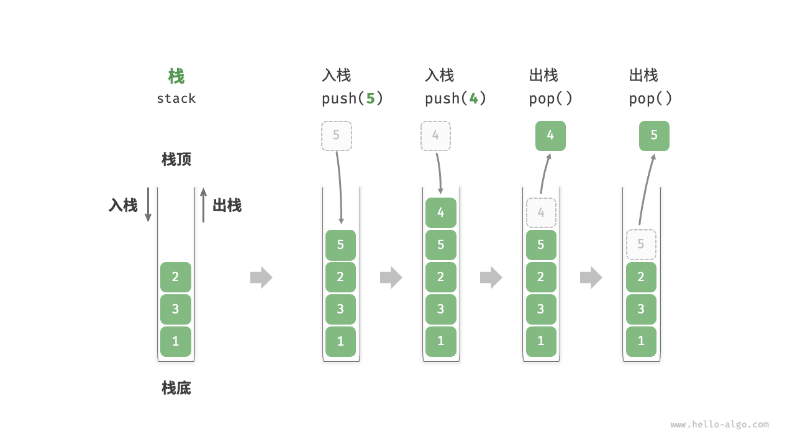

## 栈的常用操作

栈的常用操作如下表所示，具体的方法名需要根据所使用的编程语言来确定。在此，我们以常见的 `push()`、`pop()`、`peek()` 命名为例。

<p align="center"> 表 <id> &nbsp; 栈的操作效率 </p>

| 方法     | 描述                   | 时间复杂度 |
| -------- | ---------------------- | ---------- |
| `push()` | 元素入栈（添加至栈顶） | $O(1)$     |
| `pop()`  | 栈顶元素出栈           | $O(1)$     |
| `peek()` | 访问栈顶元素           | $O(1)$     |

通常情况下，我们可以直接使用编程语言内置的栈类。然而，某些语言可能没有专门提供栈类，这时我们可以将该语言的“数组”或“链表”当作栈来使用，并在程序逻辑上忽略与栈无关的操作。

```python title="stack.py"
# 初始化栈
# Python 没有内置的栈类，可以把 list 当作栈来使用
stack: list[int] = []

# 元素入栈
stack.append(1)
stack.append(3)
stack.append(2)
stack.append(5)
stack.append(4)

# 访问栈顶元素
peek: int = stack[-1]

# 元素出栈
pop: int = stack.pop()

# 获取栈的长度
size: int = len(stack)

# 判断是否为空
is_empty: bool = len(stack) == 0
```

!!! example [pythontutor "可视化运行"](https://pythontutor.com/iframe-embed.html#code=%22%22%22Driver%20Code%22%22%22%0Aif%20__name__%20%3D%3D%20%22__main__%22%3A%0A%20%20%20%20%23%20%E5%88%9D%E5%A7%8B%E5%8C%96%E6%A0%88%0A%20%20%20%20%23%20Python%20%E6%B2%A1%E6%9C%89%E5%86%85%E7%BD%AE%E7%9A%84%E6%A0%88%E7%B1%BB%EF%BC%8C%E5%8F%AF%E4%BB%A5%E6%8A%8A%20list%20%E5%BD%93%E4%BD%9C%E6%A0%88%E6%9D%A5%E4%BD%BF%E7%94%A8%0A%20%20%20%20stack%20%3D%20%5B%5D%0A%0A%20%20%20%20%23%20%E5%85%83%E7%B4%A0%E5%85%A5%E6%A0%88%0A%20%20%20%20stack.append%281%29%0A%20%20%20%20stack.append%283%29%0A%20%20%20%20stack.append%282%29%0A%20%20%20%20stack.append%285%29%0A%20%20%20%20stack.append%284%29%0A%20%20%20%20print%28%22%E6%A0%88%20stack%20%3D%22,%20stack%29%0A%0A%20%20%20%20%23%20%E8%AE%BF%E9%97%AE%E6%A0%88%E9%A1%B6%E5%85%83%E7%B4%A0%0A%20%20%20%20peek%20%3D%20stack%5B-1%5D%0A%20%20%20%20print%28%22%E6%A0%88%E9%A1%B6%E5%85%83%E7%B4%A0%20peek%20%3D%22,%20peek%29%0A%0A%20%20%20%20%23%20%E5%85%83%E7%B4%A0%E5%87%BA%E6%A0%88%0A%20%20%20%20pop%20%3D%20stack.pop%28%29%0A%20%20%20%20print%28%22%E5%87%BA%E6%A0%88%E5%85%83%E7%B4%A0%20pop%20%3D%22,%20pop%29%0A%20%20%20%20print%28%22%E5%87%BA%E6%A0%88%E5%90%8E%20stack%20%3D%22,%20stack%29%0A%0A%20%20%20%20%23%20%E8%8E%B7%E5%8F%96%E6%A0%88%E7%9A%84%E9%95%BF%E5%BA%A6%0A%20%20%20%20size%20%3D%20len%28stack%29%0A%20%20%20%20print%28%22%E6%A0%88%E7%9A%84%E9%95%BF%E5%BA%A6%20size%20%3D%22,%20size%29%0A%0A%20%20%20%20%23%20%E5%88%A4%E6%96%AD%E6%98%AF%E5%90%A6%E4%B8%BA%E7%A9%BA%0A%20%20%20%20is_empty%20%3D%20len%28stack%29%20%3D%3D%200%0A%20%20%20%20print%28%22%E6%A0%88%E6%98%AF%E5%90%A6%E4%B8%BA%E7%A9%BA%20%3D%22,%20is_empty%29&codeDivHeight=800&codeDivWidth=600&cumulative=false&curInstr=2&heapPrimitives=nevernest&origin=opt-frontend.js&py=311&rawInputLstJSON=%5B%5D&textReferences=false)

## 栈的实现

为了深入了解栈的运行机制，我们来尝试自己实现一个栈类。

栈遵循先入后出的原则，因此我们只能在栈顶添加或删除元素。然而，数组和链表都可以在任意位置添加和删除元素，**因此栈可以视为一种受限制的数组或链表**。换句话说，我们可以“屏蔽”数组或链表的部分无关操作，使其对外表现的逻辑符合栈的特性。

### 基于链表的实现

使用链表实现栈时，我们可以将链表的头节点视为栈顶，尾节点视为栈底。

如下图所示，对于入栈操作，我们只需将元素插入链表头部，这种节点插入方法被称为“头插法”。而对于出栈操作，只需将头节点从链表中删除即可。

=== "LinkedListStack"
    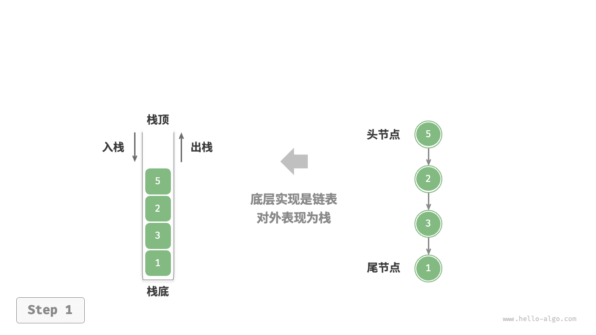

=== "push()"
    

=== "pop()"
    

以下是基于链表实现栈的示例代码：

```python
class LinkedListStack:
    """基于链表实现的栈"""

    def __init__(self):
        """构造方法"""
        self._peek: ListNode | None = None
        self._size: int = 0

    def size(self) -> int:
        """获取栈的长度"""
        return self._size

    def is_empty(self) -> bool:
        """判断栈是否为空"""
        return self._size == 0

    def push(self, val: int):
        """入栈"""
        node = ListNode(val)
        node.next = self._peek
        self._peek = node
        self._size += 1

    def pop(self) -> int:
        """出栈"""
        num = self.peek()
        self._peek = self._peek.next
        self._size -= 1
        return num

    def peek(self) -> int:
        """访问栈顶元素"""
        if self.is_empty():
            raise IndexError("栈为空")
        return self._peek.val

    def to_list(self) -> list[int]:
        """转化为列表用于打印"""
        arr = []
        node = self._peek
        while node:
            arr.append(node.val)
            node = node.next
        arr.reverse()
        return arr
```

!!! example [pythontutor "可视化运行"](https://pythontutor.com/iframe-embed.html#code=class%20ListNode%3A%0A%20%20%20%20%22%22%22%E9%93%BE%E8%A1%A8%E8%8A%82%E7%82%B9%E7%B1%BB%22%22%22%0A%20%20%20%20def%20__init__%28self,%20val%3A%20int%29%3A%0A%20%20%20%20%20%20%20%20self.val%3A%20int%20%3D%20val%20%20%23%20%E8%8A%82%E7%82%B9%E5%80%BC%0A%20%20%20%20%20%20%20%20self.next%3A%20ListNode%20%7C%20None%20%3D%20None%20%20%23%20%E5%90%8E%E7%BB%A7%E8%8A%82%E7%82%B9%E5%BC%95%E7%94%A8%0A%0A%0Aclass%20LinkedListStack%3A%0A%20%20%20%20%22%22%22%E5%9F%BA%E4%BA%8E%E9%93%BE%E8%A1%A8%E5%AE%9E%E7%8E%B0%E7%9A%84%E6%A0%88%22%22%22%0A%0A%20%20%20%20def%20__init__%28self%29%3A%0A%20%20%20%20%20%20%20%20%22%22%22%E6%9E%84%E9%80%A0%E6%96%B9%E6%B3%95%22%22%22%0A%20%20%20%20%20%20%20%20self._peek%3A%20ListNode%20%7C%20None%20%3D%20None%0A%20%20%20%20%20%20%20%20self._size%3A%20int%20%3D%200%0A%0A%20%20%20%20def%20size%28self%29%20-%3E%20int%3A%0A%20%20%20%20%20%20%20%20%22%22%22%E8%8E%B7%E5%8F%96%E6%A0%88%E7%9A%84%E9%95%BF%E5%BA%A6%22%22%22%0A%20%20%20%20%20%20%20%20return%20self._size%0A%0A%20%20%20%20def%20is_empty%28self%29%20-%3E%20bool%3A%0A%20%20%20%20%20%20%20%20%22%22%22%E5%88%A4%E6%96%AD%E6%A0%88%E6%98%AF%E5%90%A6%E4%B8%BA%E7%A9%BA%22%22%22%0A%20%20%20%20%20%20%20%20return%20not%20self._peek%0A%0A%20%20%20%20def%20push%28self,%20val%3A%20int%29%3A%0A%20%20%20%20%20%20%20%20%22%22%22%E5%85%A5%E6%A0%88%22%22%22%0A%20%20%20%20%20%20%20%20node%20%3D%20ListNode%28val%29%0A%20%20%20%20%20%20%20%20node.next%20%3D%20self._peek%0A%20%20%20%20%20%20%20%20self._peek%20%3D%20node%0A%20%20%20%20%20%20%20%20self._size%20%2B%3D%201%0A%0A%20%20%20%20def%20pop%28self%29%20-%3E%20int%3A%0A%20%20%20%20%20%20%20%20%22%22%22%E5%87%BA%E6%A0%88%22%22%22%0A%20%20%20%20%20%20%20%20num%20%3D%20self.peek%28%29%0A%20%20%20%20%20%20%20%20self._peek%20%3D%20self._peek.next%0A%20%20%20%20%20%20%20%20self._size%20-%3D%201%0A%20%20%20%20%20%20%20%20return%20num%0A%0A%20%20%20%20def%20peek%28self%29%20-%3E%20int%3A%0A%20%20%20%20%20%20%20%20%22%22%22%E8%AE%BF%E9%97%AE%E6%A0%88%E9%A1%B6%E5%85%83%E7%B4%A0%22%22%22%0A%20%20%20%20%20%20%20%20if%20self.is_empty%28%29%3A%0A%20%20%20%20%20%20%20%20%20%20%20%20raise%20IndexError%28%22%E6%A0%88%E4%B8%BA%E7%A9%BA%22%29%0A%20%20%20%20%20%20%20%20return%20self._peek.val%0A%0A%20%20%20%20def%20to_list%28self%29%20-%3E%20list%5Bint%5D%3A%0A%20%20%20%20%20%20%20%20%22%22%22%E8%BD%AC%E5%8C%96%E4%B8%BA%E5%88%97%E8%A1%A8%E7%94%A8%E4%BA%8E%E6%89%93%E5%8D%B0%22%22%22%0A%20%20%20%20%20%20%20%20arr%20%3D%20%5B%5D%0A%20%20%20%20%20%20%20%20node%20%3D%20self._peek%0A%20%20%20%20%20%20%20%20while%20node%3A%0A%20%20%20%20%20%20%20%20%20%20%20%20arr.append%28node.val%29%0A%20%20%20%20%20%20%20%20%20%20%20%20node%20%3D%20node.next%0A%20%20%20%20%20%20%20%20arr.reverse%28%29%0A%20%20%20%20%20%20%20%20return%20arr%0A%0A%0A%22%22%22Driver%20Code%22%22%22%0Aif%20__name__%20%3D%3D%20%22__main__%22%3A%0A%20%20%20%20%23%20%E5%88%9D%E5%A7%8B%E5%8C%96%E6%A0%88%0A%20%20%20%20stack%20%3D%20LinkedListStack%28%29%0A%0A%20%20%20%20%23%20%E5%85%83%E7%B4%A0%E5%85%A5%E6%A0%88%0A%20%20%20%20stack.push%281%29%0A%20%20%20%20stack.push%283%29%0A%20%20%20%20stack.push%282%29%0A%20%20%20%20stack.push%285%29%0A%20%20%20%20stack.push%284%29%0A%20%20%20%20print%28%22%E6%A0%88%20stack%20%3D%22,%20stack.to_list%28%29%29%0A%0A%20%20%20%20%23%20%E8%AE%BF%E9%97%AE%E6%A0%88%E9%A1%B6%E5%85%83%E7%B4%A0%0A%20%20%20%20peek%20%3D%20stack.peek%28%29%0A%20%20%20%20print%28%22%E6%A0%88%E9%A1%B6%E5%85%83%E7%B4%A0%20peek%20%3D%22,%20peek%29%0A%0A%20%20%20%20%23%20%E5%85%83%E7%B4%A0%E5%87%BA%E6%A0%88%0A%20%20%20%20pop%20%3D%20stack.pop%28%29%0A%20%20%20%20print%28%22%E5%87%BA%E6%A0%88%E5%85%83%E7%B4%A0%20pop%20%3D%22,%20pop%29%0A%20%20%20%20print%28%22%E5%87%BA%E6%A0%88%E5%90%8E%20stack%20%3D%22,%20stack.to_list%28%29%29%0A%0A%20%20%20%20%23%20%E8%8E%B7%E5%8F%96%E6%A0%88%E7%9A%84%E9%95%BF%E5%BA%A6%0A%20%20%20%20size%20%3D%20stack.size%28%29%0A%20%20%20%20print%28%22%E6%A0%88%E7%9A%84%E9%95%BF%E5%BA%A6%20size%20%3D%22,%20size%29%0A%0A%20%20%20%20%23%20%E5%88%A4%E6%96%AD%E6%98%AF%E5%90%A6%E4%B8%BA%E7%A9%BA%0A%20%20%20%20is_empty%20%3D%20stack.is_empty%28%29%0A%20%20%20%20print%28%22%E6%A0%88%E6%98%AF%E5%90%A6%E4%B8%BA%E7%A9%BA%20%3D%22,%20is_empty%29&codeDivHeight=800&codeDivWidth=600&cumulative=false&curInstr=4&heapPrimitives=nevernest&origin=opt-frontend.js&py=311&rawInputLstJSON=%5B%5D&textReferences=false)

### 基于数组的实现

使用数组实现栈时，我们可以将数组的尾部作为栈顶。如下图所示，入栈与出栈操作分别对应在数组尾部添加元素与删除元素，时间复杂度都为 $O(1)$ 。

=== "ArrayStack"
    

=== "push()"
    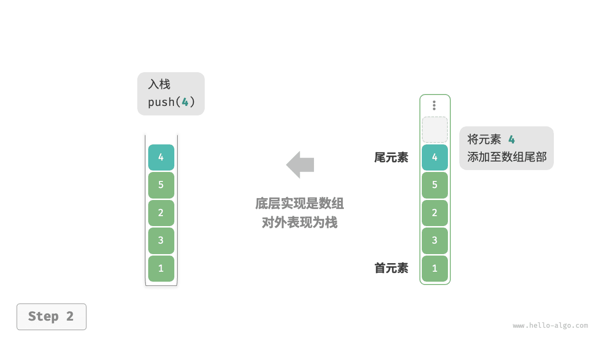

=== "pop()"
    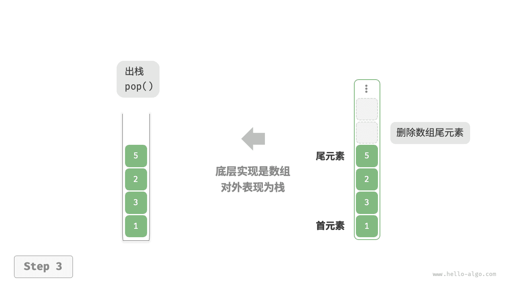

由于入栈的元素可能会源源不断地增加，因此我们可以使用动态数组，这样就无须自行处理数组扩容问题。以下为示例代码：

```python
class ArrayStack:
    """基于数组实现的栈"""

    def __init__(self):
        """构造方法"""
        self._stack: list[int] = []

    def size(self) -> int:
        """获取栈的长度"""
        return len(self._stack)

    def is_empty(self) -> bool:
        """判断栈是否为空"""
        return self.size() == 0

    def push(self, item: int):
        """入栈"""
        self._stack.append(item)

    def pop(self) -> int:
        """出栈"""
        if self.is_empty():
            raise IndexError("栈为空")
        return self._stack.pop()

    def peek(self) -> int:
        """访问栈顶元素"""
        if self.is_empty():
            raise IndexError("栈为空")
        return self._stack[-1]

    def to_list(self) -> list[int]:
        """返回列表用于打印"""
        return self._stack
```

!!! example [pythontutor "可视化运行"](https://pythontutor.com/iframe-embed.html#code=class%20ArrayStack%3A%0A%20%20%20%20%22%22%22%E5%9F%BA%E4%BA%8E%E6%95%B0%E7%BB%84%E5%AE%9E%E7%8E%B0%E7%9A%84%E6%A0%88%22%22%22%0A%0A%20%20%20%20def%20__init__%28self%29%3A%0A%20%20%20%20%20%20%20%20%22%22%22%E6%9E%84%E9%80%A0%E6%96%B9%E6%B3%95%22%22%22%0A%20%20%20%20%20%20%20%20self._stack%3A%20list%5Bint%5D%20%3D%20%5B%5D%0A%0A%20%20%20%20def%20size%28self%29%20-%3E%20int%3A%0A%20%20%20%20%20%20%20%20%22%22%22%E8%8E%B7%E5%8F%96%E6%A0%88%E7%9A%84%E9%95%BF%E5%BA%A6%22%22%22%0A%20%20%20%20%20%20%20%20return%20len%28self._stack%29%0A%0A%20%20%20%20def%20is_empty%28self%29%20-%3E%20bool%3A%0A%20%20%20%20%20%20%20%20%22%22%22%E5%88%A4%E6%96%AD%E6%A0%88%E6%98%AF%E5%90%A6%E4%B8%BA%E7%A9%BA%22%22%22%0A%20%20%20%20%20%20%20%20return%20self._stack%20%3D%3D%20%5B%5D%0A%0A%20%20%20%20def%20push%28self,%20item%3A%20int%29%3A%0A%20%20%20%20%20%20%20%20%22%22%22%E5%85%A5%E6%A0%88%22%22%22%0A%20%20%20%20%20%20%20%20self._stack.append%28item%29%0A%0A%20%20%20%20def%20pop%28self%29%20-%3E%20int%3A%0A%20%20%20%20%20%20%20%20%22%22%22%E5%87%BA%E6%A0%88%22%22%22%0A%20%20%20%20%20%20%20%20if%20self.is_empty%28%29%3A%0A%20%20%20%20%20%20%20%20%20%20%20%20raise%20IndexError%28%22%E6%A0%88%E4%B8%BA%E7%A9%BA%22%29%0A%20%20%20%20%20%20%20%20return%20self._stack.pop%28%29%0A%0A%20%20%20%20def%20peek%28self%29%20-%3E%20int%3A%0A%20%20%20%20%20%20%20%20%22%22%22%E8%AE%BF%E9%97%AE%E6%A0%88%E9%A1%B6%E5%85%83%E7%B4%A0%22%22%22%0A%20%20%20%20%20%20%20%20if%20self.is_empty%28%29%3A%0A%20%20%20%20%20%20%20%20%20%20%20%20raise%20IndexError%28%22%E6%A0%88%E4%B8%BA%E7%A9%BA%22%29%0A%20%20%20%20%20%20%20%20return%20self._stack%5B-1%5D%0A%0A%20%20%20%20def%20to_list%28self%29%20-%3E%20list%5Bint%5D%3A%0A%20%20%20%20%20%20%20%20%22%22%22%E8%BF%94%E5%9B%9E%E5%88%97%E8%A1%A8%E7%94%A8%E4%BA%8E%E6%89%93%E5%8D%B0%22%22%22%0A%20%20%20%20%20%20%20%20return%20self._stack%0A%0A%0A%22%22%22Driver%20Code%22%22%22%0Aif%20__name__%20%3D%3D%20%22__main__%22%3A%0A%20%20%20%20%23%20%E5%88%9D%E5%A7%8B%E5%8C%96%E6%A0%88%0A%20%20%20%20stack%20%3D%20ArrayStack%28%29%0A%0A%20%20%20%20%23%20%E5%85%83%E7%B4%A0%E5%85%A5%E6%A0%88%0A%20%20%20%20stack.push%281%29%0A%20%20%20%20stack.push%283%29%0A%20%20%20%20stack.push%282%29%0A%20%20%20%20stack.push%285%29%0A%20%20%20%20stack.push%284%29%0A%20%20%20%20print%28%22%E6%A0%88%20stack%20%3D%22,%20stack.to_list%28%29%29%0A%0A%20%20%20%20%23%20%E8%AE%BF%E9%97%AE%E6%A0%88%E9%A1%B6%E5%85%83%E7%B4%A0%0A%20%20%20%20peek%20%3D%20stack.peek%28%29%0A%20%20%20%20print%28%22%E6%A0%88%E9%A1%B6%E5%85%83%E7%B4%A0%20peek%20%3D%22,%20peek%29%0A%0A%20%20%20%20%23%20%E5%85%83%E7%B4%A0%E5%87%BA%E6%A0%88%0A%20%20%20%20pop%20%3D%20stack.pop%28%29%0A%20%20%20%20print%28%22%E5%87%BA%E6%A0%88%E5%85%83%E7%B4%A0%20pop%20%3D%22,%20pop%29%0A%20%20%20%20print%28%22%E5%87%BA%E6%A0%88%E5%90%8E%20stack%20%3D%22,%20stack.to_list%28%29%29%0A%0A%20%20%20%20%23%20%E8%8E%B7%E5%8F%96%E6%A0%88%E7%9A%84%E9%95%BF%E5%BA%A6%0A%20%20%20%20size%20%3D%20stack.size%28%29%0A%20%20%20%20print%28%22%E6%A0%88%E7%9A%84%E9%95%BF%E5%BA%A6%20size%20%3D%22,%20size%29%0A%0A%20%20%20%20%23%20%E5%88%A4%E6%96%AD%E6%98%AF%E5%90%A6%E4%B8%BA%E7%A9%BA%0A%20%20%20%20is_empty%20%3D%20stack.is_empty%28%29%0A%20%20%20%20print%28%22%E6%A0%88%E6%98%AF%E5%90%A6%E4%B8%BA%E7%A9%BA%20%3D%22,%20is_empty%29&codeDivHeight=800&codeDivWidth=600&cumulative=false&curInstr=3&heapPrimitives=nevernest&origin=opt-frontend.js&py=311&rawInputLstJSON=%5B%5D&textReferences=false)

## 两种实现对比

**支持操作**

两种实现都支持栈定义中的各项操作。数组实现额外支持随机访问，但这已超出了栈的定义范畴，因此一般不会用到。

**时间效率**

在基于数组的实现中，入栈和出栈操作都在预先分配好的连续内存中进行，具有很好的缓存本地性，因此效率较高。然而，如果入栈时超出数组容量，会触发扩容机制，导致该次入栈操作的时间复杂度变为 $O(n)$ 。

在基于链表的实现中，链表的扩容非常灵活，不存在上述数组扩容时效率降低的问题。但是，入栈操作需要初始化节点对象并修改指针，因此效率相对较低。不过，如果入栈元素本身就是节点对象，那么可以省去初始化步骤，从而提高效率。

综上所述，当入栈与出栈操作的元素是基本数据类型时，例如 `int` 或 `double` ，我们可以得出以下结论。

- 基于数组实现的栈在触发扩容时效率会降低，但由于扩容是低频操作，因此平均效率更高。
- 基于链表实现的栈可以提供更加稳定的效率表现。

**空间效率**

在初始化列表时，系统会为列表分配“初始容量”，该容量可能超出实际需求；并且，扩容机制通常是按照特定倍率（例如 2 倍）进行扩容的，扩容后的容量也可能超出实际需求。因此，**基于数组实现的栈可能造成一定的空间浪费**。

然而，由于链表节点需要额外存储指针，**因此链表节点占用的空间相对较大**。

综上，我们不能简单地确定哪种实现更加节省内存，需要针对具体情况进行分析。

## 栈的典型应用

- **浏览器中的后退与前进、软件中的撤销与反撤销**。每当我们打开新的网页，浏览器就会对上一个网页执行入栈，这样我们就可以通过后退操作回到上一个网页。后退操作实际上是在执行出栈。如果要同时支持后退和前进，那么需要两个栈来配合实现。
- **程序内存管理**。每次调用函数时，系统都会在栈顶添加一个栈帧，用于记录函数的上下文信息。在递归函数中，向下递推阶段会不断执行入栈操作，而向上回溯阶段则会不断执行出栈操作。

# 队列

<u>队列（queue）</u>是一种遵循先入先出规则的线性数据结构。顾名思义，队列模拟了排队现象，即新来的人不断加入队列尾部，而位于队列头部的人逐个离开。

如下图所示，我们将队列头部称为“队首”，尾部称为“队尾”，将把元素加入队尾的操作称为“入队”，删除队首元素的操作称为“出队”。


## 队列常用操作

队列的常见操作如下表所示。需要注意的是，不同编程语言的方法名称可能会有所不同。我们在此采用与栈相同的方法命名。

<p align="center"> 表 <id> &nbsp; 队列操作效率 </p>

| 方法名   | 描述                         | 时间复杂度 |
| -------- | ---------------------------- | ---------- |
| `push()` | 元素入队，即将元素添加至队尾 | $O(1)$     |
| `pop()`  | 队首元素出队                 | $O(1)$     |
| `peek()` | 访问队首元素                 | $O(1)$     |

我们可以直接使用编程语言中现成的队列类：

```python
from collections import deque

# 初始化队列
# 在 Python 中，我们一般将双向队列类 deque 当作队列使用
# 虽然 queue.Queue() 是纯正的队列类，但不太好用，因此不推荐
que: deque[int] = deque()

# 元素入队
que.append(1)
que.append(3)
que.append(2)
que.append(5)
que.append(4)

# 访问队首元素
front: int = que[0]

# 元素出队
pop: int = que.popleft()

# 获取队列的长度
size: int = len(que)

# 判断队列是否为空
is_empty: bool = len(que) == 0
```

!!! example [pythontutor "可视化运行"](https://pythontutor.com/iframe-embed.html#code=from%20collections%20import%20deque%0A%0A%22%22%22Driver%20Code%22%22%22%0Aif%20__name__%20%3D%3D%20%22__main__%22%3A%0A%20%20%20%20%23%20%E5%88%9D%E5%A7%8B%E5%8C%96%E9%98%9F%E5%88%97%0A%20%20%20%20%23%20%E5%9C%A8%20Python%20%E4%B8%AD%EF%BC%8C%E6%88%91%E4%BB%AC%E4%B8%80%E8%88%AC%E5%B0%86%E5%8F%8C%E5%90%91%E9%98%9F%E5%88%97%E7%B1%BB%20deque%20%E7%9C%8B%E4%BD%9C%E9%98%9F%E5%88%97%E4%BD%BF%E7%94%A8%0A%20%20%20%20%23%20%E8%99%BD%E7%84%B6%20queue.Queue%28%29%20%E6%98%AF%E7%BA%AF%E6%AD%A3%E7%9A%84%E9%98%9F%E5%88%97%E7%B1%BB%EF%BC%8C%E4%BD%86%E4%B8%8D%E5%A4%AA%E5%A5%BD%E7%94%A8%0A%20%20%20%20que%20%3D%20deque%28%29%0A%0A%20%20%20%20%23%20%E5%85%83%E7%B4%A0%E5%85%A5%E9%98%9F%0A%20%20%20%20que.append%281%29%0A%20%20%20%20que.append%283%29%0A%20%20%20%20que.append%282%29%0A%20%20%20%20que.append%285%29%0A%20%20%20%20que.append%284%29%0A%20%20%20%20print%28%22%E9%98%9F%E5%88%97%20que%20%3D%22,%20que%29%0A%0A%20%20%20%20%23%20%E8%AE%BF%E9%97%AE%E9%98%9F%E9%A6%96%E5%85%83%E7%B4%A0%0A%20%20%20%20front%20%3D%20que%5B0%5D%0A%20%20%20%20print%28%22%E9%98%9F%E9%A6%96%E5%85%83%E7%B4%A0%20front%20%3D%22,%20front%29%0A%0A%20%20%20%20%23%20%E5%85%83%E7%B4%A0%E5%87%BA%E9%98%9F%0A%20%20%20%20pop%20%3D%20que.popleft%28%29%0A%20%20%20%20print%28%22%E5%87%BA%E9%98%9F%E5%85%83%E7%B4%A0%20pop%20%3D%22,%20pop%29%0A%20%20%20%20print%28%22%E5%87%BA%E9%98%9F%E5%90%8E%20que%20%3D%22,%20que%29%0A%0A%20%20%20%20%23%20%E8%8E%B7%E5%8F%96%E9%98%9F%E5%88%97%E7%9A%84%E9%95%BF%E5%BA%A6%0A%20%20%20%20size%20%3D%20len%28que%29%0A%20%20%20%20print%28%22%E9%98%9F%E5%88%97%E9%95%BF%E5%BA%A6%20size%20%3D%22,%20size%29%0A%0A%20%20%20%20%23%20%E5%88%A4%E6%96%AD%E9%98%9F%E5%88%97%E6%98%AF%E5%90%A6%E4%B8%BA%E7%A9%BA%0A%20%20%20%20is_empty%20%3D%20len%28que%29%20%3D%3D%200%0A%20%20%20%20print%28%22%E9%98%9F%E5%88%97%E6%98%AF%E5%90%A6%E4%B8%BA%E7%A9%BA%20%3D%22,%20is_empty%29&codeDivHeight=800&codeDivWidth=600&cumulative=false&curInstr=3&heapPrimitives=nevernest&origin=opt-frontend.js&py=311&rawInputLstJSON=%5B%5D&textReferences=false)

## 队列实现

为了实现队列，我们需要一种数据结构，可以在一端添加元素，并在另一端删除元素，链表和数组都符合要求。

### 基于链表的实现

如下图所示，我们可以将链表的“头节点”和“尾节点”分别视为“队首”和“队尾”，规定队尾仅可添加节点，队首仅可删除节点。

=== "LinkedListQueue"
    

=== "push()"
    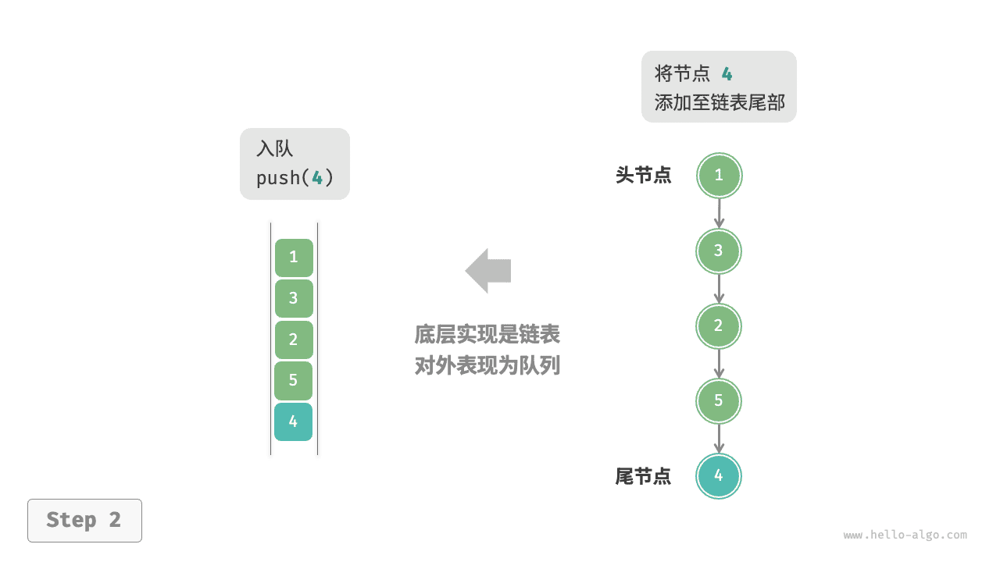

=== "pop()"
    

以下是用链表实现队列的代码：

```python
class LinkedListQueue:
    """基于链表实现的队列"""

    def __init__(self):
        """构造方法"""
        self._front: ListNode | None = None  # 头节点 front
        self._rear: ListNode | None = None  # 尾节点 rear
        self._size: int = 0

    def size(self) -> int:
        """获取队列的长度"""
        return self._size

    def is_empty(self) -> bool:
        """判断队列是否为空"""
        return self._size == 0

    def push(self, num: int):
        """入队"""
        # 在尾节点后添加 num
        node = ListNode(num)
        # 如果队列为空，则令头、尾节点都指向该节点
        if self._front is None:
            self._front = node
            self._rear = node
        # 如果队列不为空，则将该节点添加到尾节点后
        else:
            self._rear.next = node
            self._rear = node
        self._size += 1

    def pop(self) -> int:
        """出队"""
        num = self.peek()
        # 删除头节点
        self._front = self._front.next
        self._size -= 1
        return num

    def peek(self) -> int:
        """访问队首元素"""
        if self.is_empty():
            raise IndexError("队列为空")
        return self._front.val

    def to_list(self) -> list[int]:
        """转化为列表用于打印"""
        queue = []
        temp = self._front
        while temp:
            queue.append(temp.val)
            temp = temp.next
        return queue
```

!!! example [pythontutor "可视化运行"](https://pythontutor.com/iframe-embed.html#code=class%20ListNode%3A%0A%20%20%20%20%22%22%22%E9%93%BE%E8%A1%A8%E8%8A%82%E7%82%B9%E7%B1%BB%22%22%22%0A%20%20%20%20def%20__init__%28self,%20val%3A%20int%29%3A%0A%20%20%20%20%20%20%20%20self.val%3A%20int%20%3D%20val%20%20%23%20%E8%8A%82%E7%82%B9%E5%80%BC%0A%20%20%20%20%20%20%20%20self.next%3A%20ListNode%20%7C%20None%20%3D%20None%20%20%23%20%E5%90%8E%E7%BB%A7%E8%8A%82%E7%82%B9%E5%BC%95%E7%94%A8%0A%0A%0Aclass%20LinkedListQueue%3A%0A%20%20%20%20%22%22%22%E5%9F%BA%E4%BA%8E%E9%93%BE%E8%A1%A8%E5%AE%9E%E7%8E%B0%E7%9A%84%E9%98%9F%E5%88%97%22%22%22%0A%0A%20%20%20%20def%20__init__%28self%29%3A%0A%20%20%20%20%20%20%20%20%22%22%22%E6%9E%84%E9%80%A0%E6%96%B9%E6%B3%95%22%22%22%0A%20%20%20%20%20%20%20%20self._front%3A%20ListNode%20%7C%20None%20%3D%20None%20%20%23%20%E5%A4%B4%E8%8A%82%E7%82%B9%20front%0A%20%20%20%20%20%20%20%20self._rear%3A%20ListNode%20%7C%20None%20%3D%20None%20%20%23%20%E5%B0%BE%E8%8A%82%E7%82%B9%20rear%0A%20%20%20%20%20%20%20%20self._size%3A%20int%20%3D%200%0A%0A%20%20%20%20def%20size%28self%29%20-%3E%20int%3A%0A%20%20%20%20%20%20%20%20%22%22%22%E8%8E%B7%E5%8F%96%E9%98%9F%E5%88%97%E7%9A%84%E9%95%BF%E5%BA%A6%22%22%22%0A%20%20%20%20%20%20%20%20return%20self._size%0A%0A%20%20%20%20def%20is_empty%28self%29%20-%3E%20bool%3A%0A%20%20%20%20%20%20%20%20%22%22%22%E5%88%A4%E6%96%AD%E9%98%9F%E5%88%97%E6%98%AF%E5%90%A6%E4%B8%BA%E7%A9%BA%22%22%22%0A%20%20%20%20%20%20%20%20return%20not%20self._front%0A%0A%20%20%20%20def%20push%28self,%20num%3A%20int%29%3A%0A%20%20%20%20%20%20%20%20%22%22%22%E5%85%A5%E9%98%9F%22%22%22%0A%20%20%20%20%20%20%20%20%23%20%E5%9C%A8%E5%B0%BE%E8%8A%82%E7%82%B9%E5%90%8E%E6%B7%BB%E5%8A%A0%20num%0A%20%20%20%20%20%20%20%20node%20%3D%20ListNode%28num%29%0A%20%20%20%20%20%20%20%20%23%20%E5%A6%82%E6%9E%9C%E9%98%9F%E5%88%97%E4%B8%BA%E7%A9%BA%EF%BC%8C%E5%88%99%E4%BB%A4%E5%A4%B4%E3%80%81%E5%B0%BE%E8%8A%82%E7%82%B9%E9%83%BD%E6%8C%87%E5%90%91%E8%AF%A5%E8%8A%82%E7%82%B9%0A%20%20%20%20%20%20%20%20if%20self._front%20is%20None%3A%0A%20%20%20%20%20%20%20%20%20%20%20%20self._front%20%3D%20node%0A%20%20%20%20%20%20%20%20%20%20%20%20self._rear%20%3D%20node%0A%20%20%20%20%20%20%20%20%23%20%E5%A6%82%E6%9E%9C%E9%98%9F%E5%88%97%E4%B8%8D%E4%B8%BA%E7%A9%BA%EF%BC%8C%E5%88%99%E5%B0%86%E8%AF%A5%E8%8A%82%E7%82%B9%E6%B7%BB%E5%8A%A0%E5%88%B0%E5%B0%BE%E8%8A%82%E7%82%B9%E5%90%8E%0A%20%20%20%20%20%20%20%20else%3A%0A%20%20%20%20%20%20%20%20%20%20%20%20self._rear.next%20%3D%20node%0A%20%20%20%20%20%20%20%20%20%20%20%20self._rear%20%3D%20node%0A%20%20%20%20%20%20%20%20self._size%20%2B%3D%201%0A%0A%20%20%20%20def%20pop%28self%29%20-%3E%20int%3A%0A%20%20%20%20%20%20%20%20%22%22%22%E5%87%BA%E9%98%9F%22%22%22%0A%20%20%20%20%20%20%20%20num%20%3D%20self.peek%28%29%0A%20%20%20%20%20%20%20%20%23%20%E5%88%A0%E9%99%A4%E5%A4%B4%E8%8A%82%E7%82%B9%0A%20%20%20%20%20%20%20%20self._front%20%3D%20self._front.next%0A%20%20%20%20%20%20%20%20self._size%20-%3D%201%0A%20%20%20%20%20%20%20%20return%20num%0A%0A%20%20%20%20def%20peek%28self%29%20-%3E%20int%3A%0A%20%20%20%20%20%20%20%20%22%22%22%E8%AE%BF%E9%97%AE%E9%98%9F%E9%A6%96%E5%85%83%E7%B4%A0%22%22%22%0A%20%20%20%20%20%20%20%20if%20self.is_empty%28%29%3A%0A%20%20%20%20%20%20%20%20%20%20%20%20raise%20IndexError%28%22%E9%98%9F%E5%88%97%E4%B8%BA%E7%A9%BA%22%29%0A%20%20%20%20%20%20%20%20return%20self._front.val%0A%0A%20%20%20%20def%20to_list%28self%29%20-%3E%20list%5Bint%5D%3A%0A%20%20%20%20%20%20%20%20%22%22%22%E8%BD%AC%E5%8C%96%E4%B8%BA%E5%88%97%E8%A1%A8%E7%94%A8%E4%BA%8E%E6%89%93%E5%8D%B0%22%22%22%0A%20%20%20%20%20%20%20%20queue%20%3D%20%5B%5D%0A%20%20%20%20%20%20%20%20temp%20%3D%20self._front%0A%20%20%20%20%20%20%20%20while%20temp%3A%0A%20%20%20%20%20%20%20%20%20%20%20%20queue.append%28temp.val%29%0A%20%20%20%20%20%20%20%20%20%20%20%20temp%20%3D%20temp.next%0A%20%20%20%20%20%20%20%20return%20queue%0A%0A%0A%22%22%22Driver%20Code%22%22%22%0Aif%20__name__%20%3D%3D%20%22__main__%22%3A%0A%20%20%20%20%23%20%E5%88%9D%E5%A7%8B%E5%8C%96%E9%98%9F%E5%88%97%0A%20%20%20%20queue%20%3D%20LinkedListQueue%28%29%0A%0A%20%20%20%20%23%20%E5%85%83%E7%B4%A0%E5%85%A5%E9%98%9F%0A%20%20%20%20queue.push%281%29%0A%20%20%20%20queue.push%283%29%0A%20%20%20%20queue.push%282%29%0A%20%20%20%20queue.push%285%29%0A%20%20%20%20queue.push%284%29%0A%20%20%20%20print%28%22%E9%98%9F%E5%88%97%20queue%20%3D%22,%20queue.to_list%28%29%29%0A%0A%20%20%20%20%23%20%E8%AE%BF%E9%97%AE%E9%98%9F%E9%A6%96%E5%85%83%E7%B4%A0%0A%20%20%20%20peek%20%3D%20queue.peek%28%29%0A%20%20%20%20print%28%22%E9%98%9F%E9%A6%96%E5%85%83%E7%B4%A0%20front%20%3D%22,%20peek%29%0A%0A%20%20%20%20%23%20%E5%85%83%E7%B4%A0%E5%87%BA%E9%98%9F%0A%20%20%20%20pop_front%20%3D%20queue.pop%28%29%0A%20%20%20%20print%28%22%E5%87%BA%E9%98%9F%E5%85%83%E7%B4%A0%20pop%20%3D%22,%20pop_front%29%0A%20%20%20%20print%28%22%E5%87%BA%E9%98%9F%E5%90%8E%20queue%20%3D%22,%20queue.to_list%28%29%29%0A%0A%20%20%20%20%23%20%E8%8E%B7%E5%8F%96%E9%98%9F%E5%88%97%E7%9A%84%E9%95%BF%E5%BA%A6%0A%20%20%20%20size%20%3D%20queue.size%28%29%0A%20%20%20%20print%28%22%E9%98%9F%E5%88%97%E9%95%BF%E5%BA%A6%20size%20%3D%22,%20size%29%0A%0A%20%20%20%20%23%20%E5%88%A4%E6%96%AD%E9%98%9F%E5%88%97%E6%98%AF%E5%90%A6%E4%B8%BA%E7%A9%BA%0A%20%20%20%20is_empty%20%3D%20queue.is_empty%28%29%0A%20%20%20%20print%28%22%E9%98%9F%E5%88%97%E6%98%AF%E5%90%A6%E4%B8%BA%E7%A9%BA%20%3D%22,%20is_empty%29&codeDivHeight=800&codeDivWidth=600&cumulative=false&curInstr=4&heapPrimitives=nevernest&origin=opt-frontend.js&py=311&rawInputLstJSON=%5B%5D&textReferences=false)

### 基于数组的实现

在数组中删除首元素的时间复杂度为 $O(n)$ ，这会导致出队操作效率较低。然而，我们可以采用以下巧妙方法来避免这个问题。

我们可以使用一个变量 `front` 指向队首元素的索引，并维护一个变量 `size` 用于记录队列长度。定义 `rear = front + size` ，这个公式计算出的 `rear` 指向队尾元素之后的下一个位置。

基于此设计，**数组中包含元素的有效区间为 `[front, rear - 1]`**，各种操作的实现方法如下图所示。

- 入队操作：将输入元素赋值给 `rear` 索引处，并将 `size` 增加 1 。
- 出队操作：只需将 `front` 增加 1 ，并将 `size` 减少 1 。

可以看到，入队和出队操作都只需进行一次操作，时间复杂度均为 $O(1)$ 。

=== "ArrayQueue"
    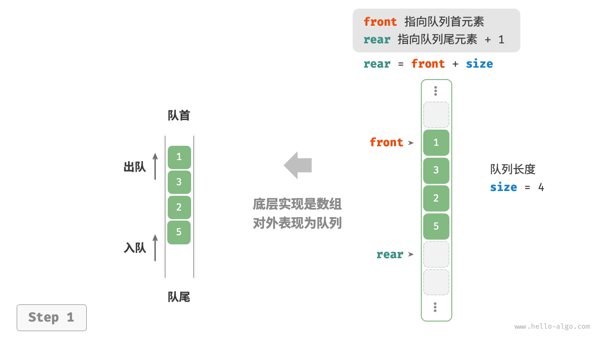

=== "push()"
    

=== "pop()"
    

你可能会发现一个问题：在不断进行入队和出队的过程中，`front` 和 `rear` 都在向右移动，**当它们到达数组尾部时就无法继续移动了**。为了解决此问题，我们可以将数组视为首尾相接的“环形数组”。

对于环形数组，我们需要让 `front` 或 `rear` 在越过数组尾部时，直接回到数组头部继续遍历。这种周期性规律可以通过“取余操作”来实现，代码如下所示：

```python
class ArrayQueue:
    """基于环形数组实现的队列"""

    def __init__(self, size: int):
        """构造方法"""
        self._nums: list[int] = [0] * size  # 用于存储队列元素的数组
        self._front: int = 0  # 队首指针，指向队首元素
        self._size: int = 0  # 队列长度

    def capacity(self) -> int:
        """获取队列的容量"""
        return len(self._nums)

    def size(self) -> int:
        """获取队列的长度"""
        return self._size

    def is_empty(self) -> bool:
        """判断队列是否为空"""
        return self._size == 0

    def push(self, num: int):
        """入队"""
        if self._size == self.capacity():
            raise IndexError("队列已满")
        # 计算队尾指针，指向队尾索引 + 1
        # 通过取余操作实现 rear 越过数组尾部后回到头部
        rear: int = (self._front + self._size) % self.capacity()
        # 将 num 添加至队尾
        self._nums[rear] = num
        self._size += 1

    def pop(self) -> int:
        """出队"""
        num: int = self.peek()
        # 队首指针向后移动一位，若越过尾部，则返回到数组头部
        self._front = (self._front + 1) % self.capacity()
        self._size -= 1
        return num

    def peek(self) -> int:
        """访问队首元素"""
        if self.is_empty():
            raise IndexError("队列为空")
        return self._nums[self._front]

    def to_list(self) -> list[int]:
        """返回列表用于打印"""
        res = [0] * self.size()
        j: int = self._front
        for i in range(self.size()):
            res[i] = self._nums[(j % self.capacity())]
            j += 1
        return res
```

!!! example [pythontutor "可视化运行"](https://pythontutor.com/iframe-embed.html#code=class%20ArrayQueue%3A%0A%20%20%20%20%22%22%22%E5%9F%BA%E4%BA%8E%E7%8E%AF%E5%BD%A2%E6%95%B0%E7%BB%84%E5%AE%9E%E7%8E%B0%E7%9A%84%E9%98%9F%E5%88%97%22%22%22%0A%0A%20%20%20%20def%20__init__%28self,%20size%3A%20int%29%3A%0A%20%20%20%20%20%20%20%20%22%22%22%E6%9E%84%E9%80%A0%E6%96%B9%E6%B3%95%22%22%22%0A%20%20%20%20%20%20%20%20self._nums%3A%20list%5Bint%5D%20%3D%20%5B0%5D%20*%20size%20%20%23%20%E7%94%A8%E4%BA%8E%E5%AD%98%E5%82%A8%E9%98%9F%E5%88%97%E5%85%83%E7%B4%A0%E7%9A%84%E6%95%B0%E7%BB%84%0A%20%20%20%20%20%20%20%20self._front%3A%20int%20%3D%200%20%20%23%20%E9%98%9F%E9%A6%96%E6%8C%87%E9%92%88%EF%BC%8C%E6%8C%87%E5%90%91%E9%98%9F%E9%A6%96%E5%85%83%E7%B4%A0%0A%20%20%20%20%20%20%20%20self._size%3A%20int%20%3D%200%20%20%23%20%E9%98%9F%E5%88%97%E9%95%BF%E5%BA%A6%0A%0A%20%20%20%20def%20capacity%28self%29%20-%3E%20int%3A%0A%20%20%20%20%20%20%20%20%22%22%22%E8%8E%B7%E5%8F%96%E9%98%9F%E5%88%97%E7%9A%84%E5%AE%B9%E9%87%8F%22%22%22%0A%20%20%20%20%20%20%20%20return%20len%28self._nums%29%0A%0A%20%20%20%20def%20size%28self%29%20-%3E%20int%3A%0A%20%20%20%20%20%20%20%20%22%22%22%E8%8E%B7%E5%8F%96%E9%98%9F%E5%88%97%E7%9A%84%E9%95%BF%E5%BA%A6%22%22%22%0A%20%20%20%20%20%20%20%20return%20self._size%0A%0A%20%20%20%20def%20is_empty%28self%29%20-%3E%20bool%3A%0A%20%20%20%20%20%20%20%20%22%22%22%E5%88%A4%E6%96%AD%E9%98%9F%E5%88%97%E6%98%AF%E5%90%A6%E4%B8%BA%E7%A9%BA%22%22%22%0A%20%20%20%20%20%20%20%20return%20self._size%20%3D%3D%200%0A%0A%20%20%20%20def%20push%28self,%20num%3A%20int%29%3A%0A%20%20%20%20%20%20%20%20%22%22%22%E5%85%A5%E9%98%9F%22%22%22%0A%20%20%20%20%20%20%20%20if%20self._size%20%3D%3D%20self.capacity%28%29%3A%0A%20%20%20%20%20%20%20%20%20%20%20%20raise%20IndexError%28%22%E9%98%9F%E5%88%97%E5%B7%B2%E6%BB%A1%22%29%0A%20%20%20%20%20%20%20%20%23%20%E8%AE%A1%E7%AE%97%E9%98%9F%E5%B0%BE%E6%8C%87%E9%92%88%EF%BC%8C%E6%8C%87%E5%90%91%E9%98%9F%E5%B0%BE%E7%B4%A2%E5%BC%95%20%2B%201%0A%20%20%20%20%20%20%20%20%23%20%E9%80%9A%E8%BF%87%E5%8F%96%E4%BD%99%E6%93%8D%E4%BD%9C%E5%AE%9E%E7%8E%B0%20rear%20%E8%B6%8A%E8%BF%87%E6%95%B0%E7%BB%84%E5%B0%BE%E9%83%A8%E5%90%8E%E5%9B%9E%E5%88%B0%E5%A4%B4%E9%83%A8%0A%20%20%20%20%20%20%20%20rear%3A%20int%20%3D%20%28self._front%20%2B%20self._size%29%20%25%20self.capacity%28%29%0A%20%20%20%20%20%20%20%20%23%20%E5%B0%86%20num%20%E6%B7%BB%E5%8A%A0%E8%87%B3%E9%98%9F%E5%B0%BE%0A%20%20%20%20%20%20%20%20self._nums%5Brear%5D%20%3D%20num%0A%20%20%20%20%20%20%20%20self._size%20%2B%3D%201%0A%0A%20%20%20%20def%20pop%28self%29%20-%3E%20int%3A%0A%20%20%20%20%20%20%20%20%22%22%22%E5%87%BA%E9%98%9F%22%22%22%0A%20%20%20%20%20%20%20%20num%3A%20int%20%3D%20self.peek%28%29%0A%20%20%20%20%20%20%20%20%23%20%E9%98%9F%E9%A6%96%E6%8C%87%E9%92%88%E5%90%91%E5%90%8E%E7%A7%BB%E5%8A%A8%E4%B8%80%E4%BD%8D%EF%BC%8C%E8%8B%A5%E8%B6%8A%E8%BF%87%E5%B0%BE%E9%83%A8%EF%BC%8C%E5%88%99%E8%BF%94%E5%9B%9E%E5%88%B0%E6%95%B0%E7%BB%84%E5%A4%B4%E9%83%A8%0A%20%20%20%20%20%20%20%20self._front%20%3D%20%28self._front%20%2B%201%29%20%25%20self.capacity%28%29%0A%20%20%20%20%20%20%20%20self._size%20-%3D%201%0A%20%20%20%20%20%20%20%20return%20num%0A%0A%20%20%20%20def%20peek%28self%29%20-%3E%20int%3A%0A%20%20%20%20%20%20%20%20%22%22%22%E8%AE%BF%E9%97%AE%E9%98%9F%E9%A6%96%E5%85%83%E7%B4%A0%22%22%22%0A%20%20%20%20%20%20%20%20if%20self.is_empty%28%29%3A%0A%20%20%20%20%20%20%20%20%20%20%20%20raise%20IndexError%28%22%E9%98%9F%E5%88%97%E4%B8%BA%E7%A9%BA%22%29%0A%20%20%20%20%20%20%20%20return%20self._nums%5Bself._front%5D%0A%0A%20%20%20%20def%20to_list%28self%29%20-%3E%20list%5Bint%5D%3A%0A%20%20%20%20%20%20%20%20%22%22%22%E8%BF%94%E5%9B%9E%E5%88%97%E8%A1%A8%E7%94%A8%E4%BA%8E%E6%89%93%E5%8D%B0%22%22%22%0A%20%20%20%20%20%20%20%20res%20%3D%20%5B0%5D%20*%20self.size%28%29%0A%20%20%20%20%20%20%20%20j%3A%20int%20%3D%20self._front%0A%20%20%20%20%20%20%20%20for%20i%20in%20range%28self.size%28%29%29%3A%0A%20%20%20%20%20%20%20%20%20%20%20%20res%5Bi%5D%20%3D%20self._nums%5B%28j%20%25%20self.capacity%28%29%29%5D%0A%20%20%20%20%20%20%20%20%20%20%20%20j%20%2B%3D%201%0A%20%20%20%20%20%20%20%20return%20res%0A%0A%0A%22%22%22Driver%20Code%22%22%22%0Aif%20__name__%20%3D%3D%20%22__main__%22%3A%0A%20%20%20%20%23%20%E5%88%9D%E5%A7%8B%E5%8C%96%E9%98%9F%E5%88%97%0A%20%20%20%20queue%20%3D%20ArrayQueue%2810%29%0A%0A%20%20%20%20%23%20%E5%85%83%E7%B4%A0%E5%85%A5%E9%98%9F%0A%20%20%20%20queue.push%281%29%0A%20%20%20%20queue.push%283%29%0A%20%20%20%20queue.push%282%29%0A%20%20%20%20queue.push%285%29%0A%20%20%20%20queue.push%284%29%0A%0A%20%20%20%20%23%20%E8%AE%BF%E9%97%AE%E9%98%9F%E9%A6%96%E5%85%83%E7%B4%A0%0A%20%20%20%20peek%20%3D%20queue.peek%28%29%0A%20%20%20%20print%28%22%E9%98%9F%E9%A6%96%E5%85%83%E7%B4%A0%20peek%20%3D%22,%20peek%29%0A%0A%20%20%20%20%23%20%E5%85%83%E7%B4%A0%E5%87%BA%E9%98%9F%0A%20%20%20%20pop%20%3D%20queue.pop%28%29%0A%20%20%20%20print%28%22%E5%87%BA%E9%98%9F%E5%85%83%E7%B4%A0%20pop%20%3D%22,%20pop%29%0A%0A%20%20%20%20%23%20%E8%8E%B7%E5%8F%96%E9%98%9F%E5%88%97%E7%9A%84%E9%95%BF%E5%BA%A6%0A%20%20%20%20size%20%3D%20queue.size%28%29%0A%20%20%20%20print%28%22%E9%98%9F%E5%88%97%E9%95%BF%E5%BA%A6%20size%20%3D%22,%20size%29%0A%0A%20%20%20%20%23%20%E5%88%A4%E6%96%AD%E9%98%9F%E5%88%97%E6%98%AF%E5%90%A6%E4%B8%BA%E7%A9%BA%0A%20%20%20%20is_empty%20%3D%20queue.is_empty%28%29%0A%20%20%20%20print%28%22%E9%98%9F%E5%88%97%E6%98%AF%E5%90%A6%E4%B8%BA%E7%A9%BA%20%3D%22,%20is_empty%29&codeDivHeight=800&codeDivWidth=600&cumulative=false&curInstr=3&heapPrimitives=nevernest&origin=opt-frontend.js&py=311&rawInputLstJSON=%5B%5D&textReferences=false)

以上实现的队列仍然具有局限性：其长度不可变。然而，这个问题不难解决，我们可以将数组替换为动态数组，从而引入扩容机制。有兴趣的读者可以尝试自行实现。

两种实现的对比结论与栈一致，在此不再赘述。

## 队列典型应用

- **淘宝订单**。购物者下单后，订单将加入队列中，系统随后会根据顺序处理队列中的订单。在双十一期间，短时间内会产生海量订单，高并发成为工程师们需要重点攻克的问题。
- **各类待办事项**。任何需要实现“先来后到”功能的场景，例如打印机的任务队列、餐厅的出餐队列等，队列在这些场景中可以有效地维护处理顺序。

# 双向队列

在队列中，我们仅能删除头部元素或在尾部添加元素。如下图所示，<u>双向队列（double-ended queue）</u>提供了更高的灵活性，允许在头部和尾部执行元素的添加或删除操作。


## 双向队列常用操作

双向队列的常用操作如下表所示，具体的方法名称需要根据所使用的编程语言来确定。

<p align="center"> 表 <id> &nbsp; 双向队列操作效率 </p>

| 方法名         | 描述             | 时间复杂度 |
| -------------- | ---------------- | ---------- |
| `push_first()` | 将元素添加至队首 | $O(1)$     |
| `push_last()`  | 将元素添加至队尾 | $O(1)$     |
| `pop_first()`  | 删除队首元素     | $O(1)$     |
| `pop_last()`   | 删除队尾元素     | $O(1)$     |
| `peek_first()` | 访问队首元素     | $O(1)$     |
| `peek_last()`  | 访问队尾元素     | $O(1)$     |

同样地，我们可以直接使用编程语言中已实现的双向队列类：

```python
from collections import deque

# 初始化双向队列
deq: deque[int] = deque()

# 元素入队
deq.append(2)      # 添加至队尾
deq.append(5)
deq.append(4)
deq.appendleft(3)  # 添加至队首
deq.appendleft(1)

# 访问元素
front: int = deq[0]  # 队首元素
rear: int = deq[-1]  # 队尾元素

# 元素出队
pop_front: int = deq.popleft()  # 队首元素出队
pop_rear: int = deq.pop()       # 队尾元素出队

# 获取双向队列的长度
size: int = len(deq)

# 判断双向队列是否为空
is_empty: bool = len(deq) == 0
```

!!! example [pythontutor "可视化运行"](https://pythontutor.com/iframe-embed.html#code=from%20collections%20import%20deque%0A%0A%22%22%22Driver%20Code%22%22%22%0Aif%20__name__%20%3D%3D%20%22__main__%22%3A%0A%20%20%20%20%23%20%E5%88%9D%E5%A7%8B%E5%8C%96%E5%8F%8C%E5%90%91%E9%98%9F%E5%88%97%0A%20%20%20%20deq%20%3D%20deque%28%29%0A%0A%20%20%20%20%23%20%E5%85%83%E7%B4%A0%E5%85%A5%E9%98%9F%0A%20%20%20%20deq.append%282%29%20%20%23%20%E6%B7%BB%E5%8A%A0%E8%87%B3%E9%98%9F%E5%B0%BE%0A%20%20%20%20deq.append%285%29%0A%20%20%20%20deq.append%284%29%0A%20%20%20%20deq.appendleft%283%29%20%20%23%20%E6%B7%BB%E5%8A%A0%E8%87%B3%E9%98%9F%E9%A6%96%0A%20%20%20%20deq.appendleft%281%29%0A%20%20%20%20print%28%22%E5%8F%8C%E5%90%91%E9%98%9F%E5%88%97%20deque%20%3D%22,%20deq%29%0A%0A%20%20%20%20%23%20%E8%AE%BF%E9%97%AE%E5%85%83%E7%B4%A0%0A%20%20%20%20front%20%3D%20deq%5B0%5D%20%20%23%20%E9%98%9F%E9%A6%96%E5%85%83%E7%B4%A0%0A%20%20%20%20print%28%22%E9%98%9F%E9%A6%96%E5%85%83%E7%B4%A0%20front%20%3D%22,%20front%29%0A%20%20%20%20rear%20%3D%20deq%5B-1%5D%20%20%23%20%E9%98%9F%E5%B0%BE%E5%85%83%E7%B4%A0%0A%20%20%20%20print%28%22%E9%98%9F%E5%B0%BE%E5%85%83%E7%B4%A0%20rear%20%3D%22,%20rear%29%0A%0A%20%20%20%20%23%20%E5%85%83%E7%B4%A0%E5%87%BA%E9%98%9F%0A%20%20%20%20pop_front%20%3D%20deq.popleft%28%29%20%20%23%20%E9%98%9F%E9%A6%96%E5%85%83%E7%B4%A0%E5%87%BA%E9%98%9F%0A%20%20%20%20print%28%22%E9%98%9F%E9%A6%96%E5%87%BA%E9%98%9F%E5%85%83%E7%B4%A0%20%20pop_front%20%3D%22,%20pop_front%29%0A%20%20%20%20print%28%22%E9%98%9F%E9%A6%96%E5%87%BA%E9%98%9F%E5%90%8E%20deque%20%3D%22,%20deq%29%0A%20%20%20%20pop_rear%20%3D%20deq.pop%28%29%20%20%23%20%E9%98%9F%E5%B0%BE%E5%85%83%E7%B4%A0%E5%87%BA%E9%98%9F%0A%20%20%20%20print%28%22%E9%98%9F%E5%B0%BE%E5%87%BA%E9%98%9F%E5%85%83%E7%B4%A0%20%20pop_rear%20%3D%22,%20pop_rear%29%0A%20%20%20%20print%28%22%E9%98%9F%E5%B0%BE%E5%87%BA%E9%98%9F%E5%90%8E%20deque%20%3D%22,%20deq%29%0A%0A%20%20%20%20%23%20%E8%8E%B7%E5%8F%96%E5%8F%8C%E5%90%91%E9%98%9F%E5%88%97%E7%9A%84%E9%95%BF%E5%BA%A6%0A%20%20%20%20size%20%3D%20len%28deq%29%0A%20%20%20%20print%28%22%E5%8F%8C%E5%90%91%E9%98%9F%E5%88%97%E9%95%BF%E5%BA%A6%20size%20%3D%22,%20size%29%0A%0A%20%20%20%20%23%20%E5%88%A4%E6%96%AD%E5%8F%8C%E5%90%91%E9%98%9F%E5%88%97%E6%98%AF%E5%90%A6%E4%B8%BA%E7%A9%BA%0A%20%20%20%20is_empty%20%3D%20len%28deq%29%20%3D%3D%200%0A%20%20%20%20print%28%22%E5%8F%8C%E5%90%91%E9%98%9F%E5%88%97%E6%98%AF%E5%90%A6%E4%B8%BA%E7%A9%BA%20%3D%22,%20is_empty%29&codeDivHeight=800&codeDivWidth=600&cumulative=false&curInstr=3&heapPrimitives=nevernest&origin=opt-frontend.js&py=311&rawInputLstJSON=%5B%5D&textReferences=false)

## 双向队列实现

双向队列的实现与队列类似，可以选择链表或数组作为底层数据结构。

### 基于双向链表的实现

回顾上一节内容，我们使用普通单向链表来实现队列，因为它可以方便地删除头节点（对应出队操作）和在尾节点后添加新节点（对应入队操作）。

对于双向队列而言，头部和尾部都可以执行入队和出队操作。换句话说，双向队列需要实现另一个对称方向的操作。为此，我们采用“双向链表”作为双向队列的底层数据结构。

如下图所示，我们将双向链表的头节点和尾节点视为双向队列的队首和队尾，同时实现在两端添加和删除节点的功能。

=== "LinkedListDeque"
    

=== "push_last()"
    

=== "push_first()"
    

=== "pop_last()"
    

=== "pop_first()"
    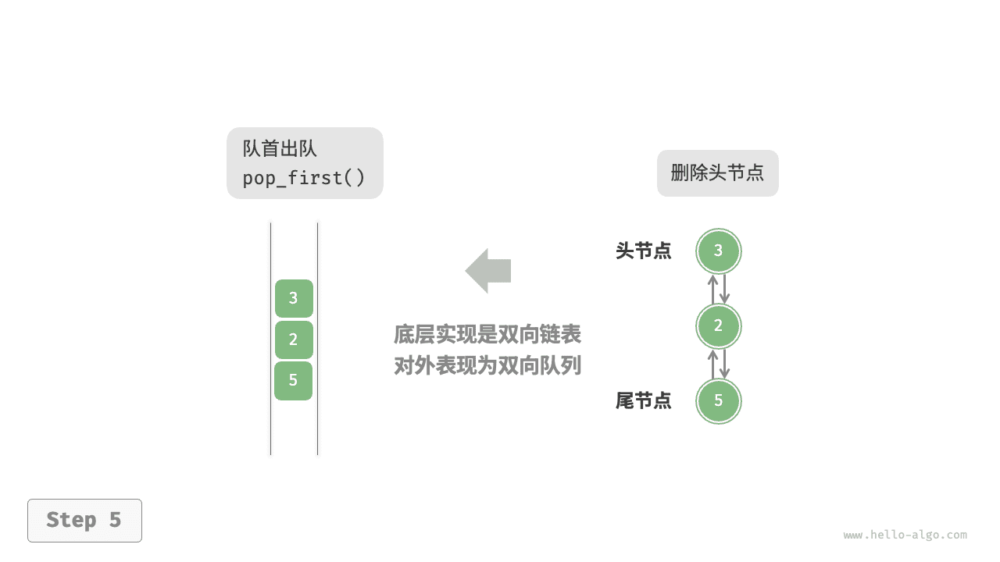

实现代码如下所示：

```python
class ListNode:
    """双向链表节点"""

    def __init__(self, val: int):
        """构造方法"""
        self.val: int = val
        self.next: ListNode | None = None  # 后继节点引用
        self.prev: ListNode | None = None  # 前驱节点引用

class LinkedListDeque:
    """基于双向链表实现的双向队列"""

    def __init__(self):
        """构造方法"""
        self._front: ListNode | None = None  # 头节点 front
        self._rear: ListNode | None = None  # 尾节点 rear
        self._size: int = 0  # 双向队列的长度

    def size(self) -> int:
        """获取双向队列的长度"""
        return self._size

    def is_empty(self) -> bool:
        """判断双向队列是否为空"""
        return self._size == 0

    def push(self, num: int, is_front: bool):
        """入队操作"""
        node = ListNode(num)
        # 若链表为空，则令 front 和 rear 都指向 node
        if self.is_empty():
            self._front = self._rear = node
        # 队首入队操作
        elif is_front:
            # 将 node 添加至链表头部
            self._front.prev = node
            node.next = self._front
            self._front = node  # 更新头节点
        # 队尾入队操作
        else:
            # 将 node 添加至链表尾部
            self._rear.next = node
            node.prev = self._rear
            self._rear = node  # 更新尾节点
        self._size += 1  # 更新队列长度

    def push_first(self, num: int):
        """队首入队"""
        self.push(num, True)

    def push_last(self, num: int):
        """队尾入队"""
        self.push(num, False)

    def pop(self, is_front: bool) -> int:
        """出队操作"""
        if self.is_empty():
            raise IndexError("双向队列为空")
        # 队首出队操作
        if is_front:
            val: int = self._front.val  # 暂存头节点值
            # 删除头节点
            fnext: ListNode | None = self._front.next
            if fnext is not None:
                fnext.prev = None
                self._front.next = None
            self._front = fnext  # 更新头节点
        # 队尾出队操作
        else:
            val: int = self._rear.val  # 暂存尾节点值
            # 删除尾节点
            rprev: ListNode | None = self._rear.prev
            if rprev is not None:
                rprev.next = None
                self._rear.prev = None
            self._rear = rprev  # 更新尾节点
        self._size -= 1  # 更新队列长度
        return val

    def pop_first(self) -> int:
        """队首出队"""
        return self.pop(True)

    def pop_last(self) -> int:
        """队尾出队"""
        return self.pop(False)

    def peek_first(self) -> int:
        """访问队首元素"""
        if self.is_empty():
            raise IndexError("双向队列为空")
        return self._front.val

    def peek_last(self) -> int:
        """访问队尾元素"""
        if self.is_empty():
            raise IndexError("双向队列为空")
        return self._rear.val

    def to_array(self) -> list[int]:
        """返回数组用于打印"""
        node = self._front
        res = [0] * self.size()
        for i in range(self.size()):
            res[i] = node.val
            node = node.next
        return res
```

### 基于数组的实现

如下图所示，与基于数组实现队列类似，我们也可以使用环形数组来实现双向队列。

=== "ArrayDeque"
    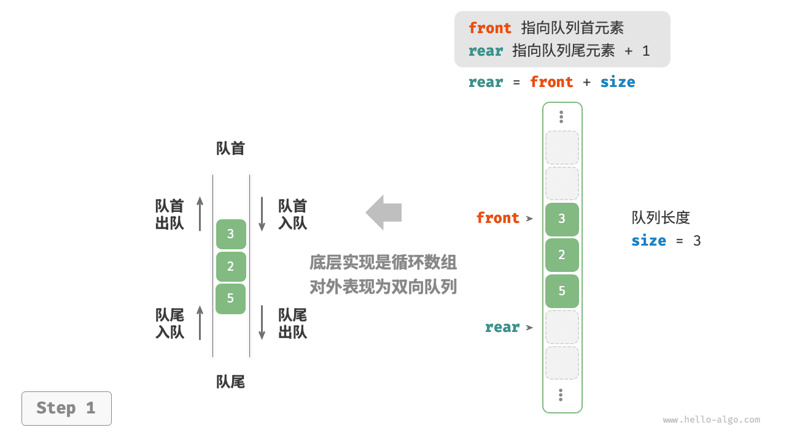

=== "push_last()"
    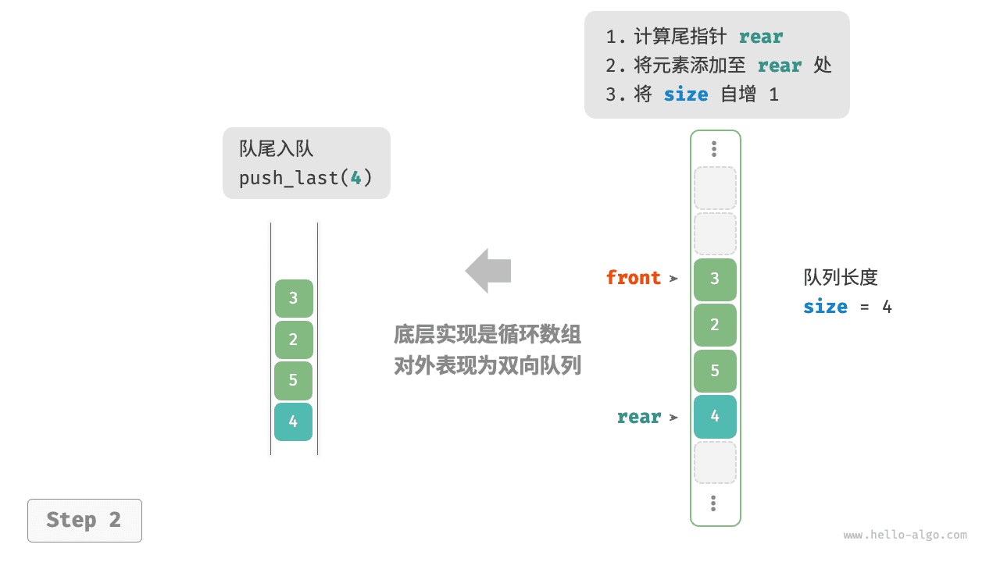

=== "push_first()"
    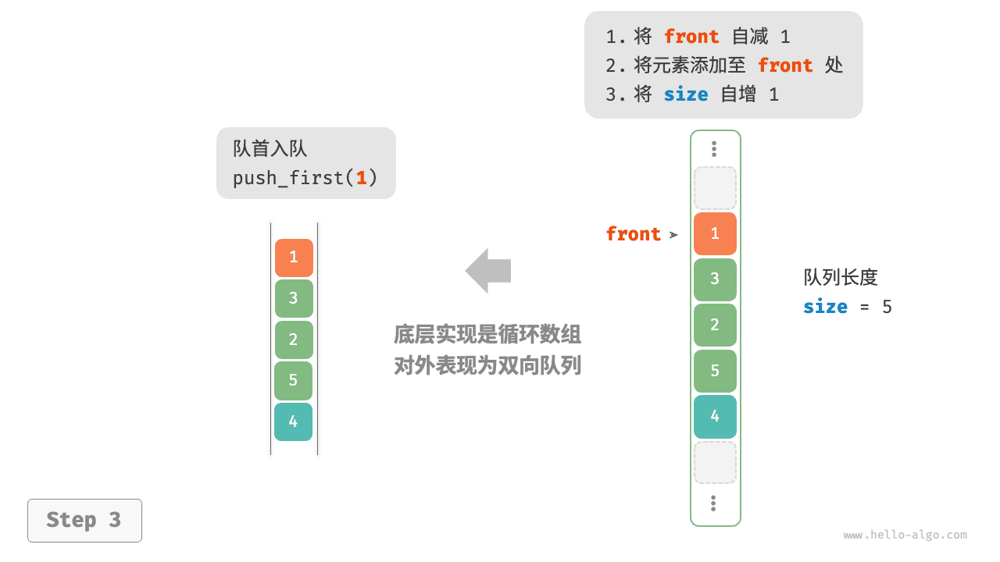

=== "pop_last()"
    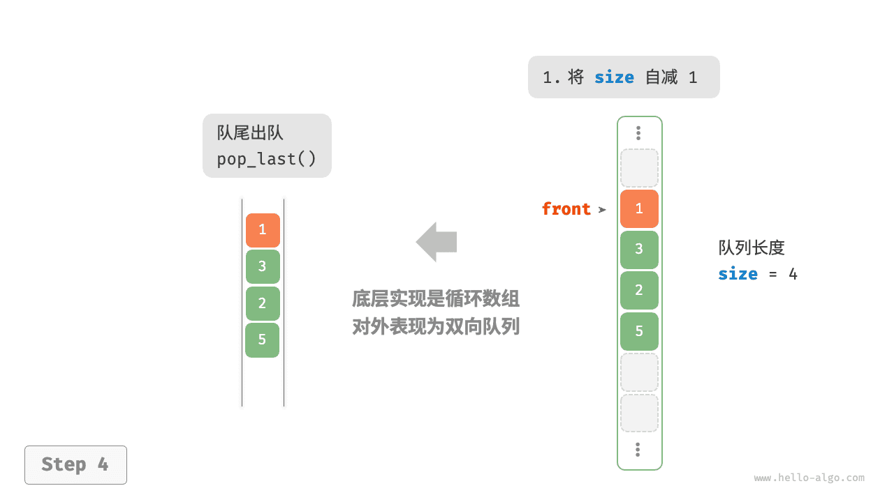

=== "pop_first()"
    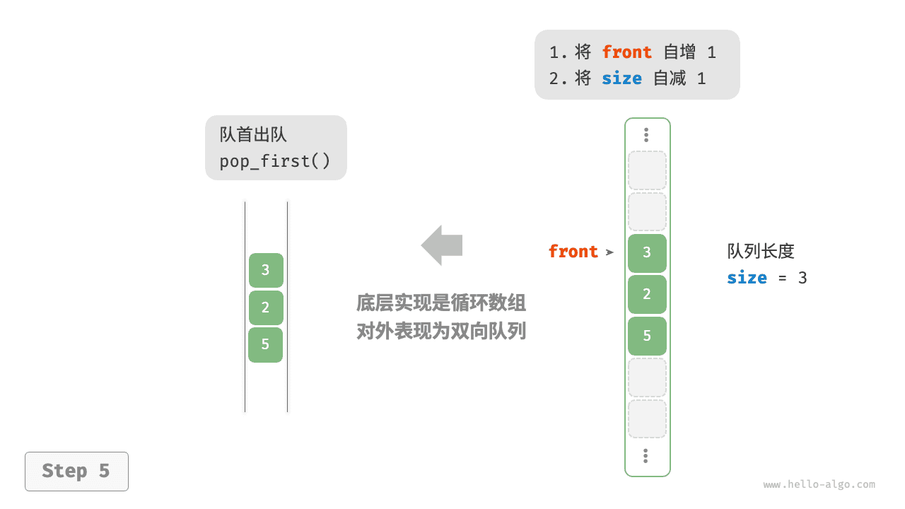

在队列的实现基础上，仅需增加“队首入队”和“队尾出队”的方法：

```python
class ArrayDeque:
    """基于环形数组实现的双向队列"""

    def __init__(self, capacity: int):
        """构造方法"""
        self._nums: list[int] = [0] * capacity
        self._front: int = 0
        self._size: int = 0

    def capacity(self) -> int:
        """获取双向队列的容量"""
        return len(self._nums)

    def size(self) -> int:
        """获取双向队列的长度"""
        return self._size

    def is_empty(self) -> bool:
        """判断双向队列是否为空"""
        return self._size == 0

    def index(self, i: int) -> int:
        """计算环形数组索引"""
        # 通过取余操作实现数组首尾相连
        # 当 i 越过数组尾部后，回到头部
        # 当 i 越过数组头部后，回到尾部
        return (i + self.capacity()) % self.capacity()

    def push_first(self, num: int):
        """队首入队"""
        if self._size == self.capacity():
            print("双向队列已满")
            return
        # 队首指针向左移动一位
        # 通过取余操作实现 front 越过数组头部后回到尾部
        self._front = self.index(self._front - 1)
        # 将 num 添加至队首
        self._nums[self._front] = num
        self._size += 1

    def push_last(self, num: int):
        """队尾入队"""
        if self._size == self.capacity():
            print("双向队列已满")
            return
        # 计算队尾指针，指向队尾索引 + 1
        rear = self.index(self._front + self._size)
        # 将 num 添加至队尾
        self._nums[rear] = num
        self._size += 1

    def pop_first(self) -> int:
        """队首出队"""
        num = self.peek_first()
        # 队首指针向后移动一位
        self._front = self.index(self._front + 1)
        self._size -= 1
        return num

    def pop_last(self) -> int:
        """队尾出队"""
        num = self.peek_last()
        self._size -= 1
        return num

    def peek_first(self) -> int:
        """访问队首元素"""
        if self.is_empty():
            raise IndexError("双向队列为空")
        return self._nums[self._front]

    def peek_last(self) -> int:
        """访问队尾元素"""
        if self.is_empty():
            raise IndexError("双向队列为空")
        # 计算尾元素索引
        last = self.index(self._front + self._size - 1)
        return self._nums[last]

    def to_array(self) -> list[int]:
        """返回数组用于打印"""
        # 仅转换有效长度范围内的列表元素
        res = []
        for i in range(self._size):
            res.append(self._nums[self.index(self._front + i)])
        return res
```

## 双向队列应用

双向队列兼具栈与队列的逻辑，**因此它可以实现这两者的所有应用场景，同时提供更高的自由度**。

我们知道，软件的“撤销”功能通常使用栈来实现：系统将每次更改操作 `push` 到栈中，然后通过 `pop` 实现撤销。然而，考虑到系统资源的限制，软件通常会限制撤销的步数（例如仅允许保存 $50$ 步）。当栈的长度超过 $50$ 时，软件需要在栈底（队首）执行删除操作。**但栈无法实现该功能，此时就需要使用双向队列来替代栈**。请注意，“撤销”的核心逻辑仍然遵循栈的先入后出原则，只是双向队列能够更加灵活地实现一些额外逻辑。

# 小结

### 重点回顾

- 栈是一种遵循先入后出原则的数据结构，可通过数组或链表来实现。
- 在时间效率方面，栈的数组实现具有较高的平均效率，但在扩容过程中，单次入栈操作的时间复杂度会劣化至 $O(n)$ 。相比之下，栈的链表实现具有更为稳定的效率表现。
- 在空间效率方面，栈的数组实现可能导致一定程度的空间浪费。但需要注意的是，链表节点所占用的内存空间比数组元素更大。
- 队列是一种遵循先入先出原则的数据结构，同样可以通过数组或链表来实现。在时间效率和空间效率的对比上，队列的结论与前述栈的结论相似。
- 双向队列是一种具有更高自由度的队列，它允许在两端进行元素的添加和删除操作。

### Q & A

**Q**：浏览器的前进后退是否是双向链表实现？

浏览器的前进后退功能本质上是“栈”的体现。当用户访问一个新页面时，该页面会被添加到栈顶；当用户点击后退按钮时，该页面会从栈顶弹出。使用双向队列可以方便地实现一些额外操作，这个在“双向队列”章节有提到。

**Q**：在出栈后，是否需要释放出栈节点的内存？

如果后续仍需要使用弹出节点，则不需要释放内存。若之后不需要用到，`Java` 和 `Python` 等语言拥有自动垃圾回收机制，因此不需要手动释放内存；在 `C` 和 `C++` 中需要手动释放内存。

**Q**：双向队列像是两个栈拼接在了一起，它的用途是什么？

双向队列就像是栈和队列的组合或两个栈拼在了一起。它表现的是栈 + 队列的逻辑，因此可以实现栈与队列的所有应用，并且更加灵活。

**Q**：撤销（undo）和反撤销（redo）具体是如何实现的？

使用两个栈，栈 `A` 用于撤销，栈 `B` 用于反撤销。

1. 每当用户执行一个操作，将这个操作压入栈 `A` ，并清空栈 `B` 。
2. 当用户执行“撤销”时，从栈 `A` 中弹出最近的操作，并将其压入栈 `B` 。
3. 当用户执行“反撤销”时，从栈 `B` 中弹出最近的操作，并将其压入栈 `A` 。
