# 堆

!!! abstract

    堆就像是山岳峰峦，层叠起伏、形态各异。
    
    座座山峰高低错落，而最高的山峰总是最先映入眼帘。

# 堆

<u>堆（heap）</u>是一种满足特定条件的完全二叉树，主要可分为两种类型，如下图所示。

- <u>小顶堆（min heap）</u>：任意节点的值 $\leq$ 其子节点的值。
- <u>大顶堆（max heap）</u>：任意节点的值 $\geq$ 其子节点的值。

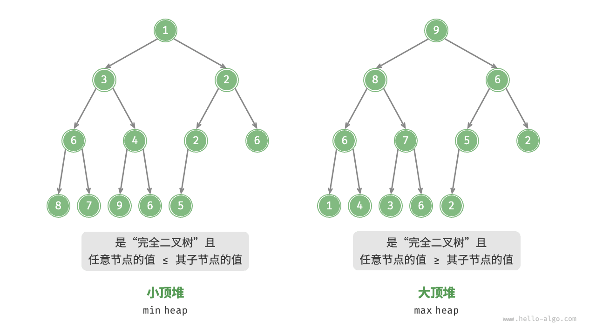

堆作为完全二叉树的一个特例，具有以下特性。

- 最底层节点靠左填充，其他层的节点都被填满。
- 我们将二叉树的根节点称为“堆顶”，将底层最靠右的节点称为“堆底”。
- 对于大顶堆（小顶堆），堆顶元素（根节点）的值是最大（最小）的。

## 堆的常用操作

需要指出的是，许多编程语言提供的是<u>优先队列（priority queue）</u>，这是一种抽象的数据结构，定义为具有优先级排序的队列。

实际上，**堆通常用于实现优先队列，大顶堆相当于元素按从大到小的顺序出队的优先队列**。从使用角度来看，我们可以将“优先队列”和“堆”看作等价的数据结构。因此，本书对两者不做特别区分，统一称作“堆”。

堆的常用操作见下表，方法名需要根据编程语言来确定。

<p align="center"> 表 <id> &nbsp; 堆的操作效率 </p>

| 方法名      | 描述                                             | 时间复杂度  |
| ----------- | ------------------------------------------------ | ----------- |
| `push()`    | 元素入堆                                         | $O(\log n)$ |
| `pop()`     | 堆顶元素出堆                                     | $O(\log n)$ |
| `peek()`    | 访问堆顶元素（对于大 / 小顶堆分别为最大 / 小值） | $O(1)$      |
| `size()`    | 获取堆的元素数量                                 | $O(1)$      |
| `isEmpty()` | 判断堆是否为空                                   | $O(1)$      |

在实际应用中，我们可以直接使用编程语言提供的堆类（或优先队列类）。

类似于排序算法中的“从小到大排列”和“从大到小排列”，我们可以通过设置一个 `flag` 或修改 `Comparator` 实现“小顶堆”与“大顶堆”之间的转换。代码如下所示：

```python
# 初始化小顶堆
min_heap, flag = [], 1
# 初始化大顶堆
max_heap, flag = [], -1

# Python 的 heapq 模块默认实现小顶堆
# 考虑将“元素取负”后再入堆，这样就可以将大小关系颠倒，从而实现大顶堆
# 在本示例中，flag = 1 时对应小顶堆，flag = -1 时对应大顶堆

# 元素入堆
heapq.heappush(max_heap, flag * 1)
heapq.heappush(max_heap, flag * 3)
heapq.heappush(max_heap, flag * 2)
heapq.heappush(max_heap, flag * 5)
heapq.heappush(max_heap, flag * 4)

# 获取堆顶元素
peek: int = flag * max_heap[0] # 5

# 堆顶元素出堆
# 出堆元素会形成一个从大到小的序列
val = flag * heapq.heappop(max_heap) # 5
val = flag * heapq.heappop(max_heap) # 4
val = flag * heapq.heappop(max_heap) # 3
val = flag * heapq.heappop(max_heap) # 2
val = flag * heapq.heappop(max_heap) # 1

# 获取堆大小
size: int = len(max_heap)

# 判断堆是否为空
is_empty: bool = not max_heap

# 输入列表并建堆
min_heap: list[int] = [1, 3, 2, 5, 4]
heapq.heapify(min_heap)
```

!!! example [pythontutor "可视化运行"](https://pythontutor.com/iframe-embed.html#code=import%20heapq%0A%0A%22%22%22Driver%20Code%22%22%22%0Aif%20__name__%20%3D%3D%20%22__main__%22%3A%0A%20%20%20%20%23%20%E5%88%9D%E5%A7%8B%E5%8C%96%E5%B0%8F%E9%A1%B6%E5%A0%86%0A%20%20%20%20min_heap,%20flag%20%3D%20%5B%5D,%201%0A%20%20%20%20%23%20%E5%88%9D%E5%A7%8B%E5%8C%96%E5%A4%A7%E9%A1%B6%E5%A0%86%0A%20%20%20%20max_heap,%20flag%20%3D%20%5B%5D,%20-1%0A%20%20%20%20%0A%20%20%20%20%23%20Python%20%E7%9A%84%20heapq%20%E6%A8%A1%E5%9D%97%E9%BB%98%E8%AE%A4%E5%AE%9E%E7%8E%B0%E5%B0%8F%E9%A1%B6%E5%A0%86%0A%20%20%20%20%23%20%E8%80%83%E8%99%91%E5%B0%86%E2%80%9C%E5%85%83%E7%B4%A0%E5%8F%96%E8%B4%9F%E2%80%9D%E5%90%8E%E5%86%8D%E5%85%A5%E5%A0%86%EF%BC%8C%E8%BF%99%E6%A0%B7%E5%B0%B1%E5%8F%AF%E4%BB%A5%E5%B0%86%E5%A4%A7%E5%B0%8F%E5%85%B3%E7%B3%BB%E9%A2%A0%E5%80%92%EF%BC%8C%E4%BB%8E%E8%80%8C%E5%AE%9E%E7%8E%B0%E5%A4%A7%E9%A1%B6%E5%A0%86%0A%20%20%20%20%23%20%E5%9C%A8%E6%9C%AC%E7%A4%BA%E4%BE%8B%E4%B8%AD%EF%BC%8Cflag%20%3D%201%20%E6%97%B6%E5%AF%B9%E5%BA%94%E5%B0%8F%E9%A1%B6%E5%A0%86%EF%BC%8Cflag%20%3D%20-1%20%E6%97%B6%E5%AF%B9%E5%BA%94%E5%A4%A7%E9%A1%B6%E5%A0%86%0A%20%20%20%20%0A%20%20%20%20%23%20%E5%85%83%E7%B4%A0%E5%85%A5%E5%A0%86%0A%20%20%20%20heapq.heappush%28max_heap,%20flag%20*%201%29%0A%20%20%20%20heapq.heappush%28max_heap,%20flag%20*%203%29%0A%20%20%20%20heapq.heappush%28max_heap,%20flag%20*%202%29%0A%20%20%20%20heapq.heappush%28max_heap,%20flag%20*%205%29%0A%20%20%20%20heapq.heappush%28max_heap,%20flag%20*%204%29%0A%20%20%20%20%0A%20%20%20%20%23%20%E8%8E%B7%E5%8F%96%E5%A0%86%E9%A1%B6%E5%85%83%E7%B4%A0%0A%20%20%20%20peek%20%3D%20flag%20*%20max_heap%5B0%5D%20%23%205%0A%20%20%20%20%0A%20%20%20%20%23%20%E5%A0%86%E9%A1%B6%E5%85%83%E7%B4%A0%E5%87%BA%E5%A0%86%0A%20%20%20%20%23%20%E5%87%BA%E5%A0%86%E5%85%83%E7%B4%A0%E4%BC%9A%E5%BD%A2%E6%88%90%E4%B8%80%E4%B8%AA%E4%BB%8E%E5%A4%A7%E5%88%B0%E5%B0%8F%E7%9A%84%E5%BA%8F%E5%88%97%0A%20%20%20%20val%20%3D%20flag%20*%20heapq.heappop%28max_heap%29%20%23%205%0A%20%20%20%20val%20%3D%20flag%20*%20heapq.heappop%28max_heap%29%20%23%204%0A%20%20%20%20val%20%3D%20flag%20*%20heapq.heappop%28max_heap%29%20%23%203%0A%20%20%20%20val%20%3D%20flag%20*%20heapq.heappop%28max_heap%29%20%23%202%0A%20%20%20%20val%20%3D%20flag%20*%20heapq.heappop%28max_heap%29%20%23%201%0A%20%20%20%20%0A%20%20%20%20%23%20%E8%8E%B7%E5%8F%96%E5%A0%86%E5%A4%A7%E5%B0%8F%0A%20%20%20%20size%20%3D%20len%28max_heap%29%0A%20%20%20%20%0A%20%20%20%20%23%20%E5%88%A4%E6%96%AD%E5%A0%86%E6%98%AF%E5%90%A6%E4%B8%BA%E7%A9%BA%0A%20%20%20%20is_empty%20%3D%20not%20max_heap%0A%20%20%20%20%0A%20%20%20%20%23%20%E8%BE%93%E5%85%A5%E5%88%97%E8%A1%A8%E5%B9%B6%E5%BB%BA%E5%A0%86%0A%20%20%20%20min_heap%20%3D%20%5B1,%203,%202,%205,%204%5D%0A%20%20%20%20heapq.heapify%28min_heap%29&codeDivHeight=800&codeDivWidth=600&cumulative=false&curInstr=3&heapPrimitives=nevernest&origin=opt-frontend.js&py=311&rawInputLstJSON=%5B%5D&textReferences=false)

## 堆的实现

下文实现的是大顶堆。若要将其转换为小顶堆，只需将所有大小逻辑判断进行逆转（例如，将 $\geq$ 替换为 $\leq$ ）。感兴趣的读者可以自行实现。

### 堆的存储与表示

“二叉树”章节讲过，完全二叉树非常适合用数组来表示。由于堆正是一种完全二叉树，**因此我们将采用数组来存储堆**。

当使用数组表示二叉树时，元素代表节点值，索引代表节点在二叉树中的位置。**节点指针通过索引映射公式来实现**。

如下图所示，给定索引 $i$ ，其左子节点的索引为 $2i + 1$ ，右子节点的索引为 $2i + 2$ ，父节点的索引为 $(i - 1) / 2$（向下整除）。当索引越界时，表示空节点或节点不存在。

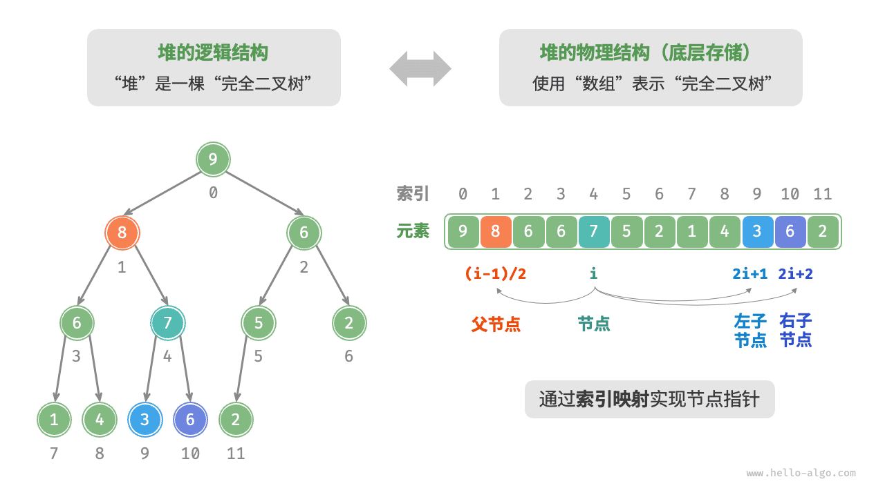

我们可以将索引映射公式封装成函数，方便后续使用：

```python
def left(self, i: int) -> int:
    """获取左子节点的索引"""
    return 2 * i + 1

def right(self, i: int) -> int:
    """获取右子节点的索引"""
    return 2 * i + 2

def parent(self, i: int) -> int:
    """获取父节点的索引"""
    return (i - 1) // 2  # 向下整除
```

### 访问堆顶元素

堆顶元素即为二叉树的根节点，也就是列表的首个元素：

```python
def peek(self) -> int:
    """访问堆顶元素"""
    return self.max_heap[0]
```

!!! example [pythontutor "可视化运行"](https://pythontutor.com/iframe-embed.html#code=class%20MaxHeap%3A%0A%20%20%20%20%22%22%22%E5%A4%A7%E9%A1%B6%E5%A0%86%22%22%22%0A%0A%20%20%20%20def%20__init__%28self,%20nums%3A%20list%5Bint%5D%29%3A%0A%20%20%20%20%20%20%20%20%22%22%22%E6%9E%84%E9%80%A0%E6%96%B9%E6%B3%95%22%22%22%0A%20%20%20%20%20%20%20%20%23%20%E5%B0%86%E5%88%97%E8%A1%A8%E5%85%83%E7%B4%A0%E5%8E%9F%E5%B0%81%E4%B8%8D%E5%8A%A8%E6%B7%BB%E5%8A%A0%E8%BF%9B%E5%A0%86%0A%20%20%20%20%20%20%20%20self.max_heap%20%3D%20nums%0A%0A%20%20%20%20def%20left%28self,%20i%3A%20int%29%20-%3E%20int%3A%0A%20%20%20%20%20%20%20%20%22%22%22%E8%8E%B7%E5%8F%96%E5%B7%A6%E5%AD%90%E8%8A%82%E7%82%B9%E7%9A%84%E7%B4%A2%E5%BC%95%22%22%22%0A%20%20%20%20%20%20%20%20return%202%20*%20i%20%2B%201%0A%0A%20%20%20%20def%20right%28self,%20i%3A%20int%29%20-%3E%20int%3A%0A%20%20%20%20%20%20%20%20%22%22%22%E8%8E%B7%E5%8F%96%E5%8F%B3%E5%AD%90%E8%8A%82%E7%82%B9%E7%9A%84%E7%B4%A2%E5%BC%95%22%22%22%0A%20%20%20%20%20%20%20%20return%202%20*%20i%20%2B%202%0A%0A%20%20%20%20def%20parent%28self,%20i%3A%20int%29%20-%3E%20int%3A%0A%20%20%20%20%20%20%20%20%22%22%22%E8%8E%B7%E5%8F%96%E7%88%B6%E8%8A%82%E7%82%B9%E7%9A%84%E7%B4%A2%E5%BC%95%22%22%22%0A%20%20%20%20%20%20%20%20return%20%28i%20-%201%29%20//%202%20%20%23%20%E5%90%91%E4%B8%8B%E6%95%B4%E9%99%A4%0A%0A%20%20%20%20def%20size%28self%29%20-%3E%20int%3A%0A%20%20%20%20%20%20%20%20%22%22%22%E8%8E%B7%E5%8F%96%E5%A0%86%E5%A4%A7%E5%B0%8F%22%22%22%0A%20%20%20%20%20%20%20%20return%20len%28self.max_heap%29%0A%0A%20%20%20%20def%20is_empty%28self%29%20-%3E%20bool%3A%0A%20%20%20%20%20%20%20%20%22%22%22%E5%88%A4%E6%96%AD%E5%A0%86%E6%98%AF%E5%90%A6%E4%B8%BA%E7%A9%BA%22%22%22%0A%20%20%20%20%20%20%20%20return%20self.size%28%29%20%3D%3D%200%0A%0A%20%20%20%20def%20peek%28self%29%20-%3E%20int%3A%0A%20%20%20%20%20%20%20%20%22%22%22%E8%AE%BF%E9%97%AE%E5%A0%86%E9%A1%B6%E5%85%83%E7%B4%A0%22%22%22%0A%20%20%20%20%20%20%20%20return%20self.max_heap%5B0%5D%0A%0A%0A%22%22%22Driver%20Code%22%22%22%0Aif%20__name__%20%3D%3D%20%22__main__%22%3A%0A%20%20%20%20%23%20%E5%88%9D%E5%A7%8B%E5%8C%96%E5%A4%A7%E9%A1%B6%E5%A0%86%0A%20%20%20%20%23%20%E8%AF%B7%E6%B3%A8%E6%84%8F%EF%BC%8C%E8%BE%93%E5%85%A5%E6%95%B0%E7%BB%84%E5%B7%B2%E7%BB%8F%E6%98%AF%E4%B8%80%E4%B8%AA%E5%B7%B2%E7%BB%8F%E6%98%AF%E4%B8%80%E4%B8%AA%E5%90%88%E6%B3%95%E7%9A%84%E5%A0%86%20%0A%20%20%20%20max_heap%20%3D%20MaxHeap%28%5B9,%208,%206,%206,%207,%205,%202,%201,%204,%203,%206,%202%5D%29%0A%0A%20%20%20%20%23%20%E8%8E%B7%E5%8F%96%E5%A0%86%E9%A1%B6%E5%85%83%E7%B4%A0%0A%20%20%20%20peek%20%3D%20max_heap.peek%28%29%0A%20%20%20%20print%28f%22%5Cn%E5%A0%86%E9%A1%B6%E5%85%83%E7%B4%A0%E4%B8%BA%20%7Bpeek%7D%22%29&codeDivHeight=800&codeDivWidth=600&cumulative=false&curInstr=7&heapPrimitives=nevernest&origin=opt-frontend.js&py=311&rawInputLstJSON=%5B%5D&textReferences=false)

### 元素入堆

给定元素 `val` ，我们首先将其添加到堆底。添加之后，由于 `val` 可能大于堆中其他元素，堆的成立条件可能已被破坏，**因此需要修复从插入节点到根节点的路径上的各个节点**，这个操作被称为<u>堆化（heapify）</u>。

考虑从入堆节点开始，**从底至顶执行堆化**。如下图所示，我们比较插入节点与其父节点的值，如果插入节点更大，则将它们交换。然后继续执行此操作，从底至顶修复堆中的各个节点，直至越过根节点或遇到无须交换的节点时结束。

=== "<1>"
    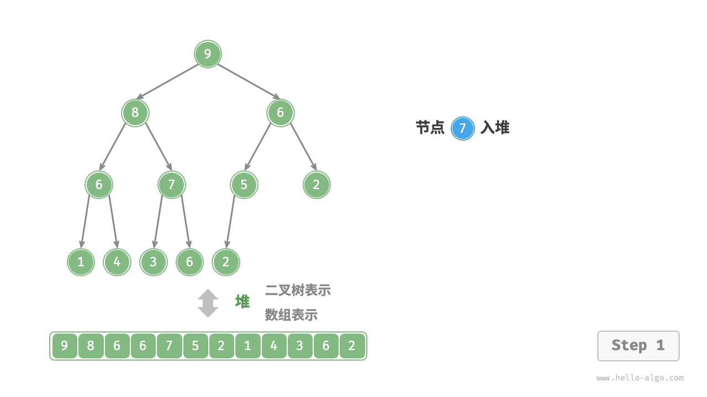

=== "<2>"
    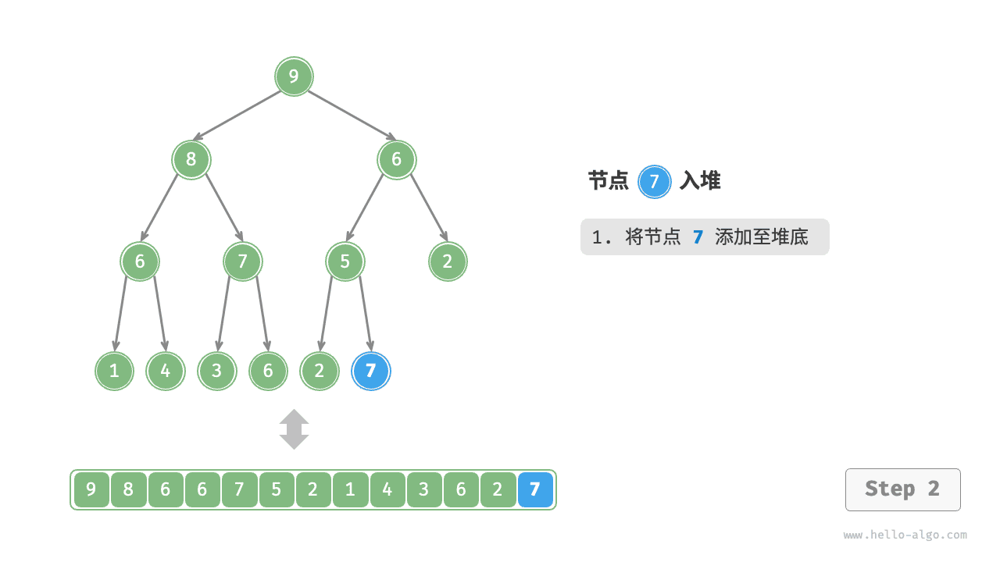

=== "<3>"
    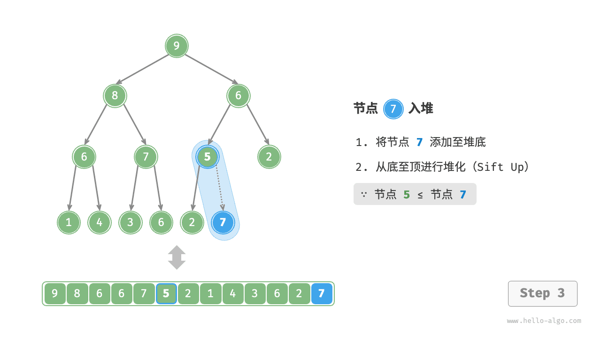

=== "<4>"
    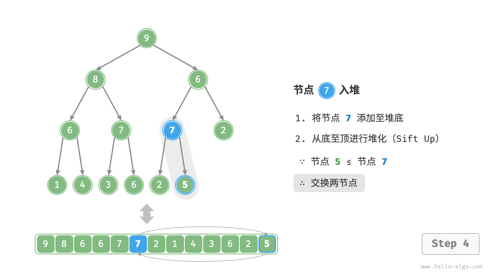

=== "<5>"
    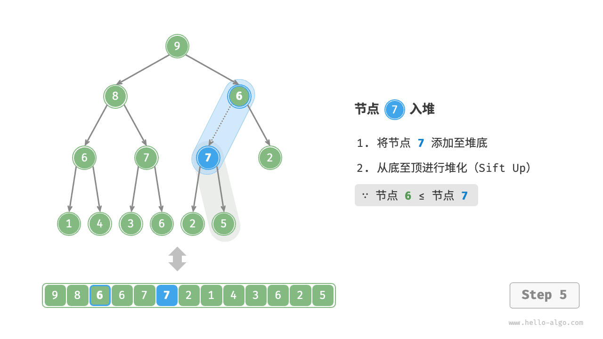

=== "<6>"
    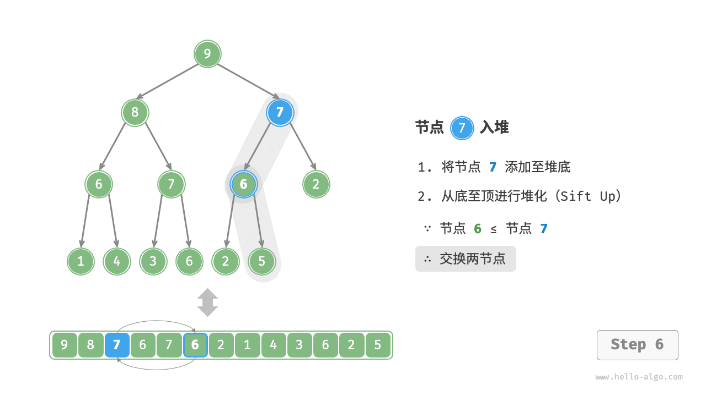

=== "<7>"
    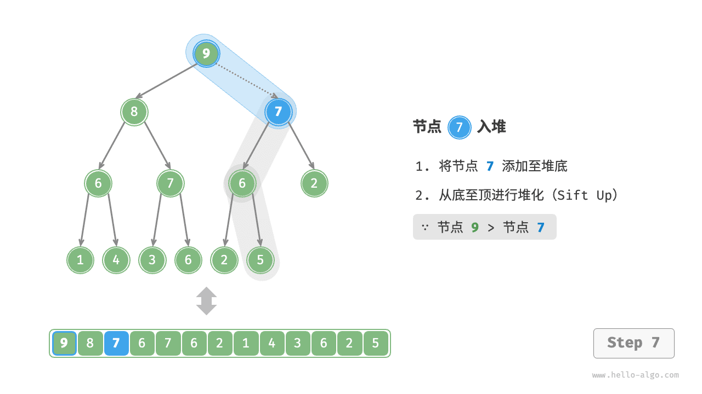

=== "<8>"
    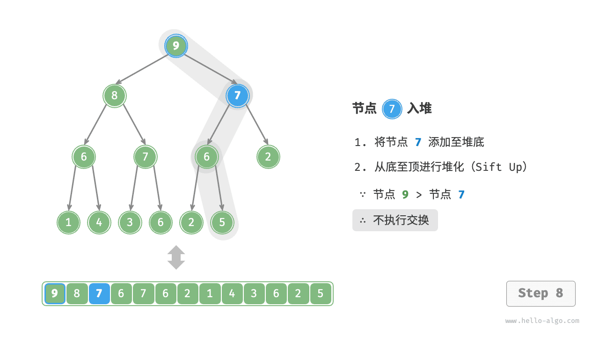

=== "<9>"
    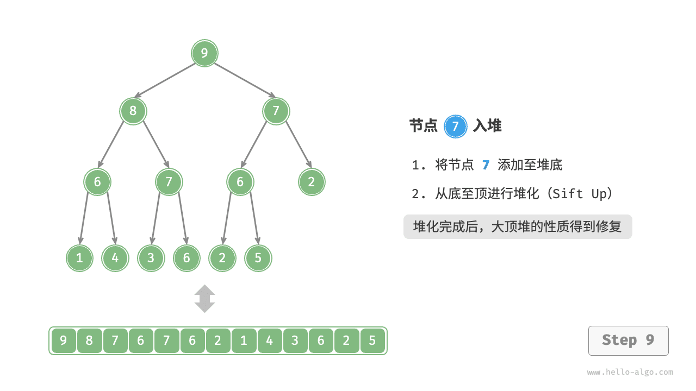

设节点总数为 $n$ ，则树的高度为 $O(\log n)$ 。由此可知，堆化操作的循环轮数最多为 $O(\log n)$ ，**元素入堆操作的时间复杂度为 $O(\log n)$** 。代码如下所示：

```python
def push(self, val: int):
    """元素入堆"""
    # 添加节点
    self.max_heap.append(val)
    # 从底至顶堆化
    self.sift_up(self.size() - 1)

def sift_up(self, i: int):
    """从节点 i 开始，从底至顶堆化"""
    while True:
        # 获取节点 i 的父节点
        p = self.parent(i)
        # 当“越过根节点”或“节点无须修复”时，结束堆化
        if p < 0 or self.max_heap[i] <= self.max_heap[p]:
            break
        # 交换两节点
        self.swap(i, p)
        # 循环向上堆化
        i = p
```

!!! example [pythontutor "可视化运行"](https://pythontutor.com/iframe-embed.html#code=class%20MaxHeap%3A%0A%20%20%20%20%22%22%22%E5%A4%A7%E9%A1%B6%E5%A0%86%22%22%22%0A%0A%20%20%20%20def%20__init__%28self,%20nums%3A%20list%5Bint%5D%29%3A%0A%20%20%20%20%20%20%20%20%22%22%22%E6%9E%84%E9%80%A0%E6%96%B9%E6%B3%95%22%22%22%0A%20%20%20%20%20%20%20%20%23%20%E5%B0%86%E5%88%97%E8%A1%A8%E5%85%83%E7%B4%A0%E5%8E%9F%E5%B0%81%E4%B8%8D%E5%8A%A8%E6%B7%BB%E5%8A%A0%E8%BF%9B%E5%A0%86%0A%20%20%20%20%20%20%20%20self.max_heap%20%3D%20nums%0A%0A%20%20%20%20def%20left%28self,%20i%3A%20int%29%20-%3E%20int%3A%0A%20%20%20%20%20%20%20%20%22%22%22%E8%8E%B7%E5%8F%96%E5%B7%A6%E5%AD%90%E8%8A%82%E7%82%B9%E7%9A%84%E7%B4%A2%E5%BC%95%22%22%22%0A%20%20%20%20%20%20%20%20return%202%20*%20i%20%2B%201%0A%0A%20%20%20%20def%20right%28self,%20i%3A%20int%29%20-%3E%20int%3A%0A%20%20%20%20%20%20%20%20%22%22%22%E8%8E%B7%E5%8F%96%E5%8F%B3%E5%AD%90%E8%8A%82%E7%82%B9%E7%9A%84%E7%B4%A2%E5%BC%95%22%22%22%0A%20%20%20%20%20%20%20%20return%202%20*%20i%20%2B%202%0A%0A%20%20%20%20def%20parent%28self,%20i%3A%20int%29%20-%3E%20int%3A%0A%20%20%20%20%20%20%20%20%22%22%22%E8%8E%B7%E5%8F%96%E7%88%B6%E8%8A%82%E7%82%B9%E7%9A%84%E7%B4%A2%E5%BC%95%22%22%22%0A%20%20%20%20%20%20%20%20return%20%28i%20-%201%29%20//%202%20%20%23%20%E5%90%91%E4%B8%8B%E6%95%B4%E9%99%A4%0A%0A%20%20%20%20def%20swap%28self,%20i%3A%20int,%20j%3A%20int%29%3A%0A%20%20%20%20%20%20%20%20%22%22%22%E4%BA%A4%E6%8D%A2%E5%85%83%E7%B4%A0%22%22%22%0A%20%20%20%20%20%20%20%20self.max_heap%5Bi%5D,%20self.max_heap%5Bj%5D%20%3D%20self.max_heap%5Bj%5D,%20self.max_heap%5Bi%5D%0A%0A%20%20%20%20def%20size%28self%29%20-%3E%20int%3A%0A%20%20%20%20%20%20%20%20%22%22%22%E8%8E%B7%E5%8F%96%E5%A0%86%E5%A4%A7%E5%B0%8F%22%22%22%0A%20%20%20%20%20%20%20%20return%20len%28self.max_heap%29%0A%0A%20%20%20%20def%20is_empty%28self%29%20-%3E%20bool%3A%0A%20%20%20%20%20%20%20%20%22%22%22%E5%88%A4%E6%96%AD%E5%A0%86%E6%98%AF%E5%90%A6%E4%B8%BA%E7%A9%BA%22%22%22%0A%20%20%20%20%20%20%20%20return%20self.size%28%29%20%3D%3D%200%0A%0A%20%20%20%20def%20push%28self,%20val%3A%20int%29%3A%0A%20%20%20%20%20%20%20%20%22%22%22%E5%85%83%E7%B4%A0%E5%85%A5%E5%A0%86%22%22%22%0A%20%20%20%20%20%20%20%20%23%20%E6%B7%BB%E5%8A%A0%E8%8A%82%E7%82%B9%0A%20%20%20%20%20%20%20%20self.max_heap.append%28val%29%0A%20%20%20%20%20%20%20%20%23%20%E4%BB%8E%E5%BA%95%E8%87%B3%E9%A1%B6%E5%A0%86%E5%8C%96%0A%20%20%20%20%20%20%20%20self.sift_up%28self.size%28%29%20-%201%29%0A%0A%20%20%20%20def%20sift_up%28self,%20i%3A%20int%29%3A%0A%20%20%20%20%20%20%20%20%22%22%22%E4%BB%8E%E8%8A%82%E7%82%B9%20i%20%E5%BC%80%E5%A7%8B%EF%BC%8C%E4%BB%8E%E5%BA%95%E8%87%B3%E9%A1%B6%E5%A0%86%E5%8C%96%22%22%22%0A%20%20%20%20%20%20%20%20while%20True%3A%0A%20%20%20%20%20%20%20%20%20%20%20%20%23%20%E8%8E%B7%E5%8F%96%E8%8A%82%E7%82%B9%20i%20%E7%9A%84%E7%88%B6%E8%8A%82%E7%82%B9%0A%20%20%20%20%20%20%20%20%20%20%20%20p%20%3D%20self.parent%28i%29%0A%20%20%20%20%20%20%20%20%20%20%20%20%23%20%E5%BD%93%E2%80%9C%E8%B6%8A%E8%BF%87%E6%A0%B9%E8%8A%82%E7%82%B9%E2%80%9D%E6%88%96%E2%80%9C%E8%8A%82%E7%82%B9%E6%97%A0%E9%A1%BB%E4%BF%AE%E5%A4%8D%E2%80%9D%E6%97%B6%EF%BC%8C%E7%BB%93%E6%9D%9F%E5%A0%86%E5%8C%96%0A%20%20%20%20%20%20%20%20%20%20%20%20if%20p%20%3C%200%20or%20self.max_heap%5Bi%5D%20%3C%3D%20self.max_heap%5Bp%5D%3A%0A%20%20%20%20%20%20%20%20%20%20%20%20%20%20%20%20break%0A%20%20%20%20%20%20%20%20%20%20%20%20%23%20%E4%BA%A4%E6%8D%A2%E4%B8%A4%E8%8A%82%E7%82%B9%0A%20%20%20%20%20%20%20%20%20%20%20%20self.swap%28i,%20p%29%0A%20%20%20%20%20%20%20%20%20%20%20%20%23%20%E5%BE%AA%E7%8E%AF%E5%90%91%E4%B8%8A%E5%A0%86%E5%8C%96%0A%20%20%20%20%20%20%20%20%20%20%20%20i%20%3D%20p%0A%0A%0A%22%22%22Driver%20Code%22%22%22%0Aif%20__name__%20%3D%3D%20%22__main__%22%3A%0A%20%20%20%20%23%20%E5%88%9D%E5%A7%8B%E5%8C%96%E5%A4%A7%E9%A1%B6%E5%A0%86%0A%20%20%20%20%23%20%E8%AF%B7%E6%B3%A8%E6%84%8F%EF%BC%8C%E8%BE%93%E5%85%A5%E6%95%B0%E7%BB%84%E5%B7%B2%E7%BB%8F%E6%98%AF%E4%B8%80%E4%B8%AA%E5%B7%B2%E7%BB%8F%E6%98%AF%E4%B8%80%E4%B8%AA%E5%90%88%E6%B3%95%E7%9A%84%E5%A0%86%0A%20%20%20%20max_heap%20%3D%20MaxHeap%28%5B9,%208,%206,%206,%207,%205,%202,%201,%204,%203,%206,%202%5D%29%0A%0A%20%20%20%20%23%20%E5%85%83%E7%B4%A0%E5%85%A5%E5%A0%86%0A%20%20%20%20val%20%3D%207%0A%20%20%20%20max_heap.push%28val%29&codeDivHeight=800&codeDivWidth=600&cumulative=false&curInstr=8&heapPrimitives=nevernest&origin=opt-frontend.js&py=311&rawInputLstJSON=%5B%5D&textReferences=false)

### 堆顶元素出堆

堆顶元素是二叉树的根节点，即列表首元素。如果我们直接从列表中删除首元素，那么二叉树中所有节点的索引都会发生变化，这将使得后续使用堆化进行修复变得困难。为了尽量减少元素索引的变动，我们采用以下操作步骤。

1. 交换堆顶元素与堆底元素（交换根节点与最右叶节点）。
2. 交换完成后，将堆底从列表中删除（注意，由于已经交换，因此实际上删除的是原来的堆顶元素）。
3. 从根节点开始，**从顶至底执行堆化**。

如下图所示，**“从顶至底堆化”的操作方向与“从底至顶堆化”相反**，我们将根节点的值与其两个子节点的值进行比较，将最大的子节点与根节点交换。然后循环执行此操作，直到越过叶节点或遇到无须交换的节点时结束。

=== "<1>"
    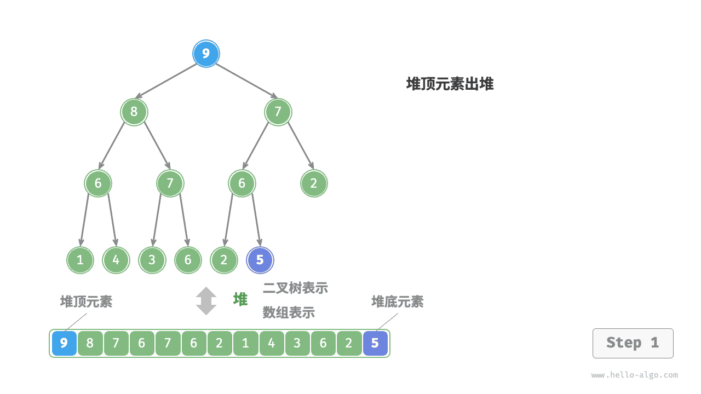

=== "<2>"
    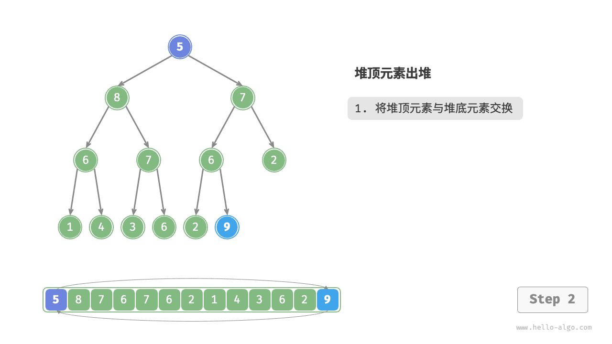

=== "<3>"
    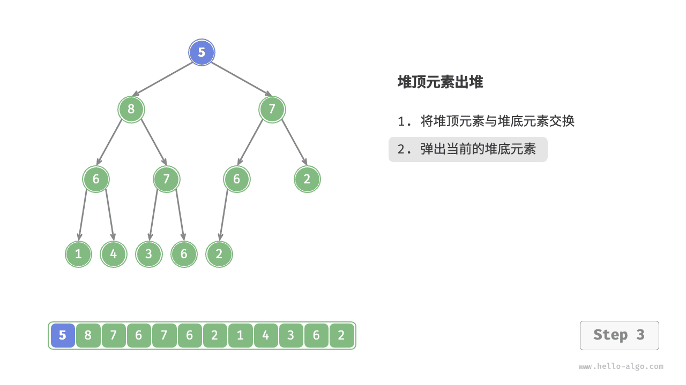

=== "<4>"
    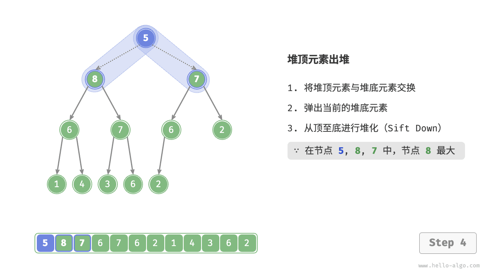

=== "<5>"
    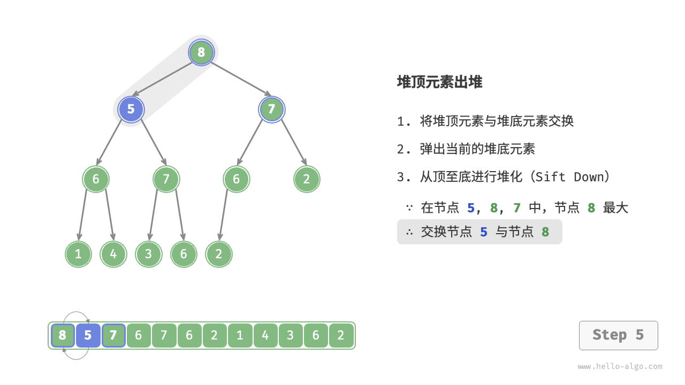

=== "<6>"
    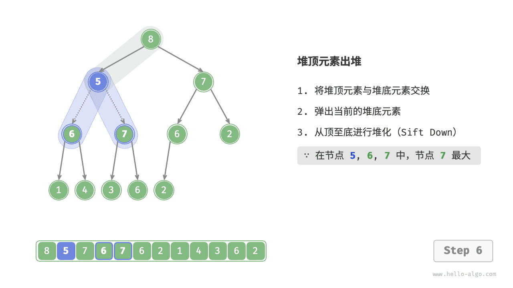

=== "<7>"
    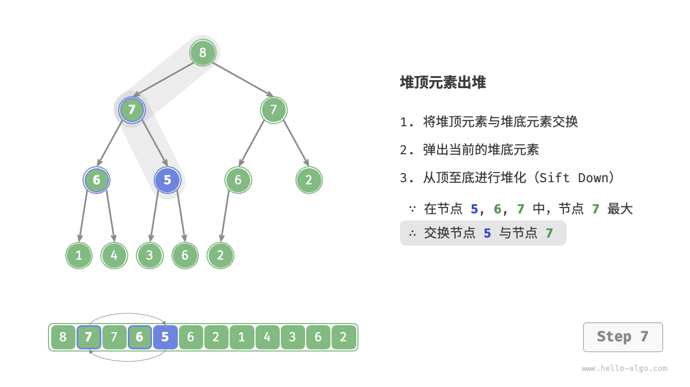

=== "<8>"
    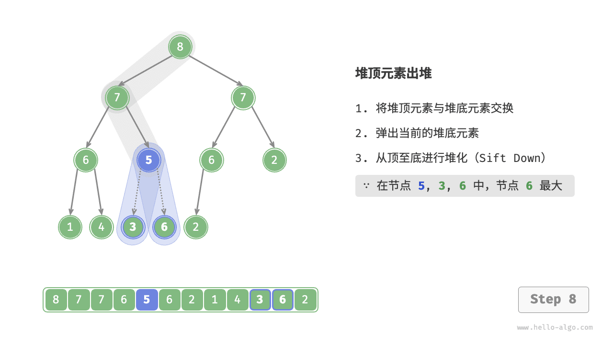

=== "<9>"
    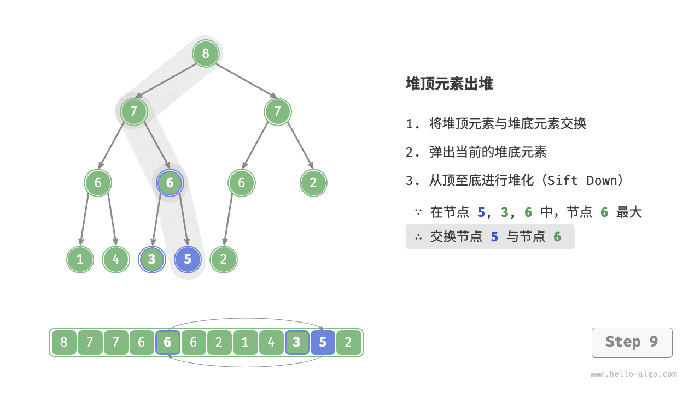

=== "<10>"
    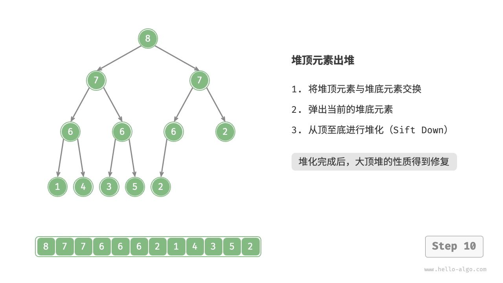

与元素入堆操作相似，堆顶元素出堆操作的时间复杂度也为 $O(\log n)$ 。代码如下所示：

```python
def pop(self) -> int:
    """元素出堆"""
    # 判空处理
    if self.is_empty():
        raise IndexError("堆为空")
    # 交换根节点与最右叶节点（交换首元素与尾元素）
    self.swap(0, self.size() - 1)
    # 删除节点
    val = self.max_heap.pop()
    # 从顶至底堆化
    self.sift_down(0)
    # 返回堆顶元素
    return val

def sift_down(self, i: int):
    """从节点 i 开始，从顶至底堆化"""
    while True:
        # 判断节点 i, l, r 中值最大的节点，记为 ma
        l, r, ma = self.left(i), self.right(i), i
        if l < self.size() and self.max_heap[l] > self.max_heap[ma]:
            ma = l
        if r < self.size() and self.max_heap[r] > self.max_heap[ma]:
            ma = r
        # 若节点 i 最大或索引 l, r 越界，则无须继续堆化，跳出
        if ma == i:
            break
        # 交换两节点
        self.swap(i, ma)
        # 循环向下堆化
        i = ma
```

!!! example [pythontutor "可视化运行"](https://pythontutor.com/iframe-embed.html#code=class%20MaxHeap%3A%0A%20%20%20%20%22%22%22%E5%A4%A7%E9%A1%B6%E5%A0%86%22%22%22%0A%0A%20%20%20%20def%20__init__%28self,%20nums%3A%20list%5Bint%5D%29%3A%0A%20%20%20%20%20%20%20%20%22%22%22%E6%9E%84%E9%80%A0%E6%96%B9%E6%B3%95%22%22%22%0A%20%20%20%20%20%20%20%20%23%20%E5%B0%86%E5%88%97%E8%A1%A8%E5%85%83%E7%B4%A0%E5%8E%9F%E5%B0%81%E4%B8%8D%E5%8A%A8%E6%B7%BB%E5%8A%A0%E8%BF%9B%E5%A0%86%0A%20%20%20%20%20%20%20%20self.max_heap%20%3D%20nums%0A%0A%20%20%20%20def%20left%28self,%20i%3A%20int%29%20-%3E%20int%3A%0A%20%20%20%20%20%20%20%20%22%22%22%E8%8E%B7%E5%8F%96%E5%B7%A6%E5%AD%90%E8%8A%82%E7%82%B9%E7%9A%84%E7%B4%A2%E5%BC%95%22%22%22%0A%20%20%20%20%20%20%20%20return%202%20*%20i%20%2B%201%0A%0A%20%20%20%20def%20right%28self,%20i%3A%20int%29%20-%3E%20int%3A%0A%20%20%20%20%20%20%20%20%22%22%22%E8%8E%B7%E5%8F%96%E5%8F%B3%E5%AD%90%E8%8A%82%E7%82%B9%E7%9A%84%E7%B4%A2%E5%BC%95%22%22%22%0A%20%20%20%20%20%20%20%20return%202%20*%20i%20%2B%202%0A%0A%20%20%20%20def%20parent%28self,%20i%3A%20int%29%20-%3E%20int%3A%0A%20%20%20%20%20%20%20%20%22%22%22%E8%8E%B7%E5%8F%96%E7%88%B6%E8%8A%82%E7%82%B9%E7%9A%84%E7%B4%A2%E5%BC%95%22%22%22%0A%20%20%20%20%20%20%20%20return%20%28i%20-%201%29%20//%202%20%20%23%20%E5%90%91%E4%B8%8B%E6%95%B4%E9%99%A4%0A%0A%20%20%20%20def%20swap%28self,%20i%3A%20int,%20j%3A%20int%29%3A%0A%20%20%20%20%20%20%20%20%22%22%22%E4%BA%A4%E6%8D%A2%E5%85%83%E7%B4%A0%22%22%22%0A%20%20%20%20%20%20%20%20self.max_heap%5Bi%5D,%20self.max_heap%5Bj%5D%20%3D%20self.max_heap%5Bj%5D,%20self.max_heap%5Bi%5D%0A%0A%20%20%20%20def%20size%28self%29%20-%3E%20int%3A%0A%20%20%20%20%20%20%20%20%22%22%22%E8%8E%B7%E5%8F%96%E5%A0%86%E5%A4%A7%E5%B0%8F%22%22%22%0A%20%20%20%20%20%20%20%20return%20len%28self.max_heap%29%0A%0A%20%20%20%20def%20is_empty%28self%29%20-%3E%20bool%3A%0A%20%20%20%20%20%20%20%20%22%22%22%E5%88%A4%E6%96%AD%E5%A0%86%E6%98%AF%E5%90%A6%E4%B8%BA%E7%A9%BA%22%22%22%0A%20%20%20%20%20%20%20%20return%20self.size%28%29%20%3D%3D%200%0A%0A%20%20%20%20def%20pop%28self%29%20-%3E%20int%3A%0A%20%20%20%20%20%20%20%20%22%22%22%E5%85%83%E7%B4%A0%E5%87%BA%E5%A0%86%22%22%22%0A%20%20%20%20%20%20%20%20%23%20%E5%88%A4%E7%A9%BA%E5%A4%84%E7%90%86%0A%20%20%20%20%20%20%20%20if%20self.is_empty%28%29%3A%0A%20%20%20%20%20%20%20%20%20%20%20%20raise%20IndexError%28%22%E5%A0%86%E4%B8%BA%E7%A9%BA%22%29%0A%20%20%20%20%20%20%20%20%23%20%E4%BA%A4%E6%8D%A2%E6%A0%B9%E8%8A%82%E7%82%B9%E4%B8%8E%E6%9C%80%E5%8F%B3%E5%8F%B6%E8%8A%82%E7%82%B9%EF%BC%88%E4%BA%A4%E6%8D%A2%E9%A6%96%E5%85%83%E7%B4%A0%E4%B8%8E%E5%B0%BE%E5%85%83%E7%B4%A0%EF%BC%89%0A%20%20%20%20%20%20%20%20self.swap%280,%20self.size%28%29%20-%201%29%0A%20%20%20%20%20%20%20%20%23%20%E5%88%A0%E9%99%A4%E8%8A%82%E7%82%B9%0A%20%20%20%20%20%20%20%20val%20%3D%20self.max_heap.pop%28%29%0A%20%20%20%20%20%20%20%20%23%20%E4%BB%8E%E9%A1%B6%E8%87%B3%E5%BA%95%E5%A0%86%E5%8C%96%0A%20%20%20%20%20%20%20%20self.sift_down%280%29%0A%20%20%20%20%20%20%20%20%23%20%E8%BF%94%E5%9B%9E%E5%A0%86%E9%A1%B6%E5%85%83%E7%B4%A0%0A%20%20%20%20%20%20%20%20return%20val%0A%0A%20%20%20%20def%20sift_down%28self,%20i%3A%20int%29%3A%0A%20%20%20%20%20%20%20%20%22%22%22%E4%BB%8E%E8%8A%82%E7%82%B9%20i%20%E5%BC%80%E5%A7%8B%EF%BC%8C%E4%BB%8E%E9%A1%B6%E8%87%B3%E5%BA%95%E5%A0%86%E5%8C%96%22%22%22%0A%20%20%20%20%20%20%20%20while%20True%3A%0A%20%20%20%20%20%20%20%20%20%20%20%20%23%20%E5%88%A4%E6%96%AD%E8%8A%82%E7%82%B9%20i,%20l,%20r%20%E4%B8%AD%E5%80%BC%E6%9C%80%E5%A4%A7%E7%9A%84%E8%8A%82%E7%82%B9%EF%BC%8C%E8%AE%B0%E4%B8%BA%20ma%0A%20%20%20%20%20%20%20%20%20%20%20%20l,%20r,%20ma%20%3D%20self.left%28i%29,%20self.right%28i%29,%20i%0A%20%20%20%20%20%20%20%20%20%20%20%20if%20l%20%3C%20self.size%28%29%20and%20self.max_heap%5Bl%5D%20%3E%20self.max_heap%5Bma%5D%3A%0A%20%20%20%20%20%20%20%20%20%20%20%20%20%20%20%20ma%20%3D%20l%0A%20%20%20%20%20%20%20%20%20%20%20%20if%20r%20%3C%20self.size%28%29%20and%20self.max_heap%5Br%5D%20%3E%20self.max_heap%5Bma%5D%3A%0A%20%20%20%20%20%20%20%20%20%20%20%20%20%20%20%20ma%20%3D%20r%0A%20%20%20%20%20%20%20%20%20%20%20%20%23%20%E8%8B%A5%E8%8A%82%E7%82%B9%20i%20%E6%9C%80%E5%A4%A7%E6%88%96%E7%B4%A2%E5%BC%95%20l,%20r%20%E8%B6%8A%E7%95%8C%EF%BC%8C%E5%88%99%E6%97%A0%E9%A1%BB%E7%BB%A7%E7%BB%AD%E5%A0%86%E5%8C%96%EF%BC%8C%E8%B7%B3%E5%87%BA%0A%20%20%20%20%20%20%20%20%20%20%20%20if%20ma%20%3D%3D%20i%3A%0A%20%20%20%20%20%20%20%20%20%20%20%20%20%20%20%20break%0A%20%20%20%20%20%20%20%20%20%20%20%20%23%20%E4%BA%A4%E6%8D%A2%E4%B8%A4%E8%8A%82%E7%82%B9%0A%20%20%20%20%20%20%20%20%20%20%20%20self.swap%28i,%20ma%29%0A%20%20%20%20%20%20%20%20%20%20%20%20%23%20%E5%BE%AA%E7%8E%AF%E5%90%91%E4%B8%8B%E5%A0%86%E5%8C%96%0A%20%20%20%20%20%20%20%20%20%20%20%20i%20%3D%20ma%0A%0A%0A%22%22%22Driver%20Code%22%22%22%0Aif%20__name__%20%3D%3D%20%22__main__%22%3A%0A%20%20%20%20%23%20%E5%88%9D%E5%A7%8B%E5%8C%96%E5%A4%A7%E9%A1%B6%E5%A0%86%0A%20%20%20%20%23%20%E8%AF%B7%E6%B3%A8%E6%84%8F%EF%BC%8C%E8%BE%93%E5%85%A5%E6%95%B0%E7%BB%84%E5%B7%B2%E7%BB%8F%E6%98%AF%E4%B8%80%E4%B8%AA%E5%B7%B2%E7%BB%8F%E6%98%AF%E4%B8%80%E4%B8%AA%E5%90%88%E6%B3%95%E7%9A%84%E5%A0%86%0A%20%20%20%20max_heap%20%3D%20MaxHeap%28%5B9,%208,%207,%206,%207,%206,%202,%201,%204,%203,%206,%202,%205%5D%29%0A%0A%20%20%20%20%23%20%E5%A0%86%E9%A1%B6%E5%85%83%E7%B4%A0%E5%87%BA%E5%A0%86%0A%20%20%20%20peek%20%3D%20max_heap.pop%28%29&codeDivHeight=800&codeDivWidth=600&cumulative=false&curInstr=8&heapPrimitives=nevernest&origin=opt-frontend.js&py=311&rawInputLstJSON=%5B%5D&textReferences=false)

## 堆的常见应用

- **优先队列**：堆通常作为实现优先队列的首选数据结构，其入队和出队操作的时间复杂度均为 $O(\log n)$ ，而建堆操作为 $O(n)$ ，这些操作都非常高效。
- **堆排序**：给定一组数据，我们可以用它们建立一个堆，然后不断地执行元素出堆操作，从而得到有序数据。然而，我们通常会使用一种更优雅的方式实现堆排序，详见“堆排序”章节。
- **获取最大的 $k$ 个元素**：这是一个经典的算法问题，同时也是一种典型应用，例如选择热度前 10 的新闻作为微博热搜，选取销量前 10 的商品等。

# 建堆操作

在某些情况下，我们希望使用一个列表的所有元素来构建一个堆，这个过程被称为“建堆操作”。

## 借助入堆操作实现

我们首先创建一个空堆，然后遍历列表，依次对每个元素执行“入堆操作”，即先将元素添加至堆的尾部，再对该元素执行“从底至顶”堆化。

每当一个元素入堆，堆的长度就加一。由于节点是从顶到底依次被添加进二叉树的，因此堆是“自上而下”构建的。

设元素数量为 $n$ ，每个元素的入堆操作使用 $O(\log{n})$ 时间，因此该建堆方法的时间复杂度为 $O(n \log n)$ 。

## 通过遍历堆化实现

实际上，我们可以实现一种更为高效的建堆方法，共分为两步。

1. 将列表所有元素原封不动地添加到堆中，此时堆的性质尚未得到满足。
2. 倒序遍历堆（层序遍历的倒序），依次对每个非叶节点执行“从顶至底堆化”。

**每当堆化一个节点后，以该节点为根节点的子树就形成一个合法的子堆**。而由于是倒序遍历，因此堆是“自下而上”构建的。

之所以选择倒序遍历，是因为这样能够保证当前节点之下的子树已经是合法的子堆，这样堆化当前节点才是有效的。

值得说明的是，**由于叶节点没有子节点，因此它们天然就是合法的子堆，无须堆化**。如以下代码所示，最后一个非叶节点是最后一个节点的父节点，我们从它开始倒序遍历并执行堆化：

```python
def __init__(self, nums: list[int]):
    """构造方法，根据输入列表建堆"""
    # 将列表元素原封不动添加进堆
    self.max_heap = nums
    # 堆化除叶节点以外的其他所有节点
    for i in range(self.parent(self.size() - 1), -1, -1):
        self.sift_down(i)
```

!!! example [pythontutor "可视化运行"](https://pythontutor.com/iframe-embed.html#code=class%20MaxHeap%3A%0A%20%20%20%20%22%22%22%E5%A4%A7%E9%A1%B6%E5%A0%86%22%22%22%0A%0A%20%20%20%20def%20__init__%28self,%20nums%3A%20list%5Bint%5D%29%3A%0A%20%20%20%20%20%20%20%20%22%22%22%E6%9E%84%E9%80%A0%E6%96%B9%E6%B3%95%EF%BC%8C%E6%A0%B9%E6%8D%AE%E8%BE%93%E5%85%A5%E5%88%97%E8%A1%A8%E5%BB%BA%E5%A0%86%22%22%22%0A%20%20%20%20%20%20%20%20%23%20%E5%B0%86%E5%88%97%E8%A1%A8%E5%85%83%E7%B4%A0%E5%8E%9F%E5%B0%81%E4%B8%8D%E5%8A%A8%E6%B7%BB%E5%8A%A0%E8%BF%9B%E5%A0%86%0A%20%20%20%20%20%20%20%20self.max_heap%20%3D%20nums%0A%20%20%20%20%20%20%20%20%23%20%E5%A0%86%E5%8C%96%E9%99%A4%E5%8F%B6%E8%8A%82%E7%82%B9%E4%BB%A5%E5%A4%96%E7%9A%84%E5%85%B6%E4%BB%96%E6%89%80%E6%9C%89%E8%8A%82%E7%82%B9%0A%20%20%20%20%20%20%20%20for%20i%20in%20range%28self.parent%28self.size%28%29%20-%201%29,%20-1,%20-1%29%3A%0A%20%20%20%20%20%20%20%20%20%20%20%20self.sift_down%28i%29%0A%0A%20%20%20%20def%20left%28self,%20i%3A%20int%29%20-%3E%20int%3A%0A%20%20%20%20%20%20%20%20%22%22%22%E8%8E%B7%E5%8F%96%E5%B7%A6%E5%AD%90%E8%8A%82%E7%82%B9%E7%9A%84%E7%B4%A2%E5%BC%95%22%22%22%0A%20%20%20%20%20%20%20%20return%202%20*%20i%20%2B%201%0A%0A%20%20%20%20def%20right%28self,%20i%3A%20int%29%20-%3E%20int%3A%0A%20%20%20%20%20%20%20%20%22%22%22%E8%8E%B7%E5%8F%96%E5%8F%B3%E5%AD%90%E8%8A%82%E7%82%B9%E7%9A%84%E7%B4%A2%E5%BC%95%22%22%22%0A%20%20%20%20%20%20%20%20return%202%20*%20i%20%2B%202%0A%0A%20%20%20%20def%20parent%28self,%20i%3A%20int%29%20-%3E%20int%3A%0A%20%20%20%20%20%20%20%20%22%22%22%E8%8E%B7%E5%8F%96%E7%88%B6%E8%8A%82%E7%82%B9%E7%9A%84%E7%B4%A2%E5%BC%95%22%22%22%0A%20%20%20%20%20%20%20%20return%20%28i%20-%201%29%20//%202%20%20%23%20%E5%90%91%E4%B8%8B%E6%95%B4%E9%99%A4%0A%0A%20%20%20%20def%20swap%28self,%20i%3A%20int,%20j%3A%20int%29%3A%0A%20%20%20%20%20%20%20%20%22%22%22%E4%BA%A4%E6%8D%A2%E5%85%83%E7%B4%A0%22%22%22%0A%20%20%20%20%20%20%20%20self.max_heap%5Bi%5D,%20self.max_heap%5Bj%5D%20%3D%20self.max_heap%5Bj%5D,%20self.max_heap%5Bi%5D%0A%0A%20%20%20%20def%20size%28self%29%20-%3E%20int%3A%0A%20%20%20%20%20%20%20%20%22%22%22%E8%8E%B7%E5%8F%96%E5%A0%86%E5%A4%A7%E5%B0%8F%22%22%22%0A%20%20%20%20%20%20%20%20return%20len%28self.max_heap%29%0A%0A%20%20%20%20def%20sift_down%28self,%20i%3A%20int%29%3A%0A%20%20%20%20%20%20%20%20%22%22%22%E4%BB%8E%E8%8A%82%E7%82%B9%20i%20%E5%BC%80%E5%A7%8B%EF%BC%8C%E4%BB%8E%E9%A1%B6%E8%87%B3%E5%BA%95%E5%A0%86%E5%8C%96%22%22%22%0A%20%20%20%20%20%20%20%20while%20True%3A%0A%20%20%20%20%20%20%20%20%20%20%20%20%23%20%E5%88%A4%E6%96%AD%E8%8A%82%E7%82%B9%20i,%20l,%20r%20%E4%B8%AD%E5%80%BC%E6%9C%80%E5%A4%A7%E7%9A%84%E8%8A%82%E7%82%B9%EF%BC%8C%E8%AE%B0%E4%B8%BA%20ma%0A%20%20%20%20%20%20%20%20%20%20%20%20l,%20r,%20ma%20%3D%20self.left%28i%29,%20self.right%28i%29,%20i%0A%20%20%20%20%20%20%20%20%20%20%20%20if%20l%20%3C%20self.size%28%29%20and%20self.max_heap%5Bl%5D%20%3E%20self.max_heap%5Bma%5D%3A%0A%20%20%20%20%20%20%20%20%20%20%20%20%20%20%20%20ma%20%3D%20l%0A%20%20%20%20%20%20%20%20%20%20%20%20if%20r%20%3C%20self.size%28%29%20and%20self.max_heap%5Br%5D%20%3E%20self.max_heap%5Bma%5D%3A%0A%20%20%20%20%20%20%20%20%20%20%20%20%20%20%20%20ma%20%3D%20r%0A%20%20%20%20%20%20%20%20%20%20%20%20%23%20%E8%8B%A5%E8%8A%82%E7%82%B9%20i%20%E6%9C%80%E5%A4%A7%E6%88%96%E7%B4%A2%E5%BC%95%20l,%20r%20%E8%B6%8A%E7%95%8C%EF%BC%8C%E5%88%99%E6%97%A0%E9%A1%BB%E7%BB%A7%E7%BB%AD%E5%A0%86%E5%8C%96%EF%BC%8C%E8%B7%B3%E5%87%BA%0A%20%20%20%20%20%20%20%20%20%20%20%20if%20ma%20%3D%3D%20i%3A%0A%20%20%20%20%20%20%20%20%20%20%20%20%20%20%20%20break%0A%20%20%20%20%20%20%20%20%20%20%20%20%23%20%E4%BA%A4%E6%8D%A2%E4%B8%A4%E8%8A%82%E7%82%B9%0A%20%20%20%20%20%20%20%20%20%20%20%20self.swap%28i,%20ma%29%0A%20%20%20%20%20%20%20%20%20%20%20%20%23%20%E5%BE%AA%E7%8E%AF%E5%90%91%E4%B8%8B%E5%A0%86%E5%8C%96%0A%20%20%20%20%20%20%20%20%20%20%20%20i%20%3D%20ma%0A%0A%0A%22%22%22Driver%20Code%22%22%22%0Aif%20__name__%20%3D%3D%20%22__main__%22%3A%0A%20%20%20%20%23%20%E5%88%9D%E5%A7%8B%E5%8C%96%E5%A4%A7%E9%A1%B6%E5%A0%86%0A%20%20%20%20max_heap%20%3D%20MaxHeap%28%5B1,%202,%203,%204,%205%5D%29&codeDivHeight=800&codeDivWidth=600&cumulative=false&curInstr=4&heapPrimitives=nevernest&origin=opt-frontend.js&py=311&rawInputLstJSON=%5B%5D&textReferences=false)

## 复杂度分析

下面，我们来尝试推算第二种建堆方法的时间复杂度。

- 假设完全二叉树的节点数量为 $n$ ，则叶节点数量为 $(n + 1) / 2$ ，其中 $/$ 为向下整除。因此需要堆化的节点数量为 $(n - 1) / 2$ 。
- 在从顶至底堆化的过程中，每个节点最多堆化到叶节点，因此最大迭代次数为二叉树高度 $\log n$ 。

将上述两者相乘，可得到建堆过程的时间复杂度为 $O(n \log n)$ 。**但这个估算结果并不准确，因为我们没有考虑到二叉树底层节点数量远多于顶层节点的性质**。

接下来我们来进行更为准确的计算。为了降低计算难度，假设给定一个节点数量为 $n$ 、高度为 $h$ 的“完美二叉树”，该假设不会影响计算结果的正确性。

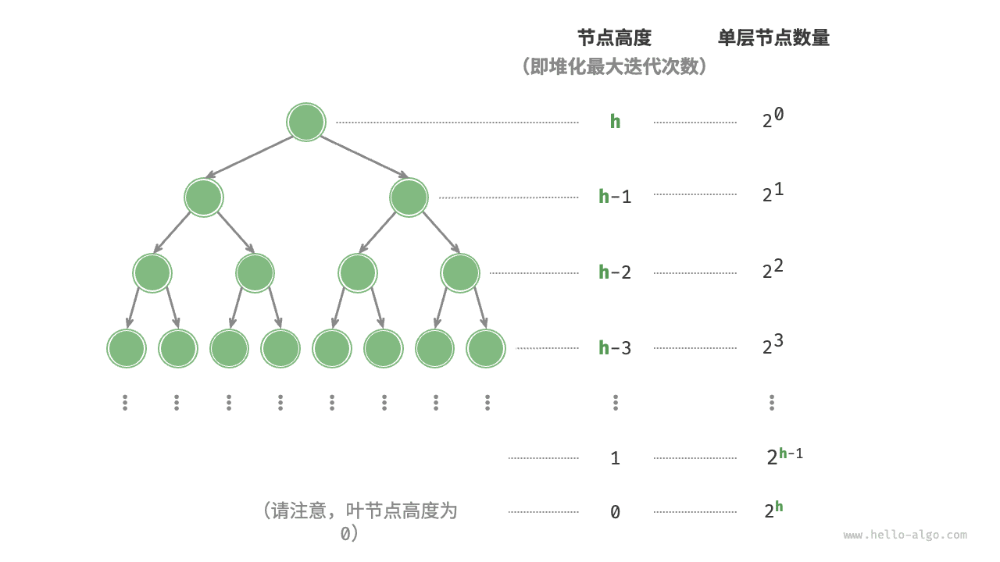

如上图所示，节点“从顶至底堆化”的最大迭代次数等于该节点到叶节点的距离，而该距离正是“节点高度”。因此，我们可以对各层的“节点数量 $\times$ 节点高度”求和，**得到所有节点的堆化迭代次数的总和**。

$$
T(h) = 2^0h + 2^1(h-1) + 2^2(h-2) + \dots + 2^{(h-1)}\times1
$$

化简上式需要借助中学的数列知识，先将 $T(h)$ 乘以 $2$ ，得到：

$$
\begin{aligned}
T(h) & = 2^0h + 2^1(h-1) + 2^2(h-2) + \dots + 2^{h-1}\times1 \newline
2 T(h) & = 2^1h + 2^2(h-1) + 2^3(h-2) + \dots + 2^{h}\times1 \newline
\end{aligned}
$$

使用错位相减法，用下式 $2 T(h)$ 减去上式 $T(h)$ ，可得：

$$
2T(h) - T(h) = T(h) = -2^0h + 2^1 + 2^2 + \dots + 2^{h-1} + 2^h
$$

观察上式，发现 $T(h)$ 是一个等比数列，可直接使用求和公式，得到时间复杂度为：

$$
\begin{aligned}
T(h) & = 2 \frac{1 - 2^h}{1 - 2} - h \newline
& = 2^{h+1} - h - 2 \newline
& = O(2^h)
\end{aligned}
$$

进一步，高度为 $h$ 的完美二叉树的节点数量为 $n = 2^{h+1} - 1$ ，易得复杂度为 $O(2^h) = O(n)$ 。以上推算表明，**输入列表并建堆的时间复杂度为 $O(n)$ ，非常高效**。

# Top-k 问题

!!! question

    给定一个长度为 $n$ 的无序数组 `nums` ，请返回数组中最大的 $k$ 个元素。

对于该问题，我们先介绍两种思路比较直接的解法，再介绍效率更高的堆解法。

## 方法一：遍历选择

我们可以进行下图所示的 $k$ 轮遍历，分别在每轮中提取第 $1$、$2$、$\dots$、$k$ 大的元素，时间复杂度为 $O(nk)$ 。

此方法只适用于 $k \ll n$ 的情况，因为当 $k$ 与 $n$ 比较接近时，其时间复杂度趋向于 $O(n^2)$ ，非常耗时。

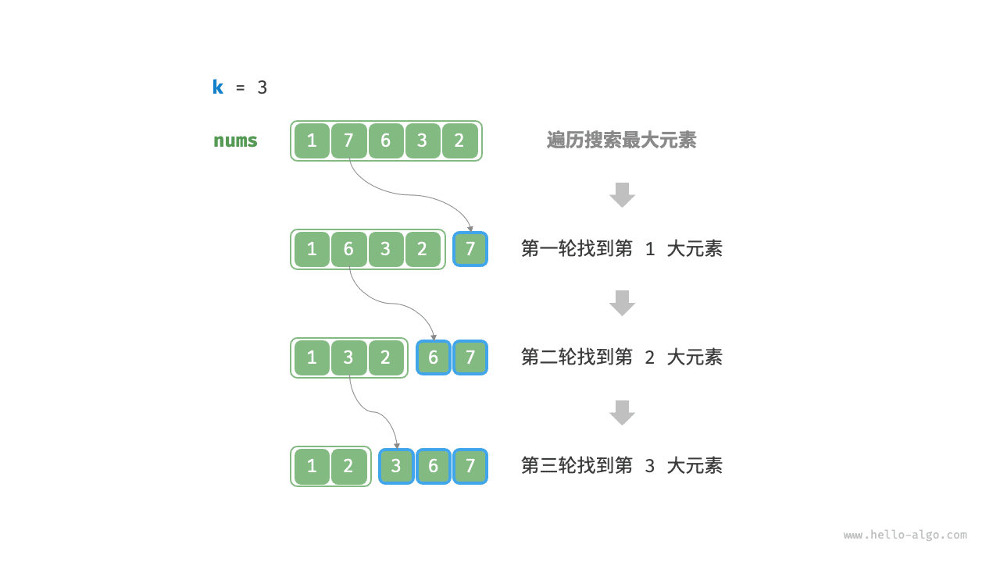

!!! tip

    当 $k = n$ 时，我们可以得到完整的有序序列，此时等价于“选择排序”算法。

## 方法二：排序

如下图所示，我们可以先对数组 `nums` 进行排序，再返回最右边的 $k$ 个元素，时间复杂度为 $O(n \log n)$ 。

显然，该方法“超额”完成任务了，因为我们只需找出最大的 $k$ 个元素即可，而不需要排序其他元素。

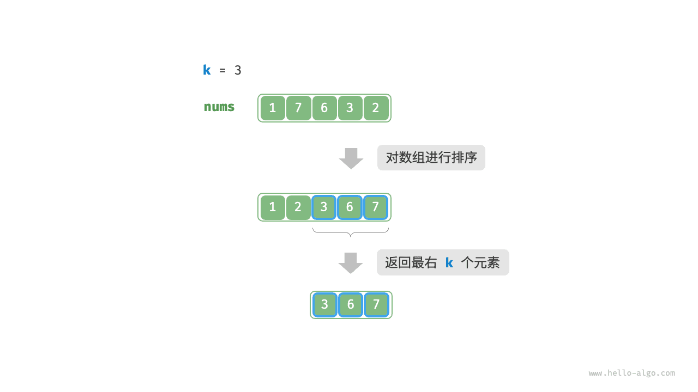

## 方法三：堆

我们可以基于堆更加高效地解决 Top-k 问题，流程如下图所示。

1. 初始化一个小顶堆，其堆顶元素最小。
2. 先将数组的前 $k$ 个元素依次入堆。
3. 从第 $k + 1$ 个元素开始，若当前元素大于堆顶元素，则将堆顶元素出堆，并将当前元素入堆。
4. 遍历完成后，堆中保存的就是最大的 $k$ 个元素。

=== "<1>"
    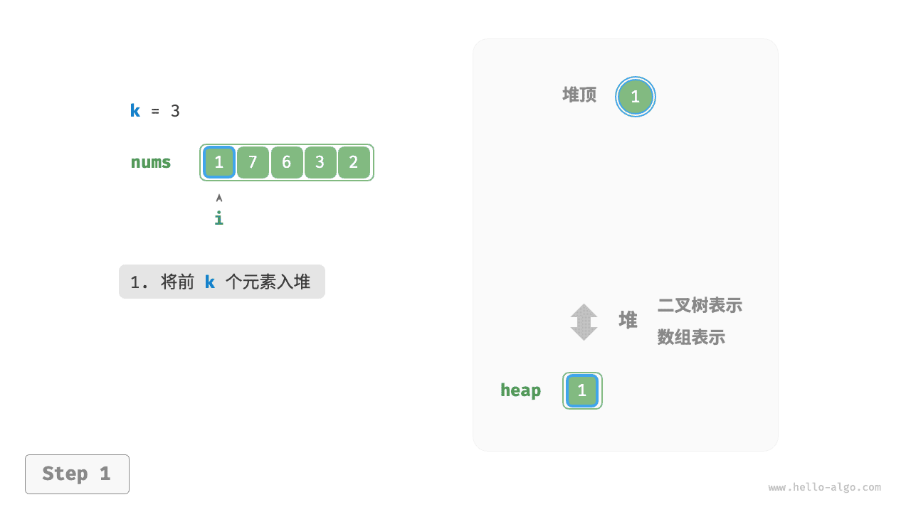

=== "<2>"
    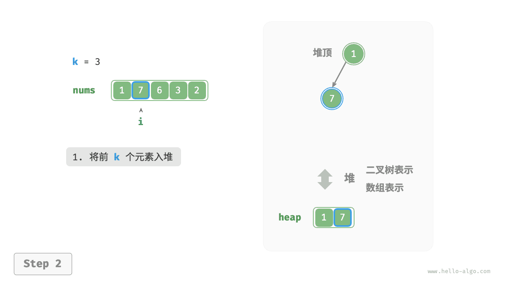

=== "<3>"
    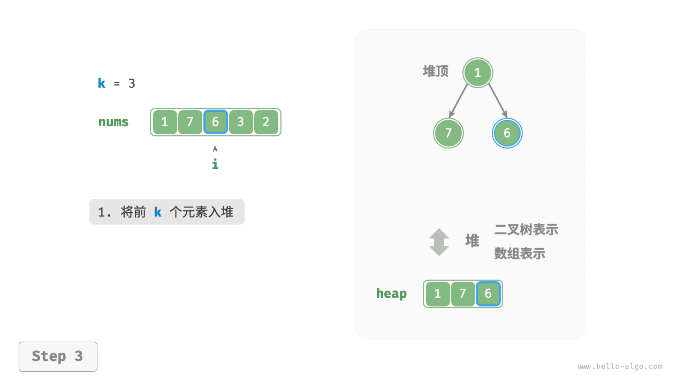

=== "<4>"
    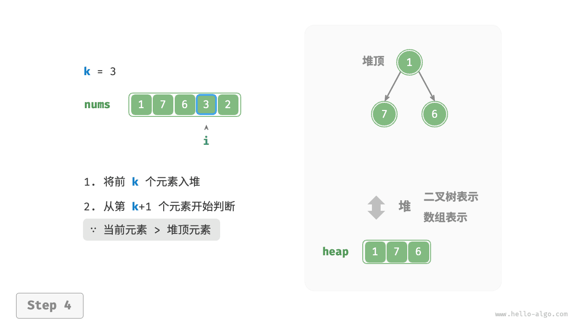

=== "<5>"
    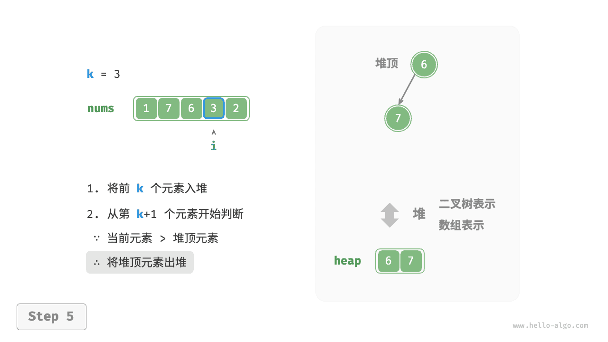

=== "<6>"
    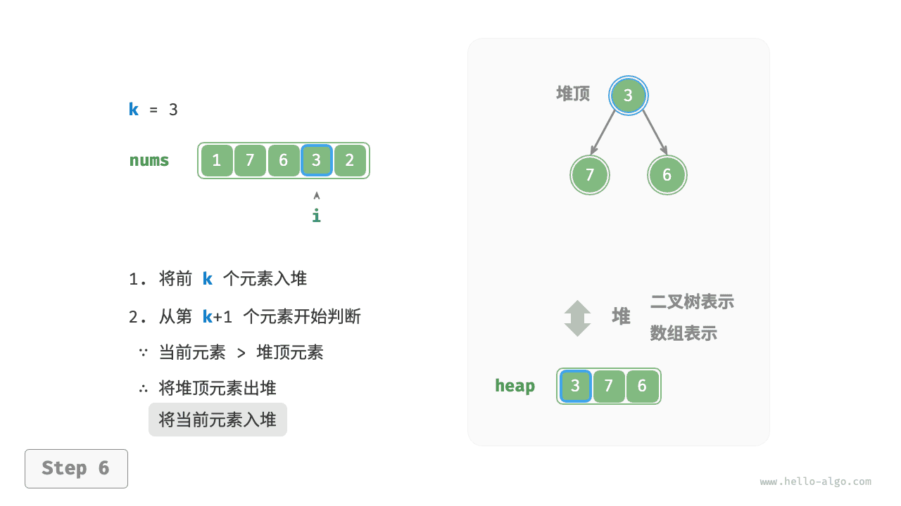

=== "<7>"
    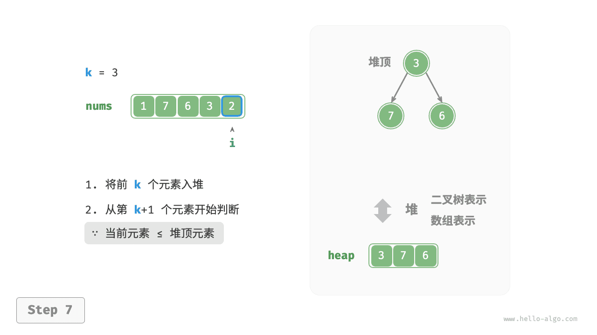

=== "<8>"
    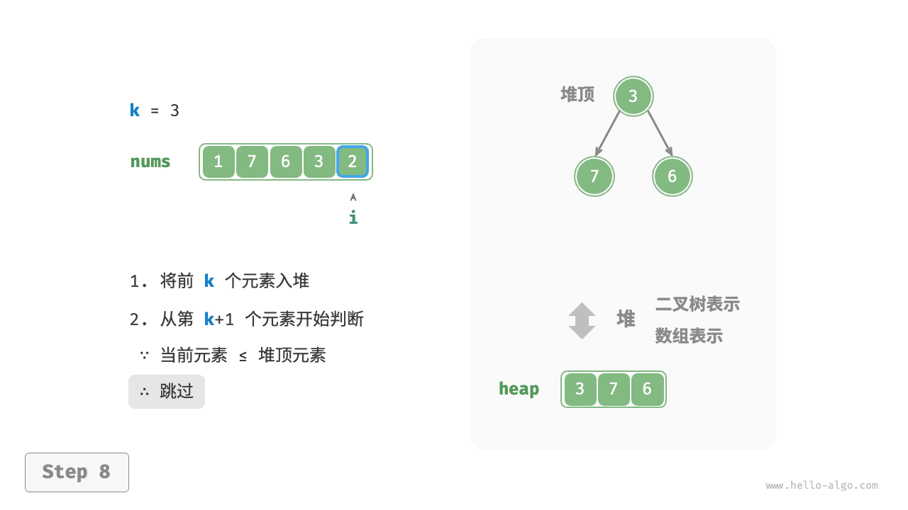

=== "<9>"
    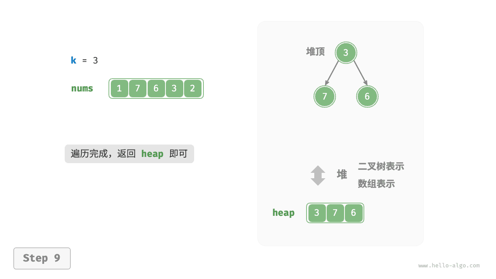

示例代码如下：

```python
def top_k_heap(nums: list[int], k: int) -> list[int]:
    """基于堆查找数组中最大的 k 个元素"""
    # 初始化小顶堆
    heap = []
    # 将数组的前 k 个元素入堆
    for i in range(k):
        heapq.heappush(heap, nums[i])
    # 从第 k+1 个元素开始，保持堆的长度为 k
    for i in range(k, len(nums)):
        # 若当前元素大于堆顶元素，则将堆顶元素出堆、当前元素入堆
        if nums[i] > heap[0]:
            heapq.heappop(heap)
            heapq.heappush(heap, nums[i])
    return heap
```

!!! example [pythontutor "可视化运行"](https://pythontutor.com/iframe-embed.html#code=import%20heapq%0A%0Adef%20top_k_heap%28nums%3A%20list%5Bint%5D,%20k%3A%20int%29%20-%3E%20list%5Bint%5D%3A%0A%20%20%20%20%22%22%22%E5%9F%BA%E4%BA%8E%E5%A0%86%E6%9F%A5%E6%89%BE%E6%95%B0%E7%BB%84%E4%B8%AD%E6%9C%80%E5%A4%A7%E7%9A%84%20k%20%E4%B8%AA%E5%85%83%E7%B4%A0%22%22%22%0A%20%20%20%20%23%20%E5%88%9D%E5%A7%8B%E5%8C%96%E5%B0%8F%E9%A1%B6%E5%A0%86%0A%20%20%20%20heap%20%3D%20%5B%5D%0A%20%20%20%20%23%20%E5%B0%86%E6%95%B0%E7%BB%84%E7%9A%84%E5%89%8D%20k%20%E4%B8%AA%E5%85%83%E7%B4%A0%E5%85%A5%E5%A0%86%0A%20%20%20%20for%20i%20in%20range%28k%29%3A%0A%20%20%20%20%20%20%20%20heapq.heappush%28heap,%20nums%5Bi%5D%29%0A%20%20%20%20%23%20%E4%BB%8E%E7%AC%AC%20k%2B1%20%E4%B8%AA%E5%85%83%E7%B4%A0%E5%BC%80%E5%A7%8B%EF%BC%8C%E4%BF%9D%E6%8C%81%E5%A0%86%E7%9A%84%E9%95%BF%E5%BA%A6%E4%B8%BA%20k%0A%20%20%20%20for%20i%20in%20range%28k,%20len%28nums%29%29%3A%0A%20%20%20%20%20%20%20%20%23%20%E8%8B%A5%E5%BD%93%E5%89%8D%E5%85%83%E7%B4%A0%E5%A4%A7%E4%BA%8E%E5%A0%86%E9%A1%B6%E5%85%83%E7%B4%A0%EF%BC%8C%E5%88%99%E5%B0%86%E5%A0%86%E9%A1%B6%E5%85%83%E7%B4%A0%E5%87%BA%E5%A0%86%E3%80%81%E5%BD%93%E5%89%8D%E5%85%83%E7%B4%A0%E5%85%A5%E5%A0%86%0A%20%20%20%20%20%20%20%20if%20nums%5Bi%5D%20%3E%20heap%5B0%5D%3A%0A%20%20%20%20%20%20%20%20%20%20%20%20heapq.heappop%28heap%29%0A%20%20%20%20%20%20%20%20%20%20%20%20heapq.heappush%28heap,%20nums%5Bi%5D%29%0A%20%20%20%20return%20heap%0A%0A%22%22%22Driver%20Code%22%22%22%0Aif%20__name__%20%3D%3D%20%22__main__%22%3A%0A%20%20%20%20nums%20%3D%20%5B1,%207,%206,%203,%202%5D%0A%20%20%20%20k%20%3D%203%0A%0A%20%20%20%20res%20%3D%20top_k_heap%28nums,%20k%29&codeDivHeight=800&codeDivWidth=600&cumulative=false&curInstr=6&heapPrimitives=nevernest&origin=opt-frontend.js&py=311&rawInputLstJSON=%5B%5D&textReferences=false)

总共执行了 $n$ 轮入堆和出堆，堆的最大长度为 $k$ ，因此时间复杂度为 $O(n \log k)$ 。该方法的效率很高，当 $k$ 较小时，时间复杂度趋向 $O(n)$ ；当 $k$ 较大时，时间复杂度不会超过 $O(n \log n)$ 。

另外，该方法适用于动态数据流的使用场景。在不断加入数据时，我们可以持续维护堆内的元素，从而实现最大的 $k$ 个元素的动态更新。

# 小结

### 重点回顾

- 堆是一棵完全二叉树，根据成立条件可分为大顶堆和小顶堆。大（小）顶堆的堆顶元素是最大（小）的。
- 优先队列的定义是具有出队优先级的队列，通常使用堆来实现。
- 堆的常用操作及其对应的时间复杂度包括：元素入堆 $O(\log n)$、堆顶元素出堆 $O(\log n)$ 和访问堆顶元素 $O(1)$ 等。
- 完全二叉树非常适合用数组表示，因此我们通常使用数组来存储堆。
- 堆化操作用于维护堆的性质，在入堆和出堆操作中都会用到。
- 输入 $n$ 个元素并建堆的时间复杂度可以优化至 $O(n)$ ，非常高效。
- Top-k 是一个经典算法问题，可以使用堆数据结构高效解决，时间复杂度为 $O(n \log k)$ 。

### Q & A

**Q**：数据结构的“堆”与内存管理的“堆”是同一个概念吗？

两者不是同一个概念，只是碰巧都叫“堆”。计算机系统内存中的堆是动态内存分配的一部分，程序在运行时可以使用它来存储数据。程序可以请求一定量的堆内存，用于存储如对象和数组等复杂结构。当这些数据不再需要时，程序需要释放这些内存，以防止内存泄漏。相较于栈内存，堆内存的管理和使用需要更谨慎，使用不当可能会导致内存泄漏和野指针等问题。
