# 图

!!! abstract

    在生命旅途中，我们就像是一个个节点，被无数看不见的边相连。
    
    每一次的相识与相离，都在这张巨大的网络图中留下独特的印记。

# 图

<u>图（graph）</u>是一种非线性数据结构，由<u>顶点（vertex）</u>和<u>边（edge）</u>组成。我们可以将图 $G$ 抽象地表示为一组顶点 $V$ 和一组边 $E$ 的集合。以下示例展示了一个包含 5 个顶点和 7 条边的图。

$$
\begin{aligned}
V & = \{ 1, 2, 3, 4, 5 \} \newline
E & = \{ (1,2), (1,3), (1,5), (2,3), (2,4), (2,5), (4,5) \} \newline
G & = \{ V, E \} \newline
\end{aligned}
$$

如果将顶点看作节点，将边看作连接各个节点的引用（指针），我们就可以将图看作一种从链表拓展而来的数据结构。如下图所示，**相较于线性关系（链表）和分治关系（树），网络关系（图）的自由度更高**，因而更为复杂。

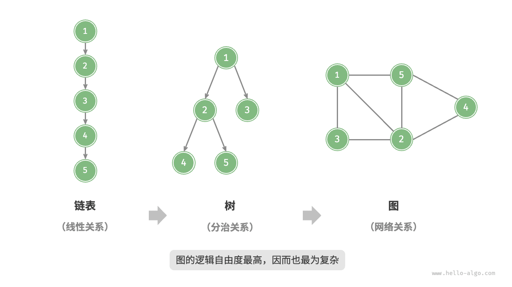

## 图的常见类型与术语

根据边是否具有方向，可分为<u>无向图（undirected graph）</u>和<u>有向图（directed graph）</u>，如下图所示。

- 在无向图中，边表示两顶点之间的“双向”连接关系，例如微信或 QQ 中的“好友关系”。
- 在有向图中，边具有方向性，即 $A \rightarrow B$ 和 $A \leftarrow B$ 两个方向的边是相互独立的，例如微博或抖音上的“关注”与“被关注”关系。

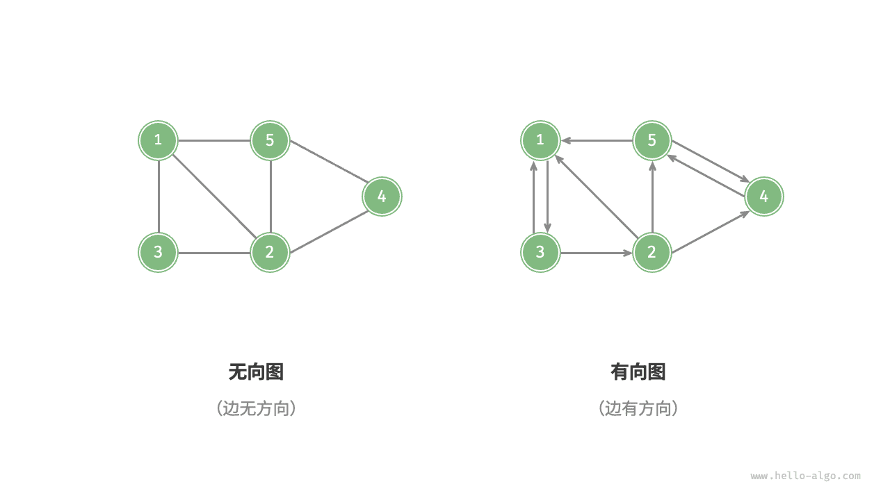

根据所有顶点是否连通，可分为<u>连通图（connected graph）</u>和<u>非连通图（disconnected graph）</u>，如下图所示。

- 对于连通图，从某个顶点出发，可以到达其余任意顶点。
- 对于非连通图，从某个顶点出发，至少有一个顶点无法到达。

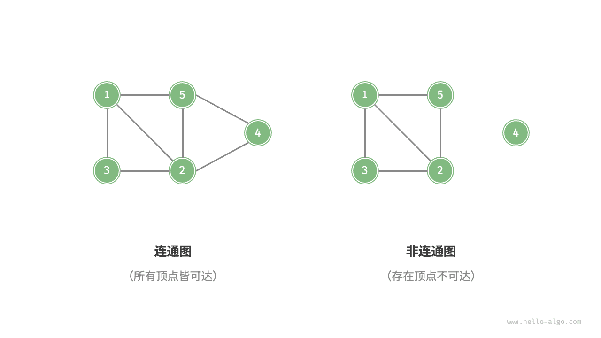

我们还可以为边添加“权重”变量，从而得到如下图所示的<u>有权图（weighted graph）</u>。例如在《王者荣耀》等手游中，系统会根据共同游戏时间来计算玩家之间的“亲密度”，这种亲密度网络就可以用有权图来表示。

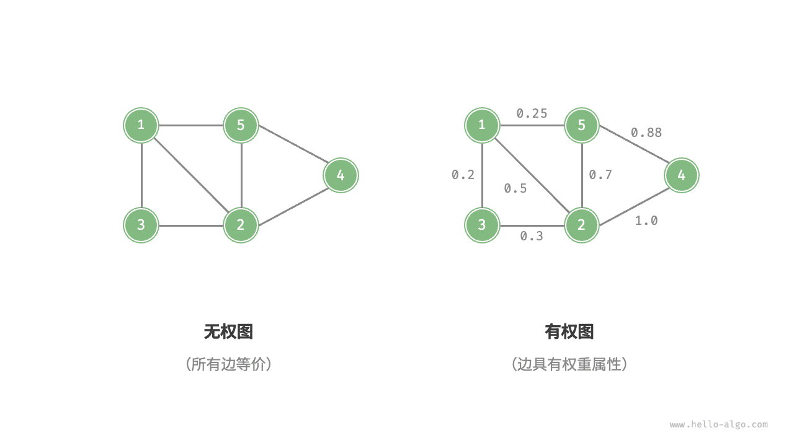

图数据结构包含以下常用术语。

- <u>邻接（adjacency）</u>：当两顶点之间存在边相连时，称这两顶点“邻接”。在上图中，顶点 1 的邻接顶点为顶点 2、3、5。
- <u>路径（path）</u>：从顶点 A 到顶点 B 经过的边构成的序列被称为从 A 到 B 的“路径”。在上图中，边序列 1-5-2-4 是顶点 1 到顶点 4 的一条路径。
- <u>度（degree）</u>：一个顶点拥有的边数。对于有向图，<u>入度（in-degree）</u>表示有多少条边指向该顶点，<u>出度（out-degree）</u>表示有多少条边从该顶点指出。

## 图的表示

图的常用表示方式包括“邻接矩阵”和“邻接表”。以下使用无向图进行举例。

### 邻接矩阵

设图的顶点数量为 $n$ ，<u>邻接矩阵（adjacency matrix）</u>使用一个 $n \times n$ 大小的矩阵来表示图，每一行（列）代表一个顶点，矩阵元素代表边，用 $1$ 或 $0$ 表示两个顶点之间是否存在边。

如下图所示，设邻接矩阵为 $M$、顶点列表为 $V$ ，那么矩阵元素 $M[i, j] = 1$ 表示顶点 $V[i]$ 到顶点 $V[j]$ 之间存在边，反之 $M[i, j] = 0$ 表示两顶点之间无边。

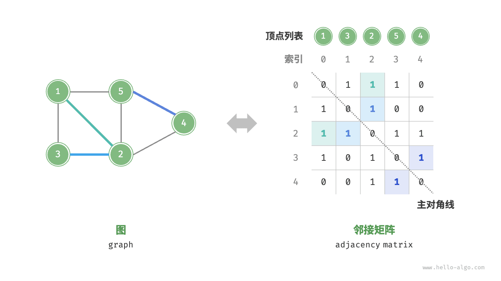

邻接矩阵具有以下特性。

- 在简单图中，顶点不能与自身相连，此时邻接矩阵主对角线元素没有意义。
- 对于无向图，两个方向的边等价，此时邻接矩阵关于主对角线对称。
- 将邻接矩阵的元素从 $1$ 和 $0$ 替换为权重，则可表示有权图。

使用邻接矩阵表示图时，我们可以直接访问矩阵元素以获取边，因此增删查改操作的效率很高，时间复杂度均为 $O(1)$ 。然而，矩阵的空间复杂度为 $O(n^2)$ ，内存占用较多。

### 邻接表

<u>邻接表（adjacency list）</u>使用 $n$ 个链表来表示图，链表节点表示顶点。第 $i$ 个链表对应顶点 $i$ ，其中存储了该顶点的所有邻接顶点（与该顶点相连的顶点）。下图展示了一个使用邻接表存储的图的示例。

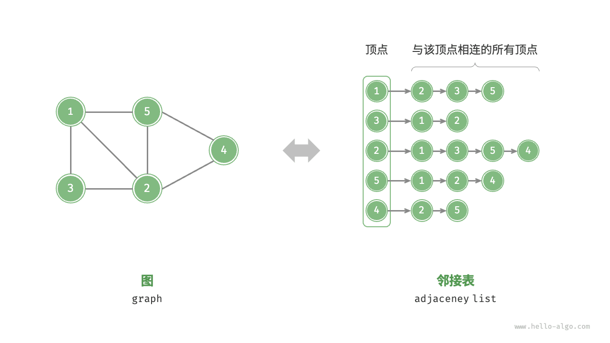

邻接表仅存储实际存在的边，而边的总数通常远小于 $n^2$ ，因此它更加节省空间。然而，在邻接表中需要通过遍历链表来查找边，因此其时间效率不如邻接矩阵。

观察上图，**邻接表结构与哈希表中的“链式地址”非常相似，因此我们也可以采用类似的方法来优化效率**。比如当链表较长时，可以将链表转化为 AVL 树或红黑树，从而将时间效率从 $O(n)$ 优化至 $O(\log n)$ ；还可以把链表转换为哈希表，从而将时间复杂度降至 $O(1)$ 。

## 图的常见应用

如下表所示，许多现实系统可以用图来建模，相应的问题也可以约化为图计算问题。

<p align="center"> 表 <id> &nbsp; 现实生活中常见的图 </p>

|          | 顶点 | 边                   | 图计算问题   |
| -------- | ---- | -------------------- | ------------ |
| 社交网络 | 用户 | 好友关系             | 潜在好友推荐 |
| 地铁线路 | 站点 | 站点间的连通性       | 最短路线推荐 |
| 太阳系   | 星体 | 星体间的万有引力作用 | 行星轨道计算 |

# 图的基础操作

图的基础操作可分为对“边”的操作和对“顶点”的操作。在“邻接矩阵”和“邻接表”两种表示方法下，实现方式有所不同。

## 基于邻接矩阵的实现

给定一个顶点数量为 $n$ 的无向图，则各种操作的实现方式如下图所示。

- **添加或删除边**：直接在邻接矩阵中修改指定的边即可，使用 $O(1)$ 时间。而由于是无向图，因此需要同时更新两个方向的边。
- **添加顶点**：在邻接矩阵的尾部添加一行一列，并全部填 $0$ 即可，使用 $O(n)$ 时间。
- **删除顶点**：在邻接矩阵中删除一行一列。当删除首行首列时达到最差情况，需要将 $(n-1)^2$ 个元素“向左上移动”，从而使用 $O(n^2)$ 时间。
- **初始化**：传入 $n$ 个顶点，初始化长度为 $n$ 的顶点列表 `vertices` ，使用 $O(n)$ 时间；初始化 $n \times n$ 大小的邻接矩阵 `adjMat` ，使用 $O(n^2)$ 时间。

=== "初始化邻接矩阵"
    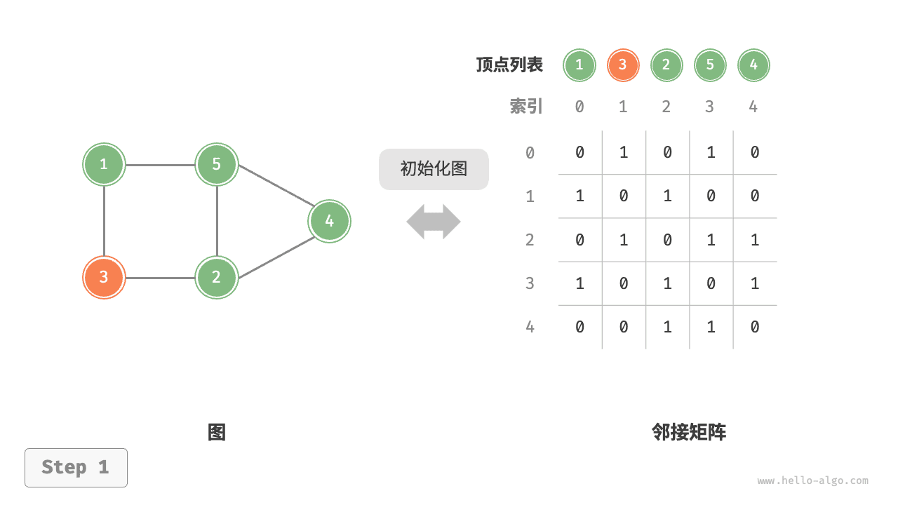

=== "添加边"
    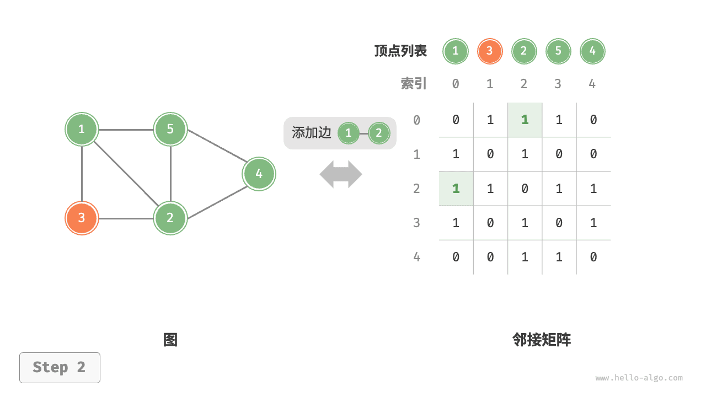

=== "删除边"
    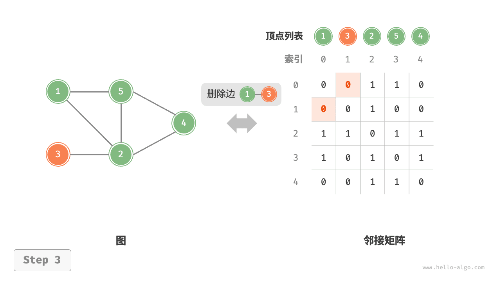

=== "添加顶点"
    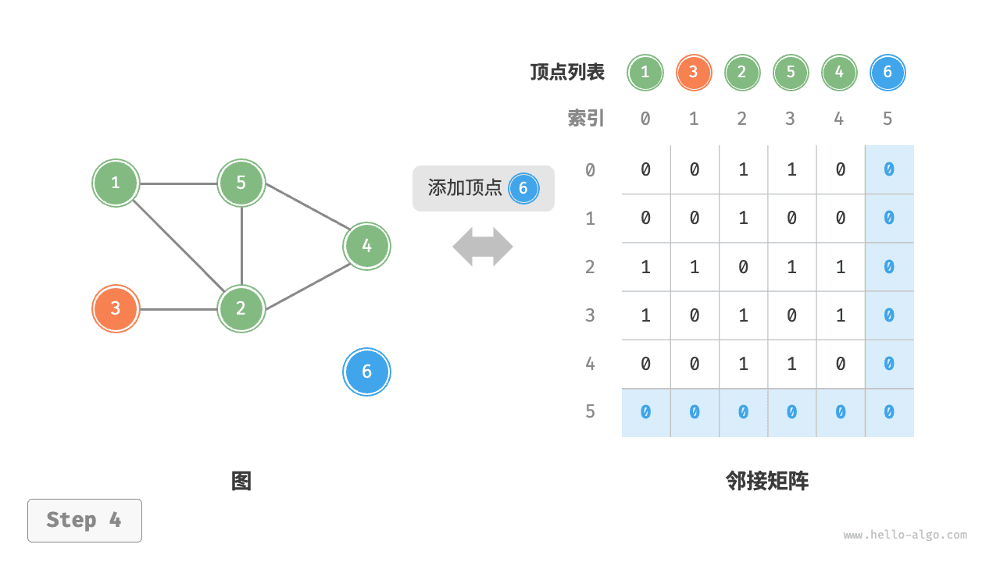

=== "删除顶点"
    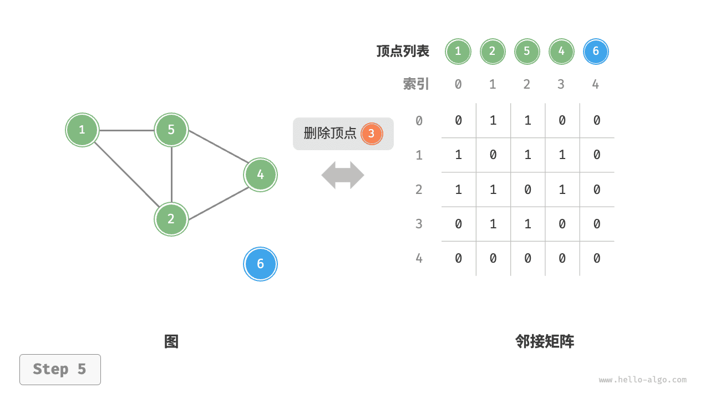

以下是基于邻接矩阵表示图的实现代码：

```python
class GraphAdjMat:
    """基于邻接矩阵实现的无向图类"""

    def __init__(self, vertices: list[int], edges: list[list[int]]):
        """构造方法"""
        # 顶点列表，元素代表“顶点值”，索引代表“顶点索引”
        self.vertices: list[int] = []
        # 邻接矩阵，行列索引对应“顶点索引”
        self.adj_mat: list[list[int]] = []
        # 添加顶点
        for val in vertices:
            self.add_vertex(val)
        # 添加边
        # 请注意，edges 元素代表顶点索引，即对应 vertices 元素索引
        for e in edges:
            self.add_edge(e[0], e[1])

    def size(self) -> int:
        """获取顶点数量"""
        return len(self.vertices)

    def add_vertex(self, val: int):
        """添加顶点"""
        n = self.size()
        # 向顶点列表中添加新顶点的值
        self.vertices.append(val)
        # 在邻接矩阵中添加一行
        new_row = [0] * n
        self.adj_mat.append(new_row)
        # 在邻接矩阵中添加一列
        for row in self.adj_mat:
            row.append(0)

    def remove_vertex(self, index: int):
        """删除顶点"""
        if index >= self.size():
            raise IndexError()
        # 在顶点列表中移除索引 index 的顶点
        self.vertices.pop(index)
        # 在邻接矩阵中删除索引 index 的行
        self.adj_mat.pop(index)
        # 在邻接矩阵中删除索引 index 的列
        for row in self.adj_mat:
            row.pop(index)

    def add_edge(self, i: int, j: int):
        """添加边"""
        # 参数 i, j 对应 vertices 元素索引
        # 索引越界与相等处理
        if i < 0 or j < 0 or i >= self.size() or j >= self.size() or i == j:
            raise IndexError()
        # 在无向图中，邻接矩阵关于主对角线对称，即满足 (i, j) == (j, i)
        self.adj_mat[i][j] = 1
        self.adj_mat[j][i] = 1

    def remove_edge(self, i: int, j: int):
        """删除边"""
        # 参数 i, j 对应 vertices 元素索引
        # 索引越界与相等处理
        if i < 0 or j < 0 or i >= self.size() or j >= self.size() or i == j:
            raise IndexError()
        self.adj_mat[i][j] = 0
        self.adj_mat[j][i] = 0

    def print(self):
        """打印邻接矩阵"""
        print("顶点列表 =", self.vertices)
        print("邻接矩阵 =")
        print_matrix(self.adj_mat)
```

!!! example [pythontutor "可视化运行"](https://pythontutor.com/iframe-embed.html#code=class%20GraphAdjMat%3A%0A%20%20%20%20%22%22%22%E5%9F%BA%E4%BA%8E%E9%82%BB%E6%8E%A5%E7%9F%A9%E9%98%B5%E5%AE%9E%E7%8E%B0%E7%9A%84%E6%97%A0%E5%90%91%E5%9B%BE%E7%B1%BB%22%22%22%0A%0A%20%20%20%20def%20__init__%28self,%20vertices%3A%20list%5Bint%5D,%20edges%3A%20list%5Blist%5Bint%5D%5D%29%3A%0A%20%20%20%20%20%20%20%20%22%22%22%E6%9E%84%E9%80%A0%E6%96%B9%E6%B3%95%22%22%22%0A%20%20%20%20%20%20%20%20self.vertices%3A%20list%5Bint%5D%20%3D%20%5B%5D%0A%20%20%20%20%20%20%20%20self.adj_mat%3A%20list%5Blist%5Bint%5D%5D%20%3D%20%5B%5D%0A%20%20%20%20%20%20%20%20%23%20%E6%B7%BB%E5%8A%A0%E9%A1%B6%E7%82%B9%0A%20%20%20%20%20%20%20%20for%20val%20in%20vertices%3A%0A%20%20%20%20%20%20%20%20%20%20%20%20self.add_vertex%28val%29%0A%20%20%20%20%20%20%20%20%23%20%E6%B7%BB%E5%8A%A0%E8%BE%B9%0A%20%20%20%20%20%20%20%20for%20e%20in%20edges%3A%0A%20%20%20%20%20%20%20%20%20%20%20%20self.add_edge%28e%5B0%5D,%20e%5B1%5D%29%0A%0A%20%20%20%20def%20size%28self%29%20-%3E%20int%3A%0A%20%20%20%20%20%20%20%20%22%22%22%E8%8E%B7%E5%8F%96%E9%A1%B6%E7%82%B9%E6%95%B0%E9%87%8F%22%22%22%0A%20%20%20%20%20%20%20%20return%20len%28self.vertices%29%0A%0A%20%20%20%20def%20add_vertex%28self,%20val%3A%20int%29%3A%0A%20%20%20%20%20%20%20%20%22%22%22%E6%B7%BB%E5%8A%A0%E9%A1%B6%E7%82%B9%22%22%22%0A%20%20%20%20%20%20%20%20n%20%3D%20self.size%28%29%0A%20%20%20%20%20%20%20%20%23%20%E5%90%91%E9%A1%B6%E7%82%B9%E5%88%97%E8%A1%A8%E4%B8%AD%E6%B7%BB%E5%8A%A0%E6%96%B0%E9%A1%B6%E7%82%B9%E7%9A%84%E5%80%BC%0A%20%20%20%20%20%20%20%20self.vertices.append%28val%29%0A%20%20%20%20%20%20%20%20%23%20%E5%9C%A8%E9%82%BB%E6%8E%A5%E7%9F%A9%E9%98%B5%E4%B8%AD%E6%B7%BB%E5%8A%A0%E4%B8%80%E8%A1%8C%0A%20%20%20%20%20%20%20%20new_row%20%3D%20%5B0%5D%20*%20n%0A%20%20%20%20%20%20%20%20self.adj_mat.append%28new_row%29%0A%20%20%20%20%20%20%20%20%23%20%E5%9C%A8%E9%82%BB%E6%8E%A5%E7%9F%A9%E9%98%B5%E4%B8%AD%E6%B7%BB%E5%8A%A0%E4%B8%80%E5%88%97%0A%20%20%20%20%20%20%20%20for%20row%20in%20self.adj_mat%3A%0A%20%20%20%20%20%20%20%20%20%20%20%20row.append%280%29%0A%0A%20%20%20%20def%20remove_vertex%28self,%20index%3A%20int%29%3A%0A%20%20%20%20%20%20%20%20%22%22%22%E5%88%A0%E9%99%A4%E9%A1%B6%E7%82%B9%22%22%22%0A%20%20%20%20%20%20%20%20if%20index%20%3E%3D%20self.size%28%29%3A%0A%20%20%20%20%20%20%20%20%20%20%20%20raise%20IndexError%28%29%0A%20%20%20%20%20%20%20%20%23%20%E5%9C%A8%E9%A1%B6%E7%82%B9%E5%88%97%E8%A1%A8%E4%B8%AD%E7%A7%BB%E9%99%A4%E7%B4%A2%E5%BC%95%20index%20%E7%9A%84%E9%A1%B6%E7%82%B9%0A%20%20%20%20%20%20%20%20self.vertices.pop%28index%29%0A%20%20%20%20%20%20%20%20%23%20%E5%9C%A8%E9%82%BB%E6%8E%A5%E7%9F%A9%E9%98%B5%E4%B8%AD%E5%88%A0%E9%99%A4%E7%B4%A2%E5%BC%95%20index%20%E7%9A%84%E8%A1%8C%0A%20%20%20%20%20%20%20%20self.adj_mat.pop%28index%29%0A%20%20%20%20%20%20%20%20%23%20%E5%9C%A8%E9%82%BB%E6%8E%A5%E7%9F%A9%E9%98%B5%E4%B8%AD%E5%88%A0%E9%99%A4%E7%B4%A2%E5%BC%95%20index%20%E7%9A%84%E5%88%97%0A%20%20%20%20%20%20%20%20for%20row%20in%20self.adj_mat%3A%0A%20%20%20%20%20%20%20%20%20%20%20%20row.pop%28index%29%0A%0A%20%20%20%20def%20add_edge%28self,%20i%3A%20int,%20j%3A%20int%29%3A%0A%20%20%20%20%20%20%20%20%22%22%22%E6%B7%BB%E5%8A%A0%E8%BE%B9%22%22%22%0A%20%20%20%20%20%20%20%20%23%20%E7%B4%A2%E5%BC%95%E8%B6%8A%E7%95%8C%E4%B8%8E%E7%9B%B8%E7%AD%89%E5%A4%84%E7%90%86%0A%20%20%20%20%20%20%20%20if%20i%20%3C%200%20or%20j%20%3C%200%20or%20i%20%3E%3D%20self.size%28%29%20or%20j%20%3E%3D%20self.size%28%29%20or%20i%20%3D%3D%20j%3A%0A%20%20%20%20%20%20%20%20%20%20%20%20raise%20IndexError%28%29%0A%20%20%20%20%20%20%20%20self.adj_mat%5Bi%5D%5Bj%5D%20%3D%201%0A%20%20%20%20%20%20%20%20self.adj_mat%5Bj%5D%5Bi%5D%20%3D%201%0A%0A%20%20%20%20def%20remove_edge%28self,%20i%3A%20int,%20j%3A%20int%29%3A%0A%20%20%20%20%20%20%20%20%22%22%22%E5%88%A0%E9%99%A4%E8%BE%B9%22%22%22%0A%20%20%20%20%20%20%20%20%23%20%E7%B4%A2%E5%BC%95%E8%B6%8A%E7%95%8C%E4%B8%8E%E7%9B%B8%E7%AD%89%E5%A4%84%E7%90%86%0A%20%20%20%20%20%20%20%20if%20i%20%3C%200%20or%20j%20%3C%200%20or%20i%20%3E%3D%20self.size%28%29%20or%20j%20%3E%3D%20self.size%28%29%20or%20i%20%3D%3D%20j%3A%0A%20%20%20%20%20%20%20%20%20%20%20%20raise%20IndexError%28%29%0A%20%20%20%20%20%20%20%20self.adj_mat%5Bi%5D%5Bj%5D%20%3D%200%0A%20%20%20%20%20%20%20%20self.adj_mat%5Bj%5D%5Bi%5D%20%3D%200%0A%0A%0A%22%22%22Driver%20Code%22%22%22%0Aif%20__name__%20%3D%3D%20%22__main__%22%3A%0A%20%20%20%20%23%20%E5%88%9D%E5%A7%8B%E5%8C%96%E6%97%A0%E5%90%91%E5%9B%BE%0A%20%20%20%20vertices%20%3D%20%5B1,%203,%202,%205,%204%5D%0A%20%20%20%20edges%20%3D%20%5B%5B0,%201%5D,%20%5B0,%203%5D,%20%5B1,%202%5D,%20%5B2,%203%5D,%20%5B2,%204%5D,%20%5B3,%204%5D%5D%0A%20%20%20%20graph%20%3D%20GraphAdjMat%28vertices,%20edges%29%0A%0A%20%20%20%20%23%20%E6%B7%BB%E5%8A%A0%E8%BE%B9%0A%20%20%20%20%23%20%E9%A1%B6%E7%82%B9%201,%202%20%E7%9A%84%E7%B4%A2%E5%BC%95%E5%88%86%E5%88%AB%E4%B8%BA%200,%202%0A%20%20%20%20graph.add_edge%280,%202%29%0A%0A%20%20%20%20%23%20%E5%88%A0%E9%99%A4%E8%BE%B9%0A%20%20%20%20%23%20%E9%A1%B6%E7%82%B9%201,%203%20%E7%9A%84%E7%B4%A2%E5%BC%95%E5%88%86%E5%88%AB%E4%B8%BA%200,%201%0A%20%20%20%20graph.remove_edge%280,%201%29%0A%0A%20%20%20%20%23%20%E6%B7%BB%E5%8A%A0%E9%A1%B6%E7%82%B9%0A%20%20%20%20graph.add_vertex%286%29%0A%0A%20%20%20%20%23%20%E5%88%A0%E9%99%A4%E9%A1%B6%E7%82%B9%0A%20%20%20%20%23%20%E9%A1%B6%E7%82%B9%203%20%E7%9A%84%E7%B4%A2%E5%BC%95%E4%B8%BA%201%0A%20%20%20%20graph.remove_vertex%281%29&codeDivHeight=800&codeDivWidth=600&cumulative=false&curInstr=3&heapPrimitives=nevernest&origin=opt-frontend.js&py=311&rawInputLstJSON=%5B%5D&textReferences=false)

## 基于邻接表的实现

设无向图的顶点总数为 $n$、边总数为 $m$ ，则可根据下图所示的方法实现各种操作。

- **添加边**：在顶点对应链表的末尾添加边即可，使用 $O(1)$ 时间。因为是无向图，所以需要同时添加两个方向的边。
- **删除边**：在顶点对应链表中查找并删除指定边，使用 $O(m)$ 时间。在无向图中，需要同时删除两个方向的边。
- **添加顶点**：在邻接表中添加一个链表，并将新增顶点作为链表头节点，使用 $O(1)$ 时间。
- **删除顶点**：需遍历整个邻接表，删除包含指定顶点的所有边，使用 $O(n + m)$ 时间。
- **初始化**：在邻接表中创建 $n$ 个顶点和 $2m$ 条边，使用 $O(n + m)$ 时间。

=== "初始化邻接表"
    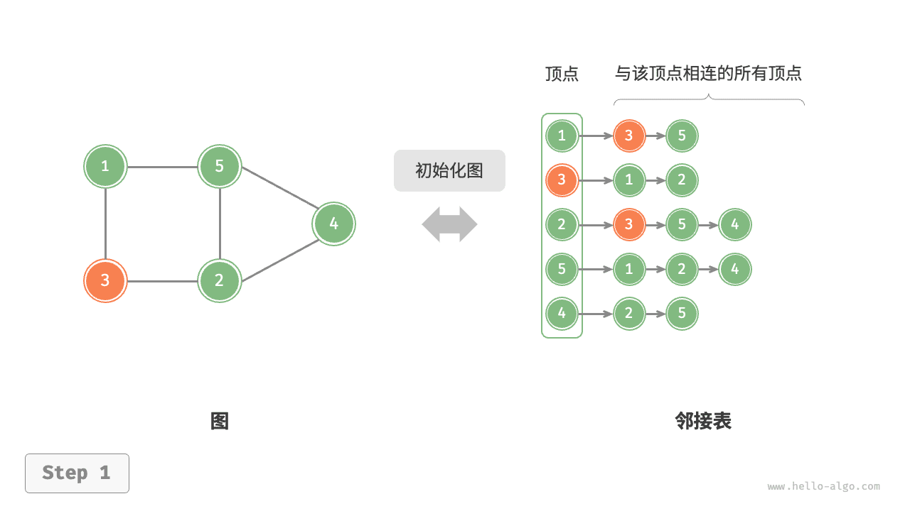

=== "添加边"
    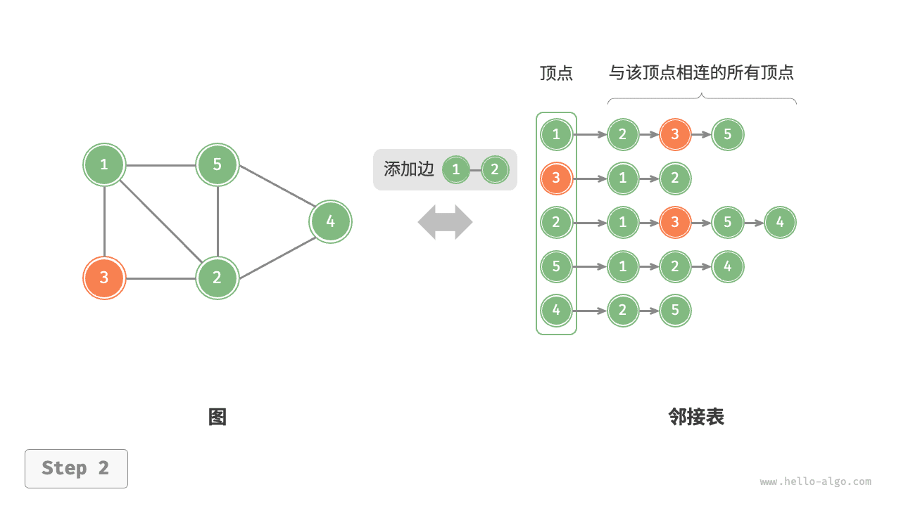

=== "删除边"
    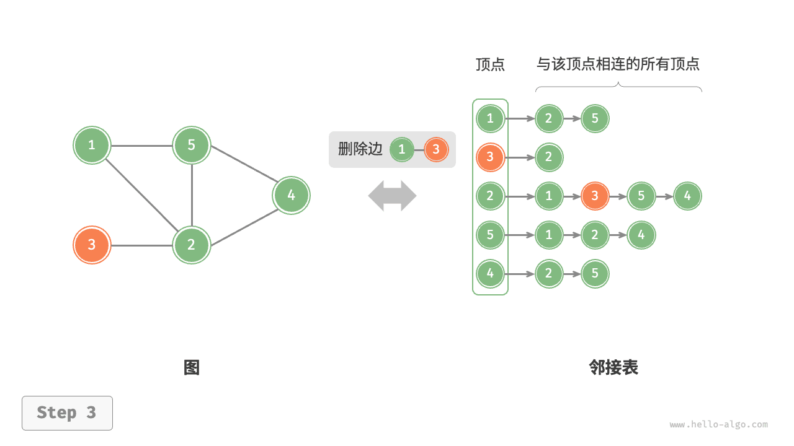

=== "添加顶点"
    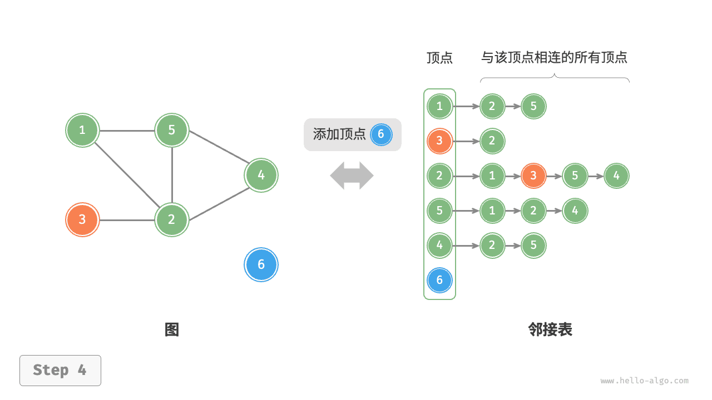

=== "删除顶点"
    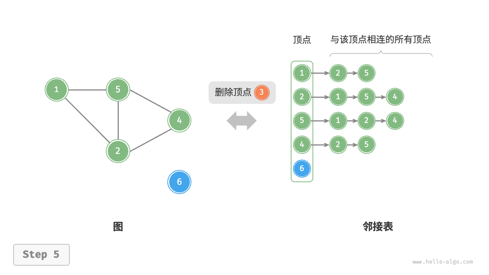

以下是邻接表的代码实现。对比上图，实际代码有以下不同。

- 为了方便添加与删除顶点，以及简化代码，我们使用列表（动态数组）来代替链表。
- 使用哈希表来存储邻接表，`key` 为顶点实例，`value` 为该顶点的邻接顶点列表（链表）。

另外，我们在邻接表中使用 `Vertex` 类来表示顶点，这样做的原因是：如果与邻接矩阵一样，用列表索引来区分不同顶点，那么假设要删除索引为 $i$ 的顶点，则需遍历整个邻接表，将所有大于 $i$ 的索引全部减 $1$ ，效率很低。而如果每个顶点都是唯一的 `Vertex` 实例，删除某一顶点之后就无须改动其他顶点了。

```python
class GraphAdjList:
    """基于邻接表实现的无向图类"""

    def __init__(self, edges: list[list[Vertex]]):
        """构造方法"""
        # 邻接表，key：顶点，value：该顶点的所有邻接顶点
        self.adj_list = dict[Vertex, list[Vertex]]()
        # 添加所有顶点和边
        for edge in edges:
            self.add_vertex(edge[0])
            self.add_vertex(edge[1])
            self.add_edge(edge[0], edge[1])

    def size(self) -> int:
        """获取顶点数量"""
        return len(self.adj_list)

    def add_edge(self, vet1: Vertex, vet2: Vertex):
        """添加边"""
        if vet1 not in self.adj_list or vet2 not in self.adj_list or vet1 == vet2:
            raise ValueError()
        # 添加边 vet1 - vet2
        self.adj_list[vet1].append(vet2)
        self.adj_list[vet2].append(vet1)

    def remove_edge(self, vet1: Vertex, vet2: Vertex):
        """删除边"""
        if vet1 not in self.adj_list or vet2 not in self.adj_list or vet1 == vet2:
            raise ValueError()
        # 删除边 vet1 - vet2
        self.adj_list[vet1].remove(vet2)
        self.adj_list[vet2].remove(vet1)

    def add_vertex(self, vet: Vertex):
        """添加顶点"""
        if vet in self.adj_list:
            return
        # 在邻接表中添加一个新链表
        self.adj_list[vet] = []

    def remove_vertex(self, vet: Vertex):
        """删除顶点"""
        if vet not in self.adj_list:
            raise ValueError()
        # 在邻接表中删除顶点 vet 对应的链表
        self.adj_list.pop(vet)
        # 遍历其他顶点的链表，删除所有包含 vet 的边
        for vertex in self.adj_list:
            if vet in self.adj_list[vertex]:
                self.adj_list[vertex].remove(vet)

    def print(self):
        """打印邻接表"""
        print("邻接表 =")
        for vertex in self.adj_list:
            tmp = [v.val for v in self.adj_list[vertex]]
            print(f"{vertex.val}: {tmp},")
```

!!! example [pythontutor "可视化运行"](https://pythontutor.com/iframe-embed.html#code=class%20Vertex%3A%0A%20%20%20%20%22%22%22%E9%A1%B6%E7%82%B9%E7%B1%BB%22%22%22%0A%20%20%20%20def%20__init__%28self,%20val%3A%20int%29%3A%0A%20%20%20%20%20%20%20%20self.val%20%3D%20val%0A%0Adef%20vals_to_vets%28vals%3A%20list%5Bint%5D%29%20-%3E%20list%5B%22Vertex%22%5D%3A%0A%20%20%20%20%22%22%22%E8%BE%93%E5%85%A5%E5%80%BC%E5%88%97%E8%A1%A8%20vals%20%EF%BC%8C%E8%BF%94%E5%9B%9E%E9%A1%B6%E7%82%B9%E5%88%97%E8%A1%A8%20vets%22%22%22%0A%20%20%20%20return%20%5BVertex%28val%29%20for%20val%20in%20vals%5D%0A%0A%0Aclass%20GraphAdjList%3A%0A%20%20%20%20%22%22%22%E5%9F%BA%E4%BA%8E%E9%82%BB%E6%8E%A5%E8%A1%A8%E5%AE%9E%E7%8E%B0%E7%9A%84%E6%97%A0%E5%90%91%E5%9B%BE%E7%B1%BB%22%22%22%0A%0A%20%20%20%20def%20__init__%28self,%20edges%3A%20list%5Blist%5BVertex%5D%5D%29%3A%0A%20%20%20%20%20%20%20%20%22%22%22%E6%9E%84%E9%80%A0%E6%96%B9%E6%B3%95%22%22%22%0A%20%20%20%20%20%20%20%20self.adj_list%20%3D%20dict%5BVertex,%20list%5BVertex%5D%5D%28%29%0A%20%20%20%20%20%20%20%20%23%20%E6%B7%BB%E5%8A%A0%E6%89%80%E6%9C%89%E9%A1%B6%E7%82%B9%E5%92%8C%E8%BE%B9%0A%20%20%20%20%20%20%20%20for%20edge%20in%20edges%3A%0A%20%20%20%20%20%20%20%20%20%20%20%20self.add_vertex%28edge%5B0%5D%29%0A%20%20%20%20%20%20%20%20%20%20%20%20self.add_vertex%28edge%5B1%5D%29%0A%20%20%20%20%20%20%20%20%20%20%20%20self.add_edge%28edge%5B0%5D,%20edge%5B1%5D%29%0A%0A%20%20%20%20def%20size%28self%29%20-%3E%20int%3A%0A%20%20%20%20%20%20%20%20%22%22%22%E8%8E%B7%E5%8F%96%E9%A1%B6%E7%82%B9%E6%95%B0%E9%87%8F%22%22%22%0A%20%20%20%20%20%20%20%20return%20len%28self.adj_list%29%0A%0A%20%20%20%20def%20add_edge%28self,%20vet1%3A%20Vertex,%20vet2%3A%20Vertex%29%3A%0A%20%20%20%20%20%20%20%20%22%22%22%E6%B7%BB%E5%8A%A0%E8%BE%B9%22%22%22%0A%20%20%20%20%20%20%20%20if%20vet1%20not%20in%20self.adj_list%20or%20vet2%20not%20in%20self.adj_list%20or%20vet1%20%3D%3D%20vet2%3A%0A%20%20%20%20%20%20%20%20%20%20%20%20raise%20ValueError%28%29%0A%20%20%20%20%20%20%20%20%23%20%E6%B7%BB%E5%8A%A0%E8%BE%B9%20vet1%20-%20vet2%0A%20%20%20%20%20%20%20%20self.adj_list%5Bvet1%5D.append%28vet2%29%0A%20%20%20%20%20%20%20%20self.adj_list%5Bvet2%5D.append%28vet1%29%0A%0A%20%20%20%20def%20remove_edge%28self,%20vet1%3A%20Vertex,%20vet2%3A%20Vertex%29%3A%0A%20%20%20%20%20%20%20%20%22%22%22%E5%88%A0%E9%99%A4%E8%BE%B9%22%22%22%0A%20%20%20%20%20%20%20%20if%20vet1%20not%20in%20self.adj_list%20or%20vet2%20not%20in%20self.adj_list%20or%20vet1%20%3D%3D%20vet2%3A%0A%20%20%20%20%20%20%20%20%20%20%20%20raise%20ValueError%28%29%0A%20%20%20%20%20%20%20%20%23%20%E5%88%A0%E9%99%A4%E8%BE%B9%20vet1%20-%20vet2%0A%20%20%20%20%20%20%20%20self.adj_list%5Bvet1%5D.remove%28vet2%29%0A%20%20%20%20%20%20%20%20self.adj_list%5Bvet2%5D.remove%28vet1%29%0A%0A%20%20%20%20def%20add_vertex%28self,%20vet%3A%20Vertex%29%3A%0A%20%20%20%20%20%20%20%20%22%22%22%E6%B7%BB%E5%8A%A0%E9%A1%B6%E7%82%B9%22%22%22%0A%20%20%20%20%20%20%20%20if%20vet%20in%20self.adj_list%3A%0A%20%20%20%20%20%20%20%20%20%20%20%20return%0A%20%20%20%20%20%20%20%20%23%20%E5%9C%A8%E9%82%BB%E6%8E%A5%E8%A1%A8%E4%B8%AD%E6%B7%BB%E5%8A%A0%E4%B8%80%E4%B8%AA%E6%96%B0%E9%93%BE%E8%A1%A8%0A%20%20%20%20%20%20%20%20self.adj_list%5Bvet%5D%20%3D%20%5B%5D%0A%0A%20%20%20%20def%20remove_vertex%28self,%20vet%3A%20Vertex%29%3A%0A%20%20%20%20%20%20%20%20%22%22%22%E5%88%A0%E9%99%A4%E9%A1%B6%E7%82%B9%22%22%22%0A%20%20%20%20%20%20%20%20if%20vet%20not%20in%20self.adj_list%3A%0A%20%20%20%20%20%20%20%20%20%20%20%20raise%20ValueError%28%29%0A%20%20%20%20%20%20%20%20%23%20%E5%9C%A8%E9%82%BB%E6%8E%A5%E8%A1%A8%E4%B8%AD%E5%88%A0%E9%99%A4%E9%A1%B6%E7%82%B9%20vet%20%E5%AF%B9%E5%BA%94%E7%9A%84%E9%93%BE%E8%A1%A8%0A%20%20%20%20%20%20%20%20self.adj_list.pop%28vet%29%0A%20%20%20%20%20%20%20%20%23%20%E9%81%8D%E5%8E%86%E5%85%B6%E4%BB%96%E9%A1%B6%E7%82%B9%E7%9A%84%E9%93%BE%E8%A1%A8%EF%BC%8C%E5%88%A0%E9%99%A4%E6%89%80%E6%9C%89%E5%8C%85%E5%90%AB%20vet%20%E7%9A%84%E8%BE%B9%0A%20%20%20%20%20%20%20%20for%20vertex%20in%20self.adj_list%3A%0A%20%20%20%20%20%20%20%20%20%20%20%20if%20vet%20in%20self.adj_list%5Bvertex%5D%3A%0A%20%20%20%20%20%20%20%20%20%20%20%20%20%20%20%20self.adj_list%5Bvertex%5D.remove%28vet%29%0A%0A%0A%22%22%22Driver%20Code%22%22%22%0Aif%20__name__%20%3D%3D%20%22__main__%22%3A%0A%20%20%20%20%23%20%E5%88%9D%E5%A7%8B%E5%8C%96%E6%97%A0%E5%90%91%E5%9B%BE%0A%20%20%20%20v%20%3D%20vals_to_vets%28%5B1,%203,%202,%205,%204%5D%29%0A%20%20%20%20edges%20%3D%20%5B%0A%20%20%20%20%20%20%20%20%5Bv%5B0%5D,%20v%5B1%5D%5D,%0A%20%20%20%20%20%20%20%20%5Bv%5B0%5D,%20v%5B3%5D%5D,%0A%20%20%20%20%20%20%20%20%5Bv%5B1%5D,%20v%5B2%5D%5D,%0A%20%20%20%20%20%20%20%20%5Bv%5B2%5D,%20v%5B3%5D%5D,%0A%20%20%20%20%20%20%20%20%5Bv%5B2%5D,%20v%5B4%5D%5D,%0A%20%20%20%20%20%20%20%20%5Bv%5B3%5D,%20v%5B4%5D%5D,%0A%20%20%20%20%5D%0A%20%20%20%20graph%20%3D%20GraphAdjList%28edges%29%0A%20%20%20%20del%20edges%0A%0A%20%20%20%20%23%20%E6%B7%BB%E5%8A%A0%E8%BE%B9%0A%20%20%20%20graph.add_edge%28v%5B0%5D,%20v%5B2%5D%29%0A%0A%20%20%20%20%23%20%E5%88%A0%E9%99%A4%E8%BE%B9%0A%20%20%20%20graph.remove_edge%28v%5B0%5D,%20v%5B1%5D%29%0A%0A%20%20%20%20%23%20%E6%B7%BB%E5%8A%A0%E9%A1%B6%E7%82%B9%0A%20%20%20%20v5%20%3D%20Vertex%286%29%0A%20%20%20%20graph.add_vertex%28v5%29%0A%0A%20%20%20%20%23%20%E5%88%A0%E9%99%A4%E9%A1%B6%E7%82%B9%0A%20%20%20%20graph.remove_vertex%28v%5B1%5D%29&codeDivHeight=800&codeDivWidth=600&cumulative=false&curInstr=39&heapPrimitives=nevernest&origin=opt-frontend.js&py=311&rawInputLstJSON=%5B%5D&textReferences=false)

## 效率对比

设图中共有 $n$ 个顶点和 $m$ 条边，下表对比了邻接矩阵和邻接表的时间效率和空间效率。请注意，邻接表（链表）对应本文实现，而邻接表（哈希表）专指将所有链表替换为哈希表后的实现。

<p align="center"> 表 <id> &nbsp; 邻接矩阵与邻接表对比 </p>

|              | 邻接矩阵 | 邻接表（链表） | 邻接表（哈希表） |
| ------------ | -------- | -------------- | ---------------- |
| 判断是否邻接 | $O(1)$   | $O(n)$         | $O(1)$           |
| 添加边       | $O(1)$   | $O(1)$         | $O(1)$           |
| 删除边       | $O(1)$   | $O(n)$         | $O(1)$           |
| 添加顶点     | $O(n)$   | $O(1)$         | $O(1)$           |
| 删除顶点     | $O(n^2)$ | $O(n + m)$     | $O(n)$           |
| 内存空间占用 | $O(n^2)$ | $O(n + m)$     | $O(n + m)$       |

观察上表，似乎邻接表（哈希表）的时间效率与空间效率最优。但实际上，在邻接矩阵中操作边的效率更高，只需一次数组访问或赋值操作即可。综合来看，邻接矩阵体现了“以空间换时间”的原则，而邻接表体现了“以时间换空间”的原则。

# 图的遍历

树代表的是“一对多”的关系，而图则具有更高的自由度，可以表示任意的“多对多”关系。因此，我们可以把树看作图的一种特例。显然，**树的遍历操作也是图的遍历操作的一种特例**。

图和树都需要应用搜索算法来实现遍历操作。图的遍历方式也可分为两种：<u>广度优先遍历</u>和<u>深度优先遍历</u>。

## 广度优先遍历

**广度优先遍历是一种由近及远的遍历方式，从某个节点出发，始终优先访问距离最近的顶点，并一层层向外扩张**。如下图所示，从左上角顶点出发，首先遍历该顶点的所有邻接顶点，然后遍历下一个顶点的所有邻接顶点，以此类推，直至所有顶点访问完毕。

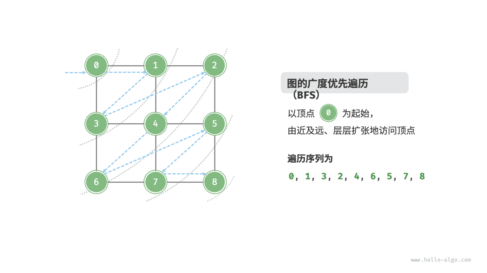

### 算法实现

BFS 通常借助队列来实现，代码如下所示。队列具有“先入先出”的性质，这与 BFS 的“由近及远”的思想异曲同工。

1. 将遍历起始顶点 `startVet` 加入队列，并开启循环。
2. 在循环的每轮迭代中，弹出队首顶点并记录访问，然后将该顶点的所有邻接顶点加入到队列尾部。
3. 循环步骤 `2.` ，直到所有顶点被访问完毕后结束。

为了防止重复遍历顶点，我们需要借助一个哈希集合 `visited` 来记录哪些节点已被访问。

!!! tip

    哈希集合可以看作一个只存储 `key` 而不存储 `value` 的哈希表，它可以在 $O(1)$ 时间复杂度下进行 `key` 的增删查改操作。根据 `key` 的唯一性，哈希集合通常用于数据去重等场景。

```python
def graph_bfs(graph: GraphAdjList, start_vet: Vertex) -> list[Vertex]:
    """广度优先遍历"""
    # 使用邻接表来表示图，以便获取指定顶点的所有邻接顶点
    # 顶点遍历序列
    res = []
    # 哈希集合，用于记录已被访问过的顶点
    visited = set[Vertex]([start_vet])
    # 队列用于实现 BFS
    que = deque[Vertex]([start_vet])
    # 以顶点 vet 为起点，循环直至访问完所有顶点
    while len(que) > 0:
        vet = que.popleft()  # 队首顶点出队
        res.append(vet)  # 记录访问顶点
        # 遍历该顶点的所有邻接顶点
        for adj_vet in graph.adj_list[vet]:
            if adj_vet in visited:
                continue  # 跳过已被访问的顶点
            que.append(adj_vet)  # 只入队未访问的顶点
            visited.add(adj_vet)  # 标记该顶点已被访问
    # 返回顶点遍历序列
    return res
```

!!! example [pythontutor "可视化运行"](https://pythontutor.com/iframe-embed.html#code=from%20collections%20import%20deque%0A%0Aclass%20Vertex%3A%0A%20%20%20%20%22%22%22%E9%A1%B6%E7%82%B9%E7%B1%BB%22%22%22%0A%20%20%20%20def%20__init__%28self,%20val%3A%20int%29%3A%0A%20%20%20%20%20%20%20%20self.val%20%3D%20val%0A%0Adef%20vals_to_vets%28vals%3A%20list%5Bint%5D%29%20-%3E%20list%5B%22Vertex%22%5D%3A%0A%20%20%20%20%22%22%22%E8%BE%93%E5%85%A5%E5%80%BC%E5%88%97%E8%A1%A8%20vals%20%EF%BC%8C%E8%BF%94%E5%9B%9E%E9%A1%B6%E7%82%B9%E5%88%97%E8%A1%A8%20vets%22%22%22%0A%20%20%20%20return%20%5BVertex%28val%29%20for%20val%20in%20vals%5D%0A%0Aclass%20GraphAdjList%3A%0A%20%20%20%20%22%22%22%E5%9F%BA%E4%BA%8E%E9%82%BB%E6%8E%A5%E8%A1%A8%E5%AE%9E%E7%8E%B0%E7%9A%84%E6%97%A0%E5%90%91%E5%9B%BE%E7%B1%BB%22%22%22%0A%0A%20%20%20%20def%20__init__%28self,%20edges%3A%20list%5Blist%5BVertex%5D%5D%29%3A%0A%20%20%20%20%20%20%20%20%22%22%22%E6%9E%84%E9%80%A0%E6%96%B9%E6%B3%95%22%22%22%0A%20%20%20%20%20%20%20%20self.adj_list%20%3D%20dict%5BVertex,%20list%5BVertex%5D%5D%28%29%0A%20%20%20%20%20%20%20%20for%20edge%20in%20edges%3A%0A%20%20%20%20%20%20%20%20%20%20%20%20self.add_vertex%28edge%5B0%5D%29%0A%20%20%20%20%20%20%20%20%20%20%20%20self.add_vertex%28edge%5B1%5D%29%0A%20%20%20%20%20%20%20%20%20%20%20%20self.add_edge%28edge%5B0%5D,%20edge%5B1%5D%29%0A%0A%20%20%20%20def%20add_edge%28self,%20vet1%3A%20Vertex,%20vet2%3A%20Vertex%29%3A%0A%20%20%20%20%20%20%20%20%22%22%22%E6%B7%BB%E5%8A%A0%E8%BE%B9%22%22%22%0A%20%20%20%20%20%20%20%20if%20vet1%20not%20in%20self.adj_list%20or%20vet2%20not%20in%20self.adj_list%20or%20vet1%20%3D%3D%20vet2%3A%0A%20%20%20%20%20%20%20%20%20%20%20%20raise%20ValueError%28%29%0A%20%20%20%20%20%20%20%20self.adj_list%5Bvet1%5D.append%28vet2%29%0A%20%20%20%20%20%20%20%20self.adj_list%5Bvet2%5D.append%28vet1%29%0A%0A%20%20%20%20def%20add_vertex%28self,%20vet%3A%20Vertex%29%3A%0A%20%20%20%20%20%20%20%20%22%22%22%E6%B7%BB%E5%8A%A0%E9%A1%B6%E7%82%B9%22%22%22%0A%20%20%20%20%20%20%20%20if%20vet%20in%20self.adj_list%3A%0A%20%20%20%20%20%20%20%20%20%20%20%20return%0A%20%20%20%20%20%20%20%20self.adj_list%5Bvet%5D%20%3D%20%5B%5D%0A%0A%0Adef%20graph_bfs%28graph%3A%20GraphAdjList,%20start_vet%3A%20Vertex%29%20-%3E%20list%5BVertex%5D%3A%0A%20%20%20%20%22%22%22%E5%B9%BF%E5%BA%A6%E4%BC%98%E5%85%88%E9%81%8D%E5%8E%86%22%22%22%0A%20%20%20%20%23%20%E9%A1%B6%E7%82%B9%E9%81%8D%E5%8E%86%E5%BA%8F%E5%88%97%0A%20%20%20%20res%20%3D%20%5B%5D%0A%20%20%20%20%23%20%E5%93%88%E5%B8%8C%E8%A1%A8%EF%BC%8C%E7%94%A8%E4%BA%8E%E8%AE%B0%E5%BD%95%E5%B7%B2%E8%A2%AB%E8%AE%BF%E9%97%AE%E8%BF%87%E7%9A%84%E9%A1%B6%E7%82%B9%0A%20%20%20%20visited%20%3D%20set%5BVertex%5D%28%5Bstart_vet%5D%29%0A%20%20%20%20%23%20%E9%98%9F%E5%88%97%E7%94%A8%E4%BA%8E%E5%AE%9E%E7%8E%B0%20BFS%0A%20%20%20%20que%20%3D%20deque%5BVertex%5D%28%5Bstart_vet%5D%29%0A%20%20%20%20%23%20%E4%BB%A5%E9%A1%B6%E7%82%B9%20vet%20%E4%B8%BA%E8%B5%B7%E7%82%B9%EF%BC%8C%E5%BE%AA%E7%8E%AF%E7%9B%B4%E8%87%B3%E8%AE%BF%E9%97%AE%E5%AE%8C%E6%89%80%E6%9C%89%E9%A1%B6%E7%82%B9%0A%20%20%20%20while%20len%28que%29%20%3E%200%3A%0A%20%20%20%20%20%20%20%20vet%20%3D%20que.popleft%28%29%20%20%23%20%E9%98%9F%E9%A6%96%E9%A1%B6%E7%82%B9%E5%87%BA%E9%98%9F%0A%20%20%20%20%20%20%20%20res.append%28vet%29%20%20%23%20%E8%AE%B0%E5%BD%95%E8%AE%BF%E9%97%AE%E9%A1%B6%E7%82%B9%0A%20%20%20%20%20%20%20%20%23%20%E9%81%8D%E5%8E%86%E8%AF%A5%E9%A1%B6%E7%82%B9%E7%9A%84%E6%89%80%E6%9C%89%E9%82%BB%E6%8E%A5%E9%A1%B6%E7%82%B9%0A%20%20%20%20%20%20%20%20for%20adj_vet%20in%20graph.adj_list%5Bvet%5D%3A%0A%20%20%20%20%20%20%20%20%20%20%20%20if%20adj_vet%20in%20visited%3A%0A%20%20%20%20%20%20%20%20%20%20%20%20%20%20%20%20continue%20%20%23%20%E8%B7%B3%E8%BF%87%E5%B7%B2%E8%A2%AB%E8%AE%BF%E9%97%AE%E7%9A%84%E9%A1%B6%E7%82%B9%0A%20%20%20%20%20%20%20%20%20%20%20%20que.append%28adj_vet%29%20%20%23%20%E5%8F%AA%E5%85%A5%E9%98%9F%E6%9C%AA%E8%AE%BF%E9%97%AE%E7%9A%84%E9%A1%B6%E7%82%B9%0A%20%20%20%20%20%20%20%20%20%20%20%20visited.add%28adj_vet%29%20%20%23%20%E6%A0%87%E8%AE%B0%E8%AF%A5%E9%A1%B6%E7%82%B9%E5%B7%B2%E8%A2%AB%E8%AE%BF%E9%97%AE%0A%20%20%20%20%23%20%E8%BF%94%E5%9B%9E%E9%A1%B6%E7%82%B9%E9%81%8D%E5%8E%86%E5%BA%8F%E5%88%97%0A%20%20%20%20return%20res%0A%0A%22%22%22Driver%20Code%22%22%22%0Aif%20__name__%20%3D%3D%20%22__main__%22%3A%0A%20%20%20%20%23%20%E5%88%9D%E5%A7%8B%E5%8C%96%E6%97%A0%E5%90%91%E5%9B%BE%0A%20%20%20%20v%20%3D%20vals_to_vets%28%5B0,%201,%202,%203,%204%5D%29%0A%20%20%20%20edges%20%3D%20%5B%0A%20%20%20%20%20%20%20%20%5Bv%5B0%5D,%20v%5B1%5D%5D,%0A%20%20%20%20%20%20%20%20%5Bv%5B0%5D,%20v%5B3%5D%5D,%0A%20%20%20%20%20%20%20%20%5Bv%5B1%5D,%20v%5B2%5D%5D,%0A%20%20%20%20%20%20%20%20%5Bv%5B1%5D,%20v%5B4%5D%5D,%0A%20%20%20%20%20%20%20%20%5Bv%5B3%5D,%20v%5B4%5D%5D,%0A%20%20%20%20%5D%0A%20%20%20%20graph%20%3D%20GraphAdjList%28edges%29%0A%20%20%20%20del%20edges%0A%0A%20%20%20%20%23%20%E5%B9%BF%E5%BA%A6%E4%BC%98%E5%85%88%E9%81%8D%E5%8E%86%0A%20%20%20%20res%20%3D%20graph_bfs%28graph,%20v%5B0%5D%29&codeDivHeight=800&codeDivWidth=600&cumulative=false&curInstr=131&heapPrimitives=nevernest&origin=opt-frontend.js&py=311&rawInputLstJSON=%5B%5D&textReferences=false)

代码相对抽象，建议对照下图来加深理解。

=== "<1>"
    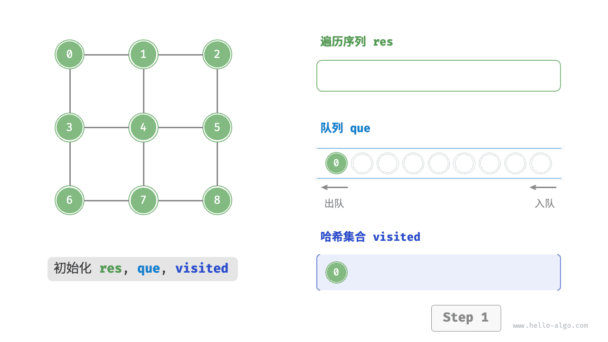

=== "<2>"
    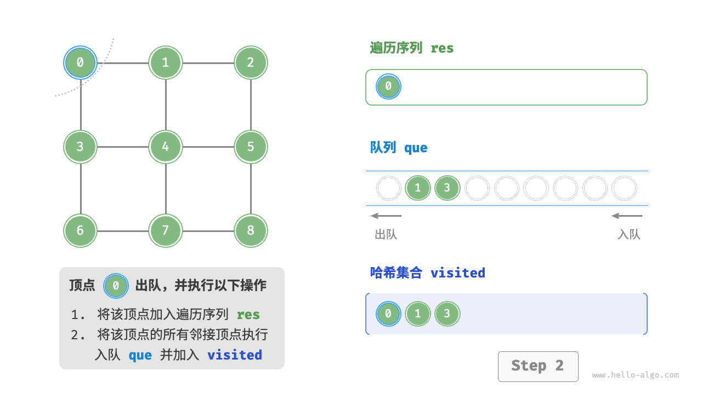

=== "<3>"
    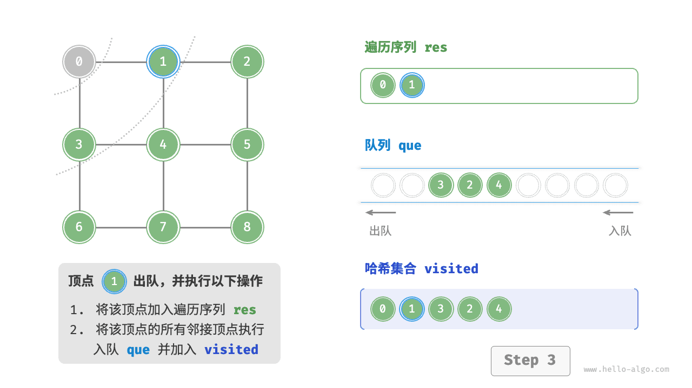

=== "<4>"
    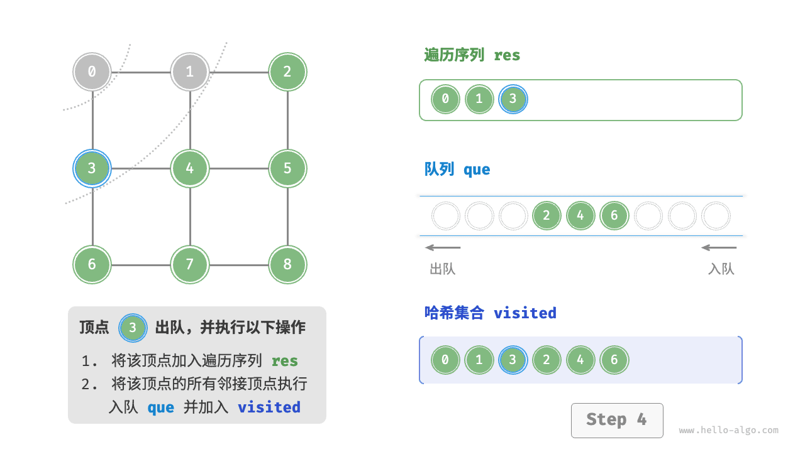

=== "<5>"
    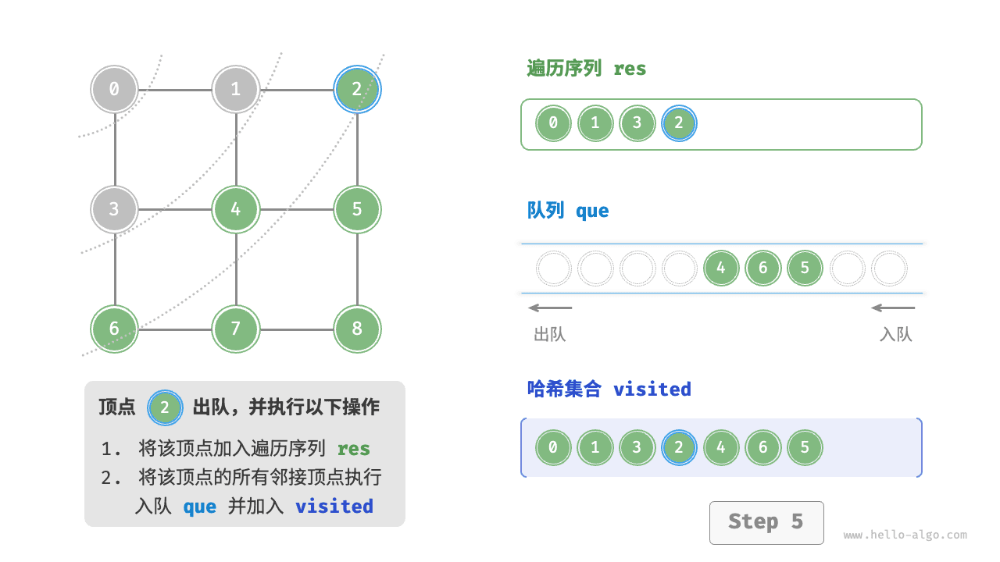

=== "<6>"
    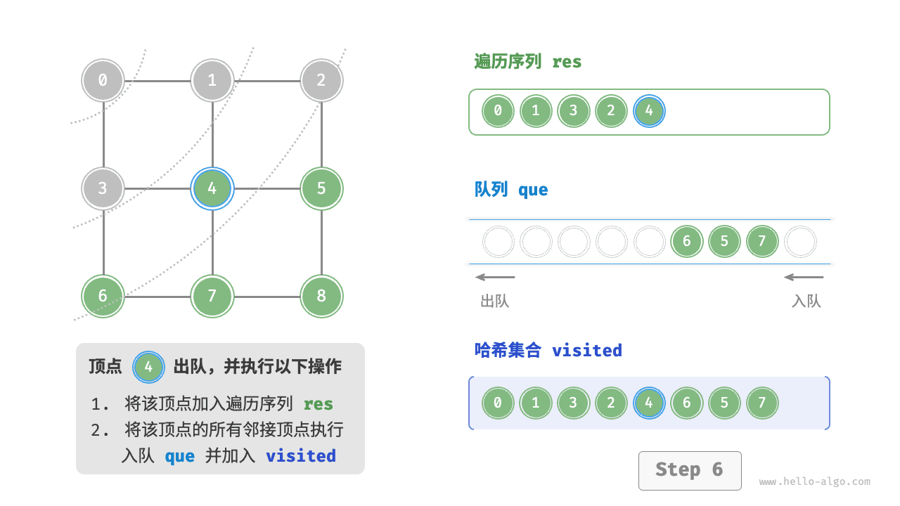

=== "<7>"
    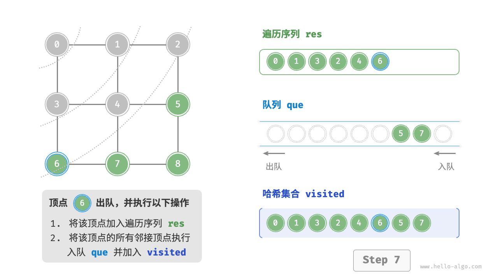

=== "<8>"
    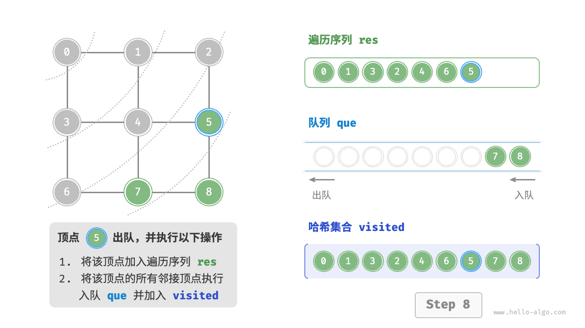

=== "<9>"
    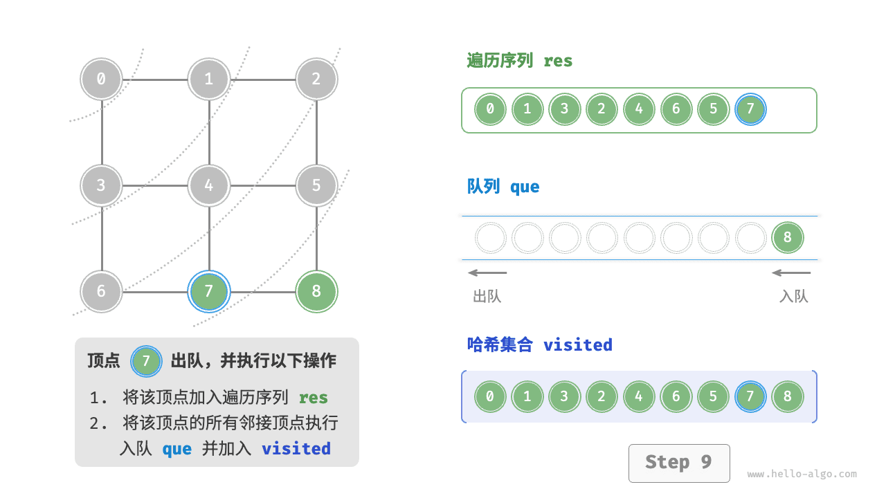

=== "<10>"
    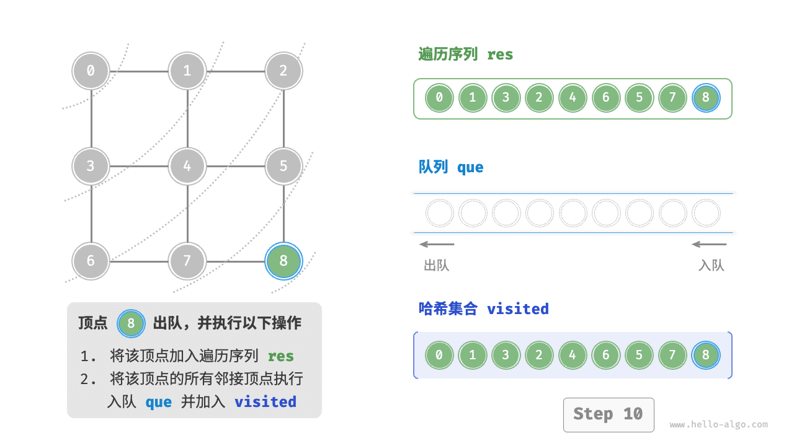

=== "<11>"
    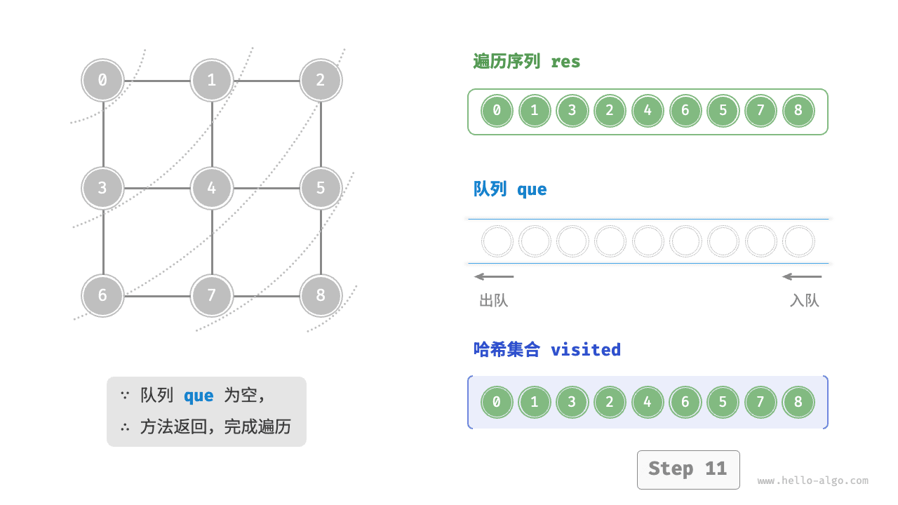

!!! question "广度优先遍历的序列是否唯一？"

    不唯一。广度优先遍历只要求按“由近及远”的顺序遍历，**而多个相同距离的顶点的遍历顺序允许被任意打乱**。以上图为例，顶点 $1$、$3$ 的访问顺序可以交换，顶点 $2$、$4$、$6$ 的访问顺序也可以任意交换。

### 复杂度分析

**时间复杂度**：所有顶点都会入队并出队一次，使用 $O(|V|)$ 时间；在遍历邻接顶点的过程中，由于是无向图，因此所有边都会被访问 $2$ 次，使用 $O(2|E|)$ 时间；总体使用 $O(|V| + |E|)$ 时间。

**空间复杂度**：列表 `res` ，哈希集合 `visited` ，队列 `que` 中的顶点数量最多为 $|V|$ ，使用 $O(|V|)$ 空间。

## 深度优先遍历

**深度优先遍历是一种优先走到底、无路可走再回头的遍历方式**。如下图所示，从左上角顶点出发，访问当前顶点的某个邻接顶点，直到走到尽头时返回，再继续走到尽头并返回，以此类推，直至所有顶点遍历完成。

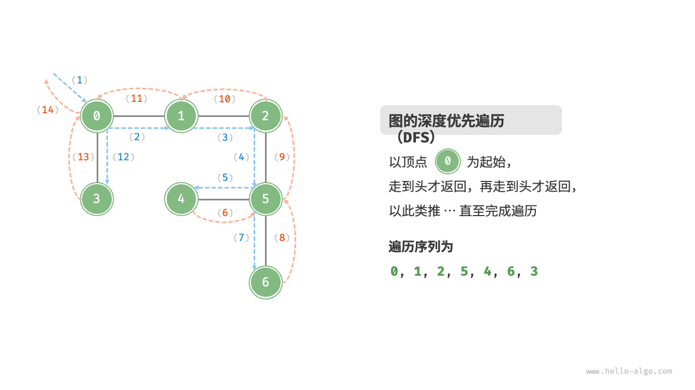

### 算法实现

这种“走到尽头再返回”的算法范式通常基于递归来实现。与广度优先遍历类似，在深度优先遍历中，我们也需要借助一个哈希集合 `visited` 来记录已被访问的顶点，以避免重复访问顶点。

```python
def dfs(graph: GraphAdjList, visited: set[Vertex], res: list[Vertex], vet: Vertex):
    """深度优先遍历辅助函数"""
    res.append(vet)  # 记录访问顶点
    visited.add(vet)  # 标记该顶点已被访问
    # 遍历该顶点的所有邻接顶点
    for adjVet in graph.adj_list[vet]:
        if adjVet in visited:
            continue  # 跳过已被访问的顶点
        # 递归访问邻接顶点
        dfs(graph, visited, res, adjVet)

def graph_dfs(graph: GraphAdjList, start_vet: Vertex) -> list[Vertex]:
    """深度优先遍历"""
    # 使用邻接表来表示图，以便获取指定顶点的所有邻接顶点
    # 顶点遍历序列
    res = []
    # 哈希集合，用于记录已被访问过的顶点
    visited = set[Vertex]()
    dfs(graph, visited, res, start_vet)
    return res
```

!!! example [pythontutor "可视化运行"](https://pythontutor.com/iframe-embed.html#code=class%20Vertex%3A%0A%20%20%20%20%22%22%22%E9%A1%B6%E7%82%B9%E7%B1%BB%22%22%22%0A%20%20%20%20def%20__init__%28self,%20val%3A%20int%29%3A%0A%20%20%20%20%20%20%20%20self.val%20%3D%20val%0A%0Adef%20vals_to_vets%28vals%3A%20list%5Bint%5D%29%20-%3E%20list%5B%22Vertex%22%5D%3A%0A%20%20%20%20%22%22%22%E8%BE%93%E5%85%A5%E5%80%BC%E5%88%97%E8%A1%A8%20vals%20%EF%BC%8C%E8%BF%94%E5%9B%9E%E9%A1%B6%E7%82%B9%E5%88%97%E8%A1%A8%20vets%22%22%22%0A%20%20%20%20return%20%5BVertex%28val%29%20for%20val%20in%20vals%5D%0A%0Aclass%20GraphAdjList%3A%0A%20%20%20%20%22%22%22%E5%9F%BA%E4%BA%8E%E9%82%BB%E6%8E%A5%E8%A1%A8%E5%AE%9E%E7%8E%B0%E7%9A%84%E6%97%A0%E5%90%91%E5%9B%BE%E7%B1%BB%22%22%22%0A%0A%20%20%20%20def%20__init__%28self,%20edges%3A%20list%5Blist%5BVertex%5D%5D%29%3A%0A%20%20%20%20%20%20%20%20%22%22%22%E6%9E%84%E9%80%A0%E6%96%B9%E6%B3%95%22%22%22%0A%20%20%20%20%20%20%20%20self.adj_list%20%3D%20dict%5BVertex,%20list%5BVertex%5D%5D%28%29%0A%20%20%20%20%20%20%20%20for%20edge%20in%20edges%3A%0A%20%20%20%20%20%20%20%20%20%20%20%20self.add_vertex%28edge%5B0%5D%29%0A%20%20%20%20%20%20%20%20%20%20%20%20self.add_vertex%28edge%5B1%5D%29%0A%20%20%20%20%20%20%20%20%20%20%20%20self.add_edge%28edge%5B0%5D,%20edge%5B1%5D%29%0A%0A%20%20%20%20def%20add_edge%28self,%20vet1%3A%20Vertex,%20vet2%3A%20Vertex%29%3A%0A%20%20%20%20%20%20%20%20%22%22%22%E6%B7%BB%E5%8A%A0%E8%BE%B9%22%22%22%0A%20%20%20%20%20%20%20%20if%20vet1%20not%20in%20self.adj_list%20or%20vet2%20not%20in%20self.adj_list%20or%20vet1%20%3D%3D%20vet2%3A%0A%20%20%20%20%20%20%20%20%20%20%20%20raise%20ValueError%28%29%0A%20%20%20%20%20%20%20%20self.adj_list%5Bvet1%5D.append%28vet2%29%0A%20%20%20%20%20%20%20%20self.adj_list%5Bvet2%5D.append%28vet1%29%0A%0A%20%20%20%20def%20add_vertex%28self,%20vet%3A%20Vertex%29%3A%0A%20%20%20%20%20%20%20%20%22%22%22%E6%B7%BB%E5%8A%A0%E9%A1%B6%E7%82%B9%22%22%22%0A%20%20%20%20%20%20%20%20if%20vet%20in%20self.adj_list%3A%0A%20%20%20%20%20%20%20%20%20%20%20%20return%0A%20%20%20%20%20%20%20%20self.adj_list%5Bvet%5D%20%3D%20%5B%5D%0A%0A%0Adef%20dfs%28graph%3A%20GraphAdjList,%20visited%3A%20set%5BVertex%5D,%20res%3A%20list%5BVertex%5D,%20vet%3A%20Vertex%29%3A%0A%20%20%20%20%22%22%22%E6%B7%B1%E5%BA%A6%E4%BC%98%E5%85%88%E9%81%8D%E5%8E%86%E8%BE%85%E5%8A%A9%E5%87%BD%E6%95%B0%22%22%22%0A%20%20%20%20res.append%28vet%29%20%20%23%20%E8%AE%B0%E5%BD%95%E8%AE%BF%E9%97%AE%E9%A1%B6%E7%82%B9%0A%20%20%20%20visited.add%28vet%29%20%20%23%20%E6%A0%87%E8%AE%B0%E8%AF%A5%E9%A1%B6%E7%82%B9%E5%B7%B2%E8%A2%AB%E8%AE%BF%E9%97%AE%0A%20%20%20%20%23%20%E9%81%8D%E5%8E%86%E8%AF%A5%E9%A1%B6%E7%82%B9%E7%9A%84%E6%89%80%E6%9C%89%E9%82%BB%E6%8E%A5%E9%A1%B6%E7%82%B9%0A%20%20%20%20for%20adjVet%20in%20graph.adj_list%5Bvet%5D%3A%0A%20%20%20%20%20%20%20%20if%20adjVet%20in%20visited%3A%0A%20%20%20%20%20%20%20%20%20%20%20%20continue%20%20%23%20%E8%B7%B3%E8%BF%87%E5%B7%B2%E8%A2%AB%E8%AE%BF%E9%97%AE%E7%9A%84%E9%A1%B6%E7%82%B9%0A%20%20%20%20%20%20%20%20%23%20%E9%80%92%E5%BD%92%E8%AE%BF%E9%97%AE%E9%82%BB%E6%8E%A5%E9%A1%B6%E7%82%B9%0A%20%20%20%20%20%20%20%20dfs%28graph,%20visited,%20res,%20adjVet%29%0A%0A%0Adef%20graph_dfs%28graph%3A%20GraphAdjList,%20start_vet%3A%20Vertex%29%20-%3E%20list%5BVertex%5D%3A%0A%20%20%20%20%22%22%22%E6%B7%B1%E5%BA%A6%E4%BC%98%E5%85%88%E9%81%8D%E5%8E%86%22%22%22%0A%20%20%20%20%23%20%E4%BD%BF%E7%94%A8%E9%82%BB%E6%8E%A5%E8%A1%A8%E6%9D%A5%E8%A1%A8%E7%A4%BA%E5%9B%BE%EF%BC%8C%E4%BB%A5%E4%BE%BF%E8%8E%B7%E5%8F%96%E6%8C%87%E5%AE%9A%E9%A1%B6%E7%82%B9%E7%9A%84%E6%89%80%E6%9C%89%E9%82%BB%E6%8E%A5%E9%A1%B6%E7%82%B9%0A%20%20%20%20%23%20%E9%A1%B6%E7%82%B9%E9%81%8D%E5%8E%86%E5%BA%8F%E5%88%97%0A%20%20%20%20res%20%3D%20%5B%5D%0A%20%20%20%20%23%20%E5%93%88%E5%B8%8C%E8%A1%A8%EF%BC%8C%E7%94%A8%E4%BA%8E%E8%AE%B0%E5%BD%95%E5%B7%B2%E8%A2%AB%E8%AE%BF%E9%97%AE%E8%BF%87%E7%9A%84%E9%A1%B6%E7%82%B9%0A%20%20%20%20visited%20%3D%20set%5BVertex%5D%28%29%0A%20%20%20%20dfs%28graph,%20visited,%20res,%20start_vet%29%0A%20%20%20%20return%20res%0A%0A%0A%22%22%22Driver%20Code%22%22%22%0Aif%20__name__%20%3D%3D%20%22__main__%22%3A%0A%20%20%20%20%23%20%E5%88%9D%E5%A7%8B%E5%8C%96%E6%97%A0%E5%90%91%E5%9B%BE%0A%20%20%20%20v%20%3D%20vals_to_vets%28%5B0,%201,%202,%203,%204%5D%29%0A%20%20%20%20edges%20%3D%20%5B%0A%20%20%20%20%20%20%20%20%5Bv%5B0%5D,%20v%5B1%5D%5D,%0A%20%20%20%20%20%20%20%20%5Bv%5B0%5D,%20v%5B3%5D%5D,%0A%20%20%20%20%20%20%20%20%5Bv%5B1%5D,%20v%5B2%5D%5D,%0A%20%20%20%20%20%20%20%20%5Bv%5B1%5D,%20v%5B4%5D%5D,%0A%20%20%20%20%20%20%20%20%5Bv%5B3%5D,%20v%5B4%5D%5D,%0A%20%20%20%20%5D%0A%20%20%20%20graph%20%3D%20GraphAdjList%28edges%29%0A%0A%20%20%20%20%23%20%E6%B7%B1%E5%BA%A6%E4%BC%98%E5%85%88%E9%81%8D%E5%8E%86%0A%20%20%20%20res%20%3D%20graph_dfs%28graph,%20v%5B0%5D%29&codeDivHeight=800&codeDivWidth=600&cumulative=false&curInstr=130&heapPrimitives=nevernest&origin=opt-frontend.js&py=311&rawInputLstJSON=%5B%5D&textReferences=false)

深度优先遍历的算法流程如下图所示。

- **直虚线代表向下递推**，表示开启了一个新的递归方法来访问新顶点。
- **曲虚线代表向上回溯**，表示此递归方法已经返回，回溯到了开启此方法的位置。

为了加深理解，建议将下图与代码结合起来，在脑中模拟（或者用笔画下来）整个 DFS 过程，包括每个递归方法何时开启、何时返回。

=== "<1>"
    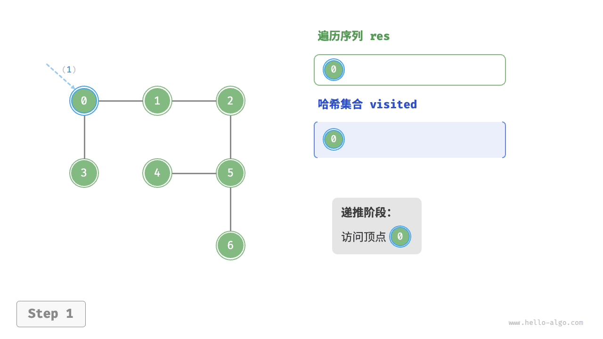

=== "<2>"
    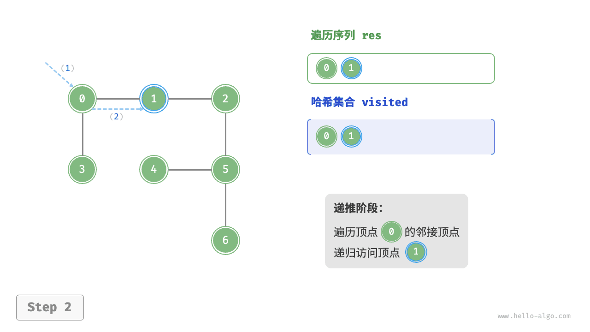

=== "<3>"
    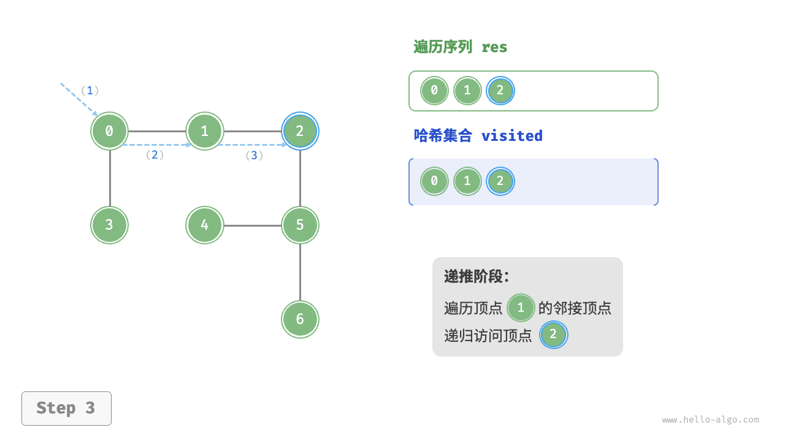

=== "<4>"
    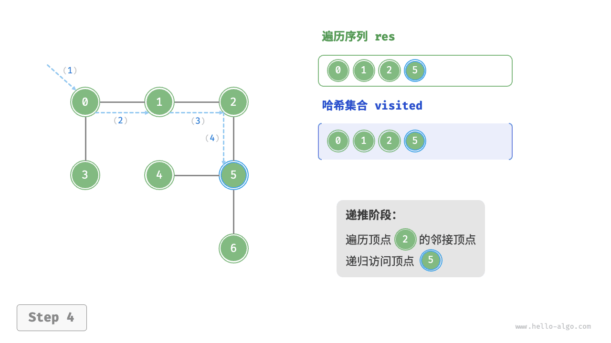

=== "<5>"
    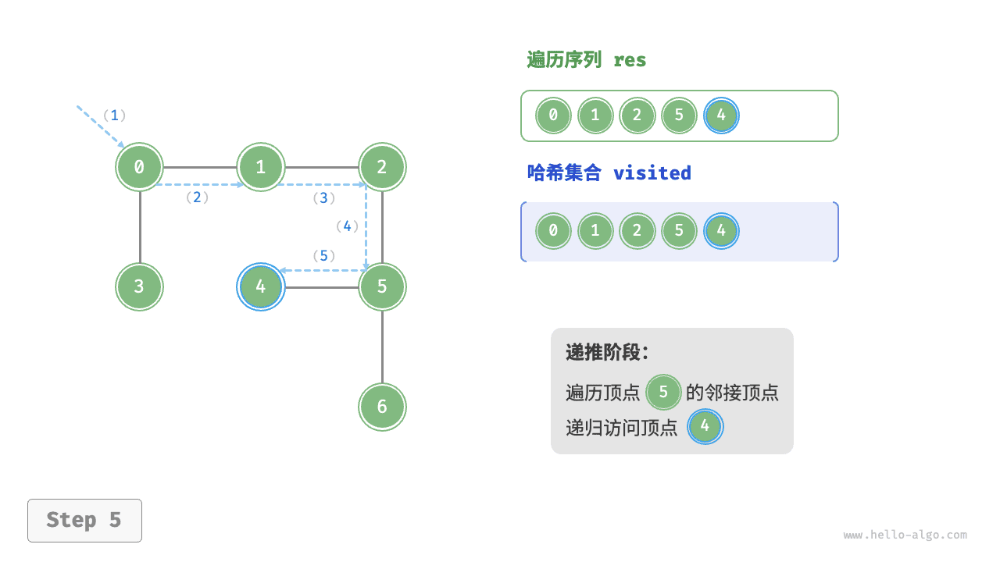

=== "<6>"
    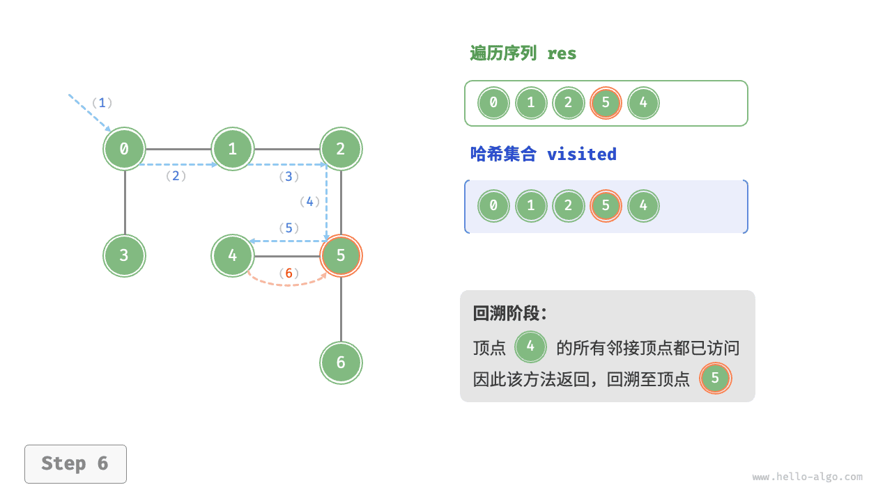

=== "<7>"
    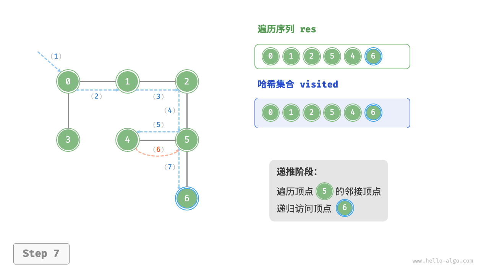

=== "<8>"
    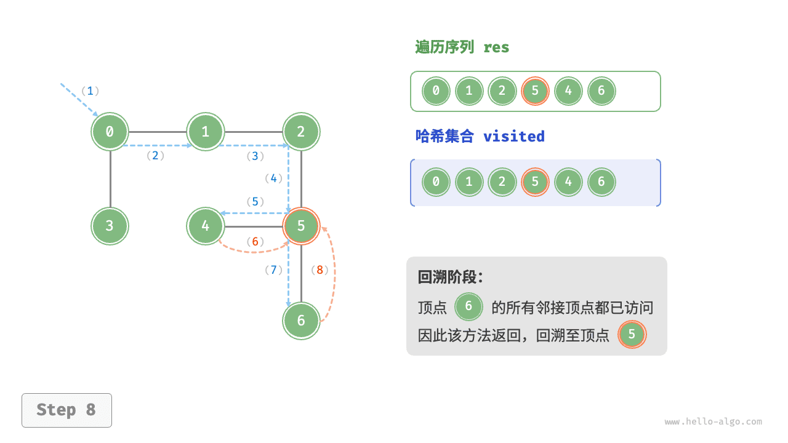

=== "<9>"
    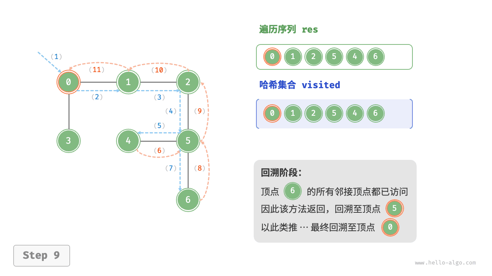

=== "<10>"
    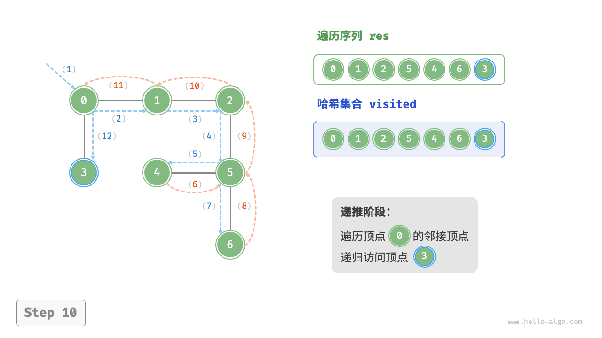

=== "<11>"
    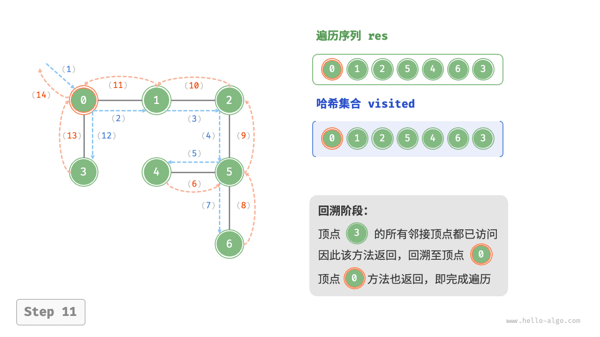

!!! question "深度优先遍历的序列是否唯一？"

    与广度优先遍历类似，深度优先遍历序列的顺序也不是唯一的。给定某顶点，先往哪个方向探索都可以，即邻接顶点的顺序可以任意打乱，都是深度优先遍历。
    
    以树的遍历为例，“根 $\rightarrow$ 左 $\rightarrow$ 右”“左 $\rightarrow$ 根 $\rightarrow$ 右”“左 $\rightarrow$ 右 $\rightarrow$ 根”分别对应前序、中序、后序遍历，它们展示了三种遍历优先级，然而这三者都属于深度优先遍历。

### 复杂度分析

**时间复杂度**：所有顶点都会被访问 $1$ 次，使用 $O(|V|)$ 时间；所有边都会被访问 $2$ 次，使用 $O(2|E|)$ 时间；总体使用 $O(|V| + |E|)$ 时间。

**空间复杂度**：列表 `res` ，哈希集合 `visited` 顶点数量最多为 $|V|$ ，递归深度最大为 $|V|$ ，因此使用 $O(|V|)$ 空间。

# 小结

### 重点回顾

- 图由顶点和边组成，可以表示为一组顶点和一组边构成的集合。
- 相较于线性关系（链表）和分治关系（树），网络关系（图）具有更高的自由度，因而更为复杂。
- 有向图的边具有方向性，连通图中的任意顶点均可达，有权图的每条边都包含权重变量。
- 邻接矩阵利用矩阵来表示图，每一行（列）代表一个顶点，矩阵元素代表边，用 $1$ 或 $0$ 表示两个顶点之间有边或无边。邻接矩阵在增删查改操作上效率很高，但空间占用较多。
- 邻接表使用多个链表来表示图，第 $i$ 个链表对应顶点 $i$ ，其中存储了该顶点的所有邻接顶点。邻接表相对于邻接矩阵更加节省空间，但由于需要遍历链表来查找边，因此时间效率较低。
- 当邻接表中的链表过长时，可以将其转换为红黑树或哈希表，从而提升查询效率。
- 从算法思想的角度分析，邻接矩阵体现了“以空间换时间”，邻接表体现了“以时间换空间”。
- 图可用于建模各类现实系统，如社交网络、地铁线路等。
- 树是图的一种特例，树的遍历也是图的遍历的一种特例。
- 图的广度优先遍历是一种由近及远、层层扩张的搜索方式，通常借助队列实现。
- 图的深度优先遍历是一种优先走到底、无路可走时再回溯的搜索方式，常基于递归来实现。

### Q & A

**Q**：路径的定义是顶点序列还是边序列？

维基百科上不同语言版本的定义不一致：英文版是“路径是一个边序列”，而中文版是“路径是一个顶点序列”。以下是英文版原文：In graph theory, a path in a graph is a finite or infinite sequence of edges which joins a sequence of vertices.

在本文中，路径被视为一个边序列，而不是一个顶点序列。这是因为两个顶点之间可能存在多条边连接，此时每条边都对应一条路径。

**Q**：非连通图中是否会有无法遍历到的点？

在非连通图中，从某个顶点出发，至少有一个顶点无法到达。遍历非连通图需要设置多个起点，以遍历到图的所有连通分量。

**Q**：在邻接表中，“与该顶点相连的所有顶点”的顶点顺序是否有要求？

可以是任意顺序。但在实际应用中，可能需要按照指定规则来排序，比如按照顶点添加的次序，或者按照顶点值大小的顺序等，这样有助于快速查找“带有某种极值”的顶点。
