# 排序

!!! abstract

    排序犹如一把将混乱变为秩序的魔法钥匙，使我们能以更高效的方式理解与处理数据。

    无论是简单的升序，还是复杂的分类排列，排序都向我们展示了数据的和谐美感。

# 排序算法

<u>排序算法（sorting algorithm）</u>用于对一组数据按照特定顺序进行排列。排序算法有着广泛的应用，因为有序数据通常能够被更高效地查找、分析和处理。

如下图所示，排序算法中的数据类型可以是整数、浮点数、字符或字符串等。排序的判断规则可根据需求设定，如数字大小、字符 ASCII 码顺序或自定义规则。

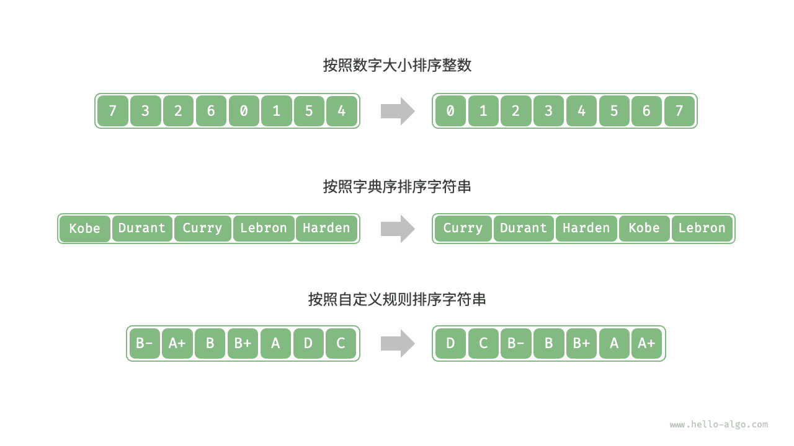

## 评价维度

**运行效率**：我们期望排序算法的时间复杂度尽量低，且总体操作数量较少（时间复杂度中的常数项变小）。对于大数据量的情况，运行效率显得尤为重要。

**就地性**：顾名思义，<u>原地排序</u>通过在原数组上直接操作实现排序，无须借助额外的辅助数组，从而节省内存。通常情况下，原地排序的数据搬运操作较少，运行速度也更快。

**稳定性**：<u>稳定排序</u>在完成排序后，相等元素在数组中的相对顺序不发生改变。

稳定排序是多级排序场景的必要条件。假设我们有一个存储学生信息的表格，第 1 列和第 2 列分别是姓名和年龄。在这种情况下，<u>非稳定排序</u>可能导致输入数据的有序性丧失：

```shell
# 输入数据是按照姓名排序好的
# (name, age)
  ('A', 19)
  ('B', 18)
  ('C', 21)
  ('D', 19)
  ('E', 23)

# 假设使用非稳定排序算法按年龄排序列表，
# 结果中 ('D', 19) 和 ('A', 19) 的相对位置改变，
# 输入数据按姓名排序的性质丢失
  ('B', 18)
  ('D', 19)
  ('A', 19)
  ('C', 21)
  ('E', 23)
```

**自适应性**：<u>自适应排序</u>能够利用输入数据已有的顺序信息来减少计算量，达到更优的时间效率。自适应排序算法的最佳时间复杂度通常优于平均时间复杂度。

**是否基于比较**：<u>基于比较的排序</u>依赖比较运算符（$<$、$=$、$>$）来判断元素的相对顺序，从而排序整个数组，理论最优时间复杂度为 $O(n \log n)$ 。而<u>非比较排序</u>不使用比较运算符，时间复杂度可达 $O(n)$ ，但其通用性相对较差。

## 理想排序算法

**运行快、原地、稳定、自适应、通用性好**。显然，迄今为止尚未发现兼具以上所有特性的排序算法。因此，在选择排序算法时，需要根据具体的数据特点和问题需求来决定。

接下来，我们将共同学习各种排序算法，并基于上述评价维度对各个排序算法的优缺点进行分析。

# 选择排序

<u>选择排序（selection sort）</u>的工作原理非常简单：开启一个循环，每轮从未排序区间选择最小的元素，将其放到已排序区间的末尾。

设数组的长度为 $n$ ，选择排序的算法流程如下图所示。

1. 初始状态下，所有元素未排序，即未排序（索引）区间为 $[0, n-1]$ 。
2. 选取区间 $[0, n-1]$ 中的最小元素，将其与索引 $0$ 处的元素交换。完成后，数组前 1 个元素已排序。
3. 选取区间 $[1, n-1]$ 中的最小元素，将其与索引 $1$ 处的元素交换。完成后，数组前 2 个元素已排序。
4. 以此类推。经过 $n - 1$ 轮选择与交换后，数组前 $n - 1$ 个元素已排序。
5. 仅剩的一个元素必定是最大元素，无须排序，因此数组排序完成。

=== "<1>"
    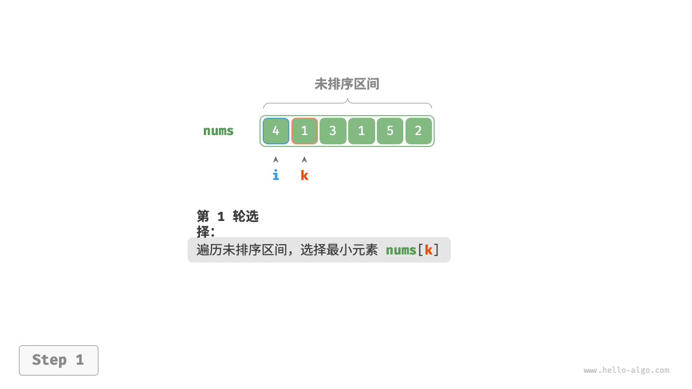

=== "<2>"
    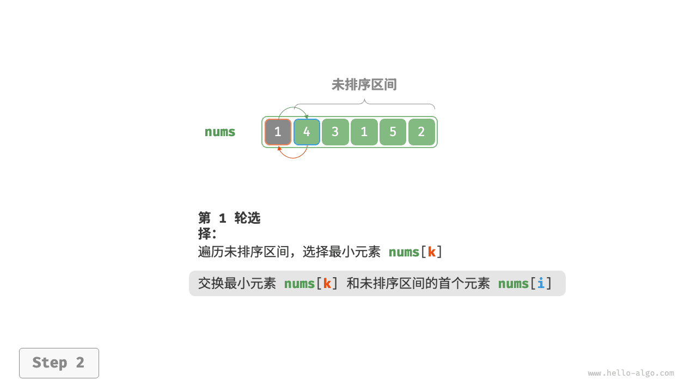

=== "<3>"
    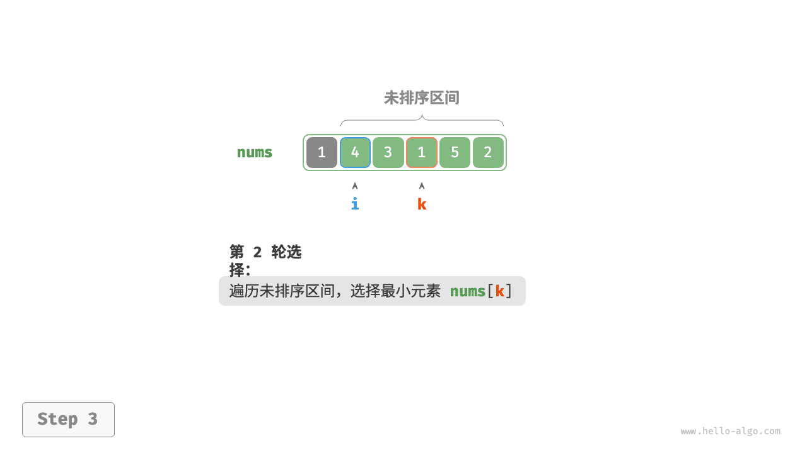

=== "<4>"
    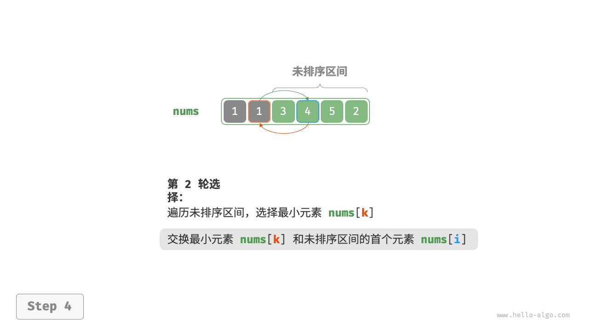

=== "<5>"
    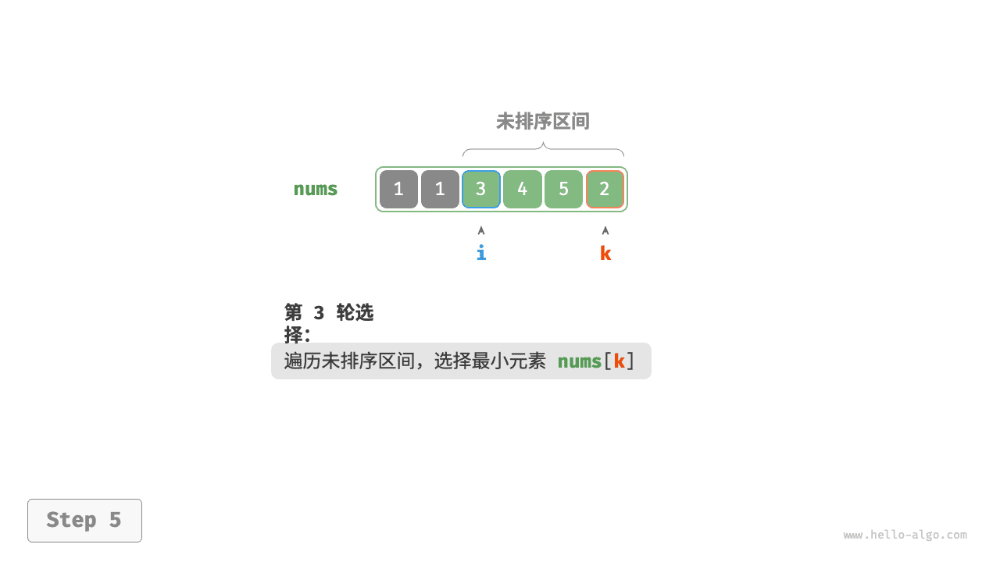

=== "<6>"
    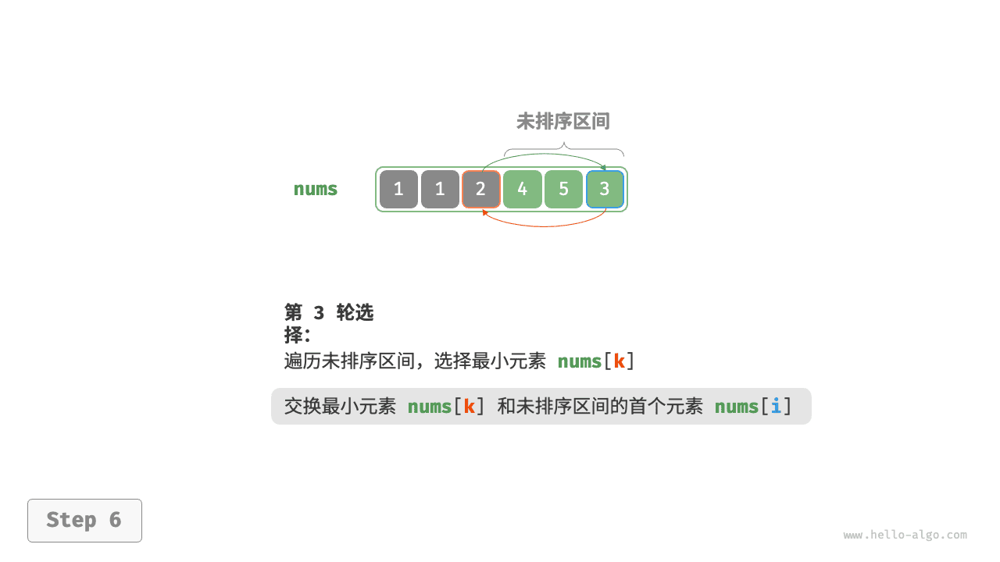

=== "<7>"
    

=== "<8>"
    

=== "<9>"
    

=== "<10>"
    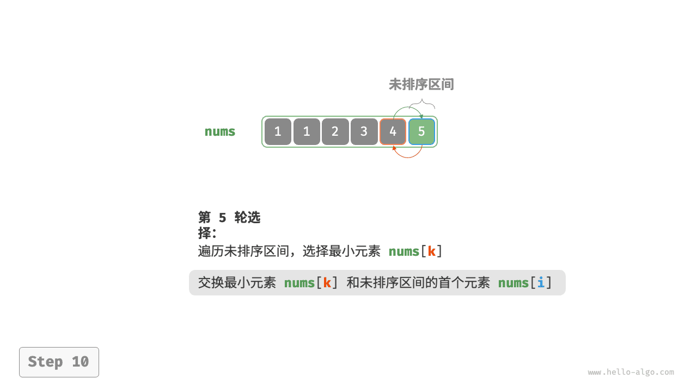

=== "<11>"
    

在代码中，我们用 $k$ 来记录未排序区间内的最小元素：

```python
def selection_sort(nums: list[int]):
    """选择排序"""
    n = len(nums)
    # 外循环：未排序区间为 [i, n-1]
    for i in range(n - 1):
        # 内循环：找到未排序区间内的最小元素
        k = i
        for j in range(i + 1, n):
            if nums[j] < nums[k]:
                k = j  # 记录最小元素的索引
        # 将该最小元素与未排序区间的首个元素交换
        nums[i], nums[k] = nums[k], nums[i]
```

!!! example [pythontutor "可视化运行"](https://pythontutor.com/iframe-embed.html#code=def%20selection_sort%28nums%3A%20list%5Bint%5D%29%3A%0A%20%20%20%20%22%22%22%E9%80%89%E6%8B%A9%E6%8E%92%E5%BA%8F%22%22%22%0A%20%20%20%20n%20%3D%20len%28nums%29%0A%20%20%20%20%23%20%E5%A4%96%E5%BE%AA%E7%8E%AF%EF%BC%9A%E6%9C%AA%E6%8E%92%E5%BA%8F%E5%8C%BA%E9%97%B4%E4%B8%BA%20%5Bi,%20n-1%5D%0A%20%20%20%20for%20i%20in%20range%28n%20-%201%29%3A%0A%20%20%20%20%20%20%20%20%23%20%E5%86%85%E5%BE%AA%E7%8E%AF%EF%BC%9A%E6%89%BE%E5%88%B0%E6%9C%AA%E6%8E%92%E5%BA%8F%E5%8C%BA%E9%97%B4%E5%86%85%E7%9A%84%E6%9C%80%E5%B0%8F%E5%85%83%E7%B4%A0%0A%20%20%20%20%20%20%20%20k%20%3D%20i%0A%20%20%20%20%20%20%20%20for%20j%20in%20range%28i%20%2B%201,%20n%29%3A%0A%20%20%20%20%20%20%20%20%20%20%20%20if%20nums%5Bj%5D%20%3C%20nums%5Bk%5D%3A%0A%20%20%20%20%20%20%20%20%20%20%20%20%20%20%20%20k%20%3D%20j%20%20%23%20%E8%AE%B0%E5%BD%95%E6%9C%80%E5%B0%8F%E5%85%83%E7%B4%A0%E7%9A%84%E7%B4%A2%E5%BC%95%0A%20%20%20%20%20%20%20%20%23%20%E5%B0%86%E8%AF%A5%E6%9C%80%E5%B0%8F%E5%85%83%E7%B4%A0%E4%B8%8E%E6%9C%AA%E6%8E%92%E5%BA%8F%E5%8C%BA%E9%97%B4%E7%9A%84%E9%A6%96%E4%B8%AA%E5%85%83%E7%B4%A0%E4%BA%A4%E6%8D%A2%0A%20%20%20%20%20%20%20%20nums%5Bi%5D,%20nums%5Bk%5D%20%3D%20nums%5Bk%5D,%20nums%5Bi%5D%0A%0A%0A%22%22%22Driver%20Code%22%22%22%0Aif%20__name__%20%3D%3D%20%22__main__%22%3A%0A%20%20%20%20nums%20%3D%20%5B4,%201,%203,%201,%205,%202%5D%0A%20%20%20%20selection_sort%28nums%29%0A%20%20%20%20print%28%22%E9%80%89%E6%8B%A9%E6%8E%92%E5%BA%8F%E5%AE%8C%E6%88%90%E5%90%8E%20nums%20%3D%22,%20nums%29&codeDivHeight=800&codeDivWidth=600&cumulative=false&curInstr=4&heapPrimitives=nevernest&origin=opt-frontend.js&py=311&rawInputLstJSON=%5B%5D&textReferences=false)

## 算法特性

- **时间复杂度为 $O(n^2)$、非自适应排序**：外循环共 $n - 1$ 轮，第一轮的未排序区间长度为 $n$ ，最后一轮的未排序区间长度为 $2$ ，即各轮外循环分别包含 $n$、$n - 1$、$\dots$、$3$、$2$ 轮内循环，求和为 $\frac{(n - 1)(n + 2)}{2}$ 。
- **空间复杂度为 $O(1)$、原地排序**：指针 $i$ 和 $j$ 使用常数大小的额外空间。
- **非稳定排序**：如下图所示，元素 `nums[i]` 有可能被交换至与其相等的元素的右边，导致两者的相对顺序发生改变。

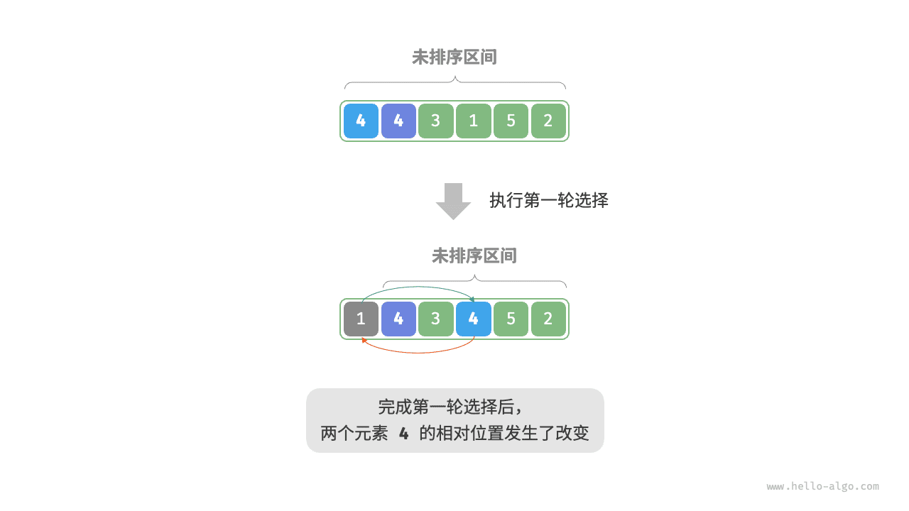

# 冒泡排序

<u>冒泡排序（bubble sort）</u>通过连续地比较与交换相邻元素实现排序。这个过程就像气泡从底部升到顶部一样，因此得名冒泡排序。

如下图所示，冒泡过程可以利用元素交换操作来模拟：从数组最左端开始向右遍历，依次比较相邻元素大小，如果“左元素 > 右元素”就交换二者。遍历完成后，最大的元素会被移动到数组的最右端。

=== "<1>"
    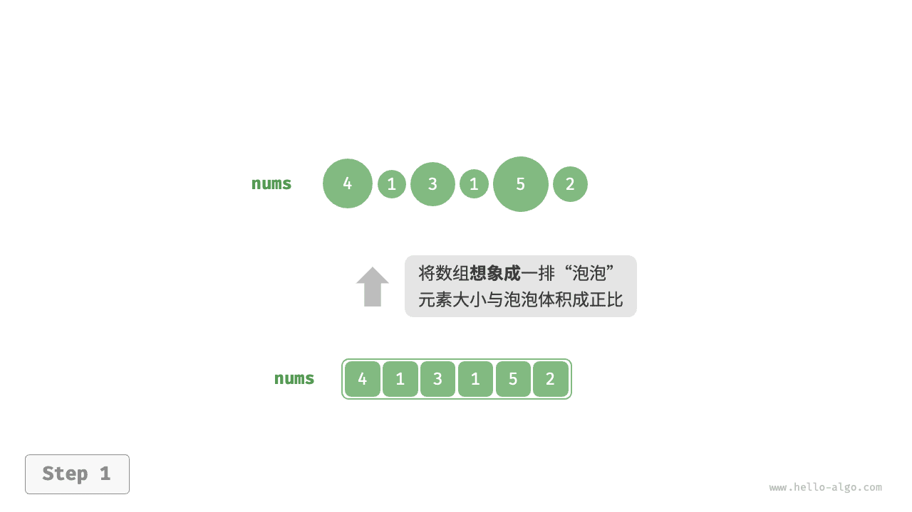

=== "<2>"
    

=== "<3>"
    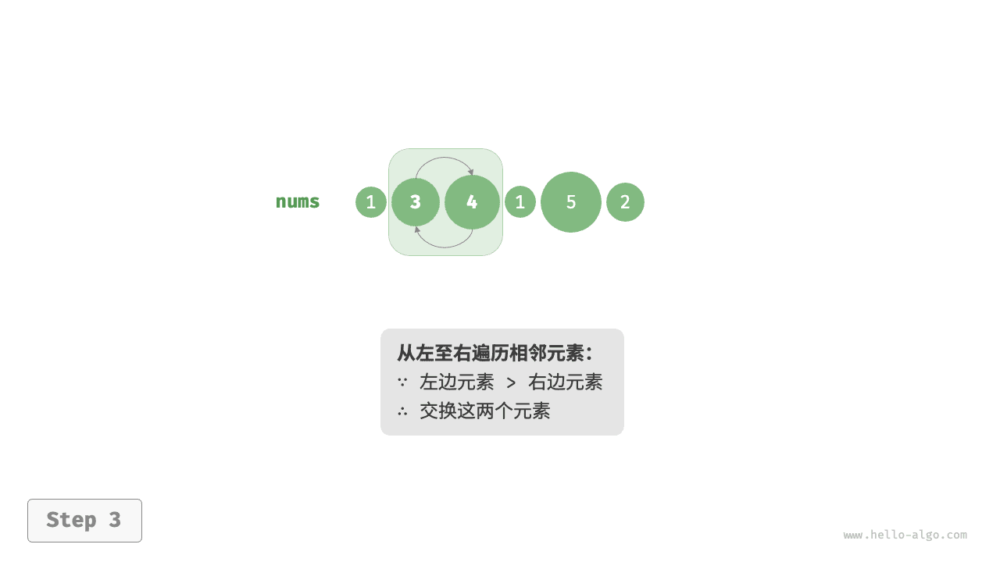

=== "<4>"
    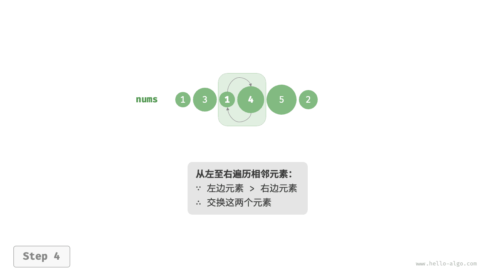

=== "<5>"
    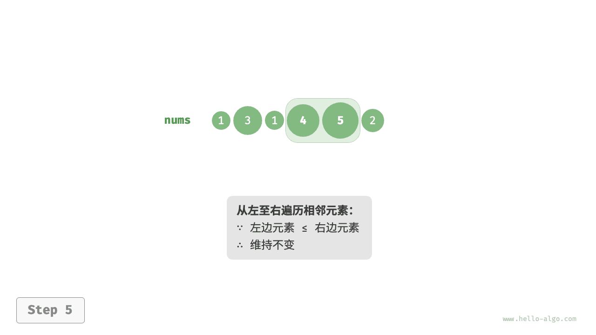

=== "<6>"
    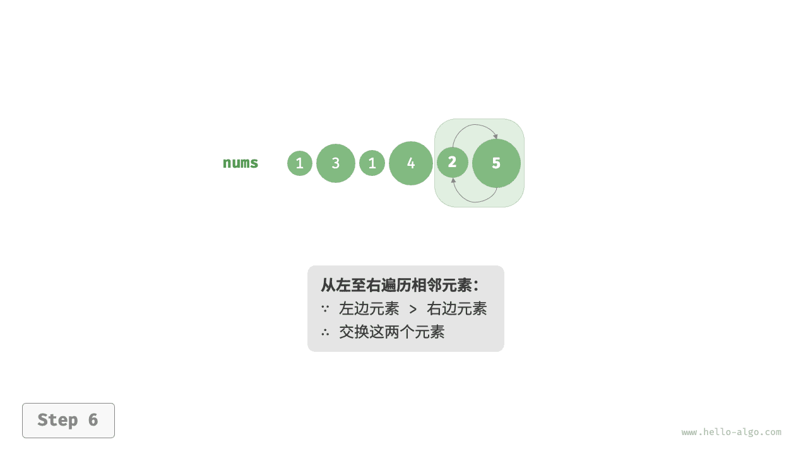

=== "<7>"
    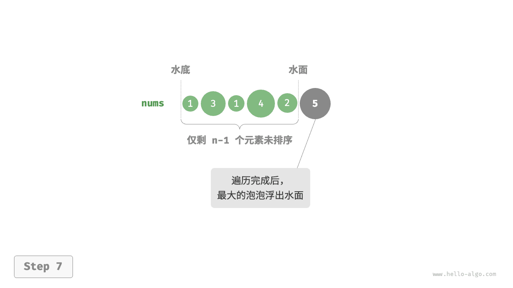

## 算法流程

设数组的长度为 $n$ ，冒泡排序的步骤如下图所示。

1. 首先，对 $n$ 个元素执行“冒泡”，**将数组的最大元素交换至正确位置**。
2. 接下来，对剩余 $n - 1$ 个元素执行“冒泡”，**将第二大元素交换至正确位置**。
3. 以此类推，经过 $n - 1$ 轮“冒泡”后，**前 $n - 1$ 大的元素都被交换至正确位置**。
4. 仅剩的一个元素必定是最小元素，无须排序，因此数组排序完成。

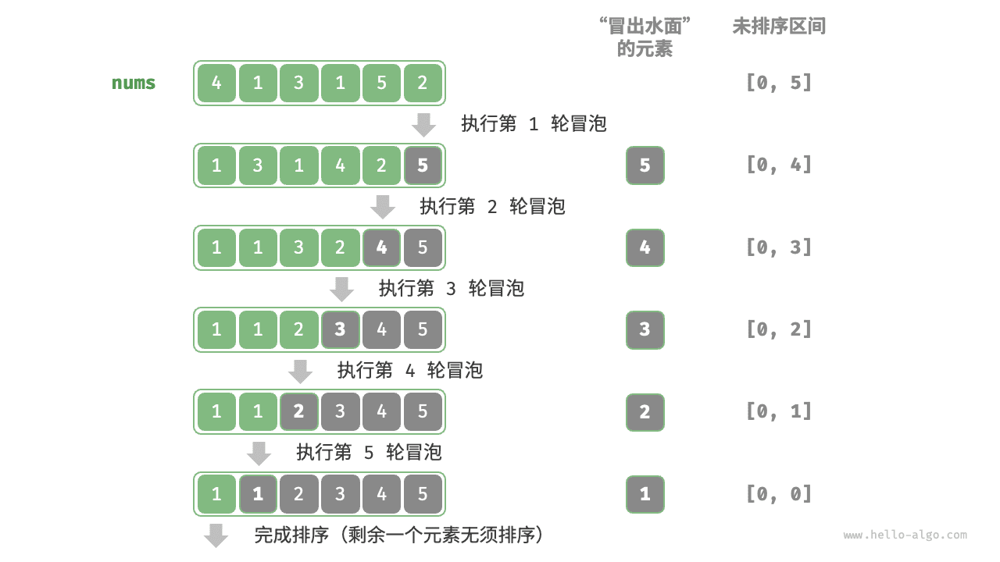

示例代码如下：

```python
def bubble_sort(nums: list[int]):
    """冒泡排序"""
    n = len(nums)
    # 外循环：未排序区间为 [0, i]
    for i in range(n - 1, 0, -1):
        # 内循环：将未排序区间 [0, i] 中的最大元素交换至该区间的最右端
        for j in range(i):
            if nums[j] > nums[j + 1]:
                # 交换 nums[j] 与 nums[j + 1]
                nums[j], nums[j + 1] = nums[j + 1], nums[j]
```

!!! example [pythontutor "可视化运行"](https://pythontutor.com/iframe-embed.html#code=def%20bubble_sort%28nums%3A%20list%5Bint%5D%29%3A%0A%20%20%20%20%22%22%22%E5%86%92%E6%B3%A1%E6%8E%92%E5%BA%8F%22%22%22%0A%20%20%20%20n%20%3D%20len%28nums%29%0A%20%20%20%20%23%20%E5%A4%96%E5%BE%AA%E7%8E%AF%EF%BC%9A%E6%9C%AA%E6%8E%92%E5%BA%8F%E5%8C%BA%E9%97%B4%E4%B8%BA%20%5B0,%20i%5D%0A%20%20%20%20for%20i%20in%20range%28n%20-%201,%200,%20-1%29%3A%0A%20%20%20%20%20%20%20%20%23%20%E5%86%85%E5%BE%AA%E7%8E%AF%EF%BC%9A%E5%B0%86%E6%9C%AA%E6%8E%92%E5%BA%8F%E5%8C%BA%E9%97%B4%20%5B0,%20i%5D%20%E4%B8%AD%E7%9A%84%E6%9C%80%E5%A4%A7%E5%85%83%E7%B4%A0%E4%BA%A4%E6%8D%A2%E8%87%B3%E8%AF%A5%E5%8C%BA%E9%97%B4%E7%9A%84%E6%9C%80%E5%8F%B3%E7%AB%AF%0A%20%20%20%20%20%20%20%20for%20j%20in%20range%28i%29%3A%0A%20%20%20%20%20%20%20%20%20%20%20%20if%20nums%5Bj%5D%20%3E%20nums%5Bj%20%2B%201%5D%3A%0A%20%20%20%20%20%20%20%20%20%20%20%20%20%20%20%20%23%20%E4%BA%A4%E6%8D%A2%20nums%5Bj%5D%20%E4%B8%8E%20nums%5Bj%20%2B%201%5D%0A%20%20%20%20%20%20%20%20%20%20%20%20%20%20%20%20nums%5Bj%5D,%20nums%5Bj%20%2B%201%5D%20%3D%20nums%5Bj%20%2B%201%5D,%20nums%5Bj%5D%0A%0A%22%22%22Driver%20Code%22%22%22%0Aif%20__name__%20%3D%3D%20%22__main__%22%3A%0A%20%20%20%20nums%20%3D%20%5B4,%201,%203,%201,%205,%202%5D%0A%20%20%20%20bubble_sort%28nums%29%0A%20%20%20%20print%28%22%E5%86%92%E6%B3%A1%E6%8E%92%E5%BA%8F%E5%AE%8C%E6%88%90%E5%90%8E%20nums%20%3D%22,%20nums%29&codeDivHeight=800&codeDivWidth=600&cumulative=false&curInstr=4&heapPrimitives=nevernest&origin=opt-frontend.js&py=311&rawInputLstJSON=%5B%5D&textReferences=false)

## 效率优化

我们发现，如果某轮“冒泡”中没有执行任何交换操作，说明数组已经完成排序，可直接返回结果。因此，可以增加一个标志位 `flag` 来监测这种情况，一旦出现就立即返回。

经过优化，冒泡排序的最差时间复杂度和平均时间复杂度仍为 $O(n^2)$ ；但当输入数组完全有序时，可达到最佳时间复杂度 $O(n)$ 。

```python
def bubble_sort_with_flag(nums: list[int]):
    """冒泡排序（标志优化）"""
    n = len(nums)
    # 外循环：未排序区间为 [0, i]
    for i in range(n - 1, 0, -1):
        flag = False  # 初始化标志位
        # 内循环：将未排序区间 [0, i] 中的最大元素交换至该区间的最右端
        for j in range(i):
            if nums[j] > nums[j + 1]:
                # 交换 nums[j] 与 nums[j + 1]
                nums[j], nums[j + 1] = nums[j + 1], nums[j]
                flag = True  # 记录交换元素
        if not flag:
            break  # 此轮“冒泡”未交换任何元素，直接跳出
```

!!! example [pythontutor "可视化运行"](https://pythontutor.com/iframe-embed.html#code=def%20bubble_sort_with_flag%28nums%3A%20list%5Bint%5D%29%3A%0A%20%20%20%20%22%22%22%E5%86%92%E6%B3%A1%E6%8E%92%E5%BA%8F%EF%BC%88%E6%A0%87%E5%BF%97%E4%BC%98%E5%8C%96%EF%BC%89%22%22%22%0A%20%20%20%20n%20%3D%20len%28nums%29%0A%20%20%20%20%23%20%E5%A4%96%E5%BE%AA%E7%8E%AF%EF%BC%9A%E6%9C%AA%E6%8E%92%E5%BA%8F%E5%8C%BA%E9%97%B4%E4%B8%BA%20%5B0,%20i%5D%0A%20%20%20%20for%20i%20in%20range%28n%20-%201,%200,%20-1%29%3A%0A%20%20%20%20%20%20%20%20flag%20%3D%20False%20%20%23%20%E5%88%9D%E5%A7%8B%E5%8C%96%E6%A0%87%E5%BF%97%E4%BD%8D%0A%20%20%20%20%20%20%20%20%23%20%E5%86%85%E5%BE%AA%E7%8E%AF%EF%BC%9A%E5%B0%86%E6%9C%AA%E6%8E%92%E5%BA%8F%E5%8C%BA%E9%97%B4%20%5B0,%20i%5D%20%E4%B8%AD%E7%9A%84%E6%9C%80%E5%A4%A7%E5%85%83%E7%B4%A0%E4%BA%A4%E6%8D%A2%E8%87%B3%E8%AF%A5%E5%8C%BA%E9%97%B4%E7%9A%84%E6%9C%80%E5%8F%B3%E7%AB%AF%0A%20%20%20%20%20%20%20%20for%20j%20in%20range%28i%29%3A%0A%20%20%20%20%20%20%20%20%20%20%20%20if%20nums%5Bj%5D%20%3E%20nums%5Bj%20%2B%201%5D%3A%0A%20%20%20%20%20%20%20%20%20%20%20%20%20%20%20%20%23%20%E4%BA%A4%E6%8D%A2%20nums%5Bj%5D%20%E4%B8%8E%20nums%5Bj%20%2B%201%5D%0A%20%20%20%20%20%20%20%20%20%20%20%20%20%20%20%20nums%5Bj%5D,%20nums%5Bj%20%2B%201%5D%20%3D%20nums%5Bj%20%2B%201%5D,%20nums%5Bj%5D%0A%20%20%20%20%20%20%20%20%20%20%20%20%20%20%20%20flag%20%3D%20True%20%20%23%20%E8%AE%B0%E5%BD%95%E4%BA%A4%E6%8D%A2%E5%85%83%E7%B4%A0%0A%20%20%20%20%20%20%20%20if%20not%20flag%3A%0A%20%20%20%20%20%20%20%20%20%20%20%20break%20%20%23%20%E6%AD%A4%E8%BD%AE%E2%80%9C%E5%86%92%E6%B3%A1%E2%80%9D%E6%9C%AA%E4%BA%A4%E6%8D%A2%E4%BB%BB%E4%BD%95%E5%85%83%E7%B4%A0%EF%BC%8C%E7%9B%B4%E6%8E%A5%E8%B7%B3%E5%87%BA%0A%0A%22%22%22Driver%20Code%22%22%22%0Aif%20__name__%20%3D%3D%20%22__main__%22%3A%0A%20%20%20%20nums%20%3D%20%5B4,%201,%203,%201,%205,%202%5D%0A%20%20%20%20bubble_sort_with_flag%28nums%29%0A%20%20%20%20print%28%22%E5%86%92%E6%B3%A1%E6%8E%92%E5%BA%8F%E5%AE%8C%E6%88%90%E5%90%8E%20nums%20%3D%22,%20nums%29&codeDivHeight=800&codeDivWidth=600&cumulative=false&curInstr=4&heapPrimitives=nevernest&origin=opt-frontend.js&py=311&rawInputLstJSON=%5B%5D&textReferences=false)

## 算法特性

- **时间复杂度为 $O(n^2)$、自适应排序**：各轮“冒泡”遍历的数组长度依次为 $n - 1$、$n - 2$、$\dots$、$2$、$1$ ，总和为 $(n - 1) n / 2$ 。在引入 `flag` 优化后，最佳时间复杂度可达到 $O(n)$ 。
- **空间复杂度为 $O(1)$、原地排序**：指针 $i$ 和 $j$ 使用常数大小的额外空间。
- **稳定排序**：由于在“冒泡”中遇到相等元素不交换。

# 插入排序

<u>插入排序（insertion sort）</u>是一种简单的排序算法，它的工作原理与手动整理一副牌的过程非常相似。

具体来说，我们在未排序区间选择一个基准元素，将该元素与其左侧已排序区间的元素逐一比较大小，并将该元素插入到正确的位置。

下图展示了数组插入元素的操作流程。设基准元素为 `base` ，我们需要将从目标索引到 `base` 之间的所有元素向右移动一位，然后将 `base` 赋值给目标索引。

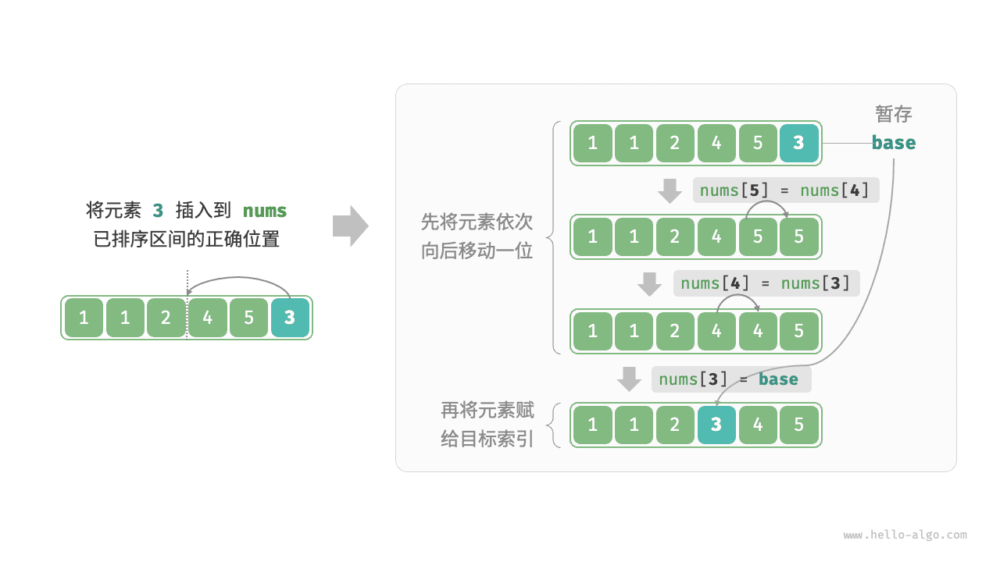

## 算法流程

插入排序的整体流程如下图所示。

1. 初始状态下，数组的第 1 个元素已完成排序。
2. 选取数组的第 2 个元素作为 `base` ，将其插入到正确位置后，**数组的前 2 个元素已排序**。
3. 选取第 3 个元素作为 `base` ，将其插入到正确位置后，**数组的前 3 个元素已排序**。
4. 以此类推，在最后一轮中，选取最后一个元素作为 `base` ，将其插入到正确位置后，**所有元素均已排序**。

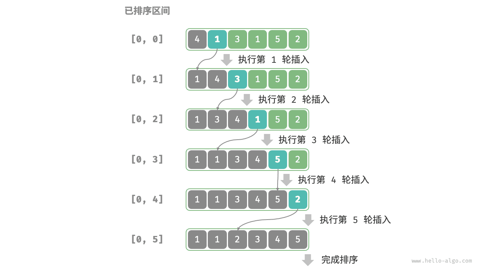

示例代码如下：

```python
def insertion_sort(nums: list[int]):
    """插入排序"""
    # 外循环：已排序区间为 [0, i-1]
    for i in range(1, len(nums)):
        base = nums[i]
        j = i - 1
        # 内循环：将 base 插入到已排序区间 [0, i-1] 中的正确位置
        while j >= 0 and nums[j] > base:
            nums[j + 1] = nums[j]  # 将 nums[j] 向右移动一位
            j -= 1
        nums[j + 1] = base  # 将 base 赋值到正确位置
```

!!! example [pythontutor "可视化运行"](https://pythontutor.com/iframe-embed.html#code=def%20insertion_sort%28nums%3A%20list%5Bint%5D%29%3A%0A%20%20%20%20%22%22%22%E6%8F%92%E5%85%A5%E6%8E%92%E5%BA%8F%22%22%22%0A%20%20%20%20%23%20%E5%A4%96%E5%BE%AA%E7%8E%AF%EF%BC%9A%E5%B7%B2%E6%8E%92%E5%BA%8F%E5%8C%BA%E9%97%B4%E4%B8%BA%20%5B0,%20i-1%5D%0A%20%20%20%20for%20i%20in%20range%281,%20len%28nums%29%29%3A%0A%20%20%20%20%20%20%20%20base%20%3D%20nums%5Bi%5D%0A%20%20%20%20%20%20%20%20j%20%3D%20i%20-%201%0A%20%20%20%20%20%20%20%20%23%20%E5%86%85%E5%BE%AA%E7%8E%AF%EF%BC%9A%E5%B0%86%20base%20%E6%8F%92%E5%85%A5%E5%88%B0%E5%B7%B2%E6%8E%92%E5%BA%8F%E5%8C%BA%E9%97%B4%20%5B0,%20i-1%5D%20%E4%B8%AD%E7%9A%84%E6%AD%A3%E7%A1%AE%E4%BD%8D%E7%BD%AE%0A%20%20%20%20%20%20%20%20while%20j%20%3E%3D%200%20and%20nums%5Bj%5D%20%3E%20base%3A%0A%20%20%20%20%20%20%20%20%20%20%20%20nums%5Bj%20%2B%201%5D%20%3D%20nums%5Bj%5D%20%20%23%20%E5%B0%86%20nums%5Bj%5D%20%E5%90%91%E5%8F%B3%E7%A7%BB%E5%8A%A8%E4%B8%80%E4%BD%8D%0A%20%20%20%20%20%20%20%20%20%20%20%20j%20-%3D%201%0A%20%20%20%20%20%20%20%20nums%5Bj%20%2B%201%5D%20%3D%20base%20%20%23%20%E5%B0%86%20base%20%E8%B5%8B%E5%80%BC%E5%88%B0%E6%AD%A3%E7%A1%AE%E4%BD%8D%E7%BD%AE%0A%0A%0A%22%22%22Driver%20Code%22%22%22%0Aif%20__name__%20%3D%3D%20%22__main__%22%3A%0A%20%20%20%20nums%20%3D%20%5B4,%201,%203,%201,%205,%202%5D%0A%20%20%20%20insertion_sort%28nums%29%0A%20%20%20%20print%28%22%E6%8F%92%E5%85%A5%E6%8E%92%E5%BA%8F%E5%AE%8C%E6%88%90%E5%90%8E%20nums%20%3D%22,%20nums%29&codeDivHeight=800&codeDivWidth=600&cumulative=false&curInstr=4&heapPrimitives=nevernest&origin=opt-frontend.js&py=311&rawInputLstJSON=%5B%5D&textReferences=false)

## 算法特性

- **时间复杂度为 $O(n^2)$、自适应排序**：在最差情况下，每次插入操作分别需要循环 $n - 1$、$n-2$、$\dots$、$2$、$1$ 次，求和得到 $(n - 1) n / 2$ ，因此时间复杂度为 $O(n^2)$ 。在遇到有序数据时，插入操作会提前终止。当输入数组完全有序时，插入排序达到最佳时间复杂度 $O(n)$ 。
- **空间复杂度为 $O(1)$、原地排序**：指针 $i$ 和 $j$ 使用常数大小的额外空间。
- **稳定排序**：在插入操作过程中，我们会将元素插入到相等元素的右侧，不会改变它们的顺序。

## 插入排序的优势

插入排序的时间复杂度为 $O(n^2)$ ，而我们即将学习的快速排序的时间复杂度为 $O(n \log n)$ 。尽管插入排序的时间复杂度更高，**但在数据量较小的情况下，插入排序通常更快**。

这个结论与线性查找和二分查找的适用情况的结论类似。快速排序这类 $O(n \log n)$ 的算法属于基于分治策略的排序算法，往往包含更多单元计算操作。而在数据量较小时，$n^2$ 和 $n \log n$ 的数值比较接近，复杂度不占主导地位，每轮中的单元操作数量起到决定性作用。

实际上，许多编程语言（例如 Java）的内置排序函数采用了插入排序，大致思路为：对于长数组，采用基于分治策略的排序算法，例如快速排序；对于短数组，直接使用插入排序。

虽然冒泡排序、选择排序和插入排序的时间复杂度都为 $O(n^2)$ ，但在实际情况中，**插入排序的使用频率显著高于冒泡排序和选择排序**，主要有以下原因。

- 冒泡排序基于元素交换实现，需要借助一个临时变量，共涉及 3 个单元操作；插入排序基于元素赋值实现，仅需 1 个单元操作。因此，**冒泡排序的计算开销通常比插入排序更高**。
- 选择排序在任何情况下的时间复杂度都为 $O(n^2)$ 。**如果给定一组部分有序的数据，插入排序通常比选择排序效率更高**。
- 选择排序不稳定，无法应用于多级排序。

# 快速排序

<u>快速排序（quick sort）</u>是一种基于分治策略的排序算法，运行高效，应用广泛。

快速排序的核心操作是“哨兵划分”，其目标是：选择数组中的某个元素作为“基准数”，将所有小于基准数的元素移到其左侧，而大于基准数的元素移到其右侧。具体来说，哨兵划分的流程如下图所示。

1. 选取数组最左端元素作为基准数，初始化两个指针 `i` 和 `j` 分别指向数组的两端。
2. 设置一个循环，在每轮中使用 `i`（`j`）分别寻找第一个比基准数大（小）的元素，然后交换这两个元素。
3. 循环执行步骤 `2.` ，直到 `i` 和 `j` 相遇时停止，最后将基准数交换至两个子数组的分界线。

=== "<1>"
    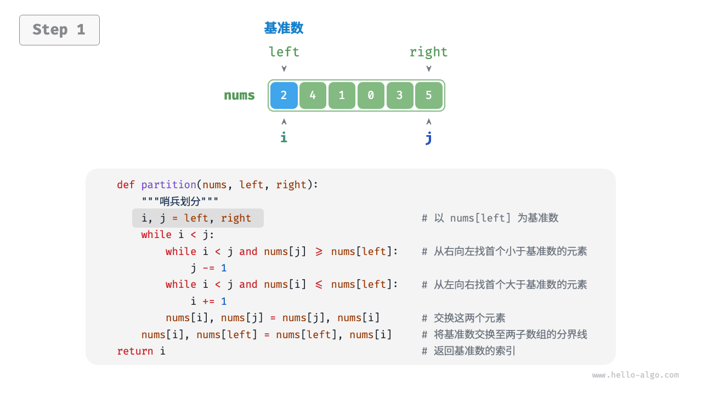

=== "<2>"
    

=== "<3>"
    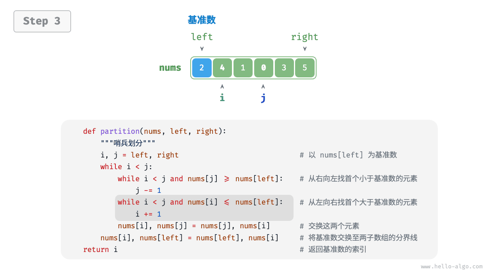

=== "<4>"
    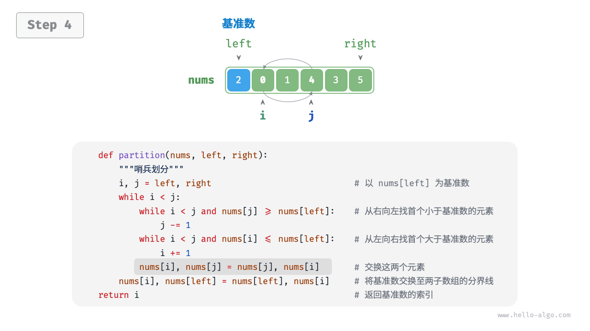

=== "<5>"
    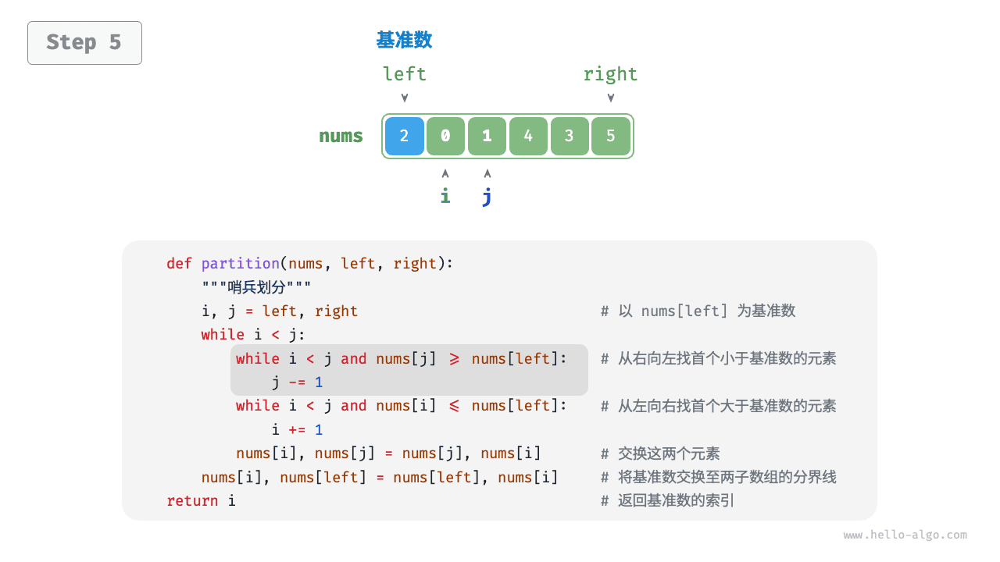

=== "<6>"
    

=== "<7>"
    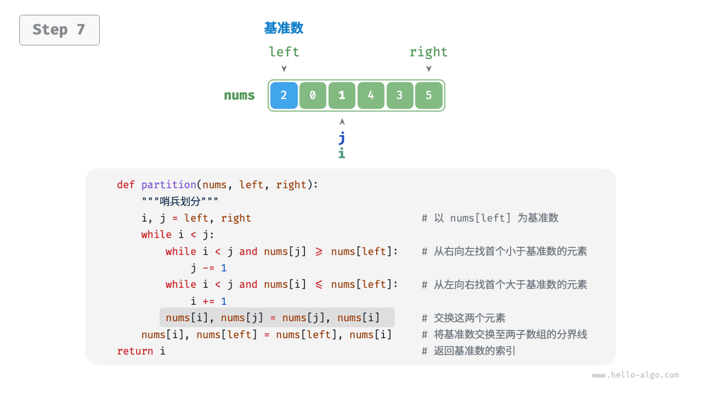

=== "<8>"
    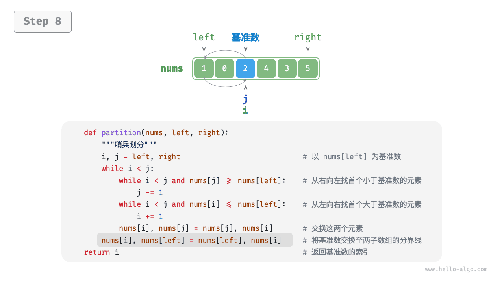

=== "<9>"
    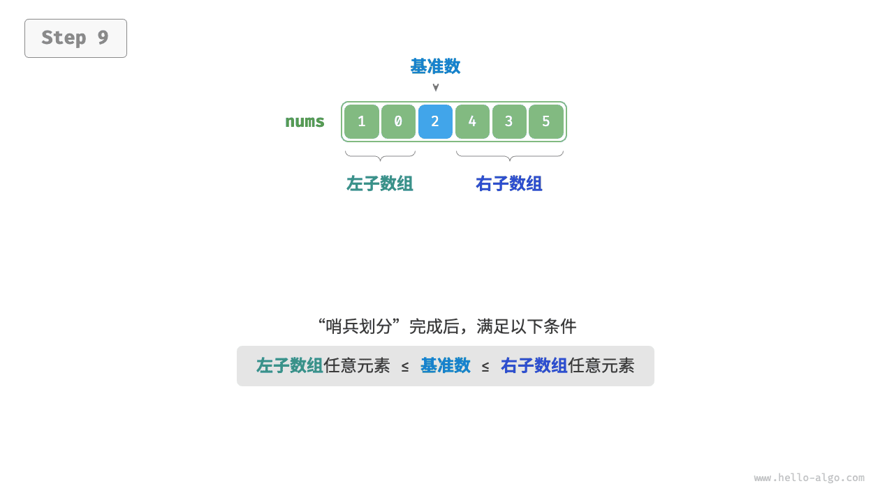

哨兵划分完成后，原数组被划分成三部分：左子数组、基准数、右子数组，且满足“左子数组任意元素 $\leq$ 基准数 $\leq$ 右子数组任意元素”。因此，我们接下来只需对这两个子数组进行排序。

!!! note "快速排序的分治策略"

    哨兵划分的实质是将一个较长数组的排序问题简化为两个较短数组的排序问题。

```python
def partition(self, nums: list[int], left: int, right: int) -> int:
    """哨兵划分"""
    # 以 nums[left] 为基准数
    i, j = left, right
    while i < j:
        while i < j and nums[j] >= nums[left]:
            j -= 1  # 从右向左找首个小于基准数的元素
        while i < j and nums[i] <= nums[left]:
            i += 1  # 从左向右找首个大于基准数的元素
        # 元素交换
        nums[i], nums[j] = nums[j], nums[i]
    # 将基准数交换至两子数组的分界线
    nums[i], nums[left] = nums[left], nums[i]
    return i  # 返回基准数的索引
```

!!! example [pythontutor "可视化运行"](https://pythontutor.com/iframe-embed.html#code=def%20partition%28nums%3A%20list%5Bint%5D,%20left%3A%20int,%20right%3A%20int%29%20-%3E%20int%3A%0A%20%20%20%20%22%22%22%E5%93%A8%E5%85%B5%E5%88%92%E5%88%86%22%22%22%0A%20%20%20%20%23%20%E4%BB%A5%20nums%5Bleft%5D%20%E4%B8%BA%E5%9F%BA%E5%87%86%E6%95%B0%0A%20%20%20%20i,%20j%20%3D%20left,%20right%0A%20%20%20%20while%20i%20%3C%20j%3A%0A%20%20%20%20%20%20%20%20while%20i%20%3C%20j%20and%20nums%5Bj%5D%20%3E%3D%20nums%5Bleft%5D%3A%0A%20%20%20%20%20%20%20%20%20%20%20%20j%20-%3D%201%20%20%23%20%E4%BB%8E%E5%8F%B3%E5%90%91%E5%B7%A6%E6%89%BE%E9%A6%96%E4%B8%AA%E5%B0%8F%E4%BA%8E%E5%9F%BA%E5%87%86%E6%95%B0%E7%9A%84%E5%85%83%E7%B4%A0%0A%20%20%20%20%20%20%20%20while%20i%20%3C%20j%20and%20nums%5Bi%5D%20%3C%3D%20nums%5Bleft%5D%3A%0A%20%20%20%20%20%20%20%20%20%20%20%20i%20%2B%3D%201%20%20%23%20%E4%BB%8E%E5%B7%A6%E5%90%91%E5%8F%B3%E6%89%BE%E9%A6%96%E4%B8%AA%E5%A4%A7%E4%BA%8E%E5%9F%BA%E5%87%86%E6%95%B0%E7%9A%84%E5%85%83%E7%B4%A0%0A%20%20%20%20%20%20%20%20%23%20%E5%85%83%E7%B4%A0%E4%BA%A4%E6%8D%A2%0A%20%20%20%20%20%20%20%20nums%5Bi%5D,%20nums%5Bj%5D%20%3D%20nums%5Bj%5D,%20nums%5Bi%5D%0A%20%20%20%20%23%20%E5%B0%86%E5%9F%BA%E5%87%86%E6%95%B0%E4%BA%A4%E6%8D%A2%E8%87%B3%E4%B8%A4%E5%AD%90%E6%95%B0%E7%BB%84%E7%9A%84%E5%88%86%E7%95%8C%E7%BA%BF%0A%20%20%20%20nums%5Bi%5D,%20nums%5Bleft%5D%20%3D%20nums%5Bleft%5D,%20nums%5Bi%5D%0A%20%20%20%20return%20i%20%20%23%20%E8%BF%94%E5%9B%9E%E5%9F%BA%E5%87%86%E6%95%B0%E7%9A%84%E7%B4%A2%E5%BC%95%0A%0A%0A%22%22%22Driver%20Code%22%22%22%0Aif%20__name__%20%3D%3D%20%22__main__%22%3A%0A%20%20%20%20nums%20%3D%20%5B2,%204,%201,%200,%203,%205%5D%0A%20%20%20%20partition%28nums,%200,%20len%28nums%29%20-%201%29%0A%20%20%20%20print%28%22%E5%93%A8%E5%85%B5%E5%88%92%E5%88%86%E5%AE%8C%E6%88%90%E5%90%8E%20nums%20%3D%22,%20nums%29&codeDivHeight=800&codeDivWidth=600&cumulative=false&curInstr=4&heapPrimitives=nevernest&origin=opt-frontend.js&py=311&rawInputLstJSON=%5B%5D&textReferences=false)

## 算法流程

快速排序的整体流程如下图所示。

1. 首先，对原数组执行一次“哨兵划分”，得到未排序的左子数组和右子数组。
2. 然后，对左子数组和右子数组分别递归执行“哨兵划分”。
3. 持续递归，直至子数组长度为 1 时终止，从而完成整个数组的排序。


```python
def quick_sort(self, nums: list[int], left: int, right: int):
    """快速排序"""
    # 子数组长度为 1 时终止递归
    if left >= right:
        return
    # 哨兵划分
    pivot = self.partition(nums, left, right)
    # 递归左子数组、右子数组
    self.quick_sort(nums, left, pivot - 1)
    self.quick_sort(nums, pivot + 1, right)
```

!!! example [pythontutor "可视化运行"](https://pythontutor.com/iframe-embed.html#code=def%20partition%28nums%3A%20list%5Bint%5D,%20left%3A%20int,%20right%3A%20int%29%20-%3E%20int%3A%0A%20%20%20%20%22%22%22%E5%93%A8%E5%85%B5%E5%88%92%E5%88%86%22%22%22%0A%20%20%20%20%23%20%E4%BB%A5%20nums%5Bleft%5D%20%E4%B8%BA%E5%9F%BA%E5%87%86%E6%95%B0%0A%20%20%20%20i,%20j%20%3D%20left,%20right%0A%20%20%20%20while%20i%20%3C%20j%3A%0A%20%20%20%20%20%20%20%20while%20i%20%3C%20j%20and%20nums%5Bj%5D%20%3E%3D%20nums%5Bleft%5D%3A%0A%20%20%20%20%20%20%20%20%20%20%20%20j%20-%3D%201%20%20%23%20%E4%BB%8E%E5%8F%B3%E5%90%91%E5%B7%A6%E6%89%BE%E9%A6%96%E4%B8%AA%E5%B0%8F%E4%BA%8E%E5%9F%BA%E5%87%86%E6%95%B0%E7%9A%84%E5%85%83%E7%B4%A0%0A%20%20%20%20%20%20%20%20while%20i%20%3C%20j%20and%20nums%5Bi%5D%20%3C%3D%20nums%5Bleft%5D%3A%0A%20%20%20%20%20%20%20%20%20%20%20%20i%20%2B%3D%201%20%20%23%20%E4%BB%8E%E5%B7%A6%E5%90%91%E5%8F%B3%E6%89%BE%E9%A6%96%E4%B8%AA%E5%A4%A7%E4%BA%8E%E5%9F%BA%E5%87%86%E6%95%B0%E7%9A%84%E5%85%83%E7%B4%A0%0A%20%20%20%20%20%20%20%20%23%20%E5%85%83%E7%B4%A0%E4%BA%A4%E6%8D%A2%0A%20%20%20%20%20%20%20%20nums%5Bi%5D,%20nums%5Bj%5D%20%3D%20nums%5Bj%5D,%20nums%5Bi%5D%0A%20%20%20%20%23%20%E5%B0%86%E5%9F%BA%E5%87%86%E6%95%B0%E4%BA%A4%E6%8D%A2%E8%87%B3%E4%B8%A4%E5%AD%90%E6%95%B0%E7%BB%84%E7%9A%84%E5%88%86%E7%95%8C%E7%BA%BF%0A%20%20%20%20nums%5Bi%5D,%20nums%5Bleft%5D%20%3D%20nums%5Bleft%5D,%20nums%5Bi%5D%0A%20%20%20%20return%20i%20%20%23%20%E8%BF%94%E5%9B%9E%E5%9F%BA%E5%87%86%E6%95%B0%E7%9A%84%E7%B4%A2%E5%BC%95%0A%0Adef%20quick_sort%28nums%3A%20list%5Bint%5D,%20left%3A%20int,%20right%3A%20int%29%3A%0A%20%20%20%20%22%22%22%E5%BF%AB%E9%80%9F%E6%8E%92%E5%BA%8F%22%22%22%0A%20%20%20%20%23%20%E5%AD%90%E6%95%B0%E7%BB%84%E9%95%BF%E5%BA%A6%E4%B8%BA%201%20%E6%97%B6%E7%BB%88%E6%AD%A2%E9%80%92%E5%BD%92%0A%20%20%20%20if%20left%20%3E%3D%20right%3A%0A%20%20%20%20%20%20%20%20return%0A%20%20%20%20%23%20%E5%93%A8%E5%85%B5%E5%88%92%E5%88%86%0A%20%20%20%20pivot%20%3D%20partition%28nums,%20left,%20right%29%0A%20%20%20%20%23%20%E9%80%92%E5%BD%92%E5%B7%A6%E5%AD%90%E6%95%B0%E7%BB%84%E3%80%81%E5%8F%B3%E5%AD%90%E6%95%B0%E7%BB%84%0A%20%20%20%20quick_sort%28nums,%20left,%20pivot%20-%201%29%0A%20%20%20%20quick_sort%28nums,%20pivot%20%2B%201,%20right%29%0A%0A%0A%22%22%22Driver%20Code%22%22%22%0Aif%20__name__%20%3D%3D%20%22__main__%22%3A%0A%20%20%20%20%23%20%E5%BF%AB%E9%80%9F%E6%8E%92%E5%BA%8F%0A%20%20%20%20nums%20%3D%20%5B2,%204,%201,%200,%203,%205%5D%0A%20%20%20%20quick_sort%28nums,%200,%20len%28nums%29%20-%201%29%0A%20%20%20%20print%28%22%E5%BF%AB%E9%80%9F%E6%8E%92%E5%BA%8F%E5%AE%8C%E6%88%90%E5%90%8E%20nums%20%3D%22,%20nums%29&codeDivHeight=800&codeDivWidth=600&cumulative=false&curInstr=5&heapPrimitives=nevernest&origin=opt-frontend.js&py=311&rawInputLstJSON=%5B%5D&textReferences=false)

## 算法特性

- **时间复杂度为 $O(n \log n)$、非自适应排序**：在平均情况下，哨兵划分的递归层数为 $\log n$ ，每层中的总循环数为 $n$ ，总体使用 $O(n \log n)$ 时间。在最差情况下，每轮哨兵划分操作都将长度为 $n$ 的数组划分为长度为 $0$ 和 $n - 1$ 的两个子数组，此时递归层数达到 $n$ ，每层中的循环数为 $n$ ，总体使用 $O(n^2)$ 时间。
- **空间复杂度为 $O(n)$、原地排序**：在输入数组完全倒序的情况下，达到最差递归深度 $n$ ，使用 $O(n)$ 栈帧空间。排序操作是在原数组上进行的，未借助额外数组。
- **非稳定排序**：在哨兵划分的最后一步，基准数可能会被交换至相等元素的右侧。

## 快速排序为什么快

从名称上就能看出，快速排序在效率方面应该具有一定的优势。尽管快速排序的平均时间复杂度与“归并排序”和“堆排序”相同，但通常快速排序的效率更高，主要有以下原因。

- **出现最差情况的概率很低**：虽然快速排序的最差时间复杂度为 $O(n^2)$ ，没有归并排序稳定，但在绝大多数情况下，快速排序能在 $O(n \log n)$ 的时间复杂度下运行。
- **缓存使用效率高**：在执行哨兵划分操作时，系统可将整个子数组加载到缓存，因此访问元素的效率较高。而像“堆排序”这类算法需要跳跃式访问元素，从而缺乏这一特性。
- **复杂度的常数系数小**：在上述三种算法中，快速排序的比较、赋值、交换等操作的总数量最少。这与“插入排序”比“冒泡排序”更快的原因类似。

## 基准数优化

**快速排序在某些输入下的时间效率可能降低**。举一个极端例子，假设输入数组是完全倒序的，由于我们选择最左端元素作为基准数，那么在哨兵划分完成后，基准数被交换至数组最右端，导致左子数组长度为 $n - 1$、右子数组长度为 $0$ 。如此递归下去，每轮哨兵划分后都有一个子数组的长度为 $0$ ，分治策略失效，快速排序退化为“冒泡排序”的近似形式。

为了尽量避免这种情况发生，**我们可以优化哨兵划分中的基准数的选取策略**。例如，我们可以随机选取一个元素作为基准数。然而，如果运气不佳，每次都选到不理想的基准数，效率仍然不尽如人意。

需要注意的是，编程语言通常生成的是“伪随机数”。如果我们针对伪随机数序列构建一个特定的测试样例，那么快速排序的效率仍然可能劣化。

为了进一步改进，我们可以在数组中选取三个候选元素（通常为数组的首、尾、中点元素），**并将这三个候选元素的中位数作为基准数**。这样一来，基准数“既不太小也不太大”的概率将大幅提升。当然，我们还可以选取更多候选元素，以进一步提高算法的稳健性。采用这种方法后，时间复杂度劣化至 $O(n^2)$ 的概率大大降低。

示例代码如下：

```python
def median_three(self, nums: list[int], left: int, mid: int, right: int) -> int:
    """选取三个候选元素的中位数"""
    l, m, r = nums[left], nums[mid], nums[right]
    if (l <= m <= r) or (r <= m <= l):
        return mid  # m 在 l 和 r 之间
    if (m <= l <= r) or (r <= l <= m):
        return left  # l 在 m 和 r 之间
    return right

def partition(self, nums: list[int], left: int, right: int) -> int:
    """哨兵划分（三数取中值）"""
    # 以 nums[left] 为基准数
    med = self.median_three(nums, left, (left + right) // 2, right)
    # 将中位数交换至数组最左端
    nums[left], nums[med] = nums[med], nums[left]
    # 以 nums[left] 为基准数
    i, j = left, right
    while i < j:
        while i < j and nums[j] >= nums[left]:
            j -= 1  # 从右向左找首个小于基准数的元素
        while i < j and nums[i] <= nums[left]:
            i += 1  # 从左向右找首个大于基准数的元素
        # 元素交换
        nums[i], nums[j] = nums[j], nums[i]
    # 将基准数交换至两子数组的分界线
    nums[i], nums[left] = nums[left], nums[i]
    return i  # 返回基准数的索引
```

!!! example [pythontutor "可视化运行"](https://pythontutor.com/iframe-embed.html#code=def%20median_three%28nums%3A%20list%5Bint%5D,%20left%3A%20int,%20mid%3A%20int,%20right%3A%20int%29%20-%3E%20int%3A%0A%20%20%20%20%22%22%22%E9%80%89%E5%8F%96%E4%B8%89%E4%B8%AA%E5%80%99%E9%80%89%E5%85%83%E7%B4%A0%E7%9A%84%E4%B8%AD%E4%BD%8D%E6%95%B0%22%22%22%0A%20%20%20%20l,%20m,%20r%20%3D%20nums%5Bleft%5D,%20nums%5Bmid%5D,%20nums%5Bright%5D%0A%20%20%20%20if%20%28l%20%3C%3D%20m%20%3C%3D%20r%29%20or%20%28r%20%3C%3D%20m%20%3C%3D%20l%29%3A%0A%20%20%20%20%20%20%20%20return%20mid%20%20%23%20m%20%E5%9C%A8%20l%20%E5%92%8C%20r%20%E4%B9%8B%E9%97%B4%0A%20%20%20%20if%20%28m%20%3C%3D%20l%20%3C%3D%20r%29%20or%20%28r%20%3C%3D%20l%20%3C%3D%20m%29%3A%0A%20%20%20%20%20%20%20%20return%20left%20%20%23%20l%20%E5%9C%A8%20m%20%E5%92%8C%20r%20%E4%B9%8B%E9%97%B4%0A%20%20%20%20return%20right%0A%0Adef%20partition%28nums%3A%20list%5Bint%5D,%20left%3A%20int,%20right%3A%20int%29%20-%3E%20int%3A%0A%20%20%20%20%22%22%22%E5%93%A8%E5%85%B5%E5%88%92%E5%88%86%EF%BC%88%E4%B8%89%E6%95%B0%E5%8F%96%E4%B8%AD%E5%80%BC%EF%BC%89%22%22%22%0A%20%20%20%20%23%20%E4%BB%A5%20nums%5Bleft%5D%20%E4%B8%BA%E5%9F%BA%E5%87%86%E6%95%B0%0A%20%20%20%20med%20%3D%20median_three%28nums,%20left,%20%28left%20%2B%20right%29%20//%202,%20right%29%0A%20%20%20%20%23%20%E5%B0%86%E4%B8%AD%E4%BD%8D%E6%95%B0%E4%BA%A4%E6%8D%A2%E8%87%B3%E6%95%B0%E7%BB%84%E6%9C%80%E5%B7%A6%E7%AB%AF%0A%20%20%20%20nums%5Bleft%5D,%20nums%5Bmed%5D%20%3D%20nums%5Bmed%5D,%20nums%5Bleft%5D%0A%20%20%20%20%23%20%E4%BB%A5%20nums%5Bleft%5D%20%E4%B8%BA%E5%9F%BA%E5%87%86%E6%95%B0%0A%20%20%20%20i,%20j%20%3D%20left,%20right%0A%20%20%20%20while%20i%20%3C%20j%3A%0A%20%20%20%20%20%20%20%20while%20i%20%3C%20j%20and%20nums%5Bj%5D%20%3E%3D%20nums%5Bleft%5D%3A%0A%20%20%20%20%20%20%20%20%20%20%20%20j%20-%3D%201%20%20%23%20%E4%BB%8E%E5%8F%B3%E5%90%91%E5%B7%A6%E6%89%BE%E9%A6%96%E4%B8%AA%E5%B0%8F%E4%BA%8E%E5%9F%BA%E5%87%86%E6%95%B0%E7%9A%84%E5%85%83%E7%B4%A0%0A%20%20%20%20%20%20%20%20while%20i%20%3C%20j%20and%20nums%5Bi%5D%20%3C%3D%20nums%5Bleft%5D%3A%0A%20%20%20%20%20%20%20%20%20%20%20%20i%20%2B%3D%201%20%20%23%20%E4%BB%8E%E5%B7%A6%E5%90%91%E5%8F%B3%E6%89%BE%E9%A6%96%E4%B8%AA%E5%A4%A7%E4%BA%8E%E5%9F%BA%E5%87%86%E6%95%B0%E7%9A%84%E5%85%83%E7%B4%A0%0A%20%20%20%20%20%20%20%20%23%20%E5%85%83%E7%B4%A0%E4%BA%A4%E6%8D%A2%0A%20%20%20%20%20%20%20%20nums%5Bi%5D,%20nums%5Bj%5D%20%3D%20nums%5Bj%5D,%20nums%5Bi%5D%0A%20%20%20%20%23%20%E5%B0%86%E5%9F%BA%E5%87%86%E6%95%B0%E4%BA%A4%E6%8D%A2%E8%87%B3%E4%B8%A4%E5%AD%90%E6%95%B0%E7%BB%84%E7%9A%84%E5%88%86%E7%95%8C%E7%BA%BF%0A%20%20%20%20nums%5Bi%5D,%20nums%5Bleft%5D%20%3D%20nums%5Bleft%5D,%20nums%5Bi%5D%0A%20%20%20%20return%20i%20%20%23%20%E8%BF%94%E5%9B%9E%E5%9F%BA%E5%87%86%E6%95%B0%E7%9A%84%E7%B4%A2%E5%BC%95%0A%0A%0A%22%22%22Driver%20Code%22%22%22%0Aif%20__name__%20%3D%3D%20%22__main__%22%3A%0A%20%20%20%20%23%20%E4%B8%AD%E4%BD%8D%E5%9F%BA%E5%87%86%E6%95%B0%E4%BC%98%E5%8C%96%0A%20%20%20%20nums%20%3D%20%5B2,%204,%201,%200,%203,%205%5D%0A%20%20%20%20partition%28nums,%200,%20len%28nums%29%20-%201%29%0A%20%20%20%20print%28%22%E5%93%A8%E5%85%B5%E5%88%92%E5%88%86%EF%BC%88%E4%B8%AD%E4%BD%8D%E5%9F%BA%E5%87%86%E6%95%B0%E4%BC%98%E5%8C%96%EF%BC%89%E5%AE%8C%E6%88%90%E5%90%8E%20nums%20%3D%22,%20nums%29&codeDivHeight=800&codeDivWidth=600&cumulative=false&curInstr=5&heapPrimitives=nevernest&origin=opt-frontend.js&py=311&rawInputLstJSON=%5B%5D&textReferences=false)

## 递归深度优化

**在某些输入下，快速排序可能占用空间较多**。以完全有序的输入数组为例，设递归中的子数组长度为 $m$ ，每轮哨兵划分操作都将产生长度为 $0$ 的左子数组和长度为 $m - 1$ 的右子数组，这意味着每一层递归调用减少的问题规模非常小（只减少一个元素），递归树的高度会达到 $n - 1$ ，此时需要占用 $O(n)$ 大小的栈帧空间。

为了防止栈帧空间的累积，我们可以在每轮哨兵排序完成后，比较两个子数组的长度，**仅对较短的子数组进行递归**。由于较短子数组的长度不会超过 $n / 2$ ，因此这种方法能确保递归深度不超过 $\log n$ ，从而将最差空间复杂度优化至 $O(\log n)$ 。代码如下所示：

```python
def quick_sort(self, nums: list[int], left: int, right: int):
    """快速排序（递归深度优化）"""
    # 子数组长度为 1 时终止
    while left < right:
        # 哨兵划分操作
        pivot = self.partition(nums, left, right)
        # 对两个子数组中较短的那个执行快速排序
        if pivot - left < right - pivot:
            self.quick_sort(nums, left, pivot - 1)  # 递归排序左子数组
            left = pivot + 1  # 剩余未排序区间为 [pivot + 1, right]
        else:
            self.quick_sort(nums, pivot + 1, right)  # 递归排序右子数组
            right = pivot - 1  # 剩余未排序区间为 [left, pivot - 1]
```

!!! example [pythontutor "可视化运行"](https://pythontutor.com/iframe-embed.html#code=def%20partition%28nums%3A%20list%5Bint%5D,%20left%3A%20int,%20right%3A%20int%29%20-%3E%20int%3A%0A%20%20%20%20%22%22%22%E5%93%A8%E5%85%B5%E5%88%92%E5%88%86%22%22%22%0A%20%20%20%20%23%20%E4%BB%A5%20nums%5Bleft%5D%20%E4%B8%BA%E5%9F%BA%E5%87%86%E6%95%B0%0A%20%20%20%20i,%20j%20%3D%20left,%20right%0A%20%20%20%20while%20i%20%3C%20j%3A%0A%20%20%20%20%20%20%20%20while%20i%20%3C%20j%20and%20nums%5Bj%5D%20%3E%3D%20nums%5Bleft%5D%3A%0A%20%20%20%20%20%20%20%20%20%20%20%20j%20-%3D%201%20%20%23%20%E4%BB%8E%E5%8F%B3%E5%90%91%E5%B7%A6%E6%89%BE%E9%A6%96%E4%B8%AA%E5%B0%8F%E4%BA%8E%E5%9F%BA%E5%87%86%E6%95%B0%E7%9A%84%E5%85%83%E7%B4%A0%0A%20%20%20%20%20%20%20%20while%20i%20%3C%20j%20and%20nums%5Bi%5D%20%3C%3D%20nums%5Bleft%5D%3A%0A%20%20%20%20%20%20%20%20%20%20%20%20i%20%2B%3D%201%20%20%23%20%E4%BB%8E%E5%B7%A6%E5%90%91%E5%8F%B3%E6%89%BE%E9%A6%96%E4%B8%AA%E5%A4%A7%E4%BA%8E%E5%9F%BA%E5%87%86%E6%95%B0%E7%9A%84%E5%85%83%E7%B4%A0%0A%20%20%20%20%20%20%20%20%23%20%E5%85%83%E7%B4%A0%E4%BA%A4%E6%8D%A2%0A%20%20%20%20%20%20%20%20nums%5Bi%5D,%20nums%5Bj%5D%20%3D%20nums%5Bj%5D,%20nums%5Bi%5D%0A%20%20%20%20%23%20%E5%B0%86%E5%9F%BA%E5%87%86%E6%95%B0%E4%BA%A4%E6%8D%A2%E8%87%B3%E4%B8%A4%E5%AD%90%E6%95%B0%E7%BB%84%E7%9A%84%E5%88%86%E7%95%8C%E7%BA%BF%0A%20%20%20%20nums%5Bi%5D,%20nums%5Bleft%5D%20%3D%20nums%5Bleft%5D,%20nums%5Bi%5D%0A%20%20%20%20return%20i%20%20%23%20%E8%BF%94%E5%9B%9E%E5%9F%BA%E5%87%86%E6%95%B0%E7%9A%84%E7%B4%A2%E5%BC%95%0A%0Adef%20quick_sort%28nums%3A%20list%5Bint%5D,%20left%3A%20int,%20right%3A%20int%29%3A%0A%20%20%20%20%22%22%22%E5%BF%AB%E9%80%9F%E6%8E%92%E5%BA%8F%EF%BC%88%E5%B0%BE%E9%80%92%E5%BD%92%E4%BC%98%E5%8C%96%EF%BC%89%22%22%22%0A%20%20%20%20%23%20%E5%AD%90%E6%95%B0%E7%BB%84%E9%95%BF%E5%BA%A6%E4%B8%BA%201%20%E6%97%B6%E7%BB%88%E6%AD%A2%0A%20%20%20%20while%20left%20%3C%20right%3A%0A%20%20%20%20%20%20%20%20%23%20%E5%93%A8%E5%85%B5%E5%88%92%E5%88%86%E6%93%8D%E4%BD%9C%0A%20%20%20%20%20%20%20%20pivot%20%3D%20partition%28nums,%20left,%20right%29%0A%20%20%20%20%20%20%20%20%23%20%E5%AF%B9%E4%B8%A4%E4%B8%AA%E5%AD%90%E6%95%B0%E7%BB%84%E4%B8%AD%E8%BE%83%E7%9F%AD%E7%9A%84%E9%82%A3%E4%B8%AA%E6%89%A7%E8%A1%8C%E5%BF%AB%E9%80%9F%E6%8E%92%E5%BA%8F%0A%20%20%20%20%20%20%20%20if%20pivot%20-%20left%20%3C%20right%20-%20pivot%3A%0A%20%20%20%20%20%20%20%20%20%20%20%20quick_sort%28nums,%20left,%20pivot%20-%201%29%20%20%23%20%E9%80%92%E5%BD%92%E6%8E%92%E5%BA%8F%E5%B7%A6%E5%AD%90%E6%95%B0%E7%BB%84%0A%20%20%20%20%20%20%20%20%20%20%20%20left%20%3D%20pivot%20%2B%201%20%20%23%20%E5%89%A9%E4%BD%99%E6%9C%AA%E6%8E%92%E5%BA%8F%E5%8C%BA%E9%97%B4%E4%B8%BA%20%5Bpivot%20%2B%201,%20right%5D%0A%20%20%20%20%20%20%20%20else%3A%0A%20%20%20%20%20%20%20%20%20%20%20%20quick_sort%28nums,%20pivot%20%2B%201,%20right%29%20%20%23%20%E9%80%92%E5%BD%92%E6%8E%92%E5%BA%8F%E5%8F%B3%E5%AD%90%E6%95%B0%E7%BB%84%0A%20%20%20%20%20%20%20%20%20%20%20%20right%20%3D%20pivot%20-%201%20%20%23%20%E5%89%A9%E4%BD%99%E6%9C%AA%E6%8E%92%E5%BA%8F%E5%8C%BA%E9%97%B4%E4%B8%BA%20%5Bleft,%20pivot%20-%201%5D%0A%0A%22%22%22Driver%20Code%22%22%22%0Aif%20__name__%20%3D%3D%20%22__main__%22%3A%0A%20%20%20%20%23%20%E5%BF%AB%E9%80%9F%E6%8E%92%E5%BA%8F%EF%BC%88%E5%B0%BE%E9%80%92%E5%BD%92%E4%BC%98%E5%8C%96%EF%BC%89%0A%20%20%20%20nums%20%3D%20%5B2,%204,%201,%200,%203,%205%5D%0A%20%20%20%20quick_sort%28nums,%200,%20len%28nums%29%20-%201%29%0A%20%20%20%20print%28%22%E5%BF%AB%E9%80%9F%E6%8E%92%E5%BA%8F%EF%BC%88%E5%B0%BE%E9%80%92%E5%BD%92%E4%BC%98%E5%8C%96%EF%BC%89%E5%AE%8C%E6%88%90%E5%90%8E%20nums%20%3D%22,%20nums%29&codeDivHeight=800&codeDivWidth=600&cumulative=false&curInstr=5&heapPrimitives=nevernest&origin=opt-frontend.js&py=311&rawInputLstJSON=%5B%5D&textReferences=false)

# 归并排序

<u>归并排序（merge sort）</u>是一种基于分治策略的排序算法，包含下图所示的“划分”和“合并”阶段。

1. **划分阶段**：通过递归不断地将数组从中点处分开，将长数组的排序问题转换为短数组的排序问题。
2. **合并阶段**：当子数组长度为 1 时终止划分，开始合并，持续地将左右两个较短的有序数组合并为一个较长的有序数组，直至结束。

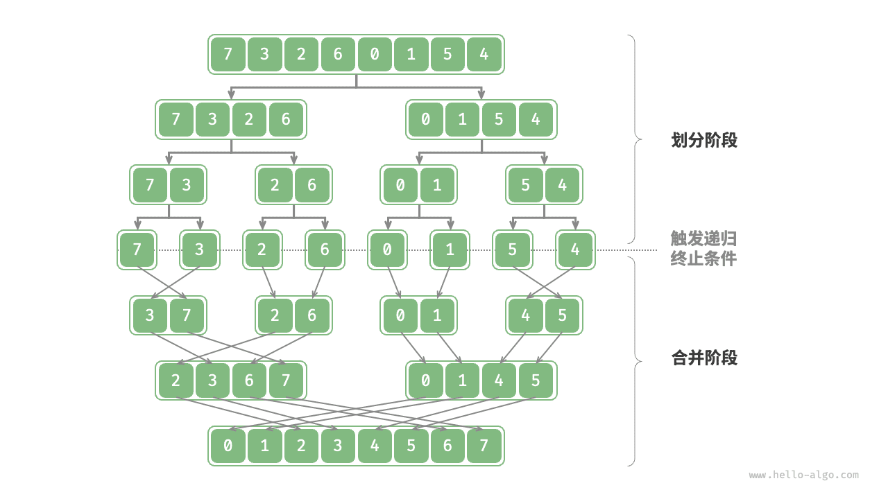

## 算法流程

如下图所示，“划分阶段”从顶至底递归地将数组从中点切分为两个子数组。

1. 计算数组中点 `mid` ，递归划分左子数组（区间 `[left, mid]` ）和右子数组（区间 `[mid + 1, right]` ）。
2. 递归执行步骤 `1.` ，直至子数组区间长度为 1 时终止。

“合并阶段”从底至顶地将左子数组和右子数组合并为一个有序数组。需要注意的是，从长度为 1 的子数组开始合并，合并阶段中的每个子数组都是有序的。

=== "<1>"
    

=== "<2>"
    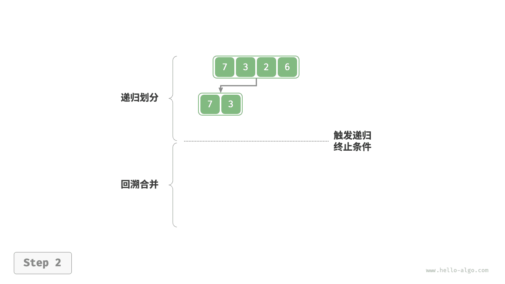

=== "<3>"
    

=== "<4>"
    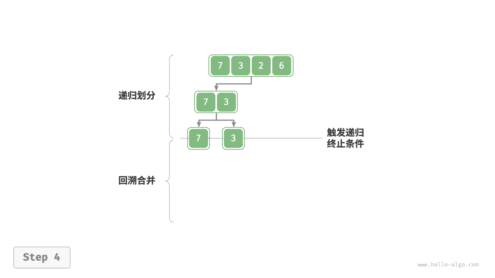

=== "<5>"
    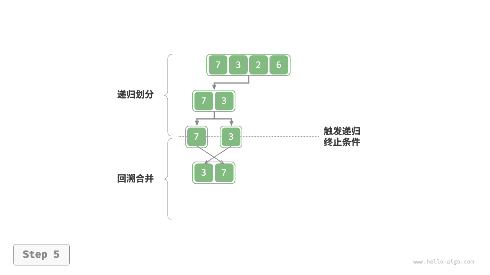

=== "<6>"
    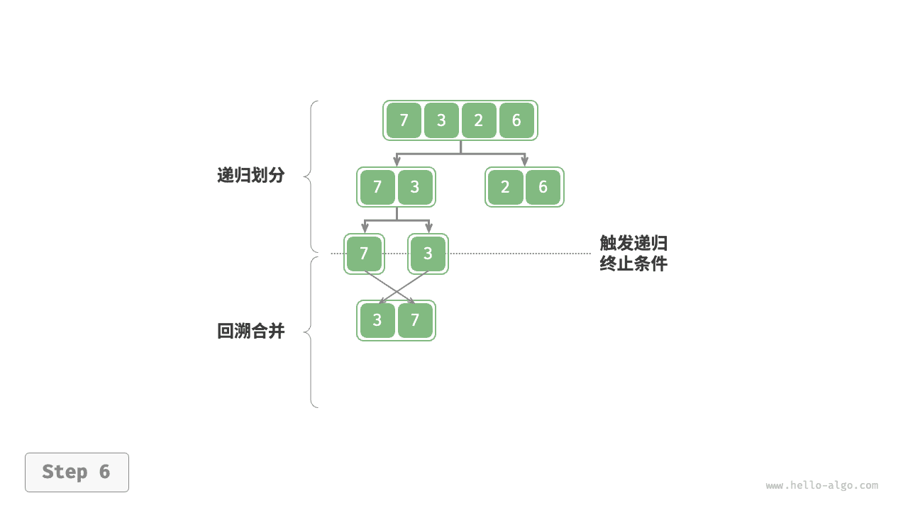

=== "<7>"
    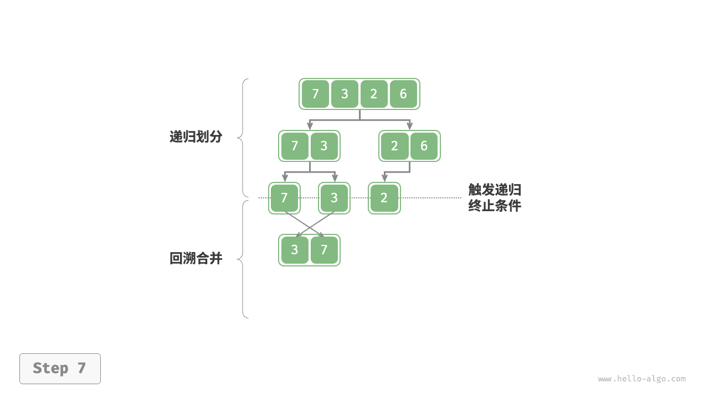

=== "<8>"
    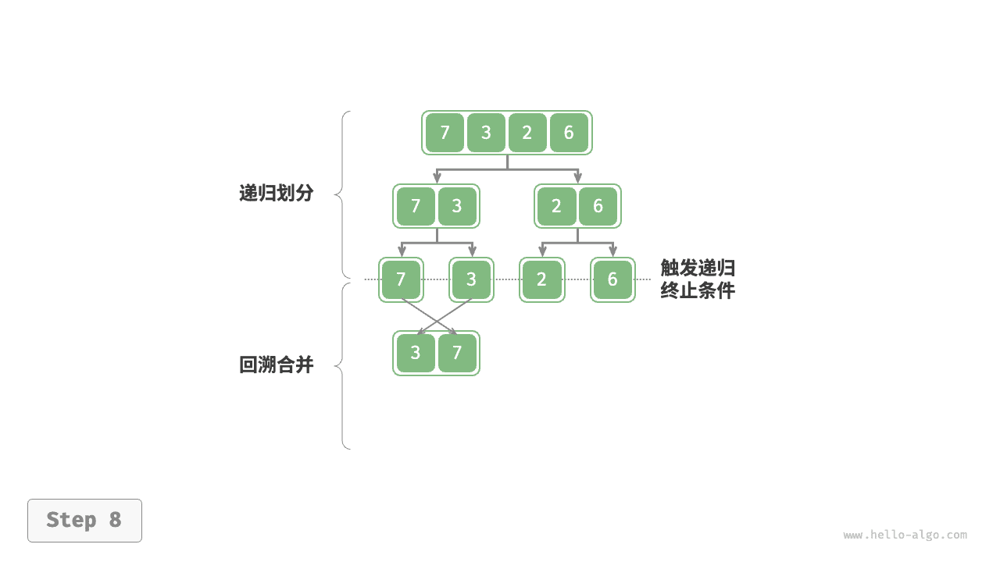

=== "<9>"
    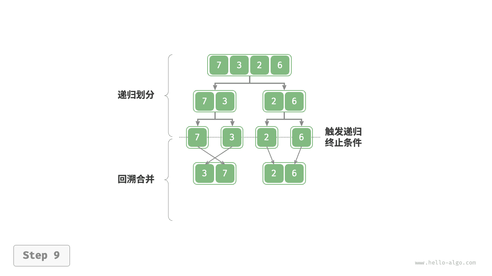

=== "<10>"
    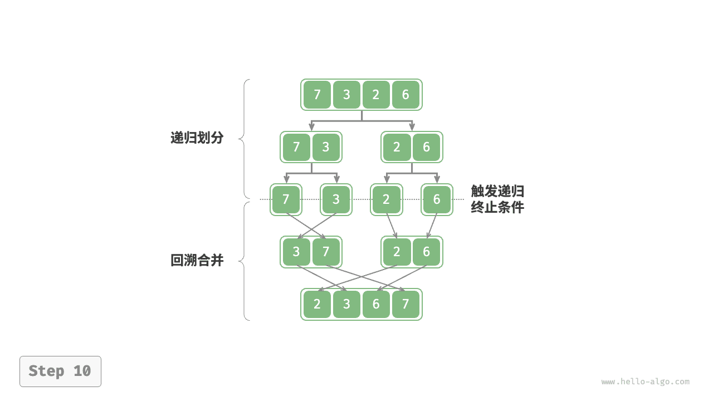

观察发现，归并排序与二叉树后序遍历的递归顺序是一致的。

- **后序遍历**：先递归左子树，再递归右子树，最后处理根节点。
- **归并排序**：先递归左子数组，再递归右子数组，最后处理合并。

归并排序的实现如以下代码所示。请注意，`nums` 的待合并区间为 `[left, right]` ，而 `tmp` 的对应区间为 `[0, right - left]` 。

```python
def merge(nums: list[int], left: int, mid: int, right: int):
    """合并左子数组和右子数组"""
    # 左子数组区间为 [left, mid], 右子数组区间为 [mid+1, right]
    # 创建一个临时数组 tmp ，用于存放合并后的结果
    tmp = [0] * (right - left + 1)
    # 初始化左子数组和右子数组的起始索引
    i, j, k = left, mid + 1, 0
    # 当左右子数组都还有元素时，进行比较并将较小的元素复制到临时数组中
    while i <= mid and j <= right:
        if nums[i] <= nums[j]:
            tmp[k] = nums[i]
            i += 1
        else:
            tmp[k] = nums[j]
            j += 1
        k += 1
    # 将左子数组和右子数组的剩余元素复制到临时数组中
    while i <= mid:
        tmp[k] = nums[i]
        i += 1
        k += 1
    while j <= right:
        tmp[k] = nums[j]
        j += 1
        k += 1
    # 将临时数组 tmp 中的元素复制回原数组 nums 的对应区间
    for k in range(0, len(tmp)):
        nums[left + k] = tmp[k]

def merge_sort(nums: list[int], left: int, right: int):
    """归并排序"""
    # 终止条件
    if left >= right:
        return  # 当子数组长度为 1 时终止递归
    # 划分阶段
    mid = (left + right) // 2 # 计算中点
    merge_sort(nums, left, mid)  # 递归左子数组
    merge_sort(nums, mid + 1, right)  # 递归右子数组
    # 合并阶段
    merge(nums, left, mid, right)
```

!!! example [pythontutor "可视化运行"](https://pythontutor.com/iframe-embed.html#code=def%20merge%28nums%3A%20list%5Bint%5D,%20left%3A%20int,%20mid%3A%20int,%20right%3A%20int%29%3A%0A%20%20%20%20%22%22%22%E5%90%88%E5%B9%B6%E5%B7%A6%E5%AD%90%E6%95%B0%E7%BB%84%E5%92%8C%E5%8F%B3%E5%AD%90%E6%95%B0%E7%BB%84%22%22%22%0A%20%20%20%20%23%20%E5%B7%A6%E5%AD%90%E6%95%B0%E7%BB%84%E5%8C%BA%E9%97%B4%E4%B8%BA%20%5Bleft,%20mid%5D,%20%E5%8F%B3%E5%AD%90%E6%95%B0%E7%BB%84%E5%8C%BA%E9%97%B4%E4%B8%BA%20%5Bmid%2B1,%20right%5D%0A%20%20%20%20%23%20%E5%88%9B%E5%BB%BA%E4%B8%80%E4%B8%AA%E4%B8%B4%E6%97%B6%E6%95%B0%E7%BB%84%20tmp%20%EF%BC%8C%E7%94%A8%E4%BA%8E%E5%AD%98%E6%94%BE%E5%90%88%E5%B9%B6%E5%90%8E%E7%9A%84%E7%BB%93%E6%9E%9C%0A%20%20%20%20tmp%20%3D%20%5B0%5D%20*%20%28right%20-%20left%20%2B%201%29%0A%20%20%20%20%23%20%E5%88%9D%E5%A7%8B%E5%8C%96%E5%B7%A6%E5%AD%90%E6%95%B0%E7%BB%84%E5%92%8C%E5%8F%B3%E5%AD%90%E6%95%B0%E7%BB%84%E7%9A%84%E8%B5%B7%E5%A7%8B%E7%B4%A2%E5%BC%95%0A%20%20%20%20i,%20j,%20k%20%3D%20left,%20mid%20%2B%201,%200%0A%20%20%20%20%23%20%E5%BD%93%E5%B7%A6%E5%8F%B3%E5%AD%90%E6%95%B0%E7%BB%84%E9%83%BD%E8%BF%98%E6%9C%89%E5%85%83%E7%B4%A0%E6%97%B6%EF%BC%8C%E8%BF%9B%E8%A1%8C%E6%AF%94%E8%BE%83%E5%B9%B6%E5%B0%86%E8%BE%83%E5%B0%8F%E7%9A%84%E5%85%83%E7%B4%A0%E5%A4%8D%E5%88%B6%E5%88%B0%E4%B8%B4%E6%97%B6%E6%95%B0%E7%BB%84%E4%B8%AD%0A%20%20%20%20while%20i%20%3C%3D%20mid%20and%20j%20%3C%3D%20right%3A%0A%20%20%20%20%20%20%20%20if%20nums%5Bi%5D%20%3C%3D%20nums%5Bj%5D%3A%0A%20%20%20%20%20%20%20%20%20%20%20%20tmp%5Bk%5D%20%3D%20nums%5Bi%5D%0A%20%20%20%20%20%20%20%20%20%20%20%20i%20%2B%3D%201%0A%20%20%20%20%20%20%20%20else%3A%0A%20%20%20%20%20%20%20%20%20%20%20%20tmp%5Bk%5D%20%3D%20nums%5Bj%5D%0A%20%20%20%20%20%20%20%20%20%20%20%20j%20%2B%3D%201%0A%20%20%20%20%20%20%20%20k%20%2B%3D%201%0A%20%20%20%20%23%20%E5%B0%86%E5%B7%A6%E5%AD%90%E6%95%B0%E7%BB%84%E5%92%8C%E5%8F%B3%E5%AD%90%E6%95%B0%E7%BB%84%E7%9A%84%E5%89%A9%E4%BD%99%E5%85%83%E7%B4%A0%E5%A4%8D%E5%88%B6%E5%88%B0%E4%B8%B4%E6%97%B6%E6%95%B0%E7%BB%84%E4%B8%AD%0A%20%20%20%20while%20i%20%3C%3D%20mid%3A%0A%20%20%20%20%20%20%20%20tmp%5Bk%5D%20%3D%20nums%5Bi%5D%0A%20%20%20%20%20%20%20%20i%20%2B%3D%201%0A%20%20%20%20%20%20%20%20k%20%2B%3D%201%0A%20%20%20%20while%20j%20%3C%3D%20right%3A%0A%20%20%20%20%20%20%20%20tmp%5Bk%5D%20%3D%20nums%5Bj%5D%0A%20%20%20%20%20%20%20%20j%20%2B%3D%201%0A%20%20%20%20%20%20%20%20k%20%2B%3D%201%0A%20%20%20%20%23%20%E5%B0%86%E4%B8%B4%E6%97%B6%E6%95%B0%E7%BB%84%20tmp%20%E4%B8%AD%E7%9A%84%E5%85%83%E7%B4%A0%E5%A4%8D%E5%88%B6%E5%9B%9E%E5%8E%9F%E6%95%B0%E7%BB%84%20nums%20%E7%9A%84%E5%AF%B9%E5%BA%94%E5%8C%BA%E9%97%B4%0A%20%20%20%20for%20k%20in%20range%280,%20len%28tmp%29%29%3A%0A%20%20%20%20%20%20%20%20nums%5Bleft%20%2B%20k%5D%20%3D%20tmp%5Bk%5D%0A%0A%0Adef%20merge_sort%28nums%3A%20list%5Bint%5D,%20left%3A%20int,%20right%3A%20int%29%3A%0A%20%20%20%20%22%22%22%E5%BD%92%E5%B9%B6%E6%8E%92%E5%BA%8F%22%22%22%0A%20%20%20%20%23%20%E7%BB%88%E6%AD%A2%E6%9D%A1%E4%BB%B6%0A%20%20%20%20if%20left%20%3E%3D%20right%3A%0A%20%20%20%20%20%20%20%20return%20%20%23%20%E5%BD%93%E5%AD%90%E6%95%B0%E7%BB%84%E9%95%BF%E5%BA%A6%E4%B8%BA%201%20%E6%97%B6%E7%BB%88%E6%AD%A2%E9%80%92%E5%BD%92%0A%20%20%20%20%23%20%E5%88%92%E5%88%86%E9%98%B6%E6%AE%B5%0A%20%20%20%20mid%20%3D%20%28left%20%2B%20right%29%20//%202%20%20%23%20%E8%AE%A1%E7%AE%97%E4%B8%AD%E7%82%B9%0A%20%20%20%20merge_sort%28nums,%20left,%20mid%29%20%20%23%20%E9%80%92%E5%BD%92%E5%B7%A6%E5%AD%90%E6%95%B0%E7%BB%84%0A%20%20%20%20merge_sort%28nums,%20mid%20%2B%201,%20right%29%20%20%23%20%E9%80%92%E5%BD%92%E5%8F%B3%E5%AD%90%E6%95%B0%E7%BB%84%0A%20%20%20%20%23%20%E5%90%88%E5%B9%B6%E9%98%B6%E6%AE%B5%0A%20%20%20%20merge%28nums,%20left,%20mid,%20right%29%0A%0A%0A%22%22%22Driver%20Code%22%22%22%0Aif%20__name__%20%3D%3D%20%22__main__%22%3A%0A%20%20%20%20nums%20%3D%20%5B7,%203,%202,%206,%200,%201,%205,%204%5D%0A%20%20%20%20merge_sort%28nums,%200,%20len%28nums%29%20-%201%29%0A%20%20%20%20print%28%22%E5%BD%92%E5%B9%B6%E6%8E%92%E5%BA%8F%E5%AE%8C%E6%88%90%E5%90%8E%20nums%20%3D%22,%20nums%29&codeDivHeight=800&codeDivWidth=600&cumulative=false&curInstr=5&heapPrimitives=nevernest&origin=opt-frontend.js&py=311&rawInputLstJSON=%5B%5D&textReferences=false)

## 算法特性

- **时间复杂度为 $O(n \log n)$、非自适应排序**：划分产生高度为 $\log n$ 的递归树，每层合并的总操作数量为 $n$ ，因此总体时间复杂度为 $O(n \log n)$ 。
- **空间复杂度为 $O(n)$、非原地排序**：递归深度为 $\log n$ ，使用 $O(\log n)$ 大小的栈帧空间。合并操作需要借助辅助数组实现，使用 $O(n)$ 大小的额外空间。
- **稳定排序**：在合并过程中，相等元素的次序保持不变。

## 链表排序

对于链表，归并排序相较于其他排序算法具有显著优势，**可以将链表排序任务的空间复杂度优化至 $O(1)$** 。

- **划分阶段**：可以使用“迭代”替代“递归”来实现链表划分工作，从而省去递归使用的栈帧空间。
- **合并阶段**：在链表中，节点增删操作仅需改变引用（指针）即可实现，因此合并阶段（将两个短有序链表合并为一个长有序链表）无须创建额外链表。

具体实现细节比较复杂，有兴趣的读者可以查阅相关资料进行学习。

# 堆排序

!!! tip

    阅读本节前，请确保已学完“堆”章节。

<u>堆排序（heap sort）</u>是一种基于堆数据结构实现的高效排序算法。我们可以利用已经学过的“建堆操作”和“元素出堆操作”实现堆排序。

1. 输入数组并建立小顶堆，此时最小元素位于堆顶。
2. 不断执行出堆操作，依次记录出堆元素，即可得到从小到大排序的序列。

以上方法虽然可行，但需要借助一个额外数组来保存弹出的元素，比较浪费空间。在实际中，我们通常使用一种更加优雅的实现方式。

## 算法流程

设数组的长度为 $n$ ，堆排序的流程如下图所示。

1. 输入数组并建立大顶堆。完成后，最大元素位于堆顶。
2. 将堆顶元素（第一个元素）与堆底元素（最后一个元素）交换。完成交换后，堆的长度减 $1$ ，已排序元素数量加 $1$ 。
3. 从堆顶元素开始，从顶到底执行堆化操作（sift down）。完成堆化后，堆的性质得到修复。
4. 循环执行第 `2.` 步和第 `3.` 步。循环 $n - 1$ 轮后，即可完成数组排序。

!!! tip

    实际上，元素出堆操作中也包含第 `2.` 步和第 `3.` 步，只是多了一个弹出元素的步骤。

=== "<1>"
    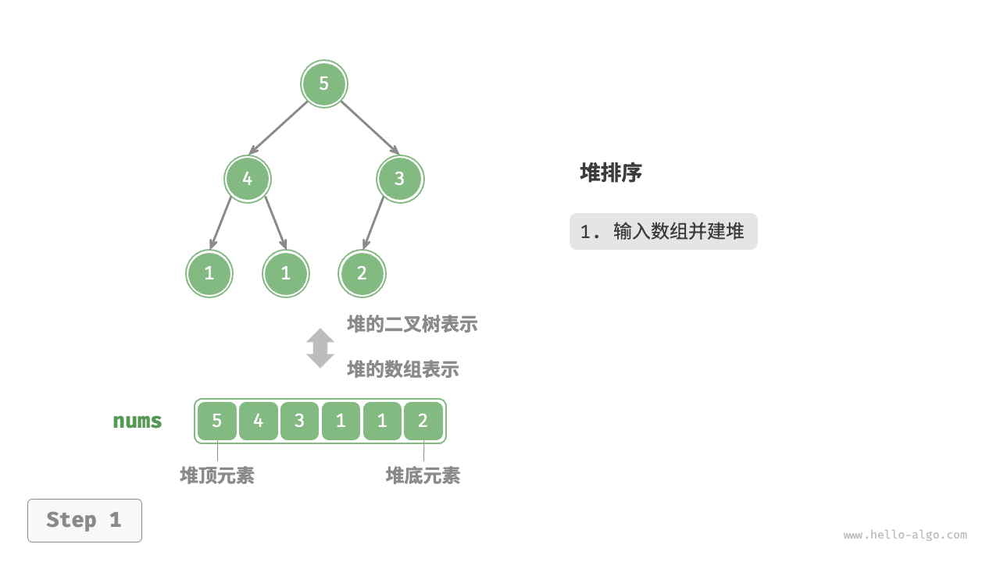

=== "<2>"
    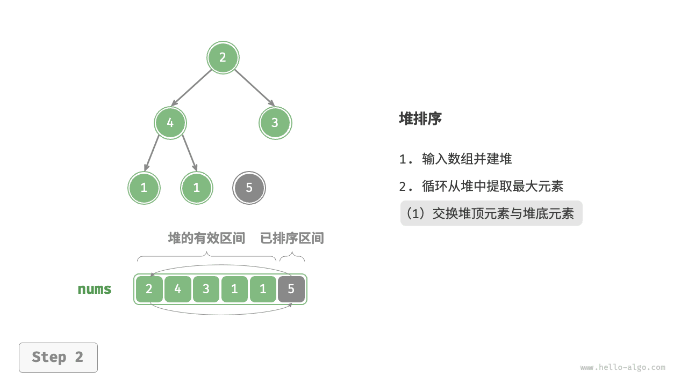

=== "<3>"
    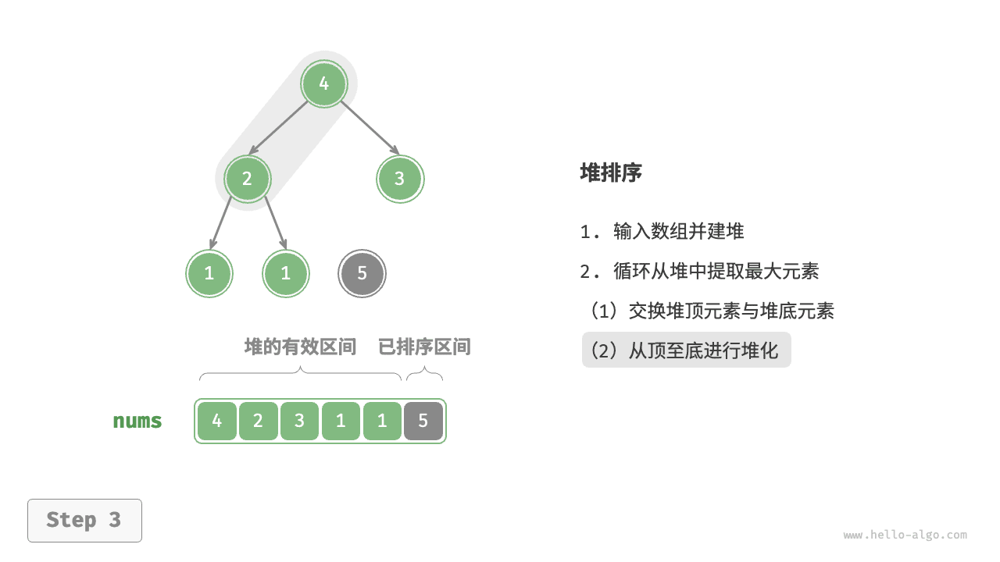

=== "<4>"
    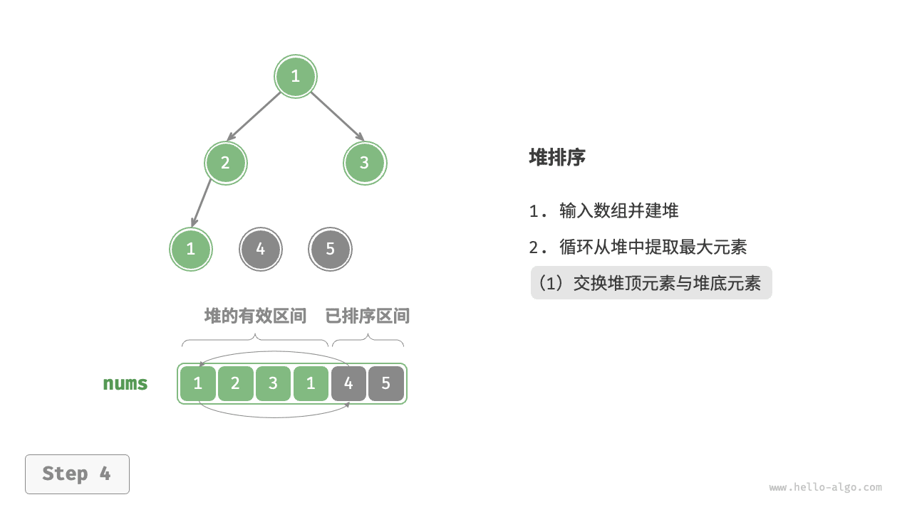

=== "<5>"
    

=== "<6>"
    

=== "<7>"
    

=== "<8>"
    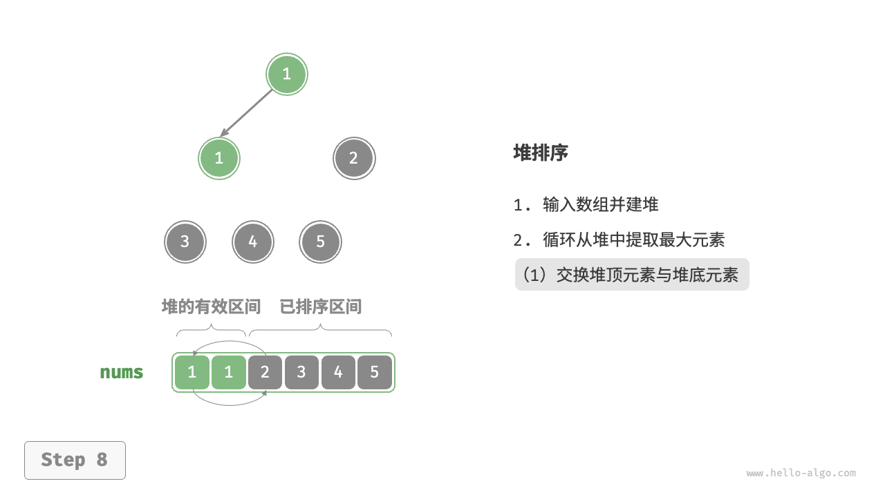

=== "<9>"
    

=== "<10>"
    

=== "<11>"
    

=== "<12>"
    

在代码实现中，我们使用了与“堆”章节相同的从顶至底堆化 `sift_down()` 函数。值得注意的是，由于堆的长度会随着提取最大元素而减小，因此我们需要给 `sift_down()` 函数添加一个长度参数 $n$ ，用于指定堆的当前有效长度。代码如下所示：

```python
def sift_down(nums: list[int], n: int, i: int):
    """堆的长度为 n ，从节点 i 开始，从顶至底堆化"""
    while True:
        # 判断节点 i, l, r 中值最大的节点，记为 ma
        l = 2 * i + 1
        r = 2 * i + 2
        ma = i
        if l < n and nums[l] > nums[ma]:
            ma = l
        if r < n and nums[r] > nums[ma]:
            ma = r
        # 若节点 i 最大或索引 l, r 越界，则无须继续堆化，跳出
        if ma == i:
            break
        # 交换两节点
        nums[i], nums[ma] = nums[ma], nums[i]
        # 循环向下堆化
        i = ma

def heap_sort(nums: list[int]):
    """堆排序"""
    # 建堆操作：堆化除叶节点以外的其他所有节点
    for i in range(len(nums) // 2 - 1, -1, -1):
        sift_down(nums, len(nums), i)
    # 从堆中提取最大元素，循环 n-1 轮
    for i in range(len(nums) - 1, 0, -1):
        # 交换根节点与最右叶节点（交换首元素与尾元素）
        nums[0], nums[i] = nums[i], nums[0]
        # 以根节点为起点，从顶至底进行堆化
        sift_down(nums, i, 0)
```

!!! example [pythontutor "可视化运行"](https://pythontutor.com/iframe-embed.html#code=def%20sift_down%28nums%3A%20list%5Bint%5D,%20n%3A%20int,%20i%3A%20int%29%3A%0A%20%20%20%20%22%22%22%E5%A0%86%E7%9A%84%E9%95%BF%E5%BA%A6%E4%B8%BA%20n%20%EF%BC%8C%E4%BB%8E%E8%8A%82%E7%82%B9%20i%20%E5%BC%80%E5%A7%8B%EF%BC%8C%E4%BB%8E%E9%A1%B6%E8%87%B3%E5%BA%95%E5%A0%86%E5%8C%96%22%22%22%0A%20%20%20%20while%20True%3A%0A%20%20%20%20%20%20%20%20%23%20%E5%88%A4%E6%96%AD%E8%8A%82%E7%82%B9%20i,%20l,%20r%20%E4%B8%AD%E5%80%BC%E6%9C%80%E5%A4%A7%E7%9A%84%E8%8A%82%E7%82%B9%EF%BC%8C%E8%AE%B0%E4%B8%BA%20ma%0A%20%20%20%20%20%20%20%20l%20%3D%202%20*%20i%20%2B%201%0A%20%20%20%20%20%20%20%20r%20%3D%202%20*%20i%20%2B%202%0A%20%20%20%20%20%20%20%20ma%20%3D%20i%0A%20%20%20%20%20%20%20%20if%20l%20%3C%20n%20and%20nums%5Bl%5D%20%3E%20nums%5Bma%5D%3A%0A%20%20%20%20%20%20%20%20%20%20%20%20ma%20%3D%20l%0A%20%20%20%20%20%20%20%20if%20r%20%3C%20n%20and%20nums%5Br%5D%20%3E%20nums%5Bma%5D%3A%0A%20%20%20%20%20%20%20%20%20%20%20%20ma%20%3D%20r%0A%20%20%20%20%20%20%20%20%23%20%E8%8B%A5%E8%8A%82%E7%82%B9%20i%20%E6%9C%80%E5%A4%A7%E6%88%96%E7%B4%A2%E5%BC%95%20l,%20r%20%E8%B6%8A%E7%95%8C%EF%BC%8C%E5%88%99%E6%97%A0%E9%A1%BB%E7%BB%A7%E7%BB%AD%E5%A0%86%E5%8C%96%EF%BC%8C%E8%B7%B3%E5%87%BA%0A%20%20%20%20%20%20%20%20if%20ma%20%3D%3D%20i%3A%0A%20%20%20%20%20%20%20%20%20%20%20%20break%0A%20%20%20%20%20%20%20%20%23%20%E4%BA%A4%E6%8D%A2%E4%B8%A4%E8%8A%82%E7%82%B9%0A%20%20%20%20%20%20%20%20nums%5Bi%5D,%20nums%5Bma%5D%20%3D%20nums%5Bma%5D,%20nums%5Bi%5D%0A%20%20%20%20%20%20%20%20%23%20%E5%BE%AA%E7%8E%AF%E5%90%91%E4%B8%8B%E5%A0%86%E5%8C%96%0A%20%20%20%20%20%20%20%20i%20%3D%20ma%0A%0Adef%20heap_sort%28nums%3A%20list%5Bint%5D%29%3A%0A%20%20%20%20%22%22%22%E5%A0%86%E6%8E%92%E5%BA%8F%22%22%22%0A%20%20%20%20%23%20%E5%BB%BA%E5%A0%86%E6%93%8D%E4%BD%9C%EF%BC%9A%E5%A0%86%E5%8C%96%E9%99%A4%E5%8F%B6%E8%8A%82%E7%82%B9%E4%BB%A5%E5%A4%96%E7%9A%84%E5%85%B6%E4%BB%96%E6%89%80%E6%9C%89%E8%8A%82%E7%82%B9%0A%20%20%20%20for%20i%20in%20range%28len%28nums%29%20//%202%20-%201,%20-1,%20-1%29%3A%0A%20%20%20%20%20%20%20%20sift_down%28nums,%20len%28nums%29,%20i%29%0A%20%20%20%20%23%20%E4%BB%8E%E5%A0%86%E4%B8%AD%E6%8F%90%E5%8F%96%E6%9C%80%E5%A4%A7%E5%85%83%E7%B4%A0%EF%BC%8C%E5%BE%AA%E7%8E%AF%20n-1%20%E8%BD%AE%0A%20%20%20%20for%20i%20in%20range%28len%28nums%29%20-%201,%200,%20-1%29%3A%0A%20%20%20%20%20%20%20%20%23%20%E4%BA%A4%E6%8D%A2%E6%A0%B9%E8%8A%82%E7%82%B9%E4%B8%8E%E6%9C%80%E5%8F%B3%E5%8F%B6%E8%8A%82%E7%82%B9%EF%BC%88%E4%BA%A4%E6%8D%A2%E9%A6%96%E5%85%83%E7%B4%A0%E4%B8%8E%E5%B0%BE%E5%85%83%E7%B4%A0%EF%BC%89%0A%20%20%20%20%20%20%20%20nums%5B0%5D,%20nums%5Bi%5D%20%3D%20nums%5Bi%5D,%20nums%5B0%5D%0A%20%20%20%20%20%20%20%20%23%20%E4%BB%A5%E6%A0%B9%E8%8A%82%E7%82%B9%E4%B8%BA%E8%B5%B7%E7%82%B9%EF%BC%8C%E4%BB%8E%E9%A1%B6%E8%87%B3%E5%BA%95%E8%BF%9B%E8%A1%8C%E5%A0%86%E5%8C%96%0A%20%20%20%20%20%20%20%20sift_down%28nums,%20i,%200%29%0A%0A%22%22%22Driver%20Code%22%22%22%0Aif%20__name__%20%3D%3D%20%22__main__%22%3A%0A%20%20%20%20nums%20%3D%20%5B4,%201,%203,%201,%205,%202%5D%0A%20%20%20%20heap_sort%28nums%29%0A%20%20%20%20print%28%22%E5%A0%86%E6%8E%92%E5%BA%8F%E5%AE%8C%E6%88%90%E5%90%8E%20nums%20%3D%22,%20nums%29&codeDivHeight=800&codeDivWidth=600&cumulative=false&curInstr=5&heapPrimitives=nevernest&origin=opt-frontend.js&py=311&rawInputLstJSON=%5B%5D&textReferences=false)

## 算法特性

- **时间复杂度为 $O(n \log n)$、非自适应排序**：建堆操作使用 $O(n)$ 时间。从堆中提取最大元素的时间复杂度为 $O(\log n)$ ，共循环 $n - 1$ 轮。
- **空间复杂度为 $O(1)$、原地排序**：几个指针变量使用 $O(1)$ 空间。元素交换和堆化操作都是在原数组上进行的。
- **非稳定排序**：在交换堆顶元素和堆底元素时，相等元素的相对位置可能发生变化。

# 桶排序

前述几种排序算法都属于“基于比较的排序算法”，它们通过比较元素间的大小来实现排序。此类排序算法的时间复杂度无法超越 $O(n \log n)$ 。接下来，我们将探讨几种“非比较排序算法”，它们的时间复杂度可以达到线性阶。

<u>桶排序（bucket sort）</u>是分治策略的一个典型应用。它通过设置一些具有大小顺序的桶，每个桶对应一个数据范围，将数据平均分配到各个桶中；然后，在每个桶内部分别执行排序；最终按照桶的顺序将所有数据合并。

## 算法流程

考虑一个长度为 $n$ 的数组，其元素是范围 $[0, 1)$ 内的浮点数。桶排序的流程如下图所示。

1. 初始化 $k$ 个桶，将 $n$ 个元素分配到 $k$ 个桶中。
2. 对每个桶分别执行排序（这里采用编程语言的内置排序函数）。
3. 按照桶从小到大的顺序合并结果。


代码如下所示：

```python
def bucket_sort(nums: list[float]):
    """桶排序"""
    # 初始化 k = n/2 个桶，预期向每个桶分配 2 个元素
    k = len(nums) // 2
    buckets = [[] for _ in range(k)]
    # 1. 将数组元素分配到各个桶中
    for num in nums:
        # 输入数据范围为 [0, 1)，使用 num * k 映射到索引范围 [0, k-1]
        i = int(num * k)
        # 将 num 添加进桶 i
        buckets[i].append(num)
    # 2. 对各个桶执行排序
    for bucket in buckets:
        # 使用内置排序函数，也可以替换成其他排序算法
        bucket.sort()
    # 3. 遍历桶合并结果
    i = 0
    for bucket in buckets:
        for num in bucket:
            nums[i] = num
            i += 1
```

!!! example [pythontutor "可视化运行"](https://pythontutor.com/iframe-embed.html#code=def%20bucket_sort%28nums%3A%20list%5Bfloat%5D%29%3A%0A%20%20%20%20%22%22%22%E6%A1%B6%E6%8E%92%E5%BA%8F%22%22%22%0A%20%20%20%20%23%20%E5%88%9D%E5%A7%8B%E5%8C%96%20k%20%3D%20n/2%20%E4%B8%AA%E6%A1%B6%EF%BC%8C%E9%A2%84%E6%9C%9F%E5%90%91%E6%AF%8F%E4%B8%AA%E6%A1%B6%E5%88%86%E9%85%8D%202%20%E4%B8%AA%E5%85%83%E7%B4%A0%0A%20%20%20%20k%20%3D%20len%28nums%29%20//%202%0A%20%20%20%20buckets%20%3D%20%5B%5B%5D%20for%20_%20in%20range%28k%29%5D%0A%20%20%20%20%23%201.%20%E5%B0%86%E6%95%B0%E7%BB%84%E5%85%83%E7%B4%A0%E5%88%86%E9%85%8D%E5%88%B0%E5%90%84%E4%B8%AA%E6%A1%B6%E4%B8%AD%0A%20%20%20%20for%20num%20in%20nums%3A%0A%20%20%20%20%20%20%20%20%23%20%E8%BE%93%E5%85%A5%E6%95%B0%E6%8D%AE%E8%8C%83%E5%9B%B4%E4%B8%BA%20%5B0,%201%29%EF%BC%8C%E4%BD%BF%E7%94%A8%20num%20*%20k%20%E6%98%A0%E5%B0%84%E5%88%B0%E7%B4%A2%E5%BC%95%E8%8C%83%E5%9B%B4%20%5B0,%20k-1%5D%0A%20%20%20%20%20%20%20%20i%20%3D%20int%28num%20*%20k%29%0A%20%20%20%20%20%20%20%20%23%20%E5%B0%86%20num%20%E6%B7%BB%E5%8A%A0%E8%BF%9B%E6%A1%B6%20i%0A%20%20%20%20%20%20%20%20buckets%5Bi%5D.append%28num%29%0A%20%20%20%20%23%202.%20%E5%AF%B9%E5%90%84%E4%B8%AA%E6%A1%B6%E6%89%A7%E8%A1%8C%E6%8E%92%E5%BA%8F%0A%20%20%20%20for%20bucket%20in%20buckets%3A%0A%20%20%20%20%20%20%20%20%23%20%E4%BD%BF%E7%94%A8%E5%86%85%E7%BD%AE%E6%8E%92%E5%BA%8F%E5%87%BD%E6%95%B0%EF%BC%8C%E4%B9%9F%E5%8F%AF%E4%BB%A5%E6%9B%BF%E6%8D%A2%E6%88%90%E5%85%B6%E4%BB%96%E6%8E%92%E5%BA%8F%E7%AE%97%E6%B3%95%0A%20%20%20%20%20%20%20%20bucket.sort%28%29%0A%20%20%20%20%23%203.%20%E9%81%8D%E5%8E%86%E6%A1%B6%E5%90%88%E5%B9%B6%E7%BB%93%E6%9E%9C%0A%20%20%20%20i%20%3D%200%0A%20%20%20%20for%20bucket%20in%20buckets%3A%0A%20%20%20%20%20%20%20%20for%20num%20in%20bucket%3A%0A%20%20%20%20%20%20%20%20%20%20%20%20nums%5Bi%5D%20%3D%20num%0A%20%20%20%20%20%20%20%20%20%20%20%20i%20%2B%3D%201%0A%0Aif%20__name__%20%3D%3D%20%22__main__%22%3A%0A%20%20%20%20%23%20%E8%AE%BE%E8%BE%93%E5%85%A5%E6%95%B0%E6%8D%AE%E4%B8%BA%E6%B5%AE%E7%82%B9%E6%95%B0%EF%BC%8C%E8%8C%83%E5%9B%B4%E4%B8%BA%20%5B0,%201%29%0A%20%20%20%20nums%20%3D%20%5B0.49,%200.96,%200.82,%200.09,%200.57,%200.43,%200.91,%200.75,%200.15,%200.37%5D%0A%20%20%20%20bucket_sort%28nums%29%0A%20%20%20%20print%28%22%E6%A1%B6%E6%8E%92%E5%BA%8F%E5%AE%8C%E6%88%90%E5%90%8E%20nums%20%3D%22,%20nums%29&codeDivHeight=800&codeDivWidth=600&cumulative=false&curInstr=3&heapPrimitives=nevernest&origin=opt-frontend.js&py=311&rawInputLstJSON=%5B%5D&textReferences=false)

## 算法特性

桶排序适用于处理体量很大的数据。例如，输入数据包含 100 万个元素，由于空间限制，系统内存无法一次性加载所有数据。此时，可以将数据分成 1000 个桶，然后分别对每个桶进行排序，最后将结果合并。

- **时间复杂度为 $O(n + k)$** ：假设元素在各个桶内平均分布，那么每个桶内的元素数量为 $\frac{n}{k}$ 。假设排序单个桶使用 $O(\frac{n}{k} \log\frac{n}{k})$ 时间，则排序所有桶使用 $O(n \log\frac{n}{k})$ 时间。**当桶数量 $k$ 比较大时，时间复杂度则趋向于 $O(n)$** 。合并结果时需要遍历所有桶和元素，花费 $O(n + k)$ 时间。在最差情况下，所有数据被分配到一个桶中，且排序该桶使用 $O(n^2)$ 时间。
- **空间复杂度为 $O(n + k)$、非原地排序**：需要借助 $k$ 个桶和总共 $n$ 个元素的额外空间。
- 桶排序是否稳定取决于排序桶内元素的算法是否稳定。

## 如何实现平均分配

桶排序的时间复杂度理论上可以达到 $O(n)$ ，**关键在于将元素均匀分配到各个桶中**，因为实际数据往往不是均匀分布的。例如，我们想要将淘宝上的所有商品按价格范围平均分配到 10 个桶中，但商品价格分布不均，低于 100 元的非常多，高于 1000 元的非常少。若将价格区间平均划分为 10 个，各个桶中的商品数量差距会非常大。

为实现平均分配，我们可以先设定一条大致的分界线，将数据粗略地分到 3 个桶中。**分配完毕后，再将商品较多的桶继续划分为 3 个桶，直至所有桶中的元素数量大致相等**。

如下图所示，这种方法本质上是创建一棵递归树，目标是让叶节点的值尽可能平均。当然，不一定要每轮将数据划分为 3 个桶，具体划分方式可根据数据特点灵活选择。

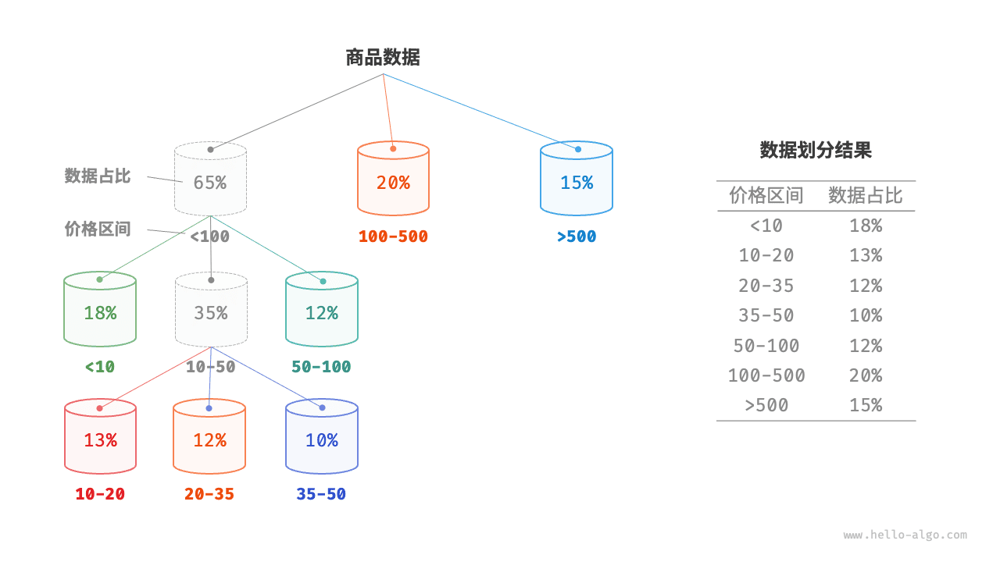

如果我们提前知道商品价格的概率分布，**则可以根据数据概率分布设置每个桶的价格分界线**。值得注意的是，数据分布并不一定需要特意统计，也可以根据数据特点采用某种概率模型进行近似。

如下图所示，我们假设商品价格服从正态分布，这样就可以合理地设定价格区间，从而将商品平均分配到各个桶中。

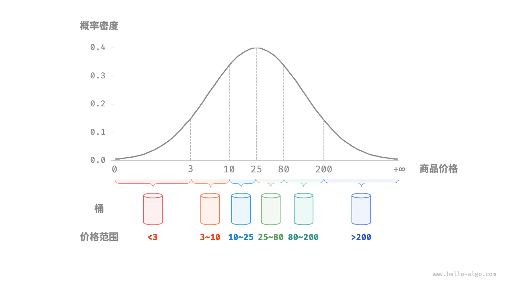

# 计数排序

<u>计数排序（counting sort）</u>通过统计元素数量来实现排序，通常应用于整数数组。

## 简单实现

先来看一个简单的例子。给定一个长度为 $n$ 的数组 `nums` ，其中的元素都是“非负整数”，计数排序的整体流程如下图所示。

1. 遍历数组，找出其中的最大数字，记为 $m$ ，然后创建一个长度为 $m + 1$ 的辅助数组 `counter` 。
2. **借助 `counter` 统计 `nums` 中各数字的出现次数**，其中 `counter[num]` 对应数字 `num` 的出现次数。统计方法很简单，只需遍历 `nums`（设当前数字为 `num`），每轮将 `counter[num]` 增加 $1$ 即可。
3. **由于 `counter` 的各个索引天然有序，因此相当于所有数字已经排序好了**。接下来，我们遍历 `counter` ，根据各数字出现次数从小到大的顺序填入 `nums` 即可。

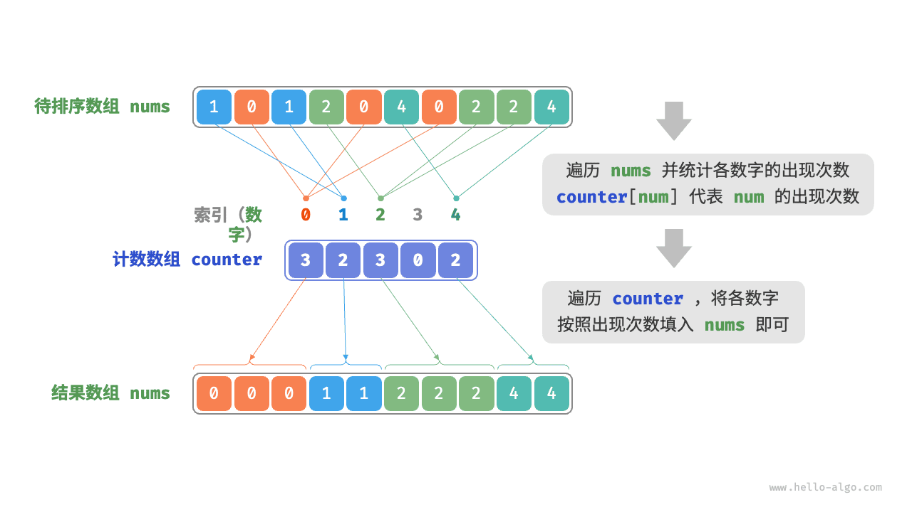

代码如下所示：

```python
def counting_sort_naive(nums: list[int]):
    """计数排序"""
    # 简单实现，无法用于排序对象
    # 1. 统计数组最大元素 m
    m = max(nums)
    # 2. 统计各数字的出现次数
    # counter[num] 代表 num 的出现次数
    counter = [0] * (m + 1)
    for num in nums:
        counter[num] += 1
    # 3. 遍历 counter ，将各元素填入原数组 nums
    i = 0
    for num in range(m + 1):
        for _ in range(counter[num]):
            nums[i] = num
            i += 1
```

!!! example [pythontutor "可视化运行"](https://pythontutor.com/iframe-embed.html#code=def%20counting_sort_naive%28nums%3A%20list%5Bint%5D%29%3A%0A%20%20%20%20%22%22%22%E8%AE%A1%E6%95%B0%E6%8E%92%E5%BA%8F%22%22%22%0A%20%20%20%20%23%20%E7%AE%80%E5%8D%95%E5%AE%9E%E7%8E%B0%EF%BC%8C%E6%97%A0%E6%B3%95%E7%94%A8%E4%BA%8E%E6%8E%92%E5%BA%8F%E5%AF%B9%E8%B1%A1%0A%20%20%20%20%23%201.%20%E7%BB%9F%E8%AE%A1%E6%95%B0%E7%BB%84%E6%9C%80%E5%A4%A7%E5%85%83%E7%B4%A0%20m%0A%20%20%20%20m%20%3D%200%0A%20%20%20%20for%20num%20in%20nums%3A%0A%20%20%20%20%20%20%20%20m%20%3D%20max%28m,%20num%29%0A%20%20%20%20%23%202.%20%E7%BB%9F%E8%AE%A1%E5%90%84%E6%95%B0%E5%AD%97%E7%9A%84%E5%87%BA%E7%8E%B0%E6%AC%A1%E6%95%B0%0A%20%20%20%20%23%20counter%5Bnum%5D%20%E4%BB%A3%E8%A1%A8%20num%20%E7%9A%84%E5%87%BA%E7%8E%B0%E6%AC%A1%E6%95%B0%0A%20%20%20%20counter%20%3D%20%5B0%5D%20*%20%28m%20%2B%201%29%0A%20%20%20%20for%20num%20in%20nums%3A%0A%20%20%20%20%20%20%20%20counter%5Bnum%5D%20%2B%3D%201%0A%20%20%20%20%23%203.%20%E9%81%8D%E5%8E%86%20counter%20%EF%BC%8C%E5%B0%86%E5%90%84%E5%85%83%E7%B4%A0%E5%A1%AB%E5%85%A5%E5%8E%9F%E6%95%B0%E7%BB%84%20nums%0A%20%20%20%20i%20%3D%200%0A%20%20%20%20for%20num%20in%20range%28m%20%2B%201%29%3A%0A%20%20%20%20%20%20%20%20for%20_%20in%20range%28counter%5Bnum%5D%29%3A%0A%20%20%20%20%20%20%20%20%20%20%20%20nums%5Bi%5D%20%3D%20num%0A%20%20%20%20%20%20%20%20%20%20%20%20i%20%2B%3D%201%0A%0A%22%22%22Driver%20Code%22%22%22%0Aif%20__name__%20%3D%3D%20%22__main__%22%3A%0A%20%20%20%20nums%20%3D%20%5B1,%200,%201,%202,%200,%204,%200,%202,%202,%204%5D%0A%20%20%20%20counting_sort_naive%28nums%29%0A%20%20%20%20print%28f%22%E8%AE%A1%E6%95%B0%E6%8E%92%E5%BA%8F%EF%BC%88%E6%97%A0%E6%B3%95%E6%8E%92%E5%BA%8F%E5%AF%B9%E8%B1%A1%EF%BC%89%E5%AE%8C%E6%88%90%E5%90%8E%20nums%20%3D%20%7Bnums%7D%22%29&codeDivHeight=800&codeDivWidth=600&cumulative=false&curInstr=4&heapPrimitives=nevernest&origin=opt-frontend.js&py=311&rawInputLstJSON=%5B%5D&textReferences=false)

!!! note "计数排序与桶排序的联系"

    从桶排序的角度看，我们可以将计数排序中的计数数组 `counter` 的每个索引视为一个桶，将统计数量的过程看作将各个元素分配到对应的桶中。本质上，计数排序是桶排序在整型数据下的一个特例。

## 完整实现

细心的读者可能发现了，**如果输入数据是对象，上述步骤 `3.` 就失效了**。假设输入数据是商品对象，我们想按照商品价格（类的成员变量）对商品进行排序，而上述算法只能给出价格的排序结果。

那么如何才能得到原数据的排序结果呢？我们首先计算 `counter` 的“前缀和”。顾名思义，索引 `i` 处的前缀和 `prefix[i]` 等于数组前 `i` 个元素之和：

$$
\text{prefix}[i] = \sum_{j=0}^i \text{counter[j]}
$$

**前缀和具有明确的意义，`prefix[num] - 1` 代表元素 `num` 在结果数组 `res` 中最后一次出现的索引**。这个信息非常关键，因为它告诉我们各个元素应该出现在结果数组的哪个位置。接下来，我们倒序遍历原数组 `nums` 的每个元素 `num` ，在每轮迭代中执行以下两步。

1. 将 `num` 填入数组 `res` 的索引 `prefix[num] - 1` 处。
2. 令前缀和 `prefix[num]` 减小 $1$ ，从而得到下次放置 `num` 的索引。

遍历完成后，数组 `res` 中就是排序好的结果，最后使用 `res` 覆盖原数组 `nums` 即可。下图展示了完整的计数排序流程。

=== "<1>"
    

=== "<2>"
    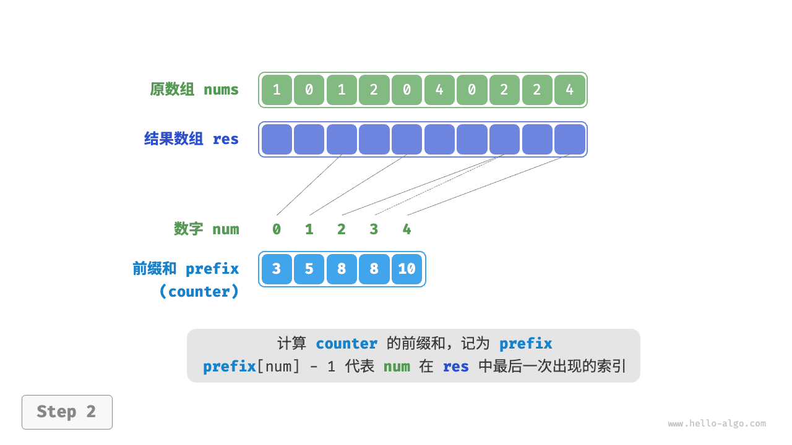

=== "<3>"
    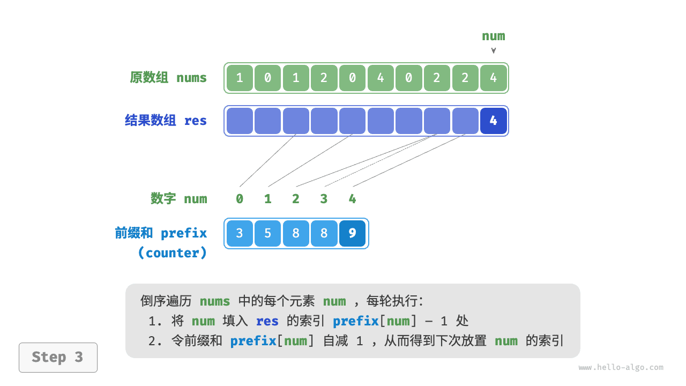

=== "<4>"
    

=== "<5>"
    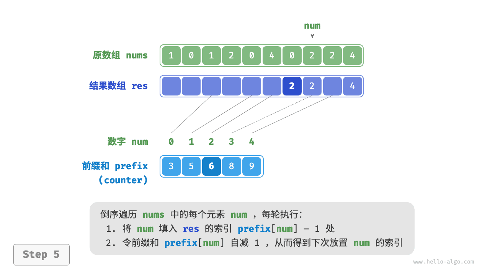

=== "<6>"
    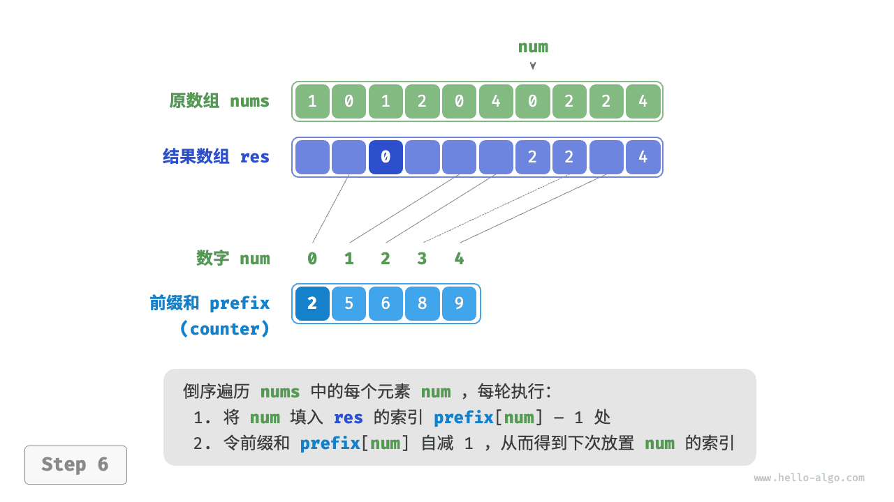

=== "<7>"
    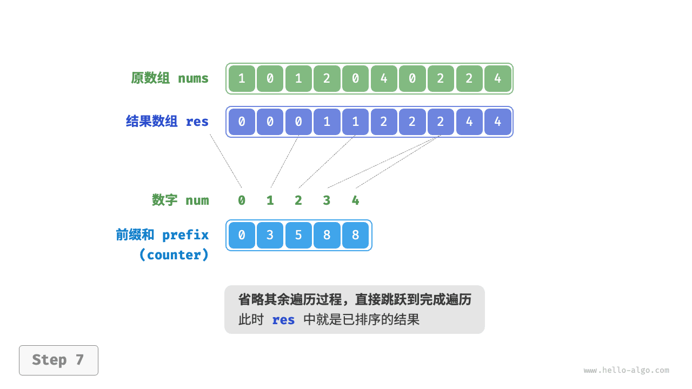

=== "<8>"
    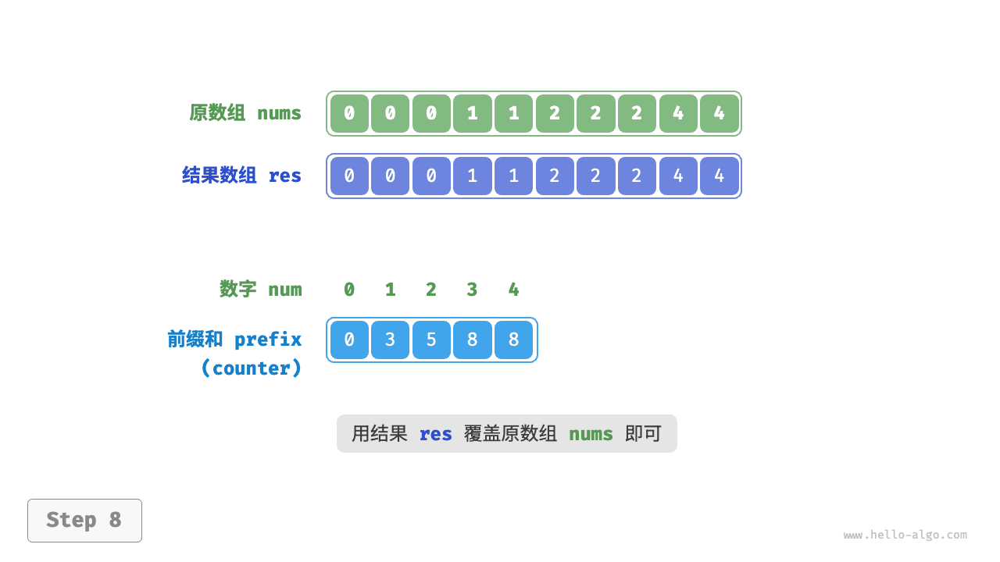

计数排序的实现代码如下所示：

```python
def counting_sort(nums: list[int]):
    """计数排序"""
    # 完整实现，可排序对象，并且是稳定排序
    # 1. 统计数组最大元素 m
    m = max(nums)
    # 2. 统计各数字的出现次数
    # counter[num] 代表 num 的出现次数
    counter = [0] * (m + 1)
    for num in nums:
        counter[num] += 1
    # 3. 求 counter 的前缀和，将“出现次数”转换为“尾索引”
    # 即 counter[num]-1 是 num 在 res 中最后一次出现的索引
    for i in range(m):
        counter[i + 1] += counter[i]
    # 4. 倒序遍历 nums ，将各元素填入结果数组 res
    # 初始化数组 res 用于记录结果
    n = len(nums)
    res = [0] * n
    for i in range(n - 1, -1, -1):
        num = nums[i]
        res[counter[num] - 1] = num  # 将 num 放置到对应索引处
        counter[num] -= 1  # 令前缀和自减 1 ，得到下次放置 num 的索引
    # 使用结果数组 res 覆盖原数组 nums
    for i in range(n):
        nums[i] = res[i]
```

!!! example [pythontutor "可视化运行"](https://pythontutor.com/iframe-embed.html#code=def%20counting_sort%28nums%3A%20list%5Bint%5D%29%3A%0A%20%20%20%20%22%22%22%E8%AE%A1%E6%95%B0%E6%8E%92%E5%BA%8F%22%22%22%0A%20%20%20%20%23%20%E5%AE%8C%E6%95%B4%E5%AE%9E%E7%8E%B0%EF%BC%8C%E5%8F%AF%E6%8E%92%E5%BA%8F%E5%AF%B9%E8%B1%A1%EF%BC%8C%E5%B9%B6%E4%B8%94%E6%98%AF%E7%A8%B3%E5%AE%9A%E6%8E%92%E5%BA%8F%0A%20%20%20%20%23%201.%20%E7%BB%9F%E8%AE%A1%E6%95%B0%E7%BB%84%E6%9C%80%E5%A4%A7%E5%85%83%E7%B4%A0%20m%0A%20%20%20%20m%20%3D%20max%28nums%29%0A%20%20%20%20%23%202.%20%E7%BB%9F%E8%AE%A1%E5%90%84%E6%95%B0%E5%AD%97%E7%9A%84%E5%87%BA%E7%8E%B0%E6%AC%A1%E6%95%B0%0A%20%20%20%20%23%20counter%5Bnum%5D%20%E4%BB%A3%E8%A1%A8%20num%20%E7%9A%84%E5%87%BA%E7%8E%B0%E6%AC%A1%E6%95%B0%0A%20%20%20%20counter%20%3D%20%5B0%5D%20*%20%28m%20%2B%201%29%0A%20%20%20%20for%20num%20in%20nums%3A%0A%20%20%20%20%20%20%20%20counter%5Bnum%5D%20%2B%3D%201%0A%20%20%20%20%23%203.%20%E6%B1%82%20counter%20%E7%9A%84%E5%89%8D%E7%BC%80%E5%92%8C%EF%BC%8C%E5%B0%86%E2%80%9C%E5%87%BA%E7%8E%B0%E6%AC%A1%E6%95%B0%E2%80%9D%E8%BD%AC%E6%8D%A2%E4%B8%BA%E2%80%9C%E5%B0%BE%E7%B4%A2%E5%BC%95%E2%80%9D%0A%20%20%20%20%23%20%E5%8D%B3%20counter%5Bnum%5D-1%20%E6%98%AF%20num%20%E5%9C%A8%20res%20%E4%B8%AD%E6%9C%80%E5%90%8E%E4%B8%80%E6%AC%A1%E5%87%BA%E7%8E%B0%E7%9A%84%E7%B4%A2%E5%BC%95%0A%20%20%20%20for%20i%20in%20range%28m%29%3A%0A%20%20%20%20%20%20%20%20counter%5Bi%20%2B%201%5D%20%2B%3D%20counter%5Bi%5D%0A%20%20%20%20%23%204.%20%E5%80%92%E5%BA%8F%E9%81%8D%E5%8E%86%20nums%20%EF%BC%8C%E5%B0%86%E5%90%84%E5%85%83%E7%B4%A0%E5%A1%AB%E5%85%A5%E7%BB%93%E6%9E%9C%E6%95%B0%E7%BB%84%20res%0A%20%20%20%20%23%20%E5%88%9D%E5%A7%8B%E5%8C%96%E6%95%B0%E7%BB%84%20res%20%E7%94%A8%E4%BA%8E%E8%AE%B0%E5%BD%95%E7%BB%93%E6%9E%9C%0A%20%20%20%20n%20%3D%20len%28nums%29%0A%20%20%20%20res%20%3D%20%5B0%5D%20*%20n%0A%20%20%20%20for%20i%20in%20range%28n%20-%201,%20-1,%20-1%29%3A%0A%20%20%20%20%20%20%20%20num%20%3D%20nums%5Bi%5D%0A%20%20%20%20%20%20%20%20res%5Bcounter%5Bnum%5D%20-%201%5D%20%3D%20num%20%20%23%20%E5%B0%86%20num%20%E6%94%BE%E7%BD%AE%E5%88%B0%E5%AF%B9%E5%BA%94%E7%B4%A2%E5%BC%95%E5%A4%84%0A%20%20%20%20%20%20%20%20counter%5Bnum%5D%20-%3D%201%20%20%23%20%E4%BB%A4%E5%89%8D%E7%BC%80%E5%92%8C%E8%87%AA%E5%87%8F%201%20%EF%BC%8C%E5%BE%97%E5%88%B0%E4%B8%8B%E6%AC%A1%E6%94%BE%E7%BD%AE%20num%20%E7%9A%84%E7%B4%A2%E5%BC%95%0A%20%20%20%20%23%20%E4%BD%BF%E7%94%A8%E7%BB%93%E6%9E%9C%E6%95%B0%E7%BB%84%20res%20%E8%A6%86%E7%9B%96%E5%8E%9F%E6%95%B0%E7%BB%84%20nums%0A%20%20%20%20for%20i%20in%20range%28n%29%3A%0A%20%20%20%20%20%20%20%20nums%5Bi%5D%20%3D%20res%5Bi%5D%0A%0A%22%22%22Driver%20Code%22%22%22%0Aif%20__name__%20%3D%3D%20%22__main__%22%3A%0A%20%20%20%20nums%20%3D%20%5B1,%200,%201,%202,%200,%204,%200,%202,%202,%204%5D%0A%20%20%20%20counting_sort%28nums%29%0A%20%20%20%20print%28f%22%E8%AE%A1%E6%95%B0%E6%8E%92%E5%BA%8F%E5%AE%8C%E6%88%90%E5%90%8E%20nums%20%3D%20%7Bnums%7D%22%29&codeDivHeight=800&codeDivWidth=600&cumulative=false&curInstr=4&heapPrimitives=nevernest&origin=opt-frontend.js&py=311&rawInputLstJSON=%5B%5D&textReferences=false)

## 算法特性

- **时间复杂度为 $O(n + m)$、非自适应排序** ：涉及遍历 `nums` 和遍历 `counter` ，都使用线性时间。一般情况下 $n \gg m$ ，时间复杂度趋于 $O(n)$ 。
- **空间复杂度为 $O(n + m)$、非原地排序**：借助了长度分别为 $n$ 和 $m$ 的数组 `res` 和 `counter` 。
- **稳定排序**：由于向 `res` 中填充元素的顺序是“从右向左”的，因此倒序遍历 `nums` 可以避免改变相等元素之间的相对位置，从而实现稳定排序。实际上，正序遍历 `nums` 也可以得到正确的排序结果，但结果是非稳定的。

## 局限性

看到这里，你也许会觉得计数排序非常巧妙，仅通过统计数量就可以实现高效的排序。然而，使用计数排序的前置条件相对较为严格。

**计数排序只适用于非负整数**。若想将其用于其他类型的数据，需要确保这些数据可以转换为非负整数，并且在转换过程中不能改变各个元素之间的相对大小关系。例如，对于包含负数的整数数组，可以先给所有数字加上一个常数，将全部数字转化为正数，排序完成后再转换回去。

**计数排序适用于数据量大但数据范围较小的情况**。比如，在上述示例中 $m$ 不能太大，否则会占用过多空间。而当 $n \ll m$ 时，计数排序使用 $O(m)$ 时间，可能比 $O(n \log n)$ 的排序算法还要慢。

# 基数排序

上一节介绍了计数排序，它适用于数据量 $n$ 较大但数据范围 $m$ 较小的情况。假设我们需要对 $n = 10^6$ 个学号进行排序，而学号是一个 $8$ 位数字，这意味着数据范围 $m = 10^8$ 非常大，使用计数排序需要分配大量内存空间，而基数排序可以避免这种情况。

<u>基数排序（radix sort）</u>的核心思想与计数排序一致，也通过统计个数来实现排序。在此基础上，基数排序利用数字各位之间的递进关系，依次对每一位进行排序，从而得到最终的排序结果。

## 算法流程

以学号数据为例，假设数字的最低位是第 $1$ 位，最高位是第 $8$ 位，基数排序的流程如下图所示。

1. 初始化位数 $k = 1$ 。
2. 对学号的第 $k$ 位执行“计数排序”。完成后，数据会根据第 $k$ 位从小到大排序。
3. 将 $k$ 增加 $1$ ，然后返回步骤 `2.` 继续迭代，直到所有位都排序完成后结束。

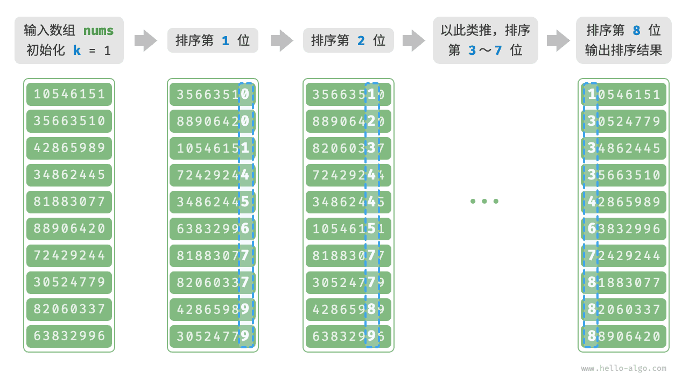

下面剖析代码实现。对于一个 $d$ 进制的数字 $x$ ，要获取其第 $k$ 位 $x_k$ ，可以使用以下计算公式：

$$
x_k = \lfloor\frac{x}{d^{k-1}}\rfloor \bmod d
$$

其中 $\lfloor a \rfloor$ 表示对浮点数 $a$ 向下取整，而 $\bmod \: d$ 表示对 $d$ 取模（取余）。对于学号数据，$d = 10$ 且 $k \in [1, 8]$ 。

此外，我们需要小幅改动计数排序代码，使之可以根据数字的第 $k$ 位进行排序：

```python
def digit(num: int, exp: int) -> int:
    """获取元素 num 的第 k 位，其中 exp = 10^(k-1)"""
    # 传入 exp 而非 k 可以避免在此重复执行昂贵的次方计算
    return (num // exp) % 10

def counting_sort_digit(nums: list[int], exp: int):
    """计数排序（根据 nums 第 k 位排序）"""
    # 十进制的位范围为 0~9 ，因此需要长度为 10 的桶数组
    counter = [0] * 10
    n = len(nums)
    # 统计 0~9 各数字的出现次数
    for i in range(n):
        d = digit(nums[i], exp)  # 获取 nums[i] 第 k 位，记为 d
        counter[d] += 1  # 统计数字 d 的出现次数
    # 求前缀和，将“出现个数”转换为“数组索引”
    for i in range(1, 10):
        counter[i] += counter[i - 1]
    # 倒序遍历，根据桶内统计结果，将各元素填入 res
    res = [0] * n
    for i in range(n - 1, -1, -1):
        d = digit(nums[i], exp)
        j = counter[d] - 1  # 获取 d 在数组中的索引 j
        res[j] = nums[i]  # 将当前元素填入索引 j
        counter[d] -= 1  # 将 d 的数量减 1
    # 使用结果覆盖原数组 nums
    for i in range(n):
        nums[i] = res[i]

def radix_sort(nums: list[int]):
    """基数排序"""
    # 获取数组的最大元素，用于判断最大位数
    m = max(nums)
    # 按照从低位到高位的顺序遍历
    exp = 1
    while exp <= m:
        # 对数组元素的第 k 位执行计数排序
        # k = 1 -> exp = 1
        # k = 2 -> exp = 10
        # 即 exp = 10^(k-1)
        counting_sort_digit(nums, exp)
        exp *= 10
```

!!! example [pythontutor "可视化运行"](https://pythontutor.com/iframe-embed.html#code=def%20digit%28num%3A%20int,%20exp%3A%20int%29%20-%3E%20int%3A%0A%20%20%20%20%22%22%22%E8%8E%B7%E5%8F%96%E5%85%83%E7%B4%A0%20num%20%E7%9A%84%E7%AC%AC%20k%20%E4%BD%8D%EF%BC%8C%E5%85%B6%E4%B8%AD%20exp%20%3D%2010%5E%28k-1%29%22%22%22%0A%20%20%20%20%23%20%E4%BC%A0%E5%85%A5%20exp%20%E8%80%8C%E9%9D%9E%20k%20%E5%8F%AF%E4%BB%A5%E9%81%BF%E5%85%8D%E5%9C%A8%E6%AD%A4%E9%87%8D%E5%A4%8D%E6%89%A7%E8%A1%8C%E6%98%82%E8%B4%B5%E7%9A%84%E6%AC%A1%E6%96%B9%E8%AE%A1%E7%AE%97%0A%20%20%20%20return%20%28num%20//%20exp%29%20%25%2010%0A%0Adef%20counting_sort_digit%28nums%3A%20list%5Bint%5D,%20exp%3A%20int%29%3A%0A%20%20%20%20%22%22%22%E8%AE%A1%E6%95%B0%E6%8E%92%E5%BA%8F%EF%BC%88%E6%A0%B9%E6%8D%AE%20nums%20%E7%AC%AC%20k%20%E4%BD%8D%E6%8E%92%E5%BA%8F%EF%BC%89%22%22%22%0A%20%20%20%20%23%20%E5%8D%81%E8%BF%9B%E5%88%B6%E7%9A%84%E4%BD%8D%E8%8C%83%E5%9B%B4%E4%B8%BA%200~9%20%EF%BC%8C%E5%9B%A0%E6%AD%A4%E9%9C%80%E8%A6%81%E9%95%BF%E5%BA%A6%E4%B8%BA%2010%20%E7%9A%84%E6%A1%B6%E6%95%B0%E7%BB%84%0A%20%20%20%20counter%20%3D%20%5B0%5D%20*%2010%0A%20%20%20%20n%20%3D%20len%28nums%29%0A%20%20%20%20%23%20%E7%BB%9F%E8%AE%A1%200~9%20%E5%90%84%E6%95%B0%E5%AD%97%E7%9A%84%E5%87%BA%E7%8E%B0%E6%AC%A1%E6%95%B0%0A%20%20%20%20for%20i%20in%20range%28n%29%3A%0A%20%20%20%20%20%20%20%20d%20%3D%20digit%28nums%5Bi%5D,%20exp%29%20%20%23%20%E8%8E%B7%E5%8F%96%20nums%5Bi%5D%20%E7%AC%AC%20k%20%E4%BD%8D%EF%BC%8C%E8%AE%B0%E4%B8%BA%20d%0A%20%20%20%20%20%20%20%20counter%5Bd%5D%20%2B%3D%201%20%20%23%20%E7%BB%9F%E8%AE%A1%E6%95%B0%E5%AD%97%20d%20%E7%9A%84%E5%87%BA%E7%8E%B0%E6%AC%A1%E6%95%B0%0A%20%20%20%20%23%20%E6%B1%82%E5%89%8D%E7%BC%80%E5%92%8C%EF%BC%8C%E5%B0%86%E2%80%9C%E5%87%BA%E7%8E%B0%E4%B8%AA%E6%95%B0%E2%80%9D%E8%BD%AC%E6%8D%A2%E4%B8%BA%E2%80%9C%E6%95%B0%E7%BB%84%E7%B4%A2%E5%BC%95%E2%80%9D%0A%20%20%20%20for%20i%20in%20range%281,%2010%29%3A%0A%20%20%20%20%20%20%20%20counter%5Bi%5D%20%2B%3D%20counter%5Bi%20-%201%5D%0A%20%20%20%20%23%20%E5%80%92%E5%BA%8F%E9%81%8D%E5%8E%86%EF%BC%8C%E6%A0%B9%E6%8D%AE%E6%A1%B6%E5%86%85%E7%BB%9F%E8%AE%A1%E7%BB%93%E6%9E%9C%EF%BC%8C%E5%B0%86%E5%90%84%E5%85%83%E7%B4%A0%E5%A1%AB%E5%85%A5%20res%0A%20%20%20%20res%20%3D%20%5B0%5D%20*%20n%0A%20%20%20%20for%20i%20in%20range%28n%20-%201,%20-1,%20-1%29%3A%0A%20%20%20%20%20%20%20%20d%20%3D%20digit%28nums%5Bi%5D,%20exp%29%0A%20%20%20%20%20%20%20%20j%20%3D%20counter%5Bd%5D%20-%201%20%20%23%20%E8%8E%B7%E5%8F%96%20d%20%E5%9C%A8%E6%95%B0%E7%BB%84%E4%B8%AD%E7%9A%84%E7%B4%A2%E5%BC%95%20j%0A%20%20%20%20%20%20%20%20res%5Bj%5D%20%3D%20nums%5Bi%5D%20%20%23%20%E5%B0%86%E5%BD%93%E5%89%8D%E5%85%83%E7%B4%A0%E5%A1%AB%E5%85%A5%E7%B4%A2%E5%BC%95%20j%0A%20%20%20%20%20%20%20%20counter%5Bd%5D%20-%3D%201%20%20%23%20%E5%B0%86%20d%20%E7%9A%84%E6%95%B0%E9%87%8F%E5%87%8F%201%0A%20%20%20%20%23%20%E4%BD%BF%E7%94%A8%E7%BB%93%E6%9E%9C%E8%A6%86%E7%9B%96%E5%8E%9F%E6%95%B0%E7%BB%84%20nums%0A%20%20%20%20for%20i%20in%20range%28n%29%3A%0A%20%20%20%20%20%20%20%20nums%5Bi%5D%20%3D%20res%5Bi%5D%0A%0Adef%20radix_sort%28nums%3A%20list%5Bint%5D%29%3A%0A%20%20%20%20%22%22%22%E5%9F%BA%E6%95%B0%E6%8E%92%E5%BA%8F%22%22%22%0A%20%20%20%20%23%20%E8%8E%B7%E5%8F%96%E6%95%B0%E7%BB%84%E7%9A%84%E6%9C%80%E5%A4%A7%E5%85%83%E7%B4%A0%EF%BC%8C%E7%94%A8%E4%BA%8E%E5%88%A4%E6%96%AD%E6%9C%80%E5%A4%A7%E4%BD%8D%E6%95%B0%0A%20%20%20%20m%20%3D%20max%28nums%29%0A%20%20%20%20%23%20%E6%8C%89%E7%85%A7%E4%BB%8E%E4%BD%8E%E4%BD%8D%E5%88%B0%E9%AB%98%E4%BD%8D%E7%9A%84%E9%A1%BA%E5%BA%8F%E9%81%8D%E5%8E%86%0A%20%20%20%20exp%20%3D%201%0A%20%20%20%20while%20exp%20%3C%3D%20m%3A%0A%20%20%20%20%20%20%20%20%23%20%E5%AF%B9%E6%95%B0%E7%BB%84%E5%85%83%E7%B4%A0%E7%9A%84%E7%AC%AC%20k%20%E4%BD%8D%E6%89%A7%E8%A1%8C%E8%AE%A1%E6%95%B0%E6%8E%92%E5%BA%8F%0A%20%20%20%20%20%20%20%20%23%20k%20%3D%201%20-%3E%20exp%20%3D%201%0A%20%20%20%20%20%20%20%20%23%20k%20%3D%202%20-%3E%20exp%20%3D%2010%0A%20%20%20%20%20%20%20%20%23%20%E5%8D%B3%20exp%20%3D%2010%5E%28k-1%29%0A%20%20%20%20%20%20%20%20counting_sort_digit%28nums,%20exp%29%0A%20%20%20%20%20%20%20%20exp%20*%3D%2010%0A%0A%22%22%22Driver%20Code%22%22%22%0Aif%20__name__%20%3D%3D%20%22__main__%22%3A%0A%20%20%20%20%23%20%E5%9F%BA%E6%95%B0%E6%8E%92%E5%BA%8F%0A%20%20%20%20nums%20%3D%20%5B%0A%20%20%20%20%20%20%20%20105,%0A%20%20%20%20%20%20%20%20356,%0A%20%20%20%20%20%20%20%20428,%0A%20%20%20%20%20%20%20%20348,%0A%20%20%20%20%20%20%20%20818,%0A%20%20%20%20%5D%0A%20%20%20%20radix_sort%28nums%29%0A%20%20%20%20print%28%22%E5%9F%BA%E6%95%B0%E6%8E%92%E5%BA%8F%E5%AE%8C%E6%88%90%E5%90%8E%20nums%20%3D%22,%20nums%29&codeDivHeight=800&codeDivWidth=600&cumulative=false&curInstr=6&heapPrimitives=nevernest&origin=opt-frontend.js&py=311&rawInputLstJSON=%5B%5D&textReferences=false)

!!! question "为什么从最低位开始排序？"

    在连续的排序轮次中，后一轮排序会覆盖前一轮排序的结果。举例来说，如果第一轮排序结果 $a < b$ ，而第二轮排序结果 $a > b$ ，那么第二轮的结果将取代第一轮的结果。由于数字的高位优先级高于低位，因此应该先排序低位再排序高位。

## 算法特性

相较于计数排序，基数排序适用于数值范围较大的情况，**但前提是数据必须可以表示为固定位数的格式，且位数不能过大**。例如，浮点数不适合使用基数排序，因为其位数 $k$ 过大，可能导致时间复杂度 $O(nk) \gg O(n^2)$ 。

- **时间复杂度为 $O(nk)$、非自适应排序**：设数据量为 $n$、数据为 $d$ 进制、最大位数为 $k$ ，则对某一位执行计数排序使用 $O(n + d)$ 时间，排序所有 $k$ 位使用 $O((n + d)k)$ 时间。通常情况下，$d$ 和 $k$ 都相对较小，时间复杂度趋向 $O(n)$ 。
- **空间复杂度为 $O(n + d)$、非原地排序**：与计数排序相同，基数排序需要借助长度为 $n$ 和 $d$ 的数组 `res` 和 `counter` 。
- **稳定排序**：当计数排序稳定时，基数排序也稳定；当计数排序不稳定时，基数排序无法保证得到正确的排序结果。

# 小结

### 重点回顾

- 冒泡排序通过交换相邻元素来实现排序。通过添加一个标志位来实现提前返回，我们可以将冒泡排序的最佳时间复杂度优化到 $O(n)$ 。
- 插入排序每轮将未排序区间内的元素插入到已排序区间的正确位置，从而完成排序。虽然插入排序的时间复杂度为 $O(n^2)$ ，但由于单元操作相对较少，因此在小数据量的排序任务中非常受欢迎。
- 快速排序基于哨兵划分操作实现排序。在哨兵划分中，有可能每次都选取到最差的基准数，导致时间复杂度劣化至 $O(n^2)$ 。引入中位数基准数或随机基准数可以降低这种劣化的概率。通过优先递归较短子区间，可有效减小递归深度，将空间复杂度优化到 $O(\log n)$ 。
- 归并排序包括划分和合并两个阶段，典型地体现了分治策略。在归并排序中，排序数组需要创建辅助数组，空间复杂度为 $O(n)$ ；然而排序链表的空间复杂度可以优化至 $O(1)$ 。
- 桶排序包含三个步骤：数据分桶、桶内排序和合并结果。它同样体现了分治策略，适用于数据体量很大的情况。桶排序的关键在于对数据进行平均分配。
- 计数排序是桶排序的一个特例，它通过统计数据出现的次数来实现排序。计数排序适用于数据量大但数据范围有限的情况，并且要求数据能够转换为正整数。
- 基数排序通过逐位排序来实现数据排序，要求数据能够表示为固定位数的数字。
- 总的来说，我们希望找到一种排序算法，具有高效率、稳定、原地以及自适应性等优点。然而，正如其他数据结构和算法一样，没有一种排序算法能够同时满足所有这些条件。在实际应用中，我们需要根据数据的特性来选择合适的排序算法。
- 下图对比了主流排序算法的效率、稳定性、就地性和自适应性等。

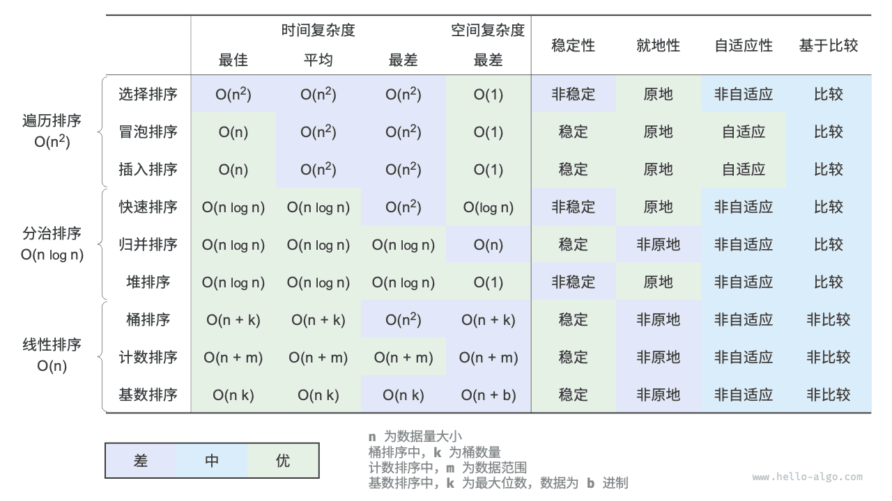

### Q & A

**Q**：排序算法稳定性在什么情况下是必需的？

在现实中，我们有可能基于对象的某个属性进行排序。例如，学生有姓名和身高两个属性，我们希望实现一个多级排序：先按照姓名进行排序，得到 `(A, 180) (B, 185) (C, 170) (D, 170)` ；再对身高进行排序。由于排序算法不稳定，因此可能得到 `(D, 170) (C, 170) (A, 180) (B, 185)` 。

可以发现，学生 D 和 C 的位置发生了交换，姓名的有序性被破坏了，而这是我们不希望看到的。

**Q**：哨兵划分中“从右往左查找”与“从左往右查找”的顺序可以交换吗？

不行，当我们以最左端元素为基准数时，必须先“从右往左查找”再“从左往右查找”。这个结论有些反直觉，我们来剖析一下原因。

哨兵划分 `partition()` 的最后一步是交换 `nums[left]` 和 `nums[i]` 。完成交换后，基准数左边的元素都 `<=` 基准数，**这就要求最后一步交换前 `nums[left] >= nums[i]` 必须成立**。假设我们先“从左往右查找”，那么如果找不到比基准数更大的元素，**则会在 `i == j` 时跳出循环，此时可能 `nums[j] == nums[i] > nums[left]`**。也就是说，此时最后一步交换操作会把一个比基准数更大的元素交换至数组最左端，导致哨兵划分失败。

举个例子，给定数组 `[0, 0, 0, 0, 1]` ，如果先“从左向右查找”，哨兵划分后数组为 `[1, 0, 0, 0, 0]` ，这个结果是不正确的。

再深入思考一下，如果我们选择 `nums[right]` 为基准数，那么正好反过来，必须先“从左往右查找”。

**Q**：关于快速排序的递归深度优化，为什么选短的数组能保证递归深度不超过 $\log n$ ？

递归深度就是当前未返回的递归方法的数量。每轮哨兵划分我们将原数组划分为两个子数组。在递归深度优化后，向下递归的子数组长度最大为原数组长度的一半。假设最差情况，一直为一半长度，那么最终的递归深度就是 $\log n$ 。

回顾原始的快速排序，我们有可能会连续地递归长度较大的数组，最差情况下为 $n$、$n - 1$、$\dots$、$2$、$1$ ，递归深度为 $n$ 。递归深度优化可以避免这种情况出现。

**Q**：当数组中所有元素都相等时，快速排序的时间复杂度是 $O(n^2)$ 吗？该如何处理这种退化情况？

是的。对于这种情况，可以考虑通过哨兵划分将数组划分为三个部分：小于、等于、大于基准数。仅向下递归小于和大于的两部分。在该方法下，输入元素全部相等的数组，仅一轮哨兵划分即可完成排序。

**Q**：桶排序的最差时间复杂度为什么是 $O(n^2)$ ？

最差情况下，所有元素被分至同一个桶中。如果我们采用一个 $O(n^2)$ 算法来排序这些元素，则时间复杂度为 $O(n^2)$ 。
