# 分治

!!! abstract

    难题被逐层拆解，每一次的拆解都使它变得更为简单。
    
    分而治之揭示了一个重要的事实：从简单做起，一切都不再复杂。

# 分治算法

<u>分治（divide and conquer）</u>，全称分而治之，是一种非常重要且常见的算法策略。分治通常基于递归实现，包括“分”和“治”两个步骤。

1. **分（划分阶段）**：递归地将原问题分解为两个或多个子问题，直至到达最小子问题时终止。
2. **治（合并阶段）**：从已知解的最小子问题开始，从底至顶地将子问题的解进行合并，从而构建出原问题的解。

如下图所示，“归并排序”是分治策略的典型应用之一。

1. **分**：递归地将原数组（原问题）划分为两个子数组（子问题），直到子数组只剩一个元素（最小子问题）。
2. **治**：从底至顶地将有序的子数组（子问题的解）进行合并，从而得到有序的原数组（原问题的解）。

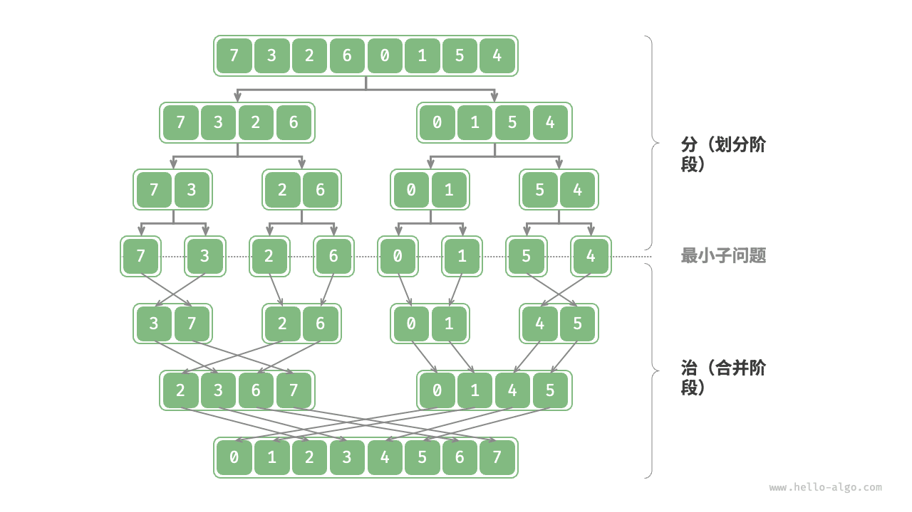

## 如何判断分治问题

一个问题是否适合使用分治解决，通常可以参考以下几个判断依据。

1. **问题可以分解**：原问题可以分解成规模更小、类似的子问题，以及能够以相同方式递归地进行划分。
2. **子问题是独立的**：子问题之间没有重叠，互不依赖，可以独立解决。
3. **子问题的解可以合并**：原问题的解通过合并子问题的解得来。

显然，归并排序满足以上三个判断依据。

1. **问题可以分解**：递归地将数组（原问题）划分为两个子数组（子问题）。
2. **子问题是独立的**：每个子数组都可以独立地进行排序（子问题可以独立进行求解）。
3. **子问题的解可以合并**：两个有序子数组（子问题的解）可以合并为一个有序数组（原问题的解）。

## 通过分治提升效率

**分治不仅可以有效地解决算法问题，往往还可以提升算法效率**。在排序算法中，快速排序、归并排序、堆排序相较于选择、冒泡、插入排序更快，就是因为它们应用了分治策略。

那么，我们不禁发问：**为什么分治可以提升算法效率，其底层逻辑是什么**？换句话说，将大问题分解为多个子问题、解决子问题、将子问题的解合并为原问题的解，这几步的效率为什么比直接解决原问题的效率更高？这个问题可以从操作数量和并行计算两方面来讨论。

### 操作数量优化

以“冒泡排序”为例，其处理一个长度为 $n$ 的数组需要 $O(n^2)$ 时间。假设我们按照下图所示的方式，将数组从中点处分为两个子数组，则划分需要 $O(n)$ 时间，排序每个子数组需要 $O((n / 2)^2)$ 时间，合并两个子数组需要 $O(n)$ 时间，总体时间复杂度为：

$$
O(n + (\frac{n}{2})^2 \times 2 + n) = O(\frac{n^2}{2} + 2n)
$$

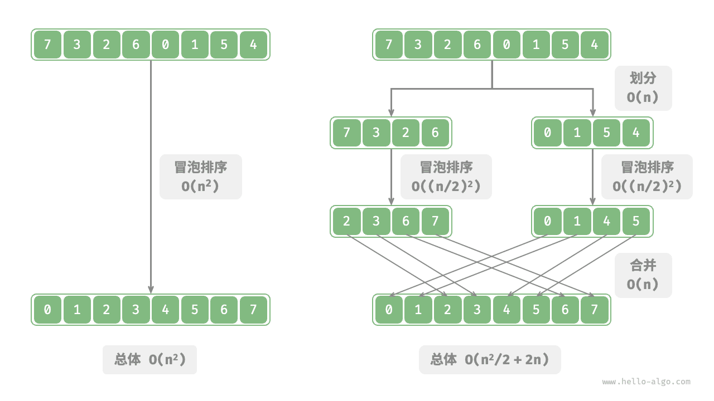

接下来，我们计算以下不等式，其左边和右边分别为划分前和划分后的操作总数：

$$
\begin{aligned}
n^2 & > \frac{n^2}{2} + 2n \newline
n^2 - \frac{n^2}{2} - 2n & > 0 \newline
n(n - 4) & > 0
\end{aligned}
$$

**这意味着当 $n > 4$ 时，划分后的操作数量更少，排序效率应该更高**。请注意，划分后的时间复杂度仍然是平方阶 $O(n^2)$ ，只是复杂度中的常数项变小了。

进一步想，**如果我们把子数组不断地再从中点处划分为两个子数组**，直至子数组只剩一个元素时停止划分呢？这种思路实际上就是“归并排序”，时间复杂度为 $O(n \log n)$ 。

再思考，**如果我们多设置几个划分点**，将原数组平均划分为 $k$ 个子数组呢？这种情况与“桶排序”非常类似，它非常适合排序海量数据，理论上时间复杂度可以达到 $O(n + k)$ 。

### 并行计算优化

我们知道，分治生成的子问题是相互独立的，**因此通常可以并行解决**。也就是说，分治不仅可以降低算法的时间复杂度，**还有利于操作系统的并行优化**。

并行优化在多核或多处理器的环境中尤其有效，因为系统可以同时处理多个子问题，更加充分地利用计算资源，从而显著减少总体的运行时间。

比如在下图所示的“桶排序”中，我们将海量的数据平均分配到各个桶中，则可将所有桶的排序任务分散到各个计算单元，完成后再合并结果。

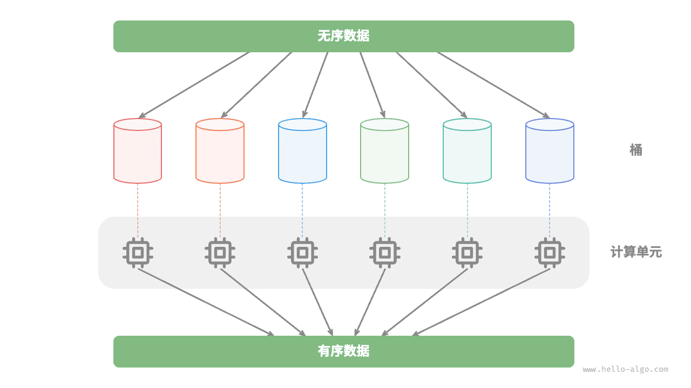

## 分治常见应用

一方面，分治可以用来解决许多经典算法问题。

- **寻找最近点对**：该算法首先将点集分成两部分，然后分别找出两部分中的最近点对，最后找出跨越两部分的最近点对。
- **大整数乘法**：例如 Karatsuba 算法，它将大整数乘法分解为几个较小的整数的乘法和加法。
- **矩阵乘法**：例如 Strassen 算法，它将大矩阵乘法分解为多个小矩阵的乘法和加法。
- **汉诺塔问题**：汉诺塔问题可以通过递归解决，这是典型的分治策略应用。
- **求解逆序对**：在一个序列中，如果前面的数字大于后面的数字，那么这两个数字构成一个逆序对。求解逆序对问题可以利用分治的思想，借助归并排序进行求解。

另一方面，分治在算法和数据结构的设计中应用得非常广泛。

- **二分查找**：二分查找是将有序数组从中点索引处分为两部分，然后根据目标值与中间元素值比较结果，决定排除哪一半区间，并在剩余区间执行相同的二分操作。
- **归并排序**：本节开头已介绍，不再赘述。
- **快速排序**：快速排序是选取一个基准值，然后把数组分为两个子数组，一个子数组的元素比基准值小，另一子数组的元素比基准值大，再对这两部分进行相同的划分操作，直至子数组只剩下一个元素。
- **桶排序**：桶排序的基本思想是将数据分散到多个桶，然后对每个桶内的元素进行排序，最后将各个桶的元素依次取出，从而得到一个有序数组。
- **树**：例如二叉搜索树、AVL 树、红黑树、B 树、B+ 树等，它们的查找、插入和删除等操作都可以视为分治策略的应用。
- **堆**：堆是一种特殊的完全二叉树，其各种操作，如插入、删除和堆化，实际上都隐含了分治的思想。
- **哈希表**：虽然哈希表并不直接应用分治，但某些哈希冲突解决方案间接应用了分治策略，例如，链式地址中的长链表会被转化为红黑树，以提升查询效率。

可以看出，**分治是一种“润物细无声”的算法思想**，隐含在各种算法与数据结构之中。

# 分治搜索策略

我们已经学过，搜索算法分为两大类。

- **暴力搜索**：它通过遍历数据结构实现，时间复杂度为 $O(n)$ 。
- **自适应搜索**：它利用特有的数据组织形式或先验信息，时间复杂度可达到 $O(\log n)$ 甚至 $O(1)$ 。

实际上，**时间复杂度为 $O(\log n)$ 的搜索算法通常是基于分治策略实现的**，例如二分查找和树。

- 二分查找的每一步都将问题（在数组中搜索目标元素）分解为一个小问题（在数组的一半中搜索目标元素），这个过程一直持续到数组为空或找到目标元素为止。
- 树是分治思想的代表，在二叉搜索树、AVL 树、堆等数据结构中，各种操作的时间复杂度皆为 $O(\log n)$ 。

二分查找的分治策略如下所示。

- **问题可以分解**：二分查找递归地将原问题（在数组中进行查找）分解为子问题（在数组的一半中进行查找），这是通过比较中间元素和目标元素来实现的。
- **子问题是独立的**：在二分查找中，每轮只处理一个子问题，它不受其他子问题的影响。
- **子问题的解无须合并**：二分查找旨在查找一个特定元素，因此不需要将子问题的解进行合并。当子问题得到解决时，原问题也会同时得到解决。

分治能够提升搜索效率，本质上是因为暴力搜索每轮只能排除一个选项，**而分治搜索每轮可以排除一半选项**。

### 基于分治实现二分查找

在之前的章节中，二分查找是基于递推（迭代）实现的。现在我们基于分治（递归）来实现它。

!!! question

    给定一个长度为 $n$ 的有序数组 `nums` ，其中所有元素都是唯一的，请查找元素 `target` 。

从分治角度，我们将搜索区间 $[i, j]$ 对应的子问题记为 $f(i, j)$ 。

以原问题 $f(0, n-1)$ 为起始点，通过以下步骤进行二分查找。

1. 计算搜索区间 $[i, j]$ 的中点 $m$ ，根据它排除一半搜索区间。
2. 递归求解规模减小一半的子问题，可能为 $f(i, m-1)$ 或 $f(m+1, j)$ 。
3. 循环第 `1.` 步和第 `2.` 步，直至找到 `target` 或区间为空时返回。

下图展示了在数组中二分查找元素 $6$ 的分治过程。

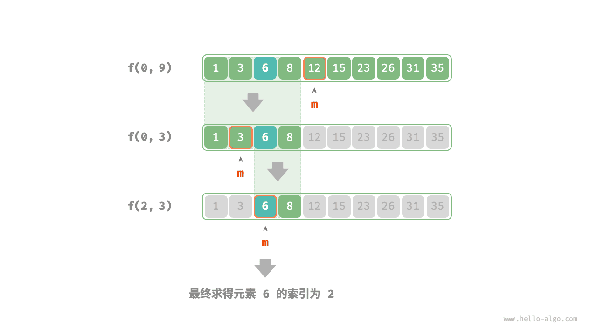

在实现代码中，我们声明一个递归函数 `dfs()` 来求解问题 $f(i, j)$ ：

```python
def dfs(nums: list[int], target: int, i: int, j: int) -> int:
    """二分查找：问题 f(i, j)"""
    # 若区间为空，代表无目标元素，则返回 -1
    if i > j:
        return -1
    # 计算中点索引 m
    m = (i + j) // 2
    if nums[m] < target:
        # 递归子问题 f(m+1, j)
        return dfs(nums, target, m + 1, j)
    elif nums[m] > target:
        # 递归子问题 f(i, m-1)
        return dfs(nums, target, i, m - 1)
    else:
        # 找到目标元素，返回其索引
        return m

def binary_search(nums: list[int], target: int) -> int:
    """二分查找"""
    n = len(nums)
    # 求解问题 f(0, n-1)
    return dfs(nums, target, 0, n - 1)
```

!!! example [pythontutor "可视化运行"](https://pythontutor.com/iframe-embed.html#code=def%20dfs%28nums%3A%20list%5Bint%5D,%20target%3A%20int,%20i%3A%20int,%20j%3A%20int%29%20-%3E%20int%3A%0A%20%20%20%20%22%22%22%E4%BA%8C%E5%88%86%E6%9F%A5%E6%89%BE%EF%BC%9A%E9%97%AE%E9%A2%98%20f%28i,%20j%29%22%22%22%0A%20%20%20%20%23%20%E8%8B%A5%E5%8C%BA%E9%97%B4%E4%B8%BA%E7%A9%BA%EF%BC%8C%E4%BB%A3%E8%A1%A8%E6%97%A0%E7%9B%AE%E6%A0%87%E5%85%83%E7%B4%A0%EF%BC%8C%E5%88%99%E8%BF%94%E5%9B%9E%20-1%0A%20%20%20%20if%20i%20%3E%20j%3A%0A%20%20%20%20%20%20%20%20return%20-1%0A%20%20%20%20%23%20%E8%AE%A1%E7%AE%97%E4%B8%AD%E7%82%B9%E7%B4%A2%E5%BC%95%20m%0A%20%20%20%20m%20%3D%20%28i%20%2B%20j%29%20//%202%0A%20%20%20%20if%20nums%5Bm%5D%20%3C%20target%3A%0A%20%20%20%20%20%20%20%20%23%20%E9%80%92%E5%BD%92%E5%AD%90%E9%97%AE%E9%A2%98%20f%28m%2B1,%20j%29%0A%20%20%20%20%20%20%20%20return%20dfs%28nums,%20target,%20m%20%2B%201,%20j%29%0A%20%20%20%20elif%20nums%5Bm%5D%20%3E%20target%3A%0A%20%20%20%20%20%20%20%20%23%20%E9%80%92%E5%BD%92%E5%AD%90%E9%97%AE%E9%A2%98%20f%28i,%20m-1%29%0A%20%20%20%20%20%20%20%20return%20dfs%28nums,%20target,%20i,%20m%20-%201%29%0A%20%20%20%20else%3A%0A%20%20%20%20%20%20%20%20%23%20%E6%89%BE%E5%88%B0%E7%9B%AE%E6%A0%87%E5%85%83%E7%B4%A0%EF%BC%8C%E8%BF%94%E5%9B%9E%E5%85%B6%E7%B4%A2%E5%BC%95%0A%20%20%20%20%20%20%20%20return%20m%0A%0Adef%20binary_search%28nums%3A%20list%5Bint%5D,%20target%3A%20int%29%20-%3E%20int%3A%0A%20%20%20%20%22%22%22%E4%BA%8C%E5%88%86%E6%9F%A5%E6%89%BE%22%22%22%0A%20%20%20%20n%20%3D%20len%28nums%29%0A%20%20%20%20%23%20%E6%B1%82%E8%A7%A3%E9%97%AE%E9%A2%98%20f%280,%20n-1%29%0A%20%20%20%20return%20dfs%28nums,%20target,%200,%20n%20-%201%29%0A%0A%22%22%22Driver%20Code%22%22%22%0Aif%20__name__%20%3D%3D%20%22__main__%22%3A%0A%20%20%20%20target%20%3D%206%0A%20%20%20%20nums%20%3D%20%5B1,%203,%206,%208,%2012,%2015,%2023,%2026,%2031,%2035%5D%0A%0A%20%20%20%20%23%20%E4%BA%8C%E5%88%86%E6%9F%A5%E6%89%BE%EF%BC%88%E5%8F%8C%E9%97%AD%E5%8C%BA%E9%97%B4%EF%BC%89%0A%20%20%20%20index%20%3D%20binary_search%28nums,%20target%29%0A%20%20%20%20print%28%22%E7%9B%AE%E6%A0%87%E5%85%83%E7%B4%A0%206%20%E7%9A%84%E7%B4%A2%E5%BC%95%20%3D%20%22,%20index%29&codeDivHeight=800&codeDivWidth=600&cumulative=false&curInstr=6&heapPrimitives=nevernest&origin=opt-frontend.js&py=311&rawInputLstJSON=%5B%5D&textReferences=false)

# 构建二叉树问题

!!! question

    给定一棵二叉树的前序遍历 `preorder` 和中序遍历 `inorder` ，请从中构建二叉树，返回二叉树的根节点。假设二叉树中没有值重复的节点（如下图所示）。

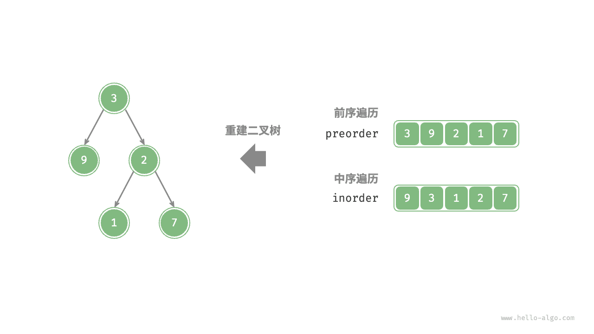

### 判断是否为分治问题

原问题定义为从 `preorder` 和 `inorder` 构建二叉树，是一个典型的分治问题。

- **问题可以分解**：从分治的角度切入，我们可以将原问题划分为两个子问题：构建左子树、构建右子树，加上一步操作：初始化根节点。而对于每棵子树（子问题），我们仍然可以复用以上划分方法，将其划分为更小的子树（子问题），直至达到最小子问题（空子树）时终止。
- **子问题是独立的**：左子树和右子树是相互独立的，它们之间没有交集。在构建左子树时，我们只需关注中序遍历和前序遍历中与左子树对应的部分。右子树同理。
- **子问题的解可以合并**：一旦得到了左子树和右子树（子问题的解），我们就可以将它们链接到根节点上，得到原问题的解。

### 如何划分子树

根据以上分析，这道题可以使用分治来求解，**但如何通过前序遍历 `preorder` 和中序遍历 `inorder` 来划分左子树和右子树呢**？

根据定义，`preorder` 和 `inorder` 都可以划分为三个部分。

- 前序遍历：`[ 根节点 | 左子树 | 右子树 ]` ，例如上图的树对应 `[ 3 | 9 | 2 1 7 ]` 。
- 中序遍历：`[ 左子树 | 根节点 ｜ 右子树 ]` ，例如上图的树对应 `[ 9 | 3 | 1 2 7 ]` 。

以上图数据为例，我们可以通过下图所示的步骤得到划分结果。

1. 前序遍历的首元素 3 是根节点的值。
2. 查找根节点 3 在 `inorder` 中的索引，利用该索引可将 `inorder` 划分为 `[ 9 | 3 ｜ 1 2 7 ]` 。
3. 根据 `inorder` 的划分结果，易得左子树和右子树的节点数量分别为 1 和 3 ，从而可将 `preorder` 划分为 `[ 3 | 9 | 2 1 7 ]` 。

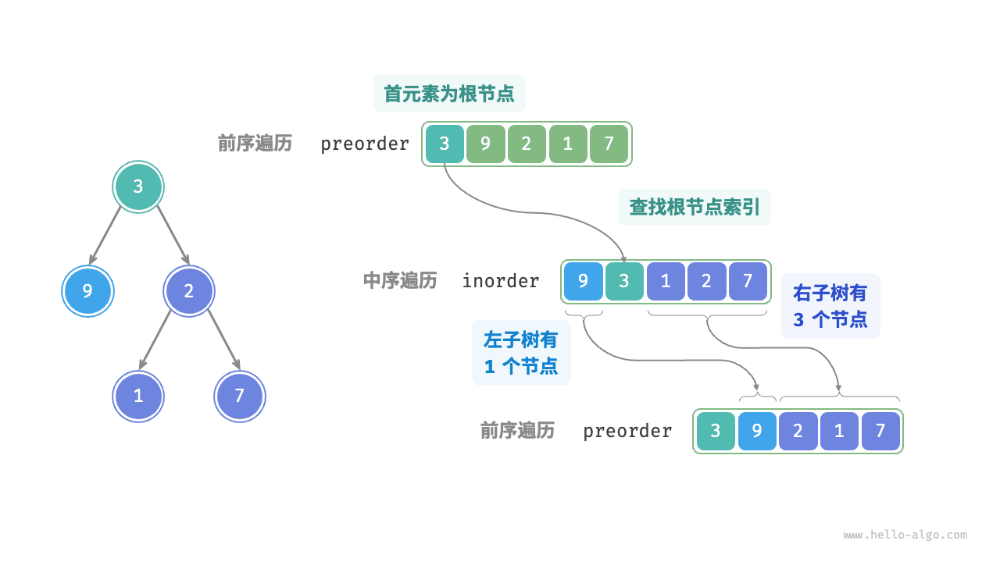

### 基于变量描述子树区间

根据以上划分方法，**我们已经得到根节点、左子树、右子树在 `preorder` 和 `inorder` 中的索引区间**。而为了描述这些索引区间，我们需要借助几个指针变量。

- 将当前树的根节点在 `preorder` 中的索引记为 $i$ 。
- 将当前树的根节点在 `inorder` 中的索引记为 $m$ 。
- 将当前树在 `inorder` 中的索引区间记为 $[l, r]$ 。

如下表所示，通过以上变量即可表示根节点在 `preorder` 中的索引，以及子树在 `inorder` 中的索引区间。

<p align="center"> 表 <id> &nbsp; 根节点和子树在前序遍历和中序遍历中的索引 </p>

|        | 根节点在 `preorder` 中的索引 | 子树在 `inorder` 中的索引区间 |
| ------ | ---------------------------- | ----------------------------- |
| 当前树 | $i$                          | $[l, r]$                      |
| 左子树 | $i + 1$                      | $[l, m-1]$                    |
| 右子树 | $i + 1 + (m - l)$            | $[m+1, r]$                    |

请注意，右子树根节点索引中的 $(m-l)$ 的含义是“左子树的节点数量”，建议结合下图理解。

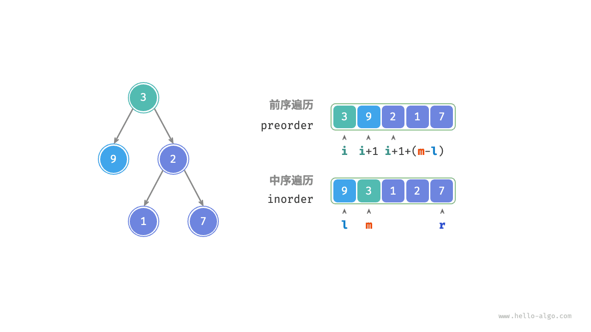

### 代码实现

为了提升查询 $m$ 的效率，我们借助一个哈希表 `hmap` 来存储数组 `inorder` 中元素到索引的映射：

```python
def dfs(
    preorder: list[int],
    inorder_map: dict[int, int],
    i: int,
    l: int,
    r: int,
) -> TreeNode | None:
    """构建二叉树：分治"""
    # 子树区间为空时终止
    if r - l < 0:
        return None
    # 初始化根节点
    root = TreeNode(preorder[i])
    # 查询 m ，从而划分左右子树
    m = inorder_map[preorder[i]]
    # 子问题：构建左子树
    root.left = dfs(preorder, inorder_map, i + 1, l, m - 1)
    # 子问题：构建右子树
    root.right = dfs(preorder, inorder_map, i + 1 + m - l, m + 1, r)
    # 返回根节点
    return root

def build_tree(preorder: list[int], inorder: list[int]) -> TreeNode | None:
    """构建二叉树"""
    # 初始化哈希表，存储 inorder 元素到索引的映射
    inorder_map = {val: i for i, val in enumerate(inorder)}
    root = dfs(preorder, inorder_map, 0, 0, len(inorder) - 1)
    return root
```

!!! example [pythontutor "可视化运行"](https://pythontutor.com/iframe-embed.html#code=class%20TreeNode%3A%0A%20%20%20%20%22%22%22%E4%BA%8C%E5%8F%89%E6%A0%91%E8%8A%82%E7%82%B9%E7%B1%BB%22%22%22%0A%20%20%20%20def%20__init__%28self,%20val%3A%20int%20%3D%200%29%3A%0A%20%20%20%20%20%20%20%20self.val%3A%20int%20%3D%20val%20%20%23%20%E8%8A%82%E7%82%B9%E5%80%BC%0A%20%20%20%20%20%20%20%20self.left%3A%20TreeNode%20%7C%20None%20%3D%20None%20%20%23%20%E5%B7%A6%E5%AD%90%E8%8A%82%E7%82%B9%E5%BC%95%E7%94%A8%0A%20%20%20%20%20%20%20%20self.right%3A%20TreeNode%20%7C%20None%20%3D%20None%20%20%23%20%E5%8F%B3%E5%AD%90%E8%8A%82%E7%82%B9%E5%BC%95%E7%94%A8%0A%0Adef%20dfs%28%0A%20%20%20%20preorder%3A%20list%5Bint%5D,%0A%20%20%20%20inorder_map%3A%20dict%5Bint,%20int%5D,%0A%20%20%20%20i%3A%20int,%0A%20%20%20%20l%3A%20int,%0A%20%20%20%20r%3A%20int,%0A%29%20-%3E%20TreeNode%20%7C%20None%3A%0A%20%20%20%20%22%22%22%E6%9E%84%E5%BB%BA%E4%BA%8C%E5%8F%89%E6%A0%91%EF%BC%9A%E5%88%86%E6%B2%BB%22%22%22%0A%20%20%20%20%23%20%E5%AD%90%E6%A0%91%E5%8C%BA%E9%97%B4%E4%B8%BA%E7%A9%BA%E6%97%B6%E7%BB%88%E6%AD%A2%0A%20%20%20%20if%20r%20-%20l%20%3C%200%3A%0A%20%20%20%20%20%20%20%20return%20None%0A%20%20%20%20%23%20%E5%88%9D%E5%A7%8B%E5%8C%96%E6%A0%B9%E8%8A%82%E7%82%B9%0A%20%20%20%20root%20%3D%20TreeNode%28preorder%5Bi%5D%29%0A%20%20%20%20%23%20%E6%9F%A5%E8%AF%A2%20m%20%EF%BC%8C%E4%BB%8E%E8%80%8C%E5%88%92%E5%88%86%E5%B7%A6%E5%8F%B3%E5%AD%90%E6%A0%91%0A%20%20%20%20m%20%3D%20inorder_map%5Bpreorder%5Bi%5D%5D%0A%20%20%20%20%23%20%E5%AD%90%E9%97%AE%E9%A2%98%EF%BC%9A%E6%9E%84%E5%BB%BA%E5%B7%A6%E5%AD%90%E6%A0%91%0A%20%20%20%20root.left%20%3D%20dfs%28preorder,%20inorder_map,%20i%20%2B%201,%20l,%20m%20-%201%29%0A%20%20%20%20%23%20%E5%AD%90%E9%97%AE%E9%A2%98%EF%BC%9A%E6%9E%84%E5%BB%BA%E5%8F%B3%E5%AD%90%E6%A0%91%0A%20%20%20%20root.right%20%3D%20dfs%28preorder,%20inorder_map,%20i%20%2B%201%20%2B%20m%20-%20l,%20m%20%2B%201,%20r%29%0A%20%20%20%20%23%20%E8%BF%94%E5%9B%9E%E6%A0%B9%E8%8A%82%E7%82%B9%0A%20%20%20%20return%20root%0A%0A%0Adef%20build_tree%28preorder%3A%20list%5Bint%5D,%20inorder%3A%20list%5Bint%5D%29%20-%3E%20TreeNode%20%7C%20None%3A%0A%20%20%20%20%22%22%22%E6%9E%84%E5%BB%BA%E4%BA%8C%E5%8F%89%E6%A0%91%22%22%22%0A%20%20%20%20%23%20%E5%88%9D%E5%A7%8B%E5%8C%96%E5%93%88%E5%B8%8C%E8%A1%A8%EF%BC%8C%E5%AD%98%E5%82%A8%20inorder%20%E5%85%83%E7%B4%A0%E5%88%B0%E7%B4%A2%E5%BC%95%E7%9A%84%E6%98%A0%E5%B0%84%0A%20%20%20%20inorder_map%20%3D%20%7Bval%3A%20i%20for%20i,%20val%20in%20enumerate%28inorder%29%7D%0A%20%20%20%20root%20%3D%20dfs%28preorder,%20inorder_map,%200,%200,%20len%28inorder%29%20-%201%29%0A%20%20%20%20return%20root%0A%0A%0A%22%22%22Driver%20Code%22%22%22%0Aif%20__name__%20%3D%3D%20%22__main__%22%3A%0A%20%20%20%20preorder%20%3D%20%5B3,%209,%202,%201,%207%5D%0A%20%20%20%20inorder%20%3D%20%5B9,%203,%201,%202,%207%5D%0A%20%20%20%20print%28f%22%E5%89%8D%E5%BA%8F%E9%81%8D%E5%8E%86%20%3D%20%7Bpreorder%7D%22%29%0A%20%20%20%20print%28f%22%E4%B8%AD%E5%BA%8F%E9%81%8D%E5%8E%86%20%3D%20%7Binorder%7D%22%29%0A%20%20%20%20root%20%3D%20build_tree%28preorder,%20inorder%29&codeDivHeight=800&codeDivWidth=600&cumulative=false&curInstr=21&heapPrimitives=nevernest&origin=opt-frontend.js&py=311&rawInputLstJSON=%5B%5D&textReferences=false)

下图展示了构建二叉树的递归过程，各个节点是在向下“递”的过程中建立的，而各条边（引用）是在向上“归”的过程中建立的。

=== "<1>"
    

=== "<2>"
    

=== "<3>"
    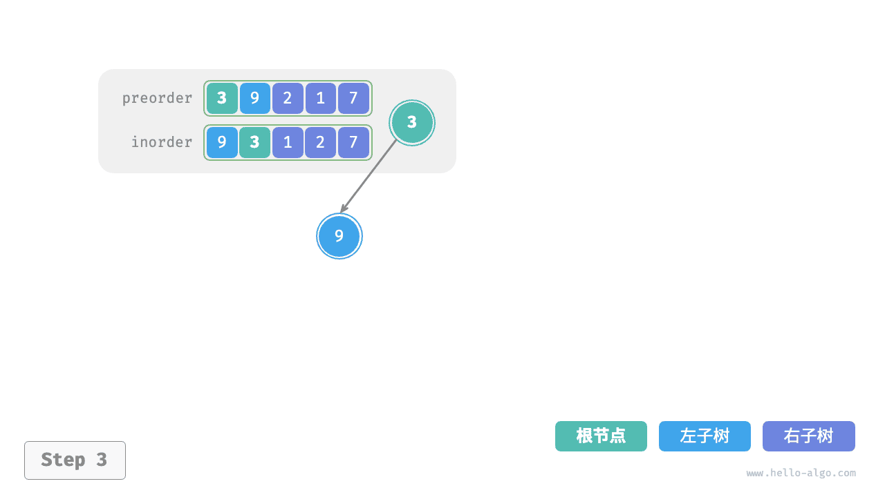

=== "<4>"
    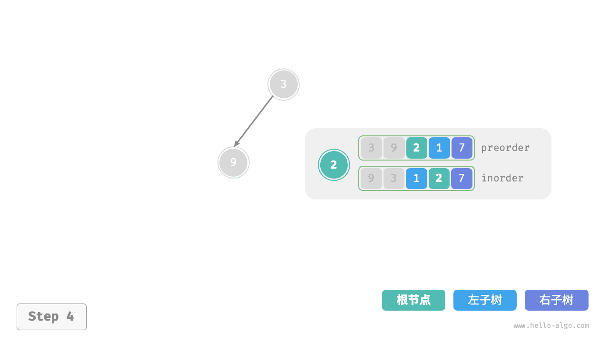

=== "<5>"
    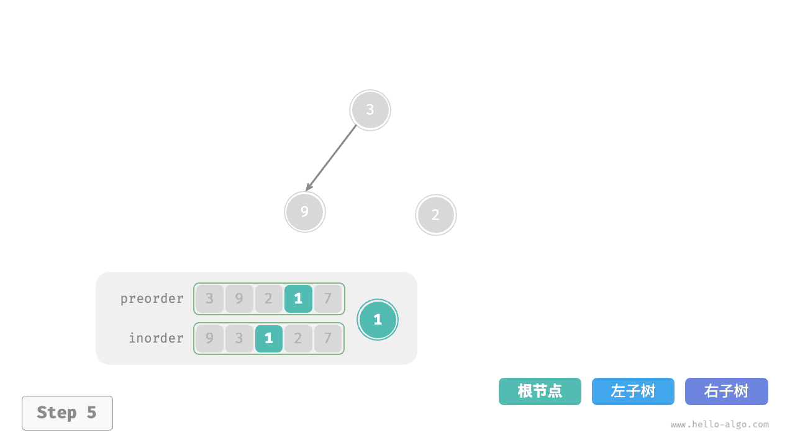

=== "<6>"
    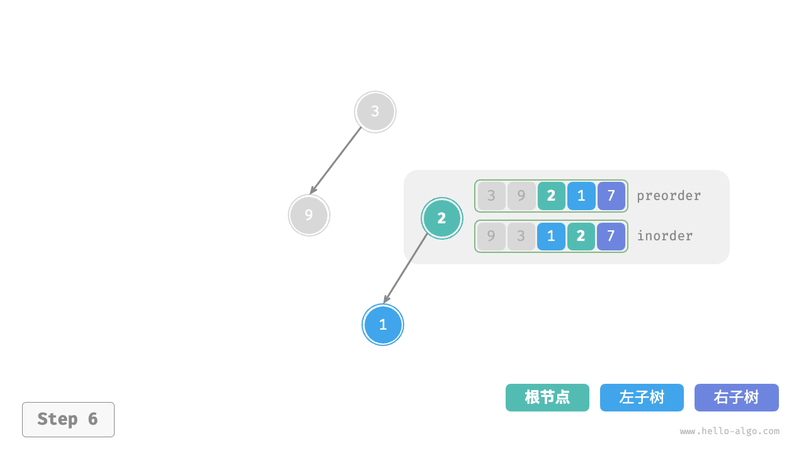

=== "<7>"
    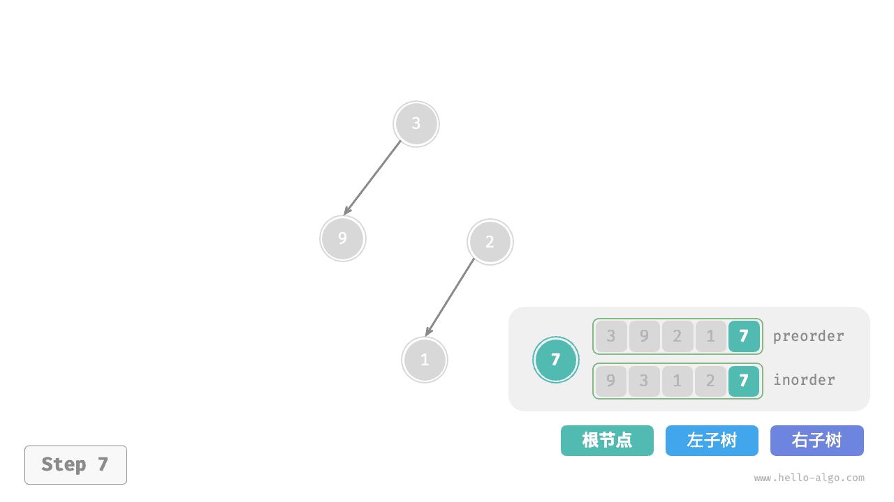

=== "<8>"
    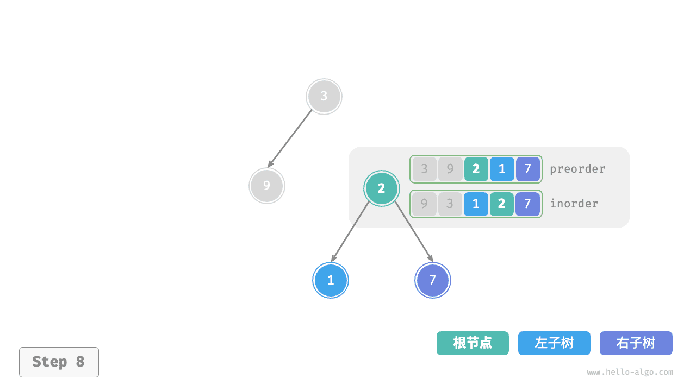

=== "<9>"
    

每个递归函数内的前序遍历 `preorder` 和中序遍历 `inorder` 的划分结果如下图所示。

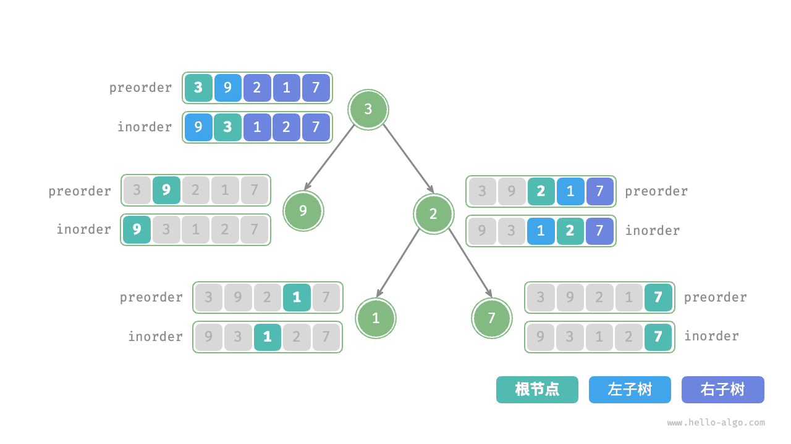

设树的节点数量为 $n$ ，初始化每一个节点（执行一个递归函数 `dfs()` ）使用 $O(1)$ 时间。**因此总体时间复杂度为 $O(n)$** 。

哈希表存储 `inorder` 元素到索引的映射，空间复杂度为 $O(n)$ 。在最差情况下，即二叉树退化为链表时，递归深度达到 $n$ ，使用 $O(n)$ 的栈帧空间。**因此总体空间复杂度为 $O(n)$** 。

# 汉诺塔问题

在归并排序和构建二叉树中，我们都是将原问题分解为两个规模为原问题一半的子问题。然而对于汉诺塔问题，我们采用不同的分解策略。

!!! question

    给定三根柱子，记为 `A`、`B` 和 `C` 。起始状态下，柱子 `A` 上套着 $n$ 个圆盘，它们从上到下按照从小到大的顺序排列。我们的任务是要把这 $n$ 个圆盘移到柱子 `C` 上，并保持它们的原有顺序不变（如下图所示）。在移动圆盘的过程中，需要遵守以下规则。
    
    1. 圆盘只能从一根柱子顶部拿出，从另一根柱子顶部放入。
    2. 每次只能移动一个圆盘。
    3. 小圆盘必须时刻位于大圆盘之上。

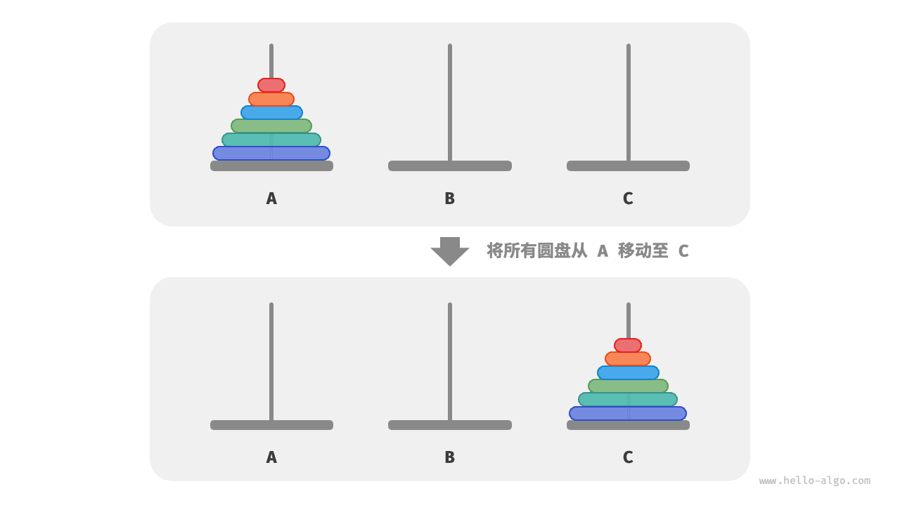

**我们将规模为 $i$ 的汉诺塔问题记作 $f(i)$** 。例如 $f(3)$ 代表将 $3$ 个圆盘从 `A` 移动至 `C` 的汉诺塔问题。

### 考虑基本情况

如下图所示，对于问题 $f(1)$ ，即当只有一个圆盘时，我们将它直接从 `A` 移动至 `C` 即可。

=== "<1>"
    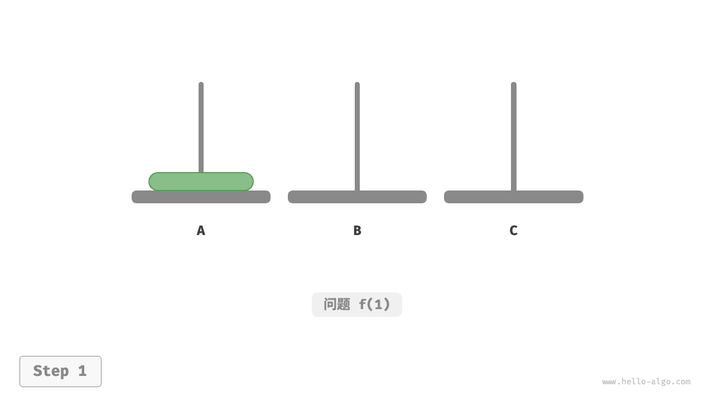

=== "<2>"
    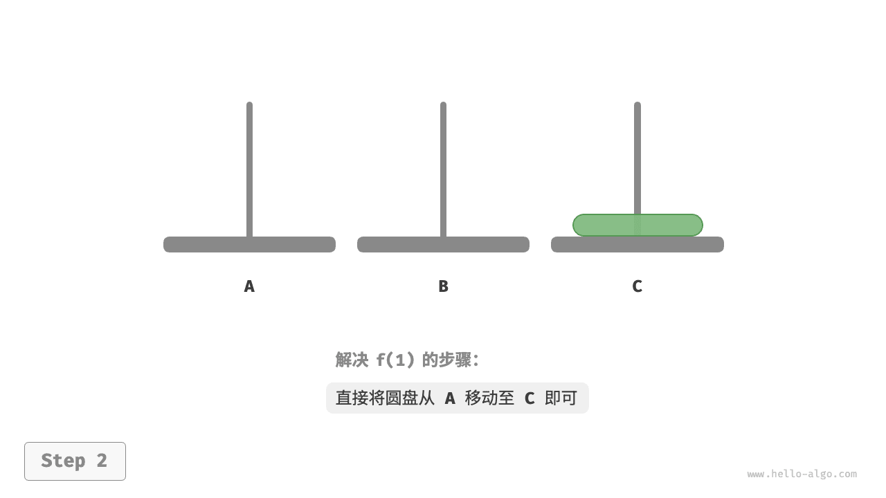

如下图所示，对于问题 $f(2)$ ，即当有两个圆盘时，**由于要时刻满足小圆盘在大圆盘之上，因此需要借助 `B` 来完成移动**。

1. 先将上面的小圆盘从 `A` 移至 `B` 。
2. 再将大圆盘从 `A` 移至 `C` 。
3. 最后将小圆盘从 `B` 移至 `C` 。

=== "<1>"
    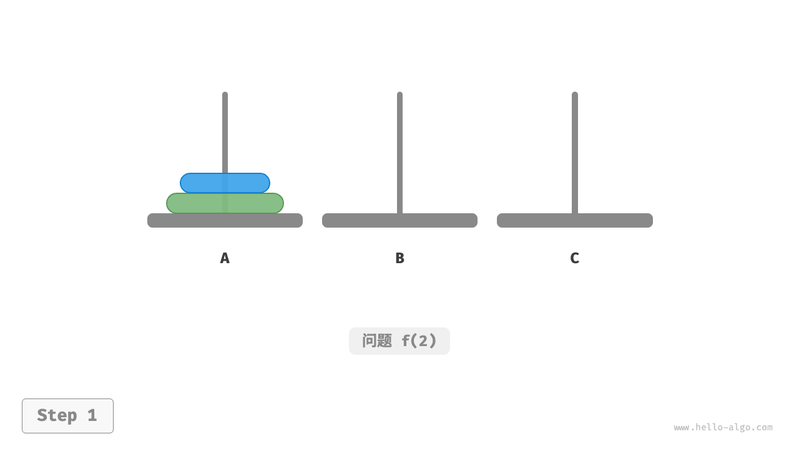

=== "<2>"
    

=== "<3>"
    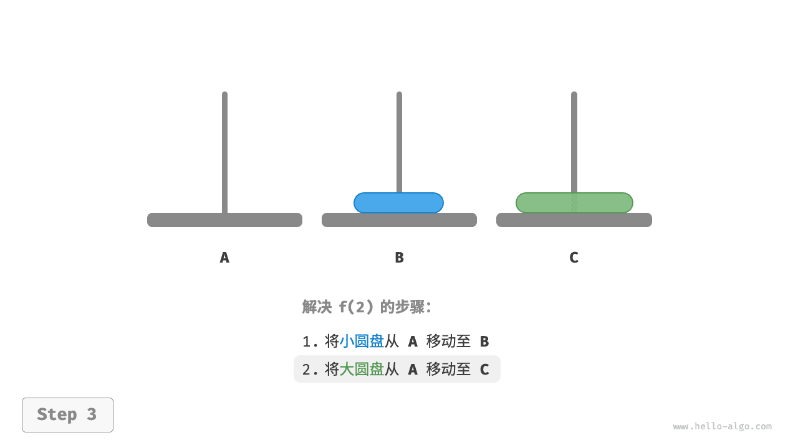

=== "<4>"
    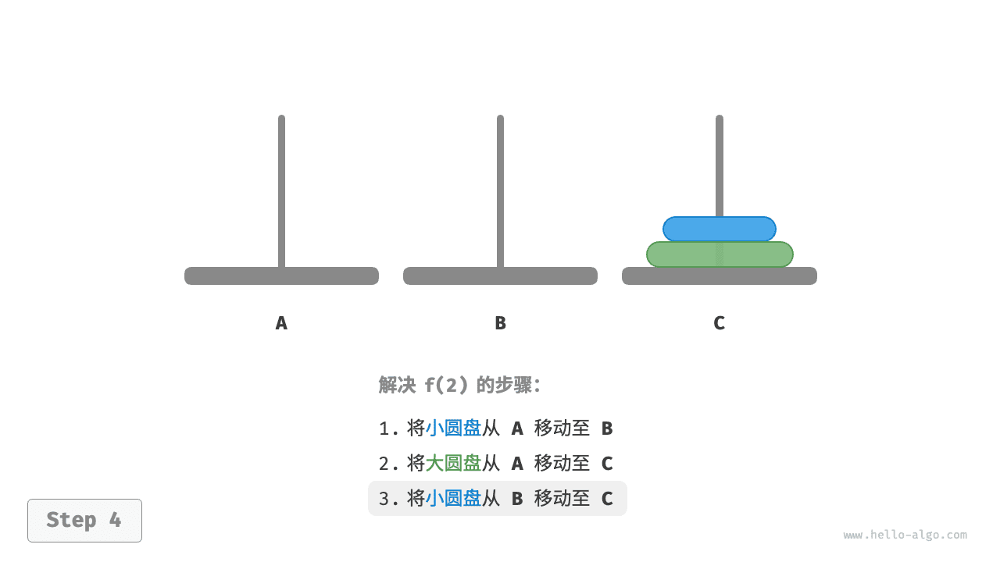

解决问题 $f(2)$ 的过程可总结为：**将两个圆盘借助 `B` 从 `A` 移至 `C`** 。其中，`C` 称为目标柱、`B` 称为缓冲柱。

### 子问题分解

对于问题 $f(3)$ ，即当有三个圆盘时，情况变得稍微复杂了一些。

因为已知 $f(1)$ 和 $f(2)$ 的解，所以我们可从分治角度思考，**将 `A` 顶部的两个圆盘看作一个整体**，执行下图所示的步骤。这样三个圆盘就被顺利地从 `A` 移至 `C` 了。

1. 令 `B` 为目标柱、`C` 为缓冲柱，将两个圆盘从 `A` 移至 `B` 。
2. 将 `A` 中剩余的一个圆盘从 `A` 直接移动至 `C` 。
3. 令 `C` 为目标柱、`A` 为缓冲柱，将两个圆盘从 `B` 移至 `C` 。

=== "<1>"
    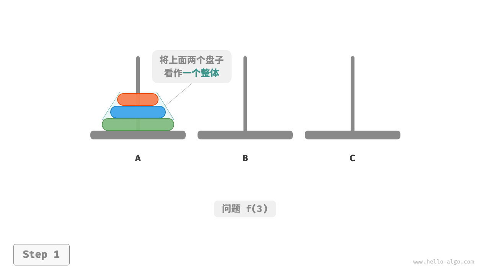

=== "<2>"
    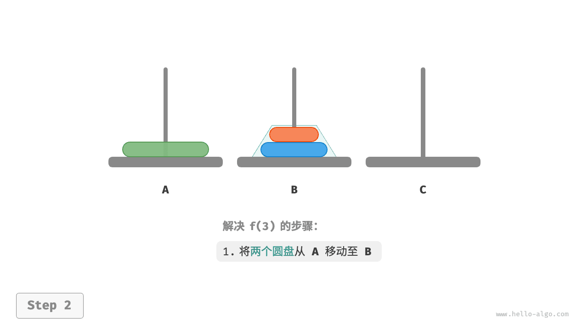

=== "<3>"
    

=== "<4>"
    

从本质上看，**我们将问题 $f(3)$ 划分为两个子问题 $f(2)$ 和一个子问题 $f(1)$** 。按顺序解决这三个子问题之后，原问题随之得到解决。这说明子问题是独立的，而且解可以合并。

至此，我们可总结出下图所示的解决汉诺塔问题的分治策略：将原问题 $f(n)$ 划分为两个子问题 $f(n-1)$ 和一个子问题 $f(1)$ ，并按照以下顺序解决这三个子问题。

1. 将 $n-1$ 个圆盘借助 `C` 从 `A` 移至 `B` 。
2. 将剩余 $1$ 个圆盘从 `A` 直接移至 `C` 。
3. 将 $n-1$ 个圆盘借助 `A` 从 `B` 移至 `C` 。

对于这两个子问题 $f(n-1)$ ，**可以通过相同的方式进行递归划分**，直至达到最小子问题 $f(1)$ 。而 $f(1)$ 的解是已知的，只需一次移动操作即可。

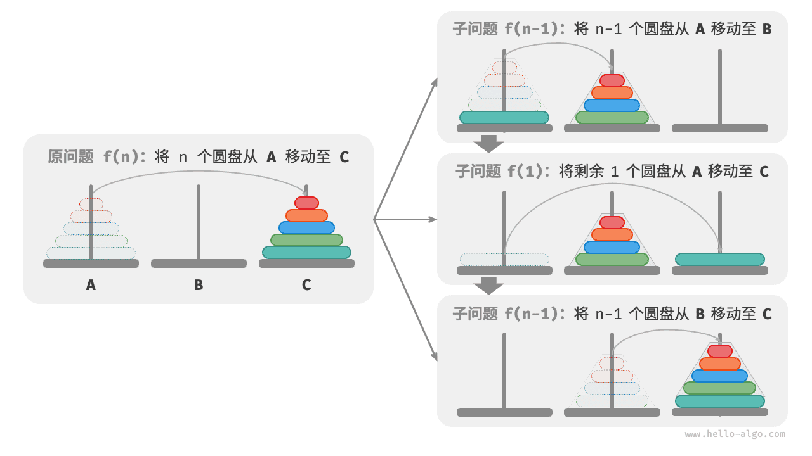

### 代码实现

在代码中，我们声明一个递归函数 `dfs(i, src, buf, tar)` ，它的作用是将柱 `src` 顶部的 $i$ 个圆盘借助缓冲柱 `buf` 移动至目标柱 `tar` ：

```python
def move(src: list[int], tar: list[int]):
    """移动一个圆盘"""
    # 从 src 顶部拿出一个圆盘
    pan = src.pop()
    # 将圆盘放入 tar 顶部
    tar.append(pan)

def dfs(i: int, src: list[int], buf: list[int], tar: list[int]):
    """求解汉诺塔问题 f(i)"""
    # 若 src 只剩下一个圆盘，则直接将其移到 tar
    if i == 1:
        move(src, tar)
        return
    # 子问题 f(i-1) ：将 src 顶部 i-1 个圆盘借助 tar 移到 buf
    dfs(i - 1, src, tar, buf)
    # 子问题 f(1) ：将 src 剩余一个圆盘移到 tar
    move(src, tar)
    # 子问题 f(i-1) ：将 buf 顶部 i-1 个圆盘借助 src 移到 tar
    dfs(i - 1, buf, src, tar)

def solve_hanota(A: list[int], B: list[int], C: list[int]):
    """求解汉诺塔问题"""
    n = len(A)
    # 将 A 顶部 n 个圆盘借助 B 移到 C
    dfs(n, A, B, C)
```

!!! example [pythontutor "可视化运行"](https://pythontutor.com/iframe-embed.html#code=def%20move%28src%3A%20list%5Bint%5D,%20tar%3A%20list%5Bint%5D%29%3A%0A%20%20%20%20%22%22%22%E7%A7%BB%E5%8A%A8%E4%B8%80%E4%B8%AA%E5%9C%86%E7%9B%98%22%22%22%0A%20%20%20%20%23%20%E4%BB%8E%20src%20%E9%A1%B6%E9%83%A8%E6%8B%BF%E5%87%BA%E4%B8%80%E4%B8%AA%E5%9C%86%E7%9B%98%0A%20%20%20%20pan%20%3D%20src.pop%28%29%0A%20%20%20%20%23%20%E5%B0%86%E5%9C%86%E7%9B%98%E6%94%BE%E5%85%A5%20tar%20%E9%A1%B6%E9%83%A8%0A%20%20%20%20tar.append%28pan%29%0A%0A%0Adef%20dfs%28i%3A%20int,%20src%3A%20list%5Bint%5D,%20buf%3A%20list%5Bint%5D,%20tar%3A%20list%5Bint%5D%29%3A%0A%20%20%20%20%22%22%22%E6%B1%82%E8%A7%A3%E6%B1%89%E8%AF%BA%E5%A1%94%E9%97%AE%E9%A2%98%20f%28i%29%22%22%22%0A%20%20%20%20%23%20%E8%8B%A5%20src%20%E5%8F%AA%E5%89%A9%E4%B8%8B%E4%B8%80%E4%B8%AA%E5%9C%86%E7%9B%98%EF%BC%8C%E5%88%99%E7%9B%B4%E6%8E%A5%E5%B0%86%E5%85%B6%E7%A7%BB%E5%88%B0%20tar%0A%20%20%20%20if%20i%20%3D%3D%201%3A%0A%20%20%20%20%20%20%20%20move%28src,%20tar%29%0A%20%20%20%20%20%20%20%20return%0A%20%20%20%20%23%20%E5%AD%90%E9%97%AE%E9%A2%98%20f%28i-1%29%20%EF%BC%9A%E5%B0%86%20src%20%E9%A1%B6%E9%83%A8%20i-1%20%E4%B8%AA%E5%9C%86%E7%9B%98%E5%80%9F%E5%8A%A9%20tar%20%E7%A7%BB%E5%88%B0%20buf%0A%20%20%20%20dfs%28i%20-%201,%20src,%20tar,%20buf%29%0A%20%20%20%20%23%20%E5%AD%90%E9%97%AE%E9%A2%98%20f%281%29%20%EF%BC%9A%E5%B0%86%20src%20%E5%89%A9%E4%BD%99%E4%B8%80%E4%B8%AA%E5%9C%86%E7%9B%98%E7%A7%BB%E5%88%B0%20tar%0A%20%20%20%20move%28src,%20tar%29%0A%20%20%20%20%23%20%E5%AD%90%E9%97%AE%E9%A2%98%20f%28i-1%29%20%EF%BC%9A%E5%B0%86%20buf%20%E9%A1%B6%E9%83%A8%20i-1%20%E4%B8%AA%E5%9C%86%E7%9B%98%E5%80%9F%E5%8A%A9%20src%20%E7%A7%BB%E5%88%B0%20tar%0A%20%20%20%20dfs%28i%20-%201,%20buf,%20src,%20tar%29%0A%0A%0Adef%20solve_hanota%28A%3A%20list%5Bint%5D,%20B%3A%20list%5Bint%5D,%20C%3A%20list%5Bint%5D%29%3A%0A%20%20%20%20%22%22%22%E6%B1%82%E8%A7%A3%E6%B1%89%E8%AF%BA%E5%A1%94%E9%97%AE%E9%A2%98%22%22%22%0A%20%20%20%20n%20%3D%20len%28A%29%0A%20%20%20%20%23%20%E5%B0%86%20A%20%E9%A1%B6%E9%83%A8%20n%20%E4%B8%AA%E5%9C%86%E7%9B%98%E5%80%9F%E5%8A%A9%20B%20%E7%A7%BB%E5%88%B0%20C%0A%20%20%20%20dfs%28n,%20A,%20B,%20C%29%0A%0A%0A%22%22%22Driver%20Code%22%22%22%0Aif%20__name__%20%3D%3D%20%22__main__%22%3A%0A%20%20%20%20%23%20%E5%88%97%E8%A1%A8%E5%B0%BE%E9%83%A8%E6%98%AF%E6%9F%B1%E5%AD%90%E9%A1%B6%E9%83%A8%0A%20%20%20%20A%20%3D%20%5B5,%204,%203,%202,%201%5D%0A%20%20%20%20B%20%3D%20%5B%5D%0A%20%20%20%20C%20%3D%20%5B%5D%0A%20%20%20%20print%28%22%E5%88%9D%E5%A7%8B%E7%8A%B6%E6%80%81%E4%B8%8B%EF%BC%9A%22%29%0A%20%20%20%20print%28f%22A%20%3D%20%7BA%7D%22%29%0A%20%20%20%20print%28f%22B%20%3D%20%7BB%7D%22%29%0A%20%20%20%20print%28f%22C%20%3D%20%7BC%7D%22%29%0A%0A%20%20%20%20solve_hanota%28A,%20B,%20C%29%0A%0A%20%20%20%20print%28%22%E5%9C%86%E7%9B%98%E7%A7%BB%E5%8A%A8%E5%AE%8C%E6%88%90%E5%90%8E%EF%BC%9A%22%29%0A%20%20%20%20print%28f%22A%20%3D%20%7BA%7D%22%29%0A%20%20%20%20print%28f%22B%20%3D%20%7BB%7D%22%29%0A%20%20%20%20print%28f%22C%20%3D%20%7BC%7D%22%29&codeDivHeight=800&codeDivWidth=600&cumulative=false&curInstr=12&heapPrimitives=nevernest&origin=opt-frontend.js&py=311&rawInputLstJSON=%5B%5D&textReferences=false)

如下图所示，汉诺塔问题形成一棵高度为 $n$ 的递归树，每个节点代表一个子问题，对应一个开启的 `dfs()` 函数，**因此时间复杂度为 $O(2^n)$ ，空间复杂度为 $O(n)$** 。

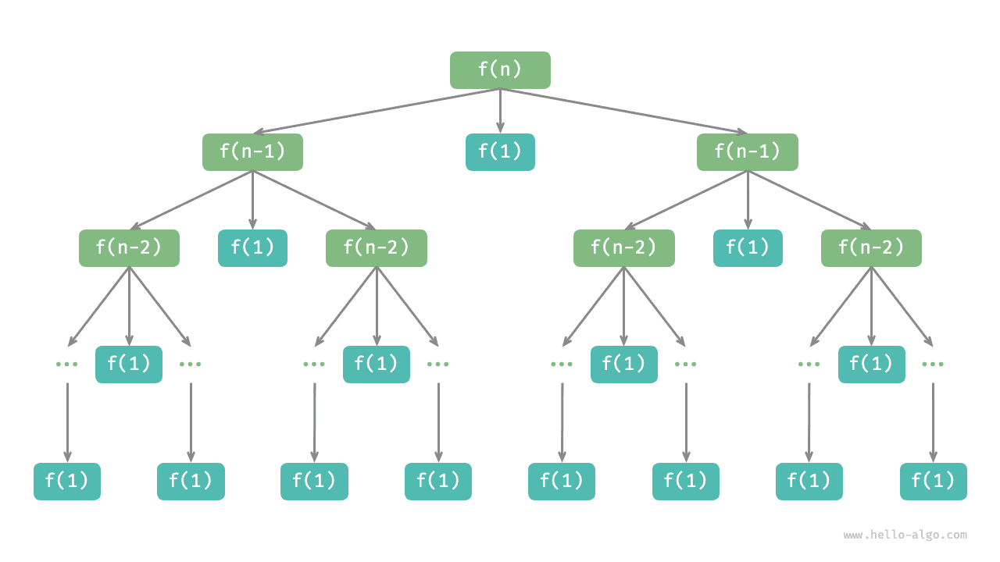

!!! quote

    汉诺塔问题源自一个古老的传说。在古印度的一个寺庙里，僧侣们有三根高大的钻石柱子，以及 $64$ 个大小不一的金圆盘。僧侣们不断地移动圆盘，他们相信在最后一个圆盘被正确放置的那一刻，这个世界就会结束。

    然而，即使僧侣们每秒钟移动一次，总共需要大约 $2^{64} \approx 1.84×10^{19}$ 秒，合约 $5850$ 亿年，远远超过了现在对宇宙年龄的估计。所以，倘若这个传说是真的，我们应该不需要担心世界末日的到来。

# 小结

### 重点回顾

- 分治是一种常见的算法设计策略，包括分（划分）和治（合并）两个阶段，通常基于递归实现。
- 判断是否是分治算法问题的依据包括：问题能否分解、子问题是否独立、子问题能否合并。
- 归并排序是分治策略的典型应用，其递归地将数组划分为等长的两个子数组，直到只剩一个元素时开始逐层合并，从而完成排序。
- 引入分治策略往往可以提升算法效率。一方面，分治策略减少了操作数量；另一方面，分治后有利于系统的并行优化。
- 分治既可以解决许多算法问题，也广泛应用于数据结构与算法设计中，处处可见其身影。
- 相较于暴力搜索，自适应搜索效率更高。时间复杂度为 $O(\log n)$ 的搜索算法通常是基于分治策略实现的。
- 二分查找是分治策略的另一个典型应用，它不包含将子问题的解进行合并的步骤。我们可以通过递归分治实现二分查找。
- 在构建二叉树的问题中，构建树（原问题）可以划分为构建左子树和右子树（子问题），这可以通过划分前序遍历和中序遍历的索引区间来实现。
- 在汉诺塔问题中，一个规模为 $n$ 的问题可以划分为两个规模为 $n-1$ 的子问题和一个规模为 $1$ 的子问题。按顺序解决这三个子问题后，原问题随之得到解决。
