# 动态规划

!!! abstract

    小溪汇入河流，江河汇入大海。
    
    动态规划将小问题的解汇集成大问题的答案，一步步引领我们走向解决问题的彼岸。

# 初探动态规划

<u>动态规划（dynamic programming）</u>是一个重要的算法范式，它将一个问题分解为一系列更小的子问题，并通过存储子问题的解来避免重复计算，从而大幅提升时间效率。

在本节中，我们从一个经典例题入手，先给出它的暴力回溯解法，观察其中包含的重叠子问题，再逐步导出更高效的动态规划解法。

!!! question "爬楼梯"

    给定一个共有 $n$ 阶的楼梯，你每步可以上 $1$ 阶或者 $2$ 阶，请问有多少种方案可以爬到楼顶？

如下图所示，对于一个 $3$ 阶楼梯，共有 $3$ 种方案可以爬到楼顶。

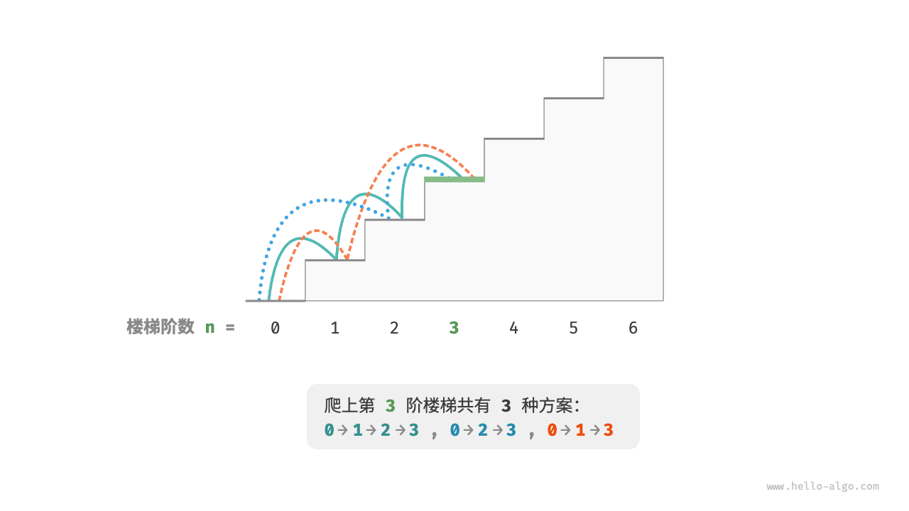

本题的目标是求解方案数量，**我们可以考虑通过回溯来穷举所有可能性**。具体来说，将爬楼梯想象为一个多轮选择的过程：从地面出发，每轮选择上 $1$ 阶或 $2$ 阶，每当到达楼梯顶部时就将方案数量加 $1$ ，当越过楼梯顶部时就将其剪枝。代码如下所示：

```python
def backtrack(choices: list[int], state: int, n: int, res: list[int]) -> int:
    """回溯"""
    # 当爬到第 n 阶时，方案数量加 1
    if state == n:
        res[0] += 1
    # 遍历所有选择
    for choice in choices:
        # 剪枝：不允许越过第 n 阶
        if state + choice > n:
            continue
        # 尝试：做出选择，更新状态
        backtrack(choices, state + choice, n, res)
        # 回退

def climbing_stairs_backtrack(n: int) -> int:
    """爬楼梯：回溯"""
    choices = [1, 2]  # 可选择向上爬 1 阶或 2 阶
    state = 0  # 从第 0 阶开始爬
    res = [0]  # 使用 res[0] 记录方案数量
    backtrack(choices, state, n, res)
    return res[0]
```

!!! example [pythontutor "可视化运行"](https://pythontutor.com/iframe-embed.html#code=def%20backtrack%28choices%3A%20list%5Bint%5D,%20state%3A%20int,%20n%3A%20int,%20res%3A%20list%5Bint%5D%29%20-%3E%20int%3A%0A%20%20%20%20%22%22%22%E5%9B%9E%E6%BA%AF%22%22%22%0A%20%20%20%20%23%20%E5%BD%93%E7%88%AC%E5%88%B0%E7%AC%AC%20n%20%E9%98%B6%E6%97%B6%EF%BC%8C%E6%96%B9%E6%A1%88%E6%95%B0%E9%87%8F%E5%8A%A0%201%0A%20%20%20%20if%20state%20%3D%3D%20n%3A%0A%20%20%20%20%20%20%20%20res%5B0%5D%20%2B%3D%201%0A%20%20%20%20%23%20%E9%81%8D%E5%8E%86%E6%89%80%E6%9C%89%E9%80%89%E6%8B%A9%0A%20%20%20%20for%20choice%20in%20choices%3A%0A%20%20%20%20%20%20%20%20%23%20%E5%89%AA%E6%9E%9D%EF%BC%9A%E4%B8%8D%E5%85%81%E8%AE%B8%E8%B6%8A%E8%BF%87%E7%AC%AC%20n%20%E9%98%B6%0A%20%20%20%20%20%20%20%20if%20state%20%2B%20choice%20%3E%20n%3A%0A%20%20%20%20%20%20%20%20%20%20%20%20continue%0A%20%20%20%20%20%20%20%20%23%20%E5%B0%9D%E8%AF%95%EF%BC%9A%E5%81%9A%E5%87%BA%E9%80%89%E6%8B%A9%EF%BC%8C%E6%9B%B4%E6%96%B0%E7%8A%B6%E6%80%81%0A%20%20%20%20%20%20%20%20backtrack%28choices,%20state%20%2B%20choice,%20n,%20res%29%0A%20%20%20%20%20%20%20%20%23%20%E5%9B%9E%E9%80%80%0A%0A%0Adef%20climbing_stairs_backtrack%28n%3A%20int%29%20-%3E%20int%3A%0A%20%20%20%20%22%22%22%E7%88%AC%E6%A5%BC%E6%A2%AF%EF%BC%9A%E5%9B%9E%E6%BA%AF%22%22%22%0A%20%20%20%20choices%20%3D%20%5B1,%202%5D%20%20%23%20%E5%8F%AF%E9%80%89%E6%8B%A9%E5%90%91%E4%B8%8A%E7%88%AC%201%20%E9%98%B6%E6%88%96%202%20%E9%98%B6%0A%20%20%20%20state%20%3D%200%20%20%23%20%E4%BB%8E%E7%AC%AC%200%20%E9%98%B6%E5%BC%80%E5%A7%8B%E7%88%AC%0A%20%20%20%20res%20%3D%20%5B0%5D%20%20%23%20%E4%BD%BF%E7%94%A8%20res%5B0%5D%20%E8%AE%B0%E5%BD%95%E6%96%B9%E6%A1%88%E6%95%B0%E9%87%8F%0A%20%20%20%20backtrack%28choices,%20state,%20n,%20res%29%0A%20%20%20%20return%20res%5B0%5D%0A%0A%0A%22%22%22Driver%20Code%22%22%22%0Aif%20__name__%20%3D%3D%20%22__main__%22%3A%0A%20%20%20%20n%20%3D%204%0A%0A%20%20%20%20res%20%3D%20climbing_stairs_backtrack%28n%29%0A%20%20%20%20print%28f%22%E7%88%AC%20%7Bn%7D%20%E9%98%B6%E6%A5%BC%E6%A2%AF%E5%85%B1%E6%9C%89%20%7Bres%7D%20%E7%A7%8D%E6%96%B9%E6%A1%88%22%29&codeDivHeight=800&codeDivWidth=600&cumulative=false&curInstr=5&heapPrimitives=nevernest&origin=opt-frontend.js&py=311&rawInputLstJSON=%5B%5D&textReferences=false)

## 方法一：暴力搜索

回溯算法通常并不显式地对问题进行拆解，而是将求解问题看作一系列决策步骤，通过试探和剪枝，搜索所有可能的解。

我们可以尝试从问题分解的角度分析这道题。设爬到第 $i$ 阶共有 $dp[i]$ 种方案，那么 $dp[i]$ 就是原问题，其子问题包括：

$$
dp[i-1], dp[i-2], \dots, dp[2], dp[1]
$$

由于每轮只能上 $1$ 阶或 $2$ 阶，因此当我们站在第 $i$ 阶楼梯上时，上一轮只可能站在第 $i - 1$ 阶或第 $i - 2$ 阶上。换句话说，我们只能从第 $i -1$ 阶或第 $i - 2$ 阶迈向第 $i$ 阶。

由此便可得出一个重要推论：**爬到第 $i - 1$ 阶的方案数加上爬到第 $i - 2$ 阶的方案数就等于爬到第 $i$ 阶的方案数**。公式如下：

$$
dp[i] = dp[i-1] + dp[i-2]
$$

这意味着在爬楼梯问题中，各个子问题之间存在递推关系，**原问题的解可以由子问题的解构建得来**。下图展示了该递推关系。


我们可以根据递推公式得到暴力搜索解法。以 $dp[n]$ 为起始点，**递归地将一个较大问题拆解为两个较小问题的和**，直至到达最小子问题 $dp[1]$ 和 $dp[2]$ 时返回。其中，最小子问题的解是已知的，即 $dp[1] = 1$、$dp[2] = 2$ ，表示爬到第 $1$、$2$ 阶分别有 $1$、$2$ 种方案。

观察以下代码，它和标准回溯代码都属于深度优先搜索，但更加简洁：

```python
def dfs(i: int) -> int:
    """搜索"""
    # 已知 dp[1] 和 dp[2] ，返回之
    if i == 1 or i == 2:
        return i
    # dp[i] = dp[i-1] + dp[i-2]
    count = dfs(i - 1) + dfs(i - 2)
    return count

def climbing_stairs_dfs(n: int) -> int:
    """爬楼梯：搜索"""
    return dfs(n)
```

!!! example [pythontutor "可视化运行"](https://pythontutor.com/iframe-embed.html#code=def%20dfs%28i%3A%20int%29%20-%3E%20int%3A%0A%20%20%20%20%22%22%22%E6%90%9C%E7%B4%A2%22%22%22%0A%20%20%20%20%23%20%E5%B7%B2%E7%9F%A5%20dp%5B1%5D%20%E5%92%8C%20dp%5B2%5D%20%EF%BC%8C%E8%BF%94%E5%9B%9E%E4%B9%8B%0A%20%20%20%20if%20i%20%3D%3D%201%20or%20i%20%3D%3D%202%3A%0A%20%20%20%20%20%20%20%20return%20i%0A%20%20%20%20%23%20dp%5Bi%5D%20%3D%20dp%5Bi-1%5D%20%2B%20dp%5Bi-2%5D%0A%20%20%20%20count%20%3D%20dfs%28i%20-%201%29%20%2B%20dfs%28i%20-%202%29%0A%20%20%20%20return%20count%0A%0A%0Adef%20climbing_stairs_dfs%28n%3A%20int%29%20-%3E%20int%3A%0A%20%20%20%20%22%22%22%E7%88%AC%E6%A5%BC%E6%A2%AF%EF%BC%9A%E6%90%9C%E7%B4%A2%22%22%22%0A%20%20%20%20return%20dfs%28n%29%0A%0A%0A%22%22%22Driver%20Code%22%22%22%0Aif%20__name__%20%3D%3D%20%22__main__%22%3A%0A%20%20%20%20n%20%3D%209%0A%0A%20%20%20%20res%20%3D%20climbing_stairs_dfs%28n%29%0A%20%20%20%20print%28f%22%E7%88%AC%20%7Bn%7D%20%E9%98%B6%E6%A5%BC%E6%A2%AF%E5%85%B1%E6%9C%89%20%7Bres%7D%20%E7%A7%8D%E6%96%B9%E6%A1%88%22%29&codeDivHeight=800&codeDivWidth=600&cumulative=false&curInstr=5&heapPrimitives=nevernest&origin=opt-frontend.js&py=311&rawInputLstJSON=%5B%5D&textReferences=false)

下图展示了暴力搜索形成的递归树。对于问题 $dp[n]$ ，其递归树的深度为 $n$ ，时间复杂度为 $O(2^n)$ 。指数阶属于爆炸式增长，如果我们输入一个比较大的 $n$ ，则会陷入漫长的等待之中。

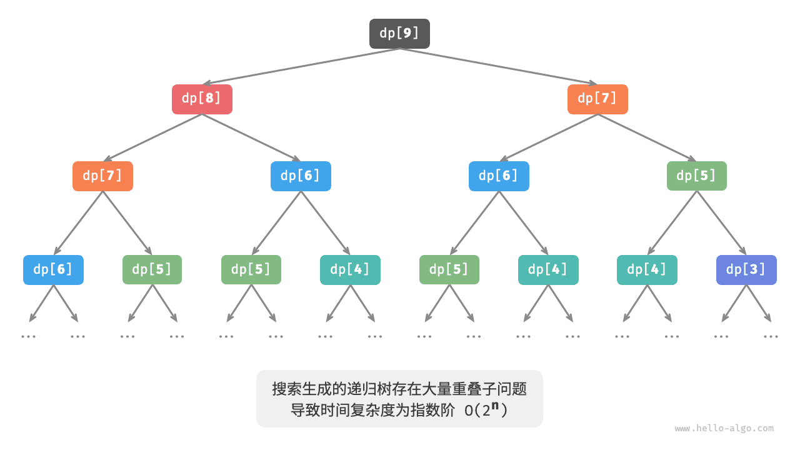

观察上图，**指数阶的时间复杂度是“重叠子问题”导致的**。例如 $dp[9]$ 被分解为 $dp[8]$ 和 $dp[7]$ ，$dp[8]$ 被分解为 $dp[7]$ 和 $dp[6]$ ，两者都包含子问题 $dp[7]$ 。

以此类推，子问题中包含更小的重叠子问题，子子孙孙无穷尽也。绝大部分计算资源都浪费在这些重叠的子问题上。

## 方法二：记忆化搜索

为了提升算法效率，**我们希望所有的重叠子问题都只被计算一次**。为此，我们声明一个数组 `mem` 来记录每个子问题的解，并在搜索过程中将重叠子问题剪枝。

1. 当首次计算 $dp[i]$ 时，我们将其记录至 `mem[i]` ，以便之后使用。
2. 当再次需要计算 $dp[i]$ 时，我们便可直接从 `mem[i]` 中获取结果，从而避免重复计算该子问题。

代码如下所示：

```python
def dfs(i: int, mem: list[int]) -> int:
    """记忆化搜索"""
    # 已知 dp[1] 和 dp[2] ，返回之
    if i == 1 or i == 2:
        return i
    # 若存在记录 dp[i] ，则直接返回之
    if mem[i] != -1:
        return mem[i]
    # dp[i] = dp[i-1] + dp[i-2]
    count = dfs(i - 1, mem) + dfs(i - 2, mem)
    # 记录 dp[i]
    mem[i] = count
    return count

def climbing_stairs_dfs_mem(n: int) -> int:
    """爬楼梯：记忆化搜索"""
    # mem[i] 记录爬到第 i 阶的方案总数，-1 代表无记录
    mem = [-1] * (n + 1)
    return dfs(n, mem)
```

!!! example [pythontutor "可视化运行"](https://pythontutor.com/iframe-embed.html#code=def%20dfs%28i%3A%20int,%20mem%3A%20list%5Bint%5D%29%20-%3E%20int%3A%0A%20%20%20%20%22%22%22%E8%AE%B0%E5%BF%86%E5%8C%96%E6%90%9C%E7%B4%A2%22%22%22%0A%20%20%20%20%23%20%E5%B7%B2%E7%9F%A5%20dp%5B1%5D%20%E5%92%8C%20dp%5B2%5D%20%EF%BC%8C%E8%BF%94%E5%9B%9E%E4%B9%8B%0A%20%20%20%20if%20i%20%3D%3D%201%20or%20i%20%3D%3D%202%3A%0A%20%20%20%20%20%20%20%20return%20i%0A%20%20%20%20%23%20%E8%8B%A5%E5%AD%98%E5%9C%A8%E8%AE%B0%E5%BD%95%20dp%5Bi%5D%20%EF%BC%8C%E5%88%99%E7%9B%B4%E6%8E%A5%E8%BF%94%E5%9B%9E%E4%B9%8B%0A%20%20%20%20if%20mem%5Bi%5D%20!%3D%20-1%3A%0A%20%20%20%20%20%20%20%20return%20mem%5Bi%5D%0A%20%20%20%20%23%20dp%5Bi%5D%20%3D%20dp%5Bi-1%5D%20%2B%20dp%5Bi-2%5D%0A%20%20%20%20count%20%3D%20dfs%28i%20-%201,%20mem%29%20%2B%20dfs%28i%20-%202,%20mem%29%0A%20%20%20%20%23%20%E8%AE%B0%E5%BD%95%20dp%5Bi%5D%0A%20%20%20%20mem%5Bi%5D%20%3D%20count%0A%20%20%20%20return%20count%0A%0A%0Adef%20climbing_stairs_dfs_mem%28n%3A%20int%29%20-%3E%20int%3A%0A%20%20%20%20%22%22%22%E7%88%AC%E6%A5%BC%E6%A2%AF%EF%BC%9A%E8%AE%B0%E5%BF%86%E5%8C%96%E6%90%9C%E7%B4%A2%22%22%22%0A%20%20%20%20%23%20mem%5Bi%5D%20%E8%AE%B0%E5%BD%95%E7%88%AC%E5%88%B0%E7%AC%AC%20i%20%E9%98%B6%E7%9A%84%E6%96%B9%E6%A1%88%E6%80%BB%E6%95%B0%EF%BC%8C-1%20%E4%BB%A3%E8%A1%A8%E6%97%A0%E8%AE%B0%E5%BD%95%0A%20%20%20%20mem%20%3D%20%5B-1%5D%20*%20%28n%20%2B%201%29%0A%20%20%20%20return%20dfs%28n,%20mem%29%0A%0A%0A%22%22%22Driver%20Code%22%22%22%0Aif%20__name__%20%3D%3D%20%22__main__%22%3A%0A%20%20%20%20n%20%3D%209%0A%0A%20%20%20%20res%20%3D%20climbing_stairs_dfs_mem%28n%29%0A%20%20%20%20print%28f%22%E7%88%AC%20%7Bn%7D%20%E9%98%B6%E6%A5%BC%E6%A2%AF%E5%85%B1%E6%9C%89%20%7Bres%7D%20%E7%A7%8D%E6%96%B9%E6%A1%88%22%29&codeDivHeight=800&codeDivWidth=600&cumulative=false&curInstr=5&heapPrimitives=nevernest&origin=opt-frontend.js&py=311&rawInputLstJSON=%5B%5D&textReferences=false)

观察下图，**经过记忆化处理后，所有重叠子问题都只需计算一次，时间复杂度优化至 $O(n)$** ，这是一个巨大的飞跃。

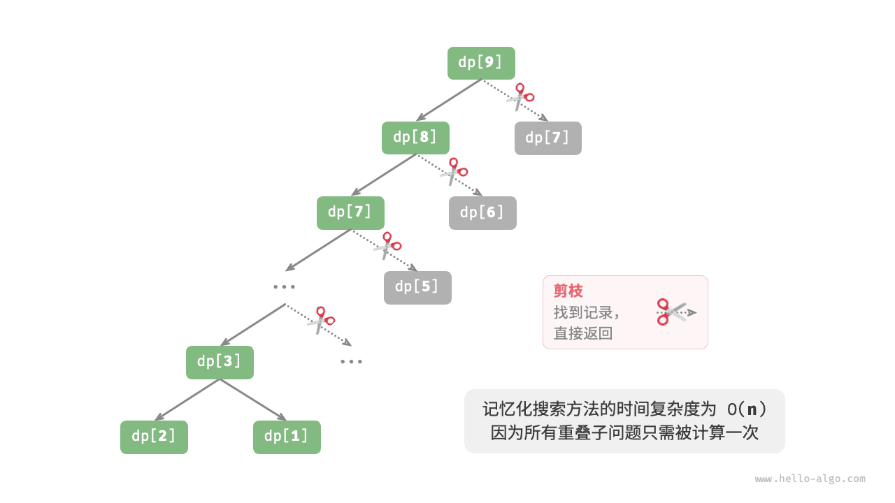

## 方法三：动态规划

**记忆化搜索是一种“从顶至底”的方法**：我们从原问题（根节点）开始，递归地将较大子问题分解为较小子问题，直至解已知的最小子问题（叶节点）。之后，通过回溯逐层收集子问题的解，构建出原问题的解。

与之相反，**动态规划是一种“从底至顶”的方法**：从最小子问题的解开始，迭代地构建更大子问题的解，直至得到原问题的解。

由于动态规划不包含回溯过程，因此只需使用循环迭代实现，无须使用递归。在以下代码中，我们初始化一个数组 `dp` 来存储子问题的解，它起到了与记忆化搜索中数组 `mem` 相同的记录作用：

```python
def climbing_stairs_dp(n: int) -> int:
    """爬楼梯：动态规划"""
    if n == 1 or n == 2:
        return n
    # 初始化 dp 表，用于存储子问题的解
    dp = [0] * (n + 1)
    # 初始状态：预设最小子问题的解
    dp[1], dp[2] = 1, 2
    # 状态转移：从较小子问题逐步求解较大子问题
    for i in range(3, n + 1):
        dp[i] = dp[i - 1] + dp[i - 2]
    return dp[n]
```

!!! example [pythontutor "可视化运行"](https://pythontutor.com/iframe-embed.html#code=def%20climbing_stairs_dp%28n%3A%20int%29%20-%3E%20int%3A%0A%20%20%20%20%22%22%22%E7%88%AC%E6%A5%BC%E6%A2%AF%EF%BC%9A%E5%8A%A8%E6%80%81%E8%A7%84%E5%88%92%22%22%22%0A%20%20%20%20if%20n%20%3D%3D%201%20or%20n%20%3D%3D%202%3A%0A%20%20%20%20%20%20%20%20return%20n%0A%20%20%20%20%23%20%E5%88%9D%E5%A7%8B%E5%8C%96%20dp%20%E8%A1%A8%EF%BC%8C%E7%94%A8%E4%BA%8E%E5%AD%98%E5%82%A8%E5%AD%90%E9%97%AE%E9%A2%98%E7%9A%84%E8%A7%A3%0A%20%20%20%20dp%20%3D%20%5B0%5D%20*%20%28n%20%2B%201%29%0A%20%20%20%20%23%20%E5%88%9D%E5%A7%8B%E7%8A%B6%E6%80%81%EF%BC%9A%E9%A2%84%E8%AE%BE%E6%9C%80%E5%B0%8F%E5%AD%90%E9%97%AE%E9%A2%98%E7%9A%84%E8%A7%A3%0A%20%20%20%20dp%5B1%5D,%20dp%5B2%5D%20%3D%201,%202%0A%20%20%20%20%23%20%E7%8A%B6%E6%80%81%E8%BD%AC%E7%A7%BB%EF%BC%9A%E4%BB%8E%E8%BE%83%E5%B0%8F%E5%AD%90%E9%97%AE%E9%A2%98%E9%80%90%E6%AD%A5%E6%B1%82%E8%A7%A3%E8%BE%83%E5%A4%A7%E5%AD%90%E9%97%AE%E9%A2%98%0A%20%20%20%20for%20i%20in%20range%283,%20n%20%2B%201%29%3A%0A%20%20%20%20%20%20%20%20dp%5Bi%5D%20%3D%20dp%5Bi%20-%201%5D%20%2B%20dp%5Bi%20-%202%5D%0A%20%20%20%20return%20dp%5Bn%5D%0A%0A%0A%22%22%22Driver%20Code%22%22%22%0Aif%20__name__%20%3D%3D%20%22__main__%22%3A%0A%20%20%20%20n%20%3D%209%0A%0A%20%20%20%20res%20%3D%20climbing_stairs_dp%28n%29%0A%20%20%20%20print%28f%22%E7%88%AC%20%7Bn%7D%20%E9%98%B6%E6%A5%BC%E6%A2%AF%E5%85%B1%E6%9C%89%20%7Bres%7D%20%E7%A7%8D%E6%96%B9%E6%A1%88%22%29&codeDivHeight=800&codeDivWidth=600&cumulative=false&curInstr=4&heapPrimitives=nevernest&origin=opt-frontend.js&py=311&rawInputLstJSON=%5B%5D&textReferences=false)

下图模拟了以上代码的执行过程。

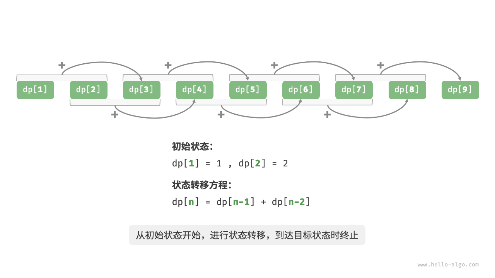

与回溯算法一样，动态规划也使用“状态”概念来表示问题求解的特定阶段，每个状态都对应一个子问题以及相应的局部最优解。例如，爬楼梯问题的状态定义为当前所在楼梯阶数 $i$ 。

根据以上内容，我们可以总结出动态规划的常用术语。

- 将数组 `dp` 称为 <u>dp 表</u>，$dp[i]$ 表示状态 $i$ 对应子问题的解。
- 将最小子问题对应的状态（第 $1$ 阶和第 $2$ 阶楼梯）称为<u>初始状态</u>。
- 将递推公式 $dp[i] = dp[i-1] + dp[i-2]$ 称为<u>状态转移方程</u>。

## 空间优化

细心的读者可能发现了，**由于 $dp[i]$ 只与 $dp[i-1]$ 和 $dp[i-2]$ 有关，因此我们无须使用一个数组 `dp` 来存储所有子问题的解**，而只需两个变量滚动前进即可。代码如下所示：

```python
def climbing_stairs_dp_comp(n: int) -> int:
    """爬楼梯：空间优化后的动态规划"""
    if n == 1 or n == 2:
        return n
    a, b = 1, 2
    for _ in range(3, n + 1):
        a, b = b, a + b
    return b
```

!!! example [pythontutor "可视化运行"](https://pythontutor.com/iframe-embed.html#code=def%20climbing_stairs_dp_comp%28n%3A%20int%29%20-%3E%20int%3A%0A%20%20%20%20%22%22%22%E7%88%AC%E6%A5%BC%E6%A2%AF%EF%BC%9A%E7%A9%BA%E9%97%B4%E4%BC%98%E5%8C%96%E5%90%8E%E7%9A%84%E5%8A%A8%E6%80%81%E8%A7%84%E5%88%92%22%22%22%0A%20%20%20%20if%20n%20%3D%3D%201%20or%20n%20%3D%3D%202%3A%0A%20%20%20%20%20%20%20%20return%20n%0A%20%20%20%20a,%20b%20%3D%201,%202%0A%20%20%20%20for%20_%20in%20range%283,%20n%20%2B%201%29%3A%0A%20%20%20%20%20%20%20%20a,%20b%20%3D%20b,%20a%20%2B%20b%0A%20%20%20%20return%20b%0A%0A%0A%22%22%22Driver%20Code%22%22%22%0Aif%20__name__%20%3D%3D%20%22__main__%22%3A%0A%20%20%20%20n%20%3D%209%0A%0A%20%20%20%20res%20%3D%20climbing_stairs_dp_comp%28n%29%0A%20%20%20%20print%28f%22%E7%88%AC%20%7Bn%7D%20%E9%98%B6%E6%A5%BC%E6%A2%AF%E5%85%B1%E6%9C%89%20%7Bres%7D%20%E7%A7%8D%E6%96%B9%E6%A1%88%22%29&codeDivHeight=800&codeDivWidth=600&cumulative=false&curInstr=4&heapPrimitives=nevernest&origin=opt-frontend.js&py=311&rawInputLstJSON=%5B%5D&textReferences=false)

观察以上代码，由于省去了数组 `dp` 占用的空间，因此空间复杂度从 $O(n)$ 降至 $O(1)$ 。

在动态规划问题中，当前状态往往仅与前面有限个状态有关，这时我们可以只保留必要的状态，通过“降维”来节省内存空间。**这种空间优化技巧被称为“滚动变量”或“滚动数组”**。

# 动态规划问题特性

在上一节中，我们学习了动态规划是如何通过子问题分解来求解原问题的。实际上，子问题分解是一种通用的算法思路，在分治、动态规划、回溯中的侧重点不同。

- 分治算法递归地将原问题划分为多个相互独立的子问题，直至最小子问题，并在回溯中合并子问题的解，最终得到原问题的解。
- 动态规划也对问题进行递归分解，但与分治算法的主要区别是，动态规划中的子问题是相互依赖的，在分解过程中会出现许多重叠子问题。
- 回溯算法在尝试和回退中穷举所有可能的解，并通过剪枝避免不必要的搜索分支。原问题的解由一系列决策步骤构成，我们可以将每个决策步骤之前的子序列看作一个子问题。

实际上，动态规划常用来求解最优化问题，它们不仅包含重叠子问题，还具有另外两大特性：最优子结构、无后效性。

## 最优子结构

我们对爬楼梯问题稍作改动，使之更加适合展示最优子结构概念。

!!! question "爬楼梯最小代价"

    给定一个楼梯，你每步可以上 $1$ 阶或者 $2$ 阶，每一阶楼梯上都贴有一个非负整数，表示你在该台阶所需要付出的代价。给定一个非负整数数组 $cost$ ，其中 $cost[i]$ 表示在第 $i$ 个台阶需要付出的代价，$cost[0]$ 为地面（起始点）。请计算最少需要付出多少代价才能到达顶部？

如下图所示，若第 $1$、$2$、$3$ 阶的代价分别为 $1$、$10$、$1$ ，则从地面爬到第 $3$ 阶的最小代价为 $2$ 。

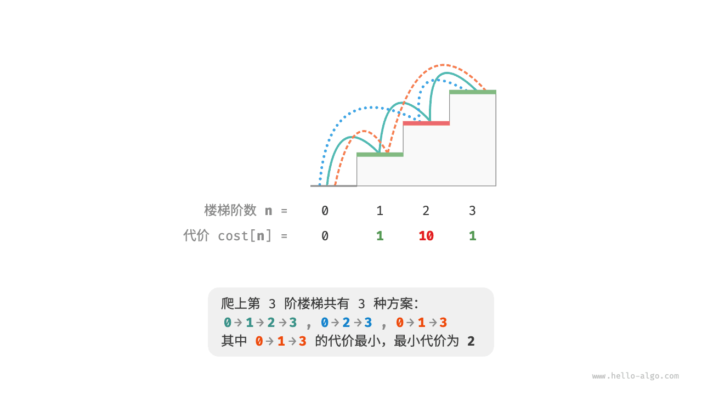

设 $dp[i]$ 为爬到第 $i$ 阶累计付出的代价，由于第 $i$ 阶只可能从 $i - 1$ 阶或 $i - 2$ 阶走来，因此 $dp[i]$ 只可能等于 $dp[i - 1] + cost[i]$ 或 $dp[i - 2] + cost[i]$ 。为了尽可能减少代价，我们应该选择两者中较小的那一个：

$$
dp[i] = \min(dp[i-1], dp[i-2]) + cost[i]
$$

这便可以引出最优子结构的含义：**原问题的最优解是从子问题的最优解构建得来的**。

本题显然具有最优子结构：我们从两个子问题最优解 $dp[i-1]$ 和 $dp[i-2]$ 中挑选出较优的那一个，并用它构建出原问题 $dp[i]$ 的最优解。

那么，上一节的爬楼梯题目有没有最优子结构呢？它的目标是求解方案数量，看似是一个计数问题，但如果换一种问法：“求解最大方案数量”。我们意外地发现，**虽然题目修改前后是等价的，但最优子结构浮现出来了**：第 $n$ 阶最大方案数量等于第 $n-1$ 阶和第 $n-2$ 阶最大方案数量之和。所以说，最优子结构的解释方式比较灵活，在不同问题中会有不同的含义。

根据状态转移方程，以及初始状态 $dp[1] = cost[1]$ 和 $dp[2] = cost[2]$ ，我们就可以得到动态规划代码：

```python
def min_cost_climbing_stairs_dp(cost: list[int]) -> int:
    """爬楼梯最小代价：动态规划"""
    n = len(cost) - 1
    if n == 1 or n == 2:
        return cost[n]
    # 初始化 dp 表，用于存储子问题的解
    dp = [0] * (n + 1)
    # 初始状态：预设最小子问题的解
    dp[1], dp[2] = cost[1], cost[2]
    # 状态转移：从较小子问题逐步求解较大子问题
    for i in range(3, n + 1):
        dp[i] = min(dp[i - 1], dp[i - 2]) + cost[i]
    return dp[n]
```

!!! example [pythontutor "可视化运行"](https://pythontutor.com/iframe-embed.html#code=def%20min_cost_climbing_stairs_dp%28cost%3A%20list%5Bint%5D%29%20-%3E%20int%3A%0A%20%20%20%20%22%22%22%E7%88%AC%E6%A5%BC%E6%A2%AF%E6%9C%80%E5%B0%8F%E4%BB%A3%E4%BB%B7%EF%BC%9A%E5%8A%A8%E6%80%81%E8%A7%84%E5%88%92%22%22%22%0A%20%20%20%20n%20%3D%20len%28cost%29%20-%201%0A%20%20%20%20if%20n%20%3D%3D%201%20or%20n%20%3D%3D%202%3A%0A%20%20%20%20%20%20%20%20return%20cost%5Bn%5D%0A%20%20%20%20%23%20%E5%88%9D%E5%A7%8B%E5%8C%96%20dp%20%E8%A1%A8%EF%BC%8C%E7%94%A8%E4%BA%8E%E5%AD%98%E5%82%A8%E5%AD%90%E9%97%AE%E9%A2%98%E7%9A%84%E8%A7%A3%0A%20%20%20%20dp%20%3D%20%5B0%5D%20*%20%28n%20%2B%201%29%0A%20%20%20%20%23%20%E5%88%9D%E5%A7%8B%E7%8A%B6%E6%80%81%EF%BC%9A%E9%A2%84%E8%AE%BE%E6%9C%80%E5%B0%8F%E5%AD%90%E9%97%AE%E9%A2%98%E7%9A%84%E8%A7%A3%0A%20%20%20%20dp%5B1%5D,%20dp%5B2%5D%20%3D%20cost%5B1%5D,%20cost%5B2%5D%0A%20%20%20%20%23%20%E7%8A%B6%E6%80%81%E8%BD%AC%E7%A7%BB%EF%BC%9A%E4%BB%8E%E8%BE%83%E5%B0%8F%E5%AD%90%E9%97%AE%E9%A2%98%E9%80%90%E6%AD%A5%E6%B1%82%E8%A7%A3%E8%BE%83%E5%A4%A7%E5%AD%90%E9%97%AE%E9%A2%98%0A%20%20%20%20for%20i%20in%20range%283,%20n%20%2B%201%29%3A%0A%20%20%20%20%20%20%20%20dp%5Bi%5D%20%3D%20min%28dp%5Bi%20-%201%5D,%20dp%5Bi%20-%202%5D%29%20%2B%20cost%5Bi%5D%0A%20%20%20%20return%20dp%5Bn%5D%0A%0A%0A%22%22%22Driver%20Code%22%22%22%0Aif%20__name__%20%3D%3D%20%22__main__%22%3A%0A%20%20%20%20cost%20%3D%20%5B0,%201,%2010,%201,%201,%201,%2010,%201,%201,%2010,%201%5D%0A%20%20%20%20print%28f%22%E8%BE%93%E5%85%A5%E6%A5%BC%E6%A2%AF%E7%9A%84%E4%BB%A3%E4%BB%B7%E5%88%97%E8%A1%A8%E4%B8%BA%20%7Bcost%7D%22%29%0A%0A%20%20%20%20res%20%3D%20min_cost_climbing_stairs_dp%28cost%29%0A%20%20%20%20print%28f%22%E7%88%AC%E5%AE%8C%E6%A5%BC%E6%A2%AF%E7%9A%84%E6%9C%80%E4%BD%8E%E4%BB%A3%E4%BB%B7%E4%B8%BA%20%7Bres%7D%22%29&codeDivHeight=800&codeDivWidth=600&cumulative=false&curInstr=4&heapPrimitives=nevernest&origin=opt-frontend.js&py=311&rawInputLstJSON=%5B%5D&textReferences=false)

下图展示了以上代码的动态规划过程。


本题也可以进行空间优化，将一维压缩至零维，使得空间复杂度从 $O(n)$ 降至 $O(1)$ ：

```python
def min_cost_climbing_stairs_dp_comp(cost: list[int]) -> int:
    """爬楼梯最小代价：空间优化后的动态规划"""
    n = len(cost) - 1
    if n == 1 or n == 2:
        return cost[n]
    a, b = cost[1], cost[2]
    for i in range(3, n + 1):
        a, b = b, min(a, b) + cost[i]
    return b
```

!!! example [pythontutor "可视化运行"](https://pythontutor.com/iframe-embed.html#code=def%20min_cost_climbing_stairs_dp_comp%28cost%3A%20list%5Bint%5D%29%20-%3E%20int%3A%0A%20%20%20%20%22%22%22%E7%88%AC%E6%A5%BC%E6%A2%AF%E6%9C%80%E5%B0%8F%E4%BB%A3%E4%BB%B7%EF%BC%9A%E7%A9%BA%E9%97%B4%E4%BC%98%E5%8C%96%E5%90%8E%E7%9A%84%E5%8A%A8%E6%80%81%E8%A7%84%E5%88%92%22%22%22%0A%20%20%20%20n%20%3D%20len%28cost%29%20-%201%0A%20%20%20%20if%20n%20%3D%3D%201%20or%20n%20%3D%3D%202%3A%0A%20%20%20%20%20%20%20%20return%20cost%5Bn%5D%0A%20%20%20%20a,%20b%20%3D%20cost%5B1%5D,%20cost%5B2%5D%0A%20%20%20%20for%20i%20in%20range%283,%20n%20%2B%201%29%3A%0A%20%20%20%20%20%20%20%20a,%20b%20%3D%20b,%20min%28a,%20b%29%20%2B%20cost%5Bi%5D%0A%20%20%20%20return%20b%0A%0A%0A%22%22%22Driver%20Code%22%22%22%0Aif%20__name__%20%3D%3D%20%22__main__%22%3A%0A%20%20%20%20cost%20%3D%20%5B0,%201,%2010,%201,%201,%201,%2010,%201,%201,%2010,%201%5D%0A%20%20%20%20print%28f%22%E8%BE%93%E5%85%A5%E6%A5%BC%E6%A2%AF%E7%9A%84%E4%BB%A3%E4%BB%B7%E5%88%97%E8%A1%A8%E4%B8%BA%20%7Bcost%7D%22%29%0A%0A%20%20%20%20res%20%3D%20min_cost_climbing_stairs_dp_comp%28cost%29%0A%20%20%20%20print%28f%22%E7%88%AC%E5%AE%8C%E6%A5%BC%E6%A2%AF%E7%9A%84%E6%9C%80%E4%BD%8E%E4%BB%A3%E4%BB%B7%E4%B8%BA%20%7Bres%7D%22%29&codeDivHeight=800&codeDivWidth=600&cumulative=false&curInstr=5&heapPrimitives=nevernest&origin=opt-frontend.js&py=311&rawInputLstJSON=%5B%5D&textReferences=false)

## 无后效性

无后效性是动态规划能够有效解决问题的重要特性之一，其定义为：**给定一个确定的状态，它的未来发展只与当前状态有关，而与过去经历的所有状态无关**。

以爬楼梯问题为例，给定状态 $i$ ，它会发展出状态 $i+1$ 和状态 $i+2$ ，分别对应跳 $1$ 步和跳 $2$ 步。在做出这两种选择时，我们无须考虑状态 $i$ 之前的状态，它们对状态 $i$ 的未来没有影响。

然而，如果我们给爬楼梯问题添加一个约束，情况就不一样了。

!!! question "带约束爬楼梯"

    给定一个共有 $n$ 阶的楼梯，你每步可以上 $1$ 阶或者 $2$ 阶，**但不能连续两轮跳 $1$ 阶**，请问有多少种方案可以爬到楼顶？

如下图所示，爬上第 $3$ 阶仅剩 $2$ 种可行方案，其中连续三次跳 $1$ 阶的方案不满足约束条件，因此被舍弃。


在该问题中，如果上一轮是跳 $1$ 阶上来的，那么下一轮就必须跳 $2$ 阶。这意味着，**下一步选择不能由当前状态（当前所在楼梯阶数）独立决定，还和前一个状态（上一轮所在楼梯阶数）有关**。

不难发现，此问题已不满足无后效性，状态转移方程 $dp[i] = dp[i-1] + dp[i-2]$ 也失效了，因为 $dp[i-1]$ 代表本轮跳 $1$ 阶，但其中包含了许多“上一轮是跳 $1$ 阶上来的”方案，而为了满足约束，我们就不能将 $dp[i-1]$ 直接计入 $dp[i]$ 中。

为此，我们需要扩展状态定义：**状态 $[i, j]$ 表示处在第 $i$ 阶并且上一轮跳了 $j$ 阶**，其中 $j \in \{1, 2\}$ 。此状态定义有效地区分了上一轮跳了 $1$ 阶还是 $2$ 阶，我们可以据此判断当前状态是从何而来的。

- 当上一轮跳了 $1$ 阶时，上上一轮只能选择跳 $2$ 阶，即 $dp[i, 1]$ 只能从 $dp[i-1, 2]$ 转移过来。
- 当上一轮跳了 $2$ 阶时，上上一轮可选择跳 $1$ 阶或跳 $2$ 阶，即 $dp[i, 2]$ 可以从 $dp[i-2, 1]$ 或 $dp[i-2, 2]$ 转移过来。

如下图所示，在该定义下，$dp[i, j]$ 表示状态 $[i, j]$ 对应的方案数。此时状态转移方程为：

$$
\begin{cases}
dp[i, 1] = dp[i-1, 2] \\
dp[i, 2] = dp[i-2, 1] + dp[i-2, 2]
\end{cases}
$$


最终，返回 $dp[n, 1] + dp[n, 2]$ 即可，两者之和代表爬到第 $n$ 阶的方案总数：

```python
def climbing_stairs_constraint_dp(n: int) -> int:
    """带约束爬楼梯：动态规划"""
    if n == 1 or n == 2:
        return 1
    # 初始化 dp 表，用于存储子问题的解
    dp = [[0] * 3 for _ in range(n + 1)]
    # 初始状态：预设最小子问题的解
    dp[1][1], dp[1][2] = 1, 0
    dp[2][1], dp[2][2] = 0, 1
    # 状态转移：从较小子问题逐步求解较大子问题
    for i in range(3, n + 1):
        dp[i][1] = dp[i - 1][2]
        dp[i][2] = dp[i - 2][1] + dp[i - 2][2]
    return dp[n][1] + dp[n][2]
```

!!! example [pythontutor "可视化运行"](https://pythontutor.com/iframe-embed.html#code=def%20climbing_stairs_constraint_dp%28n%3A%20int%29%20-%3E%20int%3A%0A%20%20%20%20%22%22%22%E5%B8%A6%E7%BA%A6%E6%9D%9F%E7%88%AC%E6%A5%BC%E6%A2%AF%EF%BC%9A%E5%8A%A8%E6%80%81%E8%A7%84%E5%88%92%22%22%22%0A%20%20%20%20if%20n%20%3D%3D%201%20or%20n%20%3D%3D%202%3A%0A%20%20%20%20%20%20%20%20return%201%0A%20%20%20%20%23%20%E5%88%9D%E5%A7%8B%E5%8C%96%20dp%20%E8%A1%A8%EF%BC%8C%E7%94%A8%E4%BA%8E%E5%AD%98%E5%82%A8%E5%AD%90%E9%97%AE%E9%A2%98%E7%9A%84%E8%A7%A3%0A%20%20%20%20dp%20%3D%20%5B%5B0%5D%20*%203%20for%20_%20in%20range%28n%20%2B%201%29%5D%0A%20%20%20%20%23%20%E5%88%9D%E5%A7%8B%E7%8A%B6%E6%80%81%EF%BC%9A%E9%A2%84%E8%AE%BE%E6%9C%80%E5%B0%8F%E5%AD%90%E9%97%AE%E9%A2%98%E7%9A%84%E8%A7%A3%0A%20%20%20%20dp%5B1%5D%5B1%5D,%20dp%5B1%5D%5B2%5D%20%3D%201,%200%0A%20%20%20%20dp%5B2%5D%5B1%5D,%20dp%5B2%5D%5B2%5D%20%3D%200,%201%0A%20%20%20%20%23%20%E7%8A%B6%E6%80%81%E8%BD%AC%E7%A7%BB%EF%BC%9A%E4%BB%8E%E8%BE%83%E5%B0%8F%E5%AD%90%E9%97%AE%E9%A2%98%E9%80%90%E6%AD%A5%E6%B1%82%E8%A7%A3%E8%BE%83%E5%A4%A7%E5%AD%90%E9%97%AE%E9%A2%98%0A%20%20%20%20for%20i%20in%20range%283,%20n%20%2B%201%29%3A%0A%20%20%20%20%20%20%20%20dp%5Bi%5D%5B1%5D%20%3D%20dp%5Bi%20-%201%5D%5B2%5D%0A%20%20%20%20%20%20%20%20dp%5Bi%5D%5B2%5D%20%3D%20dp%5Bi%20-%202%5D%5B1%5D%20%2B%20dp%5Bi%20-%202%5D%5B2%5D%0A%20%20%20%20return%20dp%5Bn%5D%5B1%5D%20%2B%20dp%5Bn%5D%5B2%5D%0A%0A%0A%22%22%22Driver%20Code%22%22%22%0Aif%20__name__%20%3D%3D%20%22__main__%22%3A%0A%20%20%20%20n%20%3D%209%0A%0A%20%20%20%20res%20%3D%20climbing_stairs_constraint_dp%28n%29%0A%20%20%20%20print%28f%22%E7%88%AC%20%7Bn%7D%20%E9%98%B6%E6%A5%BC%E6%A2%AF%E5%85%B1%E6%9C%89%20%7Bres%7D%20%E7%A7%8D%E6%96%B9%E6%A1%88%22%29&codeDivHeight=800&codeDivWidth=600&cumulative=false&curInstr=4&heapPrimitives=nevernest&origin=opt-frontend.js&py=311&rawInputLstJSON=%5B%5D&textReferences=false)

在上面的案例中，由于仅需多考虑前面一个状态，因此我们仍然可以通过扩展状态定义，使得问题重新满足无后效性。然而，某些问题具有非常严重的“有后效性”。

!!! question "爬楼梯与障碍生成"

    给定一个共有 $n$ 阶的楼梯，你每步可以上 $1$ 阶或者 $2$ 阶。**规定当爬到第 $i$ 阶时，系统自动会在第 $2i$ 阶上放上障碍物，之后所有轮都不允许跳到第 $2i$ 阶上**。例如，前两轮分别跳到了第 $2$、$3$ 阶上，则之后就不能跳到第 $4$、$6$ 阶上。请问有多少种方案可以爬到楼顶？

在这个问题中，下次跳跃依赖过去所有的状态，因为每一次跳跃都会在更高的阶梯上设置障碍，并影响未来的跳跃。对于这类问题，动态规划往往难以解决。

实际上，许多复杂的组合优化问题（例如旅行商问题）不满足无后效性。对于这类问题，我们通常会选择使用其他方法，例如启发式搜索、遗传算法、强化学习等，从而在有限时间内得到可用的局部最优解。

# 动态规划解题思路

上两节介绍了动态规划问题的主要特征，接下来我们一起探究两个更加实用的问题。

1. 如何判断一个问题是不是动态规划问题？
2. 求解动态规划问题该从何处入手，完整步骤是什么？

## 问题判断

总的来说，如果一个问题包含重叠子问题、最优子结构，并满足无后效性，那么它通常适合用动态规划求解。然而，我们很难从问题描述中直接提取出这些特性。因此我们通常会放宽条件，**先观察问题是否适合使用回溯（穷举）解决**。

**适合用回溯解决的问题通常满足“决策树模型”**，这种问题可以使用树形结构来描述，其中每一个节点代表一个决策，每一条路径代表一个决策序列。

换句话说，如果问题包含明确的决策概念，并且解是通过一系列决策产生的，那么它就满足决策树模型，通常可以使用回溯来解决。

在此基础上，动态规划问题还有一些判断的“加分项”。

- 问题包含最大（小）或最多（少）等最优化描述。
- 问题的状态能够使用一个列表、多维矩阵或树来表示，并且一个状态与其周围的状态存在递推关系。

相应地，也存在一些“减分项”。

- 问题的目标是找出所有可能的解决方案，而不是找出最优解。
- 问题描述中有明显的排列组合的特征，需要返回具体的多个方案。

如果一个问题满足决策树模型，并具有较为明显的“加分项”，我们就可以假设它是一个动态规划问题，并在求解过程中验证它。

## 问题求解步骤

动态规划的解题流程会因问题的性质和难度而有所不同，但通常遵循以下步骤：描述决策，定义状态，建立 $dp$ 表，推导状态转移方程，确定边界条件等。

为了更形象地展示解题步骤，我们使用一个经典问题“最小路径和”来举例。

!!! question

    给定一个 $n \times m$ 的二维网格 `grid` ，网格中的每个单元格包含一个非负整数，表示该单元格的代价。机器人以左上角单元格为起始点，每次只能向下或者向右移动一步，直至到达右下角单元格。请返回从左上角到右下角的最小路径和。

下图展示了一个例子，给定网格的最小路径和为 $13$ 。


**第一步：思考每轮的决策，定义状态，从而得到 $dp$ 表**

本题的每一轮的决策就是从当前格子向下或向右走一步。设当前格子的行列索引为 $[i, j]$ ，则向下或向右走一步后，索引变为 $[i+1, j]$ 或 $[i, j+1]$ 。因此，状态应包含行索引和列索引两个变量，记为 $[i, j]$ 。

状态 $[i, j]$ 对应的子问题为：从起始点 $[0, 0]$ 走到 $[i, j]$ 的最小路径和，解记为 $dp[i, j]$ 。

至此，我们就得到了下图所示的二维 $dp$ 矩阵，其尺寸与输入网格 $grid$ 相同。


!!! note

    动态规划和回溯过程可以描述为一个决策序列，而状态由所有决策变量构成。它应当包含描述解题进度的所有变量，其包含了足够的信息，能够用来推导出下一个状态。
    
    每个状态都对应一个子问题，我们会定义一个 $dp$ 表来存储所有子问题的解，状态的每个独立变量都是 $dp$ 表的一个维度。从本质上看，$dp$ 表是状态和子问题的解之间的映射。

**第二步：找出最优子结构，进而推导出状态转移方程**

对于状态 $[i, j]$ ，它只能从上边格子 $[i-1, j]$ 和左边格子 $[i, j-1]$ 转移而来。因此最优子结构为：到达 $[i, j]$ 的最小路径和由 $[i, j-1]$ 的最小路径和与 $[i-1, j]$ 的最小路径和中较小的那一个决定。

根据以上分析，可推出下图所示的状态转移方程：

$$
dp[i, j] = \min(dp[i-1, j], dp[i, j-1]) + grid[i, j]
$$

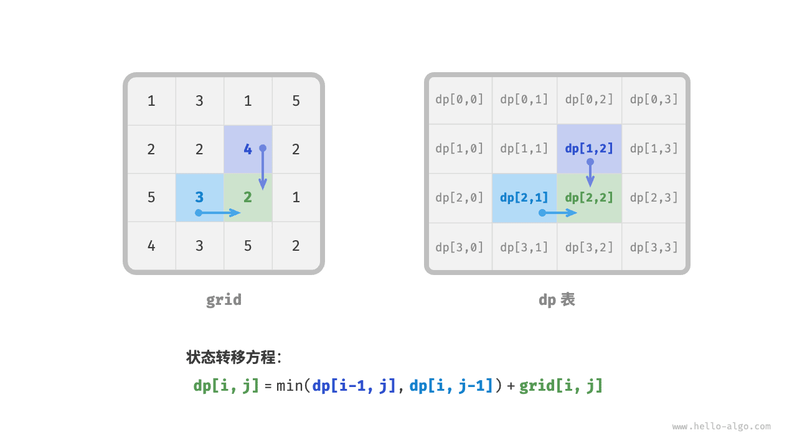

!!! note

    根据定义好的 $dp$ 表，思考原问题和子问题的关系，找出通过子问题的最优解来构造原问题的最优解的方法，即最优子结构。

    一旦我们找到了最优子结构，就可以使用它来构建出状态转移方程。

**第三步：确定边界条件和状态转移顺序**

在本题中，处在首行的状态只能从其左边的状态得来，处在首列的状态只能从其上边的状态得来，因此首行 $i = 0$ 和首列 $j = 0$ 是边界条件。

如下图所示，由于每个格子是由其左方格子和上方格子转移而来，因此我们使用循环来遍历矩阵，外循环遍历各行，内循环遍历各列。


!!! note

    边界条件在动态规划中用于初始化 $dp$ 表，在搜索中用于剪枝。
    
    状态转移顺序的核心是要保证在计算当前问题的解时，所有它依赖的更小子问题的解都已经被正确地计算出来。

根据以上分析，我们已经可以直接写出动态规划代码。然而子问题分解是一种从顶至底的思想，因此按照“暴力搜索 $\rightarrow$ 记忆化搜索 $\rightarrow$ 动态规划”的顺序实现更加符合思维习惯。

### 方法一：暴力搜索

从状态 $[i, j]$ 开始搜索，不断分解为更小的状态 $[i-1, j]$ 和 $[i, j-1]$ ，递归函数包括以下要素。

- **递归参数**：状态 $[i, j]$ 。
- **返回值**：从 $[0, 0]$ 到 $[i, j]$ 的最小路径和 $dp[i, j]$ 。
- **终止条件**：当 $i = 0$ 且 $j = 0$ 时，返回代价 $grid[0, 0]$ 。
- **剪枝**：当 $i < 0$ 时或 $j < 0$ 时索引越界，此时返回代价 $+\infty$ ，代表不可行。

实现代码如下：

```python
def min_path_sum_dfs(grid: list[list[int]], i: int, j: int) -> int:
    """最小路径和：暴力搜索"""
    # 若为左上角单元格，则终止搜索
    if i == 0 and j == 0:
        return grid[0][0]
    # 若行列索引越界，则返回 +∞ 代价
    if i < 0 or j < 0:
        return inf
    # 计算从左上角到 (i-1, j) 和 (i, j-1) 的最小路径代价
    up = min_path_sum_dfs(grid, i - 1, j)
    left = min_path_sum_dfs(grid, i, j - 1)
    # 返回从左上角到 (i, j) 的最小路径代价
    return min(left, up) + grid[i][j]
```

!!! example [pythontutor "可视化运行"](https://pythontutor.com/iframe-embed.html#code=from%20math%20import%20inf%0A%0Adef%20min_path_sum_dfs%28grid%3A%20list%5Blist%5Bint%5D%5D,%20i%3A%20int,%20j%3A%20int%29%20-%3E%20int%3A%0A%20%20%20%20%22%22%22%E6%9C%80%E5%B0%8F%E8%B7%AF%E5%BE%84%E5%92%8C%EF%BC%9A%E6%9A%B4%E5%8A%9B%E6%90%9C%E7%B4%A2%22%22%22%0A%20%20%20%20%23%20%E8%8B%A5%E4%B8%BA%E5%B7%A6%E4%B8%8A%E8%A7%92%E5%8D%95%E5%85%83%E6%A0%BC%EF%BC%8C%E5%88%99%E7%BB%88%E6%AD%A2%E6%90%9C%E7%B4%A2%0A%20%20%20%20if%20i%20%3D%3D%200%20and%20j%20%3D%3D%200%3A%0A%20%20%20%20%20%20%20%20return%20grid%5B0%5D%5B0%5D%0A%20%20%20%20%23%20%E8%8B%A5%E8%A1%8C%E5%88%97%E7%B4%A2%E5%BC%95%E8%B6%8A%E7%95%8C%EF%BC%8C%E5%88%99%E8%BF%94%E5%9B%9E%20%2B%E2%88%9E%20%E4%BB%A3%E4%BB%B7%0A%20%20%20%20if%20i%20%3C%200%20or%20j%20%3C%200%3A%0A%20%20%20%20%20%20%20%20return%20inf%0A%20%20%20%20%23%20%E8%AE%A1%E7%AE%97%E4%BB%8E%E5%B7%A6%E4%B8%8A%E8%A7%92%E5%88%B0%20%28i-1,%20j%29%20%E5%92%8C%20%28i,%20j-1%29%20%E7%9A%84%E6%9C%80%E5%B0%8F%E8%B7%AF%E5%BE%84%E4%BB%A3%E4%BB%B7%0A%20%20%20%20up%20%3D%20min_path_sum_dfs%28grid,%20i%20-%201,%20j%29%0A%20%20%20%20left%20%3D%20min_path_sum_dfs%28grid,%20i,%20j%20-%201%29%0A%20%20%20%20%23%20%E8%BF%94%E5%9B%9E%E4%BB%8E%E5%B7%A6%E4%B8%8A%E8%A7%92%E5%88%B0%20%28i,%20j%29%20%E7%9A%84%E6%9C%80%E5%B0%8F%E8%B7%AF%E5%BE%84%E4%BB%A3%E4%BB%B7%0A%20%20%20%20return%20min%28left,%20up%29%20%2B%20grid%5Bi%5D%5Bj%5D%0A%0A%0A%22%22%22Driver%20Code%22%22%22%0Aif%20__name__%20%3D%3D%20%22__main__%22%3A%0A%20%20%20%20grid%20%3D%20%5B%5B1,%203,%201,%205%5D,%20%5B2,%202,%204,%202%5D,%20%5B5,%203,%202,%201%5D,%20%5B4,%203,%205,%202%5D%5D%0A%20%20%20%20n,%20m%20%3D%20len%28grid%29,%20len%28grid%5B0%5D%29%0A%0A%20%20%20%20%23%20%E6%9A%B4%E5%8A%9B%E6%90%9C%E7%B4%A2%0A%20%20%20%20res%20%3D%20min_path_sum_dfs%28grid,%20n%20-%201,%20m%20-%201%29%0A%20%20%20%20print%28f%22%E4%BB%8E%E5%B7%A6%E4%B8%8A%E8%A7%92%E5%88%B0%E5%8F%B3%E4%B8%8B%E8%A7%92%E7%9A%84%E5%81%9A%E5%B0%8F%E8%B7%AF%E5%BE%84%E5%92%8C%E4%B8%BA%20%7Bres%7D%22%29&codeDivHeight=800&codeDivWidth=600&cumulative=false&curInstr=6&heapPrimitives=nevernest&origin=opt-frontend.js&py=311&rawInputLstJSON=%5B%5D&textReferences=false)

下图给出了以 $dp[2, 1]$ 为根节点的递归树，其中包含一些重叠子问题，其数量会随着网格 `grid` 的尺寸变大而急剧增多。

从本质上看，造成重叠子问题的原因为：**存在多条路径可以从左上角到达某一单元格**。

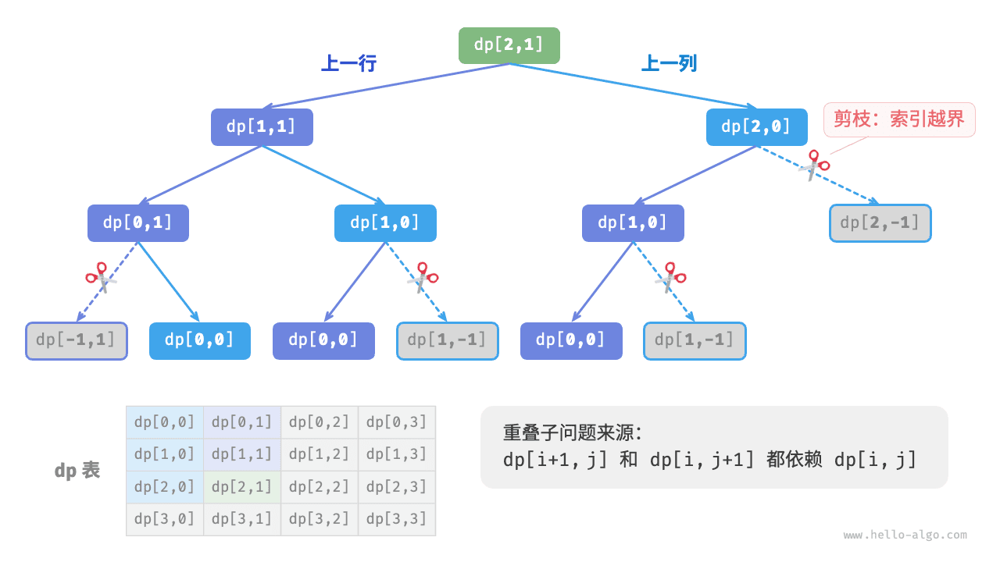

每个状态都有向下和向右两种选择，从左上角走到右下角总共需要 $m + n - 2$ 步，所以最差时间复杂度为 $O(2^{m + n})$ ，其中 $n$ 和 $m$ 分别为网格的行数和列数。请注意，这种计算方式未考虑临近网格边界的情况，当到达网格边界时只剩下一种选择，因此实际的路径数量会少一些。

### 方法二：记忆化搜索

我们引入一个和网格 `grid` 相同尺寸的记忆列表 `mem` ，用于记录各个子问题的解，并将重叠子问题进行剪枝：

```python
def min_path_sum_dfs_mem(
    grid: list[list[int]], mem: list[list[int]], i: int, j: int
) -> int:
    """最小路径和：记忆化搜索"""
    # 若为左上角单元格，则终止搜索
    if i == 0 and j == 0:
        return grid[0][0]
    # 若行列索引越界，则返回 +∞ 代价
    if i < 0 or j < 0:
        return inf
    # 若已有记录，则直接返回
    if mem[i][j] != -1:
        return mem[i][j]
    # 左边和上边单元格的最小路径代价
    up = min_path_sum_dfs_mem(grid, mem, i - 1, j)
    left = min_path_sum_dfs_mem(grid, mem, i, j - 1)
    # 记录并返回左上角到 (i, j) 的最小路径代价
    mem[i][j] = min(left, up) + grid[i][j]
    return mem[i][j]
```

!!! example [pythontutor "可视化运行"](https://pythontutor.com/iframe-embed.html#code=from%20math%20import%20inf%0A%0Adef%20min_path_sum_dfs_mem%28%0A%20%20%20%20grid%3A%20list%5Blist%5Bint%5D%5D,%20mem%3A%20list%5Blist%5Bint%5D%5D,%20i%3A%20int,%20j%3A%20int%0A%29%20-%3E%20int%3A%0A%20%20%20%20%22%22%22%E6%9C%80%E5%B0%8F%E8%B7%AF%E5%BE%84%E5%92%8C%EF%BC%9A%E8%AE%B0%E5%BF%86%E5%8C%96%E6%90%9C%E7%B4%A2%22%22%22%0A%20%20%20%20%23%20%E8%8B%A5%E4%B8%BA%E5%B7%A6%E4%B8%8A%E8%A7%92%E5%8D%95%E5%85%83%E6%A0%BC%EF%BC%8C%E5%88%99%E7%BB%88%E6%AD%A2%E6%90%9C%E7%B4%A2%0A%20%20%20%20if%20i%20%3D%3D%200%20and%20j%20%3D%3D%200%3A%0A%20%20%20%20%20%20%20%20return%20grid%5B0%5D%5B0%5D%0A%20%20%20%20%23%20%E8%8B%A5%E8%A1%8C%E5%88%97%E7%B4%A2%E5%BC%95%E8%B6%8A%E7%95%8C%EF%BC%8C%E5%88%99%E8%BF%94%E5%9B%9E%20%2B%E2%88%9E%20%E4%BB%A3%E4%BB%B7%0A%20%20%20%20if%20i%20%3C%200%20or%20j%20%3C%200%3A%0A%20%20%20%20%20%20%20%20return%20inf%0A%20%20%20%20%23%20%E8%8B%A5%E5%B7%B2%E6%9C%89%E8%AE%B0%E5%BD%95%EF%BC%8C%E5%88%99%E7%9B%B4%E6%8E%A5%E8%BF%94%E5%9B%9E%0A%20%20%20%20if%20mem%5Bi%5D%5Bj%5D%20!%3D%20-1%3A%0A%20%20%20%20%20%20%20%20return%20mem%5Bi%5D%5Bj%5D%0A%20%20%20%20%23%20%E5%B7%A6%E8%BE%B9%E5%92%8C%E4%B8%8A%E8%BE%B9%E5%8D%95%E5%85%83%E6%A0%BC%E7%9A%84%E6%9C%80%E5%B0%8F%E8%B7%AF%E5%BE%84%E4%BB%A3%E4%BB%B7%0A%20%20%20%20up%20%3D%20min_path_sum_dfs_mem%28grid,%20mem,%20i%20-%201,%20j%29%0A%20%20%20%20left%20%3D%20min_path_sum_dfs_mem%28grid,%20mem,%20i,%20j%20-%201%29%0A%20%20%20%20%23%20%E8%AE%B0%E5%BD%95%E5%B9%B6%E8%BF%94%E5%9B%9E%E5%B7%A6%E4%B8%8A%E8%A7%92%E5%88%B0%20%28i,%20j%29%20%E7%9A%84%E6%9C%80%E5%B0%8F%E8%B7%AF%E5%BE%84%E4%BB%A3%E4%BB%B7%0A%20%20%20%20mem%5Bi%5D%5Bj%5D%20%3D%20min%28left,%20up%29%20%2B%20grid%5Bi%5D%5Bj%5D%0A%20%20%20%20return%20mem%5Bi%5D%5Bj%5D%0A%0A%0A%22%22%22Driver%20Code%22%22%22%0Aif%20__name__%20%3D%3D%20%22__main__%22%3A%0A%20%20%20%20grid%20%3D%20%5B%5B1,%203,%201,%205%5D,%20%5B2,%202,%204,%202%5D,%20%5B5,%203,%202,%201%5D,%20%5B4,%203,%205,%202%5D%5D%0A%20%20%20%20n,%20m%20%3D%20len%28grid%29,%20len%28grid%5B0%5D%29%0A%0A%20%20%20%23%20%E8%AE%B0%E5%BF%86%E5%8C%96%E6%90%9C%E7%B4%A2%0A%20%20%20%20mem%20%3D%20%5B%5B-1%5D%20*%20m%20for%20_%20in%20range%28n%29%5D%0A%20%20%20%20res%20%3D%20min_path_sum_dfs_mem%28grid,%20mem,%20n%20-%201,%20m%20-%201%29%0A%20%20%20%20print%28f%22%E4%BB%8E%E5%B7%A6%E4%B8%8A%E8%A7%92%E5%88%B0%E5%8F%B3%E4%B8%8B%E8%A7%92%E7%9A%84%E5%81%9A%E5%B0%8F%E8%B7%AF%E5%BE%84%E5%92%8C%E4%B8%BA%20%7Bres%7D%22%29&codeDivHeight=800&codeDivWidth=600&cumulative=false&curInstr=16&heapPrimitives=nevernest&origin=opt-frontend.js&py=311&rawInputLstJSON=%5B%5D&textReferences=false)

如下图所示，在引入记忆化后，所有子问题的解只需计算一次，因此时间复杂度取决于状态总数，即网格尺寸 $O(nm)$ 。

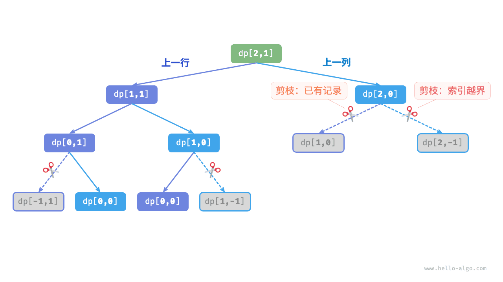

### 方法三：动态规划

基于迭代实现动态规划解法，代码如下所示：

```python
def min_path_sum_dp(grid: list[list[int]]) -> int:
    """最小路径和：动态规划"""
    n, m = len(grid), len(grid[0])
    # 初始化 dp 表
    dp = [[0] * m for _ in range(n)]
    dp[0][0] = grid[0][0]
    # 状态转移：首行
    for j in range(1, m):
        dp[0][j] = dp[0][j - 1] + grid[0][j]
    # 状态转移：首列
    for i in range(1, n):
        dp[i][0] = dp[i - 1][0] + grid[i][0]
    # 状态转移：其余行和列
    for i in range(1, n):
        for j in range(1, m):
            dp[i][j] = min(dp[i][j - 1], dp[i - 1][j]) + grid[i][j]
    return dp[n - 1][m - 1]
```

!!! example [pythontutor "可视化运行"](https://pythontutor.com/iframe-embed.html#code=from%20math%20import%20inf%0A%0Adef%20min_path_sum_dp%28grid%3A%20list%5Blist%5Bint%5D%5D%29%20-%3E%20int%3A%0A%20%20%20%20%22%22%22%E6%9C%80%E5%B0%8F%E8%B7%AF%E5%BE%84%E5%92%8C%EF%BC%9A%E5%8A%A8%E6%80%81%E8%A7%84%E5%88%92%22%22%22%0A%20%20%20%20n,%20m%20%3D%20len%28grid%29,%20len%28grid%5B0%5D%29%0A%20%20%20%20%23%20%E5%88%9D%E5%A7%8B%E5%8C%96%20dp%20%E8%A1%A8%0A%20%20%20%20dp%20%3D%20%5B%5B0%5D%20*%20m%20for%20_%20in%20range%28n%29%5D%0A%20%20%20%20dp%5B0%5D%5B0%5D%20%3D%20grid%5B0%5D%5B0%5D%0A%20%20%20%20%23%20%E7%8A%B6%E6%80%81%E8%BD%AC%E7%A7%BB%EF%BC%9A%E9%A6%96%E8%A1%8C%0A%20%20%20%20for%20j%20in%20range%281,%20m%29%3A%0A%20%20%20%20%20%20%20%20dp%5B0%5D%5Bj%5D%20%3D%20dp%5B0%5D%5Bj%20-%201%5D%20%2B%20grid%5B0%5D%5Bj%5D%0A%20%20%20%20%23%20%E7%8A%B6%E6%80%81%E8%BD%AC%E7%A7%BB%EF%BC%9A%E9%A6%96%E5%88%97%0A%20%20%20%20for%20i%20in%20range%281,%20n%29%3A%0A%20%20%20%20%20%20%20%20dp%5Bi%5D%5B0%5D%20%3D%20dp%5Bi%20-%201%5D%5B0%5D%20%2B%20grid%5Bi%5D%5B0%5D%0A%20%20%20%20%23%20%E7%8A%B6%E6%80%81%E8%BD%AC%E7%A7%BB%EF%BC%9A%E5%85%B6%E4%BD%99%E8%A1%8C%E5%92%8C%E5%88%97%0A%20%20%20%20for%20i%20in%20range%281,%20n%29%3A%0A%20%20%20%20%20%20%20%20for%20j%20in%20range%281,%20m%29%3A%0A%20%20%20%20%20%20%20%20%20%20%20%20dp%5Bi%5D%5Bj%5D%20%3D%20min%28dp%5Bi%5D%5Bj%20-%201%5D,%20dp%5Bi%20-%201%5D%5Bj%5D%29%20%2B%20grid%5Bi%5D%5Bj%5D%0A%20%20%20%20return%20dp%5Bn%20-%201%5D%5Bm%20-%201%5D%0A%0A%0A%22%22%22Driver%20Code%22%22%22%0Aif%20__name__%20%3D%3D%20%22__main__%22%3A%0A%20%20%20%20grid%20%3D%20%5B%5B1,%203,%201,%205%5D,%20%5B2,%202,%204,%202%5D,%20%5B5,%203,%202,%201%5D,%20%5B4,%203,%205,%202%5D%5D%0A%20%20%20%20n,%20m%20%3D%20len%28grid%29,%20len%28grid%5B0%5D%29%0A%0A%20%20%20%20%23%20%E5%8A%A8%E6%80%81%E8%A7%84%E5%88%92%0A%20%20%20%20res%20%3D%20min_path_sum_dp%28grid%29%0A%20%20%20%20print%28f%22%E4%BB%8E%E5%B7%A6%E4%B8%8A%E8%A7%92%E5%88%B0%E5%8F%B3%E4%B8%8B%E8%A7%92%E7%9A%84%E5%81%9A%E5%B0%8F%E8%B7%AF%E5%BE%84%E5%92%8C%E4%B8%BA%20%7Bres%7D%22%29&codeDivHeight=800&codeDivWidth=600&cumulative=false&curInstr=6&heapPrimitives=nevernest&origin=opt-frontend.js&py=311&rawInputLstJSON=%5B%5D&textReferences=false)

下图展示了最小路径和的状态转移过程，其遍历了整个网格，**因此时间复杂度为 $O(nm)$** 。

数组 `dp` 大小为 $n \times m$ ，**因此空间复杂度为 $O(nm)$** 。

=== "<1>"
    

=== "<2>"
    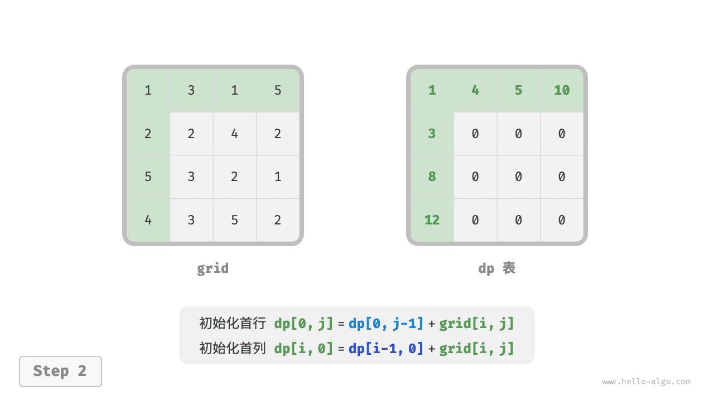

=== "<3>"
    

=== "<4>"
    

=== "<5>"
    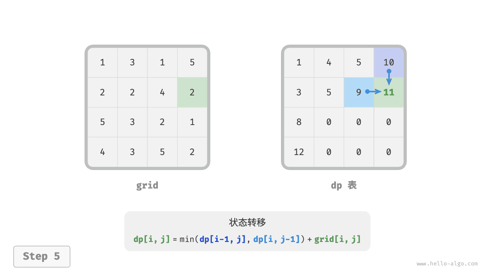

=== "<6>"
    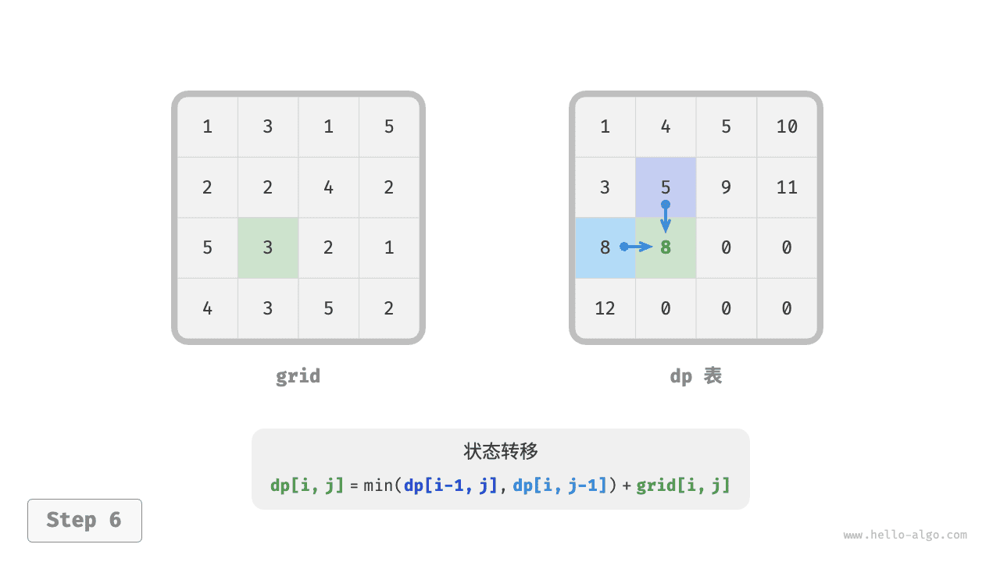

=== "<7>"
    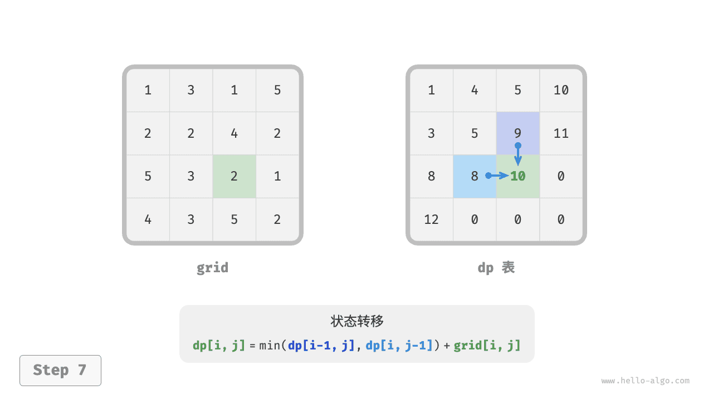

=== "<8>"
    

=== "<9>"
    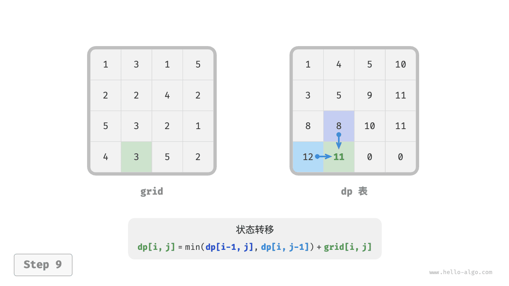

=== "<10>"
    

=== "<11>"
    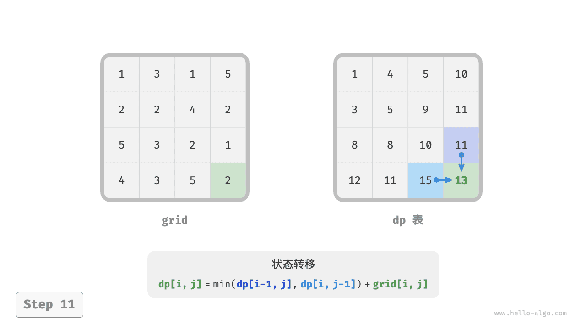

=== "<12>"
    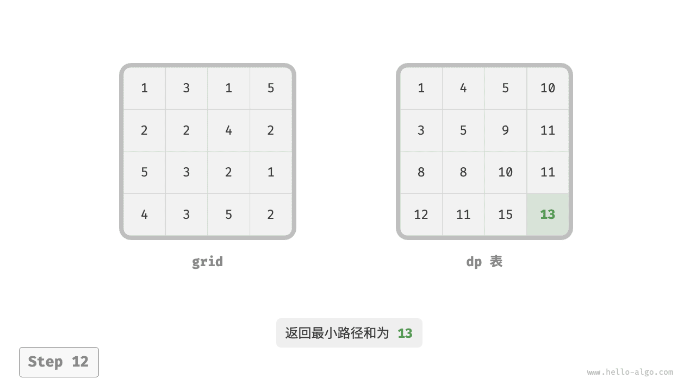

### 空间优化

由于每个格子只与其左边和上边的格子有关，因此我们可以只用一个单行数组来实现 $dp$ 表。

请注意，因为数组 `dp` 只能表示一行的状态，所以我们无法提前初始化首列状态，而是在遍历每行时更新它：

```python
def min_path_sum_dp_comp(grid: list[list[int]]) -> int:
    """最小路径和：空间优化后的动态规划"""
    n, m = len(grid), len(grid[0])
    # 初始化 dp 表
    dp = [0] * m
    # 状态转移：首行
    dp[0] = grid[0][0]
    for j in range(1, m):
        dp[j] = dp[j - 1] + grid[0][j]
    # 状态转移：其余行
    for i in range(1, n):
        # 状态转移：首列
        dp[0] = dp[0] + grid[i][0]
        # 状态转移：其余列
        for j in range(1, m):
            dp[j] = min(dp[j - 1], dp[j]) + grid[i][j]
    return dp[m - 1]
```

!!! example [pythontutor "可视化运行"](https://pythontutor.com/iframe-embed.html#code=from%20math%20import%20inf%0A%0Adef%20min_path_sum_dp_comp%28grid%3A%20list%5Blist%5Bint%5D%5D%29%20-%3E%20int%3A%0A%20%20%20%20%22%22%22%E6%9C%80%E5%B0%8F%E8%B7%AF%E5%BE%84%E5%92%8C%EF%BC%9A%E7%A9%BA%E9%97%B4%E4%BC%98%E5%8C%96%E5%90%8E%E7%9A%84%E5%8A%A8%E6%80%81%E8%A7%84%E5%88%92%22%22%22%0A%20%20%20%20n,%20m%20%3D%20len%28grid%29,%20len%28grid%5B0%5D%29%0A%20%20%20%20%23%20%E5%88%9D%E5%A7%8B%E5%8C%96%20dp%20%E8%A1%A8%0A%20%20%20%20dp%20%3D%20%5B0%5D%20*%20m%0A%20%20%20%20%23%20%E7%8A%B6%E6%80%81%E8%BD%AC%E7%A7%BB%EF%BC%9A%E9%A6%96%E8%A1%8C%0A%20%20%20%20dp%5B0%5D%20%3D%20grid%5B0%5D%5B0%5D%0A%20%20%20%20for%20j%20in%20range%281,%20m%29%3A%0A%20%20%20%20%20%20%20%20dp%5Bj%5D%20%3D%20dp%5Bj%20-%201%5D%20%2B%20grid%5B0%5D%5Bj%5D%0A%20%20%20%20%23%20%E7%8A%B6%E6%80%81%E8%BD%AC%E7%A7%BB%EF%BC%9A%E5%85%B6%E4%BD%99%E8%A1%8C%0A%20%20%20%20for%20i%20in%20range%281,%20n%29%3A%0A%20%20%20%20%20%20%20%20%23%20%E7%8A%B6%E6%80%81%E8%BD%AC%E7%A7%BB%EF%BC%9A%E9%A6%96%E5%88%97%0A%20%20%20%20%20%20%20%20dp%5B0%5D%20%3D%20dp%5B0%5D%20%2B%20grid%5Bi%5D%5B0%5D%0A%20%20%20%20%20%20%20%20%23%20%E7%8A%B6%E6%80%81%E8%BD%AC%E7%A7%BB%EF%BC%9A%E5%85%B6%E4%BD%99%E5%88%97%0A%20%20%20%20%20%20%20%20for%20j%20in%20range%281,%20m%29%3A%0A%20%20%20%20%20%20%20%20%20%20%20%20dp%5Bj%5D%20%3D%20min%28dp%5Bj%20-%201%5D,%20dp%5Bj%5D%29%20%2B%20grid%5Bi%5D%5Bj%5D%0A%20%20%20%20return%20dp%5Bm%20-%201%5D%0A%0A%0A%22%22%22Driver%20Code%22%22%22%0Aif%20__name__%20%3D%3D%20%22__main__%22%3A%0A%20%20%20%20grid%20%3D%20%5B%5B1,%203,%201,%205%5D,%20%5B2,%202,%204,%202%5D,%20%5B5,%203,%202,%201%5D,%20%5B4,%203,%205,%202%5D%5D%0A%20%20%20%20n,%20m%20%3D%20len%28grid%29,%20len%28grid%5B0%5D%29%0A%0A%20%20%20%20%23%20%E7%A9%BA%E9%97%B4%E4%BC%98%E5%8C%96%E5%90%8E%E7%9A%84%E5%8A%A8%E6%80%81%E8%A7%84%E5%88%92%0A%20%20%20%20res%20%3D%20min_path_sum_dp_comp%28grid%29%0A%20%20%20%20print%28f%22%E4%BB%8E%E5%B7%A6%E4%B8%8A%E8%A7%92%E5%88%B0%E5%8F%B3%E4%B8%8B%E8%A7%92%E7%9A%84%E5%81%9A%E5%B0%8F%E8%B7%AF%E5%BE%84%E5%92%8C%E4%B8%BA%20%7Bres%7D%22%29&codeDivHeight=800&codeDivWidth=600&cumulative=false&curInstr=6&heapPrimitives=nevernest&origin=opt-frontend.js&py=311&rawInputLstJSON=%5B%5D&textReferences=false)

# 0-1 背包问题

背包问题是一个非常好的动态规划入门题目，是动态规划中最常见的问题形式。其具有很多变种，例如 0-1 背包问题、完全背包问题、多重背包问题等。

在本节中，我们先来求解最常见的 0-1 背包问题。

!!! question

    给定 $n$ 个物品，第 $i$ 个物品的重量为 $wgt[i-1]$、价值为 $val[i-1]$ ，和一个容量为 $cap$ 的背包。每个物品只能选择一次，问在限定背包容量下能放入物品的最大价值。

观察下图，由于物品编号 $i$ 从 $1$ 开始计数，数组索引从 $0$ 开始计数，因此物品 $i$ 对应重量 $wgt[i-1]$ 和价值 $val[i-1]$ 。

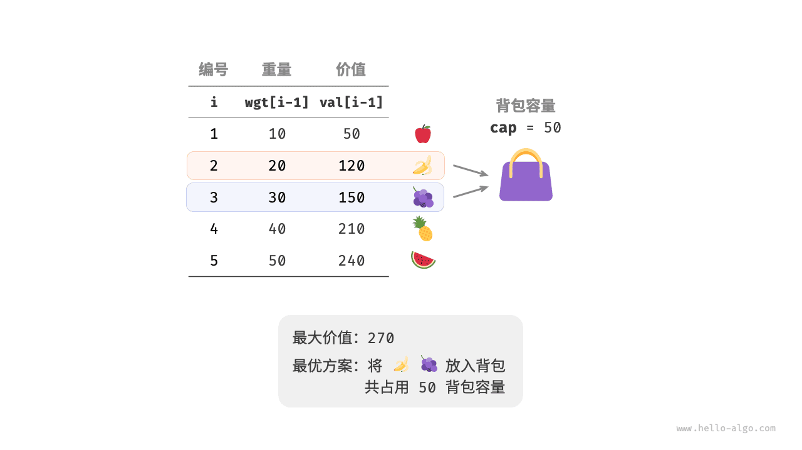

我们可以将 0-1 背包问题看作一个由 $n$ 轮决策组成的过程，对于每个物体都有不放入和放入两种决策，因此该问题满足决策树模型。

该问题的目标是求解“在限定背包容量下能放入物品的最大价值”，因此较大概率是一个动态规划问题。

**第一步：思考每轮的决策，定义状态，从而得到 $dp$ 表**

对于每个物品来说，不放入背包，背包容量不变；放入背包，背包容量减小。由此可得状态定义：当前物品编号 $i$ 和背包容量 $c$ ，记为 $[i, c]$ 。

状态 $[i, c]$ 对应的子问题为：**前 $i$ 个物品在容量为 $c$ 的背包中的最大价值**，记为 $dp[i, c]$ 。

待求解的是 $dp[n, cap]$ ，因此需要一个尺寸为 $(n+1) \times (cap+1)$ 的二维 $dp$ 表。

**第二步：找出最优子结构，进而推导出状态转移方程**

当我们做出物品 $i$ 的决策后，剩余的是前 $i-1$ 个物品决策的子问题，可分为以下两种情况。

- **不放入物品 $i$** ：背包容量不变，状态变化为 $[i-1, c]$ 。
- **放入物品 $i$** ：背包容量减少 $wgt[i-1]$ ，价值增加 $val[i-1]$ ，状态变化为 $[i-1, c-wgt[i-1]]$ 。

上述分析向我们揭示了本题的最优子结构：**最大价值 $dp[i, c]$ 等于不放入物品 $i$ 和放入物品 $i$ 两种方案中价值更大的那一个**。由此可推导出状态转移方程：

$$
dp[i, c] = \max(dp[i-1, c], dp[i-1, c - wgt[i-1]] + val[i-1])
$$

需要注意的是，若当前物品重量 $wgt[i - 1]$ 超出剩余背包容量 $c$ ，则只能选择不放入背包。

**第三步：确定边界条件和状态转移顺序**

当无物品或背包容量为 $0$ 时最大价值为 $0$ ，即首列 $dp[i, 0]$ 和首行 $dp[0, c]$ 都等于 $0$ 。

当前状态 $[i, c]$ 从上方的状态 $[i-1, c]$ 和左上方的状态 $[i-1, c-wgt[i-1]]$ 转移而来，因此通过两层循环正序遍历整个 $dp$ 表即可。

根据以上分析，我们接下来按顺序实现暴力搜索、记忆化搜索、动态规划解法。

### 方法一：暴力搜索

搜索代码包含以下要素。

- **递归参数**：状态 $[i, c]$ 。
- **返回值**：子问题的解 $dp[i, c]$ 。
- **终止条件**：当物品编号越界 $i = 0$ 或背包剩余容量为 $0$ 时，终止递归并返回价值 $0$ 。
- **剪枝**：若当前物品重量超出背包剩余容量，则只能选择不放入背包。

```python
def knapsack_dfs(wgt: list[int], val: list[int], i: int, c: int) -> int:
    """0-1 背包：暴力搜索"""
    # 若已选完所有物品或背包无剩余容量，则返回价值 0
    if i == 0 or c == 0:
        return 0
    # 若超过背包容量，则只能选择不放入背包
    if wgt[i - 1] > c:
        return knapsack_dfs(wgt, val, i - 1, c)
    # 计算不放入和放入物品 i 的最大价值
    no = knapsack_dfs(wgt, val, i - 1, c)
    yes = knapsack_dfs(wgt, val, i - 1, c - wgt[i - 1]) + val[i - 1]
    # 返回两种方案中价值更大的那一个
    return max(no, yes)
```

!!! example [pythontutor "可视化运行"](https://pythontutor.com/iframe-embed.html#code=def%20knapsack_dfs%28wgt%3A%20list%5Bint%5D,%20val%3A%20list%5Bint%5D,%20i%3A%20int,%20c%3A%20int%29%20-%3E%20int%3A%0A%20%20%20%20%22%22%220-1%20%E8%83%8C%E5%8C%85%EF%BC%9A%E6%9A%B4%E5%8A%9B%E6%90%9C%E7%B4%A2%22%22%22%0A%20%20%20%20%23%20%E8%8B%A5%E5%B7%B2%E9%80%89%E5%AE%8C%E6%89%80%E6%9C%89%E7%89%A9%E5%93%81%E6%88%96%E8%83%8C%E5%8C%85%E6%97%A0%E5%89%A9%E4%BD%99%E5%AE%B9%E9%87%8F%EF%BC%8C%E5%88%99%E8%BF%94%E5%9B%9E%E4%BB%B7%E5%80%BC%200%0A%20%20%20%20if%20i%20%3D%3D%200%20or%20c%20%3D%3D%200%3A%0A%20%20%20%20%20%20%20%20return%200%0A%20%20%20%20%23%20%E8%8B%A5%E8%B6%85%E8%BF%87%E8%83%8C%E5%8C%85%E5%AE%B9%E9%87%8F%EF%BC%8C%E5%88%99%E5%8F%AA%E8%83%BD%E9%80%89%E6%8B%A9%E4%B8%8D%E6%94%BE%E5%85%A5%E8%83%8C%E5%8C%85%0A%20%20%20%20if%20wgt%5Bi%20-%201%5D%20%3E%20c%3A%0A%20%20%20%20%20%20%20%20return%20knapsack_dfs%28wgt,%20val,%20i%20-%201,%20c%29%0A%20%20%20%20%23%20%E8%AE%A1%E7%AE%97%E4%B8%8D%E6%94%BE%E5%85%A5%E5%92%8C%E6%94%BE%E5%85%A5%E7%89%A9%E5%93%81%20i%20%E7%9A%84%E6%9C%80%E5%A4%A7%E4%BB%B7%E5%80%BC%0A%20%20%20%20no%20%3D%20knapsack_dfs%28wgt,%20val,%20i%20-%201,%20c%29%0A%20%20%20%20yes%20%3D%20knapsack_dfs%28wgt,%20val,%20i%20-%201,%20c%20-%20wgt%5Bi%20-%201%5D%29%20%2B%20val%5Bi%20-%201%5D%0A%20%20%20%20%23%20%E8%BF%94%E5%9B%9E%E4%B8%A4%E7%A7%8D%E6%96%B9%E6%A1%88%E4%B8%AD%E4%BB%B7%E5%80%BC%E6%9B%B4%E5%A4%A7%E7%9A%84%E9%82%A3%E4%B8%80%E4%B8%AA%0A%20%20%20%20return%20max%28no,%20yes%29%0A%0A%0A%22%22%22Driver%20Code%22%22%22%0Aif%20__name__%20%3D%3D%20%22__main__%22%3A%0A%20%20%20%20wgt%20%3D%20%5B10,%2020,%2030,%2040,%2050%5D%0A%20%20%20%20val%20%3D%20%5B50,%20120,%20150,%20210,%20240%5D%0A%20%20%20%20cap%20%3D%2050%0A%20%20%20%20n%20%3D%20len%28wgt%29%0A%0A%20%20%20%20%23%20%E6%9A%B4%E5%8A%9B%E6%90%9C%E7%B4%A2%0A%20%20%20%20res%20%3D%20knapsack_dfs%28wgt,%20val,%20n,%20cap%29%0A%20%20%20%20print%28f%22%E4%B8%8D%E8%B6%85%E8%BF%87%E8%83%8C%E5%8C%85%E5%AE%B9%E9%87%8F%E7%9A%84%E6%9C%80%E5%A4%A7%E7%89%A9%E5%93%81%E4%BB%B7%E5%80%BC%E4%B8%BA%20%7Bres%7D%22%29&codeDivHeight=800&codeDivWidth=600&cumulative=false&curInstr=7&heapPrimitives=nevernest&origin=opt-frontend.js&py=311&rawInputLstJSON=%5B%5D&textReferences=false)

如下图所示，由于每个物品都会产生不选和选两条搜索分支，因此时间复杂度为 $O(2^n)$ 。

观察递归树，容易发现其中存在重叠子问题，例如 $dp[1, 10]$ 等。而当物品较多、背包容量较大，尤其是相同重量的物品较多时，重叠子问题的数量将会大幅增多。

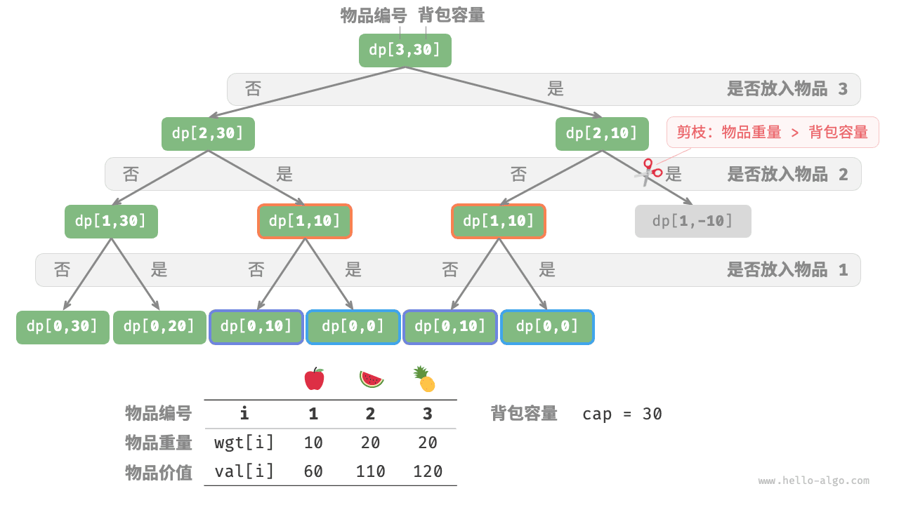

### 方法二：记忆化搜索

为了保证重叠子问题只被计算一次，我们借助记忆列表 `mem` 来记录子问题的解，其中 `mem[i][c]` 对应 $dp[i, c]$ 。

引入记忆化之后，**时间复杂度取决于子问题数量**，也就是 $O(n \times cap)$ 。实现代码如下：

```python
def knapsack_dfs_mem(
    wgt: list[int], val: list[int], mem: list[list[int]], i: int, c: int
) -> int:
    """0-1 背包：记忆化搜索"""
    # 若已选完所有物品或背包无剩余容量，则返回价值 0
    if i == 0 or c == 0:
        return 0
    # 若已有记录，则直接返回
    if mem[i][c] != -1:
        return mem[i][c]
    # 若超过背包容量，则只能选择不放入背包
    if wgt[i - 1] > c:
        return knapsack_dfs_mem(wgt, val, mem, i - 1, c)
    # 计算不放入和放入物品 i 的最大价值
    no = knapsack_dfs_mem(wgt, val, mem, i - 1, c)
    yes = knapsack_dfs_mem(wgt, val, mem, i - 1, c - wgt[i - 1]) + val[i - 1]
    # 记录并返回两种方案中价值更大的那一个
    mem[i][c] = max(no, yes)
    return mem[i][c]
```

!!! example [pythontutor "可视化运行"](https://pythontutor.com/iframe-embed.html#code=def%20knapsack_dfs_mem%28%0A%20%20%20%20wgt%3A%20list%5Bint%5D,%20val%3A%20list%5Bint%5D,%20mem%3A%20list%5Blist%5Bint%5D%5D,%20i%3A%20int,%20c%3A%20int%0A%29%20-%3E%20int%3A%0A%20%20%20%20%22%22%220-1%20%E8%83%8C%E5%8C%85%EF%BC%9A%E8%AE%B0%E5%BF%86%E5%8C%96%E6%90%9C%E7%B4%A2%22%22%22%0A%20%20%20%20%23%20%E8%8B%A5%E5%B7%B2%E9%80%89%E5%AE%8C%E6%89%80%E6%9C%89%E7%89%A9%E5%93%81%E6%88%96%E8%83%8C%E5%8C%85%E6%97%A0%E5%89%A9%E4%BD%99%E5%AE%B9%E9%87%8F%EF%BC%8C%E5%88%99%E8%BF%94%E5%9B%9E%E4%BB%B7%E5%80%BC%200%0A%20%20%20%20if%20i%20%3D%3D%200%20or%20c%20%3D%3D%200%3A%0A%20%20%20%20%20%20%20%20return%200%0A%20%20%20%20%23%20%E8%8B%A5%E5%B7%B2%E6%9C%89%E8%AE%B0%E5%BD%95%EF%BC%8C%E5%88%99%E7%9B%B4%E6%8E%A5%E8%BF%94%E5%9B%9E%0A%20%20%20%20if%20mem%5Bi%5D%5Bc%5D%20!%3D%20-1%3A%0A%20%20%20%20%20%20%20%20return%20mem%5Bi%5D%5Bc%5D%0A%20%20%20%20%23%20%E8%8B%A5%E8%B6%85%E8%BF%87%E8%83%8C%E5%8C%85%E5%AE%B9%E9%87%8F%EF%BC%8C%E5%88%99%E5%8F%AA%E8%83%BD%E9%80%89%E6%8B%A9%E4%B8%8D%E6%94%BE%E5%85%A5%E8%83%8C%E5%8C%85%0A%20%20%20%20if%20wgt%5Bi%20-%201%5D%20%3E%20c%3A%0A%20%20%20%20%20%20%20%20return%20knapsack_dfs_mem%28wgt,%20val,%20mem,%20i%20-%201,%20c%29%0A%20%20%20%20%23%20%E8%AE%A1%E7%AE%97%E4%B8%8D%E6%94%BE%E5%85%A5%E5%92%8C%E6%94%BE%E5%85%A5%E7%89%A9%E5%93%81%20i%20%E7%9A%84%E6%9C%80%E5%A4%A7%E4%BB%B7%E5%80%BC%0A%20%20%20%20no%20%3D%20knapsack_dfs_mem%28wgt,%20val,%20mem,%20i%20-%201,%20c%29%0A%20%20%20%20yes%20%3D%20knapsack_dfs_mem%28wgt,%20val,%20mem,%20i%20-%201,%20c%20-%20wgt%5Bi%20-%201%5D%29%20%2B%20val%5Bi%20-%201%5D%0A%20%20%20%20%23%20%E8%AE%B0%E5%BD%95%E5%B9%B6%E8%BF%94%E5%9B%9E%E4%B8%A4%E7%A7%8D%E6%96%B9%E6%A1%88%E4%B8%AD%E4%BB%B7%E5%80%BC%E6%9B%B4%E5%A4%A7%E7%9A%84%E9%82%A3%E4%B8%80%E4%B8%AA%0A%20%20%20%20mem%5Bi%5D%5Bc%5D%20%3D%20max%28no,%20yes%29%0A%20%20%20%20return%20mem%5Bi%5D%5Bc%5D%0A%0A%0A%22%22%22Driver%20Code%22%22%22%0Aif%20__name__%20%3D%3D%20%22__main__%22%3A%0A%20%20%20%20wgt%20%3D%20%5B10,%2020,%2030,%2040,%2050%5D%0A%20%20%20%20val%20%3D%20%5B50,%20120,%20150,%20210,%20240%5D%0A%20%20%20%20cap%20%3D%2050%0A%20%20%20%20n%20%3D%20len%28wgt%29%0A%0A%20%20%20%20%23%20%E8%AE%B0%E5%BF%86%E5%8C%96%E6%90%9C%E7%B4%A2%0A%20%20%20%20mem%20%3D%20%5B%5B-1%5D%20*%20%28cap%20%2B%201%29%20for%20_%20in%20range%28n%20%2B%201%29%5D%0A%20%20%20%20res%20%3D%20knapsack_dfs_mem%28wgt,%20val,%20mem,%20n,%20cap%29%0A%20%20%20%20print%28f%22%E4%B8%8D%E8%B6%85%E8%BF%87%E8%83%8C%E5%8C%85%E5%AE%B9%E9%87%8F%E7%9A%84%E6%9C%80%E5%A4%A7%E7%89%A9%E5%93%81%E4%BB%B7%E5%80%BC%E4%B8%BA%20%7Bres%7D%22%29&codeDivHeight=800&codeDivWidth=600&cumulative=false&curInstr=20&heapPrimitives=nevernest&origin=opt-frontend.js&py=311&rawInputLstJSON=%5B%5D&textReferences=false)

下图展示了在记忆化搜索中被剪掉的搜索分支。

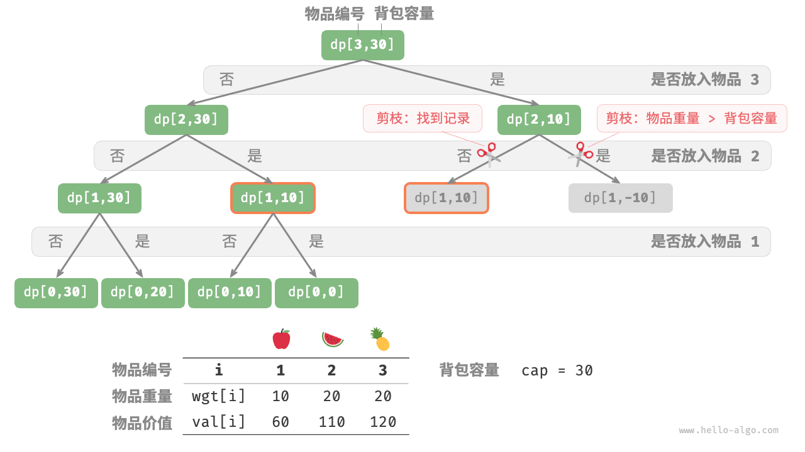

### 方法三：动态规划

动态规划实质上就是在状态转移中填充 $dp$ 表的过程，代码如下所示：

```python
def knapsack_dp(wgt: list[int], val: list[int], cap: int) -> int:
    """0-1 背包：动态规划"""
    n = len(wgt)
    # 初始化 dp 表
    dp = [[0] * (cap + 1) for _ in range(n + 1)]
    # 状态转移
    for i in range(1, n + 1):
        for c in range(1, cap + 1):
            if wgt[i - 1] > c:
                # 若超过背包容量，则不选物品 i
                dp[i][c] = dp[i - 1][c]
            else:
                # 不选和选物品 i 这两种方案的较大值
                dp[i][c] = max(dp[i - 1][c], dp[i - 1][c - wgt[i - 1]] + val[i - 1])
    return dp[n][cap]
```

!!! example [pythontutor "可视化运行"](https://pythontutor.com/iframe-embed.html#code=def%20knapsack_dp%28wgt%3A%20list%5Bint%5D,%20val%3A%20list%5Bint%5D,%20cap%3A%20int%29%20-%3E%20int%3A%0A%20%20%20%20%22%22%220-1%20%E8%83%8C%E5%8C%85%EF%BC%9A%E5%8A%A8%E6%80%81%E8%A7%84%E5%88%92%22%22%22%0A%20%20%20%20n%20%3D%20len%28wgt%29%0A%20%20%20%20%23%20%E5%88%9D%E5%A7%8B%E5%8C%96%20dp%20%E8%A1%A8%0A%20%20%20%20dp%20%3D%20%5B%5B0%5D%20*%20%28cap%20%2B%201%29%20for%20_%20in%20range%28n%20%2B%201%29%5D%0A%20%20%20%20%23%20%E7%8A%B6%E6%80%81%E8%BD%AC%E7%A7%BB%0A%20%20%20%20for%20i%20in%20range%281,%20n%20%2B%201%29%3A%0A%20%20%20%20%20%20%20%20for%20c%20in%20range%281,%20cap%20%2B%201%29%3A%0A%20%20%20%20%20%20%20%20%20%20%20%20if%20wgt%5Bi%20-%201%5D%20%3E%20c%3A%0A%20%20%20%20%20%20%20%20%20%20%20%20%20%20%20%20%23%20%E8%8B%A5%E8%B6%85%E8%BF%87%E8%83%8C%E5%8C%85%E5%AE%B9%E9%87%8F%EF%BC%8C%E5%88%99%E4%B8%8D%E9%80%89%E7%89%A9%E5%93%81%20i%0A%20%20%20%20%20%20%20%20%20%20%20%20%20%20%20%20dp%5Bi%5D%5Bc%5D%20%3D%20dp%5Bi%20-%201%5D%5Bc%5D%0A%20%20%20%20%20%20%20%20%20%20%20%20else%3A%0A%20%20%20%20%20%20%20%20%20%20%20%20%20%20%20%20%23%20%E4%B8%8D%E9%80%89%E5%92%8C%E9%80%89%E7%89%A9%E5%93%81%20i%20%E8%BF%99%E4%B8%A4%E7%A7%8D%E6%96%B9%E6%A1%88%E7%9A%84%E8%BE%83%E5%A4%A7%E5%80%BC%0A%20%20%20%20%20%20%20%20%20%20%20%20%20%20%20%20dp%5Bi%5D%5Bc%5D%20%3D%20max%28dp%5Bi%20-%201%5D%5Bc%5D,%20dp%5Bi%20-%201%5D%5Bc%20-%20wgt%5Bi%20-%201%5D%5D%20%2B%20val%5Bi%20-%201%5D%29%0A%20%20%20%20return%20dp%5Bn%5D%5Bcap%5D%0A%0A%0A%22%22%22Driver%20Code%22%22%22%0Aif%20__name__%20%3D%3D%20%22__main__%22%3A%0A%20%20%20%20wgt%20%3D%20%5B10,%2020,%2030,%2040,%2050%5D%0A%20%20%20%20val%20%3D%20%5B50,%20120,%20150,%20210,%20240%5D%0A%20%20%20%20cap%20%3D%2050%0A%20%20%20%20n%20%3D%20len%28wgt%29%0A%0A%20%20%20%20%23%20%E5%8A%A8%E6%80%81%E8%A7%84%E5%88%92%0A%20%20%20%20res%20%3D%20knapsack_dp%28wgt,%20val,%20cap%29%0A%20%20%20%20print%28f%22%E4%B8%8D%E8%B6%85%E8%BF%87%E8%83%8C%E5%8C%85%E5%AE%B9%E9%87%8F%E7%9A%84%E6%9C%80%E5%A4%A7%E7%89%A9%E5%93%81%E4%BB%B7%E5%80%BC%E4%B8%BA%20%7Bres%7D%22%29&codeDivHeight=800&codeDivWidth=600&cumulative=false&curInstr=7&heapPrimitives=nevernest&origin=opt-frontend.js&py=311&rawInputLstJSON=%5B%5D&textReferences=false)

如下图所示，时间复杂度和空间复杂度都由数组 `dp` 大小决定，即 $O(n \times cap)$ 。

=== "<1>"
    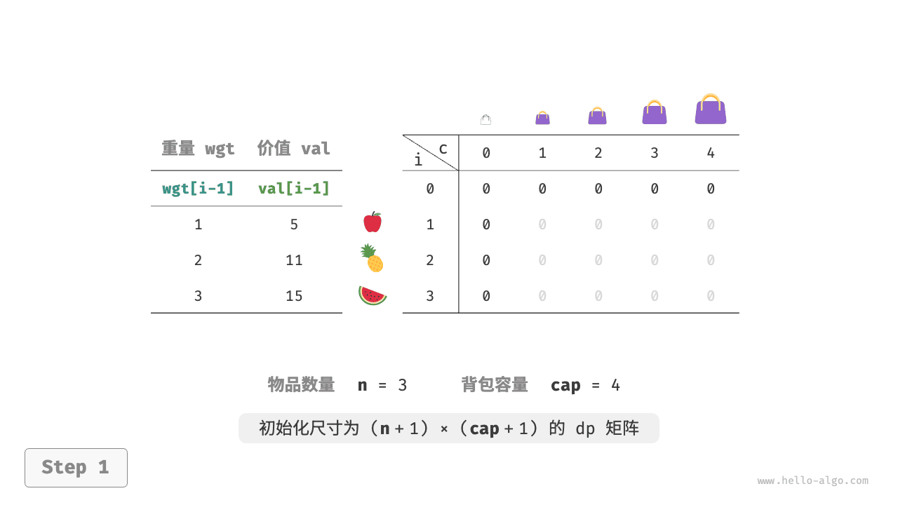

=== "<2>"
    

=== "<3>"
    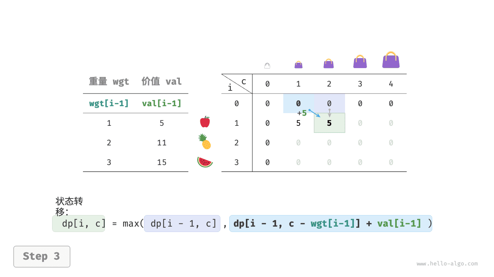

=== "<4>"
    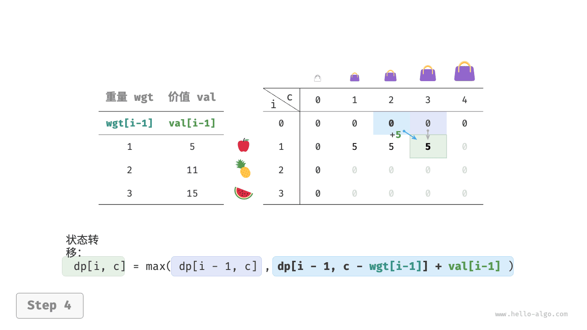

=== "<5>"
    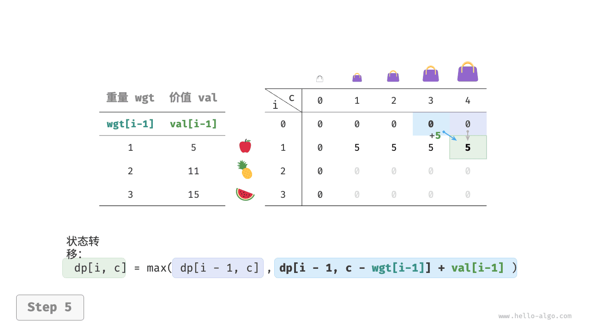

=== "<6>"
    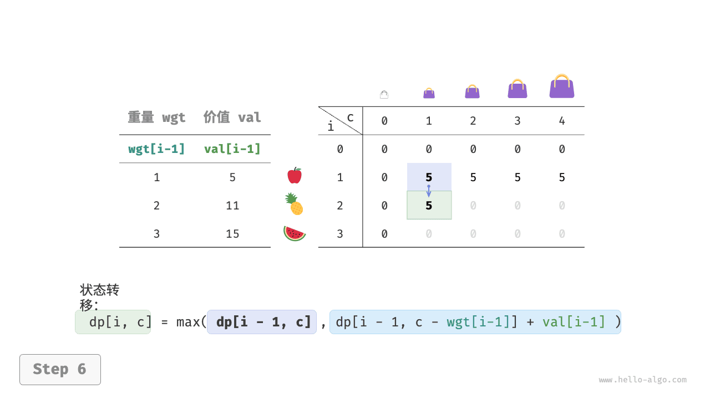

=== "<7>"
    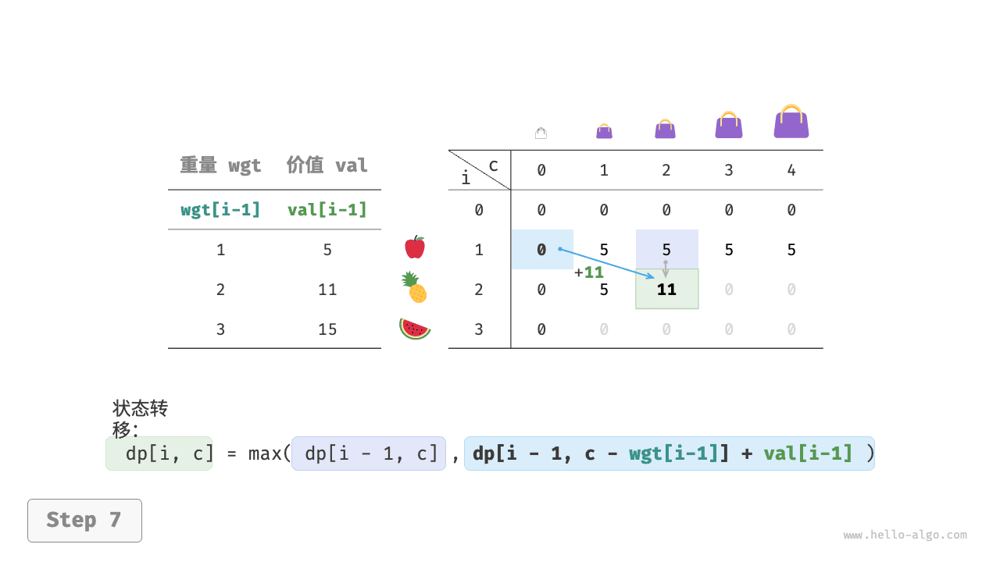

=== "<8>"
    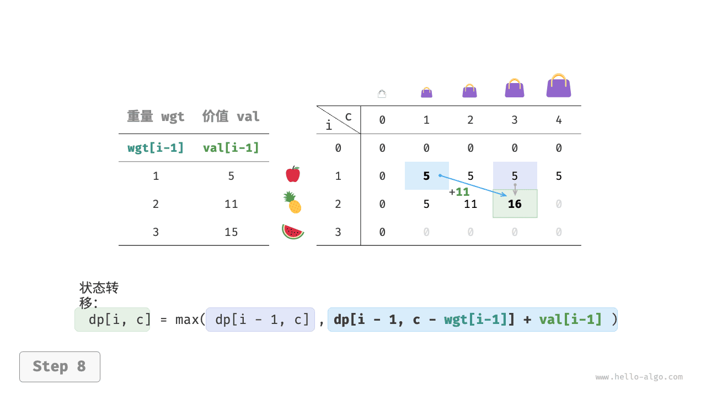

=== "<9>"
    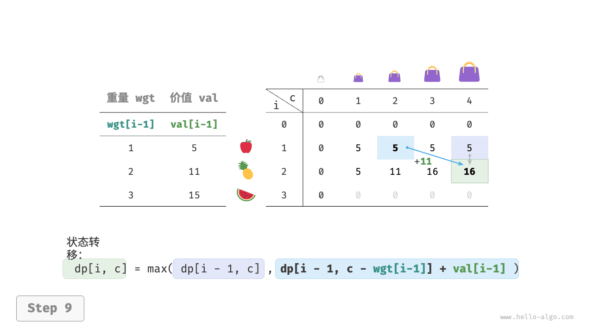

=== "<10>"
    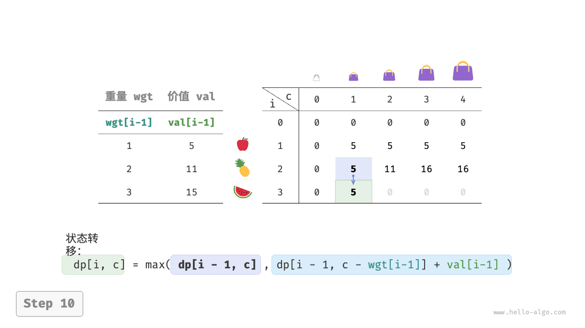

=== "<11>"
    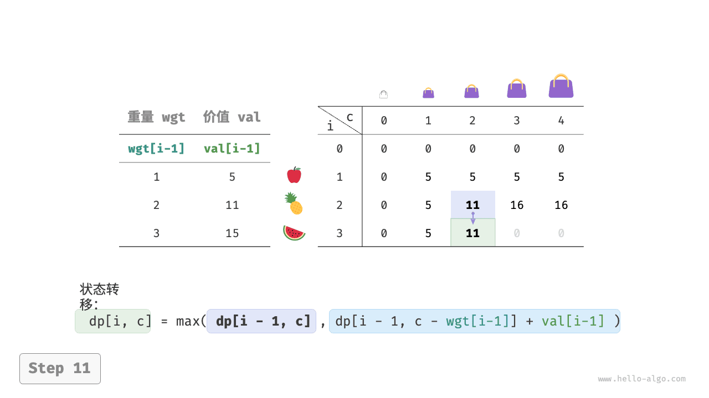

=== "<12>"
    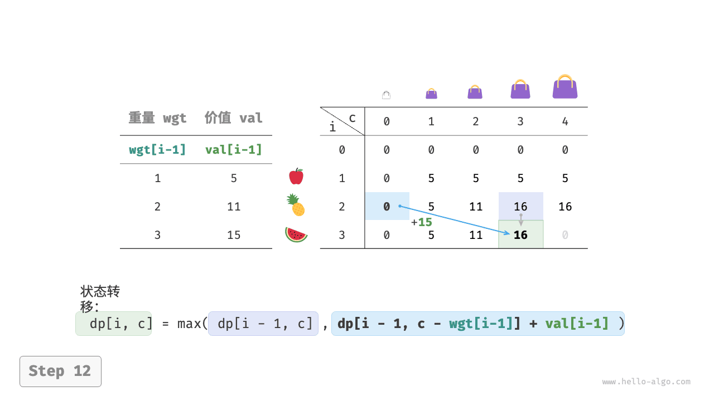

=== "<13>"
    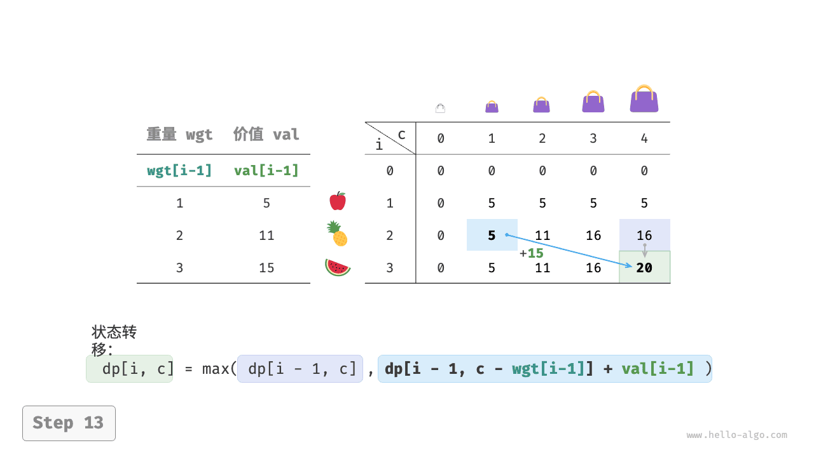

=== "<14>"
    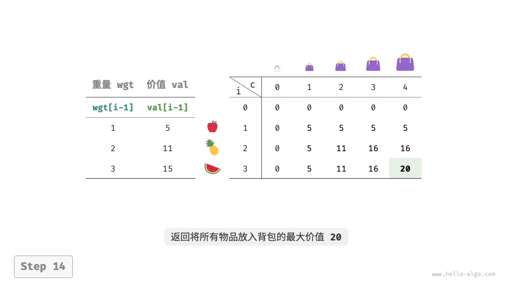

### 空间优化

由于每个状态都只与其上一行的状态有关，因此我们可以使用两个数组滚动前进，将空间复杂度从 $O(n^2)$ 降至 $O(n)$ 。

进一步思考，我们能否仅用一个数组实现空间优化呢？观察可知，每个状态都是由正上方或左上方的格子转移过来的。假设只有一个数组，当开始遍历第 $i$ 行时，该数组存储的仍然是第 $i-1$ 行的状态。

- 如果采取正序遍历，那么遍历到 $dp[i, j]$ 时，左上方 $dp[i-1, 1]$ ~ $dp[i-1, j-1]$ 值可能已经被覆盖，此时就无法得到正确的状态转移结果。
- 如果采取倒序遍历，则不会发生覆盖问题，状态转移可以正确进行。

下图展示了在单个数组下从第 $i = 1$ 行转换至第 $i = 2$ 行的过程。请思考正序遍历和倒序遍历的区别。

=== "<1>"
    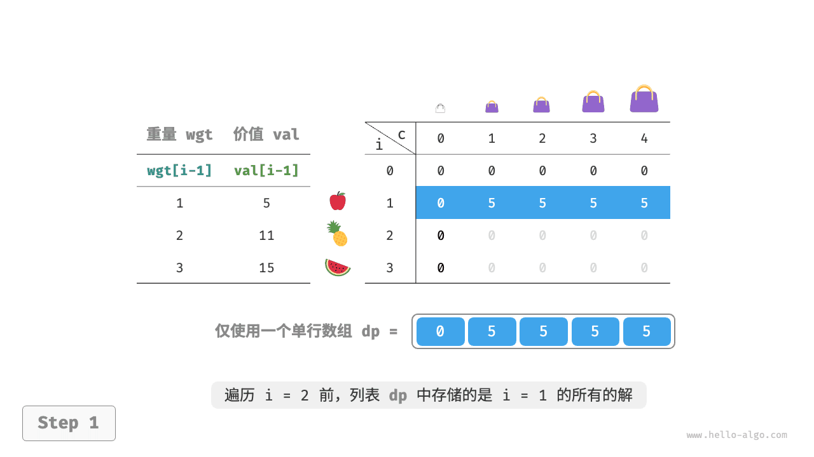

=== "<2>"
    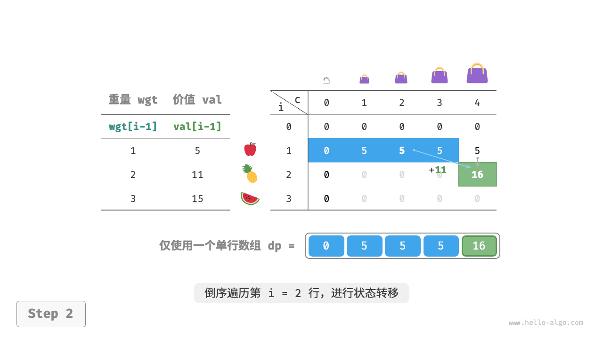

=== "<3>"
    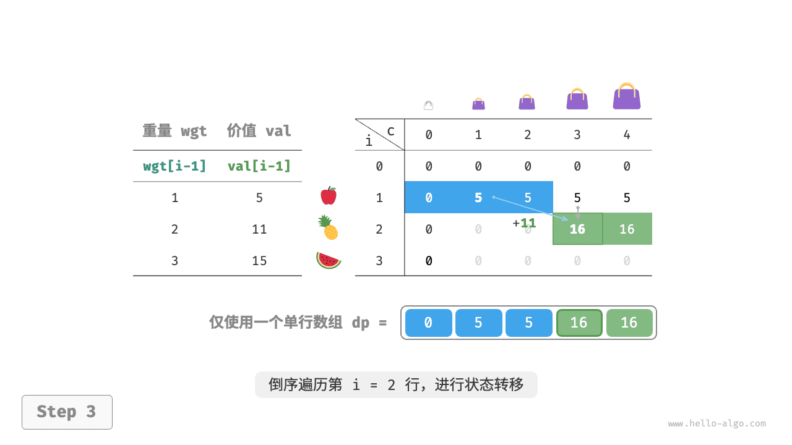

=== "<4>"
    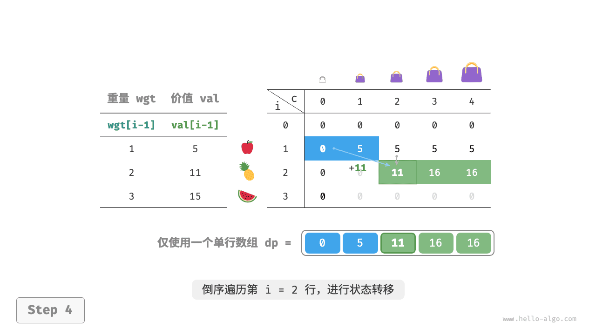

=== "<5>"
    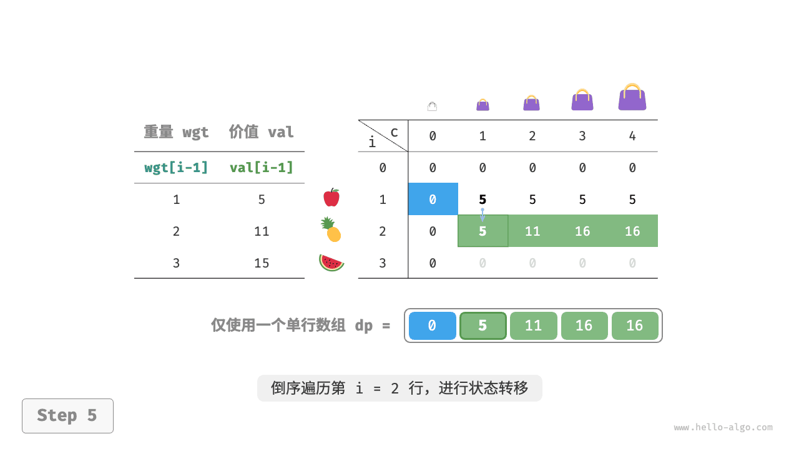

=== "<6>"
    

在代码实现中，我们仅需将数组 `dp` 的第一维 $i$ 直接删除，并且把内循环更改为倒序遍历即可：

```python
def knapsack_dp_comp(wgt: list[int], val: list[int], cap: int) -> int:
    """0-1 背包：空间优化后的动态规划"""
    n = len(wgt)
    # 初始化 dp 表
    dp = [0] * (cap + 1)
    # 状态转移
    for i in range(1, n + 1):
        # 倒序遍历
        for c in range(cap, 0, -1):
            if wgt[i - 1] > c:
                # 若超过背包容量，则不选物品 i
                dp[c] = dp[c]
            else:
                # 不选和选物品 i 这两种方案的较大值
                dp[c] = max(dp[c], dp[c - wgt[i - 1]] + val[i - 1])
    return dp[cap]
```

!!! example [pythontutor "可视化运行"](https://pythontutor.com/iframe-embed.html#code=def%20knapsack_dp_comp%28wgt%3A%20list%5Bint%5D,%20val%3A%20list%5Bint%5D,%20cap%3A%20int%29%20-%3E%20int%3A%0A%20%20%20%20%22%22%220-1%20%E8%83%8C%E5%8C%85%EF%BC%9A%E7%A9%BA%E9%97%B4%E4%BC%98%E5%8C%96%E5%90%8E%E7%9A%84%E5%8A%A8%E6%80%81%E8%A7%84%E5%88%92%22%22%22%0A%20%20%20%20n%20%3D%20len%28wgt%29%0A%20%20%20%20%23%20%E5%88%9D%E5%A7%8B%E5%8C%96%20dp%20%E8%A1%A8%0A%20%20%20%20dp%20%3D%20%5B0%5D%20*%20%28cap%20%2B%201%29%0A%20%20%20%20%23%20%E7%8A%B6%E6%80%81%E8%BD%AC%E7%A7%BB%0A%20%20%20%20for%20i%20in%20range%281,%20n%20%2B%201%29%3A%0A%20%20%20%20%20%20%20%20%23%20%E5%80%92%E5%BA%8F%E9%81%8D%E5%8E%86%0A%20%20%20%20%20%20%20%20for%20c%20in%20range%28cap,%200,%20-1%29%3A%0A%20%20%20%20%20%20%20%20%20%20%20%20if%20wgt%5Bi%20-%201%5D%20%3E%20c%3A%0A%20%20%20%20%20%20%20%20%20%20%20%20%20%20%20%20%23%20%E8%8B%A5%E8%B6%85%E8%BF%87%E8%83%8C%E5%8C%85%E5%AE%B9%E9%87%8F%EF%BC%8C%E5%88%99%E4%B8%8D%E9%80%89%E7%89%A9%E5%93%81%20i%0A%20%20%20%20%20%20%20%20%20%20%20%20%20%20%20%20dp%5Bc%5D%20%3D%20dp%5Bc%5D%0A%20%20%20%20%20%20%20%20%20%20%20%20else%3A%0A%20%20%20%20%20%20%20%20%20%20%20%20%20%20%20%20%23%20%E4%B8%8D%E9%80%89%E5%92%8C%E9%80%89%E7%89%A9%E5%93%81%20i%20%E8%BF%99%E4%B8%A4%E7%A7%8D%E6%96%B9%E6%A1%88%E7%9A%84%E8%BE%83%E5%A4%A7%E5%80%BC%0A%20%20%20%20%20%20%20%20%20%20%20%20%20%20%20%20dp%5Bc%5D%20%3D%20max%28dp%5Bc%5D,%20dp%5Bc%20-%20wgt%5Bi%20-%201%5D%5D%20%2B%20val%5Bi%20-%201%5D%29%0A%20%20%20%20return%20dp%5Bcap%5D%0A%0A%0A%22%22%22Driver%20Code%22%22%22%0Aif%20__name__%20%3D%3D%20%22__main__%22%3A%0A%20%20%20%20wgt%20%3D%20%5B10,%2020,%2030,%2040,%2050%5D%0A%20%20%20%20val%20%3D%20%5B50,%20120,%20150,%20210,%20240%5D%0A%20%20%20%20cap%20%3D%2050%0A%20%20%20%20n%20%3D%20len%28wgt%29%0A%0A%20%20%20%20%23%20%E7%A9%BA%E9%97%B4%E4%BC%98%E5%8C%96%E5%90%8E%E7%9A%84%E5%8A%A8%E6%80%81%E8%A7%84%E5%88%92%0A%20%20%20%20res%20%3D%20knapsack_dp_comp%28wgt,%20val,%20cap%29%0A%20%20%20%20print%28f%22%E4%B8%8D%E8%B6%85%E8%BF%87%E8%83%8C%E5%8C%85%E5%AE%B9%E9%87%8F%E7%9A%84%E6%9C%80%E5%A4%A7%E7%89%A9%E5%93%81%E4%BB%B7%E5%80%BC%E4%B8%BA%20%7Bres%7D%22%29&codeDivHeight=800&codeDivWidth=600&cumulative=false&curInstr=7&heapPrimitives=nevernest&origin=opt-frontend.js&py=311&rawInputLstJSON=%5B%5D&textReferences=false)

# 完全背包问题

在本节中，我们先求解另一个常见的背包问题：完全背包，再了解它的一种特例：零钱兑换。

## 完全背包问题

!!! question

    给定 $n$ 个物品，第 $i$ 个物品的重量为 $wgt[i-1]$、价值为 $val[i-1]$ ，和一个容量为 $cap$ 的背包。**每个物品可以重复选取**，问在限定背包容量下能放入物品的最大价值。示例如下图所示。


### 动态规划思路

完全背包问题和 0-1 背包问题非常相似，**区别仅在于不限制物品的选择次数**。

- 在 0-1 背包问题中，每种物品只有一个，因此将物品 $i$ 放入背包后，只能从前 $i-1$ 个物品中选择。
- 在完全背包问题中，每种物品的数量是无限的，因此将物品 $i$ 放入背包后，**仍可以从前 $i$ 个物品中选择**。

在完全背包问题的规定下，状态 $[i, c]$ 的变化分为两种情况。

- **不放入物品 $i$** ：与 0-1 背包问题相同，转移至 $[i-1, c]$ 。
- **放入物品 $i$** ：与 0-1 背包问题不同，转移至 $[i, c-wgt[i-1]]$ 。

从而状态转移方程变为：

$$
dp[i, c] = \max(dp[i-1, c], dp[i, c - wgt[i-1]] + val[i-1])
$$

### 代码实现

对比两道题目的代码，状态转移中有一处从 $i-1$ 变为 $i$ ，其余完全一致：

```python
def unbounded_knapsack_dp(wgt: list[int], val: list[int], cap: int) -> int:
    """完全背包：动态规划"""
    n = len(wgt)
    # 初始化 dp 表
    dp = [[0] * (cap + 1) for _ in range(n + 1)]
    # 状态转移
    for i in range(1, n + 1):
        for c in range(1, cap + 1):
            if wgt[i - 1] > c:
                # 若超过背包容量，则不选物品 i
                dp[i][c] = dp[i - 1][c]
            else:
                # 不选和选物品 i 这两种方案的较大值
                dp[i][c] = max(dp[i - 1][c], dp[i][c - wgt[i - 1]] + val[i - 1])
    return dp[n][cap]
```

!!! example [pythontutor "可视化运行"](https://pythontutor.com/iframe-embed.html#code=def%20unbounded_knapsack_dp%28wgt%3A%20list%5Bint%5D,%20val%3A%20list%5Bint%5D,%20cap%3A%20int%29%20-%3E%20int%3A%0A%20%20%20%20%22%22%22%E5%AE%8C%E5%85%A8%E8%83%8C%E5%8C%85%EF%BC%9A%E5%8A%A8%E6%80%81%E8%A7%84%E5%88%92%22%22%22%0A%20%20%20%20n%20%3D%20len%28wgt%29%0A%20%20%20%20%23%20%E5%88%9D%E5%A7%8B%E5%8C%96%20dp%20%E8%A1%A8%0A%20%20%20%20dp%20%3D%20%5B%5B0%5D%20*%20%28cap%20%2B%201%29%20for%20_%20in%20range%28n%20%2B%201%29%5D%0A%20%20%20%20%23%20%E7%8A%B6%E6%80%81%E8%BD%AC%E7%A7%BB%0A%20%20%20%20for%20i%20in%20range%281,%20n%20%2B%201%29%3A%0A%20%20%20%20%20%20%20%20for%20c%20in%20range%281,%20cap%20%2B%201%29%3A%0A%20%20%20%20%20%20%20%20%20%20%20%20if%20wgt%5Bi%20-%201%5D%20%3E%20c%3A%0A%20%20%20%20%20%20%20%20%20%20%20%20%20%20%20%20%23%20%E8%8B%A5%E8%B6%85%E8%BF%87%E8%83%8C%E5%8C%85%E5%AE%B9%E9%87%8F%EF%BC%8C%E5%88%99%E4%B8%8D%E9%80%89%E7%89%A9%E5%93%81%20i%0A%20%20%20%20%20%20%20%20%20%20%20%20%20%20%20%20dp%5Bi%5D%5Bc%5D%20%3D%20dp%5Bi%20-%201%5D%5Bc%5D%0A%20%20%20%20%20%20%20%20%20%20%20%20else%3A%0A%20%20%20%20%20%20%20%20%20%20%20%20%20%20%20%20%23%20%E4%B8%8D%E9%80%89%E5%92%8C%E9%80%89%E7%89%A9%E5%93%81%20i%20%E8%BF%99%E4%B8%A4%E7%A7%8D%E6%96%B9%E6%A1%88%E7%9A%84%E8%BE%83%E5%A4%A7%E5%80%BC%0A%20%20%20%20%20%20%20%20%20%20%20%20%20%20%20%20dp%5Bi%5D%5Bc%5D%20%3D%20max%28dp%5Bi%20-%201%5D%5Bc%5D,%20dp%5Bi%5D%5Bc%20-%20wgt%5Bi%20-%201%5D%5D%20%2B%20val%5Bi%20-%201%5D%29%0A%20%20%20%20return%20dp%5Bn%5D%5Bcap%5D%0A%0A%0A%22%22%22Driver%20Code%22%22%22%0Aif%20__name__%20%3D%3D%20%22__main__%22%3A%0A%20%20%20%20wgt%20%3D%20%5B1,%202,%203%5D%0A%20%20%20%20val%20%3D%20%5B5,%2011,%2015%5D%0A%20%20%20%20cap%20%3D%204%0A%0A%20%20%20%20%23%20%E5%8A%A8%E6%80%81%E8%A7%84%E5%88%92%0A%20%20%20%20res%20%3D%20unbounded_knapsack_dp%28wgt,%20val,%20cap%29%0A%20%20%20%20print%28f%22%E4%B8%8D%E8%B6%85%E8%BF%87%E8%83%8C%E5%8C%85%E5%AE%B9%E9%87%8F%E7%9A%84%E6%9C%80%E5%A4%A7%E7%89%A9%E5%93%81%E4%BB%B7%E5%80%BC%E4%B8%BA%20%7Bres%7D%22%29&codeDivHeight=800&codeDivWidth=600&cumulative=false&curInstr=6&heapPrimitives=nevernest&origin=opt-frontend.js&py=311&rawInputLstJSON=%5B%5D&textReferences=false)

### 空间优化

由于当前状态是从左边和上边的状态转移而来的，**因此空间优化后应该对 $dp$ 表中的每一行进行正序遍历**。

这个遍历顺序与 0-1 背包正好相反。请借助下图来理解两者的区别。

=== "<1>"
    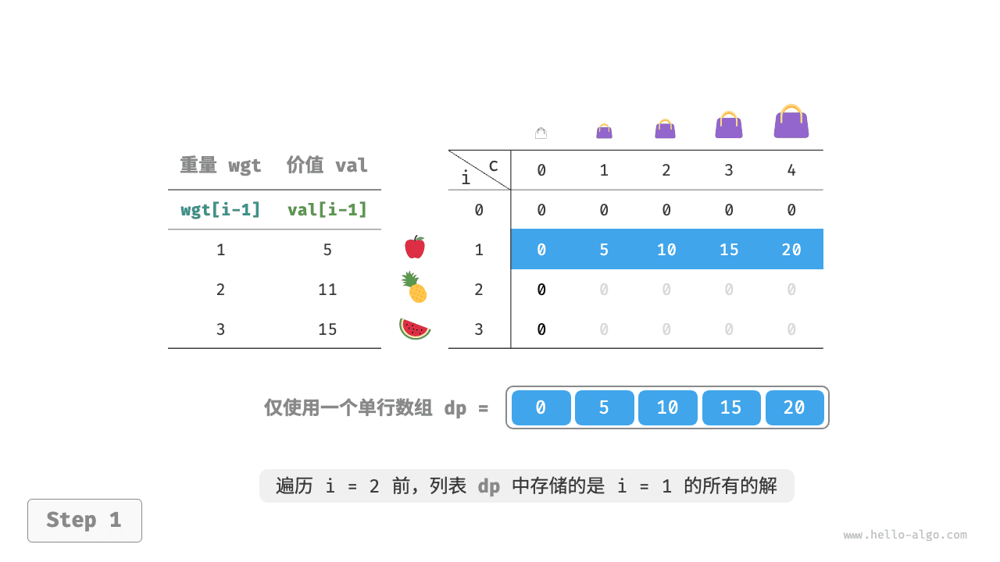

=== "<2>"
    

=== "<3>"
    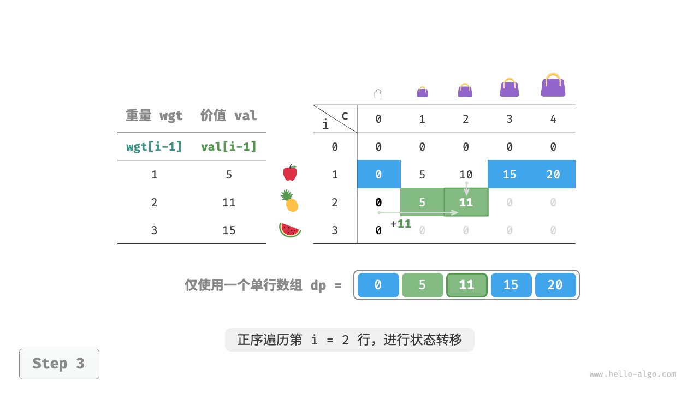

=== "<4>"
    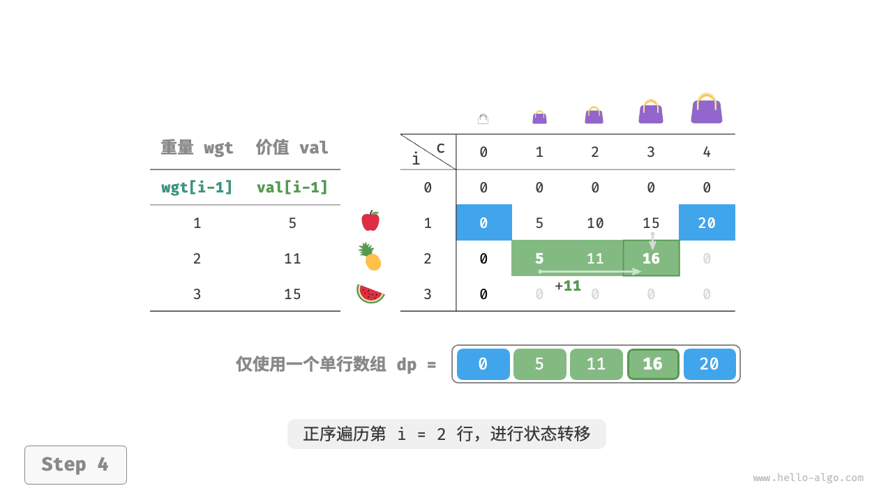

=== "<5>"
    

=== "<6>"
    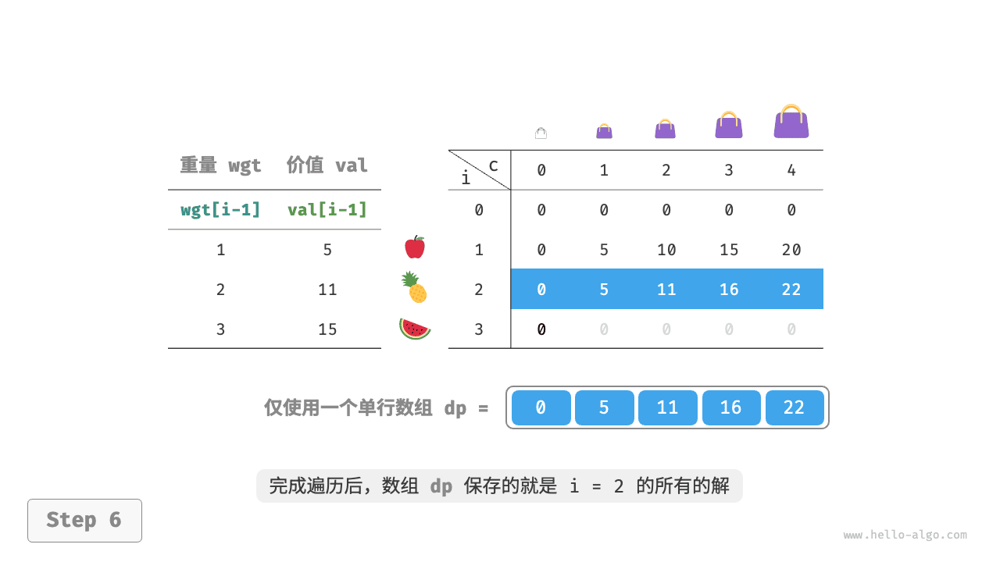

代码实现比较简单，仅需将数组 `dp` 的第一维删除：

```python
def unbounded_knapsack_dp_comp(wgt: list[int], val: list[int], cap: int) -> int:
    """完全背包：空间优化后的动态规划"""
    n = len(wgt)
    # 初始化 dp 表
    dp = [0] * (cap + 1)
    # 状态转移
    for i in range(1, n + 1):
        # 正序遍历
        for c in range(1, cap + 1):
            if wgt[i - 1] > c:
                # 若超过背包容量，则不选物品 i
                dp[c] = dp[c]
            else:
                # 不选和选物品 i 这两种方案的较大值
                dp[c] = max(dp[c], dp[c - wgt[i - 1]] + val[i - 1])
    return dp[cap]
```

!!! example [pythontutor "可视化运行"](https://pythontutor.com/iframe-embed.html#code=def%20unbounded_knapsack_dp_comp%28wgt%3A%20list%5Bint%5D,%20val%3A%20list%5Bint%5D,%20cap%3A%20int%29%20-%3E%20int%3A%0A%20%20%20%20%22%22%22%E5%AE%8C%E5%85%A8%E8%83%8C%E5%8C%85%EF%BC%9A%E7%A9%BA%E9%97%B4%E4%BC%98%E5%8C%96%E5%90%8E%E7%9A%84%E5%8A%A8%E6%80%81%E8%A7%84%E5%88%92%22%22%22%0A%20%20%20%20n%20%3D%20len%28wgt%29%0A%20%20%20%20%23%20%E5%88%9D%E5%A7%8B%E5%8C%96%20dp%20%E8%A1%A8%0A%20%20%20%20dp%20%3D%20%5B0%5D%20*%20%28cap%20%2B%201%29%0A%20%20%20%20%23%20%E7%8A%B6%E6%80%81%E8%BD%AC%E7%A7%BB%0A%20%20%20%20for%20i%20in%20range%281,%20n%20%2B%201%29%3A%0A%20%20%20%20%20%20%20%20%23%20%E6%AD%A3%E5%BA%8F%E9%81%8D%E5%8E%86%0A%20%20%20%20%20%20%20%20for%20c%20in%20range%281,%20cap%20%2B%201%29%3A%0A%20%20%20%20%20%20%20%20%20%20%20%20if%20wgt%5Bi%20-%201%5D%20%3E%20c%3A%0A%20%20%20%20%20%20%20%20%20%20%20%20%20%20%20%20%23%20%E8%8B%A5%E8%B6%85%E8%BF%87%E8%83%8C%E5%8C%85%E5%AE%B9%E9%87%8F%EF%BC%8C%E5%88%99%E4%B8%8D%E9%80%89%E7%89%A9%E5%93%81%20i%0A%20%20%20%20%20%20%20%20%20%20%20%20%20%20%20%20dp%5Bc%5D%20%3D%20dp%5Bc%5D%0A%20%20%20%20%20%20%20%20%20%20%20%20else%3A%0A%20%20%20%20%20%20%20%20%20%20%20%20%20%20%20%20%23%20%E4%B8%8D%E9%80%89%E5%92%8C%E9%80%89%E7%89%A9%E5%93%81%20i%20%E8%BF%99%E4%B8%A4%E7%A7%8D%E6%96%B9%E6%A1%88%E7%9A%84%E8%BE%83%E5%A4%A7%E5%80%BC%0A%20%20%20%20%20%20%20%20%20%20%20%20%20%20%20%20dp%5Bc%5D%20%3D%20max%28dp%5Bc%5D,%20dp%5Bc%20-%20wgt%5Bi%20-%201%5D%5D%20%2B%20val%5Bi%20-%201%5D%29%0A%20%20%20%20return%20dp%5Bcap%5D%0A%0A%0A%22%22%22Driver%20Code%22%22%22%0Aif%20__name__%20%3D%3D%20%22__main__%22%3A%0A%20%20%20%20wgt%20%3D%20%5B1,%202,%203%5D%0A%20%20%20%20val%20%3D%20%5B5,%2011,%2015%5D%0A%20%20%20%20cap%20%3D%204%0A%0A%20%20%20%20%23%20%E7%A9%BA%E9%97%B4%E4%BC%98%E5%8C%96%E5%90%8E%E7%9A%84%E5%8A%A8%E6%80%81%E8%A7%84%E5%88%92%0A%20%20%20%20res%20%3D%20unbounded_knapsack_dp_comp%28wgt,%20val,%20cap%29%0A%20%20%20%20print%28f%22%E4%B8%8D%E8%B6%85%E8%BF%87%E8%83%8C%E5%8C%85%E5%AE%B9%E9%87%8F%E7%9A%84%E6%9C%80%E5%A4%A7%E7%89%A9%E5%93%81%E4%BB%B7%E5%80%BC%E4%B8%BA%20%7Bres%7D%22%29&codeDivHeight=800&codeDivWidth=600&cumulative=false&curInstr=6&heapPrimitives=nevernest&origin=opt-frontend.js&py=311&rawInputLstJSON=%5B%5D&textReferences=false)

## 零钱兑换问题

背包问题是一大类动态规划问题的代表，其拥有很多变种，例如零钱兑换问题。

!!! question

    给定 $n$ 种硬币，第 $i$ 种硬币的面值为 $coins[i - 1]$ ，目标金额为 $amt$ ，**每种硬币可以重复选取**，问能够凑出目标金额的最少硬币数量。如果无法凑出目标金额，则返回 $-1$ 。示例如下图所示。

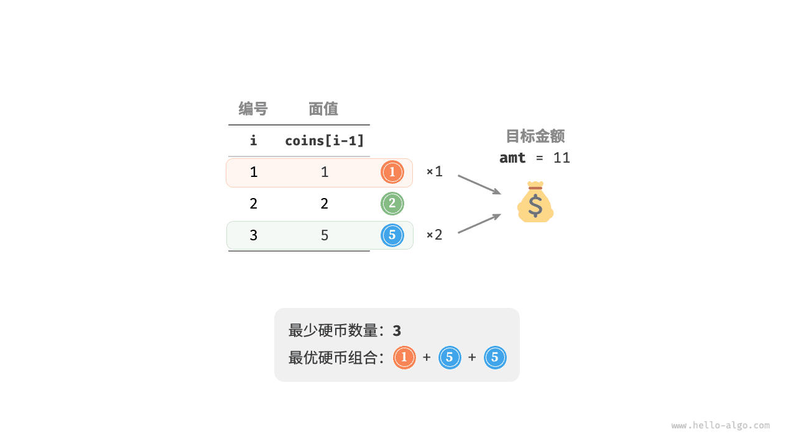

### 动态规划思路

**零钱兑换可以看作完全背包问题的一种特殊情况**，两者具有以下联系与不同点。

- 两道题可以相互转换，“物品”对应“硬币”、“物品重量”对应“硬币面值”、“背包容量”对应“目标金额”。
- 优化目标相反，完全背包问题是要最大化物品价值，零钱兑换问题是要最小化硬币数量。
- 完全背包问题是求“不超过”背包容量下的解，零钱兑换是求“恰好”凑到目标金额的解。

**第一步：思考每轮的决策，定义状态，从而得到 $dp$ 表**

状态 $[i, a]$ 对应的子问题为：**前 $i$ 种硬币能够凑出金额 $a$ 的最少硬币数量**，记为 $dp[i, a]$ 。

二维 $dp$ 表的尺寸为 $(n+1) \times (amt+1)$ 。

**第二步：找出最优子结构，进而推导出状态转移方程**

本题与完全背包问题的状态转移方程存在以下两点差异。

- 本题要求最小值，因此需将运算符 $\max()$ 更改为 $\min()$ 。
- 优化主体是硬币数量而非商品价值，因此在选中硬币时执行 $+1$ 即可。

$$
dp[i, a] = \min(dp[i-1, a], dp[i, a - coins[i-1]] + 1)
$$

**第三步：确定边界条件和状态转移顺序**

当目标金额为 $0$ 时，凑出它的最少硬币数量为 $0$ ，即首列所有 $dp[i, 0]$ 都等于 $0$ 。

当无硬币时，**无法凑出任意 $> 0$ 的目标金额**，即是无效解。为使状态转移方程中的 $\min()$ 函数能够识别并过滤无效解，我们考虑使用 $+ \infty$ 来表示它们，即令首行所有 $dp[0, a]$ 都等于 $+ \infty$ 。

### 代码实现

大多数编程语言并未提供 $+ \infty$ 变量，只能使用整型 `int` 的最大值来代替。而这又会导致大数越界：状态转移方程中的 $+ 1$ 操作可能发生溢出。

为此，我们采用数字 $amt + 1$ 来表示无效解，因为凑出 $amt$ 的硬币数量最多为 $amt$ 。最后返回前，判断 $dp[n, amt]$ 是否等于 $amt + 1$ ，若是则返回 $-1$ ，代表无法凑出目标金额。代码如下所示：

```python
def coin_change_dp(coins: list[int], amt: int) -> int:
    """零钱兑换：动态规划"""
    n = len(coins)
    MAX = amt + 1
    # 初始化 dp 表
    dp = [[0] * (amt + 1) for _ in range(n + 1)]
    # 状态转移：首行首列
    for a in range(1, amt + 1):
        dp[0][a] = MAX
    # 状态转移：其余行和列
    for i in range(1, n + 1):
        for a in range(1, amt + 1):
            if coins[i - 1] > a:
                # 若超过目标金额，则不选硬币 i
                dp[i][a] = dp[i - 1][a]
            else:
                # 不选和选硬币 i 这两种方案的较小值
                dp[i][a] = min(dp[i - 1][a], dp[i][a - coins[i - 1]] + 1)
    return dp[n][amt] if dp[n][amt] != MAX else -1
```

!!! example [pythontutor "可视化运行"](https://pythontutor.com/iframe-embed.html#code=def%20coin_change_dp%28coins%3A%20list%5Bint%5D,%20amt%3A%20int%29%20-%3E%20int%3A%0A%20%20%20%20%22%22%22%E9%9B%B6%E9%92%B1%E5%85%91%E6%8D%A2%EF%BC%9A%E5%8A%A8%E6%80%81%E8%A7%84%E5%88%92%22%22%22%0A%20%20%20%20n%20%3D%20len%28coins%29%0A%20%20%20%20MAX%20%3D%20amt%20%2B%201%0A%20%20%20%20%23%20%E5%88%9D%E5%A7%8B%E5%8C%96%20dp%20%E8%A1%A8%0A%20%20%20%20dp%20%3D%20%5B%5B0%5D%20*%20%28amt%20%2B%201%29%20for%20_%20in%20range%28n%20%2B%201%29%5D%0A%20%20%20%20%23%20%E7%8A%B6%E6%80%81%E8%BD%AC%E7%A7%BB%EF%BC%9A%E9%A6%96%E8%A1%8C%E9%A6%96%E5%88%97%0A%20%20%20%20for%20a%20in%20range%281,%20amt%20%2B%201%29%3A%0A%20%20%20%20%20%20%20%20dp%5B0%5D%5Ba%5D%20%3D%20MAX%0A%20%20%20%20%23%20%E7%8A%B6%E6%80%81%E8%BD%AC%E7%A7%BB%EF%BC%9A%E5%85%B6%E4%BD%99%E8%A1%8C%E5%92%8C%E5%88%97%0A%20%20%20%20for%20i%20in%20range%281,%20n%20%2B%201%29%3A%0A%20%20%20%20%20%20%20%20for%20a%20in%20range%281,%20amt%20%2B%201%29%3A%0A%20%20%20%20%20%20%20%20%20%20%20%20if%20coins%5Bi%20-%201%5D%20%3E%20a%3A%0A%20%20%20%20%20%20%20%20%20%20%20%20%20%20%20%20%23%20%E8%8B%A5%E8%B6%85%E8%BF%87%E7%9B%AE%E6%A0%87%E9%87%91%E9%A2%9D%EF%BC%8C%E5%88%99%E4%B8%8D%E9%80%89%E7%A1%AC%E5%B8%81%20i%0A%20%20%20%20%20%20%20%20%20%20%20%20%20%20%20%20dp%5Bi%5D%5Ba%5D%20%3D%20dp%5Bi%20-%201%5D%5Ba%5D%0A%20%20%20%20%20%20%20%20%20%20%20%20else%3A%0A%20%20%20%20%20%20%20%20%20%20%20%20%20%20%20%20%23%20%E4%B8%8D%E9%80%89%E5%92%8C%E9%80%89%E7%A1%AC%E5%B8%81%20i%20%E8%BF%99%E4%B8%A4%E7%A7%8D%E6%96%B9%E6%A1%88%E7%9A%84%E8%BE%83%E5%B0%8F%E5%80%BC%0A%20%20%20%20%20%20%20%20%20%20%20%20%20%20%20%20dp%5Bi%5D%5Ba%5D%20%3D%20min%28dp%5Bi%20-%201%5D%5Ba%5D,%20dp%5Bi%5D%5Ba%20-%20coins%5Bi%20-%201%5D%5D%20%2B%201%29%0A%20%20%20%20return%20dp%5Bn%5D%5Bamt%5D%20if%20dp%5Bn%5D%5Bamt%5D%20!%3D%20MAX%20else%20-1%0A%0A%0A%22%22%22Driver%20Code%22%22%22%0Aif%20__name__%20%3D%3D%20%22__main__%22%3A%0A%20%20%20%20coins%20%3D%20%5B1,%202,%205%5D%0A%20%20%20%20amt%20%3D%204%0A%0A%20%20%20%20%23%20%E5%8A%A8%E6%80%81%E8%A7%84%E5%88%92%0A%20%20%20%20res%20%3D%20coin_change_dp%28coins,%20amt%29%0A%20%20%20%20print%28f%22%E5%87%91%E5%88%B0%E7%9B%AE%E6%A0%87%E9%87%91%E9%A2%9D%E6%89%80%E9%9C%80%E7%9A%84%E6%9C%80%E5%B0%91%E7%A1%AC%E5%B8%81%E6%95%B0%E9%87%8F%E4%B8%BA%20%7Bres%7D%22%29&codeDivHeight=800&codeDivWidth=600&cumulative=false&curInstr=5&heapPrimitives=nevernest&origin=opt-frontend.js&py=311&rawInputLstJSON=%5B%5D&textReferences=false)

下图展示了零钱兑换的动态规划过程，和完全背包问题非常相似。

=== "<1>"
    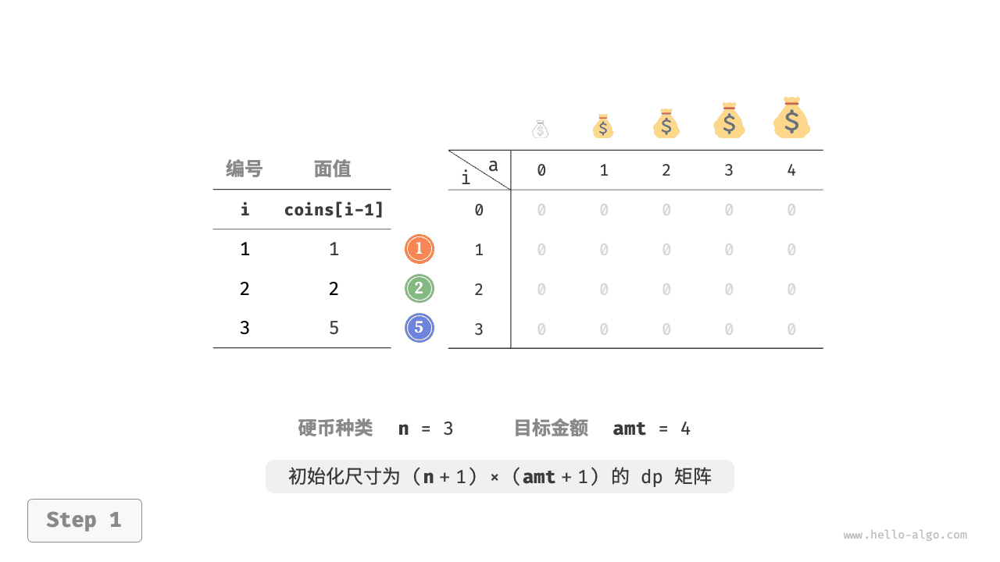

=== "<2>"
    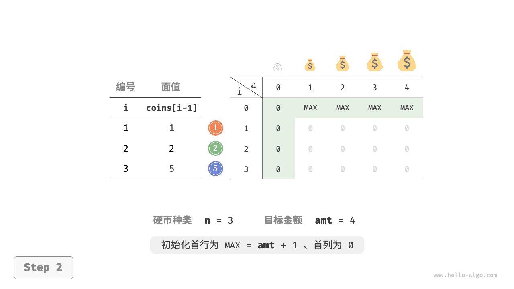

=== "<3>"
    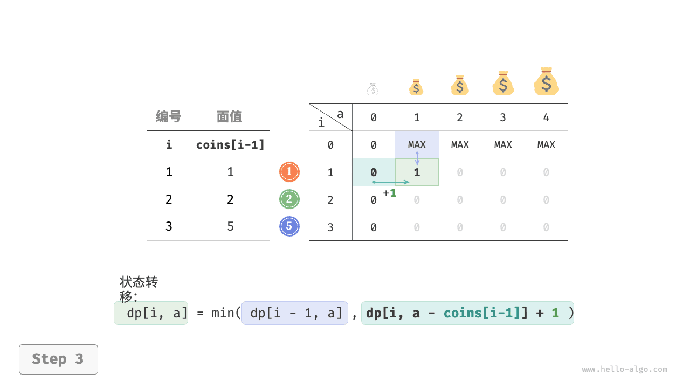

=== "<4>"
    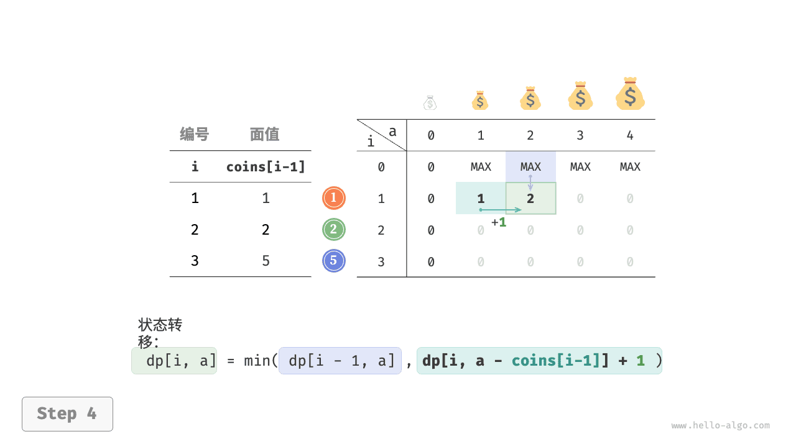

=== "<5>"
    

=== "<6>"
    

=== "<7>"
    

=== "<8>"
    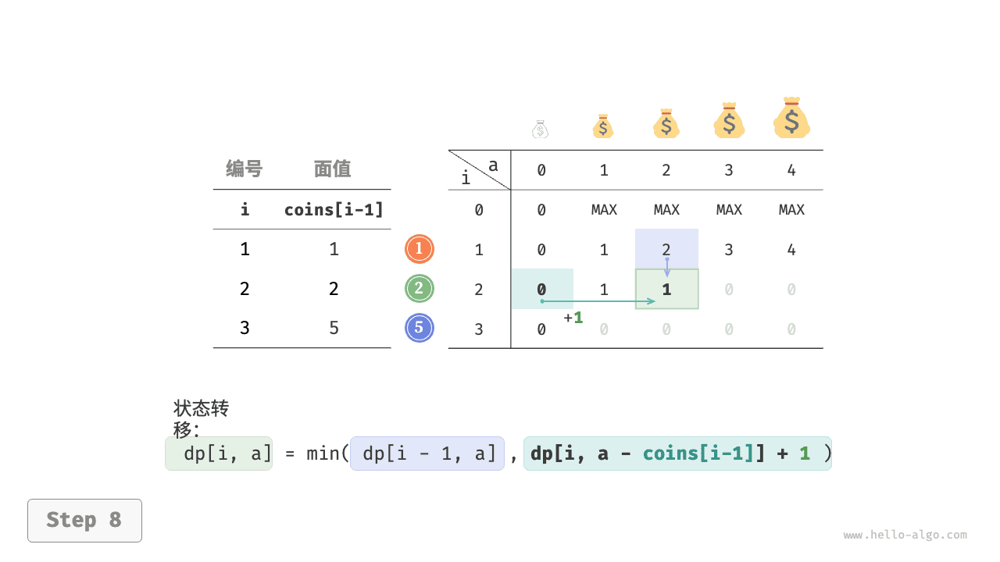

=== "<9>"
    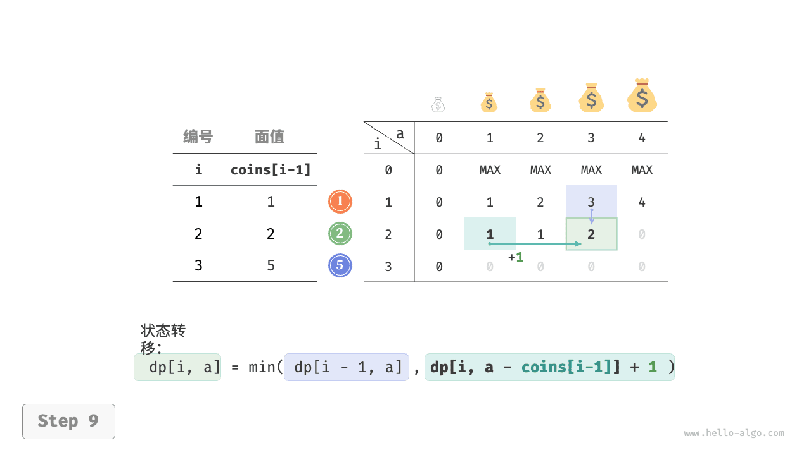

=== "<10>"
    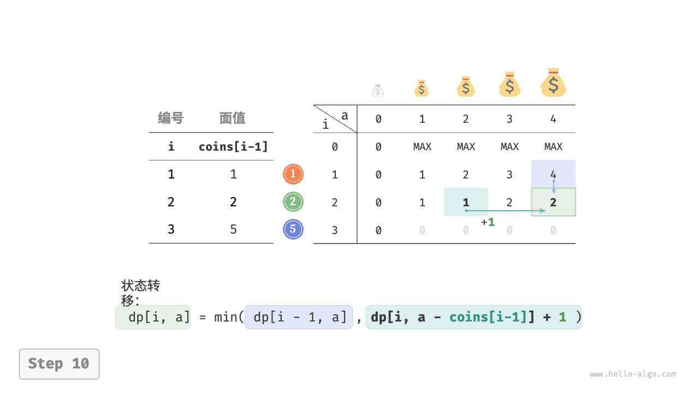

=== "<11>"
    

=== "<12>"
    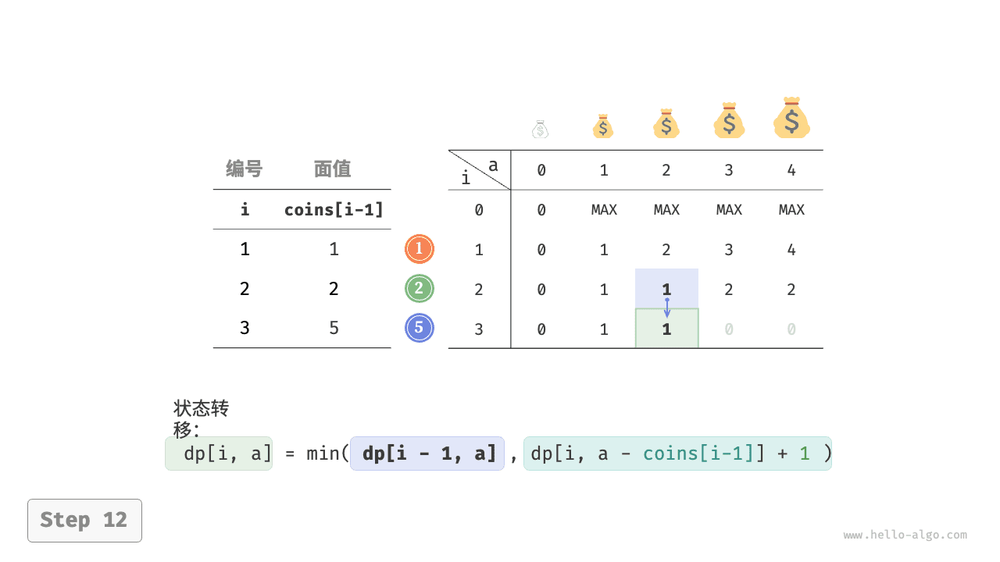

=== "<13>"
    

=== "<14>"
    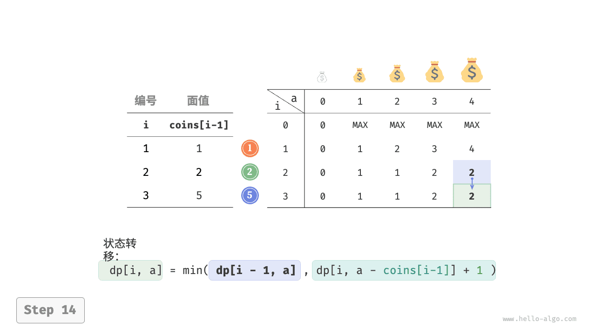

=== "<15>"
    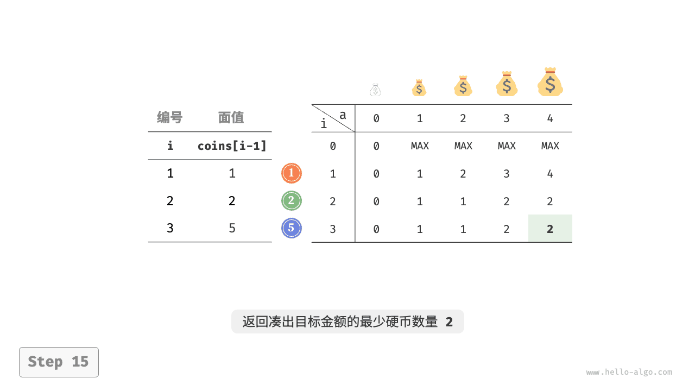

### 空间优化

零钱兑换的空间优化的处理方式和完全背包问题一致：

```python
def coin_change_dp_comp(coins: list[int], amt: int) -> int:
    """零钱兑换：空间优化后的动态规划"""
    n = len(coins)
    MAX = amt + 1
    # 初始化 dp 表
    dp = [MAX] * (amt + 1)
    dp[0] = 0
    # 状态转移
    for i in range(1, n + 1):
        # 正序遍历
        for a in range(1, amt + 1):
            if coins[i - 1] > a:
                # 若超过目标金额，则不选硬币 i
                dp[a] = dp[a]
            else:
                # 不选和选硬币 i 这两种方案的较小值
                dp[a] = min(dp[a], dp[a - coins[i - 1]] + 1)
    return dp[amt] if dp[amt] != MAX else -1
```

!!! example [pythontutor "可视化运行"](https://pythontutor.com/iframe-embed.html#code=def%20coin_change_dp_comp%28coins%3A%20list%5Bint%5D,%20amt%3A%20int%29%20-%3E%20int%3A%0A%20%20%20%20%22%22%22%E9%9B%B6%E9%92%B1%E5%85%91%E6%8D%A2%EF%BC%9A%E7%A9%BA%E9%97%B4%E4%BC%98%E5%8C%96%E5%90%8E%E7%9A%84%E5%8A%A8%E6%80%81%E8%A7%84%E5%88%92%22%22%22%0A%20%20%20%20n%20%3D%20len%28coins%29%0A%20%20%20%20MAX%20%3D%20amt%20%2B%201%0A%20%20%20%20%23%20%E5%88%9D%E5%A7%8B%E5%8C%96%20dp%20%E8%A1%A8%0A%20%20%20%20dp%20%3D%20%5BMAX%5D%20*%20%28amt%20%2B%201%29%0A%20%20%20%20dp%5B0%5D%20%3D%200%0A%20%20%20%20%23%20%E7%8A%B6%E6%80%81%E8%BD%AC%E7%A7%BB%0A%20%20%20%20for%20i%20in%20range%281,%20n%20%2B%201%29%3A%0A%20%20%20%20%20%20%20%20%23%20%E6%AD%A3%E5%BA%8F%E9%81%8D%E5%8E%86%0A%20%20%20%20%20%20%20%20for%20a%20in%20range%281,%20amt%20%2B%201%29%3A%0A%20%20%20%20%20%20%20%20%20%20%20%20if%20coins%5Bi%20-%201%5D%20%3E%20a%3A%0A%20%20%20%20%20%20%20%20%20%20%20%20%20%20%20%20%23%20%E8%8B%A5%E8%B6%85%E8%BF%87%E7%9B%AE%E6%A0%87%E9%87%91%E9%A2%9D%EF%BC%8C%E5%88%99%E4%B8%8D%E9%80%89%E7%A1%AC%E5%B8%81%20i%0A%20%20%20%20%20%20%20%20%20%20%20%20%20%20%20%20dp%5Ba%5D%20%3D%20dp%5Ba%5D%0A%20%20%20%20%20%20%20%20%20%20%20%20else%3A%0A%20%20%20%20%20%20%20%20%20%20%20%20%20%20%20%20%23%20%E4%B8%8D%E9%80%89%E5%92%8C%E9%80%89%E7%A1%AC%E5%B8%81%20i%20%E8%BF%99%E4%B8%A4%E7%A7%8D%E6%96%B9%E6%A1%88%E7%9A%84%E8%BE%83%E5%B0%8F%E5%80%BC%0A%20%20%20%20%20%20%20%20%20%20%20%20%20%20%20%20dp%5Ba%5D%20%3D%20min%28dp%5Ba%5D,%20dp%5Ba%20-%20coins%5Bi%20-%201%5D%5D%20%2B%201%29%0A%20%20%20%20return%20dp%5Bamt%5D%20if%20dp%5Bamt%5D%20!%3D%20MAX%20else%20-1%0A%0A%0A%22%22%22Driver%20Code%22%22%22%0Aif%20__name__%20%3D%3D%20%22__main__%22%3A%0A%20%20%20%20coins%20%3D%20%5B1,%202,%205%5D%0A%20%20%20%20amt%20%3D%204%0A%0A%20%20%20%20%23%20%E7%A9%BA%E9%97%B4%E4%BC%98%E5%8C%96%E5%90%8E%E7%9A%84%E5%8A%A8%E6%80%81%E8%A7%84%E5%88%92%0A%20%20%20%20res%20%3D%20coin_change_dp_comp%28coins,%20amt%29%0A%20%20%20%20print%28f%22%E5%87%91%E5%88%B0%E7%9B%AE%E6%A0%87%E9%87%91%E9%A2%9D%E6%89%80%E9%9C%80%E7%9A%84%E6%9C%80%E5%B0%91%E7%A1%AC%E5%B8%81%E6%95%B0%E9%87%8F%E4%B8%BA%20%7Bres%7D%22%29&codeDivHeight=800&codeDivWidth=600&cumulative=false&curInstr=5&heapPrimitives=nevernest&origin=opt-frontend.js&py=311&rawInputLstJSON=%5B%5D&textReferences=false)

## 零钱兑换问题 II

!!! question

    给定 $n$ 种硬币，第 $i$ 种硬币的面值为 $coins[i - 1]$ ，目标金额为 $amt$ ，每种硬币可以重复选取，**问凑出目标金额的硬币组合数量**。示例如下图所示。


### 动态规划思路

相比于上一题，本题目标是求组合数量，因此子问题变为：**前 $i$ 种硬币能够凑出金额 $a$ 的组合数量**。而 $dp$ 表仍然是尺寸为 $(n+1) \times (amt + 1)$ 的二维矩阵。

当前状态的组合数量等于不选当前硬币与选当前硬币这两种决策的组合数量之和。状态转移方程为：

$$
dp[i, a] = dp[i-1, a] + dp[i, a - coins[i-1]]
$$

当目标金额为 $0$ 时，无须选择任何硬币即可凑出目标金额，因此应将首列所有 $dp[i, 0]$ 都初始化为 $1$ 。当无硬币时，无法凑出任何 $>0$ 的目标金额，因此首行所有 $dp[0, a]$ 都等于 $0$ 。

### 代码实现

```python
def coin_change_ii_dp(coins: list[int], amt: int) -> int:
    """零钱兑换 II：动态规划"""
    n = len(coins)
    # 初始化 dp 表
    dp = [[0] * (amt + 1) for _ in range(n + 1)]
    # 初始化首列
    for i in range(n + 1):
        dp[i][0] = 1
    # 状态转移
    for i in range(1, n + 1):
        for a in range(1, amt + 1):
            if coins[i - 1] > a:
                # 若超过目标金额，则不选硬币 i
                dp[i][a] = dp[i - 1][a]
            else:
                # 不选和选硬币 i 这两种方案之和
                dp[i][a] = dp[i - 1][a] + dp[i][a - coins[i - 1]]
    return dp[n][amt]
```

!!! example [pythontutor "可视化运行"](https://pythontutor.com/iframe-embed.html#code=def%20coin_change_ii_dp%28coins%3A%20list%5Bint%5D,%20amt%3A%20int%29%20-%3E%20int%3A%0A%20%20%20%20%22%22%22%E9%9B%B6%E9%92%B1%E5%85%91%E6%8D%A2%20II%EF%BC%9A%E5%8A%A8%E6%80%81%E8%A7%84%E5%88%92%22%22%22%0A%20%20%20%20n%20%3D%20len%28coins%29%0A%20%20%20%20%23%20%E5%88%9D%E5%A7%8B%E5%8C%96%20dp%20%E8%A1%A8%0A%20%20%20%20dp%20%3D%20%5B%5B0%5D%20*%20%28amt%20%2B%201%29%20for%20_%20in%20range%28n%20%2B%201%29%5D%0A%20%20%20%20%23%20%E5%88%9D%E5%A7%8B%E5%8C%96%E9%A6%96%E5%88%97%0A%20%20%20%20for%20i%20in%20range%28n%20%2B%201%29%3A%0A%20%20%20%20%20%20%20%20dp%5Bi%5D%5B0%5D%20%3D%201%0A%20%20%20%20%23%20%E7%8A%B6%E6%80%81%E8%BD%AC%E7%A7%BB%0A%20%20%20%20for%20i%20in%20range%281,%20n%20%2B%201%29%3A%0A%20%20%20%20%20%20%20%20for%20a%20in%20range%281,%20amt%20%2B%201%29%3A%0A%20%20%20%20%20%20%20%20%20%20%20%20if%20coins%5Bi%20-%201%5D%20%3E%20a%3A%0A%20%20%20%20%20%20%20%20%20%20%20%20%20%20%20%20%23%20%E8%8B%A5%E8%B6%85%E8%BF%87%E7%9B%AE%E6%A0%87%E9%87%91%E9%A2%9D%EF%BC%8C%E5%88%99%E4%B8%8D%E9%80%89%E7%A1%AC%E5%B8%81%20i%0A%20%20%20%20%20%20%20%20%20%20%20%20%20%20%20%20dp%5Bi%5D%5Ba%5D%20%3D%20dp%5Bi%20-%201%5D%5Ba%5D%0A%20%20%20%20%20%20%20%20%20%20%20%20else%3A%0A%20%20%20%20%20%20%20%20%20%20%20%20%20%20%20%20%23%20%E4%B8%8D%E9%80%89%E5%92%8C%E9%80%89%E7%A1%AC%E5%B8%81%20i%20%E8%BF%99%E4%B8%A4%E7%A7%8D%E6%96%B9%E6%A1%88%E4%B9%8B%E5%92%8C%0A%20%20%20%20%20%20%20%20%20%20%20%20%20%20%20%20dp%5Bi%5D%5Ba%5D%20%3D%20dp%5Bi%20-%201%5D%5Ba%5D%20%2B%20dp%5Bi%5D%5Ba%20-%20coins%5Bi%20-%201%5D%5D%0A%20%20%20%20return%20dp%5Bn%5D%5Bamt%5D%0A%0A%0A%22%22%22Driver%20Code%22%22%22%0Aif%20__name__%20%3D%3D%20%22__main__%22%3A%0A%20%20%20%20coins%20%3D%20%5B1,%202,%205%5D%0A%20%20%20%20amt%20%3D%205%0A%0A%20%20%20%20%23%20%E5%8A%A8%E6%80%81%E8%A7%84%E5%88%92%0A%20%20%20%20res%20%3D%20coin_change_ii_dp%28coins,%20amt%29%0A%20%20%20%20print%28f%22%E5%87%91%E5%87%BA%E7%9B%AE%E6%A0%87%E9%87%91%E9%A2%9D%E7%9A%84%E7%A1%AC%E5%B8%81%E7%BB%84%E5%90%88%E6%95%B0%E9%87%8F%E4%B8%BA%20%7Bres%7D%22%29&codeDivHeight=800&codeDivWidth=600&cumulative=false&curInstr=5&heapPrimitives=nevernest&origin=opt-frontend.js&py=311&rawInputLstJSON=%5B%5D&textReferences=false)

### 空间优化

空间优化处理方式相同，删除硬币维度即可：

```python
def coin_change_ii_dp_comp(coins: list[int], amt: int) -> int:
    """零钱兑换 II：空间优化后的动态规划"""
    n = len(coins)
    # 初始化 dp 表
    dp = [0] * (amt + 1)
    dp[0] = 1
    # 状态转移
    for i in range(1, n + 1):
        # 正序遍历
        for a in range(1, amt + 1):
            if coins[i - 1] > a:
                # 若超过目标金额，则不选硬币 i
                dp[a] = dp[a]
            else:
                # 不选和选硬币 i 这两种方案之和
                dp[a] = dp[a] + dp[a - coins[i - 1]]
    return dp[amt]
```

!!! example [pythontutor "可视化运行"](https://pythontutor.com/iframe-embed.html#code=def%20coin_change_ii_dp_comp%28coins%3A%20list%5Bint%5D,%20amt%3A%20int%29%20-%3E%20int%3A%0A%20%20%20%20%22%22%22%E9%9B%B6%E9%92%B1%E5%85%91%E6%8D%A2%20II%EF%BC%9A%E7%A9%BA%E9%97%B4%E4%BC%98%E5%8C%96%E5%90%8E%E7%9A%84%E5%8A%A8%E6%80%81%E8%A7%84%E5%88%92%22%22%22%0A%20%20%20%20n%20%3D%20len%28coins%29%0A%20%20%20%20%23%20%E5%88%9D%E5%A7%8B%E5%8C%96%20dp%20%E8%A1%A8%0A%20%20%20%20dp%20%3D%20%5B0%5D%20*%20%28amt%20%2B%201%29%0A%20%20%20%20dp%5B0%5D%20%3D%201%0A%20%20%20%20%23%20%E7%8A%B6%E6%80%81%E8%BD%AC%E7%A7%BB%0A%20%20%20%20for%20i%20in%20range%281,%20n%20%2B%201%29%3A%0A%20%20%20%20%20%20%20%20%23%20%E6%AD%A3%E5%BA%8F%E9%81%8D%E5%8E%86%0A%20%20%20%20%20%20%20%20for%20a%20in%20range%281,%20amt%20%2B%201%29%3A%0A%20%20%20%20%20%20%20%20%20%20%20%20if%20coins%5Bi%20-%201%5D%20%3E%20a%3A%0A%20%20%20%20%20%20%20%20%20%20%20%20%20%20%20%20%23%20%E8%8B%A5%E8%B6%85%E8%BF%87%E7%9B%AE%E6%A0%87%E9%87%91%E9%A2%9D%EF%BC%8C%E5%88%99%E4%B8%8D%E9%80%89%E7%A1%AC%E5%B8%81%20i%0A%20%20%20%20%20%20%20%20%20%20%20%20%20%20%20%20dp%5Ba%5D%20%3D%20dp%5Ba%5D%0A%20%20%20%20%20%20%20%20%20%20%20%20else%3A%0A%20%20%20%20%20%20%20%20%20%20%20%20%20%20%20%20%23%20%E4%B8%8D%E9%80%89%E5%92%8C%E9%80%89%E7%A1%AC%E5%B8%81%20i%20%E8%BF%99%E4%B8%A4%E7%A7%8D%E6%96%B9%E6%A1%88%E4%B9%8B%E5%92%8C%0A%20%20%20%20%20%20%20%20%20%20%20%20%20%20%20%20dp%5Ba%5D%20%3D%20dp%5Ba%5D%20%2B%20dp%5Ba%20-%20coins%5Bi%20-%201%5D%5D%0A%20%20%20%20return%20dp%5Bamt%5D%0A%0A%0A%22%22%22Driver%20Code%22%22%22%0Aif%20__name__%20%3D%3D%20%22__main__%22%3A%0A%20%20%20%20coins%20%3D%20%5B1,%202,%205%5D%0A%20%20%20%20amt%20%3D%205%0A%0A%20%20%20%20%23%20%E7%A9%BA%E9%97%B4%E4%BC%98%E5%8C%96%E5%90%8E%E7%9A%84%E5%8A%A8%E6%80%81%E8%A7%84%E5%88%92%0A%20%20%20%20res%20%3D%20coin_change_ii_dp_comp%28coins,%20amt%29%0A%20%20%20%20print%28f%22%E5%87%91%E5%87%BA%E7%9B%AE%E6%A0%87%E9%87%91%E9%A2%9D%E7%9A%84%E7%A1%AC%E5%B8%81%E7%BB%84%E5%90%88%E6%95%B0%E9%87%8F%E4%B8%BA%20%7Bres%7D%22%29&codeDivHeight=800&codeDivWidth=600&cumulative=false&curInstr=5&heapPrimitives=nevernest&origin=opt-frontend.js&py=311&rawInputLstJSON=%5B%5D&textReferences=false)

# 编辑距离问题

编辑距离，也称 Levenshtein 距离，指两个字符串之间互相转换的最少修改次数，通常用于在信息检索和自然语言处理中度量两个序列的相似度。

!!! question

    输入两个字符串 $s$ 和 $t$ ，返回将 $s$ 转换为 $t$ 所需的最少编辑步数。
    
    你可以在一个字符串中进行三种编辑操作：插入一个字符、删除一个字符、将字符替换为任意一个字符。

如下图所示，将 `kitten` 转换为 `sitting` 需要编辑 3 步，包括 2 次替换操作与 1 次添加操作；将 `hello` 转换为 `algo` 需要 3 步，包括 2 次替换操作和 1 次删除操作。

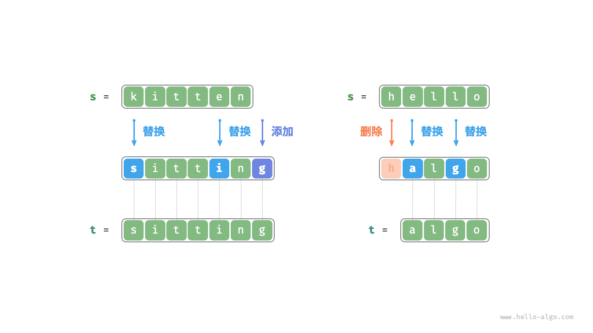

**编辑距离问题可以很自然地用决策树模型来解释**。字符串对应树节点，一轮决策（一次编辑操作）对应树的一条边。

如下图所示，在不限制操作的情况下，每个节点都可以派生出许多条边，每条边对应一种操作，这意味着从 `hello` 转换到 `algo` 有许多种可能的路径。

从决策树的角度看，本题的目标是求解节点 `hello` 和节点 `algo` 之间的最短路径。

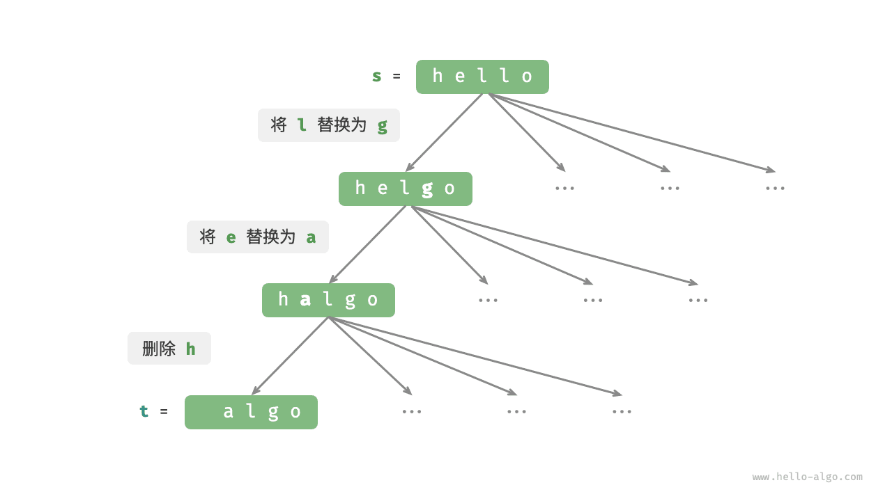

### 动态规划思路

**第一步：思考每轮的决策，定义状态，从而得到 $dp$ 表**

每一轮的决策是对字符串 $s$ 进行一次编辑操作。

我们希望在编辑操作的过程中，问题的规模逐渐缩小，这样才能构建子问题。设字符串 $s$ 和 $t$ 的长度分别为 $n$ 和 $m$ ，我们先考虑两字符串尾部的字符 $s[n-1]$ 和 $t[m-1]$ 。

- 若 $s[n-1]$ 和 $t[m-1]$ 相同，我们可以跳过它们，直接考虑 $s[n-2]$ 和 $t[m-2]$ 。
- 若 $s[n-1]$ 和 $t[m-1]$ 不同，我们需要对 $s$ 进行一次编辑（插入、删除、替换），使得两字符串尾部的字符相同，从而可以跳过它们，考虑规模更小的问题。

也就是说，我们在字符串 $s$ 中进行的每一轮决策（编辑操作），都会使得 $s$ 和 $t$ 中剩余的待匹配字符发生变化。因此，状态为当前在 $s$ 和 $t$ 中考虑的第 $i$ 和第 $j$ 个字符，记为 $[i, j]$ 。

状态 $[i, j]$ 对应的子问题：**将 $s$ 的前 $i$ 个字符更改为 $t$ 的前 $j$ 个字符所需的最少编辑步数**。

至此，得到一个尺寸为 $(i+1) \times (j+1)$ 的二维 $dp$ 表。

**第二步：找出最优子结构，进而推导出状态转移方程**

考虑子问题 $dp[i, j]$ ，其对应的两个字符串的尾部字符为 $s[i-1]$ 和 $t[j-1]$ ，可根据不同编辑操作分为下图所示的三种情况。

1. 在 $s[i-1]$ 之后添加 $t[j-1]$ ，则剩余子问题 $dp[i, j-1]$ 。
2. 删除 $s[i-1]$ ，则剩余子问题 $dp[i-1, j]$ 。
3. 将 $s[i-1]$ 替换为 $t[j-1]$ ，则剩余子问题 $dp[i-1, j-1]$ 。


根据以上分析，可得最优子结构：$dp[i, j]$ 的最少编辑步数等于 $dp[i, j-1]$、$dp[i-1, j]$、$dp[i-1, j-1]$ 三者中的最少编辑步数，再加上本次的编辑步数 $1$ 。对应的状态转移方程为：

$$
dp[i, j] = \min(dp[i, j-1], dp[i-1, j], dp[i-1, j-1]) + 1
$$

请注意，**当 $s[i-1]$ 和 $t[j-1]$ 相同时，无须编辑当前字符**，这种情况下的状态转移方程为：

$$
dp[i, j] = dp[i-1, j-1]
$$

**第三步：确定边界条件和状态转移顺序**

当两字符串都为空时，编辑步数为 $0$ ，即 $dp[0, 0] = 0$ 。当 $s$ 为空但 $t$ 不为空时，最少编辑步数等于 $t$ 的长度，即首行 $dp[0, j] = j$ 。当 $s$ 不为空但 $t$ 为空时，最少编辑步数等于 $s$ 的长度，即首列 $dp[i, 0] = i$ 。

观察状态转移方程，解 $dp[i, j]$ 依赖左方、上方、左上方的解，因此通过两层循环正序遍历整个 $dp$ 表即可。

### 代码实现

```python
def edit_distance_dp(s: str, t: str) -> int:
    """编辑距离：动态规划"""
    n, m = len(s), len(t)
    dp = [[0] * (m + 1) for _ in range(n + 1)]
    # 状态转移：首行首列
    for i in range(1, n + 1):
        dp[i][0] = i
    for j in range(1, m + 1):
        dp[0][j] = j
    # 状态转移：其余行和列
    for i in range(1, n + 1):
        for j in range(1, m + 1):
            if s[i - 1] == t[j - 1]:
                # 若两字符相等，则直接跳过此两字符
                dp[i][j] = dp[i - 1][j - 1]
            else:
                # 最少编辑步数 = 插入、删除、替换这三种操作的最少编辑步数 + 1
                dp[i][j] = min(dp[i][j - 1], dp[i - 1][j], dp[i - 1][j - 1]) + 1
    return dp[n][m]
```

!!! example [pythontutor "可视化运行"](https://pythontutor.com/iframe-embed.html#code=def%20edit_distance_dp%28s%3A%20str,%20t%3A%20str%29%20-%3E%20int%3A%0A%20%20%20%20%22%22%22%E7%BC%96%E8%BE%91%E8%B7%9D%E7%A6%BB%EF%BC%9A%E5%8A%A8%E6%80%81%E8%A7%84%E5%88%92%22%22%22%0A%20%20%20%20n,%20m%20%3D%20len%28s%29,%20len%28t%29%0A%20%20%20%20dp%20%3D%20%5B%5B0%5D%20*%20%28m%20%2B%201%29%20for%20_%20in%20range%28n%20%2B%201%29%5D%0A%20%20%20%20%23%20%E7%8A%B6%E6%80%81%E8%BD%AC%E7%A7%BB%EF%BC%9A%E9%A6%96%E8%A1%8C%E9%A6%96%E5%88%97%0A%20%20%20%20for%20i%20in%20range%281,%20n%20%2B%201%29%3A%0A%20%20%20%20%20%20%20%20dp%5Bi%5D%5B0%5D%20%3D%20i%0A%20%20%20%20for%20j%20in%20range%281,%20m%20%2B%201%29%3A%0A%20%20%20%20%20%20%20%20dp%5B0%5D%5Bj%5D%20%3D%20j%0A%20%20%20%20%23%20%E7%8A%B6%E6%80%81%E8%BD%AC%E7%A7%BB%EF%BC%9A%E5%85%B6%E4%BD%99%E8%A1%8C%E5%92%8C%E5%88%97%0A%20%20%20%20for%20i%20in%20range%281,%20n%20%2B%201%29%3A%0A%20%20%20%20%20%20%20%20for%20j%20in%20range%281,%20m%20%2B%201%29%3A%0A%20%20%20%20%20%20%20%20%20%20%20%20if%20s%5Bi%20-%201%5D%20%3D%3D%20t%5Bj%20-%201%5D%3A%0A%20%20%20%20%20%20%20%20%20%20%20%20%20%20%20%20%23%20%E8%8B%A5%E4%B8%A4%E5%AD%97%E7%AC%A6%E7%9B%B8%E7%AD%89%EF%BC%8C%E5%88%99%E7%9B%B4%E6%8E%A5%E8%B7%B3%E8%BF%87%E6%AD%A4%E4%B8%A4%E5%AD%97%E7%AC%A6%0A%20%20%20%20%20%20%20%20%20%20%20%20%20%20%20%20dp%5Bi%5D%5Bj%5D%20%3D%20dp%5Bi%20-%201%5D%5Bj%20-%201%5D%0A%20%20%20%20%20%20%20%20%20%20%20%20else%3A%0A%20%20%20%20%20%20%20%20%20%20%20%20%20%20%20%20%23%20%E6%9C%80%E5%B0%91%E7%BC%96%E8%BE%91%E6%AD%A5%E6%95%B0%20%3D%20%E6%8F%92%E5%85%A5%E3%80%81%E5%88%A0%E9%99%A4%E3%80%81%E6%9B%BF%E6%8D%A2%E8%BF%99%E4%B8%89%E7%A7%8D%E6%93%8D%E4%BD%9C%E7%9A%84%E6%9C%80%E5%B0%91%E7%BC%96%E8%BE%91%E6%AD%A5%E6%95%B0%20%2B%201%0A%20%20%20%20%20%20%20%20%20%20%20%20%20%20%20%20dp%5Bi%5D%5Bj%5D%20%3D%20min%28dp%5Bi%5D%5Bj%20-%201%5D,%20dp%5Bi%20-%201%5D%5Bj%5D,%20dp%5Bi%20-%201%5D%5Bj%20-%201%5D%29%20%2B%201%0A%20%20%20%20return%20dp%5Bn%5D%5Bm%5D%0A%0A%0A%22%22%22Driver%20Code%22%22%22%0Aif%20__name__%20%3D%3D%20%22__main__%22%3A%0A%20%20%20%20s%20%3D%20%22bag%22%0A%20%20%20%20t%20%3D%20%22pack%22%0A%20%20%20%20n,%20m%20%3D%20len%28s%29,%20len%28t%29%0A%0A%20%20%20%20%23%20%E5%8A%A8%E6%80%81%E8%A7%84%E5%88%92%0A%20%20%20%20res%20%3D%20edit_distance_dp%28s,%20t%29%0A%20%20%20%20print%28f%22%E5%B0%86%20%7Bs%7D%20%E6%9B%B4%E6%94%B9%E4%B8%BA%20%7Bt%7D%20%E6%9C%80%E5%B0%91%E9%9C%80%E8%A6%81%E7%BC%96%E8%BE%91%20%7Bres%7D%20%E6%AD%A5%22%29&codeDivHeight=800&codeDivWidth=600&cumulative=false&curInstr=6&heapPrimitives=nevernest&origin=opt-frontend.js&py=311&rawInputLstJSON=%5B%5D&textReferences=false)

如下图所示，编辑距离问题的状态转移过程与背包问题非常类似，都可以看作填写一个二维网格的过程。

=== "<1>"
    

=== "<2>"
    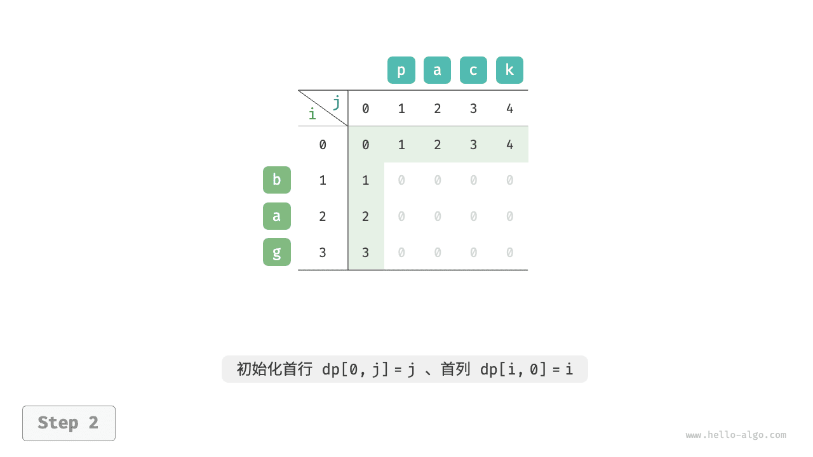

=== "<3>"
    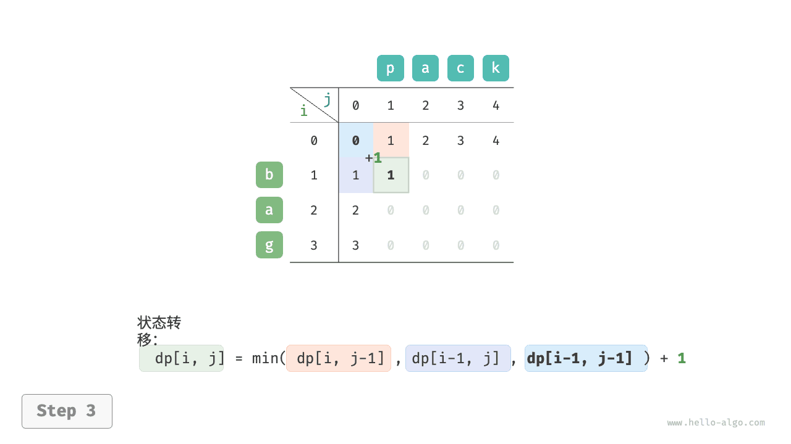

=== "<4>"
    

=== "<5>"
    

=== "<6>"
    

=== "<7>"
    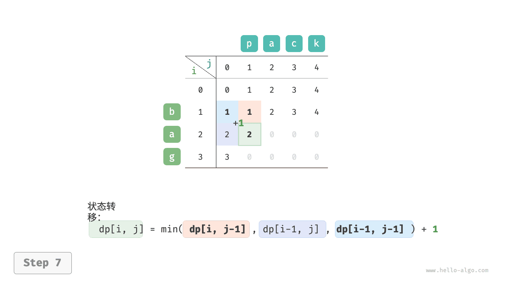

=== "<8>"
    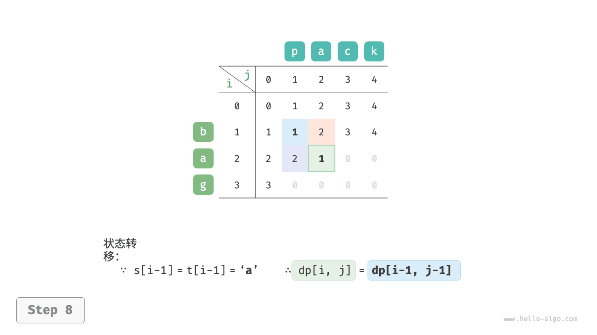

=== "<9>"
    

=== "<10>"
    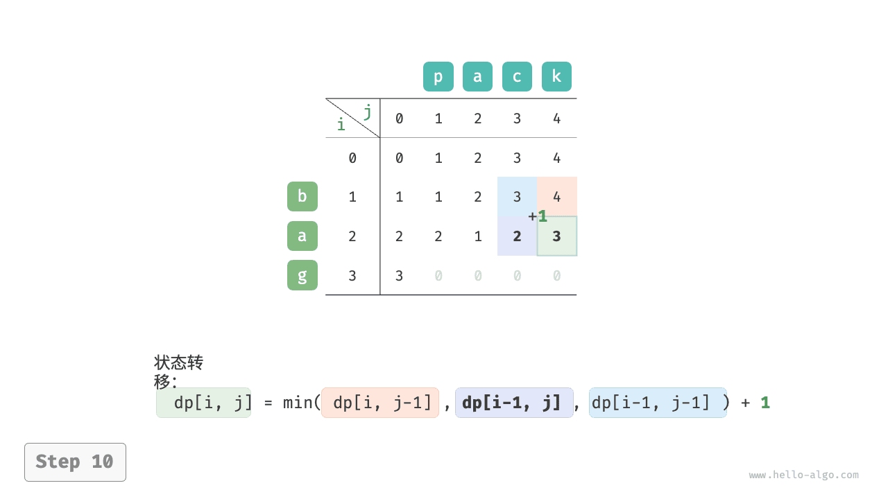

=== "<11>"
    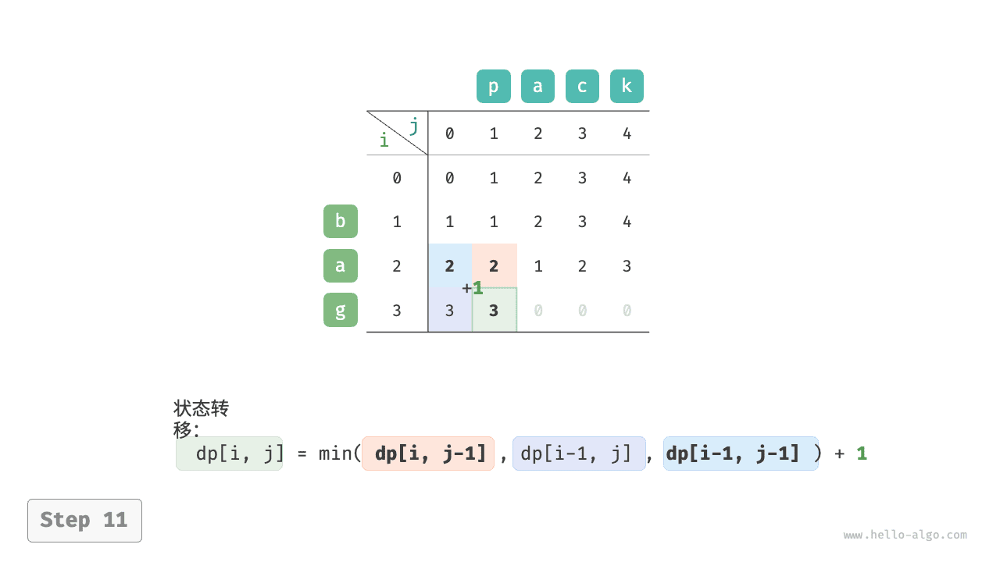

=== "<12>"
    

=== "<13>"
    

=== "<14>"
    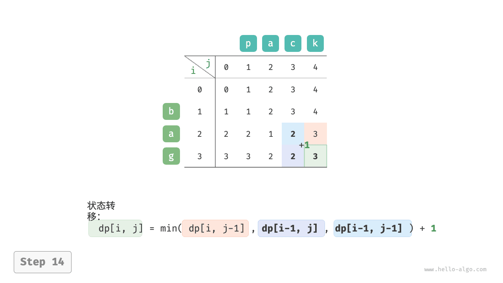

=== "<15>"
    

### 空间优化

由于 $dp[i,j]$ 是由上方 $dp[i-1, j]$、左方 $dp[i, j-1]$、左上方 $dp[i-1, j-1]$ 转移而来的，而正序遍历会丢失左上方 $dp[i-1, j-1]$ ，倒序遍历无法提前构建 $dp[i, j-1]$ ，因此两种遍历顺序都不可取。

为此，我们可以使用一个变量 `leftup` 来暂存左上方的解 $dp[i-1, j-1]$ ，从而只需考虑左方和上方的解。此时的情况与完全背包问题相同，可使用正序遍历。代码如下所示：

```python
def edit_distance_dp_comp(s: str, t: str) -> int:
    """编辑距离：空间优化后的动态规划"""
    n, m = len(s), len(t)
    dp = [0] * (m + 1)
    # 状态转移：首行
    for j in range(1, m + 1):
        dp[j] = j
    # 状态转移：其余行
    for i in range(1, n + 1):
        # 状态转移：首列
        leftup = dp[0]  # 暂存 dp[i-1, j-1]
        dp[0] += 1
        # 状态转移：其余列
        for j in range(1, m + 1):
            temp = dp[j]
            if s[i - 1] == t[j - 1]:
                # 若两字符相等，则直接跳过此两字符
                dp[j] = leftup
            else:
                # 最少编辑步数 = 插入、删除、替换这三种操作的最少编辑步数 + 1
                dp[j] = min(dp[j - 1], dp[j], leftup) + 1
            leftup = temp  # 更新为下一轮的 dp[i-1, j-1]
    return dp[m]
```

!!! example [pythontutor "可视化运行"](https://pythontutor.com/iframe-embed.html#code=def%20edit_distance_dp_comp%28s%3A%20str,%20t%3A%20str%29%20-%3E%20int%3A%0A%20%20%20%20%22%22%22%E7%BC%96%E8%BE%91%E8%B7%9D%E7%A6%BB%EF%BC%9A%E7%A9%BA%E9%97%B4%E4%BC%98%E5%8C%96%E5%90%8E%E7%9A%84%E5%8A%A8%E6%80%81%E8%A7%84%E5%88%92%22%22%22%0A%20%20%20%20n,%20m%20%3D%20len%28s%29,%20len%28t%29%0A%20%20%20%20dp%20%3D%20%5B0%5D%20*%20%28m%20%2B%201%29%0A%20%20%20%20%23%20%E7%8A%B6%E6%80%81%E8%BD%AC%E7%A7%BB%EF%BC%9A%E9%A6%96%E8%A1%8C%0A%20%20%20%20for%20j%20in%20range%281,%20m%20%2B%201%29%3A%0A%20%20%20%20%20%20%20%20dp%5Bj%5D%20%3D%20j%0A%20%20%20%20%23%20%E7%8A%B6%E6%80%81%E8%BD%AC%E7%A7%BB%EF%BC%9A%E5%85%B6%E4%BD%99%E8%A1%8C%0A%20%20%20%20for%20i%20in%20range%281,%20n%20%2B%201%29%3A%0A%20%20%20%20%20%20%20%20%23%20%E7%8A%B6%E6%80%81%E8%BD%AC%E7%A7%BB%EF%BC%9A%E9%A6%96%E5%88%97%0A%20%20%20%20%20%20%20%20leftup%20%3D%20dp%5B0%5D%20%20%23%20%E6%9A%82%E5%AD%98%20dp%5Bi-1,%20j-1%5D%0A%20%20%20%20%20%20%20%20dp%5B0%5D%20%2B%3D%201%0A%20%20%20%20%20%20%20%20%23%20%E7%8A%B6%E6%80%81%E8%BD%AC%E7%A7%BB%EF%BC%9A%E5%85%B6%E4%BD%99%E5%88%97%0A%20%20%20%20%20%20%20%20for%20j%20in%20range%281,%20m%20%2B%201%29%3A%0A%20%20%20%20%20%20%20%20%20%20%20%20temp%20%3D%20dp%5Bj%5D%0A%20%20%20%20%20%20%20%20%20%20%20%20if%20s%5Bi%20-%201%5D%20%3D%3D%20t%5Bj%20-%201%5D%3A%0A%20%20%20%20%20%20%20%20%20%20%20%20%20%20%20%20%23%20%E8%8B%A5%E4%B8%A4%E5%AD%97%E7%AC%A6%E7%9B%B8%E7%AD%89%EF%BC%8C%E5%88%99%E7%9B%B4%E6%8E%A5%E8%B7%B3%E8%BF%87%E6%AD%A4%E4%B8%A4%E5%AD%97%E7%AC%A6%0A%20%20%20%20%20%20%20%20%20%20%20%20%20%20%20%20dp%5Bj%5D%20%3D%20leftup%0A%20%20%20%20%20%20%20%20%20%20%20%20else%3A%0A%20%20%20%20%20%20%20%20%20%20%20%20%20%20%20%20%23%20%E6%9C%80%E5%B0%91%E7%BC%96%E8%BE%91%E6%AD%A5%E6%95%B0%20%3D%20%E6%8F%92%E5%85%A5%E3%80%81%E5%88%A0%E9%99%A4%E3%80%81%E6%9B%BF%E6%8D%A2%E8%BF%99%E4%B8%89%E7%A7%8D%E6%93%8D%E4%BD%9C%E7%9A%84%E6%9C%80%E5%B0%91%E7%BC%96%E8%BE%91%E6%AD%A5%E6%95%B0%20%2B%201%0A%20%20%20%20%20%20%20%20%20%20%20%20%20%20%20%20dp%5Bj%5D%20%3D%20min%28dp%5Bj%20-%201%5D,%20dp%5Bj%5D,%20leftup%29%20%2B%201%0A%20%20%20%20%20%20%20%20%20%20%20%20leftup%20%3D%20temp%20%20%23%20%E6%9B%B4%E6%96%B0%E4%B8%BA%E4%B8%8B%E4%B8%80%E8%BD%AE%E7%9A%84%20dp%5Bi-1,%20j-1%5D%0A%20%20%20%20return%20dp%5Bm%5D%0A%0A%0A%22%22%22Driver%20Code%22%22%22%0Aif%20__name__%20%3D%3D%20%22__main__%22%3A%0A%20%20%20%20s%20%3D%20%22bag%22%0A%20%20%20%20t%20%3D%20%22pack%22%0A%20%20%20%20n,%20m%20%3D%20len%28s%29,%20len%28t%29%0A%0A%20%20%20%20%23%20%E7%A9%BA%E9%97%B4%E4%BC%98%E5%8C%96%E5%90%8E%E7%9A%84%E5%8A%A8%E6%80%81%E8%A7%84%E5%88%92%0A%20%20%20%20res%20%3D%20edit_distance_dp_comp%28s,%20t%29%0A%20%20%20%20print%28f%22%E5%B0%86%20%7Bs%7D%20%E6%9B%B4%E6%94%B9%E4%B8%BA%20%7Bt%7D%20%E6%9C%80%E5%B0%91%E9%9C%80%E8%A6%81%E7%BC%96%E8%BE%91%20%7Bres%7D%20%E6%AD%A5%22%29&codeDivHeight=800&codeDivWidth=600&cumulative=false&curInstr=6&heapPrimitives=nevernest&origin=opt-frontend.js&py=311&rawInputLstJSON=%5B%5D&textReferences=false)

# 小结

### 重点回顾

- 动态规划对问题进行分解，并通过存储子问题的解来规避重复计算，提高计算效率。
- 不考虑时间的前提下，所有动态规划问题都可以用回溯（暴力搜索）进行求解，但递归树中存在大量的重叠子问题，效率极低。通过引入记忆化列表，可以存储所有计算过的子问题的解，从而保证重叠子问题只被计算一次。
- 记忆化搜索是一种从顶至底的递归式解法，而与之对应的动态规划是一种从底至顶的递推式解法，其如同“填写表格”一样。由于当前状态仅依赖某些局部状态，因此我们可以消除 $dp$ 表的一个维度，从而降低空间复杂度。
- 子问题分解是一种通用的算法思路，在分治、动态规划、回溯中具有不同的性质。
- 动态规划问题有三大特性：重叠子问题、最优子结构、无后效性。
- 如果原问题的最优解可以从子问题的最优解构建得来，则它就具有最优子结构。
- 无后效性指对于一个状态，其未来发展只与该状态有关，而与过去经历的所有状态无关。许多组合优化问题不具有无后效性，无法使用动态规划快速求解。

**背包问题**

- 背包问题是最典型的动态规划问题之一，具有 0-1 背包、完全背包、多重背包等变种。
- 0-1 背包的状态定义为前 $i$ 个物品在容量为 $c$ 的背包中的最大价值。根据不放入背包和放入背包两种决策，可得到最优子结构，并构建出状态转移方程。在空间优化中，由于每个状态依赖正上方和左上方的状态，因此需要倒序遍历列表，避免左上方状态被覆盖。
- 完全背包问题的每种物品的选取数量无限制，因此选择放入物品的状态转移与 0-1 背包问题不同。由于状态依赖正上方和正左方的状态，因此在空间优化中应当正序遍历。
- 零钱兑换问题是完全背包问题的一个变种。它从求“最大”价值变为求“最小”硬币数量，因此状态转移方程中的 $\max()$ 应改为 $\min()$ 。从追求“不超过”背包容量到追求“恰好”凑出目标金额，因此使用 $amt + 1$ 来表示“无法凑出目标金额”的无效解。
- 零钱兑换问题 II 从求“最少硬币数量”改为求“硬币组合数量”，状态转移方程相应地从 $\min()$ 改为求和运算符。

**编辑距离问题**

- 编辑距离（Levenshtein 距离）用于衡量两个字符串之间的相似度，其定义为从一个字符串到另一个字符串的最少编辑步数，编辑操作包括添加、删除、替换。
- 编辑距离问题的状态定义为将 $s$ 的前 $i$ 个字符更改为 $t$ 的前 $j$ 个字符所需的最少编辑步数。当 $s[i] \ne t[j]$ 时，具有三种决策：添加、删除、替换，它们都有相应的剩余子问题。据此便可以找出最优子结构与构建状态转移方程。而当 $s[i] = t[j]$ 时，无须编辑当前字符。
- 在编辑距离中，状态依赖其正上方、正左方、左上方的状态，因此空间优化后正序或倒序遍历都无法正确地进行状态转移。为此，我们利用一个变量暂存左上方状态，从而转化到与完全背包问题等价的情况，可以在空间优化后进行正序遍历。
