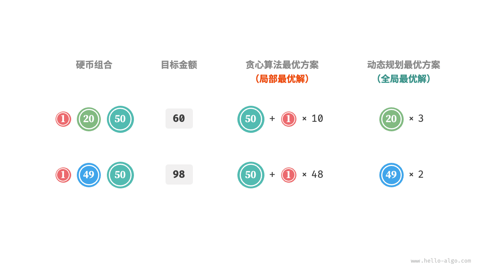
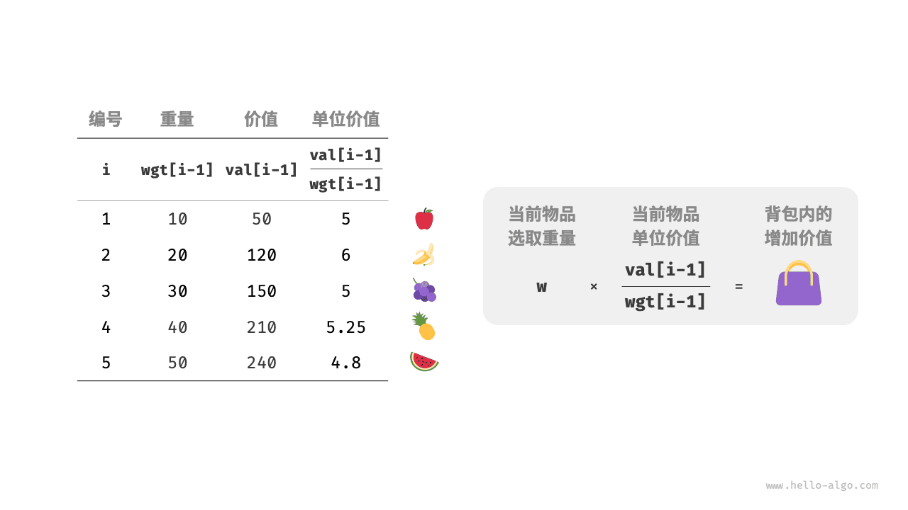
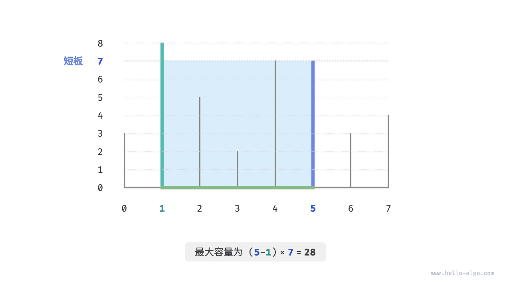
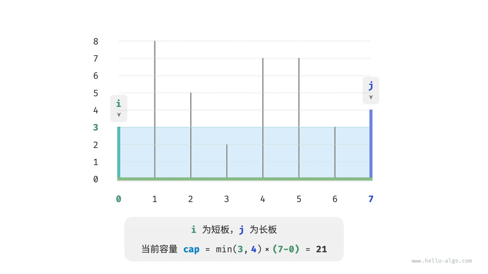
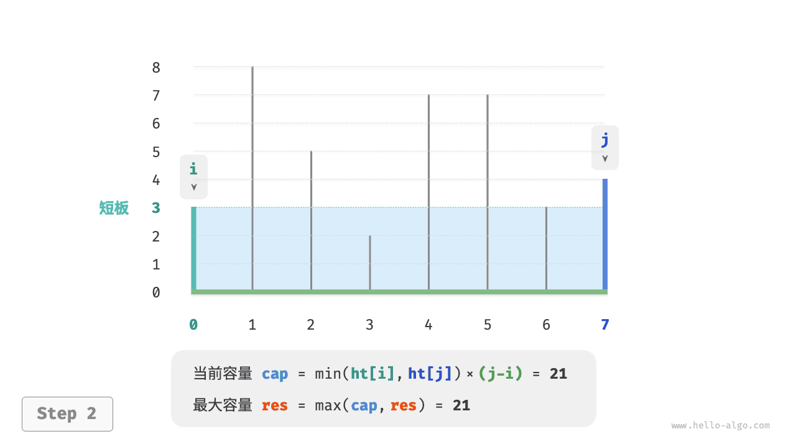
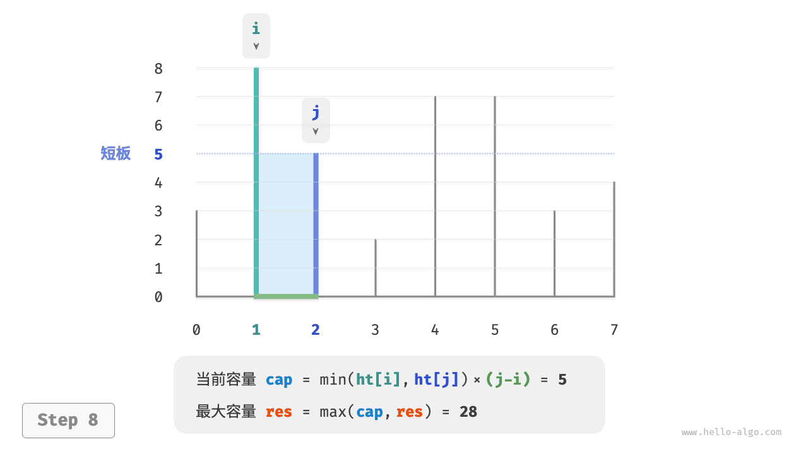
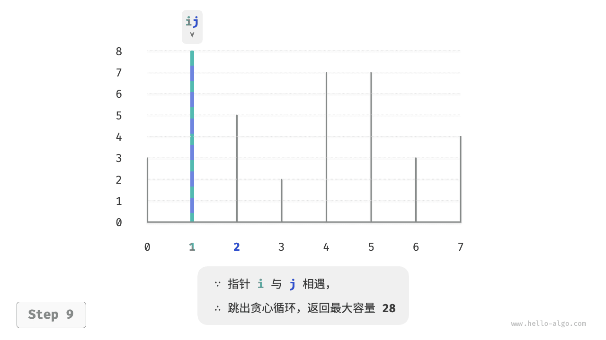
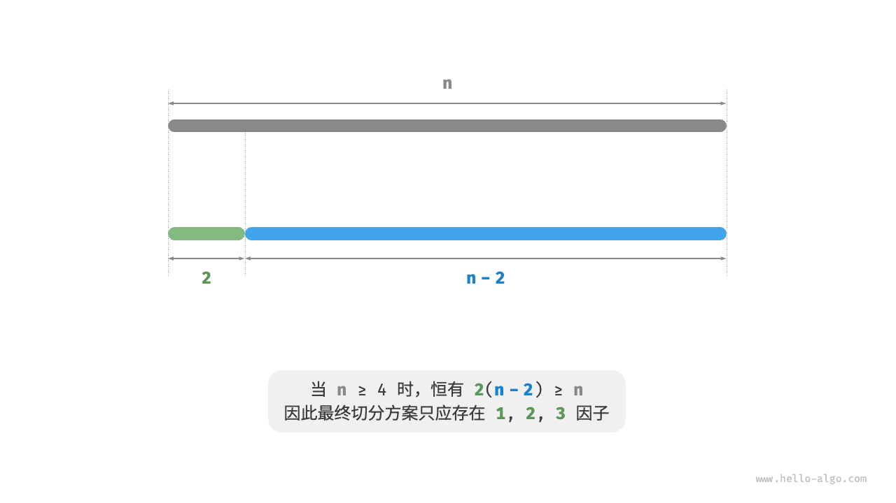
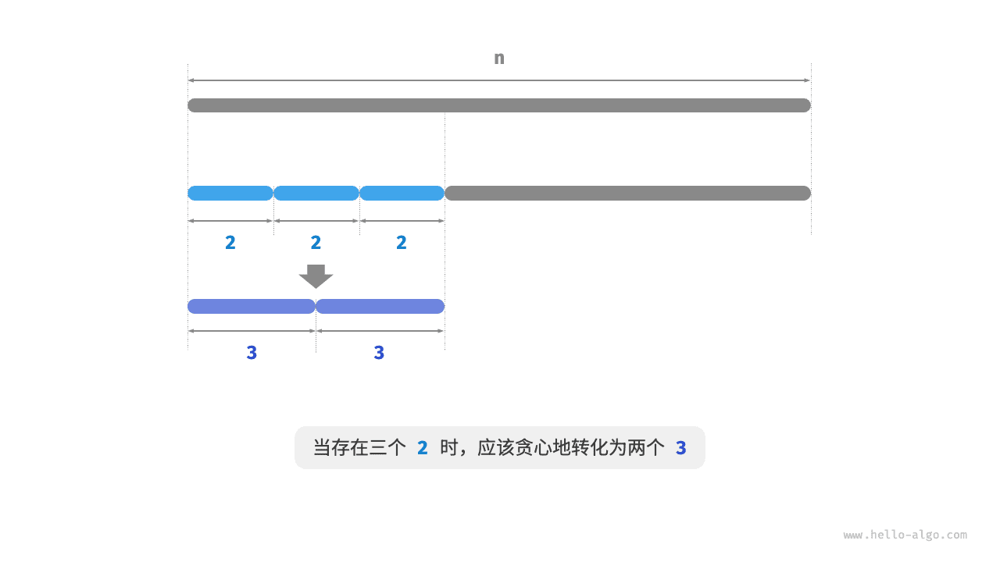

# 贪心

!!! abstract

    向日葵朝着太阳转动，时刻追求自身成长的最大可能。

    贪心策略在一轮轮的简单选择中，逐步导向最佳答案。

# 贪心算法

<u>贪心算法（greedy algorithm）</u>是一种常见的解决优化问题的算法，其基本思想是在问题的每个决策阶段，都选择当前看起来最优的选择，即贪心地做出局部最优的决策，以期获得全局最优解。贪心算法简洁且高效，在许多实际问题中有着广泛的应用。

贪心算法和动态规划都常用于解决优化问题。它们之间存在一些相似之处，比如都依赖最优子结构性质，但工作原理不同。

- 动态规划会根据之前阶段的所有决策来考虑当前决策，并使用过去子问题的解来构建当前子问题的解。
- 贪心算法不会考虑过去的决策，而是一路向前地进行贪心选择，不断缩小问题范围，直至问题被解决。

我们先通过例题“零钱兑换”了解贪心算法的工作原理。这道题已经在“完全背包问题”章节中介绍过，相信你对它并不陌生。

!!! question

    给定 $n$ 种硬币，第 $i$ 种硬币的面值为 $coins[i - 1]$ ，目标金额为 $amt$ ，每种硬币可以重复选取，问能够凑出目标金额的最少硬币数量。如果无法凑出目标金额，则返回 $-1$ 。

本题采取的贪心策略如下图所示。给定目标金额，**我们贪心地选择不大于且最接近它的硬币**，不断循环该步骤，直至凑出目标金额为止。


实现代码如下所示：

```python
def coin_change_greedy(coins: list[int], amt: int) -> int:
    """零钱兑换：贪心"""
    # 假设 coins 列表有序
    i = len(coins) - 1
    count = 0
    # 循环进行贪心选择，直到无剩余金额
    while amt > 0:
        # 找到小于且最接近剩余金额的硬币
        while i > 0 and coins[i] > amt:
            i -= 1
        # 选择 coins[i]
        amt -= coins[i]
        count += 1
    # 若未找到可行方案，则返回 -1
    return count if amt == 0 else -1
```

!!! example [pythontutor "可视化运行"](https://pythontutor.com/iframe-embed.html#code=def%20coin_change_greedy%28coins%3A%20list%5Bint%5D,%20amt%3A%20int%29%20-%3E%20int%3A%0A%20%20%20%20%22%22%22%E9%9B%B6%E9%92%B1%E5%85%91%E6%8D%A2%EF%BC%9A%E8%B4%AA%E5%BF%83%22%22%22%0A%20%20%20%20%23%20%E5%81%87%E8%AE%BE%20coins%20%E5%88%97%E8%A1%A8%E6%9C%89%E5%BA%8F%0A%20%20%20%20i%20%3D%20len%28coins%29%20-%201%0A%20%20%20%20count%20%3D%200%0A%20%20%20%20%23%20%E5%BE%AA%E7%8E%AF%E8%BF%9B%E8%A1%8C%E8%B4%AA%E5%BF%83%E9%80%89%E6%8B%A9%EF%BC%8C%E7%9B%B4%E5%88%B0%E6%97%A0%E5%89%A9%E4%BD%99%E9%87%91%E9%A2%9D%0A%20%20%20%20while%20amt%20%3E%200%3A%0A%20%20%20%20%20%20%20%20%23%20%E6%89%BE%E5%88%B0%E5%B0%8F%E4%BA%8E%E4%B8%94%E6%9C%80%E6%8E%A5%E8%BF%91%E5%89%A9%E4%BD%99%E9%87%91%E9%A2%9D%E7%9A%84%E7%A1%AC%E5%B8%81%0A%20%20%20%20%20%20%20%20while%20i%20%3E%200%20and%20coins%5Bi%5D%20%3E%20amt%3A%0A%20%20%20%20%20%20%20%20%20%20%20%20i%20-%3D%201%0A%20%20%20%20%20%20%20%20%23%20%E9%80%89%E6%8B%A9%20coins%5Bi%5D%0A%20%20%20%20%20%20%20%20amt%20-%3D%20coins%5Bi%5D%0A%20%20%20%20%20%20%20%20count%20%2B%3D%201%0A%20%20%20%20%23%20%E8%8B%A5%E6%9C%AA%E6%89%BE%E5%88%B0%E5%8F%AF%E8%A1%8C%E6%96%B9%E6%A1%88%EF%BC%8C%E5%88%99%E8%BF%94%E5%9B%9E%20-1%0A%20%20%20%20return%20count%20if%20amt%20%3D%3D%200%20else%20-1%0A%0A%0A%22%22%22Driver%20Code%22%22%22%0Aif%20__name__%20%3D%3D%20%22__main__%22%3A%0A%20%20%20%20%23%20%E8%B4%AA%E5%BF%83%EF%BC%9A%E8%83%BD%E5%A4%9F%E4%BF%9D%E8%AF%81%E6%89%BE%E5%88%B0%E5%85%A8%E5%B1%80%E6%9C%80%E4%BC%98%E8%A7%A3%0A%20%20%20%20coins%20%3D%20%5B1,%205,%2010,%2020,%2050,%20100%5D%0A%20%20%20%20amt%20%3D%20186%0A%20%20%20%20res%20%3D%20coin_change_greedy%28coins,%20amt%29%0A%20%20%20%20print%28f%22%5Cncoins%20%3D%20%7Bcoins%7D,%20amt%20%3D%20%7Bamt%7D%22%29%0A%20%20%20%20print%28f%22%E5%87%91%E5%88%B0%20%7Bamt%7D%20%E6%89%80%E9%9C%80%E7%9A%84%E6%9C%80%E5%B0%91%E7%A1%AC%E5%B8%81%E6%95%B0%E9%87%8F%E4%B8%BA%20%7Bres%7D%22%29%0A%0A%20%20%20%20%23%20%E8%B4%AA%E5%BF%83%EF%BC%9A%E6%97%A0%E6%B3%95%E4%BF%9D%E8%AF%81%E6%89%BE%E5%88%B0%E5%85%A8%E5%B1%80%E6%9C%80%E4%BC%98%E8%A7%A3%0A%20%20%20%20coins%20%3D%20%5B1,%2020,%2050%5D%0A%20%20%20%20amt%20%3D%2060%0A%20%20%20%20res%20%3D%20coin_change_greedy%28coins,%20amt%29%0A%20%20%20%20print%28f%22%5Cncoins%20%3D%20%7Bcoins%7D,%20amt%20%3D%20%7Bamt%7D%22%29%0A%20%20%20%20print%28f%22%E5%87%91%E5%88%B0%20%7Bamt%7D%20%E6%89%80%E9%9C%80%E7%9A%84%E6%9C%80%E5%B0%91%E7%A1%AC%E5%B8%81%E6%95%B0%E9%87%8F%E4%B8%BA%20%7Bres%7D%22%29%0A%20%20%20%20print%28f%22%E5%AE%9E%E9%99%85%E4%B8%8A%E9%9C%80%E8%A6%81%E7%9A%84%E6%9C%80%E5%B0%91%E6%95%B0%E9%87%8F%E4%B8%BA%203%20%EF%BC%8C%E5%8D%B3%2020%20%2B%2020%20%2B%2020%22%29&codeDivHeight=800&codeDivWidth=600&cumulative=false&curInstr=5&heapPrimitives=nevernest&origin=opt-frontend.js&py=311&rawInputLstJSON=%5B%5D&textReferences=false)

你可能会不由地发出感叹：So clean ！贪心算法仅用约十行代码就解决了零钱兑换问题。

## 贪心算法的优点与局限性

**贪心算法不仅操作直接、实现简单，而且通常效率也很高**。在以上代码中，记硬币最小面值为 $\min(coins)$ ，则贪心选择最多循环 $amt / \min(coins)$ 次，时间复杂度为 $O(amt / \min(coins))$ 。这比动态规划解法的时间复杂度 $O(n \times amt)$ 小了一个数量级。

然而，**对于某些硬币面值组合，贪心算法并不能找到最优解**。下图给出了两个示例。

- **正例 $coins = [1, 5, 10, 20, 50, 100]$**：在该硬币组合下，给定任意 $amt$ ，贪心算法都可以找到最优解。
- **反例 $coins = [1, 20, 50]$**：假设 $amt = 60$ ，贪心算法只能找到 $50 + 1 \times 10$ 的兑换组合，共计 $11$ 枚硬币，但动态规划可以找到最优解 $20 + 20 + 20$ ，仅需 $3$ 枚硬币。
- **反例 $coins = [1, 49, 50]$**：假设 $amt = 98$ ，贪心算法只能找到 $50 + 1 \times 48$ 的兑换组合，共计 $49$ 枚硬币，但动态规划可以找到最优解 $49 + 49$ ，仅需 $2$ 枚硬币。



也就是说，对于零钱兑换问题，贪心算法无法保证找到全局最优解，并且有可能找到非常差的解。它更适合用动态规划解决。

一般情况下，贪心算法的适用情况分以下两种。

1. **可以保证找到最优解**：贪心算法在这种情况下往往是最优选择，因为它往往比回溯、动态规划更高效。
2. **可以找到近似最优解**：贪心算法在这种情况下也是可用的。对于很多复杂问题来说，寻找全局最优解非常困难，能以较高效率找到次优解也是非常不错的。

## 贪心算法特性

那么问题来了，什么样的问题适合用贪心算法求解呢？或者说，贪心算法在什么情况下可以保证找到最优解？

相较于动态规划，贪心算法的使用条件更加苛刻，其主要关注问题的两个性质。

- **贪心选择性质**：只有当局部最优选择始终可以导致全局最优解时，贪心算法才能保证得到最优解。
- **最优子结构**：原问题的最优解包含子问题的最优解。

最优子结构已经在“动态规划”章节中介绍过，这里不再赘述。值得注意的是，一些问题的最优子结构并不明显，但仍然可使用贪心算法解决。

我们主要探究贪心选择性质的判断方法。虽然它的描述看上去比较简单，**但实际上对于许多问题，证明贪心选择性质并非易事**。

例如零钱兑换问题，我们虽然能够容易地举出反例，对贪心选择性质进行证伪，但证实的难度较大。如果问：**满足什么条件的硬币组合可以使用贪心算法求解**？我们往往只能凭借直觉或举例子来给出一个模棱两可的答案，而难以给出严谨的数学证明。

!!! quote

    有一篇论文给出了一个 $O(n^3)$ 时间复杂度的算法，用于判断一个硬币组合能否使用贪心算法找出任意金额的最优解。

    Pearson, D. A polynomial-time algorithm for the change-making problem[J]. Operations Research Letters, 2005, 33(3): 231-234.

## 贪心算法解题步骤

贪心问题的解决流程大体可分为以下三步。

1. **问题分析**：梳理与理解问题特性，包括状态定义、优化目标和约束条件等。这一步在回溯和动态规划中都有涉及。
2. **确定贪心策略**：确定如何在每一步中做出贪心选择。这个策略能够在每一步减小问题的规模，并最终解决整个问题。
3. **正确性证明**：通常需要证明问题具有贪心选择性质和最优子结构。这个步骤可能需要用到数学证明，例如归纳法或反证法等。

确定贪心策略是求解问题的核心步骤，但实施起来可能并不容易，主要有以下原因。

- **不同问题的贪心策略的差异较大**。对于许多问题来说，贪心策略比较浅显，我们通过一些大概的思考与尝试就能得出。而对于一些复杂问题，贪心策略可能非常隐蔽，这种情况就非常考验个人的解题经验与算法能力了。
- **某些贪心策略具有较强的迷惑性**。当我们满怀信心设计好贪心策略，写出解题代码并提交运行，很可能发现部分测试样例无法通过。这是因为设计的贪心策略只是“部分正确”的，上文介绍的零钱兑换就是一个典型案例。

为了保证正确性，我们应该对贪心策略进行严谨的数学证明，**通常需要用到反证法或数学归纳法**。

然而，正确性证明也很可能不是一件易事。如若没有头绪，我们通常会选择面向测试用例进行代码调试，一步步修改与验证贪心策略。

## 贪心算法典型例题

贪心算法常常应用在满足贪心选择性质和最优子结构的优化问题中，以下列举了一些典型的贪心算法问题。

- **硬币找零问题**：在某些硬币组合下，贪心算法总是可以得到最优解。
- **区间调度问题**：假设你有一些任务，每个任务在一段时间内进行，你的目标是完成尽可能多的任务。如果每次都选择结束时间最早的任务，那么贪心算法就可以得到最优解。
- **分数背包问题**：给定一组物品和一个载重量，你的目标是选择一组物品，使得总重量不超过载重量，且总价值最大。如果每次都选择性价比最高（价值 / 重量）的物品，那么贪心算法在一些情况下可以得到最优解。
- **股票买卖问题**：给定一组股票的历史价格，你可以进行多次买卖，但如果你已经持有股票，那么在卖出之前不能再买，目标是获取最大利润。
- **霍夫曼编码**：霍夫曼编码是一种用于无损数据压缩的贪心算法。通过构建霍夫曼树，每次选择出现频率最低的两个节点合并，最后得到的霍夫曼树的带权路径长度（编码长度）最小。
- **Dijkstra 算法**：它是一种解决给定源顶点到其余各顶点的最短路径问题的贪心算法。

# 分数背包问题

!!! question

    给定 $n$ 个物品，第 $i$ 个物品的重量为 $wgt[i-1]$、价值为 $val[i-1]$ ，和一个容量为 $cap$ 的背包。每个物品只能选择一次，**但可以选择物品的一部分，价值根据选择的重量比例计算**，问在限定背包容量下背包中物品的最大价值。示例如下图所示。


分数背包问题和 0-1 背包问题整体上非常相似，状态包含当前物品 $i$ 和容量 $c$ ，目标是求限定背包容量下的最大价值。

不同点在于，本题允许只选择物品的一部分。如下图所示，**我们可以对物品任意地进行切分，并按照重量比例来计算相应价值**。

1. 对于物品 $i$ ，它在单位重量下的价值为 $val[i-1] / wgt[i-1]$ ，简称单位价值。
2. 假设放入一部分物品 $i$ ，重量为 $w$ ，则背包增加的价值为 $w \times val[i-1] / wgt[i-1]$ 。



### 贪心策略确定

最大化背包内物品总价值，**本质上是最大化单位重量下的物品价值**。由此便可推理出下图所示的贪心策略。

1. 将物品按照单位价值从高到低进行排序。
2. 遍历所有物品，**每轮贪心地选择单位价值最高的物品**。
3. 若剩余背包容量不足，则使用当前物品的一部分填满背包。


### 代码实现

我们建立了一个物品类 `Item` ，以便将物品按照单位价值进行排序。循环进行贪心选择，当背包已满时跳出并返回解：

```python
class Item:
    """物品"""

    def __init__(self, w: int, v: int):
        self.w = w  # 物品重量
        self.v = v  # 物品价值

def fractional_knapsack(wgt: list[int], val: list[int], cap: int) -> int:
    """分数背包：贪心"""
    # 创建物品列表，包含两个属性：重量、价值
    items = [Item(w, v) for w, v in zip(wgt, val)]
    # 按照单位价值 item.v / item.w 从高到低进行排序
    items.sort(key=lambda item: item.v / item.w, reverse=True)
    # 循环贪心选择
    res = 0
    for item in items:
        if item.w <= cap:
            # 若剩余容量充足，则将当前物品整个装进背包
            res += item.v
            cap -= item.w
        else:
            # 若剩余容量不足，则将当前物品的一部分装进背包
            res += (item.v / item.w) * cap
            # 已无剩余容量，因此跳出循环
            break
    return res
```

!!! example [pythontutor "可视化运行"](https://pythontutor.com/iframe-embed.html#code=class%20Item%3A%0A%20%20%20%20%22%22%22%E7%89%A9%E5%93%81%22%22%22%0A%20%20%20%20def%20__init__%28self,%20w%3A%20int,%20v%3A%20int%29%3A%0A%20%20%20%20%20%20%20%20self.w%20%3D%20w%20%20%23%20%E7%89%A9%E5%93%81%E9%87%8D%E9%87%8F%0A%20%20%20%20%20%20%20%20self.v%20%3D%20v%20%20%23%20%E7%89%A9%E5%93%81%E4%BB%B7%E5%80%BC%0A%0Adef%20fractional_knapsack%28wgt%3A%20list%5Bint%5D,%20val%3A%20list%5Bint%5D,%20cap%3A%20int%29%20-%3E%20int%3A%0A%20%20%20%20%22%22%22%E5%88%86%E6%95%B0%E8%83%8C%E5%8C%85%EF%BC%9A%E8%B4%AA%E5%BF%83%22%22%22%0A%20%20%20%20%23%20%E5%88%9B%E5%BB%BA%E7%89%A9%E5%93%81%E5%88%97%E8%A1%A8%EF%BC%8C%E5%8C%85%E5%90%AB%E4%B8%A4%E4%B8%AA%E5%B1%9E%E6%80%A7%EF%BC%9A%E9%87%8D%E9%87%8F%E3%80%81%E4%BB%B7%E5%80%BC%0A%20%20%20%20items%20%3D%20%5BItem%28w,%20v%29%20for%20w,%20v%20in%20zip%28wgt,%20val%29%5D%0A%20%20%20%20%23%20%E6%8C%89%E7%85%A7%E5%8D%95%E4%BD%8D%E4%BB%B7%E5%80%BC%20item.v%20/%20item.w%20%E4%BB%8E%E9%AB%98%E5%88%B0%E4%BD%8E%E8%BF%9B%E8%A1%8C%E6%8E%92%E5%BA%8F%0A%20%20%20%20items.sort%28key%3Dlambda%20item%3A%20item.v%20/%20item.w,%20reverse%3DTrue%29%0A%20%20%20%20%23%20%E5%BE%AA%E7%8E%AF%E8%B4%AA%E5%BF%83%E9%80%89%E6%8B%A9%0A%20%20%20%20res%20%3D%200%0A%20%20%20%20for%20item%20in%20items%3A%0A%20%20%20%20%20%20%20%20if%20item.w%20%3C%3D%20cap%3A%0A%20%20%20%20%20%20%20%20%20%20%20%20%23%20%E8%8B%A5%E5%89%A9%E4%BD%99%E5%AE%B9%E9%87%8F%E5%85%85%E8%B6%B3%EF%BC%8C%E5%88%99%E5%B0%86%E5%BD%93%E5%89%8D%E7%89%A9%E5%93%81%E6%95%B4%E4%B8%AA%E8%A3%85%E8%BF%9B%E8%83%8C%E5%8C%85%0A%20%20%20%20%20%20%20%20%20%20%20%20res%20%2B%3D%20item.v%0A%20%20%20%20%20%20%20%20%20%20%20%20cap%20-%3D%20item.w%0A%20%20%20%20%20%20%20%20else%3A%0A%20%20%20%20%20%20%20%20%20%20%20%20%23%20%E8%8B%A5%E5%89%A9%E4%BD%99%E5%AE%B9%E9%87%8F%E4%B8%8D%E8%B6%B3%EF%BC%8C%E5%88%99%E5%B0%86%E5%BD%93%E5%89%8D%E7%89%A9%E5%93%81%E7%9A%84%E4%B8%80%E9%83%A8%E5%88%86%E8%A3%85%E8%BF%9B%E8%83%8C%E5%8C%85%0A%20%20%20%20%20%20%20%20%20%20%20%20res%20%2B%3D%20%28item.v%20/%20item.w%29%20*%20cap%0A%20%20%20%20%20%20%20%20%20%20%20%20%23%20%E5%B7%B2%E6%97%A0%E5%89%A9%E4%BD%99%E5%AE%B9%E9%87%8F%EF%BC%8C%E5%9B%A0%E6%AD%A4%E8%B7%B3%E5%87%BA%E5%BE%AA%E7%8E%AF%0A%20%20%20%20%20%20%20%20%20%20%20%20break%0A%20%20%20%20return%20res%0A%0A%22%22%22Driver%20Code%22%22%22%0Aif%20__name__%20%3D%3D%20%22__main__%22%3A%0A%20%20%20%20wgt%20%3D%20%5B10,%2020,%2030,%2040,%2050%5D%0A%20%20%20%20val%20%3D%20%5B50,%20120,%20150,%20210,%20240%5D%0A%20%20%20%20cap%20%3D%2050%0A%20%20%20%20n%20%3D%20len%28wgt%29%0A%0A%20%20%20%20%23%20%E8%B4%AA%E5%BF%83%E7%AE%97%E6%B3%95%0A%20%20%20%20res%20%3D%20fractional_knapsack%28wgt,%20val,%20cap%29%0A%20%20%20%20print%28f%22%E4%B8%8D%E8%B6%85%E8%BF%87%E8%83%8C%E5%8C%85%E5%AE%B9%E9%87%8F%E7%9A%84%E6%9C%80%E5%A4%A7%E7%89%A9%E5%93%81%E4%BB%B7%E5%80%BC%E4%B8%BA%20%7Bres%7D%22%29&codeDivHeight=800&codeDivWidth=600&cumulative=false&curInstr=8&heapPrimitives=nevernest&origin=opt-frontend.js&py=311&rawInputLstJSON=%5B%5D&textReferences=false)

内置排序算法的时间复杂度通常为 $O(\log n)$ ，空间复杂度通常为 $O(\log n)$ 或 $O(n)$ ，取决于编程语言的具体实现。

除排序之外，在最差情况下，需要遍历整个物品列表，**因此时间复杂度为 $O(n)$** ，其中 $n$ 为物品数量。

由于初始化了一个 `Item` 对象列表，**因此空间复杂度为 $O(n)$** 。

### 正确性证明

采用反证法。假设物品 $x$ 是单位价值最高的物品，使用某算法求得最大价值为 `res` ，但该解中不包含物品 $x$ 。

现在从背包中拿出单位重量的任意物品，并替换为单位重量的物品 $x$ 。由于物品 $x$ 的单位价值最高，因此替换后的总价值一定大于 `res` 。**这与 `res` 是最优解矛盾，说明最优解中必须包含物品 $x$** 。

对于该解中的其他物品，我们也可以构建出上述矛盾。总而言之，**单位价值更大的物品总是更优选择**，这说明贪心策略是有效的。

如下图所示，如果将物品重量和物品单位价值分别看作一张二维图表的横轴和纵轴，则分数背包问题可转化为“求在有限横轴区间下围成的最大面积”。这个类比可以帮助我们从几何角度理解贪心策略的有效性。


# 最大容量问题

!!! question

    输入一个数组 $ht$ ，其中的每个元素代表一个垂直隔板的高度。数组中的任意两个隔板，以及它们之间的空间可以组成一个容器。
    
    容器的容量等于高度和宽度的乘积（面积），其中高度由较短的隔板决定，宽度是两个隔板的数组索引之差。
    
    请在数组中选择两个隔板，使得组成的容器的容量最大，返回最大容量。示例如下图所示。



容器由任意两个隔板围成，**因此本题的状态为两个隔板的索引，记为 $[i, j]$** 。

根据题意，容量等于高度乘以宽度，其中高度由短板决定，宽度是两隔板的数组索引之差。设容量为 $cap[i, j]$ ，则可得计算公式：

$$
cap[i, j] = \min(ht[i], ht[j]) \times (j - i)
$$

设数组长度为 $n$ ，两个隔板的组合数量（状态总数）为 $C_n^2 = \frac{n(n - 1)}{2}$ 个。最直接地，**我们可以穷举所有状态**，从而求得最大容量，时间复杂度为 $O(n^2)$ 。

### 贪心策略确定

这道题还有更高效率的解法。如下图所示，现选取一个状态 $[i, j]$ ，其满足索引 $i < j$ 且高度 $ht[i] < ht[j]$ ，即 $i$ 为短板、$j$ 为长板。



如下图所示，**若此时将长板 $j$ 向短板 $i$ 靠近，则容量一定变小**。

这是因为在移动长板 $j$ 后，宽度 $j-i$ 肯定变小；而高度由短板决定，因此高度只可能不变（ $i$ 仍为短板）或变小（移动后的 $j$ 成为短板）。


反向思考，**我们只有向内收缩短板 $i$ ，才有可能使容量变大**。因为虽然宽度一定变小，**但高度可能会变大**（移动后的短板 $i$ 可能会变长）。例如在下图中，移动短板后面积变大。


由此便可推出本题的贪心策略：初始化两指针，使其分列容器两端，每轮向内收缩短板对应的指针，直至两指针相遇。

下图展示了贪心策略的执行过程。

1. 初始状态下，指针 $i$ 和 $j$ 分列数组两端。
2. 计算当前状态的容量 $cap[i, j]$ ，并更新最大容量。
3. 比较板 $i$ 和板 $j$ 的高度，并将短板向内移动一格。
4. 循环执行第 `2.` 步和第 `3.` 步，直至 $i$ 和 $j$ 相遇时结束。

=== "<1>"
    

=== "<2>"
    

=== "<3>"
    

=== "<4>"
    

=== "<5>"
    

=== "<6>"
    

=== "<7>"
    

=== "<8>"
    

=== "<9>"
    

### 代码实现

代码循环最多 $n$ 轮，**因此时间复杂度为 $O(n)$** 。

变量 $i$、$j$、$res$ 使用常数大小的额外空间，**因此空间复杂度为 $O(1)$** 。

```python
def max_capacity(ht: list[int]) -> int:
    """最大容量：贪心"""
    # 初始化 i, j，使其分列数组两端
    i, j = 0, len(ht) - 1
    # 初始最大容量为 0
    res = 0
    # 循环贪心选择，直至两板相遇
    while i < j:
        # 更新最大容量
        cap = min(ht[i], ht[j]) * (j - i)
        res = max(res, cap)
        # 向内移动短板
        if ht[i] < ht[j]:
            i += 1
        else:
            j -= 1
    return res
```

!!! example [pythontutor "可视化运行"](https://pythontutor.com/iframe-embed.html#code=def%20max_capacity%28ht%3A%20list%5Bint%5D%29%20-%3E%20int%3A%0A%20%20%20%20%22%22%22%E6%9C%80%E5%A4%A7%E5%AE%B9%E9%87%8F%EF%BC%9A%E8%B4%AA%E5%BF%83%22%22%22%0A%20%20%20%20%23%20%E5%88%9D%E5%A7%8B%E5%8C%96%20i,%20j%EF%BC%8C%E4%BD%BF%E5%85%B6%E5%88%86%E5%88%97%E6%95%B0%E7%BB%84%E4%B8%A4%E7%AB%AF%0A%20%20%20%20i,%20j%20%3D%200,%20len%28ht%29%20-%201%0A%20%20%20%20%23%20%E5%88%9D%E5%A7%8B%E6%9C%80%E5%A4%A7%E5%AE%B9%E9%87%8F%E4%B8%BA%200%0A%20%20%20%20res%20%3D%200%0A%20%20%20%20%23%20%E5%BE%AA%E7%8E%AF%E8%B4%AA%E5%BF%83%E9%80%89%E6%8B%A9%EF%BC%8C%E7%9B%B4%E8%87%B3%E4%B8%A4%E6%9D%BF%E7%9B%B8%E9%81%87%0A%20%20%20%20while%20i%20%3C%20j%3A%0A%20%20%20%20%20%20%20%20%23%20%E6%9B%B4%E6%96%B0%E6%9C%80%E5%A4%A7%E5%AE%B9%E9%87%8F%0A%20%20%20%20%20%20%20%20cap%20%3D%20min%28ht%5Bi%5D,%20ht%5Bj%5D%29%20*%20%28j%20-%20i%29%0A%20%20%20%20%20%20%20%20res%20%3D%20max%28res,%20cap%29%0A%20%20%20%20%20%20%20%20%23%20%E5%90%91%E5%86%85%E7%A7%BB%E5%8A%A8%E7%9F%AD%E6%9D%BF%0A%20%20%20%20%20%20%20%20if%20ht%5Bi%5D%20%3C%20ht%5Bj%5D%3A%0A%20%20%20%20%20%20%20%20%20%20%20%20i%20%2B%3D%201%0A%20%20%20%20%20%20%20%20else%3A%0A%20%20%20%20%20%20%20%20%20%20%20%20j%20-%3D%201%0A%20%20%20%20return%20res%0A%0A%0A%22%22%22Driver%20Code%22%22%22%0Aif%20__name__%20%3D%3D%20%22__main__%22%3A%0A%20%20%20%20ht%20%3D%20%5B3,%208,%205,%202,%207,%207,%203,%204%5D%0A%0A%20%20%20%20%23%20%E8%B4%AA%E5%BF%83%E7%AE%97%E6%B3%95%0A%20%20%20%20res%20%3D%20max_capacity%28ht%29%0A%20%20%20%20print%28f%22%E6%9C%80%E5%A4%A7%E5%AE%B9%E9%87%8F%E4%B8%BA%20%7Bres%7D%22%29&codeDivHeight=800&codeDivWidth=600&cumulative=false&curInstr=4&heapPrimitives=nevernest&origin=opt-frontend.js&py=311&rawInputLstJSON=%5B%5D&textReferences=false)

### 正确性证明

之所以贪心比穷举更快，是因为每轮的贪心选择都会“跳过”一些状态。

比如在状态 $cap[i, j]$ 下，$i$ 为短板、$j$ 为长板。若贪心地将短板 $i$ 向内移动一格，会导致下图所示的状态被“跳过”。**这意味着之后无法验证这些状态的容量大小**。

$$
cap[i, i+1], cap[i, i+2], \dots, cap[i, j-2], cap[i, j-1]
$$


观察发现，**这些被跳过的状态实际上就是将长板 $j$ 向内移动的所有状态**。前面我们已经证明内移长板一定会导致容量变小。也就是说，被跳过的状态都不可能是最优解，**跳过它们不会导致错过最优解**。

以上分析说明，移动短板的操作是“安全”的，贪心策略是有效的。

# 最大切分乘积问题

!!! question

    给定一个正整数 $n$ ，将其切分为至少两个正整数的和，求切分后所有整数的乘积最大是多少，如下图所示。


假设我们将 $n$ 切分为 $m$ 个整数因子，其中第 $i$ 个因子记为 $n_i$ ，即

$$
n = \sum_{i=1}^{m}n_i
$$

本题的目标是求得所有整数因子的最大乘积，即

$$
\max(\prod_{i=1}^{m}n_i)
$$

我们需要思考的是：切分数量 $m$ 应该多大，每个 $n_i$ 应该是多少？

### 贪心策略确定

根据经验，两个整数的乘积往往比它们的加和更大。假设从 $n$ 中分出一个因子 $2$ ，则它们的乘积为 $2(n-2)$ 。我们将该乘积与 $n$ 作比较：

$$
\begin{aligned}
2(n-2) & \geq n \newline
2n - n - 4 & \geq 0 \newline
n & \geq 4
\end{aligned}
$$

如下图所示，当 $n \geq 4$ 时，切分出一个 $2$ 后乘积会变大，**这说明大于等于 $4$ 的整数都应该被切分**。

**贪心策略一**：如果切分方案中包含 $\geq 4$ 的因子，那么它就应该被继续切分。最终的切分方案只应出现 $1$、$2$、$3$ 这三种因子。



接下来思考哪个因子是最优的。在 $1$、$2$、$3$ 这三个因子中，显然 $1$ 是最差的，因为 $1 \times (n-1) < n$ 恒成立，即切分出 $1$ 反而会导致乘积减小。

如下图所示，当 $n = 6$ 时，有 $3 \times 3 > 2 \times 2 \times 2$ 。**这意味着切分出 $3$ 比切分出 $2$ 更优**。

**贪心策略二**：在切分方案中，最多只应存在两个 $2$ 。因为三个 $2$ 总是可以替换为两个 $3$ ，从而获得更大的乘积。



综上所述，可推理出以下贪心策略。

1. 输入整数 $n$ ，从其不断地切分出因子 $3$ ，直至余数为 $0$、$1$、$2$ 。
2. 当余数为 $0$ 时，代表 $n$ 是 $3$ 的倍数，因此不做任何处理。
3. 当余数为 $2$ 时，不继续划分，保留。
4. 当余数为 $1$ 时，由于 $2 \times 2 > 1 \times 3$ ，因此应将最后一个 $3$ 替换为 $2$ 。

### 代码实现

如下图所示，我们无须通过循环来切分整数，而可以利用向下整除运算得到 $3$ 的个数 $a$ ，用取模运算得到余数 $b$ ，此时有：

$$
n = 3 a + b
$$

请注意，对于 $n \leq 3$ 的边界情况，必须拆分出一个 $1$ ，乘积为 $1 \times (n - 1)$ 。

```python
def max_product_cutting(n: int) -> int:
    """最大切分乘积：贪心"""
    # 当 n <= 3 时，必须切分出一个 1
    if n <= 3:
        return 1 * (n - 1)
    # 贪心地切分出 3 ，a 为 3 的个数，b 为余数
    a, b = n // 3, n % 3
    if b == 1:
        # 当余数为 1 时，将一对 1 * 3 转化为 2 * 2
        return int(math.pow(3, a - 1)) * 2 * 2
    if b == 2:
        # 当余数为 2 时，不做处理
        return int(math.pow(3, a)) * 2
    # 当余数为 0 时，不做处理
    return int(math.pow(3, a))
```

!!! example [pythontutor "可视化运行"](https://pythontutor.com/iframe-embed.html#code=import%20math%0A%0Adef%20max_product_cutting%28n%3A%20int%29%20-%3E%20int%3A%0A%20%20%20%20%22%22%22%E6%9C%80%E5%A4%A7%E5%88%87%E5%88%86%E4%B9%98%E7%A7%AF%EF%BC%9A%E8%B4%AA%E5%BF%83%22%22%22%0A%20%20%20%20%23%20%E5%BD%93%20n%20%3C%3D%203%20%E6%97%B6%EF%BC%8C%E5%BF%85%E9%A1%BB%E5%88%87%E5%88%86%E5%87%BA%E4%B8%80%E4%B8%AA%201%0A%20%20%20%20if%20n%20%3C%3D%203%3A%0A%20%20%20%20%20%20%20%20return%201%20*%20%28n%20-%201%29%0A%20%20%20%20%23%20%E8%B4%AA%E5%BF%83%E5%9C%B0%E5%88%87%E5%88%86%E5%87%BA%203%20%EF%BC%8Ca%20%E4%B8%BA%203%20%E7%9A%84%E4%B8%AA%E6%95%B0%EF%BC%8Cb%20%E4%B8%BA%E4%BD%99%E6%95%B0%0A%20%20%20%20a,%20b%20%3D%20n%20//%203,%20n%20%25%203%0A%20%20%20%20if%20b%20%3D%3D%201%3A%0A%20%20%20%20%20%20%20%20%23%20%E5%BD%93%E4%BD%99%E6%95%B0%E4%B8%BA%201%20%E6%97%B6%EF%BC%8C%E5%B0%86%E4%B8%80%E5%AF%B9%201%20*%203%20%E8%BD%AC%E5%8C%96%E4%B8%BA%202%20*%202%0A%20%20%20%20%20%20%20%20return%20int%28math.pow%283,%20a%20-%201%29%29%20*%202%20*%202%0A%20%20%20%20if%20b%20%3D%3D%202%3A%0A%20%20%20%20%20%20%20%20%23%20%E5%BD%93%E4%BD%99%E6%95%B0%E4%B8%BA%202%20%E6%97%B6%EF%BC%8C%E4%B8%8D%E5%81%9A%E5%A4%84%E7%90%86%0A%20%20%20%20%20%20%20%20return%20int%28math.pow%283,%20a%29%29%20*%202%0A%20%20%20%20%23%20%E5%BD%93%E4%BD%99%E6%95%B0%E4%B8%BA%200%20%E6%97%B6%EF%BC%8C%E4%B8%8D%E5%81%9A%E5%A4%84%E7%90%86%0A%20%20%20%20return%20int%28math.pow%283,%20a%29%29%0A%0A%22%22%22Driver%20Code%22%22%22%0Aif%20__name__%20%3D%3D%20%22__main__%22%3A%0A%20%20%20%20n%20%3D%2058%0A%0A%20%20%20%20%23%20%E8%B4%AA%E5%BF%83%E7%AE%97%E6%B3%95%0A%20%20%20%20res%20%3D%20max_product_cutting%28n%29%0A%20%20%20%20print%28f%22%E6%9C%80%E5%A4%A7%E5%88%87%E5%88%86%E4%B9%98%E7%A7%AF%E4%B8%BA%20%7Bres%7D%22%29&codeDivHeight=800&codeDivWidth=600&cumulative=false&curInstr=5&heapPrimitives=nevernest&origin=opt-frontend.js&py=311&rawInputLstJSON=%5B%5D&textReferences=false)


**时间复杂度取决于编程语言的幂运算的实现方法**。以 Python 为例，常用的幂计算函数有三种。

- 运算符 `**` 和函数 `pow()` 的时间复杂度均为 $O(\log⁡ a)$ 。
- 函数 `math.pow()` 内部调用 C 语言库的 `pow()` 函数，其执行浮点取幂，时间复杂度为 $O(1)$ 。

变量 $a$ 和 $b$ 使用常数大小的额外空间，**因此空间复杂度为 $O(1)$** 。

### 正确性证明

使用反证法，只分析 $n \geq 4$ 的情况。

1. **所有因子 $\leq 3$** ：假设最优切分方案中存在 $\geq 4$ 的因子 $x$ ，那么一定可以将其继续划分为 $2(x-2)$ ，从而获得更大（或相等）的乘积。这与假设矛盾。
2. **切分方案不包含 $1$** ：假设最优切分方案中存在一个因子 $1$ ，那么它一定可以合并入另外一个因子中，以获得更大的乘积。这与假设矛盾。
3. **切分方案最多包含两个 $2$** ：假设最优切分方案中包含三个 $2$ ，那么一定可以替换为两个 $3$ ，乘积更大。这与假设矛盾。

# 小结

### 重点回顾

- 贪心算法通常用于解决最优化问题，其原理是在每个决策阶段都做出局部最优的决策，以期获得全局最优解。
- 贪心算法会迭代地做出一个又一个的贪心选择，每轮都将问题转化成一个规模更小的子问题，直到问题被解决。
- 贪心算法不仅实现简单，还具有很高的解题效率。相比于动态规划，贪心算法的时间复杂度通常更低。
- 在零钱兑换问题中，对于某些硬币组合，贪心算法可以保证找到最优解；对于另外一些硬币组合则不然，贪心算法可能找到很差的解。
- 适合用贪心算法求解的问题具有两大性质：贪心选择性质和最优子结构。贪心选择性质代表贪心策略的有效性。
- 对于某些复杂问题，贪心选择性质的证明并不简单。相对来说，证伪更加容易，例如零钱兑换问题。
- 求解贪心问题主要分为三步：问题分析、确定贪心策略、正确性证明。其中，确定贪心策略是核心步骤，正确性证明往往是难点。
- 分数背包问题在 0-1 背包的基础上，允许选择物品的一部分，因此可使用贪心算法求解。贪心策略的正确性可以使用反证法来证明。
- 最大容量问题可使用穷举法求解，时间复杂度为 $O(n^2)$ 。通过设计贪心策略，每轮向内移动短板，可将时间复杂度优化至 $O(n)$ 。
- 在最大切分乘积问题中，我们先后推理出两个贪心策略：$\geq 4$ 的整数都应该继续切分，最优切分因子为 $3$ 。代码中包含幂运算，时间复杂度取决于幂运算实现方法，通常为 $O(1)$ 或 $O(\log n)$ 。
