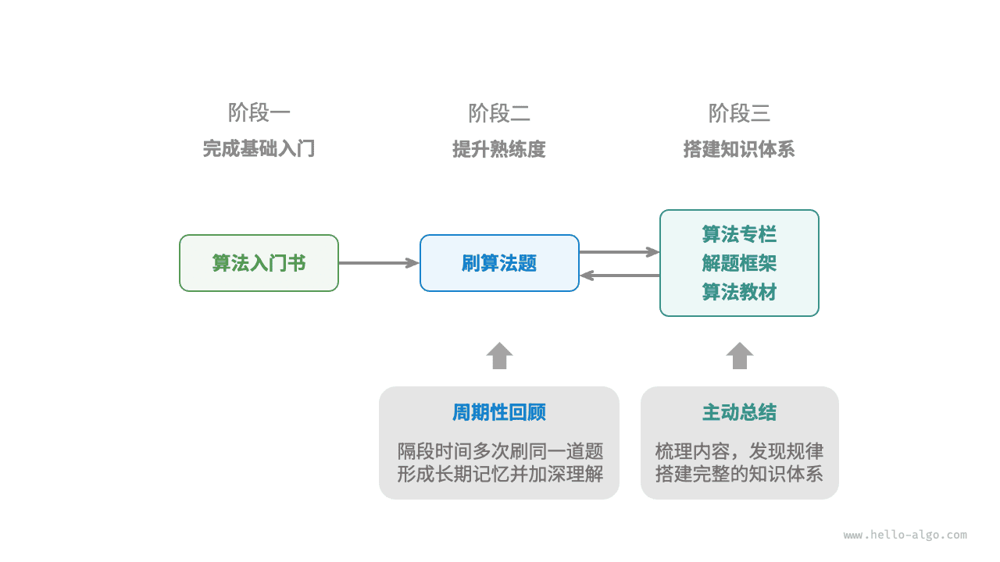
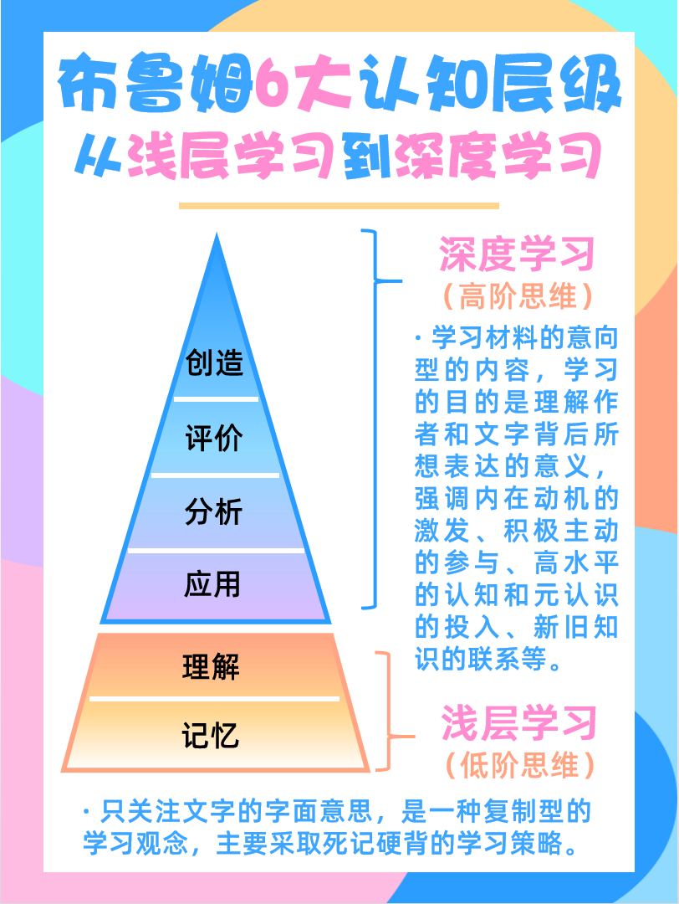
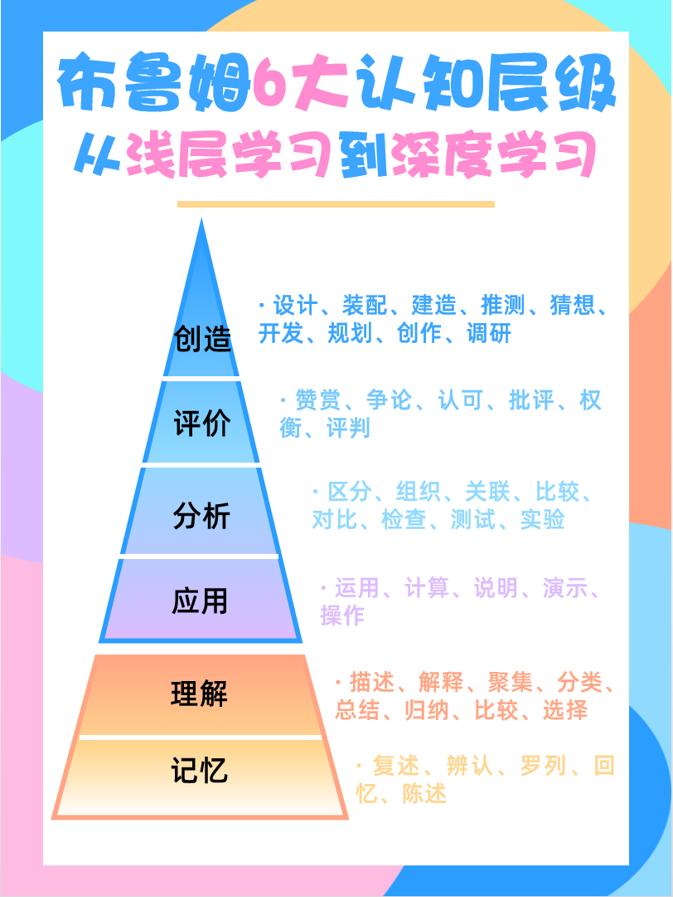

# 学海无涯

!!! abstract

    《老子》第六十四章：“合抱之木，生于毫末；九层之台，起于累土；千里之行，始于足下。”

    书山有路勤为径，学海无涯苦作舟
    （唐代文学家、唐宋八大家之首韩愈的治学名联）

## 语言学习路线 —— 如何系统的学好一门编程语言？

所有编程语言都是相通的，按照这四步来，关键是坚持：

- 第一步：基础语法学习
- 第二步：用这个语言实现基础的数据结构
  - 务必自己能写出来
- 第三步：用这个语言刷一些基础的算法题
  - 提升编程思维，以及解决问题的能力
- 第四步：做一个实战的项目
  - 手写代码不低于 K SLOC

!!! failure 初学者第一难：简单的不想做，难的不会做！

第一步：基础语法学习
- 数据类型
- 运算符
- 分支和循环
- 数组/列表
- 函数/作用域
- 结构体或类

第二步：用这个语言实现基础的数据结构
- 顺序表、链表
- 栈、队列、串
- 树、二叉树、BST
- 图的概念
- 邻接矩阵、邻接表
- 哈希表

第三步：用这个语言刷一些基础的算法题
- 枚举、排序
- 模拟、贪心
- 二分枚举
- 前缀和、差分
- 滑窗、双指针
- 深搜、广搜
- 动态规划

第四步：做一个实战的项目
- 前置条件：
  - Python 标准库： https://docs.python.org/zh-cn/3.14/library/index.html 
    - 该手册提供了有关标准库中的类型、函数和模块的完整（但简洁）的参考资料。 标准 Python 分发版包括 许多 附加代码。 
    - 这些模块可以完成读取 Unix 邮箱，通过 HTTP 获取文档，生成随机数，解析命令行选项，压缩数据以及许多其他任务。 
    - 浏览标准库参考将使你了解有哪些可用的功能。
  - Python 语言参考手册：https://docs.python.org/zh-cn/3.14/reference/index.html 
    - Python的语法和语义的详细解释。
    - 尽管阅读完非常繁重，但作为语言本身的完整指南是有用的。

!!! abstract 没有学不会的 Python 语言，只有不对的学习姿势

    欲成py神，先修五行：

    1、学习能力：学习基础语法，理解计算思维
    2、吸收能力：大量阅读和使用各类库函数
    3、数算能力：理解和使用各种数据结构与算法
    4、动手能力：自己编代码，自己调Bug，记住：只看+不练=假把戏
    5、赏析能力：搜索、阅读、欣赏优秀的代码
    
    进阶之门：需学习计算机专业的核心知识，比如说操作系统、系统结构等 

## 算法学习路线

从总体上看，我们可以将学习数据结构与算法的过程划分为三个阶段。

1. **阶段一：算法入门**。我们需要熟悉各种数据结构的特点和用法，学习不同算法的原理、流程、用途和效率等方面的内容。
2. **阶段二：刷算法题**。建议从热门题目开刷，先积累至少 100 道题目，熟悉主流的算法问题。初次刷题时，“知识遗忘”可能是一个挑战，但请放心，这是很正常的。我们可以按照“艾宾浩斯遗忘曲线”来复习题目，通常在进行 3～5 轮的重复后，就能将其牢记在心。推荐的题单和刷题计划见下
3. **阶段三：搭建知识体系**。在学习方面，我们可以阅读算法专栏文章、解题框架和算法教材，以不断丰富知识体系。在刷题方面，可以尝试采用进阶刷题策略，如按专题分类、一题多解、一解多题等，相关的刷题心得可以在各个社区找到。

如下图所示，本书内容主要涵盖“阶段一”，旨在帮助你更高效地展开阶段二和阶段三的学习。

!!! note 遗忘曲线 from AI（扩展阅读：https://en.wikipedia.org/wiki/Forgetting_curve）

    艾宾浩斯遗忘曲线（Ebbinghaus Forgetting Curve）是19世纪德国心理学家赫尔曼·艾宾浩斯（Hermann Ebbinghaus）​ 通过实验提出的人类记忆遗忘规律的经典模型，描述了新学信息随时间推移而遗忘的进程。

    核心结论：遗忘“先快后慢、先多后少”——学习后立即开始遗忘，初期（1小时内）速度最快，24小时遗忘量超60%，31天后趋于稳定（剩余约20%）。

    实验方法：以无意义音节（如“ZOT”）为材料，用“节省法”（再学习时间差）测遗忘量，排除经验干扰。

    核心应用：及时复习+间隔重复。按遗忘临界点安排复习：短期（20分钟、1小时、8小时）、中期（1天、2天、6天）、长期（31天、3个月），如背单词“当天→睡前→次日→第3/7/15天”循环。

    意义：揭示记忆需主动维护，反对“临时抱佛脚”，提倡分散学习、意义编码（关联旧知）、多感官参与。

    误区：非所有材料遗忘速度相同（有意义内容更慢），遗忘也非单纯“丢失”而是提取失败。

    价值：为高效学习提供科学框架，证明“对抗遗忘”是记忆关键。

## 推荐的题单和刷题计划

- 初学者可以先刷 CodeForce 中的 cf800 的题目，可用来熟悉语法
  - Easy、Medium、Tough：参考CF的 900～1100, 1200~1400，1500～1600+
  - 难度控制：Easy题目大约需要10分钟完成；Medium题目大约需要20分钟完成；Tough题目因为每个学生的能力不同，因人而异
- Leetcode 热题100：题目分类特别好，难度较大
  - 计概B上完应该能做70道题，数算B上完应该能完成100道题
- 《哈喽算法》推荐的题单和刷题计划： [GitHub 仓库](https://github.com/krahets/LeetCode-Book)

## 费曼学习法

!!! tip

    Knowledge isn't free. You have to pay attention.
    （Richard P. Feynman，这里的pay双关：知识并不免费，必须费时费力才能获取）

!!! tip

    如果你无法简单的解释，就说明你没有理解透彻
    If you can’t explain it simply, you don’t understand it well enough.
    
    -- Albert Einstein（爱因斯坦）

费曼学习法（Feynman Technique）是由诺贝尔物理学奖得主、美国物理学家理查德·费曼（Richard Feynman）​总结的一种高效学习方法。

其核心逻辑是“通过输出（教授他人）倒逼输入（深度理解）”，强调用简单语言解释复杂概念，从而检验自己对知识的掌握程度，并推动对知识的真正吸收。

费曼本人曾用这种方法快速掌握新领域知识，他的学习理念被总结为一套可操作的步骤，广泛应用于学习、教学和自我提升场景。

!!! note 费曼学习法的四大核心步骤

    费曼学习法的操作流程可概括为以下四步，形成“学习→输出→修正→简化”的闭环：

    - **明确目标**：选择一个具体的知识点
    - **模拟教学**：假装向一个“小白”讲解它
    - **发现漏洞**：回到源头填补知识缺口
    - **简化与整合**：用类比或故事重构知识

1. 明确目标：选择一个具体的知识点
   - ​选择一个你想学习的概念或主题（可以是一本书的章节、一个公式、一项技能等），用具体问题界定目标（例如：“什么是相对论？”“如何解释光合作用？”）。
   - 关键点：目标要足够具体，避免模糊（如“学好数学”不如“理解微积分的基本定理”）。
2. 模拟教学：假装向一个“小白”讲解它​
   - 拿出纸和笔，​假装你在给一个完全不懂该领域的人（比如中学生、朋友）讲解这个知识点。过程中：
       - 用口语化、简单的语言描述，避免专业术语；
       - 记录讲解时的卡壳、犹豫或无法解释的部分（这是你的知识漏洞）；
       - 可以录音或录像，事后复盘自己的表达逻辑是否清晰。
   - 原理：输出时，大脑需要调用已有知识并组织语言，这会暴露你“ **以为懂了但实际没懂** ”的部分（认知科学中的“生成效应”）。
3. 发现漏洞：回到源头填补知识缺口
   - ​在模拟教学中，你会发现自己卡壳的地方（比如某个术语无法解释、逻辑链断裂）。此时：
       - 针对这些漏洞，重新查阅资料、教材或请教他人，​彻底搞懂；
       - 重点解决“为什么”（比如“这个公式的物理意义是什么？”“这个结论是如何推导的？”），而非仅记忆表面信息。
   - 关键点：漏洞是提升的机会，必须回到原始材料，确保 **对知识的理解是“底层”且“连贯”的**。
4. 简化与整合：用类比或故事重构知识
   - ​当你能流畅解释知识点后，尝试用更简洁的语言或生活中的类比重新表述它。目标是让一个完全陌生的人也能听懂。
      - 例如，用“台球碰撞”类比动量守恒，用“快递分拣”解释细胞的囊泡运输；
      - 最终形成一个属于自己的知识框架​（可能是一段讲解稿、一张思维导图或几个关键例子）。
   - 原理：简化和类比是深度理解的标志，能 **将碎片化知识转化为系统化的认知** （认知科学中的“组块化”）。

!!! note 费曼学习法的底层逻辑

    费曼学习法之所以高效，是因为它契合了人类认知的规律：

    - **​输出驱动输入**​：被动阅读或听课是“输入”，而主动讲解是“输出”。研究表明，“输出”（如教授、写作）的知识留存率（约90%）远高于“输入”（如阅读，约10%）（参考“学习金字塔”理论）。
    - **​暴露认知盲区**​：当我们以为“懂了”时，往往只是停留在“熟悉”层面，而非“理解”。模拟教学会强制我们面对真实的知识缺口。
    - **​强化逻辑与关联**​：用简单语言解释复杂概念，需要将知识拆解到最底层的逻辑，并建立与其他领域的关联（如用日常现象类比），这会加深对知识本质的理解。

费曼学习法几乎适用于所有需要深度学习的场景：

- ​学科学习​（如数学、物理、编程等硬知识）；
- ​技能掌握​（如写作、演讲、设计等方法论）；
- ​备考复习​（快速定位薄弱环节，针对性强化）；
- ​教学准备​（老师/培训师可通过此法梳理授课逻辑）。

!!! abstract 费曼学习法
    
    - 费曼学习法的本质是“以教促学”，通过模拟教学暴露知识漏洞，再用简化语言重构认知。
    - 它的核心不是“记住知识”，而是“真正理解知识”。
    - 正如费曼所说：“如果你不能向一个六岁小孩解释清楚某件事，说明你自己也没理解透。​” 
    - 掌握这一方法，能让学习从“机械记忆”升级为“深度内化”。

## 西蒙学习法 -- 公认最有效的学习方式之一

!!! abstract 诺贝尔经济学奖获得者西蒙教授曾提出过一个理论：“对于一个有一定基础的人来说，只要真正肯下功夫，在6个月内就可以掌握任何一门学问。”

赫伯特·亚历山大·西蒙（Herbert Alexander Simon，1916年6月15日—2001年2月9日），出生于美国威斯康星州密尔沃基（Milwaukee），计算机科学家，心理学家，美国国家科学院院士，中国科学院外籍院士，1978年诺贝尔经济学奖获得者，1975年图灵奖获得者，生前是卡内基梅隆大学计算机系和心理系教授。

!!! info 西蒙教授立论所依据的实验心理的研究成果表明：

    一个人1分钟到1分半钟可以记忆一个信息，心理学把这样一个信息称为“块”，估记每一门学问所包含的信息量大约是5万块，如果1分钟能记忆1“块”，那么5万块大约需要1000个小时，以每星期学习40小时计算，要掌握一门学问大约需要用6个月。

    为了感谢西蒙的这个研究成果，教育心理学界称这种学习法为西蒙学习法。

西蒙总结出了一个“西蒙学习法”的秘诀，就是“西蒙学习法”的公式：

- 西蒙学习法 = 积极的学习动机 x 有效的学习方法 x 必要的时间投入。
- 在这个公式里学习动机是为学习提供能量的“燃料”，也可以称为学习的内驱力。学习需要通过内驱力来强化，就像汽车需要汽油才能跑一样。
- 有效的学习方法分为四步。第一步是选择学习领域，第二步是设定学习目标，第三步是拆分学习内容，第四步是集中精力学习。
- 必要的时间投入是指学习必然需要时间的投入，需要大量的实践和练习、大量试错和纠偏、反馈和调整，才能建立起有效解决同类问题的程序。

在此基础上，西蒙将公式进行了变换：

- 西蒙学习法 = 积极的学习动机 x (选择学习领域+设定学习目标+拆分学习内容+集中精力学习) x 必要的时间投入。

## 布鲁姆6大认知层级：从浅层学习到深度学习

许多人在学习的时候有这样的困扰：明明认真听课/看书了，该背的都背的，该做的笔记、练习都做了，可总是学过就忘记，到了考试等需要应用这些知识的场景时，还是无法从记忆中准确唤醒和应用这些知识。

又或者是：明明投入的时间、精力比别人多，为什么别人学的得又快又准，还能举一反三、融会贯通，而自己想达到及格线都很吃力。

如果有以上困扰，很有可能，你一直停留在浅层学习中，虽然花了很大的力气，但没有真正掌握知识。

!!! note 记忆——理解——应用——分析——评价——创新
    美国教育心理学家本杰明布鲁姆（Benjamin Samuel Bloom）把认知思维目标层次由低到高、由简到繁分为六个层次，层层递进，这6个层级分别是：记忆——理解——应用——分析——评价——创新。

其中，记忆和理解属于**低阶思维**，只停留在这两个层级，就只是停留在**浅层学习**，即只关注文字的字面意思，是一种复制型的学习观念，主要采取死记硬背的学习策略。

应用、分析、评价、创新属于**高阶思维**，这几个层级就属于**深度学习**，即学习材料的意向型的内容，学习的目的是理解作者和文字背后所想表达的意义，强调内在动机的激发、积极主动的参与、高水平的认知和元认识的投入、新旧知识的联系等；学会深度学习，有利于促进高阶思维能力的发展。

### 第一层：记忆

是指**认识并记忆概念、知识，将其储存在大脑并及时提取**，例如背单词、古诗、名词概念等。这一层次所涉及的是具体知识或抽象知识的辨认，所涉及的相关知识可以是事实性知识、概念性知识、程序性知识、元认知知识中的任何一种或者其不同的结合，虽然机械，但对学习和解决更复杂的问题来说是必不可少的基础环节。

### 第二层：理解

是指**对事物或知识的领会**，但不要求深刻的领会，而是初步的，可能是肤浅的。当学习者对"新"知识与原有知识产生联系时，他就产生了理解，如经典的费曼学习法，以教促学，用自己的话将知识传授给他人，在这个过程中自己也更深刻地理解了知识，当新进入的信息与现有的图式和认知框架整合在一起时，理解就发生了。

!!! note 理解包括转换、解释、推断等。
    **解释**是指用自己的话，对某个信息加以说明或概述；**转换**是指能用不同的方式表达所学内容，比如用图画表达一个概念或原理；**推断**是依照所学知识预测事件的发展趋势。

### 第三层：应用

是指**对所学习的概念、法则、原理的运用，体现了把学到的知识应用于新的情境、解决实际问题的能力**。它要求在没有说明问题解决模式的情况下，学会正确地把抽象概念运用于适当的情况。这里所说的应用是以记忆和理解为基础的初步的直接应用，而不是全面地、通过分析、综合地运用知识，包括概念、原理、方法和理论的应用，例如把勾股定理应用于解几何题。

### 第四层：分析

指**把复杂知识整体分解为组成部分并理解各部分之间联系的能力**，要求把材料分解成它的组成要素部分，从而使各概念间的相互关系更加明确，材料的组织结构更为清晰，详细地阐明基础理论和基本原理，包括组成部分的鉴别、组成部分之间关系的分析和对其中的组织结构的认识，因为既要理解知识的内容，又要理解其中的结构。

例如发现A因素会随着B因素变化，通过分析两因素之间的关联、因果关系以及其他因素的中介、调节作用，分析这样的变化产生的原因。

### 第五层：评价

这个层次的要求不是凭借直观的感受或观察的现象作出评判，而是理性的深刻的对事物本质的价值作出有说服力的判断，是**综合内在与外在的资料、信息，作出符合客观事实的推断**。只有明确运用了标准来作出的判断，才属于评价。

在法庭上，控辩双方争论不休，引用法条证明自己的论点，就是评价的过程。

### 第六层：创造

是**将所学知识重新组合，或者加入自己产生的信息，形成一个新的整体的能力**，例如提出一个新想法、解决方案，设计一个原创作品。

创作要求以分析为基础，全面加工已分解的各要素，并再次把它们按要求重新地组合成整体，以便综合地创造性地解决问题。涉及具有特色的表达，制定合理的计划和可实施的步骤，根据基本材料推出某种规律等活动，强调特性与首创性，是高层次的要求。

创造之所以在最高层，是因为创造强调形成新的知识结构的能力，包括突破常规思维模式，十分具有挑战性，也是学习知识的终极目的。

### 布鲁姆6大认知层级的应用

掌握了这个模型，在学习时就可以有意识地设计从低阶到高阶的问题，让自己的思考层层递进。

!!! example 随便举个例子，比如看到今天的热榜问题：为什么现在喜欢穿皮衣的年轻男生越来越少了？

    - 识别层级的问题：皮衣是什么？
    - 理解层级的问题：皮衣有哪些特征？
    - 应用层级的问题：皮衣在70后、80后男人中流行起来的原因，是否可以复刻在其他产品上从而打造爆款呢？
    - 分析层级的问题：现在穿皮衣的男生越来越少，有哪些可能的原因？
    - 评估层级的问题：你怎么看待穿皮衣的男生越来越少这个现象呢？
    - 创造层级的问题：围绕着这个问题写一个恐怖故事/感人的故事，你会怎么写？

是不是一下子格局就打开了！！

那么，如何确认提的问题是不是高阶问题呢？可以参考以下的自查清单，如果你提的问题满足：

- 是引人深思的，不能轻易被回答上的。
- 能引起辩论，而且没有标准答案。
- 能让人以前所未有的方式思考。

那它一定是高阶问题。

# 成年人的世界，只有筛选，没有教育！

!!! success

    坐中静，破焦虑之贼；
    事上练，破慌乱之贼；
    舍中得，破欲望之贼。
    三贼皆破，万事皆成。

    ———— 王阳明
