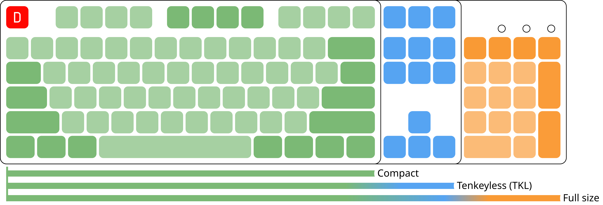
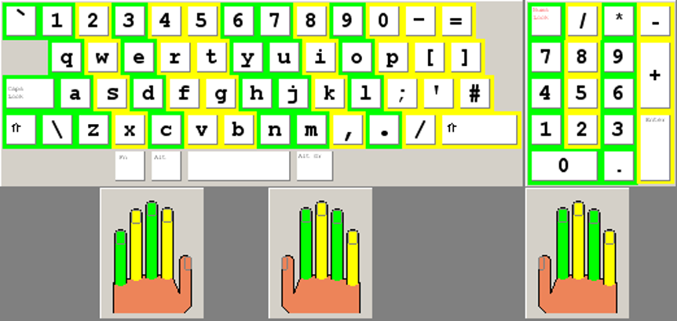
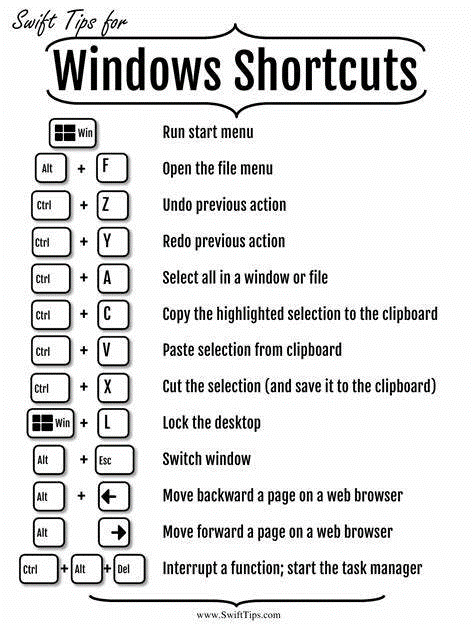

# L000--有备无患

!!! note 工欲善其事，必先利其器。

## 键盘

!!! info https://en.wikipedia.org/wiki/Computer_keyboard

    计算机键盘是一种内置或外接的输入设备，仿照打字机键盘设计，通过排列按钮或按键来充当机械杠杆或电子开关。
    
    自20世纪70年代以来，通过 teleprinter-style 键盘进行的交互取代了早期的穿孔卡片和纸带技术，成为计算机的主要输入方式；自80年代起，加入了计算机鼠标，2000年代后，又加入了触摸屏。

    键盘按键（按钮）通常刻有或印有一组字符，每次按键通常对应一个书面符号。然而，输入某些符号可能需要同时或按顺序按下并按住多个按键。
    
    虽然大多数按键用于输入字符（字母、数字或符号），但其他按键（如Esc键）则可促使计算机执行系统命令。
    
    在现代计算机中，按键的解释通常由软件处理：发送到计算机的信息（即扫描码 Scan code）仅告知计算机哪个（些）物理按键被按下或释放。

### 键盘类型

市面上提供不同类型的键盘，每种键盘的设计都侧重于满足特定需求的特定功能。如今，大多数全尺寸键盘采用三种不同的机械布局之一，通常简称为ISO（ISO/IEC 9995-2）、ANSI（ANSI-INCITS 154-1988）和JIS（JIS X 6002-1980），大致分别指代发布相关全球、美国和日本标准的组织。（注意观察回车键、Shift键、退格键、空格键的位置，为额外按键腾出空间）

### 键盘尺寸

现代键盘型号根据其给定标准包含固定数量的总键数，通常描述为101、104、105等键，并以全尺寸（full-size）键盘的名义销售。符合美国惯例的现代键盘通常有104个键，而105键布局在世界其他地区是常态。这一数字并非总被遵循，为了紧凑性或用户偏好，通常会省略单个按键或整个区域。最常见的选择是不包含小键盘（numpad），而小键盘通常可由字母数字区完全替代；这类设计被称为“无小键盘”（tenkeyless，或TKL）。笔记本电脑和无线外设通常缺少重复按键和很少使用的按键。功能键和方向键则几乎总是配备。

### 键盘布局

!!! info https://en.wikipedia.org/wiki/Keyboard_layout

    键盘布局是指计算机键盘、移动电话或其他计算机控制排版键盘的按键、图例或键义关联（key-meaning associations）在物理、视觉或功能上的任何一种特定排列。

    - **物理布局（physical layout）**是指键盘上按键的实际位置。
    - **视觉布局（visual layout）**是指这些按键上出现的图例（标签/labels、标记/markings、雕刻/engravings）的排列。    
    - **功能布局（functional layout）**是指由软件确定的、键盘所有按键的键义关联或键盘映射的排列；正是这一点（而非图例）决定了按键被按下时的实际响应。
    
    **标准键盘布局**因其目标书写系统、语言和使用场景而异，一些爱好者和制造商会创建非标准布局，以匹配个人偏好或实现扩展功能。

A typical 105-key computer keyboard, consisting of sections with different types of keys

_QWERTY_UK.svg.png)

!!! info https://en.wikipedia.org/wiki/QWERTY

    QWERTY（/ˈkwɜːrti/，发音为KWUR-tee）是一种拉丁文字字母的键盘布局；其名称来源于键盘顶部字母行前六个键的排列顺序：`Q-W-E-R-T-Y`。该设计是为在打字机上快速输入英语而演变而来的。

    QWERTY布局基于1874年 E. Remington and Sons 销售的 Sholes and Glidden 打字机所采用的布局。随着1878年 Remington No. 2 打字机的成功，该布局逐渐流行。截至今日，仍为事实上的标准，在计算机上广泛使用。

!!! danger 误区：QWERTY键盘布局不是“为了快而设计”，而是“因为不卡键而流行”。

    QWERTY的设计初衷是解决打字机卡键，而非提高打字速度。它的普及是**机械限制**、**商业推广**与**用户习惯**共同作用的结果。

    - 早期打字机的问题：19世纪的打字机采用机械连杆结构，当打字员快速敲击相邻键时，连杆会相互碰撞导致“卡键”（Typebar Jam）
    - Sholes 的解决方案：降低相邻键的敲击频率，从而减少卡键概率；如把“E”放在左上角，远离“R”“W”等常用字母；把“T”和“H”分开（“T”在顶行中间，“H”在中间行左侧）；将“O”和“I”等高频字母放在边缘位置
    - 这种设计刻意减慢了初始打字速度，但解决了机械故障问题

    替代布局的对比：奥古斯特·德沃夏克（August Dvorak）​ 设计了Dvorak布局（将常用字母集中在 home row，减少手指移动），声称能提高打字速度30%。据研究，QWERTY布局的打字效率约为30-50 WPM（每分钟单词数），而Dvorak布局可达到50-70 WPM，但两者的差距主要源于手指移动距离，而非绝对速度。

### 盲打练习

- 盲打练习是为了提高打字速度和准确性，同时也可以提高编程效率。
  - <https://www.typingclub.com/>
  - 有研究表明：盲打可以促进左右脑的平衡发展
    - 左手刷牙，左手用勺子，一个月后，可尝试左手用鼠标，每天20分钟即可

!!! tip 包含26个字母的最短英文句子

    - Heavy boxes perform quick waltzes and jigs. (36 letters)
    - The quick brown fox jumps over a lazy dog. (33 letters)
    - Pack my box with five dozen liquor jugs. (32 letters)
    - Jackdaws love my big sphinx of quartz. (31 letters)
    - The five boxing wizards jump quickly. (31 letters)
    - How quickly daft jumping zebras vex. (30 letters)
    - Quick zephyrs blow, vexing daft Jim. (29 letters)
    - Sphinx of black quartz, judge my vow. (29 letters)
    - Waltz, nymph, for quick jigs vex Bud. (28 letters)
    - Blowzy night-frumps vex'd Jack Q. (26 letters)
    - Glum Schwartzkopf vex'd by NJ IQ. (26 letters)

### 快捷方式

!!! info https://en.wikipedia.org/wiki/Table_of_keyboard_shortcuts

    在计算机领域中，键盘快捷键是计算机键盘上的一组按键序列或组合，用于调用软件中的命令。

    大多数键盘快捷键要求用户按下单个按键，或依次按下一系列按键。另一些键盘快捷键则需要同时按下并按住多个按键。

    **列表很长很长很长~~~，建议入内查看。**

