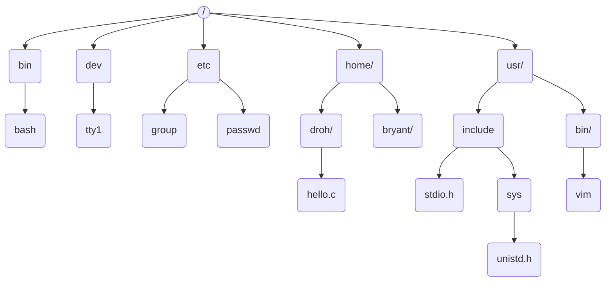

# 终端操作

> linux-help（Linux Shell简介），
>
> https://pku.instructuremedia.com/embed/06bda1b0-3342-4705-9c77-e279638f1af2
>
> 学linux命令的小游戏，每次找下一级登录口令
>
> https://overthewire.org/wargames/bandit/

**定义**：在 Linux 或 Unix 系统中，Shell 是一个命令行解释器，它接收用户的命令并将其发送给操作系统内核。

**功能**：Shell提供字符界面，可以执行程序、编译代码、控制和监测计算机的运行状态。

**重要性**：<mark>大多数底层功能的高效执行需要基于Shell</mark>，而不是图形界面（GUI）。因此，Shell在计算机基础学习中不可或缺。使用Shell能够帮助你更好地利用你的设备，提高工作效率。

我们主要讨论的是Linux环境下的Bash，也称为BASH (Bourne Again Shell)。在打开BASH后，你会看到命令提示符，它由多个部分组成：用户名、主机名、工作目录和"$"符号作为命令提示符。

在这里是rocky。打印当前用户还有一种方法，是`whoami`。第二部分是主机名，可以理解为计算机的名字，在这里是jensen。

```
(base) hfyan@HongfeideMac-Studio ~ % ssh rocky@10.129.242.98
Last login: Sat Feb 15 07:50:12 2025 from 162.105.89.132
[rocky@jensen ~]$ whoami
rocky
[rocky@jensen ~]$ pwd
/home/rocky
[rocky@jensen ~]$ 
```

可以使用`pwd` (print working directory) 打印当前工作目录，在这里 `/home/rocky`是工作目录，意思就是我们当前处在这个目录中。其他命令还有 `echo`回显，`cal`是打印今天的日历，`clear`清屏。

## 1. 快捷键和学习资源

使用快捷键来提升效率，快速编辑命令行内容。

**Ctrl + U**：删除光标前的所有字符。

**Ctrl + K**：删除光标后的所有字符。

**Ctrl + A**：定位到命令的首部。

**Ctrl + E**：定位到命令的尾部。

**Ctrl + R**：在命令历史记录中进行反向搜索。


快捷键可以减少你输入命令的麻烦。设想这样一种情况，键入了一个非常非常长的指令，但是敲到一半的时候，突然发现整个都错了，需要重新写，按退格键或者一直按着，但是这样子删光整一行，可能需要比较长的时间，可以使用快捷键  `ctrl + u`，删除光标下的所有字符一直到行首。与之相对应的 `ctrl + k`，删除光标下的字符直至行尾。

再比如安装软件如果发现 permission denied，因为你不是管理员用户，需要在前面加sudo。使用上下键来定位我们之前输入过的命令，然后 `ctrl + a` 定位到命令的首部，插入sudo，这时候你就可以直接按enter执行了。`ctrl + e` 回到整行的后面。

`trl + r`（reverse search in bash history）是一个非常重要的快捷键。

`ctrl + l` 与`clear`基本等效，但是它前面的东西都清除掉，不会清除当前行输入的命令。


对于学习资源，除了直接在命令后面加上`--help`获取简要信息外，还可以使用man指令查看详细的用户手册。比如说你不知道ls这个指令应该怎么用，可以直接 `ls --help`，更详细的，可以`man ls`。 man命令是“manual”的缩写，用于显示命令的手册页（manual pages），在这样的这个手册界面中，一般可以使用`vi`来定位浏览，j向下，k向上，如果你要在这个手册中搜索一些信息的话，可以先按正斜杠，然后再输入你要搜索的关键词，比如说line，然后按enter，这个时候所有的line都会被高亮，你再按n，也就代表next，就可以慢慢的向下搜索了。对于这些手册，可以用q来退出它，就是quit。

man也好，help也好，都不是非常的易读，也不是能在短时间内能够看完的，所以你就会想太长不看，有这样一个too long didn't read第三方软件。它可以提供简单常用的命令示例，而且只使用一句话来描述。比如说 `tldr ls`，就会看到打印了一些常用的参数组合。比如需要解压缩一个tar文件，参数都会比较长，初学可能都记不太住，`tldr tar`打印一些常见的解压缩以及压缩的指令的用法。

> 在 Linux 的 Shell 中，可以使用以下方法安装 `tldr`（命令行速查工具）：
>
> **方法 ：使用 npm 安装（推荐）**
>
> `npm` 是 Node.js 的包管理器，如果尚未安装，可以先安装 Node.js：
>
> ```
> sudo dnf install nodejs                         # Fedora
> 
> ```
>
> 然后安装 `tldr`：
>
> ```
> sudo npm install -g tldr
> ```


另外一个比较有用的命令叫info，以咨询一些信息。info是什么？叫做GNU Core Utils，是Linux中一些核心的小工具。

先安装

```
sudo npm install -g info
```

如果你运行 `info` 的话，会看到关于这个小工具的一个手册，里面有非常多有意思的工具。如果大家对shell的用法感兴趣的话可以探索，在网上也是有html版的，当你在这些文档中都找不到好用的信息的时候，可以上网搜索。推荐 https://unix.stackexchange.com/, https://stackoverflow.com/，比较容易能够获得有效的信息。


## 2. 与文件系统交互

在shell中最基础的命令可能是同文件系统进行交互，也就是资源管理器的功能。Linux文件系统一般遵循文件系统层次化标准FHS，在该标准中系统中的一切事物都被视为文件，包括目录，但目录的文件名会有/以示区别，尽管输入目录名称时候，有时候会省略它。

文件以竖形的结构组织在以根目录/为根的文件树中。一般而言，根目录的下一集目录的名字都是固定的。例如所有用户的家目录都存储在home/下。




访问文件系统需要路径的概念，它是指文件树上从某个节点到另一个节点的路径上，所有文件名字符串的连接。从当前工作目录开始的路径称为相对路径，以根目录开始的路径则称为绝对路径。

例如考虑上图中的 `hello.c` 的绝对路径和相对路径，绝对路径是/home/droh/hello.c
而如果我们以`home`为工作目录，那么相对路径为`droh/hello.c`。如果我们在 droh 这个用户的家中，则可以直接用 `hello.c`这个相对路径直接访问它。

有几个特殊路径也是比较常用的，这包括 `\`根目录和 `~` 家目录以及 `.` 当前目录和 `..` 上一级目录


### 文件操作

有了路径的概念后，可以开始文件系统的相关操作。在文件系统中浏览和定位主要是用ls和cd两个指定

- **`ls`**：列出目录内容。list directory contents
  - **`ls -a`**：列出所有文件，包括隐藏文件。隐藏文件一般以 . 打头。
  - **`ls -l`**：以长列表形式列出文件详细信息。
  
- **`cd`**：更改工作目录。change directory
  
  - **`cd ..`**：返回上一级目录。
  - **`cd ~`**：返回家目录。
  - **`cd -`**：返回上一次访问的目录。
  
- **`mkdir`**：创建目录。make directory

- **`touch`**：创建空白文件或修改文件时间戳。

- **`rm`**：删除文件。remove directory
  - **`rm -r`**：递归删除目录及其内容。<mark>慎重使用，删除后无法通过常规手段恢复</mark>。
  
  - **`rm -f`**：强制删除，不提示确认。
  
    > 命令中的通配符，* 匹配任意常的字符串，? 匹配一个字符
    >
    > 例如： rm -rf proxylab/*   表示删除proxylab下面的所有文件
    >
    > rmdir proxy lab/   删除空目录
  
- **`mv`**：移动文件或重命名文件。

- **`cp`**：复制文件。
  - **`cp -r`**：递归复制目录及其内容。

### 文件查看和执行

- **`cat`**：打印文件内容。concatenate
- **`less`**：分页查看文件内容。以类似于手册的方式来观察比较长的文件。可以使用手册中的那种键盘操作，按q退出
- **`head`**、**`tail`**：查看文件的开头或结尾部分。
- **`./`**：执行文件。执行文件采用./再加路径的方式。例如：`./bomb`

有关文件的查看，还有wordcount,find,dif等指令。


### 环境变量

难道不应该使用`ls`的完整路径来执行吗？系统使用环境变量中的path变量来完成这件事。所谓环境变量，一般是指在操作系统中用来指定运行环境的一些参数，比如临时文件夹位置，系统文件夹位置等等。

`echo $HOSTNAME` 打印主机名，`echo $PATH`打印环境变量PATH的值，可以得到一些用冒号分隔的绝对路径。当我们进入一个指令的时候，系统会在这些路径中先顺序搜索可执行文件名，如果找到了就执行。

```
[rocky@jensen ~]$ echo $HOSTNAME
jensen.instance.cloud.lcpu.dev
[rocky@jensen ~]$ echo $PATH 
/home/rocky/.local/bin:/home/rocky/bin:/usr/local/bin:/usr/bin:/usr/local/sbin:/usr/sbin
```

使用export这样的指令来改写环境变量

- **`export`**：设置环境变量。
- **`which`**：查找命令的路径。

### 文件权限

观察 `ls -la`的输出，由十位组成，第一位表示是否目录，剩下三位为一组，分别代表用户，用户组和其他人对这个文件的权限。文件权限包括读、写、执行，分别用rwx来表示，如果是一个短横线 - 则表示没有这个权限。对于目录来说，执行权限就是搜索，简单的说就是否能够 `cd` 到这个目录里。

```
[rocky@jensen ~]$ ls -la
total 28
drwx------. 6 rocky rocky  190 Feb 15 10:02 .
drwxr-xr-x. 3 root  root    19 Feb 14 04:51 ..
-rw-------. 1 rocky rocky 1162 Feb 15 07:50 .bash_history
-rw-r--r--. 1 rocky rocky   18 Apr 30  2024 .bash_logout
-rw-r--r--. 1 rocky rocky  141 Apr 30  2024 .bash_profile
-rw-r--r--. 1 rocky rocky  492 Apr 30  2024 .bashrc
-rw-------. 1 rocky rocky   42 Feb 15 09:52 .lesshst
-rw-r--r--. 1 rocky rocky  483 Feb 14 05:06 login.py
drwxr-xr-x. 4 rocky rocky   72 Feb 15 09:55 .npm
drwxr-xr-x. 2 rocky rocky   21 Feb 14 06:52 .ollama
-rw-------. 1 rocky rocky    7 Feb 14 05:07 .python_history
drwx------. 2 rocky rocky   29 Feb 14 04:51 .ssh
drwxr-xr-x. 3 rocky rocky   19 Feb 15 10:02 .tldr

```


- **`ls -l`**：查看文件权限。
- **`chmod`**：更改文件权限。
  - **`chmod u+x`**：给用户添加执行权限。即 chmod u/g/o +/- r/w/x，表示为用户user，用户组group，其他人other来添加加+删除-减三种权限

### 文件打包和压缩

谈到权限我们顺道就可以说到tar这个指令，常会用到tar格式的存档文件，它和zip甚至win rar的区别是它可以保留linux中的文件权限。tar是tape archive的缩写，就是在备份文件的时候常会用到磁带机。用tar打包之后一般会再进行压缩，扩展名为tar.gz指经过gzip算法压缩，而tar.bz2则是经过bzip2算法压缩。

- **`tar`**：打包文件。
  - **`tar czvf`**：打包并压缩文件。
  - **`tar xzvf`**：解压文件。

### 文件重定向和管道

shell中的程序通常有三个流，也就是输入input stream，输出output stream和错误error stream。一般来说它们都是默认定项到终端中显示的，可以把它们重定向到文件中或者通过管道传输到另外一个程序中，以方便操作和观察。

- **`<`**：重定向输入到文件。

  例如：$ ./bomb < 0.in 用0.in这个文件作为bom的输入。

- **`>`**：重定向输出到文件。

  例如：echo hello > hello.txt 把echo的输出重定向到hello.text中，这时候 cat hello.txt 就看到hello.txt文件中出现了 hello 这样的文字。

- **`>>`**：追加输出到文件。

  例如：echo hello2 >> hello.txt

- **`2>`**：重定向错误输出。

  例如： grep a b 2> log.txt 在文件b中查找模式a

- **`&>`**：可以同时重定向错误和标准输出。

  例如：grep a b &> log.txt

- **`|`**：管道，将前一个命令的输出作为后一个命令的输入。

  例如：./bomb < phase | grep solution  从输出中打印那些恰好含有solution这个词的那些行


#### Shell脚本示例重定向 01017:装箱问题

http://cs101.openjudge.cn/practice/01017

提交代码Wrong Answer，借助测试数据找到哪里出错。


进到测试数据目录

```
[rocky@jensen 1017]$ ls -l
total 92
-rw-r--r--. 1 rocky rocky 31873 Oct  1  2023 aamy.out
-rw-r--r--. 1 rocky rocky   586 Nov 26  2008 d.c
-rw-r--r--. 1 rocky rocky 34950 Nov 26  2008 d.in
-rw-r--r--. 1 rocky rocky  7805 Nov 26  2008 d.out
-rw-r--r--. 1 rocky rocky   465 Oct 11 08:49 e1.py
-rw-r--r--. 1 rocky rocky   217 Dec  6  2008 me.cpp
-rw-r--r--. 1 rocky rocky  1355 Oct 11 09:24 testing_code.py
[rocky@jensen 1017]$ ls ../../offlinejudge.zsh 
```


其中e1.py保存的是WA的程序

```python
import math
determine_2with3=[0,5,3,1]

while True:
    n1,n2,n3,n4,n5,n6 = map(int,input().split())
    if n1+n2+n3+n4+n5+n6==0:
        break
    boxes = n4+n5+n6+math.ceil(n3/4)
    spaceleft_for_b = n4*5 + determine_2with3[n3%4]
    if n2 > spaceleft_for_b:
        boxes += math.ceil(n2-spaceleft_for_b/9)
    spaceleft_for_a = (boxes-n6)*36-n5*25-n4*16-n3*9-n2*4
    if n1 > spaceleft_for_a:
        boxes += math.ceil(n1-spaceleft_for_a/36)
    print(boxes)

```


offlinejudge.zsh 是Shell脚本

```bash
cd $2
for i in *.in; do
	diff -y <(python3 "$1" < "$i")  "${i%.*}.out"
done
```


> 这段 Bash 脚本用于批量对比 Python 脚本的输出与预期输出。以下是其工作原理的详细解析：
>
> **代码解析**
>
> ```bash
> cd $2
> ```
> - 进入用户提供的目录 `$2`（脚本的第二个参数）。
>
> ```bash
> for i in *.in; do
> ```
> - 遍历当前目录下所有以 `.in` 结尾的文件（即输入文件）。
>
> ```bash
> diff -y <(python3 "$1" < "$i")  "${i%.*}.out"
> ```
> - `"$1"` 是脚本的第一个参数，表示 Python 脚本的路径。
> - `python3 "$1" < "$i"`：运行该 Python 脚本，并使用 `$i` 作为输入文件（`*.in`）。
> - `<(...)` 是 **进程替换**，将 Python 脚本的输出作为 `diff` 命令的一个输入。
> - `"${i%.*}.out"` 解析如下：
>   - `"${i%.*}"` 移除 `$i` 文件名的最后一个 `.` 及其后缀，即 `input.in` → `input`。
>   - `"${i%.*}.out"` 生成相应的 `.out` 文件名（如 `input.out`）。
> - `diff -y`：
>   - `diff` 比较两个文件的内容。
>   - `-y` 以 **并排（side-by-side）** 方式显示差异，方便人工对比。
>
> ---
>
> **使用示例**
>
> 假设目录结构如下：
> ```
> 1017/
> │── aamy.out
> │── d.c
> │── d.in
> │── d.out
> │── e1.py
> │── me.cpp
> │── testing_code.py
> ```
> 执行：
> ```bash
> bash ../../offlinejudge.zsh e1.py ./
> ```
> 脚本会：
> 1. 进入 `./` 目录。
> 2. 遍历所有 `.in` 文件：
>    - 对 `d.in`，运行 `python3 e1.py < d.in`，并将其结果与 `d.out` 进行 `diff -y` 对比。
>
> ---
>
> **总结**
>
> 此脚本适用于**测试 Python 脚本的标准输入/输出是否符合预期**，特别是在编程竞赛、自动化测试或算法开发中。
>
> 
>
> 


#### Python脚本管道示例27300:模型整理

http://cs101.openjudge.cn/practice/27300/


Wrong Answer


e1.py

```python
# -*- coding: utf-8 -*-
"""
Created on Fri Feb 14 19:58:10 2025

@author: Liren Chen
"""

n = int(input())
mx,sj = [],{}
for i in range(0,n):
    a,b = input().split('-')
    if a not in sj:
        sj[a] = [[],[]]
        mx.append(a)
        if b[-1]=='B':
            if '.' in b:
                b = float(b[0:-1])
            else:
                b = int(b[0:-1])
            sj[a][1].append(b)
        else:
            if '.' in b:
                b = float(b[0:-1])
            else:
                b = int(b[0:-1])
            sj[a][0].append(b)
    else:
        if b[-1]=='B':
            if '.' in b:
                b = float(b[0:-1])
            else:
                b = int(b[0:-1])
            sj[a][1].append(b)
        else:
            if '.' in b:
                b = float(b[0:-1])
            else:
                b = int(b[0:-1])
            sj[a][0].append(b)
mx.sort()
for i in mx:
    sj[i][0].sort()
    sj[i][1].sort()
    if len(sj[i][0])==0:
        print(i+': '+', '.join(str(j)+'B' for j in sj[i][1]))
    if len(sj[i][1])==0:
        print(i+': '+', '.join(str(j)+'M' for j in sj[i][0]))
    else:
        print(i+': '+', '.join(str(j)+'M' for j in sj[i][0])+', '+', '.join(str(j)+'B' for j in sj[i][1]))

```


```
[rocky@jensen 27300]$ ls
0.in   10.in   11.in   12.in   13.in   14.in   15.in   16.in   17.in   18.in   19.in   1.in   2.in   3.in   4.in   5.in   6.in   7.in   8.in   9.in   e1.py
0.out  10.out  11.out  12.out  13.out  14.out  15.out  16.out  17.out  18.out  19.out  1.out  2.out  3.out  4.out  5.out  6.out  7.out  8.out  9.out
```


testing_code.py

https://github.com/GMyhf/2024fall-cs101/blob/main/code/testing_code.py

```python
# ZHANG Yuxuan
import subprocess
import difflib
import os
import sys

def test_code(script_path, infile, outfile):
    command = ["python", script_path]  # 使用Python解释器运行脚本
    with open(infile, 'r') as fin, open(outfile, 'r') as fout:
        expected_output = fout.read().strip()
        # 启动一个新的子进程来运行指定的命令
        process = subprocess.Popen(command, stdin=fin, stdout=subprocess.PIPE)
        actual_output, _ = process.communicate()
        if actual_output.decode().strip() == expected_output:
            return True
        else:
            print(f"Output differs for {infile}:")
            diff = difflib.unified_diff(
                expected_output.splitlines(),
                actual_output.decode().splitlines(),
                fromfile='Expected', tofile='Actual', lineterm=''
            )
            print('\n'.join(diff))
            return False


if __name__ == "__main__":
    # 检查命令行参数的数量
    if len(sys.argv) != 2:
        print("Usage: python testing_code.py <filename>")
        sys.exit(1)

    # 获取文件名
    script_path = sys.argv[1]

    #script_path = "class.py"  # 你的Python脚本路径
    #test_cases = ["d.in"]  # 输入文件列表
    #expected_outputs = ["d.out"]  # 预期输出文件列表
    # 获取当前目录下的所有文件
    files = os.listdir('.')

    # 筛选出 .in 和 .out 文件
    test_cases = [f for f in files if f.endswith('.in')]
    test_cases = sorted(test_cases, key=lambda x: int(x.split('.')[0]))
    #print(test_cases)
    expected_outputs = [f for f in files if f.endswith('.out')]
    expected_outputs = sorted(expected_outputs, key=lambda x: int(x.split('.')[0]))
    #print(expected_outputs)

    for infile, outfile in zip(test_cases, expected_outputs):
        if not test_code(script_path, infile, outfile):
            break
```

<mark>这个程序**实际上使用了管道（pipe）** 来捕获 Python 子进程的输出</mark>


> **代码功能：**
>
> 此 Python 脚本的主要目的是**自动测试另一个 Python 程序的输出是否与预期结果一致**，适用于多组测试用例的批量验证。  
>
> **执行流程解析：**
>
> ---
>
> ① **导入必要模块**
>
> ```python
> import subprocess  # 用于启动子进程，执行 Python 程序
> import difflib     # 生成输出的差异比较
> import os          # 文件和目录操作
> import sys         # 处理命令行参数
> ```
>
> ---
>
> ② **核心函数：`test_code()`**
>
> ```python
> def test_code(script_path, infile, outfile):
> ```
> 该函数用于执行目标 Python 脚本，并将其输出与预期结果进行比对。  
>
> **(1) 构建 Python 命令**
>
> ```python
> command = ["python", script_path]
> ```
> - 通过 `subprocess` 模块构造执行命令，`script_path` 是目标 Python 脚本路径。  
> - 假设输入为 `python class.py`，此处 `script_path` 指的是 `"class.py"`。
>
> **(2) 读取输入和预期输出**
>
> ```python
> with open(infile, 'r') as fin, open(outfile, 'r') as fout:
>     expected_output = fout.read().strip()
> ```
> - 打开输入文件 `infile` 和输出文件 `outfile`。
> - `expected_output` 保存了去除首尾空白字符的预期结果。
>
> **(3) 运行目标脚本**
>
> ```python
> process = subprocess.Popen(command, stdin=fin, stdout=subprocess.PIPE)
> actual_output, _ = process.communicate()
> ```
> - **`subprocess.Popen()`** 启动一个子进程，执行目标 Python 脚本。
>     - **`stdin=fin`**：将输入文件作为 Python 程序的输入。  
>     - **`stdout=subprocess.PIPE`**：捕获程序的输出，方便与预期结果比较。  
> - **`process.communicate()`**：等待子进程完成，获取输出结果。
>
> **(4) 输出对比**
>
> ```python
> if actual_output.decode().strip() == expected_output:
>     return True
> ```
> - 将子进程输出解码为字符串并去除空白字符，若与预期输出一致，返回 `True`，表示该用例通过。
>
> **(5) 生成差异报告**
>
> 如果输出不一致，则输出差异信息：
> ```python
> print(f"Output differs for {infile}:")
> diff = difflib.unified_diff(
>     expected_output.splitlines(),
>     actual_output.decode().splitlines(),
>     fromfile='Expected', tofile='Actual', lineterm=''
> )
> print('\n'.join(diff))
> return False
> ```
> - **`difflib.unified_diff()`**：生成统一格式的输出差异。
>     - `expected_output.splitlines()`：将期望输出按行分割。  
>     - `actual_output.decode().splitlines()`：将实际输出按行分割。  
>     - `fromfile='Expected'` 和 `tofile='Actual'`：差异报告的标签。
>     - `lineterm=''`：避免多余的换行符。  
> - 通过 `print()` 打印出详细的输出差异信息。
>
> ---
>
> ③ **主程序入口**
>
> ```python
> if __name__ == "__main__":
> ```
> 确保以下代码仅在脚本被直接运行时执行。
>
> **(1) 检查参数**
>
> ```python
> if len(sys.argv) != 2:
>     print("Usage: python testing_code.py <filename>")
>     sys.exit(1)
> ```
> - **`sys.argv`** 读取命令行参数。  
> - 如果没有提供目标 Python 脚本路径，程序会提示正确用法并退出。
>
> ---
>
> **(2) 获取输入和输出文件**
>
> ```python
> files = os.listdir('.')
> ```
> - **`os.listdir()`** 获取当前目录下的所有文件列表。
>
> **筛选 `.in` 和 `.out` 文件：**
> ```python
> test_cases = [f for f in files if f.endswith('.in')]
> expected_outputs = [f for f in files if f.endswith('.out')]
> ```
> - 过滤出以 `.in` 结尾的输入文件和 `.out` 结尾的输出文件。
>
> **按数字顺序排序：**
> ```python
> test_cases = sorted(test_cases, key=lambda x: int(x.split('.')[0]))
> expected_outputs = sorted(expected_outputs, key=lambda x: int(x.split('.')[0]))
> ```
> - 按文件名前缀的数字部分排序，确保输入和输出文件一一对应。
>     - 例如：`1.in` 对应 `1.out`，`2.in` 对应 `2.out`。
>
> ---
>
> **(3) 执行测试**
>
> ```python
> for infile, outfile in zip(test_cases, expected_outputs):
>     if not test_code(script_path, infile, outfile):
>         break
> ```
> - **`zip()`** 将输入和输出文件配对遍历。  
> - 对每个输入输出文件调用 `test_code()`，若输出不匹配，立即终止测试（通过 `break` 退出循环）。  
>
> ---
>
> ④ **执行示例**
>
> 1. 运行命令：
> ```bash
> python ../../testing_code.py e1.py
> ```
>
> 2. **输出情况**：
> - **若所有测试用例均通过**，无输出。  
> - **若有差异**，例如 `0.in` 失败，输出类似以下结果：
> ```
> Traceback (most recent call last):
>   File "/mnt/data/20071224-POJTestData/4000_/27300/e1.py", line 23, in <module>
>     b = float(b[0:-1])
> ValueError: could not convert string to float: '1.3B'
> Output differs for 0.in:
> --- Expected
> +++ Actual
> @@ -1,2 +0,0 @@
> -Bert: 110M, 340M
> -GPT: 350M, 1.3B, 175B
> 
> ```
>
> ---
>
> **总结**
>
> 该脚本自动化测试 Python 程序的输出，具有以下特点：
> 1. **批量测试**：对所有 `.in` 文件进行测试并与相应的 `.out` 文件比对。  
> 2. **差异报告**：使用 `difflib` 输出详细差异，方便调试。  
> 3. **自动终止**：若发现错误，立即终止后续测试，节省时间。  
> 4. **兼容性强**：适用于任何标准输入/输出形式的 Python 程序测试。
>
> 
>
> 
>
> 


我们介绍了Shell的基本概念、常用命令、快捷键、文件操作、环境变量、文件权限、打包压缩以及重定向和管道。

## 3. vi编辑器

> 需要会用vi编辑器，编辑文件。https://www.runoob.com/linux/linux-vim.html
>
>  vim
>
>  Vim (Vi IMproved), a command-line text editor, provides several modes for different kinds of text manipulation.
>
>  Pressing i in normal mode enters insert mode. Pressing <Esc> goes back to normal mode, which enables the use of Vim commands.
>
>  See also: vimdiff, vimtutor, nvim.
>
>  More information: https://www.vim.org.
>
>  \- Open a file:
>
>   vim path/to/file
>
> 
>
>  \- Open a file at a specified line number:
>
>   vim +line_number path/to/file
>
> 
>
>  \- View Vim's help manual:
>
>   :help<Enter>
>
> 
>
>  \- Save and quit the current buffer:
>
>   <Esc>ZZ|<Esc>:x<Enter>|<Esc>:wq<Enter>
>
> 
>
>  \- Enter normal mode and undo the last operation:
>
>   <Esc>u
>
> 
>
>  \- Search for a pattern in the file (press n/N to go to next/previous match):
>
>   /search_pattern<Enter>
>
> 
>
>  \- Perform a regular expression substitution in the whole file:
>
>   :%s/regular_expression/replacement/g<Enter>
>
> 
>
>  \- Display the line numbers:
>
>   :set nu<Enter>
>
> 
>
> Q. vi里面敲: help，如果提示Sorry, no help for help.txt
>
> 在 Linux 上，你可以安装完整版 Vim：
>
> ```
> sudo apt install vim        # Ubuntu/Debian
> sudo dnf install vim        # Fedora
> sudo yum install vim        # CentOS
> brew install vim            # macOS (使用 Homebrew)
> ```
>
> 如果你在 Windows 上使用 `vim.exe`，请确保安装的是完整版 Vim（如 gVim）。
>
> 
>
> 
