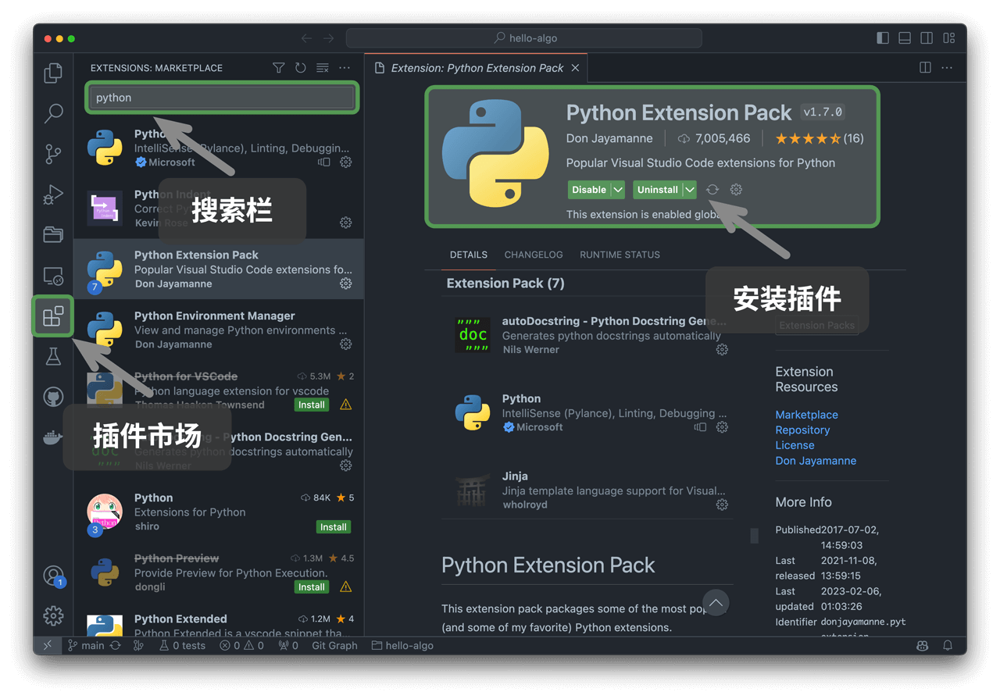

# L000--编程平台

## 三足鼎立

**Windows、macOS 与 Linux**

作为计算机学习的基础，大家需要了解不同操作系统（Operating System, OS）的特点与使用方式。课堂和作业环境以 **Linux (clab 云虚拟机)** 为统一平台，但同学们的本地电脑可能是 **Windows** 或 **macOS**。掌握三者的差异与联系，有助于后续课程中无障碍切换环境。

### Windows

- **特点**
  - 全球使用人数最多的桌面操作系统，界面友好。
  - 广泛用于办公、游戏和通用应用。
  - 软件兼容性最强（Office、QQ、微信、IDEA、VS 等）。
- **优点**
  - 图形化界面直观，上手门槛低。
  - 丰富的商业软件生态。
- **不足**
  - 系统底层封闭，命令行环境（PowerShell / CMD）相对弱于 Linux。
  - 部分开发环境需要额外配置（如编译器、包管理器）。
- **建议**
  - 日常可用 Windows 完成基础办公。
  - 开发课程项目时推荐：
    - **使用 WSL (Windows Subsystem for Linux)** 安装 Ubuntu，体验接近原生的 Linux 环境。
    - 或者直接使用学校提供的 **clab 云虚拟机**。

------

### macOS

- **特点**

  - 苹果电脑专属操作系统，基于 UNIX，内置强大的命令行（Terminal + zsh/bash）。
  - 稳定、安全，适合开发与科研。

- **优点**

  - <mark>与 Linux 命令体系接近，学习 Shell 命令几乎可以无缝迁移</mark>。
  - 自带开发工具链（clang、git、ssh、python）。
  - 适合开发 AI/科研项目，M1/M2/M3 芯片性能强劲。

- **不足**

  - 硬件价格较高。
  - 部分软件兼容性弱（尤其是 Windows 独占软件或游戏）。

------

### Linux

- **特点**
  - 开源、免费的类 UNIX 系统。
  - 广泛用于服务器、科研和云计算，是程序员和科研人员必备技能。
  - 课程统一环境（clab 虚拟机）即为 Linux。
- **优点**
  - 命令行（Shell）功能强大，脚本化、自动化能力突出。
  - 软件包丰富，社区支持活跃（如 Ubuntu、Fedora、RockyLinux）。
- **不足**
  - 图形界面体验较弱（但本课重点在命令行操作）。
  - 对初学者有一定学习曲线。
- **典型发行版**
  - **Ubuntu**：最常见，适合新手。
  - **Fedora / RockyLinux**：学校云虚拟机采用的企业级发行版。
  - **Arch Linux**：极客最爱，灵活但需要深厚功底。

------

### 三者比较

| 特点         | Windows                       | macOS                        | Linux (课程环境)                  |
| ------------ | ----------------------------- | ---------------------------- | --------------------------------- |
| 内核         | Windows NT                    | UNIX                         | Linux Kernel (开源)               |
| 用户界面     | 图形界面为主，命令行较弱      | 图形界面优雅，命令行功能强大 | 以命令行为核心                    |
| 学习曲线     | 最容易上手                    | 对程序员友好                 | 需要练习，但最接近服务器/科研环境 |
| 软件生态     | 办公/游戏丰富，开发需额外配置 | 原生开发工具链 + Apple 生态  | 包管理器安装一切，科研/服务器常用 |
| 推荐使用场景 | 日常学习、办公、娱乐          | 开发、科研、跨平台学习       | 服务器、OJ、分布式、AI项目        |

------

!!! note 👉 **结论**

    - **课堂/作业统一在 Linux (clab VM) 环境完成**，确保一致性与可移植性。
    - **Windows 用户**：推荐学习 WSL 或直接用云虚拟机。
    - **macOS 用户**：几乎可以无缝衔接 Linux，日常开发可直接在 Mac 上完成。
    - **Linux 用户**：本课程就是你的主场。

## 泾渭分明

### 字符界面（CLI）

字符界面（CLI, Command Line Interface）确实给编程带来了极大的自由度。在 Linux 下，使用终端可以方便地编写、编译、运行和调试各种语言的代码，比如 Python、C、C++ 等。以下是一些提升开发效率的技巧。


> **C++程序示例，C程序示例**
>
> 给我一个C++程序示例，一个C程序示例，以及在linux系统下编译、运行的方法。
>
> A. 以下是一个简单的 C++ 和 C 代码示例，并附上在 Linux 下的编译和运行方法。  
>
> ---
>
> **C++ 示例程序**
>
> 文件名：`hello.cpp`
>
> ```cpp
> #include <iostream>
> 
> int main() {
>     std::cout << "Hello, C++!" << std::endl;
>     return 0;
> }
> ```
>
> **编译 & 运行 (Linux)**  
>
> ```sh
> g++ hello.cpp -o hello_cpp
> ./hello_cpp
> ```
>
> ---
>
> **C 示例程序**
>
> 文件名：`hello.c`
>
> ```c
> #include <stdio.h>
> 
> int main() {
>     printf("Hello, C!\n");
>     return 0;
> }
> ```
>
> **编译 & 运行 (Linux)**  
>
> ```sh
> gcc hello.c -o hello_c
> ./hello_c
> ```
>
> 1. `g++` 用于编译 C++ 代码，而 `gcc` 用于编译 C 代码。
> 2. `-o` 选项用于指定输出的可执行文件名称。
> 3. `./hello_cpp` 和 `./hello_c` 运行编译生成的可执行文件。
>
> 
>
> 以下是一些提升开发效率的技巧：
>
> ---
>
> **1. Python（脚本语言）**
>
> Python 脚本不需要编译，直接运行：
>
> ```sh
> python3 script.py  # 运行 Python 脚本
> ```
>
> **工具**
>
> - `vim` / `nano` / `neovim`：终端文本编辑器
> - `ipython`：增强版 Python 交互环境
> 
>---
> 
>**2. C / C++（编译语言）**
> 
>在终端编写、编译和运行 C / C++ 程序：
> 
>**编译 & 运行 C**
> 
>```sh
> gcc program.c -o program
> ./program
> ```
> 
>**编译 & 运行 C++**
> 
>```sh
> g++ program.cpp -o program
> ./program
> ```
> 
>**工具**
> 
>- `gdb`：GNU 调试器
> 
> ---
> 
> **3. 调试**
>
> **C / C++ 调试**
>
> ```sh
>g++ -g program.cpp -o program
> gdb ./program
>```
> 
> **Python 调试**
> 
> ```sh
>python3 -m pdb script.py
> ```
>
> ---
> 
> **4. 高效开发环境**
>
> 在 Linux 终端下，可以结合多种工具提升开发体验：
>
> - **`tmux`** / **`screen`**：支持多窗口管理
>- **`vim` / `neovim`**：强大的代码编辑器，支持语法高亮
> - **`cmake`**：管理 C/C++ 项目构建
>- **`lldb`**：苹果推荐的调试工具（C++ / C）
> - **`autopep8`** / **`black`**：Python 代码格式化
> 
> ---
> 
> **5. 一键编译 & 运行（脚本化）**
>
> 对于 C/C++，可以写一个简单的 `run.sh` 脚本，自动编译和运行：
>
> ```sh
>#!/bin/bash
> g++ program.cpp -o program && ./program
>```
> 
> 然后赋予执行权限：
> 
> ```sh
>chmod +x run.sh
> ./run.sh
>```
> 
> ---
> 
> 字符界面让编程更加自由，不受 GUI 约束，适合高效开发和自动化。


### 图形界面（GUI）

### 集成开发环境（IDE）

#### vscode

推荐使用开源、轻量的 VS Code 作为本地集成开发环境（IDE）。访问 [VS Code 官网](https://code.visualstudio.com/)，根据操作系统选择相应版本的 VS Code 进行下载和安装。


VS Code 拥有强大的扩展包生态系统，支持大多数编程语言的运行和调试。以 Python 为例，安装“Python Extension Pack”扩展包之后，即可进行 Python 代码调试。安装步骤如下图所示。



#### pycharm

!!! note Pycharm调试

    在行号处点击，设置端点；然后点击右上角绿色小虫子debug模式运行。

    

    debug运行后，停在设置了短点的语句，变量中的值都显示出来。

    


## 虚拟机

虚拟机（Virtual Machine, VM）是一种通过软件模拟的、具有完整硬件系统功能的计算机系统，运行在一个完全隔离的环境中。虚拟机可以运行在物理计算机之上，允许用户在同一台硬件上运行多个操作系统和应用程序，极大地提高了资源利用率和灵活性。

**常见的本地虚拟机软件**

1. **Parallels Desktop**：主要为Mac用户提供了一个运行其他操作系统（如Windows、Linux等）的解决方案。

2. **VirtualBox**：是一款开源的虚拟化产品，由Oracle公司提供支持。它可以安装在多种操作系统上（如Windows、Linux等），并能够运行大量的客户操作系统。VirtualBox因其免费受到广泛欢迎。

### 创建云端虚拟机

!!! note **云端虚拟机**

    **申请地址**：https://clab.pku.edu.cn/

    **入门文档**：https://clab.pku.edu.cn/docs/getting-started/introduction
    
    CLab 是服务北大师生的云计算平台。提供基于云的虚拟实验室环境，供学生和研究人员用于教学、学习和科研目的。用户可以通过互联网访问这些虚拟机，执行编程实验、模拟等任务。

    无论是本地还是云端的虚拟机，它们都提供了灵活的计算资源分配方案，帮助用户测试软件、开发新应用或进行研究工作，而无需投资额外的硬件设施。随着云计算技术的发展，越来越多的服务迁移到了云端，使得用户可以从任何地方访问高性能的计算资源。

>  写程序时，通常使用vscode，安装插件，通过 SSH 登录到服务器，并借助 python/g++/gcc 进行解释、编译和调试。vscode 中可以打开终端（terminal），进行命令行操作。
>
>  现在，北京大学为大家提供了这样的实际环境——每位同学和老师都可以领取并使用一台云端虚拟机。该虚拟机配置为 4GB 内存、100GB SSD 硬盘，支持安装 Linux 系统，供大家自由探索和学习。
>
> Clab PKU 推荐的镜像是 RockyLinux 9，是一个基于 RHEL 的 Linux 发行版，有着良好的兼容性和稳定性。Ubuntu 24.04.1 和 Ubuntu 20.04 也是非常好的选择，有着良好的社区支持。
>
> 对于新手来说，Ubuntu 或 Linux Mint 可能是最好的起点，而对于寻求最新技术和功能的用户，Fedora 或 Arch Linux 则可能是更好的选择。对于企业级应用，CentOS Stream 或 openSUSE Leap 可以提供所需的支持和稳定性。

### Clab远程访问


> 在terminal中查看是否有公钥，
>
> ```
> ls .ssh/id_ed25519.pub
> ```
>
> 如果没有，运行 
>
> ```
> ssh-keygen -t ed25519
> ```
>
> - **保密通信**：`发送方` 用 `接收方的公钥` **加密** -> `接收方` 用 `自己的私钥` **解密**。
> - **身份验证（数字签名）**：`发送方` 用 `自己的私钥` **签名** -> `接收方` 用 `发送方的公钥` **验证**签名。

SSH密钥对: 点“导入密钥”，名称：YouNameOne,  公钥：把`.ssh/id_ed25519.pub` 文件中内容贴进来

#### unix上ssh登录，与RSA的公钥密钥关系？

> 在Unix系统上使用SSH进行登录时，RSA公钥和私钥的关系是非常重要的，因为它们是实现安全远程登录的基础。下面我将详细解释这个关系，并引用相关资料来支持说明。
>
> **SSH登录与RSA密钥对**
>
> 当用户希望通过SSH协议安全地连接到远程服务器时，可以采用两种主要的认证方式：口令认证和基于密钥的认证（也称为公钥认证）。这里我们关注的是基于密钥的认证，因为它更安全且便捷。
>
> **公钥认证流程**
>
> 1. **生成密钥对**：首先，在客户端机器上，用户需要生成一对RSA密钥（或其它非对称加密算法的密钥对），这可以通过`ssh-keygen -t rsa`命令完成。该命令会生成一个私钥文件（默认为`~/.ssh/id_rsa`）和一个对应的公钥文件（默认为`~/.ssh/id_rsa.pub`）。
>
> 2. **部署公钥**：然后，用户的公钥需要被添加到想要登录的远程服务器上的`~/.ssh/authorized_keys`文件中。这可以通过手动复制粘贴或者使用`ssh-copy-id user@remote_host`命令自动化完成。
>
> 3. **发起连接请求**：当用户尝试通过SSH连接到服务器时，客户端会发送其公钥给服务器进行验证。
>
> 4. **服务器验证**：服务器收到公钥后，会在`authorized_keys`文件中查找是否有匹配的公钥。如果有匹配项，则服务器会生成一个随机字符串并用找到的公钥加密后发送给客户端。
>
> 5. **客户端解密**：客户端收到加密后的字符串后，使用自己的私钥对其进行解密，并将解密后的结果发回给服务器。
>
> 6. **确认身份**：如果服务器能够验证返回的结果确实是之前发送的随机字符串，则认为客户端的身份得到了验证，允许登录。
>
> **RSA公钥和私钥的作用**
>
> - **公钥**：用于加密数据，任何人都可以获得它，因为它不包含任何敏感信息。在SSH场景下，公钥被用来加密服务器生成的挑战字符串。
>   
> - **私钥**：必须保密，只有持有者知道。私钥用于解密由公钥加密的数据。在SSH场景下，私钥被用来解密来自服务器的加密挑战字符串。
>
> **安全性考虑**
>
> 由于RSA加密算法的安全性依赖于大整数分解的困难性，因此确保私钥的安全至关重要。即使公钥公开，没有对应的私钥也无法解密数据。此外，为了进一步提高安全性，通常建议使用较长的密钥长度（如2048位或更高），以增加破解难度。
>
> 综上所述，SSH登录过程中使用的RSA公钥和私钥遵循非对称加密的基本原则，即公钥用于加密，私钥用于解密，这一机制保障了通信双方的身份验证和数据传输的安全性。

### Clab网络连接

云主机创建完成后，可以点击云主机的名称进入云主机详情页面。在这里可以看到云主机的状态、IP 地址等信息。我的IP是 `10.129.242.57`。


在terminal中登录云主机

```
ssh rocky@10.129.242.57
```

输入yes，回车


**在云端虚拟机中登陆网关，访问外网**

> 
>

```python
#!/usr/bin/env python3

import requests
import getpass

# 从命令行获取用户名和密码
username = input("请输入用户名: ")
password = getpass.getpass("请输入密码: ")

url = "https://its4.pku.edu.cn/cas/ITSClient"
payload = {
    'username': username,
    'password': password,
    'iprange': 'free',
    'cmd': 'open'
}
headers = {'Content-type': 'application/x-www-form-urlencoded'}

result = requests.post(url, params=payload, headers=headers)
print(result.text)
```

将程序保存为`login.py`，运行程序，根据提示输入用户名和密码，就可以登陆网关了。

运行程序

```
python login.py
```


> 要使用Vi编辑器粘贴并保存这段Python程序，并最终执行它，请按照以下步骤操作：
>
> **步骤 1: 打开终端**
>
> 首先，打开你的Linux终端。
>
> **步骤 2: 使用Vi创建新文件**
>
> 在终端中输入以下命令来使用Vi创建一个名为`login.py`的新文件：
> ```bash
> vi login.py
> ```
>
> **步骤 3: 进入插入模式**
>
> 进入Vi编辑器后，按下键盘上的 `i` 键进入插入模式（Insert Mode）。此时，你可以开始编辑文件内容了。
>
> **步骤 4: 粘贴代码**
>
> 将提供的Python代码复制到剪贴板中，然后在Vi编辑器内右键点击选择“粘贴”或者直接使用快捷键 `Ctrl+Shift+V` 来粘贴代码。确保所有代码都被正确地粘贴到了文件中。
>
> **步骤 5: 保存文件**
>
> 完成代码粘贴后，按下 `Esc` 键退出插入模式。然后输入以下命令保存文件并退出Vi编辑器：
> ```
> :wq
> ```
> 这里的 `:` 表示进入命令模式，`w` 是写入（保存）文件，`q` 是退出Vi编辑器。
>
> **步骤 6: 赋予执行权限**
>
> 为了能够运行这个Python脚本，你可能需要给它赋予执行权限。在终端中输入以下命令：
> ```bash
> chmod +x login.py
> ```
>
> **步骤 7: 执行程序**
>
> 最后，在终端中输入以下命令来运行这个Python程序：
> ```bash
> python3 login.py
> ```
> 注意：根据你的系统配置和安装的Python版本，可能需要使用 `python3` 而不是 `python` 来运行脚本。
>
> 现在，根据提示输入用户名和密码，就可以尝试登录网关了。


## Q & A

!!! question 部署虚拟机意义？

    部署虚拟机的意义主要体现在以下几个方面：  

    1. **与云端环境接轨，培养云计算使用习惯**  
     - 现代 AI 计算通常依赖云端 GPU 资源（如 AWS、Google Cloud、Azure），本地机器性能有限，无法高效运行大模型。  
        - 通过虚拟机模拟远程服务器环境，让大家<mark>熟悉 SSH 登录、环境配置、远程代码执行等操作</mark>，为后续使用云端资源打下基础。

    2. **隔离环境，避免污染本地系统**  
      - <mark>大模型部署涉及大量 Python 依赖（如 CUDA、PyTorch、Transformers），可能与本地已有环境冲突</mark>。  
       - 在虚拟机或 Docker 容器中运行，可以隔离依赖，避免影响日常工作环境。  

    3. **统一环境，减少兼容性问题**  
      - 本地机器硬件和系统差异较大（Windows/Linux/Mac），直接安装可能遇到驱动、CUDA 版本兼容性问题。  
       - <mark>通过虚拟机，大家可以在统一的 Linux 服务器环境下测试，确保配置一致，提高稳定性</mark>。  

    4. **便于迁移到云端服务器**  
      - 如果在本地虚拟机上调试成功，可以无缝迁移到真正的云服务器，而无需重新配置环境。  
       - 这样可以降低云端服务器的调试成本，提高使用效率。  

    **结论**  即使本地能跑通大模型，使用虚拟机仍然有 **环境隔离、与云端兼容、避免污染本机、提高可移植性** 等重要作用。部署虚拟机不仅是为了当前测试，更是为未来高效使用云端计算资源做准备。

> 部署虚拟机提供了一个分布式计算环境，在这个环境中每个虚拟机都可以作为一个独立的计算节点运行。当你有一个需要大量计算资源的任务时（比如分治任务），可以将这个任务分解成多个较小的子任务，并将这些子任务分配给不同的虚拟机来并行处理。这样做的好处是可以大幅减少总计算时间，因为多个子任务可以同时在不同的机器上执行。
>
> 利用部署的虚拟机集群来执行具体的计算任务。具体来说，一旦所有虚拟机都设置好并且可以通过SSH访问（即公钥已经添加到各个虚拟机的`authorized_keys`文件中），就可以通过编写脚本自动登录各个虚拟机、分发任务以及收集结果。

100个选课学生创建的虚拟机可以形成一个分布式系统

Clab.pku.edu.cn 云虚拟机，为每个用户提供 4 CPU, 4 GB RAM, 100 GB Disk。每个虚拟机的 .ssh/authorized_keys，保存了可以ssh 登录虚拟机的公钥。我们班100人，共 440 CPU, 440 GB, 11000 GB Disk。如果大家互相把每人的公钥（保存在各位本地机器 .ssh/id_ed25519.pub中的字符串），加入虚拟机的 authorized_keys，则 100个虚拟机可以形成一个分布式系统，可以用来计算分治任务。 

> <mark>分治任务</mark>是一种将问题分解成更小的子问题，分别求解这些子问题，然后合并这些子问题的解来得到原问题解的方法。一个典型的例子是计算一个大数组中所有元素的和。我们可以将这个数组分割成若干个较小的数组，每个虚拟机负责计算其对应的小数组的和，最后再将这些结果汇总起来得到整个数组的和。
>
> 登录云端服务器并利用云端计算资源，是现代开发和计算任务中常见的工作方式。一旦掌握了相关技能，便可以高效地使用云端服务器，拓展更多应用场景和计算任务。相比之下，本地设备通常性能有限，更适用于日常开发和基础调试。
>
