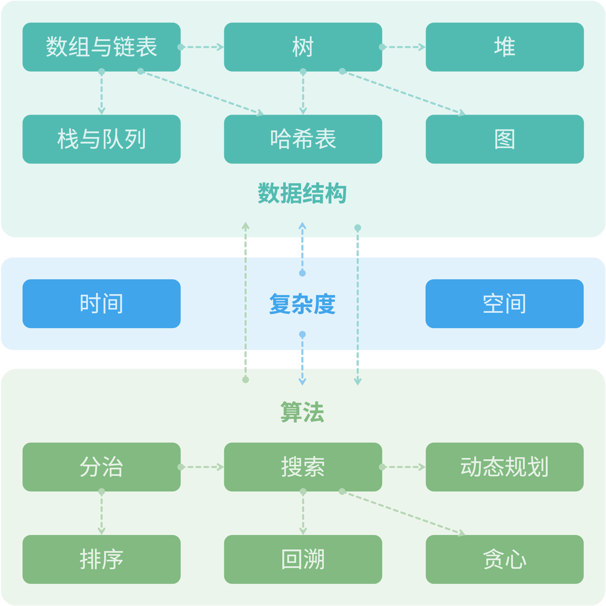
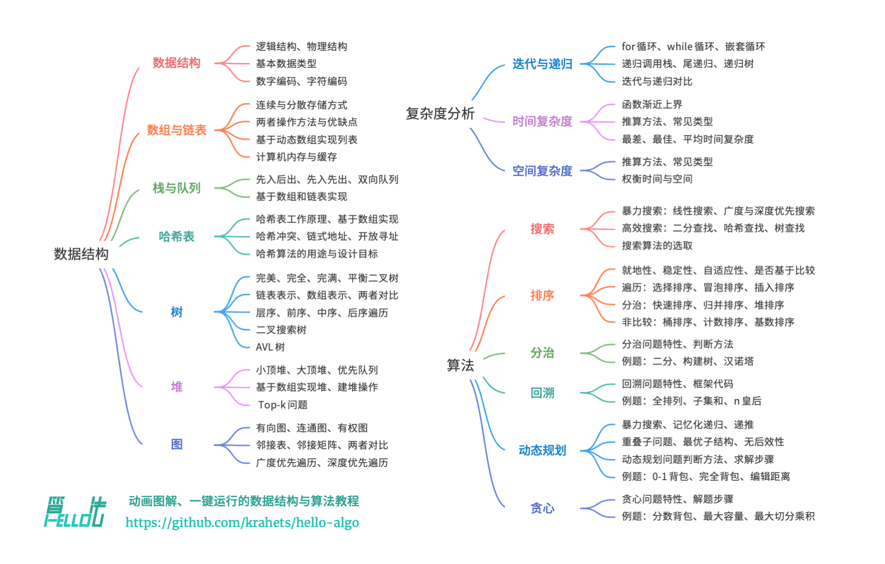
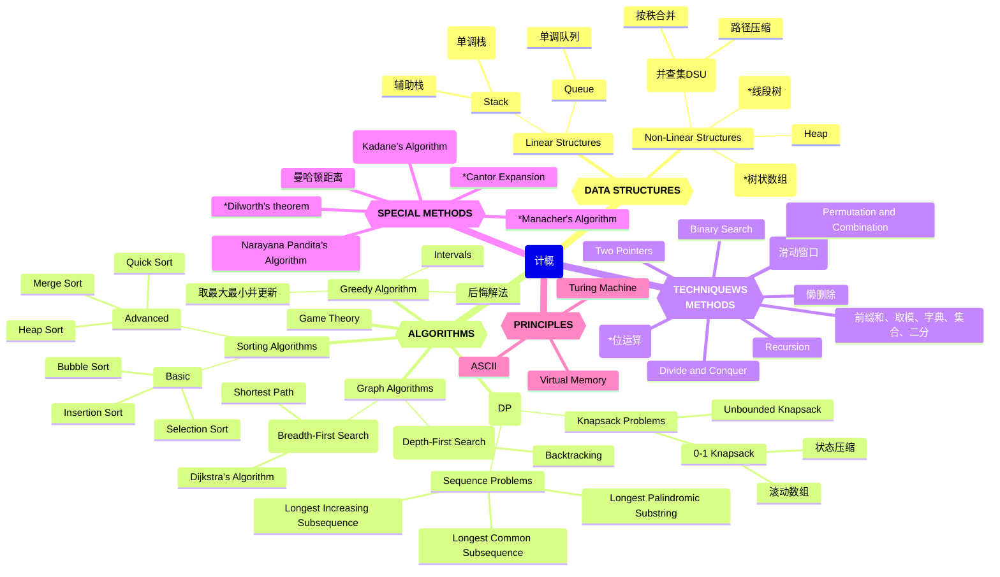
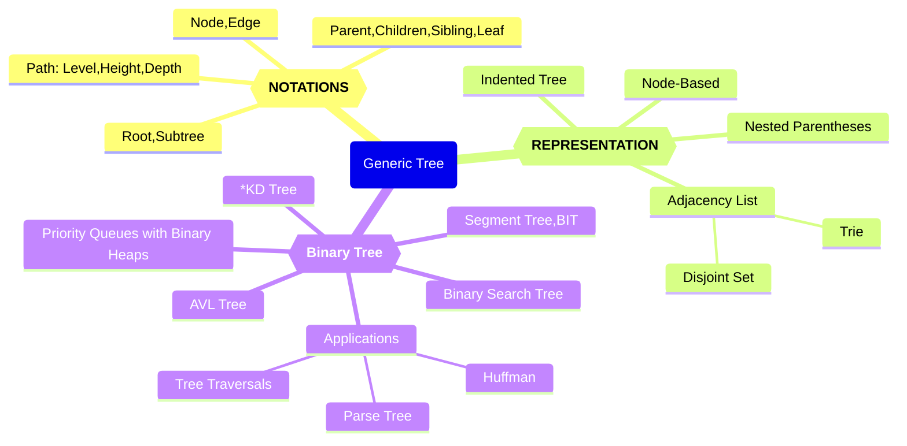
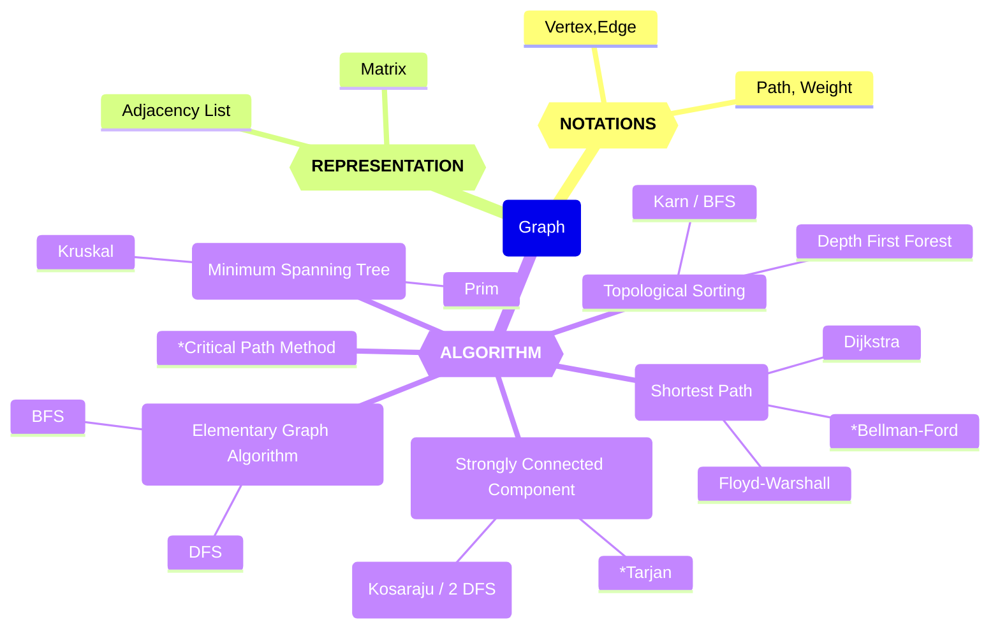

# 知识图谱（Knowledge Graph）

## Hello-Algo 内容结构

本书的主要内容如下图所示。

- **复杂度分析**：数据结构和算法的评价维度与方法。时间复杂度和空间复杂度的推算方法、常见类型、示例等。
- **数据结构**：基本数据类型和数据结构的分类方法。数组、链表、栈、队列、哈希表、树、堆、图等数据结构的定义、优缺点、常用操作、常见类型、典型应用、实现方法等。
- **算法**：搜索、排序、分治、回溯、动态规划、贪心等算法的定义、优缺点、效率、应用场景、解题步骤和示例问题等。

## 计概知识图谱

Knowledge Graph of 2024fall-cs101: Algo DS

## 树的知识图谱

树的知识图谱

## 图的知识图谱

图的知识图谱
